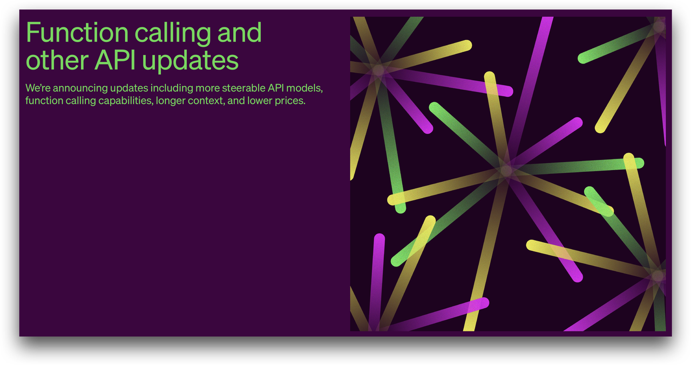
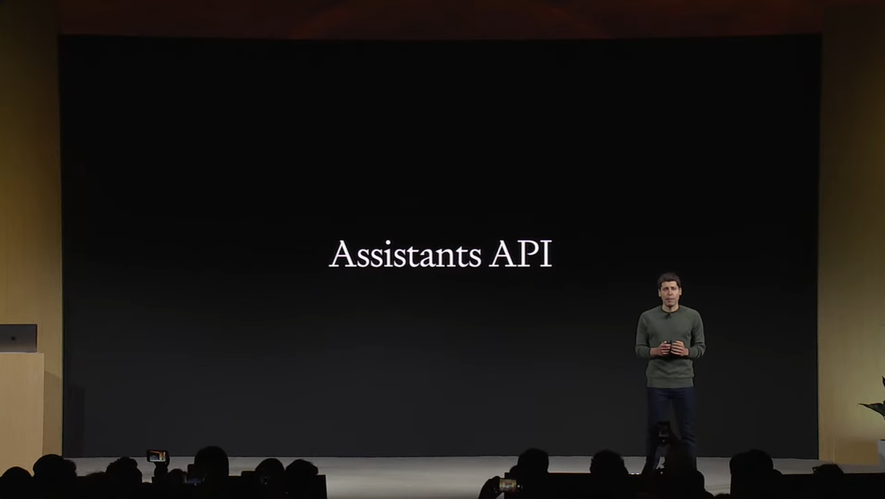
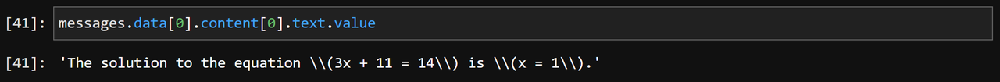
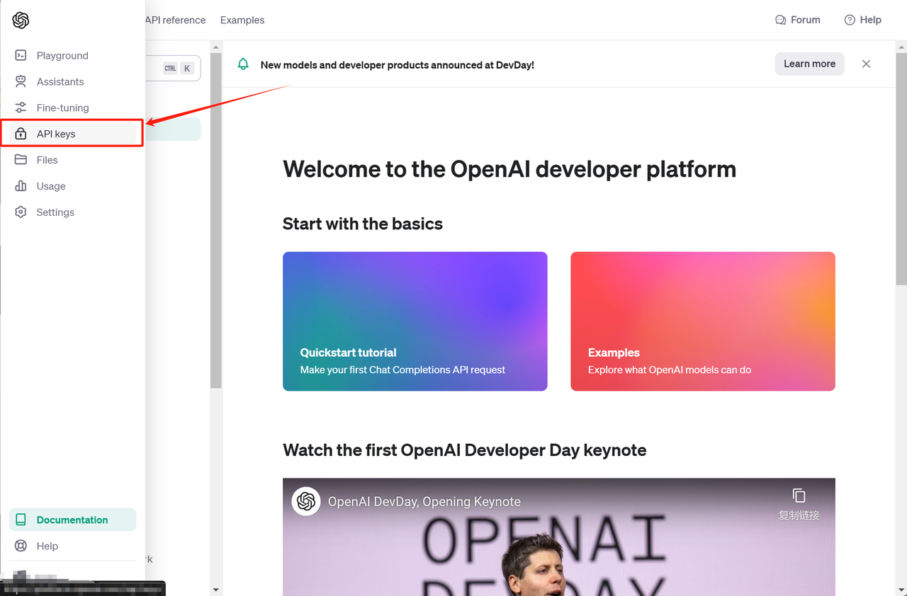
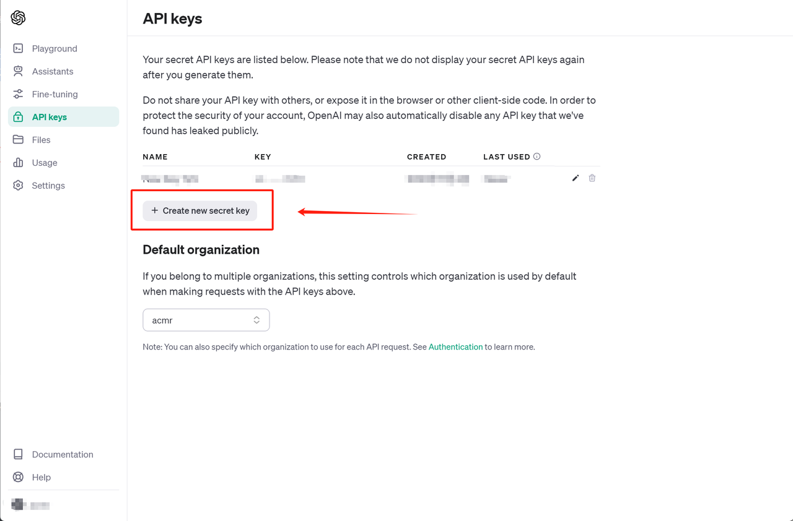
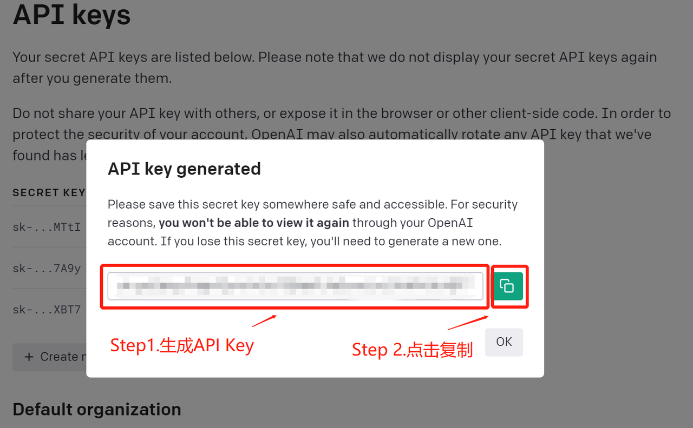
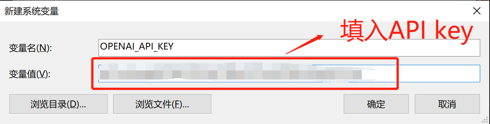
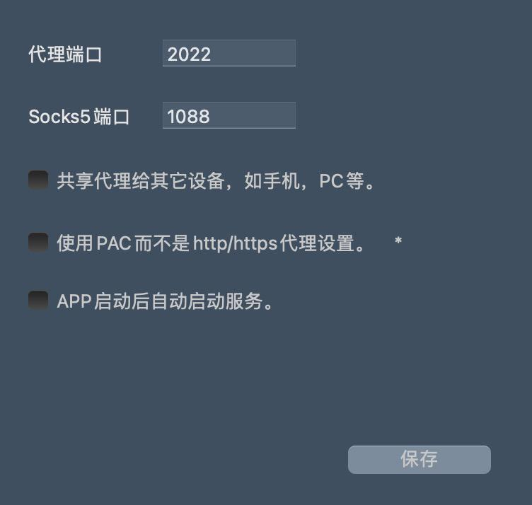
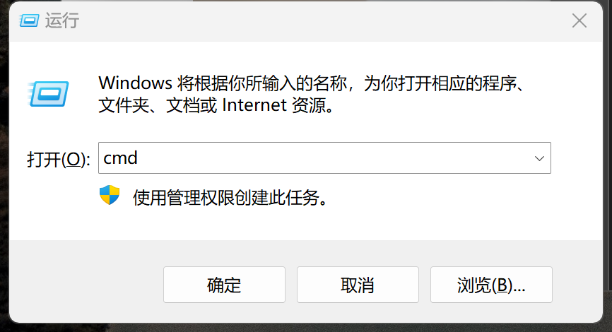
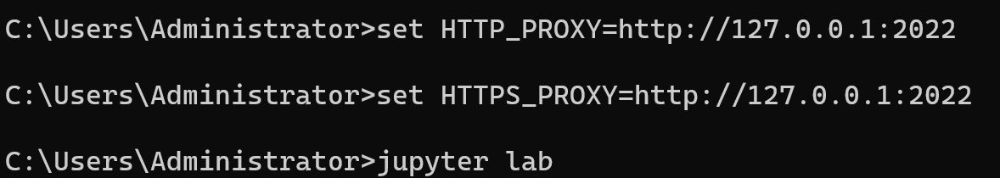

## Part 1.Assistants API功能介绍与基本调用方法

* AI Agent开发与Assistant API

  自ChatGPT掀起大模型技术浪潮，关于如何围绕大模型来搭建AI应用，就一直是业内技术探索的重要方向。从早期的AutoGPT小试牛刀，尝试将GPT-4和电脑环境打通，从而打造了第一款爆火的AI应用；再到LangChain横空出世，一举提出AI应用开发流程与统一开发框架；再到近段时间的AI Agent的概念提出与实践，短短不到一年时间内，围绕大模型的AI应用开发的这些理念可以说是百家争鸣。

  而于此同时，作为全球大模型技术的领军人物，OpenAI也一直在积极探索未来AI应用开发的“终极形态”。不过相比其他第三方机构，OpenAI拥有目前业内最强的大语言模型（之一），并且GPT系列模型也是目前AI应用最热门的模型之一。因此，在同时拥有大模型以及海量AI应用开发者经验的基础上，OpenAI对于AI应用开发流程的革新，稳健而致命。

  所谓稳健，指的是很长一段时间一来，OpenAI看起来并不急于提出自己的AI应用开发流程，哪怕是在LangChain如日中天之时，OepnAI仍然专注于GPT系大模型的研发、更新和迭代，而在AI应用功能探索方面，此前OpenAI的动作只局限与在gpt-0613版模型中新增了Function calling功能；而所谓致命，则是每次OpenAI的功能更新，总能直击AI应用开发的最核心痛点，从而根本性的重塑当前AI应用开发格局。此前OpenAI提出的Function calling功能，尽管看起来只是在模型中增加了一个可选的参数，但本质上则是一举实现了模型内容调用外部函数的功能，很明显，连接外部工具的能力就是AI应用开发流程中最为重要的能力，而Function calling功能的提出，也彻底改变了此前AI应用开发的流程，并且直接催生了诸如Open Interpreter一大批优秀的AI应用。



  而在2023年11月6日的OpenAI开发者大会上，OpenAI再次提出极具跨时代意义的AI应用开发API——Assistant API。不同于此前的Function calling只是在模型内部新增了一个内置功能，Assistant API是一个完整独立的AI应用开发API，当然，如果我们带入Agent思维惯性来看待Assistant API的话，Assistant API就是一个专门用于开发AI Agent的API，或者说这就是一个由OpenAI提出的AI Agent开发范式（从更严谨的角度来说，Assistant API其实是一个专门用于开发Agent的定制化API）。据Sam Altman介绍，借助Assistant API，能够大幅提高Agent开发效率。当然，采用另一套API来重新构建Agent，毫无疑问也就相当于是重塑目前通用的Agent开发流程，甚至是AI应用开发格局。



### 1.Assistant API功能介绍

  从功能实现层面来说，Assistant API是截至目前最完整、性能最强大的AI应用开发API，具体功能如下：

* 首先，Assistant API前所未有的能够调用OpenAI各模型的各项能力，包括可以调用Chat系列模型（即GPT系列模型）完成文本对话、调用DALL·E 3进行绘图、调用GPT-4-vision进行图像识别、以及调用Text-to-Speech模型进行语音转文字等，并且支持在一轮对话中调用不同模型；

* 其次，Assistant API还内置了代码解释器功能（Code interpreter）和海量文本信息提取功能（Knowledge retrieval）同时也一如既往支持借助Function calling进行模型功能层面拓展，此外，非常重要的是，Assistant API还支持在一轮对话中调用多个工具；

* 其三，此外对于开发者非常友好的一点是，Assistant API最小运行单元为持久化的线程对象（persistent Threads），因此在实际运行Assistant API时，不仅能可以精确控制每一步的执行过程，同时persistent Threads也会保留每轮对话的核心信息，并且当超出模型接收信息最大上下文限制时能够自动删除早期信息，从而实现对模型短期记忆的合理管理；

* 其四，Assistant API还能够直接连接OpenAI在线文档库，即如果用户将外部文档保存在OpenAI云空间内，则可以在调用Assistant API时实时访问文档库中的任意文件，甚至可以在不同线程中调用不同的文档。而在借助Assistant API的Knowledge retrieval功能，则可以让大模型实时获取这些文件信息，并且合理管理短期记忆；

  由此不难看出，Assistant API统一了OpenAI各模型的调用流程，并且将此前最为重要的一些大模型应用，例如本地知识库搭建、代码解释器等功能都集成为基础功能，并且一些较为复杂的开发流程，例如模型的长短期记忆管理等，也都得到大幅简化，并且还增强了工具调用性能。如此种种，也都是Assistant API号称能够大幅提升Agent开发效率的根本原因。

### 2.Assistant API初步使用

* 公开课课程大纲

  在基本了解Assistant功能特性之后，接下来我们就借助代码来简单调用Assistant API来完成一次对话。这里需要注意的是，在Assistant API坐拥如此强大功能的同时，Assistant API本身调用结构非常复杂，从创建一个Assistant到输出结果至少需要5步，且每个环节涉及参数众多，哪怕是要从结果中调用一个模型返回结果，都需要进行5层属性的调用，其内部结构之复杂可见一斑。



因此，本教程将拆分Assistant API的各部分功能进行分别介绍，公开课目录如下：

* **Part 1.Assistant API功能介绍与基本调用方法**：将重点介绍Assistant API核心功能、OpenAI环境准备、GPT系列模型基本调用流程、以及跑通一次最简单的Assistant API对话调用；

* **Part 2.Assistant API代码解释器及文本信息提取功能**：第二部分将重点介绍如何在Assistant API中加入外部工具，及尝试调用Assistant中已经集成的代码解释器功能（Code interpreter）和海量文本信息提取功能（Knowledge retrieval），同时介绍如何借助这些功能实现实时长文本信息提取，以及数据分析功能；

* **Part 3.Assistant API各模型调用方法**：将重点介绍如何在Assistant API中调用各不同模型，包括对话模型、多模态模型、TTS模型、DALL·E 3模型等，以完成不同类型任务；

* **Part 4.Assistant API中Function calling功能实现**：将重点介绍如何在Assistant API中通过Function calling来调用自定义的外部函数工具，同时介绍能应用于Function calling的外部函数工具编写方法，以及尝试实现Assistant API的多工具同步执行的功能。

此外，我还开设了《大模型实战课程》付费课程，付费版《大模型实战课程》为80+小时体系大课，完整涵盖GPT大模型技术模块、Function calling与Agent开发技术模块、开源大模型安装部署与应用模块、大模型微调与企业级实战案例5大模块，以及不定期前言技术内容加餐，零基础入门，直击大模型技术最前沿！


**>>> 扫码添加助教英英**
**>>> 回复“LLM”，领取公开课课件**
**>>> 回复“大模型”，领取代码、数据等\~**

  《大模型实战课程》最新增加GPT-4-vision多模态模型实战、Assistant API Agent开发实战，以及ChatGLM3模型介绍等最新内容。相比Assistant API公开课，完整版课程包含更加完整详细的参数解释和流程介绍、更加复杂的线程控制手段、更多Function calling外部工具函数编写、Agent开发的工程化方法以及企业级的Agent开发项目等。下图为某企业级Agent开发案例：


#### 2.1 新版OpenAI库安装与API-Key获取

  要使用OpenAI的Assistant API，首先需要安装openai库，并且拥有一个OpenAI开发者账号，此过程需要一些魔法，魔法内容需要大家自行搜索解决。

* OpenAI库的安装与更新

  首先关于openai库的安装与更新，首次openai的同学可以通过pip方式进行安装：

```python
%run pip install openai
```

而在安装过程中需要注意，目前openai库包含两个稳定版本，其一为0.28.1，其二为1.1.1，其中官方建议使用1.1.1版本openai库以获得最佳性能。因此安装完成后可以通过如下方式查看openai版本：

```python
import openai
openai.__version__
```

```plaintext
'1.1.1'
```

若低于1.0版，则需要先升级pip，然后再升级openai库。可以按照如下命令运行：

```python
%run pip install --upgrade pip
```

```python
%run pip install --upgrade openai
```

* OpenAI账号注册与API Key获取

  目前OpenAI账号注册及获取API Key有一定困难，推荐可以在某宝上搜索3.5 API或4.0 API，即可获得解决方案。

  而在获得了OpenAI账号之后，接下来则需要获取API-Key，作为每位用户单独的身份认证，也就是API-Keys，我们在openai主页https://platform.openai.com/ 中心可以创建和查看已经创建的openai的AIP keys。注意API-Key是调用模型和扣费的依据，各人需要妥善报关API-Key，防止被盗用从而造成不必要的经济损失。而如果API-Key被盗，也可以停止原有的API-Key，并创建新的Key。



&#x20;



&#x20;



  为了更加方便的调用API-Key以及在代码中隐藏API-Key，我们可以将其设置为系统环境变量，从而后续可以直接以调用变量名称的形式调用API-Key。

首先打开系统环境变量面板：


点击环境变量


点击新建系统变量：


设置环境变量。这里变量名可以统一设置为OPENAI\_API\_KEY，而变量值就是刚刚我们复制的API-Key。



保存重启电脑，方可使环境变量生效。

  重启电脑后，我们即可启动Jupyter测试能否在Jupyter环境下调用OpenAI大模型API。不过这里仍然需要注意的是，对于国内用户，是无法直接访问OpenAI的，需要让Jupyter在代理环境下启动，即需要令Jupyter可以通过代理来访问网络。具体设置方法如下：

  首先，启动魔法并设置全局代理模型。并查看代理服务器的地址和端口，例如服务器代理端口如下：



而对于代理地址，其实大多数代理都是借助本地回环进行代理，即127.0.0.1，因此当前魔法的代理地址和端口为：127.0.0.1:2022。

  而如何让Jupyter通过代理方式访问网络，最简单的方法就是利用cmd命令行启动jupyter。这里我们同时输入win+R开启运行页面，并在打开一栏中输入cmd并回车即可进入命令行：



然后在命令行中启动Jupyter，并且每次启动前输入代理环境设置，即按照如下命令顺序启动Jupyter：

```python
!set HTTP_PROXY=http://127.0.0.1:2022          
!set HTTPS_PROXY=http://127.0.0.1:2022     
!jupyter lab
```



* 在Jupyter中调用OpenAI API

  顺利启动Jupyter之后，即可测试能否顺利调用OpenAI大模型，测试代码如下：

```python
import os
import openai
```

```python
openai.api_key = os.getenv("OPENAI_API_KEY")
```

```python
from openai import OpenAI
client = OpenAI()
response = client.chat.completions.create(
  model="gpt-3.5-turbo-1106",
  messages=[
    {"role": "user", "content": "你好"}
  ]
)
```

```python
response.choices[0].message.content
```

```plaintext
'你好！有什么可以帮助你的吗？'
```

若能顺利运行，则说明当前已经能够连接OpenAI服务器。

  此外，需要注意的是，目前OpenAI并未对免费用户开放GPT-4的权限，因此若要体验Assistant API功能，则只能调用gpt-3.5-turbo-1106模型，且无法调用gpt-4-vision-preview等多模态模型。这里若想调用更多模型，可以考虑在某宝上搜4.0 API或4.0 PLUS，以获得解决方案。

#### 2.2 Assistant API调用基本流程

  在准备好基本运行环境之后，接下来我们尝试先创建一个非常简单的Assistant API来完成一次对话，从本质上来说，Assistant API的交互逻辑和此前我们看到的gpt-3.5-turbo-1106模型的对话逻辑几乎一样，都是用户和大模型之间进行消息交互，只不过Assistant API交互的方式会更加灵活，交互的信息也不止是文本类信息。本节的最后，我们尝试跑通一个Assistant API调用，并完成一次打招呼的对话。

* Step 1: 创建一个assistants对象

```python
client = OpenAI()
assistant = client.beta.assistants.create(
    model="gpt-4-1106-preview"
)
```

```python
assistant
```

```plaintext
Assistant(id='asst_vJsb9krbsFXSgEMyzj1XkNqF', created_at=1699539573, description=None, file_ids=[], instructions=None, metadata={}, model='gpt-4-1106-preview', name=None, object='assistant', tools=[])
```

```python
type(assistant)
```

```plaintext
openai.types.beta.assistant.Assistant
```

在创建assistant对象时，model参数为必选参数，代表当前调用模型的型号，此外还有name、instructions、tools等参数作为备选参数，用于设置当前assistant的名称、介绍与可调用的外部工具，相关参数的使用方法我们将在下一小节进行介绍。

* Step 2: 创建一个线程

  第二步则需要进一步创建一个线程，线程对象是控制assistant运行过程、保留assistant短期记忆的关键对象，是一个持久化的线程，并且该对象在很大程度上还保留了Python中线程对象的一些特性。

```python
thread = client.beta.threads.create()
```

```python
thread
```

```plaintext
Thread(id='thread_L6ENIJ1h8iGjW0q8kDGgIYjQ', created_at=1699539822, metadata={}, object='thread')
```

```python
type(thread)
```

```plaintext
openai.types.beta.thread.Thread
```

* Step 3: 将对话消息添加到线程中

```python
message = client.beta.threads.messages.create(
    thread_id=thread.id,
    role="user",
    content="你好呀"
)
```

```python
thread.id
```

```plaintext
'thread_L6ENIJ1h8iGjW0q8kDGgIYjQ'
```

```python
message
```

```plaintext
ThreadMessage(id='msg_znOBpioAhmejyvPMsX7IBo9U', assistant_id=None, content=[MessageContentText(text=Text(annotations=[], value='你好呀'), type='text')], created_at=1699539873, file_ids=[], metadata={}, object='thread.message', role='user', run_id=None, thread_id='thread_L6ENIJ1h8iGjW0q8kDGgIYjQ')
```

这里我们相当于是创建了一个和线程绑定message，这个message仍然保留了Chat模型多角色对话的基本属性，即需要区分发送消息者（user），以及消息内容（content）。

而若要从一个message中提取具体的消息内容，则需要通过以下方式实现：

```python
message.content
```

```plaintext
[MessageContentText(text=Text(annotations=[], value='你好呀'), type='text')]
```

```python
message.content[0]
```

```plaintext
MessageContentText(text=Text(annotations=[], value='你好呀'), type='text')
```

```python
message.content[0].text
```

```plaintext
Text(annotations=[], value='你好呀')
```

```python
message.content[0].text.value
```

```plaintext
'你好呀'
```

* Step 4: 设置预运行对象

  而在创建完一个包含message的线程之后，接下来即可创建一个run对象。所谓run对象，其实可以将其理解为用于抽象表示线程状态的对象，创建run对象则代表某assistant的某个线程进入到准备运行的状态。当然，我们也可以将run对象理解为assistant内部任务分配对象，当创建一个run对象时，则代表接下来准备执行某任务。

这里可以采用threads.runs.create来创建一个run独享：

```python
run = client.beta.threads.runs.create(
  thread_id=thread.id,
  assistant_id=assistant.id,
)
```

```python
run
```

```plaintext
Run(id='run_WlomkorypPdkcp6CuCTMsnm2', assistant_id='asst_vJsb9krbsFXSgEMyzj1XkNqF', cancelled_at=None, completed_at=None, created_at=1699540035, expires_at=1699540635, failed_at=None, file_ids=[], instructions=None, last_error=None, metadata={}, model='gpt-4-1106-preview', object='thread.run', required_action=None, started_at=None, status='queued', thread_id='thread_L6ENIJ1h8iGjW0q8kDGgIYjQ', tools=[])
```

```python
type(run)
```

```plaintext
openai.types.beta.threads.run.Run
```

而在创建完一个run对象之后，该对象并不会直接运行，而是会出于等待运行的状态：

```python
run.status
```

```plaintext
'queued'
```

此时我们只有run一个run对象，才能修改其状态。当一个run对象10分钟内没有被run，则会出于过期状态。不同这里进一步细分run对象的不同状态，其本质也是为了开发者能够更好的管理一个assistant的运行状态。

```python
run.id
```

```plaintext
'run_WlomkorypPdkcp6CuCTMsnm2'
```

* Step 5.完成线程运行

  接下来我们就尝试运行当前这个线程，即调用threads.runs.retrieve方法来完成某个run对象的执行：

```python
run = client.beta.threads.runs.retrieve(
  thread_id=thread.id,
  run_id=run.id
)
```

```python
run
```

```plaintext
Run(id='run_WlomkorypPdkcp6CuCTMsnm2', assistant_id='asst_vJsb9krbsFXSgEMyzj1XkNqF', cancelled_at=None, completed_at=1699540037, created_at=1699540035, expires_at=None, failed_at=None, file_ids=[], instructions=None, last_error=None, metadata={}, model='gpt-4-1106-preview', object='thread.run', required_action=None, started_at=1699540035, status='completed', thread_id='thread_L6ENIJ1h8iGjW0q8kDGgIYjQ', tools=[])
```

执行完毕后，run对象状态如下：

```python
run.status
```

```plaintext
'completed'
```

```python
run.id
```

```plaintext
'run_WlomkorypPdkcp6CuCTMsnm2'
```

而此时，模型返回的信息就会被保留在此前创建的线程对象thread中：

```python
thread
```

```plaintext
Thread(id='thread_L6ENIJ1h8iGjW0q8kDGgIYjQ', created_at=1699539822, metadata={}, object='thread')
```

```python
message.content
```

```plaintext
[MessageContentText(text=Text(annotations=[], value='你好呀'), type='text')]
```

而要提取thread中保留的模型返回结果，则需要采用threads.messages.list方法进行提取：

```python
messages = client.beta.threads.messages.list(
  thread_id=thread.id
)
```

```python
messages.data
```

```plaintext
[ThreadMessage(id='msg_HhdOmzwxPYtL4GHyPhu7VQCM', assistant_id='asst_vJsb9krbsFXSgEMyzj1XkNqF', content=[MessageContentText(text=Text(annotations=[], value='你好！很高兴见到你。有什么问题或者话题需要探讨吗？我在这里帮助你。'), type='text')], created_at=1699540036, file_ids=[], metadata={}, object='thread.message', role='assistant', run_id='run_WlomkorypPdkcp6CuCTMsnm2', thread_id='thread_L6ENIJ1h8iGjW0q8kDGgIYjQ'),
 ThreadMessage(id='msg_znOBpioAhmejyvPMsX7IBo9U', assistant_id=None, content=[MessageContentText(text=Text(annotations=[], value='你好呀'), type='text')], created_at=1699539873, file_ids=[], metadata={}, object='thread.message', role='user', run_id=None, thread_id='thread_L6ENIJ1h8iGjW0q8kDGgIYjQ')]
```

```python
len(messages.data)
```

```plaintext
2
```

此时即可解析大模型返回的结果：

```python
messages.data[1].content
```

```plaintext
[MessageContentText(text=Text(annotations=[], value='你好呀'), type='text')]
```

```python
messages.data[0].content
```

```plaintext
[MessageContentText(text=Text(annotations=[], value='你好！很高兴见到你。有什么问题或者话题需要探讨吗？我在这里帮助你。'), type='text')]
```

至此，我们就完成了一次Assistant API的调用。

* 为何Assistant API对话效果更加复杂

  当然，相信用不少小伙伴看到这里会觉得Assistant API的调用远比Chat模型调用更加复杂，需要解释的是，这种更加复杂的设定，其实都是为了能够更加顺利的构建一个稳定的Agent应用。举个例子，当一个班只有几十号人的时候，我们用人名即可确定每个人的身份，而如果是全国十几亿人，则需要通过更加复杂的身份证来验证人的身份。

  而对于Assistant API，其执行流程中拆解的每一步其实都是至关重要的，例如为何要区分message对象和thread对象，其实是为了更好的管理模型的短期记忆；而为何需要在大模型的外层再创建一个assistant对象，则是为了摆脱在以往的Agent构建过程中，“记忆是模型功能唯一区分”的困境；而之后的run对象，则是为了更好的控制模型运行流程，以确保能够稳定的获得结果。而在Assistant API出现之前，上述每一点都需要耗费大量的代码才能完成。

  无论如何，这里我们已经完成了一次Assistant API的调用，在下一小节中，我们将继续在Assistant中加入toole功能，即尝试调用Assistant中已经集成的代码解释器功能（Code interpreter）和海量文本信息提取功能（Knowledge retrieval），同时介绍如何借助这些功能实现实时长文本信息提取，以及如何借助Assistant API快速构建一个数据分析Agent。我们下一小节见！

此外，我还开设了《大模型实战课程》付费课程，付费版《大模型实战课程》为80+小时体系大课，完整涵盖GPT大模型技术模块、Function calling与Agent开发技术模块、开源大模型安装部署与应用模块、大模型微调与企业级实战案例5大模块，以及不定期前言技术内容加餐，零基础入门，直击大模型技术最前沿！


**>>> 扫码添加助教英英**
**>>> 回复“LLM”，领取公开课课件**
**>>> 回复“大模型”，领取代码、数据等\~**

  《大模型实战课程》最新增加GPT-4-vision多模态模型实战、Assistant API Agent开发实战，以及ChatGLM3模型介绍等最新内容。相比Assistant API公开课，完整版课程包含更加完整详细的参数解释和流程介绍、更加复杂的线程控制手段、更多Function calling外部工具函数编写、Agent开发的工程化方法以及企业级的Agent开发项目等。下图为某企业级Agent开发案例：


