## 课程说明：

* 体验课内容节选⾃[《2025⼤模型Agent智能体开发实战》](https://appze9inzwc2314.h5.xiaoeknow.com/v1/goods/goods_detail/p_67472baee4b0694c3c6fc88a?type=3\&channel_id=)完整版付费课程

体验课时间有限，若想深度学习⼤模型技术，欢迎⼤家报名由我主讲的[《2025⼤模型Agent智能体开发实战》](https://appze9inzwc2314.h5.xiaoeknow.com/v1/goods/goods_detail/p_67472baee4b0694c3c6fc88a?type=3\&channel_id=)：

此外，公开课全部课件，以及项目代码、数据等学习资料，扫码⬆️联系助教即可领取～

***

# **1.本地MySQL安装过程**

* &#x20;MySQL下载和安装

很多年前， MySQL的安装过程一度是很多数据科学初学者的噩梦，不仅因为安装过程需要涉及配置   服务账户、设置环境变量等复杂环节，更是因为MySQL并不仅仅是一个独立的软件，而是一整套关系型   数据库服务，其初始软件架构是为了满足企业级服务器应用而设计，因此对于MySQL （以及其他大多数   数据库软件）来说，都是服务端和客户端分离的架构，即如果是在企业生产环境下，服务器端需要安装   MySQL Server组件，负责提供数据库服务，而技术人员电脑上则需要安装MySQL Client相关组件，用于 调用服务器上的MySQL服务。当然，既然是调用服务器上的服务，就还会涉及到通信规则设置、账户设   置等，并且，伴随着关系型数据库管理复杂程度不断提升，单纯的SQL代码编辑环境已经不能满足技术人 员的需求，因此还需要进一步安装图形化数据库管理工具，如MySQL Workbench，而如果是个人用户

本地安装MySQL，则需要同时安装Server和Client相关组件，从而能够在本地开启MySQL服务，并在本 地连接MySQL进行数据库操作和管理，可想而知对于初学者而言，要一个个下载种类繁多、功能各异的 组件，还要跑通整个MySQL开启服务到调用服务的流程，肯定是个非常复杂的流程。

不过好在，经过数年的发展和调整，伴随着用户群体越来越庞大，其安装流程和安装方法逐渐化繁  为简，直至目前，除了可以单独下载各个组件并逐个进行安装外，  MySQL还提供了一种非常便捷的一站 式安装方法，即我们只需要在MySQL官网下载一个Installer即可一步到位完成MySQL相关的各组件的安 装，并且支持多种不同类型的安装模式（如Server模式或Client模式等），同时还支持在Installer内完成 初始账户配置等。因此，课程里我们都统一采用Installer进行MySQL安装，这里我们点击链接进入

MySQL官网主页即可下载Installer：<https://dev.mysql.com/downloads/installer/>

这里我们选择MySQL 8版本进行下载和安装，不同操作系统的安装流程类似，需要注意的是Installer支持 两种不同的安装模式， 一种是在线安装，这种模式的安装包很小，但会在实际执行安装时一边下载一边   安装；另一种则是本地版本安装，安装包较大，支持离线安装。两种安装模式安装流程没有区别，推荐   选择离线安装模式Installer下载。下载过程无需开启魔法，下载过程非常流畅，不用担心网络问题。

这里需要注意的是，目前MySQL 8.1已于2023年7月正式发布，但并不支持通过Installer安装，需 要单独安装与之关联的各个组件。考虑到其过程较为繁琐，且8.1新增功能也并不是本次课程中的 教学重点，感兴趣的同学可以自行查阅MySQL官网<https://www.mysql.com/>并进行8.1版本的下 载和安装。

然后在新弹出的页面点击跳过注册并直接下载选项：

接下来点击下载好的Installer即可开始进行安装：

稍等片刻即可进入安装页面：

首次运行Installer时会提示选择安装模式，根据此前介绍， MySQL软件架构是为了满足企业生产环境需   求，所以是Server（服务端）和Client  （客户端）分离的模式，因此这里如果选择Server模式，则会安装 专门用于提供MySQL服务相关的组件，而如果选择Client模式，则会只安装一些数据库管理工具和数据   库连接组件。而根据此前的介绍，由于是在本地个人电脑中安装MySQL，因此需要选择full模式，同时安 装Server组件和Client组件：

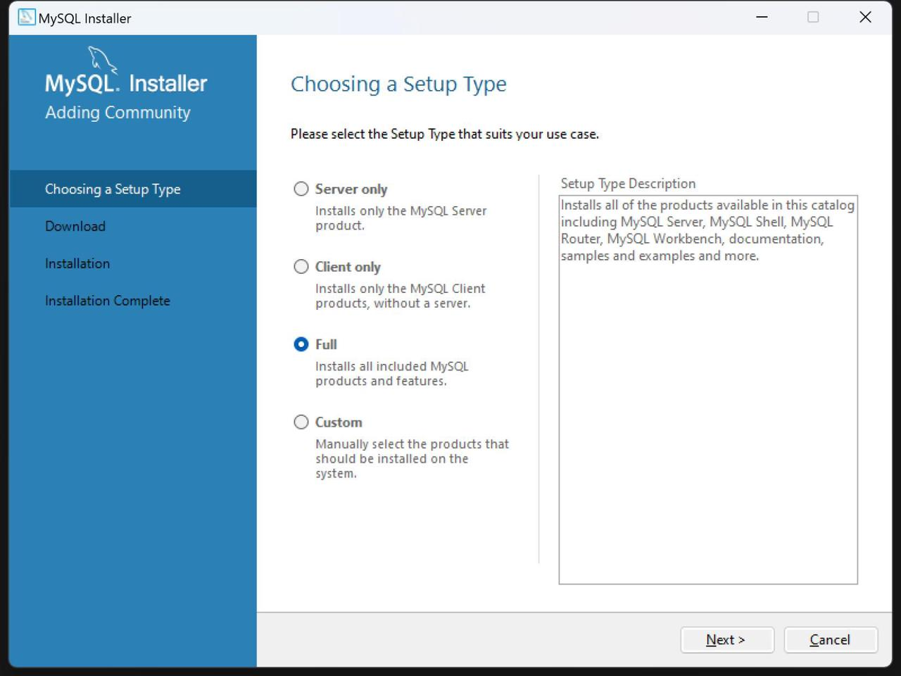

此外这里的Custom模式指的是可以自定义安装组件，并不建议初学者选择。

接下来进入到安装环节，直接点击next即可：

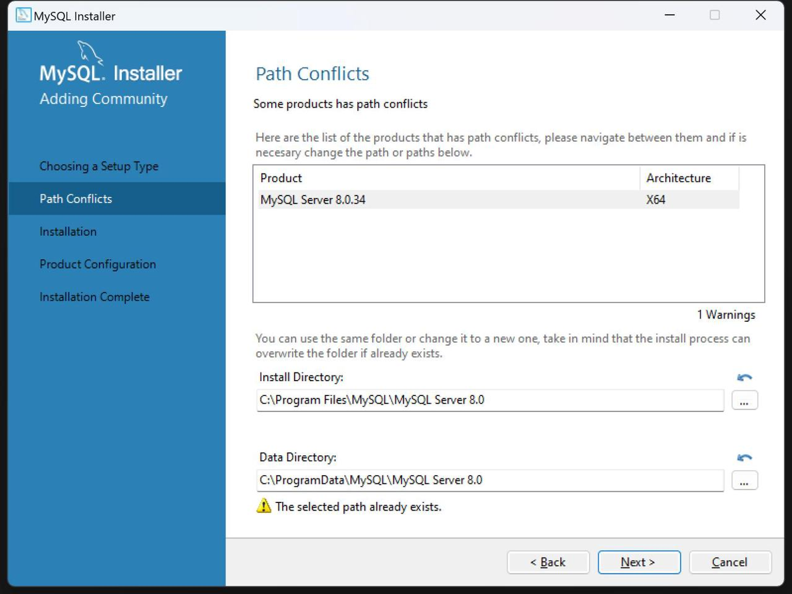

这里需要注意，正常情况下首次安装是不会有上述警告信息的，即存在有路径目标文件夹已经存在 的情况。这里是因为我的电脑曾经安装过（好几遍）  MySQL，因此会留有此前安装配置的文件

夹。这里也可以手动删除该文件夹，以消除警告信息。

然后检查当前安装模式下所需要安装的组件，并点击安装：

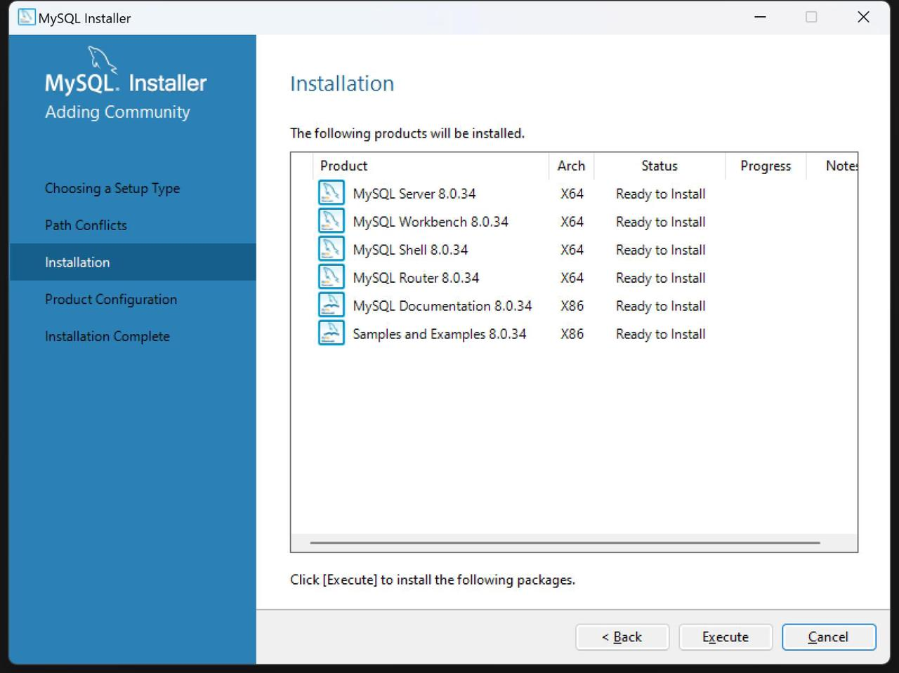

这里能够看出，在full模式下需要安装非常多的组件。其中MySQL Server是主要提供MySQL服务的组

件， MySQL Router是一个从连接到后端服务的中间组件，负责和高可用性集群通信，而MySQL Shell和 MySQL Workbench则是数据库管理和开发工具，其中Shell是命令行工具，而Workbench则是图形化工 具，二者的关系就非常类似于IPython和PyCharm之间的关系。当然，除了免费的MySQL Workbench， 业内非常通用的数据库管理和开发工具还包括Navicat、 DBeaver等。而MySQL Documentation和

Samples and Examples则属于解释、说明和引导类的组件，其并不影响MySQL核心主体服务的使用。

> 需要注意的是，在上一环节选择不同的MySQL安装模式，这一环节就会出现不同的组件等待安 装。例如如果安装Client模式，则只会安装Router、 Shell和Workbench这三个组件。
>
> 另外，需要注意的是，在个人使用或者只有一个mySQL服务实例的情况下，并不需要使用MySQL    Router组件。 MySQL Router主要负责和复杂的高可用性集群进行通信，并提供高可用性和故障转  移提供支持等功能。而在个人学习使用情况下，我们可以通过MySQL Shell或者Workbench和后端的MySQL服务直接进行连接。这也就是之后再配置MySQL Router时无法配置成功的原因，但 MySQL Router配置不成功也不会影响MySQL整体使用，因此不必担心。

接下来就进入了安装环节，待安装完成， Installer会引导进入设置配置环节。这里需要设置的配置并不 多，主要是要“打通前后端” ，即需要设置MySQL后端应用服务的端口、账户和密码等，然后测试前端能 否顺利使用该账户在特定的某端口调用MySQL服务。

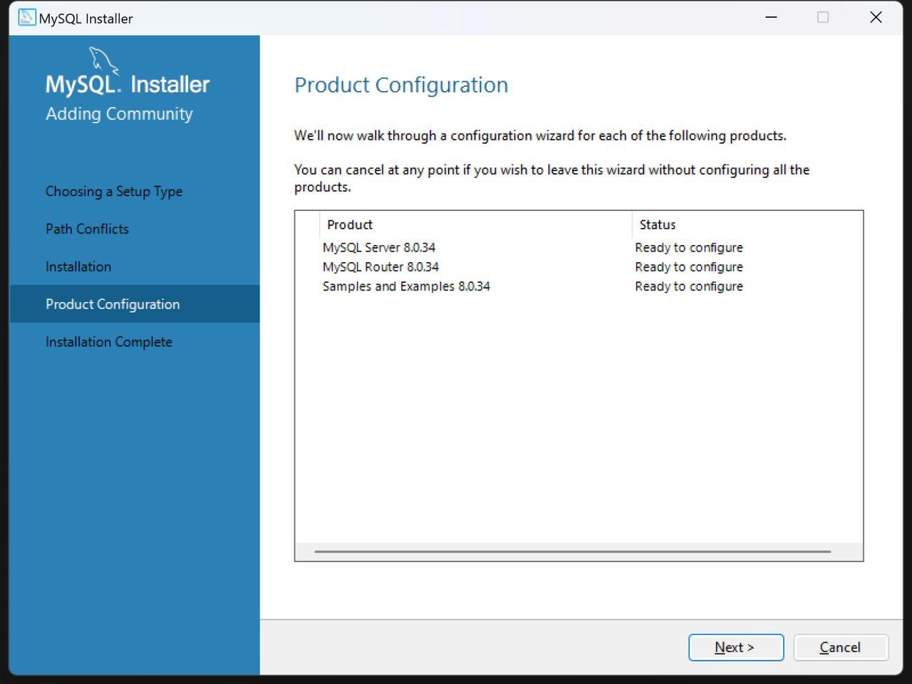

一般的配置流程是先设置Server，即点击Next，则会先进入Server配置页面：

这里能看出， MySQL后端服务以TCP/IP形式和前端进行通信，且端口为3306，同时当前电脑服务主机类 型为Development Computer。这里如果3306端口号被占用，可以修改为其他端口，其他内容不建议修 改。接下来点击Next：

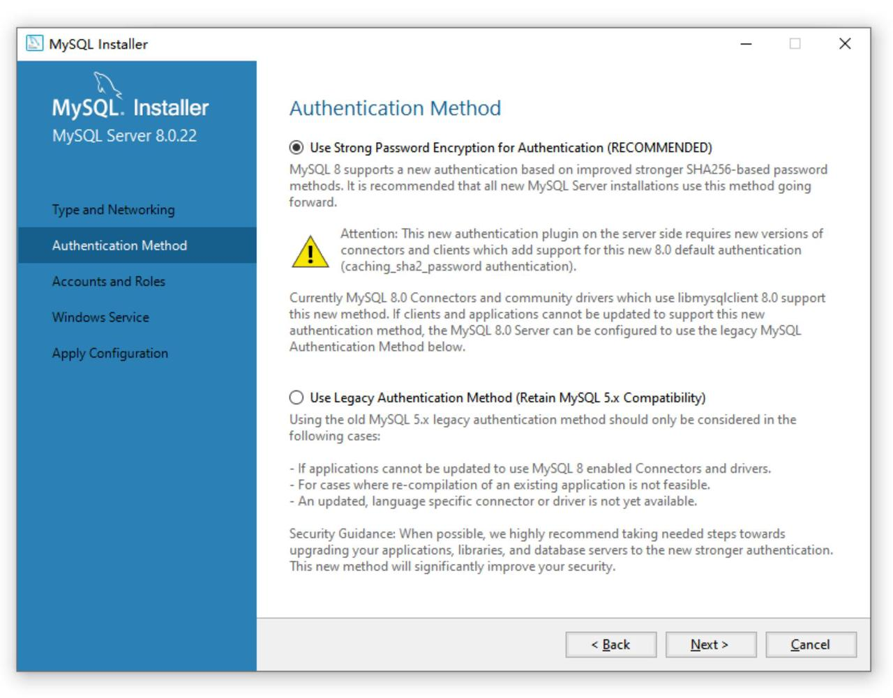

这里是关于身份验证方法的设置， MySQL 8的安装版本选择默认选项（第一个选项）即可。点击Next：

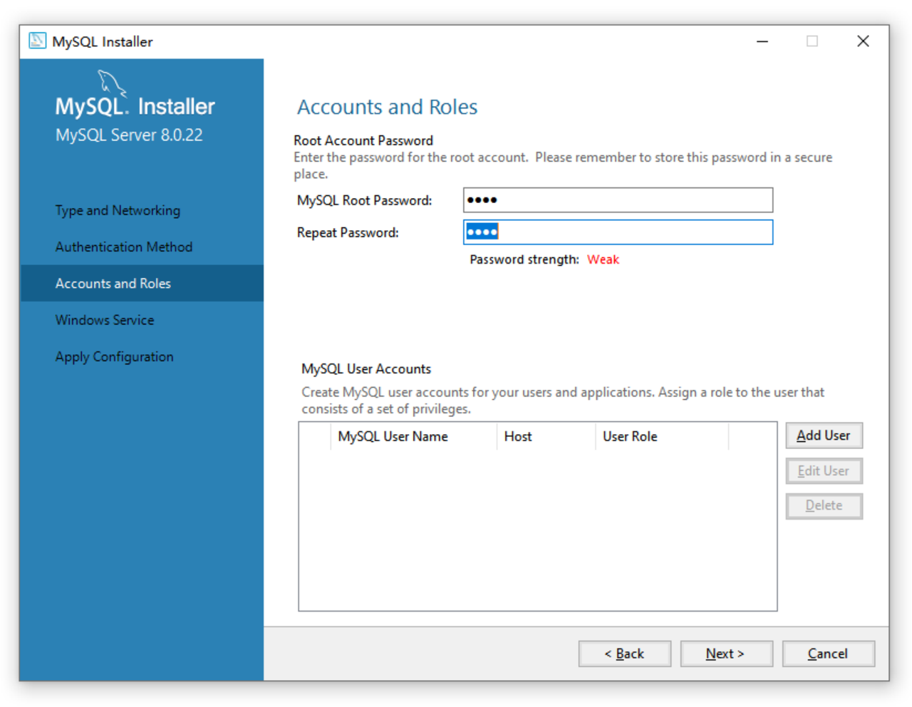

接下来设置初始root账户（最高权限账户）密码。这里需要牢记密码，  root账户密码修改过程非常复 杂。密码设置完成后点击next：

接下来是Windows环境下的一些MySQL服务细节，包括MySQL服务名称（默认为MySQL80，可修

改），以及是否开启自动自动MySQL服务。这里我们按照默认设置安装即可，点击Next，即可进入到配 置应用部分。稍等片刻点击Finish即可：

然后会回到配置创建页面，我们能发现，还有Router和Samples and Examples没有配置。

接下来点击Next进入到Router配置，这里需要注意，在没有启用高可用集群InnoDB时Router是无法配  置成功（这里是否成功并不影响之后启用和调用MySQL服务），这里按照如下方式进行配置，然后点击 Test Connection，若安装了InnoDB并设置了正确的Hostname，则可以Connect成功，此时可以点击   Next，若没有安装InnoDB，则此处配置不成功，此时点击Cancel：

再次强调， MySQL Router无论是否配置成功，都不影响接下来的使用。

无论点击哪个，接下来都会进入到下一个组件的配置过程中。这里我们输入root账户的密码即可，首次 安装时该环节是可以配置成功的：

当全部组件的配置都生成之后，接下来会提示全部安装完成。我们勾选安装完成后启动MySQL Workbench和MySQL Shell，通过这两个组件的使用来测试是否安装成功：

当我们点击Finish之后，系统会自动打开MySQL Workbench和MySQL Shell。我们点击MySQL Workbench，并新建一个和MySQL服务的连接：

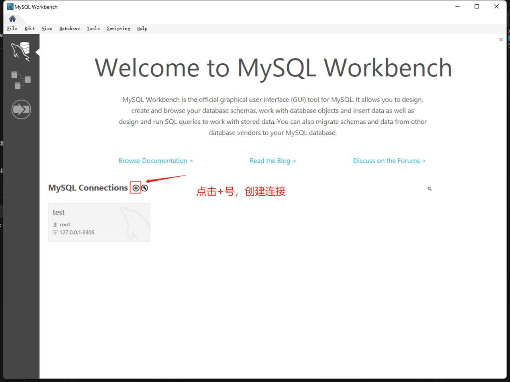

该过程会提示输入密码，此时输入root账户密码即可：

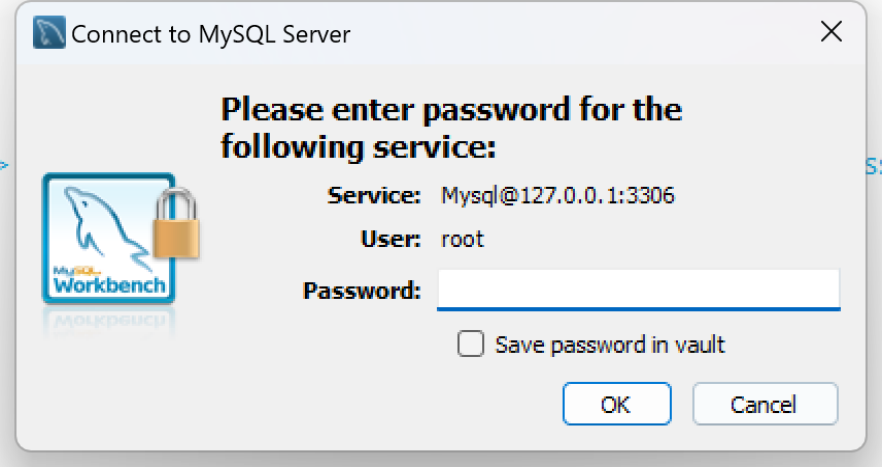

若能顺利进入到编程主页面，则可以说明当前MySQL已经安装配置成功，之后即可使用Workbench操作 数据库。

此外，我们也可以通过MySQL Shell来测试连接情况。这里可以在MySQL Shell中输入\connect

root@localhost以表示连接到本地MySQL（利用localhost，也就是[127.0.0.1](http://127.0.0.1)进行通信），然后根据提示 输入root账户的密码，即可完成连接。之后即可使用MySQL Shell操作数据库：

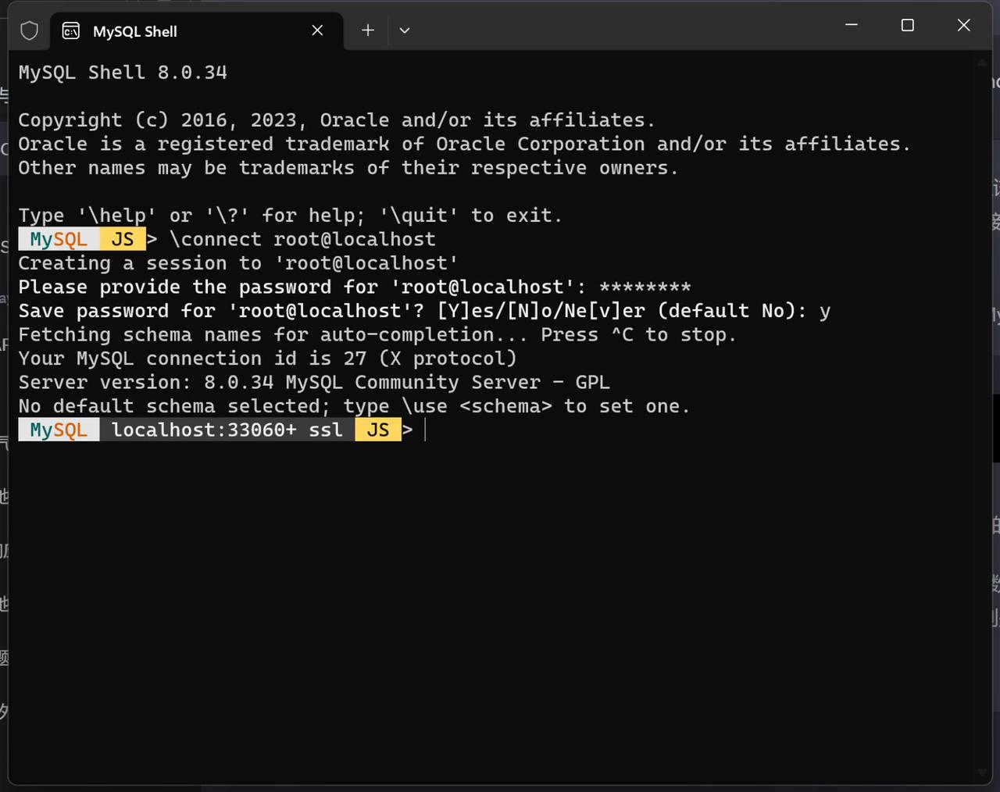

至此， MySQL数据库的安装和配置就全部完成了，之后我们即可在此基础上进一步的创建SQL代码解释器。

* &#x20;修改MySQL配置或升级MySQL

当然，为了更好的用好本地部署的MySQL环境，以及避免一些未来使用时可能遇到的问题，我们还 需要额外介绍关于MySQL升级和配置修改的方法，以及如何手动开启或停止MySQL服务的方法。

首先，伴随着Installer安装MySQL的过程，会同步安装一个Installer应用程序（注意，不是原始下载 下来的msi文件）。我们可以在开始菜单栏中搜索得到：

打开Installer，能够发现，我们可以在这里继续调整MySQL Server、 MySQL Router和Samples and Examples等组件的配置。

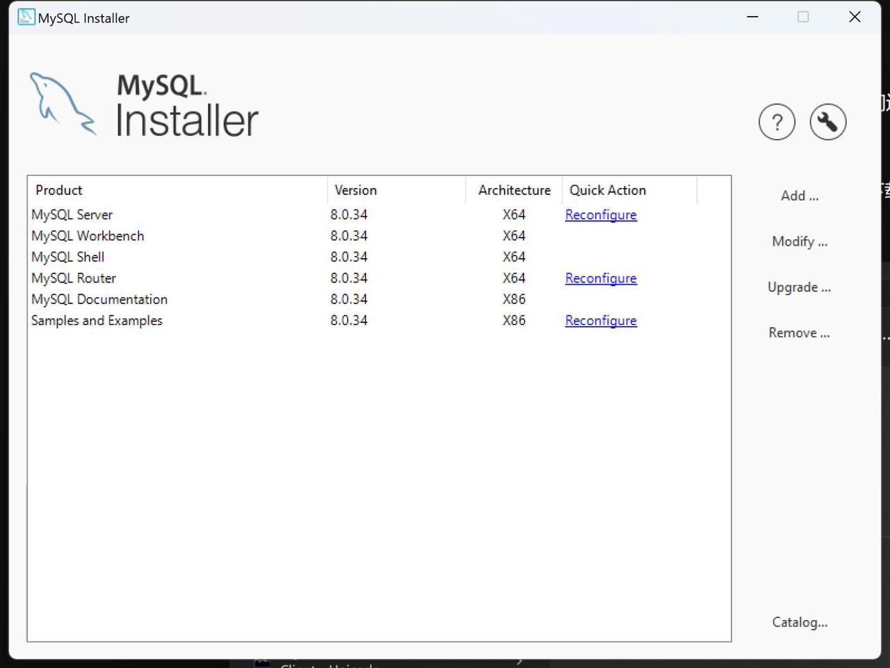

* 开启或停止MySQL服务

此外，由于我们选择了安装完成后MySQL自动启动，因此在测试连接时MySQL是处于开启状态。并 且我们是设置了开机自动启动MySQL，因此大多数时候并不需要手动对其进行开启。但若遇到特殊情

况，比如运行过程中需要重启MySQL服务，则需要手动进行MySQL服务的关闭和开启。

这里我们可以采用net start MySQL80或者net stop MySQL80来开启或者停止MySQL服务。这里的  MySQL80就是我们在使用Installer安装时设置的MySQL服务名称。例如此时MySQL已经处于开启服务状 态，此时输入net start MySQL80就会显示服务已经启动（也可以据此验证MySQL服务是否已经启动）：

而当我们输入net stop MySQL80时，则会显示服务正在停止：

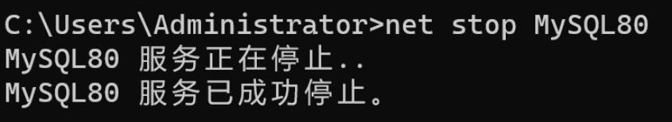

当然，再次输入net start MySQL80则可再次开启MySQL服务：

* 配置系统环境变量

最后还有一点需要注意的是，当前Installer安装过程并不会自动将MySQL添加到系统环境变量中，

因此在默认情况下，我们是无法在命令行中调用MySQL。因此，如果是想要在命令行中使用类似mysql - u root -p的命令调用MySQL服务，则需要将MySQL安装文件目录下的bin文件夹（包含了可执行文件）

的文件路径放到系统环境变量中。具体添加环境变量的方法曾在Ch.1中进行详细讲解，此处不做赘述， 最终我们需要在环境变量的PATH变量中添加MySQL/bin文件夹路径：

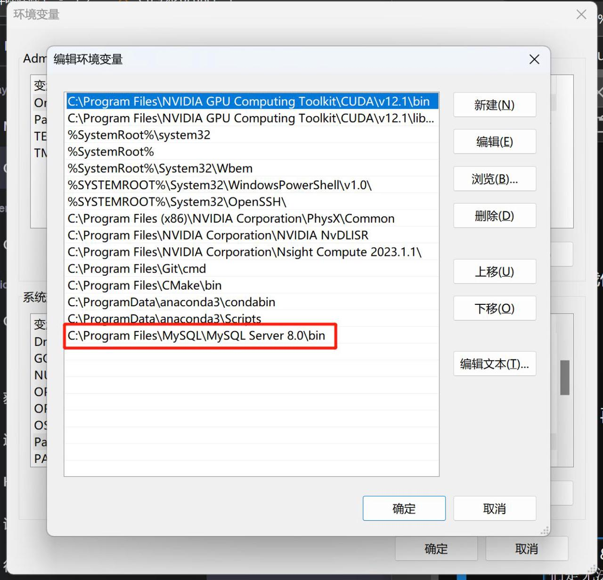

当然，默认情况下MySQL是安装在C:\Program Files文件夹下，若修改的文件路径，则将对应的文件路 径输入即可。

至此，我们就完整介绍了MySQL数据库安装过程。
