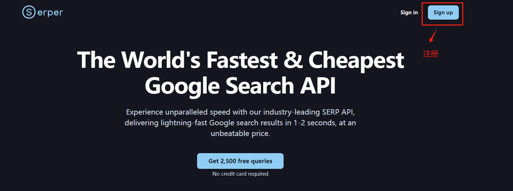
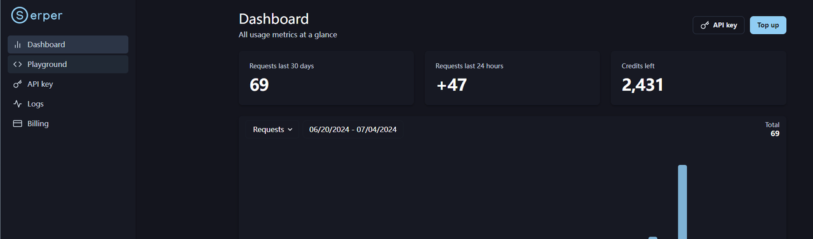

## 课程说明：

* 体验课内容节选⾃[《2025⼤模型Agent智能体开发实战》](https://appze9inzwc2314.h5.xiaoeknow.com/v1/goods/goods_detail/p_67472baee4b0694c3c6fc88a?type=3\&channel_id=)完整版付费课程

体验课时间有限，若想深度学习⼤模型技术，欢迎⼤家报名由我主讲的[《2025⼤模型Agent智能体开发实战》](https://appze9inzwc2314.h5.xiaoeknow.com/v1/goods/goods_detail/p_67472baee4b0694c3c6fc88a?type=3\&channel_id=)：


此外，公开课全部课件，以及项目代码、数据等学习资料，扫码⬆️联系助教即可领取～

***

# 使用SerperAPI做实时联网检索

  基于大模型的问答系统做联网实时检索是一个比较先进的应用场景。在这种场景中，系统不仅利用预先训练的知识，还能实时访问互联网或特定的数据库来检索信息，以回答用户的问题。这种方式可以极大地扩展问答系统的应用范围和准确性。

  一般来说，这种实时检索问答系统包括以下几个关键组件：

1. **用户查询解析**：解析用户的问题，理解其意图和关键信息。

2. **实时检索**：根据解析得到的关键词或查询意图，系统会实时从互联网或指定的数据库中检索相关信息。

3. **信息整合与回答生成**：将检索到的信息与大模型的预训练知识结合，生成准确且信息丰富的答案。

  这种系统通常需要强大的后端支持，包括网络数据的实时访问、数据处理和安全措施，以及高效的信息检索和自然语言处理算法。而**要做联网检索问答的链路，需要借助一个可供实时搜索的外部API。**

  这里我们推荐Serper，该服务是一个高性能的 Google 搜索 API，提供快速且成本效益高的方式访问 Google 搜索结果。在目前的应用落地产品中广泛被用于增强聊天机器人、进行搜索引擎优化（SEO）分析和简化金融科技项目等多种场景。该API具备：

* 执行实时搜索

* 自定义查询位置

* 快速访问 Google 的搜索引擎结果——通常在1-2秒内

  以上特性使其特别适用于需要立即检索最新网络数据的应用。

# 1. 注册Serper账户

  SerperAPI官方地址：https://serper.dev/ 。进入后先进行注册：



  登入账户后，在如下位置获取有效的API Key：


  新用户注册会免费赠送2500条免费请求，即可通过该API Key 查询2500次 Google Search 服务。



  获取到API Key后，我们可以使用 Python 的 requests 库来调用 Serper API 进行连通性测试，如下是示例代码：

```python
# ! pip install requests
```

```python
# requests 库用于发起网络请求
import requests
import json

params = {
    'api_key': 'c8da0155b57b159becfdbf4767aef63306ae4619',  # 验证请求的 API 密钥, 请替换成自己的
    'q': '2024赛季NBA的总冠军是哪支球队？',    # 查询参数，表示要搜索的问题。
    'num': 3          # 这个参数指定了返回结果的数量，这里设置为3，意味着 API 将返回三个相关的搜索结果。         
}


# 使用 requests.get() 方法发起一个 GET 请求到 Serper API 的 endpoint。这个请求包含了上述设置的参数。
api_result = requests.get('https://google.serper.dev/search', params)

search_data = api_result.json()

print(search_data)
```

```plaintext
{'searchParameters': {'q': '2024赛季NBA的总冠军是哪支球队？', 'type': 'search', 'num': 3, 'engine': 'google'}, 'answerBox': {'title': '2023–24 NBA season / Champion', 'answer': 'Boston Celtics'}, 'knowledgeGraph': {'title': '2023–24 NBA season (2023–24 NBA赛季)', 'imageUrl': 'https://encrypted-tbn0.gstatic.com/images?q=tbn:ANd9GcSoAkm4fChk_rY5NN5liUG5vyniB_BP5y5xiMiJpEPWxVjAQjGtyTkg3yg&s=0', 'description': 'The 2023–24 NBA season was the 78th season of the National Basketball Association. The regular season began on October 24, 2023, and ended on April 14, 2024.', 'descriptionSource': 'Wikipedia', 'descriptionLink': 'https://en.wikipedia.org/wiki/2023%E2%80%9324_NBA_season', 'attributes': {'Start date': 'October 24, 2023', 'Champion': 'Boston Celtics', 'Location': 'United States and Canada', 'Eastern runners-up': 'Indiana Pacers', 'Finals MVP': 'Jaylen Brown (Boston)', 'League': 'National Basketball Association', 'Number of games': '82'}}, 'organic': [{'title': '2024年NBA总决赛 - 维基百科', 'link': 'https://zh.wikipedia.org/zh-hans/2024%E5%B9%B4NBA%E7%B8%BD%E6%B1%BA%E8%B3%BD', 'snippet': '2024年NBA总决赛（英语：2024 NBA Finals）是2023–24 NBA赛季的冠军系列赛 ... 波士顿凯尔特人为1946-47 BAA赛季加入的11支NBA球队之一，并为队史第23次闯进总 ...', 'position': 1}, {'title': '2024年NBA总冠军是哪支球队? - 搜狐', 'link': 'https://www.sohu.com/a/745482265_121124692', 'snippet': '2023-24赛季打了差不多一些比赛，东西部以争冠为目标的球队无非就是绿军、雄鹿、76人、热火；掘金、勇士、太阳、湖人、快船，或许还可以加上独行侠。', 'date': 'Dec 20, 2023', 'position': 2}, {'title': '2024年NBA季后赛- 维基百科', 'link': 'https://zh.wikipedia.org/zh-hans/2024%E5%B9%B4NBA%E5%AD%A3%E5%BE%8C%E8%B3%BD', 'snippet': '2024年NBA季后赛是国家篮球协会（NBA）在2023-24 NBA赛季常规赛完毕后举行 ... 季后赛实行七场四胜制，每支球队将与对手最多进行七场比赛，最先赢得四场比赛的球 ...', 'position': 3}], 'relatedSearches': [{'query': '2024 nba总决赛时间'}, {'query': 'nba总决赛2024回放'}, {'query': 'nba季后赛2024赛程'}, {'query': 'nba季后赛2024对阵图'}, {'query': '2024年nba季后赛直播'}, {'query': 'nba总冠军'}, {'query': 'nba季后赛赛程图'}, {'query': 'nba季后赛排名'}]}
```

  如果能够正常接收到Serper API 返回的数据，则说明调用成功，可以继续进行接下来的代码实践。

  这里我们可以借助pprint 格式化输出。pprint 是 Python 的一个库，它的全称是 "Pretty Printer"。这个库提供了一个函数 pprint()，可以将 Python 对象以一种格式化和易于阅读的方式打印出来。使用 pprint 打印数据结构，尤其是在处理嵌套结构或包含多个字段的大型数据时，可以极大地提高可读性。

```python
# 导入pprint函数
from pprint import pprint  

# 设置缩进为2，宽度为100字符
pprint(search_data, indent=2, width=100)  
```

```plaintext
{ 'answerBox': {'answer': 'Boston Celtics', 'title': '2023–24 NBA season / Champion'},
  'knowledgeGraph': { 'attributes': { 'Champion': 'Boston Celtics',
                                      'Eastern runners-up': 'Indiana Pacers',
                                      'Finals MVP': 'Jaylen Brown (Boston)',
                                      'League': 'National Basketball Association',
                                      'Location': 'United States and Canada',
                                      'Number of games': '82',
                                      'Start date': 'October 24, 2023'},
                      'description': 'The 2023–24 NBA season was the 78th season of the National '
                                     'Basketball Association. The regular season began on October '
                                     '24, 2023, and ended on April 14, 2024.',
                      'descriptionLink': 'https://en.wikipedia.org/wiki/2023%E2%80%9324_NBA_season',
                      'descriptionSource': 'Wikipedia',
                      'imageUrl': 'https://encrypted-tbn0.gstatic.com/images?q=tbn:ANd9GcSoAkm4fChk_rY5NN5liUG5vyniB_BP5y5xiMiJpEPWxVjAQjGtyTkg3yg&s=0',
                      'title': '2023–24 NBA season (2023–24 NBA赛季)'},
  'organic': [ { 'link': 'https://zh.wikipedia.org/zh-hans/2024%E5%B9%B4NBA%E7%B8%BD%E6%B1%BA%E8%B3%BD',
                 'position': 1,
                 'snippet': '2024年NBA总决赛（英语：2024 NBA Finals）是2023–24 NBA赛季的冠军系列赛 ... '
                            '波士顿凯尔特人为1946-47 BAA赛季加入的11支NBA球队之一，并为队史第23次闯进总 ...',
                 'title': '2024年NBA总决赛 - 维基百科'},
               { 'date': 'Dec 20, 2023',
                 'link': 'https://www.sohu.com/a/745482265_121124692',
                 'position': 2,
                 'snippet': '2023-24赛季打了差不多一些比赛，东西部以争冠为目标的球队无非就是绿军、雄鹿、76人、热火；掘金、勇士、太阳、湖人、快船，或许还可以加上独行侠。',
                 'title': '2024年NBA总冠军是哪支球队? - 搜狐'},
               { 'link': 'https://zh.wikipedia.org/zh-hans/2024%E5%B9%B4NBA%E5%AD%A3%E5%BE%8C%E8%B3%BD',
                 'position': 3,
                 'snippet': '2024年NBA季后赛是国家篮球协会（NBA）在2023-24 NBA赛季常规赛完毕后举行 ... '
                            '季后赛实行七场四胜制，每支球队将与对手最多进行七场比赛，最先赢得四场比赛的球 ...',
                 'title': '2024年NBA季后赛- 维基百科'}],
  'relatedSearches': [ {'query': '2024 nba总决赛时间'},
                       {'query': 'nba总决赛2024回放'},
                       {'query': 'nba季后赛2024赛程'},
                       {'query': 'nba季后赛2024对阵图'},
                       {'query': '2024年nba季后赛直播'},
                       {'query': 'nba总冠军'},
                       {'query': 'nba季后赛赛程图'},
                       {'query': 'nba季后赛排名'}],
  'searchParameters': {'engine': 'google', 'num': 3, 'q': '2024赛季NBA的总冠军是哪支球队？', 'type': 'search'}}
```

  我们要从上述返回的JSON 数据中提取 "organic" 键对应的值，其内容代表了搜索引擎返回的自然（非广告）搜索结果。

```python
items = search_data.get("organic", [])
```

```python
items
```

```plaintext
[{'title': '2024年NBA总决赛 - 维基百科',
  'link': 'https://zh.wikipedia.org/zh-hans/2024%E5%B9%B4NBA%E7%B8%BD%E6%B1%BA%E8%B3%BD',
  'snippet': '2024年NBA总决赛（英语：2024 NBA Finals）是2023–24 NBA赛季的冠军系列赛 ... 波士顿凯尔特人为1946-47 BAA赛季加入的11支NBA球队之一，并为队史第23次闯进总 ...',
  'position': 1},
 {'title': '2024年NBA总冠军是哪支球队? - 搜狐',
  'link': 'https://www.sohu.com/a/745482265_121124692',
  'snippet': '2023-24赛季打了差不多一些比赛，东西部以争冠为目标的球队无非就是绿军、雄鹿、76人、热火；掘金、勇士、太阳、湖人、快船，或许还可以加上独行侠。',
  'date': 'Dec 20, 2023',
  'position': 2},
 {'title': '2024年NBA季后赛- 维基百科',
  'link': 'https://zh.wikipedia.org/zh-hans/2024%E5%B9%B4NBA%E5%AD%A3%E5%BE%8C%E8%B3%BD',
  'snippet': '2024年NBA季后赛是国家篮球协会（NBA）在2023-24 NBA赛季常规赛完毕后举行 ... 季后赛实行七场四胜制，每支球队将与对手最多进行七场比赛，最先赢得四场比赛的球 ...',
  'position': 3}]
```

  接下来，我们需要进行进一步处理，增加两个新的属性：一个是用于唯一标识每个搜索结果的 UUID，另一个是初始化搜索结果的得分。其中：

1. 使用 hashlib.md5() 生成基于搜索结果链接的 MD5 哈希值。这里，对每个结果的 link 字段进行编码并哈希处理，用于生成一个唯一的标识符（UUID）。MD5 哈希用于确保每个搜索结果都有一个独一无二的标识码。

2. 给每个搜索结果添加一个 "score" 键，并初始化其值为 0.00。这个得分用于后续的评分算法，目的是在进入RAG过程前做进一步的筛选。

```python
import hashlib

def md5(data: str):
    _md5 = hashlib.md5()
    _md5.update(data.encode("utf-8"))
    _hash = _md5.hexdigest()

    return _hash
```

```python
results = []

for item in items:
    # 为每个搜索结果生成 UUID（MD5 哈希）
    item["uuid"] = hashlib.md5(item["link"].encode()).hexdigest()
    # 初始化搜索结果的得分
    item["score"] = 0.00
    results.append(item)
```

```python
results
```

```plaintext
[{'title': '2024年NBA总决赛 - 维基百科',
  'link': 'https://zh.wikipedia.org/zh-hans/2024%E5%B9%B4NBA%E7%B8%BD%E6%B1%BA%E8%B3%BD',
  'snippet': '2024年NBA总决赛（英语：2024 NBA Finals）是2023–24 NBA赛季的冠军系列赛 ... 波士顿凯尔特人为1946-47 BAA赛季加入的11支NBA球队之一，并为队史第23次闯进总 ...',
  'position': 1,
  'uuid': '07ec36227ed79525b4c7d82434e8a3e6',
  'score': 0.0},
 {'title': '2024年NBA总冠军是哪支球队? - 搜狐',
  'link': 'https://www.sohu.com/a/745482265_121124692',
  'snippet': '2023-24赛季打了差不多一些比赛，东西部以争冠为目标的球队无非就是绿军、雄鹿、76人、热火；掘金、勇士、太阳、湖人、快船，或许还可以加上独行侠。',
  'date': 'Dec 20, 2023',
  'position': 2,
  'uuid': 'a7f003569458780cec0816a8cbd330ec',
  'score': 0.0},
 {'title': '2024年NBA季后赛- 维基百科',
  'link': 'https://zh.wikipedia.org/zh-hans/2024%E5%B9%B4NBA%E5%AD%A3%E5%BE%8C%E8%B3%BD',
  'snippet': '2024年NBA季后赛是国家篮球协会（NBA）在2023-24 NBA赛季常规赛完毕后举行 ... 季后赛实行七场四胜制，每支球队将与对手最多进行七场比赛，最先赢得四场比赛的球 ...',
  'position': 3,
  'uuid': '6b138b6ae7861f7cdc5ed6f98e42f9ba',
  'score': 0.0}]
```

  进一步转换成 Document 对象，并存储在一个列表中，包含了一个文档的内容及其元数据。

```python
from langchain.docstore.document import Document

documents = []

for result in results:
    
    if "uuid" in result:
        uuid = result["uuid"]
    else:
        uuid = md5(result["link"])
    
    text = result["snippet"]
    
    document = Document(
        page_content=text,
        metadata={
            "uuid": uuid,
            "title": result["title"],
            "snippet": result["snippet"],
            "link": result["link"],
        },
    )

    documents.append(document)
```

```python
documents
```

```plaintext
[Document(page_content='2024年NBA总决赛（英语：2024 NBA Finals）是2023–24 NBA赛季的冠军系列赛 ... 波士顿凯尔特人为1946-47 BAA赛季加入的11支NBA球队之一，并为队史第23次闯进总 ...', metadata={'uuid': '07ec36227ed79525b4c7d82434e8a3e6', 'title': '2024年NBA总决赛 - 维基百科', 'snippet': '2024年NBA总决赛（英语：2024 NBA Finals）是2023–24 NBA赛季的冠军系列赛 ... 波士顿凯尔特人为1946-47 BAA赛季加入的11支NBA球队之一，并为队史第23次闯进总 ...', 'link': 'https://zh.wikipedia.org/zh-hans/2024%E5%B9%B4NBA%E7%B8%BD%E6%B1%BA%E8%B3%BD'}),
 Document(page_content='2023-24赛季打了差不多一些比赛，东西部以争冠为目标的球队无非就是绿军、雄鹿、76人、热火；掘金、勇士、太阳、湖人、快船，或许还可以加上独行侠。', metadata={'uuid': 'a7f003569458780cec0816a8cbd330ec', 'title': '2024年NBA总冠军是哪支球队? - 搜狐', 'snippet': '2023-24赛季打了差不多一些比赛，东西部以争冠为目标的球队无非就是绿军、雄鹿、76人、热火；掘金、勇士、太阳、湖人、快船，或许还可以加上独行侠。', 'link': 'https://www.sohu.com/a/745482265_121124692'}),
 Document(page_content='2024年NBA季后赛是国家篮球协会（NBA）在2023-24 NBA赛季常规赛完毕后举行 ... 季后赛实行七场四胜制，每支球队将与对手最多进行七场比赛，最先赢得四场比赛的球 ...', metadata={'uuid': '6b138b6ae7861f7cdc5ed6f98e42f9ba', 'title': '2024年NBA季后赛- 维基百科', 'snippet': '2024年NBA季后赛是国家篮球协会（NBA）在2023-24 NBA赛季常规赛完毕后举行 ... 季后赛实行七场四胜制，每支球队将与对手最多进行七场比赛，最先赢得四场比赛的球 ...', 'link': 'https://zh.wikipedia.org/zh-hans/2024%E5%B9%B4NBA%E5%AD%A3%E5%BE%8C%E8%B3%BD'})]
```

  在信息检索和问答系统中，用户期待快速且准确的回答。所以我们在拿到检索到的网页后，要先进一步预筛选。具体来说：

1. 计算相似度：我们需要通过某种相似度计算方法，去衡量检索到的网页和用户实际提出的query是不是相关的。

2. 排序：根据计算得到的相似度分数，对所有文档进行排序，得分最高的文档被认为与查询最相关。

3. 选择：选取得分最高的一定数量的文档进行深入处理。具体数量可以根据系统需求和性能考虑进行调整。

  这一步，一个比较直接的方法是用 NormalizedLevenshtein 来计算每个文档内容（page\_content）与用户查询的相似度。这个值反映了每个文档与查询的匹配程度。

```python
# ! pip install strsimpy
```

  对于每个检索到的网页，使用 normalizedLevenshtein.similarity() 方法计算query与网页摘要 (x.page\_content) 的相似度。

```python
from strsimpy.normalized_levenshtein import NormalizedLevenshtein

normal = NormalizedLevenshtein()

for x in documents:
    #对于每个文档，使用 normalizedLevenshtein.similarity() 方法计算查询与文档内容 (x.page_content) 的相似度。
    x.metadata["score"] = normal.similarity("这几天，保罗乔治加盟了哪一支NBA球队？", x.page_content)
documents.sort(key=lambda x: x.metadata["score"], reverse=True)
```

```python
documents
```

```plaintext
[Document(page_content='2024年NBA总决赛（英语：2024 NBA Finals）是2023–24 NBA赛季的冠军系列赛 ... 波士顿凯尔特人为1946-47 BAA赛季加入的11支NBA球队之一，并为队史第23次闯进总 ...', metadata={'uuid': '07ec36227ed79525b4c7d82434e8a3e6', 'title': '2024年NBA总决赛 - 维基百科', 'snippet': '2024年NBA总决赛（英语：2024 NBA Finals）是2023–24 NBA赛季的冠军系列赛 ... 波士顿凯尔特人为1946-47 BAA赛季加入的11支NBA球队之一，并为队史第23次闯进总 ...', 'link': 'https://zh.wikipedia.org/zh-hans/2024%E5%B9%B4NBA%E7%B8%BD%E6%B1%BA%E8%B3%BD', 'score': 0.06603773584905659}),
 Document(page_content='2024年NBA季后赛是国家篮球协会（NBA）在2023-24 NBA赛季常规赛完毕后举行 ... 季后赛实行七场四胜制，每支球队将与对手最多进行七场比赛，最先赢得四场比赛的球 ...', metadata={'uuid': '6b138b6ae7861f7cdc5ed6f98e42f9ba', 'title': '2024年NBA季后赛- 维基百科', 'snippet': '2024年NBA季后赛是国家篮球协会（NBA）在2023-24 NBA赛季常规赛完毕后举行 ... 季后赛实行七场四胜制，每支球队将与对手最多进行七场比赛，最先赢得四场比赛的球 ...', 'link': 'https://zh.wikipedia.org/zh-hans/2024%E5%B9%B4NBA%E5%AD%A3%E5%BE%8C%E8%B3%BD', 'score': 0.05434782608695654}),
 Document(page_content='2023-24赛季打了差不多一些比赛，东西部以争冠为目标的球队无非就是绿军、雄鹿、76人、热火；掘金、勇士、太阳、湖人、快船，或许还可以加上独行侠。', metadata={'uuid': 'a7f003569458780cec0816a8cbd330ec', 'title': '2024年NBA总冠军是哪支球队? - 搜狐', 'snippet': '2023-24赛季打了差不多一些比赛，东西部以争冠为目标的球队无非就是绿军、雄鹿、76人、热火；掘金、勇士、太阳、湖人、快船，或许还可以加上独行侠。', 'link': 'https://www.sohu.com/a/745482265_121124692', 'score': 0.05405405405405406})]
```

  标准化后的距离值（Score）介于 0（完全不相似）和 1（完全相同）之间。

```python
documents_docs = documents[:3]
```

```python
documents_docs
```

```plaintext
[Document(page_content='2024年NBA总决赛（英语：2024 NBA Finals）是2023–24 NBA赛季的冠军系列赛 ... 波士顿凯尔特人为1946-47 BAA赛季加入的11支NBA球队之一，并为队史第23次闯进总 ...', metadata={'uuid': '07ec36227ed79525b4c7d82434e8a3e6', 'title': '2024年NBA总决赛 - 维基百科', 'snippet': '2024年NBA总决赛（英语：2024 NBA Finals）是2023–24 NBA赛季的冠军系列赛 ... 波士顿凯尔特人为1946-47 BAA赛季加入的11支NBA球队之一，并为队史第23次闯进总 ...', 'link': 'https://zh.wikipedia.org/zh-hans/2024%E5%B9%B4NBA%E7%B8%BD%E6%B1%BA%E8%B3%BD', 'score': 0.06603773584905659}),
 Document(page_content='2024年NBA季后赛是国家篮球协会（NBA）在2023-24 NBA赛季常规赛完毕后举行 ... 季后赛实行七场四胜制，每支球队将与对手最多进行七场比赛，最先赢得四场比赛的球 ...', metadata={'uuid': '6b138b6ae7861f7cdc5ed6f98e42f9ba', 'title': '2024年NBA季后赛- 维基百科', 'snippet': '2024年NBA季后赛是国家篮球协会（NBA）在2023-24 NBA赛季常规赛完毕后举行 ... 季后赛实行七场四胜制，每支球队将与对手最多进行七场比赛，最先赢得四场比赛的球 ...', 'link': 'https://zh.wikipedia.org/zh-hans/2024%E5%B9%B4NBA%E5%AD%A3%E5%BE%8C%E8%B3%BD', 'score': 0.05434782608695654}),
 Document(page_content='2023-24赛季打了差不多一些比赛，东西部以争冠为目标的球队无非就是绿军、雄鹿、76人、热火；掘金、勇士、太阳、湖人、快船，或许还可以加上独行侠。', metadata={'uuid': 'a7f003569458780cec0816a8cbd330ec', 'title': '2024年NBA总冠军是哪支球队? - 搜狐', 'snippet': '2023-24赛季打了差不多一些比赛，东西部以争冠为目标的球队无非就是绿军、雄鹿、76人、热火；掘金、勇士、太阳、湖人、快船，或许还可以加上独行侠。', 'link': 'https://www.sohu.com/a/745482265_121124692', 'score': 0.05405405405405406})]
```

```python
documents_docs.sort(key=lambda x: x.metadata["score"], reverse=True)
```

```python
documents_docs
```

```plaintext
[Document(page_content='2024年NBA总决赛（英语：2024 NBA Finals）是2023–24 NBA赛季的冠军系列赛 ... 波士顿凯尔特人为1946-47 BAA赛季加入的11支NBA球队之一，并为队史第23次闯进总 ...', metadata={'uuid': '07ec36227ed79525b4c7d82434e8a3e6', 'title': '2024年NBA总决赛 - 维基百科', 'snippet': '2024年NBA总决赛（英语：2024 NBA Finals）是2023–24 NBA赛季的冠军系列赛 ... 波士顿凯尔特人为1946-47 BAA赛季加入的11支NBA球队之一，并为队史第23次闯进总 ...', 'link': 'https://zh.wikipedia.org/zh-hans/2024%E5%B9%B4NBA%E7%B8%BD%E6%B1%BA%E8%B3%BD', 'score': 0.06603773584905659}),
 Document(page_content='2024年NBA季后赛是国家篮球协会（NBA）在2023-24 NBA赛季常规赛完毕后举行 ... 季后赛实行七场四胜制，每支球队将与对手最多进行七场比赛，最先赢得四场比赛的球 ...', metadata={'uuid': '6b138b6ae7861f7cdc5ed6f98e42f9ba', 'title': '2024年NBA季后赛- 维基百科', 'snippet': '2024年NBA季后赛是国家篮球协会（NBA）在2023-24 NBA赛季常规赛完毕后举行 ... 季后赛实行七场四胜制，每支球队将与对手最多进行七场比赛，最先赢得四场比赛的球 ...', 'link': 'https://zh.wikipedia.org/zh-hans/2024%E5%B9%B4NBA%E5%AD%A3%E5%BE%8C%E8%B3%BD', 'score': 0.05434782608695654}),
 Document(page_content='2023-24赛季打了差不多一些比赛，东西部以争冠为目标的球队无非就是绿军、雄鹿、76人、热火；掘金、勇士、太阳、湖人、快船，或许还可以加上独行侠。', metadata={'uuid': 'a7f003569458780cec0816a8cbd330ec', 'title': '2024年NBA总冠军是哪支球队? - 搜狐', 'snippet': '2023-24赛季打了差不多一些比赛，东西部以争冠为目标的球队无非就是绿军、雄鹿、76人、热火；掘金、勇士、太阳、湖人、快船，或许还可以加上独行侠。', 'link': 'https://www.sohu.com/a/745482265_121124692', 'score': 0.05405405405405406})]
```

  然后，我们可以根据 score 的分数决定要对Top N 篇文档进行提取页面主体信息-切分chunks-存入向量数据-检索与query最相关的chunks等一系列后续数据处理工作。那么首先要做的就是：提取URL列表，用于获取页面内容。

```python
# ! pip install html2text
```

  第一步，我们需要提取出每个网页信息的metadata字典里的link键对应的值。

```python
url_list = [document.metadata['link'] for document in documents_docs if 'link' in document.metadata]

url_list
```

```plaintext
['https://zh.wikipedia.org/zh-hans/2024%E5%B9%B4NBA%E7%B8%BD%E6%B1%BA%E8%B3%BD',
 'https://zh.wikipedia.org/zh-hans/2024%E5%B9%B4NBA%E5%AD%A3%E5%BE%8C%E8%B3%BD',
 'https://www.sohu.com/a/745482265_121124692']
```

  第二步，遍历url\_list列表中的每一个URL，使用requests.get(url)函数向每个URL发送HTTP GET请求。

```python
html_reponse = []
for url in url_list:
    html = requests.get(url)
    reponse = html.text     # 获取响应的内容，即网页的HTML代码
    html_reponse.append(reponse)
```

  最终，html\_reponse列表包含了从每个访问的链接返回的HTML响应。

```python
html_reponse[0]
```
