## 课程说明：

* 体验课内容节选⾃[《2025⼤模型Agent智能体开发实战》](https://appze9inzwc2314.h5.xiaoeknow.com/v1/goods/goods_detail/p_67472baee4b0694c3c6fc88a?type=3\&channel_id=)完整版付费课程

体验课时间有限，若想深度学习⼤模型技术，欢迎⼤家报名由我主讲的[《2025⼤模型Agent智能体开发实战》](https://appze9inzwc2314.h5.xiaoeknow.com/v1/goods/goods_detail/p_67472baee4b0694c3c6fc88a?type=3\&channel_id=)：

此外，公开课全部课件，以及项目代码、数据等学习资料，扫码⬆️联系助教即可领取～

***

# 1. 安装Git

* **Step 1. 进入Git官网：https://git-scm.com/**

* **Step 2. 下载Windwos版本的Git安装程序**

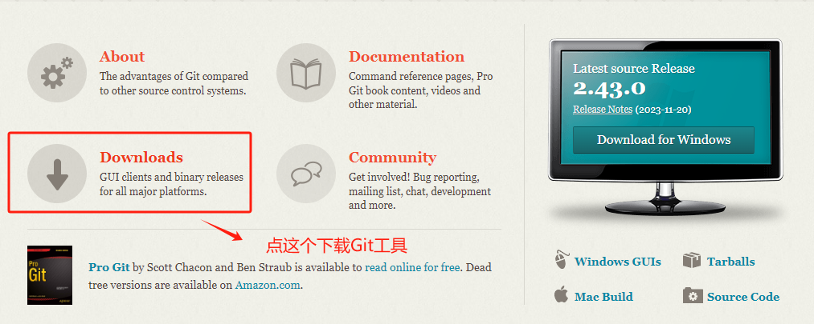

  这里选择Windwos版本进行下载。

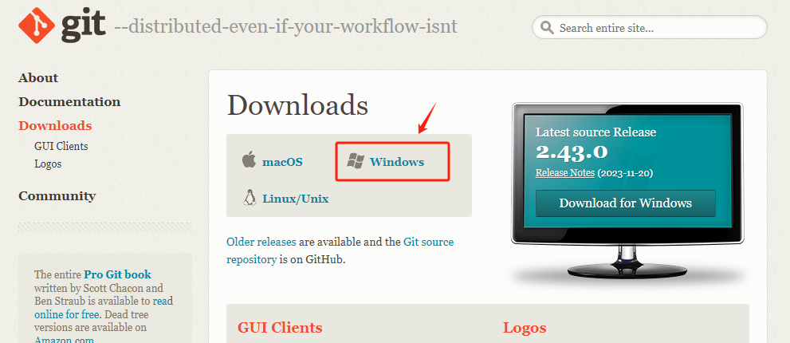

  根据自己的Windwos系统情况，选择32-bit或者64bit。

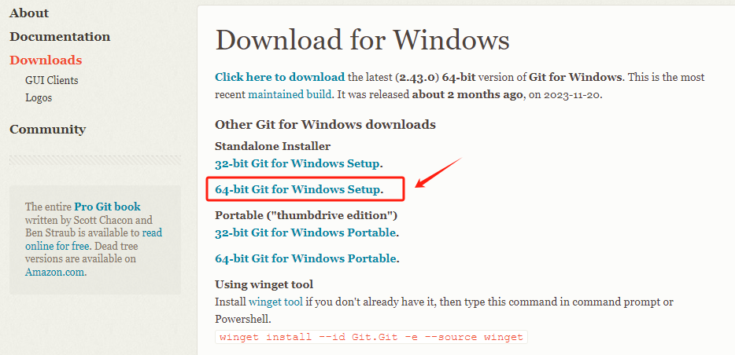

  选择Git安装程序的存储路径。

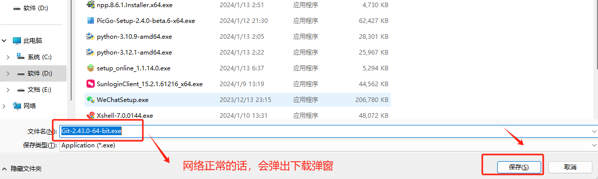

* **Step 3. 安装Git**

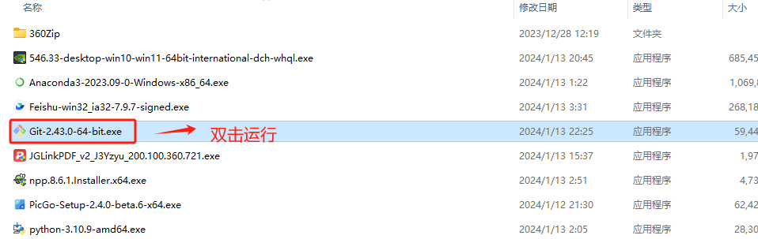

  选择Next。

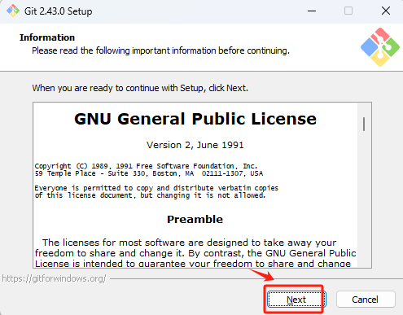

  自行选择Git的安装位置。

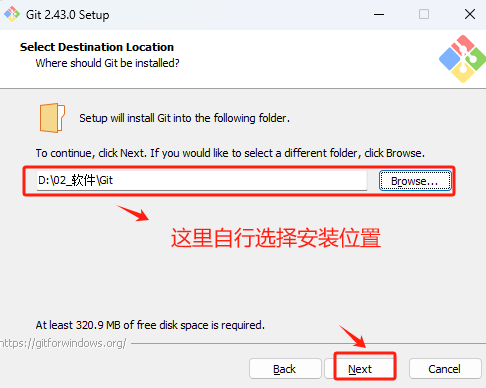

  接下来的选项，全部默认，点击Next即可。不影响正常的使用。

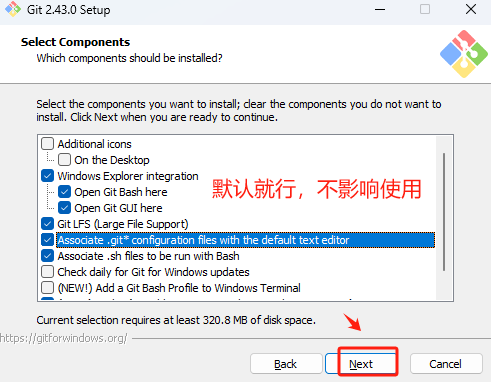

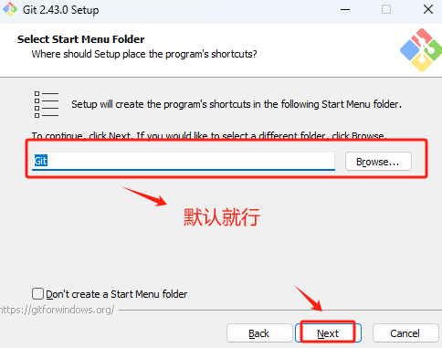

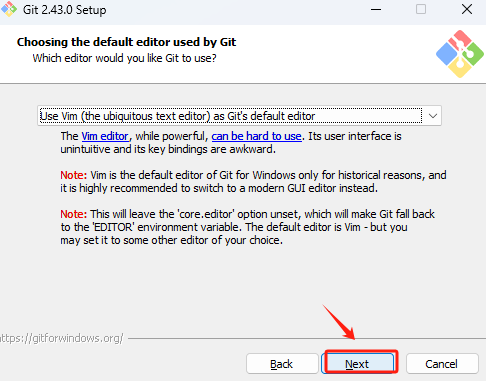

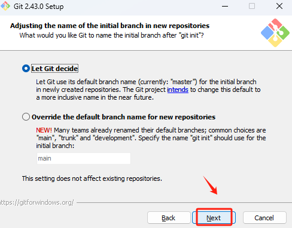

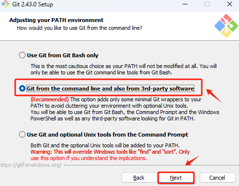

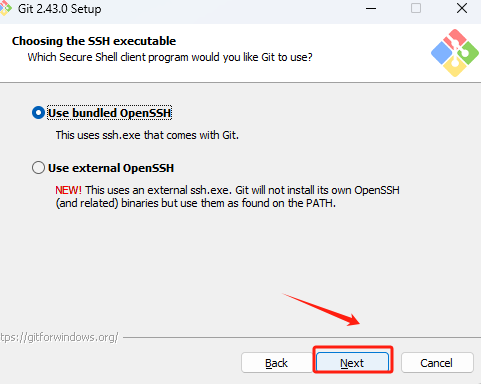

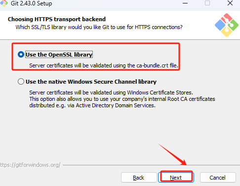

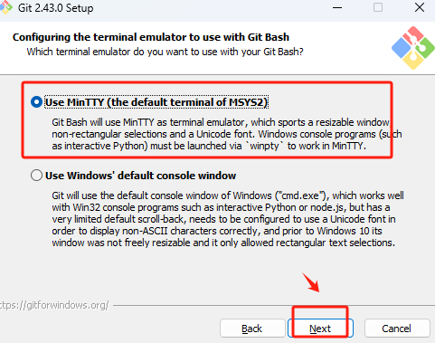

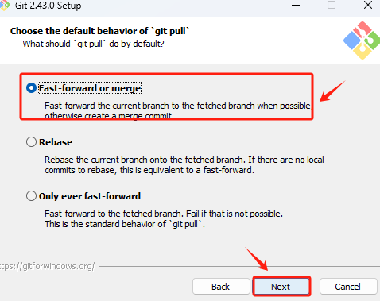

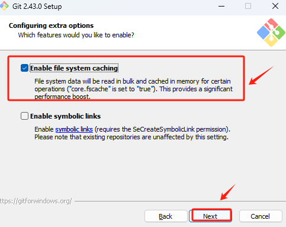

  默认选择到这里，执行安装。

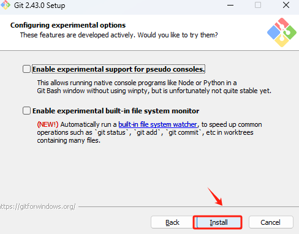

  执行到此进度，说明安装已经完成。

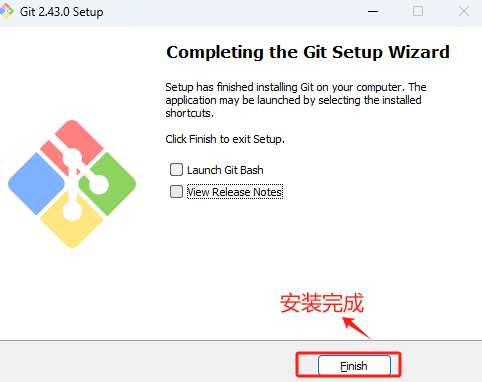

* **Step 4. 验证Git安装是否成功**

  在桌面上鼠标右键，如能看到如下两个快捷方式，说明已经正常安装Git。

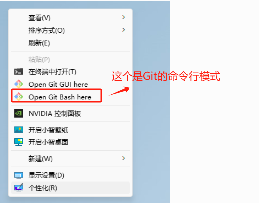

  点击Git Bash 后，进入命令行终端，可以输入`git --version` 查看当前的Git版本。

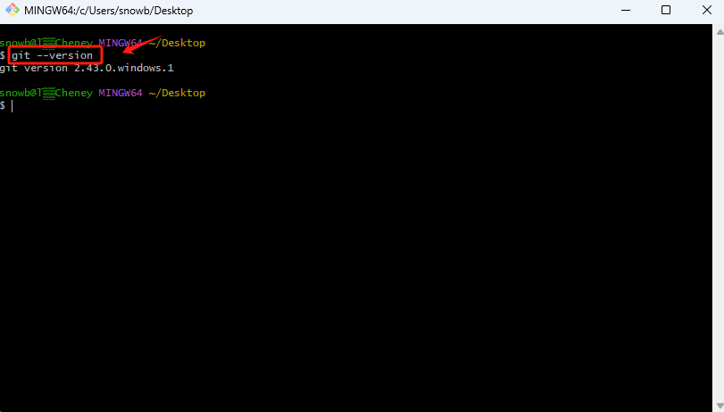

# 2. 安装 FFmpeg

  下面是如何在Windows系统上安装和配置`ffmpeg`的步骤：

1. **下载FFmpeg**：访问[BtbN's Windows builds on GitHub](https://github.com/BtbN/FFmpeg-Builds/releases)，下载适用于Windows的FFmpeg压缩文件。

2. **解压FFmpeg**：将下载的文件解压到你选择的目录，比如`C:\FFmpeg`。

3. **配置环境变量**：

   * 右键点击“此电脑”或“我的电脑”，选择“属性”。

   * 点击“高级系统设置”，然后选择“环境变量”。

   * 在“系统变量”部分，找到并选择`Path`变量，然后点击“编辑”。

   * 点击“新建”，然后添加FFmpeg的bin目录的路径，比如`C:\FFmpeg\bin`。

   * 点击“确定”保存你的设置。

4. **验证安装**：

   * 打开命令提示符（CMD），输入`ffmpeg -version`并回车。如果系统返回了FFmpeg的版本信息，说明FFmpeg已经成功安装和配置。

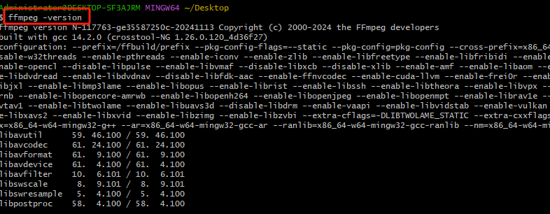

# 3. Window 安装 Docker

  Docker 是一个开源的平台，它可以使软件开发和部署变得更加简便和高效。通过使用 Docker，开发者可以将应用程序及其所有依赖项打包到一个被称为“容器”的轻量级、可移植的、自给自足的单元中。这样，无论在哪种操作系统或环境下，这个容器都能保证以相同的方式运行。

  想象一下，你把一个应用程序比作一个需要特定环境才能生存的植物。如果你想把这个植物带到不同的地方（不同的计算环境），你需要确保每个地方都有合适的土壤、光照和水分。Docker 就像是一个可以随处携带的植物生存盒，无论你把它放到哪里，它都包含了植物生长所需要的一切条件。这样，你就不需要担心不同地方的环境变化，植物（应用程序）总是可以顺利成长。

  这种方式使得软件部署更加简单，也减少了因环境不一致导致的问题，这在开发和测试阶段特别有帮助。因此，Docker 在云计算和微服务架构中非常受欢迎。

  Windows Desktop桌面版官方下载地址：https://www.docker.com/products/docker-desktop/

* **Step 1. 下载Windwos安装程序**

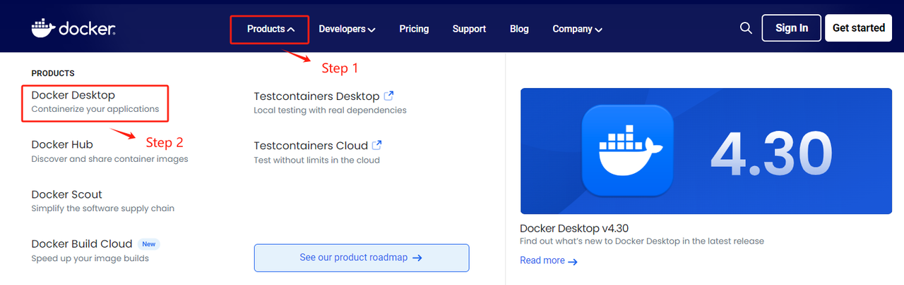

  选择Windows操作系统版本。

  选择安装包存放路径，点击等待下载完成即可。

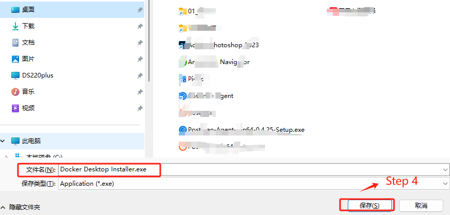

* **Step 2. 安装完双击打开Docker**

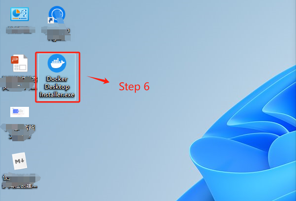

* **Step 3. 执行安装过程**

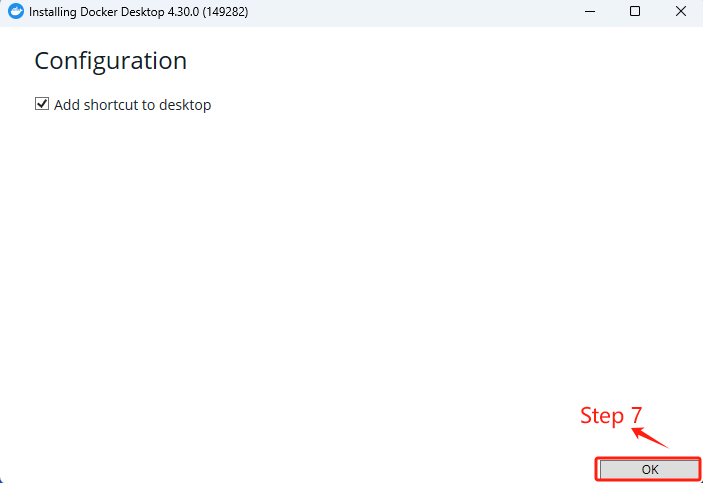

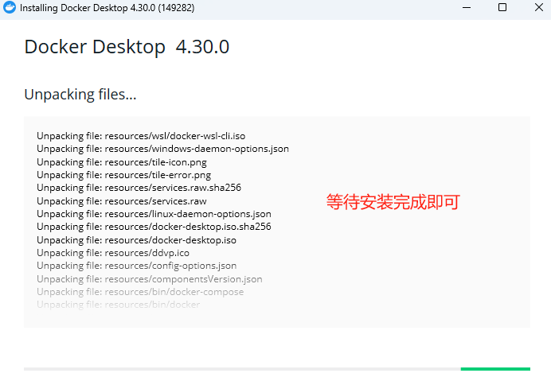

* **Step 4. 安装完成后，需要重启电脑才能加载Docker应用**

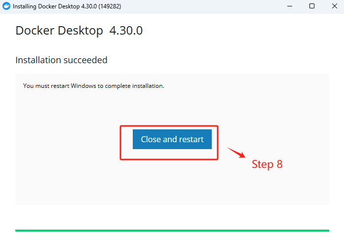

* **Step 5. 重启完电脑后，打开Docker Desktop客户端，首次使用需要接受服务协议**

* **Step 6. 这里选择默认配置即可**

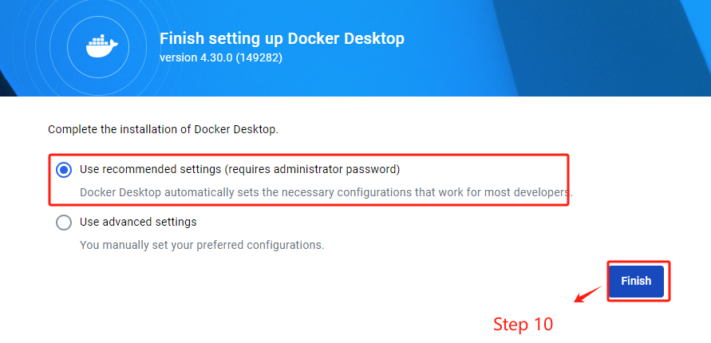

* **Step 7. 在使用前，需要登陆账户，可以免费注册**

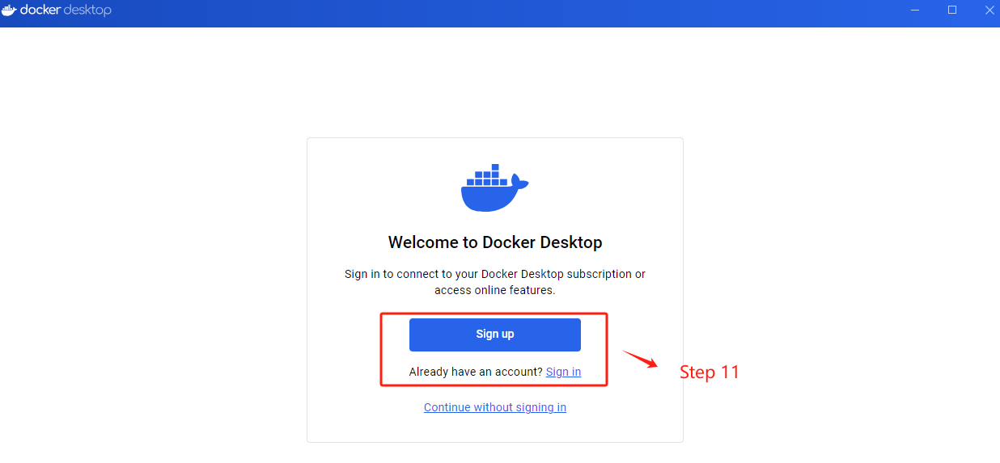

  登录后，即可正常使用Docker服务了。

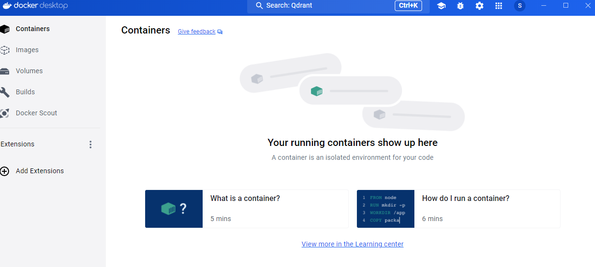
