# 本地部署开源大模型

## Ch.17 LLaMA-Factory项目介绍及Baichuan2、Qwen和ChatGLM3的微调实践

  在前期介绍ChatGLM3、Qwen系列的课程中，我们介绍的都是基于Chat类模型的P-Turning或者LoRA微调方法，但大家需要明确的一点是：对于大语言模型来说，`Chat`类模型通常是在`Base`类模型的基础上，通过对话格式的微调或特殊训练得到的。基础模型（Base models）首先在大规模的文本数据上进行预训练，学习语言的基本规律、知识和语境理解能力。在这一阶段，大模型通常不会特别针对对话任务进行优化，其根本的目的还是要去学习广泛的语言表达和理解能力。然后，为了使模型更适合特定的任务，如聊天对话，这些基础模型会经过进一步的微调（fine-tuning），这往往采用的是全量微调的方法而不是所谓的高效微调。在全量微调阶段，大模型在对话数据集上进行训练，学习如何在对话上下文中生成连贯、相关且自然的回答。这一过程可能包括对特定的对话结构、回答风格或特定领域知识的优化。这种基于基础模型的微调方法使得`Chat`类模型能够在保持底层语言理解和生成能力的同时，更好地适应对话式的交互需求。

  所以，我们才会经常见到的是，每一个特定尺寸的基础模型（Base model）往往会有一个对应尺寸的专为对话优化的模型（Chat model）。这种搭配主要是因为在实际应用中，对话优化的模型由于其对交流细节的优化，更能满足实际使用需求。然而，这并不意味着基础模型不能被微调来适应特定任务。事实上，通过选用合适的数据集和采用适当的训练策略，也完全可以在基础模型的框架内实现对人类意图的精准把握和响应。

  不同的模型，无论是基础模型还是专门的对话模型，由于它们各自独特的训练数据格式和模型配置，深入了解并执行微调工作通常需要投入相当的时间。目前，许多项目旨在简化模型使用和训练过程，通过提供统一的集成解决方案帮助用户更快上手。例如，我们之前讨论过的`text-generation-webui`项目，主要致力于集成大模型的对话功能。本次，我们将探讨另一个出色的开源项目——LLaMA-Factory，它旨在为集成各种大模型微调任务，提供一种快速且便捷的通用使用方式。

# 1. LLaMA-Factory项目介绍

  LLaMA Factory是一个在GitHub上开源的项目，该项目给自身的定位是：提供一个易于使用的大语言模型（LLM）微调框架，支持LLaMA、Baichuan、Qwen、ChatGLM等架构的大模型。更细致的看，该项目提供了从预训练、指令微调到RLHF阶段的开源微调解决方案。截止目前（2024年3月1日）支持约120+种不同的模型和内置了60+的数据集，同时封装出了非常高效和易用的开发者使用方法。而其中最让人喜欢的是其开发的LLaMA Board，这是一个零代码、可视化的一站式网页微调界面，它允许我们通过Web UI轻松设置各种微调过程中的超参数，且整个训练过程的实时进度都会在Web UI中进行同步更新。

  简单理解，通过该项目我们只需下载相应的模型，并根据项目要求准备符合标准的微调数据集，即可快速开始微调过程，而这样的操作可以有效地将特定领域的知识注入到通用模型中，增强模型对特定知识领域的理解和认知能力，以达到“通用模型到垂直模型的快速转变”。

  LLaMA Factory的GitHub地址如下：https://github.com/hiyouga/LLaMA-Factory/tree/main

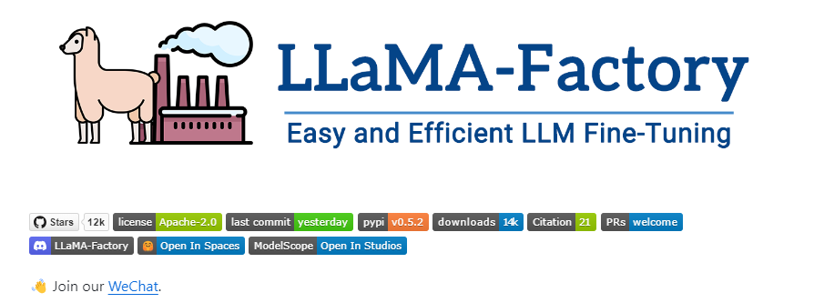

  在使用该项目进行微调的时候，我们\*\*需要关注如下三点内容：该项目支持的大模型、支持的训练方法和对应的训练数据格式。\*\*截止2024年3月1日，LLaMA Factory项目相关的集成情况如下：

  LLaMA-Factory目前支持微调的模型及对应的参数量：

| Model          | Sizes                       |
| -------------- | --------------------------- |
| Baichuan2      | 7B/13B                      |
| BLOOM          | 560M/1.1B/1.7B/3B/7.1B/176B |
| BLOOMZ         | 560M/1.1B/1.7B/3B/7.1B/176B |
| ChatGLM3       | 6B                          |
| DeepSeek (MoE) | 7B/16B/67B                  |
| Falcon         | 7B/40B/180B                 |
| Gemma          | 2B/7B                       |
| InternLM2      | 7B/20B                      |
| LLaMA          | 7B/13B/33B/65B              |
| LLaMA-2        | 7B/13B/70B                  |
| Mistral        | 7B                          |
| Mixtral        | 8x7B                        |
| Phi-1.5/2      | 1.3B/2.7B                   |
| Qwen           | 1.8B/7B/14B/72B             |
| Qwen1.5        | 0.5B/1.8B/4B/7B/14B/72B     |
| XVERSE         | 7B/13B/65B                  |
| Yi             | 6B/34B                      |
| Yuan           | 2B/51B/102B                 |

  可以看到，当前主流的开源大模型，包括ChatGLM3、Qwen的第一代以及最新的1.5测试版本，还有Biachuan2等，已经完全支持不同规模的参数量。针对LLaMA架构的系列模型，该项目已经基本实现了全面的适配。而其支持的训练方法，也主要围绕（增量）预训练、指令监督微调、奖励模型训练、PPO 训练和 DPO 训练展开，具体情况如下：

| 方法                             | 全参数训练 | 部分参数训练 | LoRA | QLoRA |
| ------------------------------ | ----- | ------ | ---- | ----- |
| 预训练（Pre-Training）              | ✅     | ✅      | ✅    | ✅     |
| 指令监督微调（Supervised Fine-Tuning） | ✅     | ✅      | ✅    | ✅     |
| 奖励模型训练（Reward Modeling）        | ✅     | ✅      | ✅    | ✅     |
| PPO 训练（PPO Training）           | ✅     | ✅      | ✅    | ✅     |
| DPO 训练（DPO Training）           | ✅     | ✅      | ✅    | ✅     |

* **预训练**

  在大模型的早期阶段，也就是诞生的过程中，往往不会经过Supervised finetuning（监督式微调） 的过程，它在训练时仅仅是去学习大量的语言基本规律和知识理解，其训练数据是类似这种形式：

```json
山西警方扫黑除恶行动集中收网打掉涉黑涉恶犯罪组织和团伙54个【消息】 本报太原2月14日讯（记者 雷清明）2月13日，山西省公安厅对外发布消息称，扫黑除恶专项行动启动以来，全省各级公安机关迅速对一大批在侦在办的涉黑涉恶案件实施了集中收网。截至目前，全省公安机关共打掉涉黑涉恶犯罪组织和团伙54个，其中，打掉涉嫌黑社会性质组织4个，打掉恶势力犯罪组织50个。在54个涉黑涉恶犯罪组织态势，不断形成对黑恶势力违法犯罪的凌厉攻势；将进一步摸排深挖线索，进一步增强主动发现犯罪的能力和水平；将进一步扩大扫黑除恶的社会宣传覆盖面，营造对黑恶势力同仇敌忾、人人喊打的浓厚氛围。

近年来，单片机以其体积小、价格廉、面向控制等独特优点，在各种工业控制、仪器仪表、设备、产品的自动化、智能化方面获得了广泛的应用。与此同时，单片机应用系统的可靠性成为人们越来越关注的重要课题。影响可靠性的因素是多方面的，如构成系统的元器件本身的可靠性、系统本身各部分之间的相互耦合因素等。其中系统的抗干扰性能是系统可靠性的重要指标。 ·加电、掉电以及供电电压下降情况下的复位输出，复位脉冲宽度典型值为200 ms。 ·独立的看门狗输出，如果看门狗输入在1．6 s内未被触发，其输出将变为高

...
...
...
```

  预训练数据通常来自于多样化的文本来源，以覆盖尽可能广泛的主题、语境和语言风格。这些数据可以是结构化的文本，也可以是非结构化的，比如新闻文章、科学文献等等，对于基于这样训练数据训练得到的模型，很难听懂人类下达的具体指令从而去完成复杂的任务，更多的是使用其文本的生成能力。

  我们所一直提及的微调，从参数规模来看，大体上可以分为**全参数微调和高效参数微调**。全参数微调通常以预训练模型的初始权重为基础，在特定数据集上继续训练，更新模型的所有参数。相比之下，高效参数微调旨在使用更少的资源来更新模型参数，这包括仅更新部分参数或通过对参数施加某些结构化约束来实现。后者就涵盖了我们在之前课程中提到的高效微调技术，如PEFT、LoRA和QLoRA等方法。

  另一方面，如果按照在大模型哪个阶段使用微调，或者根据模型微调的目标来区分，也可以从提示微调、指令微调、有监督微调的方式来具体分类。

* **指令微调**

  指令微调，是一种通过在由（指令，输出）对组成的数据集上进一步训练LLMs的过程。其中，指令代表模型的人类指令，输出代表遵循指令的期望输出。这个过程有助于弥合LLMs的下一个词预测目标与用户让LLMs遵循人类指令的目标之间的差距。它可以被视为有监督微调（Supervised Fine-Tuning，SFT）的一种特殊形式。但是，它们的目标依然有差别。SFT是一种使用标记数据对预训练模型进行微调的过程，以便模型能够更好地执行特定任务。而指令微调是一种通过在包括（指令，输出）对的数据集上进一步训练大语言模型（LLMs）的过程，以增强LLMs的能力和可控性。**指令微调的特殊之处在于其数据集的结构，即由人类指令和期望的输出组成的配对。这种结构使得指令微调专注于让模型理解和遵循人类指令。**

  总的来说，指令微调是有监督微调的一种特殊形式，专注于通过理解和遵循人类指令来增强大语言模型的能力和可控性。其形式往往是这样的：

```json
  {
    "instruction": "保持健康的三个提示。",
    "input": "",
    "output": "以下是保持健康的三个提示：\n\n1. 保持身体活动。每天做适当的身体运动，如散步、跑步或游泳，能促进心血管健康，增强肌肉力量，并有助于减少体重。\n\n2. 均衡饮食。每天食用新鲜的蔬菜、水果、全谷物和脂肪含量低的蛋白质食物，避免高糖、高脂肪和加工食品，以保持健康的饮食习惯。\n\n3. 睡眠充足。睡眠对人体健康至关重要，成年人每天应保证 7-8 小时的睡眠。良好的睡眠有助于减轻压力，促进身体恢复，并提高注意力和记忆力。"
  },
  {
    "instruction": "三原色是什么？",
    "input": "",
    "output": "三原色通常指的是红色、绿色和蓝色（RGB）。它们是通过加色混合原理创建色彩的三种基础颜色。在以发光为基础的显示设备中（如电视、计算机显示器、智能手机和平板电脑显示屏）, 三原色可混合产生大量色彩。其中红色和绿色可以混合生成黄色，红色和蓝色可以混合生成品红色，蓝色和绿色可以混合生成青色。当红色、绿色和蓝色按相等比例混合时，可以产生白色或灰色。\n\n此外，在印刷和绘画中，三原色指的是以颜料为基础的红、黄和蓝颜色（RYB）。这三种颜色用以通过减色混合原理来创建色彩。不过，三原色的具体定义并不唯一，不同的颜色系统可能会采用不同的三原色。"
  },
```

  在上述数据中，其各字段意义如下：

* instruction：任务指令，不能为空。

* input：任务输入，可为空。如果不为空，项目内部处理训练数据时，会将 instruction、input 拼接在一起作为任务的输入。

* output：任务输出，不能为空。

  在该项目中，也内置了非常多的标准数据集，整体分为预训练的数据集、指令微调数据集和偏好数据集。具体各个数据集的详细情况，大家可以在其GitHub官网查看：https://github.com/hiyouga/LLaMA-Factory/blob/main/README\_zh.md

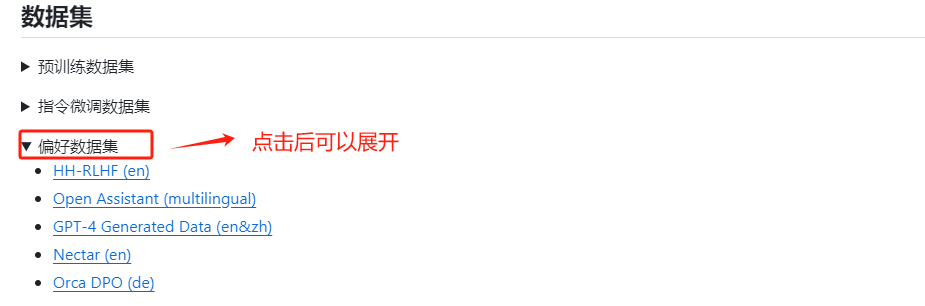

  我们现在所使用的ChatGPT，其训练过程主要会经历三个阶段：首先微调GPT 3模型，然后通过人工对微调后模型的生成结果打分以训练得到一个奖励模型，最后基于微调后的GPT 3结合奖励模型采用强化学习的方法更新策略。而第三步中强化学习的方法就是OpenAI于2017年提出的Proximal Policy Optimization（PPO）算法，它作为一种强化学习算法，用于优化智能体的策略，会试图在策略更新过程中保持稳定性，防止策略更新过大导致学习过程不稳定。PPO 主要应用于连续控制任务和离散决策任务，并在许多领域取得了成功。

  关于奖励模型、PPO以及DPO，涉及大量的数学原理和技术概念，我们将在后面的课程安排中深入讲解与RLHF（Reinforcement Learning with Human Feedback）相关的理论知识。即使用强化学习的方法，利用人类反馈信号直接优化语言模型。此处暂时不展开详细讨论。

  最后且最关键的一点需特别指出：虽然LLaMA-Factory项目允许我们在120余种大模型中灵活选择并快速开启微调工作，但运行特定参数量的模型是否可行，仍然取决于本地硬件资源是否充足。因此，在选择模型进行实践前，大家必须仔细参照下表，结合自己的服务器配置来决定，以避免因硬件资源不足导致的内存溢出等问题。不同模型参数在不同训练方法下的显存占用情况如下：

| 训练方法  | 精度 | 7B    | 13B   | 30B   | 65B    |
| ----- | -- | ----- | ----- | ----- | ------ |
| 全参数   | 16 | 160GB | 320GB | 600GB | 1200GB |
| 部分参数  | 16 | 20GB  | 40GB  | 120GB | 240GB  |
| LoRA  | 16 | 16GB  | 32GB  | 80GB  | 160GB  |
| QLoRA | 8  | 10GB  | 16GB  | 40GB  | 80GB   |
| QLoRA | 4  | 6GB   | 12GB  | 24GB  | 48GB   |

  对于我们课程中重点介绍的ChatGLM3、Qwen和Baichuan2模型，在LLaMA-Factory项目中均实现了高度集成。因此，本文的后续内容将专注于这三个模型，全面介绍LLaMA-Factory项目的使用方法及注意事项。在深入微调操作之前，首要任务是确保LLaMA-Factory开源项目在本地的正确部署。下面，我们将具体执行在本地环境中私有化部署LLaMA-Factory项目的操作。

# 2. LLaMA-Factory私有化部署

  作为GitHub上的开源项目，LLaMA-Factory的本地私有化部署过程与我们之前介绍的大模型部署大体相同，主要包括创建Python虚拟环境、下载项目文件及安装所需的依赖包。这一过程相对直观。但在开始部署之前，我们需要先了解LLaMA-Factory私有化部署对本地软硬件环境的具体要求：

* Python >= 3.8版本，建议Python3.10版本以上

* PyTorch >= 1.13.1版本，建议 Pytorch 版本为 2.2.1

* transformers >= 4.37.2，建议 transformers 版本为 4.38.1

* CUDA >= 11.6，建议CUDA版本为12.2

  \*\*注意：需要严格按照软硬件的版本要求进行环境配置，否则在使用时一定会出现额外的未知错误。\*\*具体的LLaMA-Factory项目本地化部署过程如下：

* **Step 1. 安装NVIDIA显卡驱动**

  如果本地服务器是Ubuntu系统，请参考：《Ch.4 在Ubuntu 22.04系统下部署运行ChatGLM3-6B模型》中的`2.1 安装显卡驱动`小节；而如果是Windows操作系统，请参考：《Ch.6 在Windows系统下部署运行ChatGLM3-6B模型》中的`2. 安装NVIDIA显卡驱`小节。

  按照对应的教程安装完成后，可以通过如下命令验证当前机器的驱动安装情况：

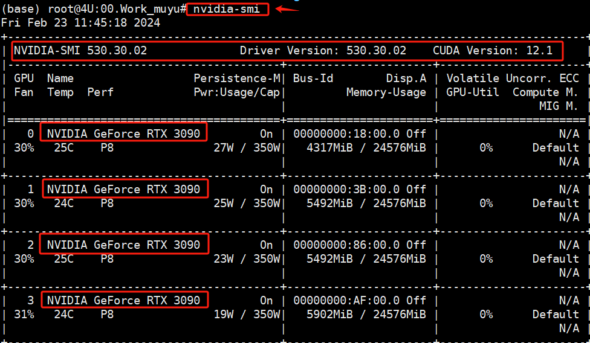

  如果可以正常显示不报错，说明NVIDIA显卡驱动安装成功。

* **Step 2. 安装Anaconda**

  如果本地服务器是Ubuntu系统，请参考：《Ch.4 在Ubuntu 22.04系统下部署运行ChatGLM3-6B模型》中的`2.3 安装Anaconda环境`小节；而如果是Windows操作系统，请参考：《Ch.6 在Windows系统下部署运行ChatGLM3-6B模型》中的`3.2.1 方式一：使用Anaconda创建项目依赖环境（推荐）`小节中，执行完`Step 6. 验证conda`步骤，回到本文继续执行后续的操作：

  按照对应的教程内容配置好Anaconda后，可以通过如下命令验证当前环境的Conda：

```bash
conda --version
```

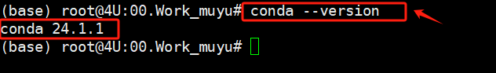

  如果可以正常输出Conda的版本，则说明Anaconda安装成功。

* **Step 3. 使用Conda创建LLaMA-Factory的Python虚拟环境**

  安装好Anaconda后，我们需要借助Conda包版本工具，为LLaMA-Factory项目创建一个新的Python虚拟运行环境，执行代码如下：

```bash
 conda create  --name llama_factory python==3.11
```


  如上所示，新创建了一个名为LLaMA-Factory的Python虚拟环境，其Python版本为3.11。创建完成后，通过如下命令进入该虚拟环境，执行后续的操作：

```bash
conda activate llama_factory
```

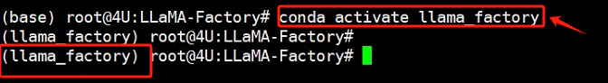

* **Step 4. 根据CUDA版本要求安装Pytorch：https://pytorch.org/get-started/previous-versions/**

  这里根据自己电脑显卡驱动的CUDA版本要求，在Pytorch官网中找到适合自己的Pytorch安装命令。

```bash
    conda install pytorch==2.2.0 torchvision==0.17.0 torchaudio==2.2.0 pytorch-cuda=12.1 -c pytorch -c nvidia
```

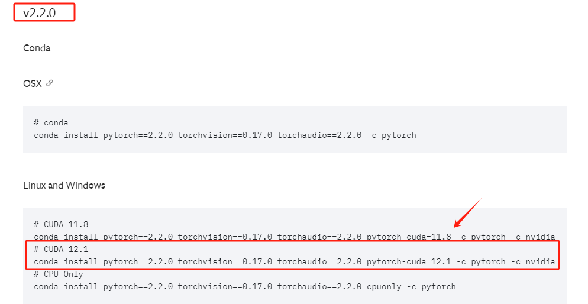

  复制安装命令，进入虚拟环境的终端中执行安装。注意：这个终端并不是查看`nvidia-smi`的windows终端，而是我们创建虚拟环境的conda终端。

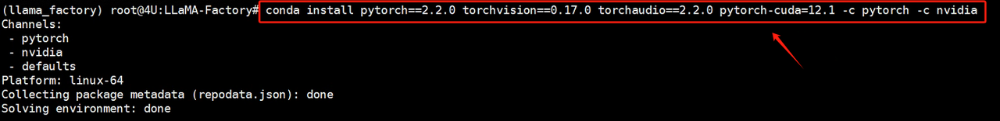

* **Step 5. 验证安装GPU 版Pytorch是否成功**

  待安装完成后，如果想要检查是否成功安装了GPU版本的PyTorch，可以通过几个简单的步骤在Python环境中进行验证：

```bash
    import torch
    print(torch.cuda.is_available())
```

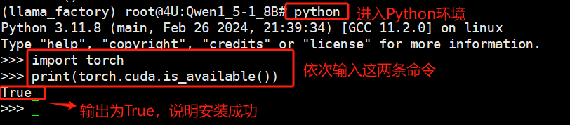

  如果输出是 True，则表示GPU版本的PyTorch已经安装成功并且可以使用CUDA，如果输出是False，则表明没有安装GPU版本的PyTorch，或者CUDA环境没有正确配置，此时根据教程，重新检查自己的执行过程。

* **Step 6. 下载LLaMA-Factory的项目文件**

  进入LLaMA-Factory的官方Github，地址：https://github.com/hiyouga/LLaMA-Factory ， 在 GitHub 上将项目文件下载到有两种方式：克隆 (Clone) 和 下载 ZIP 压缩包。推荐使用克隆 (Clone)的方式。我们首先在GitHub上找到其仓库的URL。


  在执行命令之前，需要先安装git软件包，执行命令如下：

```bash
sudo apt install git
```

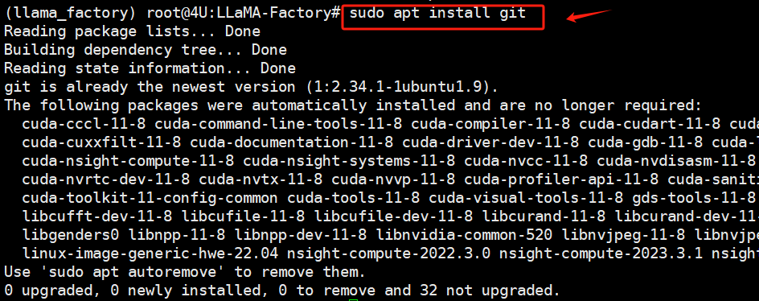

  执行克隆命令，将LLaMA-Factory Github上的项目文件下载至本地的当前路径下，如下：

```bash
    git clone https://github.com/hiyouga/LLaMA-Factory.git
```

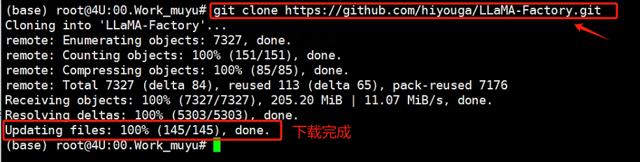

* **Step 7. 升级pip版本**

  建议在执行项目的依赖安装之前升级 pip 的版本，如果使用的是旧版本的 pip，可能无法安装一些最新的包，或者可能无法正确解析依赖关系。升级 pip 很简单，只需要运行命令如下命令：

```bash
python -m pip install --upgrade pip
```

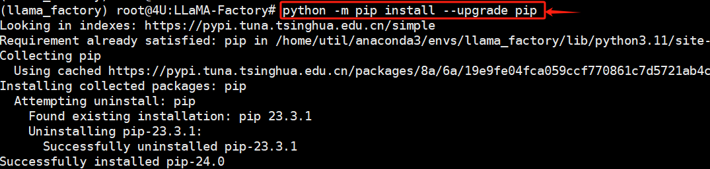

* **Step 8. 使用pip安装LLaMA-Factory项目代码运行的项目依赖**

  在LLaMA-Factory中提供的 `requirements.txt`文件包含了项目运行所必需的所有 Python 包及其精确版本号。使用pip一次性安装所有必需的依赖，执行命令如下：

```bash
pip install -r requirements.txt -i https://pypi.tuna.tsinghua.edu.cn/simple/
```

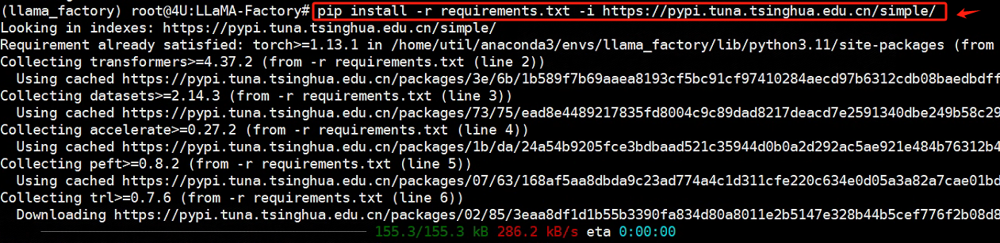

  通过上述步骤就已经完成了LLaMA-Factory模型的完整私有化部署过程。接下来，我们将详细介绍如何借助LLaMA-Factory项目执行ChaGLM3、Qwen和Baichuan2系列模型的微调和使用。

# 3. 使用LLaMA Board单卡微调Qwen1.5模型

  LLaMA Board提供了一个一站式的前端应用，支持微调、评估和对话功能，其可视化界面和零代码操作使得用户能够迅速熟悉并使用LLaMA Factory。这个工具对用户极其友好，便于快速上手。可以通过如下链接快速体验：

* huggingface：https://huggingface.co/spaces/hiyouga/LLaMA-Board （注：需要开启科学上网）

* modelscope： https://modelscope.cn/studios/hiyouga/LLaMA-Board/summary

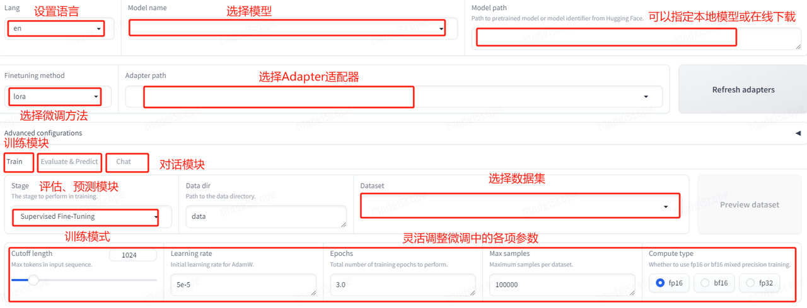

  通过这个前端页面可以看到，我们可以轻松进行数据集的加载、大模型种类、训练模式和微调方法的选择。同时还允许我们灵活配置训练过程中的各种超参数设置，提供了高度的定制化操作体验。而完成所有个性化设置后，便可在页面底部直接启动微调任务。执行后，前端界面将实时展示训练进度及损失函数的变化，极大地方便了监控和管理训练过程。

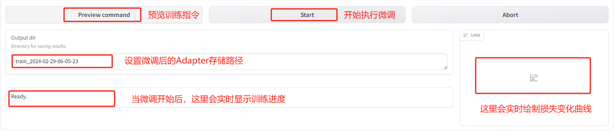

  当然，对于上面在线演示的LLaMA Board，无论是Hugging Face还是ModelScope，也只提供了一个演示能力，若想进行实际操作，我们需在本地部署并启动LLaMA Board的WebUI服务。而更多关于LLaMA Board的更深入细节和操作演示，我们也将通过本地部署的LLaMA Board进行详尽介绍。回到服务器终端，定义 LLaMA Board Web服务的程序文件为`train_web.py`，其存放路径如下：

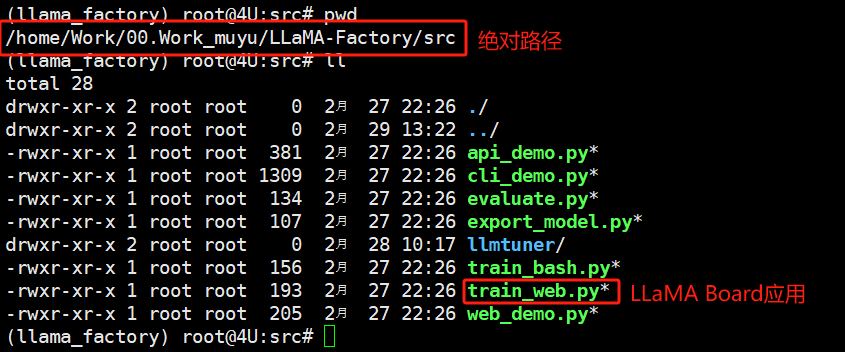

  在启动之前，我们强烈建议修改启动IP，将`0.0.0.0`更改为服务器的实际IP地址，以避免网络连接问题。修改方式是使用文本编辑器进入该文件中，修改如下内容：

```bash
    vim train_web.py
```

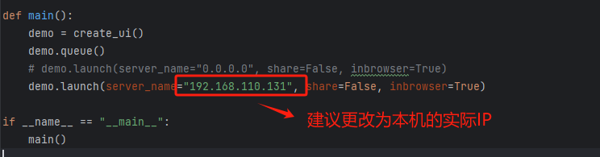

  当配置完成后，便可以通过Python命令直接启动LLaMA Factory的WebUI界面，进而执行微调操作。\*\*但需要特别指出的是，目前LLaMA Board仅支持单GPU训练。这意味着，即便服务器上配备了多块GPU，通过LLaMA Board进行零代码可视化微调时，也只能利用单块GPU来执行整个训练流程。\*\*其启动命令如下：

```bash
    CUDA_VISIBLE_DEVICES=0 python src/train_web.py
```

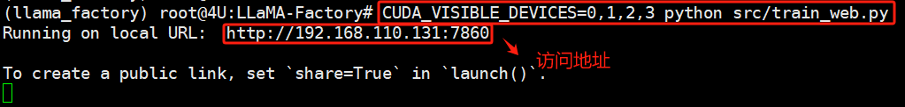

  当出现`Running on local URL: http://xxxx`时，说明LLaMA Board启动成功，可以复制该链接进入到本地的浏览器中进行访问。

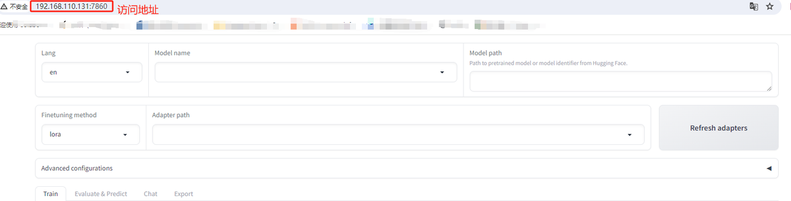

  在LLaMA Board服务启动成功后，因为其仅支持单GPU训练，出于教学演示目的和微调的效率，我们将选用参数量较小的`Qwen1.5-1.8B`模型展开微调实践，详细介绍LLaMA Board的操作流程。在此之前，请先务必安装Qwen模型在LLaMA-Factory项目Python虚拟环境中的必要依赖包，在服务器终端上执行如下安装命令：

```bash
    pip install transformers_stream_generator optimum tiktoken auto-gptq bitsandbytes
```

* **设置语言**

  LLaMA Board支持三种语言面板，分别是英语、俄语和中文，根据自己擅长的语言进行选择即可。

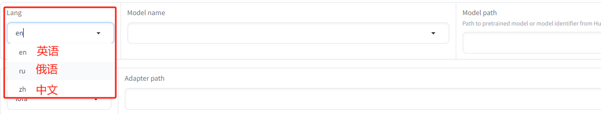

* **选择模型**

  在选择要进行微调的模型时，可以在`Model name`栏中找到指定的模型，如果未找到对应的模型，说明LLaMA-Factory项目并未集成该模型，无法借助该项目进行微调。

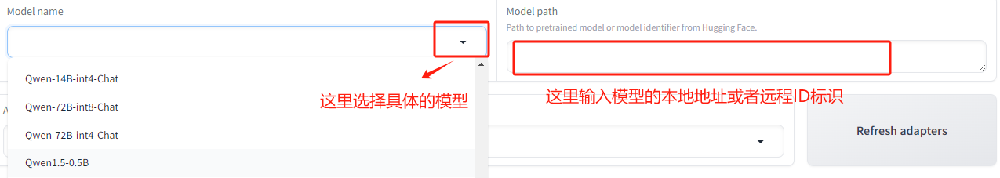

  对于加载的模型，当在`Model name`中选择好某一个模型后，右侧的`Model path`栏中会自动填充其在GitHub上远程仓库的模型标识，当执行微调过程时会先执行模型下载的任务。**默认是从Hugging Face进行模型的下载，所以如果想在线下载模型，需要确保当前的服务器上可以正常开启科学上网环境，否则会导致训练失败。**

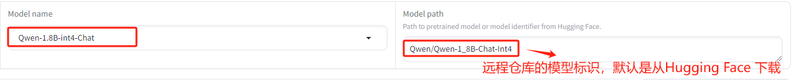

  如果不具备科学上网环境，还想通过在线的方式下载大模型，可以将模型下载源指向国内的ModelScope社区。这需要先中断当前的LLaMA-Board的后台服务，具体操作如下：

```bash
    # Linux操作系统， 如果是 Windows 使用 `set USE_MODELSCOPE_HUB=1`
    export USE_MODELSCOPE_HUB=1 
    CUDA_VISIBLE_DEVICES=0 python src/train_web.py
```

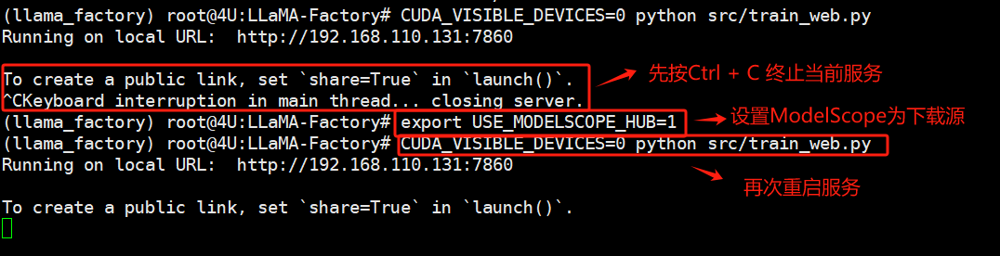

  按照上述配置修改大模型的下载源后，当执行微调时，便会从ModelScope社区先下载模型至本地，再开启正式的微调训练，这可以在后台中明显的看到下载的进程：

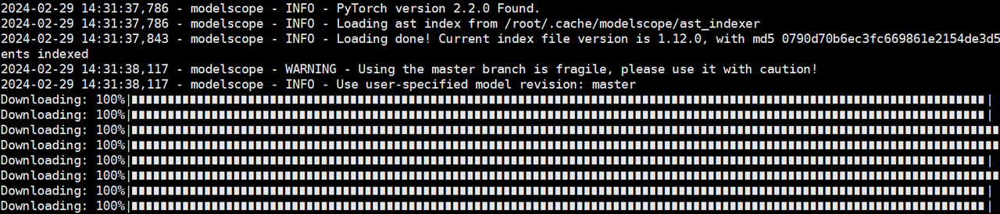

  通过LLaMA Board在线下载至本地的模型存放路径为：`/root/.cache/huggingface/hub` 或者`/root/.cache/modelscope/hub`下，这取决于从哪个官方执行的下载过程。当然，如果在本地已经下载好模型，在`Model path`中可以直接指定模型在服务器上的实际存储路径，比如我的本地服务器上已经下载好了`/home/Work/00.Work_muyu/LLaMA-Factory/models/qwen/Qwen1_5-1_8B`，那么前端就可以这样配置：

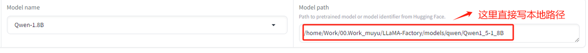

* **选择微调方法**

  在微调方法方面，LLaMA-Factory提供了全参数微调、部分参数微调和LoRA微调三个选项。而在界面右侧的Adapter path下拉菜单中，我们可以选择在之前的微调过程中生成并保存的Adapter来使用。如果之前没有完成过完整的微调过程，此处的下拉框是空的，不选择并不会影响本轮的微调。

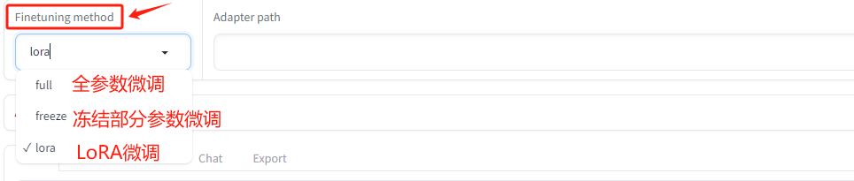

  在此，我们重点介绍LoRA（Low-Rank Adaptation）微调方法。选择LoRA后，我们需进入其相邻的`Advanced configurations`进行以下两项关键配置：首先，关于Quantization bit，其默认设置为None，此时将执行标准的LoRA微调过程。若选择量化等级为4或8，则将采用QLoRA（Quantized LoRA）执行微调。其次，我们需要选取与所选模型相匹配的Prompt模板。

  **注意：Prompt template 对于所有“基座”（Base）模型，可以是 default, alpaca, vicuna 等任意值，但“对话”（Chat）模型一定要使用对应的模板。**

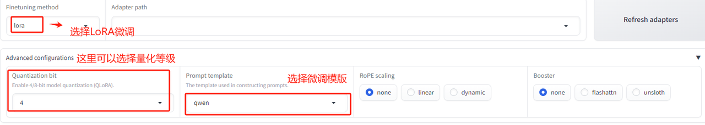

  不同的模型有不同的Prompt template，其定义的程序文件存放路径在：`LLaMA-Factory/src/llmtuner/data`

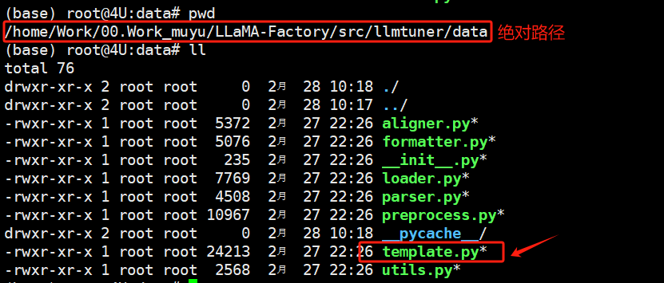

  Qwen-Chat模型的对话格式我们在之前的内容中多次介绍过，大家应该比较熟悉，即：

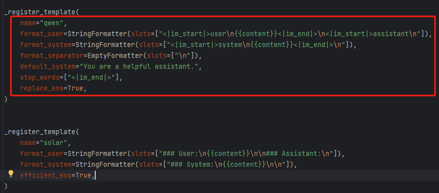

* **配置训练参数**

  首先看训练模式，这里就对应我们在开始部分介绍的预训练（Pre-Training）、指令监督微调（Supervised Fine-Tuning）、奖励模型训练（Reward Modeling）、PPO 训练（PPO Training）、DPO 训练（DPO Training）五种，而我们最常用的主要还是借助指令监督微调（Supervised Fine-Tuning）来提升模型对垂直领域的自我认知能力。

  选择好训练方式后，则需要匹配适合指令监督微调的数据集，LLaMA-Factory内置了多个数据集，可供我们直接选择，在前端下拉框可以选择数据集并提供数据集预览。这里我们选择`alpaca_gpt4_data_zh.json`数据集，是由GPT4生成的中文alpaca数据，其形式如下：

```json
  {
    "instruction": "保持健康的三个提示。",
    "input": "",
    "output": "以下是保持健康的三个提示：\n\n1. 保持身体活动。每天做适当的身体运动，如散步、跑步或游泳，能促进心血管健康，增强肌肉力量，并有助于减少体重。\n\n2. 均衡饮食。每天食用新鲜的蔬菜、水果、全谷物和脂肪含量低的蛋白质食物，避免高糖、高脂肪和加工食品，以保持健康的饮食习惯。\n\n3. 睡眠充足。睡眠对人体健康至关重要，成年人每天应保证 7-8 小时的睡眠。良好的睡眠有助于减轻压力，促进身体恢复，并提高注意力和记忆力。"
  },
  {
    "instruction": "三原色是什么？",
    "input": "",
    "output": "三原色通常指的是红色、绿色和蓝色（RGB）。它们是通过加色混合原理创建色彩的三种基础颜色。在以发光为基础的显示设备中（如电视、计算机显示器、智能手机和平板电脑显示屏）, 三原色可混合产生大量色彩。其中红色和绿色可以混合生成黄色，红色和蓝色可以混合生成品红色，蓝色和绿色可以混合生成青色。当红色、绿色和蓝色按相等比例混合时，可以产生白色或灰色。\n\n此外，在印刷和绘画中，三原色指的是以颜料为基础的红、黄和蓝颜色（RYB）。这三种颜色用以通过减色混合原理来创建色彩。不过，三原色的具体定义并不唯一，不同的颜色系统可能会采用不同的三原色。"
  },
```

  而训练参数也都非常直观，可以根据自己的判断灵活调整。

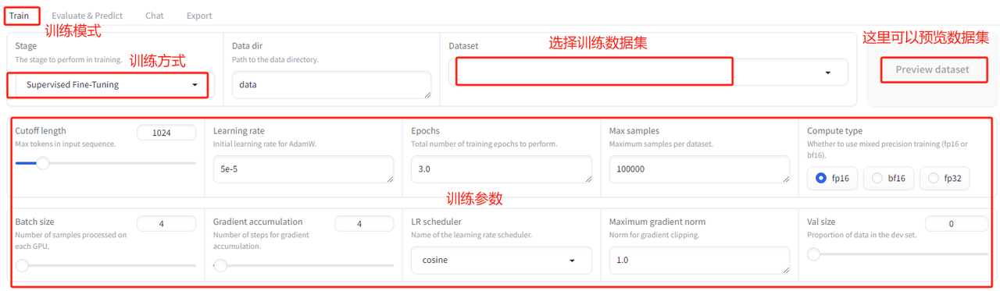

  其后台存储的路径为：`LLaMA-Factory/data`

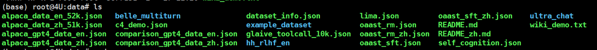

  而其每个数据集的来源和更加详细的说明，大家可以在Github中找到一一对应的入口链接：https://github.com/hiyouga/LLaMA-Factory/tree/main

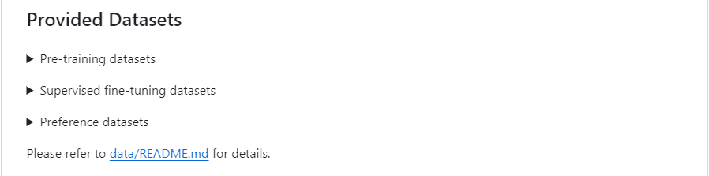

* **其他配置**

  除了上述核心配置选项之外，日志记录、模型保存等其他训练过程相关的细节也可以进行个性化设置。具体调整哪些参数如LoRA或RLHF，取决于我们之前选择的微调方法。例如，如果我们选择了LoRA微调，那么我们应进一步精细化LoRA的结构参数设置。调整RLHF相关参数则不会对训练产生影响，因为这一方法并未被使用。

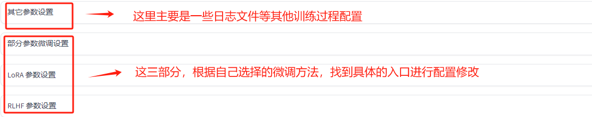

* **启动微调**

  完成所有微调配置之后，可以选择指定一个文件名来保存微调后的权重参数到Adapter中。设置完毕后，点击“开始”按钮即可启动微调训练流程。

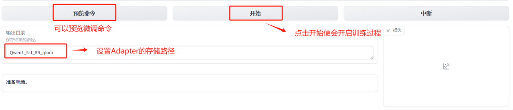

  当正常启动后，可以在LLaMA Board上直观的看到微调的整体进度和实时的损失变化情况。此时耐心等待微调完成即可。

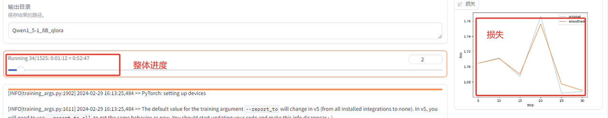

  此时查看后台服务器的GPU资源，也仅仅使用单块GPU，这正是使用LLaMA Board时的最大的一个限制。

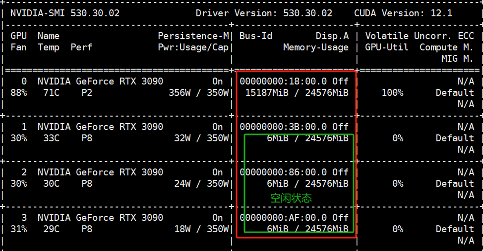

  等待训练完成后，在LLaMA Board上会直接提示训练完成的进度：

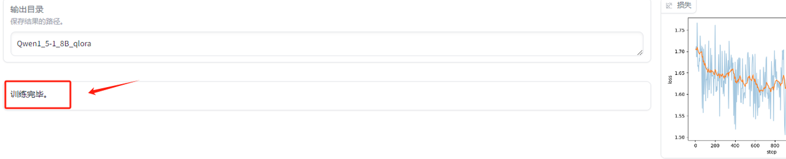

  经过LoRA微调生成的Adapter权重和其相对应的配置文件，其存放在本地服务器下`LLaMA-Factory/saves/Qwen1.5-1.8B/lora/Qwen1_5-1_8B_qlora`路径下：

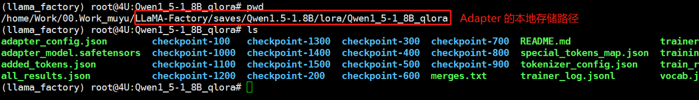

* **使用微调后的模型**

  对于LoRA微调，训练结束后如果想使用其微调后的模型，在LLaMA Board上也可以非常方便的加载，具体使用的过程如下：


  如上图所示，先切换到Chat栏，点击刷新适配器按钮，选择刚刚微调好的Qwen1.5\_1\_8b\_qlora，点击加载模型按钮载入刚刚训练好的模型。这个过程，就会先启动Qwen1.5\_1\_8b模型，然后合并经过qLora微调的Adapter，执行接下来的对话过程。

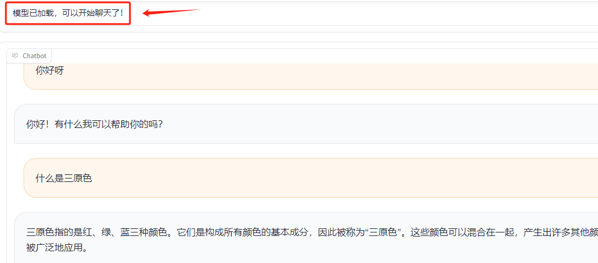

  通过上述步骤，我们可以完整地实现微调流程，且整个过程均可通过页面端完成，整体用户体验非常良好。大家也可以根据上述的流程，尝试对ChatGLM3-6B和Biachuan2系列模型进行LoRA或QLoRA微调，或者其他支持的系列模型。当然，除了分步加载微调后得到的Adapter 和 原始模型，在LLaMA Board上还可以一键进行模型权重的合并，具体操作如下：

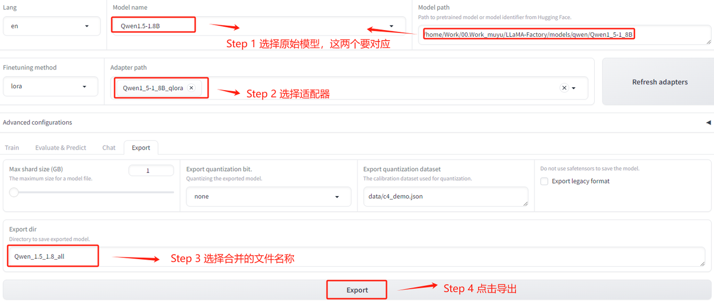

  等待完成导出后，会在本地的服务器端生成合并后的模型，此时便可以通过常规、通用的调用大模型方法来进行交互。

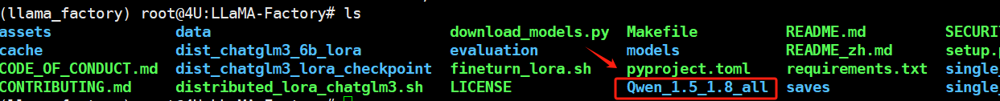

  同样，也可以使用相同的方式通过LLaMA-Factory来微调Qwen初代模型、ChatGLM3-6B模型和Biachuan模型，只需要按照如下方式进行修改即可：

* **Qwen一代**

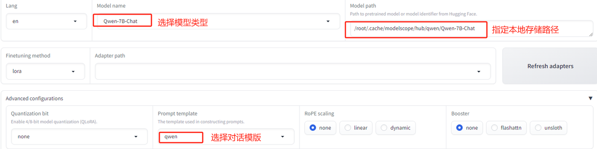

* **ChatGLM3-6B**

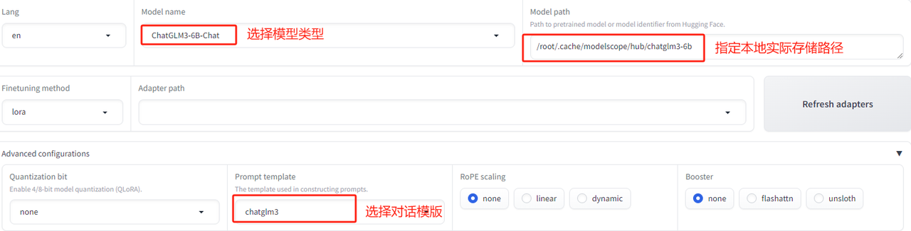

* **Baichuan2**


  但不得不考虑的是，虽然通过LLaMA Board操作直观且便捷，但其明显限制是它只支持单GPU操作，而且其Board上集成的可调节参数是有限的。因此，对于参数量较大的模型，或者需要在训练过程中载入更多的超参数、优化工具，仍需依赖服务器端的代码控制加分布式训练的方式来进行微调。所以掌握命令行端的分布式训练方是我们必须要具备的能力，也是我们需要学习的重点。

  接下来，我们将以Qwen和ChatGLM3-6B模型为例，详细介绍如何利用LLaMA-Factory项目在代码层面开展单卡微调和分布式微调的具体实现方式。

# 4. 终端命令行单卡微调Qwen模型

  在上一节中，我们探讨了在LLaMA Board上执行Qwen1.5版本模型微调的过程。本节将以Qwen的初代模型为例，介绍如何使用命令行终端和代码来进行单卡微调操作。除此之外，我们还将提供关于ChatGLM3和Baichuan2系列模型微调的详细说明和可执行脚本示例。

* **微调数据集**

  我们还是直接使用 `alpaca_gpt4_zh`数据集，也就是由GPT4生成的中文alpaca数据，其存放在LLaMA-Factory项目文件的data目录下，整体格式如下：

```json
    instruction：任务指令，不能为空。
    input：任务输入，可为空。如果不为空，项目内部处理训练数据时，会将 instruction、input 拼接在一起作为任务的输入。
    output：任务输出，不能为空。
```

  示例数据如下：

```json
  {
    "instruction": "保持健康的三个提示。",
    "input": "",
    "output": "以下是保持健康的三个提示：\n\n1. 保持身体活动。每天做适当的身体运动，如散步、跑步或游泳，能促进心血管健康，增强肌肉力量，并有助于减少体重。\n\n2. 均衡饮食。每天食用新鲜的蔬菜、水果、全谷物和脂肪含量低的蛋白质食物，避免高糖、高脂肪和加工食品，以保持健康的饮食习惯。\n\n3. 睡眠充足。睡眠对人体健康至关重要，成年人每天应保证 7-8 小时的睡眠。良好的睡眠有助于减轻压力，促进身体恢复，并提高注意力和记忆力。"
  },
  {
    "instruction": "三原色是什么？",
    "input": "",
    "output": "三原色通常指的是红色、绿色和蓝色（RGB）。它们是通过加色混合原理创建色彩的三种基础颜色。在以发光为基础的显示设备中（如电视、计算机显示器、智能手机和平板电脑显示屏）, 三原色可混合产生大量色彩。其中红色和绿色可以混合生成黄色，红色和蓝色可以混合生成品红色，蓝色和绿色可以混合生成青色。当红色、绿色和蓝色按相等比例混合时，可以产生白色或灰色。\n\n此外，在印刷和绘画中，三原色指的是以颜料为基础的红、黄和蓝颜色（RYB）。这三种颜色用以通过减色混合原理来创建色彩。不过，三原色的具体定义并不唯一，不同的颜色系统可能会采用不同的三原色。"
  },
```

* **微调模版**

  Qwen初代模型和1.5版本模型在LLaMA-Factory中都使用的是`qwen`模版，即：

```json
_register_template(
    name="qwen",
    format_user=StringFormatter(slots=["<|im_start|>user\n{{content}}<|im_end|>\n<|im_start|>assistant\n"]),
    format_system=StringFormatter(slots=["<|im_start|>system\n{{content}}<|im_end|>\n"]),
    format_separator=EmptyFormatter(slots=["\n"]),
    default_system="You are a helpful assistant.",
    stop_words=["<|im_end|>"],
    replace_eos=True,
)
```

  我们在前面强调过，“对话”（Chat）模型在微调时务必使用对应的模板，所以这一点大家在后续使用其它模型时一定要注意。

* **微调主程序**

  在LLaMA-Factory项目中，微调任务的启动是通过`train_bash.py`这一主入口文件进行的。整个微调流程已在`llmtuner`目录下的相关代码文件中实现，因此，在启动微调时，我们只需根据自己的需求指定相应的参数即可。对于Qwen模型来说，启动微调时需要指定的参数如下：

```bash
    CUDA_VISIBLE_DEVICES=0 python src/train_bash.py \   ## 单卡运行
      --stage sft \                                     ## --stage pt （预训练模式）  --stage sft（指令监督模式） 
      --do_train True \                                 ## 执行训练模型
      --model_name_or_path /root/.cache/modelscope/hub/qwen/Qwen-1_8B-Chat-Int4 \   ## 模型的存储路径
      --dataset alpaca_gpt4_zh \                        ## 训练数据的存储路径，存放在 LLaMA-Factory/data路径下
      --template qwen \                                 ## 选择Qweb模版 
      --lora_target c_attn  \                           ## 默认模块应作为 --lora_target 参数的默认值，可使用 --lora_target all 参数指定全部模块
      --output_dir single_lora_qwen_checkpoint \        ## 微调后的模型保存路径
      --overwrite_cache \                               ## 是否忽略并覆盖已存在的缓存数据
      --per_device_train_batch_size 4 \                 ## 用于训练的批处理大小。可根据 GPU 显存大小自行设置。
      --gradient_accumulation_steps 8 \                 ##  梯度累加次数
      --lr_scheduler_type cosine \                      ## 指定学习率调度器的类型
      --logging_steps 5 \                               ## 指定了每隔多少训练步骤记录一次日志。这包括损失、学习率以及其他重要的训练指标，有助于监控训练过程。
      --save_steps 100 \                                ## 每隔多少训练步骤保存一次模型。这是模型保存和检查点创建的频率，允许你在训练过程中定期保存模型的状态
      --learning_rate 5e-5 \                            ## 学习率
      --num_train_epochs 1.0                            ## 指定了训练过程将遍历整个数据集的次数。一个epoch表示模型已经看过一次所有的训练数据。
      --finetuning_type lora \                          ## 参数指定了微调的类型，lora代表使用LoRA（Low-Rank Adaptation）技术进行微调。
      --fp16 \                                          ## 开启半精度浮点数训练
      --lora_rank 8 \                                   ## 在使用LoRA微调时设置LoRA适应层的秩。
      --quantization_bit 4                              # 4 比特的 LoRA 训练（也称 QLoRA），同时还可以设置8
```

  同时，对于我们在使用LLaMA Board时看到的Loss可视化，也可以通过Tensorboard工具来进行本地配置。即：

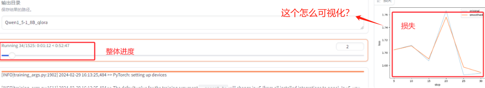

  TensorBoard 是 TensorFlow 的可视化工具套件，用于理解、调试和优化机器学习模型的训练过程。它提供了一系列丰富的可视化仪表板，可以帮助开发者直观地监控模型训练过程中的各种指标，包括损失和准确率曲线、张量（Tensor）分布、模型图（Graphs）、嵌入向量的可视化等。如果想要使用TensorBoard，按照正常流程我们需要在模型训练代码中添加TensorFlow的Summary API，用于记录关键数据，然后通过启动TensorBoard服务来查看这些数据的可视化表示。

  鉴于LLaMA Factory已经集成了Tensorboard支持，因此无需对代码进行额外修改即可接入训练数据信息。要在训练过程中有效利用Tensorboard进行数据监控，只需按照以下步骤执行操作：

* **Step 1. 安装依赖包**

  TensorBoard 包含在 TensorFlow 库中，所以需要安装 TensorFlow，当然也可以单独安装 TensorBoard，安装命令如下：

```bash
pip install tensorFlow
pip install tensorboard
```

* **Step 2. 添加训练参数**

  在LLaMA-Factory中，使用`report_to`参数指定，具体来说，需要添加如下两行参数：

```bash
  --report_to "tensorboard" \    # 使用Tensorboard
  --logging_dir single_lora_qwen_log \   # Tensorboard的数据日志路径
```

  因此，我们对Qwen模型使用LoRA微调的完整训练命令整合到名为`single_lora_qwen.sh`的脚本文件中。全部内容如下：

```bash
#!/bin/bash
export CUDA_DEVICE_MAX_CONNECTIONS=1

export NCCL_P2P_DISABLE="1"
export NCCL_IB_DISABLE="1"


# 如果是预训练，添加参数       --stage pt \
# 如果是指令监督微调，添加参数  --stage sft \
# 如果是奖励模型训练，添加参数  --stage rm \
# 添加 --quantization_bit 4 就是4bit量化的QLoRA微调，不添加此参数就是LoRA微调 \


CUDA_VISIBLE_DEVICES=0 python src/train_bash.py \
  --report_to "tensorboard" \
  --logging_dir single_lora_qwen_log \
  --stage sft \
  --do_train True \
  --model_name_or_path /root/.cache/modelscope/hub/qwen/Qwen-1_8B-Chat-Int4 \
  --dataset alpaca_gpt4_zh \
  --template qwen \
  --lora_target c_attn  \
  --output_dir single_lora_qwen_checkpoint \
  --overwrite_cache \
  --per_device_train_batch_size 4 \
  --gradient_accumulation_steps 8 \
  --lr_scheduler_type cosine \
  --logging_steps 5 \
  --save_steps 100 \
  --learning_rate 5e-5 \
  --num_train_epochs 1.0 \
  --finetuning_type lora \
  --fp16 \
  --lora_rank 8 \
  --quantization_bit 4
```

* **Step 3. 启动训练**

  然后，进入到服务器终端，使用如下命令启动训练过程：

```bash
./single_lora_qwen.sh
```

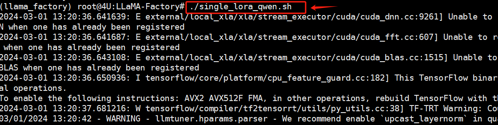

  当训练启动后，会在本地生成如下两个文件夹：

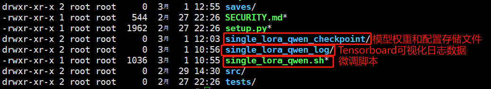

* **Step 4. 启动Tensorboard**

  在网页端可视化训练数据，我们可以通过以下命令启动Tensorboard组件，从而加载训练过程中的数据并开启一个网页服务：

```bash
tensorboard --logdir="single_lora_qwen_log" --host 192.168.110.131 --port 6006
```

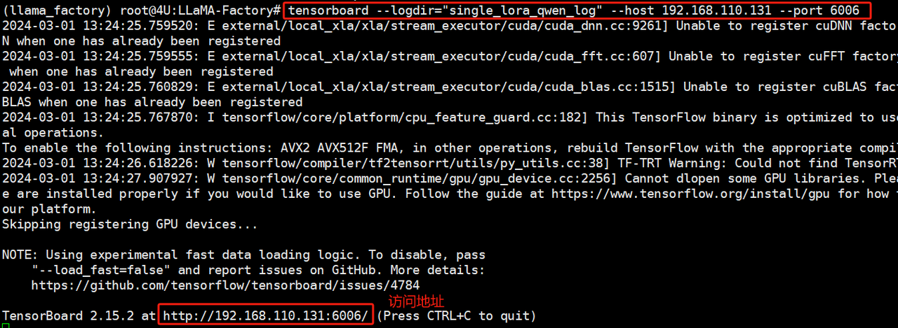

* **Step 5. 访问Tensorboard**

  根据访问地址，在浏览器打开，即可看到全部的可视化数据：

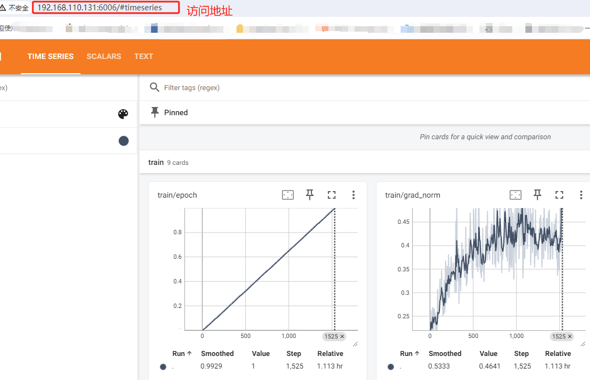

  损失函数波动情况：

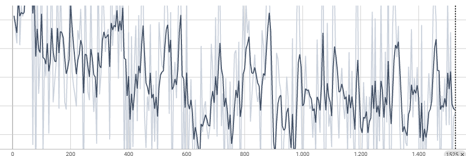

  遵循相似的流程，我们同样可以对ChatGLM3-6B和Baichuan2系列模型进行微调。不过，根据每个模型的具体特性，需要做出以下几个方面的调整：

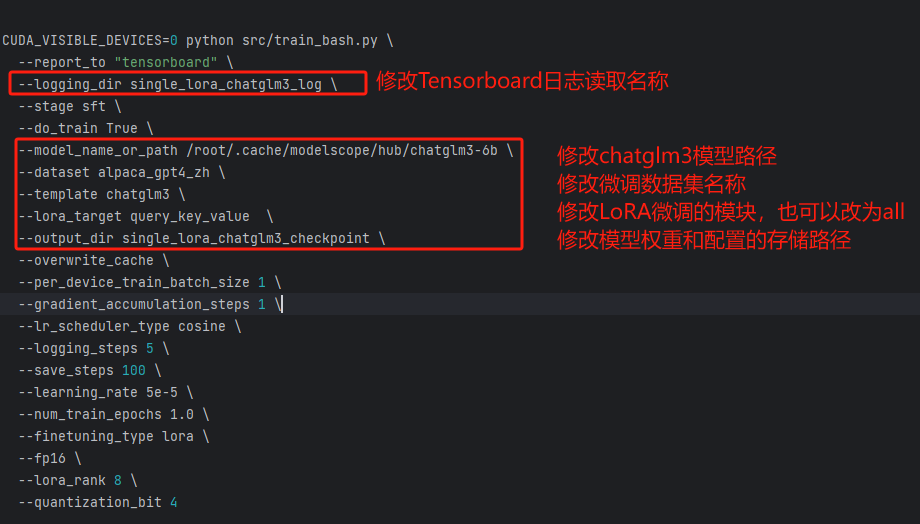

  注意：如果在执行过程中报如下错误：

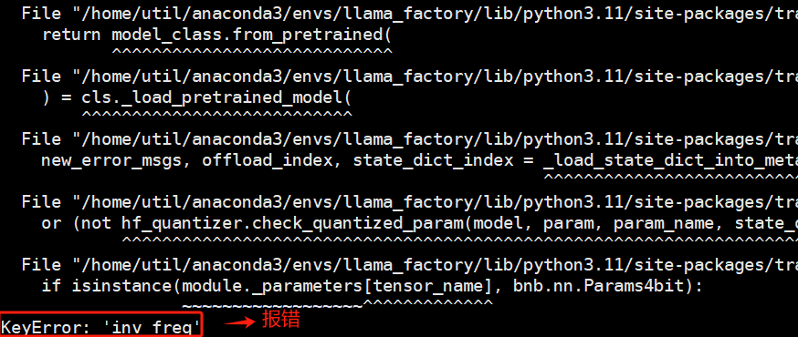

  报错原因是因为Transformers库的版本过高，需要降级，执行如下命令：

```bash
pip install transformers==4.37.2
```

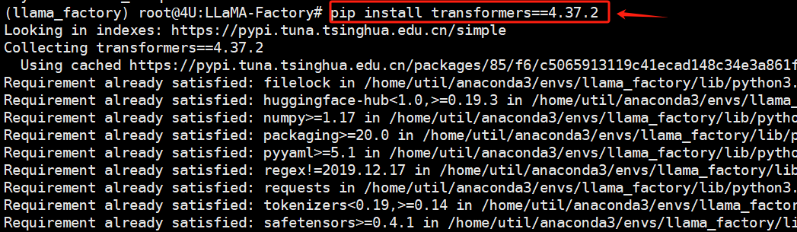

  降级版本后，即可正常启动微调作业。

  对于Baichuan2模型，需要进行的关键调整与前述相同。至于其他微调参数，大家可以根据个人需求进行自定义添加。同时，我们已经将`single_lora_qwen.sh`、`single_lora_chatglm3.sh`和`single_lora_baichuan2.sh`这三个脚本文件上传至课程的下载区域，供大家按需选用并运行微调脚本。

  需特别说明的是，上述三个脚本仅适用于单GPU微调环境。接下来，我们将探讨一种更为高效的训练策略——分布式训练方法。并以ChaGLM3-6B模型为例进行实操。

# 5. 分布式微调ChatGLM3-6B模型

  在LLaMA-Factory中，多 GPU 分布式训练需要使用Huggingface Accelerate。 Accelerate 是一个库，可通过仅仅几行代码实现在任何分布式配置上运行相同的 PyTorch 代码。Accelerate 可在 pypi 和 conda 以及 GitHub 上使用。LLaMA Factory 项目推荐的Accelerate版本为0.27.2，所以我们需要执行的安装命令如下：

```bash
pip install accelerate==0.27.2
```

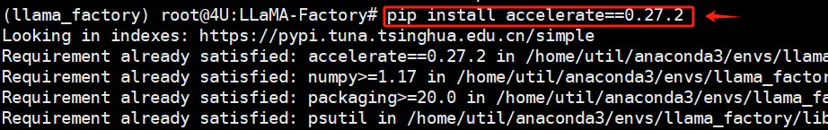

  安装后，需要配置 Accelerate，自定义在当前系统下如何个性化设置已支持分布式训练。为此，需要运行如下命令并回答提示的问题：

```bash
accelerate config
```

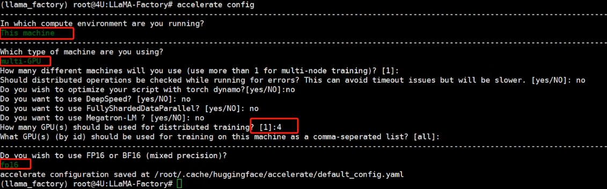

  配置中比较关键的几个点已经大家做了标识，如上所示：需要正确根据自己的机器情况进行选择，而其他的一些加速框架和训练策略，可以根据自己的实际需求和条件来决定。

  完成初始化配置后，可以通过如下方式在任何系统上加载该组件，即：

```plaintext
accelerate launch {my_script.py}
```

  所以，对于我们的微调项目来说，其主文件是`train_bash.py`，我们就可以这样配置微调脚本已启用accelerate执行分布式微调：

```bash
#!/bin/bash
export CUDA_DEVICE_MAX_CONNECTIONS=1

export NCCL_P2P_DISABLE="1"
export NCCL_IB_DISABLE="1"

# 如果使用qlora 报错：KeyError: 'inv_freq'， 需要降低transformers降版本到4.37.2就行了

accelerate launch src/train_bash.py \
  --report_to "tensorboard" \
  --logging_dir dist_chatglm3_6b_lora \
  --do_train \
  --model_name_or_path /root/.cache/modelscope/hub/chatglm3-6b \
  --dataset alpaca_gpt4_zh \
  --template chatglm3 \
  --lora_target all \
  --output_dir dist_chatglm3_lora_checkpoint \
  --overwrite_cache \
  --per_device_train_batch_size 1 \
  --gradient_accumulation_steps 1 \
  --lr_scheduler_type cosine \
  --logging_steps 10 \
  --save_steps 200 \
  --learning_rate 5e-5 \
  --num_train_epochs 3.0 \
  --plot_loss \
  --fp16 \
  --lora_rank 8 \
```

  上述代码可以写入`distributed_lora_chatglm3.sh`脚本文件中，直接使用`./distributed_lora_chatglm3.sh`命令启动微调。

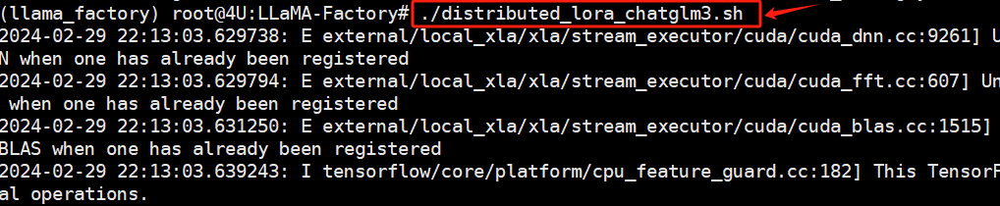

  在训练过程中，如果观察到机器上所有可用的GPU都被充分利用，则说明配置成功。

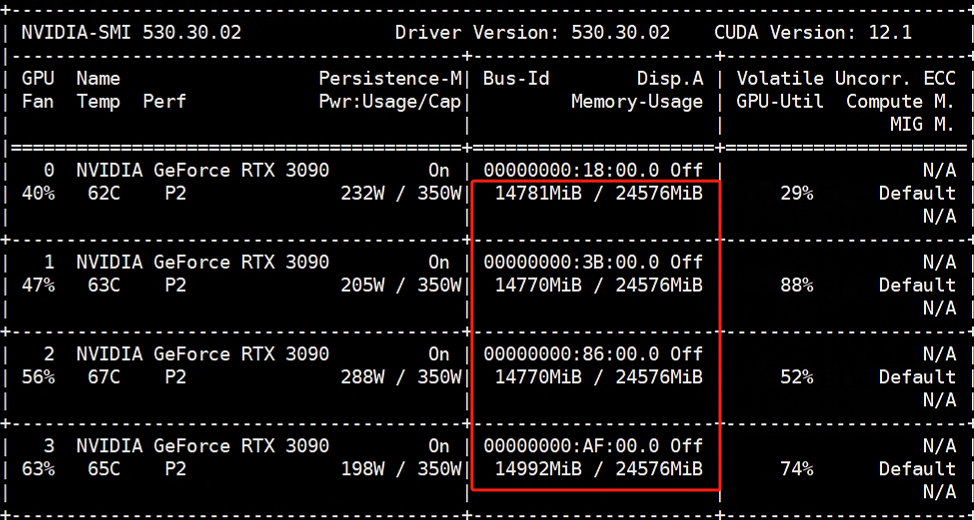

  同样，当成功启动微调任务后，会在本地生成Tensorboard文件和模型权重存储文件，如下：

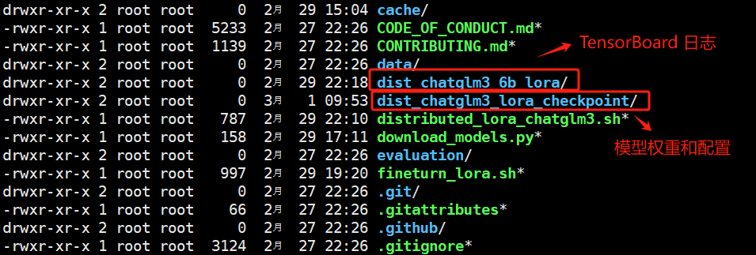

  可以使用如下命令，在Tensorboard上加载此轮训练过程的日志数据，执行如下命令：

```bash
tensorboard --logdir="dist_chatglm3_6b_lora" --host 192.168.110.131 --port 6006
```

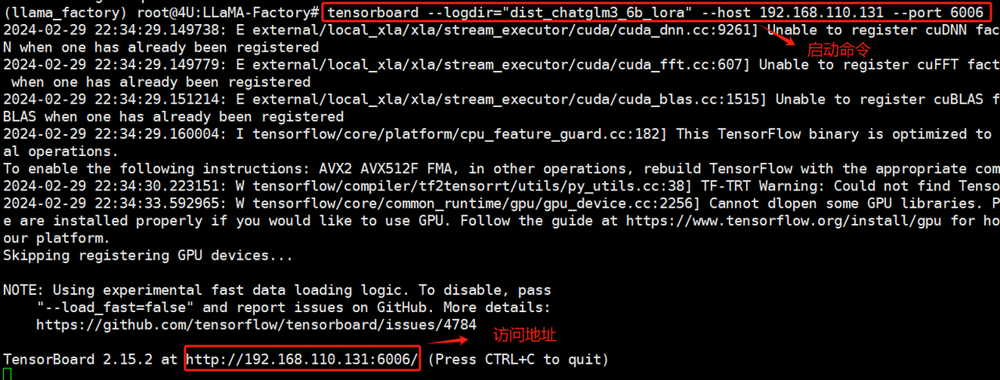

  如果操作无误，即可在浏览器中通过`http://192.168.110.131:6006`页面中看到训练过程中的可视化信息。

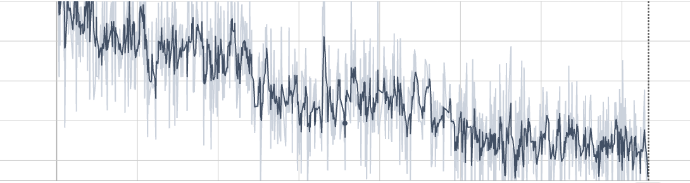

  同样地，对于有分布式训练需求的小伙伴，我们在课件下载区也提供了`distributed_lora_chatglm3.sh`、`distributed_lora_qwen.sh`以及`distributed_lora_baichuan2.sh`这三个脚本，用于分布式训练模式下的微调操作。大家可以根据需要下载这些脚本，以便进行分布式微调的实践。

# 6. 合并 LoRA 权重并使用新模型进行推理

  微调结束后，LoRA微调会将新训练的参数保存在Checkpoint文件中。为了使用这些微调后的参数，我们必须将它们与原始模型合并。以ChatGLM3-6B模型为例：

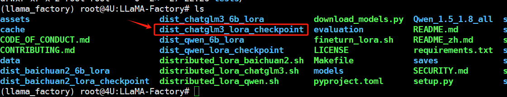

  每个Checkpoint都包含了不同训练阶段的Adapter的完整副本。在这种情况下，我们选择最新的一个，即训练结束时生成的最后一个Checkpoint。


  在LLaMA-Factory中，合并LoRA权重可以通过使用`export_model.py`脚本完成。我们只需修改相应模型的具体配置信息即可。以ChatGLM3-6B模型为例，按照以下示例进行配置修改：

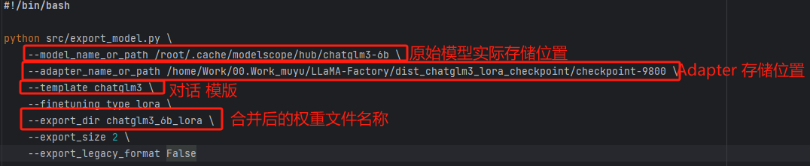

  我们把上述代码写在`merge_model.sh`脚本中，直接在服务器终端执行：

```bash
./merge_model.sh
```

  该脚本执行完成后，会在指定的路径下生成新的合并后的模型权重和配置文件。

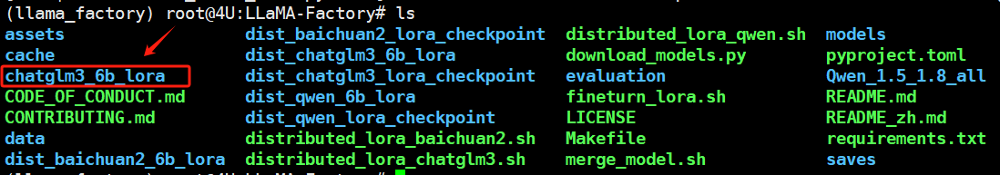

  接下来，就可以使用大家非常熟悉的大模型调用方法来使用该新的微调模型，如web\_demo、API等方式。这里我们直接使用transformers库直接加载快速验证：

```python
# 导入transformers库
from transformers import AutoModelForCausalLM, AutoTokenizer

# 加载分词器，需要修改为本地的实际存储路径
tokenizer = AutoTokenizer.from_pretrained("/home/Work/00.Work_muyu/LLaMA-Factory/chatglm3_6b_lora", trust_remote_code=True)

# 加载模型文件，需要修改为本地的实际存储路径
model = AutoModelForCausalLM.from_pretrained("/home/Work/00.Work_muyu/LLaMA-Factory/chatglm3_6b_lora", device_map="auto", trust_remote_code=True)
```

```plaintext
/home/util/anaconda3/envs/baichuan2/lib/python3.11/site-packages/tqdm/auto.py:21: TqdmWarning: IProgress not found. Please update jupyter and ipywidgets. See https://ipywidgets.readthedocs.io/en/stable/user_install.html
  from .autonotebook import tqdm as notebook_tqdm
Setting eos_token is not supported, use the default one.
Setting pad_token is not supported, use the default one.
Setting unk_token is not supported, use the default one.
Loading checkpoint shards: 100%|██████████| 7/7 [01:55<00:00, 16.49s/it]
```

```python
# 第一轮对话
response, history = model.chat(tokenizer, "你好，请你介绍一下你自己", history=None)
print(response)
```

```plaintext
你好！我是一个人工智能助手，我的名字是 ChatGLM，我是一个基于清华大学 KEG 实验室和智谱 AI 公司于 2023 年共同训练的语言模型。我的目的是通过回答用户的问题和提供帮助来为用户提供服务。
```

```python
# 第一轮对话
response, history = model.chat(tokenizer, "保持健康的三个提示。", history=None)
print(response)
```

```plaintext
1. 均衡饮食：保持健康的饮食是关键，选择多种蔬菜、水果、谷物、蛋白质和健康脂肪的均衡饮食。避免过多摄入加工食品和含糖饮料，多喝水，适量摄入盐分。

2. 适度锻炼：锻炼不仅能够增强身体素质，还能改善心理健康。每天至少进行30分钟的有氧运动，如快走、跑步、游泳或骑自行车。此外，还可以进行一些力量训练和伸展运动，以保持关节和肌肉的灵活性。

3. 保持良好的睡眠习惯：睡眠对身体健康至关重要。保持良好的睡眠习惯，每天保证7-9小时的睡眠，并尽量保持规律的作息时间。避免晚上熬夜，避免在床上看电视或使用电子设备，保持安静的环境以帮助入睡。
```

```python
# 第一轮对话
response, history = model.chat(tokenizer, "什么是三原色", history=None)
print(response)
```

```plaintext
三原色是颜色的基础，指的是红色、绿色和蓝色。它们在视觉上具有非常鲜明的对比，并且被认为是无法通过其他颜色的混合得到的。在计算机图形学和数字颜色理论中，三原色经常用来表示颜色的基本构建块。

红色、绿色和蓝色都是电磁波谱中的不同波长，它们可以通过不同比例的混合来产生各种颜色。当红色、绿色和蓝色按不同比例混合时，它们可以产生一种新的颜色，这种颜色被称为原色混合色。原色混合色具有非常鲜艳的颜色，并且可以在计算机图形学和数字颜色理论中用来创建各种颜色。
```

# 7. 如何使用自定义数据集

  通过上述流程，我们给大家介绍了如何利用LLaMA Board、命令行终端进行单GPU微调，以及分布式的微调训练方法。在每个步骤中，我们均采用了`alpaca_gpt4_data_zh.json`作为训练数据集，即：

```json
  {
    "instruction": "保持健康的三个提示。",
    "input": "",
    "output": "以下是保持健康的三个提示：\n\n1. 保持身体活动。每天做适当的身体运动，如散步、跑步或游泳，能促进心血管健康，增强肌肉力量，并有助于减少体重。\n\n2. 均衡饮食。每天食用新鲜的蔬菜、水果、全谷物和脂肪含量低的蛋白质食物，避免高糖、高脂肪和加工食品，以保持健康的饮食习惯。\n\n3. 睡眠充足。睡眠对人体健康至关重要，成年人每天应保证 7-8 小时的睡眠。良好的睡眠有助于减轻压力，促进身体恢复，并提高注意力和记忆力。"
  },
  {
    "instruction": "三原色是什么？",
    "input": "",
    "output": "三原色通常指的是红色、绿色和蓝色（RGB）。它们是通过加色混合原理创建色彩的三种基础颜色。在以发光为基础的显示设备中（如电视、计算机显示器、智能手机和平板电脑显示屏）, 三原色可混合产生大量色彩。其中红色和绿色可以混合生成黄色，红色和蓝色可以混合生成品红色，蓝色和绿色可以混合生成青色。当红色、绿色和蓝色按相等比例混合时，可以产生白色或灰色。\n\n此外，在印刷和绘画中，三原色指的是以颜料为基础的红、黄和蓝颜色（RYB）。这三种颜色用以通过减色混合原理来创建色彩。不过，三原色的具体定义并不唯一，不同的颜色系统可能会采用不同的三原色。"
  },
```

  显然，针对实际的微调需求，使用专门针对业务垂直领域的私有数据进行大模型微调才是我们需要做的。因此，我们需要探讨如何在LLaMA-Factory项目及上述创建的微调流程中引入自定义数据集进行微调。\*\*对于LLaMA-Factory项目，目前仅支持两种格式的数据集：`alpaca` 和 `sharegpt`，\*\*其中 `alpaca` 格式的数据集按照以下方式组织：

```json
[
  {
    "instruction": "用户指令（必填）",
    "input": "用户输入（选填）",
    "output": "模型回答（必填）",
    "system": "系统提示词（选填）",
    "history": [
      ["第一轮指令（选填）", "第一轮回答（选填）"],
      ["第二轮指令（选填）", "第二轮回答（选填）"]
    ]
  }
]
```

  很明显，我们一直使用的`alpaca_gpt4_data_zh.json`就是标准的`alpaca`格式，而我们在脚本中，可以通过`--dataset` 的方式加载：

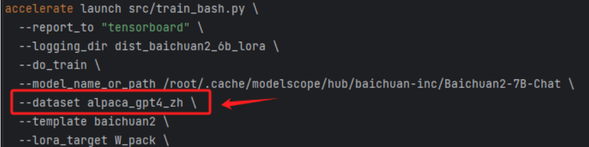

  能够顺利加载的原因在于，所有的数据文件，在LLaMA-Factory项目中均使用`dataset_info.json`进行定义和管理，其存储位置在`LLaMA-Factory/data`目录下：

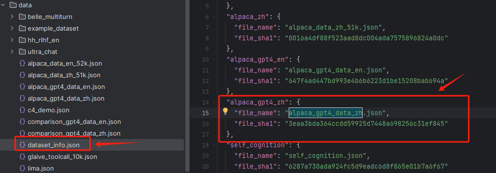

  在这个文件中，定义一个数据集的格式如下：

```json
"数据集名称": {
  "hf_hub_url": "Hugging Face 的数据集仓库地址（若指定，则忽略 script_url 和 file_name）",
  "ms_hub_url": "ModelScope 的数据集仓库地址（若指定，则忽略 script_url 和 file_name）",
  "script_url": "包含数据加载脚本的本地文件夹名称（若指定，则忽略 file_name）",
  "file_name": "该目录下数据集文件的名称（若上述参数未指定，则此项必需）",
  "file_sha1": "数据集文件的 SHA-1 哈希值（可选，留空不影响训练）",
  "subset": "数据集子集的名称（可选，默认：None）",
  "folder": "Hugging Face 仓库的文件夹名称（可选，默认：None）",
  "ranking": "是否为偏好数据集（可选，默认：False）",
  "formatting": "数据集格式（可选，默认：alpaca，可以为 alpaca 或 sharegpt）",
  "columns（可选）": {
    "prompt": "数据集代表提示词的表头名称（默认：instruction）",
    "query": "数据集代表请求的表头名称（默认：input）",
    "response": "数据集代表回答的表头名称（默认：output）",
    "history": "数据集代表历史对话的表头名称（默认：None）",
    "messages": "数据集代表消息列表的表头名称（默认：conversations）",
    "system": "数据集代表系统提示的表头名称（默认：None）",
    "tools": "数据集代表工具描述的表头名称（默认：None）"
  },
  "tags（可选，用于 sharegpt 格式）": {
    "role_tag": "消息中代表发送者身份的键名（默认：from）",
    "content_tag": "消息中代表文本内容的键名（默认：value）",
    "user_tag": "消息中代表用户的 role_tag（默认：human）",
    "assistant_tag": "消息中代表助手的 role_tag（默认：gpt）",
    "observation_tag": "消息中代表工具返回结果的 role_tag（默认：observation）",
    "function_tag": "消息中代表工具调用的 role_tag（默认：function_call）",
    "system_tag": "消息中代表系统提示的 role_tag（默认：system，会覆盖 system 列）"
  }
}
```

  可以看到，上述的定义格式还是非常复杂的，但在使用过程中，我们并不需要全部去填写，其中比较关键的部分，且必须定义的参数是：

```json
  "数据集名称": {
    "formatting": "sharegpt",                 # 数据集格式（可选，默认：alpaca，可以为 alpaca 或 sharegpt）
    "file_name": " ",                         # 具体的文件名称
  "columns": {
    ...
    ...
    ...
  },
  "tags": {
    ...
    ...
    ...
  }
},
```

  所以对于alpaca格式的数据，dataset\_info.json 中的 columns 应为：

```json
"数据集名称": {
  "columns": {
    "prompt": "instruction",
    "query": "input",
    "response": "output",
    "system": "system",
    "history": "history"
  }
}
```

  反观另外一种支持的数据格式：sharegpt 格式，其标准形式如下：

```json
[
  {
    "conversations": [
      {
        "from": "human",
        "value": "用户指令"
      },
      {
        "from": "gpt",
        "value": "模型回答"
      }
    ],
    "system": "系统提示词（选填）",
    "tools": "工具描述（选填）"
  }
]
```

  这种形式我们就非常熟悉了，在《Ch.15 LoRA的理论解读及基于LoRA微调一个医疗垂直领域的Qwen模型》中使用的医疗数据集，即：

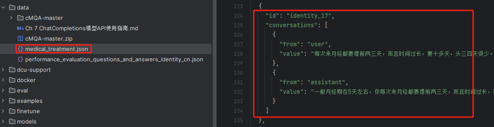

  关于sharegpt 格式，在`dataset_info.json`中的定义形式就是如下：

```json
"数据集名称": {
  "columns": {
    "messages": "conversations",
    "system": "system",
    "tools": "tools"
  },
  "tags": {
    "role_tag": "from",
    "content_tag": "value",
    "user_tag": "human",
    "assistant_tag": "gpt"
  }
}
```

  接下来，我们就来演示一下，应该如何在微调中加入自己的数据集。还是使用《Ch.15 LoRA的理论解读及基于LoRA微调一个医疗垂直领域的Qwen模型》中使用的医疗数据集。

```python
import pandas as pd
```

```python
question_file_path = 'Z:/00.Work_muyu/muyu_qwen/data/cMQA-master/questions/questions.csv'  # 替换为你的文件路径
questions_df = pd.read_csv(question_file_path)
print(questions_df.head(10))
```

```plaintext
   question_id                                            content
0            1                               第一天白天拉了4-5次后来每天拉2-3次
1            2                               皮肤赘生物，传染性软疣到底怎么治疗呢？？
2            3          我月经已经超过20天没来了用试纸检查没有怀孕，我刚刚参加工作会不会是工作压力导致的
3            4  您好:医生我女儿六个月，很可爱很聪明，只是我发现她双手拇指展开的不是很好，给她东西时她会展开...
4            5  我有口臭，吃饭没问题。饭量也很好，好像消化很好。但是偏瘦。。请问，我这是怎么了，有什么解决吗？谢谢
5            6  我每次跟男朋友做完隔天第二次小便之後都會頻尿，很難受真的很難受我不知道該怎麼辦但是過沒幾天就...
6            7  采血器能够抽血，也密封！一般什么情况下采血器才会破裂，或者漏血？（前提条件抽血前密封，抽完后...
7            8              问题描述:左边睾丸有点轻微疼痛，没有肿胀变硬等情况.但是最近精液有点带黄.
8            9  前两天发烧了，期间伴有手淫，今天好了，但是从今天早上开始，小便时有刺痛的感觉，晚上越来越痛，...
9           10  有一个常识问题想，就是致病细菌或病毒是否可用电电死它。如果可以的话，要用多高的电压和持续多长...
```

```python
ans_file_path = 'Z:/00.Work_muyu/muyu_qwen/data/cMQA-master/answers/answers.csv'  # 替换为你的文件路径

ans_df = pd.read_csv(ans_file_path)
print(ans_df.head(10))
```

```plaintext
   ans_id  question_id                                            content
0       1            1  根据描述，遇到孩子腹泻，家长一定要注意留取孩子大便标本去医院检查。留取大便标本要注意以下两点...
1       2            2  传染性软疣是由传染性软疣病毒所致的皮肤病。。好发于儿童和青年人，常通过直接接触和污染的用具(...
2       3            3  首先祝你早日恢复健康！我来给你谈谈“月经不调”。妇女月经正常来潮是成熟女性身体健康的重要标志...
3       4            4                                 和怀孕生气没有关系，建议及时CT检查
4       5            5               根据你的情况可能由于胃气上逆所致建议你找中医师开点调和脾胃的药物进行治疗
5       6            6         你这种是没有注意卫生导致的尿路感染。建议同房前后都要清洗外阴，同时内裤也要勤换清洗。
6       7            7  真空采血管从抽完血到被检测前均应是密封的，一般医院抽完血后由护士统一集中送至检验科检查，中间...
7       8            8  根据您的提问一一回答：1，可以引起睾丸疼痛，胀痛，精液变黄等症状的原因一般主要有睾丸炎，附睾...
8       9            9  你现在不要担心的你说的刺痛以及出血的话那么像是一个感染你血管破裂是不可能的这个会引起大出血等...
9      10           10                  世界上杀死病毒的方法很多，而没有人用电这么危险的方法拉杀死病毒的！
```

```python
# 合并问题和答案 DataFrame
merged_df = pd.merge(questions_df, ans_df, on='question_id', suffixes=('_question', '_answer'))

# 查看合并后的 DataFrame
merged_df.head(10)
```


|   | question\_id | content\_question                                 | ans\_id | content\_answer                                   |
| - | ------------ | ------------------------------------------------- | ------- | ------------------------------------------------- |
| 0 | 1            | 第一天白天拉了4-5次后来每天拉2-3次                              | 1       | 根据描述，遇到孩子腹泻，家长一定要注意留取孩子大便标本去医院检查。留取大便标本要注意以下两点... |
| 1 | 2            | 皮肤赘生物，传染性软疣到底怎么治疗呢？？                              | 2       | 传染性软疣是由传染性软疣病毒所致的皮肤病。。好发于儿童和青年人，常通过直接接触和污染的用具(... |
| 2 | 3            | 我月经已经超过20天没来了用试纸检查没有怀孕，我刚刚参加工作会不会是工作压力导致的         | 3       | 首先祝你早日恢复健康！我来给你谈谈“月经不调”。妇女月经正常来潮是成熟女性身体健康的重要标志... |
| 3 | 4            | 您好:医生我女儿六个月，很可爱很聪明，只是我发现她双手拇指展开的不是很好，给她东西时她会展开... | 4       | 和怀孕生气没有关系，建议及时CT检查                                |
| 4 | 5            | 我有口臭，吃饭没问题。饭量也很好，好像消化很好。但是偏瘦。。请问，我这是怎么了，有什么解决吗？谢谢 | 5       | 根据你的情况可能由于胃气上逆所致建议你找中医师开点调和脾胃的药物进行治疗              |
| 5 | 6            | 我每次跟男朋友做完隔天第二次小便之後都會頻尿，很難受真的很難受我不知道該怎麼辦但是過沒幾天就... | 6       | 你这种是没有注意卫生导致的尿路感染。建议同房前后都要清洗外阴，同时内裤也要勤换清洗。        |
| 6 | 7            | 采血器能够抽血，也密封！一般什么情况下采血器才会破裂，或者漏血？（前提条件抽血前密封，抽完后... | 7       | 真空采血管从抽完血到被检测前均应是密封的，一般医院抽完血后由护士统一集中送至检验科检查，中间... |
| 7 | 8            | 问题描述:左边睾丸有点轻微疼痛，没有肿胀变硬等情况.但是最近精液有点带黄.             | 8       | 根据您的提问一一回答：1，可以引起睾丸疼痛，胀痛，精液变黄等症状的原因一般主要有睾丸炎，附睾... |
| 8 | 9            | 前两天发烧了，期间伴有手淫，今天好了，但是从今天早上开始，小便时有刺痛的感觉，晚上越来越痛，... | 9       | 你现在不要担心的你说的刺痛以及出血的话那么像是一个感染你血管破裂是不可能的这个会引起大出血等... |
| 9 | 10           | 有一个常识问题想，就是致病细菌或病毒是否可用电电死它。如果可以的话，要用多高的电压和持续多长... | 10      | 世界上杀死病毒的方法很多，而没有人用电这么危险的方法拉杀死病毒的！                 |

  这里需要将原有的形式，按照LLaMA-Factory的数据集定义格式进行转化：

```json
  {
    "id": "identity_0",
    "conversations": [
      {
        "from": "user",
        "value": "第一天白天拉了4-5次后来每天拉2-3次"
      },
      {
        "from": "assistant",
        "value": "根据描述，遇到孩子腹泻，家长一定要注意留取孩子大便标本去医院检查。留取大便标本要注意以下两点：留取的大便，一定是要存放于塑料瓶或保鲜膜中。孩子出现腹泻后有两种情况必须看医生：1.全身状况非常严重，如高热、精神状况非常差、呕吐严重等。2.腹泻导致孩子出现了脱水的症状。及时去看下吧。祝好哦！"
      }
    ]
  },

修改为：
  {
      "conversations": [
      {
        "from": "human",
        "value": "第一天白天拉了4-5次后来每天拉2-3次"
      },
      {
        "from": "gpt",
        "value": "根据描述，遇到孩子腹泻，家长一定要注意留取孩子大便标本去医院检查。留取大便标本要注意以下两点：留取的大便，一定是要存放于塑料瓶或保鲜膜中。孩子出现腹泻后有两种情况必须看医生：1.全身状况非常严重，如高热、精神状况非常差、呕吐严重等。2.腹泻导致孩子出现了脱水的症状。及时去看下吧。祝好哦！"
      }
    ],
    "system": " ",
    "tools": " "
  },
```

  这里我们修改代码：

```python
import json

def export_modified_conversations_to_json(df, num_records, file_name):
    """
    将对话数据以修改后的格式导出到 JSON 文件。

    :param df: 包含对话数据的 DataFrame。
    :param num_records: 要导出的记录数。
    :param file_name: 输出 JSON 文件的名称。
    """
    output = []

    # 遍历 DataFrame 并构建修改后所需的数据结构
    for i, row in df.head(num_records).iterrows():
        conversation = [
            {"from": "human", "value": row['content_question']},
            {"from": "gpt", "value": row['content_answer']}
        ]
        output.append({
            "conversations": conversation,
            "system": " ",  # 系统提示词，可选填
            "tools": " "    # 工具描述，可选填
        })

    # 将列表转换为 JSON 格式并保存为文件
    with open(file_name, 'w', encoding='utf-8') as file:
        json.dump(output, file, ensure_ascii=False, indent=2)

# 注意：此代码假设df DataFrame已经存在，并且包含正确的列名（content_question, content_answer）。
# 在实际使用中，请确保df变量已正确定义，并包含所需数据。
```

```python
# 使用示例
export_modified_conversations_to_json(merged_df, 20000, 'medical_treatment.json')
```

  然后，需要执行的操作是，把该数据集移动到`LLaMA-Factory/data`中，并在`dataset_info.json`中指定如下内容：

```json
  "medical_treatment": {
    "formatting": "sharegpt",
    "file_name": "medical_treatment.json",
    "columns": {
      "messages": "conversations",
      "system": "system",
      "tools": "tools"
    },
    "tags": {
      "role_tag": "from",
      "content_tag": "value",
      "user_tag": "human",
      "assistant_tag": "gpt"
    }
},
```

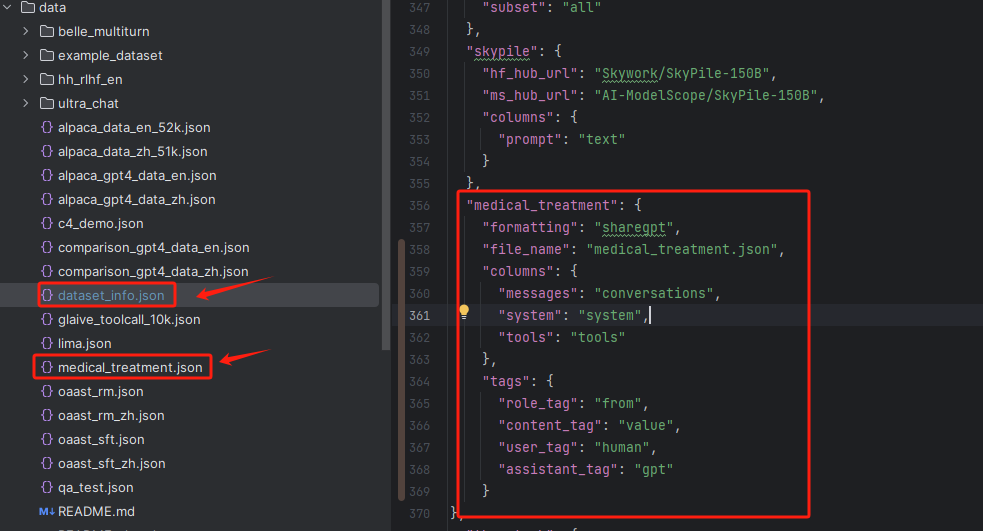

  然后，才可以在微调脚本中正确的使用：

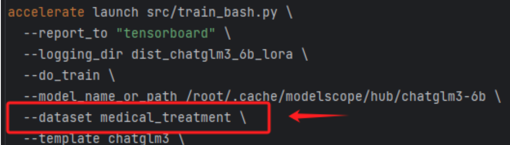

  至此，我们已经全面介绍了LLaMMA-Factory项目的核心内容，并提供了在不同使用需求下可正常执行的微调脚本。大家只需根据自己所选择的模型，遵循自定义数据配置方法，便可以确保大家轻松、快速地完成微调训练任务。微调完成后，当执行完模型合并，便可以根据我们之前课程中详细介绍的方法进行调用。此外，LLaMA-Factory项目内部还支持命令行界面（CLI）、Web示例（Demo）和API调用等多种使用方式，操作还是非常简便，具体指南可在官方GitHub页面找到。本篇内容已基本涵盖所有关键点，但仍建议大家关注项目的最新更新和社区动态，以便更快上手新功能的发布。


📍**更多大模型技术内容学习**

**扫码添加助理英英，回复“大模型”，了解更多大模型技术详情哦👇**


此外，**扫码回复“入群”**，即可加入**大模型技术社群：海量硬核独家技术`干货内容`+无门槛`技术交流`！**
