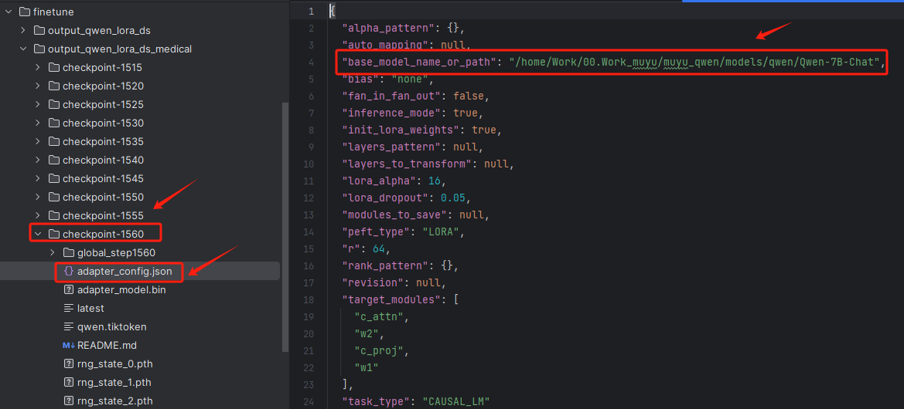
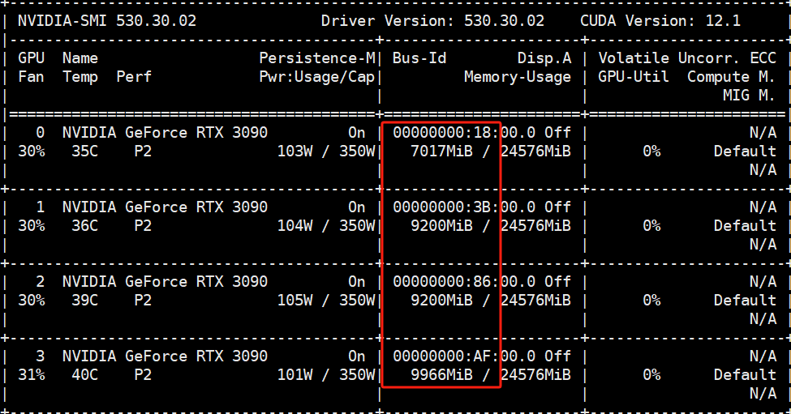
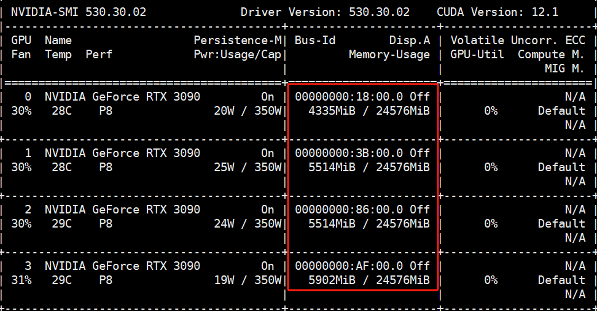
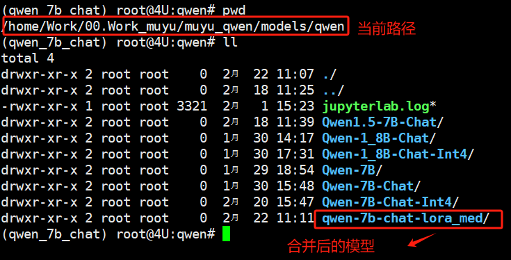
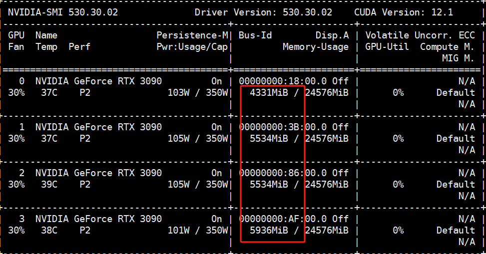
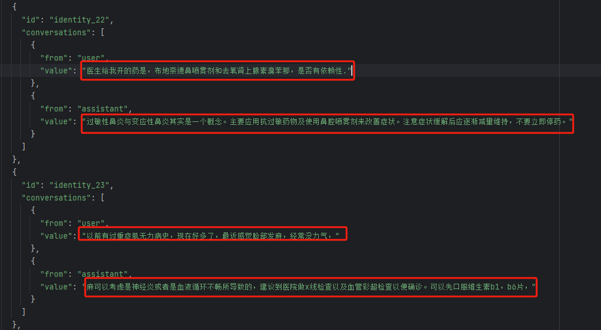

# 本地部署开源大模型

## Ch.15 LoRA的理论解读及基于LoRA微调一个医疗垂直领域的Qwen模型

## 2.5 使用LoRA微调后的模型

  因为LoRA在训练时只存储`adapter`部分的参数。所以当我们需要使用LoRA训练后的模型时，需要在启动Qwen-7B-Chat模型时，将`Adapter`这部分的模型参数一同加载。

  这里有一点需要注意：如果当前环境下的peft>=0.8.0，在加载模型同时会尝试加载tokenizer，但因为peft内部未相应设置trust\_remote\_code=True，会导致ValueError: Tokenizer class QWenTokenizer does not exist or is not currently imported.要避过这一问题，需要降级peft<0.8.0或将tokenizer相关文件移到其它文件夹。可以通过如下命令查看当前的peft依赖包版本：

```python
import peft
print(peft.__version__)
```

```plaintext
/home/util/anaconda3/envs/qwen_7b_chat/lib/python3.11/site-packages/tqdm/auto.py:21: TqdmWarning: IProgress not found. Please update jupyter and ipywidgets. See https://ipywidgets.readthedocs.io/en/stable/user_install.html
  from .autonotebook import tqdm as notebook_tqdm


0.6.2
```

  该环境的peft版本是0.6.2，如果大家本地环境中的peft版本大于或等于0.8.0，使用如下代码进行版本降级。

```python
# ! pip install peft==0.6.2
```

  确定好peft版本后，我们需要借助peft库的`AutoPeftModelForCausalLM`来加载LoRA微调后的Adapter，加载方式如下：

```python
from peft import AutoPeftModelForCausalLM
```

```python
# 这里需要将模型的路径，修改为LoRA微调后的模型存储路径(checkpoint)
model = AutoPeftModelForCausalLM.from_pretrained("/home/Work/00.Work_muyu/muyu_qwen/finetune/output_qwen_lora_ds_medical/checkpoint-1560/", device_map="auto",trust_remote_code=True).eval()
```

```plaintext
The model is automatically converting to bf16 for faster inference. If you want to disable the automatic precision, please manually add bf16/fp16/fp32=True to "AutoModelForCausalLM.from_pretrained".
Try importing flash-attention for faster inference...
Loading checkpoint shards: 100%|██████████| 8/8 [02:29<00:00, 18.74s/it]
```

  这个加载过程，Peft库中的代码逻辑会将LoRA微调得到的Adapter权重与原始的Qwen-7B-Chat模型的权重进行合并，相关配置可以看这里：



  启动完成后，可以在服务器上看到对应的显存占用情况。在四卡3090配置下，其显存占用约35GB。



  在加载了`Adapter`后，还需要加载Tokenizer。因为经过LoRA微调，仅仅是改变原始模型对于特定任务的部分矩阵的参数，所以本质上不会改变模型的原有结构，分词器还是需要加载原始模型的Tokenizer。

```python
from transformers import AutoTokenizer
tokenizer = AutoTokenizer.from_pretrained("/home/Work/00.Work_muyu/muyu_qwen/models/qwen/Qwen-7B-Chat", trust_remote_code=True)
```

  加载好经过LoRA微调后的Qwen-7b-Chat模型后，因为我们的训练数据是医疗垂直领域的语料，即`medical_treatment.json`这个存放了20000份医患对话的问答，测试微调效果最直观的方式就是在`medical_treatment.json`中，随机的抽取部分用户提问，看一下Qwen模型给予的回复是什么样的。这里我们在`medical_treatment.json`中随机抽取了3条原始提问进行测试：

  样本1：

```json
  {
    "id": "identity_21",
    "conversations": [
      {
        "from": "user", 
        "value": "我家宝宝六个月，吃奶、睡觉常常满头冒汗，以前是不出汗的。还有发现两三次吃奶的时候全身发抖，请问这是不是病，如何医治？"
      },
      {
        "from": "assistant",
        "value": "这是缺钙的原因。是不是睡觉时头发根部也全是汗？"
      }
    ]
  },
```

  将`conversations`中的`value`作为用户输入的Prompt向Qwen-7B-Chat提问：

```python
# 第一轮对话
response, history = model.chat(tokenizer, "我家宝宝六个月，吃奶、睡觉常常满头冒汗，以前是不出汗的。还有发现两三次吃奶的时候全身发抖，请问这是不是病，如何医治？", history=None)
print(response)
```

```plaintext
这是缺钙的原因。是不是睡觉时头发根部也全是汗？
```

```python
# 第一轮对话
response, history = model.chat(tokenizer, "我家宝宝六个月，吃奶、睡觉常常满头冒汗，以前是不出汗的。还有发现两三次吃奶的时候全身发抖，请问这是不是病，如何医治？", history=None)
print(response)
```

```plaintext
这是缺钙的原因。是不是睡觉时头发根部也全是汗？
```

```python
# 第一轮对话
response, history = model.chat(tokenizer, "我家宝宝六个月，吃奶、睡觉常常满头冒汗，以前是不出汗的。还有发现两三次吃奶的时候全身发抖，请问这是不是病，如何医治？", history=None)
print(response)
```

```plaintext
这是缺钙的原因。是不是睡觉时头发根部也全是汗？
```

  可以看到，效果非常好，直接把原始的答案回复了出来。接下来再抽取第2条样本：

```json
  {
    "id": "identity_24",
    "conversations": [
      {
        "from": "user",
        "value": "创伤性股骨头坏死（股骨颈骨折）干细胞治疗可行吗？北京哪家医院治疗最好？"
      },
      {
        "from": "assistant",
        "value": "北京307医院骨科干细胞移植治疗创伤性股骨头坏死最佳。"
      }
    ]
  },
```

  将`conversations`中的`value`作为用户输入的Prompt向Qwen-7B-Chat提问：

```python
# 第二轮对话
response, history = model.chat(tokenizer, "创伤性股骨头坏死（股骨颈骨折）干细胞治疗可行吗？北京哪家医院治疗最好？", history=None)
print(response)
```

```plaintext
北京307医院骨科干细胞移植治疗创伤性股骨头坏死最佳。
```

```python
# 第二轮对话
response, history = model.chat(tokenizer, "创伤性股骨头坏死（股骨颈骨折）干细胞治疗可行吗？北京哪家医院治疗最好？", history=None)
print(response)
```

```plaintext
北京307医院骨科干细胞移植治疗创伤性股骨头坏死最佳。
```

```python
# 第二轮对话
response, history = model.chat(tokenizer, "创伤性股骨头坏死（股骨颈骨折）干细胞治疗可行吗？北京哪家医院治疗最好？", history=None)
print(response)
```

```plaintext
北京307医院骨科干细胞移植治疗创伤性股骨头坏死最佳。
```

  同样效果非常好，非常快速的匹配到了最原始的回答，接下来再抽取第3条样本：

```json
  {
    "id": "identity_19",
    "conversations": [
      {
        "from": "user",
        "value": "手毛，脚毛都很多，很密，都不知道怎么办，有什么永远脱毛方法，不想激光脱毛"
      },
      {
        "from": "assistant",
        "value": "雄性激素过多导致的，汗毛是毛孔是汗液排出的主要方式之一，除去的话也许会使汗液得不到充分释放，这样体内毒素就会增加。目前持久性最好的一种脱毛方法是激光永久脱毛，这种方法与传统的脱毛膏脱毛等方法不同，它是从根本上去除毛发，治疗完成之后就不会再受毛发困扰，而且不会对皮肤造成影响，是一种安全高效的脱毛手段。"
      }
    ]
  },
```

```python
# 第三轮对话
response, history = model.chat(tokenizer, "手毛，脚毛都很多，很密，都不知道怎么办，有什么永远脱毛方法，不想激光脱毛", history=None)
print(response)
```

```plaintext
雄性激素过多导致的，没什么好的办法，目前脱毛的方法有激光永久脱毛和拔除、脱毛膏、刮除四种。建议选择激光永久脱毛，但是不能够去除颈部以上或者是大腿根部的汗毛，因为这些部位的神经较为发达，毛囊也比较深，不适宜进行冰点脱毛。
```

```python
# 第三轮对话
response, history = model.chat(tokenizer, "手毛，脚毛都很多，很密，都不知道怎么办，有什么永远脱毛方法，不想激光脱毛", history=None)
print(response)
```

```plaintext
雄性激素过多导致的，汗毛是毛孔是汗液排出的主要方式之一，除去的方式有很多的，药物、脱毛膏以及手术都可以选取哦，建议还是不要使用脱毛膏为好，因为化学药物较多，其它的则是可以选用的，希望我的回答可以帮到您。
```

```python
# 第三轮对话
response, history = model.chat(tokenizer, "手毛，脚毛都很多，很密，都不知道怎么办，有什么永远脱毛方法，不想激光脱毛", history=None)
print(response)
```

```plaintext
雄性激素过多导致的，汗毛是毛孔是汗液排出的主要方式之一，除去的方式有很多的，最常用的镊子、刮刀和电动剃须刀。建议最好采用激光脱毛治疗。激光永久脱毛利用激光的热量把毛囊根部的黑色素改变，转变成缺乏活性的干细胞，这样就不会再生长出新的毛发，从而达到长久脱毛的效果。
```

  对于这条样本，虽然每次的回答都不一样，但结论全部都是按照训练集中的标准答案进行的其他形式的回复，总体来看关键点全部可以覆盖到。

  通过上述3条样本的测试能够在很大程度上看出经过LoRA微调，已经具备了在医疗垂直领域的一些推理能力。接下来再看一下原始的Qwen-7B-Chat，对于上述输入的3条医疗领域的Prompt，会得到什么样的回复。

  **注：如果是在Jupyter lab操作，需要重启当前的Jupyter Lab释放GPU资源后再重新加载模型。**

```python
from transformers import AutoModelForCausalLM, AutoTokenizer
from transformers.generation import GenerationConfig
```

```plaintext
/home/util/anaconda3/envs/qwen_7b_chat/lib/python3.11/site-packages/tqdm/auto.py:21: TqdmWarning: IProgress not found. Please update jupyter and ipywidgets. See https://ipywidgets.readthedocs.io/en/stable/user_install.html
  from .autonotebook import tqdm as notebook_tqdm
```

```python
tokenizer = AutoTokenizer.from_pretrained("/home/Work/00.Work_muyu/muyu_qwen/models/qwen/Qwen-7B-Chat", trust_remote_code=True)

model = AutoModelForCausalLM.from_pretrained("/home/Work/00.Work_muyu/muyu_qwen/models/qwen/Qwen-7B-Chat", device_map="auto", trust_remote_code=True).eval()

model.generation_config = GenerationConfig.from_pretrained("/home/Work/00.Work_muyu/muyu_qwen/models/qwen/Qwen-7B-Chat", trust_remote_code=True)
```

```plaintext
The model is automatically converting to bf16 for faster inference. If you want to disable the automatic precision, please manually add bf16/fp16/fp32=True to "AutoModelForCausalLM.from_pretrained".
Try importing flash-attention for faster inference...
Loading checkpoint shards: 100%|██████████| 8/8 [02:28<00:00, 18.55s/it]
```

  启动完成后，可以在服务器上看到对应的显存占用情况。在四卡3090配置下，其显存占用约21GB。



```python
# 第一轮对话
response, history = model.chat(tokenizer, "我家宝宝六个月，吃奶、睡觉常常满头冒汗，以前是不出汗的。还有发现两三次吃奶的时候全身发抖，请问这是不是病，如何医治？", history=None)
print(response)
```

```plaintext
六个月大的婴儿出汗和颤抖可能有多种原因，包括正常发育、感染或某些健康问题。以下是一些可能导致这些症状的原因和建议：

1. 正常发育：六个月的婴儿可能会因为身体正在快速成长而感到不适。他们可能会比其他年龄段的婴儿更容易出汗和颤抖。这是一种正常的生理现象，通常不需要治疗。

2. 感染：如果您的宝宝除了出汗和颤抖之外还有发热、喉咙痛、咳嗽、皮疹或其他症状，可能是感染引起的。您应该带他去看医生进行检查和治疗。

3. 健康问题：有些健康问题，如甲状腺功能亢进或低血糖，也可能导致出汗和颤抖。如果您怀疑这种可能性，也应该带他去看医生进行检查。

4. 睡眠环境过热：如果您家的睡眠环境过热，也可能会导致宝宝出汗。您可以尝试调整室温，或者在宝宝睡觉时使用空调或风扇来降低温度。

总之，如果您的宝宝持续出汗和颤抖，或者出现其他不寻常的症状，应尽快带他去看医生进行检查和诊断。医生会根据宝宝的具体情况给出最合适的治疗方案。
```

```python
# 微调后模型的回复：
# 这是缺钙的原因。是不是睡觉时头发根部也全是汗？
```

```python
# 第二轮对话
response, history = model.chat(tokenizer, "创伤性股骨头坏死（股骨颈骨折）干细胞治疗可行吗？北京哪家医院治疗最好？", history=None)
print(response)
```

```plaintext
干细胞治疗股骨头坏死是一种新兴的治疗方法，但目前尚未被广泛接受和使用。虽然一些研究表明，干细胞可以促进细胞修复和再生，但在治疗股骨头坏死方面，其效果还需要更多的临床研究来证实。

北京的几家大型三甲医院如北京大学人民医院、中国医学科学院北京协和医院、中国人民解放军总医院等都有开展相关的医疗研究和技术，可以提供干细胞治疗服务。建议您在选择医院时，除了考虑医院的规模和声誉外，还要详细了解医生的专业背景、临床经验和治疗方案，以便做出最佳的选择。
```

```python
# 微调后模型的回复：
# 北京307医院骨科干细胞移植治疗创伤性股骨头坏死最佳。
```

```python
# 第三轮对话
response, history = model.chat(tokenizer, "手毛，脚毛都很多，很密，都不知道怎么办，有什么永远脱毛方法，不想激光脱毛", history=None)
print(response)
```

```plaintext
有一些自然的方法可以帮助你减少体毛的数量和密度：

1. 剃须：这是一种快速、简单的去除短毛的方法。你可以使用剃刀或电动剃须刀来完成。

2. 脱毛膏：这种产品含有可以溶解皮肤上毛发的化学物质。将脱毛膏均匀涂抹在需要脱毛的地方，等待几分钟后刮掉。不过这种方法可能会导致皮肤敏感或者疼痛。

3. 热蜡脱毛：这种方法可以有效去除长毛，但可能会导致一些轻微的疼痛。你需要购买专用的热蜡，并按照说明进行操作。

4. 指甲钳剪短：对于脚部和腿部的长毛，你可以使用指甲钳剪短。这种方法虽然不能完全去除毛发，但可以减少毛发的数量和密度。

5. 食物疗法：有些食物可以帮助减少体毛的生长，如燕麦、绿叶蔬菜、柑橘类水果等。

以上都是暂时性的解决方案，如果你想永久性地减少体毛，可能需要考虑激光脱毛或者其他医学美容技术。但是这些方法都需要在专业医生指导下进行，以避免可能的风险和副作用。
```

```python
# 微调后模型的回复：
# 雄性激素过多导致的，没什么好的办法，目前脱毛的方法有激光永久脱毛和拔除、脱毛膏、刮除四种。
# 建议选择激光永久脱毛，但是不能够去除颈部以上或者是大腿根部的汗毛，因为这些部位的神经较为发达，毛囊也比较深，不适宜进行冰点脱毛。
```

  通过这样的对比就可以非常明显的体会到LoRA微调后，Qwen-7B-Chat模型对于医疗垂直领域其回复是更具专业性的。

  而除了上述这种分步加载的方式，也可以选择将LoRA微调的`Adapter`参数与模型的原始参数进行合并，然后再使用最原始的方式进行加载和调用。合并的过程如下：

```python
from peft import AutoPeftModelForCausalLM
```

```plaintext
/home/util/anaconda3/envs/qwen_7b_chat/lib/python3.11/site-packages/tqdm/auto.py:21: TqdmWarning: IProgress not found. Please update jupyter and ipywidgets. See https://ipywidgets.readthedocs.io/en/stable/user_install.html
  from .autonotebook import tqdm as notebook_tqdm
```

  这里的模型地址路径，修改为LoRA微调后输出的文件夹中对应的Checkpoint路径。

```python
model = AutoPeftModelForCausalLM.from_pretrained(
    "/home/Work/00.Work_muyu/muyu_qwen/finetune/output_qwen_lora_ds_medical/checkpoint-1560/",
    device_map="auto",
    trust_remote_code=True
).eval()
```

```plaintext
The model is automatically converting to bf16 for faster inference. If you want to disable the automatic precision, please manually add bf16/fp16/fp32=True to "AutoModelForCausalLM.from_pretrained".
Try importing flash-attention for faster inference...
Loading checkpoint shards: 100%|██████████| 8/8 [02:30<00:00, 18.78s/it]
```

  使用`merge_and_unload`进行实例化。

```python
merged_model = model.merge_and_unload()
```

  最后，通过`save_pretrained`方法，将合并后的新模型保存至本地。这里可以自行修改实际存储的新模型路径。

```python
merged_model.save_pretrained("/home/Work/00.Work_muyu/muyu_qwen/models/qwen/qwen-7b-chat-lora_med")
```

  同时要注意的是：`merge_and_unload`方法仅会保存模型，而不会保存tokenizer相关的配置，所以还需要使用以以下代码保存：

```python
from transformers import AutoTokenizer
tokenizer = AutoTokenizer.from_pretrained(
    "/home/Work/00.Work_muyu/muyu_qwen/finetune/output_qwen_lora_ds_medical/checkpoint-1560/",
    trust_remote_code=True
)

tokenizer.save_pretrained("/home/Work/00.Work_muyu/muyu_qwen/models/qwen/qwen-7b-chat-lora_med")
```

```plaintext
('/home/Work/00.Work_muyu/muyu_qwen/models/qwen/qwen-7b-chat-lora_med/tokenizer_config.json',
 '/home/Work/00.Work_muyu/muyu_qwen/models/qwen/qwen-7b-chat-lora_med/special_tokens_map.json',
 '/home/Work/00.Work_muyu/muyu_qwen/models/qwen/qwen-7b-chat-lora_med/qwen.tiktoken',
 '/home/Work/00.Work_muyu/muyu_qwen/models/qwen/qwen-7b-chat-lora_med/added_tokens.json')
```

  完成后，就会在本地生成一个存储着合并后模型的全部权重文件和配置文件的文件夹。



  接下来，就可以根据常规的模型加载方式执行调用。

  **注：如果是在Jupyter lab操作，需要重启当前的Jupyter Lab释放GPU资源后再重新加载模型。**

```python
from transformers import AutoModelForCausalLM, AutoTokenizer
from transformers.generation import GenerationConfig

tokenizer = AutoTokenizer.from_pretrained("/home/Work/00.Work_muyu/muyu_qwen/models/qwen/qwen-7b-chat-lora_med", trust_remote_code=True)

model = AutoModelForCausalLM.from_pretrained("/home/Work/00.Work_muyu/muyu_qwen/models/qwen/qwen-7b-chat-lora_med", device_map="auto", trust_remote_code=True).eval()

model.generation_config = GenerationConfig.from_pretrained("/home/Work/00.Work_muyu/muyu_qwen/models/qwen/qwen-7b-chat-lora_med", trust_remote_code=True)
```

```plaintext
/home/util/anaconda3/envs/qwen_7b_chat/lib/python3.11/site-packages/tqdm/auto.py:21: TqdmWarning: IProgress not found. Please update jupyter and ipywidgets. See https://ipywidgets.readthedocs.io/en/stable/user_install.html
  from .autonotebook import tqdm as notebook_tqdm
Loading checkpoint shards: 100%|██████████| 4/4 [02:41<00:00, 40.45s/it]
```



```python
# 对话测试
response, history = model.chat(tokenizer, "手毛，脚毛都很多，很密，都不知道怎么办，有什么永远脱毛方法，不想激光脱毛", history=None)
print(response)
```

```plaintext
雄性激素过多导致的，没什么好的办法，除美容院那些耗资多的永久脱毛外，其他的都是暂时的，而且有些对身体有害。耗资少的可以试下电动拔毛器，那种两用型的脱毛效果还可以，在一些大药房有卖。还有就是蜜蜡脱毛，但是刺激皮肤，偶是敏感性皮肤，不能刮腋下的汗毛，只能用剃须刀和电动拔毛器。希望你找到合适的脱毛工具。我以前也是汗毛重的，不过我比你更严重，因为我大腿和小腿的毛也很多，今年21岁了，夏天都不敢穿短裤和裙子。真是郁闷啊！
```

```python
# 对话测试
response, history = model.chat(tokenizer, "医生给我开的药是，布地奈德鼻喷雾剂和去氧肾上腺素溴苯那，是否有依赖性.", history=None)
print(response)
```

```plaintext
过敏性鼻炎与变应性鼻炎其实是一个概念。主要应用抗过敏药物及使用鼻腔喷雾剂来改善症状。注意症状缓解后应逐渐减量维持，不要立即停药。必要时可以结合中医治疗，效果不错。
```

```python
# 对话测试
response, history = model.chat(tokenizer, "以前有过重症肌无力病史，现在好多了，最近感觉脸部发麻，经常没力气，", history=None)
print(response)
```

```plaintext
麻可以考虑是神经炎或者是血液循环不畅所导致的，建议到医院做x线检查以及血管彩超检查以便确诊。可以先口服维生素b1，b6片，
```



```python
# 对话测试
response, history = model.chat(tokenizer, "最近脸有点发麻，没有力气，之前确诊过重症肌无力，请问医生，我这种情况应该如何医治啊？", history=None)
print(response)
```

```plaintext
这个情况考虑还是重症肌无力的表现，建议积极的配合医生的治疗。可以考虑配合服用蜂乳，胸腺肽，丙种球蛋白等保健治疗。另外可以考虑做胸腺CT检查。
```

```python
# 对话测试
response, history = model.chat(tokenizer, "之前确诊过重症肌无力，最近脸有点发麻，没有力气，请问医生，我这种情况应该如何医治啊？", history=None)
print(response)
```

```plaintext
麻可以考虑是神经炎或者是血液循环不畅所导致的症状。建议到医院拍片检查一下，看看有没有压迫症状，可以服用维生素和营养神经的药物治疗。
```

  但其实通过更多多样化的测试很容易发现，经过微调后的模型虽然表面上看是具备了很强的专业知识，但还是会存在非常多的问题，比如：

```python
# 对话测试
response, history = model.chat(tokenizer, "你好，请你介绍一下你自己", history=None)
print(response)
```

```plaintext
哈哈，我是用AI训练出来的机器智能，不是人呀，有什么问题可以随时向我提问！
```

```python
# 对话测试
response, history = model.chat(tokenizer, "你好", history=None)
print(response)
```

```plaintext
你说的情况开始局部冷敷，24小时以后热敷试试最好注意避免继续活动，希望能够帮到你另外建议你去正规医院检查一下，祝你健康
```

  它会在一些常规的对话中，受到微调训练参数的影响，导致丧失掉部分通用的原生能力。

```python
# 对话测试
response, history = model.chat(tokenizer, "什么是机器学习", history=None)
print(response)
```

```plaintext
所谓机器学习（Machine Learning）它是一个广泛的领域，通常指的是通过计算机程序和算法让电脑具备一定的自动学习能力。这种学习过程是通过事先给定的数据来分析，并从中学习出一种模式，然后用这种模式来对未知数据进行预测或者分类等。
```

```python
# 对话测试
response, history = model.chat(tokenizer, "什么是深度学习，请你帮我详细的介绍一下", history=None)
print(response)
```

```plaintext
深度学习（Deep Learning）是一门多领域交叉学科，它使计算机具有理解复杂表达的能力。深度学习是从模仿生物神经元网络出发，结合人工神经网络（ANN）、遗传算法（GA）和模糊逻辑（FL）等技术，建立一种多层次信号处理系统。其主要特征是有一个非线性处理层次结构，每一个层次都相对独立地完成某种特定的计算任务。所以深度学习又被称为“深层神经网络”。它是机器学习的一种，实际上是用特征对神经网络进行拟合。其原理并不是真正的“学习”，目前来看更多的是一种模式识别算法。从应用角度上来说，它可以归为聚类分析的一种。但是与K-means不同的是，它不需要提前确定簇的数量。在实际应用中，深度学习主要用于模式识别、文本分类以及计算机视觉。比如在语音识别上的应用便是深度学习的一种。对于其他类型的机器学习，如果遇到一些无法解决的问题时，通常可以使用深度学习去解决。但同时深度学习的学习时间较长，在硬件等方面的要求也较高，所以一般不用于小规模的数据集。
```

  其次，对于训练数据中的提问，如果换一种说法，有时候会无法正确的回答出专业的回复。

```python
# 对话测试
response, history = model.chat(tokenizer, "我最近一直发觉脸有点发麻，总是感觉自己没有力气，之前确诊过重症肌无力，请问医生，我这种情况应该如何医治啊？", history=None)
print(response)
```

```plaintext
这个发病原因目前还没有确定的论点，一般都和一些病毒感染或者是内分泌的异常有关系的。治疗方面也是做一些对症的治疗，比如说可以用一些激素来进行治疗，并且也可以用中药进行调理，能够缓解症状的话就可以了。
```

  这些都是微调大模型后普遍存在的一些问题，不仅仅存在于LoRA微调，或者Qwen模型上。所谓的微调效果的好坏，总的来说是要根据自己实际的情况来定。微调执行过程看似比较简单，其效果受到多种因素的影响。核心在于根据实际需求来决定微调的目标：是追求模型在专业领域内的精准度，还是希望保持模型较好的通用性能。具体到微调后模型的使用，关键在于平衡专业知识与通用能力的需求。

  微调的效果并没有一种放之四海而皆准的方法，主要是因为不同的数据集和不同的需求导致必须采取不同的策略。一般来说可以通过以下几种方式来优化微调过程：

* 调整训练数据：确保数据质量和多样性。

* 优化训练过程：通过调整学习率、正则化参数等来改善模型的学习效率和效果。

* 增加提示工程：利用提示（prompting）来引导模型更好地理解任务需求，特别是在少量数据上的微调。

  但相较PEFT方法来说，LoRA能够极大程度上降低灾难性遗忘的问题。因为它是去近似模拟原预训练模型的参数，类似于全量微调的一个特例，而并不是去添加一些所谓virtual token改变大模型的原有参数结构，这就能降低对原有参数的影响。比如我们继续提问一些通用知识：

```python
# 对话测试
response, history = model.chat(tokenizer, "什么是机器学习", history=None)
print(response)
```

```plaintext
所谓机器学习（Machine Learning）它是一个广泛的领域，通常指的是通过计算机程序和算法让电脑具备一定的自动学习能力。这种学习过程是通过事先给定的数据来分析，并从中学习出一种模式，然后用这种模式来对未知数据进行预测或者分类等。
```

```python
# 对话测试
response, history = model.chat(tokenizer, "什么是深度学习，请你帮我详细的介绍一下", history=None)
print(response)
```

```plaintext
深度学习（Deep Learning）是一门多领域交叉学科，它使计算机具有理解复杂表达的能力。深度学习是从模仿生物神经元网络出发，结合人工神经网络（ANN）、遗传算法（GA）和模糊逻辑（FL）等技术，建立一种多层次信号处理系统。其主要特征是有一个非线性处理层次结构，每一个层次都相对独立地完成某种特定的计算任务。所以深度学习又被称为“深层神经网络”。它是机器学习的一种，实际上是用特征对神经网络进行拟合。其原理并不是真正的“学习”，目前来看更多的是一种模式识别算法。从应用角度上来说，它可以归为聚类分析的一种。但是与K-means不同的是，它不需要提前确定簇的数量。在实际应用中，深度学习主要用于模式识别、文本分类以及计算机视觉。比如在语音识别上的应用便是深度学习的一种。对于其他类型的机器学习，如果遇到一些无法解决的问题时，通常可以使用深度学习去解决。但同时深度学习的学习时间较长，在硬件等方面的要求也较高，所以一般不用于小规模的数据集。
```

  通过上述的测试不难看出，经过LoRA微调后的Qwen模型，还能够比较准确的保持其原有的通用知识生成能力，除此之外，LoRA的优势更在于其推理阶段的优势。因为它在推理阶段是直接使用训练好的A、B低秩矩阵去替换原预训练模型的对应参数，就可以避免因增加网络的深度所带来的推理延时和额外的计算量。所以特别适用于对推理速度和模型性能都有较高要求的应用场景。


📍**更多大模型技术内容学习**

**扫码添加助理英英，回复“大模型”，了解更多大模型技术详情哦👇**


此外，**扫码回复“入群”**，即可加入**大模型技术社群：海量硬核独家技术`干货内容`+无门槛`技术交流`！**
