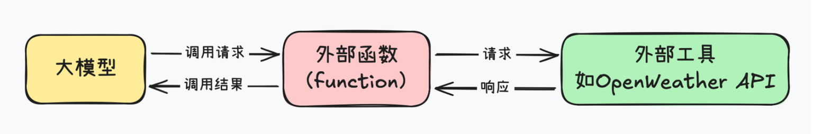
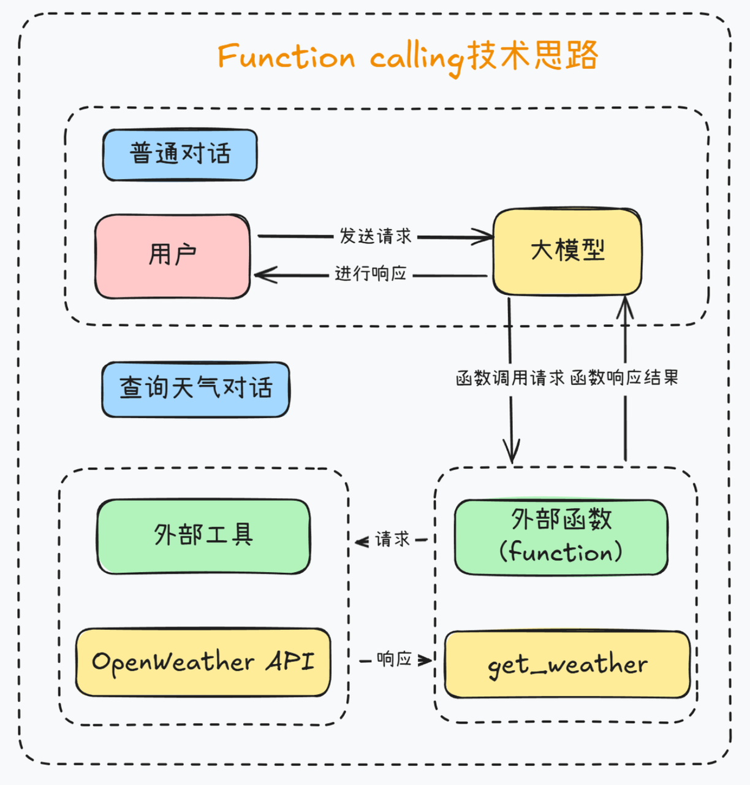
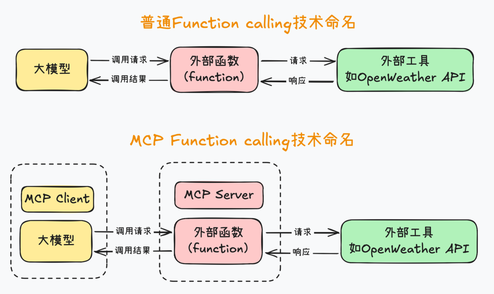
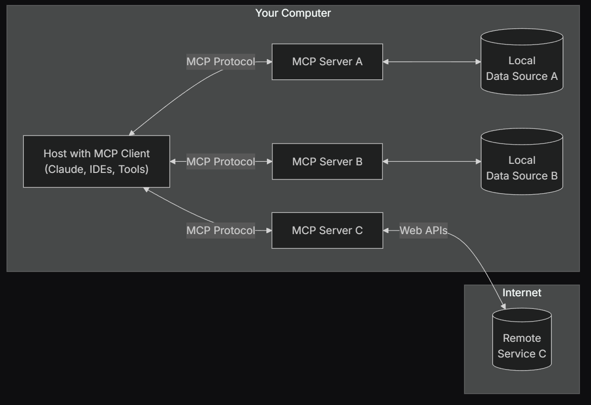
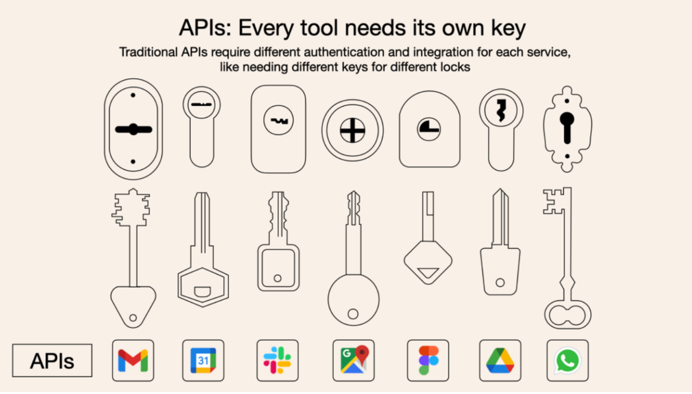
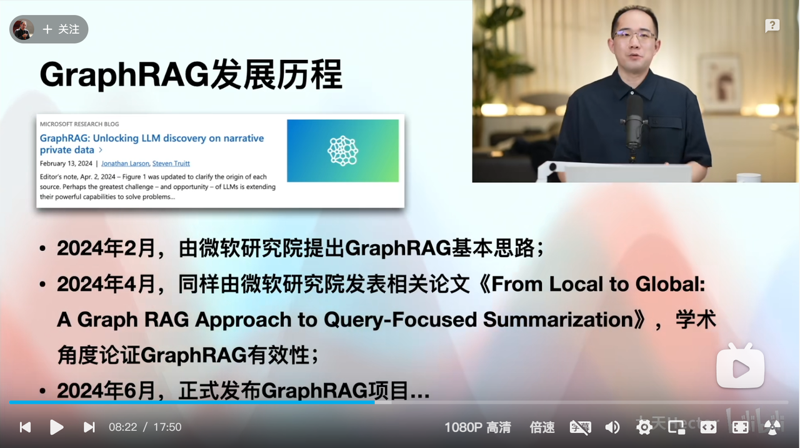
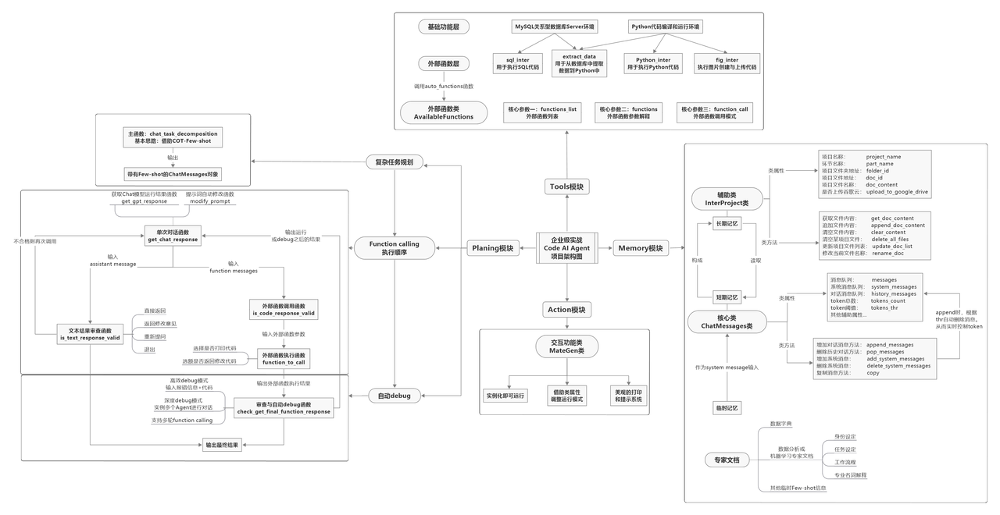

# MCP智能体开发实战入门

* Anthropic MCP发布通告：https://www.anthropic.com/news/model-context-protocol

* MCP GitHub主页：https://github.com/modelcontextprotocol

## 一、MCP技术体系介绍

### 1. MCP入门介绍

MCP，全称是Model Context Protocol，模型上下文协议，由Claude母公司Anthropic于去年11月正式提出。


MCP刚发布的时候不温不火，直到今年Agent大爆发才被广泛关注。而在今年2月，Cursor正式宣布加入MCP功能支持，一举将MCP推到了全体开发人员面前。从本质上来说，MCP是一种技术协议，一种智能体Agent开发过程中共同约定的一种规范。这就好比秦始皇的“**书同文、车同轨**”，在统一的规范下，大家的**协作效率就能大幅提高**，最终**提升智能体Agent的开发效率**。截止目前，已上千种MCP工具诞生，在强悍的MCP生态加持下， 人人手搓Manus的时代即将到来。


总的来说\*\*，**MCP**解决的最大痛点，就是Agent开发中调用外部工具的技术门槛过高的问题。\*\*

我们都知道，能调用外部工具，是大模型进化为智能体Agent的关键，如果不能使用外部工具，大模型就只能是个简单的聊天机器人，甚至连查询天气都做不到。由于底层技术限制啊，大模型本身是无法和外部工具直接通信的，因此Function calling的思路，就是创建一个外部函数（function）作为中介，一边传递大模型的请求，另一边调用外部工具，最终让大模型能够间接的调用外部工具。



例如，当我们要查询当前天气时，让大模型调用外部工具的function calling的过程就如图所示：



Function calling是个非常不错的技术设计，自诞生以来，一直被业内奉为圭臬。但唯一的问题就是，编写这个外部函数的工作量太大了，一个简单的外部函数往往就得上百行代码，而且，为了让大模型“认识”这些外部函数，我们还要额外为每个外部函数编写一个JSON Schema格式的功能说明，此外，我们还需要精心设计一个提示词模版，才能提高Function calling响应的准确率。

而MCP的目标，就是能在Agent开发过程中，让大模型更加便捷的调用外部工具。为此，MCP提出了两个方案，其一，“**车同轨、书同文**”，统一Function calling的运行规范。

首先是先统一名称，MCP把大模型运行环境称作 MCP Client，也就是MCP客户端，同时，把外部函数运行环境称作MCP Server，也就是MCP服务器，



然后，统一MCP客户端和服务器的运行规范，并且要求MCP客户端和服务器之间，也统一按照某个既定的提示词模板进行通信。

“车同轨、书同文”最大的好处就在于，可以避免MCP服务器的重复开发，也就是避免外部函数重复编写。例如，像查询天气、网页爬取、查询本地MySQL数据库这种通用的需求，大家有一个人开发了一个服务器就好，开发完大家都能复制到自己的项目里来使用，不用每个人每次都单独写一套。

这可是促进全球AI开发者共同协作的好事儿，很快，GitHub上就出现了海量的已经开发好的MCP 服务器，从SQL数据库检索、到网页浏览信息爬取，从命令行操作电脑、到数据分析机器学习建模，等等等等，不一而足。


现在，只要你本地运行的大模型支持MCP协议，也就是只要安装了相关的库，仅需几行代码即可接入这些海量的外部工具，是不是感觉Agent开发门槛瞬间降低了呢。

这种“车同轨、书同文”的规范，在技术领域就被称作协议，例如http就是网络信息交换的技术协议。各类技术协议的目标，都是希望**通过提高协作效率来提升开发效率**，而MCP，Model Context Protocol，就是一种旨在提高大模型Agent开发效率的技术协议。

那既然是协议，必然是使用的人越多才越有用。因此，为了进一普及MCP协议，Anthropic还提供了一整套MCP客户端、服务器开发的SDK，也就是开发工具，并且支持Python、TS和Java等多种语言，借助SDK，仅需几行代码，就可以快速开发一个MCP服务器。


然后，你就可以把它接入任意一个MCP客户端来构建智能体，如果愿意，还可以把MCP服务器分享到社区，给有需求的开发者使用，甚至你还可以把你的MCP服务器放到线上运行，让用户付费使用。

而MCP的客户端，不仅支持Claude模型，也支持任意本地模型或者在线大模型，或者是一些IDE。例如，现在Cursor正式接入MCP，代表着Cursor正式成为MCP客户端，在Cursor中，我们不仅能快速编写MCP服务器（外部函数），更能借助Cursor一键连接上成百上千的开源MCP服务器，让大模型快速接入海量工具，从而大幅加快Agent开发进度。



*



 


 


 


 


### 2. MCP智能体开发入门项目


 


## 二、GraphRAG基于知识图谱的检索增强技术




### 1.GraphRAG入门介绍

  **检索增强生成（RAG）** 是一种通过结合真实世界的信息来提升大型语言模型（LLM）输出质量的技术。RAG 技术是大多数基于 LLM 的工具中的一个重要组成部分。大多数 RAG 方法使用 **向量相似性** 作为检索技术，我们将其称为 **基线 RAG（Baseline RAG）**。

  RAG 技术在帮助 LLM 推理私有数据集方面显示了很大的潜力——例如，LLM 没有在训练时接触过的、企业的专有研究、业务文档或通信数据。基线 RAG 技术最初是为了解决这个问题而提出的，但我们观察到，在某些情况下，基线 RAG 的表现并不理想。以下是几个典型的场景：

1. **基线 RAG 很难将信息串联起来**：当一个问题的答案需要通过多个不同的信息片段，并通过它们共享的属性来连接，进而提供新的综合见解时，基线 RAG 表现得很差。

2. 例如，在回答类似“如何通过现有的数据推断出新结论”这种问题时，基线 RAG 无法很好地处理这些散布在不同文档中的相关信息，它可能会遗漏一些关键联系点。

3. **基线 RAG 无法有效理解大型数据集或单一大文档的整体语义概念**：当被要求在大量数据或复杂文档中进行总结、提炼和理解时，基线 RAG 往往表现不佳。

4. 例如，如果问题要求对整个文档或多篇文档的主题进行总结和理解，基线 RAG 的简单向量检索方法可能无法处理文档间的复杂关系，导致对全局语义的理解不完整。

  为了应对这些挑战，技术社区正在努力开发扩展和增强 RAG 的方法。**微软研究院**（Microsoft Research）提出的 **GraphRAG** 方法，使用 **LLM** 基于输入语料库构建 **知识图谱**。这个图谱与社区总结和图谱机器学习输出结合，能够在查询时增强提示（prompt）。GraphRAG 在回答以上两类问题时，展示了 **显著的改进**，尤其是在 **复杂信息的推理能力** 和 **智能性** 上，超越了基线 RAG 之前应用于私有数据集的其他方法。


### 2.GraphRAG基本原理回顾

        **GraphRAG** 是微软研究院开发的一种先进的增强检索生成（RAG）框架，旨在提升语言模型（LLM）在处理复杂数据时的性能。与传统的 RAG 方法依赖向量相似性检索不同，**GraphRAG** 利用 **知识图谱** 来显著增强语言模型的问答能力，特别是在处理私有数据集或大型、复杂数据集时表现尤为出色。


  传统的 **Baseline RAG** 方法在某些情况下表现不佳，尤其是当查询需要在不同信息片段之间建立联系时，或是当需要对大规模数据集进行整体理解时。GraphRAG 通过以下方式克服了这些问题：

* **更好的连接信息点**：GraphRAG 能够处理那些需要从多个数据点合成新见解的任务。

* **更全面的理解能力**：GraphRAG 更擅长对大型数据集进行全面理解，能够更好地处理复杂的抽象问题。

  而借助微软开源的GeaphRAG项目，我们可以快速做到以下事项：

* **基于图的检索**：传统的 RAG 方法使用向量相似性进行检索，而 GraphRAG 引入了知识图谱来捕捉实体、关系及其他重要元数据，从而更有效地进行推理。

* **层次聚类**：GraphRAG 使用 **Leiden** 技术进行层次聚类，将实体及其关系进行组织，提供更丰富的上下文信息来处理复杂的查询。

* **多模式查询**：支持多种查询模式：

  * **全局搜索**：通过利用社区总结来进行全局性推理。

  * **局部搜索**：通过扩展相关实体的邻居和关联概念来进行具体实体的推理。

  * **DRIFT 搜索**：结合局部搜索和社区信息，提供更准确和相关的答案。

* **图机器学习**：集成了图机器学习技术，提升查询响应质量，并提供来自结构化和非结构化数据的深度洞察。

* **Prompt 调优**：提供调优工具，帮助根据特定数据和需求调整查询提示，从而提高结果质量。

### 3. GraphRAG运行流程

#### 3.1 **索引（Indexing）过程**

1. **文本单元切分**：将输入文本分割成 **TextUnits**，每个 TextUnit 是一个可分析的单元，用于提取关键信息。

2. **实体和关系提取**：使用 LLM 从 TextUnits 中提取实体、关系和关键声明。

3. **图构建**：构建知识图谱，使用 Leiden 算法进行实体的层次聚类。每个实体用节点表示，节点的大小和颜色分别代表实体的度数和所属社区。

4. **社区总结**：从下到上生成每个社区及其成员的总结，帮助全局理解数据集。

#### 3.2 **查询（Query）过程**

索引完成后，用户可以通过不同的搜索模式进行查询：

* **全局搜索**：当我们想了解整个语料库或数据集的整体概况时，GraphRAG 可以利用 社区总结 来快速推理和获取信息。这种方式适用于大范围问题，如某个主题的总体理解。

* **局部搜索**：如果问题关注于某个特定的实体，GraphRAG 会向该实体的 邻居（即相关实体）扩展搜索，以获得更详细和精准的答案。

* **DRIFT 搜索**：这是对局部搜索的增强，除了获取邻居和相关概念，还引入了 社区信息 的上下文，从而提供更深入的推理和连接。

#### 3.3 **Prompt 调优**

为了获得最佳性能，GraphRAG 强烈建议进行 **Prompt 调优**，确保模型可以根据你的特定数据和查询需求进行优化，从而提供更准确和相关的答案。

#### 3.4 GraphRAG计算流程极简示例


### 4.GraphRAG安装与Indexing\&Query流程实现

注意，以下内容在Jupyter中通过代码完成，扫码即可领取课件代码。


 


### 5.GraphRAG API使用方法


## 三、MCP+GraphRAG搭建检索增强智能体

        接下来即可根据GraphRAG API的调用方法，来创建一个基于GraphRAG的MCP智能体服务器，并尝试在本地client对其进行调用。

### 1.MCP+GraphRAG项目环境搭建

#### 1.1 创建 MCP 客户端项目

```bash
# 创建项目目录
uv init mcp-graphrag
cd mcp-graphrag
```


 


#### 1.2 创建MCP客户端虚拟环境

```bash
# 创建虚拟环境
uv venv

# 激活虚拟环境
source .venv/bin/activate
```


这里需要注意的是，相比pip，uv会自动识别当前项目主目录并创建虚拟环境。

然后即可通过add方法在虚拟环境中安装相关的库。

```bash
# 安装 MCP SDK
uv add mcp graphrag pathlib pandas
```


#### 1.3 创建GraphRAG并构建索引（Index）

* 创建项目目录并进行初始化

```bash
mkdir -p ./graphrag/input
graphrag init --root ./graphrag
```


* 修改配置文件

打开.env文件，填写DeepSeek API-KEY或OpenAI API-Key


打开setting.yaml文件，填写模型名称和代理地址：


* 上传文本数据


* index过程

```bash
graphrag index --root ./graphrag
```


### 2.创建GraphRAG服务器Server

        这里需要注意，当前创建的GraphRAG Server只负责进行对某一个完成Index的知识库进行Query，更加复杂的如文件管理、实时增加检索、多文件库检索等，详见2025大模型Agent智能体开发实战》（春季班）https://whakv.xetslk.com/s/pxKHG内容介绍。


 


 


这里我们在当前项目中创建一个名为rag\_server.py的server，


并写入如下代码：

```python
from pathlib import Path
from pprint import pprint

import pandas as pd

import graphrag.api as api
from graphrag.config.load_config import load_config
from graphrag.index.typing.pipeline_run_result import PipelineRunResult

from typing import Any
from mcp.server.fastmcp import FastMCP

# 初始化 MCP 服务器
mcp = FastMCP("rag_ML")
USER_AGENT = "rag_ML-app/1.0"

@mcp.tool()
async def rag_ML(query: str) -> str:
    """
    用于查询机器学习决策树相关信息。
    :param query: 用户提出的具体问题
    :return: 最终获得的答案
    """
    PROJECT_DIRECTORY = "/root/autodl-tmp/MCP/mcp-graphrag/graphrag"
    graphrag_config = load_config(Path(PROJECT_DIRECTORY))
    
    # 加载实体
    entities = pd.read_parquet(f"{PROJECT_DIRECTORY}/output/entities.parquet")
    # 加载社区
    communities = pd.read_parquet(f"{PROJECT_DIRECTORY}/output/communities.parquet")
    # 加载社区报告
    community_reports = pd.read_parquet(
        f"{PROJECT_DIRECTORY}/output/community_reports.parquet"
    )
    # 进行全局搜索
    response, context = await api.global_search(
        config=graphrag_config,
        entities=entities,
        communities=communities,
        community_reports=community_reports,
        community_level=2,
        dynamic_community_selection=False,
        response_type="Multiple Paragraphs",
        query=query,
    )
    
    return response

if __name__ == "__main__":
    # 以标准 I/O 方式运行 MCP 服务器
    mcp.run(transport='stdio')
```

**代码解释如下：**

1. **导入必要的模块和库：**

   * `Path` 和 `pprint`：用于路径操作和美化打印输出。

   * `pandas`：用于数据处理，特别是读取 Parquet 格式的数据文件。

   * `graphrag.api` 和相关配置模块：用于加载配置和调用 GraphRAG 的 API。

   * `FastMCP`：MCP 协议的快速实现，用于创建 MCP 服务器。

2. **初始化 MCP 服务器：**

   * `mcp = FastMCP("rag_ML")`：创建一个名为 `rag_ML` 的 MCP 服务器实例。

   * `USER_AGENT = "rag_ML-app/1.0"`：定义用户代理字符串，可能用于标识客户端应用程序的版本信息。

3. **定义工具函数 `rag_ML`：**

   * 使用装饰器 `@mcp.tool()` 将函数注册为 MCP 工具，使其可被客户端调用。

   * 函数为异步函数，接受一个字符串类型的 `query` 参数，表示用户的查询。

   * 函数内部执行以下操作：

     * 加载 GraphRAG 配置：

       * `PROJECT_DIRECTORY`：定义项目目录路径。

       * `graphrag_config = load_config(Path(PROJECT_DIRECTORY))`：加载 GraphRAG 的配置文件。

     * 加载数据文件：

       * 使用 `pandas` 的 `read_parquet` 方法分别加载实体、社区和社区报告的 Parquet 文件。

     * 调用

     ```plaintext
     api.global_search
     ```

     * 方法进行全局搜索：

       * 传入配置、实体、社区和社区报告等参数。

       * 设置 `community_level=2` 和 `dynamic_community_selection=False`，用于控制社区层级和是否动态选择社区。

       * 设置 `response_type="Multiple Paragraphs"`，指定响应类型为多段落文本。

     * 返回搜索结果 `response`。

4. **运行 MCP 服务器：**

   * 在主程序中，调用 `mcp.run(transport='stdio')` 以标准输入输出（`stdio`）的方式运行 MCP 服务器，使其能够接收和响应客户端的请求。


### 3.创建GraphRAG服务器client

接下来继续创建客户端，在项目主目录下创建一个名为`client.py`的客户端，


并写入如下代码：

```python
import asyncio
import os
import json
from typing import Optional
from contextlib import AsyncExitStack

from openai import OpenAI  
from dotenv import load_dotenv

from mcp import ClientSession, StdioServerParameters
from mcp.client.stdio import stdio_client

# 加载 .env 文件，确保 API Key 受到保护
load_dotenv()

class MCPClient:
    def __init__(self):
        """初始化 MCP 客户端"""
        self.exit_stack = AsyncExitStack()
        self.openai_api_key = os.getenv("OPENAI_API_KEY")  # 读取 OpenAI API Key
        self.base_url = os.getenv("BASE_URL")  # 读取 BASE YRL
        self.model = os.getenv("MODEL")  # 读取 model
        if not self.openai_api_key:
            raise ValueError("❌ 未找到 OpenAI API Key，请在 .env 文件中设置 OPENAI_API_KEY")
        self.client = OpenAI(api_key=self.openai_api_key, base_url=self.base_url) # 创建OpenAI client
        self.session: Optional[ClientSession] = None   

    async def transform_json(self, json2_data):
        """
        将Claude Function calling参数格式转换为OpenAI Function calling参数格式，多余字段会被直接删除。
        
        :param json2_data: 一个可被解释为列表的 Python 对象（或已解析的 JSON 数据）
        :return: 转换后的新列表
        """
        result = []
        
        for item in json2_data:
            # 确保有 "type" 和 "function" 两个关键字段
            if not isinstance(item, dict) or "type" not in item or "function" not in item:
                continue
        
            old_func = item["function"]
        
            # 确保 function 下有我们需要的关键子字段
            if not isinstance(old_func, dict) or "name" not in old_func or "description" not in old_func:
                continue
        
            # 处理新 function 字段
            new_func = {
                "name": old_func["name"],
                "description": old_func["description"],
                "parameters": {}
            }
        
            # 读取 input_schema 并转成 parameters
            if "input_schema" in old_func and isinstance(old_func["input_schema"], dict):
                old_schema = old_func["input_schema"]
                
                # 新的 parameters 保留 type, properties, required 这三个字段
                new_func["parameters"]["type"] = old_schema.get("type", "object")
                new_func["parameters"]["properties"] = old_schema.get("properties", {})
                new_func["parameters"]["required"] = old_schema.get("required", [])
            
            new_item = {
                "type": item["type"],
                "function": new_func
            }
        
            result.append(new_item)
    
        return result

    async def connect_to_server(self, server_script_path: str):
        """连接到 MCP 服务器并列出可用工具"""
        is_python = server_script_path.endswith('.py')
        is_js = server_script_path.endswith('.js')
        if not (is_python or is_js):
            raise ValueError("服务器脚本必须是 .py 或 .js 文件")

        command = "python" if is_python else "node"
        server_params = StdioServerParameters(
            command=command,
            args=[server_script_path],
            env=None
        )

        # 启动 MCP 服务器并建立通信
        stdio_transport = await self.exit_stack.enter_async_context(stdio_client(server_params))
        self.stdio, self.write = stdio_transport
        self.session = await self.exit_stack.enter_async_context(ClientSession(self.stdio, self.write))

        await self.session.initialize()

        # 列出 MCP 服务器上的工具
        response = await self.session.list_tools()
        tools = response.tools
        print("\n已连接到服务器，支持以下工具:", [tool.name for tool in tools])     
        
    async def process_query(self, query: str) -> str:
        """
        使用大模型处理查询并调用可用的 MCP 工具 (Function Calling)
        """
        messages = [{"role": "user", "content": query}]
        
        response = await self.session.list_tools()
        
        available_tools = [{
            "type": "function",
            "function": {
                "name": tool.name,
                "description": tool.description,
                "input_schema": tool.inputSchema
            }
        } for tool in response.tools]
        # print(available_tools)

        # 进行参数格式转化
        available_tools = await self.transform_json(available_tools)
        
        response = self.client.chat.completions.create(
            model=self.model,            
            messages=messages,
            tools=available_tools     
        )
        
        # 处理返回的内容
        content = response.choices[0]
        if content.finish_reason == "tool_calls":
            # 如何是需要使用工具，就解析工具
            tool_call = content.message.tool_calls[0]
            tool_name = tool_call.function.name
            tool_args = json.loads(tool_call.function.arguments)
            
            # 执行工具
            result = await self.session.call_tool(tool_name, tool_args)
            print(f"\n\n[Calling tool {tool_name} with args {tool_args}]\n\n")
            
            # 将模型返回的调用哪个工具数据和工具执行完成后的数据都存入messages中
            messages.append(content.message.model_dump())
            messages.append({
                "role": "tool",
                "content": result.content[0].text,
                "tool_call_id": tool_call.id,
            })
            
            # 将上面的结果再返回给大模型用于生产最终的结果
            response = self.client.chat.completions.create(
                model=self.model,
                messages=messages,
            )
            return response.choices[0].message.content
            
        return content.message.content
    
    async def chat_loop(self):
        """运行交互式聊天循环"""
        print("\n🤖 MCP 客户端已启动！输入 'quit' 退出")

        while True:
            try:
                query = input("\n你: ").strip()
                if query.lower() == 'quit':
                    break
                
                response = await self.process_query(query)  # 发送用户输入到 OpenAI API
                print(f"\n🤖 OpenAI: {response}")

            except Exception as e:
                print(f"\n⚠️ 发生错误: {str(e)}")

    async def cleanup(self):
        """清理资源"""
        await self.exit_stack.aclose()

async def main():
    if len(sys.argv) < 2:
        print("Usage: python client.py <path_to_server_script>")
        sys.exit(1)

    client = MCPClient()
    try:
        await client.connect_to_server(sys.argv[1])
        await client.chat_loop()
    finally:
        await client.cleanup()

if __name__ == "__main__":
    import sys
    asyncio.run(main())
```

这段代码实现了一个 **MCP 客户端**，用于连接 MCP 服务器，并利用 OpenAI 的 API 进行 Function Calling（函数调用）。该客户端能够与 MCP 服务器交互，列出可用工具，并根据用户输入选择适当的工具调用。

1. **初始化**

* `AsyncExitStack()` 处理多个异步上下文（如 MCP 连接）。

* 读取 .env配置：

  * `OPENAI_API_KEY`

  * `BASE_URL`（可选，用于自定义 API 代理）

  * `MODEL`（指定 OpenAI 使用的模型）

* `self.client = OpenAI(...)` 创建 OpenAI API 客户端。

2. **转换 API 格式 (`transform_json`)**

* OpenAI 和 Claude API 的 Function Calling 格式不同。

* 该函数将 Claude 的 `input_schema` 转换为 OpenAI 兼容格式。

3. **连接 MCP 服务器**

* 连接 MCP 服务器，支持 Python 或 JavaScript 服务器脚本。

* `stdio_client(server_params)` 通过 `stdio` 进行通信。

* `await self.session.list_tools()` 列出 MCP 服务器上可用的工具。

4. **处理用户查询 (`process_query`)**

* 获取 MCP 服务器上可用的工具 (`list_tools`)。

* 让 OpenAI 选择是否需要调用 MCP 服务器上的工具 (`tool_calls`)。

* 若需要工具调用：

  * 解析 `tool_calls`

  * `call_tool(tool_name, tool_args)` 调用 MCP 服务器上的工具

  * 再次向 OpenAI 提交新信息，获取最终答案

5. **交互式聊天 (`chat_loop`)**

* 允许用户输入查询，自动选择 MCP 工具或直接回答。

* 输入 `quit` 退出聊天。

然后创建配置文件.env：


并手动输入

```bash
BASE_URL=
MODEL=
OPENAI_API_KEY=
```


此处可以设置OpenAI、DeepSeek或者任何ollama、vLLM调度的本地模型。具体配置方法参考《MCP入门实战教程》。


### 4.MCP+GraphRAG问答测试

#### 4.1 命令行问答

最后即可开始进行问答测试，在命令行中输入如下命令即可启动问答：

```python
uv run client.py rag_server.py
```

问答效果如图所示：


#### 4.2 Claude Desktop问答

详见2025大模型Agent智能体开发实战》（春季班）https://whakv.xetslk.com/s/pxKHG内容介绍。


&#x20;


&#x20;


&#x20;


&#x20;


***

## 四、MCP智能体开发基础理论入门

### 1. 真实世界的复杂智能体开发项目

#### 1.1 2023年MateGen 1.0代码结构图



#### 1.2 2025大模型Agent开发实战付费课程企业问答智能体项目流程图


#### 1.3 2025大模型Agent开发实战付费课程智能客服项目流程图


#### 1.4 2025大模型Agent开发实战付费课程智能市场分析项目流程图


#### 1.5 2025大模型Agent开发实战付费课程MateGen 2.0项目架构


详见2025大模型Agent智能体开发实战》（春季班）https://whakv.xetslk.com/s/pxKHG内容介绍。


&#x20;


### 2. 智能体开发框架选型

12项Agent智能体开发框架入门与选型！https://www.bilibili.com/video/BV16NBJYRE3s/


### 3. 从零快速了解智能体开发

&#x20;       在使用 LLM 构建应用时，我们建议**尽可能选择最简单的解决方案**，只有在**确实需要**时才增加复杂性。这意味着，在某些情况下，可能根本**不需要构建代理系统**。

&#x20;       **代理系统（Agentic Systems）\*\*通常会\*\*牺牲响应速度（latency）和成本（cost）**，以换取更好的任务执行能力。因此，在使用代理之前，你需要考虑这种**权衡是否合理**。

当应用场景**需要更复杂的逻辑**时：

* **工作流（Workflows）** 提供了**可预测性**和**一致性**，适用于**任务流程清晰的情况**。

* **代理（Agents）** 更适用于**需要灵活性和大规模模型驱动决策**的场景。

然而，对于许多应用来说，**优化单次 LLM 调用**（例如结合**检索增强（RAG）\*\*和\*\*上下文示例（in-context examples）**）通常已经足够，无需使用复杂的代理系统。

&#x20;       分发模式：将任务分发（Fan-out）给多个子代理（sub-agents），然后汇总（Fan-in）结果。每个子任务都是一个 **AugmentedLLM**，整个 **Parallel** 工作流本身也是如此，这意味着每个子任务可以选择性地成为一个更复杂的工作流。


&#x20;       路由模式：**对于给定的输入，系统会将其路由（分配）到最相关的 `top_k` 个类别。**
其中，每个类别（category）可以是：

1. **Agent**（智能代理）：可能是一个 AI 代理（如 LLM 驱动的任务处理单元）。

2. **MCP 服务器**（MCP Server）：可以是基于 **Model Context Protocol (MCP)** 的服务器，用于处理特定任务或提供外部数据支持。

3. **常规函数**（Regular Function）：即普通的代码函数，可能是执行计算、数据处理等任务的函数。


&#x20;       编排模式：**一个更高层次的 LLM（大语言模型）负责生成任务计划（plan），然后将各个子任务分配给子代理（sub-agents），并最终整合（synthesize）这些子任务的结果。**

其中：

* **高层 LLM 生成计划**：这个 LLM 充当“指挥官”，根据输入任务制定执行步骤。

* **子代理（sub-agents）执行任务**：每个子任务被分配给不同的子代理，可能是不同的 AI 组件、MCP 服务器或特定函数。

* **整合（synthesize）结果**：在所有子任务执行完毕后，系统会将它们的结果合并，生成最终输出。


&#x20;       优化器模式：**一个 LLM 充当“优化器”（optimizer），不断优化回答；另一个 LLM 充当“评估者”（evaluator），对回答进行批判性评估，直到回答达到质量标准。**

**具体流程**

1. 优化器（optimizer）

   * 生成初步的回答，并在每轮迭代中不断优化它，使其更准确、更符合要求。

2. 评估者（evaluator）

   * 对优化器生成的回答进行**审查和批评**，指出其中的问题（如逻辑错误、信息缺失、语义不清等）。

   * 如果回答未达到质量标准，它会要求优化器进行修改和改进。

3. 循环优化

   * 这个过程会**反复进行**，直到评估者认可答案的质量（即超过某个质量标准）。


接下来我们尝试借助MCP，实现分发模式和路由模式，并据此搭建一个NL2SQL+NL2Python的初级数据分析智能体。

## 五、OpenAI风格API Function calling进阶功能介绍

本部分内容需参考以下Jupyer部分代码进行学习。


&#x20;


## 六、借助MCP搭建AI数据分析智能体

&#x20;       在了解了Function calling的进阶功能外，接下来我们继续介绍如何基于上述功能，来进行MCP智能体快速发开发，来搭建一个能够进行SQL查询和Python自动编写的入门级数据分析智能体。

### 1. miniMateGen项目初始化

```bash
cd /root/autodl-tmp/MCP
# 创建项目目录
uv init miniMateGen
cd miniMateGen
```


```bash
# 创建虚拟环境
uv venv

# 激活虚拟环境
source .venv/bin/activate
```


创建项目如下：


### 2. 创建MCP服务器一：SQL\_server

#### 2.1 Linux环境下安装MySQL服务器并创建简单数据集

* 创建MySQL数据库

```bash
apt install mysql-server
```


然后启动mysql，并设置初始密码：

```bash
mysqld &
mysql
```

进入到SQL命令行后，输入如下命令：

```sql
ALTER USER 'root'@'localhost' IDENTIFIED BY '123';
```


然后输入`exit;`即可退出。

然后再次进入MySQL，并根据要求输入密码：

```bash
mysql -u root -p
```

然后创建一个数据库：

```sql
CREATE DATABASE school;
USE school;
```

然后创建一个虚拟表格，里面包含了10位同学各自3门课程的分数：

```sql
CREATE TABLE students_scores (
    id INT AUTO_INCREMENT PRIMARY KEY,  
    name VARCHAR(50),                   
    course1 INT,                        
    course2 INT,                       
    course3 INT                        
);
```

```sql
INSERT INTO students_scores (name, course1, course2, course3)
VALUES
    ('学生1', 85, 92, 78),
    ('学生2', 76, 88, 91),
    ('学生3', 90, 85, 80),
    ('学生4', 65, 70, 72),
    ('学生5', 82, 89, 95),
    ('学生6', 91, 93, 87),
    ('学生7', 77, 78, 85),
    ('学生8', 88, 92, 91),
    ('学生9', 84, 76, 80),
    ('学生10', 89, 90, 92);
```


然后即可查看数据集基本情况：

```sql
SELECT * FROM students_scores;
```


此外，还需要刷新身份验证，使得其他库（如pymysql）可以通过密码验证登录：

```sql
ALTER USER 'root'@'localhost' IDENTIFIED WITH mysql_native_password BY '123';
```


#### 2.2 编写SQL\_server.py代码

* 功能示意图


* 代码位置


需要增加额外依赖：

```bash
uv add pymysql numpy pandas
```

代码内容如下：

```python
import json
import httpx
from typing import Any
import pymysql
import csv
from mcp.server.fastmcp import FastMCP

# 初始化 MCP 服务器
mcp = FastMCP("SQLServer")
USER_AGENT = "SQLserver-app/1.0"

@mcp.tool()
async def sql_inter(sql_query):
    """
    查询本地MySQL数据库，通过运行一段SQL代码来进行数据库查询。\
    :param sql_query: 字符串形式的SQL查询语句，用于执行对MySQL中school数据库中各张表进行查询，并获得各表中的各类相关信息
    :return：sql_query在MySQL中的运行结果。
    """
    
    connection = pymysql.connect(
            host='localhost',  # 数据库地址
            user='root',  # 数据库用户名
            passwd='123',  # 数据库密码
            db='school',  # 数据库名
            charset='utf8'  # 字符集选择utf8
        )
    
    try:
        with connection.cursor() as cursor:
            # SQL查询语句
            sql = sql_query
            cursor.execute(sql)

            # 获取查询结果
            results = cursor.fetchall()

    finally:
        connection.close()
    
    
    return json.dumps(results)

@mcp.tool()
async def export_table_to_csv(table_name, output_file):
    """
    将 MySQL 数据库中的某个表导出为 CSV 文件。
    
    :param table_name: 需要导出的表名
    :param output_file: 输出的 CSV 文件路径
    """
    # 连接 MySQL 数据库
    connection = pymysql.connect(
        host='localhost',  # 数据库地址
        user='root',  # 数据库用户名
        passwd='123',  # 数据库密码
        db='school',  # 数据库名
        charset='utf8'  # 字符集
    )

    try:
        with connection.cursor() as cursor:
            # 查询数据表的所有数据
            query = f"SELECT * FROM {table_name};"
            cursor.execute(query)

            # 获取所有列名
            column_names = [desc[0] for desc in cursor.description]

            # 获取查询结果
            rows = cursor.fetchall()

            # 将数据写入 CSV 文件
            with open(output_file, mode='w', newline='', encoding='utf-8') as file:
                writer = csv.writer(file)
                
                # 写入表头
                writer.writerow(column_names)
                
                # 写入数据
                writer.writerows(rows)

            print(f"数据表 {table_name} 已成功导出至 {output_file}")

    except Exception as e:
        print(f"导出失败: {e}")

    finally:
        connection.close()

if __name__ == "__main__":
    # 以标准 I/O 方式运行 MCP 服务器
    mcp.run(transport='stdio')
```

**代码详细解释**

这段代码是一个 **MCP 服务器（Model Context Protocol Server）**，它提供了两个主要功能：

1. **查询 MySQL 数据库（`sql_inter`）**：允许用户输入 SQL 查询，并获取 MySQL 数据库的查询结果。

2. **将数据库表导出为 CSV 文件（`export_table_to_csv`）**：把 MySQL 数据库中的某个表转换为 CSV 文件并保存到本地。

此外，整个 MCP 服务器是基于 `FastMCP` 运行的，允许其他系统或用户通过 MCP 协议调用这些工具。

其中两个核心函数解释如下

**(1) `sql_inter(sql_query)`：查询 MySQL 数据库**

**功能**

* 该函数**接收一条 SQL 查询语句**，并在 MySQL 数据库 `school` 中执行查询。

* 通过 `pymysql.connect()` 连接本地 MySQL 服务器（用户名 `root`，密码 `123`）。

* 使用 `cursor.execute(sql_query)` 执行 SQL 语句，并使用 `fetchall()` 获取所有查询结果。

* 结果最终**转换为 JSON 格式返回**。

**(2) `export_table_to_csv(table_name, output_file)`：导出表为 CSV**

**功能**

* 该函数**导出 MySQL 数据表为 CSV 文件**。

* 连接 MySQL 服务器并执行 `SELECT * FROM table_name;` 查询**获取表数据**。

* **提取表头（列名）**，并将其与查询结果一起**写入 CSV 文件**。

* **打印导出成功消息** 或 **错误信息**。

| **功能**                      | **作用**                      |
| --------------------------- | --------------------------- |
| **MCP 服务器** (`FastMCP`)     | 允许 MCP 客户端调用 SQL 查询和数据导出功能。 |
| **`sql_inter()`**           | 执行 SQL 语句并返回 JSON 结果。       |
| **`export_table_to_csv()`** | 导出 MySQL 数据表为 CSV 文件。       |
| **`mcp.run()`**             | 启动 MCP 服务器，监听客户端请求。         |

### 3. 创建MCP服务器二：Python\_server


&#x20;


```python
import json
from typing import Any
import csv
import numpy as np
import pandas as pd
import random
from mcp.server.fastmcp import FastMCP

# 初始化 MCP 服务器
mcp = FastMCP("PythonServer")
USER_AGENT = "Pythonserver-app/1.0"

@mcp.tool()
async def python_inter(py_code):
    """
    运行用户提供的 Python 代码，并返回执行结果。
    
    :param py_code: 字符串形式的 Python 代码
    :return: 代码运行的最终结果
    """
    g = globals()
    
    try:
        # 若是表达式，直接运行并返回
        result = eval(py_code, g)
        return json.dumps(str(result), ensure_ascii=False)
    
    except Exception:
        global_vars_before = set(g.keys())
        try:
            exec(py_code, g)
        except Exception as e:
            return json.dumps(f"代码执行时报错: {e}", ensure_ascii=False)

        global_vars_after = set(g.keys())
        new_vars = global_vars_after - global_vars_before

        if new_vars:
            # 只返回可序列化的变量值
            safe_result = {}
            for var in new_vars:
                try:
                    json.dumps(g[var])  # 尝试序列化，确保可以转换为 JSON
                    safe_result[var] = g[var]
                except (TypeError, OverflowError):
                    safe_result[var] = str(g[var])  # 如果不能序列化，则转换为字符串

            return json.dumps(safe_result, ensure_ascii=False)
        
        else:
            return json.dumps("已经顺利执行代码", ensure_ascii=False)

if __name__ == "__main__":
    # 以标准 I/O 方式运行 MCP 服务器
    mcp.run(transport='stdio')
```

这段代码实现了一个 **MCP 服务器**，它允许 **远程执行 Python 代码**，并返回执行结果。

**代码执行逻辑如下**

**(a) `eval()` 处理单行 Python 表达式**

```python
try:
    result = eval(py_code, g)
    return json.dumps(str(result), ensure_ascii=False)
```

* **如果 `py_code` 是一个简单表达式**（如 `"1 + 1"` 或 `"max([3,5,7])"`），则直接用 `eval()` 计算并返回结果。

* 示例

```python
python_inter("3 + 4")
```

* 返回

```json
"7"
```

**(b) `exec()` 处理完整的 Python 代码**

如果 `eval()` **执行失败**（意味着输入是代码块而不是单个表达式），那么：

```python
global_vars_before = set(g.keys())  # 记录执行前的全局变量
try:
    exec(py_code, g)  # 运行 Python 代码
except Exception as e:
    return json.dumps(f"代码执行时报错: {e}", ensure_ascii=False)
```

* **使用 `exec()` 执行完整的 Python 代码**（如定义变量、循环、函数）。

* **如果 `exec()` 发生错误，则返回错误信息**。

**(c) 提取新创建的变量**

```python
global_vars_after = set(g.keys())  # 记录执行后的全局变量
new_vars = global_vars_after - global_vars_before  # 找出新创建的变量

if new_vars:
    safe_result = {}
    for var in new_vars:
        try:
            json.dumps(g[var])  # 尝试序列化
            safe_result[var] = g[var]
        except (TypeError, OverflowError):
            safe_result[var] = str(g[var])  # 不能序列化的变量转换为字符串

    return json.dumps(safe_result, ensure_ascii=False)
```

* **检查 `exec()` 运行后新增的变量**，只返回**可序列化**的变量。

* 示例

```python
python_inter("a = 10\nb = 20\nc = a + b")
```

* 返回

```json
{
    "a": 10,
    "b": 20,
    "c": 30
}
```

* **如果代码运行后没有新变量，只返回 `已顺利执行代码`**。

代码总结：

| **功能**                  | **作用**                  |
| ----------------------- | ----------------------- |
| **MCP 服务器** (`FastMCP`) | 允许远程执行 Python 代码        |
| **`python_inter()`**    | 运行 Python 代码，返回 JSON 结果 |
| **支持 `eval()`**         | 计算简单 Python 表达式         |
| **支持 `exec()`**         | 运行完整 Python 代码          |
| **代码安全检查**              | 仅返回可序列化变量               |

### 4.创建MCP客户端Client

接下来考虑创建客户端Client，此时客户端需要满足以下几点要求：

1. 同时连接多个服务器上的若干个工具；

2. 需要能够同时完成串联或者并联模式；

3. 需要能够支持多轮对话。

据此设计架构如下所示：


代码位置：


完整代码内容如下：

```python
import asyncio
import os
import json
from typing import Optional, Dict
from contextlib import AsyncExitStack

from openai import OpenAI
from dotenv import load_dotenv

from mcp import ClientSession, StdioServerParameters
from mcp.client.stdio import stdio_client

load_dotenv()

class MultiServerMCPClient:
    def __init__(self):
        """管理多个 MCP 服务器的客户端"""
        self.exit_stack = AsyncExitStack()
        self.openai_api_key = os.getenv("OPENAI_API_KEY")  
        self.base_url = os.getenv("BASE_URL")  
        self.model = os.getenv("MODEL")  
        if not self.openai_api_key:
            raise ValueError("❌ 未找到 OPENAI_API_KEY，请在 .env 文件中配置")

        # 初始化 OpenAI Client
        self.client = OpenAI(api_key=self.openai_api_key, base_url=self.base_url)
        
        # 存储 (server_name -> MCP ClientSession) 映射
        self.sessions: Dict[str, ClientSession] = {}
        # 存储工具信息
        self.tools_by_session: Dict[str, list] = {}  # 每个 session 的 tools 列表
        self.all_tools = []  # 合并所有工具的列表

    async def connect_to_servers(self, servers: dict):
        """
        同时启动多个服务器并获取工具
        servers: 形如 {"weather": "weather_server.py", "rag": "rag_server.py"}
        """
        for server_name, script_path in servers.items():
            session = await self._start_one_server(script_path)
            self.sessions[server_name] = session
            
            # 列出此服务器的工具
            resp = await session.list_tools()
            self.tools_by_session[server_name] = resp.tools  # 保存到 self.tools_by_session

            for tool in resp.tools:
                # OpenAI Function Calling 格式修正
                function_name = f"{server_name}_{tool.name}"
                # print(tool.name)
                self.all_tools.append({
                    "type": "function",
                    "function": {
                        "name": function_name,
                        "description": tool.description,
                        "input_schema": tool.inputSchema
                    }
                })
         
        
        # 转化function calling格式
        self.all_tools = await self.transform_json(self.all_tools)
        # print(self.all_tools)

        print("\n✅ 已连接到下列服务器:")
        for name in servers:
            print(f"  - {name}: {servers[name]}")
        print("\n汇总的工具:")
        
        for t in self.all_tools:
            print(f"  - {t['function']['name']}")

    async def transform_json(self, json2_data):
        """
        将类似 json2 的格式转换为类似 json1 的格式，多余字段会被直接删除。
        
        :param json2_data: 一个可被解释为列表的 Python 对象（或已解析的 JSON 数据）
        :return: 转换后的新列表
        """
        result = []
        
        for item in json2_data:
            # 确保有 "type" 和 "function" 两个关键字段
            if not isinstance(item, dict) or "type" not in item or "function" not in item:
                continue
        
            old_func = item["function"]
        
            # 确保 function 下有我们需要的关键子字段
            if not isinstance(old_func, dict) or "name" not in old_func or "description" not in old_func:
                continue
        
            # 处理新 function 字段
            new_func = {
                "name": old_func["name"],
                "description": old_func["description"],
                "parameters": {}
            }
        
            # 读取 input_schema 并转成 parameters
            if "input_schema" in old_func and isinstance(old_func["input_schema"], dict):
                old_schema = old_func["input_schema"]
                
                # 新的 parameters 保留 type, properties, required 这三个字段
                new_func["parameters"]["type"] = old_schema.get("type", "object")
                new_func["parameters"]["properties"] = old_schema.get("properties", {})
                new_func["parameters"]["required"] = old_schema.get("required", [])
            
            new_item = {
                "type": item["type"],
                "function": new_func
            }
        
            result.append(new_item)
    
        return result            

    async def _start_one_server(self, script_path: str) -> ClientSession:
        """启动单个 MCP 服务器子进程，并返回 ClientSession"""
        is_python = script_path.endswith(".py")
        is_js = script_path.endswith(".js")
        if not (is_python or is_js):
            raise ValueError("服务器脚本必须是 .py 或 .js 文件")

        command = "python" if is_python else "node"
        server_params = StdioServerParameters(
            command=command,
            args=[script_path],
            env=None
        )
        stdio_transport = await self.exit_stack.enter_async_context(stdio_client(server_params))
        read_stream, write_stream = stdio_transport
        session = await self.exit_stack.enter_async_context(ClientSession(read_stream, write_stream))
        await session.initialize()
        return session


    async def chat_base(self, messages: list) -> list:
    
        # messages = [{"role": "user", "content": query}]
        response = self.client.chat.completions.create(
            model=self.model,
            messages=messages,
            tools=self.all_tools
        )
        if response.choices[0].finish_reason == "tool_calls":
            while True:
                messages = await self.create_function_response_messages(messages, response)
                response = self.client.chat.completions.create(
                    model=self.model,
                    messages=messages,
                    tools=self.all_tools
                )
                if response.choices[0].finish_reason != "tool_calls":
                    break
                    
        # return response.choices[0].message.content
        return response
        
    async def create_function_response_messages(self, messages, response):
        function_call_messages = response.choices[0].message.tool_calls
        messages.append(response.choices[0].message.model_dump())
        
        for function_call_message in function_call_messages:
            tool_name = function_call_message.function.name
            tool_args = json.loads(function_call_message.function.arguments)
        
            # 运行外部函数
            function_response = await self._call_mcp_tool(tool_name, tool_args)

            # 拼接消息队列
            messages.append(
                {
                    "role": "tool",
                    "content": function_response,
                    "tool_call_id": function_call_message.id,
                }
            )
        return messages  

    async def process_query(self, user_query: str) -> str:
        """
        OpenAI 最新 Function Calling 逻辑:
         1. 发送用户消息 + tools 信息
         2. 若模型 `finish_reason == "tool_calls"`，则解析 toolCalls 并执行相应 MCP 工具
         3. 把调用结果返回给 OpenAI，让模型生成最终回答
        """
        messages = [{"role": "user", "content": user_query}]

        # 第一次请求
        response = self.client.chat.completions.create(
            model=self.model,
            messages=messages,
            tools=self.all_tools
        )
        content = response.choices[0]
        print(content)
        print(self.all_tools)

        # 如果模型调用了 MCP 工具
        if content.finish_reason == "tool_calls":
            # 解析 tool_calls
            tool_call = content.message.tool_calls[0]
            tool_name = tool_call.function.name  # 形如 "weather_query_weather"
            tool_args = json.loads(tool_call.function.arguments)

            print(f"\n[ 调用工具: {tool_name}, 参数: {tool_args} ]\n")

            # 执行MCP工具
            result = await self._call_mcp_tool(tool_name, tool_args)

            # 把工具调用历史写进 messages
            messages.append(content.message.model_dump())
            messages.append({
                "role": "tool",
                "content": result,
                "tool_call_id": tool_call.id,
            })
            # 第二次请求，让模型整合工具结果，生成最终回答
            response = self.client.chat.completions.create(
                model=self.model,
                messages=messages
            )
            return response.choices[0].message.content

        # 如果模型没调用工具，直接返回回答
        return content.message.content

    async def _call_mcp_tool(self, tool_full_name: str, tool_args: dict) -> str:
        """
        根据 "serverName_toolName" 调用相应的服务器工具
        """
        parts = tool_full_name.split("_", 1)  # 拆分 "weather_query_weather" -> ["weather", "query_weather"]
        if len(parts) != 2:
            return f"无效的工具名称: {tool_full_name}"

        server_name, tool_name = parts
        session = self.sessions.get(server_name)
        if not session:
            return f"找不到服务器: {server_name}"
        
        # 执行 MCP 工具
        resp = await session.call_tool(tool_name, tool_args)
        print(resp)
        return resp.content if resp.content else "工具执行无输出"

    async def chat_loop(self):
        print("\n🤖 多服务器 MCP + 最新 Function Calling 客户端已启动！输入 'quit' 退出。")
        messages = []

        while True:
            query = input("\n你: ").strip()
            if query.lower() == "quit":
                break
            try:
                messages.append({"role": "user", "content": query})
                messages = messages[-20: ]
                # print(messages)
                response = await self.chat_base(messages)
                messages.append(response.choices[0].message.model_dump())
                result = response.choices[0].message.content
                
                print(f"\nAI: {result}")
            except Exception as e:
                print(f"\n⚠️  调用过程出错: {e}")

    async def cleanup(self):
        # 关闭所有资源
        await self.exit_stack.aclose()

async def main():
    # 服务器脚本
    servers = {
        "write": "write_server.py",
        "weather": "weather_server.py",
        "SQLServer":"SQL_server.py",
        "PythonServer":"Python_server.py"
    }

    client = MultiServerMCPClient()
    try:
        await client.connect_to_servers(servers)
        await client.chat_loop()
    finally:
        await client.cleanup()

if __name__ == "__main__":
    asyncio.run(main())
```

代码解释如下：

### 5.miniMateGen功能测试

接下来即可启动MCP客户端：

```bash
source .venv/bin/activate
uv run client.py
```


此时项目内拷贝了weather\_server.py（天气查询客户端），因此可以先测试function calling并行能否顺利运行：


&#x20;


&#x20;以及Function calling串联能否运行：&#x20;


&#x20;


#### 5.1 NL2SQL功能测试

`请帮我查询数据库中总共包含几张表？`

`这张表中总共有几条数据？`

`请帮我将这张表导出到本地`


&#x20;


#### 5.2 NL2Python功能测试

`你好，请帮我编写并运行一段Python代码，来创建一个10位的随机数`


#### 5.3 NL2SQL+NL2Python功能联动测试

`请帮我运行Python代码来读取本地students_scores.csv文件，并打印第一行数据`


`好的，接下来我想要查看这张表的全部信息，请帮我打印这张表`


`请帮我计算这张表中全部学生三门学科的平均分数`


***

更多关于大模型技术介绍，欢迎报名由我主讲的《2025大模型Agent智能体开发实战》（春季班）https://whakv.xetslk.com/s/pxKHG进行更深度系统的学习哦\~


&#x20;


&#x20;


**[《2025大模型Agent智能体开发实战》](https://whakv.xetslk.com/s/3uzKfW)春季班班上新特惠进行时，详细信息扫码添加助教，回复“大模型”，即可领取课程大纲&查看课程详情👇**


此外，如果对大模型底层原理和模型训练感兴趣，欢迎报名由我和菜菜老师共同开设的《大模型原理与训练实战》https://whakv.xetslk.com/s/3p66pN实战课，3月新班额外新增大量DeepSeek V3\&R1模型原理与训练实战内容，扫描上方二维码即可查看完整课程大纲哦\~


