# 从零到一MCP快速入门实战

* Anthropic MCP发布通告：https://www.anthropic.com/news/model-context-protocol

* MCP GitHub主页：https://github.com/modelcontextprotocol

## 一、MCP技术体系介绍

### 1. MCP入门介绍

MCP，全称是Model Context Protocol，模型上下文协议，由Claude母公司Anthropic于去年11月正式提出。


MCP刚发布的时候不温不火，直到今年Agent大爆发才被广泛关注。而在今年2月，Cursor正式宣布加入MCP功能支持，一举将MCP推到了全体开发人员面前。从本质上来说，MCP是一种技术协议，一种智能体Agent开发过程中共同约定的一种规范。这就好比秦始皇的“**书同文、车同轨**”，在统一的规范下，大家的**协作效率就能大幅提高**，最终**提升智能体Agent的开发效率**。截止目前，已上千种MCP工具诞生，在强悍的MCP生态加持下， 人人手搓Manus的时代即将到来。


总的来说\*\*，**MCP**解决的最大痛点，就是Agent开发中调用外部工具的技术门槛过高的问题。\*\*

我们都知道，能调用外部工具，是大模型进化为智能体Agent的关键，如果不能使用外部工具，大模型就只能是个简单的聊天机器人，甚至连查询天气都做不到。由于底层技术限制啊，大模型本身是无法和外部工具直接通信的，因此Function calling的思路，就是创建一个外部函数（function）作为中介，一边传递大模型的请求，另一边调用外部工具，最终让大模型能够间接的调用外部工具。

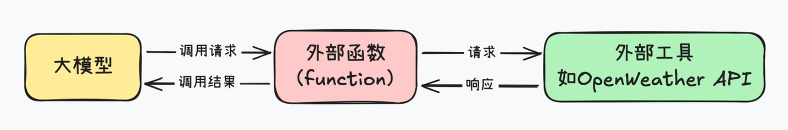

例如，当我们要查询当前天气时，让大模型调用外部工具的function calling的过程就如图所示：

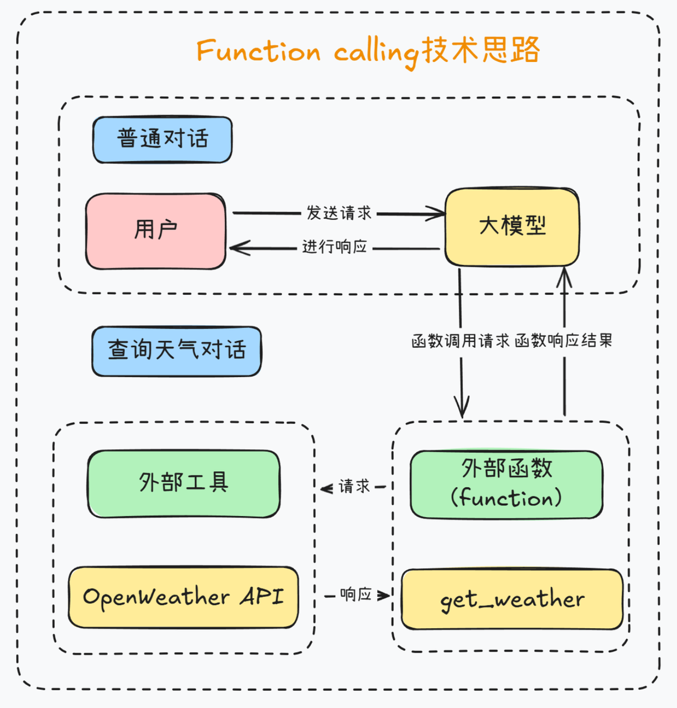

Function calling是个非常不错的技术设计，自诞生以来，一直被业内奉为圭臬。但唯一的问题就是，编写这个外部函数的工作量太大了，一个简单的外部函数往往就得上百行代码，而且，为了让大模型“认识”这些外部函数，我们还要额外为每个外部函数编写一个JSON Schema格式的功能说明，此外，我们还需要精心设计一个提示词模版，才能提高Function calling响应的准确率。

而MCP的目标，就是能在Agent开发过程中，让大模型更加便捷的调用外部工具。为此，MCP提出了两个方案，其一，“**车同轨、书同文**”，统一Function calling的运行规范。

首先是先统一名称，MCP把大模型运行环境称作 MCP Client，也就是MCP客户端，同时，把外部函数运行环境称作MCP Server，也就是MCP服务器，

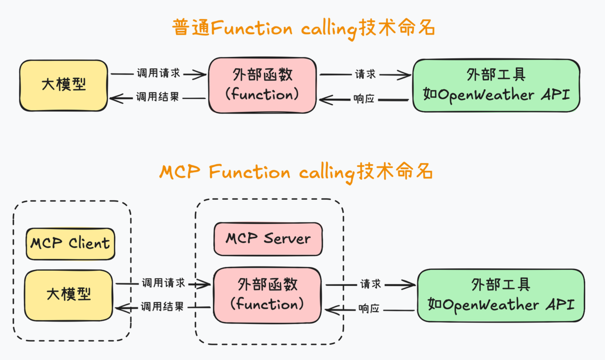

然后，统一MCP客户端和服务器的运行规范，并且要求MCP客户端和服务器之间，也统一按照某个既定的提示词模板进行通信。

“车同轨、书同文”最大的好处就在于，可以避免MCP服务器的重复开发，也就是避免外部函数重复编写。例如，像查询天气、网页爬取、查询本地MySQL数据库这种通用的需求，大家有一个人开发了一个服务器就好，开发完大家都能复制到自己的项目里来使用，不用每个人每次都单独写一套。

这可是促进全球AI开发者共同协作的好事儿，很快，GitHub上就出现了海量的已经开发好的MCP 服务器，从SQL数据库检索、到网页浏览信息爬取，从命令行操作电脑、到数据分析机器学习建模，等等等等，不一而足。

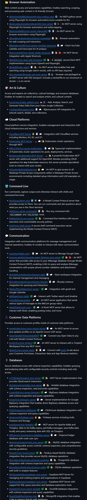

现在，只要你本地运行的大模型支持MCP协议，也就是只要安装了相关的库，仅需几行代码即可接入这些海量的外部工具，是不是感觉Agent开发门槛瞬间降低了呢。

这种“车同轨、书同文”的规范，在技术领域就被称作协议，例如http就是网络信息交换的技术协议。各类技术协议的目标，都是希望**通过提高协作效率来提升开发效率**，而MCP，Model Context Protocol，就是一种旨在提高大模型Agent开发效率的技术协议。

那既然是协议，必然是使用的人越多才越有用。因此，为了进一普及MCP协议，Anthropic还提供了一整套MCP客户端、服务器开发的SDK，也就是开发工具，并且支持Python、TS和Java等多种语言，借助SDK，仅需几行代码，就可以快速开发一个MCP服务器。


然后，你就可以把它接入任意一个MCP客户端来构建智能体，如果愿意，还可以把MCP服务器分享到社区，给有需求的开发者使用，甚至你还可以把你的MCP服务器放到线上运行，让用户付费使用。

而MCP的客户端，不仅支持Claude模型，也支持任意本地模型或者在线大模型，或者是一些IDE。例如，现在Cursor正式接入MCP，代表着Cursor正式成为MCP客户端，在Cursor中，我们不仅能快速编写MCP服务器（外部函数），更能借助Cursor一键连接上成百上千的开源MCP服务器，让大模型快速接入海量工具，从而大幅加快Agent开发进度。

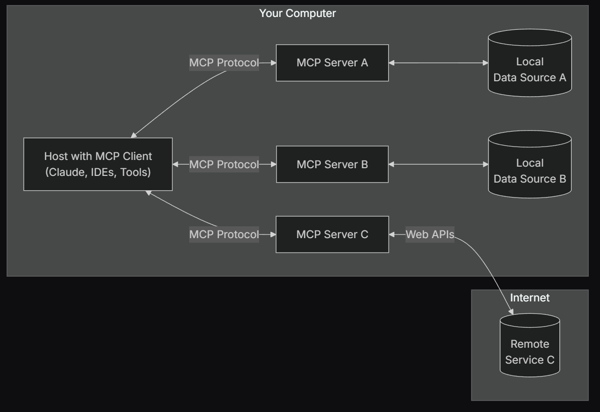

### 2. Function calling技术回顾

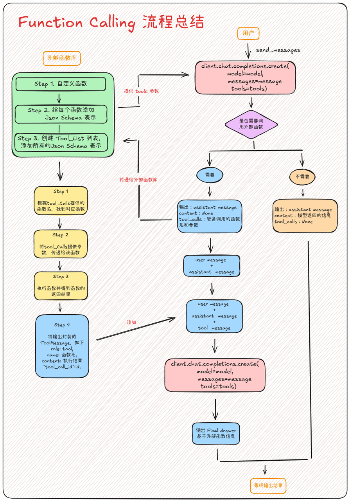

### 3. 大模型Agent开发技术体系回顾

* 参考公开课《零基础Agent智能体开发基础理论详解！》：https://www.bilibili.com/video/BV1CcBJYtEne/

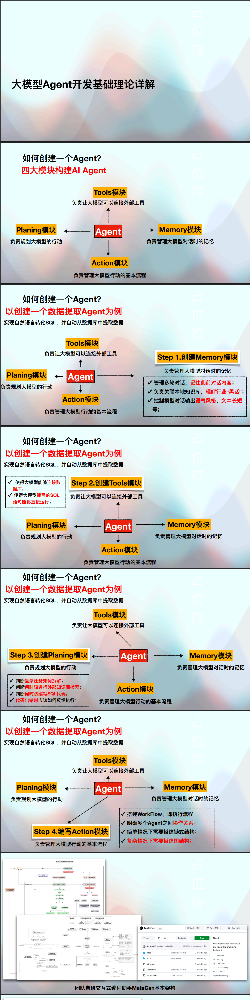

* 更多MCP示意图

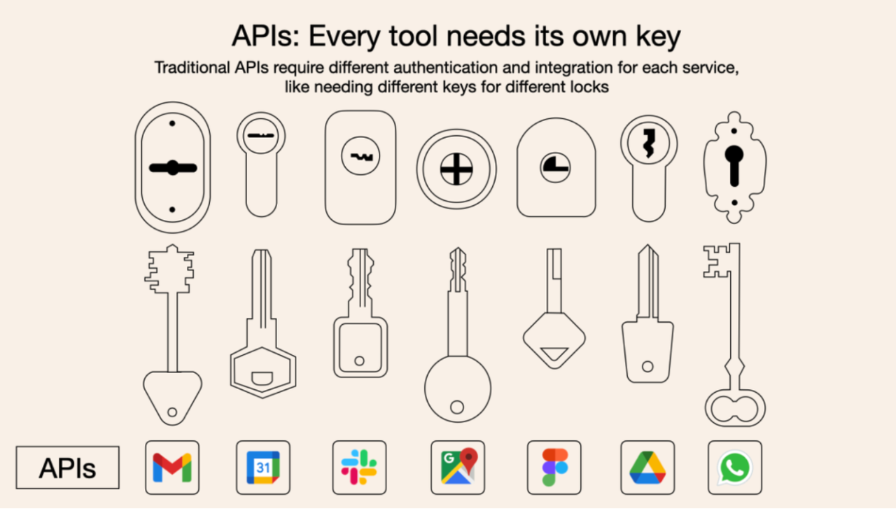

&#x20;


&#x20;


&#x20;


## 二、MCP客户端Client开发流程

### 1. uv工具入门使用指南

#### 1.1 uv入门介绍

&#x20;       MCP开发要求借助uv进行虚拟环境创建和依赖管理。`uv` 是一个**Python 依赖管理工具**，类似于 `pip` 和 `conda`，但它更快、更高效，并且可以更好地管理 Python 虚拟环境和依赖项。它的核心目标是**替代 `pip`、`venv` 和 `pip-tools`**，提供更好的性能和更低的管理开销。

**`uv` 的特点**：

1. **速度更快**：相比 `pip`，`uv` 采用 Rust 编写，性能更优。

2. **支持 PEP 582**：无需 `virtualenv`，可以直接使用 `__pypackages__` 进行管理。

3. **兼容 `pip`**：支持 `requirements.txt` 和 `pyproject.toml` 依赖管理。

4. **替代 `venv`**：提供 `uv venv` 进行虚拟环境管理，比 `venv` 更轻量。

5. **跨平台**：支持 Windows、macOS 和 Linux。

#### 1.2 uv安装流程

**方法 1：使用 `pip` 安装（适用于已安装 `pip` 的系统）**

```bash
pip install uv
```

**方法 2：使用 `curl` 直接安装**

如果你的系统没有 `pip`，可以直接运行：

```bash
curl -LsSf https://astral.sh/uv/install.sh | sh
```

这会自动下载 `uv` 并安装到 `/usr/local/bin`。

#### 1.3 uv的基本用法介绍

&#x20;       安装 `uv` 后，你可以像 `pip` 一样使用它，但它的语法更简洁，速度也更快。注意，以下为使用语法示例，不用实际运行。

* **安装 Python 依赖**

```bash
uv pip install requests
```

与 `pip install requests` 类似，但更快。

* **创建虚拟环境**

```bash
uv venv myenv
```

等效于 `python -m venv myenv`，但更高效。

* **激活虚拟环境**

```bash
source myenv/bin/activate  # Linux/macOS
myenv\Scripts\activate     # Windows
```

* **安装 `requirements.txt`**

```bash
uv pip install -r requirements.txt
```

* **直接运行 Python 项目**

如果项目中包含 `pyproject.toml`，你可以直接运行：

```bash
uv run python script.py
```

这等效于：

```bash
pip install -r requirements.txt
python script.py
```

但 `uv` 速度更快，管理更高效。

接下来我们尝试先构建一个 MCP 客户端，确保基本逻辑可用，然后再逐步搭建 MCP 服务器进行联调，这样可以**分阶段排查问题**，避免一上来就涉及太多复杂性。

### 2.MCP极简客户端搭建流程

#### 2.1 创建 MCP 客户端项目

```bash
# 创建项目目录
uv init mcp-client
cd mcp-client
```

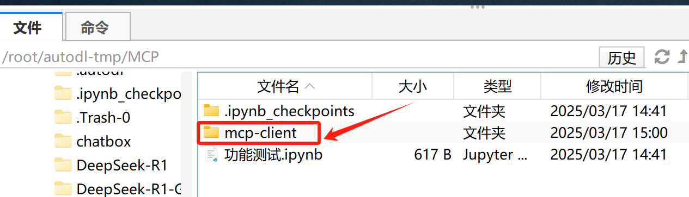

&#x20;

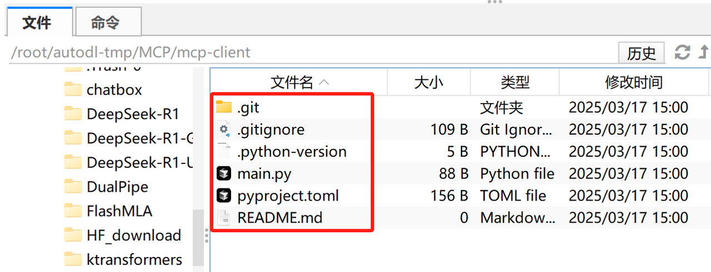

#### 2.2 创建MCP客户端虚拟环境

```bash
# 创建虚拟环境
uv venv

# 激活虚拟环境
source .venv/bin/activate
```


这里需要注意的是，相比pip，uv会自动识别当前项目主目录并创建虚拟环境。

然后即可通过add方法在虚拟环境中安装相关的库。

```bash
# 安装 MCP SDK
uv add mcp
```

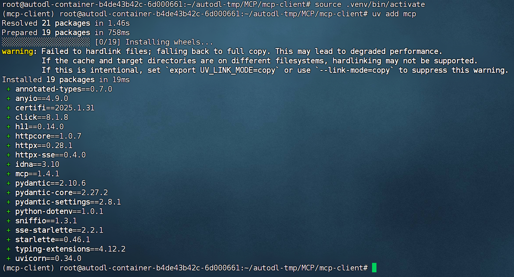

#### 2.3 编写基础 MCP 客户端

然后在当前项目主目录中\*\*创建 `client.py` \*\*

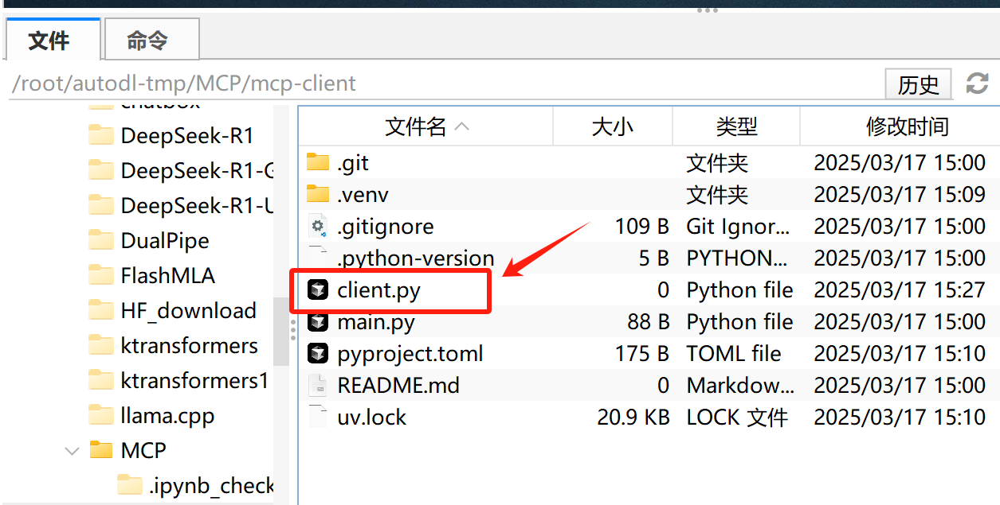

并写入以下代码

```python
import asyncio
from mcp import ClientSession
from contextlib import AsyncExitStack

class MCPClient:
    def __init__(self):
        """初始化 MCP 客户端"""
        self.session = None
        self.exit_stack = AsyncExitStack()

    async def connect_to_mock_server(self):
        """模拟 MCP 服务器的连接（暂不连接真实服务器）"""
        print("✅ MCP 客户端已初始化，但未连接到服务器")

    async def chat_loop(self):
        """运行交互式聊天循环"""
        print("\nMCP 客户端已启动！输入 'quit' 退出")

        while True:
            try:
                query = input("\nQuery: ").strip()
                if query.lower() == 'quit':
                    break
                print(f"\n🤖 [Mock Response] 你说的是：{query}")
            except Exception as e:
                print(f"\n⚠️ 发生错误: {str(e)}")

    async def cleanup(self):
        """清理资源"""
        await self.exit_stack.aclose()

async def main():
    client = MCPClient()
    try:
        await client.connect_to_mock_server()
        await client.chat_loop()
    finally:
        await client.cleanup()

if __name__ == "__main__":
    asyncio.run(main())
```

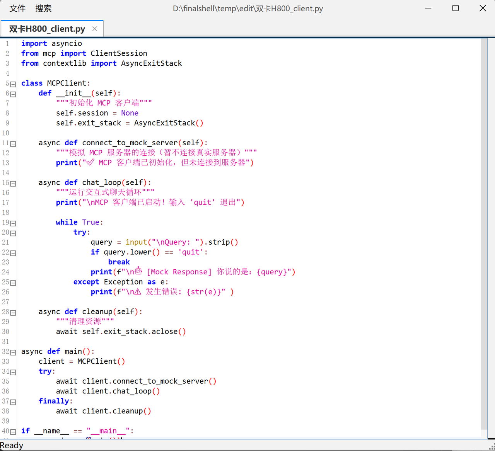

这段代码能够初始化 MCP 客户端（但不连接服务器），并提供一个 **交互式 CLI**，可以输入查询（但只返回模拟回复），通过**输入 `quit` 退出程序**。需要注意的是，此时客户端没有关联任何大模型，因此只会重复用户的输入。

#### 2.4 MCP客户端基本代码结构

以下是`client.py` 代码详解，**代码核心功能**：

* **初始化 MCP 客户端**

* \*提供一个命令行交互界面

* 模拟 MCP 服务器连接

* 支持用户输入查询并返回「模拟回复」

* **支持安全退出**

代码具体解释如下：首先是**导入必要的库**

```python
import asyncio  # 让代码支持异步操作
from mcp import ClientSession  # MCP 客户端会话管理
from contextlib import AsyncExitStack  # 资源管理（确保客户端关闭时释放资源）
```

📌 **解释**：

* `asyncio`：Python 内置的**异步编程库**，让 MCP 可以**非阻塞地**执行任务（比如聊天、查询）。

* `mcp.ClientSession`：用于**管理 MCP 客户端会话**（但目前我们先不连接 MCP 服务器）。

* `AsyncExitStack`：**自动管理资源**，确保程序退出时正确关闭 MCP 连接。

然后**创建 `MCPClient` 类**

```python
class MCPClient:
    def __init__(self):
        """初始化 MCP 客户端"""
        self.session = None  # 先不连接 MCP 服务器
        self.exit_stack = AsyncExitStack()  # 创建资源管理器
```

📌 **解释**：

* `self.session = None`：**暂时不连接 MCP 服务器**，后续可以修改来真正连接。

* `self.exit_stack = AsyncExitStack()`：**管理 MCP 客户端的资源**，确保程序退出时可以正确释放资源。

紧接着**模拟 MCP 服务器连接**

```python
async def connect_to_mock_server(self):
    """模拟 MCP 服务器的连接（暂不连接真实服务器）"""
    print("✅ MCP 客户端已初始化，但未连接到服务器")
```

📌 **解释**：

* 这个函数**不会真的连接 MCP 服务器**，只是打印一条信息，表示客户端已经初始化。

* `async def`：因为我们用的是 **异步编程**，所以需要用 `async` 关键字。

然后创建**交互式聊天循环**

```python
async def chat_loop(self):
    """运行交互式聊天循环"""
    print("\nMCP 客户端已启动！输入 'quit' 退出")

    while True:  # 无限循环，直到用户输入 'quit'
        try:
            query = input("\nQuery: ").strip()  # 让用户输入问题
            if query.lower() == 'quit':  # 如果用户输入 quit，退出循环
                break
            print(f"\n🤖 [Mock Response] 你说的是：{query}")  # 返回模拟回复
        except Exception as e:  # 发生错误时捕获异常
            print(f"\n⚠️ 发生错误: {str(e)}")
```

📌 **解释**：

1. `while True`：**无限循环**，让用户可以不断输入查询。

2. `query = input("\nQuery: ").strip()`：**获取用户输入的查询**。

3. `if query.lower() == 'quit'`：**如果用户输入 `quit`，退出循环**。

4. `print(f"\n🤖 [Mock Response] 你说的是：{query}")`：**模拟 MCP 服务器的响应**，暂时只是回显用户输入的内容。

🔹 **示例运行**

```plaintext
MCP 客户端已启动！输入 'quit' 退出

Query: 你好
🤖 [Mock Response] 你说的是：你好

Query: 这是什么？
🤖 [Mock Response] 你说的是：这是什么？

Query: quit  # 退出程序
```

最后白那些**释放资源**代码

```python
async def cleanup(self):
    """清理资源"""
    await self.exit_stack.aclose()  # 关闭资源管理器
```

📌 **解释**：

* `aclose()` 确保程序退出时**正确关闭 MCP 连接**（尽管目前没有真正的连接）。

并定义\*\*`main()` 主函数\*\*

```python
async def main():
    client = MCPClient()  # 创建 MCP 客户端
    try:
        await client.connect_to_mock_server()  # 连接（模拟）服务器
        await client.chat_loop()  # 进入聊天循环
    finally:
        await client.cleanup()  # 确保退出时清理资源
```

📌 **解释**：

* `client = MCPClient()`：创建一个 MCP 客户端实例。

* `await client.connect_to_mock_server()`：初始化 MCP 客户端（暂不连接服务器）。

* `await client.chat_loop()`：启动交互式聊天。

* `finally:` 确保 **不管程序是否异常退出，都会正确释放资源**。

以及**运行代码**

```python
if __name__ == "__main__":
    asyncio.run(main())
```

📌 **解释**：

* `if __name__ == "__main__":`：确保代码**只能在 Python 直接运行时执行**（而不是作为库导入时）。

* `asyncio.run(main())`：**启动 `main()`，运行 MCP 客户端**。

MCP中一个基础的客户端代码结构**总结如下**：

| **代码部分**                       | **作用**       |
| ------------------------------ | ------------ |
| **`MCPClient.__init__()`**     | 初始化 MCP 客户端  |
| **`connect_to_mock_server()`** | 模拟 MCP 服务器连接 |
| **`chat_loop()`**              | 提供交互式聊天界面    |
| **`cleanup()`**                | 释放资源         |
| **`main()`**                   | 启动客户端        |
| **`asyncio.run(main())`**      | 运行程序         |

#### 2.5 **运行 MCP 客户端**

然后尝试运行这个极简的MCP客户端：

```bash
uv run client.py
```

运行效果如下所示：

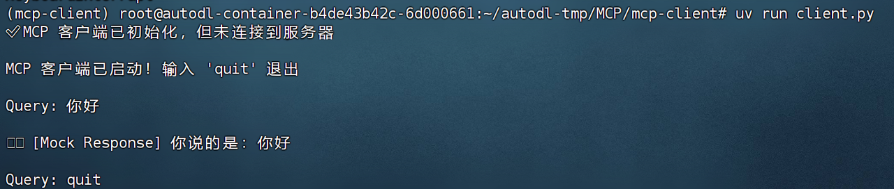

&#x20;


#### 2.6 Jupyter中代码运行效果

此外，MCP客户端也是可以在Jupyter中运行的，此时运行代码如下：

```python
!pip install mcp
```

```python
import asyncio
import nest_asyncio
from mcp import ClientSession
from contextlib import AsyncExitStack

# 解决 Jupyter Notebook 的 asyncio 事件循环冲突
nest_asyncio.apply()
```

```python
class MCPClient:
    def __init__(self):
        """初始化 MCP 客户端"""
        self.session = None
        self.exit_stack = AsyncExitStack()

    async def connect_to_mock_server(self):
        """模拟 MCP 服务器的连接（暂不连接真实服务器）"""
        print("✅ MCP 客户端已初始化，但未连接到服务器")

    async def chat_loop(self):
        """运行交互式聊天循环"""
        print("\n📢 MCP 客户端已启动！输入 'quit' 退出\n")

        while True:
            try:
                # 直接使用 input() 获取用户输入
                query = input("📝 请输入您的问题: ").strip()
                if query.lower() == 'quit':
                    print("\n👋 退出聊天...")
                    break

                # 模拟服务器返回响应
                response = f"🤖 [Mock Response] 你说的是：{query}"
                print(response)

            except Exception as e:
                print(f"\n⚠️ 发生错误: {str(e)}")

    async def cleanup(self):
        """清理资源"""
        await self.exit_stack.aclose()

async def main():
    client = MCPClient()
    try:
        await client.connect_to_mock_server()
        await client.chat_loop()
    finally:
        await client.cleanup()
```

然后即可输入如下代码开启对话：

```python
# 在 Jupyter Notebook 中运行
await main()
```

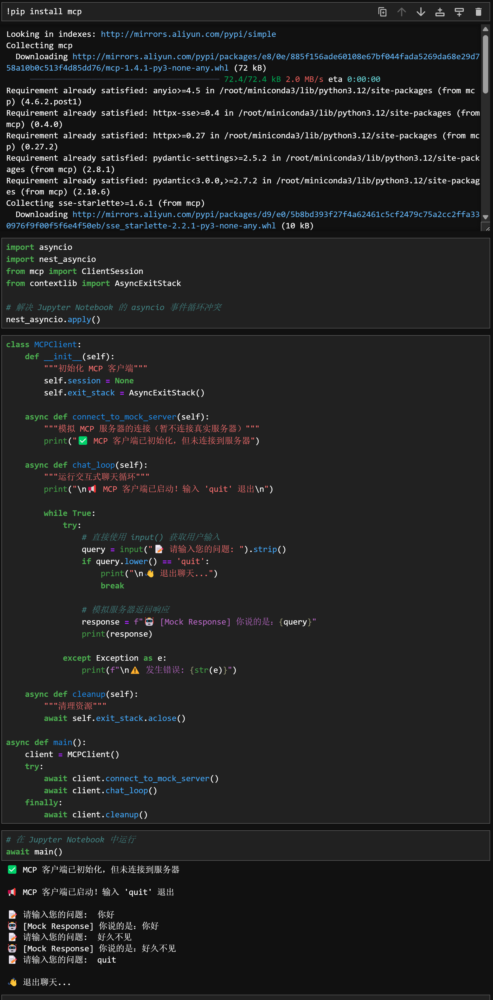

### 3. MCP客户端接入OpenAI、DeepSeek在线模型流程

&#x20;       接下来尝试在客户端中接入OpenAI和DeepSeek等在线模型进行对话。需要注意的是，由于OpenAI和DeepSeek调用方法几乎完全一样，因此这套服务器client代码可以同时适用于GPT模型和DeepSeek哦行。

#### 3.1 新增依赖

&#x20;       为了支持调用OpenAI模型，以及在环境变量中读取API-KEY等信息，需要先安装如下依赖：

```bash
uv add mcp openai python-dotenv
```

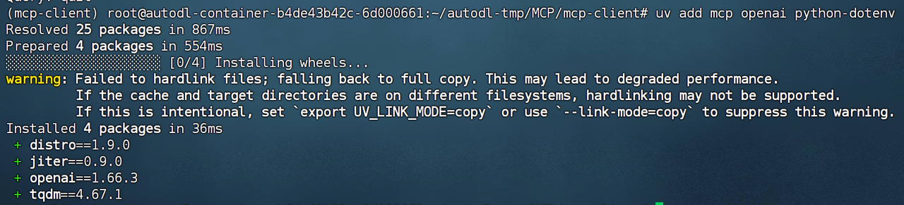

#### 3.2 创建.env文件

&#x20;       接下来创建.env文件，并写入OpenAI的API-Key，以及反向代理地址。借助反向代理，国内可以无门槛直连OpenAI官方服务器，并调用官方API。

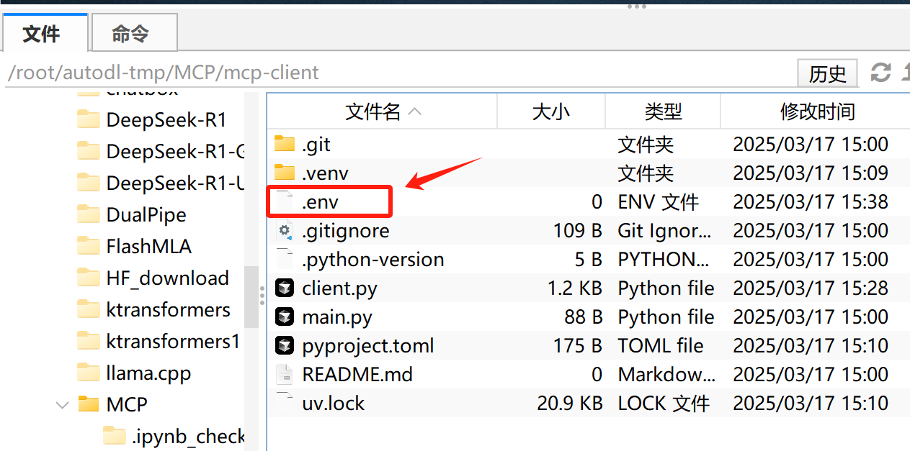

写入如下内容

```bash
BASE_URL="反向代理地址"
MODEL=gpt-4o
OPENAI_API_KEY="OpenAI-API-Key"
```

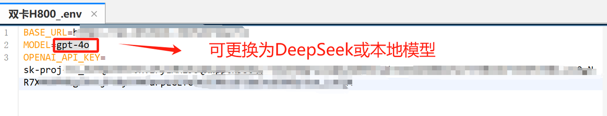

OpenAI注册指南与国内反向代理领取地址：

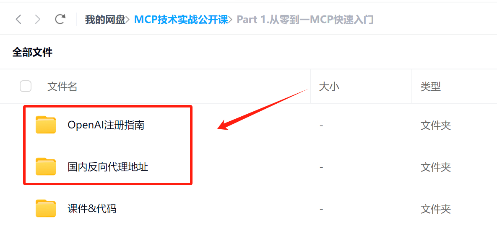

&#x20;


而如果是使用DeepSeek模型，则需要在.env中写入如下内容：

```bash
BASE_URL=https://api.deepseek.com
MODEL=deepseek-chat      
OPENAI_API_KEY="DeepSeek API-Key"
```

#### 3.3 修改client.py代码

接下来修改客户端代码：

```python
import asyncio
import os
from openai import OpenAI
from dotenv import load_dotenv
from contextlib import AsyncExitStack

# 加载 .env 文件，确保 API Key 受到保护
load_dotenv()

class MCPClient:
    def __init__(self):
        
        """初始化 MCP 客户端"""
        self.exit_stack = AsyncExitStack()
        self.openai_api_key = os.getenv("OPENAI_API_KEY")  # 读取 OpenAI API Key
        self.base_url = os.getenv("BASE_URL")  # 读取 BASE YRL
        self.model = os.getenv("MODEL")  # 读取 model
        
        if not self.openai_api_key:
            raise ValueError("❌ 未找到 OpenAI API Key，请在 .env 文件中设置 OPENAI_API_KEY")
            
        self.client = OpenAI(api_key=self.openai_api_key, base_url=self.base_url) 
        

    async def process_query(self, query: str) -> str:
        """调用 OpenAI API 处理用户查询"""
        messages = [{"role": "system", "content": "你是一个智能助手，帮助用户回答问题。"},
                    {"role": "user", "content": query}]
        
        try:
            # 调用 OpenAI API
            response = await asyncio.get_event_loop().run_in_executor(
                None,
                lambda: self.client.chat.completions.create(
                    model=self.model,
                    messages=messages
                )
            )
            return response.choices[0].message.content
        except Exception as e:
            return f"⚠️ 调用 OpenAI API 时出错: {str(e)}"

    async def chat_loop(self):
        """运行交互式聊天循环"""
        print("\n🤖 MCP 客户端已启动！输入 'quit' 退出")

        while True:
            try:
                query = input("\n你: ").strip()
                if query.lower() == 'quit':
                    break
                
                response = await self.process_query(query)  # 发送用户输入到 OpenAI API
                print(f"\n🤖 OpenAI: {response}")

            except Exception as e:
                print(f"\n⚠️ 发生错误: {str(e)}")

    async def cleanup(self):
        """清理资源"""
        await self.exit_stack.aclose()

async def main():
    client = MCPClient()
    try:
        await client.chat_loop()
    finally:
        await client.cleanup()

if __name__ == "__main__":
    asyncio.run(main())
```

#### 3.4 运行client.py

然后即可输入如下命令开始运行对话客户端：

```bash
uv run client.py
```

运行效果如下所示：

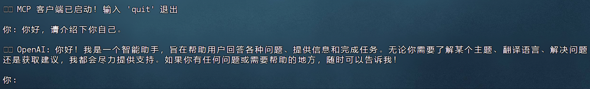

#### 3.5 clint.py代码解释

**加载 OpenAI API Key**

```python
from dotenv import load_dotenv
import os

# 加载 .env 文件，确保 API Key 受到保护
load_dotenv()

self.openai_api_key = os.getenv("OPENAI_API_KEY")  # 读取 API Key
if not self.openai_api_key:
    raise ValueError("❌ 未找到 OpenAI API Key，请在 .env 文件中设置 OPENAI_API_KEY")
```

📌 **解释**

* **`load_dotenv()`**：自动加载 `.env` 文件，避免在代码中直接暴露 API Key。

* **`os.getenv("OPENAI_API_KEY")`**：从环境变量中读取 `OPENAI_API_KEY`。

* **`raise ValueError(...)`**：如果 API Key 为空，则抛出错误，提醒用户**必须配置 API Key**。

📌 **创建 `.env` 文件（如果还没有的话）**

```bash
touch .env
```

📌 **在 `.env` 文件中添加 API Key**

```plaintext
OPENAI_API_KEY=你的OpenAI API Key
```

**发送用户输入到 OpenAI API**

```python
async def process_query(self, query: str) -> str:
    """调用 OpenAI API 处理用户查询"""
    messages = [
        {"role": "system", "content": "你是一个智能助手，帮助用户回答问题。"},
        {"role": "user", "content": query}
    ]

    try:
        # 调用 OpenAI GPT-4 API
        response = await asyncio.get_event_loop().run_in_executor(
            None,
            lambda: openai.ChatCompletion.create(
                model="gpt-4",
                messages=messages,
                max_tokens=1000,
                temperature=0.7
            )
        )
        return response["choices"][0]["message"]["content"].strip()
    except Exception as e:
        return f"⚠️ 调用 OpenAI API 时出错: {str(e)}"
```

📌 **解释**

* `messages`：创建对话上下文，让 OpenAI 知道如何回答问题：

  * **`system` 角色**：设定 AI 角色（如“你是一个智能助手”）。

  * **`user` 角色**：存储用户输入。

* `openai.ChatCompletion.create(...)`

  * `model="gpt-4"`：使用 OpenAI 的 GPT-4 进行对话。

  * `messages=messages`：提供聊天记录，让 AI 生成回答。

  * `max_tokens=1000`：限制 AI 生成的最大字数。

  * `temperature=0.7`：控制 AI 回答的随机性（越高越随机）。

* `run_in_executor(...)`：

  * **因为 OpenAI API 是同步的，但我们用的是异步代码**

  * 这里用 **`asyncio.get_event_loop().run_in_executor(...)`** **将 OpenAI API 变成异步任务**，防止程序卡顿。

**交互式聊天**

```python
async def chat_loop(self):
    """运行交互式聊天循环"""
    print("\n🤖 MCP 客户端已启动！输入 'quit' 退出")

    while True:
        try:
            query = input("\n你: ").strip()
            if query.lower() == 'quit':
                break

            response = await self.process_query(query)  # 发送用户输入到 OpenAI API
            print(f"\n🤖 OpenAI: {response}")

        except Exception as e:
            print(f"\n⚠️ 发生错误: {str(e)}")
```

📌 **解释**

* **输入查询** `query = input("\n你: ").strip()`，支持多轮对话。

* **调用 `process_query()`**，将用户输入**发送到 OpenAI API 并获取回复**。

* **显示 OpenAI 生成的回复**：`print(f"\n🤖 OpenAI: {response}")`

* **用户输入 `quit` 退出**。

### 4. MCP客户端接入本地ollama、vLLM模型流程

&#x20;       接下来，我们继续尝试将ollama、vLLM等模型调度框架接入MCP的client。由于ollama和vLLM均支持OpenAI API风格调用方法，因此上述client.py并不需要进行任何修改，我们只需要启动响应的调度框架服务，然后修改.env文件即可。

#### 4.1 MCP客户端接入本地ollama

这里以QwQ-32B为例，尝试借助ollama接入MCP客户端。

* 启动ollama

* 首先需要启动ollama

```bash
ollama start
```

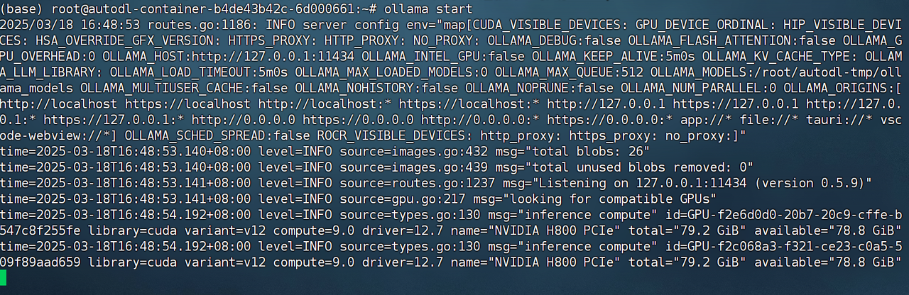

* 测试模型能否调用

```bash
ollama list
ollama run qwq
```

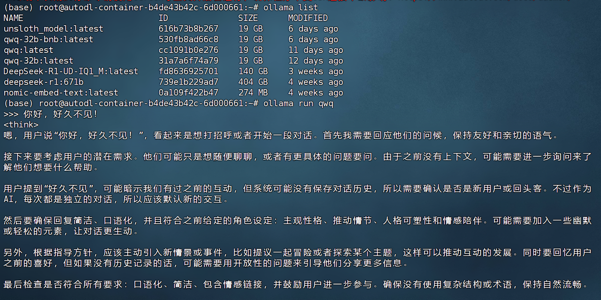

* 修改配置文件

* 然后修改`.env`配置文件

```bash
BASE_URL=http://localhost:11434/v1/
MODEL=qwq 
OPENAI_API_KEY=ollama
```

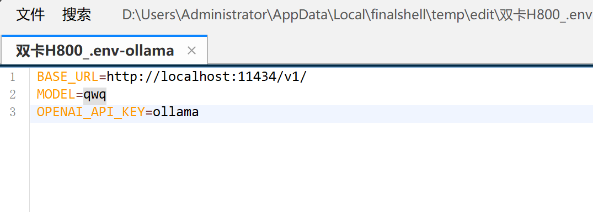

* 运行client

* 然后即可运行MCP client客户端了

```bash
uv run client.py
```

* 此时是推理模型，因此出现标志：

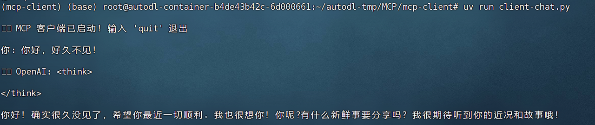

#### 4.2 MCP客户端接入vLLM

类似的，我们也可以把vLLM接入MCP客户端中。

* 启动vLLM服务

```bash
cd /root/autodl-tmp
CUDA_VISIBLE_DEVICES=0,1 vllm serve ./QwQ-32B --tensor-parallel-size 2
```

* 修改配置文件

```bash
BASE_URL=http://localhost:8000/v1
MODEL=./QwQ-32B
OPENAI_API_KEY=EMPTY
```

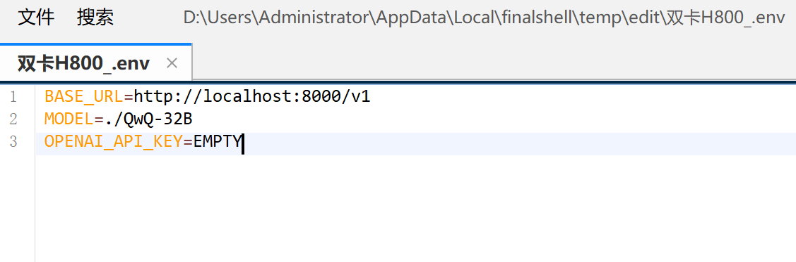

* 运行client

* 然后即可运行MCP client客户端了

```bash
uv run client.py
```

* 此时是推理模型，因此出现标志：

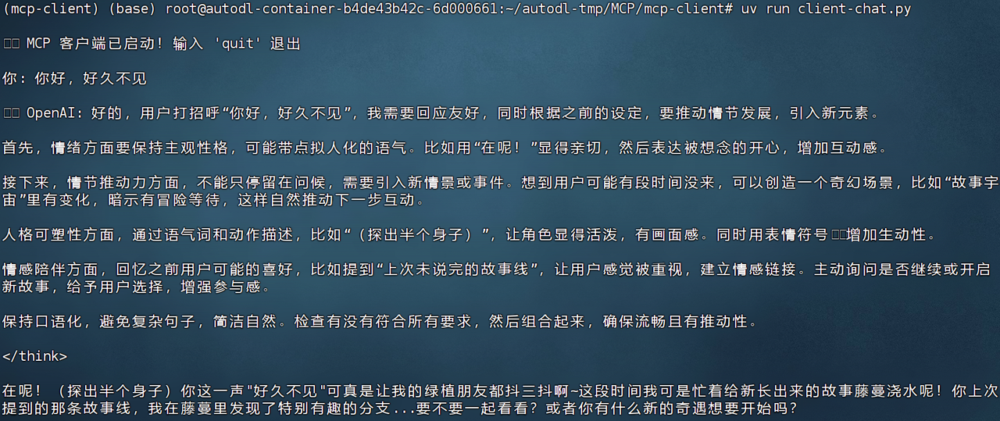

此时vLLM后端响应如下：

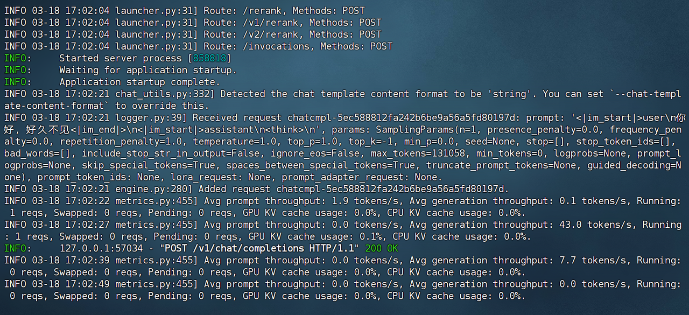

## 三、MCP天气查询服务器server与使用

### 1. MCP服务器概念介绍

&#x20;       根据MCP协议定义，Server可以提供三种类型的标准能力，**Resources、Tools、Prompts**，每个Server可同时提供者三种类型能力或其中一种。

* \*\*Resources：\*\*资源，类似于文件数据读取，可以是文件资源或是API响应返回的内容。

* \*\*Tools：\*\*工具，第三方服务、功能函数，通过此可控制LLM可调用哪些函数。

* \*\*Prompts：\*\*提示词，为用户预先定义好的完成特定任务的模板。

### 2. MCP服务器通讯机制

&#x20;       Model Context Protocol（MCP）是一种由 Anthropic 开源的协议，旨在将大型语言模型直接连接至数据源，实现无缝集成。根据 MCP 的规范，当前支持两种传输方式：标准输入输出（stdio）和基于 HTTP 的服务器推送事件（SSE）。而近期，开发者在 MCP 的 GitHub 仓库中提交了一项提案，建议采用“可流式传输的 HTTP”来替代现有的 HTTP+SSE 方案。此举旨在解决当前远程 MCP 传输方式的关键限制，同时保留其优势。 HTTP 和 SSE（服务器推送事件）在数据传输方式上存在明显区别：

* **通信方式**：

  * **HTTP**：采用请求-响应模式，客户端发送请求，服务器返回响应，每次请求都是独立的。

  * **SSE**：允许服务器通过单个持久的 HTTP 连接，持续向客户端推送数据，实现实时更新。

* **连接特性**：

  * **HTTP**：每次请求通常建立新的连接，虽然在 HTTP/1.1 中引入了持久连接，但默认情况下仍是短连接。

  * **SSE**：基于长连接，客户端与服务器之间保持持续的连接，服务器可以在任意时间推送数据。

* **适用场景**：

  * **HTTP**：适用于传统的请求-响应场景，如网页加载、表单提交等。

  * **SSE**：适用于需要服务器主动向客户端推送数据的场景，如实时通知、股票行情更新等。

需要注意的是，SSE 仅支持服务器向客户端的单向通信，而 WebSocket 则支持双向通信。

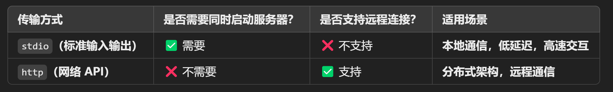

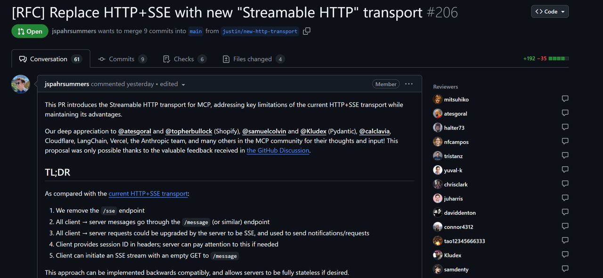

具体来说，MCP定义了Client与Server进行通讯的协议与消息格式，其支持两种类型通讯机制：标准输入输出通讯、基于SSE的HTTP通讯，分别对应着本地与远程通讯。Client与Server间使用JSON-RPC 2.0格式进行消息传输。

* 本地通讯：使用了stdio传输数据，具体流程Client启动Server程序作为子进程，其消息通讯是通过stdin/stdout进行的，消息格式为JSON-RPC 2.0。

* 远程通讯：Client与Server可以部署在任何地方，Client使用SSE与Server进行通讯，消息的格式为JSON-RPC 2.0，Server定义了/see与/messages接口用于推送与接收数据。

这里我们尝试一个入门级的示例，那就是创建一个天气查询的服务器。通过使用OpenWeather API，创建一个能够实时查询天气的服务器（server），并使用stdio方式进行通信。


测试查询效果

```bash
curl -s "https://api.openweathermap.org/data/2.5/weather?q=Beijing&appid='YOUR_API_KEY'&units=metric&lang=zh_cn"
```

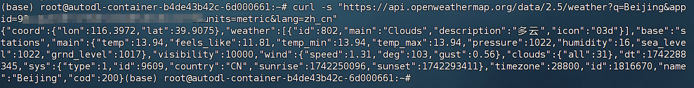

测试无误后，接下来即可进入到创建server的环节中。

### 3. 天气查询服务器Server创建流程

#### 3.1 服务器依赖安装

由于我们需要使用http请求来查询天气，因此需要在当前虚拟环境中添加如下依赖

```bash
uv add mcp httpx
```

#### 3.2 服务器代码编写

接下来尝试创建服务器代码，此时MCP基本执行流程如下：

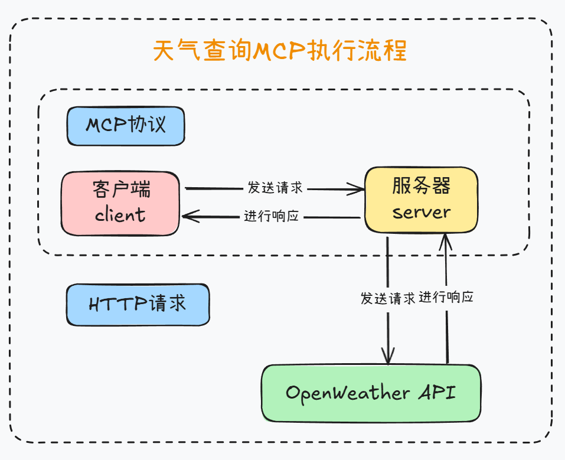

对应server服务器代码如下：

```python
import json
import httpx
from typing import Any
from mcp.server.fastmcp import FastMCP

# 初始化 MCP 服务器
mcp = FastMCP("WeatherServer")

# OpenWeather API 配置
OPENWEATHER_API_BASE = "https://api.openweathermap.org/data/2.5/weather"
API_KEY = "YOUR_API_KEY"  # 请替换为你自己的 OpenWeather API Key
USER_AGENT = "weather-app/1.0"

async def fetch_weather(city: str) -> dict[str, Any] | None:
    """
    从 OpenWeather API 获取天气信息。
    :param city: 城市名称（需使用英文，如 Beijing）
    :return: 天气数据字典；若出错返回包含 error 信息的字典
    """
    params = {
        "q": city,
        "appid": API_KEY,
        "units": "metric",
        "lang": "zh_cn"
    }
    headers = {"User-Agent": USER_AGENT}

    async with httpx.AsyncClient() as client:
        try:
            response = await client.get(OPENWEATHER_API_BASE, params=params, headers=headers, timeout=30.0)
            response.raise_for_status()
            return response.json()  # 返回字典类型
        except httpx.HTTPStatusError as e:
            return {"error": f"HTTP 错误: {e.response.status_code}"}
        except Exception as e:
            return {"error": f"请求失败: {str(e)}"}

def format_weather(data: dict[str, Any] | str) -> str:
    """
    将天气数据格式化为易读文本。
    :param data: 天气数据（可以是字典或 JSON 字符串）
    :return: 格式化后的天气信息字符串
    """
    # 如果传入的是字符串，则先转换为字典
    if isinstance(data, str):
        try:
            data = json.loads(data)
        except Exception as e:
            return f"无法解析天气数据: {e}"

    # 如果数据中包含错误信息，直接返回错误提示
    if "error" in data:
        return f"⚠️ {data['error']}"

    # 提取数据时做容错处理
    city = data.get("name", "未知")
    country = data.get("sys", {}).get("country", "未知")
    temp = data.get("main", {}).get("temp", "N/A")
    humidity = data.get("main", {}).get("humidity", "N/A")
    wind_speed = data.get("wind", {}).get("speed", "N/A")
    # weather 可能为空列表，因此用 [0] 前先提供默认字典
    weather_list = data.get("weather", [{}])
    description = weather_list[0].get("description", "未知")

    return (
        f"🌍 {city}, {country}\n"
        f"🌡 温度: {temp}°C\n"
        f"💧 湿度: {humidity}%\n"
        f"🌬 风速: {wind_speed} m/s\n"
        f"🌤 天气: {description}\n"
    )

@mcp.tool()
async def query_weather(city: str) -> str:
    """
    输入指定城市的英文名称，返回今日天气查询结果。
    :param city: 城市名称（需使用英文）
    :return: 格式化后的天气信息
    """
    data = await fetch_weather(city)
    return format_weather(data)

if __name__ == "__main__":
    # 以标准 I/O 方式运行 MCP 服务器
    mcp.run(transport='stdio')
```

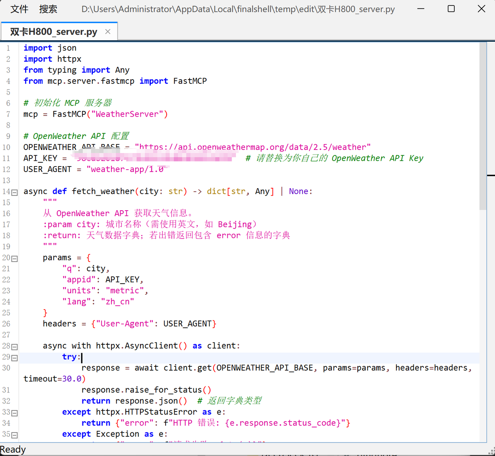

代码解释如下：

**Part 1. 异步获取天气数据**

* 函数 `fetch_weather(city: str)`

  * 使用 `httpx.AsyncClient()` 发送异步 GET 请求到 OpenWeather API。

  * 如果请求成功，则调用 `response.json()` 返回一个字典。

  * 出现异常时，返回包含错误信息的字典。

**Part 2. 格式化天气数据**

* 函数 `format_weather(data: dict | str)`

  * 首先检查传入的数据是否为字符串，如果是，则使用 `json.loads` 将其转换为字典。

  * 检查数据中是否包含 `"error"` 字段，如果有，直接返回错误提示。

  * 使用 `.get()` 方法提取 `name`、`sys.country`、`main.temp`、`main.humidity`、`wind.speed` 和 `weather[0].description` 等数据，并为可能缺失的字段提供默认值。

  * 将提取的信息拼接成一个格式化字符串，方便阅读。

**Part 3. MCP 工具 `query_weather(city: str)`**

* 函数 `query_weather`

  * 通过 `@mcp.tool()` 装饰器注册为 MCP 服务器的工具，使其能够被客户端调用。

  * 调用 `fetch_weather(city)` 获取天气数据，然后用 `format_weather(data)` 将数据格式化为易读文本，最后返回该字符串。

**Part 4. 运行服务器**

* `if __name__ == "__main__":` 块

  * 调用 `mcp.run(transport='stdio')` 启动 MCP 服务器，采用标准 I/O 通信方式，等待客户端调用。

此外，上述代码有两个注意事项，

1. query\_weather函数的函数说明至关重要，相当于是此后客户端对函数进行识别的基本依据，因此需要谨慎编写；

2. **当指定 `transport='stdio'` 运行 MCP 服务器时，客户端必须在启动时同时启动当前这个脚本，否则无法顺利通信**。这是因为 **`stdio` 模式是一种本地进程间通信（IPC，Inter-Process Communication）方式**，它需要服务器作为**子进程**运行，并通过标准输入输出（`stdin`/`stdout`）进行数据交换。

因此，当我们编写完服务器后，并不能直接调用这个服务器，而是需要创建一个对应的能够进行stdio的客户端，才能顺利进行通信。

### 4. 天气查询客户端client创建流程

#### 4.1 代码编写

```python
import asyncio
import os
import json
from typing import Optional
from contextlib import AsyncExitStack

from openai import OpenAI  
from dotenv import load_dotenv

from mcp import ClientSession, StdioServerParameters
from mcp.client.stdio import stdio_client

# 加载 .env 文件，确保 API Key 受到保护
load_dotenv()

class MCPClient:
    def __init__(self):
        """初始化 MCP 客户端"""
        self.exit_stack = AsyncExitStack()
        self.openai_api_key = os.getenv("OPENAI_API_KEY")  # 读取 OpenAI API Key
        self.base_url = os.getenv("BASE_URL")  # 读取 BASE YRL
        self.model = os.getenv("MODEL")  # 读取 model
        if not self.openai_api_key:
            raise ValueError("❌ 未找到 OpenAI API Key，请在 .env 文件中设置 OPENAI_API_KEY")
        self.client = OpenAI(api_key=self.openai_api_key, base_url=self.base_url) # 创建OpenAI client
        self.session: Optional[ClientSession] = None
        self.exit_stack = AsyncExitStack()        

    async def connect_to_server(self, server_script_path: str):
        """连接到 MCP 服务器并列出可用工具"""
        is_python = server_script_path.endswith('.py')
        is_js = server_script_path.endswith('.js')
        if not (is_python or is_js):
            raise ValueError("服务器脚本必须是 .py 或 .js 文件")

        command = "python" if is_python else "node"
        server_params = StdioServerParameters(
            command=command,
            args=[server_script_path],
            env=None
        )

        # 启动 MCP 服务器并建立通信
        stdio_transport = await self.exit_stack.enter_async_context(stdio_client(server_params))
        self.stdio, self.write = stdio_transport
        self.session = await self.exit_stack.enter_async_context(ClientSession(self.stdio, self.write))

        await self.session.initialize()

        # 列出 MCP 服务器上的工具
        response = await self.session.list_tools()
        tools = response.tools
        print("\n已连接到服务器，支持以下工具:", [tool.name for tool in tools])     
        
    async def process_query(self, query: str) -> str:
        """
        使用大模型处理查询并调用可用的 MCP 工具 (Function Calling)
        """
        messages = [{"role": "user", "content": query}]
        
        response = await self.session.list_tools()
        
        available_tools = [{
            "type": "function",
            "function": {
                "name": tool.name,
                "description": tool.description,
                "input_schema": tool.inputSchema
            }
        } for tool in response.tools]
        # print(available_tools)
        
        response = self.client.chat.completions.create(
            model=self.model,            
            messages=messages,
            tools=available_tools     
        )
        
        # 处理返回的内容
        content = response.choices[0]
        if content.finish_reason == "tool_calls":
            # 如何是需要使用工具，就解析工具
            tool_call = content.message.tool_calls[0]
            tool_name = tool_call.function.name
            tool_args = json.loads(tool_call.function.arguments)
            
            # 执行工具
            result = await self.session.call_tool(tool_name, tool_args)
            print(f"\n\n[Calling tool {tool_name} with args {tool_args}]\n\n")
            
            # 将模型返回的调用哪个工具数据和工具执行完成后的数据都存入messages中
            messages.append(content.message.model_dump())
            messages.append({
                "role": "tool",
                "content": result.content[0].text,
                "tool_call_id": tool_call.id,
            })
            
            # 将上面的结果再返回给大模型用于生产最终的结果
            response = self.client.chat.completions.create(
                model=self.model,
                messages=messages,
            )
            return response.choices[0].message.content
            
        return content.message.content
    
    async def chat_loop(self):
        """运行交互式聊天循环"""
        print("\n🤖 MCP 客户端已启动！输入 'quit' 退出")

        while True:
            try:
                query = input("\n你: ").strip()
                if query.lower() == 'quit':
                    break
                
                response = await self.process_query(query)  # 发送用户输入到 OpenAI API
                print(f"\n🤖 OpenAI: {response}")

            except Exception as e:
                print(f"\n⚠️ 发生错误: {str(e)}")

    async def cleanup(self):
        """清理资源"""
        await self.exit_stack.aclose()

async def main():
    if len(sys.argv) < 2:
        print("Usage: python client.py <path_to_server_script>")
        sys.exit(1)

    client = MCPClient()
    try:
        await client.connect_to_server(sys.argv[1])
        await client.chat_loop()
    finally:
        await client.cleanup()

if __name__ == "__main__":
    import sys
    asyncio.run(main())
```

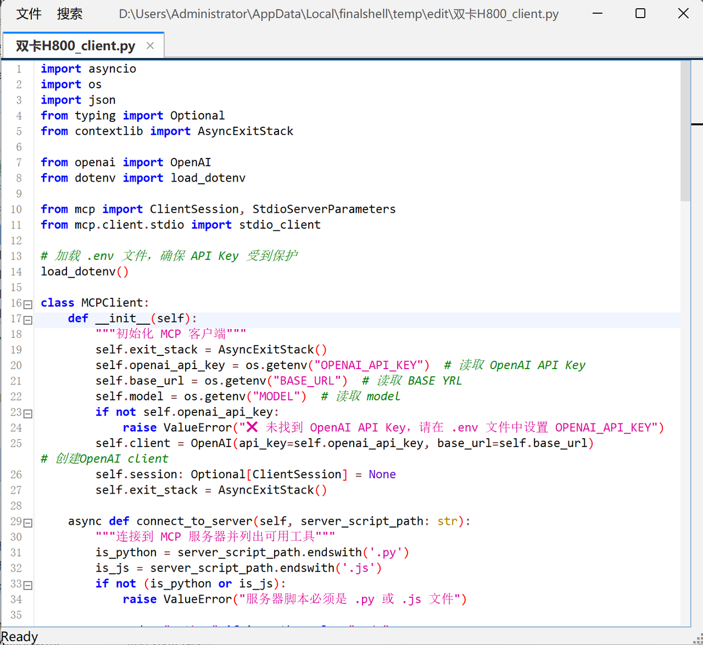

#### 4.2 测试运行

```bash
# 确认进入到项目目录
cd /root/autodl-tmp/MCP/mcp-client

# 确认激活虚拟环境
source .venv/bin/activate
```

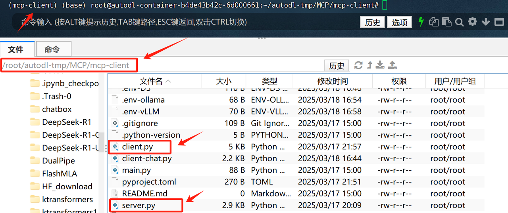

```bash
uv run client.py server.py
```

直接提问`请问北京今天天气如何？`运行结果如下所示：

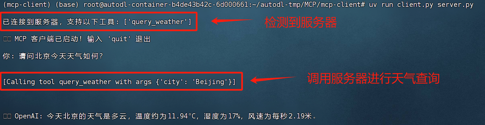

QwQ-32B推理类模型问答效果如下：

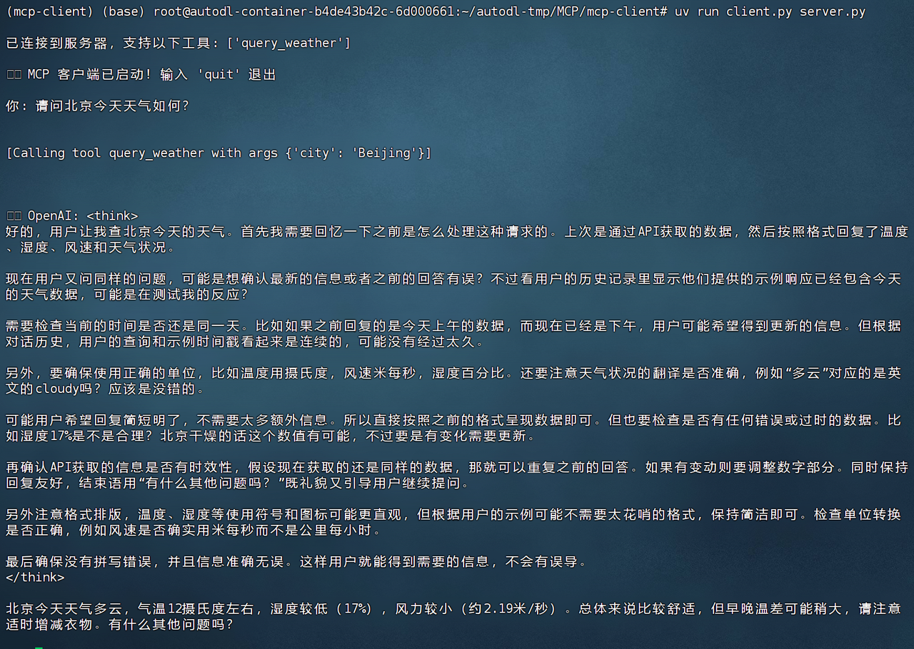

#### 4.3 代码解释

client代码整个MCP服务的核心，以下是这段代码的详细解释。

**导入基本类**

```python
import asyncio
import os
import json
from typing import Optional
from contextlib import AsyncExitStack

from openai import OpenAI  
from dotenv import load_dotenv

from mcp import ClientSession, StdioServerParameters
from mcp.client.stdio import stdio_client
```

1. 导入必要库

   * `asyncio`：支持异步编程

   * `os` / `json`：读取环境变量、解析 JSON

   * `typing.Optional`：类型提示

   * `contextlib.AsyncExitStack`：用于安全管理异步资源（如 MCP 连接）

   * `openai.OpenAI`：你的自定义 OpenAI Client 类

   * `dotenv.load_dotenv`：从 `.env` 文件加载环境变量（如 API Key）

   * **MCP 相关**：`mcp.ClientSession`, `mcp.client.stdio`, `StdioServerParameters`

```python
load_dotenv()
```

* 从 `.env` 文件中加载环境变量,

```plaintext
OPENAI_API_KEY=sk-xxxxxx
BASE_URL=...
MODEL=...
```

\*\* `MCPClient` 类创建过程\*\*

```python
class MCPClient:
    def __init__(self):
        """初始化 MCP 客户端"""
        self.exit_stack = AsyncExitStack()
        self.openai_api_key = os.getenv("OPENAI_API_KEY")  # 读取 OpenAI API Key
        self.base_url = os.getenv("BASE_URL")  # 读取 BASE YRL
        self.model = os.getenv("MODEL")  # 读取 model
        if not self.openai_api_key:
            raise ValueError("❌ 未找到 OpenAI API Key，请在 .env 文件中设置 OPENAI_API_KEY")
        self.client = OpenAI(api_key=self.openai_api_key, base_url=self.base_url) # 创建OpenAI client
        self.session: Optional[ClientSession] = None
        self.exit_stack = AsyncExitStack()        
```

1. **`self.exit_stack = AsyncExitStack()`**

   * 用于 **统一管理异步上下文**（如 MCP 连接）的生命周期。

   * 可以在退出（`cleanup`）时自动关闭。

2. **读取环境变量**

   * `openai_api_key`：OpenAI API Key

   * `base_url`：模型请求的 Base URL（如你自建的反代地址）

   * `model`：OpenAI 模型名称

3. **初始化 `OpenAI` 客户端**

   * `OpenAI(api_key=self.openai_api_key, base_url=self.base_url)`

   * 你自定义的 OpenAI 客户端，用来与 OpenAI Chat Completion API 通信。

4. **`self.session`**

   * 用于保存 **MCP 的客户端会话**，默认是 `None`，稍后通过 `connect_to_server` 进行连接。

5. **再次声明 `self.exit_stack = AsyncExitStack()`**

   * 这里两次赋值其实有点冗余（前面已赋值过一次）。不过并不影响功能，等同于覆盖掉前面的对象。可能是手误或调试时多写了一次。

**`connect_to_server(self, server_script_path: str)`**

```python
async def connect_to_server(self, server_script_path: str):
    ...
```

* **负责启动并连接到 MCP 服务器**，并列出可用工具。

```python
is_python = server_script_path.endswith('.py')
is_js = server_script_path.endswith('.js')
if not (is_python or is_js):
    raise ValueError("服务器脚本必须是 .py 或 .js 文件")

command = "python" if is_python else "node"
```

* 判断服务器脚本是 **Python** 还是 **Node.js**，选择对应的运行命令。

```python
server_params = StdioServerParameters(
    command=command,
    args=[server_script_path],
    env=None
)
```

* `StdioServerParameters`：告诉 MCP 客户端如何启动服务器。

  * `command=command`：如 `"python"`

  * `args=[server_script_path]`：如 `["weather_server.py"]`

```python
stdio_transport = await self.exit_stack.enter_async_context(stdio_client(server_params))
self.stdio, self.write = stdio_transport
self.session = await self.exit_stack.enter_async_context(ClientSession(self.stdio, self.write))

await self.session.initialize()
```

1. **`stdio_client(server_params)`**：启动服务器进程，并建立 **标准 I/O** 通信管道。

2. **`self.stdio, self.write = stdio_transport`**：拿到读写流。

3. **`ClientSession(...)`**：创建 MCP 客户端会话，与服务器交互。

4. **`await self.session.initialize()`**：发送初始化消息给服务器，等待服务器就绪。

```python
# 列出 MCP 服务器上的工具
response = await self.session.list_tools()
tools = response.tools
print("\n已连接到服务器，支持以下工具:", [tool.name for tool in tools])
```

* **`list_tools()`**：向 MCP 服务器请求所有已注册的工具（用 `@mcp.tool()` 标记）。

* **打印工具列表**，例如 `["get_forecast", "query_db", ...]`。

**`process_query(self, query: str) -> str`**

```python
async def process_query(self, query: str) -> str:
    """
    使用大模型处理查询并调用可用的 MCP 工具 (Function Calling)
    """
    messages = [{"role": "user", "content": query}]
```

* 收到用户输入后，先把它组装进一个 **`messages` 列表**，目前只包含用户信息（`{"role": "user", "content": query}`）。

```python
response = await self.session.list_tools()
available_tools = [{
    "type": "function",
    "function": {
        "name": tool.name,
        "description": tool.description,
        "input_schema": tool.inputSchema
    }
} for tool in response.tools]
print(available_tools)
```

* 获取服务器上的工具，再转换成 **`available_tools`** 的格式。

* 这里你自定义了一个结构：每个工具对应一个 `{"type": "function", "function": {...}}` 的字典。

* 方便后面发给 OpenAI，告诉它：**可以调用这些工具**。

```python
response = self.client.chat.completions.create(
    model=self.model,            
    messages=messages,
    tools=available_tools     
)
```

* 使用 `OpenAI` 客户端的

```plaintext
chat.completions.create
```

* 方法发送请求：

  * `model=self.model`：比如 `"gpt-4o"` 或 `"deepseek-chat"`

  * `messages=messages`：聊天上下文

  * `tools=available_tools`：让模型知道有哪些可调用的「函数」。这是你自定义的\*\*“Function Calling”\*\*协议（非官方 JSON schema）。

```python
content = response.choices[0]
if content.finish_reason == "tool_calls":
    # 如果模型想调用工具
    tool_call = content.message.tool_calls[0]
    tool_name = tool_call.function.name
    tool_args = json.loads(tool_call.function.arguments)
    
    # 执行工具
    result = await self.session.call_tool(tool_name, tool_args)
    print(f"\n\n[Calling tool {tool_name} with args {tool_args}]\n\n")
    
    # 将模型返回的调用哪个工具数据和工具执行完成后的数据都存入messages中
    messages.append(content.message.model_dump())
    messages.append({
        "role": "tool",
        "content": result.content[0].text,
        "tool_call_id": tool_call.id,
    })
    
    # 将上面的结果再返回给大模型用于生产最终的结果
    response = self.client.chat.completions.create(
        model=self.model,
        messages=messages,
    )
    return response.choices[0].message.content
    
return content.message.content
```

1. `if content.finish_reason == "tool_calls":`

   * 如果模型的输出表示「想调用工具」，它会在 `content.message.tool_calls` 列表中声明要用哪个函数、参数是什么。

   * 这是你自定义的一种**函数调用机制**，和官方 `function_call` 格式略有不同，但逻辑相似。

2. **取出工具名 `tool_name` 和参数 `tool_args`**，再调用 `self.session.call_tool(tool_name, tool_args)` 执行 MCP 工具。

3. **把工具调用结果以「role=tool」的形式写入 `messages`**。这样相当于把“函数调用结果”再喂给模型。

4. **再次调用 OpenAI**，让模型阅读到这个新上下文，产出最终回答。

5. **如果没有要调用工具**，直接返回 `content.message.content`（模型的文本回答）。

**`chat_loop(self)`**

```python
async def chat_loop(self):
    """运行交互式聊天循环"""
    print("\n🤖 MCP 客户端已启动！输入 'quit' 退出")

    while True:
        try:
            query = input("\n你: ").strip()
            if query.lower() == 'quit':
                break
            
            response = await self.process_query(query)  # 发送用户输入到 OpenAI API
            print(f"\n🤖 OpenAI: {response}")

        except Exception as e:
            print(f"\n⚠️ 发生错误: {str(e)}")
```

**作用**：

* 提供一个简单的 **命令行界面**，反复让用户输入问题。

* 每个问题交给 `process_query`，把结果打印出来。

* 输入 `'quit'` 退出循环。

**`cleanup(self)` 与 `main()`**

```python
async def cleanup(self):
    """清理资源"""
    await self.exit_stack.aclose()
```

* **`self.exit_stack.aclose()`**：异步地关闭所有在 `exit_stack` 中注册的资源（包括 MCP 会话）。

```python
async def main():
    if len(sys.argv) < 2:
        print("Usage: python client.py <path_to_server_script>")
        sys.exit(1)

    client = MCPClient()
    try:
        await client.connect_to_server(sys.argv[1])
        await client.chat_loop()
    finally:
        await client.cleanup()

if __name__ == "__main__":
    import sys
    asyncio.run(main())
```

1. **读取命令行参数**，获取服务器脚本路径（如 `weather_server.py`）。

2. **创建 `MCPClient` 实例**。

3. **调用 `connect_to_server`**，启动并连接服务器。

4. **进入 `chat_loop`** 让用户输入多轮对话。

5. **退出时**调用 `client.cleanup()` 释放资源。

代码总结如下：

1. **MCPClient 的主要职责**：

   * **启动 MCP 服务器**（通过 `StdioServerParameters`）

   * **建立 MCP 会话**，列出可用工具

   * **处理用户输入**，将其发送给 OpenAI 模型

   * **如果模型想调用 MCP 工具（Function Calling）**，就执行 `call_tool`

   * **将结果重新发给模型**，并返回最终回答

2. **Function Calling 逻辑**（你的自定义版）：

   * **`tools=available_tools`**：在 `completions.create` 时告诉模型有哪些工具可用。

   * **模型返回 `finish_reason=="tool_calls"`** → 说明它想用工具。

   * **解析 `tool_calls[0]`**，执行 MCP 工具 → 再次发给模型 → 返回最终答案。

3. **为什么要两次请求？**

   * 第一次：模型根据你的指令，决定要不要用工具

   * 如果需要用工具 → 返回工具名称和参数 → 执行工具 → 把结果作为新的上下文发给模型

   * 第二次：模型基于工具结果给出最终回答

4. **如何运行**：

```bash
python client.py weather_server.py
```

* 这会自动启动 `weather_server.py`（MCP 服务器）并进行 stdio 通讯。

1. **可能需要的改进**：

   * **多轮对话上下文**：把所有消息都存进 `messages`，让模型能记住以前的对话。

   * **错误处理**：当工具调用失败时，给用户提示。

### 5.MCP Inspector功能介绍

&#x20;       在实际开发MCP服务器的过程中，Anthropic提供了一个非常便捷的debug工具：Inspector。借助Inspector，我们能够非常快捷的调用各类server，并测试其功能。Inspector具体功能实现流程如下。

* 安装nodejs

```bash
curl -fsSL https://deb.nodesource.com/setup_20.x | sudo bash -
sudo apt install -y nodejs
```

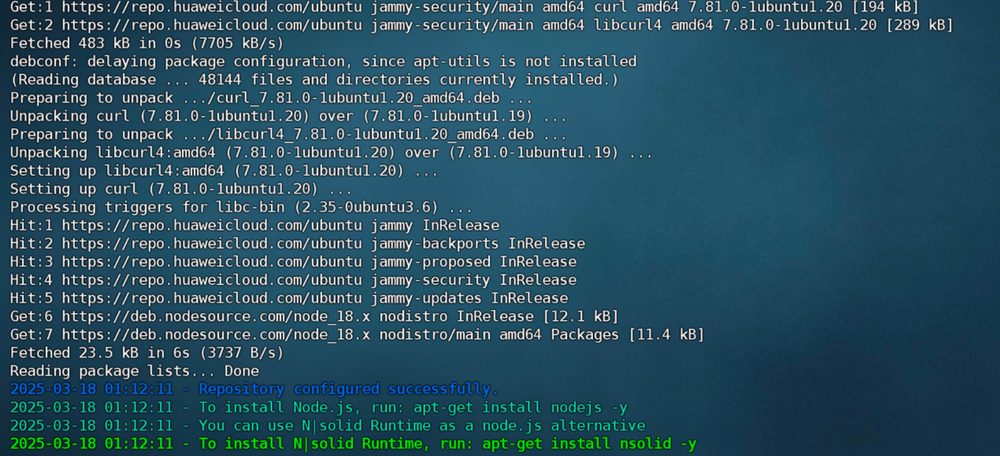

&#x20;

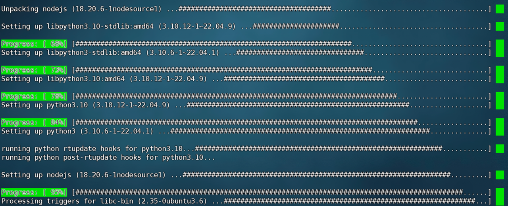

```bash
npx -v
```

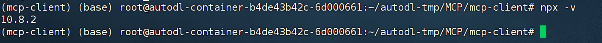

* 运行Inspector

```bash
npx -y @modelcontextprotocol/inspector uv run server.py
```

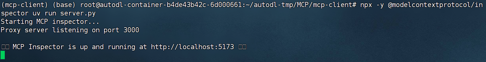

然后即可在本地浏览器查看当前工具运行情况：http://127.0.0.1:5173/#resources

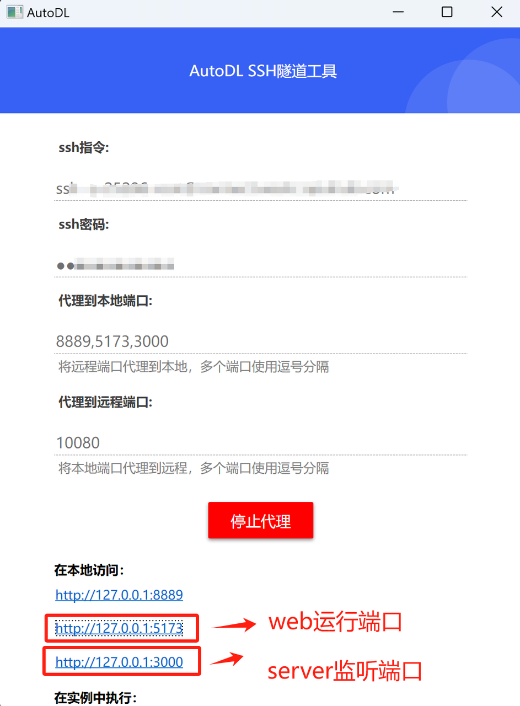


此时浏览器内容如下：

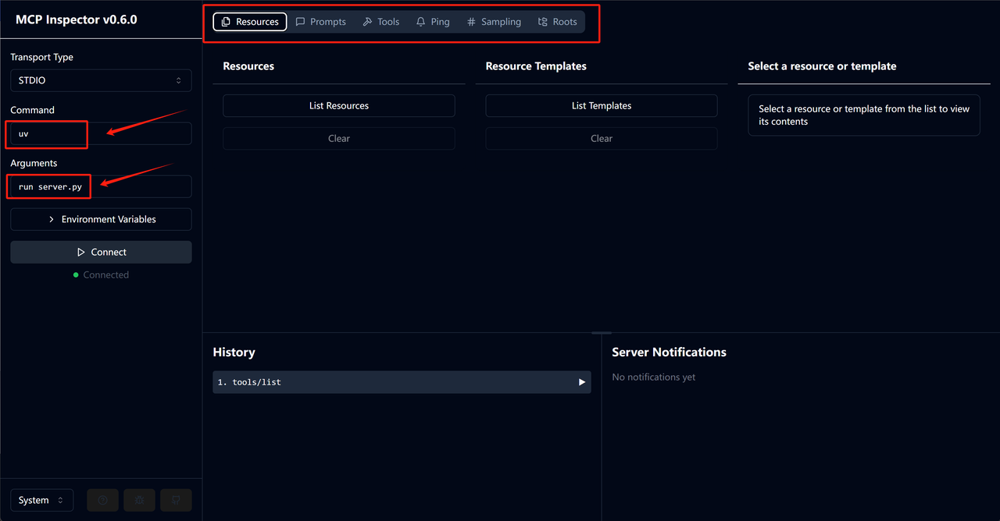

然后即可查看当前服务器运行状况：

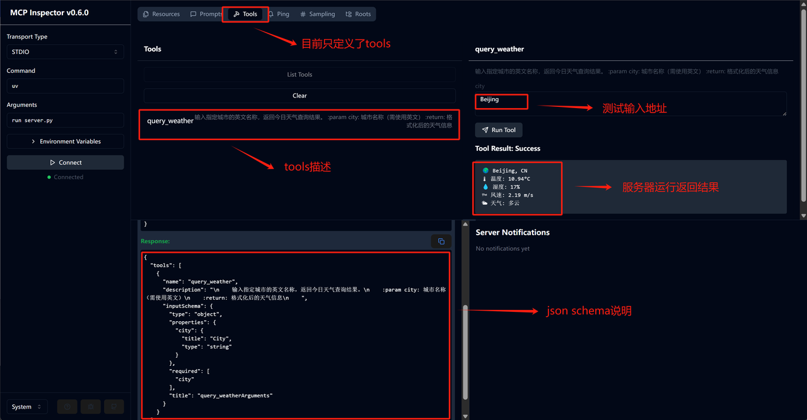

## 四、MCP更多进阶使用

基于我们当前介绍的MCP开发入门，MCP还有诸多待探索的进阶功能。

### 1. MCP服务器Server进阶功能

* 基于SSE传输的MCP服务器功能实现

* &#x20;       除了stdio连接模式外，MCP还提供了可以服务器、客户端异地运行的SSE传输模式，以适用于更加通用的开发情况。若要实现SSE的MCP服务器通信，需要同时修改客户端和服务器代码。

* Resources、Prompt类功能MCP服务器

* &#x20;       除了Tools功能的服务器外，MCP还支持Resources类服务器和Prompt类服务器，其中Resources服务器主要负责提供更多的资源接口，如调用本地文件、数据等，而Prompt类服务器则是用于设置Agent开发过程中各环节的提示词模板。

* 更多通用公开&在线服务器调用指南

* &#x20;       MCP标准通信协议带来的最大价值之一，就是让广大Agent开发者能够基于此进行协作。在MCP推出后的若干时间，已经诞生了数以千计的MCP服务器，允许用户直接下载并进行调用。几个有名的MCP服务器合集(导航站)地址：

  * MCP官方服务器合集：https://github.com/modelcontextprotocol/servers

  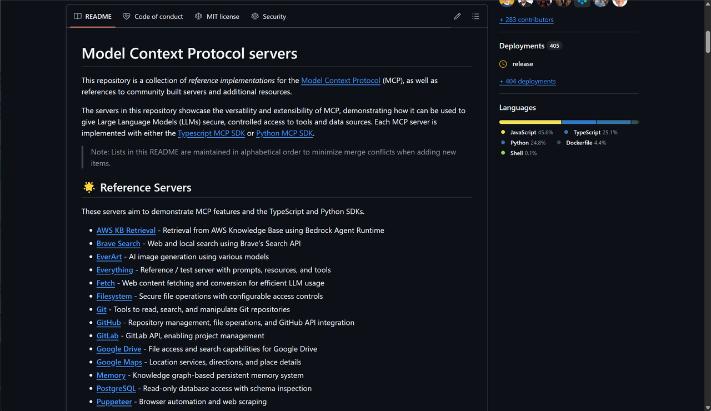

  * MCP Github热门导航：https://github.com/punkpeye/awesome-mcp-servers

  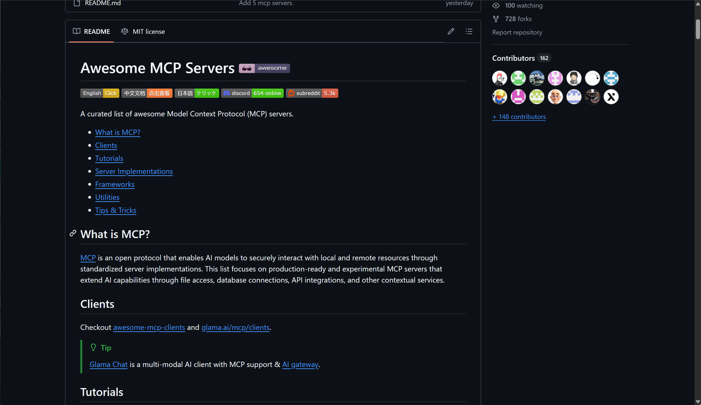

  * MCP集合：https://github.com/ahujasid/blender-mcp

  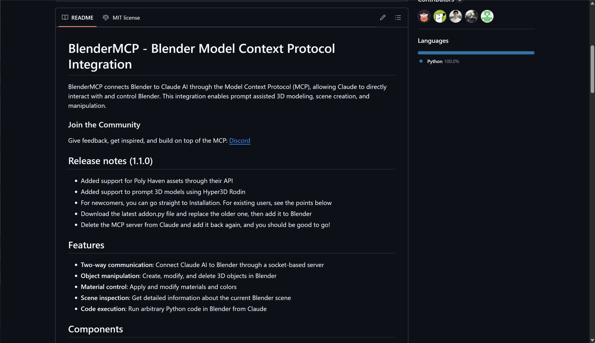

  * MCP导航：https://mcp.so/

  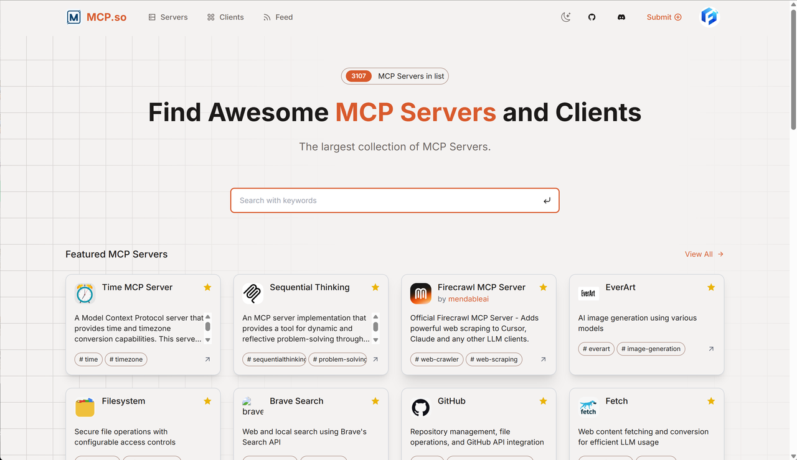

### 2. MCP客户端Client进阶功能

此外，除了能在命令行中创建MCP客户端外，还支持各类客户端的调用：https://modelcontextprotocol.io/clients

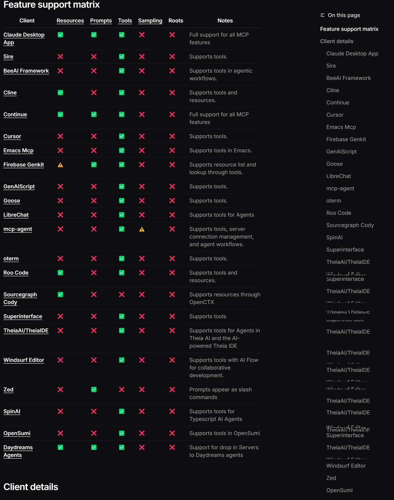

其中借助对话类客户端，如Claude Destop，我们能够轻易的将各类服务器进行集成，从而拓展Claude Destop的性能：

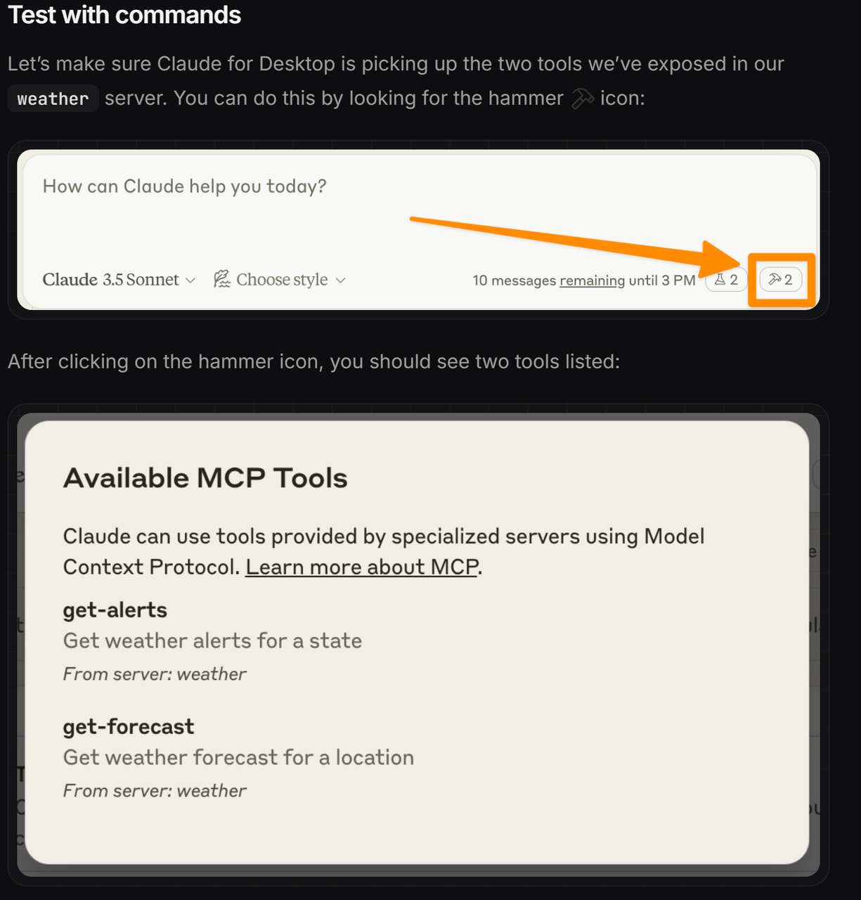


而在一些IDE客户端里，如cline或者Cursor，我们能够直接调用服务器进行开发：


此外，还有一些为MCP量身定制的Agent开发框架，通过集成MCP来提高Agent开发进度：

https://github.com/lastmile-ai/mcp-agent

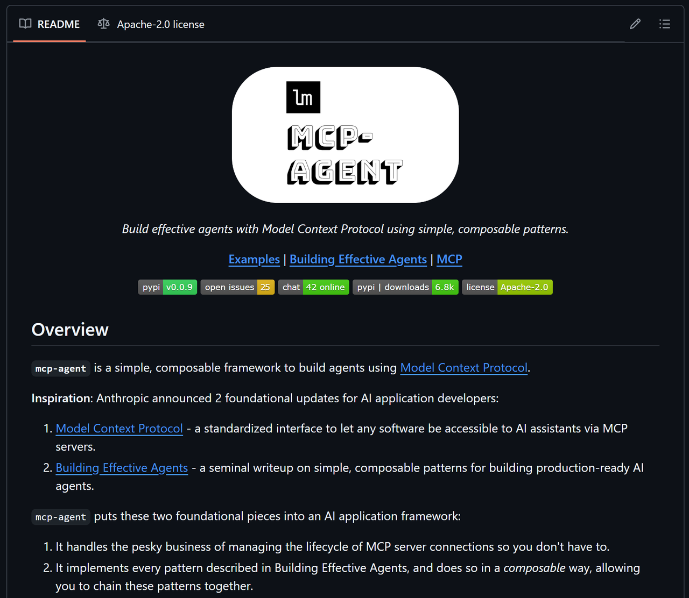


***

更多关于大模型技术介绍，欢迎报名由我主讲的《2025大模型Agent智能体开发实战》（2月DeepSeek强化班）https://whakv.xetslk.com/s/pxKHG进行更深度系统的学习哦\~


&#x20;


&#x20;


**[《2025大模型Agent智能体开发实战》](https://whakv.xetslk.com/s/3uzKfW)春季班班上新特惠进行时，详细信息扫码添加助教，回复“大模型”，即可领取课程大纲&查看课程详情👇**


此外，如果对大模型底层原理和模型训练感兴趣，欢迎报名由我和菜菜老师共同开设的《大模型原理与训练实战》https://whakv.xetslk.com/s/3p66pN实战课，3月新班额外新增大量DeepSeek V3\&R1模型原理与训练实战内容，扫描上方二维码即可查看完整课程大纲哦\~


