***

* Anthropic MCP发布通告：https://www.anthropic.com/news/model-context-protocol

* MCP GitHub主页：https://github.com/modelcontextprotocol


### **引入模型上下文协议（MCP）**

今天，我们正式**开源** **Model Context Protocol（MCP，模型上下文协议）**，这是一种 **全新的标准**，用于将 **AI 助手** 连接到实际存储数据的 **系统**，包括 **内容存储库、企业工具、开发环境** 等。MCP 的目标是帮助 **前沿大模型** 生成 **更优质、更相关的响应**。

随着 **AI 助手** 进入主流应用，整个行业在 **模型能力** 方面投入了大量资源，推动了 **推理能力和质量** 的快速发展。然而，即便是**最先进的模型** 仍受限于 **数据孤岛** 和 **传统系统**，无法轻松访问外部数据。每新增一个数据源都需要 **单独的自定义集成**，这使得 **真正互联的 AI 生态** 难以规模化扩展。

MCP 解决了这一挑战。它提供了一种 **通用、开放的标准**，用于将 AI 系统与数据源连接在一起，**取代传统的碎片化集成**，实现更**简洁、高效、稳定**的 AI 数据访问方式。

***

### **🔹 什么是 Model Context Protocol（MCP）？**

MCP 是一种 **开放标准**，它允许开发者 **安全地** 在 **数据源** 和 **AI 工具** 之间建立 **双向连接**。其架构非常简单：

* **开发者可以通过 MCP 服务器** 公开他们的数据；

* **AI 应用（MCP 客户端）** 可以连接到 MCP 服务器，获取所需数据。

今天，我们正式推出 **MCP 的三大核心组件**：

1. **MCP 协议规范与 SDK**，供开发者构建与集成 MCP；

2. **Claude 桌面应用中的本地 MCP 服务器支持**，便于开发者测试；

3. **MCP 服务器的开源存储库**，帮助开发者快速接入不同系统。

Claude 3.5 Sonnet 具备 **快速构建 MCP 服务器的能力**，让企业和个人能够 **快速连接最重要的数据集**，并与各种 AI 工具 **无缝集成**。为帮助开发者上手，我们提供了一些 **预构建的 MCP 服务器**，支持 **Google Drive、Slack、GitHub、Git、Postgres 和 Puppeteer** 等主流企业系统。

***

### **🔹 早期采用者与行业集成**

目前，**Block** 和 **Apollo** 等企业已经在其系统中 **集成了 MCP**，而 **Zed、Replit、Codeium、Sourcegraph** 等开发工具公司也正在基于 MCP **增强其平台**。MCP 使 AI 代理能够 **更好地检索相关信息**，以更深入地理解编程任务的上下文，从而**生成更准确、更具功能性的代码，减少反复尝试**。

**Block 首席技术官 Dhanji R. Prasanna 表示：**

> **“在 Block，开源不仅是一种开发模式，更是我们工作的基础。我们致力于打造推动变革的技术，并确保其作为公共资源对所有人开放。像 MCP 这样的开放技术，是连接 AI 与现实世界应用的桥梁，让创新变得**透明、可访问，并且**基于协作**。我们很高兴能够参与 MCP 这个协议，并利用它来构建自主 AI 代理系统，让 AI 处理重复性工作，人类可以专注于创造性任务。”

以往，开发者需要为 **每个数据源** **单独维护连接器**，但 **MCP 让一切变得简单**——只需**基于 MCP 标准协议**构建数据集成。随着 **MCP 生态系统不断成熟**，AI 将能够 **无缝切换不同工具和数据集**，取代当今 **碎片化的集成方式**，构建更**可持续的 AI 互联架构**。

***

### **🚀 如何开始使用 MCP？**

开发者**今天就可以开始构建和测试 MCP 连接器**。所有 **Claude.ai 计划** 均支持 **将 MCP 服务器连接到 Claude 桌面应用**。

* **Claude for Work** 订阅用户可以**本地测试 MCP 服务器**，将 Claude 连接到 **内部系统和数据集**。

* 我们很快将提供 **开发工具包**，帮助企业 **部署远程 MCP 服务器**，以服务整个 **Claude for Work 组织**。

你可以通过以下方式开始使用 MCP：

1. **在 Claude 桌面应用中安装预构建的 MCP 服务器**

2. **阅读我们的快速入门指南，构建你的第一个 MCP 服务器**

3. **参与我们的开源 MCP 连接器和实现项目**

***

### **🌍 开放社区，构建未来**

MCP 是一个 **开放的、协作式的开源项目**，我们欢迎你的反馈！
&#x20;无论你是：

* **AI 工具开发者**，希望扩展 LLM 的能力；

* **企业**，希望充分利用已有数据；

* **技术探索者**，想尝试前沿 AI 应用；

我们**邀请你共同打造未来的 AI 上下文标准**，让 AI 更智能、更高效地理解和利用数据！


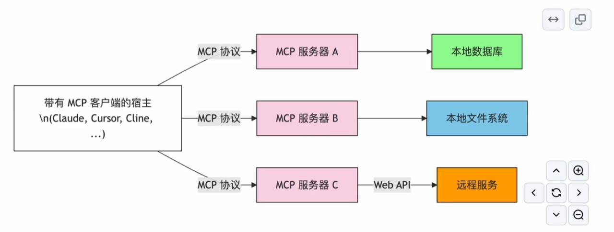


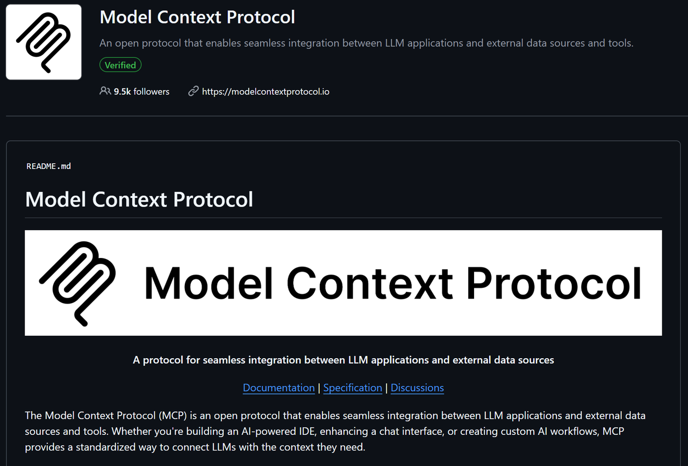

### **模型上下文协议（Model Context Protocol, MCP）**

**模型上下文协议（MCP）** 是一种 **开放协议**，用于实现 **LLM 应用** 与 **外部数据源和工具** 之间的无缝集成。无论你是在构建 **AI 驱动的 IDE**，优化 **聊天界面**，还是创建 **自定义 AI 工作流**，MCP 提供了一种 **标准化方式**，让 LLM 能够访问所需的上下文信息。

***

## **🚀 入门指南**

📚 **阅读文档**：获取指南和教程
&#x20;🔍 **查看规范**：了解协议的详细技术规范
&#x20;💻 **使用官方 SDK 开始开发**：

* [TypeScript SDK](https://chatgpt.com/c/67d28a8b-9e64-8000-bff6-da16089a3f12#)

* [Python SDK](https://chatgpt.com/c/67d28a8b-9e64-8000-bff6-da16089a3f12#)

* [Java SDK](https://chatgpt.com/c/67d28a8b-9e64-8000-bff6-da16089a3f12#)

* [Kotlin SDK](https://chatgpt.com/c/67d28a8b-9e64-8000-bff6-da16089a3f12#)

***

## **📂 项目结构**

* **specification** - MCP 协议规范与文档

* **typescript-sdk** - TypeScript 版本的 SDK 实现

* **python-sdk** - Python 版本的 SDK 实现

* **java-sdk** - Java 版本的 SDK 实现

* **kotlin-sdk** - Kotlin 版本的 SDK 实现

* **docs** - 用户文档与开发指南

* **create-python-server** - Python 服务器模板

* **create-typescript-server** - TypeScript 服务器模板

* **create-kotlin-server** - Kotlin 示例服务器

* **servers** - 已维护的服务器列表

***

## **💡 贡献指南**

我们欢迎各种形式的贡献！无论是 **修复 bug**、**改进文档**，还是 **提议新功能**，请参考 **贡献指南** 开始你的贡献之旅。

💬 **有问题？** 欢迎加入我们的 **社区论坛** 讨论。

***

## **🔍 关于 MCP**

MCP 是 **由 Anthropic, PBC 维护的开源项目**，并对整个社区 **开放贡献**。

***

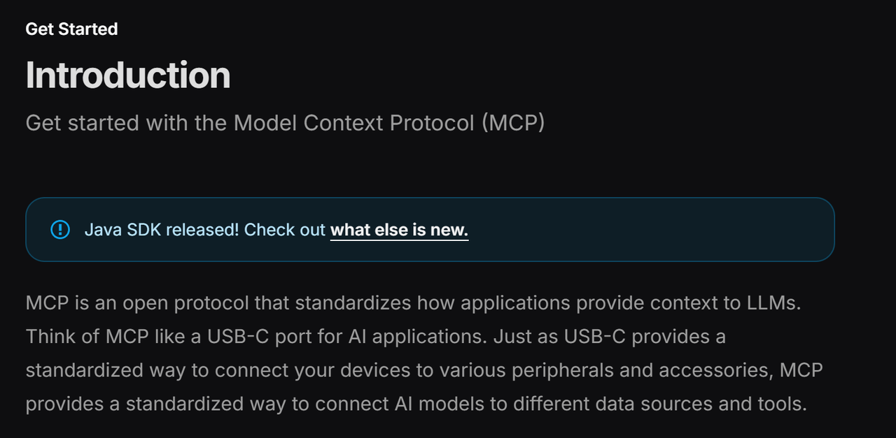

### **🚀 快速入门：Model Context Protocol（MCP）**

## **简介**

立即开始学习 **模型上下文协议（MCP）**！

💡 **Java SDK 已发布！** 了解最新动态。

MCP 是一种 **开放协议**，用于 **标准化应用程序向 LLM 提供上下文的方式**。你可以把 **MCP 想象成 AI 应用的 USB-C 接口**。
&#x20;正如 USB-C 提供了 **标准化的方式** 让设备连接到各种外设和配件，**MCP 提供了标准化方式**，让 **AI 模型** 能够连接到 **不同的数据源和工具**。

***

## **🔹 为什么选择 MCP？**

MCP 让你能够在 **LLM 之上构建智能代理（Agents）和复杂工作流**。
&#x20;LLM 需要与 **数据和工具** 集成，而 MCP 提供了：

&#x20;✅ **丰富的预构建集成**，LLM 可直接对接
&#x20;✅ **跨 LLM 供应商的灵活性**，支持随时切换
&#x20;✅ **数据安全的最佳实践**，确保数据存储在本地基础设施中

***

## **🔹 MCP 的总体架构**

MCP 采用 **客户端-服务器（Client-Server）架构**，其中**主机应用**可以连接多个 MCP 服务器：

```plain&#x20;text
Internet
    ⬇
    Your Computer
    ⬇
    MCP Protocol
    ↙   ↓   ↘
MCP Server A  MCP Server B  MCP Server C
↙        ↓       ↘
Local Data A  Local Data B  Remote Service C
```

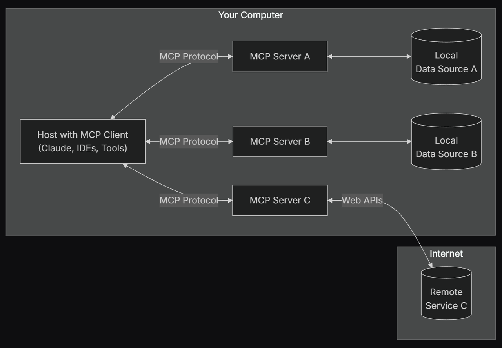

📌 **MCP 主要组件：**

* **MCP 主机（Hosts）**：如 **Claude 桌面应用、IDE、AI 工具**，用于通过 MCP 访问数据

* **MCP 客户端（Clients）**：负责 **与 MCP 服务器建立 1:1 连接**

* **MCP 服务器（Servers）**：轻量级程序，通过 **标准化的 MCP 协议** 提供特定能力

* **本地数据源（Local Data Sources）**：你的 **计算机文件、数据库和服务**，MCP 服务器可以安全访问

* **远程服务（Remote Services）**：可通过 **API 访问的外部系统**，MCP 服务器可以连接这些系统

***

## **🚀 如何开始使用 MCP？**

选择最适合你的路径：

### **🔹 快速入门**

* **对于服务器开发者**：学习如何构建 **MCP 服务器**，让 Claude for Desktop 和其他客户端使用

* **对于客户端开发者**：学习如何开发 **MCP 客户端**，支持所有 MCP 服务器

* **对于 Claude 桌面应用用户**：开始使用 **Claude for Desktop 内置的 MCP 服务器**

***

## **🔹 示例**

* **示例服务器**：查看官方提供的 **MCP 服务器及其实现**

* **示例客户端**：查看支持 MCP 集成的 **客户端列表**

***

## **📚 教程**

* **使用 LLM 构建 MCP**：学习如何使用 Claude 加速 **MCP 开发**

* **MCP 调试指南**：学习如何高效 **调试 MCP 服务器和集成**

* **MCP Inspector**：使用 **交互式调试工具** 测试你的 MCP 服务器

***

## **🔍 深入探索 MCP**

* **核心架构**：了解 **MCP 如何连接客户端、服务器和 LLM**

* **资源管理**：如何 **让 LLM 访问 MCP 服务器中的数据**

* **提示词（Prompts）**：创建 **可复用的提示词模板和工作流**

* **工具（Tools）**：让 LLM 能够 **通过 MCP 服务器执行操作**

* **采样（Sampling）**：允许 MCP 服务器 **向 LLM 请求推理**

* **传输层（Transports）**：了解 MCP **的通信机制**

***

## **🌍 贡献 & 反馈**

### **🔹 想贡献代码？**

查看我们的 [**贡献指南**](https://chatgpt.com/c/67d28a8b-9e64-8000-bff6-da16089a3f12#)，帮助改进 MCP！

### **🔹 寻求支持 & 提交反馈**

📌 **遇到问题？想提交新功能建议？**

* **MCP 规范、SDK、文档相关问题**（开源）👉 **创建 GitHub Issue**

* **MCP 规范相关讨论 & 问答** 👉 **参与规范讨论**

* **其他 MCP 开源组件讨论 & 问答** 👉 **加入组织讨论**

* **Claude.app & Claude.ai 的 MCP 集成问题** 👉 **邮件联系 <mcp-support@anthropic.com>**


### **🌤️ 为服务器开发者提供的指南**

**使用 Claude for Desktop 及其他客户端，构建你的 MCP 服务器**

在本教程中，我们将 **构建一个 MCP 天气服务器**，并将其连接到 **MCP 主机（Claude for Desktop）**。我们将从 **基础设置** 开始，逐步拓展到 **更复杂的用例**。

***

## **🔹 我们要构建什么？**

许多 **LLM（包括 Claude）** 目前**无法**直接获取 **天气预报** 或 **严重天气警报**。让我们使用 **MCP** 来解决这个问题！

我们将构建一个服务器，提供 **两个工具（Tools）**：

* **`get-alerts`** —— 获取严重天气警报

* **`get-forecast`** —— 获取天气预报

然后，我们会将这个服务器 **连接到 MCP 主机**（本教程中是 **Claude for Desktop**）：

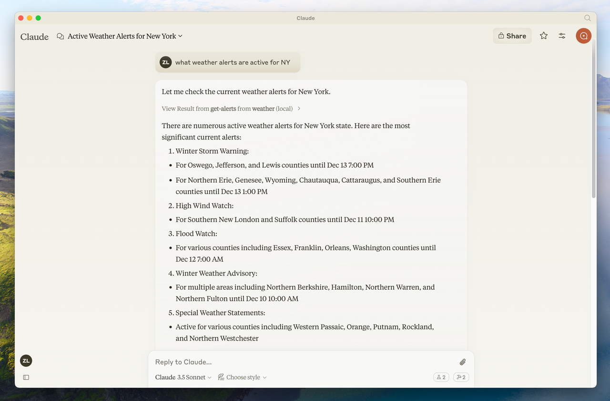


```plain&#x20;text
+------------------------+
|  Claude for Desktop   |  ←—— MCP 主机（Host）
+------------------------+
        ↓
   MCP Protocol
        ↓
+------------------------+
|     Weather Server    |  ←—— MCP 服务器（Server）
+------------------------+
```

📌 **服务器可以连接到任何 MCP 客户端**。本教程选择 **Claude for Desktop** 仅仅是为了简化示例。
&#x20;如果你想创建 **自定义 MCP 客户端**，我们也有相应的 **开发指南** 和 **支持 MCP 的客户端列表**。

***

## **🔹 为什么选择 Claude for Desktop，而不是 Claude.ai？**

Claude for Desktop **允许直接集成本地 MCP 服务器**，而 **Claude.ai**（即 Web 版本）当前不支持本地 MCP 连接。

如果你希望使用 Claude 和 MCP 服务器进行 **本地开发和测试**，Claude for Desktop 是 **更好的选择**。

***

## **🔹 核心 MCP 概念**

MCP 服务器主要提供 **三种能力**：

1. **资源（Resources）**：类似文件的数据，可以被客户端读取（如 API 响应、文件内容）。

2. **工具（Tools）**：LLM 可以调用的函数（需要用户授权）。

3. **提示词（Prompts）**：帮助用户完成特定任务的预定义模板。

📌 **本教程主要关注 MCP 的 “工具（Tools）” 机制。**

***

## **🔹 开始构建我们的天气服务器！**

你可以选择以下编程语言：

* 🐍 **Python**

* 🟢 **Node.js**

* ☕ **Java**

完整代码示例可以在 [**这里**](https://chatgpt.com/c/67d28a8b-9e64-8000-bff6-da16089a3f12#) 找到。

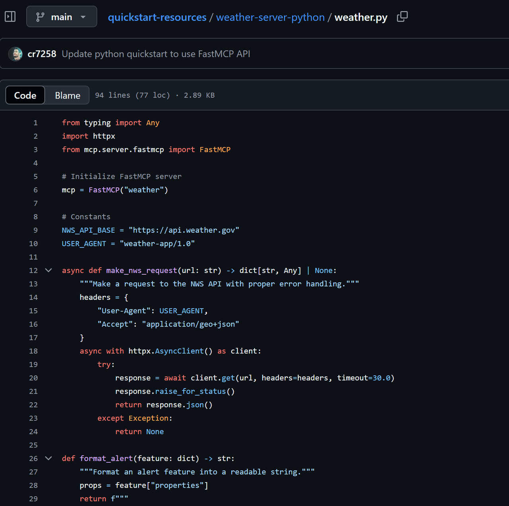

***

## **🔹 先决条件**

📌 在开始之前，你需要具备以下知识：

* **Python 基础**

* **对 LLM（如 Claude）如何工作有基本了解**

📌 **系统要求**

* **Python 3.10 或更高版本**

* **MCP Python SDK 1.2.0 或更高版本**

***

## **🔹 设置开发环境**

### **1️⃣ 安装 `uv` 并初始化 Python 项目**

🔹 **MacOS/Linux 安装 `uv`**

```bash
curl -LsSf https://astral.sh/uv/install.sh | sh
```

📌 **安装完成后，重启终端**，确保 `uv` 命令可用。

🔹 **Windows 安装 `uv`**（建议使用 WSL）

```bash
wsl curl -LsSf https://astral.sh/uv/install.sh | sh
```

***

### **2️⃣ 创建项目目录并设置环境**

🔹 **MacOS/Linux**

```bash
# Create a new directory for our project
uv init weather
cd weather

# Create virtual environment and activate it
uv venv
source .venv/bin/activate

# Install dependencies
uv add "mcp[cli]" httpx

# Create our server file
touch weather.py
```

***

**接下来，我们将编写天气服务器代码！**

### **🌤️ 构建你的 MCP 服务器**

## **📌 导入依赖并初始化服务器**

在 `weather.py` 文件顶部，添加以下代码：

```python
from typing import Any
import httpx
from mcp.server.fastmcp import FastMCP

# Initialize FastMCP server
mcp = FastMCP("weather")

# Constants
NWS_API_BASE = "https://api.weather.gov"
USER_AGENT = "weather-app/1.0"
```

📌 **FastMCP** 通过 Python 的 **类型提示** 和 **文档字符串** 自动生成工具定义，使得 **MCP 工具** 的创建与维护变得更加简单。

***

## **🔹 添加辅助函数**

接下来，我们编写 **辅助函数**，用于向 **美国国家气象局 API（NWS API）** 发送请求，并格式化返回的数据。

```python
async def make_nws_request(url: str) -> dict[str, Any] | None:
    """向 NWS API 发送请求，并进行错误处理"""
    headers = {
        "User-Agent": USER_AGENT,
        "Accept": "application/geo+json"
    }
    async with httpx.AsyncClient() as client:
        try:
            response = await client.get(url, headers=headers, timeout=30.0)
            response.raise_for_status()
            return response.json()
        except Exception:
            return None
def format_alert(feature: dict) -> str:
    """将天气警报信息格式化为可读字符串"""
    props = feature["properties"]
    return f"""
事件: {props.get('event', '未知')}
区域: {props.get('areaDesc', '未知')}
严重程度: {props.get('severity', '未知')}
描述: {props.get('description', '无描述')}
说明: {props.get('instruction', '无具体说明')}
"""
```

***

## **🔹 实现工具执行逻辑**

工具执行处理器负责调用具体的工具逻辑。让我们实现 **获取天气警报** 和 **获取天气预报** 的方法。

### **1️⃣ 获取天气警报**

```python
@mcp.tool()
async def get_alerts(state: str) -> str:
    """获取美国某个州的天气警报
    Args:
        state: 美国州的两位字母代码（如 CA、NY）
    """
    url = f"{NWS_API_BASE}/alerts/active/area/{state}"
    data = await make_nws_request(url)
    if not data or "features" not in data:
        return "无法获取天气警报或当前无警报。"
    if not data["features"]:
        return "该州当前无活动警报。"
    alerts = [format_alert(feature) for feature in data["features"]]
    return "\n---\n".join(alerts)
```

***

### **2️⃣ 获取天气预报**

```python
@mcp.tool()
async def get_forecast(latitude: float, longitude: float) -> str:
    """获取某个地理位置的天气预报
    Args:
        latitude: 纬度
        longitude: 经度
    """
    # 获取天气网格的 API 端点
    points_url = f"{NWS_API_BASE}/points/{latitude},{longitude}"
    points_data = await make_nws_request(points_url)
    if not points_data:
        return "无法获取该位置的天气数据。"
    # 获取天气预报 URL
    forecast_url = points_data["properties"]["forecast"]
    forecast_data = await make_nws_request(forecast_url)
    if not forecast_data:
        return "无法获取详细天气预报信息。"
    # 解析并格式化前 5 个时间段的预报
    periods = forecast_data["properties"]["periods"]
    forecasts = []
    for period in periods[:5]:  # 仅显示最近 5 个时间段
        forecast = f"""
{period['name']}:
温度: {period['temperature']}°{period['temperatureUnit']}
风速: {period['windSpeed']} {period['windDirection']}
天气情况: {period['detailedForecast']}
"""
        forecasts.append(forecast)
    return "\n---\n".join(forecasts)
```

***

## **🔹 运行服务器**

最后，我们需要初始化并运行服务器：

```python
if 
name
 == "
__main__
":
    # 运行 MCP 服务器
    mcp.run(transport='stdio')
```

📌 **运行服务器**

```bash
uv run weather.py
```

如果一切正常，你的 **MCP 服务器** 现在已经可以运行了 🎉！

***

## **✅ 测试 MCP 服务器（Claude for Desktop）**

### **📌 安装 Claude for Desktop**

确保你已安装 **Claude for Desktop**，并升级到 **最新版本**：

* **MacOS** / **Windows**：[下载最新版本](https://claude.ai/)

📌 **Linux 用户**：目前 **Claude for Desktop 不支持 Linux**，你可以参考 **MCP 客户端开发教程**，自己构建一个客户端来连接服务器。

***

## **🔹 配置 Claude for Desktop**

你需要 **手动配置 MCP 服务器** 以便 Claude 识别它：

1. **打开 Claude 配置文件**：

```bash
code ~/Library/Application\ Support/Claude/claude_desktop_config.json
```

1. 📌 **Windows** 用户可以使用 **VS Code** 或 **记事本** 打开该文件。

2. **添加 MCP 服务器配置** 在 `mcpServers` 字段中添加 **天气服务器** 配置：

```json
{
    "mcpServers": {
        "weather": {
            "command": "uv",
            "args": [
                "--directory",
                "/ABSOLUTE/PATH/TO/PARENT/FOLDER/weather",
                "run",
                "weather.py"
            ]
        }
    }
}
```

1. 📌 **注意事项**：

   * `command`：如果 `uv` **无法直接识别**，你需要 **提供完整路径**（MacOS/Linux 运行 `which uv`，Windows 运行 `where uv`）。

   * `/ABSOLUTE/PATH/TO/PARENT/FOLDER/weather` 需要替换为 **服务器所在目录的绝对路径**。

2. **保存配置文件**

3. **重启 Claude for Desktop**，使配置生效。

***

## **🎉 你的 MCP 服务器已经成功连接！**

现在，你可以在 **Claude for Desktop** 中使用 **天气预报工具** 和 **警报查询工具**，通过 MCP 让 Claude 访问实时天气数据 🌤️。

### **✅ 使用命令测试 MCP 服务器**

### **🔹 确保 Claude for Desktop 识别到天气服务器**

要确认 **Claude for Desktop** 能够正确识别我们在天气服务器中**注册的两个工具**，请查找界面中的 **锤子图标 🛠️**。

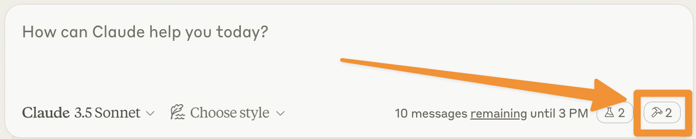

1. **点击 Claude for Desktop 界面中的 🛠️ 锤子图标**

2. **查看是否有以下两个工具**：&#x20;

   * **`get-alerts`**（获取天气警报）

   * **`get-forecast`**（获取天气预报）

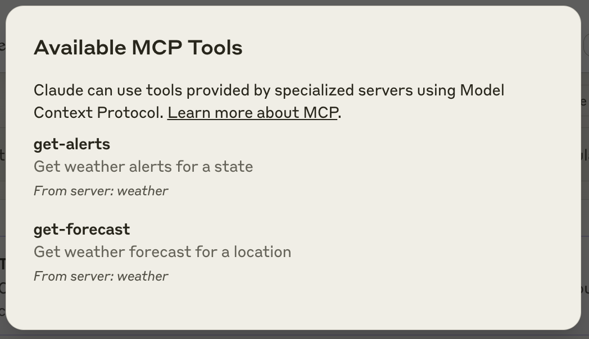

📌 **如果 Claude 没有检测到服务器**：

* 请查看 **[故障排查](https://chatgpt.com/c/67d28a8b-9e64-8000-bff6-da16089a3f12#troubleshooting) 部分**，获取调试技巧。

***

### **🔹 在 Claude for Desktop 中测试 MCP 服务器**

如果 **Claude 正确识别了 MCP 服务器**，你可以运行以下命令进行测试：

```plain&#x20;text
What’s the weather in Sacramento?
（萨克拉门托的天气如何？）
What are the active weather alerts in Texas?
（德克萨斯州当前的天气警报有哪些？）
```

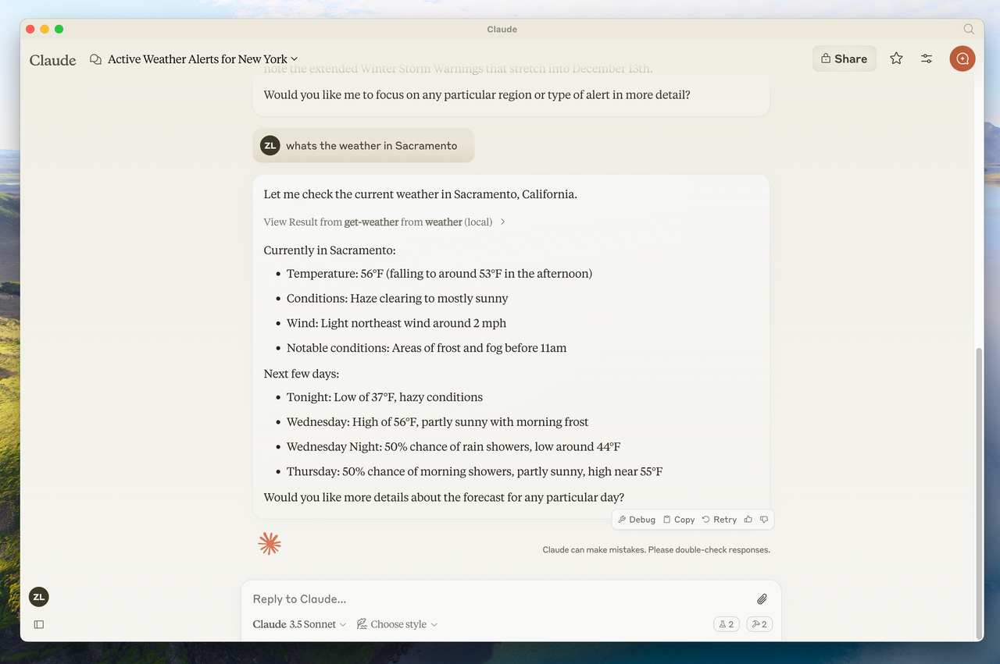


📌 **注意**：

* 由于我们使用的是 **美国国家气象局（NWS）API**，所以这些查询 **仅适用于美国地区**。

***

## **🔍 MCP 服务器的执行流程**

当你向 Claude 提问时，MCP 服务器会在**幕后**执行一系列步骤：

1️⃣ **客户端**（Claude for Desktop）**接收你的问题**
&#x20;2️⃣ **Claude 解析问题**，**分析可用的 MCP 工具**，决定 **调用哪个工具**
&#x20;3️⃣ **Claude 通过 MCP 服务器执行选定的工具**（例如 `get-forecast` 或 `get-alerts`）
&#x20;4️⃣ **MCP 服务器获取结果**，并将其返回给 Claude
&#x20;5️⃣ **Claude 解析结果**，并 **将其转换为自然语言回答**
&#x20;6️⃣ **最终结果显示在 Claude 界面中** 🎉

***

## **🛠️ 故障排查（Troubleshooting）**

如果 **Claude for Desktop 无法检测到你的 MCP 服务器**，你可能会遇到以下几类问题：

### **🔹 Claude for Desktop 集成问题**

* **检查 `claude_desktop_config.json` 配置文件**

  * 确保 `"mcpServers"` 配置正确，并使用 **绝对路径**

  * 例如：&#x20;

  ```json
  {
      "mcpServers": {
          "weather": {
              "command": "uv",
              "args": [
                  "--directory",
                  "/ABSOLUTE/PATH/TO/PARENT/FOLDER/weather",
                  "run",
                  "weather.py"
              ]
          }
      }
  }
  ```

* **确认 MCP 服务器是否正在运行**

```bash
uv run weather.py
```

* **确保 Claude for Desktop 是最新版本**

  * 你可以从 [Claude 官方网站](https://claude.ai/) 下载最新版。

***

### **🔹 天气 API 相关问题**

* **网络请求失败**

  * 确保你的服务器可以正常访问 **NWS API**

  * 运行：&#x20;

  ```bash
  curl -H "User-Agent: weather-app/1.0" https://api.weather.gov/alerts/active
  ```

* **API 速率限制**

  * NWS API **可能有访问频率限制**，请尝试稍后重试

📌 **更多高级调试技巧**： 查看我们的\*\*[MCP 调试指南](https://chatgpt.com/c/67d28a8b-9e64-8000-bff6-da16089a3f12#)**，学习如何更高效地**调试 MCP 服务器与集成\*\*。

***

## **🚀 下一步**

现在，你已经成功构建并测试了一个 MCP 服务器，接下来可以：

### **🔹 构建 MCP 客户端**

* 学习如何 **开发自己的 MCP 客户端**，连接 MCP 服务器。

### **🔹 查看示例服务器**

* 参考我们的 [**官方 MCP 服务器示例库**](https://chatgpt.com/c/67d28a8b-9e64-8000-bff6-da16089a3f12#)，探索更多 **MCP 服务器实现**。

### **🔹 MCP 调试指南**

* 了解如何 **高效调试 MCP 服务器**，排除常见错误。

### **🔹 使用 LLM 构建 MCP**

* 学习如何使用 **Claude 和 LLM 技术**，加速 MCP 服务器的开发。


### **🤖 为客户端开发者提供的指南**

**构建可集成所有 MCP 服务器的自定义客户端**

***

## **🚀 目标**

在本教程中，你将学习如何 **构建一个 LLM 驱动的聊天机器人客户端**，并让它连接到 **MCP 服务器**。
&#x20;📌 **建议**：如果你还没有构建 MCP 服务器，建议先完成 [服务器快速入门教程](https://chatgpt.com/c/67d28a8b-9e64-8000-bff6-da16089a3f12#) 以了解基础概念。

你可以使用以下编程语言：

* 🐍 **Python**

* 🟢 **Node.js**

* ☕ **Java**

📌 **完整代码示例**：[点击这里](https://chatgpt.com/c/67d28a8b-9e64-8000-bff6-da16089a3f12#)

***

## **📌 系统要求**

在开始之前，确保你的系统符合以下要求： ✅ **Mac 或 Windows 电脑**
&#x20;✅ **已安装最新版 Python**
&#x20;✅ **已安装最新版 `uv`**（用于管理 Python 项目）

***

## **🔹 设置开发环境**

### **1️⃣ 创建 Python 项目**

```bash
# Create project directory
uv init mcp-client
cd mcp-client

# Create virtual environment
uv venv

# Activate virtual environment
# On Windows:
.venv\Scripts\activate
# On Unix or MacOS:
source .venv/bin/activate

# Install required packages
uv add mcp anthropic python-dotenv

# Remove boilerplate files
rm hello.py

# Create our main file
touch client.py
```

***

## **🔹 配置 API 密钥**

你需要从 **Anthropic 控制台** 获取 **API Key**。

### **1️⃣ 创建 `.env` 文件**

```bash
touch .env
```

### **2️⃣ 在 `.env` 文件中添加 API Key**

```plain&#x20;text
ANTHROPIC_API_KEY=<your_key_here>
```

📌 **确保你的 API Key 是安全的！**

### **3️⃣ 将 `.env` 添加到 `.gitignore`**

```bash
echo ".env" >> .gitignore
```

***

## **🔹 创建 MCP 客户端**

### **1️⃣ 导入依赖 & 创建基础客户端**

在 `client.py` 文件中添加以下代码：

```python
import asyncio
from typing import Optional
from contextlib import AsyncExitStack

from mcp import ClientSession, StdioServerParameters
from mcp.client.stdio import stdio_client

from anthropic import Anthropic
from dotenv import load_dotenv

load_dotenv()  # load environment variables from .env

class MCPClient:
    def __init__(self):
        # Initialize session and client objects
        self.session: Optional[ClientSession] = None
        self.exit_stack = AsyncExitStack()
        self.anthropic = Anthropic()
    # methods will go here
```

***

## **🔹 连接 MCP 服务器**

现在，我们实现 **连接 MCP 服务器** 的方法：

```python
async def connect_to_server(self, server_script_path: str):
    """连接到 MCP 服务器
    Args:
        server_script_path: 服务器脚本的路径（.py 或 .js 文件）
    """
    is_python = server_script_path.endswith('.py')
    is_js = server_script_path.endswith('.js')
    if not (is_python or is_js):
        raise ValueError("服务器脚本必须是 .py 或 .js 文件")
    # 根据文件类型选择运行命令
    command = "python" if is_python else "node"
    server_params = StdioServerParameters(
        command=command,
        args=[server_script_path],
        env=None
    )
    # 启动 MCP 服务器并建立通信
    stdio_transport = await self.exit_stack.enter_async_context(stdio_client(server_params))
    self.stdio, self.write = stdio_transport
    self.session = await self.exit_stack.enter_async_context(ClientSession(self.stdio, self.write))
    await self.session.initialize()
    # 列出可用的工具
    response = await self.session.list_tools()
    tools = response.tools
    print("\n已连接到服务器，支持以下工具:", [tool.name for tool in tools])
```

📌 **这个方法的作用：**

1. **检测** 服务器脚本是否是 `.py` 或 `.js` 文件

2. **确定** 启动命令（Python 服务器用 `python`，Node.js 服务器用 `node`）

3. **通过 MCP Stdio 协议** 连接到服务器

4. **初始化 MCP 会话**

5. **列出服务器支持的工具**，确保成功连接

***

### **🤖 处理查询逻辑（Query Processing Logic）**

现在，我们来实现 **MCP 客户端的核心功能**，包括：&#x20;

&#x20;✅ **处理用户查询**
&#x20;✅ **管理 Claude 对工具调用的响应**
&#x20;✅ **执行工具调用** 并返回结果

***

### **🔹 处理查询并执行工具调用**

在 `client.py` 中添加以下方法：

```python
async def process_query(self, query: str) -> str:
    """使用 Claude 处理查询并调用可用的 MCP 工具"""

    messages = [{"role": "user", "content": query}]
    # 获取 MCP 服务器上注册的工具
    response = await self.session.list_tools()
    available_tools = [{
        "name": tool.name,
        "description": tool.description,
        "input_schema": tool.inputSchema
    } for tool in response.tools]
    # 初次向 Claude 发送请求
    response = self.anthropic.messages.create(
        model="claude-3-5-sonnet-20241022",
        max_tokens=1000,
        messages=messages,
        tools=available_tools
    )
    final_text = []
    assistant_message_content = []
    # 解析 Claude 的响应
    for content in response.content:
        if content.type == 'text':
            final_text.append(content.text)
            assistant_message_content.append(content)
        elif content.type == 'tool_use':
            tool_name = content.name
            tool_args = content.input
            # 通过 MCP 服务器调用工具
            result = await self.session.call_tool(tool_name, tool_args)
            final_text.append(f"[调用工具 {tool_name}，参数: {tool_args}]")
            assistant_message_content.append(content)
            messages.append({"role": "assistant", "content": assistant_message_content})
            messages.append({
                "role": "user",
                "content": [{
                    "type": "tool_result",
                    "tool_use_id": content.id,
                    "content": result.content
                }]
            })
            # 再次向 Claude 发送请求，获取最终回答
            response = self.anthropic.messages.create(
                model="claude-3-5-sonnet-20241022",
                max_tokens=1000,
                messages=messages,
                tools=available_tools
            )
            final_text.append(response.content[0].text)
    return "\n".join(final_text)
```

📌 **主要逻辑**：

1. 获取 MCP 服务器上可用的工具

2. 向 Claude 发送请求，**让 Claude 决定是否调用工具**

3. 解析 Claude 的响应：&#x20;

   * 如果是普通文本，直接存储

   * 如果是工具调用，则通过 MCP 服务器执行工具，并返回结果

4. 发送最终的 Claude 请求，**让 Claude 生成完整的回复**

***

### **🔹 交互式聊天界面**

我们现在添加 **交互式聊天循环**，让用户可以输入查询，并查看 Claude 的回答。

```python
async def chat_loop(self):
    """运行交互式聊天会话"""
    print("\n🚀 MCP 客户端已启动！")
    print("输入你的查询，或输入 'quit' 退出。")
    while True:
        try:
            query = input("\nQuery: ").strip()
            if query.lower() == 'quit':
                break
            response = await self.process_query(query)
            print("\n" + response)
        except Exception as e:
            print(f"\n⚠️ 发生错误: {str(e)}")
async def cleanup(self):
    """清理资源"""
    await self.exit_stack.aclose()
```

📌 **主要功能**：

* 提示用户输入查询

* 通过 `process_query()` 处理查询，并返回结果

* 支持 `quit` 命令退出会话

* 处理可能的错误

***

### **🔹 主程序入口**

最后，我们添加 **`main()`** 入口，让程序可以接受命令行参数，指定 **要连接的 MCP 服务器**。

```python
async def main():
    if len(sys.argv) < 2:
        print("使用方法: python client.py <服务器脚本路径>")
        sys.exit(1)
    client = MCPClient()
    try:
        await client.connect_to_server(sys.argv[1])
        await client.chat_loop()
    finally:
        await client.cleanup()
if 
name
 == "
__main__
":
    import sys
    asyncio.run(main())
```

📌 **执行流程**：

1. **检查是否提供了服务器路径**

2. **初始化 MCP 客户端** 并连接 MCP 服务器

3. **启动交互式聊天会话**

4. **清理资源并退出**

***

## **💡 关键组件解析**

1️⃣ **客户端初始化**

* `MCPClient` 负责管理 **MCP 会话** 和 **Claude API**

* 使用 `AsyncExitStack` **确保资源正确释放**

* 配置 **Anthropic 客户端** 用于 Claude 交互

2️⃣ **连接 MCP 服务器**

* **支持 Python 和 Node.js 服务器**

* **验证服务器脚本格式**

* **建立会话并列出 MCP 服务器上的可用工具**

3️⃣ **处理查询**

* **维持对话上下文**

* **解析 Claude 的响应，并执行工具调用**

* **管理 Claude 与 MCP 工具之间的消息流**

* **整合工具返回的结果，生成最终回复**

4️⃣ **交互界面**

* **提供简单的 CLI 界面**

* **接收用户输入并显示 AI 响应**

* **支持安全退出**

* **包含基础错误处理**

5️⃣ **资源管理**

* **确保资源正确清理**

* **处理连接问题**

* **实现优雅退出**

***

## **🛠️ 常见自定义点**

🔹 **工具调用**

* 在 `process_query()` 中 **自定义工具调用逻辑**

* 添加 **特定工具的错误处理**

* 进行 **工具结果格式化**

🔹 **响应处理**

* 自定义 **工具调用结果格式**

* **增加响应过滤** 或 **转换**

* 添加 **日志记录**

🔹 **用户界面**

* **增加 GUI 或 Web 界面**

* **优化 CLI 输出**

* **支持历史记录或自动补全**

***

## **🚀 运行 MCP 客户端**

### **📌 运行 MCP 客户端**

```bash
uv run client.py path/to/server.py   # 连接 Python 服务器
uv run client.py path/to/build/index.js   # 连接 Node.js 服务器
```

📌 **示例**（连接天气服务器）：

```bash
python client.py ~/projects/weather/src/weather/server.py
```

**MCP 客户端将执行以下操作：** ✅ 连接到 MCP 服务器
&#x20;✅ 列出可用的 MCP 工具
&#x20;✅ 启动交互式聊天界面
&#x20;✅ 允许用户输入查询，**执行工具调用**，并 **获取 Claude 的响应**

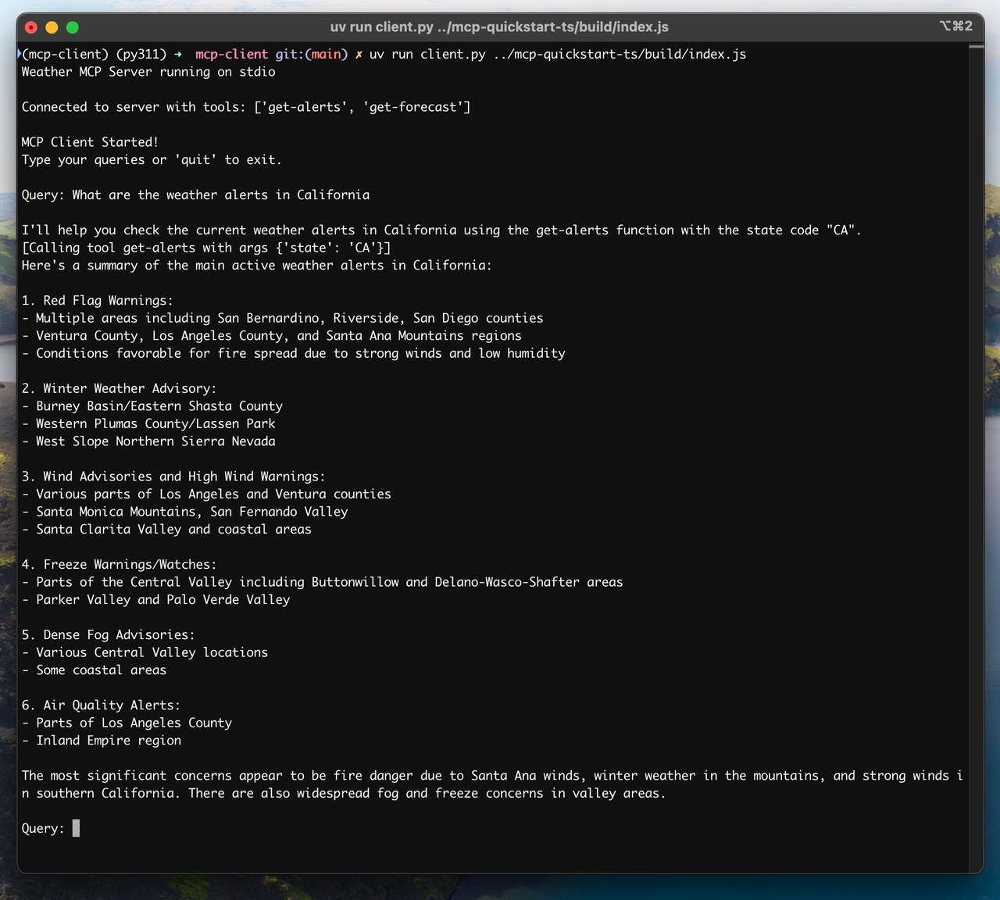

***

## **🔍 MCP 查询处理流程**

当你输入一个查询时，MCP 服务器的处理流程如下： 1️⃣ **客户端获取 MCP 服务器上的工具列表**
&#x20;2️⃣ **向 Claude 发送查询，并附带工具信息**
&#x20;3️⃣ **Claude 选择适当的工具（如果需要）**
&#x20;4️⃣ **客户端通过 MCP 服务器执行工具调用**
&#x20;5️⃣ **工具返回结果，并传递给 Claude**
&#x20;6️⃣ **Claude 生成最终的自然语言回复**
&#x20;7️⃣ **响应显示在终端** 🎉

***

## **✅ 最佳实践**

### **🛠️ 错误处理**

* **始终使用 `try-except` 处理工具调用**

* **提供清晰的错误消息**

* **优雅处理服务器连接问题**

### **📌 资源管理**

* **使用 `AsyncExitStack` 进行资源管理**

* **在程序退出时释放连接**

* **处理服务器断连情况**

### **🔒 安全性**

* **API Key 存储在 `.env` 文件中**

* **验证服务器返回的数据**

* **谨慎管理工具调用权限**

***

## **🛠️ 故障排查**

### **🔹 服务器路径问题**

* 确保服务器路径正确

* **使用绝对路径**，避免相对路径问题

* Windows 用户请确保路径格式正确：&#x20;

```bash
uv run client.py C:/projects/mcp-server/weather.py
```

### **🔹 响应时间**

* **首次响应可能需要 30 秒**（初始化 & 处理请求）

* **后续请求会更快**

* **请勿在初次请求时中断进程**

### **🔹 常见错误**

* `FileNotFoundError`：检查 **服务器路径**

* `Connection refused`：确保 **服务器已运行**

* `Tool execution failed`：确认 **环境变量已正确设置**

* `Timeout error`：考虑增加超时时间

***


MCP Python SDK：https://github.com/modelcontextprotocol/python-sdk

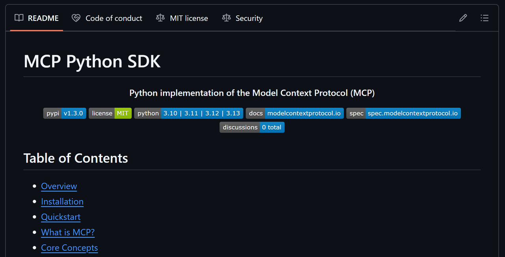

# **MCP Python SDK**

### **📌 MCP SDK 相关内容**

MCP SDK 提供了一套 **标准化** 的工具，让应用能够与 **LLM（大语言模型）** 交互，同时将数据和功能 **安全、标准化** 地暴露给 LLM 应用程序。

***

## **📖 目录**

1️⃣ **概览（Overview）**
&#x20;2️⃣ **安装（Installation）**
&#x20;3️⃣ **快速入门（Quickstart）**
&#x20;4️⃣ **什么是 MCP？（What is MCP?）**
&#x20;5️⃣ **核心概念（Core Concepts）**

* **服务器（Server）**

* **资源（Resources）**

* **工具（Tools）**

* **提示词（Prompts）**

* **图片（Images）**

* **上下文（Context）**
  &#x20;6️⃣ **运行服务器（Running Your Server）**

* **开发模式（Development Mode）**

* **Claude Desktop 集成（Claude Desktop Integration）**

* **直接执行（Direct Execution）**
  &#x20;7️⃣ **示例（Examples）**

* **回声服务器（Echo Server）**

* **SQLite 数据浏览器（SQLite Explorer）**
  &#x20;8️⃣ **高级用法（Advanced Usage）**

* **低级服务器实现（Low-Level Server）**

* **编写 MCP 客户端（Writing MCP Clients）**

* **MCP 基础操作（MCP Primitives）**

* **服务器能力（Server Capabilities）**
  &#x20;9️⃣ **文档（Documentation）**
  &#x20;🔟 **贡献（Contributing）**
  &#x20;1️⃣1️⃣ **许可证（License）**

***

## **📌 概览**

**模型上下文协议（MCP）** 允许应用程序 **标准化地** 向 LLM 提供上下文信息，从而将 **上下文管理** 与 **LLM 交互** 分离开来。

📌 **这个 Python SDK 提供完整的 MCP 规范实现，使你可以轻松实现以下功能：** ✅ **构建 MCP 客户端**，可连接到任何 MCP 服务器
&#x20;✅ **创建 MCP 服务器**，向 LLM **提供资源、工具和提示词**
&#x20;✅ **使用标准化通信方式**（如 `stdio` 和 `SSE`）
&#x20;✅ **管理 MCP 协议的消息流与生命周期**

***

## **📌 安装**

我们推荐使用 **uv** 来管理 Python 项目：

```bash
uv add "mcp[cli]"
```

**或者使用 `pip` 直接安装：**

```bash
pip install mcp
```

***

## **🚀 快速入门**

让我们创建一个简单的 **MCP 服务器**，它包含：

* **一个计算器工具**

* **一个个性化问候资源**

📌 **创建 `server.py` 文件，并添加以下代码：**

```python
# server.py
from mcp.server.fastmcp import FastMCP

# Create an MCP server
mcp = FastMCP("Demo")

# Add an addition tool
@mcp.tool()
def add(a: int, b: int) -> int:
    """Add two numbers"""
    return a + b

# Add a dynamic greeting resource
@mcp.resource("greeting://{name}")
def get_greeting(name: str) -> str:
    """Get a personalized greeting"""
    return f"Hello, {name}!"
```

📌 **在 Claude Desktop 中安装并运行该服务器：**

```bash
mcp install server.py
```

📌 **或者使用 MCP Inspector 测试：**

```bash
mcp dev server.py
```

***

## **🤔 什么是 MCP？**

**MCP（模型上下文协议）** 允许你构建 **服务器**，向 LLM **安全、标准化** 地暴露数据和功能。可以把 MCP 服务器想象成 **专门为 LLM 设计的 Web API**。

📌 **MCP 服务器可以：**&#x20;

&#x20;✅ **通过资源（Resources）暴露数据**（类似于 `GET` API）
&#x20;✅ **通过工具（Tools）提供功能**（类似于 `POST` API）
&#x20;✅ **通过提示词（Prompts）定义交互模式**（可复用的 LLM 模板）

***

## **🔹 核心概念**

### **1️⃣ 服务器（Server）**

MCP 服务器是 **MCP 协议的核心接口**，它管理：&#x20;

&#x20;✅ **连接**
&#x20;✅ **协议合规性**
&#x20;✅ **消息路由**

📌 **示例：**

```python
# 添加服务器生命周期管理
from dataclasses import dataclass
from typing import AsyncIterator
from mcp.server.fastmcp import FastMCP
# 创建命名服务器
mcp = FastMCP("My App")
# 指定依赖项（如 pandas、numpy）
mcp = FastMCP("My App", dependencies=["pandas", "numpy"])
@dataclass
class AppContext:
    db: Database  # 这里替换为你的实际数据库类型
@asynccontextmanager
async def app_lifespan(server: FastMCP) -> AsyncIterator[AppContext]:
    """使用类型安全的上下文管理应用程序生命周期"""
    try:
        await db.connect()
        yield AppContext(db=db)
    finally:
        await db.disconnect()
# 传递生命周期管理器给 MCP 服务器
mcp = FastMCP("My App", lifespan=app_lifespan)
# 在工具函数中访问生命周期上下文
@mcp.tool()
def query_db(ctx: Context) -> str:
    """使用数据库进行查询"""
    db = ctx.request_context.lifespan_context["db"]
    return db.query()
```

📌 **以上代码确保 MCP 服务器在启动和关闭时正确管理资源（如数据库连接）。**

***

### **2️⃣ 资源（Resources）**

📌 **资源用于向 LLM 暴露数据**，类似于 **REST API 的 `GET` 端点**。
&#x20;✅ **不应执行复杂计算或产生副作用**

#### **📌 示例：静态配置**

```python
@mcp.resource("config://app")
def get_config() -> str:
    """提供静态应用配置"""
    return "App 配置信息"
```

#### **📌 示例：动态用户数据**

```python
@mcp.resource("users://{user_id}/profile")
def get_user_profile(user_id: str) -> str:
    """提供动态用户数据"""
    return f"用户 {user_id} 的个人资料"
```

📌 **资源的作用：**&#x20;

&#x20;✅ 让 LLM **加载数据到上下文**，帮助生成更准确的回答
&#x20;✅ **支持静态和动态数据**
&#x20;✅ **可以结合 LLM 的检索增强生成（RAG）机制**

### **📌 MCP SDK 进阶指南**

MCP SDK 提供了一套标准化工具，让应用可以通过 **资源（Resources）、工具（Tools）和提示词（Prompts）**，以**安全、标准化**的方式与 LLM 进行交互。

***

## **🔹 工具（Tools）**

**工具（Tools）** 允许 LLM 通过 MCP 服务器执行操作。与 **资源（Resources）** 不同，工具通常涉及 **计算** 并 **可能产生副作用**。

📌 **示例：计算 BMI**

```python
@mcp.tool()
def calculate_bmi(weight_kg: float, height_m: float) -> float:
    """根据体重（kg）和身高（m）计算 BMI"""
    return weight_kg / (height_m ** 2)
```

📌 **示例：获取天气信息**

```python
import httpx
@mcp.tool()
async def fetch_weather(city: str) -> str:
    """获取指定城市的当前天气"""
    async with httpx.AsyncClient() as client:
        response = await client.get(f"https://api.weather.com/{city}")
        return response.text
```

✅ **工具的作用**

* **执行计算**

* **进行 API 调用**

* **支持异步操作**

***

## **🔹 提示词（Prompts）**

**提示词（Prompts）** 是 **可复用模板**，帮助 LLM 以标准化方式与 MCP 服务器交互。

📌 **示例：代码审查**

```python
@mcp.prompt()
def review_code(code: str) -> str:
    return f"请审查以下代码：\n\n{code}"
```

📌 **示例：调试错误**

```python
@mcp.prompt()
def debug_error(error: str) -> list[Message]:
    return [
        UserMessage("我遇到了这个错误："),
        UserMessage(error),
        AssistantMessage("我来帮你调试。你目前尝试了哪些方法？")
    ]
```

✅ **提示词的作用**

* **创建标准化 LLM 交互模板**

* **提供上下文，使 LLM 生成更精准的响应**

* **支持结构化对话**

***

## **🔹 图片处理（Images）**

FastMCP 提供 **`Image`** 类，可用于 **自动处理图片数据**。

📌 **示例：生成缩略图**

```python
from mcp.server.fastmcp import FastMCP, Image
from PIL import Image as PILImage
@mcp.tool()
def create_thumbnail(image_path: str) -> Image:
    """根据图片路径创建缩略图"""
    img = PILImage.open(image_path)
    img.thumbnail((100, 100))
    return Image(data=img.tobytes(), format="png")
```

✅ **图片功能**

* **支持 `Image` 类进行图片数据封装**

* **可用于 LLM 生成的多模态应用**

***

## **🔹 上下文管理（Context）**

`Context` 对象可以让工具和资源 **访问 MCP 服务器的内部能力**，如 **日志记录、进度跟踪、文件读取等**。

📌 **示例：批量处理多个文件**

```python
from mcp.server.fastmcp import FastMCP, Context
@mcp.tool()
async def long_task(files: list[str], ctx: Context) -> str:
    """处理多个文件，并提供进度跟踪"""
    for i, file in enumerate(files):
        ctx.info(f"正在处理 {file}")
        await ctx.report_progress(i, len(files))
        data, mime_type = await ctx.read_resource(f"file://{file}")
    return "所有文件处理完成"
```

✅ **上下文的作用**

* **支持进度跟踪**

* **支持日志记录**

* **可以读取 MCP 服务器的资源**

***

## **🚀 运行 MCP 服务器**

### **1️⃣ 开发模式**

使用 **MCP Inspector** 进行快速测试：

```bash
mcp dev server.py
```

📌 **添加依赖项**

```bash
mcp dev server.py --with pandas --with numpy
```

📌 **挂载本地代码**

```bash
mcp dev server.py --with-editable .
```

***

### **2️⃣ Claude Desktop 集成**

📌 **安装 MCP 服务器**

```bash
mcp install server.py
```

📌 **自定义服务器名称**

```bash
mcp install server.py --name "My Analytics Server"
```

📌 **传递环境变量**

```bash
mcp install server.py -v API_KEY=abc123 -v DB_URL=postgres://...
mcp install server.py -f .env
```

***

### **3️⃣ 直接执行 MCP 服务器**

📌 **Python 方式**

```python
from mcp.server.fastmcp import FastMCP
mcp = FastMCP("My App")
if name == "__main__":
    mcp.run()
```

📌 **运行服务器**

```python
python server.py
# 或者
mcp run server.py
```

***

## **🛠️ 示例**

### **1️⃣ Echo 服务器**

📌 **示例：创建 MCP 服务器，回显消息**

```python
from mcp.server.fastmcp import FastMCP
mcp = FastMCP("Echo")
@mcp.resource("echo://{message}")
def echo_resource(message: str) -> str:
    """回显消息（资源）"""
    return f"Resource echo: {message}"
@mcp.tool()
def echo_tool(message: str) -> str:
    """回显消息（工具）"""
    return f"Tool echo: {message}"
@mcp.prompt()
def echo_prompt(message: str) -> str:
    """创建回显提示词"""
    return f"请处理此消息: {message}"
```

***

### **2️⃣ SQLite 数据浏览器**

📌 **示例：使用 SQLite 数据库**

```python
from mcp.server.fastmcp import FastMCP
import sqlite3
mcp = FastMCP("SQLite Explorer")
@mcp.resource("schema://main")
def get_schema() -> str:
    """返回数据库架构"""
    conn = sqlite3.connect("database.db")
    schema = conn.execute(
        "SELECT sql FROM sqlite_master WHERE type='table'"
    ).fetchall()
    return "\n".join(sql[0] for sql in schema if sql[0])
@mcp.tool()
def query_data(sql: str) -> str:
    """执行 SQL 查询"""
    conn = sqlite3.connect("database.db")
    try:
        result = conn.execute(sql).fetchall()
        return "\n".join(str(row) for row in result)
    except Exception as e:
        return f"错误: {str(e)}"
```

***

## **⚙️ 进阶用法**

### **1️⃣ 低级服务器（Low-Level Server）**

如果需要 **完全控制 MCP 服务器**，可以使用低级 API：

```python
from contextlib import asynccontextmanager
from typing import AsyncIterator
@asynccontextmanager
async def server_lifespan(server: Server) -> AsyncIterator[dict]:
    """管理服务器生命周期"""
    try:
        await db.connect()
        yield {"db": db}
    finally:
        await db.disconnect()
# 传递生命周期管理器给服务器
server = Server("example-server", lifespan=server_lifespan)
```

✅ **低级服务器 API 允许**：

* **在服务器启动时初始化资源**

* **在请求处理期间访问资源**

* **在服务器关闭时清理资源**

```python
from mcp.server.lowlevel import Server, NotificationOptions
from mcp.server.models import InitializationOptions
import mcp.server.stdio
import mcp.types as types

# Create a server instance
server = Server("example-server")

@server.list_prompts()
async def handle_list_prompts() -> list[types.Prompt]:
    return [
        types.Prompt(
            name="example-prompt",
            description="An example prompt template",
            arguments=[
                types.PromptArgument(
                    name="arg1",
                    description="Example argument",
                    required=True
                )
            ]
        )
    ]

@server.get_prompt()
async def handle_get_prompt(
    name: str,
    arguments: dict[str, str] | None
) -> types.GetPromptResult:
    if name != "example-prompt":
        raise ValueError(f"Unknown prompt: {name}")

    return types.GetPromptResult(
        description="Example prompt",
        messages=[
            types.PromptMessage(
                role="user",
                content=types.TextContent(
                    type="text",
                    text="Example prompt text"
                )
            )
        ]
    )

async def run():
    async with mcp.server.stdio.stdio_server() as (read_stream, write_stream):
        await server.run(
            read_stream,
            write_stream,
            InitializationOptions(
                server_name="example",
                server_version="0.1.0",
                capabilities=server.get_capabilities(
                    notification_options=NotificationOptions(),
                    experimental_capabilities={},
                )
            )
        )

if __name__ == "__main__":
    import asyncio
    asyncio.run(run())
```

***

## **📌 编写 MCP 客户端**

MCP SDK 提供 **高层客户端接口**，可用于连接 MCP 服务器：

```python
from mcp import ClientSession, StdioServerParameters
from mcp.client.stdio import stdio_client

# Create server parameters for stdio connection
server_params = StdioServerParameters(
    command="python", # Executable
    args=["example_server.py"], # Optional command line arguments
    env=None # Optional environment variables
)

# Optional: create a sampling callback
async def handle_sampling_message(message: types.CreateMessageRequestParams) -> types.CreateMessageResult:
    return types.CreateMessageResult(
        role="assistant",
        content=types.TextContent(
            type="text",
            text="Hello, world! from model",
        ),
        model="gpt-3.5-turbo",
        stopReason="endTurn",
    )

async def run():
    async with stdio_client(server_params) as (read, write):
        async with ClientSession(read, write, sampling_callback=handle_sampling_message) as session:
            # Initialize the connection
            await session.initialize()

            # List available prompts
            prompts = await session.list_prompts()

            # Get a prompt
            prompt = await session.get_prompt("example-prompt", arguments={"arg1": "value"})

            # List available resources
            resources = await session.list_resources()

            # List available tools
            tools = await session.list_tools()

            # Read a resource
            content, mime_type = await session.read_resource("file://some/path")

            # Call a tool
            result = await session.call_tool("tool-name", arguments={"arg1": "value"})

if __name__ == "__main__":
    import asyncio
    asyncio.run(run())
```

***

### **📌 MCP 基本构件（MCP Primitives）**

MCP 协议定义了 **三种核心构件（Primitives）**，MCP 服务器可以实现这些功能：

✅ **总结**：

* **提示词（Prompts）**：用户主动选择的交互式模板，例如命令行快捷命令

* **资源（Resources）**：由客户端提供的数据，例如配置文件、数据库记录、API 结果

* **工具（Tools）**：LLM 可调用的执行逻辑，例如计算函数、数据存储、系统操作

***

## **📌 服务器能力（Server Capabilities）**

MCP 服务器在初始化时会 **声明支持的功能**，即服务器的能力（Capabilities）。

✅ **总结**：

* **MCP 服务器在初始化时，必须声明其支持的能力**

* **如果服务器支持“资源”（Resources），它可以订阅资源变更**

* **如果服务器支持“工具”（Tools），LLM 可以自动发现可用工具并调用它们**

***

## **📌 文档（Documentation）**

* **📄 Model Context Protocol 文档**
  &#x20;👉 [官方 MCP 文档](https://chatgpt.com/c/67d28a8b-9e64-8000-bff6-da16089a3f12#)

* **📜 Model Context Protocol 规范**
  &#x20;👉 [MCP 详细技术规范](https://chatgpt.com/c/67d28a8b-9e64-8000-bff6-da16089a3f12#)

* **🔧 官方支持的 MCP 服务器**
  &#x20;👉 [官方 MCP 服务器列表](https://chatgpt.com/c/67d28a8b-9e64-8000-bff6-da16089a3f12#)

***

## **📌 贡献 & 许可证**

📌 **贡献指南** 我们欢迎所有开发者参与 MCP 生态，详细指南见 [贡献文档](https://chatgpt.com/c/67d28a8b-9e64-8000-bff6-da16089a3f12#)。

📌 **许可证** MCP 采用 **MIT 许可证**，详情请查看 **LICENSE 文件**。

***
