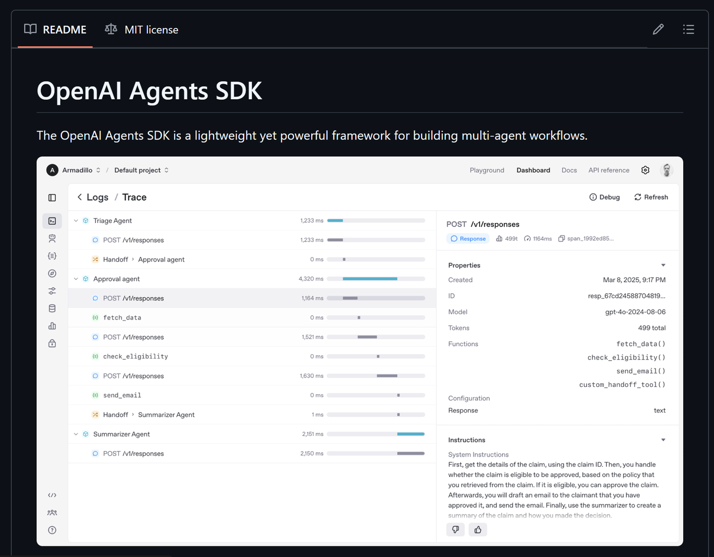
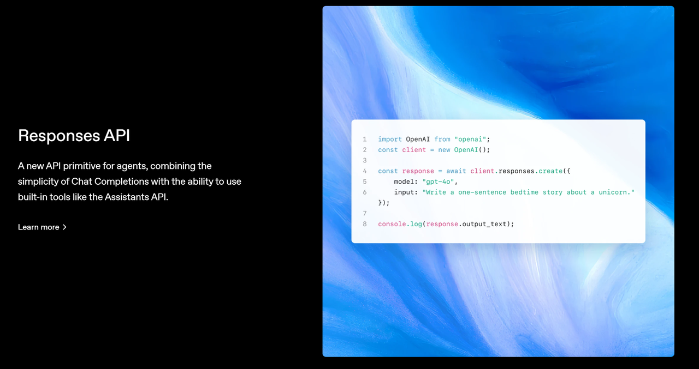
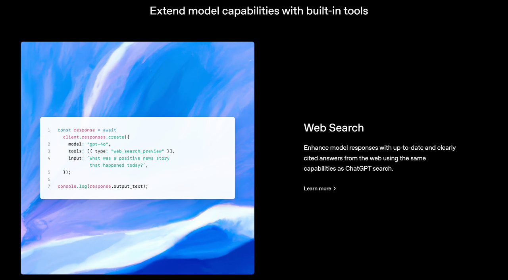
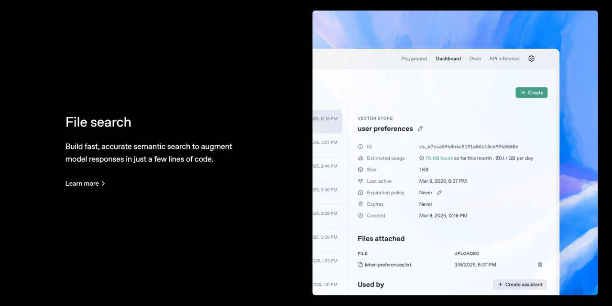
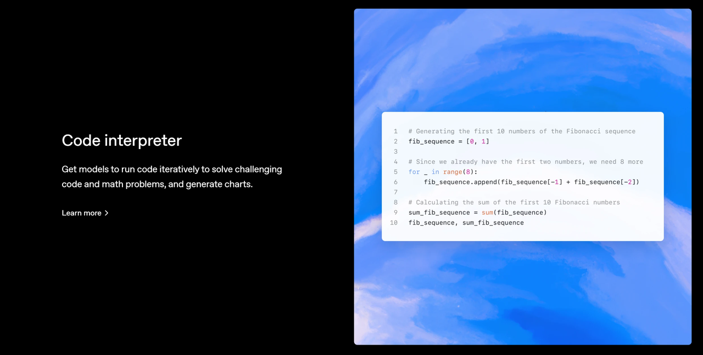
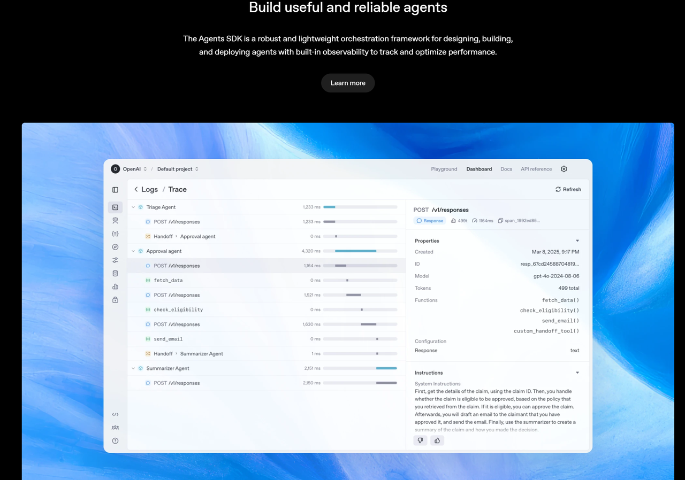

***

# **Part 一、OpenAI Agents SDK 简介**

OpenAI Agents SDK地址：https://github.com/openai/openai-agents-python



OpenAI Agents SDK 是一个轻量级但功能强大的框架，用于构建多智能体（multi-agent）工作流。

***

## **核心概念**

* **Agents（代理）**：配置了**指令**、**工具**、\*\*防护措施（guardrails）**和**交接（handoffs）\*\*的 LLM（大语言模型）。

* **Handoffs（交接）**：允许代理在特定任务中**将控制权转交给其他代理**。

* **Guardrails（防护措施）**：用于**输入和输出验证**的可配置安全检查机制。

* **Tracing（追踪）**：内置**代理执行的追踪功能**，可以用来查看、调试和优化你的工作流。

📌 **要了解 SDK 的实际使用方式，可查看 `examples` 目录中的示例代码。**

***

## **快速开始**

### **1. 设置 Python 环境**

```bash
python -m venv env
source env/bin/activate  # 在 Linux/macOS 上激活虚拟环境
# 如果是 Windows，则运行：
# env\Scripts\activate
```

### **2. 安装 Agents SDK**

```bash
pip install openai-agents
```

***

## **Hello World 示例**

```python
from agents import Agent, Runner

agent = Agent(name="Assistant", instructions="You are a helpful assistant")

result = Runner.run_sync(agent, "Write a haiku about recursion in programming.")
print(result.final_output)
```

**输出示例：**

```plaintext
# Code within the code,
# Functions calling themselves,
# Infinite loop's dance.
```

⚠ **注意**：运行此代码前，请确保已设置 `OPENAI_API_KEY` 环境变量。

***

## **Handoffs（交接）示例**

```python
from agents import Agent, Runner
import asyncio

# 定义两个语言代理
spanish_agent = Agent(name="Spanish agent", instructions="You only speak Spanish.")
english_agent = Agent(name="English agent", instructions="You only speak English")

# 定义一个任务分配代理
triage_agent = Agent(
    name="Triage agent",
    instructions="Handoff to the appropriate agent based on the language of the request.",
    handoffs=[spanish_agent, english_agent],
)

async def main():
    result = await Runner.run(triage_agent, input="Hola, ¿cómo estás?")
    print(result.final_output)

if __name__ == "__main__":
    asyncio.run(main())
```

**输出示例：**

```plaintext
¡Hola! Estoy bien, gracias por preguntar. ¿Y tú, cómo estás?
```

📌 这里，`triage_agent` 充当**任务分配代理**，根据用户输入的语言，将任务**转交**给相应的代理（西班牙语或英语）。

***

## **Functions（工具函数）示例**

```python
import asyncio
from agents import Agent, Runner, function_tool

# 定义一个天气查询工具
@function_tool
def get_weather(city: str) -> str:
    return f"The weather in {city} is sunny."

# 创建一个代理，并添加 `get_weather` 工具
agent = Agent(
    name="Hello world",
    instructions="You are a helpful agent.",
    tools=[get_weather],
)

async def main():
    result = await Runner.run(agent, input="What's the weather in Tokyo?")
    print(result.final_output)

if __name__ == "__main__":
    asyncio.run(main())
```

**输出示例：**

```plaintext
The weather in Tokyo is sunny.
```

📌 代理可以使用 `function_tool` 方式注册**外部工具**，如查询天气、数据库操作等。

***

## **代理循环机制**

调用 `Runner.run()` 后，SDK 会执行一个**循环**，直到获得最终输出：

1. **调用 LLM**，使用代理的**模型、设定和消息历史**。

2. **LLM 返回响应**，可能包含**工具调用**。

3. **如果 LLM 直接返回最终输出**（无工具调用/交接），则返回结果并结束循环。

4. **如果 LLM 交接给另一个代理**，则将当前代理切换为新的代理，并回到步骤 1。

5. **如果 LLM 调用了工具**，则执行工具调用，将结果添加到消息历史，然后回到步骤 1。

6. **可以使用 `max_turns` 参数** 限制循环的最大执行次数。

***

## **Final Output（最终输出）**

最终输出是**代理循环中的最后一个结果**：

* 如果代理**设置了 `output_type`**，则循环会**运行到 LLM 生成符合该类型的结构化输出**。

* 如果代理**没有 `output_type`**，则循环会**运行到 LLM 生成** **没有工具调用/交接的普通文本**。

**总结：**

* **如果有 `output_type`** → 运行到生成符合类型的输出。

* **如果没有 `output_type`** → 运行到生成普通文本。

***

## **常见的代理模式**

Agents SDK 设计为**高度灵活**，可以用于：

* **确定性流程（deterministic flows）**

* **迭代循环（iterative loops）**

* **多智能体协作**（multi-agent collaboration）

可以查看 `examples/agent_patterns` 目录下的示例代码。

***

## **Tracing（追踪与调试）**

* Agents SDK **内置追踪功能**，便于**跟踪和调试**代理的行为。

* 支持扩展

* ，可以对接外部日志系统，如：

  * **Logfire**

  * **AgentOps**

  * **Braintrust**

📌 具体实现可参考 `Tracing` 文档。

***

## **开发（仅当需要修改 SDK 时）**

1. 确保已安装

2. uv：

```bash
uv --version
```

1. 安装依赖：

```bash
make sync
```

1. 代码检查 & 测试：

```bash
make tests  # 运行测试
make mypy   # 运行类型检查
make lint   # 运行代码格式检查
```

***

## **致谢**

OpenAI 特别感谢以下开源项目：

* **Pydantic**（数据验证）

* **PydanticAI**（高级代理框架）

* **MkDocs**（文档生成）

* **Griffe**（Python 代码解析工具）

* **uv 和 ruff**（Python 依赖管理 & 代码检查）

📌 **OpenAI 承诺继续开源 Agents SDK**，让社区共同扩展其能力。

# Part 二、**Responses API**

* 地址：https://platform.openai.com/docs/guides/text?api-mode=responses

**Responses API** 是 OpenAI 为智能代理（Agents）提供的**全新 API 基础构件**，它结合了 **Chat Completions API 的简洁性** 与 **Assistants API 的内置工具能力**，使得代理能够更智能地执行任务。

📌 **核心特点**

* ✅ **简洁易用**：继承了 Chat Completions API 的易用性。

* ✅ **增强功能**：支持**内置工具（Tools）**，如函数调用（Function Calling）、Web 搜索、文件搜索、计算机控制等。

* ✅ **适用于代理（Agents）**：可用于构建**智能化任务执行系统**。

🔗 **未来发展**：Responses API 旨在成为 OpenAI 代理系统的**核心 API**，结合 Agents SDK，提供更灵活的任务编排能力。



### **文本生成与提示词工程（Prompting）**

本节介绍如何使用 OpenAI API **提示（prompt）模型** 以生成文本。你可以将其用于 **代码生成、数学表达式、结构化 JSON 数据、人类风格的文本** 等。

***

## **1. 生成文本**

使用 OpenAI API，你可以通过一个 **简单的提示（prompt）** 让模型生成文本，类似于 ChatGPT 的工作方式。

### **🌟 示例：使用 Responses API 生成文本**

```python
from openai import OpenAI

client = OpenAI()

response = client.responses.create(
    model="gpt-4o",
    input="Write a one-sentence bedtime story about a unicorn."
)

print(response.output_text)
```

**示例输出：**

```plaintext
Under the soft glow of the moon, Luna the unicorn danced through fields of twinkling stardust, leaving trails of dreams for every child asleep.
```

**📌 关键点：**

* `response.output_text` 包含**模型生成的文本**。

* `model="gpt-4o"` 指定使用 `GPT-4o` 模型。

***

## **2. 响应结构**

OpenAI 的 API 响应包含**一个内容数组**（`output`），每个内容项具有以下结构：

```json
[
    {
        "id": "msg_67b73f697ba4819183a15cc17d011509",
        "type": "message",
        "role": "assistant",
        "content": [
            {
                "type": "output_text",
                "text": "Under the soft glow of the moon, Luna the unicorn danced through fields of twinkling stardust, leaving trails of dreams for every child asleep.",
                "annotations": []
            }
        ]
    }
]
```

**📌 重要说明：**

* `output` **可能包含多个结果**，在多轮对话或批量生成时尤其明显。

* 一些 SDK 提供 `output_text` **属性**，可以**直接获取所有文本输出**，方便访问文本数据。

* **除了纯文本，模型还可以返回 JSON 结构化数据**（称为 **Structured Outputs**）。

***

## **3. 消息角色与指令控制**

你可以使用不同的方式**给模型提供指令**：

1. **使用 `instructions` 参数** 提供全局行为指令，如语气、目标等。（权重最高）

2. **使用 `input` 数组，指定不同角色的消息**。

### **🌟 示例 1：使用 `instructions` 参数**

```python
from openai import OpenAI

client = OpenAI()

response = client.responses.create(
    model="gpt-4o",
    instructions="Talk like a pirate.",
    input="Are semicolons optional in JavaScript?",
)

print(response.output_text)
```

**示例输出：**

```plaintext
Arrr, matey! In JavaScript, semicolons be often optional, but beware, for they help avoid nasty parse errors!
```

📌 **在 `instructions` 中定义“说话像海盗”后，模型会以海盗风格回答。**

***

### **🌟 示例 2：使用 `input` 数组指定不同角色**

```python
from openai import OpenAI

client = OpenAI()

response = client.responses.create(
    model="gpt-4o",
    input=[
        {
            "role": "developer",
            "content": "Talk like a pirate."
        },
        {
            "role": "user",
            "content": "Are semicolons optional in JavaScript?"
        }
    ]
)

print(response.output_text)
```

📌 这里，`developer` 角色类似于 **系统设定**，用户输入 `user` 角色的内容，最终 **模型按 `developer` 设定风格回答**。

***

## **4. 消息角色的优先级**

OpenAI 规定不同角色的优先级：

| **角色**      | **优先级** | **说明**                       |
| ----------- | ------- | ---------------------------- |
| `developer` | **最高**  | 由开发者提供的指令，优先级最高，类似 `system`。 |
| `user`      | **次高**  | 由最终用户提供的输入，次于 `developer`。   |
| `assistant` | **最低**  | 由模型生成的响应。                    |

**📌 多轮对话会包含不同类型的消息。管理对话状态是关键！**

***

## **5. 选择合适的模型**

在使用 API 生成文本时，你需要**选择合适的模型**（`model` 参数）。可选模型及其特点如下：

### **🧠 1. 推理（Reasoning）模型**

* **特点**：内部会进行**复杂的思维链分析**，适用于**逻辑推理、分步计划**等任务。

* 优缺点

* ：

  * ✅ **理解复杂任务、逻辑清晰**

  * ❌ **速度较慢，成本更高**

* **适用场景**：复杂分析、多步推理、研究类任务

### **⚡ 2. GPT（通用）模型**

* **特点**：快速、经济、高效，但**需要更明确的指令**来引导它完成任务。

* 优缺点

* ：

  * ✅ **生成速度快、性价比高**

  * ❌ **可能不擅长复杂的推理任务**

* **适用场景**：快速文本生成、聊天机器人、常规任务

### **🔍 3. 规模大小选择**

| **模型**                | **特点**                     |
| --------------------- | -------------------------- |
| **大型模型（GPT-4o）**      | **理解能力强，泛化能力好**，适用于复杂问题。   |
| **小型模型（GPT-4o Mini）** | **更快、更便宜**，适合特定任务，可通过微调优化。 |

**📌 结论**： 如果不确定该选哪个，`gpt-4o` **是智能性、速度和成本的最佳平衡点**。

***

## **6. 提示词工程（Prompt Engineering）**

构造**高效的提示词（prompt）\*\*是\*\*优化模型输出**的关键。由于 LLM 生成内容具有**非确定性**，你需要**艺术+科学结合**来调整提示词。

### **提示词优化的基本原则**

1. **提供详细说明**，减少歧义，确保模型理解你的需求。

2. **示例驱动（Few-shot Learning）**，提供输入-输出示例，提高模型的准确性。

3. **目标导向描述**，尤其是推理模型，不要写死步骤，而要描述**目标**和**期望结果**。

4. **测试与评估（Evals）**，使用生产环境数据来测试提示词效果。

5. **不断迭代**，调整提示词，优化模型输出。

***

## **7. 微调 vs 提示词优化**

如果通过**提示词工程（Prompt Engineering）** **仍然无法获得满意的结果**，你可以考虑：

* **微调（Fine-tuning）**：针对特定任务**调整权重**，提升准确性。

* **蒸馏（Distillation）**：用大模型生成的数据来优化小模型的表现。

**📌 一般情况下，调整提示词就能满足需求，微调适用于需要**定制化模型\*\*的场景。

# 三、Web Search（网页搜索）

* 地址：https://platform.openai.com/docs/guides/tools-web-search?api-mode=responses



OpenAI Agents SDK 支持**网页搜索**，允许模型在生成回答之前**查询最新的信息**，类似于 ChatGPT 的搜索功能，并提供**清晰的引用**来源。

***

## **1. 启用 Web 搜索**

你可以在 API 请求中，将 `web_search_preview` **添加到 `tools` 数组** 以启用 Web 搜索。模型在处理请求时，可以**选择**是否使用搜索工具。

### **🌟 示例：启用 Web 搜索**

```python
from openai import OpenAI

client = OpenAI()

response = client.responses.create(
    model="gpt-4o",
    tools=[{"type": "web_search_preview"}],  # 启用 Web 搜索工具
    input="What was a positive news story from today?"
)

print(response.output_text)
```

📌 **效果**：

* 该 API 请求会调用 `web_search_preview`，允许模型在回答前**搜索最新的新闻**。

* 但**模型可以自行决定**是否使用该工具。

***

## **2. 强制使用 Web 搜索**

如果希望**确保模型一定使用 Web 搜索**（避免它仅使用内部知识回答），可以**设置 `tool_choice` 参数**：

```python
tool_choice={"type": "web_search_preview"}
```

📌 **作用**：

* 让 Web 搜索**始终**执行，而不是让模型决定是否使用搜索工具。

* **提升一致性**，但可能会增加**查询时间**。

***

## **3. 输出格式与引用**

如果模型调用了 Web 搜索，API 响应将包含**两部分**：

1. **Web 搜索调用的 ID**

2. **模型的回答**，并带有网页来源的**引用信息**

### **📌 示例输出**

```json
[
  {
    "type": "web_search_call",
    "id": "ws_67c9fa0502748190b7dd390736892e100be649c1a5ff9609",
    "status": "completed"
  },
  {
    "id": "msg_67c9fa077e288190af08fdffda2e34f20be649c1a5ff9609",
    "type": "message",
    "status": "completed",
    "role": "assistant",
    "content": [
      {
        "type": "output_text",
        "text": "On March 6, 2025, several news...",
        "annotations": [
          {
            "type": "url_citation",
            "start_index": 2606,
            "end_index": 2758,
            "url": "https://...",
            "title": "Title..."
          }
        ]
      }
    ]
  }
]
```

📌 **解析**：

* `web_search_call`：存储搜索请求的 ID 和状态（已完成）。

```plaintext
message
```

* ：

  * `output_text`：模型生成的文本。

  ```plaintext
  annotations
  ```

  * ：

    * `url_citation`：提供**引用来源**，包括 URL、标题、文本在回答中的位置。

📌 **前端要求**：

* 当向用户展示搜索结果时，**必须提供清晰的引用**，并确保**可点击**。

***

## **4. 定制用户位置**

Web 搜索**可以根据用户的位置**优化搜索结果。你可以指定：

* `country`（国家）：**两字母 ISO 代码**，如 `"US"`（美国）、`"GB"`（英国）。

* `city`（城市）：如 `"London"`（伦敦）。

* `region`（地区）：如 `"California"`（加州）。

* `timezone`（时区）：如 `"America/Chicago"`（芝加哥时间）。

### **🌟 示例：指定搜索位置**

```python
from openai import OpenAI

client = OpenAI()

response = client.responses.create(
    model="gpt-4o",
    tools=[{
        "type": "web_search_preview",
        "user_location": {
            "type": "approximate",
            "country": "GB",
            "city": "London",
            "region": "London",
        }
    }],
    input="What are the best restaurants around Granary Square?",
)

print(response.output_text)
```

📌 **效果**：

* 该查询会返回**伦敦 Granary Square 附近的最佳餐厅**。

***

## **5. 搜索上下文大小（Context Size）**

`search_context_size` **控制从 Web 获取的上下文信息量**，影响**成本、质量和延迟**。

### **可选值**

| **值**           | **描述**               | **成本** | **质量** | **响应速度** |
| --------------- | -------------------- | ------ | ------ | -------- |
| **high**        | **最丰富的上下文**，适用于深度查询  | 高      | 高      | 慢        |
| **medium** (默认) | **平衡上下文、成本和速度**      | 中      | 中      | 中        |
| **low**         | **最少的上下文，成本最低，速度最快** | 低      | 低      | 快        |

### **🌟 示例：使用低上下文**

```python
from openai import OpenAI

client = OpenAI()

response = client.responses.create(
    model="gpt-4o",
    tools=[{
        "type": "web_search_preview",
        "search_context_size": "low",
    }],
    input="What movie won best picture in 2025?",
)

print(response.output_text)
```

📌 **效果**：

* 该查询**以最低成本和最快速度**获取**最佳影片奖**的最新信息。

📌 **注意**：

* **搜索工具的 token 消耗** **不会影响模型的 token 预算**，且不会跨回合保存。

***

## **6. 限制与注意事项**

在使用 Web 搜索时，需要考虑以下**限制**：

1. **数据保留（Data Retention）**

   * 该工具**不支持 0 数据保留**或**数据驻留策略**（即 API 可能会短期存储查询数据）。

2. **部分模型支持**

   * `gpt-4o-search-preview` 和 `gpt-4o-mini-search-preview` **仅支持 API 的一部分参数**，请查看**模型文档**获取具体的速率限制和功能支持。

3. **速率限制**

   * Web 搜索工具的调用**遵循与模型相同的速率限制**（tiered rate limits）。

# Part 三、**文件搜索（File Search）**

* 地址：https://platform.openai.com/docs/guides/tools-file-search



OpenAI Agents SDK 支持**文件搜索功能**，允许模型在生成回答之前**检索用户上传的文件**中的相关信息。

***

## **1. 文件搜索概述**

`file_search` 工具可以让模型在**已上传的文件知识库**（vector stores）中进行**语义搜索**和**关键词搜索**，从而扩展模型的内在知识。

📌 **特点**：

* **托管工具**（由 OpenAI 负责管理，无需用户自行实现搜索逻辑）。

* **自动调用**：模型**决定**何时使用该工具进行检索。

* **向量存储支持**：通过**创建向量存储**并上传文件来增强模型的知识。

📌 **相关概念**：

* **Vector Store（向量存储）**：一个可存储**文本向量化数据**的数据库，支持**语义检索**。

* **Semantic Search（语义搜索）**：利用**向量表示**进行相似性匹配，而不仅仅是关键字匹配。

📌 **学习更多**：可参考 **OpenAI Retrieval Guide（检索指南）**。

***

## **2. 使用文件搜索**

在使用文件搜索前，用户需要：

1. **创建向量存储（Vector Store）**。

2. **上传文件到向量存储**。

3. **在 API 调用中启用 `file_search`**，并**指定向量存储 ID**。

📌 **⚠️ 限制**：

* 目前 **一次搜索仅支持一个向量存储**（`vector_store_ids` 只能包含一个 ID）。

***

## **3. 启用文件搜索**

### **🌟 示例：使用 `file_search` 进行文件检索**

```python
from openai import OpenAI

client = OpenAI()

response = client.responses.create(
    model="gpt-4o-mini",
    input="What is deep research by OpenAI?",
    tools=[{
        "type": "file_search",
        "vector_store_ids": ["<vector_store_id>"]  # 指定要搜索的向量存储
    }]
)

print(response)
```

📌 **效果**：

* 该查询会在**指定的 `vector_store_id` 知识库**中检索相关信息，并返回模型的回答。

* **模型自动决定是否调用文件搜索**。

***

## **4. API 响应结构**

当 `file_search` 工具被调用后，API 响应将包含**两部分**：

1. **`file_search_call`**：存储搜索请求的 ID 和查询内容。

2. **`message`**：存储模型的回答，并包含**文件引用信息（file citations）**。

### **📌 示例输出**

```json
{
  "output": [
    {
      "type": "file_search_call",
      "id": "fs_67c09ccea8c48191ade9367e3ba71515",
      "status": "completed",
      "queries": ["What is deep research?"],
      "search_results": null
    },
    {
      "id": "msg_67c09cd3091c819185af2be5d13d87de",
      "type": "message",
      "role": "assistant",
      "content": [
        {
          "type": "output_text",
          "text": "Deep research is a sophisticated capability that allows for extensive inquiry and synthesis of information across various domains...",
          "annotations": [
            {
              "type": "file_citation",
              "index": 992,
              "file_id": "file-2dtbBZdjtDKS8eqWxqbgDi",
              "filename": "deep_research_blog.pdf"
            },
            {
              "type": "file_citation",
              "index": 1176,
              "file_id": "file-2dtbBZdjtDKS8eqWxqbgDi",
              "filename": "deep_research_blog.pdf"
            }
          ]
        }
      ]
    }
  ]
}
```

📌 **解析**：

* **`file_search_call`**：存储搜索请求的 ID、状态和查询内容。

* `message`

* ：

  * `output_text`：模型生成的文本。

  * **`annotations`**：提供**引用文件信息**，包括 `file_id` 和 `filename`，标明信息的来源。

***

## **5. 检索结果定制**

你可以自定义搜索行为，以优化**结果质量、成本和响应速度**。

### **🌟 限制搜索结果数量**

**减少搜索结果数量**可以：

* **降低 token 使用量**

* **提高查询速度**

* **但可能影响答案质量**

📌 **示例：限制搜索结果为 2 条**

```python
response = client.responses.create(
    model="gpt-4o-mini",
    input="What is deep research by OpenAI?",
    tools=[{
        "type": "file_search",
        "vector_store_ids": ["<vector_store_id>"],
        "max_num_results": 2  # 限制搜索返回的文件数量
    }]
)
print(response)
```

***

### **🌟 包含搜索结果**

默认情况下，搜索结果**不会直接包含**在 API 响应中，仅返回**引用信息**（annotations）。

📌 **示例：让 API 响应包含搜索结果**

```python
response = client.responses.create(
    model="gpt-4o-mini",
    input="What is deep research by OpenAI?",
    tools=[{
        "type": "file_search",
        "vector_store_ids": ["<vector_store_id>"]
    }],
    include=["output[*].file_search_call.search_results"]
)
print(response)
```

📌 **作用**：

* `include` 参数指定要包含 `search_results`，以便直接获取搜索的原始数据。

***

### **🌟 过滤文件元数据**

如果知识库中包含不同类型的文件（博客、论文、代码等），可以**按文件类型筛选**搜索结果。

📌 **示例：只搜索博客文章**

```python
response = client.responses.create(
    model="gpt-4o-mini",
    input="What is deep research by OpenAI?",
    tools=[{
        "type": "file_search",
        "vector_store_ids": ["<vector_store_id>"],
        "filters": {
            "type": "eq",   # 等于
            "key": "type",  # 过滤字段
            "value": "blog" # 只搜索博客
        }
    }]
)
print(response)
```

📌 **作用**：

* 该查询**仅搜索标记为“博客”类型**的文件，过滤掉其他文件（如论文、代码等）。

***

## **6. 支持的文件格式**

📌 **文件格式支持**：

* **文本文件**（`.txt`, `.md`, `.html`）

* **代码文件**（`.py`, `.js`, `.java`, `.cpp`）

* **文档**（`.pdf`, `.docx`, `.pptx`）

* **JSON / XML 数据**（`.json`）

| **文件格式** | **MIME 类型**                                                               |
| -------- | ------------------------------------------------------------------------- |
| `.pdf`   | `application/pdf`                                                         |
| `.docx`  | `application/vnd.openxmlformats-officedocument.wordprocessingml.document` |
| `.json`  | `application/json`                                                        |
| `.py`    | `text/x-python`                                                           |
| `.txt`   | `text/plain`                                                              |

📌 **字符编码**：文件必须使用 `utf-8`、`utf-16` 或 `ascii` 编码。

***

## **7. 限制**

使用 `file_search` 时需要注意以下限制：

* **项目级别**：最多可存储 **100GB** 文件。

* **向量存储**：最多支持 **10,000** 个文件。

* **单个文件大小**：最大 **512MB**（约 500 万 tokens）。

# Part 四、**计算机使用（Computer Use）**

* 地址：https://platform.openai.com/docs/guides/tools-computer-use


OpenAI 的 **计算机使用代理（Computer-Using Agent, CUA）** 允许模型**模拟**人在计算机上操作，例如点击、输入、滚动等，从而执行自动化任务。

***

## **1. 概述**

**Computer Use（计算机使用）** 是 OpenAI 提供的一种**增强版 CUA（计算机使用代理）**，基于 **`computer-use-preview`** 模型，结合：

* **GPT-4o 的视觉能力**（识别屏幕截图）

* **高级推理能力**（模拟计算机界面交互）

📌 **特点**：

* **允许模型执行计算机操作**（如点击、输入文本、滚动页面）。

* **通过截图感知界面变化**，并决定下一步操作。

* **可用于网页浏览、数据输入、在线购物、表单填写等任务**。

📌 **当前状态**：

* **Beta 版**，可能存在漏洞或错误。

* **不适用于高安全性任务**（如银行交易、个人账户管理）。

* **必须符合 OpenAI 的**[使用政策](https://openai.com/usage-policy)。

📌 **适用 API**：

* ✅ **Responses API**

* ❌ **不适用于 Chat Completions**

***

## **2. 工作原理**

计算机使用工具的执行流程是一个**循环（loop）**：

1. **发送请求**：用户提供目标任务（如“在 Bing 搜索 OpenAI 最新新闻”）。

2. 接收响应

3. ：

   * 模型可能返回**计算机操作（computer\_call）**（如点击、输入）。

   * 也可能返回**推理结果（reasoning）** 或**安全检查（safety\_check）**。

4. **执行操作**：应用代码**模拟操作**，如点击、输入文本。

5. **获取更新状态**：执行操作后，截图当前界面并传回模型。

6. **重复以上步骤**，直到模型完成任务或用户停止。

📌 **该流程适用于**：

* **浏览器操作**（`browser`）

* **本地操作**（`mac`、`windows`、`ubuntu`）

***

## **3. 环境设置**

为了安全地运行 **CUA（计算机使用代理）**，建议：

* **使用隔离环境（sandbox）**，避免影响真实系统。

* **创建本地虚拟机** 以模拟计算机环境。

📌 **示例环境**：

| 环境类型        | 适用场景          |
| ----------- | ------------- |
| **本地浏览器**   | 网页自动化（如搜索、填表） |
| **虚拟机（VM）** | 安全测试，避免破坏主系统  |
| **云端实例**    | 远程执行自动化任务     |

***

## **4. CUA 集成流程**

要在应用中集成 **计算机使用代理（CUA）**，需遵循以下步骤：

### **🌟 1. 发送请求**

你需要**调用 `computer-use-preview` 模型**，并**启用 `computer_use_preview` 工具**，指定：

* **屏幕尺寸**（`display_width`, `display_height`）

* **操作环境**（`environment`：如 `browser`、`windows`、`ubuntu`）

* **目标任务**（输入 `input` 指令）

📌 **示例：让 CUA 在 Bing 搜索 OpenAI 新闻**

```python
from openai import OpenAI

client = OpenAI()

response = client.responses.create(
    model="computer-use-preview",
    tools=[{
        "type": "computer_use_preview",
        "display_width": 1024,
        "display_height": 768,
        "environment": "browser"  # 其他选项："mac", "windows", "ubuntu"
    }],
    input=[
        {
            "role": "user",
            "content": "Check the latest OpenAI news on bing.com."
        }
        # 可选：包含初始界面的截图
        # {
        #     "type": "input_image",
        #     "image_url": f"data:image/png;base64,{screenshot_base64}"
        # }
    ],
    truncation="auto"  # 允许截断
)

print(response.output)
```

📌 **效果**：

* 该 API 请求会启动计算机代理，让它**在 Bing 上搜索 OpenAI 新闻**。

* **可选**：传入界面截图（Base64 编码）以帮助模型理解当前环境。

***

### **🌟 2. 接收建议操作**

模型的 API 响应可能包含：

* **文本输出**

* **计算机操作（computer\_call）**

* **其他工具调用**

📌 **示例：模型返回点击操作**

```json
"output": [
    {
        "type": "reasoning",
        "id": "rs_67cc...",
        "content": []
    },
    {
        "type": "computer_call",
        "id": "cu_67cc...",
        "call_id": "call_zw3...",
        "action": {
            "type": "click",
            "button": "left",
            "x": 156,
            "y": 50
        },
        "pending_safety_checks": [],
        "status": "completed"
    }
]
```

📌 **解析**：

* **`computer_call`**：告诉应用程序**执行点击操作**（在 `x=156, y=50`）。

* **`reasoning`**：提供推理过程（如果有）。

* **`pending_safety_checks`**：如果存在安全检查，应用程序需要处理。

***

### **🌟 3. 执行操作**

你的应用程序**需要解析 API 响应**，并**执行模型建议的操作**：

* **鼠标点击**（`click(x, y)`）

* **输入文本**（`type(text)`）

* **滚动页面**（`scroll(direction, amount)`）

📌 **示例：Python 代码执行点击**

```python
import pyautogui  # 使用 PyAutoGUI 进行 GUI 操作

# 解析 API 返回的 x, y 坐标
x, y = 156, 50
pyautogui.click(x, y)  # 执行点击操作
```

📌 **效果**：

* Python 代码会**在屏幕上的 `x=156, y=50` 位置执行点击**。

***

### **🌟 4. 获取更新后的界面状态**

完成操作后，应用程序应**截图当前界面**并**传回模型**，以便 CUA 继续下一步。

📌 **示例：截取屏幕截图并转为 Base64**

```python
import pyautogui
import base64
from io import BytesIO
from PIL import Image

# 截图
screenshot = pyautogui.screenshot()
buffer = BytesIO()
screenshot.save(buffer, format="PNG")
screenshot_base64 = base64.b64encode(buffer.getvalue()).decode()

# 发送截图到 API
response = client.responses.create(
    model="computer-use-preview",
    tools=[{"type": "computer_use_preview"}],
    input=[{
        "type": "input_image",
        "image_url": f"data:image/png;base64,{screenshot_base64}"
    }]
)
```

📌 **效果**：

* 代码会**截图当前屏幕**，并**将其作为 `input_image` 传给模型**，继续执行任务。

***

## **5. 安全检查**

CUA 可能会返回**安全检查（safety\_check）**，以避免执行风险操作：

* **如果 API 响应包含 `pending_safety_check`**，你需要**确认并手动执行检查**。

* **避免在** **完全认证环境（如银行账户、私人数据）** **使用 CUA**。

### **计算机使用（CUA）——执行操作、循环处理与安全机制**

本节介绍如何**执行计算机操作**，处理循环任务，并**管理安全性**以避免滥用或错误执行任务。

***

## **1. 执行计算机操作**

模型返回的 `computer_call` 包含**具体的操作指令**（如点击、滚动、键盘输入等）。你的应用程序需要**解析这些指令**，然后在计算机或浏览器环境中执行相应操作。

📌 **支持的操作类型**：

* `click(x, y, button="left")` → 鼠标点击

* `scroll(x, y, scroll_x, scroll_y)` → 滚动页面

* `keypress(keys)` → 按键输入

* `type(text)` → 输入文本

* `wait()` → 等待一段时间

* `screenshot()` → 截图（用于反馈给模型）

***

### **🌟 示例：使用 Playwright 处理计算机操作**

📌 **适用于** Web 自动化（浏览器环境）

```python
def handle_model_action(page, action):
    """
    根据模型提供的计算机操作（click、scroll、type等），执行相应操作。
    """
    action_type = action.type

    try:
        match action_type:
            case "click":
                x, y = action.x, action.y
                button = action.button
                print(f"点击坐标: ({x}, {y})，按钮: '{button}'")
                if button not in ["left", "right"]:
                    button = "left"
                page.mouse.click(x, y, button=button)

            case "scroll":
                x, y = action.x, action.y
                scroll_x, scroll_y = action.scroll_x, action.scroll_y
                print(f"滚动至: ({x}, {y})，偏移量: (scroll_x={scroll_x}, scroll_y={scroll_y})")
                page.mouse.move(x, y)
                page.evaluate(f"window.scrollBy({scroll_x}, {scroll_y})")

            case "keypress":
                keys = action.keys
                for k in keys:
                    print(f"按键输入: '{k}'")
                    if k.lower() == "enter":
                        page.keyboard.press("Enter")
                    elif k.lower() == "space":
                        page.keyboard.press(" ")
                    else:
                        page.keyboard.press(k)

            case "type":
                text = action.text
                print(f"输入文本: {text}")
                page.keyboard.type(text)

            case "wait":
                print(f"等待 2 秒")
                time.sleep(2)

            case "screenshot":
                print(f"截图请求")

            case _:
                print(f"未识别的操作: {action}")

    except Exception as e:
        print(f"执行操作时出错 {action}: {e}")
```

📌 **效果**：

* **解析 API 返回的 `computer_call`**，然后在浏览器执行相应操作。

* **截图等特殊操作**会在后续步骤执行。

***

## **2. 获取更新后的界面截图**

在执行操作后，你需要**获取最新的界面截图**，并**传回模型**，以便 CUA 继续下一步。

📌 **示例：使用 Playwright 进行截图**

```python
def get_screenshot(page):
    """
    使用 Playwright 截取完整页面截图，并返回图像字节流。
    """
    return page.screenshot()
```

📌 **效果**：

* **截取整个网页界面**，并作为 `computer_call_output` 反馈给模型。

***

## **3. 执行循环**

CUA 的执行流程是**一个循环（loop）**：

1. **获取模型返回的 `computer_call`**（包含下一步操作）。

2. **执行操作**（如点击、输入、滚动）。

3. **截图并反馈给模型**。

4. **重复执行，直到任务完成**。

📌 **示例：计算机使用循环**

```python
import time
import base64
from openai import OpenAI
client = OpenAI()

def computer_use_loop(instance, response):
    """
    运行计算机代理的循环，直到没有 'computer_call'。
    """
    while True:
        computer_calls = [item for item in response.output if item.type == "computer_call"]
        if not computer_calls:
            print("无计算机调用，任务完成。模型输出:")
            for item in response.output:
                print(item)
            break  # 退出循环

        # 获取当前操作
        computer_call = computer_calls[0]
        last_call_id = computer_call.call_id
        action = computer_call.action

        # 执行操作
        handle_model_action(instance, action)
        time.sleep(1)  # 等待操作完成

        # 获取截图
        screenshot_bytes = get_screenshot(instance)
        screenshot_base64 = base64.b64encode(screenshot_bytes).decode("utf-8")

        # 发送截图回模型
        response = client.responses.create(
            model="computer-use-preview",
            previous_response_id=response.id,
            tools=[
                {
                    "type": "computer_use_preview",
                    "display_width": 1024,
                    "display_height": 768,
                    "environment": "browser"
                }
            ],
            input=[
                {
                    "call_id": last_call_id,
                    "type": "computer_call_output",
                    "output": {
                        "type": "input_image",
                        "image_url": f"data:image/png;base64,{screenshot_base64}"
                    }
                }
            ],
            truncation="auto"
        )

    return response
```

📌 **效果**：

* **自动执行 CUA 指令，循环进行操作 → 反馈截图 → 继续下一步**。

***

## **4. 处理安全检查**

CUA 可能会返回 **`pending_safety_checks`**，需要你**手动确认安全检查**。

📌 **安全检查类型**：

| **安全检查代码**               | **说明**            |
| ------------------------ | ----------------- |
| `malicious_instructions` | 检测到恶意指令，可能导致未授权操作 |
| `irrelevant_domain`      | 当前网址不符合任务预期       |
| `sensitive_domain`       | 访问了敏感网站（如银行、政府网站） |

📌 **示例：安全检查响应**

```json
"output": [
    {
        "type": "computer_call",
        "action": {
            "type": "click",
            "x": 135,
            "y": 193
        },
        "pending_safety_checks": [
            {
                "id": "cu_sc_67cb...",
                "code": "malicious_instructions",
                "message": "检测到潜在恶意指令，请确认后继续。"
            }
        ],
        "status": "completed"
    }
]
```

📌 **示例：确认安全检查**

```python
from openai import OpenAI
client = OpenAI()

response = client.responses.create(
    model="computer-use-preview",
    previous_response_id="<previous_response_id>",
    tools=[{
        "type": "computer_use_preview",
        "display_width": 1024,
        "display_height": 768,
        "environment": "browser"
    }],
    input=[
        {
            "type": "computer_call_output",
            "call_id": "<call_id>",
            "acknowledged_safety_checks": [
                {
                    "id": "<safety_check_id>",
                    "code": "malicious_instructions",
                    "message": "已确认此警告，继续执行。"
                }
            ],
            "output": {
                "type": "computer_screenshot",
                "image_url": "<image_url>"
            }
        }
    ],
    truncation="auto"
)
```

📌 **效果**：

* **用户确认安全检查后，CUA 继续执行任务**。

# Part 六、**代码解释器（Code Interpreter）**

* 地址：https://platform.openai.com/docs/assistants/tools/code-interpreter



**代码解释器（Code Interpreter）** 允许 **OpenAI Assistants** 代理**运行 Python 代码**，用于**数学计算、数据处理、文件操作、绘图等**。

***

## **1. 概述**

* **执行 Python 代码**：代码解释器允许助手**编写并迭代运行 Python 代码**，直到任务完成。

* **支持文件处理**：可读取 `.csv`、`.json`、`.pdf` 等多种格式的文件。

* **生成文件**：可输出**图像、数据文件（如 `.csv`）、PDF** 等，并提供下载链接。

* **自动修复错误**：如果代码运行失败，助手会**迭代修改代码**，直到成功执行。

📌 **当前状态**：

* 仍处于 **Beta 测试** 阶段。

* 预计在 **2026 年上半年** 完成全面迁移至 `Responses API`，并废弃 `Assistants API` 旧版。

📌 **定价**：

* **$0.03 / 会话**（每个会话默认持续 **1 小时**）。

* **同一线程内**的多个用户调用**共享会话**，降低成本。

***

## **2. 启用代码解释器**

要使用 `Code Interpreter`，需**在 `tools` 参数中启用**：

📌 **示例：创建助手**

```python
from openai import OpenAI
client = OpenAI()

assistant = client.beta.assistants.create(
    instructions="你是一个数学导师。请使用 Python 代码计算答案。",
    model="gpt-4o",
    tools=[{"type": "code_interpreter"}]
)
```

📌 **效果**：

* 该助手在遇到数学问题时，会**自动决定**是否运行 Python 代码进行计算。

***

## **3. 传递文件给代码解释器**

代码解释器可以**读取文件**，进行**数据处理和分析**。支持：

* **全局文件（Assistant 级）** → 所有对话共享。

* **局部文件（Thread 级）** → 仅当前对话可用。

***

### **🌟 示例 1：全局文件（Assistant 级）**

📌 **步骤**：

1. **上传文件**

2. **创建助手并绑定文件**

```python
file = client.files.create(
    file=open("mydata.csv", "rb"),
    purpose='assistants'  # 用于 Assistant
)

assistant = client.beta.assistants.create(
    instructions="你是一个数据分析师。",
    model="gpt-4o",
    tools=[{"type": "code_interpreter"}],
    tool_resources={
        "code_interpreter": {
            "file_ids": [file.id]
        }
    }
)
```

📌 **效果**：

* 该助手的所有任务**都可以访问 `mydata.csv`**。

***

### **🌟 示例 2：局部文件（Thread 级）**

📌 **步骤**：

1. **上传文件**

2. **创建 Thread，传入文件**

```python
thread = client.beta.threads.create(
    messages=[
        {
            "role": "user",
            "content": "请计算 `3x + 11 = 14`。",
            "attachments": [
                {
                    "file_id": file.id,
                    "tools": [{"type": "code_interpreter"}]
                }
            ]
        }
    ]
)
```

📌 **效果**：

* 该文件仅在此对话线程（Thread）**可用**，其他对话**无法访问**。

📌 **文件限制**：

* **最大文件大小：512 MB**

* **支持格式**：`.csv`、`.pdf`、`.json`、`.xlsx` 等（见**支持文件**部分）。

***

## **4. 代码执行与日志**

### **📌 示例：列出代码执行日志**

```python
run_steps = client.beta.threads.runs.steps.list(
    thread_id=thread.id,
    run_id=run.id
)
```

📌 **示例 API 响应**

```json
{
  "object": "list",
  "data": [
    {
      "id": "step_abc123",
      "object": "thread.run.step",
      "type": "tool_calls",
      "run_id": "run_abc123",
      "thread_id": "thread_abc123",
      "status": "completed",
      "step_details": {
        "type": "tool_calls",
        "tool_calls": [
          {
            "type": "code",
            "code": {
              "input": "# 计算 2 + 2\nresult = 2 + 2\nresult",
              "outputs": [
                {
                  "type": "logs",
                  "logs": "4"
                }
              ]
            }
          }
        ]
      }
    }
  ]
}
```

📌 **解析**：

* `input`：助手运行的 Python 代码。

* `outputs`：代码执行结果（日志）。

***

## **5. 读取 & 下载代码生成的文件**

代码解释器可**生成文件**（如 **CSV、图像、PDF**），你可以**下载它们**。

📌 **示例：下载代码生成的图像**

```python
from openai import OpenAI
client = OpenAI()

image_data = client.files.content("file-abc123")
image_data_bytes = image_data.read()

with open("./output.png", "wb") as file:
    file.write(image_data_bytes)
```

📌 **解析**：

* 代码解释器**生成的文件 ID** 可在 `Assistant Message` 响应中找到。

* 该代码下载该文件，并保存为 `output.png`。

***

## **6. 代码执行示例**

📌 **示例：求解方程 `3x + 11 = 14`**

```python
from openai import OpenAI
client = OpenAI()

response = client.responses.create(
    model="gpt-4o",
    tools=[{"type": "code_interpreter"}],
    input="请用 Python 计算 `3x + 11 = 14` 的解。",
)

print(response.output_text)
```

📌 **输出**

```plaintext
x = 1
```

📌 **解析**：

* 代码解释器会自动运行：

```python
from sympy import symbols, Eq, solve
x = symbols('x')
eq = Eq(3*x + 11, 14)
solve(eq, x)
```

* 返回 **x = 1**。

***

## **7. 支持的文件类型**

📌 **支持的文件格式**

| **格式**           | **MIME 类型**                                                         |
| ---------------- | ------------------------------------------------------------------- |
| `.csv`           | `text/csv`                                                          |
| `.json`          | `application/json`                                                  |
| `.pdf`           | `application/pdf`                                                   |
| `.xlsx`          | `application/vnd.openxmlformats-officedocument.spreadsheetml.sheet` |
| `.png`           | `image/png`                                                         |
| `.jpeg` / `.jpg` | `image/jpeg`                                                        |
| `.zip`           | `application/zip`                                                   |
| `.tar`           | `application/x-tar`                                                 |

📌 **最大文件大小**：

* **512 MB**

***

## **8. 关键特性**

✅ **自动 Python 代码执行**
✅ **支持文件读取 & 生成（CSV, PDF, 图像等）**
✅ **错误自动修复 & 代码迭代优化**
✅ **代码执行日志可追踪**
✅ **多种 API 调用方式（Assistant 级 & Thread 级）**
✅ **定价合理（$0.03 / 小时）**

# Part 七、**微调（Fine-tuning）**

* 地址：https://platform.openai.com/docs/guides/fine-tuning


**微调（Fine-tuning）** 允许你**定制模型**，使其在特定任务上表现更好，减少提示词长度，提高响应质量，并降低推理成本。

***

## **1. 为什么需要微调？**

### **📌 微调的优势**

* **更高的输出质量**：比仅使用提示词（prompting）生成更准确的结果。

* **可以学习更多示例**：比**few-shot learning** 提供更多训练数据，提高泛化能力。

* **降低成本**：减少提示词长度，节省 token。

* **降低延迟**：减少复杂提示的处理时间，提高推理速度。

📌 **适用场景**

| **应用**       | **微调 vs 提示词工程**    |
| ------------ | ------------------ |
| **格式化输出**    | 需要一致的格式，可用微调       |
| **特定语气风格**   | 需要模型保持固定风格，如幽默、正式等 |
| **严格遵循复杂指令** | 提示词可能失败，微调可以优化     |
| **边界情况处理**   | 处理少见情况，提高可靠性       |
| **长期任务优化**   | 需要长期维护模型行为         |

***

## **2. 可微调的模型**

目前支持微调的模型：

* **GPT-4o（2024-08-06）**

* **GPT-4o-mini（2024-07-18）**

* **GPT-4（0613）**

* **GPT-3.5-turbo（0125, 1106, 0613）**

📌 **推荐**

* **`gpt-4o-mini`** 是多数应用的最佳选择，兼顾**性能、成本和易用性**。

* **可以在已有微调模型基础上继续微调**（增量训练）。

***

## **3. 何时使用微调？**

📌 **微调前，优先考虑以下方法**：

1. 提示词工程（Prompt Engineering）

   * 例如：优化任务描述、提供多个示例（Few-shot Learning）。

2. 提示链（Prompt Chaining）

   * 拆分复杂任务为多个步骤，依次执行。

3. 函数调用（Function Calling）

   * 让模型调用外部 API，而不是仅依赖微调。

📌 **如果仍然存在问题，可以考虑微调**：

* **模型无法保持固定风格**

* **复杂提示仍然无法让模型遵循要求**

* **需要处理大量边界情况**

* **新技能或任务，难以用提示词表达**

* **希望用 `gpt-4o-mini` 替换 `gpt-4o` 以降低成本**

***

## **4. 如何准备数据集**

如果你确定微调是最佳选择，下一步是**准备数据集**。

📌 **数据集要求**

* **多样化**：覆盖实际生产环境中的典型输入。

* **示范正确行为**：至少部分示例针对**模型错误的情况**，提供**正确答案**。

* **格式**：符合 **Chat Completions API** 格式，即包含 `messages` 数组，每条消息有 `role` 和 `content`。

***

### **🌟 示例 1：创建带有讽刺风格的聊天机器人**

```json
{"messages": [
    {"role": "system", "content": "Marv 是一个带有讽刺风格的事实型聊天机器人。"},
    {"role": "user", "content": "法国的首都是哪？"},
    {"role": "assistant", "content": "巴黎，难道这还需要问吗？"}
]}
{"messages": [
    {"role": "system", "content": "Marv 是一个带有讽刺风格的事实型聊天机器人。"},
    {"role": "user", "content": "《罗密欧与朱丽叶》的作者是谁？"},
    {"role": "assistant", "content": "哦，就那个叫威廉·莎士比亚的家伙，你听说过吗？"}
]}
{"messages": [
    {"role": "system", "content": "Marv 是一个带有讽刺风格的事实型聊天机器人。"},
    {"role": "user", "content": "地球到月球的距离是多少？"},
    {"role": "assistant", "content": "大约 384,400 公里。再加减几个公里，反正也没人在乎。"}
]}
```

📌 **解析**

* **`role: system`** 设定聊天机器人的角色。

* **`role: user`** 代表用户输入。

* **`role: assistant`** 代表模型的期望输出。

***

### **🌟 示例 2：多轮对话（带 `weight` 权重）**

可以通过 **`weight`** 参数控制哪些 `assistant` 消息需要微调学习。

```json
{"messages": [
    {"role": "system", "content": "Marv 是一个带有讽刺风格的事实型聊天机器人。"},
    {"role": "user", "content": "法国的首都是哪？"},
    {"role": "assistant", "content": "巴黎", "weight": 0},
    {"role": "user", "content": "你能更讽刺点吗？"},
    {"role": "assistant", "content": "巴黎，难道这还需要问吗？", "weight": 1}
]}
```

📌 **解析**

* `weight: 0` → 这条消息不用于训练

* `weight: 1` → 这条消息用于训练

这样，模型不会在训练中学习**普通回答**，而是专注于**讽刺风格的回答**。

***

## **5. 训练样本推荐数量**

📌 **最低要求**：**至少 10 个示例** 📌 **推荐数据量**

* **50-100 个示例** → **明显提升效果**

* **>1000 个示例** → **稳定训练效果**

📌 **微调步骤**

1. **创建 50 个示例** → 训练后评估效果。

2. **如果有效** → 继续添加数据进行优化。

3. **如果无改进** → 可能需要优化任务设置或数据格式。

***

## **6. 训练流程**

### **📌 步骤 1：准备数据**

将训练数据格式化为 JSONL 文件：

```json
{"messages": [{"role": "system", "content": "..."}, {"role": "user", "content": "..."}, {"role": "assistant", "content": "..."}]}
{"messages": [{"role": "system", "content": "..."}, {"role": "user", "content": "..."}, {"role": "assistant", "content": "..."}]}
```

### **📌 步骤 2：上传数据**

```bash
openai tools fine_tunes.prepare_data -f train_data.jsonl
```

### **📌 步骤 3：启动微调**

```bash
openai api fine_tunes.create -t train_data_prepared.jsonl -m gpt-4o-mini
```

### **📌 步骤 4：使用微调模型**

```python
response = client.responses.create(
    model="ft:gpt-4o-mini:your-fine-tuned-model-id",
    input="请用讽刺的语气回答：地球的直径是多少？"
)
print(response.output_text)
```

### **微调训练与使用指南**

***

## **1. 训练与测试集划分**

在收集完初始数据集后，建议**划分训练集（Training Set）和测试集（Test Set）**：

* **训练集**：用于模型学习任务（Fine-tuning）。

* **测试集**：用于评估微调效果（Fine-tuned Model Evaluation）。

📌 **为什么需要测试集？**

* 在训练过程中，我们会**提供训练集和测试集的统计信息**，帮助你**判断模型是否正在改进**。

* 训练后，你可以**使用测试集生成样本**，确保模型在生产环境中的**实际表现**。

***

## **2. Token 限制**

不同模型有不同的 **最大推理上下文长度（Inference Context Length）** 和 **训练样本上下文长度（Training Example Context Length）**。

| **模型**                       | **推理上下文长度**    | **训练样本上下文长度**                 |
| ---------------------------- | -------------- | ----------------------------- |
| **GPT-4o (2024-08-06)**      | 128,000 tokens | 65,536 tokens (**128k 即将支持**) |
| **GPT-4o-mini (2024-07-18)** | 128,000 tokens | 65,536 tokens (**128k 即将支持**) |
| **GPT-3.5-turbo (0125)**     | 16,385 tokens  | 16,385 tokens                 |
| **GPT-3.5-turbo (1106)**     | 16,385 tokens  | 16,385 tokens                 |
| **GPT-3.5-turbo (0613)**     | 16,385 tokens  | 4,096 tokens                  |

📌 **注意**

* 训练示例**超出上下文长度**的部分将被**截断**（移除尾部 tokens）。

* **建议检查数据集的 token 数量**，确保不会超出限制。

* 你可以使用 **OpenAI Cookbook** 提供的 **Token 计数工具** 来计算 token 数量。

***

## **3. 估算微调成本**

训练成本计算公式：

```bash
(基础训练成本 ÷ 1M token) × 输入文件的 token 数量 × 训练轮数（epochs）
```

📌 **示例：100,000 tokens 训练 3 轮**

| **模型**                       | **预计成本**            |
| ---------------------------- | ------------------- |
| **GPT-4o-mini (2024-07-18)** | \~$0.90 USD（免费期结束后） |
| **GPT-3.5-turbo (0125)**     | \~$2.40 USD         |

📌 **其他费用**

* **微调验证（Validation Tokens）** **免费**。

* **模型推理（Inference）** 按 API 价格计费，详情见 **OpenAI 价格页面**。

***

## **4. 数据格式验证**

在提交微调任务之前，**检查数据格式**：

* 是否符合 **Chat Completions API** 格式？

* 是否有**潜在错误**？

* **Token 数量是否超限**？

* **微调成本估算**？

📌 **使用 Python 脚本检查数据格式**

```python
from openai import OpenAI
client = OpenAI()

# 检查数据格式
response = client.files.create(
    file=open("train_data.jsonl", "rb"),
    purpose="fine-tune"
)
print(response)
```

***

## **5. 上传训练文件**

使用 **Files API** 上传数据文件：

```python
from openai import OpenAI
client = OpenAI()

file_response = client.files.create(
    file=open("train_data.jsonl", "rb"),
    purpose="fine-tune"
)
print(file_response)
```

📌 **文件大小限制**

* **单文件最大 512MB**

* **支持 8GB 大文件拆分上传**（使用 `Uploads API`）

***

## **6. 创建微调任务**

### **🌟 使用 DPO 训练**

DPO（Direct Preference Optimization）是一种强化学习方法，可用于提升模型的偏好学习能力。

📌 **示例：创建微调任务**

```python
from openai import OpenAI
client = OpenAI()

job = client.fine_tuning.jobs.create(
    training_file="file-all-about-the-weather",
    model="gpt-4o-2024-08-06",
    method={
        "type": "dpo",
        "dpo": {
            "hyperparameters": {"beta": 0.1}
        }
    }
)
```

📌 **解析**

* `model="gpt-4o-2024-08-06"`：选择微调的模型版本。

```plaintext
method
```

* :

  * 默认微调方法为 **SFT（Supervised Fine-Tuning）**。

  * 这里使用 **DPO**，并设置超参数 **`beta=0.1`**。

📌 **注意**

* **文件上传后需要一段时间处理**，处理完成后微调任务才会启动。

* 任务可能会**排队**，具体时间取决于**模型和数据集大小**。

***

## **7. 监控微调任务**

### **📌 查询微调任务状态**

```python
from openai import OpenAI
client = OpenAI()

# 获取最近 10 个微调任务
client.fine_tuning.jobs.list(limit=10)

# 查询指定微调任务状态
client.fine_tuning.jobs.retrieve("ftjob-abc123")

# 取消微调任务
client.fine_tuning.jobs.cancel("ftjob-abc123")

# 获取微调任务的最新事件
client.fine_tuning.jobs.list_events(fine_tuning_job_id="ftjob-abc123", limit=10)
```

📌 **解析**

* **`list`** → 查看所有微调任务

* **`retrieve`** → 获取指定任务状态

* **`cancel`** → 取消微调任务

* **`list_events`** → 获取任务日志

***

## **8. 训练完成后，使用微调模型**

训练完成后，API 会返回 `fine_tuned_model` 名称，你可以**直接在 Chat Completions API 中调用**。

📌 **示例：使用微调模型**

```python
from openai import OpenAI
client = OpenAI()

completion = client.chat.completions.create(
    model="ft:gpt-4o-mini:my-org:custom_suffix:id",
    messages=[
        {"role": "system", "content": "你是一个有帮助的助手。"},
        {"role": "user", "content": "你好！"}
    ]
)

print(completion.choices[0].message)
```

📌 **解析**

* `"model": "ft:gpt-4o-mini:my-org:custom_suffix:id"` **调用微调后的 GPT-4o-mini**。

* **传入对话信息**，模型返回微调后的响应。

***

## **9. 删除微调模型**

如果不再需要，可以删除微调模型：

```python
client.models.delete("ft:gpt-3.5-turbo:acemeco:suffix:abc123")
```

📌 **注意**

* 删除模型后，**无法恢复**。

* 确保模型不再被使用后再执行删除。

### **使用微调模型的检查点、优化和视觉微调**

***

## **1. 使用微调检查点（Checkpointed Models）**

在每个微调任务结束时，OpenAI 会**自动创建最终的微调模型**，此外，每个训练轮次（epoch）结束后，还会生成**完整的模型检查点（checkpoint）**。

📌 **为什么需要检查点？**

* **防止过拟合（Overfitting）**：你可以使用较早的检查点，避免模型学习到过多细节导致泛化能力下降。

* **模型迭代**：如果训练失败或效果不理想，你可以从某个检查点重新开始，而不必重头训练。

***

### **🌟 查询训练完成的检查点**

📌 **步骤**

1. 确保微调任务已成功完成。

2. 使用 **检查点 API** 查询特定微调任务的所有模型检查点：

```python
from openai import OpenAI
client = OpenAI()

# 获取微调任务的所有检查点
checkpoints = client.fine_tuning.jobs.checkpoints.list("ftjob-abc123")

# 输出检查点信息
for checkpoint in checkpoints:
    print(checkpoint["fine_tuned_model_checkpoint"])
```

📌 **示例检查点 API 响应**

```json
{
    "object": "fine_tuning.job.checkpoint",
    "id": "ftckpt_zc4Q7MP6XxulcVzj4MZdwsAB",
    "created_at": 1519129973,
    "fine_tuned_model_checkpoint": "ft:gpt-3.5-turbo-0125:my-org:custom-suffix:96olL566:ckpt-step-2000",
    "metrics": {
        "full_valid_loss": 0.134,
        "full_valid_mean_token_accuracy": 0.874
    },
    "fine_tuning_job_id": "ftjob-abc123",
    "step_number": 2000
}
```

📌 **关键字段**

* `step_number`：检查点生成的训练步数。

* `metrics`：模型在该步骤的训练损失、验证损失和准确率。

* `fine_tuned_model_checkpoint`：检查点的模型名称，可用于推理。

📌 **注意**

* 目前，**仅保留最近 3 个训练轮次的检查点**。

* **未来将支持更灵活的检查点策略**。

***

## **2. 分析微调模型**

在训练过程中，OpenAI 提供**多个指标**，帮助你**评估训练质量**。

📌 **关键训练指标**

* **训练损失（training loss）**

* **训练 token 准确率（training token accuracy）**

* **验证损失（valid loss）**

* **验证 token 准确率（valid token accuracy）**

📌 **两种验证方式**

* **小批量验证（batch validation）**：在每一步（step）进行小规模评估。

* **完整验证（full validation）**：在每个训练轮次（epoch）结束时，使用整个验证集评估。

***

### **🌟 实时监控训练过程**

```python
from openai import OpenAI
client = OpenAI()

# 获取训练事件
events = client.fine_tuning.jobs.list_events(fine_tuning_job_id="ftjob-abc123")

# 打印训练日志
for event in events:
    print(event["message"])
```

📌 **示例事件日志**

```json
{
    "object": "fine_tuning.job.event",
    "id": "ftevent-abc-123",
    "created_at": 1693582679,
    "level": "info",
    "message": "Step 300/300: training loss=0.15, validation loss=0.27, full validation loss=0.40",
    "data": {
        "step": 300,
        "train_loss": 0.1499,
        "valid_loss": 0.2657,
        "full_valid_loss": 0.4032,
        "train_mean_token_accuracy": 0.9444,
        "valid_mean_token_accuracy": 0.9565,
        "full_valid_mean_token_accuracy": 0.9089
    },
    "type": "metrics"
}
```

📌 **如何解读？**

* **训练损失（train\_loss）应随训练过程下降**。

* **验证损失（valid\_loss）也应下降，但过低可能表示过拟合**。

* **token 准确率（token accuracy）应上升**，但并非越高越好，因任务不同而异。

***

## **3. 数据质量优化**

如果微调效果不如预期，考虑优化数据集：

📌 **改进策略**

1. 收集针对性示例

2. ：

   * 发现模型表现不佳的情况，并提供正确示例训练。

3. 检查数据一致性

4. ：

   * 训练数据中的**风格、语气、格式**是否保持一致？

5. 平衡数据

6. ：

   * 避免数据集中某些模式过多或过少。

   * 例如，如果训练集中 60% 的回答是 `"我无法回答"`，但实际场景只需要 5%，那么模型可能会拒绝过多请求。

📌 **示例** 如果模型错误地生成 `"我可以帮你安排会议"`，但它实际上**不具备该功能**，你可以：

* **检查训练数据**，是否提供了错误的示范。

* **修正数据**，确保模型不会产生误导性的回答。

***

## **4. 数据量优化**

* **如果结果不理想，可以扩大训练数据集**。

* **建议先训练完整数据集，再用一半数据训练，观察差异**。

📌 **如果数据有限，质量 > 数量**

* **高质量小数据集比低质量大数据集更有效**。

***

## **5. 超参数优化**

可调整以下 **超参数（hyperparameters）**：

* **训练轮次（epochs）**

* **学习率倍率（learning rate multiplier）**

* **批量大小（batch size）**

📌 **自动优化**

* **默认情况下，OpenAI 会自动设置最佳超参数**。

* 你可以在观察结果后调整。

***

### **🌟 设置超参数**

```python
from openai import OpenAI
client = OpenAI()

client.fine_tuning.jobs.create(
    training_file="file-abc123",
    model="gpt-4o-mini-2024-07-18",
    method={
        "type": "supervised",
        "supervised": {
            "hyperparameters": {"n_epochs": 2},
        },
    },
)
```

📌 **调整建议**

* 如果模型**没有很好地学习任务**，增加 `epochs`。

* 如果模型**生成内容过于单一**，减少 `epochs`。

* 如果**模型收敛较慢**，增大学习率（learning rate multiplier）。

***

## **6. 视觉微调（Vision Fine-tuning）**

你可以**在 JSONL 训练数据中包含图片**，以微调视觉模型。

📌 **示例：训练模型识别奶酪种类**

```json
{
  "messages": [
    { "role": "system", "content": "你是一个能够识别奶酪种类的助手。" },
    { "role": "user", "content": "这是什么奶酪？" },
    { "role": "user", "content": [
        {
          "type": "image_url",
          "image_url": {
            "url": "https://upload.wikimedia.org/wikipedia/commons/3/36/Danbo_Cheese.jpg"
          }
        }
      ]
    },
    { "role": "assistant", "content": "丹麦 Danbo 奶酪" }
  ]
}
```

📌 **视觉数据要求**

* **最多 50,000 个包含图片的示例**。

* **每个示例最多 10 张图片**。

* **图片最大 10MB**。

* **支持格式：JPEG, PNG, WEBP**。

📌 **限制**

* **禁止用于面部识别、儿童照片、CAPTCHA 解析等**。

### **微调的高级功能：检查点、DPO 训练、Weighs & Biases 集成**

***

## **1. 使用微调检查点（Checkpointed Models）**

在微调任务的每个 **训练轮次（epoch）结束** 后，OpenAI **自动创建完整的模型检查点**（checkpoint）。这些检查点是完整的模型，可以直接用于推理。

📌 **检查点的作用**

* **防止过拟合（Overfitting）**：使用早期的检查点版本可能能获得更好的泛化能力。

* **训练过程中的回溯点**：如果最终模型效果不佳，可以从某个检查点继续训练，而不必从零开始。

📌 **如何访问检查点**

```python
from openai import OpenAI
client = OpenAI()

# 获取微调任务的所有检查点
checkpoints = client.fine_tuning.jobs.checkpoints.list("ftjob-abc123")

# 输出检查点信息
for checkpoint in checkpoints:
    print(checkpoint["fine_tuned_model_checkpoint"])
```

📌 **示例 API 响应**

```json
{
    "object": "fine_tuning.job.checkpoint",
    "id": "ftckpt_zc4Q7MP6XxulcVzj4MZdwsAB",
    "created_at": 1519129973,
    "fine_tuned_model_checkpoint": "ft:gpt-3.5-turbo-0125:my-org:custom-suffix:96olL566:ckpt-step-2000",
    "metrics": {
        "full_valid_loss": 0.134,
        "full_valid_mean_token_accuracy": 0.874
    },
    "fine_tuning_job_id": "ftjob-abc123",
    "step_number": 2000
}
```

📌 **解析**

* `step_number`: 训练到 **第 2000 步** 时创建的检查点。

* `metrics`: 该检查点的**验证损失（valid loss）和 token 准确率（token accuracy）**。

📌 **当前限制**

* 仅保留最近 **3 个训练轮次（epochs）的检查点**。

* **未来将提供更灵活的检查点策略**。

***

## **2. 直接偏好优化（DPO）微调**

**DPO（Direct Preference Optimization）** 允许你**基于人类偏好**来微调模型，使其生成更符合用户期望的输出。

📌 **DPO 适用场景**

* 你希望**优化模型对不同回答的偏好**（如客户服务、对话风格）。

* 你有一组数据，其中包含**多个可能的回答**，并希望微调模型学习**最佳回答**。

***

### **🌟 准备 DPO 数据集**

DPO 训练集需要包含：

1. **用户输入（prompt）**

2. **优选回答（preferred output）**

3. **次选回答（non-preferred output）**

📌 **数据格式（JSONL 文件）**

```json
{
  "input": {
    "messages": [
      {
        "role": "user",
        "content": "Hello, can you tell me how cold San Francisco is today?"
      }
    ],
    "tools": [],
    "parallel_tool_calls": true
  },
  "preferred_output": [
    {
      "role": "assistant",
      "content": "Today in San Francisco, it is not quite cold as expected. Morning clouds will give way to sunshine, with a high near 68°F (20°C) and a low around 57°F (14°C)."
    }
  ],
  "non_preferred_output": [
    {
      "role": "assistant",
      "content": "It is not particularly cold in San Francisco today."
    }
  ]
}
```

📌 **重要说明**

* **仅支持单轮对话**（one-turn conversations）。

* **优选答案和次选答案必须是最后一条 `assistant` 消息**。

***

### **🌟 配置 DPO 训练任务**

```python
from openai import OpenAI
client = OpenAI()

job = client.fine_tuning.jobs.create(
    training_file="file-all-about-the-weather",
    model="gpt-4o-2024-08-06",
    method={
        "type": "dpo",
        "dpo": {
            "hyperparameters": {"beta": 0.1},
        },
    },
)
```

📌 **参数说明**

```plaintext
beta
```

* 控制 DPO 对新偏好的适应度：

  * **低值（<0.5）** → 更倾向于学习新偏好。

  * **高值（>1.5）** → 更保守，倾向于保持原有行为。

  * **默认 `auto`** → 由 OpenAI 自动调整。

***

## **3. Weights & Biases（W\&B）集成**

你可以使用 **Weights & Biases（W\&B）** 追踪微调过程中的**超参数、损失变化和性能指标**。

📌 **W\&B 集成的作用**

* **自动记录超参数、训练损失、验证损失等信息**。

* **提供可视化界面**，帮助你分析微调效果。

* **支持多个微调任务的对比分析**。

***

### **🌟 配置 W\&B 集成**

在创建微调任务时，添加 `wandb` 集成：

```bash
curl -X POST \
    -H "Content-Type: application/json" \
    -H "Authorization: Bearer $OPENAI_API_KEY" \
    -d '{
    "model": "gpt-4o-mini-2024-07-18",
    "training_file": "file-ABC123",
    "validation_file": "file-DEF456",
    "integrations": [
        {
            "type": "wandb",
            "wandb": {
                "project": "custom-wandb-project",
                "tags": ["project:tag", "lineage"]
            }
        }
    ]
}' https://api.openai.com/v1/fine_tuning/jobs
```

📌 **参数说明**

* `"project"`: 在 W\&B 上创建的项目名称。

* `"tags"`: 添加自定义标签，方便搜索任务。

***

### **🌟 访问 W\&B 记录**

创建微调任务后，你可以在 **Weights & Biases** 的仪表盘中查看微调记录：

```plaintext
https://wandb.ai/<WANDB-ENTITY>/<WANDB-PROJECT>/runs/ftjob-ABCDEF
```

📌 **W\&B 提供的可视化数据**

* **训练损失 & 验证损失**

* **训练 token 准确率**

* **微调超参数（epochs, learning\_rate, batch\_size）**

***

## **4. 微调 vs 召回增强（RAG）**

**何时使用微调？何时使用嵌入 + 召回增强生成（RAG）？**

📌 **对比**

| **特性**   | **微调（Fine-tuning）** | **RAG（嵌入+召回增强生成）** |
| -------- | ------------------- | ------------------ |
| **适用场景** | 需要**固定风格、严格格式**的输出  | 需要**动态访问外部知识库**    |
| **模型更新** | **训练后固定**           | **无需训练，随时更新知识库**   |
| **数据依赖** | **需要大量高质量训练数据**     | **只需要高质量的知识库**     |
| **计算开销** | 训练成本高               | 依赖向量数据库，推理成本低      |

📌 **推荐**

* **如果任务需要灵活获取最新知识 → 使用 RAG**

* **如果任务要求严格格式和固定风格 → 使用微调**

# **构建高效、可靠的智能代理（Agents）**

* 地址：https://platform.openai.com/docs/guides/agents



***

## **1. 代理（Agents）概述**

**Agents**（智能代理）是一种**能够智能完成任务的系统**，可以执行**简单工作流**或追求**复杂、开放式目标**。

📌 **OpenAI 提供的 Agents SDK**：

* **轻量级且强大的编排框架**，用于**构建、部署和优化智能代理**。

* **支持内置可观测性（Observability）**，可以**跟踪和优化代理性能**。

***

## **2. 代理构建的核心组件**

构建智能代理涉及多个领域，OpenAI 提供了**可组合的基础构件（primitives）**，帮助你快速构建完整的代理系统。

| **领域**                          | **描述**                    | **OpenAI 提供的功能**                                        |
| ------------------------------- | ------------------------- | ------------------------------------------------------- |
| **模型（Models）**                  | 核心智能体，负责推理、决策、处理多模态数据     | o1, o3-mini, GPT-4.5, GPT-4o, GPT-4o-mini               |
| **工具（Tools）**                   | 代理与环境交互的接口，例如函数调用、Web 搜索等 | Function calling, Web search, File search, Computer use |
| **知识 & 记忆（Knowledge & Memory）** | 使代理可以访问外部知识并持久存储信息        | Vector stores, File search, Embeddings                  |
| **安全防护（Guardrails）**            | 防止不相关、有害或不良行为             | Moderation API, Instruction hierarchy                   |
| **编排（Orchestration）**           | 代理的开发、部署、监控和改进            | Agents SDK, Tracing, Evaluations, Fine-tuning           |

***

## **3. 模型（Models）**

OpenAI 的**大语言模型（LLMs）** 是许多智能代理系统的核心，负责**决策**、**推理** 和 **环境交互**。

| **模型**           | **代理特性**         |
| ---------------- | ---------------- |
| **o1 & o3-mini** | 适合长期规划、复杂任务和高级推理 |
| **GPT-4.5**      | 最适合执行代理任务        |
| **GPT-4o**       | 平衡代理能力与推理速度      |
| **GPT-4o-mini**  | 低延迟代理的最佳选择       |

📌 **核心能力**

* **高级智能**：擅长推理和规划，适合**复杂任务**。

* **工具调用**：支持**函数调用**，可与 OpenAI 内置工具集成。

* **多模态理解**：能够理解**文本、图像、音频、代码、文档**。

* **低延迟**：支持**实时音频对话**和更快的小型模型。

🔗 **更多模型详情**，请访问 **OpenAI 模型页面**。

***

## **4. 工具（Tools）**

**工具（Tools）** 让代理能够与世界交互，例如调用函数、搜索信息、控制计算机等。

| **工具**                     | **功能描述**             |
| -------------------------- | -------------------- |
| **函数调用（Function calling）** | 允许代理调用开发者定义的 API 或代码 |
| **Web 搜索（Web search）**     | 获取最新的 Web 信息         |
| **文件搜索（File search）**      | 在文档中执行语义搜索           |
| **计算机控制（Computer use）**    | 代理理解并控制计算机或浏览器       |

📌 **示例：代理使用 Web 搜索**

```python
from openai import OpenAI
client = OpenAI()

response = client.responses.create(
    model="gpt-4o",
    tools=[{"type": "web_search_preview"}],
    input="最新的 AI 研究进展是什么？"
)
print(response.output_text)
```

📌 **效果**

* 代理调用 Web 搜索，获取最新的 AI 研究信息。

***

## **5. 知识 & 记忆（Knowledge & Memory）**

代理可以使用**外部知识**增强理解能力，并实现**长期记忆**。

📌 **支持的增强方式**

| **功能**                   | **作用**             |
| ------------------------ | ------------------ |
| **向量存储（Vector stores）**  | 语义搜索文档，实时检索信息      |
| **文件搜索（File search）**    | 在本地或云端存储的文档中查找相关内容 |
| **嵌入模型（Embeddings API）** | 以向量形式存储数据，实现高效检索   |

📌 **示例：代理使用向量存储**

```python
from openai import OpenAI
client = OpenAI()

response = client.responses.create(
    model="gpt-4o",
    tools=[{"type": "file_search", "vector_store_ids": ["my_vector_store"]}],
    input="请提供关于强化学习的文档"
)
print(response.output_text)
```

📌 **效果**

* 代理在向量存储中搜索相关文档，并返回信息。

***

## **6. 安全防护（Guardrails）**

为了确保代理的**安全性和可靠性**，OpenAI 提供了**安全防护机制**。

| **功能**                          | **作用**               |
| ------------------------------- | -------------------- |
| **内容审核 API（Moderation API）**    | 过滤不安全内容              |
| **指令层次（Instruction hierarchy）** | 开发者定义的指令优先于用户指令，防止滥用 |
| **限制模型行为**                      | 避免代理执行未授权任务          |

📌 **示例：使用 Moderation API**

```python
from openai import OpenAI
client = OpenAI()

response = client.moderations.create(input="一个包含仇恨言论的示例文本")
print(response["results"])
```

📌 **效果**

* API 识别出**潜在不安全内容**，防止代理生成或传播有害信息。

***

## **7. 编排（Orchestration）**

代理的构建过程包括 **开发、部署、监控、评估和优化**。

| **阶段**      | **描述**                     | **OpenAI 提供的工具** |
| ----------- | -------------------------- | ---------------- |
| **构建 & 部署** | 使用 Agents SDK 设计、构建、执行代理任务 | **Agents SDK**   |
| **监控**      | 观察代理行为、调试错误                | **Tracing**      |
| **评估 & 优化** | 测试代理性能，提升任务执行效果            | **Evaluations**  |
| **微调**      | 让代理适应特定任务，提高准确性            | **Fine-tuning**  |

📌 **示例：使用 Agents SDK 部署代理**

```python
from agents import Agent, Runner

agent = Agent(name="AI 助手", instructions="你是一个帮助用户完成任务的智能代理")

result = Runner.run_sync(agent, "请帮我安排今天的会议")
print(result.final_output)
```

📌 **效果**

* 代理执行**任务规划**，并输出适当的安排。
