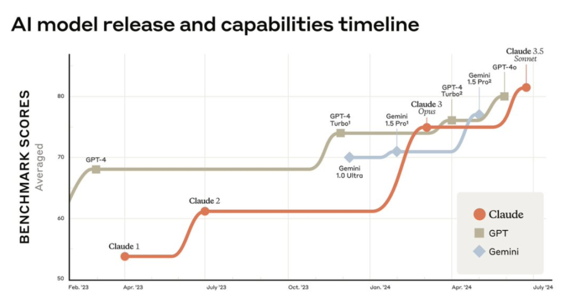
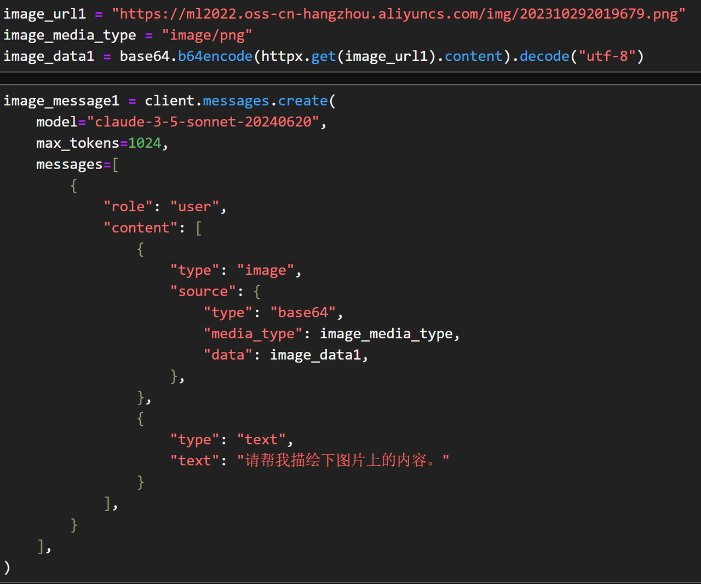
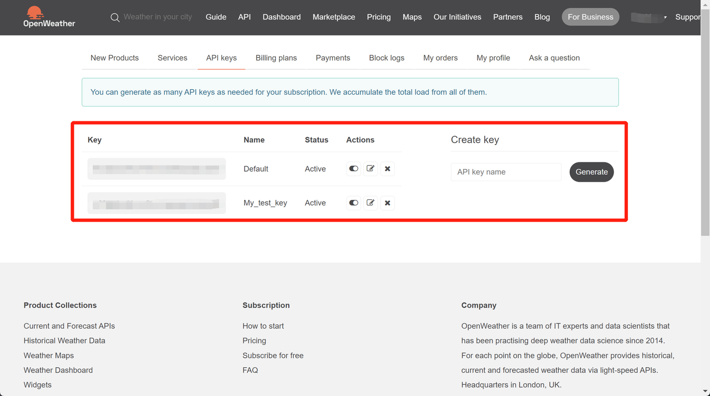
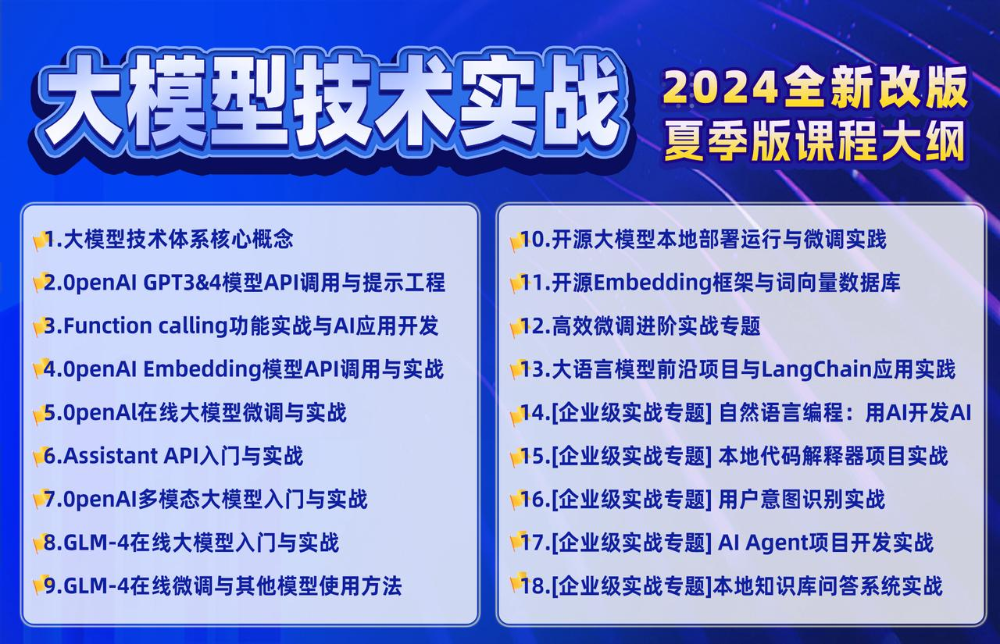

# Claude 3.5快速入门教程

### 1.Claude-3.5模型调用流程

#### 1.1 Claude-3.5文字调用流程

* Claude 3.5模型库安装

```python
!pip install anthropic
```

```python
import anthropic
```

```python
ANTHROPIC_API_KEY='YOUR_API_KEY'
```

* Claude 3.5文字调用流程

```python
client = anthropic.Anthropic(api_key=ANTHROPIC_API_KEY)
```

```python
message = client.messages.create(
    model="claude-3-5-sonnet-20240620",
    max_tokens=1000,
    temperature=0,
    system="你是一位助人为乐的助手。",
    messages=[
        {
            "role": "user",
            "content": [
                {
                    "type": "text",
                    "text": "你好。"
                }
            ]
        }
    ]
)
```

```python
message
```

```plaintext
Message(id='msg_01JPUKo3FZtQz7fFQLuRCJmC', content=[TextBlock(text='您好!很高兴能和您交流。我是一位AI助手,随时准备为您提供帮助。您有什么我可以协助您的吗?无论是回答问题、提供信息,还是讨论某个话题,我都很乐意效劳。请随意告诉我您想聊些什么吧。', type='text')], model='claude-3-5-sonnet-20240620', role='assistant', stop_reason='end_turn', stop_sequence=None, type='message', usage=Usage(input_tokens=24, output_tokens=101))
```

```python
message.content[0].text
```

```plaintext
'您好!很高兴能和您交流。我是一位AI助手,随时准备为您提供帮助。您有什么我可以协助您的吗?无论是回答问题、提供信息,还是讨论某个话题,我都很乐意效劳。请随意告诉我您想聊些什么吧。'
```

* 多轮对话函数

```python
def chat_with_claude(client):
    conversation = []

    while True:
        user_input = input("你: ")
        if user_input.lower() == "exit":
            print("结束对话。")
            break

        conversation.append({
            "role": "user",
            "content": [
                {
                    "type": "text",
                    "text": user_input
                }
            ]
        })

        message = client.messages.create(
            model="claude-3-5-sonnet-20240620",
            max_tokens=1000,
            temperature=0,
            system="你是一位助人为乐的助手。",
            messages=conversation
        )

        assistant_response = message.content[0].text
        print(f"Claude: {assistant_response}")

        conversation.append({
            "role": "assistant",
            "content": [
                {
                    "type": "text",
                    "text": assistant_response
                }
            ]
        })
```

```python
chat_with_claude(client=client)
```

```plaintext
你:  你好，请介绍下你自己


Claude: 您好!我是Claude,一位AI助手。我的目标是帮助人们解决问题、回答问题,并提供有用的信息和见解。我拥有广泛的知识,可以讨论各种话题,但我也有自己的局限性。我会努力以友好、有礼貌的方式与人交流,同时保持客观和诚实。如果您有任何问题或需要帮助,我很乐意为您服务。请问有什么我可以帮到您的吗?


你:  很好，请帮我介绍下什么是机器学习


Claude: 机器学习是人工智能(AI)的一个分支,它专注于开发能够从数据中学习并改进的算法和统计模型。以下是机器学习的一些关键点:

1. 定义: 机器学习是一种让计算机系统通过经验自动改进其性能的方法,而无需明确编程每一步。

2. 核心思想: 让机器从大量数据中识别模式,并用这些模式做出决策或预测。

3. 主要类型:
   - 监督学习: 使用标记的数据集进行训练
   - 无监督学习: 从未标记的数据中发现模式
   - 强化学习: 通过与环境互动来学习最优策略

4. 应用领域: 
   - 图像和语音识别
   - 自然语言处理
   - 推荐系统
   - 金融预测
   - 医疗诊断
   - 自动驾驶等

5. 常用算法:
   - 决策树
   - 神经网络
   - 支持向量机(SVM)
   - K-最近邻(KNN)
   - 聚类算法等

6. 优势: 能处理复杂的非线性问题,可以从大规模数据中学习,能够适应新情况。

7. 挑战: 需要大量高质量的数据,可能存在偏见,解释性有时较差。

机器学习正在快速发展,并在许多领域产生重大影响,推动了人工智能技术的进步。


你:  好的，你还记得我上一个问你的问题是什么嘛？


Claude: 当然记得。您上一个问题是让我介绍自己。您说："你好，请介绍下你自己"。然后我向您介绍了我是谁以及我的一些基本特点和能力。


你:  exit


结束对话。
```

```python
chat_with_claude(client=client)
```

```plaintext
你:  你好，请介绍下你自己


Claude: 您好!我是Claude,一位AI助手。我的目标是帮助人们解决问题、回答问题,并提供有用的信息和见解。我拥有广泛的知识,可以讨论各种话题,但我也有自己的局限性。我会努力以友好、有礼貌的方式与人交流,同时保持客观和诚实。如果您有任何问题或需要帮助,我很乐意为您服务。请问有什么我可以帮到您的吗?


你:  请问我的上一个问题是什么


Claude: 您的上一个问题是"你好，请介绍下你自己"。这是我们对话的开始,您向我问好并要求我做自我介绍。


你:  exit


结束对话。
```

#### 1.2 多模态调用方法

* Claude 3.5多模态调用流程

```python
import base64
import httpx
```

原始图片如下：



```python
image_url = "https://ml2022.oss-cn-hangzhou.aliyuncs.com/img/202406211740876.png"
image_media_type = "image/png"
image_data = base64.b64encode(httpx.get(image_url).content).decode("utf-8")
```

```python
image_message = client.messages.create(
    model="claude-3-5-sonnet-20240620",
    max_tokens=1024,
    messages=[
        {
            "role": "user",
            "content": [
                {
                    "type": "image",
                    "source": {
                        "type": "base64",
                        "media_type": image_media_type,
                        "data": image_data,
                    },
                },
                {
                    "type": "text",
                    "text": "请帮我描绘下图片上的内容。"
                }
            ],
        }
    ],
)
```

```python
image_message
```

```plaintext
Message(id='msg_01P9RNhSLwu5C8MgXmWGSVz7', content=[TextBlock(text='这张图片展示了一个名为"AI模型发布和能力时间线"的图表。它显示了从2023年2月到2024年7月期间不同AI模型的发展和性能变化。\n\n图表中包含三条线，分别代表三个主要的AI模型系列：Claude（红色）、GPT（棕色）和Gemini（蓝色）。纵轴表示"基准分数"，范围从50到80多分。\n\n从图中可以看出：\n\n1. GPT模型在整个时期内保持相对稳定的高分，只在后期有小幅提升。\n2. Claude模型开始时分数较低，但在2023年7月和2024年初有两次显著的性能跃升。\n3. Gemini模型是最后加入竞争的，但很快达到了与其他两个模型相当的水平。\n\n图表还标注了各个模型的不同版本，如Claude 1、Claude 2、GPT-4、GPT-4 Turbo等。\n\n整体趋势显示，所有三个AI模型系列都在这段时间内有了显著的进步，到2024年中期，它们的性能水平趋于接近。\n\n这个图表清晰地展示了AI技术在短时间内的快速发展，以及主要AI公司之间的激烈竞争。', type='text')], model='claude-3-5-sonnet-20240620', role='assistant', stop_reason='end_turn', stop_sequence=None, type='message', usage=Usage(input_tokens=972, output_tokens=391))
```

```python
image_message.content[0].text
```

```plaintext
'这张图片展示了一个名为"AI模型发布和能力时间线"的图表。它显示了从2023年2月到2024年7月期间不同AI模型的发展和性能变化。\n\n图表中包含三条线，分别代表三个主要的AI模型系列：Claude（红色）、GPT（棕色）和Gemini（蓝色）。纵轴表示"基准分数"，范围从50到80多分。\n\n从图中可以看出：\n\n1. GPT模型在整个时期内保持相对稳定的高分，只在后期有小幅提升。\n2. Claude模型开始时分数较低，但在2023年7月和2024年初有两次显著的性能跃升。\n3. Gemini模型是最后加入竞争的，但很快达到了与其他两个模型相当的水平。\n\n图表还标注了各个模型的不同版本，如Claude 1、Claude 2、GPT-4、GPT-4 Turbo等。\n\n整体趋势显示，所有三个AI模型系列都在这段时间内有了显著的进步，到2024年中期，它们的性能水平趋于接近。\n\n这个图表清晰地展示了AI技术在短时间内的快速发展，以及主要AI公司之间的激烈竞争。'
```

```python
print(image_message.content[0].text)
```

```plaintext
这张图片展示了一个名为"AI模型发布和能力时间线"的图表。它显示了从2023年2月到2024年7月期间不同AI模型的发展和性能变化。

图表中包含三条线，分别代表三个主要的AI模型系列：Claude（红色）、GPT（棕色）和Gemini（蓝色）。纵轴表示"基准分数"，范围从50到80多分。

从图中可以看出：

1. GPT模型在整个时期内保持相对稳定的高分，只在后期有小幅提升。
2. Claude模型开始时分数较低，但在2023年7月和2024年初有两次显著的性能跃升。
3. Gemini模型是最后加入竞争的，但很快达到了与其他两个模型相当的水平。

图表还标注了各个模型的不同版本，如Claude 1、Claude 2、GPT-4、GPT-4 Turbo等。

整体趋势显示，所有三个AI模型系列都在这段时间内有了显著的进步，到2024年中期，它们的性能水平趋于接近。

这个图表清晰地展示了AI技术在短时间内的快速发展，以及主要AI公司之间的激烈竞争。
```

下图为[《大模型技术实战课》（夏季班）](https://whakv.xetslk.com/s/4eSM8L) Agent开发案例流程截图：


```python
image_url1 = "https://ml2022.oss-cn-hangzhou.aliyuncs.com/img/202310292019679.png"
image_media_type = "image/png"
image_data1 = base64.b64encode(httpx.get(image_url1).content).decode("utf-8")
```

```python
image_message1 = client.messages.create(
    model="claude-3-5-sonnet-20240620",
    max_tokens=1024,
    messages=[
        {
            "role": "user",
            "content": [
                {
                    "type": "image",
                    "source": {
                        "type": "base64",
                        "media_type": image_media_type,
                        "data": image_data1,
                    },
                },
                {
                    "type": "text",
                    "text": "请帮我描绘下图片上的内容。"
                }
            ],
        }
    ],
)
```

```python
image_message1
```

```plaintext
Message(id='msg_01AamtSvFzxSJ5kzajDFvkDt', content=[TextBlock(text='这张图片是一个复杂的系统架构图或流程图,主要描述了一个名为"chat task decomposition"的系统或项目。图中包含了多个模块和组件,以及它们之间的关系和数据流向。\n\n主要部分包括:\n\n1. 左上角的主模块,标注为"chat task decomposition"。\n\n2. 右上方的一系列功能模块,包括"基础功能层"、"外部调教层"和"可调用函数"等。\n\n3. 中央的几个核心模块,如"Function calling"、"Planing模块"、"Code AI Agent"等。\n\n4. 右侧的"InterProject类"模块,包含了多个方法和属性。\n\n5. 底部的"Action模块"和"MateGen类"。\n\n6. 右下角的"ChatMessages类"模块,包含了消息处理相关的方法。\n\n整个图表通过箭头和线条展示了各个模块之间的交互和数据流向。图中还包含了大量的中文和英文注释,解释了各个模块的功能和作用。\n\n这个图表似乎是描述了一个复杂的聊天系统或AI助手系统的架构,涉及了自然语言处理、函数调用、代码生成、内存管理等多个方面。它展示了系统的整体结构、各个组件的功能以及它们之间的关系,可能用于开发团队的系统设计和文档说明。', type='text')], model='claude-3-5-sonnet-20240620', role='assistant', stop_reason='end_turn', stop_sequence=None, type='message', usage=Usage(input_tokens=1566, output_tokens=433))
```

```python
print(image_message1.content[0].text)
```

```plaintext
这张图片是一个复杂的系统架构图或流程图,主要描述了一个名为"chat task decomposition"的系统或项目。图中包含了多个模块和组件,以及它们之间的关系和数据流向。

主要部分包括:

1. 左上角的主模块,标注为"chat task decomposition"。

2. 右上方的一系列功能模块,包括"基础功能层"、"外部调教层"和"可调用函数"等。

3. 中央的几个核心模块,如"Function calling"、"Planing模块"、"Code AI Agent"等。

4. 右侧的"InterProject类"模块,包含了多个方法和属性。

5. 底部的"Action模块"和"MateGen类"。

6. 右下角的"ChatMessages类"模块,包含了消息处理相关的方法。

整个图表通过箭头和线条展示了各个模块之间的交互和数据流向。图中还包含了大量的中文和英文注释,解释了各个模块的功能和作用。

这个图表似乎是描述了一个复杂的聊天系统或AI助手系统的架构,涉及了自然语言处理、函数调用、代码生成、内存管理等多个方面。它展示了系统的整体结构、各个组件的功能以及它们之间的关系,可能用于开发团队的系统设计和文档说明。
```

接下来是代码阅读：



```python
image_url2 = "https://ml2022.oss-cn-hangzhou.aliyuncs.com/img/202406212243833.png"
image_media_type = "image/png"
image_data2 = base64.b64encode(httpx.get(image_url2).content).decode("utf-8")
```

```python
image_message2 = client.messages.create(
    model="claude-3-5-sonnet-20240620",
    max_tokens=1024,
    messages=[
        {
            "role": "user",
            "content": [
                {
                    "type": "image",
                    "source": {
                        "type": "base64",
                        "media_type": image_media_type,
                        "data": image_data2,
                    },
                },
                {
                    "type": "text",
                    "text": "请帮我描绘下图片上的内容。"
                }
            ],
        }
    ],
)
```

```python
image_message2
```

```plaintext
Message(id='msg_01289eoPmkTYUeXYfvukmjLN', content=[TextBlock(text='这张图片展示了一段Python代码片段。代码似乎是在设置和配置一个用于处理图像的API请求。以下是代码的主要内容：\n\n1. 定义了一个图像URL，指向阿里云OSS存储服务。\n2. 指定了图像的媒体类型为"image/png"。\n3. 使用base64编码处理从URL获取的图像数据。\n4. 创建了一个消息对象，使用"claude-3-5-sonnet-20240620"模型。\n5. 设置了最大令牌数为1024。\n6. 在消息内容中包含了图像数据和一个文本提示。\n7. 文本提示是中文，内容为"请帮我描绘下图片上的内容。"\n\n这段代码看起来是为了准备一个包含图像的API请求，可能是用于图像分析或描述任务。代码使用了一些Python库，如httpx和base64，以及可能是自定义的client对象来创建消息。', type='text')], model='claude-3-5-sonnet-20240620', role='assistant', stop_reason='end_turn', stop_sequence=None, type='message', usage=Usage(input_tokens=1574, output_tokens=306))
```

```python
print(image_message2.content[0].text)
```

```plaintext
这张图片展示了一段Python代码片段。代码似乎是在设置和配置一个用于处理图像的API请求。以下是代码的主要内容：

1. 定义了一个图像URL，指向阿里云OSS存储服务。
2. 指定了图像的媒体类型为"image/png"。
3. 使用base64编码处理从URL获取的图像数据。
4. 创建了一个消息对象，使用"claude-3-5-sonnet-20240620"模型。
5. 设置了最大令牌数为1024。
6. 在消息内容中包含了图像数据和一个文本提示。
7. 文本提示是中文，内容为"请帮我描绘下图片上的内容。"

这段代码看起来是为了准备一个包含图像的API请求，可能是用于图像分析或描述任务。代码使用了一些Python库，如httpx和base64，以及可能是自定义的client对象来创建消息。
```

* 多轮自动对话函数封装

```python
import base64
import httpx

def get_image_data(image_url):
    # 根据图片URL的文件扩展名来确定media_type
    if image_url.endswith(".png"):
        image_media_type = "image/png"
    elif image_url.endswith(".jpg") or image_url.endswith(".jpeg"):
        image_media_type = "image/jpeg"
    else:
        raise ValueError("Unsupported image format. Only PNG and JPEG are supported.")
    
    image_data = base64.b64encode(httpx.get(image_url).content).decode("utf-8")
    return {
        "type": "image",
        "source": {
            "type": "base64",
            "media_type": image_media_type,
            "data": image_data,
        }
    }
```

```python
temp_url = "https://ml2022.oss-cn-hangzhou.aliyuncs.com/img/202406211740876.png"
```

```python
image_content = get_image_data(temp_url)
```

```python
# image_content
```

```python
import re

def extract_image_url(user_input):
    # 使用正则表达式提取URL
    url_pattern = r'(https?://[^\s]+(?:\.png|\.jpg|\.jpeg))'
    match = re.search(url_pattern, user_input)
    if match:
        return match.group(0)
    return None
```

```python
user_input = '你能帮我介绍下这这张图片上的内容么："https://ml2022.oss-cn-hangzhou.aliyuncs.com/img/202406211740876.png"'
```

```python
extract_image_url(user_input)
```

```plaintext
'https://ml2022.oss-cn-hangzhou.aliyuncs.com/img/202406211740876.png'
```

```python
def chat_with_claude(client):
    conversation = []

    while True:
        user_input = input("你: ")
        if user_input.lower() == "exit":
            print("结束对话。")
            break

        image_url = extract_image_url(user_input)
        if image_url:
            image_content = get_image_data(image_url)
            text_content = user_input.replace(image_url, "").strip()
            if text_content == "":
                text_content = "请帮我描绘下图片上的内容。"
            conversation.append({
                "role": "user",
                "content": [image_content, {"type": "text", "text": text_content}]
            })
        else:
            conversation.append({
                "role": "user",
                "content": [
                    {
                        "type": "text",
                        "text": user_input
                    }
                ]
            })

        message = client.messages.create(
            model="claude-3-5-sonnet-20240620",
            max_tokens=1024,
            temperature=0,
            system="你是一位助人为乐的助手。",
            messages=conversation
        )

        assistant_response = message.content[0].text
        print(f"Claude: {assistant_response}")

        conversation.append({
            "role": "assistant",
            "content": [
                {
                    "type": "text",
                    "text": assistant_response
                }
            ]
        })
```

```python
chat_with_claude(client)
```

```plaintext
你:  你好


Claude: 您好!很高兴见到您。我是一位AI助手,随时准备为您提供帮助。请问您今天有什么我可以协助您的吗?无论是回答问题、提供信息,还是讨论某个话题,我都很乐意效劳。


你:  你能帮我介绍下这这张图片上的内容么："https://ml2022.oss-cn-hangzhou.aliyuncs.com/img/202406211740876.png"


Claude: 这张图片展示了一个AI模型发布和能力的时间线图表。图表横轴表示时间，从2023年2月到2024年7月；纵轴表示基准测试分数，范围从50到80多分。

图表追踪了三个主要的AI模型系列的发展:

1. Claude (红色线): 从Claude 1开始，经过Claude 2、Claude 3 Opus，最后到Claude 3.5 Sonnet，显示了持续的性能提升。

2. GPT (棕色线): 从GPT-4开始，经过GPT-4 Turbo、GPT-4 Turbo2，到最后的GPT-4o，同样展现了性能的逐步提高。

3. Gemini (蓝色线): 从Gemini 1.0 Ultra开始，到Gemini 1.5 Pro和Gemini 1.5 Pro2，也呈现出性能的上升趋势。

图表清晰地展示了这些AI模型随时间推移的性能提升。在2024年中期，所有三个模型系列的性能似乎都达到了相近的高水平。

这个时间线图有助于我们理解AI技术的快速发展，以及主要AI公司之间的竞争态势。


你:  好的，从这张图片来看，你觉得现在Claude 3.5 Sonnet性能如何


Claude: 根据图表显示，Claude 3.5 Sonnet 的性能表现非常出色：

1. 最高分数：在2024年7月左右，Claude 3.5 Sonnet 达到了图表中最高的基准测试分数，超过80分。

2. 显著提升：相比之前的 Claude 版本，3.5 Sonnet 展现了明显的性能跃升。

3. 领先地位：在图表的最新时间点，Claude 3.5 Sonnet 的性能曲线位于最顶端，略微领先于 GPT 和 Gemini 的最新版本。

4. 快速进步：从 Claude 3 Opus 到 3.5 Sonnet，性能提升速度很快，曲线陡峭上升。

5. 竞争优势：在AI模型的竞争中，Claude 3.5 Sonnet 似乎处于领先位置，展示了强劲的竞争力。

总的来说，根据这张图表，Claude 3.5 Sonnet 的性能非常强大，不仅在 Claude 系列中表现最佳，而且在整个 AI 模型竞争中也处于领先地位。这表明 Anthropic 公司在 AI 技术发展方面取得了显著进展。


你:  exit


结束对话。
```

### 2.Claude 3.5 Function Calling调用

#### 2.1 获取天气调用API

  为了能够调用OpenWeather服务，和OpenAI的API使用过程类似，我们首先需要先注册OpenWeather账号，并获取OpenWeather API Key。这里需要注意的是，对于大多数在线服务的API来说，都需要通过API key来进行身份验证，尽管OpenWeather相对更加Open，有非常多的免费使用的次数，但身份验证仍然是必要的防止API被滥用的有效手段。OpenWeather API key获取流程如下：

* Step 1.登录OpenWeather官网并点击Sign—>create account完成注册。该网站无需魔法即可直接登录，可以使用国内邮箱或者QQ邮箱均可进行注册，官网地址为：https://openweathermap.org/


&#x20;


* Step 2.获取API-key：注册完成后，即可在API keys页面查看当前账户的API key：


&#x20;



一般来说完成注册后，就会有一个已经激活的API-key。和OpenAI一样，OpenWeather的API key也创建多个。

* Step 3.将其设置为环境变量：和OpenAI API key类似，为了方便后续调用，我们也可以直接将OpenWeather API key设置为环境变量，变量名为OPENWEATHER\_API\_KEY。具体设置环境变量的方法参考Ch.1中OpenAI APkey设置环境变量流程，此处不再赘述。


设置完了环境变量之后，接下来即可按照如下方式创建OpenWeather API key变量：

```python
open_weather_key = os.getenv("OPENWEATHER_API_KEY")
```

需要注意的是，一般来说首次注册用户，首个API key需要等待2-5小时才会被激活，在此期间使用该API key会返回401错误。

#### 2.2 创建天气调用函数

```python
import os
import requests
import json
```

```python
open_weather_key = os.getenv("OPENWEATHER_API_KEY")
```

```python
def get_weather(loc):
    """
    查询即时天气函数
    :param loc: 必要参数，字符串类型，用于表示查询天气的具体城市名称，\
    注意，中国的城市需要用对应城市的英文名称代替，例如如果需要查询北京市天气，则loc参数需要输入'Beijing'；
    :return：OpenWeather API查询即时天气的结果，具体URL请求地址为：https://api.openweathermap.org/data/2.5/weather\
    返回结果对象类型为解析之后的JSON格式对象，并用字符串形式进行表示，其中包含了全部重要的天气信息
    """
    # Step 1.构建请求
    url = "https://api.openweathermap.org/data/2.5/weather"

    # Step 2.设置查询参数
    params = {
        "q": loc,               
        "appid": open_weather_key,    # 输入API key
        "units": "metric",            # 使用摄氏度而不是华氏度
        "lang":"zh_cn"                # 输出语言为简体中文
    }

    # Step 3.发送GET请求
    response = requests.get(url, params=params)
    
    # Step 4.解析响应
    data = response.json()
    return json.dumps(data)
```

```python
get_weather('Beijing')
```

```plaintext
'{"coord": {"lon": 116.3972, "lat": 39.9075}, "weather": [{"id": 804, "main": "Clouds", "description": "\\u9634\\uff0c\\u591a\\u4e91", "icon": "04d"}], "base": "stations", "main": {"temp": 23.94, "feels_like": 23.75, "temp_min": 23.94, "temp_max": 23.94, "pressure": 998, "humidity": 52, "sea_level": 998, "grnd_level": 994}, "visibility": 10000, "wind": {"speed": 1.65, "deg": 283, "gust": 3.3}, "clouds": {"all": 97}, "dt": 1718963284, "sys": {"type": 1, "id": 9609, "country": "CN", "sunrise": 1718916362, "sunset": 1718970378}, "timezone": 28800, "id": 1816670, "name": "Beijing", "cod": 200}'
```

#### 2.3 借助Function calling实现天气信息获取

* 创建tools外部函数集说明文字

```python
get_weather_tool = [
    {
        'name': 'get_weather',
        'description': '查询即时天气函数，使用OpenWeather的API，中国的城市需要使用英文名称',
        'input_schema': {
            'type': 'object',
            'properties': {
                'loc': {
                    'type': 'string', 
                    'description': '需要查询天气的城市的英文名称',
                }
            },
            'required': ['loc'],
        }
    }
]
```

* 创建首次回复first\_response消息

```python
func_call_response = client.messages.create(
    model="claude-3-5-sonnet-20240620",
    max_tokens=1024,
    tools=get_weather_tool,
    messages=[{"role": "user", "content": "请问今天北京天气如何？"}],
)
```

```python
func_call_response
```

```plaintext
Message(id='msg_01FsAdtJcqAZNTbAibVs9HDs', content=[TextBlock(text='好的,我可以帮您查询北京的天气情况。为了获取准确的天气信息,我需要使用天气查询工具。请允许我为您查询。', type='text'), ToolUseBlock(id='toolu_018aBKVYTfuiiw7KLDKwRbwc', input={'loc': 'Beijing'}, name='get_weather', type='tool_use')], model='claude-3-5-sonnet-20240620', role='assistant', stop_reason='tool_use', stop_sequence=None, type='message', usage=Usage(input_tokens=549, output_tokens=107))
```

```python
# 外部函数调用标识符
func_call_response.stop_reason
```

```plaintext
'tool_use'
```

```python
# 返回外部函数调用说明
func_call_response.content[0].text
```

```plaintext
'好的,我可以帮您查询北京的天气情况。为了获取准确的天气信息,我需要使用天气查询工具。请允许我为您查询。'
```

```python
# 外部函数调用信息
func_call_response.content[1]
```

```plaintext
ToolUseBlock(id='toolu_018aBKVYTfuiiw7KLDKwRbwc', input={'loc': 'Beijing'}, name='get_weather', type='tool_use')
```

```python
# 外部函数的函数参数
func_call_response.content[1].input
```

```plaintext
{'loc': 'Beijing'}
```

```python
# 调用外部函数的函数名
func_call_response.content[1].name
```

```plaintext
'get_weather'
```

```python
# 创建外部函数工具集
available_functions = {
            "get_weather": get_weather,
        }
```

```python
# 完成对话需要调用的函数名称
function_name = func_call_response.content[1].name
function_name
```

```plaintext
'get_weather'
```

```python
# 具体的函数对象
fuction_to_call = available_functions[function_name]
fuction_to_call
```

```plaintext
<function __main__.get_weather(loc)>
```

```python
# 执行该函数所需要的参数
function_args = func_call_response.content[1].input
function_args
```

```plaintext
{'loc': 'Beijing'}
```

然后将用户输入信息和模型调用外部函数信息添加至messages列表中：

```python
messages = [{"role": "user", "content": "请问今天北京天气如何？"}]
```

```python
messages
```

```plaintext
[{'role': 'user', 'content': '请问今天北京天气如何？'}]
```

```python
ss = {
    "role": "assistant",
    "content": [
        {
            "type": "text",
            "text": func_call_response.content[0].text
        },
        {
            "type": "tool_use",
            "id": func_call_response.content[1].id,
            "name": func_call_response.content[1].name,
            "input": func_call_response.content[1].input
        }
    ]
}
```

```python
messages.append(ss)
```

* 创建function\_response\_message

```python
function_response = fuction_to_call(**function_args)
```

```python
function_response
```

```plaintext
'{"coord": {"lon": 116.3972, "lat": 39.9075}, "weather": [{"id": 804, "main": "Clouds", "description": "\\u9634\\uff0c\\u591a\\u4e91", "icon": "04d"}], "base": "stations", "main": {"temp": 23.94, "feels_like": 23.75, "temp_min": 23.94, "temp_max": 23.94, "pressure": 998, "humidity": 52, "sea_level": 998, "grnd_level": 994}, "visibility": 10000, "wind": {"speed": 1.65, "deg": 283, "gust": 3.3}, "clouds": {"all": 97}, "dt": 1718964106, "sys": {"type": 1, "id": 9609, "country": "CN", "sunrise": 1718916362, "sunset": 1718970378}, "timezone": 28800, "id": 1816670, "name": "Beijing", "cod": 200}'
```

并将其添加至原始消息列表中：

```python
func_call_response.content[1].id
```

```plaintext
'toolu_018aBKVYTfuiiw7KLDKwRbwc'
```

```python
function_response_message = {
  "role": "user",
  "content": [
    {
      "type": "tool_result",
      "tool_use_id": func_call_response.content[1].id,
      "content": function_response
    }
  ]
}
```

```python
# 追加function返回消息
messages.append(function_response_message)
```

* 创建second\_response\_message

  接下来，再次调用Chat模型来围绕messages进行回答。需要注意的是，此时我们不再需要向模型重复提问，只需要简单的将我们已经准备好的messages传入Chat模型即可：

```python
messages
```

```plaintext
[{'role': 'user', 'content': '请问今天北京天气如何？'},
 {'role': 'assistant',
  'content': [{'type': 'text',
    'text': '好的,我可以帮您查询北京的天气情况。为了获取准确的天气信息,我需要使用天气查询工具。请允许我为您查询。'},
   {'type': 'tool_use',
    'id': 'toolu_018aBKVYTfuiiw7KLDKwRbwc',
    'name': 'get_weather',
    'input': {'loc': 'Beijing'}}]},
 {'role': 'user',
  'content': [{'type': 'tool_result',
    'tool_use_id': 'toolu_018aBKVYTfuiiw7KLDKwRbwc',
    'content': '{"coord": {"lon": 116.3972, "lat": 39.9075}, "weather": [{"id": 804, "main": "Clouds", "description": "\\u9634\\uff0c\\u591a\\u4e91", "icon": "04d"}], "base": "stations", "main": {"temp": 23.94, "feels_like": 23.75, "temp_min": 23.94, "temp_max": 23.94, "pressure": 998, "humidity": 52, "sea_level": 998, "grnd_level": 994}, "visibility": 10000, "wind": {"speed": 1.65, "deg": 283, "gust": 3.3}, "clouds": {"all": 97}, "dt": 1718964106, "sys": {"type": 1, "id": 9609, "country": "CN", "sunrise": 1718916362, "sunset": 1718970378}, "timezone": 28800, "id": 1816670, "name": "Beijing", "cod": 200}'}]}]
```

```python
final_response = client.messages.create(
    model="claude-3-5-sonnet-20240620",
    max_tokens=1024,
    tools=get_weather_tool,
    messages=messages,
)
```

```python
final_response
```

```plaintext
Message(id='msg_01WKiZipB6rVQ1xn9wy6Qvq3', content=[TextBlock(text='根据查询结果，我可以为您提供北京今天的天气情况：\n\n1. 天气状况：多云（阴天）\n2. 温度：目前气温为23.94°C（约24°C）\n3. 体感温度：23.75°C\n4. 湿度：52%\n5. 风速：1.65米/秒，大约是微风\n6. 能见度：10公里，属于良好\n7. 气压：998百帕\n\n总的来说，今天北京的天气是多云的，温度适中，湿度适宜，风力较小。虽然天空较为阴沉，但能见度良好。建议您外出时可能需要带一件薄外套，以防温度变化。如果您有户外活动计划，目前的天气状况还是比较适宜的，但要注意随时关注天气变化。\n\n您还有其他关于天气的问题吗？或者需要了解其他方面的信息吗？', type='text')], model='claude-3-5-sonnet-20240620', role='assistant', stop_reason='end_turn', stop_sequence=None, type='message', usage=Usage(input_tokens=928, output_tokens=289))
```

```python
final_response.content[0].text
```

```plaintext
'根据查询结果，我可以为您提供北京今天的天气情况：\n\n1. 天气状况：多云（阴天）\n2. 温度：目前气温为23.94°C（约24°C）\n3. 体感温度：23.75°C\n4. 湿度：52%\n5. 风速：1.65米/秒，大约是微风\n6. 能见度：10公里，属于良好\n7. 气压：998百帕\n\n总的来说，今天北京的天气是多云的，温度适中，湿度适宜，风力较小。虽然天空较为阴沉，但能见度良好。建议您外出时可能需要带一件薄外套，以防温度变化。如果您有户外活动计划，目前的天气状况还是比较适宜的，但要注意随时关注天气变化。\n\n您还有其他关于天气的问题吗？或者需要了解其他方面的信息吗？'
```

* 定义可调用外部工具的对话函数

```python
def run_conv(question, 
             tools=None, 
             functions_list=None,
             model="claude-3-5-sonnet-20240620"):
    """
    能够自动执行外部函数调用的Chat对话模型
    :return：Chat模型输出结果
    """
    
    user_messages = [
        {
            "role": "user",
            "content": [
                {
                    "type": "text",
                    "text": question
                }
            ]
        }
    ]
    
    # 如果没有外部函数库，则执行普通的对话任务
    if tools == None:
        response = client.messages.create(
            model=model,  
            max_tokens=1000,
            messages=user_messages
        )
        final_response = response.content[0].text
        
    # 若存在外部函数库，则需要灵活选取外部函数并进行回答
    else:
        # 创建外部函数库字典
        available_functions = {func.__name__: func for func in functions_list}

        # 创建包含用户问题的message
        messages = user_messages
        
        # first response
        response = client.messages.create(
            model=model,  
            max_tokens=1024,
            messages=user_messages,
            tools=tools,
        )
        response_message = response

        # 获取函数名
        function_name = response_message.content[1].name
        # 获取函数对象
        fuction_to_call = available_functions[function_name]
        # 获取函数参数
        function_args = response_message.content[1].input
        
        # 将函数参数输入到函数中，获取函数计算结果
        function_response = fuction_to_call(**function_args)

        # messages中拼接first response消息
        ss = {
            "role": "assistant",
            "content": [
                {
                    "type": "text",
                    "text": response_message.content[0].text
                },
                {
                    "type": "tool_use",
                    "id": response_message.content[1].id,
                    "name": response_message.content[1].name,
                    "input": response_message.content[1].input
                }
            ]
        }
        user_messages.append(ss)
        
        # messages中拼接外部函数输出结果
        function_response_message = {
            "role": "user",
            "content": [
              {
                "type": "tool_result",
                "tool_use_id": response_message.content[1].id,
                "content": function_response
              }
            ]
          }
        
        user_messages.append(function_response_message)

        
        # 第二次调用模型
        second_response = client.messages.create(
            model=model,
            max_tokens=1024,
            tools=tools,
            messages=user_messages)
            
        # 获取最终结果
        final_response = second_response.content[0].text
    
    return final_response
```

```python
tools = [
    {
        'name': 'get_weather',
        'description': '查询即时天气函数，使用OpenWeather的API，中国的城市需要使用英文名称',
        'input_schema': {
            'type': 'object',
            'properties': {
                'loc': {
                    'type': 'string', 
                    'description': '需要查询天气的城市的英文名称',
                }
            },
            'required': ['loc'],
        }
    }
]
```

```python
functions_list = [get_weather]
```

* 不开启外部函数对话

```python
run_conv(question='你好', 
         tools=None, 
         functions_list=functions_list)
```

```plaintext
'你好!很高兴见到你。我是Claude,一位AI助手。我可以用中文和你交谈。你今天过得怎么样?有什么我可以帮助你的吗?'
```

* 开启外部函数对话

```python
run_conv(question='请问今天杭州什么天气？', 
         tools=tools, 
         functions_list=functions_list)
```

```plaintext
'根据查询结果，我可以告诉您杭州今天的天气情况如下：\n\n1. 温度：当前温度为31.95°C（约89.5°F）。\n2. 天气状况：小雨。\n3. 湿度：93%。\n4. 风速：1.76米/秒（约6.3公里/小时）。\n5. 能见度：10公里。\n6. 气压：1000百帕。\n\n总体来说，杭州今天的天气炎热潮湿，有小雨。温度很高，体感温度可能会更高，达到38.95°C（约102°F）。建议您外出时带伞，注意防暑降温，多喝水，避免长时间在户外活动。如果需要外出，最好穿轻薄、透气的衣物，并做好防晒措施。\n\n您还有其他关于天气的问题吗？或者需要了解其他城市的天气情况吗？'
```

* 综合多轮对话机器人&多模态对话机器人&调用Function calling对话机器人

```python
import base64
import re
import httpx
from some_claude_api_library import ClaudeClient  # 替换为实际的Claude大模型API库名

def get_image_data(image_url):
    if image_url.endswith(".png"):
        image_media_type = "image/png"
    elif image_url.endswith(".jpg") or image_url.endswith(".jpeg"):
        image_media_type = "image/jpeg"
    else:
        raise ValueError("Unsupported image format. Only PNG and JPEG are supported.")
    
    image_data = base64.b64encode(httpx.get(image_url).content).decode("utf-8")
    return {
        "type": "image",
        "source": {
            "type": "base64",
            "media_type": image_media_type,
            "data": image_data,
        }
    }

def extract_image_url(user_input):
    url_pattern = r'(https?://[^\s]+(?:\.png|\.jpg|\.jpeg))'
    match = re.search(url_pattern, user_input)
    if match:
        return match.group(0)
    return None

def run_conv(question, tools=None, functions_list=None, model="claude-3-5-sonnet-20240620"):
    """
    能够自动执行外部函数调用的Chat对话模型，并支持多轮对话
    :return：Chat模型输出结果
    """
    client = ClaudeClient(api_key="your_api_key_here")  # 替换为实际的API key
    conversation = []

    def chat_with_claude(conversation, user_messages):
        conversation.extend(user_messages)
        response = client.messages.create(
            model=model,
            max_tokens=1024,
            messages=conversation,
            tools=tools,
        )
        return response

    while True:
        user_input = input("你: ")
        if user_input.lower() == "exit":
            print("结束对话。")
            break

        user_messages = []

        image_url = extract_image_url(user_input)
        if image_url:
            image_content = get_image_data(image_url)
            text_content = user_input.replace(image_url, "").strip()
            if not text_content:
                text_content = "请帮我描绘下图片上的内容。"
            user_messages.append({
                "role": "user",
                "content": [image_content, {"type": "text", "text": text_content}]
            })
        else:
            user_messages.append({
                "role": "user",
                "content": [
                    {
                        "type": "text",
                        "text": user_input
                    }
                ]
            })

        response = chat_with_claude(conversation, user_messages)
        response_message = response.content

        if response.stop_reason == 'tool_use' and functions_list is not None:
            available_functions = {func.__name__: func for func in functions_list}
            function_name = response_message[1].name
            function_to_call = available_functions.get(function_name)
            function_args = response_message[1].input

            if function_to_call:
                function_response = function_to_call(**function_args)
                conversation.append({
                    "role": "assistant",
                    "content": [
                        {
                            "type": "text",
                            "text": response_message[0].text
                        },
                        {
                            "type": "tool_use",
                            "id": response_message[1].id,
                            "name": function_name,
                            "input": function_args
                        }
                    ]
                })
                conversation.append({
                    "role": "user",
                    "content": [
                        {
                            "type": "tool_result",
                            "tool_use_id": response_message[1].id,
                            "content": function_response
                        }
                    ]
                })
                second_response = chat_with_claude(conversation, [])
                final_response = second_response.content[0].text
            else:
                final_response = "Function not found."
        else:
            conversation.append({
                "role": "assistant",
                "content": response_message
            })
            final_response = response_message[0].text

        print(f"Claude: {final_response}")

if __name__ == "__main__":
    run_conv(question="初始问题", tools=None, functions_list=None)
```

```python
def run_conv(question, 
             client,
             tools=None, 
             functions_list=None, 
             model="claude-3-5-sonnet-20240620"):
    """
    能够自动执行外部函数调用的Chat对话模型，并支持多轮对话
    :return：Chat模型输出结果
    """
    conversation = []

    def chat_with_claude(conversation, user_messages):
        conversation.extend(user_messages)
        response = client.messages.create(
            model=model,
            max_tokens=1024,
            messages=conversation,
            tools=tools,
        )
        return response

    while True:
        user_input = input("你: ")
        if user_input.lower() == "exit":
            print("结束对话。")
            break

        user_messages = []

        image_url = extract_image_url(user_input)
        if image_url:
            image_content = get_image_data(image_url)
            text_content = user_input.replace(image_url, "").strip()
            if not text_content:
                text_content = "请帮我描绘下图片上的内容。"
            user_messages.append({
                "role": "user",
                "content": [image_content, {"type": "text", "text": text_content}]
            })
        else:
            user_messages.append({
                "role": "user",
                "content": [
                    {
                        "type": "text",
                        "text": user_input
                    }
                ]
            })

        response = chat_with_claude(conversation, user_messages)
        response_message = response.content

        if response.stop_reason == 'tool_use' and functions_list is not None:
            available_functions = {func.__name__: func for func in functions_list}
            function_name = response_message[1].name
            function_to_call = available_functions.get(function_name)
            function_args = response_message[1].input

            if function_to_call:
                function_response = function_to_call(**function_args)
                conversation.append({
                    "role": "assistant",
                    "content": [
                        {
                            "type": "text",
                            "text": response_message[0].text
                        },
                        {
                            "type": "tool_use",
                            "id": response_message[1].id,
                            "name": function_name,
                            "input": function_args
                        }
                    ]
                })
                conversation.append({
                    "role": "user",
                    "content": [
                        {
                            "type": "tool_result",
                            "tool_use_id": response_message[1].id,
                            "content": function_response
                        }
                    ]
                })
                second_response = chat_with_claude(conversation, [])
                final_response = second_response.content[0].text
            else:
                final_response = "Function not found."
        else:
            conversation.append({
                "role": "assistant",
                "content": response_message
            })
            final_response = response_message[0].text

        print(f"Claude: {final_response}")
```

```python
run_conv(question='你好', 
         client=client,
         tools=tools, 
         functions_list=functions_list)
```

```plaintext
你:  你好，请介绍下你自己


Claude: 您好!很高兴与您交流。我是一个AI助手,由Anthropic公司开发。我的目标是通过友好和有帮助的对话来协助人类。我可以回答问题、提供信息、帮助解决问题,以及就各种话题进行讨论。

我拥有广泛的知识,涵盖科学、历史、文化、技术等多个领域。但我并不是全知全能的,有些事情我也不确定或不了解。在这种情况下,我会坦诚地告诉您我的局限性。

作为一个AI,我没有人类那样的情感或个人经历。我的回答是基于我被训练的数据和算法生成的。我会尽力提供准确、有用的信息,但有时可能会出错,所以请您保持批判性思维。

我很乐意为您提供帮助,无论是回答问题、提供建议,还是简单地聊天。您有什么我可以帮到您的吗?


你:  好的，这张图上最佳性能的模型是哪个呢？图片地址：https://ml2022.oss-cn-hangzhou.aliyuncs.com/img/202406211740876.png


Claude: 根据这张AI模型发布和能力时间线图，截至图表显示的最新时间点（2024年7月左右），性能最佳的模型是Claude 3.5 Sonnet。

从图表中可以看出：

1. Claude（红色线）在最后时间点达到了最高的基准分数，大约83-84分左右。

2. GPT系列（灰色线）的最新版本GPT-4o略低于Claude 3.5 Sonnet，但也达到了很高的分数，约82分左右。

3. Gemini系列（蓝色线）的最新版本Gemini 1.5 Pro²也达到了很高的分数，但略低于Claude和GPT的最新版本，大约在80分左右。

需要注意的是，这个图表展示的是模型发布的时间线和它们在某些基准测试上的平均得分。虽然Claude 3.5 Sonnet在这个特定的评估中得分最高，但在实际应用中，不同模型可能在不同任务上有各自的优势。此外，AI技术发展迅速，这个排名可能会随着新模型的发布而改变。


你:  你知道Claude的母公司是哪个么？


Claude: 是的,我知道。Claude的母公司是Anthropic。

Anthropic是一家美国人工智能公司,成立于2021年。它专注于开发安全和道德的AI系统,其中最著名的产品就是Claude AI助手。

Anthropic的创始团队包括一些前OpenAI的研究人员,他们致力于发展"宪法AI"(Constitutional AI)的理念,旨在创建更安全、更可控、更符合道德标准的AI系统。

作为Anthropic开发的AI助手,我对公司的具体运营细节并不了解,但我知道Anthropic一直在努力推进AI技术的发展,同时也非常重视AI的安全性和道德性。


你:  这家公司所在地今天天气如何呢？


Claude: 根据查询结果,旧金山(San Francisco)今天的天气情况如下:

1. 温度: 目前温度为10.49°C (约50.88°F)
2. 天气状况: 阴天,多云
3. 湿度: 91%
4. 风速: 4.63 m/s (约10.36 mph)
5. 能见度: 10000米,表示能见度良好

总的来说,今天旧金山的天气比较凉爽,天空多云。虽然温度不算很低,但由于湿度较高,可能会感觉略微潮湿。天气整体来说适合外出活动,但可能需要准备一件外套,以防感到凉意。

需要注意的是,旧金山的天气可能会在一天内有所变化,特别是考虑到它靠近海岸的地理位置。如果有人计划在旧金山外出,最好随时关注最新的天气预报。


你:  exit


结束对话。
```

***

* 体验课内容节选自《2024大模型技术实战》（夏季班）完整版付费课程

  体验课时间有限，若想深度学习大模型技术，欢迎大家报名有我主讲的[《2024大模型技术实战课》(夏季班)](https://whakv.xetslk.com/s/4eSM8L)：


**[《大模型技术实战课》（夏季班）](https://whakv.xetslk.com/s/4eSM8L)为【100+小时】体系大课，总共十八大模块精讲精析，零基础直达大模型企业级应用！**



**此外为持续保证学员大模型技术竞争力，课程实时追更最新大模型技术进展，近期额外新增增了GPT-4o、Qwen2系列模型和GLM-4-9B，以及RAG企业级项目实战最新前沿技术内容！课程大纲获取、领取体验课学员专享优惠券，扫码添加客服小可爱(微信：littlecat\_1207)，回复“大模型”，即咨询课程信息哦👇**


***


