**Claude 3.5 账号注册与API-KEY获取流程**

一、Claude 3.5模型基本情况介绍

三、Claude 3.5 辅助邮箱注册流程   1.开启网络工具，使用全局代理 2.微软outlook邮箱注册

四、Claude账号注册与API-KEY获取方法 1.Claude-Chat账号注册

## &#x4E00;**、 Claude 3.5模型基本情况介绍                                     &#x20;**

·**&#x20; Claude 3.5大模型重磅发布，最强大模型新王登基**

当地时间6月21号，Anthropic公司正式发布了Claude3系列模型的升级版—Claude 3.5，并在  此超越GPT系列模型，根据官方评测结果， Claude 3.5 Sonnet （中杯）模型的各方面性能都已经全 方位超越GPT4o模型，并且价格更低、响应速度更快，作为OpenAI公司最强的竞争对手之一，

Claude系列模型一直在追赶GPT系列模型，并且本次Anthropic公司只公布了中号模型的升级版，

对于更大号的模型Opus，尚未发布3.5版本。外媒普遍猜测该模型将用于应对未来OpenAI即将发布 的更强大的模型：

**·  Claude 3.5 模型API全面开放使用**

在新模型发布的同时， Claude 3.5 Sonnet模型API也已经全面上线，现在对于广大开发人员来 说已经可以在代码环境中调用这一性能强悍的模型了：

并且模型的多模态功能也同步上线：

当然，对标ChatGPT的、基于Claude 3的网页端聊天对话机器人也同步开放使用：

**·  Claude 3.5模型使用障碍**

不过遗憾的是，尽管Claude 3.5模型本身支持中文，但和OpenAI类似（全美的大模型技术公司 都是如此）， Anthropic也对大陆采取了技术封锁的措施，这使得大陆地区开发者如果要使用

Claude 3.5模型，则必须先准备网络工具。本文将介绍在**准备好网络工具**，并提前开设全局代理的 情况下，如何注册Claude 3.5账号，并在本地代码环境调用Claude 3模型。

Anthropic公司创始团队和OpenAI初创团队“ 同宗同源” ，因此Claude 3.5模型和GPT系列模型 几乎是镜像式相似，无论是账号注册流程、模型调用流程，还是官网设计，甚至是API说明文 档的编写格式都高度类似，因此熟悉OpenAI账户注册的小伙伴，对Claude 3账户注册流程肯 定也不会感到陌生。

**·  Claude 3.5封号潮**

出于某种原因，Anthropic公司目前对账号管控非常严格，哪怕是使用了稳定的网络工具，有  些账号仍然会被检测到异常并导致封号。这点和去年GPT-4发布之后OpenAI展开的封号行动类似。 因此在完成注册后，也需低调使用。本教程仅供大模型技术学习和模型性能测试使用。

**·  Claude 3.5注册费用**

Claude 3.5目前为每位注册用户都提供了5美元的试用额度，因此前期调用Claude 3.5模型是  没有任何花费的。不过在注册的过程中需要使用虚拟手机号服务，需要花费5-10元RMB。之后在调 用Claude 3.5模型时，按照使用程度进行付费即可（和OpenAI GPT系列模型完全一样）。

## **二、SMS-active账号注册                                               &#x20;**

在稍后的Claude 3注册流程中，会反复涉及手机号验证的环节，这里我们就需要使用代理服

务，来使用其他国家地区的手机号来接收验证码，进而完成账户注册。这里推荐使用SMS进行其他  国家地区手机号的验证和激活，登录<https://sms-activate.org/>，即可完成相关服务的购买。点击进 入sms-active：

首次登录时点击左上方小人图标，进行注册，这里可以使用国内QQ邮箱或者outlook邮箱进行注 册，大家自行完成注册即可：

注册完成后，需要注意，该网站提供的手机号是根据不同服务需求来匹配和分发的的，而在申请手   机号之前，我们需要往这个账户里面充值，这里可以使用支付宝进行充值，并且只需要充值2美金即 可使用较长一段时间：

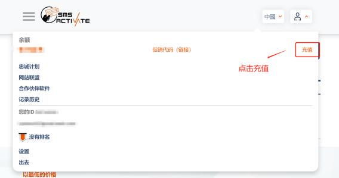

点击支付宝进行充值：

然后选择支付2美金：

然后扫码完成支付即可。

早年OpenAI未火之时，最低充值额度是1美金\~

至此我们就完成了SMS账号注册与储值，接下来我们将借助SMS平台来完成手机号验证。

## **三、 Claude 3.5 辅助邮箱注册流程                                     &#x20;**

接下来开始进入到Claude 3.5 注册流程中。需要注意的是， Claude平台并不是传统意义的通过账号  和密码登录，而是通过注册邮箱+邮箱验证码的形式进行登录，因此需要首先完成邮箱注册，且根据现阶  段使用情况来看，微软outlook邮箱和hotmail邮箱相对稳定，这里推荐使用outlook邮箱进行Claude账户

注册，并且在邮箱注册过程中使用国外虚拟手机号进行验证。

### **1.开启网络工具，使用全局代理**

### **2.微软outlook邮箱注册**

接下来介绍outlook邮箱注册流程：&#x20;

·**&#x20;&#x20;**&#x20;Step 1.开启无痕浏览模式

为了确保能顺利完成注册，推荐使用谷歌浏览器，并开启无痕浏览模式：

.  Step 2.进行outlook邮箱注册

然后在网址栏输入： [www.outlook.com](http://www.outlook.com/) ，进入outlook官网，并点击“创建免费账户”：

然后点击同意并继续

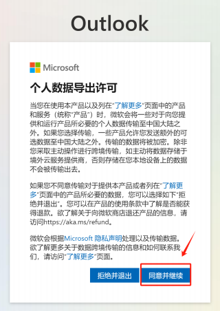

然后选择输入的邮箱名称，自定义名称即可：

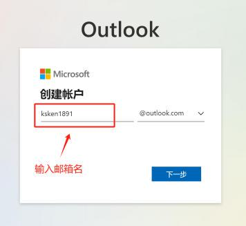

然后输入密码：

填写姓名，随意填写即可：

设置国家和地区。在全局代理开启的情况下，默认地区就是代理地址。这里推荐选择美国、英格兰 或者巴西均可，方便后面使用对应地区虚拟手机号进行验证：

接下来就进入到手机号验证环节。需要注意的是，尽管这里可以使用中国地区手机号进行验证，但 为了保险起见，最好还是使用其他国家地区的虚拟手机号完成验证。这里需要借助SMS-active平台 进行手机号验证。

·**&#x20;&#x20;**&#x53;tep 3.虚拟手机号验证

接下来回到SMS-Active页面，在页面左侧的服务选择中输入Microsoft，找到能够用于辅助 Microsoft产品注册的虚拟手机号：

点击下方Microsoft，即可查看到一系列不同地区的虚拟手机号，这里可以选择巴西，然后点击右侧 红色购物车按钮，即可租赁一个虚拟手机号：

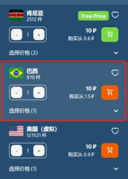

在页面的中间能看到租赁到的虚拟手机号，其中+55是国家编号，之后的数字就是具体的手机号：

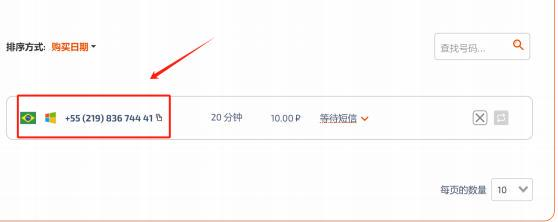

复制手机号并输入到outlook邮箱注册页面，点击发送验证码：

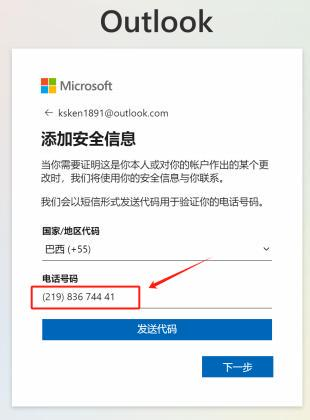

然后回到SMS-Active页面，稍等片刻即可查看到当前手机号接收到的验证码：

将验证码输入到outlook邮箱注册页面，即可完成注册。

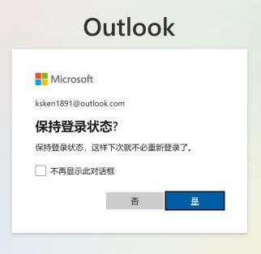

.  Step 4.登录outlook邮箱

需要注意的是，如果完成注册后页面没有自动跳转，则在浏览器地址栏再次输入outlook.com 进行登录即可。登陆后邮箱页面如下：

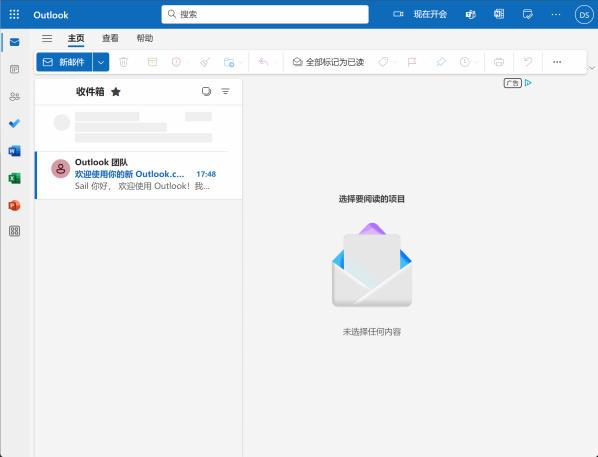

至此，我们就完成了outlook邮箱注册全流程，接下来我们将使用该邮箱完成Claude账号注册。

## **四、 Claude账号注册与API-KEY获取方法                           &#x20;**

和OpenAI产品架构类似， Claude的账号体系同样也是分为Claude-Chat账号和Claude API账号，就  类似于ChatGPT账号和GPT API账号。在注册Claude时需要同时注册Claude-Chat账号和Claude API账号 才可稳定运行。因此这里先进行Claude-Chat账号注册，然后再进行Claude API账号绑定。尽管看起来像

是两次注册，但流程基本一致，整个过程并不复杂。

### **1.Claude-Chat账号注册**

[Claude-Chat是一个基于Claude模型的网页端聊天机器人，功能定位和ChatGPT类似。点击链接： https://claude.ai/即可进入到Claude-Chat登录页面。在登录页面中输入刚才注册的outlook邮箱地址：](https://claude.ai/)

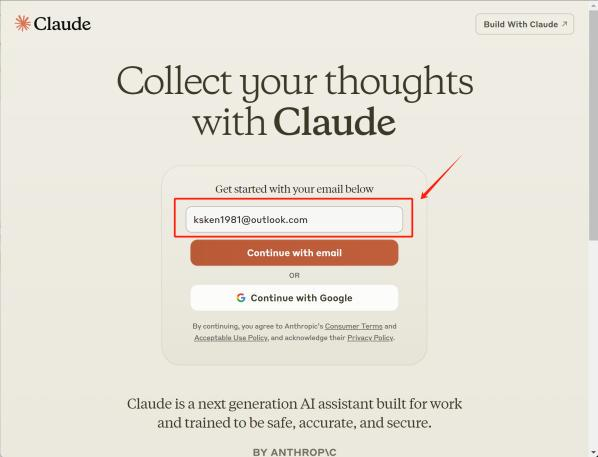

然后点击发送验证码。回到outlook邮箱页面接收验证码：

将验证码输入到Claude-Chat注册页面中：

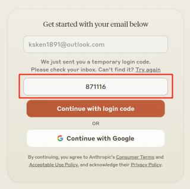

在完成邮箱验证之后，还需要绑定手机号。这里同样是需要使用SMS-Active借助虚拟手机号完成验证：

回到SMS-Active页面，点击左侧服务选择，在搜索栏输入Claude，点击Claude搜索结果：

即可查看目前全部可以用于Claude账户注册的各地区手机号。这里可以使用英格兰地区手机号，点击右 侧购物车按钮，即可租赁英格兰地区虚拟手机号：

租赁完成后在页面中央查看并复制手机号：

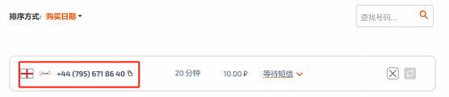

将手机号输入到Claude-Chat注册页面中：

并点击发送验证码。回到SMS-Active页面查看验证码：

将验证码输入到Claude-Chat注册页面中即可完成注册。：

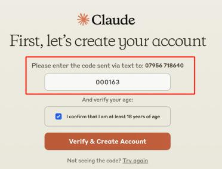

注册完成之后，会自动弹出一个简单的欢迎页面，其中会介绍Claude模型基本情况，以及需要用户输入 一个合适的对用户自己的称呼：

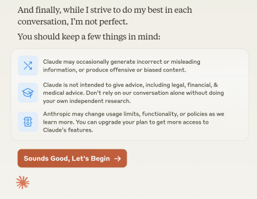

一路点击，即可最终进入到Claude-Chat聊天页面：

至此， Claude-Chat账户注册全部完成。需要注意的是，下次登录时还会需要通过邮箱验证码进行登录， 但无需再进行手机号验证。同时，再默认的免费模式下，  Claude-Chat只能调用Sonnet模型（Claude 3  的中号模型）进行对话，若想调用Opus（ Claude 3的大号模型），则需要进行付费订阅， 20刀/月升级  到Pro版。在当前页面中，点击下方的upgrade to Claude Pro，绑定银行卡（国内用户需要使用虚拟信  用卡）即可完成升级。

### **2.Claude API模型账户绑定**

在完成了Claude-Chat账户注册之后，接下来继续完成Claude API账户绑定（绑定到Claude-Chat账  户中）。点击右侧链接： <https://console.anthropic.com/> 进入到Claude模型控制台页面。首次进入会提 示完成注册，这里使用和Claude-Chat账户相同的邮箱即可完成账号绑定，无需再次进行手机号验证：

这里输入此前注册的outlook邮箱即可完。然后回到outlook邮箱主页查看收到的验证码：

将该验证码输入到Claude API账户注册页面即可完成账号绑定。由于该账号已经注册了Claude-Chat，因 此无需再次进行手机号验证。接下来会直接进入到一个设置组织名称（所在公司名称）的环节，这里随   便输入一个公司名称即可：

然后点击创建账户，即可进入到Claude API账户控制台（主页）：

至此便完成了Claude API账户注册流程。

### **3.Claude API账户升级与API-Key创建**

· Claude API账户升级

刚注册完的Claude API账户是免费账户，需要领取初始免费赠送的额度才可顺利调用Claude 3系列模 型。这里点击页面上方的Claim按钮免费领取5刀额度：

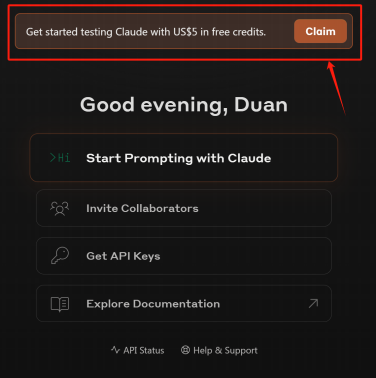

点击之后会要求进行手机号验证。

这里我们再次使用SMS-Active进行手机号验证。这里可以继续使用此前租赁的手机号（如果没过期的    话，刷新即可再次接收验证码），也可以再租赁一个新的手机号都可以。这里重新租赁了一个新的手机 号，注意还是需要选择用于支持Claude的手机号：

输入手机号：

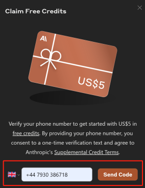

接收验证码：

输入验证码：

再次回到主页面时即代表已经完成5刀免费额度领取：

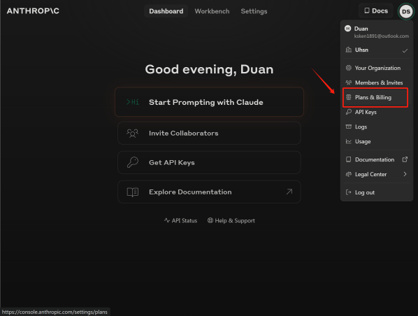

此时我们点击右上方个人头像—>Plans\&Billing，即可查看当前账户剩余额度：

能够看到目前已成功领取5刀免费额度，至此便完成了账号升级，接下来可以尝试创建Claude 3模型API- KEY并在本地环境进行调用了。

· Claude模型API-KEY创建方法

在当前页面，点击左侧API Keys，然后点击Create Key，即可创建一个新的API-Key：

输入新的API-Key名称（随便取名即可），点击Create Key：

创建完成后会返回完整Key字符串列表，点击复制，并在安全位置保存即可：

至此就完成了API-Key创建。

### **4.Claude模型API的本地代码环境调用测试**

· Step 1.设置代理环境

最后，我们需要在代码环境中简单验证当前API-Key是否能顺利调用。在开启全局代理模式的情况   下，确定当前代理的代理端口，然后打开Jupyter （或者其他Python编程IDE），先输入以下代码开启代 理环境：

| import os# 设置环境变量os.environ\['HTTP\_PROXY'] = 'http://127.0.0.1:YOUR\_PROXY'  os.environ\['HTTPS\_PROXY'] = 'http://127.0.0.1:YOUR\_PROXY' |
| ------------------------------------------------------------------------------------------------------------------------------------------ |

代码中的 PROXY 需要换成自己的代理端口，例如我的代理端口是10080，则运行如下代码：

此外，也可以在cmd环境中启动Jupyter，并在启动Jupyter之前通过set命令设置Jupyter运行的默 认代理环境。

.  Step 2.anthropic库安装与导入

anthropic库是用于支持Claude模型调用的SDK，在Jupyter页面中可以按照如下方式进行安装：

| ! pip install anthropic |
| ----------------------- |

此外也可以在cmd中进行安装。

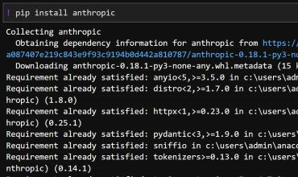

安装完成后即可导入anthropic库：

| import anthropic |
| ---------------- |

· Claude 3.5模型API本地调用

完成了一系列准备工作之后，接下来即可尝试在代码环境中调用Claude 3 opus模型。首先我 们需要先实例化一个Claude模型客户端（Client），并输入API-Key用于身份验证：

| client = anthropic.Anthropic(api\_key="YOUR\_API\_KEY", ) |
| --------------------------------------------------------- |

上面的 YOUR\_API\_KEY 需要替换为自己的API-Key字符串。

然后尝试调用Claude 3 opus模型：

| message = client.messages.create(model="claude-3-5-sonnet-20240620"max\_tokens=1000, temperature=0,system="你是一位助人为乐的助手。",messages=\[ {"role": "user", "content": \[{ | , |
| -------------------------------------------------------------------------------------------------------------------------------------------------------------------- | - |
| "type": "text", "text": "你好。"} ]}] )message.content\[0].text                                                                                                         |   |

其中 claude-3-5-sonnet-20240620是Claude 3 Opus模型编号，从调用代码来看， Claude 3.5模 型调用整体风格和OpenAI GPT系列模型完全一样。若上述代码能返回打印结果，则说明调用成

功：

至此我们就完成了Claude账户注册与API调用的全流程。

📍**更多大模型技术内容学习**

**扫码添加助理英英，回复“大模型”，了解更多大模型技术详情哦👇**

此外，**扫码回复“入群”**，即可加入**大模型技术社群：海量硬核独家技术`干货内容`+无门槛`技术交流`！**

