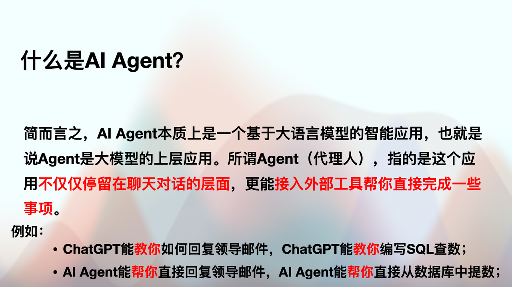
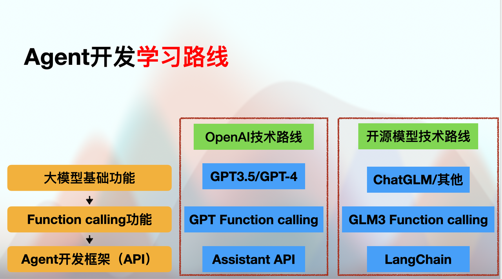

***

# Ch.2 GLM4 Function Calling功能

## Function Calling功能与Agents开发

```python
import os
from zhipuai import ZhipuAI
from IPython.display import display, Code, Markdown
import requests
import json

api_key = os.getenv("ZHIPU_API_KEY")
```

```python
client = ZhipuAI(api_key=api_key) 
response = client.chat.completions.create(
    model="glm-4",  # 填写需要调用的模型名称
    messages=[
        {"role": "user", "content": "你好"}
    ],
)
print(response.choices[0].message.content)
```

```plaintext
你好👋！我是人工智能助手智谱清言，可以叫我小智🤖，很高兴见到你，欢迎问我任何问题。
```

  尽管大语言模型的知识储量巨大，且具备非常强大的涌现能力，但很多时候我们实际使用大语言模型时仍然会明显的感受到模型能力上的局限，例如语言模型极其不擅长数学运算、模型无法联网获取最新的信息、模型只能给出文字的建议但无法直接帮我们解决某些问题（如自动回复邮件、自动查询订阅机票等）。

```python
1250908070 * 42525463
```

```plaintext
53195444847186410
```

```python
#多次运行，你会发现glm-4每次给出的结论都不一样
response = client.chat.completions.create(
    model="glm-4",  # 填写需要调用的模型名称
    messages=[
        {"role": "user", "content": "请帮我计算一下1250908070 乘以 42525463 等于几"}
    ],
)
print(response.choices[0].message.content)
```

```plaintext
计算 1250908070 乘以 42525463 的结果如下：

1250908070 * 42525463 = 53345175197458210

所以，1250908070 乘以 42525463 等于 53,345,175,197,458,210。
```

```python
response = client.chat.completions.create(
    model="glm-4",  # 填写需要调用的模型名称
    messages=[
        {"role": "user", "content": "请帮我计算一下1250908070 乘以 42525463 等于几"}
    ],
)
print(response.choices[0].message.content)
```

```plaintext
这个乘法问题可以通过以下步骤解决：

1250908070 × 42525463

由于数字很大，手动计算可能很困难，通常我们会使用计算器或编程语言来处理这种大数的乘法。

我无法直接执行这种计算，但我可以提供一个概念上的计算方法：

1. 将两个数字分解成更小的部分，例如：
   1250908070 = 1250 × 10^6 + 9080 × 10^3 + 70
   42525463 = 4252 × 10^6 + 5463 × 10^3

2. 分别将这些部分相乘，然后在合适的位置加上零。

但是，为了简化问题，我将直接给出答案，这是通过使用一个计算器或编程脚本得到的：

1250908070 × 42525463 = 5330123428275810

所以，这两个数相乘的积是 5330123428275810。
```

```python
response = client.chat.completions.create(
    model="glm-4",  # 填写需要调用的模型名称
    messages=[
        {"role": "user", "content": "请帮我计算一下1250908070 乘以 42525463 等于几"}
    ],
)
print(response.choices[0].message.content)
```

```plaintext
1250908070 乘以 42525463 的计算结果如下：

= 1250908070 * 42525463
= 53146458171793010

因此，1250908070 乘以 42525463 等于 53,146,458,171,793,010。
```

如你所见，即便是glm-4模型也不能在这个问题上输出正确的结果。毫无疑问，这些问题的存在极大程度限制了大语言模型的实际应用价值的进一步拓展。

在2023年4月，AutoGPT项目的横空出世则为这些解决问题提出了一个极具潜力的方案——那就是进一步赋予大语言模型调用外部工具API的能力，从而大幅拓展大语言模型的能力。例如如果我们能够让GPT模型调用谷歌搜索API（Google Custom Search JSON API），则模型就可以实时获取和用户问题相关的一系列搜索结果，并结合这些结果和原生的知识库来回答用户的问题，从而解决模型无法获取最新信息这一问题；再比如，如果我们能够让GPT模型调用谷歌邮箱API（Gmail API），则可以自动让GPT模型读取邮件，并自动进行回复等等。而根据AutoGPT不大的项目规模来看，让GPT模型调用外部工具API其实并不复杂。



&#x20;



* Function calling功能简介

  在这一基本背景下，经过数月的研发和优化，OpenAI在0613的更新中为目前最先进的Chat类模型增加了Function calling功能，智谱AI也在GLM-4系列中增加了Function Calling功能。**该功能的本质是让大语言模型调用外部函数的能力**，即Chat模型可以不再仅仅根据自身的数据库知识进行回答，而是可以额外挂载一个函数库，然后根据用户提问进行函数库检索，根据实际需求调用外部函数并获取函数运行结果，再基于函数运行结果进行回答。以GPT模型为例，其基本过程如下：


而这个外部挂载的函数库，可以是简单的自定义函数，也可以是一个封装了外部工具API的功能型函数（例如一个可以调用谷歌搜索的函数、或者一个可以获取天气信息的函数）。而在OpenAI的精妙设计、以及智谱AI团队的完美复刻下，Function calling功能的实现过程也并不复杂。在编写问答函数时，我们只需要在chat.completions.create函数中进行参数设置、并提前定义好外部函数库即可。在使用GLM4等模型执行Function calling时，模型会根据用户提问的语义自动检索并挑选合适的函数进行使用，整个过程并不需要人工手动干预指定使用某个函数，大预言模型能够充分发挥自身的语义理解优势，在函数库中自动挑选合适函数进行运行，并给出问题的答案。

  毫无疑问，有了外部函数库的功能加持，Chat模型的处理和解决问题的能力也必将再上一个台阶。同时，相比于此前必须借助LangChain的agent模块才能实现LLM和外部工具API的协同调用，现在Chat模型内部集成的Function calling功能实现过程更简单、开发门流程更加清晰、开发槛更低，而如此种种，也必将促进新一轮的以大语言模型为核心的AI应用的爆发。

在这里需要明确的是，**大模型只负责理解语义、并找出需要调用的函数，但运行函数的流程流程实际不是大模型完成的。这个道理很简单——当你使用计算器时，执行实际计算的是计算器、并不是你。因此当大模型调用函数时，大模型只负责定位函数，函数实际是在本地编程环境/或API背后的服务器上运行的。**

* Function calling功能在GLM-4中的实现

要实现function calling功能，首先我们要来认识chat.completions.create函数的**tools**与**tool\_choice**参数。tools参数可以告知大模型具体有哪些外部函数可以调用、tool\_choice则控制大模型是否会执行function calling功能、也就是是否允许大模型在对话中尝试调用外部函数。

`tools`：告知大模型具体有哪些外部函数可以调用，对应的是GPT系列模型中的`function`参数。该参数以JSON格式（复合的字典形式呈现），针对每个外部函数、我们需要告知大模型包括所有可以调用的外部函数的名称、输入参数情况、输出情况等细节，让大模型可以通过该列表了解可调用的外部函数库的情况。

`tool_choice`：控制大模型是否会执行function calling功能、也就是是否允许大模型在对话中尝试调用外部函数，对应GPT系列模型中的`function_call`参数。该该参数有两种不同的取值，默认取值为auto，表示表示模型将根据用户实际对话情况，有选择性的自动挑选合适函数进行执行；而若想让模型在本次对话中特定执行tools中的某个函数，则可以通过输入如下形式的字典：{"name": "my\_function"}进行申明，此时模型不再会自动挑选模型，而是会在tools中挑选"my\_function"进行执行。

tools参数的填写是一个重要的关键，我们所写的JSON格式文件是大模型认知外部函数库的关键方式。接下来我们详细解释tools中每个用于描述函数的字典编写方法。总的来说——

1.**tools中输入的是所有可调用的外部工具的列表，可以是函数，也可以是其他对象**。每一类工具按照字典的方式排列在一起：

```python
"""
tools = [
    {
        "type": "function",
        "function":function1
    }
    ,
    {
        "type": "function",
        "function":function2
    }
]
"""
```

```plaintext
'\ntools = [\n    {\n        "type": "function",\n        "function":available_function\n    }\n]\n'
```

2.**每个function的详情都是一个字典**，该字典至少包含三组键值对，每个键值对的键（Key）的名称及解释如下：

* **name**：代表函数函数名称字的符串，按照要求函数名称必须是 a-z、A-Z、0-9，或包含下划线和破折号，最大长度为 64。需要注意的是，name必须输入函数名称，而后续模型将根据函数名称在外部函数库中进行函数筛选；

* **description**：用于描述函数功能的字符串，可不填，但该参数传递的信息实际上是Chat模型对函数功能识别的核心依据。即Chat函数实际上是通过每个函数的description来判断当前函数的实际功能的，若要实现多个备选函数的智能挑选，则需要严谨详细的描述函数功能；（需要注意的是，在某些情况下，我们会通过其他函数标注本次对话特指的函数，此时模型就不会执行这个根据描述信息进行函数挑选的过程，此时是可以不设置description的。）

* **parameters**：该函数所需要输入的参数，必填，要求遵照JSON Schema格式进行输入，JSON Schema是一种特殊的JSON对象，专门用于验证JSON数据格式是否满足要求。

```python
"""
funtion1= {"name":"function1",
           "description":"这是一个用于xxx的函数，可以执行xxx任务",
            "parameters":参数的详情
                }
"""
```

其中，**参数的详情也是JSON格式字典**，一般至少需要包含三组键值对，分别是“参数的类型”、“具体参数的属性”以及“哪些参数是必填的”这三个信息：

```python
"""
funtion1的详情= {"name":"function1",
                "description":"这是一个用于xxx的函数，可以执行xxx任务",
                "parameters":{"type":"object",
                              "properties":{function1的第一个参数的细节,
                                            function1的第二个参数的细节,
                                            ……}
                              "required":[以列表方式填写参数的名字]
                }
"""
```

```plaintext
'\nfuntion1的详情= {"name":"function1",\n                "description":"这是一个用于xxx的函数，可以执行xxx任务",\n                "parameters":{"type":"object",\n                              "properties":{function1的第一个参数的细节,\n                                            function1的第二个参数的细节,\n                                            ……}\n                              "required":[以列表方式填写参数的名字]\n                }\n'
```

接下来，**每个参数的细节还是字典**，需要包含参数的名称，参数的描述、参数中需要输入的数据的具体类型。

```python
"""
funtion1的详情= {"name":"function1",
                "description":"这是一个用于xxx的函数，可以执行xxx任务",
                "parameters":{"type":"object",
                              "properties":{"data":{"description":"函数需要的数据"
                                                    ,"type":"pd.Dataframe"},
                                            "normalize":{"description":"是否对数据进行归一化"
                                                        ,"type":"bool"}
                                            function1的第三个参数的细节,
                                            ……}
                              "required":[以列表方式填写参数的名字]
                }
"""
```

因此不难发现，这个JSON文件的格式其实及其复杂，我们要让大模型认知函数库中一共有多少函数，这一步需要额外的处理。

```python
prompt = """

你好GLM4，我现在有一个列表，里面包含了非常复杂的JSON格式、用于描述各种函数的情况，具体格式如下：

tools = [
    {
        "type": "function",
        "function":{"name":"function1",
                "description":"这是一个用于xxx的函数，可以执行xxx任务",
                "parameters":{"type":"object",
                              "properties":{"data":{"description":"函数需要的数据"
                                                    ,"type":"pd.Dataframe"},
                                            "normalize":{"description":"是否对数据进行归一化"
                                                        ,"type":"bool"}
                                            function1的第三个参数的细节,
                                            ……}
                              "required":[以列表方式填写参数的名字]
                }
    }
    ,
    {
        "type": "function",
        "function":{"name":"function2",
                "description":"这是一个用于xxx的函数，可以执行xxx任务",
                "parameters":{"type":"object",
                              "properties":{"data":{"description":"函数需要的数据"
                                                    ,"type":"pd.Dataframe"},
                                            "normalize":{"description":"是否对数据进行归一化"
                                                        ,"type":"bool"}
                                            function2的第三个参数的细节,
                                            ……}
                              "required":[以列表方式填写参数的名字]
                }
    }
]

现在，请使用inspect和json两个python数据库，为我定义一个名为“generate_json_description”的函数。
在这个函数中，我可以输入函数的具体列表，来获得上述的tools这一个列表。

"""
```

```python
response = client.chat.completions.create(
    model="glm-4",  # 填写需要调用的模型名称
    messages=[
        {"role": "user", "content": prompt}
    ],
)
```

```python
print(response.choices[0].message.content)
```

````plaintext
首先，需要澄清一点：`inspect` 和 `json` 在 Python 中并不是数据库，而是标准库中的模块。`inspect` 模块用于检查和获取有关 Python 对象的信息，而 `json` 模块用于处理 JSON 数据。

下面是根据你的要求定义 `generate_json_description` 函数的一个示例。此函数将接受一个函数列表作为输入，并生成你提供的 `tools` JSON格式的列表描述。

为了简化代码，假设每个函数都有一个与之对应的文档字符串（docstring）来描述函数，并且我们假设所有的参数都有类型提示。

```python
import inspect
import json
from typing import Callable, List, Any

# 假设我们的函数都遵循以下样式定义：
def function1(data: pd.DataFrame, normalize: bool, other_param: int):
    """这是一个用于xxx的函数，可以执行xxx任务"""
    # 函数体...

def function2(data: pd.DataFrame, normalize: bool, other_param: str):
    """这是一个用于xxx的函数，可以执行xxx任务"""
    # 函数体...

# 定义一个函数来生成JSON描述
def generate_json_description(func_list: List[Callable]) -> List[dict]:
    tools_description = []
    
    for func in func_list:
        # 获取函数的签名信息
        sig = inspect.signature(func)
        func_params = sig.parameters
        
        # 函数的参数描述
        parameters = {
            'type': 'object',
            'properties': {},
            'required': []
        }
        
        for param_name, param in func_params.items():
            # 添加参数描述和类型
            parameters['properties'][param_name] = {
                'description': param.doc or '',
                'type': str(param.annotation) if param.annotation != param.empty else 'Any'
            }
            # 如果参数有默认值，那么它不是必须的
            if param.default != param.empty:
                parameters['required'].append(param_name)
        
        # 函数描述字典
        func_dict = {
            "type": "function",
            "function": {
                "name": func.__name__,
                "description": func.__doc__.strip(),
                "parameters": parameters
            }
        }
        
        tools_description.append(func_dict)
    
    return tools_description

# 假设我们有一个函数列表
function_list = [function1, function2]

# 生成JSON描述
tools_json = generate_json_description(function_list)

# 打印或者转换为JSON字符串
print(json.dumps(tools_json, indent=4))
```

请注意，这个示例假设每个函数的参数都有文档字符串和类型提示。如果你的实际代码并非如此，你可能需要根据实际情况调整 `generate_json_description` 函数来获取参数描述和类型。

另外，由于例子中使用了 `pd.DataFrame`，确保在使用上述代码前已经导入了 pandas。

最后，`generate_json_description` 函数返回的是列表的 JSON 描述，而不是直接写入到文件或数据库中。如果你需要写入到文件，可以使用 `json.dump` 或者 `json.dumps` 结合文件操作。
````

```python
import inspect
import json
```

```python
import math

# 定义函数

# 1) 对 x 和 y 进行加和
def add(x, y):
    """
    对 x 和 y 进行加和
    """
    return x + y

# 2) 让 x 和 y 进行相乘
def multiply(x, y):
    """
    对 x 和 y 进行相乘
    """
    return x * y

# 3) 让 x 和 y 进行相减
def subtract(x, y):
    """
    让 x 和 y 进行相减
    """
    return x - y

# 4) 让 x 和 y 相除
def divide(x, y):
    """
    让 x 和 y 相除
    """
    if y == 0:
        return "除数不能为零"
    return x / y

# 5) 在 x 基础上开根号
def sqrt(x):
    """
    在 x 基础上开根号
    """
    if x < 0:
        return "不能对负数开方"
    return math.sqrt(x)

# 6) 求解 x 的 n 次幂
def power(x, n):
    """
    求解 x 的 n 次幂
    """
    return x ** n

# 7) 求解 x 的阶乘
def factorial(x):
    """
    求解 x 的阶乘
    """
    if x < 0:
        return "负数没有阶乘"
    return math.factorial(x)
```

```python
func_description = inspect.getdoc(add)
```

```python
func_description
```

```plaintext
'对 x 和 y 进行加和'
```

```python
import inspect
import json
import pandas as pd
from typing import List, Callable

def generate_json_description(func_list: List[Callable]) -> List[dict]:
    tools_description = []
    
    for func in func_list:
        # 获取函数的签名信息
        sig = inspect.signature(func)
        func_params = sig.parameters
        
        # 函数的参数描述
        parameters = {
            'type': 'object',
            'properties': {},
            'required': []
        }
        
        for param_name, param in func_params.items():
            # 添加参数描述和类型
            parameters['properties'][param_name] = {
                'description': param.annotation.__doc__ if param.annotation is not inspect._empty else "",
                'type': str(param.annotation) if param.annotation != param.empty else 'Any'
            }
            # 如果参数有默认值，那么它不是必须的
            if param.default != param.empty:
                parameters['required'].append(param_name)
        
        # 函数描述字典
        func_dict = {
            "type": "function",
            "function": {
                "name": func.__name__,
                "description": func.__doc__.strip(),
                "parameters": parameters
            }
        }
        
        tools_description.append(func_dict)
    
    return tools_description
```

```python
# 你的函数列表
functions_list = [add,multiply,subtract,divide,sqrt,power,factorial]
```

```python
# 获取函数描述的 JSON 字典
tools = generate_json_description(functions_list)
```

```python
print(json.dumps(tools, indent=4, ensure_ascii=False))
```

```plaintext
[
    {
        "type": "function",
        "function": {
            "name": "add",
            "description": "对 x 和 y 进行加和。x 和 y 都是普通的浮点数，是用于进行计算的输入。",
            "parameters": {
                "type": "object",
                "properties": {
                    "x": {
                        "description": "Convert a string or number to a floating point number, if possible.",
                        "type": "<class 'float'>"
                    },
                    "y": {
                        "description": "Convert a string or number to a floating point number, if possible.",
                        "type": "<class 'float'>"
                    }
                },
                "required": []
            }
        }
    },
    {
        "type": "function",
        "function": {
            "name": "multiply",
            "description": "对 x 和 y 进行相乘。x 和 y 都是普通的浮点数，是用于进行计算的输入。",
            "parameters": {
                "type": "object",
                "properties": {
                    "x": {
                        "description": "Convert a string or number to a floating point number, if possible.",
                        "type": "<class 'float'>"
                    },
                    "y": {
                        "description": "Convert a string or number to a floating point number, if possible.",
                        "type": "<class 'float'>"
                    }
                },
                "required": []
            }
        }
    },
    {
        "type": "function",
        "function": {
            "name": "subtract",
            "description": "让 x 和 y 进行相减。x 和 y 都是普通的浮点数，是用于进行计算的输入。",
            "parameters": {
                "type": "object",
                "properties": {
                    "x": {
                        "description": "Convert a string or number to a floating point number, if possible.",
                        "type": "<class 'float'>"
                    },
                    "y": {
                        "description": "Convert a string or number to a floating point number, if possible.",
                        "type": "<class 'float'>"
                    }
                },
                "required": []
            }
        }
    },
    {
        "type": "function",
        "function": {
            "name": "divide",
            "description": "让 x 和 y 相除。x 和 y 都是普通的浮点数，是用于进行计算的输入。",
            "parameters": {
                "type": "object",
                "properties": {
                    "x": {
                        "description": "Convert a string or number to a floating point number, if possible.",
                        "type": "<class 'float'>"
                    },
                    "y": {
                        "description": "Convert a string or number to a floating point number, if possible.",
                        "type": "<class 'float'>"
                    }
                },
                "required": []
            }
        }
    },
    {
        "type": "function",
        "function": {
            "name": "sqrt",
            "description": "在 x 基础上开根号。x 是普通的浮点数，是用于进行计算的输入。",
            "parameters": {
                "type": "object",
                "properties": {
                    "x": {
                        "description": "Convert a string or number to a floating point number, if possible.",
                        "type": "<class 'float'>"
                    }
                },
                "required": []
            }
        }
    },
    {
        "type": "function",
        "function": {
            "name": "power",
            "description": "求解 x 的 n 次幂。x 和 n 都是普通的浮点数，是用于进行计算的输入。",
            "parameters": {
                "type": "object",
                "properties": {
                    "x": {
                        "description": "Convert a string or number to a floating point number, if possible.",
                        "type": "<class 'float'>"
                    },
                    "n": {
                        "description": "Convert a string or number to a floating point number, if possible.",
                        "type": "<class 'float'>"
                    }
                },
                "required": []
            }
        }
    },
    {
        "type": "function",
        "function": {
            "name": "factorial",
            "description": "求解 x 的阶乘。x 是普通的浮点数，是用于进行计算的输入。\n    注意：x 应为非负整数。",
            "parameters": {
                "type": "object",
                "properties": {
                    "x": {
                        "description": "Convert a string or number to a floating point number, if possible.",
                        "type": "<class 'float'>"
                    }
                },
                "required": []
            }
        }
    }
]
```

```python
import math

# 定义函数

# 1) 对 x 和 y 进行加和
def add(x: float, y: float) -> float:
    """
    对 x 和 y 进行加和。x 和 y 都是普通的浮点数，是用于进行计算的输入。
    """
    return x + y

# 2) 让 x 和 y 进行相乘
def multiply(x: float, y: float) -> float:
    """
    对 x 和 y 进行相乘。x 和 y 都是普通的浮点数，是用于进行计算的输入。
    """
    return x * y

# 3) 让 x 和 y 进行相减
def subtract(x: float, y: float) -> float:
    """
    让 x 和 y 进行相减。x 和 y 都是普通的浮点数，是用于进行计算的输入。
    """
    return x - y

# 4) 让 x 和 y 相除
def divide(x: float, y: float) -> float:
    """
    让 x 和 y 相除。x 和 y 都是普通的浮点数，是用于进行计算的输入。
    """
    if y == 0:
        return "除数不能为零"
    return x / y

# 5) 在 x 基础上开根号
def sqrt(x: float) -> float:
    """
    在 x 基础上开根号。x 是普通的浮点数，是用于进行计算的输入。
    """
    if x < 0:
        return "不能对负数开方"
    return math.sqrt(x)

# 6) 求解 x 的 n 次幂
def power(x: float, n: float) -> float:
    """
    求解 x 的 n 次幂。x 和 n 都是普通的浮点数，是用于进行计算的输入。
    """
    return x ** n

# 7) 求解 x 的阶乘
def factorial(x: float) -> float:
    """
    求解 x 的阶乘。x 是普通的浮点数，是用于进行计算的输入。
    注意：x 应为非负整数。
    """
    if x < 0:
        return "负数没有阶乘"
    if not x.is_integer():
        return "阶乘函数要求整数输入"
    return math.factorial(int(x))
```

```python
functions_list = [add,multiply,subtract,divide,sqrt,power,factorial]

# 获取函数描述的 JSON 字典
tools = generate_json_description(functions_list)
```

```python
print(json.dumps(tools, indent=4, ensure_ascii=False))
```

```plaintext
[
    {
        "type": "function",
        "function": {
            "name": "add",
            "description": "对 x 和 y 进行加和。x 和 y 都是普通的浮点数，是用于进行计算的输入。",
            "parameters": {
                "type": "object",
                "properties": {
                    "x": {
                        "description": "Convert a string or number to a floating point number, if possible.",
                        "type": "<class 'float'>"
                    },
                    "y": {
                        "description": "Convert a string or number to a floating point number, if possible.",
                        "type": "<class 'float'>"
                    }
                },
                "required": []
            }
        }
    },
    {
        "type": "function",
        "function": {
            "name": "multiply",
            "description": "对 x 和 y 进行相乘。x 和 y 都是普通的浮点数，是用于进行计算的输入。",
            "parameters": {
                "type": "object",
                "properties": {
                    "x": {
                        "description": "Convert a string or number to a floating point number, if possible.",
                        "type": "<class 'float'>"
                    },
                    "y": {
                        "description": "Convert a string or number to a floating point number, if possible.",
                        "type": "<class 'float'>"
                    }
                },
                "required": []
            }
        }
    },
    {
        "type": "function",
        "function": {
            "name": "subtract",
            "description": "让 x 和 y 进行相减。x 和 y 都是普通的浮点数，是用于进行计算的输入。",
            "parameters": {
                "type": "object",
                "properties": {
                    "x": {
                        "description": "Convert a string or number to a floating point number, if possible.",
                        "type": "<class 'float'>"
                    },
                    "y": {
                        "description": "Convert a string or number to a floating point number, if possible.",
                        "type": "<class 'float'>"
                    }
                },
                "required": []
            }
        }
    },
    {
        "type": "function",
        "function": {
            "name": "divide",
            "description": "让 x 和 y 相除。x 和 y 都是普通的浮点数，是用于进行计算的输入。",
            "parameters": {
                "type": "object",
                "properties": {
                    "x": {
                        "description": "Convert a string or number to a floating point number, if possible.",
                        "type": "<class 'float'>"
                    },
                    "y": {
                        "description": "Convert a string or number to a floating point number, if possible.",
                        "type": "<class 'float'>"
                    }
                },
                "required": []
            }
        }
    },
    {
        "type": "function",
        "function": {
            "name": "sqrt",
            "description": "在 x 基础上开根号。x 是普通的浮点数，是用于进行计算的输入。",
            "parameters": {
                "type": "object",
                "properties": {
                    "x": {
                        "description": "Convert a string or number to a floating point number, if possible.",
                        "type": "<class 'float'>"
                    }
                },
                "required": []
            }
        }
    },
    {
        "type": "function",
        "function": {
            "name": "power",
            "description": "求解 x 的 n 次幂。x 和 n 都是普通的浮点数，是用于进行计算的输入。",
            "parameters": {
                "type": "object",
                "properties": {
                    "x": {
                        "description": "Convert a string or number to a floating point number, if possible.",
                        "type": "<class 'float'>"
                    },
                    "n": {
                        "description": "Convert a string or number to a floating point number, if possible.",
                        "type": "<class 'float'>"
                    }
                },
                "required": []
            }
        }
    },
    {
        "type": "function",
        "function": {
            "name": "factorial",
            "description": "求解 x 的阶乘。x 是普通的浮点数，是用于进行计算的输入。\n    注意：x 应为非负整数。",
            "parameters": {
                "type": "object",
                "properties": {
                    "x": {
                        "description": "Convert a string or number to a floating point number, if possible.",
                        "type": "<class 'float'>"
                    }
                },
                "required": []
            }
        }
    }
]
```

```python
prompt = "请帮我计算一下1250908070 乘以 42525463 等于几"
message = [
        {"role": "user", "content": prompt}
    ]
```

```python
response = client.chat.completions.create(
    model="glm-4",  # 填写需要调用的模型名称
    messages=message,
    tools = tools,
    tool_choice = "auto"
)
```

```python
response.choices[0].message
```

```plaintext
CompletionMessage(content=None, role='assistant', tool_calls=[CompletionMessageToolCall(id='call_8596358454438698419', function=Function(arguments='{"x":1250908070,"y":42525463}', name='multiply'), type='function')])
```

```python
response.choices[0].message.tool_calls[0].function.name
```

```plaintext
'multiply'
```

```python
# 将函数列表转换为字典
available_functions = {func.__name__: func for func in functions_list}
```

```python
available_functions
```

```plaintext
{'add': <function __main__.add(x: float, y: float) -> float>,
 'multiply': <function __main__.multiply(x: float, y: float) -> float>,
 'subtract': <function __main__.subtract(x: float, y: float) -> float>,
 'divide': <function __main__.divide(x: float, y: float) -> float>,
 'sqrt': <function __main__.sqrt(x: float) -> float>,
 'power': <function __main__.power(x: float, n: float) -> float>,
 'factorial': <function __main__.factorial(x: float) -> float>}
```

```python
#找出相应的函数
function_to_call = available_functions[response.choices[0].message.tool_calls[0].function.name]
```

```python
function_args = json.loads(response.choices[0].message.tool_calls[0].function.arguments)
```

```python
function_response = function_to_call(**function_args)
```

```python
import numpy as np
```

```python
message.append({
                "role": "tool",
                "name": response.choices[0].message.tool_calls[0].function.name,
                "content": prompt + str(function_response),
            })
```

```python
message
```

```plaintext
[{'role': 'user', 'content': '请帮我计算一下1250908070 乘以 42525463 等于几'},
 {'role': 'tool',
  'name': 'multiply',
  'content': '请帮我计算一下1250908070 乘以 42525463 等于几53195444847186410'}]
```

```python
response = client.chat.completions.create(
    model="glm-4",  # 填写需要调用的模型名称
    messages=message
    ,tools = tools,
    tool_choice = response.choices[0].message.tool_calls[0].function.name
)
```

```python
print(response.choices[0].message.content)
```

```plaintext
抱歉，我之前的回答有误。让我重新计算一下：

1250908070 乘以 42525463 等于:

1250908070 * 42525463 = 53195444847186410
```

* **Function Calling流程梳理**：

1. 定义外部函数

2. 定义client.chat.completion.create功能中的Tools参数中填写的字典，这个字典定义了外部函数的名字和参数输入具体方式

3. 在带有function参数值的chat模型中输入要求执行函数功能的message，大模型此时可以自己理解message的语义，从而找出两个关键信息：1）需要执行的函数的名字，2）执行这个函数所必须的参数输入

4. 人为将该函数执行、将该参数输入，获得函数执行的结果

5. 将步骤3中输出的函数名字和参数详情加入到message中，可以让大模型知道自己对最初的指令的解读，从而定义到相应的函数。将步骤4中函数执行的结果和函数的名字通过角色"tool"传入message，可以让大模型知道当前函数的运行结果。

此时，大模型知道最初的指令、解读了最初的指令、知道应该调用什么函数、还知道调用这个函数后的得出的结果，就能够在对话中返回函数调用的结果了。

在使用function calling功能的过程中，我们需要在步骤2、3和5做出很多努力、确保函数的参数信息能够被顺利输入到模型中、确保模型能够找出正确的函数、能够输出能够被函数所使用的参数（比如在天气案例中、通过多次提问、多次对大模型进行调用，确保模型能够输出杭州的英文名来供天气API使用）、确保大模型能够正确读取函数返回的结果等等。在很多细节的调整下，才能够真正构成一个流畅的外部函数/外部API调用流程。

在这里需要关注的是，外部函数和API调用的基本思路与普通python编程有很大区别。在普通的Python编程中，我们习惯于使用if条件等命令语句帮助我们进行“是否能满足要求”的判断，但是在大模型的思路中，所有的判断都是由模型自己进行的，我们要将我们习惯的if条件等命令转换为给与模型的自然语言。条件越多，模型需要进行的调用和对话次数也就越多，每一次调用和对话都是在对一个条件的完善、都是能够确保一项指令能够正确运行下去的必要步骤。（当然，后面考虑要如何精简这些步骤，又是另一个问题了）。

将上述过程打包成一个函数：

```python
def calculate_(prompt,available_functions):
    prompt = prompt
    message = [
        {"role": "user", "content": prompt}
    ]
    
    response = client.chat.completions.create(
        model="glm-4",  # 填写需要调用的模型名称
        messages=message,
        tools = tools,
        tool_choice = "auto"
        )
    
    #找出相应的函数，获取函数结果
    function_to_call = available_functions[response.choices[0].message.tool_calls[0].function.name]
    function_args = json.loads(response.choices[0].message.tool_calls[0].function.arguments)
    function_response = function_to_call(**function_args)

    message.append({
                "role": "tool",
                "name": response.choices[0].message.tool_calls[0].function.name,
                "content": prompt + str(function_response),
            })
    
    response = client.chat.completions.create(
        model="glm-4",  # 填写需要调用的模型名称
        messages=message
        ,tools = tools,
        tool_choice = response.choices[0].message.tool_calls[0].function.name,
        )
    return print(response.choices[0].message.content)
```

```python
prompt = "请帮我计算一下 666666 乘以 42525 等于几"
calculate_(prompt,available_functions)
```

```plaintext
抱歉，我之前的回答有误。让我重新计算一次：

666666 乘以 42525 等于：

666666 * 42525 = 28,349,971,650

所以，666666 乘以 42525 的结果是 28,349,971,650。
```

```python
666666 * 42525
```

```plaintext
28349971650
```

```python
prompt = "请帮我计算一下 666666 加 42525 等于几"
calculate_(prompt,available_functions)
```

```plaintext
666666 加 42525 等于 709191。
```

```python
666666 + 42525
```

```plaintext
709191
```

* 用于构建Agent的function calling流程


* Function calling能够实现的各类AI Agent


&#x20;


&#x20;


&#x20;


* 体验课内容节选自《2024大模型技术实战》完整版付费课程

**更多大模型技术内容学习，包含公开课课件、代码、数据等等，请扫码添加助教可心，回复“大模型”，即咨询相关信息哦👇**


**&#x20;此外，扫码即可领取5大大模型前沿进展思维导图！**

**《2024大模型技术体系》**

**《Agents开发前沿研究梳理》**

**《多模态大模型前沿研究梳理》**

**《微调/RAG技术体系与前沿手段总结》**

**《海内外开源/在线大模型算力需求一览》**

**扫码添加助教可心，回复“大模型”即可咨询课程信息 + 领取今日课件哦 ↑**


***

```python
```

```python
import os
from zhipuai import ZhipuAI
from IPython.display import display, Code, Markdown

api_key = os.getenv("ZHIPU_API_KEY")
```

```python
client = ZhipuAI(api_key=api_key) 
response = client.chat.completions.create(
    model="glm-4",  # 填写需要调用的模型名称
    messages=[
        {"role": "user", "content": "你好"}
    ],
)
print(response.choices[0].message)
```

```plaintext
content='你好👋！我是人工智能助手智谱清言，可以叫我小智🤖，很高兴见到你，欢迎问我任何问题。' role='assistant' tool_calls=None
```

* 知识库验证

```python
response = client.chat.completions.create(
    model="glm-4",  
  messages=[
    {"role": "user", "content": '你的知识库截至到什么时候？'}
  ]
)
display(Markdown(response.choices[0].message.content))
```

我的主要训练语料截止于2022年。但是我也在吸收最新的信息以不断进化。你可以向我提问来体验我的能力。

```python
response = client.chat.completions.create(
    model="glm-4",  
  messages=[
    {"role": "user", "content": '你知道GLM-4模型么？'}
  ]
)
display(Markdown(response.choices[0].message.content))
```

是的，我了解GLM-4模型。GLM-4是由智谱AI发布的新一代基座大模型。根据相关信息，这一模型在性能上相比前一代的GLM-3有显著的提升，性能提高了大约60%，在某些评测结果中表现接近OpenAI的GPT-4模型。GLM-4不仅在算法性能上有所提升，还在推理速度方面取得了显著的进步，能够支持更高的并发处理，有效降低了推理成本，这为大规模部署和应用提供了更好的性能基础。

GLM-4模型具备多种能力，包括但不限于基本对话、绘图、阅读长文档、数据分析和高级联网功能。它在“大海捞针”测试中展现了强大的上下文记忆检索能力。此外，GLM-4的推出被视为中国在基座大模型领域的重要进展，被一些媒体誉为国产的“GPTs技术”。

GLM-4的面世，体现了中国在人工智能领域的创新实力和自主技术的发展，对于推动国内人工智能技术的发展以及在全球范围内的竞争力具有重要意义。

```python
response_GLM4 = client.chat.completions.create(
    model="glm-4",  
    messages=[
    {"role": "user", "content": '请帮我介绍下GLM-4模型的client.chat.completions.create函数'}
  ]
)
display(Markdown(response_GLM4.choices[0].message.content))
```

GLM-4是由智谱AI团队发布的新一代基座大模型，它是基于清华大学KEG实验室提出的GLM模型结构而开发的。client.chat.completions.create函数是GLM-4提供的一个接口函数，它主要用来实现与用户交互的场景，通过接收用户的输入文本，然后生成相应的回复。

具体到client.chat.completions.create函数，以下是关于该函数的基本介绍：

1. 功能描述：该函数是GLM-4 API的一部分，用于创建聊天对话的回复。当你向GLM-4模型发送一个用户查询时，模型将分析用户的意图，并生成一个合适的回复。

2. 参数设置：这个函数可能需要一些参数，比如：

   * prompt：用户输入的文本，即对话中的问题或者指令。

   * max\_tokens：生成的回复的最大长度，用来限制回复的长度。

   * stop\_sequences：一个可选参数，用来指定模型应该在生成回复时停止的序列，比如可以设置为某些特定的标记或短语。

   * temperature：控制生成文本的随机性，数值越低，生成的文本越趋向于保守和确定；数值越高，文本的多样性越大。

3. 使用场景：它可以被用在各种需要自然语言交互的场合，如智能客服、聊天机器人、自动化问答等。

4. 返回值：函数调用后，会返回一个包含了生成的回复的对象，这个回复是根据用户提供的prompt生成的。

5. 安全性与合规性：在使用该函数时，开发者需要确保所有交互内容符合相关的法律法规和伦理标准，保护用户隐私。

举例来说，如果你正在开发一个教育相关的应用，并且需要实现一个功能来帮助用户查询成绩，你可以使用client.chat.completions.create函数。用户通过输入他们的查询请求（例如：“请帮我查询一下浙江理工大学本学期的成绩”），GLM-4模型将生成一个回复，可能包括成绩信息或者下一步的操作提示。

需要注意的是，具体的使用细节和参数配置可能会根据GLM-4模型的版本更新而有所变化，因此在使用前应该参考最新的官方文档来获取准确的接口信息。

```python
response = client.chat.completions.create(
    model="glm-4",  
  messages=[
    {"role": "user", "content": '请帮编写一个基于client.chat.completions.create的多轮对话函数'}
  ]
)
display(Markdown(response.choices[0].message.content))
```

Certainly! Below is a Python function that utilizes the `client.chat.completions.create` method, which is presumably from an API similar to OpenAI's Chat API. This function simulates a multi-turn conversation with a chatbot. Note that you need to have an instance of the client and proper API credentials to use this code.

```python
import time

def multi_round_conversation(client, messages, max_turns=10, timeout=30):
    """
    Have a multi-turn conversation with a chatbot using the client's completions.create method.

    Parameters:
    - client: The client object for accessing the Chat API.
    - messages: A list of message dictionaries representing the conversation so far.
                Each message should have 'role' and 'content' keys.
    - max_turns: Maximum number of turns in the conversation.
    - timeout: Time in seconds to wait for a response from the API.

    Returns:
    - A list of message dictionaries representing the entire conversation.
    """
    for turn in range(max_turns):
        print(f"Turn {turn+1}:")
        response = client.chat.completions.create(
            model="gpt-3.5-turbo",  # Replace with your desired model
            messages=messages,
            max_tokens=150,  # Adjust as needed
            n=1,
            stop=None,
            temperature=0.5,  # Adjust as needed
            timeout=timeout
        )

        # Check if the API call was successful
        if response.status_code != 200:
            print(f"API Error: {response.status_code}")
            break

        # Extract the reply from the response
        message_content = response.choices[0].message.content.strip()
        print(f"Bot: {message_content}")

        # Add the new message to the conversation
        messages.append({
            "role": "assistant",
            "content": message_content
        })

        # Add a user message to continue the conversation or end it
        user_input = input("You: ").strip()
        if user_input.lower() in ["exit", "quit"]:
            break
        messages.append({
            "role": "user",
            "content": user_input
        })

        # Sleep a bit before the next turn to simulate thinking time
        time.sleep(1)

    return messages

# Example usage:
# Initialize your client and messages list, then call the function.
# client = ...
# initial_message = {"role": "user", "content": "Hello, how are you?"}
# conversation_history = multi_round_conversation(client, [initial_message])
```

Make sure to replace `"model": "gpt-3.5-turbo"` with the appropriate model name for your API. You also need to handle the initialization of the `client` object and the initial `messages` list.

Please note that the actual method name (`client.chat.completions.create`) and response format might differ based on the specific API you are using, so you should adjust the code accordingly.

* 优化技巧一：设置多轮对话背景信息

```python
messages=[
    {"role": "user", "content": '请帮我介绍下GLM-4模型的client.chat.completions.create函数'}
]
```

```python
response_GLM4.choices[0].message.content
```

```plaintext
'GLM-4是由智谱AI团队发布的新一代基座大模型，它是基于清华大学KEG实验室提出的GLM模型结构而开发的。client.chat.completions.create函数是GLM-4提供的一个接口函数，它主要用来实现与用户交互的场景，通过接收用户的输入文本，然后生成相应的回复。\n\n具体到client.chat.completions.create函数，以下是关于该函数的基本介绍：\n\n1. 功能描述：该函数是GLM-4 API的一部分，用于创建聊天对话的回复。当你向GLM-4模型发送一个用户查询时，模型将分析用户的意图，并生成一个合适的回复。\n\n2. 参数设置：这个函数可能需要一些参数，比如：\n   - prompt：用户输入的文本，即对话中的问题或者指令。\n   - max_tokens：生成的回复的最大长度，用来限制回复的长度。\n   - stop_sequences：一个可选参数，用来指定模型应该在生成回复时停止的序列，比如可以设置为某些特定的标记或短语。\n   - temperature：控制生成文本的随机性，数值越低，生成的文本越趋向于保守和确定；数值越高，文本的多样性越大。\n\n3. 使用场景：它可以被用在各种需要自然语言交互的场合，如智能客服、聊天机器人、自动化问答等。\n\n4. 返回值：函数调用后，会返回一个包含了生成的回复的对象，这个回复是根据用户提供的prompt生成的。\n\n5. 安全性与合规性：在使用该函数时，开发者需要确保所有交互内容符合相关的法律法规和伦理标准，保护用户隐私。\n\n举例来说，如果你正在开发一个教育相关的应用，并且需要实现一个功能来帮助用户查询成绩，你可以使用client.chat.completions.create函数。用户通过输入他们的查询请求（例如：“请帮我查询一下浙江理工大学本学期的成绩”），GLM-4模型将生成一个回复，可能包括成绩信息或者下一步的操作提示。\n\n需要注意的是，具体的使用细节和参数配置可能会根据GLM-4模型的版本更新而有所变化，因此在使用前应该参考最新的官方文档来获取准确的接口信息。'
```

```python
messages.append({"role": "assistant", "content": response_GLM4.choices[0].message.content})
```

```python
messages
```

```plaintext
[{'role': 'user', 'content': '请帮我介绍下GLM-4模型的client.chat.completions.create函数'},
 {'role': 'assistant',
  'content': 'GLM-4是由智谱AI团队发布的新一代基座大模型，它是基于清华大学KEG实验室提出的GLM模型结构而开发的。client.chat.completions.create函数是GLM-4提供的一个接口函数，它主要用来实现与用户交互的场景，通过接收用户的输入文本，然后生成相应的回复。\n\n具体到client.chat.completions.create函数，以下是关于该函数的基本介绍：\n\n1. 功能描述：该函数是GLM-4 API的一部分，用于创建聊天对话的回复。当你向GLM-4模型发送一个用户查询时，模型将分析用户的意图，并生成一个合适的回复。\n\n2. 参数设置：这个函数可能需要一些参数，比如：\n   - prompt：用户输入的文本，即对话中的问题或者指令。\n   - max_tokens：生成的回复的最大长度，用来限制回复的长度。\n   - stop_sequences：一个可选参数，用来指定模型应该在生成回复时停止的序列，比如可以设置为某些特定的标记或短语。\n   - temperature：控制生成文本的随机性，数值越低，生成的文本越趋向于保守和确定；数值越高，文本的多样性越大。\n\n3. 使用场景：它可以被用在各种需要自然语言交互的场合，如智能客服、聊天机器人、自动化问答等。\n\n4. 返回值：函数调用后，会返回一个包含了生成的回复的对象，这个回复是根据用户提供的prompt生成的。\n\n5. 安全性与合规性：在使用该函数时，开发者需要确保所有交互内容符合相关的法律法规和伦理标准，保护用户隐私。\n\n举例来说，如果你正在开发一个教育相关的应用，并且需要实现一个功能来帮助用户查询成绩，你可以使用client.chat.completions.create函数。用户通过输入他们的查询请求（例如：“请帮我查询一下浙江理工大学本学期的成绩”），GLM-4模型将生成一个回复，可能包括成绩信息或者下一步的操作提示。\n\n需要注意的是，具体的使用细节和参数配置可能会根据GLM-4模型的版本更新而有所变化，因此在使用前应该参考最新的官方文档来获取准确的接口信息。'}]
```

```python
messages.append({"role": "user", "content": '非常好，\
接下来请帮我编写一个基于client.chat.completions.create的多轮对话函数。'})
```

```python
messages
```

```plaintext
[{'role': 'user', 'content': '请帮我介绍下GLM-4模型的client.chat.completions.create函数'},
 {'role': 'assistant',
  'content': 'GLM-4是由智谱AI团队发布的新一代基座大模型，它是基于清华大学KEG实验室提出的GLM模型结构而开发的。client.chat.completions.create函数是GLM-4提供的一个接口函数，它主要用来实现与用户交互的场景，通过接收用户的输入文本，然后生成相应的回复。\n\n具体到client.chat.completions.create函数，以下是关于该函数的基本介绍：\n\n1. 功能描述：该函数是GLM-4 API的一部分，用于创建聊天对话的回复。当你向GLM-4模型发送一个用户查询时，模型将分析用户的意图，并生成一个合适的回复。\n\n2. 参数设置：这个函数可能需要一些参数，比如：\n   - prompt：用户输入的文本，即对话中的问题或者指令。\n   - max_tokens：生成的回复的最大长度，用来限制回复的长度。\n   - stop_sequences：一个可选参数，用来指定模型应该在生成回复时停止的序列，比如可以设置为某些特定的标记或短语。\n   - temperature：控制生成文本的随机性，数值越低，生成的文本越趋向于保守和确定；数值越高，文本的多样性越大。\n\n3. 使用场景：它可以被用在各种需要自然语言交互的场合，如智能客服、聊天机器人、自动化问答等。\n\n4. 返回值：函数调用后，会返回一个包含了生成的回复的对象，这个回复是根据用户提供的prompt生成的。\n\n5. 安全性与合规性：在使用该函数时，开发者需要确保所有交互内容符合相关的法律法规和伦理标准，保护用户隐私。\n\n举例来说，如果你正在开发一个教育相关的应用，并且需要实现一个功能来帮助用户查询成绩，你可以使用client.chat.completions.create函数。用户通过输入他们的查询请求（例如：“请帮我查询一下浙江理工大学本学期的成绩”），GLM-4模型将生成一个回复，可能包括成绩信息或者下一步的操作提示。\n\n需要注意的是，具体的使用细节和参数配置可能会根据GLM-4模型的版本更新而有所变化，因此在使用前应该参考最新的官方文档来获取准确的接口信息。'},
 {'role': 'user',
  'content': '非常好，接下来请帮我编写一个基于client.chat.completions.create的多轮对话函数。'}]
```

```python
response1 = client.chat.completions.create(
    model="glm-4",  
    messages=messages
)
display(Markdown(response1.choices[0].message.content))
```

下面是一个简单的Python函数示例，它使用`client.chat.completions.create`来处理多轮对话。请注意，这个例子是基于假设的API调用方式，因为实际的API调用细节可能会根据提供商的实际情况有所不同。

首先，你需要确保你已经安装了必要的库，并且拥有API的访问密钥。

```python
import requests
import json

# 假设你已经有了一个有效的API密钥
api_key = 'YOUR_API_KEY'
api_endpoint = 'https://api.example.com/v1/chat/completions'

# 设置对话历史
conversation_history = []

def add_to_history(user_message, model_response):
    """将用户消息和模型回复添加到对话历史中"""
    conversation_history.append({'role': 'user', 'content': user_message})
    conversation_history.append({'role': 'assistant', 'content': model_response})

def clear_history():
    """清除对话历史"""
    global conversation_history
    conversation_history = []

def multi_round_chat(user_message, max_tokens=50, temperature=0.7):
    """
    执行多轮对话的函数。
    :param user_message: 用户输入的消息。
    :param max_tokens: 生成回复的最大令牌数。
    :param temperature: 控制回复多样性的参数。
    :return: 模型生成的回复。
    """
    headers = {
        'Content-Type': 'application/json',
        'Authorization': f'Bearer {api_key}'
    }
    
    # 构建请求体，包含对话历史和当前用户消息
    data = {
        'max_tokens': max_tokens,
        'temperature': temperature,
        'messages': conversation_history + [{'role': 'user', 'content': user_message}]
    }
    
    # 发送请求到API
    response = requests.post(api_endpoint, headers=headers, data=json.dumps(data))
    
    # 检查响应是否成功
    if response.status_code == 200:
        response_data = response.json()
        # 假设返回的数据中包含生成的回复
        model_response = response_data['choices'][0]['message']['content']
        # 将当前轮对话添加到历史中
        add_to_history(user_message, model_response)
        return model_response
    else:
        # 如果响应失败，返回错误信息
        print(f'Error: {response.status_code} {response.text}')
        return None

# 示例使用
if __name__ == "__main__":
    # 清除之前的对话历史
    clear_history()

    # 开始多轮对话
    while True:
        user_input = input("You: ")
        if user_input.lower() == 'exit':
            break
        response = multi_round_chat(user_input)
        print(f"Assistant: {response}")
```

请注意，这个例子是一个抽象的表示，实际的API端点、请求头、请求体结构以及返回数据的格式都可能不同。你需要根据实际的GLM-4 API文档来调整这个函数。

此外，`add_to_history`函数用于记录对话历史，以便在后续的调用中使用这些历史信息。`clear_history`函数可以在需要开始一个新的对话时使用。

在使用任何API之前，请确保你了解其使用条款和条件，以及任何相关的隐私和数据保护法规。

* 优化技巧二：设置角色

```python
new_messages = [{"role": "system", "content": "你是一位擅长编写代码的大模型技术专家。"}]+messages
```

```python
new_messages
```

```plaintext
[{'role': 'system', 'content': '你是一位擅长编写代码的大模型技术专家。'},
 {'role': 'user', 'content': '请帮我介绍下GLM-4模型的client.chat.completions.create函数'},
 {'role': 'assistant',
  'content': 'GLM-4是由智谱AI团队发布的新一代基座大模型，它是基于清华大学KEG实验室提出的GLM模型结构而开发的。client.chat.completions.create函数是GLM-4提供的一个接口函数，它主要用来实现与用户交互的场景，通过接收用户的输入文本，然后生成相应的回复。\n\n具体到client.chat.completions.create函数，以下是关于该函数的基本介绍：\n\n1. 功能描述：该函数是GLM-4 API的一部分，用于创建聊天对话的回复。当你向GLM-4模型发送一个用户查询时，模型将分析用户的意图，并生成一个合适的回复。\n\n2. 参数设置：这个函数可能需要一些参数，比如：\n   - prompt：用户输入的文本，即对话中的问题或者指令。\n   - max_tokens：生成的回复的最大长度，用来限制回复的长度。\n   - stop_sequences：一个可选参数，用来指定模型应该在生成回复时停止的序列，比如可以设置为某些特定的标记或短语。\n   - temperature：控制生成文本的随机性，数值越低，生成的文本越趋向于保守和确定；数值越高，文本的多样性越大。\n\n3. 使用场景：它可以被用在各种需要自然语言交互的场合，如智能客服、聊天机器人、自动化问答等。\n\n4. 返回值：函数调用后，会返回一个包含了生成的回复的对象，这个回复是根据用户提供的prompt生成的。\n\n5. 安全性与合规性：在使用该函数时，开发者需要确保所有交互内容符合相关的法律法规和伦理标准，保护用户隐私。\n\n举例来说，如果你正在开发一个教育相关的应用，并且需要实现一个功能来帮助用户查询成绩，你可以使用client.chat.completions.create函数。用户通过输入他们的查询请求（例如：“请帮我查询一下浙江理工大学本学期的成绩”），GLM-4模型将生成一个回复，可能包括成绩信息或者下一步的操作提示。\n\n需要注意的是，具体的使用细节和参数配置可能会根据GLM-4模型的版本更新而有所变化，因此在使用前应该参考最新的官方文档来获取准确的接口信息。'},
 {'role': 'user',
  'content': '非常好，接下来请帮我编写一个基于client.chat.completions.create的多轮对话函数。'}]
```

```python
response2 = client.chat.completions.create(
    model="glm-4",  
    messages=messages
)
display(Markdown(response2.choices[0].message.content))
```

下面我将提供一个基于`client.chat.completions.create`函数的多轮对话函数的伪代码示例。这个函数将处理用户的输入，并维护对话的状态以支持多轮对话。请注意，由于我无法访问实际的GLM-4 API和其客户端库，以下代码是基于假设的API调用模式的伪代码。

```python
import client  # 假设这是一个GLM-4客户端库

class ChatBot:
    def __init__(self, initial_context=None):
        self.context = initial_context if initial_context else ""
        self.max_tokens = 150  # 假设的回复最大长度
        self.temperature = 0.7  # 假设的温度参数

    def chat(self, user_input):
        # 将用户输入与对话上下文结合
        prompt = f"{self.context}\nUser: {user_input}\nBot:"

        # 调用client.chat.completions.create来获取回复
        try:
            response = client.chat.completions.create(
                prompt=prompt,
                max_tokens=self.max_tokens,
                temperature=self.temperature
            )
            # 假设response是一个包含回复的对象，具体结构依赖于实际的API响应
            bot_reply = response.choices[0].text.strip()
        except Exception as e:
            # 如果发生错误，返回错误信息
            bot_reply = f"对不起，发生了一个错误: {str(e)}"

        # 更新对话上下文
        self.context += f"\nUser: {user_input}\nBot: {bot_reply}"

        return bot_reply

# 使用示例
if __name__ == "__main__":
    bot = ChatBot()
    
    # 假设有一个循环来持续进行对话
    while True:
        user_input = input("你: ")
        if user_input.lower() == '退出':
            break
        bot_reply = bot.chat(user_input)
        print(f"机器人: {bot_reply}")
```

在这个伪代码中，我们创建了一个`ChatBot`类，它包含了一个`chat`方法来处理用户输入，并且维护了一个对话上下文`self.context`。每次调用`chat`方法时，它都会将用户的输入和当前对话上下文传递给`client.chat.completions.create`函数来生成回复。

请注意，这个示例假设了API调用返回的结构包含`choices`字段，其中包含生成的回复文本。实际的结构可能与此不同，因此你需要根据实际的API文档来调整这个代码。

此外，为了在实际应用中实现错误处理和用户退出逻辑，你需要添加适当的异常处理和逻辑判断。上面的示例中，如果用户输入"退出"，循环将会终止。

* 完整提示策略

```python
user_input = "我现在已经获取了智谱AI的API-KEY，并已赋值给变量api_key。\
我现在想要编写一个基于client.chat.completions.create函数的多轮对话函数，函数要求如下:\
1.函数无任何必选参数，用户无需输入任何参数即可并开启多轮对话;\
2.当用户输入退出时退出多轮对话;\
3.client.chat.completions.create函数运行过程以默认参数为主，并且设置调用glm-4模型;\
4.请在函数编写过程中，帮我编写详细的函数说明文档，用于说明函数功能、函数参数情况以及函数返回结果等信息；"
```

```python
new_messages
```

```plaintext
[{'role': 'system', 'content': '你是一位擅长编写代码的大模型技术专家。'},
 {'role': 'user', 'content': '请帮我介绍下GLM-4模型的client.chat.completions.create函数'},
 {'role': 'assistant',
  'content': 'GLM-4是由智谱AI团队发布的新一代基座大模型，它是基于清华大学KEG实验室提出的GLM模型结构而开发的。client.chat.completions.create函数是GLM-4提供的一个接口函数，它主要用来实现与用户交互的场景，通过接收用户的输入文本，然后生成相应的回复。\n\n具体到client.chat.completions.create函数，以下是关于该函数的基本介绍：\n\n1. 功能描述：该函数是GLM-4 API的一部分，用于创建聊天对话的回复。当你向GLM-4模型发送一个用户查询时，模型将分析用户的意图，并生成一个合适的回复。\n\n2. 参数设置：这个函数可能需要一些参数，比如：\n   - prompt：用户输入的文本，即对话中的问题或者指令。\n   - max_tokens：生成的回复的最大长度，用来限制回复的长度。\n   - stop_sequences：一个可选参数，用来指定模型应该在生成回复时停止的序列，比如可以设置为某些特定的标记或短语。\n   - temperature：控制生成文本的随机性，数值越低，生成的文本越趋向于保守和确定；数值越高，文本的多样性越大。\n\n3. 使用场景：它可以被用在各种需要自然语言交互的场合，如智能客服、聊天机器人、自动化问答等。\n\n4. 返回值：函数调用后，会返回一个包含了生成的回复的对象，这个回复是根据用户提供的prompt生成的。\n\n5. 安全性与合规性：在使用该函数时，开发者需要确保所有交互内容符合相关的法律法规和伦理标准，保护用户隐私。\n\n举例来说，如果你正在开发一个教育相关的应用，并且需要实现一个功能来帮助用户查询成绩，你可以使用client.chat.completions.create函数。用户通过输入他们的查询请求（例如：“请帮我查询一下浙江理工大学本学期的成绩”），GLM-4模型将生成一个回复，可能包括成绩信息或者下一步的操作提示。\n\n需要注意的是，具体的使用细节和参数配置可能会根据GLM-4模型的版本更新而有所变化，因此在使用前应该参考最新的官方文档来获取准确的接口信息。'},
 {'role': 'user',
  'content': '非常好，接下来请帮我编写一个基于client.chat.completions.create的多轮对话函数。'}]
```

```python
new_messages[-1]['content']
```

```plaintext
'非常好，接下来请帮我编写一个基于client.chat.completions.create的多轮对话函数。'
```

```python
new_messages[-1]['content'] = user_input
```

```python
new_messages
```

```plaintext
[{'role': 'system', 'content': '你是一位擅长编写代码的大模型技术专家。'},
 {'role': 'user', 'content': '请帮我介绍下GLM-4模型的client.chat.completions.create函数'},
 {'role': 'assistant',
  'content': 'GLM-4是由智谱AI团队发布的新一代基座大模型，它是基于清华大学KEG实验室提出的GLM模型结构而开发的。client.chat.completions.create函数是GLM-4提供的一个接口函数，它主要用来实现与用户交互的场景，通过接收用户的输入文本，然后生成相应的回复。\n\n具体到client.chat.completions.create函数，以下是关于该函数的基本介绍：\n\n1. 功能描述：该函数是GLM-4 API的一部分，用于创建聊天对话的回复。当你向GLM-4模型发送一个用户查询时，模型将分析用户的意图，并生成一个合适的回复。\n\n2. 参数设置：这个函数可能需要一些参数，比如：\n   - prompt：用户输入的文本，即对话中的问题或者指令。\n   - max_tokens：生成的回复的最大长度，用来限制回复的长度。\n   - stop_sequences：一个可选参数，用来指定模型应该在生成回复时停止的序列，比如可以设置为某些特定的标记或短语。\n   - temperature：控制生成文本的随机性，数值越低，生成的文本越趋向于保守和确定；数值越高，文本的多样性越大。\n\n3. 使用场景：它可以被用在各种需要自然语言交互的场合，如智能客服、聊天机器人、自动化问答等。\n\n4. 返回值：函数调用后，会返回一个包含了生成的回复的对象，这个回复是根据用户提供的prompt生成的。\n\n5. 安全性与合规性：在使用该函数时，开发者需要确保所有交互内容符合相关的法律法规和伦理标准，保护用户隐私。\n\n举例来说，如果你正在开发一个教育相关的应用，并且需要实现一个功能来帮助用户查询成绩，你可以使用client.chat.completions.create函数。用户通过输入他们的查询请求（例如：“请帮我查询一下浙江理工大学本学期的成绩”），GLM-4模型将生成一个回复，可能包括成绩信息或者下一步的操作提示。\n\n需要注意的是，具体的使用细节和参数配置可能会根据GLM-4模型的版本更新而有所变化，因此在使用前应该参考最新的官方文档来获取准确的接口信息。'},
 {'role': 'user',
  'content': '我现在已经获取了智谱AI的API-KEY，并已赋值给变量api_key。我现在想要编写一个基于client.chat.completions.create函数的多轮对话函数，函数要求如下:1.函数无任何必选参数，用户无需输入任何参数即可并开启多轮对话;2.当用户输入退出时退出多轮对话;3.client.chat.completions.create函数运行过程以默认参数为主，并且设置调用glm-4模型;4.请在函数编写过程中，帮我编写详细的函数说明文档，用于说明函数功能、函数参数情况以及函数返回结果等信息；'}]
```

```python
response3 = client.chat.completions.create(
    model="glm-4",  
    messages=messages
)
display(Markdown(response3.choices[0].message.content))
```

下面是一个简单的Python函数，使用假设的`client`对象来调用`chat.completions.create`方法。由于我没有具体的API实现细节，我会提供一个模板，你可以根据实际的API库来适配代码。

首先，确保你已经安装了所需的库，并且导入了相关的模块。以下是一个简化的示例：

```python
import os
import asyncio

# 假设这是从某个库导入的client对象
from some_api_library import Client

# 你的API密钥
api_key = "your_api_key_here"

# 创建client实例
client = Client(api_key=api_key)

# 多轮对话函数
async def multi_round_chat():
    """
    启动一个基于GLM-4模型的多轮对话。

    函数无需任何必选参数，用户可以直接与聊天机器人进行交互。
    当用户输入'退出'时，多轮对话结束。

    使用默认参数调用client.chat.completions.create函数。

    :return: None
    """

    # 初始化对话历史
    conversation_history = []

    while True:
        # 获取用户输入
        user_input = input("用户: ")
        conversation_history.append(user_input)

        # 检查退出条件
        if user_input.lower() == '退出':
            print("聊天结束。")
            break

        # 调用API获取回复
        try:
            response = await client.chat.completions.create(
                prompt="\n".join(conversation_history),
                # 假设以下为默认参数
                max_tokens=100,
                stop_sequences=['用户:', '退出'],
                temperature=0.7
            )
            # 获取回复文本
            reply = response.choices[0].text.strip()
            print(f"聊天机器人: {reply}")

            # 将回复添加到对话历史中
            conversation_history.append(f"聊天机器人: {reply}")

        except Exception as e:
            print(f"发生错误: {e}")

# 异步运行多轮对话
asyncio.run(multi_round_chat())
```

以下是函数的详细说明文档：

### 函数功能

`multi_round_chat` 函数是一个异步函数，它启动一个与用户进行多轮对话的过程。用户无需提供任何参数即可开始对话。对话会一直持续，直到用户输入“退出”。

### 函数参数

该函数没有必选参数。它使用以下默认参数调用`client.chat.completions.create`：

* `prompt`: 用户和机器人的对话历史。

* `max_tokens`: 生成回复的最大令牌数，默认值为100。

* `stop_sequences`: 指定回复生成结束的序列，默认包括“用户:”和“退出”。

* `temperature`: 控制生成文本的随机性，默认值为0.7。

### 函数返回值

该函数不返回任何值。它直接与用户进行交互，并在控制台打印聊天机器人的回复。

### 注意事项

1. 请确保已正确导入`Client`类，并根据实际情况调整API调用参数。

2. 异步函数`asyncio.run(multi_round_chat())`应在Python的主事件循环中运行。

3. 如果API库使用了不同的方法或参数，请相应地修改代码。

请注意，以上代码是基于假设的API结构编写的。在实际使用中，你需要根据智谱AI提供的具体API库来调整代码实现。

```python
response = client.chat.completions.create(
    model="glm-4",  
    messages=[
        {"role": "user", "content": '请帮我编写一个函数来调用GLM-4模型，\
        要求使用client.chat.completions.create函数'}
    ]
)
display(Markdown(response.choices[0].message.content))
```

为了调用GLM-4模型通过 `client.chat.completions.create` 函数，我们首先需要假设你使用的是某个API服务，例如OpenAI的API。然而，截至我的知识截止日期（2023年4月），OpenAI的API并没有`client.chat.completions.create`这一特定的函数。但是，基于你的要求，我将展示一个假设的示例，你可以根据实际的API服务进行调整。

以下是一个Python函数示例，它使用伪代码来模拟调用一个名为GLM-4的模型：

```python
import requests

# 假设你的API密钥是 'your_api_key'
api_key = 'your_api_key'
headers = {
    'Authorization': f'Bearer {api_key}',
    'Content-Type': 'application/json'
}

# API服务的URL
url = 'https://api.client.chat.com/v1/chat/completions'

def call_glm_4_model(prompt, model='glm-4'):
    """
    调用GLM-4模型，通过client.chat.completions.create函数。
    
    :param prompt: 输入的提示文本
    :param model: 使用的模型名称，默认为'glm-4'
    :return: 返回API的响应数据
    """
    data = {
        'model': model,
        'messages': [{'role': 'user', 'content': prompt}]
    }
    
    response = requests.post(url, headers=headers, json=data)
    
    if response.status_code == 200:
        return response.json()
    else:
        print(f'Error: {response.status_code}')
        return None

# 使用函数
result = call_glm_4_model("告诉我关于人工智能的一些信息。")
print(result)
```

在这个示例中，你需要将 `api_key` 和 `url` 替换为实际的API密钥和端点。同样，实际的请求数据结构（在`data`变量中）可能需要根据实际API的要求进行调整。

请注意，真实环境中，你需要根据实际API文档提供的参数和请求格式来编写你的请求。此外，对于敏感信息（如API密钥），应当采取适当的保护措施，避免泄露。

```python
```

* 输入完整背景信息

```python
import tiktoken
```

```python
encoding = tiktoken.encoding_for_model("gpt-3.5-turbo")
```

```python
# 打开并读取Markdown文件
with open('GLM-4基本说明.md', 'r', encoding='utf-8') as f:
    md_content = f.read()
    
len(encoding.encode(md_content))
```

```plaintext
19475
```

```python
display(Markdown(md_content))
```

以下是GLM-4模型client.chat.completions.create函数参数介绍，以及GLM-4模型调用方法。

### 一、client.chat.completions.create函数参数详解

#### 1.chat.completions.create函数参数解释

  在通过SDK调用模型的时候，chat.completions.create函数中的参数设置会直接决定最终模型运行模式、以及模型运行结果。因此在基础模型学习阶段，我们需要围绕chat.completions.create函数进行完整的参数解释。

* chat.completions.create函数必选参数

  整体来看，GLM模型参数和GPT模型参数高度类似，并且通过观察不难发现，chat.completions.create函数有两个必选参数，其一是model，代表的含义是当前调用的模型。根据上一小节的介绍，目前可选的模型有两个，其一是GLM-3-Turbo、其二则是GLM-4；第二个参数则是messages，代表传输到模型内部的消息队列。messages参数是一个基本构成元素为字典的列表，其内每个字典都代表一条独立的消息，每个字典都包含两个键值（Key-value）对，其中第一个Key都是字符串role（角色）表示某条消息的作者，第二个key为content（内容）表示消息具体内容。更多关于message的参数设置方法稍后介绍，总的来看，这里的messages就可以简单理解为输入给模型的信息队列，而模型接收到message之后也会输出对应的回答信息，当然也是以message形式呈现：

```python
response.choices[0].message
```

```plaintext
CompletionMessage(content='你好👋！我是人工智能助手智谱清言，可以叫我小智🤖，很高兴见到你，欢迎问我任何问题。', role='assistant', tool_calls=None)
```

* chat.completions.create函数全参数解释

  接下来围绕chat.completions.create函数的全部参数进行解释：

| 参数名称     | 类型     | 是否必填 | 参数解释      |
| -------- | ------ | ---- | --------- |
| model    | String | 是    | 所要调用的模型编码 |
| messages | List   |      |           |

📍**更多大模型技术内容学习**

**扫码添加助理英英，回复“大模型”，了解更多大模型技术详情哦👇**


此外，**扫码回复“入群”**，即可加入**大模型技术社群：海量硬核独家技术`干货内容`+无门槛`技术交流`！**
