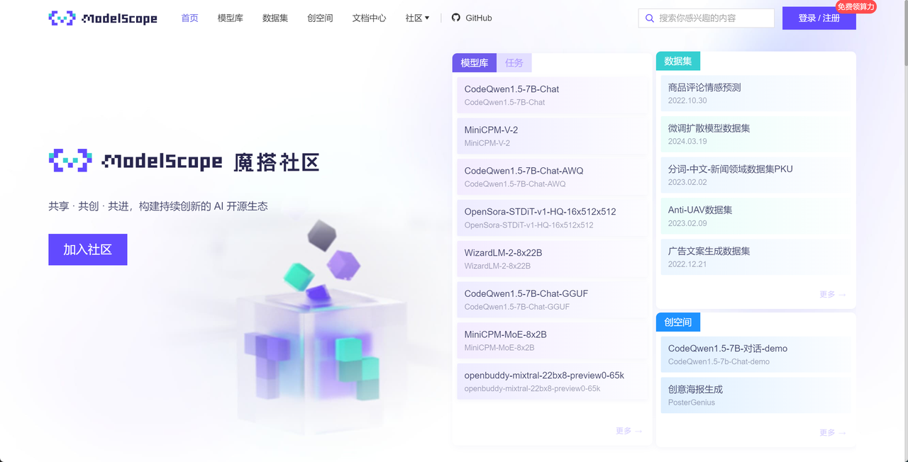
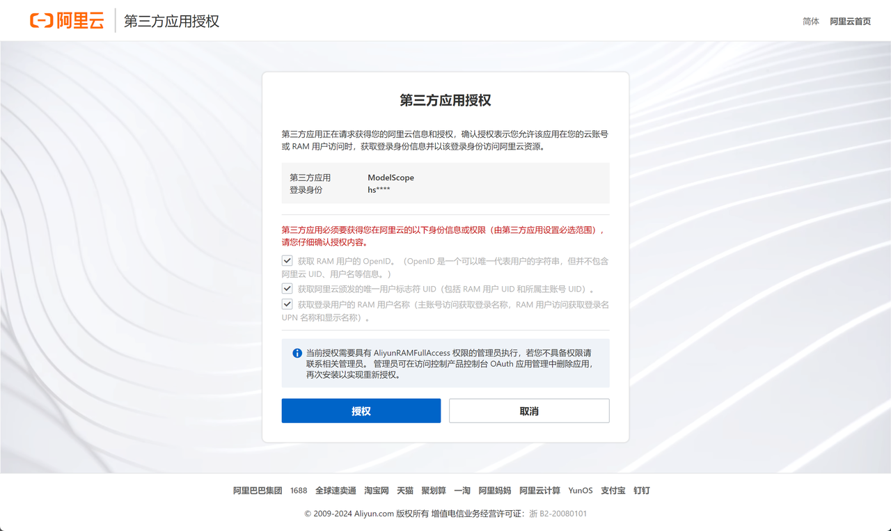
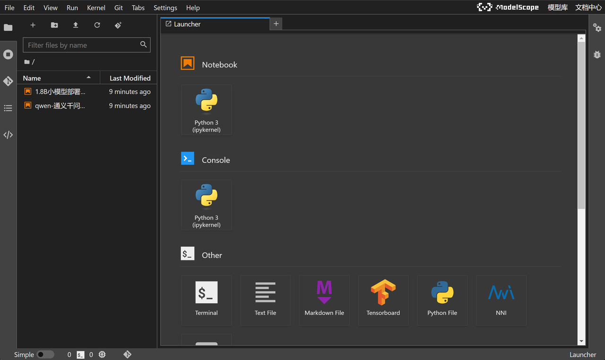
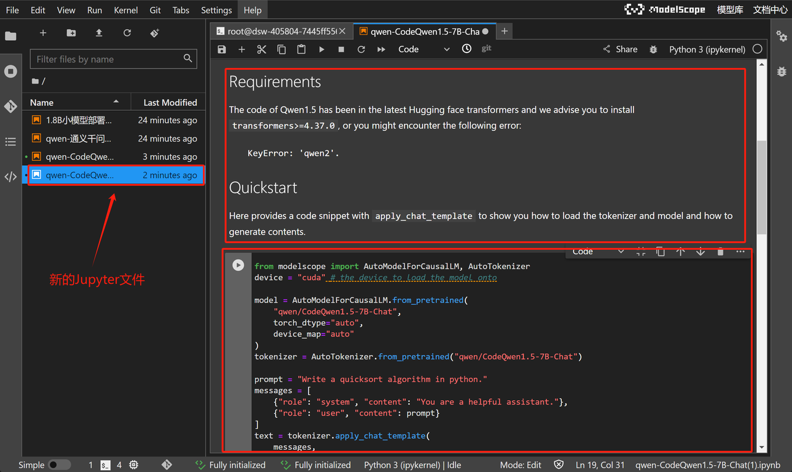
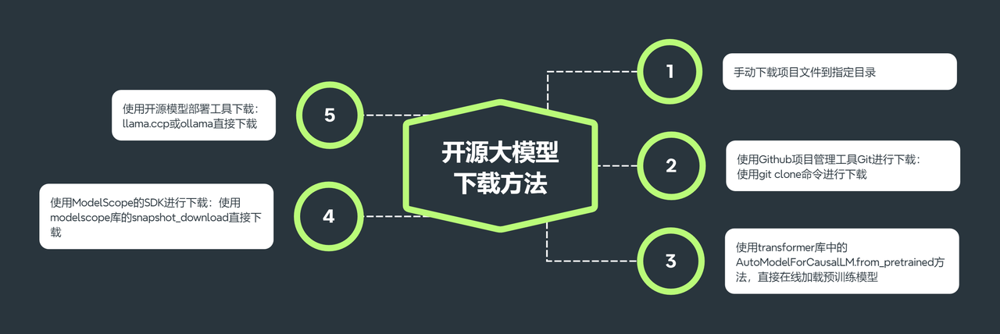
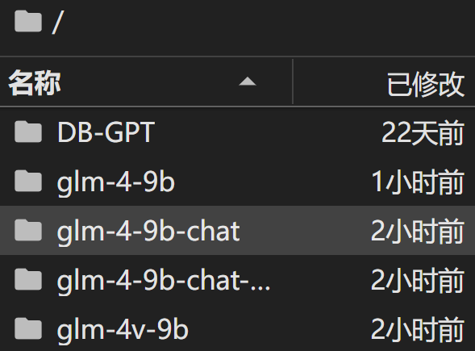
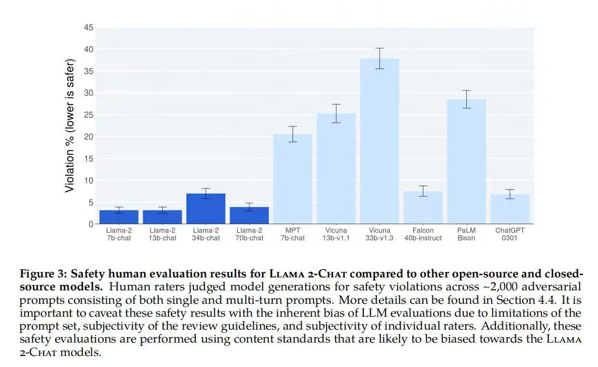

# GLM-4开源大模型快速入门教程

### 1.ModelScope在线算力与在线环境获取指南

  登录魔搭社区：https://www.modelscope.cn/home ，点击注册：



输入账号密码完成注册：


注册完成后，点击个人中心，点击绑定阿里云账号：


在跳转页面中选择登录阿里云，未注册阿里云也可以在当前页面注册：


点击授权：



绑定完成后，点击左侧“我的Notebook”，即可查看当前账号获赠算力情况。对于首次绑定阿里云账号的用户，都会赠送永久免费的CPU环境（8核32G内存）和36小时限时使用的GPU算力（32G内存+24G显存）。这里的GPU算力会根据实际使用情况扣除剩余时间，总共36小时的使用时间完全足够进行前期各项实验。


接下来启动GPU在线算力环境，选择方式二、点击启动：


稍等片刻即可完成启动，并点击查看Notebook：


即可接入在线NoteBook编程环境：



当前NoteBook编程环境和Colab类似（谷歌提供的在线编程环境），可以直接调用在线算力来完成编程工作，并且由于该服务由ModelScope提供，因此当前NoteBook已经完成了CUDA、PyTorch、Tensorflow环境配置，并且已经预安装了大模型部署所需各种库，如Transformer库、vLLM库、modelscope库等，并且当前NoteBook运行环境是Ubuntu操作系统，我们可以通过Jupyter中的Terminal功能对Ubuntu系统进行操作：


进入到命令行界面：


输入nvidia-smi，查看当前GPU情况：


该功能也是我们操作远程Ubuntu系统的核心功能。

此外，ModelScope NoteBooko还可以一键拉取ModelScope上发布的模型或项目，直接在云端环境进行运行和实验。这个点击+号开启新的导航页：


并在导航页下方点击模型库：


即可选择任意模型文档，进行尝试运行：


例如我们点击选择CodeQwen1.5-7B-Chat，一个基于Qwen1.5-7B微调得到的代码模型。点击即可获得一个新的Jupyter文件，包含了该模型的说明文档和运行代码（也就是该模型在ModelScope上的readme文档）：



而如果想要下载某个Jupyter文件到本地，只需要选择文件点击右键、选择Download，即可通过浏览器将项目文件下载到本地：


当然，这里需要注意的是，哪怕当前在线编程环境已经做了适配，但并不一定满足所有ModelScope中模型运行要求，既并非每个拉取的Jupyter文件都可以直接运行。当前体验课只把ModelScope视作在线编程环境，并不会直接Copy项目文件代码进行运行。不过无论如何，ModelScope Notebook还是为初学者提供了非常友好的、零基础即可入手尝试部署大模型的绝佳实践环境。

  接下来我们就借助ModelScope Notebook来完成GLM-4开源大模型私有化部署。

* 智谱AI主页：https://www.zhipuai.cn/

* Github主页：https://github.com/THUDM/GLM-4/tree/main

* ModelScope主页：https://www.modelscope.cn/models/ZhipuAI/glm-4-9b-chat/summary



### 2.GLM-4-9B-chat模型下载与运行

* 借助modelscope进行模型下载

  注，其他环境下需要按照如下方式提前准备好其他相关库，魔搭社区在线环境无需进行下列安装过程。

```python
!pip install modelscope
```

```plaintext
Looking in indexes: http://mirrors.aliyun.com/pypi/simple
Collecting modelscope
  Downloading http://mirrors.aliyun.com/pypi/packages/fd/67/f0d513d698358227fbabbfbd531dd2ada8706f324b12f773755035c6d9c2/modelscope-1.14.0-py3-none-any.whl (5.7 MB)
     ━━━━━━━━━━━━━━━━━━━━━━━━━━━━━━━━━━━━━━━━ 5.7/5.7 MB 1.0 MB/s eta 0:00:0000:0100:01
[?25hCollecting addict (from modelscope)
  Downloading http://mirrors.aliyun.com/pypi/packages/6a/00/b08f23b7d7e1e14ce01419a467b583edbb93c6cdb8654e54a9cc579cd61f/addict-2.4.0-py3-none-any.whl (3.8 kB)
Requirement already satisfied: attrs in /root/miniconda3/lib/python3.12/site-packages (from modelscope) (23.2.0)
Collecting datasets<2.19.0,>=2.16.0 (from modelscope)
  Downloading http://mirrors.aliyun.com/pypi/packages/95/fc/661a7f06e8b7d48fcbd3f55423b7ff1ac3ce59526f146fda87a1e1788ee4/datasets-2.18.0-py3-none-any.whl (510 kB)
     ━━━━━━━━━━━━━━━━━━━━━━━━━━━━━━━━━━━━━━━ 510.5/510.5 kB 1.0 MB/s eta 0:00:00a 0:00:01
[?25hCollecting einops (from modelscope)
  Downloading http://mirrors.aliyun.com/pypi/packages/44/5a/f0b9ad6c0a9017e62d4735daaeb11ba3b6c009d69a26141b258cd37b5588/einops-0.8.0-py3-none-any.whl (43 kB)
     ━━━━━━━━━━━━━━━━━━━━━━━━━━━━━━━━━━━━━━━ 43.2/43.2 kB 938.5 kB/s eta 0:00:00 0:00:01
[?25hRequirement already satisfied: filelock>=3.3.0 in /root/miniconda3/lib/python3.12/site-packages (from modelscope) (3.14.0)
Collecting gast>=0.2.2 (from modelscope)
  Downloading http://mirrors.aliyun.com/pypi/packages/fa/39/5aae571e5a5f4de9c3445dae08a530498e5c53b0e74410eeeb0991c79047/gast-0.5.4-py3-none-any.whl (19 kB)
Collecting huggingface-hub (from modelscope)
  Downloading http://mirrors.aliyun.com/pypi/packages/78/71/6ce4136149cb42b98599d49c39b3a39dd6858b5f9307490998c40e26a51e/huggingface_hub-0.23.2-py3-none-any.whl (401 kB)
     ━━━━━━━━━━━━━━━━━━━━━━━━━━━━━━━━━━━━━━━ 401.7/401.7 kB 1.0 MB/s eta 0:00:00a 0:00:01
[?25hRequirement already satisfied: numpy in /root/miniconda3/lib/python3.12/site-packages (from modelscope) (1.26.4)
Collecting oss2 (from modelscope)
  Downloading http://mirrors.aliyun.com/pypi/packages/61/ce/d23a9d44268dc992ae1a878d24341dddaea4de4ae374c261209bb6e9554b/oss2-2.18.5.tar.gz (283 kB)
     ━━━━━━━━━━━━━━━━━━━━━━━━━━━━━━━━━━━━━━━ 283.4/283.4 kB 1.0 MB/s eta 0:00:0000:0100:01
[?25h  Preparing metadata (setup.py) ... [?25ldone
[?25hCollecting pandas (from modelscope)
  Downloading http://mirrors.aliyun.com/pypi/packages/40/10/79e52ef01dfeb1c1ca47a109a01a248754ebe990e159a844ece12914de83/pandas-2.2.2-cp312-cp312-manylinux_2_17_x86_64.manylinux2014_x86_64.whl (12.7 MB)
     ━━━━━━━━━━━━━━━━━━━━━━━━━━━━━━━━━━━━━━━━ 12.7/12.7 MB 1.1 MB/s eta 0:00:0000:0100:01
[?25hRequirement already satisfied: Pillow>=6.2.0 in /root/miniconda3/lib/python3.12/site-packages (from modelscope) (10.3.0)
Collecting pyarrow!=9.0.0,>=6.0.0 (from modelscope)
  Downloading http://mirrors.aliyun.com/pypi/packages/25/7b/8da91f8de0b40b760dd748031973b6ac2aa3d4f85c67f45b7e58577ca22e/pyarrow-16.1.0-cp312-cp312-manylinux_2_28_x86_64.whl (40.8 MB)
     ━━━━━━━━━━━━━━━━━━━━━━━━━━━━━━━━━━━━━━━ 40.8/40.8 MB 953.2 kB/s eta 0:00:0000:0100:02
[?25hRequirement already satisfied: python-dateutil>=2.1 in /root/miniconda3/lib/python3.12/site-packages (from modelscope) (2.9.0.post0)
Requirement already satisfied: pyyaml in /root/miniconda3/lib/python3.12/site-packages (from modelscope) (6.0.1)
Requirement already satisfied: requests>=2.25 in /root/miniconda3/lib/python3.12/site-packages (from modelscope) (2.31.0)
Collecting scipy (from modelscope)
  Downloading http://mirrors.aliyun.com/pypi/packages/88/ab/6ecdc526d509d33814835447bbbeedbebdec7cca46ef495a61b00a35b4bf/scipy-1.13.1-cp312-cp312-manylinux_2_17_x86_64.manylinux2014_x86_64.whl (38.2 MB)
     ━━━━━━━━━━━━━━━━━━━━━━━━━━━━━━━━━━━━━━━ 38.2/38.2 MB 951.4 kB/s eta 0:00:0000:0100:02
[?25hRequirement already satisfied: setuptools in /root/miniconda3/lib/python3.12/site-packages (from modelscope) (69.5.1)
Collecting simplejson>=3.3.0 (from modelscope)
  Downloading http://mirrors.aliyun.com/pypi/packages/f2/6b/ce0090a8026acc8ed027ec9471a551e02dafb7973674773fb218824130f9/simplejson-3.19.2-cp312-cp312-manylinux_2_5_x86_64.manylinux1_x86_64.manylinux_2_17_x86_64.manylinux2014_x86_64.whl (152 kB)
     ━━━━━━━━━━━━━━━━━━━━━━━━━━━━━━━━━━━━━ 152.4/152.4 kB 956.4 kB/s eta 0:00:00a 0:00:01
[?25hCollecting sortedcontainers>=1.5.9 (from modelscope)
  Downloading http://mirrors.aliyun.com/pypi/packages/32/46/9cb0e58b2deb7f82b84065f37f3bffeb12413f947f9388e4cac22c4621ce/sortedcontainers-2.4.0-py2.py3-none-any.whl (29 kB)
Requirement already satisfied: tqdm>=4.64.0 in /root/miniconda3/lib/python3.12/site-packages (from modelscope) (4.66.2)
Requirement already satisfied: urllib3>=1.26 in /root/miniconda3/lib/python3.12/site-packages (from modelscope) (2.1.0)
Collecting yapf (from modelscope)
  Downloading http://mirrors.aliyun.com/pypi/packages/66/c9/d4b03b2490107f13ebd68fe9496d41ae41a7de6275ead56d0d4621b11ffd/yapf-0.40.2-py3-none-any.whl (254 kB)
     ━━━━━━━━━━━━━━━━━━━━━━━━━━━━━━━━━━━━━ 254.7/254.7 kB 975.7 kB/s eta 0:00:00a 0:00:01
[?25hCollecting pyarrow-hotfix (from datasets<2.19.0,>=2.16.0->modelscope)
  Downloading http://mirrors.aliyun.com/pypi/packages/e4/f4/9ec2222f5f5f8ea04f66f184caafd991a39c8782e31f5b0266f101cb68ca/pyarrow_hotfix-0.6-py3-none-any.whl (7.9 kB)
Collecting dill<0.3.9,>=0.3.0 (from datasets<2.19.0,>=2.16.0->modelscope)
  Downloading http://mirrors.aliyun.com/pypi/packages/c9/7a/cef76fd8438a42f96db64ddaa85280485a9c395e7df3db8158cfec1eee34/dill-0.3.8-py3-none-any.whl (116 kB)
     ━━━━━━━━━━━━━━━━━━━━━━━━━━━━━━━━━━━━━ 116.3/116.3 kB 866.5 kB/s eta 0:00:00a 0:00:01
[?25hCollecting xxhash (from datasets<2.19.0,>=2.16.0->modelscope)
  Downloading http://mirrors.aliyun.com/pypi/packages/ce/d4/8111e14273c0781349af8d0dae55c4e42c7196e7237e81a3db5186ab7dfe/xxhash-3.4.1-cp312-cp312-manylinux_2_17_x86_64.manylinux2014_x86_64.whl (194 kB)
     ━━━━━━━━━━━━━━━━━━━━━━━━━━━━━━━━━━━━━ 194.3/194.3 kB 910.4 kB/s eta 0:00:00a 0:00:01
[?25hCollecting multiprocess (from datasets<2.19.0,>=2.16.0->modelscope)
  Downloading http://mirrors.aliyun.com/pypi/packages/0a/7d/a988f258104dcd2ccf1ed40fdc97e26c4ac351eeaf81d76e266c52d84e2f/multiprocess-0.70.16-py312-none-any.whl (146 kB)
     ━━━━━━━━━━━━━━━━━━━━━━━━━━━━━━━━━━━━━ 146.7/146.7 kB 900.7 kB/s eta 0:00:00a 0:00:01
[?25hCollecting fsspec<=2024.2.0,>=2023.1.0 (from fsspec[http]<=2024.2.0,>=2023.1.0->datasets<2.19.0,>=2.16.0->modelscope)
  Downloading http://mirrors.aliyun.com/pypi/packages/ad/30/2281c062222dc39328843bd1ddd30ff3005ef8e30b2fd09c4d2792766061/fsspec-2024.2.0-py3-none-any.whl (170 kB)
     ━━━━━━━━━━━━━━━━━━━━━━━━━━━━━━━━━━━━━ 170.9/170.9 kB 926.7 kB/s eta 0:00:00a 0:00:01
[?25hCollecting aiohttp (from datasets<2.19.0,>=2.16.0->modelscope)
  Downloading http://mirrors.aliyun.com/pypi/packages/dd/0a/526c8480bd846b9155c624c7e54db94733fc6b381dfd748cc8dd69c994b0/aiohttp-3.9.5-cp312-cp312-manylinux_2_17_x86_64.manylinux2014_x86_64.whl (1.3 MB)
     ━━━━━━━━━━━━━━━━━━━━━━━━━━━━━━━━━━━━━━━━ 1.3/1.3 MB 924.6 kB/s eta 0:00:0000:0100:01
[?25hRequirement already satisfied: packaging in /root/miniconda3/lib/python3.12/site-packages (from datasets<2.19.0,>=2.16.0->modelscope) (23.2)
Requirement already satisfied: typing-extensions>=3.7.4.3 in /root/miniconda3/lib/python3.12/site-packages (from huggingface-hub->modelscope) (4.12.1)
Requirement already satisfied: six>=1.5 in /root/miniconda3/lib/python3.12/site-packages (from python-dateutil>=2.1->modelscope) (1.16.0)
Requirement already satisfied: charset-normalizer<4,>=2 in /root/miniconda3/lib/python3.12/site-packages (from requests>=2.25->modelscope) (2.0.4)
Requirement already satisfied: idna<4,>=2.5 in /root/miniconda3/lib/python3.12/site-packages (from requests>=2.25->modelscope) (3.7)
Requirement already satisfied: certifi>=2017.4.17 in /root/miniconda3/lib/python3.12/site-packages (from requests>=2.25->modelscope) (2024.2.2)
Collecting crcmod>=1.7 (from oss2->modelscope)
  Downloading http://mirrors.aliyun.com/pypi/packages/6b/b0/e595ce2a2527e169c3bcd6c33d2473c1918e0b7f6826a043ca1245dd4e5b/crcmod-1.7.tar.gz (89 kB)
     ━━━━━━━━━━━━━━━━━━━━━━━━━━━━━━━━━━━━━━━ 89.7/89.7 kB 965.2 kB/s eta 0:00:00a 0:00:01
[?25h  Preparing metadata (setup.py) ... [?25ldone
[?25hCollecting pycryptodome>=3.4.7 (from oss2->modelscope)
  Downloading http://mirrors.aliyun.com/pypi/packages/af/20/5f29ec45462360e7f61e8688af9fe4a0afae057edfabdada662e11bf97e7/pycryptodome-3.20.0-cp35-abi3-manylinux_2_17_x86_64.manylinux2014_x86_64.whl (2.1 MB)
     ━━━━━━━━━━━━━━━━━━━━━━━━━━━━━━━━━━━━━━━━ 2.1/2.1 MB 933.6 kB/s eta 0:00:0000:0100:01
[?25hCollecting aliyun-python-sdk-kms>=2.4.1 (from oss2->modelscope)
  Downloading http://mirrors.aliyun.com/pypi/packages/89/b4/ad457761ca26b18a9b0f534b84fec2df59c5fde62dc7786768e2b0edd702/aliyun_python_sdk_kms-2.16.3-py2.py3-none-any.whl (98 kB)
     ━━━━━━━━━━━━━━━━━━━━━━━━━━━━━━━━━━━━━━━ 98.1/98.1 kB 970.4 kB/s eta 0:00:00a 0:00:01
[?25hCollecting aliyun-python-sdk-core>=2.13.12 (from oss2->modelscope)
  Downloading http://mirrors.aliyun.com/pypi/packages/3a/e6/f579e8a5e26ef1066f6fb11074cedc9f668cb5f722c85cf7adc0f7e2e23e/aliyun-python-sdk-core-2.15.1.tar.gz (443 kB)
     ━━━━━━━━━━━━━━━━━━━━━━━━━━━━━━━━━━━━━ 443.1/443.1 kB 933.9 kB/s eta 0:00:00a 0:00:01
[?25h  Preparing metadata (setup.py) ... [?25ldone
[?25hCollecting pytz>=2020.1 (from pandas->modelscope)
  Downloading http://mirrors.aliyun.com/pypi/packages/9c/3d/a121f284241f08268b21359bd425f7d4825cffc5ac5cd0e1b3d82ffd2b10/pytz-2024.1-py2.py3-none-any.whl (505 kB)
     ━━━━━━━━━━━━━━━━━━━━━━━━━━━━━━━━━━━━━ 505.5/505.5 kB 925.5 kB/s eta 0:00:00a 0:00:01
[?25hCollecting tzdata>=2022.7 (from pandas->modelscope)
  Downloading http://mirrors.aliyun.com/pypi/packages/65/58/f9c9e6be752e9fcb8b6a0ee9fb87e6e7a1f6bcab2cdc73f02bb7ba91ada0/tzdata-2024.1-py2.py3-none-any.whl (345 kB)
     ━━━━━━━━━━━━━━━━━━━━━━━━━━━━━━━━━━━━━ 345.4/345.4 kB 912.1 kB/s eta 0:00:00a 0:00:01
[?25hCollecting importlib-metadata>=6.6.0 (from yapf->modelscope)
  Downloading http://mirrors.aliyun.com/pypi/packages/2d/0a/679461c511447ffaf176567d5c496d1de27cbe34a87df6677d7171b2fbd4/importlib_metadata-7.1.0-py3-none-any.whl (24 kB)
Requirement already satisfied: platformdirs>=3.5.1 in /root/miniconda3/lib/python3.12/site-packages (from yapf->modelscope) (3.10.0)
Collecting tomli>=2.0.1 (from yapf->modelscope)
  Downloading http://mirrors.aliyun.com/pypi/packages/97/75/10a9ebee3fd790d20926a90a2547f0bf78f371b2f13aa822c759680ca7b9/tomli-2.0.1-py3-none-any.whl (12 kB)
Collecting jmespath<1.0.0,>=0.9.3 (from aliyun-python-sdk-core>=2.13.12->oss2->modelscope)
  Downloading http://mirrors.aliyun.com/pypi/packages/07/cb/5f001272b6faeb23c1c9e0acc04d48eaaf5c862c17709d20e3469c6e0139/jmespath-0.10.0-py2.py3-none-any.whl (24 kB)
Requirement already satisfied: cryptography>=2.6.0 in /root/miniconda3/lib/python3.12/site-packages (from aliyun-python-sdk-core>=2.13.12->oss2->modelscope) (42.0.5)
Collecting aiosignal>=1.1.2 (from aiohttp->datasets<2.19.0,>=2.16.0->modelscope)
  Downloading http://mirrors.aliyun.com/pypi/packages/76/ac/a7305707cb852b7e16ff80eaf5692309bde30e2b1100a1fcacdc8f731d97/aiosignal-1.3.1-py3-none-any.whl (7.6 kB)
Collecting frozenlist>=1.1.1 (from aiohttp->datasets<2.19.0,>=2.16.0->modelscope)
  Downloading http://mirrors.aliyun.com/pypi/packages/0b/f2/b8158a0f06faefec33f4dff6345a575c18095a44e52d4f10c678c137d0e0/frozenlist-1.4.1-cp312-cp312-manylinux_2_5_x86_64.manylinux1_x86_64.manylinux_2_17_x86_64.manylinux2014_x86_64.whl (281 kB)
     ━━━━━━━━━━━━━━━━━━━━━━━━━━━━━━━━━━━━━ 281.5/281.5 kB 956.0 kB/s eta 0:00:00a 0:00:01
[?25hCollecting multidict<7.0,>=4.5 (from aiohttp->datasets<2.19.0,>=2.16.0->modelscope)
  Downloading http://mirrors.aliyun.com/pypi/packages/24/1f/af976383b0b772dd351210af5b60ff9927e3abb2f4a103e93da19a957da0/multidict-6.0.5-cp312-cp312-manylinux_2_17_x86_64.manylinux2014_x86_64.whl (130 kB)
     ━━━━━━━━━━━━━━━━━━━━━━━━━━━━━━━━━━━━━ 130.8/130.8 kB 894.8 kB/s eta 0:00:00a 0:00:01
[?25hCollecting yarl<2.0,>=1.0 (from aiohttp->datasets<2.19.0,>=2.16.0->modelscope)
  Downloading http://mirrors.aliyun.com/pypi/packages/28/1c/bdb3411467b805737dd2720b85fd082e49f59bf0cc12dc1dfcc80ab3d274/yarl-1.9.4-cp312-cp312-manylinux_2_17_x86_64.manylinux2014_x86_64.whl (322 kB)
     ━━━━━━━━━━━━━━━━━━━━━━━━━━━━━━━━━━━━━ 322.4/322.4 kB 932.7 kB/s eta 0:00:0000:0100:01
[?25hCollecting zipp>=0.5 (from importlib-metadata>=6.6.0->yapf->modelscope)
  Downloading http://mirrors.aliyun.com/pypi/packages/82/1a/ac67760425f2477b1da593b347db66d474130747e6e5285d08c7f2d5884a/zipp-3.19.1-py3-none-any.whl (9.0 kB)
Requirement already satisfied: cffi>=1.12 in /root/miniconda3/lib/python3.12/site-packages (from cryptography>=2.6.0->aliyun-python-sdk-core>=2.13.12->oss2->modelscope) (1.16.0)
Requirement already satisfied: pycparser in /root/miniconda3/lib/python3.12/site-packages (from cffi>=1.12->cryptography>=2.6.0->aliyun-python-sdk-core>=2.13.12->oss2->modelscope) (2.21)
Building wheels for collected packages: oss2, aliyun-python-sdk-core, crcmod
  Building wheel for oss2 (setup.py) ... [?25ldone
[?25h  Created wheel for oss2: filename=oss2-2.18.5-py3-none-any.whl size=118148 sha256=b25dc15567c4670768ca8b476736c02ed625ae2d029592909aa16405d63966dc
  Stored in directory: /root/.cache/pip/wheels/fe/9f/03/9c87e90cf200a9ee2e6c261a8362bccfcbe85b4fb8951e29a2
  Building wheel for aliyun-python-sdk-core (setup.py) ... [?25ldone
[?25h  Created wheel for aliyun-python-sdk-core: filename=aliyun_python_sdk_core-2.15.1-py3-none-any.whl size=535325 sha256=28decf5972919a685f7a738db351d075e5fea7a23834d5f9aed4665c88e8ec7f
  Stored in directory: /root/.cache/pip/wheels/02/df/a0/4a01ae1e0e2607aed4b445b5d127caa8e36107d5a247f960ca
  Building wheel for crcmod (setup.py) ... [?25ldone
[?25h  Created wheel for crcmod: filename=crcmod-1.7-cp312-cp312-linux_x86_64.whl size=23521 sha256=1bbcb3c4fad3b619351bdaf4cfd27faa96750a44af9f7f6113c6a2d579794943
  Stored in directory: /root/.cache/pip/wheels/dd/af/9b/ad4a807fa77f44e8231eb1182646a64351aa4be35d5ca1f4c4
Successfully built oss2 aliyun-python-sdk-core crcmod
Installing collected packages: sortedcontainers, pytz, crcmod, addict, zipp, xxhash, tzdata, tomli, simplejson, scipy, pycryptodome, pyarrow-hotfix, pyarrow, multidict, jmespath, gast, fsspec, frozenlist, einops, dill, yarl, pandas, multiprocess, importlib-metadata, huggingface-hub, aiosignal, yapf, aliyun-python-sdk-core, aiohttp, aliyun-python-sdk-kms, oss2, datasets, modelscope
  Attempting uninstall: fsspec
    Found existing installation: fsspec 2024.5.0
    Uninstalling fsspec-2024.5.0:
      Successfully uninstalled fsspec-2024.5.0
Successfully installed addict-2.4.0 aiohttp-3.9.5 aiosignal-1.3.1 aliyun-python-sdk-core-2.15.1 aliyun-python-sdk-kms-2.16.3 crcmod-1.7 datasets-2.18.0 dill-0.3.8 einops-0.8.0 frozenlist-1.4.1 fsspec-2024.2.0 gast-0.5.4 huggingface-hub-0.23.2 importlib-metadata-7.1.0 jmespath-0.10.0 modelscope-1.14.0 multidict-6.0.5 multiprocess-0.70.16 oss2-2.18.5 pandas-2.2.2 pyarrow-16.1.0 pyarrow-hotfix-0.6 pycryptodome-3.20.0 pytz-2024.1 scipy-1.13.1 simplejson-3.19.2 sortedcontainers-2.4.0 tomli-2.0.1 tzdata-2024.1 xxhash-3.4.1 yapf-0.40.2 yarl-1.9.4 zipp-3.19.1
WARNING: Running pip as the 'root' user can result in broken permissions and conflicting behaviour with the system package manager. It is recommended to use a virtual environment instead: https://pip.pypa.io/warnings/venv

```

```python
!pip install transformers
```

```plaintext
Looking in indexes: http://mirrors.aliyun.com/pypi/simple
Collecting transformers
  Downloading http://mirrors.aliyun.com/pypi/packages/d9/b7/98f821d70102e2d38483bbb7013a689d2d646daa4495377bc910374ad727/transformers-4.41.2-py3-none-any.whl (9.1 MB)
     ━━━━━━━━━━━━━━━━━━━━━━━━━━━━━━━━━━━━━━━━ 9.1/9.1 MB 980.0 kB/s eta 0:00:0000:0100:01
[?25hRequirement already satisfied: filelock in /root/miniconda3/lib/python3.12/site-packages (from transformers) (3.14.0)
Requirement already satisfied: huggingface-hub<1.0,>=0.23.0 in /root/miniconda3/lib/python3.12/site-packages (from transformers) (0.23.2)
Requirement already satisfied: numpy>=1.17 in /root/miniconda3/lib/python3.12/site-packages (from transformers) (1.26.4)
Requirement already satisfied: packaging>=20.0 in /root/miniconda3/lib/python3.12/site-packages (from transformers) (23.2)
Requirement already satisfied: pyyaml>=5.1 in /root/miniconda3/lib/python3.12/site-packages (from transformers) (6.0.1)
Collecting regex!=2019.12.17 (from transformers)
  Downloading http://mirrors.aliyun.com/pypi/packages/91/28/a187c6eccd980454b668e837df35ad0935989a6b00b9288bc094296bc2f6/regex-2024.5.15-cp312-cp312-manylinux_2_17_x86_64.manylinux2014_x86_64.whl (788 kB)
     ━━━━━━━━━━━━━━━━━━━━━━━━━━━━━━━━━━━━━ 788.8/788.8 kB 974.3 kB/s eta 0:00:0000:0100:01
[?25hRequirement already satisfied: requests in /root/miniconda3/lib/python3.12/site-packages (from transformers) (2.31.0)
Collecting tokenizers<0.20,>=0.19 (from transformers)
  Downloading http://mirrors.aliyun.com/pypi/packages/80/54/12047a69f5b382d7ee72044dc89151a2dd0d13b2c9bdcc22654883704d31/tokenizers-0.19.1-cp312-cp312-manylinux_2_17_x86_64.manylinux2014_x86_64.whl (3.6 MB)
     ━━━━━━━━━━━━━━━━━━━━━━━━━━━━━━━━━━━━━━━━ 3.6/3.6 MB 973.4 kB/s eta 0:00:0000:0100:01
[?25hCollecting safetensors>=0.4.1 (from transformers)
  Downloading http://mirrors.aliyun.com/pypi/packages/3f/7c/c894b48c98ffe7fa82358c089818369a71c05d8483099cd1a9266fbd605c/safetensors-0.4.3-cp312-cp312-manylinux_2_17_x86_64.manylinux2014_x86_64.whl (1.2 MB)
     ━━━━━━━━━━━━━━━━━━━━━━━━━━━━━━━━━━━━━━━━ 1.2/1.2 MB 966.8 kB/s eta 0:00:0000:0100:01
[?25hRequirement already satisfied: tqdm>=4.27 in /root/miniconda3/lib/python3.12/site-packages (from transformers) (4.66.2)
Requirement already satisfied: fsspec>=2023.5.0 in /root/miniconda3/lib/python3.12/site-packages (from huggingface-hub<1.0,>=0.23.0->transformers) (2024.2.0)
Requirement already satisfied: typing-extensions>=3.7.4.3 in /root/miniconda3/lib/python3.12/site-packages (from huggingface-hub<1.0,>=0.23.0->transformers) (4.12.1)
Requirement already satisfied: charset-normalizer<4,>=2 in /root/miniconda3/lib/python3.12/site-packages (from requests->transformers) (2.0.4)
Requirement already satisfied: idna<4,>=2.5 in /root/miniconda3/lib/python3.12/site-packages (from requests->transformers) (3.7)
Requirement already satisfied: urllib3<3,>=1.21.1 in /root/miniconda3/lib/python3.12/site-packages (from requests->transformers) (2.1.0)
Requirement already satisfied: certifi>=2017.4.17 in /root/miniconda3/lib/python3.12/site-packages (from requests->transformers) (2024.2.2)
Installing collected packages: safetensors, regex, tokenizers, transformers
Successfully installed regex-2024.5.15 safetensors-0.4.3 tokenizers-0.19.1 transformers-4.41.2
WARNING: Running pip as the 'root' user can result in broken permissions and conflicting behaviour with the system package manager. It is recommended to use a virtual environment instead: https://pip.pypa.io/warnings/venv

```

```python
!pip install tiktoken
```

```plaintext
Looking in indexes: http://mirrors.aliyun.com/pypi/simple
Collecting tiktoken
  Downloading http://mirrors.aliyun.com/pypi/packages/50/81/1842a22f15586072280364c2ab1e40835adaf64e42fe80e52aff921ee021/tiktoken-0.7.0-cp312-cp312-manylinux_2_17_x86_64.manylinux2014_x86_64.whl (1.1 MB)
     ━━━━━━━━━━━━━━━━━━━━━━━━━━━━━━━━━━━━━━━━ 1.1/1.1 MB 860.1 kB/s eta 0:00:0000:0100:01
[?25hRequirement already satisfied: regex>=2022.1.18 in /root/miniconda3/lib/python3.12/site-packages (from tiktoken) (2024.5.15)
Requirement already satisfied: requests>=2.26.0 in /root/miniconda3/lib/python3.12/site-packages (from tiktoken) (2.31.0)
Requirement already satisfied: charset-normalizer<4,>=2 in /root/miniconda3/lib/python3.12/site-packages (from requests>=2.26.0->tiktoken) (2.0.4)
Requirement already satisfied: idna<4,>=2.5 in /root/miniconda3/lib/python3.12/site-packages (from requests>=2.26.0->tiktoken) (3.7)
Requirement already satisfied: urllib3<3,>=1.21.1 in /root/miniconda3/lib/python3.12/site-packages (from requests>=2.26.0->tiktoken) (2.1.0)
Requirement already satisfied: certifi>=2017.4.17 in /root/miniconda3/lib/python3.12/site-packages (from requests>=2.26.0->tiktoken) (2024.2.2)
Installing collected packages: tiktoken
Successfully installed tiktoken-0.7.0
WARNING: Running pip as the 'root' user can result in broken permissions and conflicting behaviour with the system package manager. It is recommended to use a virtual environment instead: https://pip.pypa.io/warnings/venv

```

```python
import torch
torch.cuda.is_available()
```

```plaintext
True
```

接下来导入modelscope库：

```python
from modelscope import snapshot_download
```

```plaintext
2024-06-05 18:39:50,436 - modelscope - INFO - PyTorch version 2.3.0+cu121 Found.
2024-06-05 18:39:50,437 - modelscope - INFO - Loading ast index from /root/.cache/modelscope/ast_indexer
2024-06-05 18:39:50,437 - modelscope - INFO - No valid ast index found from /root/.cache/modelscope/ast_indexer, generating ast index from prebuilt!
2024-06-05 18:39:50,483 - modelscope - INFO - Loading done! Current index file version is 1.14.0, with md5 4a57d10c249fdcacb8d1f0d8eeb382d2 and a total number of 976 components indexed
```

然后进行模型下载：

```python
#模型下载
from modelscope import snapshot_download
model_dir = snapshot_download('ZhipuAI/glm-4-9b-chat')
```

```plaintext
Downloading: 100%|██████████| 654/654 [00:00<00:00, 5.15MB/s]
Downloading: 100%|██████████| 48.0/48.0 [00:00<00:00, 428kB/s]
Downloading: 100%|██████████| 126/126 [00:00<00:00, 927kB/s]
Downloading: 100%|██████████| 7.62k/7.62k [00:00<00:00, 10.5MB/s]
Downloading: 100%|█████████▉| 4.63G/4.63G [00:13<00:00, 379MB/s]
Downloading: 100%|█████████▉| 4.66G/4.66G [00:13<00:00, 374MB/s]
Downloading: 100%|█████████▉| 4.58G/4.58G [00:13<00:00, 357MB/s]
Downloading: 100%|█████████▉| 1.09G/1.09G [00:03<00:00, 339MB/s]
Downloading: 100%|██████████| 23.4k/23.4k [00:00<00:00, 61.1MB/s]
Downloading: 100%|██████████| 36.3k/36.3k [00:00<00:00, 18.6MB/s]
Downloading: 100%|██████████| 73.0/73.0 [00:00<00:00, 600kB/s]
Downloading: 100%|██████████| 8.66M/8.66M [00:00<00:00, 65.8MB/s]
Downloading: 100%|██████████| 49.7k/49.7k [00:00<00:00, 11.4MB/s]
Downloading: 100%|██████████| 4.59k/4.59k [00:00<00:00, 8.31MB/s]
```

```python
# model_dir = '/root/autodl-tmp/glm-4-9b-chat'
```

```python
model_dir
```

```plaintext
'/root/autodl-tmp/glm-4-9b-chat'
```

* 使用 transformers 后端进行推理

以下是单卡服务器运行代码：

```plain&#x20;text
import torch
from modelscope import AutoModelForCausalLM, AutoTokenizer
```

# 设置设备为CUDA（GPU），以加速计算

```plain&#x20;text
device = "cuda"
```

# 从预训练模型目录加载分词器，并信任远程代码

```plain&#x20;text
tokenizer = AutoTokenizer.from_pretrained(model_dir, trust_remote_code=True)
```

# 定义用户的输入查询

```plain&#x20;text
query = "你好"
```

# 使用聊天模板应用分词器，并生成输入张量

```plain&#x20;text
inputs = tokenizer.apply_chat_template(
[{"role": "user", "content": query}], # 用户角色和输入内容
add_generation_prompt=True, # 添加生成提示
tokenize=True, # 执行分词
return_tensors="pt", # 返回PyTorch张量
return_dict=True # 返回字典形式
)
```

# 将输入张量移动到指定设备（CUDA）

```plain&#x20;text
inputs = inputs.to(device)
```

# 从预训练模型目录加载因果语言模型，并信任远程代码

```plain&#x20;text
model = AutoModelForCausalLM.from_pretrained(
model_dir,
torch_dtype=torch.bfloat16, # 使用bfloat16数据类型以减少内存使用
trust_remote_code=True # 信任远程代码
).to(device).eval() # 将模型移动到CUDA设备并设置为评估模式
```

# 定义生成文本的参数

```plain&#x20;text
gen_kwargs = {
"max_length": 2500, # 生成文本的最大长度
"do_sample": True, # 是否进行采样
"top_k": 1 # 采样时考虑的最高概率的k个标记
}
```

# 在不计算梯度的上下文中生成文本

```plain&#x20;text
with torch.no_grad():
# 生成模型的输出
outputs = model.generate(**inputs, **gen_kwargs)
```

```plain&#x20;text
# 截取生成的输出，去除输入的部分
outputs = outputs[:, inputs['input_ids'].shape[1]:]
# 解码生成的输出并去除特殊标记
print(tokenizer.decode(outputs[0], skip_special_tokens=True))
```


多卡服务器运行代码如下：

```python
!pip install accelerate
```

```plaintext
Looking in indexes: http://mirrors.aliyun.com/pypi/simple
Collecting accelerate
  Downloading http://mirrors.aliyun.com/pypi/packages/e9/bb/1edd2c836071e91d2bd331b9542bbd592e23d1474645b9c6fd56232caace/accelerate-0.30.1-py3-none-any.whl (302 kB)
     ━━━━━━━━━━━━━━━━━━━━━━━━━━━━━━━━━━━━━ 302.6/302.6 kB 759.2 kB/s eta 0:00:00a 0:00:01
[?25hRequirement already satisfied: numpy>=1.17 in /root/miniconda3/lib/python3.12/site-packages (from accelerate) (1.26.4)
Requirement already satisfied: packaging>=20.0 in /root/miniconda3/lib/python3.12/site-packages (from accelerate) (23.2)
Requirement already satisfied: psutil in /root/miniconda3/lib/python3.12/site-packages (from accelerate) (5.9.8)
Requirement already satisfied: pyyaml in /root/miniconda3/lib/python3.12/site-packages (from accelerate) (6.0.1)
Requirement already satisfied: torch>=1.10.0 in /root/miniconda3/lib/python3.12/site-packages (from accelerate) (2.3.0+cu121)
Requirement already satisfied: huggingface-hub in /root/miniconda3/lib/python3.12/site-packages (from accelerate) (0.23.2)
Requirement already satisfied: safetensors>=0.3.1 in /root/miniconda3/lib/python3.12/site-packages (from accelerate) (0.4.3)
Requirement already satisfied: filelock in /root/miniconda3/lib/python3.12/site-packages (from torch>=1.10.0->accelerate) (3.14.0)
Requirement already satisfied: typing-extensions>=4.8.0 in /root/miniconda3/lib/python3.12/site-packages (from torch>=1.10.0->accelerate) (4.12.1)
Requirement already satisfied: sympy in /root/miniconda3/lib/python3.12/site-packages (from torch>=1.10.0->accelerate) (1.12.1)
Requirement already satisfied: networkx in /root/miniconda3/lib/python3.12/site-packages (from torch>=1.10.0->accelerate) (3.3)
Requirement already satisfied: jinja2 in /root/miniconda3/lib/python3.12/site-packages (from torch>=1.10.0->accelerate) (3.1.4)
Requirement already satisfied: fsspec in /root/miniconda3/lib/python3.12/site-packages (from torch>=1.10.0->accelerate) (2024.2.0)
Requirement already satisfied: nvidia-cuda-nvrtc-cu12==12.1.105 in /root/miniconda3/lib/python3.12/site-packages (from torch>=1.10.0->accelerate) (12.1.105)
Requirement already satisfied: nvidia-cuda-runtime-cu12==12.1.105 in /root/miniconda3/lib/python3.12/site-packages (from torch>=1.10.0->accelerate) (12.1.105)
Requirement already satisfied: nvidia-cuda-cupti-cu12==12.1.105 in /root/miniconda3/lib/python3.12/site-packages (from torch>=1.10.0->accelerate) (12.1.105)
Requirement already satisfied: nvidia-cudnn-cu12==8.9.2.26 in /root/miniconda3/lib/python3.12/site-packages (from torch>=1.10.0->accelerate) (8.9.2.26)
Requirement already satisfied: nvidia-cublas-cu12==12.1.3.1 in /root/miniconda3/lib/python3.12/site-packages (from torch>=1.10.0->accelerate) (12.1.3.1)
Requirement already satisfied: nvidia-cufft-cu12==11.0.2.54 in /root/miniconda3/lib/python3.12/site-packages (from torch>=1.10.0->accelerate) (11.0.2.54)
Requirement already satisfied: nvidia-curand-cu12==10.3.2.106 in /root/miniconda3/lib/python3.12/site-packages (from torch>=1.10.0->accelerate) (10.3.2.106)
Requirement already satisfied: nvidia-cusolver-cu12==11.4.5.107 in /root/miniconda3/lib/python3.12/site-packages (from torch>=1.10.0->accelerate) (11.4.5.107)
Requirement already satisfied: nvidia-cusparse-cu12==12.1.0.106 in /root/miniconda3/lib/python3.12/site-packages (from torch>=1.10.0->accelerate) (12.1.0.106)
Requirement already satisfied: nvidia-nccl-cu12==2.20.5 in /root/miniconda3/lib/python3.12/site-packages (from torch>=1.10.0->accelerate) (2.20.5)
Requirement already satisfied: nvidia-nvtx-cu12==12.1.105 in /root/miniconda3/lib/python3.12/site-packages (from torch>=1.10.0->accelerate) (12.1.105)
Requirement already satisfied: nvidia-nvjitlink-cu12 in /root/miniconda3/lib/python3.12/site-packages (from nvidia-cusolver-cu12==11.4.5.107->torch>=1.10.0->accelerate) (12.5.40)
Requirement already satisfied: requests in /root/miniconda3/lib/python3.12/site-packages (from huggingface-hub->accelerate) (2.31.0)
Requirement already satisfied: tqdm>=4.42.1 in /root/miniconda3/lib/python3.12/site-packages (from huggingface-hub->accelerate) (4.66.2)
Requirement already satisfied: MarkupSafe>=2.0 in /root/miniconda3/lib/python3.12/site-packages (from jinja2->torch>=1.10.0->accelerate) (2.1.5)
Requirement already satisfied: charset-normalizer<4,>=2 in /root/miniconda3/lib/python3.12/site-packages (from requests->huggingface-hub->accelerate) (2.0.4)
Requirement already satisfied: idna<4,>=2.5 in /root/miniconda3/lib/python3.12/site-packages (from requests->huggingface-hub->accelerate) (3.7)
Requirement already satisfied: urllib3<3,>=1.21.1 in /root/miniconda3/lib/python3.12/site-packages (from requests->huggingface-hub->accelerate) (2.1.0)
Requirement already satisfied: certifi>=2017.4.17 in /root/miniconda3/lib/python3.12/site-packages (from requests->huggingface-hub->accelerate) (2024.2.2)
Requirement already satisfied: mpmath<1.4.0,>=1.1.0 in /root/miniconda3/lib/python3.12/site-packages (from sympy->torch>=1.10.0->accelerate) (1.3.0)
Installing collected packages: accelerate
Successfully installed accelerate-0.30.1
WARNING: Running pip as the 'root' user can result in broken permissions and conflicting behaviour with the system package manager. It is recommended to use a virtual environment instead: https://pip.pypa.io/warnings/venv

```

```python
import torch
from modelscope import AutoModelForCausalLM, AutoTokenizer
from accelerate import Accelerator

# 初始化加速器
accelerator = Accelerator()

# 设置设备为CUDA（GPU），以加速计算
device = accelerator.device

# 从预训练模型目录加载分词器，并信任远程代码
tokenizer = AutoTokenizer.from_pretrained(model_dir, trust_remote_code=True)

# 定义用户的输入查询
query = "你好"

# 使用聊天模板应用分词器，并生成输入张量
inputs = tokenizer.apply_chat_template(
    [{"role": "user", "content": query}],  # 用户角色和输入内容
    add_generation_prompt=True,  # 添加生成提示
    tokenize=True,  # 执行分词
    return_tensors="pt",  # 返回PyTorch张量
    return_dict=True  # 返回字典形式
)

# 将输入张量移动到指定设备（CUDA）
inputs = inputs.to(device)

# 从预训练模型目录加载因果语言模型，并信任远程代码
model = AutoModelForCausalLM.from_pretrained(
    model_dir,
    torch_dtype=torch.bfloat16,  # 使用bfloat16数据类型以减少内存使用
    trust_remote_code=True  # 信任远程代码
)

# 使用Accelerate来处理模型和数据并行
model, inputs = accelerator.prepare(model, inputs)
model.eval()

# 定义生成文本的参数
gen_kwargs = {
    "max_length": 2500,  # 生成文本的最大长度
    "do_sample": True,  # 是否进行采样
    "top_k": 1  # 采样时考虑的最高概率的k个标记
}

# 在不计算梯度的上下文中生成文本
with torch.no_grad():
    # 生成模型的输出
    outputs = model.generate(**inputs, **gen_kwargs)
    
    # 截取生成的输出，去除输入的部分
    outputs = outputs[:, inputs['input_ids'].shape[1]:]
    
    # 解码生成的输出并去除特殊标记
    print(tokenizer.decode(outputs[0], skip_special_tokens=True))
```

```plaintext
Special tokens have been added in the vocabulary, make sure the associated word embeddings are fine-tuned or trained.


Loading checkpoint shards:   0%|          | 0/10 [00:00<?, ?it/s]


你好👋！很高兴见到你，有什么可以帮助你的吗？
```

### 3.GLM-4v-9b多模态大模型下载与运行

这里同样可以考虑使用魔搭工具进行下载：


\#模型下载
from modelscope import snapshot\_download
model\_4v\_dir = snapshot\_download('ZhipuAI/glm-4v-9b')


或者直接运行如下git命令，将模型下载到当前Jupyter主目录下：

```plain&#x20;text
!git clone https://www.modelscope.cn/ZhipuAI/glm-4v-9b.git
```

或者找客服小可爱（+v:littlecat\_1207）领取模型文件，并将模型文件保存至当前Jupyter主目录下：



```python
# model_4v_dir = '/root/autodl-tmp/glm-4v-9b'
```

* 单卡运行代码

```python
# 需要先确认模型地址
model_4v_dir
```

```plaintext
'/root/autodl-tmp/glm-4v-9b'
```

```plain&#x20;text
import torch
from PIL import Image
from transformers import AutoModelForCausalLM, AutoTokenizer
```

```plain&#x20;text
device = "cuda"
```

```plain&#x20;text
tokenizer = AutoTokenizer.from_pretrained(model_4v_dir, trust_remote_code=True)
```

```plain&#x20;text
query = '描述这张图片'
image = Image.open("your image").convert('RGB')
inputs = tokenizer.apply_chat_template([{"role": "user", "image": image, "content": query}],
add_generation_prompt=True, tokenize=True, return_tensors="pt",
return_dict=True) # chat mode
```

```plain&#x20;text
inputs = inputs.to(device)
model = AutoModelForCausalLM.from_pretrained(
"THUDM/glm-4v-9b",
torch_dtype=torch.bfloat16,
low_cpu_mem_usage=True,
trust_remote_code=True
).to(device).eval()
```

```plain&#x20;text
gen_kwargs = {"max_length": 2500, "do_sample": True, "top_k": 1}
with torch.no_grad():
outputs = model.generate(**inputs, **gen_kwargs)
outputs = outputs[:, inputs['input_ids'].shape[1]:]
print(tokenizer.decode(outputs[0]))
此外，运行上述代码时还需要确认图片地址。
```

* 多卡运行代码

```python
import torch
from PIL import Image
from io import BytesIO
import requests
from transformers import AutoModelForCausalLM, AutoTokenizer
```


&#x20;



```python
# 设置设备为CUDA（GPU），以加速计算
device = "cuda"

# 加载分词器
tokenizer = AutoTokenizer.from_pretrained(model_4v_dir, trust_remote_code=True)
```

```plaintext
Special tokens have been added in the vocabulary, make sure the associated word embeddings are fine-tuned or trained.
```

```python
# 图片一
query = '描述这张图片'
image_url1 = "https://ml2022.oss-cn-hangzhou.aliyuncs.com/img/202406051911518.webp"
```

```python
# 从URL获取图片数据
response = requests.get(image_url1)
image1 = Image.open(BytesIO(response.content)).convert('RGB')
```

```python
image1
```


```python
# 使用聊天模板应用分词器，并生成输入张量
inputs = tokenizer.apply_chat_template(
    [{"role": "user", "image": image1, "content": query}],  # 用户角色、图片和输入内容
    add_generation_prompt=True,  # 添加生成提示
    tokenize=True,  # 执行分词
    return_tensors="pt",  # 返回PyTorch张量
    return_dict=True  # 返回字典形式
)

# 将输入张量移动到指定设备（CUDA）
inputs = inputs.to(device)

# 从预训练模型目录加载因果语言模型，并信任远程代码
model = AutoModelForCausalLM.from_pretrained(
    model_4v_dir,
    torch_dtype=torch.bfloat16,  # 使用bfloat16数据类型以减少内存使用
    trust_remote_code=True  # 信任远程代码
).to(device).eval()  # 将模型移动到CUDA设备并设置为评估模式

# 使用DataParallel来进行多GPU并行
model = torch.nn.DataParallel(model)

# 定义生成文本的参数
gen_kwargs = {
    "max_length": 2500,  # 生成文本的最大长度
    "do_sample": True,  # 是否进行采样
    "top_k": 1  # 采样时考虑的最高概率的k个标记
}

# 在不计算梯度的上下文中生成文本
with torch.no_grad():
    # 生成模型的输出
    outputs = model.module.generate(**inputs, **gen_kwargs)
    
    # 截取生成的输出，去除输入的部分
    outputs = outputs[:, inputs['input_ids'].shape[1]:]
    
    # 解码生成的输出并打印
    print(tokenizer.decode(outputs[0]))
```

```plaintext
Loading checkpoint shards:   0%|          | 0/15 [00:00<?, ?it/s]


当然可以。这张图片展示了一只橘白相间的小猫在草地上奔跑。具体来说，图片中间是一只橘白相间的小猫，它张着嘴巴，瞪大眼睛，胡须明显，耳朵立起，看起来非常警觉。小猫的四肢离地，正在向前奔跑，它的身后还有一片绿色的草地，草叶上还有晶莹剔透的露珠，在阳光的照耀下，草地上的露珠散发着耀眼的光芒。图片的背景是一片树林，树林被阳光照射，呈现金黄色，天空是淡粉色的，给人一种温暖宁静的感觉。 <|endoftext|>
```

接下来继续读取图片二

```python
# 设置设备为CUDA（GPU），以加速计算
device = "cuda"

# 加载分词器
tokenizer = AutoTokenizer.from_pretrained(model_4v_dir, trust_remote_code=True)
```

```plaintext
Special tokens have been added in the vocabulary, make sure the associated word embeddings are fine-tuned or trained.
```

```python
# 图片一
query = '描述这张图片'
image_url2 = "https://ml2022.oss-cn-hangzhou.aliyuncs.com/img/202406051912299.jpg"
```

```python
# 从URL获取图片数据
response = requests.get(image_url2)
image2 = Image.open(BytesIO(response.content)).convert('RGB')
```

```python
image2
```


```python
# 使用聊天模板应用分词器，并生成输入张量
inputs = tokenizer.apply_chat_template(
    [{"role": "user", "image": image2, "content": query}],  # 用户角色、图片和输入内容
    add_generation_prompt=True,  # 添加生成提示
    tokenize=True,  # 执行分词
    return_tensors="pt",  # 返回PyTorch张量
    return_dict=True  # 返回字典形式
)

# 将输入张量移动到指定设备（CUDA）
inputs = inputs.to(device)

# 从预训练模型目录加载因果语言模型，并信任远程代码
model = AutoModelForCausalLM.from_pretrained(
    model_4v_dir,
    torch_dtype=torch.bfloat16,  # 使用bfloat16数据类型以减少内存使用
    trust_remote_code=True  # 信任远程代码
).to(device).eval()  # 将模型移动到CUDA设备并设置为评估模式

# 使用DataParallel来进行多GPU并行
model = torch.nn.DataParallel(model)

# 定义生成文本的参数
gen_kwargs = {
    "max_length": 2500,  # 生成文本的最大长度
    "do_sample": True,  # 是否进行采样
    "top_k": 1  # 采样时考虑的最高概率的k个标记
}

# 在不计算梯度的上下文中生成文本
with torch.no_grad():
    # 生成模型的输出
    outputs = model.module.generate(**inputs, **gen_kwargs)
    
    # 截取生成的输出，去除输入的部分
    outputs = outputs[:, inputs['input_ids'].shape[1]:]
    
    # 解码生成的输出并打印
    print(tokenizer.decode(outputs[0]))
```

```plaintext
Loading checkpoint shards:   0%|          | 0/15 [00:00<?, ?it/s]


这是一个柱状图，显示了Llama 2-Chat与其他开源和闭源模型在安全评估方面的结果。图表中列出了多个模型，每个模型都有一个与其相对应的柱子，表示该模型在安全评估中的表现。柱子的长度代表了模型的安全性百分比，长度越长表示安全性越高。图表的标题为“Figure 3: Safety human evaluation results for Llama 2-Chat compared to other open-source and closed-source models”。图表的y轴表示“Violation % (lower is safer)”，即违规百分比（越低越安全）。x轴表示不同的模型，包括Llama-2 7b-chat、Llama-2 13b-chat、Llama-2 34b-chat、Llama-2 70b-chat、MPT 7b-chat、Vicuna 13b-v1.1、Vicuna 33b-v1.3、Falcon 40b-instruct、PaLM Bison和ChatGPT 0301。 <|endoftext|>
```


📍**更多大模型技术内容学习**

**扫码添加助理英英，回复“大模型”，了解更多大模型技术详情哦👇**


此外，**扫码回复“入群”**，即可加入**大模型技术社群：海量硬核独家技术`干货内容`+无门槛`技术交流`！**
