### 一、GLM-4账户注册与API获取

  在了解了GLM-4模型生态之后，接下来我们尝试进行智谱AI账户注册，并获取GLM-4模型API-Key，然后在本地进行模型调用。围绕GLM-4的账户注册和API获取流程，和OpenAI账户注册和GPT模型API获取流程非常类似，只不过在没有网络门槛限制的情况下，这一流程会非常便捷稳定。

#### 1.智谱AI账户注册与管理

* 智谱AI账户注册流程

  首先登录[智谱AI大模型MaaS开放平台](https://open.bigmodel.cn/)，点击左上方注册按钮：


在注册页面输入手机号并进行验证，即可完成注册：

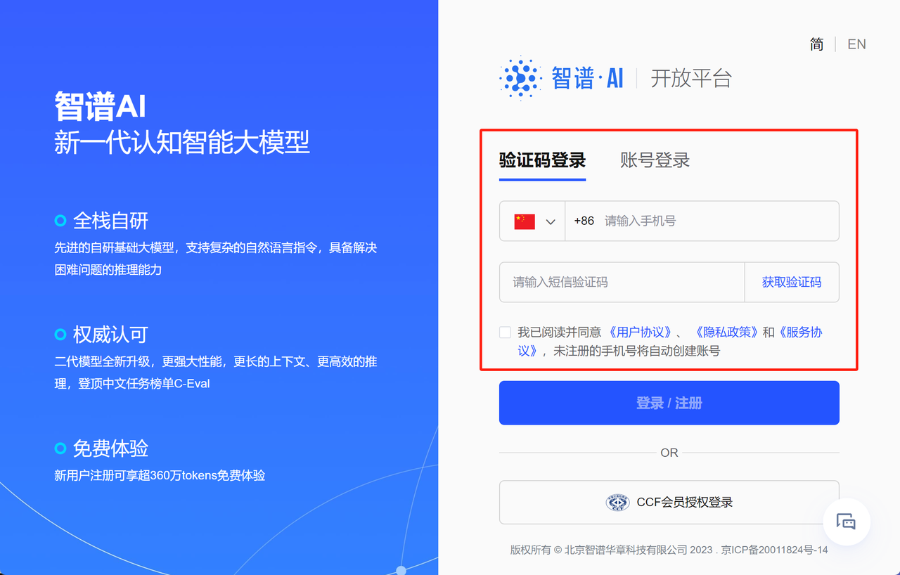

首次注册用户会获赠100万token额度，并且注册用户首次完成实名认证，还会进一步赠送200万token额度。正如此前所说，实名制也是确保大模型使用安全性的重要一环，从智谱AI目前的注册流程来看，也是更加倾向于引导用户完成实名制注册：


这里可以直接点击立即认证进行认证，或者其他任何时候都可以在个人主页进行认证。若错过当前页面，也可以在[个人中心](https://open.bigmodel.cn/overview)里面进行实名认证：


点击实名认证，可以发现目前有两种认证方法，分别是个人认证和企业认证。认证结束后即可自动获得200万免费token额度。其中个人认证需要身份证+支付宝扫码进行人脸识别认证，企业认证则需要企业名称、社会信用代码和营业执照扫描件等。两种不同的认证方法就相当于创建两种不同类型的账户，企业账户可以开增值税专用发票，并且会更加便于对账户进行管理:


这里如果是个人认证，则直接点击个人实名认证，输入身份证、以及支付宝扫码完成认证即可：

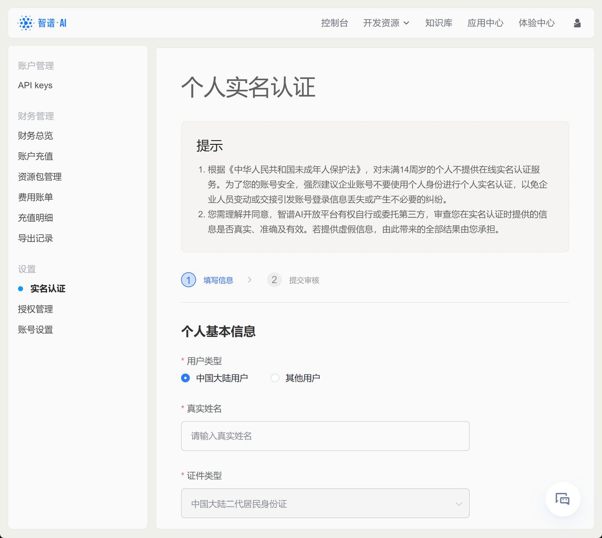

完成实名制之后，接下来即可点击左侧[资源包管理](https://open.bigmodel.cn/usercenter/resourcepack)，查看当前账户赠送的token额度。能够发现，赠送的额度都是1个月内有效：

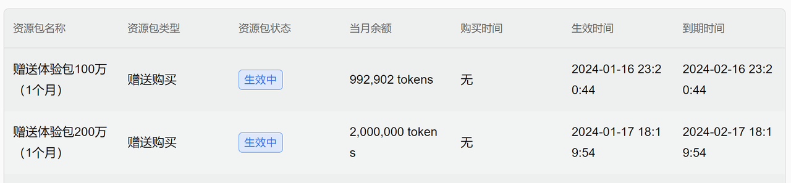

同时，在[资源包管理](https://open.bigmodel.cn/usercenter/resourcepack)页面上，也能看到新用户首次充值优惠活动，99元可以购买1.8亿token额度。这里点击去购买选项即可进入购买页面。需要注意的是，只有完成了实名注册，才可以购买充值包：


具体大家可以根据实际自身需求选择性进行购买。不过一般来说在线模型厂商前期的推广活动都是相对较为优惠的，例如OpenAI在23年上半年，曾经推出过首次注册用户赠送18美刀活动，之后改为5美刀，现在新用户已经没有额外优惠活动了。


* 智谱AI账户管理

  对于使用付费的在线模型来说，个人账户就相当于一个在线储值系统，一般来说需要提前在账户内储值，然后智谱AI将根据实际模型使用情况在账户内进行扣费。因此了解账户页面的使用方法非常重要，在账户页面我们能实时监控当前账户消费情况、账户余额，设置余额预警等。我们可以在[财务总览](https://open.bigmodel.cn/usercenter/financialoverview)页面查看当前账户基本情况：

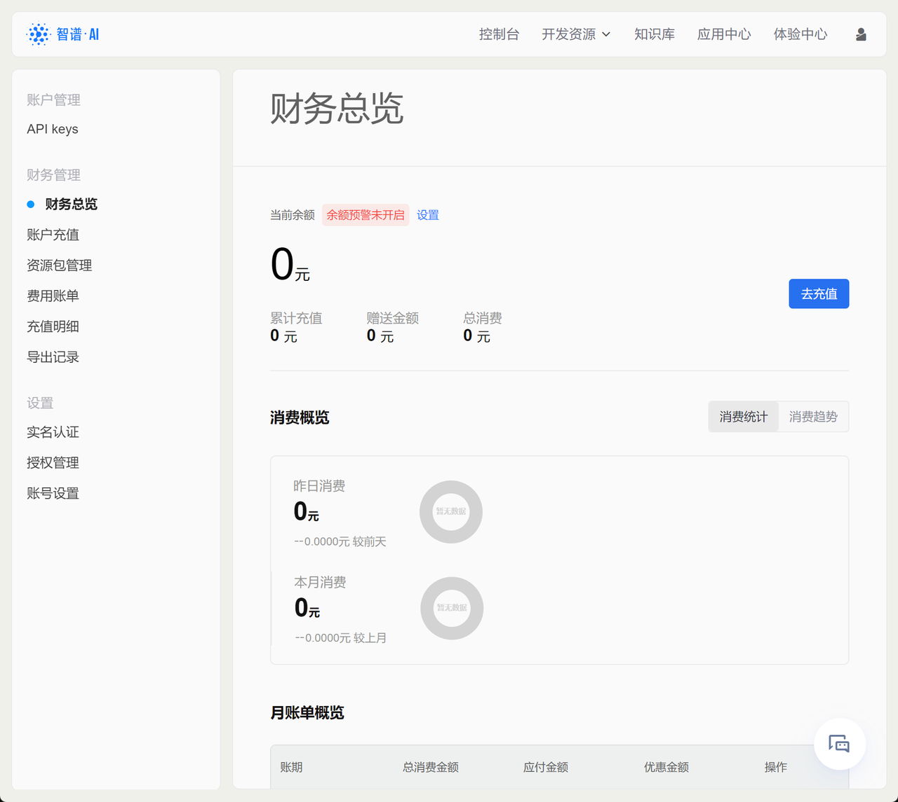

在当前页面中我们可以围绕个人账户进行管理，例如若需为账户充值，点击右侧去充值按钮即可。充值方式支持个人支付和对公转账两种：

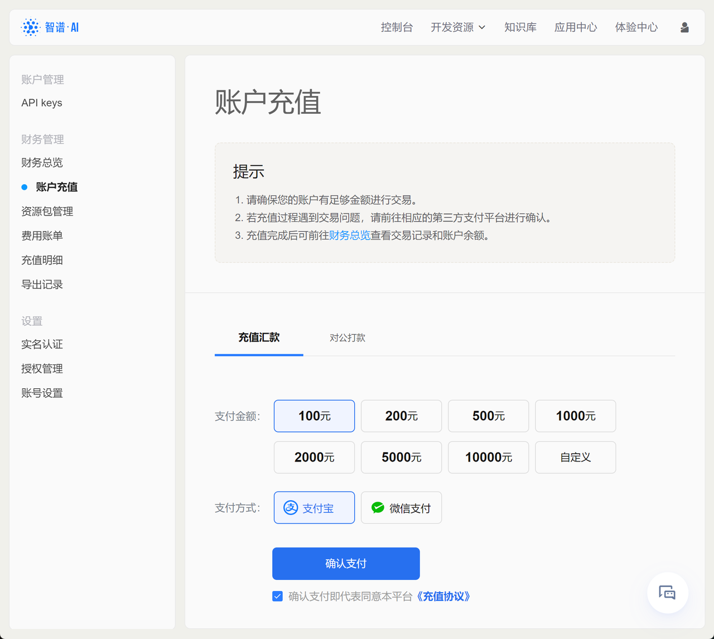

而若要设置余额预警，则点击页面上方设置按钮即可：

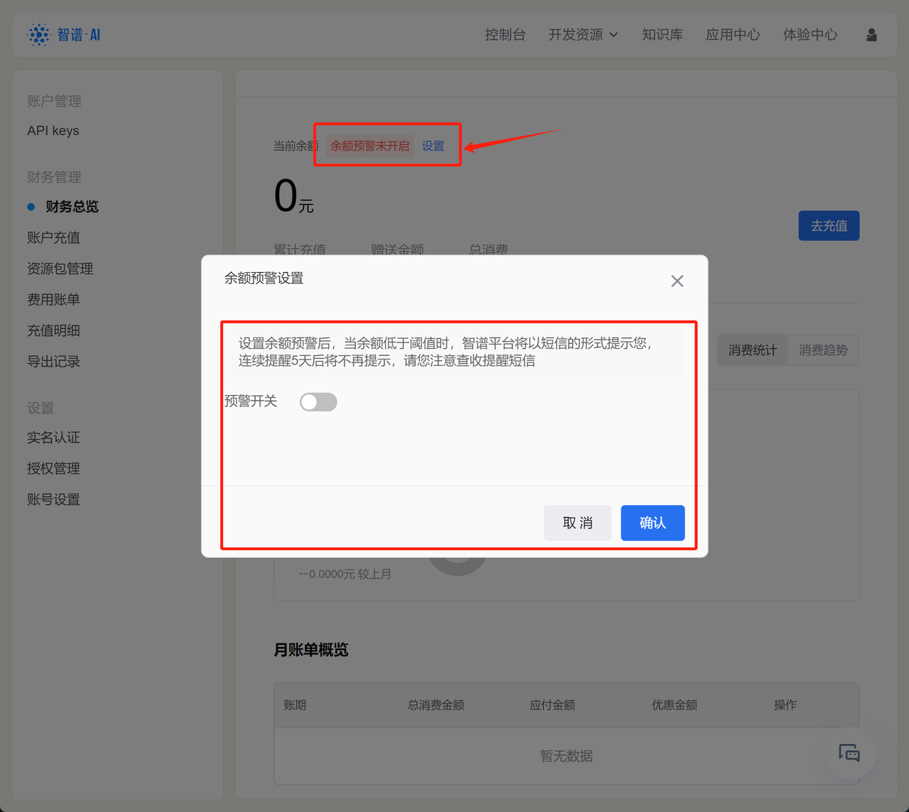

所谓余额预警，指的是可以设置某个余额的阈值，当低于这个阈值时，系统将发送短信进行提醒。这也是为了确保一些应用程序稳定运行、避免运行中途因欠费而停止，或者提升账户安全性的重要方法。

  此外，还可以在个人页面左侧查看费用账单、充值明细和导出记录等。

  而与之相关的产品定价，则可与在pricing页面查看：https://open.bigmodel.cn/pricing


| 模型          | 单价                |
| ----------- | ----------------- |
| GLM-4       | 0.1元 / 千tokens    |
| GLM-3-Turbo | 0.005元 / 千tokens  |
| CogView-3   | 0.25元 / 张         |
| CharGLM-3   | 0.015元 / 千tokens  |
| Embedding-2 | 0.0005元 / 千tokens |

#### 2.GLM模型API-KEY创建与维护

* API-KEY获取和创建流程

  所谓API-KEY，本质上就是一个字符串，用于进行在线模型调用时的身份验证。GLM模型的API-KEY获取流程如下，首先还是登录[个人中心（控制台）](https://open.bigmodel.cn/overview)，点击查看API KEY：


或者也可以直接点击如下网址查看API KEY：https://open.bigmodel.cn/usercenter/apikeys

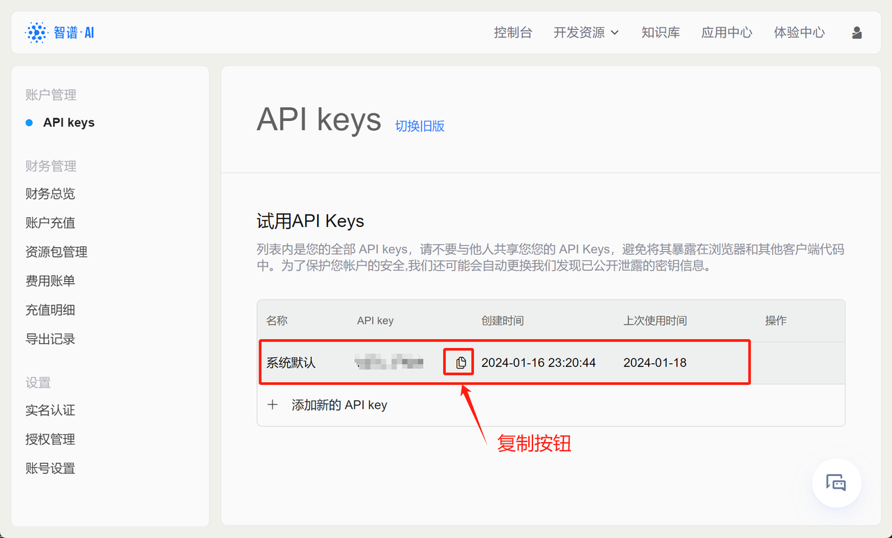

首次查看API-KEY会发现目前已经有了一个系统默认的API KEY，这里我们直接点击复制，就能复制当前API KEY字符串。这里需要注意的是，尽管我们经常都需要输入API KEY，但出于保密性考虑，“请不要与他人共享您您的 API Keys，避免将其暴露在浏览器和其他客户端代码中。”并且根据说明，智谱AI还有自动保密措施：“为了保护您帐户的安全,我们还可能会自动更换我们发现已公开泄露的密钥信息。”

* 设置API KEY环境变量

  而要如何不显示的展示API-KEY，由同时能够顺利的在代码环境中调用这个字符串呢？比较简单易行的方法就是直接将其设置为系统环境变量，然后通过os.getenv的方式进行读取。如此一来，整个代码过程都不会显示API KEY字符串本身，但能完成API KEY字符串的读取和调用，类似如下过程：

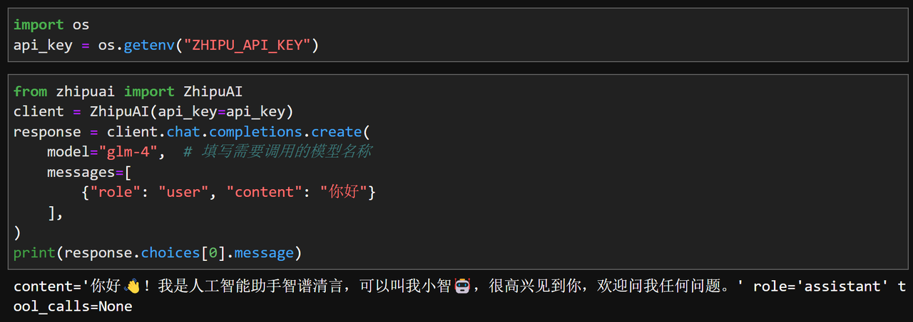

而要如何设置系统环境变量呢，首先打开系统环境变量面板：


点击环境变量


点击新建系统变量：


设置环境变量。这里变量名可以统一设置为ZHIPU\_API\_KEY，而变量值就是刚刚我们复制的API-Key。


保存重启电脑，方可使环境变量生效。

当然，在智谱官网的API-KEY页面，我们也可以创建多个API-KEY，或删除过多的API-KEY，从而完成对API-KEY的有效管理：


* 调用测试

  在完成了API获取和本地系统环境变量设置之后，接下来即可测试是否能够在本地环境中调用GLM4模型了。这里尝试运行如下代码，若能正确返回结果，则说明当前API-KEY获取和系统环境变量设置无误。首先需要安装zhipuai库：

```python
!pip install zhipuai
```

```plaintext
Requirement already satisfied: zhipuai in c:\users\admin\anaconda3\lib\site-packages (2.0.1)
Requirement already satisfied: httpx>=0.23.0 in c:\users\admin\appdata\roaming\python\python311\site-packages (from zhipuai) (0.25.1)
Requirement already satisfied: pydantic>=2.5.2 in c:\users\admin\anaconda3\lib\site-packages (from zhipuai) (2.5.3)
Requirement already satisfied: cachetools>=4.2.2 in c:\users\admin\anaconda3\lib\site-packages (from zhipuai) (5.3.1)
Requirement already satisfied: pyjwt~=2.8.0 in c:\users\admin\anaconda3\lib\site-packages (from zhipuai) (2.8.0)
Requirement already satisfied: anyio in c:\users\admin\anaconda3\lib\site-packages (from httpx>=0.23.0->zhipuai) (3.5.0)
Requirement already satisfied: certifi in c:\users\admin\anaconda3\lib\site-packages (from httpx>=0.23.0->zhipuai) (2023.7.22)
Requirement already satisfied: httpcore in c:\users\admin\appdata\roaming\python\python311\site-packages (from httpx>=0.23.0->zhipuai) (1.0.1)
Requirement already satisfied: idna in c:\users\admin\anaconda3\lib\site-packages (from httpx>=0.23.0->zhipuai) (3.4)
Requirement already satisfied: sniffio in c:\users\admin\anaconda3\lib\site-packages (from httpx>=0.23.0->zhipuai) (1.2.0)
Requirement already satisfied: annotated-types>=0.4.0 in c:\users\admin\appdata\roaming\python\python311\site-packages (from pydantic>=2.5.2->zhipuai) (0.6.0)
Requirement already satisfied: pydantic-core==2.14.6 in c:\users\admin\anaconda3\lib\site-packages (from pydantic>=2.5.2->zhipuai) (2.14.6)
Requirement already satisfied: typing-extensions>=4.6.1 in c:\users\admin\anaconda3\lib\site-packages (from pydantic>=2.5.2->zhipuai) (4.7.1)
Requirement already satisfied: h11<0.15,>=0.13 in c:\users\admin\appdata\roaming\python\python311\site-packages (from httpcore->httpx>=0.23.0->zhipuai) (0.14.0)
```

然后尝试运行如下代码：

```python
import os
api_key = os.getenv("ZHIPU_API_KEY")
```

```python
from zhipuai import ZhipuAI
client = ZhipuAI(api_key=api_key) 
response = client.chat.completions.create(
    model="glm-4",  # 填写需要调用的模型名称
    messages=[
        {"role": "user", "content": "你好"}
    ],
)
print(response.choices[0].message)
```

```plaintext
content='你好👋！我是人工智能助手智谱清言，可以叫我小智🤖，很高兴见到你，欢迎问我任何问题。' role='assistant' tool_calls=None
```

若能正常返回结果，则说明此前配置无误。

#### 3.GLM模型官网其他重要功能

  至此，我们就已经能够顺利在本地调用GLM-4模型了。在正式开始介绍GLM-4模型使用方法和模型特性之前，我们还需要围绕GLM官网的一些核心内容进行说明，方便后续同学们对其内容进行自行查阅：

* 体验中心：https://open.bigmodel.cn/trialcenter
    提供了GLM系列模型在线使用的方法，可以直接在线调整参数并调用模型，测试模型对话效果。功能定位对标OpenAI PlayGround：

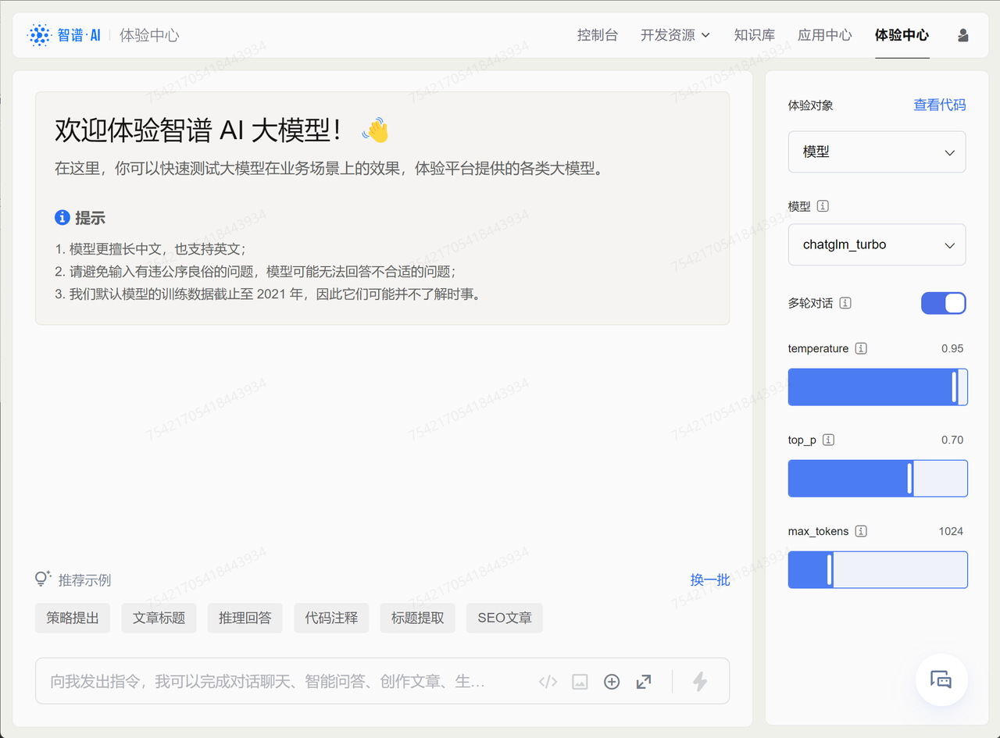

* 知识库：https://open.bigmodel.cn/knowledge
    提供了在线上传文档的功能，主要应用于在线微调和在线模型的定制文档问答，后续在使用在线文档问答时需要用到该功能。对标OpenAI File system：

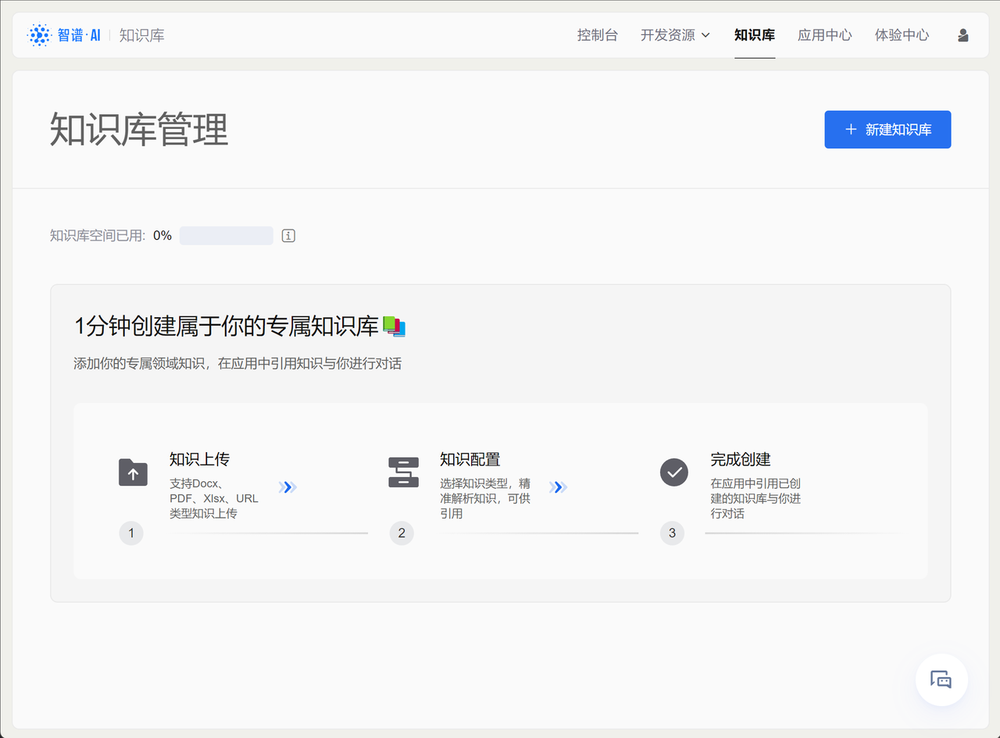

* 场景示例：https://open.bigmodel.cn/dev/openpower
    提供了非常多GLM模型应用的典型场景，以及提示示例，包括标题创作、社交媒体文案创作、在非结构化信息中进行信息提取等：

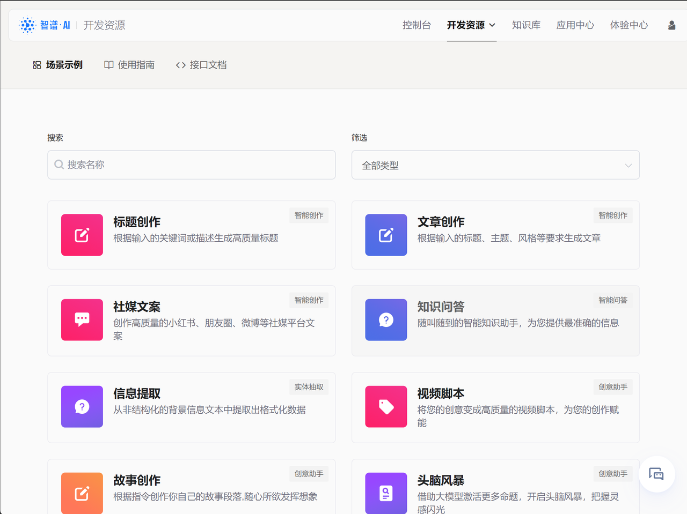

* 使用指南：https://open.bigmodel.cn/dev/howuse/introduction
    顾名思义，使用指南就是目前上线的模型功能的完整说明，以及调用方法介绍：

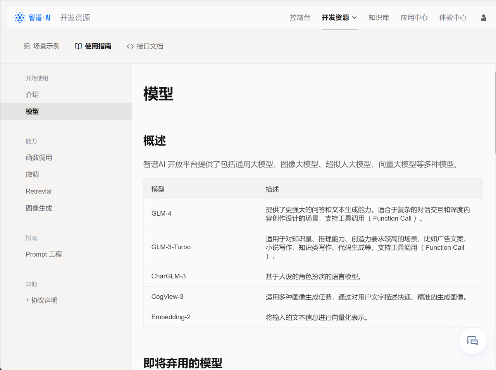

* 接口文档：https://open.bigmodel.cn/dev/api
    模型API说明文档，包括各类模型的API使用方法、不同类型调用方法、以及模型参数等：

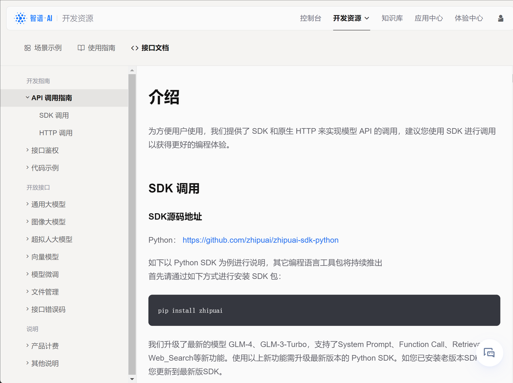

至此，我们就全部的前期准备工作，接下来即可进入到后续的课程中进行学习。
