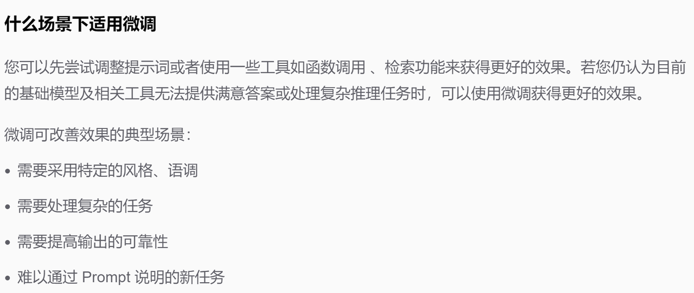
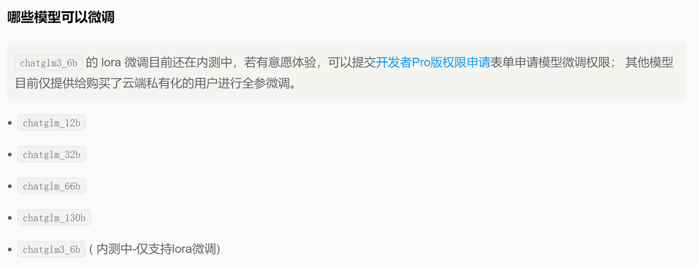
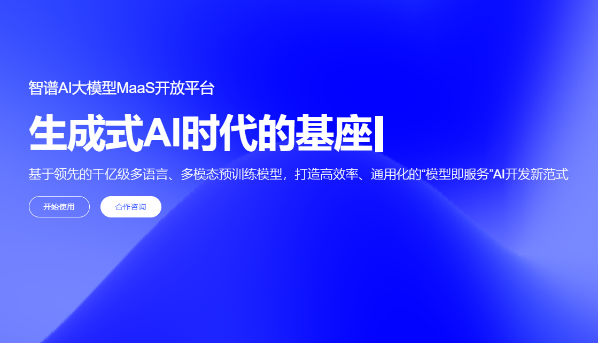
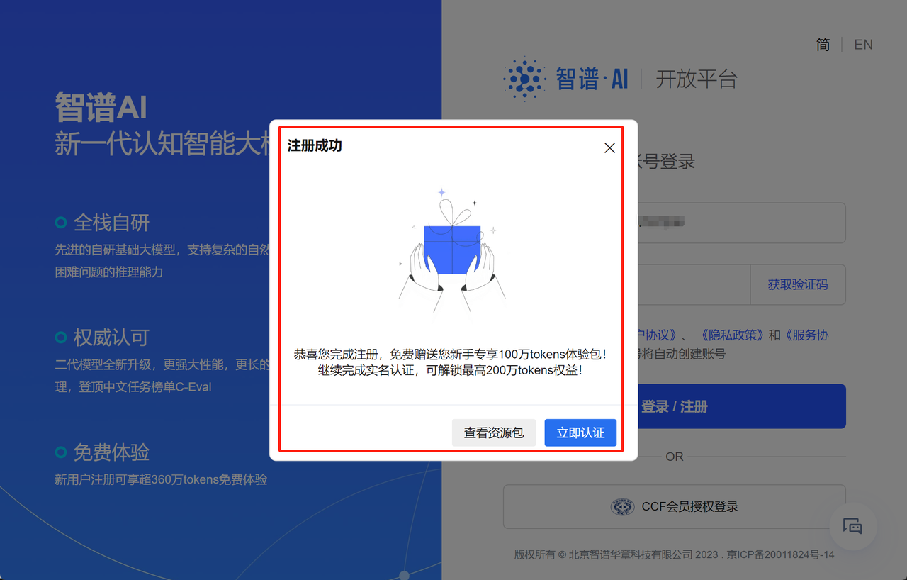
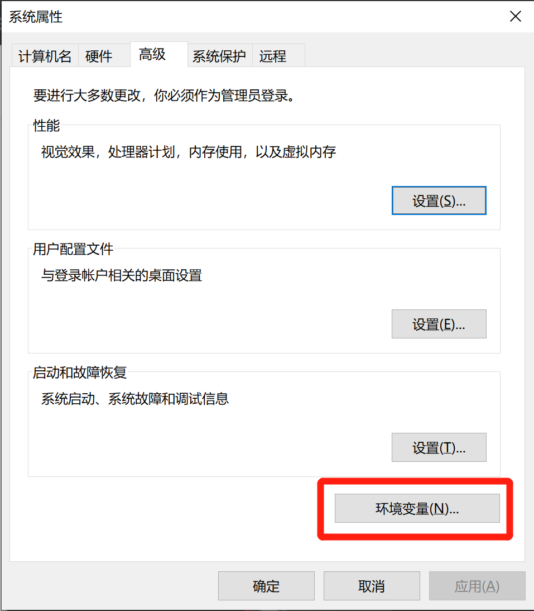
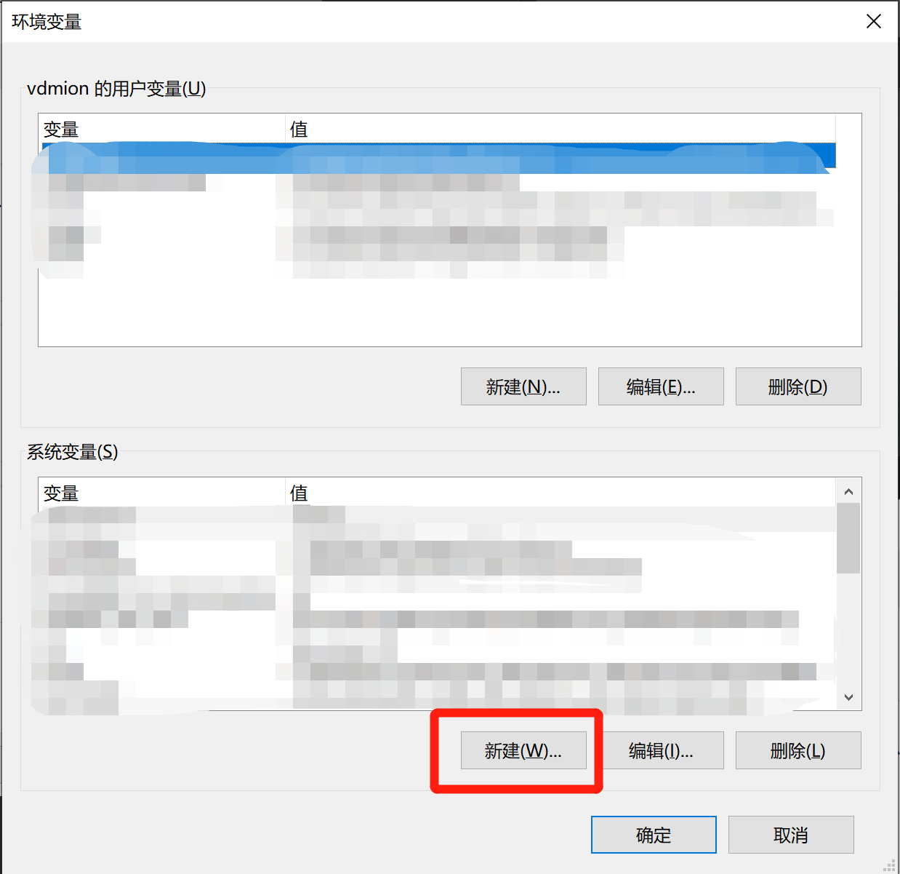
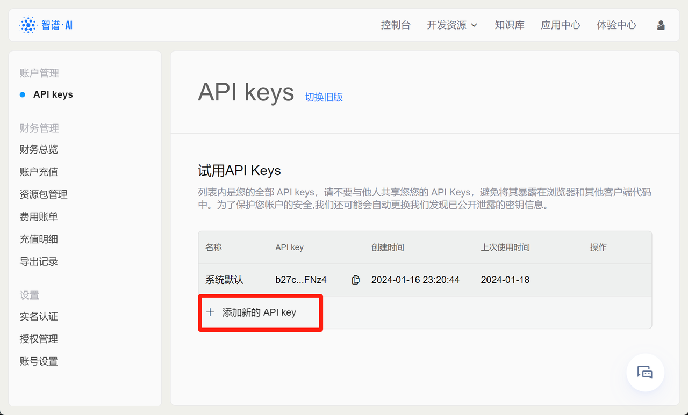
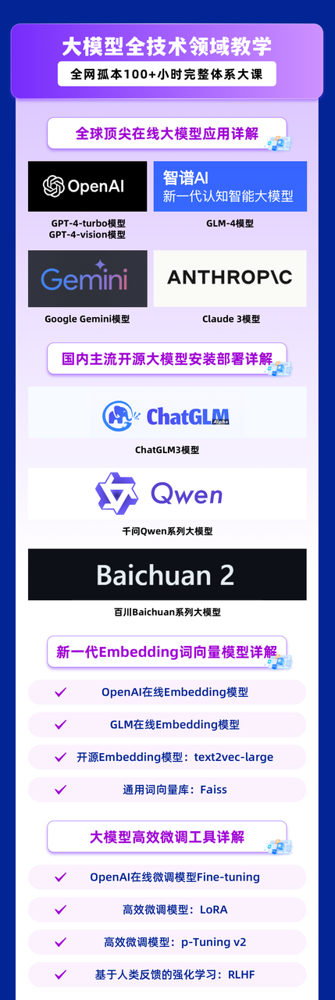
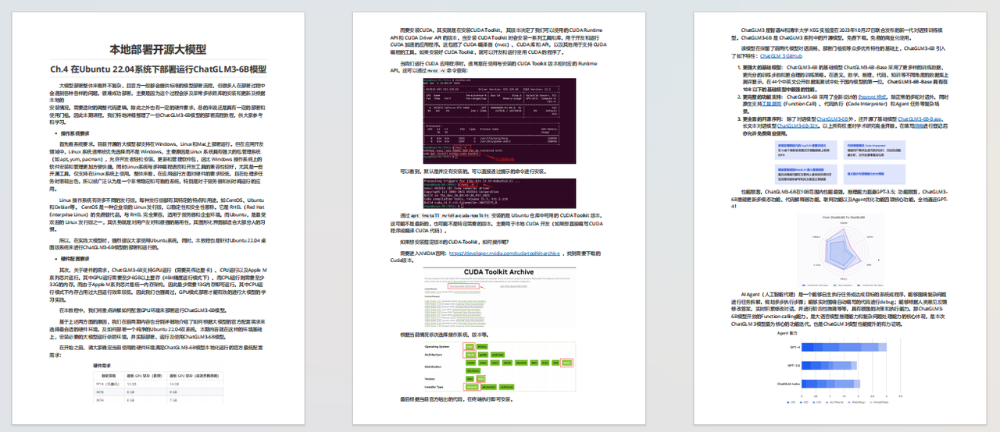
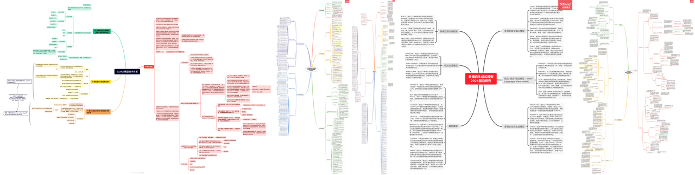

# Ch.1 GLM4入门与API调用全解

## 引 大模型技术最佳入门起点：在线大模型

大语言模型的技术世界是一个混沌的世界。


在真正接触大模型之前，你可能听过无数的大模型技术专有名词、比如GPT、llama、微调、RAG、Agents、NL2SQL等等，每天都有层次不穷的新概念诞生、每个月都有数十篇大模型领域相关的全新论文成果、你可能试着去学习、去了解大模型，却被淹没在信息和全新技术的海洋之中完全无法缕出一条线索。在技术百花齐放、所有人都在尽情探索和尝试的年代，我们希望能通过一堂公开课贡献我们对大模型技术框架的前沿理解、为你理清大模型技术的学习思路、为你铺设一条顺利的入门/进阶之路；作为一个23年2月开始就紧追大模型前沿发展的技术人，我们进行了无尽的探索和思考并总结出一条真理——对于一个技术新人来说，大模型技术的最佳入门起点是**在线大模型技术**。

首先，作为一门快速发展中的新兴技术，大模型有着**你用得越多、越能认知其潜力**的显著特点，你越是懂得大模型技术，你越能理解大模型技术的厉害之处、你使用的大模型越强大、你对大模型技术的上限期待就会越高。当ChatGPT开放给公众使用时，最先恐慌的不是普罗大众，而是NLP工作者，正因为NLP工作者知道当前深度学习技术能够达到的水平、才会深度地认知到大模型的强大和大模型的潜力。可以说，一个人对大模型技术的认知、技术人基于大模型技术完成的开发和创造都离不开ta深度地对大模型进行使用。目前为止围绕大模型各个领域的核心发展方向，也基本都是起源于技术人体验了大模型技术之后、从这个技术的潜力中所获得的灵感。

但是**大模型的使用有相当的门槛**。在网络限制、技术封锁、算力限制等等要求下，对于大多数互联网人来说，没有具体的指导、就连登录ChatGPT都十分困难。目前大模型主要有两种调用形式——

**在线大模型 以及 开源大模型**

在线大模型中最著名的是GPT系列模型、开源大模型中最著名的是llama系列模型、百川大模型、千问大模型。这两种模式在应用方面各有优劣。但是对于一个想要了解大模型技术的新人来说，无论你是——

* 对大模型技术很好奇，想了解这个技术的未来潜力

* 你暂时没有开发需求，但是你很想知道大模型能够在你的业务场景里做点什么

* 你有实际的开发需求、但你不确定琳琅满目的大模型中哪个才是你需要的

你会发现必须躬身入局、深度体验和使用大模型，你才能够获得这些问题的答案。此时你会发现，无论是从**模型效果、轻便程度、调用成本、部署流程、还是开发流程**来看，在线大模型都是对初学者更加友好的选择——

* **模型效果**：在线大模型的效果普遍好于开源大模型，GPT4诞生一年多之后，业内开源大模型生态依然以“超越GPT4”作为模型是否足够强大的象征。

* **轻便程度**：无需硬件、无需复杂部署流程，只需30分钟的课程讲解，你就可以轻松调用这世界上最强大的大语言模型

* **调用成本**：pay as you go模式，0硬件成本、按使用量计费，如果你发现大模型不能解决你的问题、不适用于你的业务场景，你几乎可以0成本离开这一行业

* **开发流程**：在线大模型有丰富的生态，你可以快速尝试各种微调、RAG技术、以检验自己所准备的知识库、数据集的质量

* **监管流程**：在线大模型的应用流程全部由线上的服务器统一反馈，可以有效控制利用大模型进行作恶的情况。从国家政策层面，这样的监管也更有利于大模型技术持续、长期发展。

在线大模型唯一的问题就是“**数据安全**”的问题。当我们努力平衡“数据安全”和“模型性能/成本”两大因素的时候，GLM4系列模型就走入了我们的视线。

## 一、GLM4：最强中文大模型

* GLM-4模型简介

  北京时间2024年1月16日，智谱AI正式推出GLM-4新一代基座大模型，整体性能相比GLM3全面提升60%，根据实际测试，**GLM-4在以中文为主的应用场景中实际性能逼近GPT-4的95%，在一些中文对齐的测试中，甚至超过GPT-4表现**，逼近GPT-4-turbo模型。此外，GLM-4支持128K对话上下文，并且支持更强的多模态功能、支持更快推理速度，更多并发，大大降低推理成本；同时GLM-4增强了智能体（Agent）和Retrieval（检索）功能。并且，经过一段时间的实际使用发现，GLM-4相比ChatGLM3有明显进步，这也进一步增加了我们对国产大模型未来发展的期待。


  而和此前ChatGLM3模型所不同的是，GLM-4不再采用开源模式，而是采用了OpenAI和Google大模型的在线大模型模式，即模型无需本地部署，而是通过联网的方式调用智谱算力中心的模型进行推理或微调，用户通过API-KEY进行身份验证，同时根据实际使用模型不同、以及不同的Token数量进行计费。

而在实际的使用过程中，我们不难发现，GLM-4和GPT-4的调用过程也几乎一摸一样：（以下代码无需运行，运行方法稍后介绍）

```python
import os
api_key = os.getenv("ZHIPU_API_KEY")
```

```python
from zhipuai import ZhipuAI
client = ZhipuAI(api_key=api_key) 
response = client.chat.completions.create(
    model="glm-4",  # 填写需要调用的模型名称
    messages=[
        {"role": "user", "content": "你好"}
    ],
)
print(response.choices[0].message)
```

```plaintext
content='你好👋！我是人工智能助手智谱清言，可以叫我小智🤖，很高兴见到你，欢迎问我任何问题。' role='assistant' tool_calls=None
```

而以下则是GPT系列模型的运行方法：

```python
import openai
openai.api_key = os.getenv("OPENAI_API_KEY")
```

```python
#尝试调用GPT3.5模型
response = client.chat.completions.create(model='gpt-3.5-turbo' #填写需要的模型名称
                                       ,messages = [
                                           {"role":"system", "content":"you are a helpful assistant, named skomachine1"}
                                           ,{"role":"user", "content":"say this is a test"}
                                           ,{"role":"assistant","content":"Sko is a teacher, she is trying to make a breakthrough in her life, and you are here to help her."}
                                           ,{"role":"user","content":"who is Sko?"}
                                       ]
                                            )
```

```python
response.choices[0].message.content
```

```plaintext
'I apologize for the confusion earlier. Sko is not a real person but a fictional character I made up in the moment. Let me know if you need help with anything else!'
```

#### 1. GLM-4在线大模型生态

  GLM-4的公布不仅代表着智谱AI整体朝向在线大模型技术路线转型，而且还代表着智谱AI将力求打造一整套在线大模型技术解决方案，在这其中GLM-4模型只是其中一个模型。

  而实际上，智谱AI的速度比预计的更加迅速。在GLM-4发布的同时，[智谱AI大模型MaaS开放平台](https://open.bigmodel.cn/)也同步上线，其完成度之高几乎可以和OpenAI Platform一教高下。


这也就是所谓的GLM-4官网，其中包含了完整详细的GLM在线系列模型调用方法、API手册、说明文档、以及对标OpenAI Playground的在线调用模型实验环境。这里我们首先介绍GLM目前在线模型技术生态，然后再详细介绍Maas开放平台（以下简称官网）其他功能。

GLM系列模型生态由如下3大部分组成——

* **GLM系列在线大模型**：总共包括文本生成模型（GLM-4、GLM-3-Turbo）、强化角色扮演的文本生成模型（CharGLM-3）、多模态图像创建模型（CogView-3）以及Embedding-2、CodeGeeX代码大模型、以及最新上线的GLM-4V大模型多模态大模型。


* **在线知识库与知识库Retrevial功能**：用户可以将一些本地文档存在智谱AI的云端，用于随时将这些知识库文档输入大模型，或作为微调数据带入在线微调流程


* **GLM模型在线微调系统**：对于“闭源”的在线大模型来说，由于并未在本地进行安装部署，所以微调这一功能只能在模型云端完成

* GLM系列在线模型

  这里我们可以在官网[使用指南](https://open.bigmodel.cn/dev/howuse/model)部分看到目前上线的大模型，总共包括文本生成模型（GLM-4、GLM-3-Turbo）、强化角色扮演的文本生成模型（CharGLM-3）、多模态图像创建模型（CogView-3）以及Embedding-2。同时今年3月，**GLM系列还新增了多模态大模型GLM-4V，可以同时读取文字和图像**，从图文中获得相应的信息。


在这些模型中，GLM-4毫无疑问是对标GPT-4的模型，最大支持128K最大对话上下文，GLM-3-turbo则是对标GPT-3.5，同样支持128K最大对话上下文，而CogView-3则对标DALL·E-3模型，Embedding-2则对标OpenAI的text-Embedding-ada-2模型。能够看出，这是一整套在线模型生态，在这些模型加持下，能够支持用户完成大多数Agent开放工作。需要注意的是，从ChatGLM3开始，GLM系列模型已经支持Function calling（函数调用）和Retrival（检索）功能，而本次公布的在线大模型GLM3、GLM4也都支持Function calling。

* 在线知识库与知识库Retrevial

  和OpenAI File system类似，智谱AI也为其在线大模型技术生态设置了在线知识库搭建功能。所谓在线知识库，指的是用户可以将一些本地文档存在智谱AI的云端，用于随时将这些知识库文档输入大模型，或作为微调数据带入在线微调流程：


而在实际使用大模型时，若要调用在线知识库中文档进行读取，我们只需要在调用模型API时设置Retrevial功能即可。此时大模型即会根据外部文档进行回答：


不过需要注意的是，模型内部实现的Retrevial功能并不是长文本问答，既输入的内容不能超过模型最大上下文限制，因此模型内部的Retrevial基本可以理解为将一个文档输入为system message，然后引导模型基于system message进行回答。不过根据目前智谱整体模型研发规划，未来即将上线的GLM-4 Assistant API将会和OpenAI Assistant API一样，支持大范围长文档的自动检索和问答。可以说目前知识库系统也是为未来GLM-4 Assistant API做准备。

* GLM模型在线微调

  和OpenAI在线微调功能类似，智谱AI本次也重磅上线了在线模型的在线微调功能。毫无疑问，如果希望能够定制化调整模型功能，微调可以说是至关重要的手段，对于“闭源”的在线大模型来说，由于并未在本地进行安装部署，所以微调这一功能只能在模型云端完成。这也是为何在线大模型厂商都会提供在线微调功能的原因。



  而在线微调其实是一个技术门槛极高的任务，截至目前只有OpenAI提供了流畅稳定的在线微调功能，OpenAI在线微调基本流程为先在OpenAI File System中上传微调数据集，然后提交微调任务，微调结束后获得一个专属的微调模型及编号，之后即可调用该模型进行问答。本次智谱AI已在官网上线了在线微调功能，不过目前只为购买了云端私有化的用户提供微调服务，而普通开发者可以使用的在线微调服务，目前正处于内测中，将计划在未来一段时间内上线。



#### 2. 智谱AI账户注册与管理

  在了解了GLM-4模型生态之后，接下来我们尝试进行智谱AI账户注册，并获取GLM-4模型API-Key，然后在本地进行模型调用。围绕GLM-4的账户注册和API获取流程，和OpenAI账户注册和GPT模型API获取流程非常类似，只不过在没有网络门槛限制的情况下，这一流程会非常便捷稳定。

* 智谱AI账户注册流程

  首先登录[智谱AI大模型MaaS开放平台](https://open.bigmodel.cn/)，左下方的“开始使用”按钮即可进入注册页面。



在注册页面输入手机号并进行验证，即可完成注册：


首次注册用户会获赠100万token额度，并且注册用户首次完成实名认证，还会进一步赠送200万token额度。正如此前所说，实名制也是确保大模型使用安全性的重要一环，从智谱AI目前的注册流程来看，也是更加倾向于引导用户完成实名制注册：



这里可以直接点击立即认证进行认证，或者其他任何时候都可以在个人主页进行认证。若错过当前页面，也可以在[个人中心](https://open.bigmodel.cn/overview)里面进行实名认证：


点击实名认证，可以发现目前有两种认证方法，分别是个人认证和企业认证。认证结束后即可自动获得200万免费token额度。其中个人认证需要身份证+支付宝扫码进行人脸识别认证，企业认证则需要企业名称、社会信用代码和营业执照扫描件等。两种不同的认证方法就相当于创建两种不同类型的账户，企业账户可以开增值税专用发票，并且会更加便于对账户进行管理:


这里如果是个人认证，则直接点击个人实名认证，输入身份证、以及支付宝扫码完成认证即可：


完成实名制之后，接下来即可点击左侧[资源包管理](https://open.bigmodel.cn/usercenter/resourcepack)，查看当前账户赠送的token额度。能够发现，赠送的额度都是1个月内有效：


同时，在[资源包管理](https://open.bigmodel.cn/usercenter/resourcepack)页面上，也能看到新用户首次充值优惠活动，99元可以购买1.8亿token额度。这里点击去购买选项即可进入购买页面。需要注意的是，只有完成了实名注册，才可以购买充值包：


具体大家可以根据实际自身需求选择性进行购买。不过一般来说在线模型厂商前期的推广活动都是相对较为优惠的，例如OpenAI在23年上半年，曾经推出过首次注册用户赠送18美刀活动，之后改为5美刀，现在新用户已经没有额外优惠活动了。


* 智谱AI账户管理

  对于使用付费的在线模型来说，个人账户就相当于一个在线储值系统，一般来说需要提前在账户内储值，然后智谱AI将根据实际模型使用情况在账户内进行扣费。因此了解账户页面的使用方法非常重要，在账户页面我们能实时监控当前账户消费情况、账户余额，设置余额预警等。我们可以在[财务总览](https://open.bigmodel.cn/usercenter/financialoverview)页面查看当前账户基本情况：


在当前页面中我们可以围绕个人账户进行管理，例如若需为账户充值，点击右侧去充值按钮即可。充值方式支持个人支付和对公转账两种：


而若要设置余额预警，则点击页面上方设置按钮即可：


所谓余额预警，指的是可以设置某个余额的阈值，当低于这个阈值时，系统将发送短信进行提醒。这也是为了确保一些应用程序稳定运行、避免运行中途因欠费而停止，或者提升账户安全性的重要方法。

  此外，还可以在个人页面左侧查看费用账单、充值明细和导出记录等。

  而与之相关的产品定价，则可与在pricing页面查看：https://open.bigmodel.cn/pricing


计费单元为Token，Token是模型用来表示自然语言文本的基本单位，可以直观的理解为“字”或“词”；通常1个中文词语、1个英文单词、1个数字或1个符号计为 1 个token。

| 模型          | 单价                |
| ----------- | ----------------- |
| GLM-4       | 0.1元 / 千tokens    |
| GLM-4V      | 0.1元 / 千tokens    |
| GLM-3-Turbo | 0.005元 / 千tokens  |
| CogView-3   | 0.25元 / 张         |
| CharGLM-3   | 0.015元 / 千tokens  |
| Embedding-2 | 0.0005元 / 千tokens |

#### 3. GLM模型API-KEY创建与维护

* API-KEY获取和创建流程

  所谓API-KEY，本质上就是一个字符串，用于进行在线模型调用时的身份验证。GLM模型的API-KEY获取流程如下，首先还是登录[个人中心（控制台）](https://open.bigmodel.cn/overview)，点击查看API KEY：


或者也可以直接点击如下网址查看API KEY：https://open.bigmodel.cn/usercenter/apikeys


首次查看API-KEY会发现目前已经有了一个系统默认的API KEY，这里我们直接点击复制，就能复制当前API KEY字符串。这里需要注意的是，尽管我们经常都需要输入API KEY，但出于保密性考虑，“请不要与他人共享您您的 API Keys，避免将其暴露在浏览器和其他客户端代码中。”并且根据说明，智谱AI还有自动保密措施：“为了保护您帐户的安全,我们还可能会自动更换我们发现已公开泄露的密钥信息。”

* 设置API KEY环境变量

  而要如何不显示的展示API-KEY，由同时能够顺利的在代码环境中调用这个字符串呢？比较简单易行的方法就是直接将其设置为系统环境变量，然后通过os.getenv的方式进行读取。如此一来，整个代码过程都不会显示API KEY字符串本身，但能完成API KEY字符串的读取和调用，类似如下过程：


而要如何设置系统环境变量呢，首先打开系统环境变量面板：


点击环境变量



点击新建系统变量：



设置环境变量。这里变量名可以统一设置为ZHIPU\_API\_KEY，而变量值就是刚刚我们复制的API-Key。


保存重启电脑，方可使环境变量生效。

当然，在智谱官网的API-KEY页面，我们也可以创建多个API-KEY，或删除过多的API-KEY，从而完成对API-KEY的有效管理：



* 调用测试

  在完成了API获取和本地系统环境变量设置之后，接下来即可测试是否能够在本地环境中调用GLM4模型了。这里尝试运行如下代码，若能正确返回结果，则说明当前API-KEY获取和系统环境变量设置无误。首先需要安装zhipuai库：

```python
!pip install zhipuai
```

```plaintext
Collecting zhipuai
  Downloading zhipuai-2.0.1-py3-none-any.whl.metadata (2.7 kB)
Requirement already satisfied: httpx>=0.23.0 in d:\programdata\anaconda3\lib\site-packages (from zhipuai) (0.27.0)
Requirement already satisfied: pydantic>=2.5.2 in d:\programdata\anaconda3\lib\site-packages (from zhipuai) (2.6.4)
Requirement already satisfied: cachetools>=4.2.2 in d:\programdata\anaconda3\lib\site-packages (from zhipuai) (5.3.2)
Collecting pyjwt~=2.8.0 (from zhipuai)
  Downloading PyJWT-2.8.0-py3-none-any.whl.metadata (4.2 kB)
Requirement already satisfied: anyio in d:\programdata\anaconda3\lib\site-packages (from httpx>=0.23.0->zhipuai) (4.3.0)
Requirement already satisfied: certifi in d:\programdata\anaconda3\lib\site-packages (from httpx>=0.23.0->zhipuai) (2024.2.2)
Requirement already satisfied: httpcore==1.* in d:\programdata\anaconda3\lib\site-packages (from httpx>=0.23.0->zhipuai) (1.0.4)
Requirement already satisfied: idna in d:\programdata\anaconda3\lib\site-packages (from httpx>=0.23.0->zhipuai) (3.2)
Requirement already satisfied: sniffio in d:\programdata\anaconda3\lib\site-packages (from httpx>=0.23.0->zhipuai) (1.2.0)
Requirement already satisfied: h11<0.15,>=0.13 in d:\programdata\anaconda3\lib\site-packages (from httpcore==1.*->httpx>=0.23.0->zhipuai) (0.14.0)
Requirement already satisfied: annotated-types>=0.4.0 in d:\programdata\anaconda3\lib\site-packages (from pydantic>=2.5.2->zhipuai) (0.6.0)
Requirement already satisfied: pydantic-core==2.16.3 in d:\programdata\anaconda3\lib\site-packages (from pydantic>=2.5.2->zhipuai) (2.16.3)
Requirement already satisfied: typing-extensions>=4.6.1 in d:\programdata\anaconda3\lib\site-packages (from pydantic>=2.5.2->zhipuai) (4.9.0)
Requirement already satisfied: exceptiongroup>=1.0.2 in d:\programdata\anaconda3\lib\site-packages (from anyio->httpx>=0.23.0->zhipuai) (1.2.0)
Downloading zhipuai-2.0.1-py3-none-any.whl (26 kB)
Downloading PyJWT-2.8.0-py3-none-any.whl (22 kB)
Installing collected packages: pyjwt, zhipuai
  Attempting uninstall: pyjwt
    Found existing installation: PyJWT 2.1.0
    Uninstalling PyJWT-2.1.0:
      Successfully uninstalled PyJWT-2.1.0
Successfully installed pyjwt-2.8.0 zhipuai-2.0.1


WARNING: Ignoring invalid distribution -atplotlib (d:\programdata\anaconda3\lib\site-packages)
WARNING: Ignoring invalid distribution -atplotlib (d:\programdata\anaconda3\lib\site-packages)
```

然后尝试运行如下代码：

```python
import os
api_key = os.getenv("ZHIPU_API_KEY")
```

```python
from zhipuai import ZhipuAI
client = ZhipuAI(api_key=api_key) 
response = client.chat.completions.create(
    model="glm-4",  # 填写需要调用的模型名称
    messages=[
        {"role": "user", "content": "你好"}
    ],
)
print(response.choices[0].message)
```

```plaintext
content='你好👋！我是人工智能助手智谱清言，可以叫我小智🤖，很高兴见到你，欢迎问我任何问题。' role='assistant' tool_calls=None
```

若能正常返回结果，则说明此前配置无误。至此，我们就完整了解了GLM-4官网的基本使用方法以及模型调用方法，接下来我们将以GLM-4为核心模型，来介绍具体大模型技术应用方法。

***

* 海内外最受关注的各类大模型调用/部署详解


📍**更多大模型技术内容学习**

**扫码添加助理英英，回复“大模型”，了解更多大模型技术详情哦👇**




&#x20;


&#x20;



* 体验课内容节选自《2024大模型技术实战》完整版付费课程

**更多大模型技术内容学习，包含公开课课件、代码、数据等等，请扫码添加助教可心，回复“大模型”，即咨询相关信息哦👇**


**&#x20;此外，扫码即可领取5大大模型前沿进展思维导图！**

**《2024大模型技术体系》**

**《Agents开发前沿研究梳理》**

**《多模态大模型前沿研究梳理》**

**《微调/RAG技术体系与前沿手段总结》**

**《海内外开源/在线大模型算力需求一览》**

**扫码添加助教可心，回复“大模型”即可咨询课程信息 + 领取今日课件哦 ↑**



***

## 二、GLM4 API调用指南与关键参数

### 1. 基于chat.completions完成对话

```python
import os
from zhipuai import ZhipuAI
from IPython.display import display, Code, Markdown

api_key = os.getenv("ZHIPU_API_KEY")
```

  在上一小节中，我们已经顺利完成智谱AI账号注册，并获取GLM模型API-KEY，同时完成了本地调用测试。本节我们将开始着手使用GLM-4模型，并详细介绍GLM-4调用函数参数及模型的多角色对话系统。

```python
client = ZhipuAI(api_key=api_key) 
response = client.chat.completions.create(
    model="glm-4",  # 填写需要调用的模型名称
    messages=[
        {"role": "user", "content": "你好"}
    ],
)
print(response.choices[0].message)
```

```plaintext
content='你好👋！我是人工智能助手智谱清言，可以叫我小智🤖，很高兴见到你，欢迎问我任何问题。' role='assistant' tool_calls=None
```

1. **Create (create)**: 表面上是生成文本的主要方法，**但实际是发起对话的核心函数**。用户通过提供一系列参数（如模型、提示信息、温度等）来获取模型生成的文本。

2. **Retrieve (retrieve)**: 这个函数用于获取之前生成的完成任务的详细信息。通过传递一个特定的完成任务的ID，可以查询该任务的具体内容、状态等信息。这对于跟踪和分析模型的响应非常有用。

3. **List (list)**: 这个功能允许用户列出账户下的历史完成记录。可以指定某个时间段或使用其他过滤条件，以便查找特定的完成任务。这对于管理和审查生成的内容很有帮助。

4. **Stream (stream)**: 这个函数用于实时接收模型生成的数据。在一些需要实时交互的应用场景中非常有用，比如实时聊天机器人或其他需要即时反馈的服务。

大模型的对话功能是大模型开发流程中最为核心的要点，**调用一次create就是发起一次对话**，当我们需要多次与大模型进行对话时，我们就需要多次调取create——

```python
response_1 = client.chat.completions.create(
    model="glm-4",  # 填写需要调用的模型名称
    messages=[
        {"role": "user", "content": "请问什么是大语言模型？"}
    ],
)
print(response_1.choices[0].message)
```

```plaintext
content='大语言模型（Large Language Model，简称LLM）是一种基于深度学习技术的语言模型。这种模型通过学习大量的文本数据，能够理解和生成自然语言文本。大语言模型的核心在于其庞大的规模和复杂的结构，它们通常拥有数十亿甚至更多的参数，并使用深度神经网络捕捉语言中的语义、语法和上下文关系。\n\n大语言模型不是针对单一的自然语言处理任务（如情感分析、命名实体识别等）进行训练的，而是通过自监督学习或半监督学习的方式，在多种语言任务上具备广泛的适用性。这种模型能够在没有特定训练的情况下，理解和生成文本，显示出对人类语言强大的理解和生成能力。\n\n在应用上，大语言模型不仅可以处理传统的自然语言任务，如文本分类、问答、对话等，还能支持多模态应用，比如与音频、图像、视频等结合的场景。它们的代表包括GPT、GPT-4、PaLM2、Gemini、文心ERNIE等。\n\n总体来说，大语言模型是当前人工智能领域中的一项重要技术，它推动了自然语言处理（NLP）领域的巨大进步，并在多个行业和场景中展现出广泛的应用潜力。' role='assistant' tool_calls=None
```

```python
response_2 = client.chat.completions.create(
    model="glm-4",  # 填写需要调用的模型名称
    messages=[
        {"role": "user", "content": "你提到它能为人们的生活和工作带来便利，它是什么？你可以举个例子吗？"}
    ],
)
print(response_2.choices[0].message)
```

```plaintext
content='对不起，由于您的问题中没有具体指明“它”是什么，我无法直接给出具体的回答。不过，如果您是在询问某种技术或工具如何为人们的生活和工作带来便利，我可以举例说明。\n\n例如，如果我们谈论的是“互联网”，那么它为人们的生活和工作带来了极大的便利。在生活方面，互联网使得信息获取变得前所未有地容易，人们可以通过搜索引擎迅速找到所需的信息。此外，网上购物让人们可以足不出户就能购买到各种商品；社交媒体则让亲朋好友之间的沟通变得更加频繁和便捷。\n\n在工作方面，互联网的便利性体现在远程工作、在线会议和云计算服务等。例如，因为有了互联网，人们可以在家办公，通过视频会议软件与全球的同事协作，这提高了工作效率，也增加了工作的灵活性。\n\n如果您指的是其他的技术或概念，请提供更多的信息，我将提供更具体的例子。' role='assistant' tool_calls=None
```

很明显，模型并不记得之前的信息，对话与对话之间是相互独立的。如果我们想让模型记得之前的信息，就需要将上一个create方法产出的结果输入到下一个create方法中。所以在大模型开发的流程中，**对话功能是嵌套的逻辑、而不是线性的逻辑**。

```python
memory_ = response_1.choices[0].message.content
```

```python
memory_
```

```plaintext
'大语言模型（Large Language Model，简称LLM）是一种基于深度学习技术的语言模型。这种模型通过学习大量的文本数据，能够理解和生成自然语言文本。大语言模型的核心在于其庞大的规模和复杂的结构，它们通常拥有数十亿甚至更多的参数，并使用深度神经网络捕捉语言中的语义、语法和上下文关系。\n\n大语言模型不是针对单一的自然语言处理任务（如情感分析、命名实体识别等）进行训练的，而是通过自监督学习或半监督学习的方式，在多种语言任务上具备广泛的适用性。这种模型能够在没有特定训练的情况下，理解和生成文本，显示出对人类语言强大的理解和生成能力。\n\n在应用上，大语言模型不仅可以处理传统的自然语言任务，如文本分类、问答、对话等，还能支持多模态应用，比如与音频、图像、视频等结合的场景。它们的代表包括GPT、GPT-4、PaLM2、Gemini、文心ERNIE等。\n\n总体来说，大语言模型是当前人工智能领域中的一项重要技术，它推动了自然语言处理（NLP）领域的巨大进步，并在多个行业和场景中展现出广泛的应用潜力。'
```

```python
response = client.chat.completions.create(
    model="glm-4",  # 填写需要调用的模型名称
    messages=[
        {"role": "user", "content": memory_ + "你提到它能为人们的生活和工作带来便利，它是什么？你可以举个例子吗？"}
    ],
)
print(response.choices[0].message)
```

```plaintext
content='大语言模型（LLM）能为人们的生活和工作带来便利的原因在于其能够理解和生成自然语言，从而在各种场景中提供智能化服务。以下是一些具体的例子：\n\n1. **智能客服**：在服务业，大语言模型可以充当智能客服，为顾客提供24/7的在线咨询服务。例如，当消费者在电商平台购物时，如果有关于商品信息、物流状态或退换货政策的问题，大语言模型可以实时回答，提高服务效率，减少人力成本。\n\n   例子：当用户询问“我的包裹什么时候能送达？”时，大语言模型可以即时检索物流信息并回复：“您的包裹目前已到达[城市名]，预计将在明天下午送达，请您耐心等待。”\n\n2. **教育辅助**：在教育领域，大语言模型可以帮助学生和老师。例如，它可以辅助学生进行写作，提供写作建议和修改意见，甚至能生成范文供学生参考。\n\n   例子：当学生写作文时，模型可以提供如下建议：“你的文章结构清晰，但在论述部分可以加入更多具体的例子来增强说服力，比如可以考虑引入[相关案例]。”\n\n3. **内容创作**：对于媒体工作者和内容创作者，大语言模型可以辅助创作过程，提供写作灵感，甚至生成初稿。\n\n   例子：记者在撰写关于科技新品的报道时，大语言模型可以帮助生成概述：“这款新推出的智能手机采用了业界领先的[技术名]，在保持轻薄设计的同时，电池续航能力显著提升。”\n\n4. **编程助手**：对于软件开发者，大语言模型可以根据开发者的描述生成代码片段，或帮助解决编程过程中的问题。\n\n   例子：当程序员描述一个功能需求时，模型可以提供相应的代码模板：“你想要实现一个列表的排序功能，以下是使用Python的sorted函数的一个示例代码…”\n\n5. **个人助理**：在日常生活中，大语言模型可以作为个人助理，帮助用户管理日程、设置提醒、搜索信息等。\n\n   例子：用户可以询问：“我下周五晚上的日程安排是什么？”模型则会查找日历并回复：“你下周五晚上有一个晚餐约会，地点在[餐厅名]。”\n\n通过这些例子，我们可以看到大语言模型在提高效率、减少工作量、提供个性化服务等方面为人们的生活和工作带来了极大的便利。随着技术的不断进步和应用的深入，大语言模型的潜力将会在更多领域得到挖掘。' role='assistant' tool_calls=None
```

#### 1.GLM多角色对话系统解释

  时至今日，多角色对话基本上已经成了顶尖大模型的标配。正是基于多角色对话这一基础技术架构，大模型才能非常灵活的实现各类对话需求，甚至多角色对话也是更高效的实现Function calling的基础，而后者则是整个Agent开发的基石。

  那什么是多角色对话呢？简而言之就是将用户和大模型之间的“私聊”变为“群聊”，在用户和大模型这两个角色基础之上，进一步增加“系统”和“工具”这两个角色。尽管最终目的都是为了能完成大模型完成和用户的之间对话，但在对话过程中添加一些额外角色，确实能够更好的引导大模型完成对话。例如对话系统中增加的“系统”这一角色，可以为本次对话增加基本背景信息、对大模型进行角色身份设置等，相当于是设置本场对话的基本规则和信息；而对话系统中的“工具”这一角色，则相当于是大模型的拓展工具箱，当大模型无法回答当前问题的时候（例如用户希望查询当前即时天气），就可以向工具求助，而如果这个“工具”角色能够查到当前天气，则会“告诉”大模型当前天气情况，大模型在接收到了当前天气情况之后再告诉用户。如此一来，大模型便可以更加高效便捷的完成对话任务。

  而实际执行过程中，多角色对话的过程核心是依靠messages参数来实现的。

#### 2.messages功能综述

  总的来说，messages是一种用于描述ChatCompletion模型和用户之间通信信息的高级抽象，也是支撑多角色对话系统的关键，从表示形式上来说，一个messages是一个列表，包含多个字典，而每个字典都是一条消息，其中，一条消息由包含两个键值对（即每个字典都包含两个键值对），第一个键值对用于表示消息发送者，其中第一个Key为字符串'role'，Value为参与对话的角色名称，或者可以理解为本条消息的作者或消息发送人名称，第二个键值对表示具体消息内容，Key为字符串'content'，Value为具体的消息内容，用字符串表示。

```python
client = ZhipuAI(api_key=api_key) 
response = client.chat.completions.create(
    model="glm-4",  
    messages=[
        {"role": "user", "content": "请问什么是机器学习？"}
    ],
)
```

```python
display(Markdown(response.choices[0].message.content))
```

机器学习是计算机科学和人工智能的一个分支，它涉及开发算法和统计模型，使得计算机系统能够基于数据进行自我学习和改进，而无需进行显式的编程。简单来说，机器学习就是使计算机能够从经验中学习，并据此进行预测或决策的技术。

在机器学习中，系统通过分析大量的数据样本，从中识别出数据之间的模式和规律，然后使用这些模式来对新的数据进行预测或分类。这个过程通常分为几个步骤：

1. 数据收集：首先需要收集大量的数据，这些数据可以是图片、文本、声音或者其他任何形式。

2. 数据预处理：收集到的数据需要进行清洗和格式化，以便算法能够更好地处理。

3. 特征提取：从数据中提取关键的特征，这些特征将用于训练模型。

4. 模型训练：使用算法在训练数据集上进行学习，建立一个能够捕捉数据特征的模型。

5. 模型评估：使用测试数据集来评估模型的性能，确保模型能够泛化到未见过的数据。

6. 参数调优：根据模型评估的结果调整模型参数，以优化其性能。

机器学习的方法可以大致分为以下几类：

* **有监督学习**：在这种方法中，系统使用标记过的数据进行学习，即每个数据样本都有一个对应的标签或目标值。常见的有监督学习任务包括分类和回归。

* **无监督学习**：在此类方法中，系统分析未标记的数据，试图发现数据内在的结构或规律，常见的任务包括聚类和降维。

* **半监督学习**：结合了有监督和无监督学习，系统同时使用标记和未标记的数据进行学习。

* **强化学习**：这是一种通过试错来学习的方法，系统（智能体）在环境中采取行动，并根据行动的结果（奖励或惩罚）来调整其行为。

机器学习已经在许多领域取得了显著的应用成果，包括语音识别、图像处理、自然语言处理、医疗诊断、金融预测等。随着计算能力的提高和大数据的出现，机器学习的发展前景广阔，正在逐渐成为推动未来科技进步的重要力量。

例如上述示例中的messages就总共包含一条信息，即一个一个名为user的角色发送了一条名为'请问什么是机器学习？'的消息：

```python
messages=[
    {"role": "user", "content": "请问什么是机器学习？"}
]
```

而同时，返回的message结果也是一个“字典”，并且也包含了信息的发送方和具体信息内容，不难看出，此时返回的message发送方是一个名为'assistant'的角色，而具体内容则是一段关于什么是机器学习的描述：

```python
response.choices[0].message
```

```plaintext
CompletionMessage(content='机器学习是计算机科学和人工智能的一个分支，它涉及开发算法和统计模型，使得计算机系统能够基于数据进行自我学习和改进，而无需进行显式的编程。简单来说，机器学习就是使计算机能够从经验中学习，并据此进行预测或决策的技术。\n\n在机器学习中，系统通过分析大量的数据样本，从中识别出数据之间的模式和规律，然后使用这些模式来对新的数据进行预测或分类。这个过程通常分为几个步骤：\n\n1. 数据收集：首先需要收集大量的数据，这些数据可以是图片、文本、声音或者其他任何形式。\n2. 数据预处理：收集到的数据需要进行清洗和格式化，以便算法能够更好地处理。\n3. 特征提取：从数据中提取关键的特征，这些特征将用于训练模型。\n4. 模型训练：使用算法在训练数据集上进行学习，建立一个能够捕捉数据特征的模型。\n5. 模型评估：使用测试数据集来评估模型的性能，确保模型能够泛化到未见过的数据。\n6. 参数调优：根据模型评估的结果调整模型参数，以优化其性能。\n\n机器学习的方法可以大致分为以下几类：\n\n- **有监督学习**：在这种方法中，系统使用标记过的数据进行学习，即每个数据样本都有一个对应的标签或目标值。常见的有监督学习任务包括分类和回归。\n- **无监督学习**：在此类方法中，系统分析未标记的数据，试图发现数据内在的结构或规律，常见的任务包括聚类和降维。\n- **半监督学习**：结合了有监督和无监督学习，系统同时使用标记和未标记的数据进行学习。\n- **强化学习**：这是一种通过试错来学习的方法，系统（智能体）在环境中采取行动，并根据行动的结果（奖励或惩罚）来调整其行为。\n\n机器学习已经在许多领域取得了显著的应用成果，包括语音识别、图像处理、自然语言处理、医疗诊断、金融预测等。随着计算能力的提高和大数据的出现，机器学习的发展前景广阔，正在逐渐成为推动未来科技进步的重要力量。', role='assistant', tool_calls=None)
```

由此不难看出，对话Chat模型的每个对话任务都是通过输入和输出message来完成的。

#### 3.messages中的角色划分

* user role和assistant role

  那么接下来的问题就是，在实际调用Chat模型进行对话时，messages中的role应该如何设置呢？从上述极简的对话示例中能够看出，一个最简单的对话就是我们扮演user（用户）这个角色（'role':'user'），然后在content中输入我们的问题并等待模型回答。而模型在实际回答过程中，也会扮演一个名为assistant（助手）这个角色（'role':'assistant'）进行回答，这里的user和assistant是具有明确含义的字符串，即如果一条信息的role是user，则表明这是用户向模型发送的聊天信息，相当于是Completion模型中的prompt，而如果一条信息的role是assistant，则表示这是当前模型围绕某条用户信息做出的回应，相当于是相当于是Completion模型中的text。需要注意的是，在messages参数中，我们是不能给自己或者模型自定义其他名称的。

  很明显，基于这样的一个定义的规则，最简单的Chat模型的调用方法就是在messages参数中设置一条role为user的参数，在content中输入聊天的内容，而模型则会根据这条用户输入给模型的消息进行回答，类似于此前我们向模型提问“请问什么是机器学习？”这种提问方式:

```python
client = ZhipuAI(api_key=api_key) 
response = client.chat.completions.create(
    model="glm-4",  
    messages=[
    {"role": "user", "content": "请问什么是机器学习？"}
  ]
)
```

```python
response.choices[0].message.content
```

```plaintext
'机器学习是一门研究如何让计算机从数据中学习，并据此进行预测或决策的学科。它是人工智能的一个重要分支，致力于通过算法和统计模型让计算机系统利用已有的数据进行学习，从而获取新的知识或技能。\n\n在机器学习的框架下，计算机可以通过以下方式模拟人类学习行为：\n\n1. **有监督学习（Supervised Learning）**：在这种模式下，计算机通过分析已标记的数据（即每个数据点都有一个对应的输出标签）来学习。例如，通过分析一系列图片及其对应的标签（如“猫”或“狗”）来训练一个图像识别模型。\n\n2. **无监督学习（Unsupervised Learning）**：在无监督学习中，计算机处理的数据没有附加的标签。它尝试通过识别数据中的模式或结构来进行学习。聚类算法就是一个例子，它会将相似的数据点归为一类。\n\n3. **半监督学习（Semi-supervised Learning）**：这种学习方法介于有监督学习和无监督学习之间，其中一部分数据是标记的，而另一部分则不是。\n\n机器学习的关键要素包括：\n\n- **输入数据**：用于训练模型的数据集。\n- **预期输出实例**：在有监督学习中，这是与输入数据对应的正确输出。\n- **衡量算法效果的方法**：用于评估模型性能的指标，如准确率、召回率等。\n\n机器学习的应用范围非常广泛，包括但不限于图像识别、语音识别、自然语言处理、推荐系统、医疗诊断、金融预测等领域。\n\n简而言之，机器学习是一种使计算机能够通过经验改进其性能的技术，它正在改变我们生活的各个方面，并推动科技进步。'
```

不过需要注意的是，尽管一个messages可以包含多条信息，但模型只会对于最后一条用户信息进行回答，例如：

```python
client = ZhipuAI(api_key=api_key) 
response = client.chat.completions.create(
    model="glm-4",  
    messages=[
    {"role": "user", "content": "请问什么是机器学习？"},
    {"role": "user", "content": "请问什么是决策树算法？"}
  ]
)
```

```python
response.choices[0].message.content
```

```plaintext
'决策树算法是一种常用的机器学习算法，它模仿人类决策过程，通过一系列的问题（即特征）来对数据进行分类或回归分析。决策树由节点和边组成，每个节点代表一个特征或属性，边代表该特征的某个取值，叶节点代表最终的分类或预测结果。\n\n具体来说，决策树的工作原理如下：\n\n1. **根节点**：树的最顶端节点，代表整个数据集。\n2. **内部节点**：树中的非叶节点，每个节点都对应数据集中的一个特征。节点会基于这个特征的不同取值来划分数据集。\n3. **叶节点**：树的最底层节点，表示分类结果或回归值。\n4. **边**：连接节点的线，表示特征的某个取值。\n\n在构建决策树时，算法会自动选择最优的特征进行分割，通常使用信息增益（ID3算法）、增益率（C4.5算法）或基尼不纯度（CART算法）等准则来评估特征的好坏。\n\n决策树算法的优点包括：\n\n- 易于理解和解释。\n- 可以处理数值和分类数据。\n- 可以处理多路输出问题。\n- 不需要大量的数据预处理。\n\n缺点包括：\n\n- 容易过拟合，特别是在数据特征较多时。\n- 对于类别不平衡的数据，分类决策树可能会偏向于多数类。\n- 对于连续值预测，可能不如其他算法精确。\n\n决策树在许多领域都有应用，如医学诊断、信用评分、股票市场预测等。'
```

也就是说，assistant消息和role消息是一一对应的，而且在一般情况下，assistant消息只会围绕messages参数中的最后一个role信息进行回答。

* system role用于身份设定

  不过，值得一提的是，user和assistant的这种提问方式尽管足够清晰，但往往形式上不够丰富，例如在实践中人们发现，给聊天机器人进行一个身份设置，其实是非常有效的引导模型创作我们想要的结果的方法，例如如果我们希望获得一个关于“什么是机器学习？”更加严谨且丰富的答案，我们可以以“假设你是一名资深的计算机系大学教授”为模型进行身份设置，例如我们可以以如下方式向模型进行提问：

```python
client = ZhipuAI(api_key=api_key) 
response = client.chat.completions.create(
    model="glm-4",  
    messages=[
    {"role": "user", "content": "假设你是一名资深的计算机系大学教授，请帮我回答，什么是机器学习？"}
  ]
)
```

```python
response.choices[0].message.content
```

```plaintext
'机器学习是计算机科学中的一个分支，它致力于开发和应用算法让计算机系统能够基于数据进行自我学习和改进，而无需进行显式的编程。在机器学习中，我们让计算机通过经验（即数据）学习，从而使它可以对未知数据进行预测或决策。\n\n简单来说，机器学习可以看作是让计算机模拟人类学习过程的一种技术。它涉及统计学、概率论、数学优化、算法理论等多个领域。在实际应用中，机器学习算法可以从大量的数据中找出潜在的模式，并用这些模式来对新数据做出预测或分类。\n\n机器学习可以分为几种主要类型：\n\n1. **监督学习（Supervised Learning）**：在这种模式下，算法从标记过的训练数据中学习，即每个样本都有一个对应的输出标签。监督学习的目标是训练出一个模型，使其能够对新的、未见过的数据进行准确的预测。\n\n2. **无监督学习（Unsupervised Learning）**：在无监督学习中，算法处理的是没有标记的数据。它的目标是发现数据中的结构或模式，如通过聚类算法将相似的数据点分组。\n\n3. **半监督学习（Semi-supervised Learning）**：这种学习方法介于监督学习和无监督学习之间，其中一部分数据是标记的，而另一部分则没有。\n\n4. **强化学习（Reinforcement Learning）**：这是一种通过奖励和惩罚机制来指导算法的学习方法。系统（通常被称为智能体）在环境中采取行动，并根据行动的结果来调整策略，以最大化累积奖励。\n\n机器学习在各个领域都有广泛的应用，包括但不限于图像识别、语音识别、自然语言处理、医疗诊断、推荐系统等。随着技术的不断进步，机器学习已经成为了现代生活中不可或缺的一部分。'
```

不难看出，此时模型的回答就变得更加详细和严谨，更像一名“大学教授”的语气风格，也同时说明我们对模型进行的身份设定是切实有效的。

  而在completion.create函数中，还有另外一种非常便捷的对模型进行身份设置的方法，即使用system role，即我们可以使用如下方式为模型进行“大学教授”身份设定：

```python
client = ZhipuAI(api_key=api_key) 
response = client.chat.completions.create(
    model="glm-4",  
    messages=[
    {"role": "system", "content": "你是一名资深的计算机系大学教授"},
    {"role": "user", "content": "请问什么是机器学习？"}
  ]
)
```

```python
response.choices[0].message.content
```

```plaintext
'机器学习（Machine Learning, ML）是计算机科学的一个分支，主要研究如何让计算机从数据或经验中学习，并据此进行预测或决策。简单来说，机器学习就是用算法来解析数据、从中学习、然后做出决策或预测。\n\n机器学习可以分为几种主要类型：\n\n1. **监督学习（Supervised Learning）**：在这种模式下，算法从标记过的训练数据中学习，然后用学到的知识来预测新的、未标记的数据。例如，通过分析过去的房价数据来预测未来的房价。\n\n2. **无监督学习（Unsupervised Learning）**：在无监督学习中，算法处理没有标记的数据，尝试自己找出数据中的结构或模式。聚类和关联规则学习是两个常见的例子。\n\n3. **半监督学习（Semi-supervised Learning）**：这种方法结合了监督学习和无监督学习，其中一部分数据是标记的，但大部分数据是未标记的。\n\n4. **强化学习（Reinforcement Learning）**：这是一种通过奖励和惩罚机制来学习如何完成特定任务的方法。在这种方法中，算法（通常被称为“智能体”）通过与环境互动来学习如何在给定情境下做出最优决策。\n\n机器学习在许多领域都有应用，包括自然语言处理、图像识别、推荐系统、医疗诊断、金融预测等。随着技术的进步和数据量的增加，机器学习变得越来越重要，是现代计算机科学和人工智能领域的关键技术之一。'
```

  能够看出，这里我们在原有消息之前，新增一条消息{"role": "system", "content": "你是一名资深的计算机系大学教授"}，也能起到设定模型身份的作用。而这条消息的实际含义是，以system的身份发送一条消息，消息内容为“你是一名资深的计算机系大学教授”。这里的system就是messages参数的role可以选取的第三个字符串，意为该消息为一条系统消息。相比用户消息，系统消息有以下几点需要注意，其一是系统消息的实际作用是给整个对话系统进行背景设置，不同的背景设置会极大程度影响后续对话过程中模型的输出结果，例如如果系统设置为“你是一位资深医学专家”，那么接下来系统在进行回答医学领域相关问题时则会引用大量医学术语，而如果系统设置为“你是一位资深喜剧演员”，那么接下来系统进行的回答则会更加风趣幽默：

```python
client = ZhipuAI(api_key=api_key) 
response = client.chat.completions.create(
    model="glm-4",  
    messages=[
    {"role": "system", "content": "你是一名资深的喜剧演员"},
    {"role": "user", "content": "请问什么是机器学习？"}
  ]
)
```

```python
response.choices[0].message.content
```

```plaintext
'哦，作为一个喜剧演员，我会这样解释机器学习：\n\n机器学习嘛，就像是你的智能手机试图学会如何像人类一样忘记事情。你知道的，我们人类有时候会忘记事情，但手机呢？它们总是记得每一个小细节，对吧？机器学习就是让这些设备通过观察和经验来学习，就像小孩子学习不要把玩具扔进鱼缸一样。不过，机器学习的目标是让这些机器变得更聪明，而不是像我们一样忘记把车钥匙放在哪里了。\n\n开个玩笑啦。实际上，机器学习是人工智能的一个分支，它让计算机系统能够从数据中学习并改进，而无需人为编程。它通过算法分析数据、识别模式，并基于这些信息做出预测或决策。简单来说，就是让机器通过经验变得更聪明。'
```

这里需要重点注意，通过system\_message进行身份设置对于GLM4模型效果较好，而对于GLM3模型来说效果非常不稳定：

```python
client = ZhipuAI(api_key=api_key) 
response = client.chat.completions.create(
    model="glm-3-turbo",  
    messages=[
    {"role": "system", "content": "你是一名资深的喜剧演员"},
    {"role": "user", "content": "请问什么是机器学习？"}
  ]
)
```

```python
response.choices[0].message.content
```

```plaintext
'机器学习是一门人工智能（AI）的分支，主要研究如何让计算机从数据或经验中学习，并据此进行预测或决策。简单来说，机器学习就是用算法来解析数据、从中学习、然后做出决策或预测。\n\n机器学习可以分为几种主要类型：\n\n1. **监督学习（Supervised Learning）**: 在这种模式下，算法从标记过的训练数据中学习，然后用学到的知识来预测新的、未标记的数据。例如，通过分析过去的房价数据来预测未来的房价。\n\n2. **无监督学习（Unsupervised Learning）**: 算法在没有标记的数据集上进行训练，试图自己找出数据内在的结构或规律。聚类和关联规则学习就是两个常见的例子。\n\n3. **半监督学习（Semi-supervised Learning）**: 这是一种介于监督学习和无监督学习之间的方法，其中一部分数据是标记的，但大部分数据是未标记的。\n\n4. **强化学习（Reinforcement Learning）**: 在这种类型中，算法（通常被称为“智能体”）通过与环境进行交互来学习如何完成特定任务。智能体会获得奖励或惩罚，以便调整其行为。\n\n机器学习在各个领域都有广泛的应用，包括自然语言处理、图像识别、推荐系统、金融预测等。\n\n机器学习还分为传统机器学习和深度学习。传统机器学习通常使用简单的算法和特征，而深度学习则使用多层神经网络和大量的特征。深度学习在近年来取得了很大的成功，尤其是在图像和语音识别等领域。\n\n值得注意的是，机器学习并不意味着“自主学习”。机器学习模型通常需要大量的数据和计算资源，而且它们的学习结果完全取决于输入的数据。因此，确保数据的质量和多样性非常重要。\n\n在中国，机器学习和人工智能也得到了广泛的关注和研究，许多企业和研究机构都在这方面取得了显著的进展。'
```

  而第二方面需要注意的则是，当messages中只包含一条system消息时，GLM4模型会直接报错：

```python
response = client.chat.completions.create(
    model="glm-4",  
  messages=[
    {"role": "system", "content": "你是一名资深的喜剧演员"},
  ]
)
```

```plaintext
---------------------------------------------------------------------------

APIRequestFailedError                     Traceback (most recent call last)

Cell In[77], line 1
----> 1 response = client.chat.completions.create(
      2     model="glm-4",  
      3   messages=[
      4     {"role": "system", "content": "你是一名资深的喜剧演员"},
      5   ]
      6 )


File ~\anaconda3\envs\openenv\lib\site-packages\zhipuai\api_resource\chat\completions.py:48, in Completions.create(self, model, request_id, do_sample, stream, temperature, top_p, max_tokens, seed, messages, stop, sensitive_word_check, tools, tool_choice, extra_headers, disable_strict_validation, timeout)
     46     _cast_type = object
     47     _stream_cls = StreamResponse[object]
---> 48 return self._post(
     49     "/chat/completions",
     50     body={
     51         "model": model,
     52         "request_id": request_id,
     53         "temperature": temperature,
     54         "top_p": top_p,
     55         "do_sample": do_sample,
     56         "max_tokens": max_tokens,
     57         "seed": seed,
     58         "messages": messages,
     59         "stop": stop,
     60         "sensitive_word_check": sensitive_word_check,
     61         "stream": stream,
     62         "tools": tools,
     63         "tool_choice": tool_choice,
     64     },
     65     options=make_user_request_input(
     66         extra_headers=extra_headers,
     67     ),
     68     cast_type=_cast_type,
     69     enable_stream=stream or False,
     70     stream_cls=_stream_cls,
     71 )


File ~\anaconda3\envs\openenv\lib\site-packages\zhipuai\core\_http_client.py:292, in HttpClient.post(self, path, body, cast_type, options, files, enable_stream, stream_cls)
    278 def post(
    279         self,
    280         path: str,
   (...)
    287         stream_cls: type[StreamResponse[Any]] | None = None,
    288 ) -> ResponseT | StreamResponse:
    289     opts = ClientRequestParam.construct(method="post", json_data=body, files=make_httpx_files(files), url=path,
    290                                         **options)
--> 292     return self.request(
    293         cast_type=cast_type, params=opts,
    294         enable_stream=enable_stream,
    295         stream_cls=stream_cls
    296     )


File ~\anaconda3\envs\openenv\lib\site-packages\zhipuai\core\_http_client.py:251, in HttpClient.request(self, cast_type, params, enable_stream, stream_cls)
    249     err.response.read()
    250     # raise err
--> 251     raise self._make_status_error(err.response) from None
    253 except Exception as err:
    254     raise err


APIRequestFailedError: Error code: 400, with error text {"error":{"code":"1214","message":"messages 参数非法。请检查文档。"}}
```

  第三方面需要注意的是，如果我们需要根据system系统信息对系统进行设置，然后再提问，那么先system消息再user消息的顺序就变得非常重要，例如还是上面的例子，还是希望以喜剧演员的身份介绍机器学习，但我们调换了system消息和user消息的顺序，那么会发现，system消息的作用就会失效，这点和GPT系列模型完全一样：

```python
response = client.chat.completions.create(
    model="glm-4",  
    messages=[
    {"role": "user", "content": "请问什么是机器学习？"},
    {"role": "system", "content": "你是一名资深的喜剧演员"}
  ]
)
```

```python
response.choices[0].message.content
```

```plaintext
'机器学习是一门人工智能（AI）的分支，主要研究如何让计算机从数据或经验中学习，并据此进行预测或决策。简单来说，机器学习就是用算法来解析数据、从中学习、然后做出决策或预测。\n\n机器学习可以分为几种主要类型：\n\n1. **监督学习（Supervised Learning）**：在这种模式下，算法从标记过的训练数据中学习，然后能够对新的、未见过的数据进行预测或分类。\n\n2. **无监督学习（Unsupervised Learning）**：在这种情况下，算法从没有标记的数据中学习，寻找数据中的模式或结构。\n\n3. **半监督学习（Semi-supervised Learning）**：这种类型的机器学习介于监督学习和无监督学习之间，其中一部分数据是标记的，但大部分数据是未标记的。\n\n4. **强化学习（Reinforcement Learning）**：这是一种通过奖励和惩罚机制来让算法学习如何完成特定任务的方法。\n\n机器学习在各个领域都有广泛的应用，包括但不限于图像识别、语音识别、自然语言处理、医疗诊断、推荐系统等。它是现代技术和社会发展的一个重要组成部分，有助于提高效率、准确性和创新能力。'
```

此时会发现，模型还是能解答“请问什么是机器学习？”这个问题，但却没有正确接受“你是一名资深喜剧演员”这个设定。

* 借助system messages设置聊天背景信息

  除了可以借助system消息非常便捷的进行提示模板的设计之外，还有一个非常常见的system role的使用方法，就是借助system消息进行聊天背景信息的设定，很多时候我们可以在system消息中输入一段长文本，这段长文本将在聊天开始之前输入到系统中，而在之后的聊天中，即可让assistant围绕这个长文本进行回答，这是一种最简单的实现大语言模型围绕本地知识库进行问答的方法。

  这里我们在system消息中输入一段关于虚拟人物“陈明”的个人简介，而在之后的提问中，user和assistant将可以自由的围绕这段输入的背景信息进行问答：

```python
text = '陈明，男，1973年7月15日出生于中国福建省厦门市。\
        1991年毕业于厦门大学电子科学与技术系，继而于1998年在北京大学获得信息技术博士学位。\
        毕业后的陈明在硅谷的一家著名科技公司工作了五年，专注于人工智能和机器学习的研发。'
```

```python
response = client.chat.completions.create(
    model="glm-4",  
    messages=[
    {"role": "system", "content": text},
    {"role": "user", "content": '请问陈明是那一年出生？'}
  ]
)
```

```python
response.choices[0].message.content
```

```plaintext
'陈明是1973年7月15日出生的。'
```

能够看出，这段背景背景信息能够被模型学习并以此进行特定问题的回答。这其实就是一种非常简单的围绕本地知识进行问答的实现形式，不过需要注意的是，system role输入的信息也算是输入给模型的信息，因此受限于大语言模型的最大输入信息长度，单独借助system role在ChatCompletion.create函数中输入背景信息并不能真正意义上实现高度定制化、超大规模文本的本地知识库问答。但是，如果围绕着超大规模本地文本知识库先进行基于滑动窗口的文本切分，以确保切分后的小文本段落满足Max tokens要求，并且配合Embedding过程进行user问题和短文本的实时匹配，再把每个user问题匹配的关联度最高的文本以system消息的形式输入到模型中，再进行回答，则可以非常高效并且准确的实现本地知识库问答。而在这个过程中，借助system role进行背景文字的输入就非常基本的技术手段。

### 2. chat.completions.create关键参数详解

  接下来围绕chat.completions.create函数的关键参数进行解释：

| 参数名称     | 类型     | 是否必填 | 参数解释      |
| -------- | ------ | ---- | --------- |
| model    | String | 是    | 所要调用的模型编码 |
| messages | List   |      |           |


📍**更多大模型技术学习内容**

**扫码添加助理英英，回复“大模型”，了解更多大模型技术详情哦👇**


此外，**扫码回复“入群”**，即可加入**大模型技术社群：海量硬核独家技术`干货内容`+无门槛`技术交流`！**
