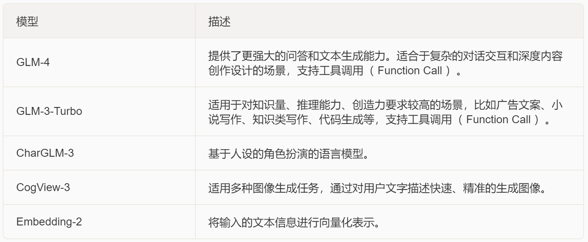
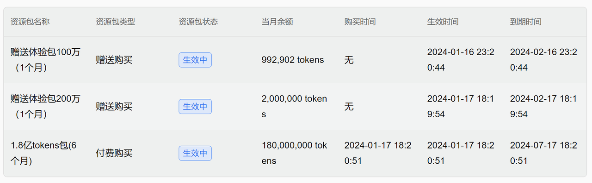
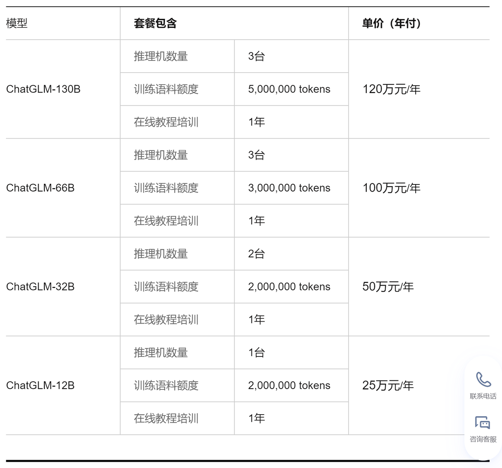
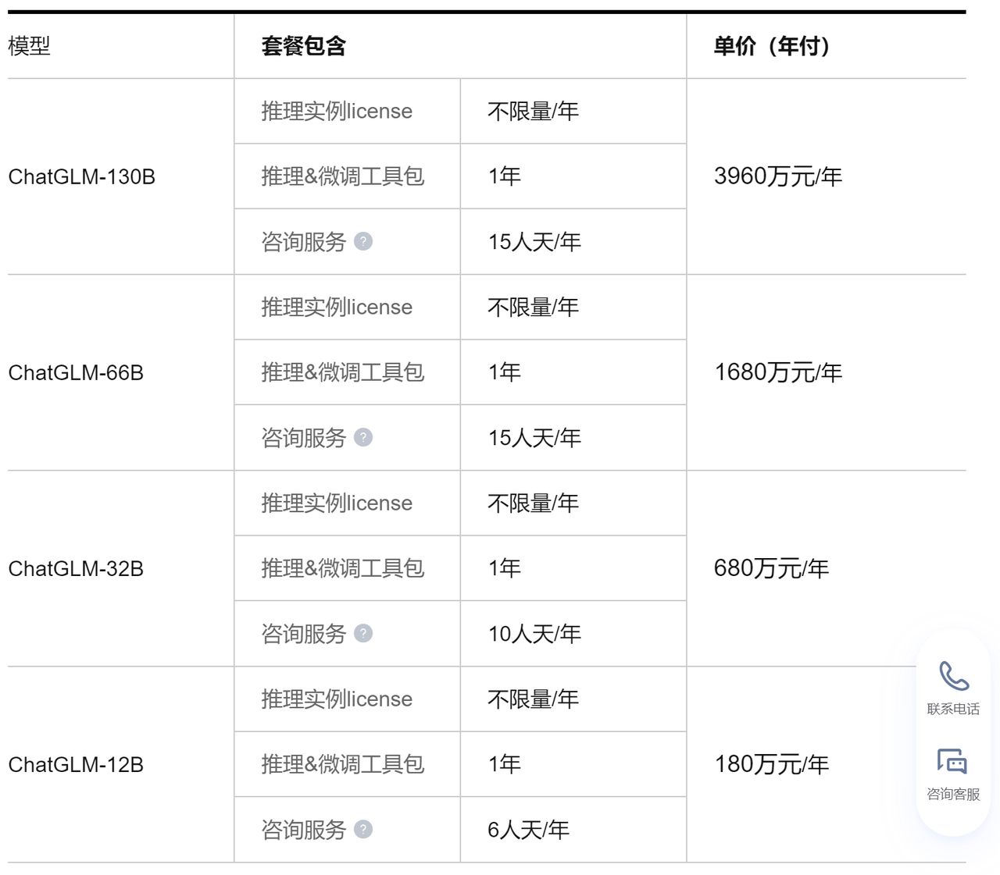

### 一、GLM-4发布与在线大模型技术路线

  前置知识，GLM-4、GLMs和智谱AI开发者大会详细解读，参考公开课视频：[国产大模型新希望！GLM-4全面追赶GPT-4](https://www.bilibili.com/video/BV1s5411v78P/)


  北京时间2024年1月16日，智谱AI正式推出GLM-4新一代基座大模型，整体性能相比GLM3全面提升60%，根据实际测试，GLM-4在以中文为主的应用场景中实际性能逼近GPT-4的95%，在一些中文对齐的测试中，甚至超过GPT-4表现，毕竟GPT-4-turbo模型。此外，GLM-4支持128K对话上下文，并且支持更强的多模态功能、支持更快推理速度，更多并发，大大降低推理成本；同时GLM-4增强了智能体（Agent）能力。


  而和此前ChatGLM3模型所不同的是，GLM-4不再采用开源模式，而是采用了OpenAI和Google大模型的在线大模型模式，即模型无需本地部署，而是通过联网的方式调用智谱算力中心的模型进行推理或微调，用户通过API-KEY进行身份验证，同时根据实际使用模型不同、以及不同的Token数量进行计费。

而在实际的使用过程中，我们不难发现，GLM-4和GPT-4的调用过程也几乎一摸一样：（以下代码无需运行，运行方法稍后介绍）

```python
import os
api_key = os.getenv("ZHIPU_API_KEY")
```

```python
from zhipuai import ZhipuAI
client = ZhipuAI(api_key=api_key) 
response = client.chat.completions.create(
    model="glm-4",  # 填写需要调用的模型名称
    messages=[
        {"role": "user", "content": "你好"}
    ],
)
print(response.choices[0].message)
```

```plaintext
content='你好👋！我是人工智能助手智谱清言，可以叫我小智🤖，很高兴见到你，欢迎问我任何问题。' role='assistant' tool_calls=None
```

```python
import openai
openai.api_key = os.getenv("OPENAI_API_KEY")
# 尝试调用GPT模型
response = openai.ChatCompletion.create(
  model="gpt-4-0613",
  messages=[
    {"role": "user", "content": "你好！"}
  ]
)
response.choices[0].message['content']
```

```plaintext
'你好！有什么我可以帮助你的吗？'
```

  一石激起千层浪，曾被誉为国产开源大模型的未来的ChatGLM系列模型居然不再开源。尽管“开源”模式统领开发领域十几年，但在大模型技术领域，开源模式确实存在诸多弊端，包括

* 使用门槛太高：受限于大模型本身模型复杂度，开源大模型本地安装部署、调用、微调和后期维护成本非常高，既包括技术成本也包括硬件成本；

* 模型安全性较低：尽管技术本身没有对错，但使用的方法会决定技术到底是创造价值还是在“作恶”，对于大语言模型这件利器来说尤其是如此，自但语言模型诞生之初，人们就开始探讨如何限制大模型“作恶”，例如创建虚假新闻、生产不当内容等，而对于开源大模型来说，无论签署什么样的协议或者在预训练的时候做多少防范，都很难规避不法分子使用大模型“作恶”；

* 模型抄袭成本低，造成劣币驱逐良币怪象：用一个大模型训练另一个大模型，远比独立开发大模型成本低得多，而对于开源模型来说相互抄袭的情况比比皆是，甚至有团队将开源模型封装为商业模型，借以牟利。这毫无以为对开源模型的生态造成了巨大的恶劣影响，也对开源模型背后公司的收益模式带来毁灭性打击，长此以往必然造成劣币驱逐良币的局面；

而大模型发展至今，OpenAI的GPT模型在无数开源模型的围追堵截下仍然能够保持领先地位，或许本身也验证了在线大模型的技术路线要优于开源大模型技术路线；

  智谱AI在四代模型发布的时候选择走在线大模型技术路线，或许也正是“拨乱反正”的关键一步，也是国产大模型走向高速发展道路的第一步。GLM-4在线大模型不仅能解决本地安装部署门槛太高的问题、更大范围推广大模型，而且GLM-4采用实名制的做法，也将极大程度限制大模型“作恶”，并且也能很好的规避大模型相互抄袭的问题。当然，除此之外，考虑到GLM-4本身支持国产GPU进行推理和训练，GLM-4背后的算力中心极有可能会采用国产芯片，从而间接推动国产芯片发展，在大模型技术领域，从根本上摆脱西方国家技术封锁。假以时日，国人或许真的能用到可以真正意义上和GPT系列模型对标的中文大模型。

### 二、智谱AI大模型MaaS开放平台

  GLM-4的公布不仅代表着智谱AI整体朝向在线大模型技术路线转型，而且还代表着智谱AI将力求打造一整套在线大模型技术解决方案，在这其中GLM-4模型只是其中一个模型。

  而实际上，智谱AI的速度比预计的更加迅速。在GLM-4发布的同时，[智谱AI大模型MaaS开放平台](https://open.bigmodel.cn/)也同步上线，其完成度之高几乎可以和OpenAI Platform一教高下。


这也就是所谓的GLM-4官网，其中包含了完整详细的GLM在线系列模型调用方法、API手册、说明文档、以及对标OpenAI Playground的在线调用模型实验环境。这里我们首先介绍GLM目前在线模型技术生态，然后再详细介绍Maas开放平台（以下简称官网）其他功能。

#### 1.智谱AI在线大模型技术生态

* GLM系列在线模型

  这里我们可以在官网[使用指南](https://open.bigmodel.cn/dev/howuse/model)部分看到目前上线的大模型，总共包括文本生成模型（GLM-4、GLM-3-Turbo）、强化角色扮演的文本生成模型（CharGLM-3）、多模态图像创建模型（CogView-3）以及Embedding-2模型：



在这些模型中，GLM-4毫无疑问是对标GPT-4的模型，最大支持128K最大对话上下文，GLM-3-turbo则是对标GPT-3.5，同样支持128K最大对话上下文，而CogView-3则对标DALL·E-3模型，Embedding-2则对标OpenAI的text-Embedding-ada-2模型。能够看出，这是一整套在线模型生态，在这些模型加持下，能够支持用户完成大多数Agent开放工作。需要注意的是，从ChatGLM3开始，GLM系列模型已经支持Function calling功能，而本次公布的在线大模型GLM3、GLM4也都支持Function calling。

  并且在不久的将来，智谱AI还将进一步开放GLM-4v多模态大模型，用于进行图像识别，对标GPT-4v；以及计划将发布GLM-4-Assistant API，用于更高效率进行Agent开发，对标OpenAI Assistant API。

* 在线知识库与知识库Retrevial

  和OpenAI File system类似，智谱AI也为其在线大模型技术生态设置了在线知识库搭建功能。所谓在线知识库，指的是用户可以将一些本地文档存在智谱AI的云端，用于随时将这些知识库文档输入大模型，或作为微调数据带入在线微调流程：


而在实际使用大模型时，若要调用在线知识库中文档进行读取，我们只需要在调用模型API时设置Retrevial功能即可。此时大模型即会根据外部文档进行回答：


不过需要注意的是，模型内部实现的Retrevial功能并不是长文本问答，既输入的内容不能超过模型最大上下文限制，因此模型内部的Retrevial基本可以理解为将一个文档输入为system message，然后引导模型基于system message进行回答。不过根据目前智谱整体模型研发规划，未来即将上线的GLM-4 Assistant API将会和OpenAI Assistant API一样，支持大范围长文档的自动检索和问答。可以说目前知识库系统也是为未来GLM-4 Assistant API做准备。

* GLM模型在线微调

  和OpenAI在线微调功能类似，智谱AI本次也重磅上线了在线模型的在线微调功能。毫无疑问，如果希望能够定制化调整模型功能，微调可以说是至关重要的手段，对于“闭源”的在线大模型来说，由于并未在本地进行安装部署，所以微调这一功能只能在模型云端完成。这也是为何在线大模型厂商都会提供在线微调功能的原因。


  而在线微调其实是一个技术门槛极高的任务，截至目前只有OpenAI提供了流畅稳定的在线微调功能，OpenAI在线微调基本流程为先在OpenAI File System中上传微调数据集，然后提交微调任务，微调结束后获得一个专属的微调模型及编号，之后即可调用该模型进行问答。本次智谱AI已在官网上线了在线微调功能，不过目前只为购买了云端私有化的用户提供微调服务，而普通开发者可以使用的在线微调服务，目前正处于内测中，将计划在未来一段时间内上线。


#### 2.智谱AI新一代模型部署方式及基本费用

* 普通版与企业版

  其次需要说明的是，目前流行的在线大模型服务方式都分为普通版和企业版两类。当然所谓的普通版指的是统一调用通用模型，并实际使用量计费；而所谓的企业版，则是包含了算力或者功能定制的模型，例如OpenAI就提供了在线GPT模型和企业定制GPT模型两类。而本次智谱AI也同时发布了两个版本，其中大多数技术人员和普通开发者使用的都是普通版，而如果是企业应用，需要定制化算力支持或者定制功能，则可以统一采购智谱AI发布的私有化部署版本，也就是企业版。

* 普通版使用计费

  既然是在线大模型，就不得不探讨具体费用问题。和OpenAI一样，智谱AI也是根据不同模型、每千次调用进行计费，普通版调用费用如下：

| 模型          | 单价                |
| ----------- | ----------------- |
| GLM-4       | 0.1元 / 千tokens    |
| GLM-3-Turbo | 0.005元 / 千tokens  |
| CogView-3   | 0.25元 / 张         |
| CharGLM-3   | 0.015元 / 千tokens  |
| Embedding-2 | 0.0005元 / 千tokens |

当然这只是调用费用，而对于首次注册用户、实名制用户以及首次充值用户，目前还有额外优惠，首次注册用户将赠送100万token额度，而实名之后还会赠送200万token额度，并且首次注册用户还可以花费99元购买1.8亿token包，对于在线大模型调用来说，目前智谱AI的优惠活动可以说是非常低的价格了。



* 企业版使用计费

  而如果是企业版，则不再按照单独调用计费，而按照部署模型种类和部署类型进行计费，具体私有化部署费用如下，其中云端私有化部署费用如下：



而本地私有化部署费用则更高：




🍻现开设了**大模型学习交流群**，扫描下👇码，来遇见更多志同道合的小伙伴\~

海量硬核独家技&#x672F;**`干货内容`**+无门&#x69DB;**`技术交流`**\~


上图**扫码**👆即刻入群！

📍 社群**技术交流**氛围浓厚，不定期开&#x8BBE;**`硬核干货&前沿技术公开课`**&#x5662;\~
