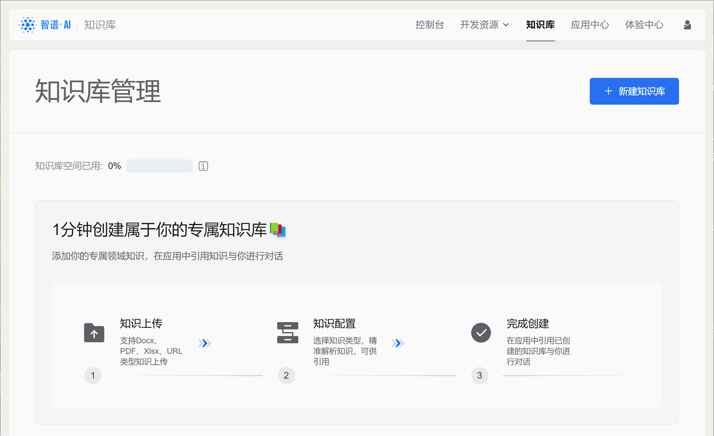
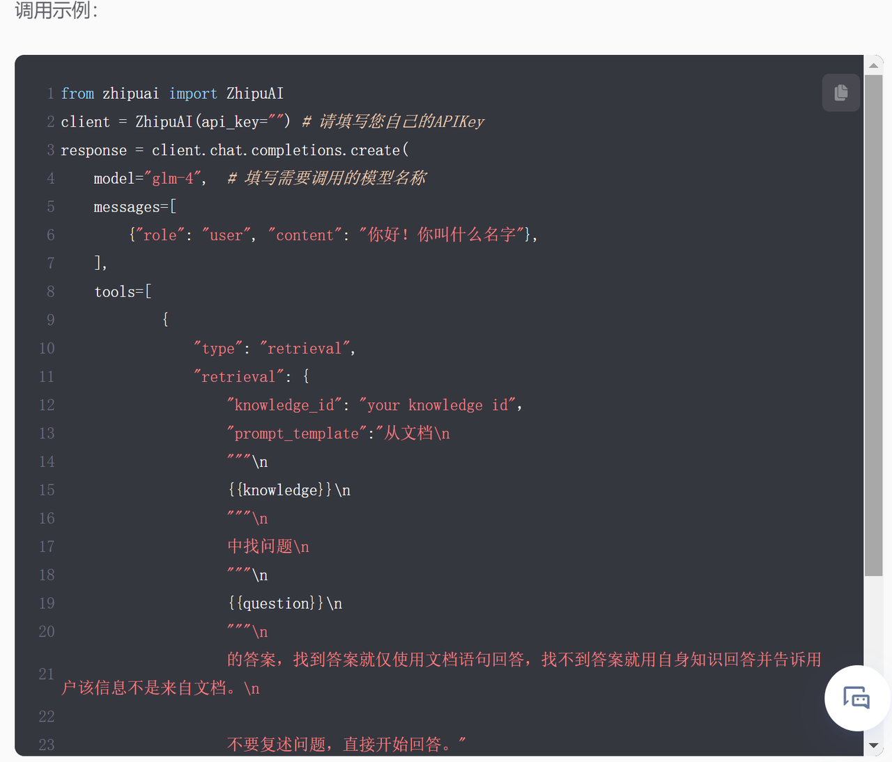
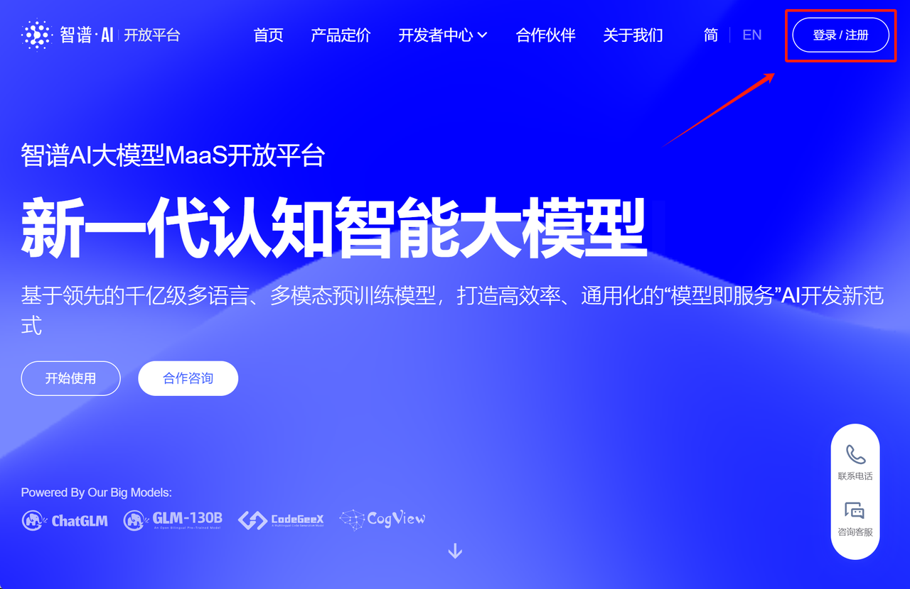
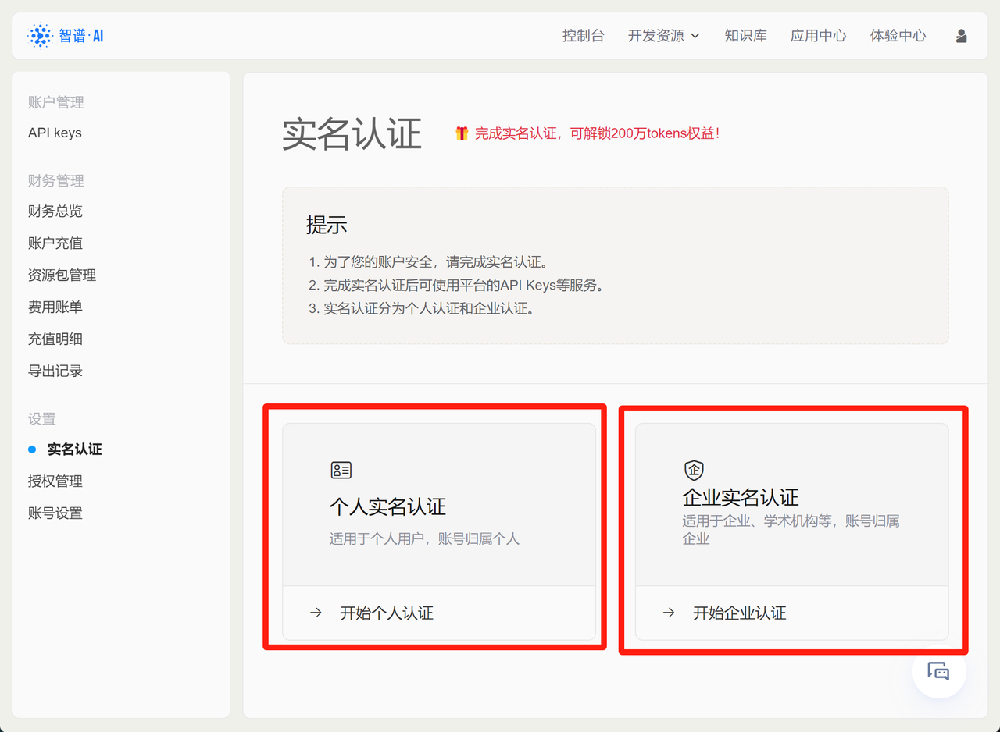
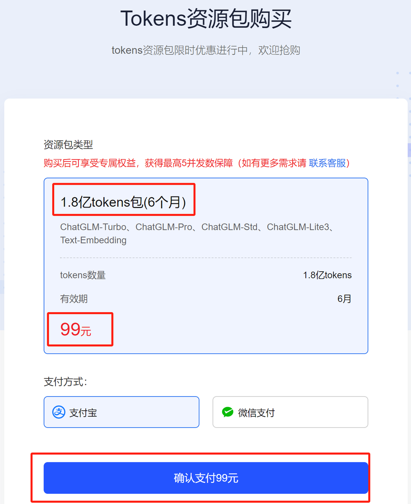
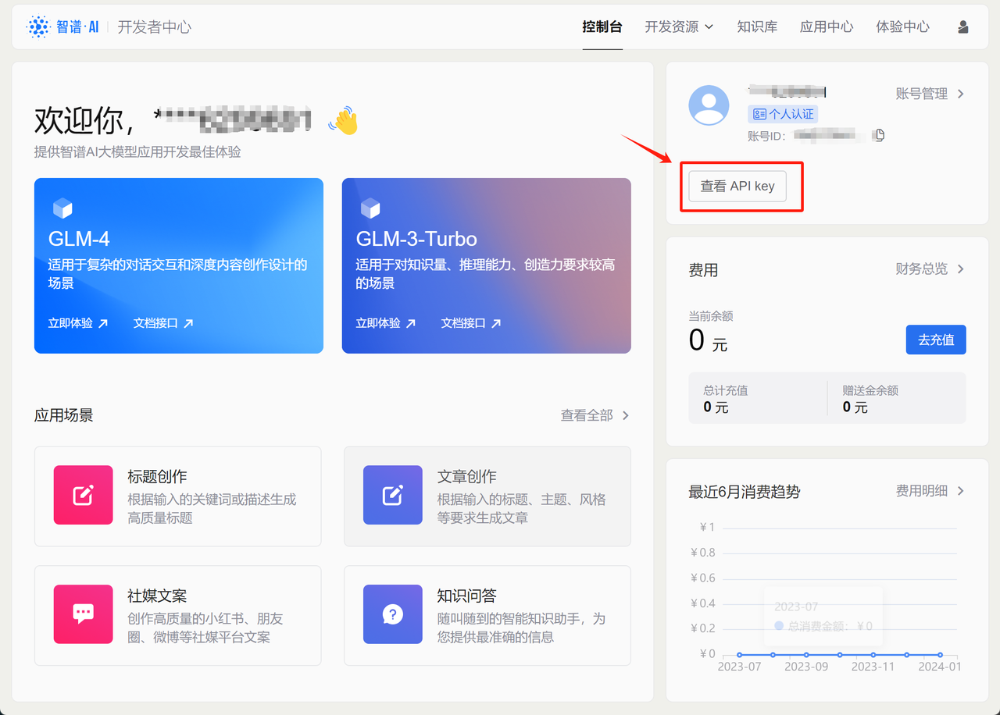
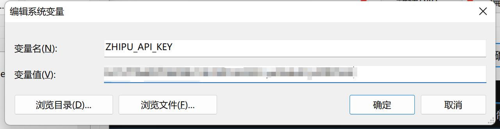
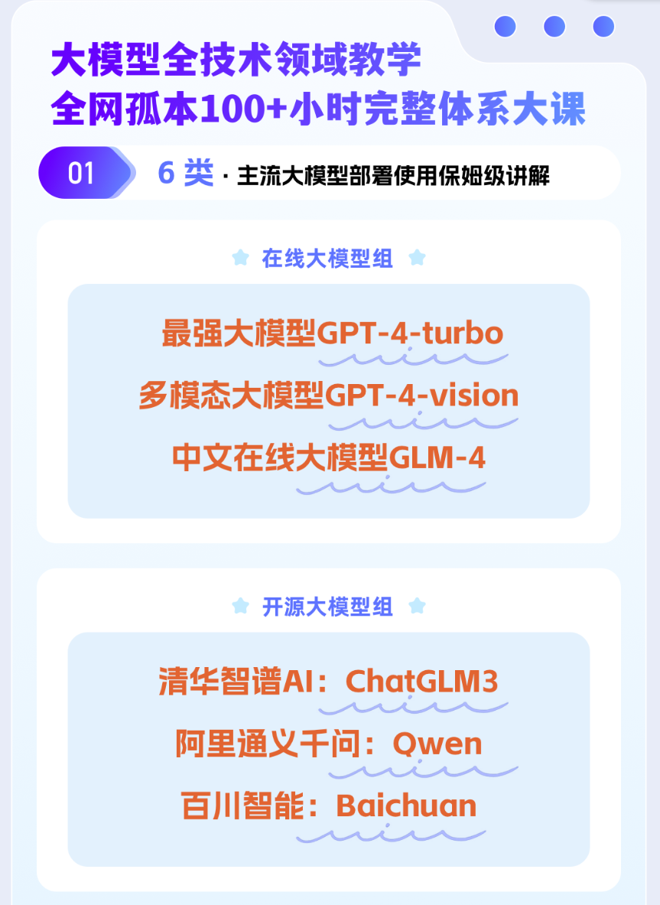
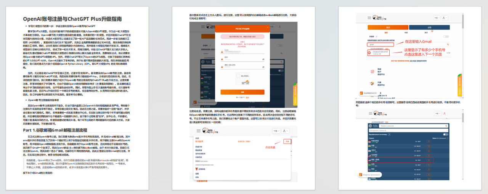

***

* GLM-4模型简介

  北京时间2024年1月16日，智谱AI正式推出GLM-4新一代基座大模型，整体性能相比GLM3全面提升60%，根据实际测试，GLM-4在以中文为主的应用场景中实际性能逼近GPT-4的95%，在一些中文对齐的测试中，甚至超过GPT-4表现，毕竟GPT-4-turbo模型。此外，GLM-4支持128K对话上下文，并且支持更强的多模态功能、支持更快推理速度，更多并发，大大降低推理成本；同时GLM-4增强了智能体（Agent）能力。并且，经过一段时间的实际使用发现，GLM-4相比ChatGLM3有明显进步，这也进一步增加了我们对国产大模型未来发展的期待。


  而和此前ChatGLM3模型所不同的是，GLM-4不再采用开源模式，而是采用了OpenAI和Google大模型的在线大模型模式，即模型无需本地部署，而是通过联网的方式调用智谱算力中心的模型进行推理或微调，用户通过API-KEY进行身份验证，同时根据实际使用模型不同、以及不同的Token数量进行计费。

而在实际的使用过程中，我们不难发现，GLM-4和GPT-4的调用过程也几乎一摸一样：（以下代码无需运行，运行方法稍后介绍）

```python
import os
api_key = os.getenv("ZHIPU_API_KEY")
```

```python
from zhipuai import ZhipuAI
client = ZhipuAI(api_key=api_key) 
response = client.chat.completions.create(
    model="glm-4",  # 填写需要调用的模型名称
    messages=[
        {"role": "user", "content": "你好"}
    ],
)
print(response.choices[0].message)
```

```plaintext
content='你好👋！我是人工智能助手智谱清言，可以叫我小智🤖，很高兴见到你，欢迎问我任何问题。' role='assistant' tool_calls=None
```

而以下则是GPT系列模型的运行方法：

```python
import openai
openai.api_key = os.getenv("OPENAI_API_KEY")
# 尝试调用GPT模型
response = openai.ChatCompletion.create(
  model="gpt-4-0613",
  messages=[
    {"role": "user", "content": "你好！"}
  ]
)
response.choices[0].message['content']
```

```plaintext
'你好！有什么我可以帮助你的吗？'
```

### 一、GLM-4账户注册与API-KEY获取

  GLM-4的公布不仅代表着智谱AI整体朝向在线大模型技术路线转型，而且还代表着智谱AI将力求打造一整套在线大模型技术解决方案，在这其中GLM-4模型只是其中一个模型。

  而实际上，智谱AI的速度比预计的更加迅速。在GLM-4发布的同时，[智谱AI大模型MaaS开放平台](https://open.bigmodel.cn/)也同步上线，其完成度之高几乎可以和OpenAI Platform一教高下。


这也就是所谓的GLM-4官网，其中包含了完整详细的GLM在线系列模型调用方法、API手册、说明文档、以及对标OpenAI Playground的在线调用模型实验环境。这里我们首先介绍GLM目前在线模型技术生态，然后再详细介绍Maas开放平台（以下简称官网）其他功能。

#### 1.智谱AI在线大模型技术生态

* GLM系列在线模型

  这里我们可以在官网[使用指南](https://open.bigmodel.cn/dev/howuse/model)部分看到目前上线的大模型，总共包括文本生成模型（GLM-4、GLM-3-Turbo）、强化角色扮演的文本生成模型（CharGLM-3）、多模态图像创建模型（CogView-3）以及Embedding-2模型：


在这些模型中，GLM-4毫无疑问是对标GPT-4的模型，最大支持128K最大对话上下文，GLM-3-turbo则是对标GPT-3.5，同样支持128K最大对话上下文，而CogView-3则对标DALL·E-3模型，Embedding-2则对标OpenAI的text-Embedding-ada-2模型。能够看出，这是一整套在线模型生态，在这些模型加持下，能够支持用户完成大多数Agent开放工作。需要注意的是，从ChatGLM3开始，GLM系列模型已经支持Function calling功能，而本次公布的在线大模型GLM3、GLM4也都支持Function calling。

  并且在不久的将来，智谱AI还将进一步开放GLM-4v多模态大模型，用于进行图像识别，对标GPT-4v；以及计划将发布GLM-4-Assistant API，用于更高效率进行Agent开发，对标OpenAI Assistant API。

* 在线知识库与知识库Retrevial

  和OpenAI File system类似，智谱AI也为其在线大模型技术生态设置了在线知识库搭建功能。所谓在线知识库，指的是用户可以将一些本地文档存在智谱AI的云端，用于随时将这些知识库文档输入大模型，或作为微调数据带入在线微调流程：



而在实际使用大模型时，若要调用在线知识库中文档进行读取，我们只需要在调用模型API时设置Retrevial功能即可。此时大模型即会根据外部文档进行回答：



不过需要注意的是，模型内部实现的Retrevial功能并不是长文本问答，既输入的内容不能超过模型最大上下文限制，因此模型内部的Retrevial基本可以理解为将一个文档输入为system message，然后引导模型基于system message进行回答。不过根据目前智谱整体模型研发规划，未来即将上线的GLM-4 Assistant API将会和OpenAI Assistant API一样，支持大范围长文档的自动检索和问答。可以说目前知识库系统也是为未来GLM-4 Assistant API做准备。

* GLM模型在线微调

  和OpenAI在线微调功能类似，智谱AI本次也重磅上线了在线模型的在线微调功能。毫无疑问，如果希望能够定制化调整模型功能，微调可以说是至关重要的手段，对于“闭源”的在线大模型来说，由于并未在本地进行安装部署，所以微调这一功能只能在模型云端完成。这也是为何在线大模型厂商都会提供在线微调功能的原因。


  而在线微调其实是一个技术门槛极高的任务，截至目前只有OpenAI提供了流畅稳定的在线微调功能，OpenAI在线微调基本流程为先在OpenAI File System中上传微调数据集，然后提交微调任务，微调结束后获得一个专属的微调模型及编号，之后即可调用该模型进行问答。本次智谱AI已在官网上线了在线微调功能，不过目前只为购买了云端私有化的用户提供微调服务，而普通开发者可以使用的在线微调服务，目前正处于内测中，将计划在未来一段时间内上线。


#### 2.智谱AI账户注册与管理

  在了解了GLM-4模型生态之后，接下来我们尝试进行智谱AI账户注册，并获取GLM-4模型API-Key，然后在本地进行模型调用。围绕GLM-4的账户注册和API获取流程，和OpenAI账户注册和GPT模型API获取流程非常类似，只不过在没有网络门槛限制的情况下，这一流程会非常便捷稳定。

* 智谱AI账户注册流程

  首先登录[智谱AI大模型MaaS开放平台](https://open.bigmodel.cn/)，点击左上方注册按钮：



在注册页面输入手机号并进行验证，即可完成注册：


首次注册用户会获赠100万token额度，并且注册用户首次完成实名认证，还会进一步赠送200万token额度。正如此前所说，实名制也是确保大模型使用安全性的重要一环，从智谱AI目前的注册流程来看，也是更加倾向于引导用户完成实名制注册：


这里可以直接点击立即认证进行认证，或者其他任何时候都可以在个人主页进行认证。若错过当前页面，也可以在[个人中心](https://open.bigmodel.cn/overview)里面进行实名认证：


点击实名认证，可以发现目前有两种认证方法，分别是个人认证和企业认证。认证结束后即可自动获得200万免费token额度。其中个人认证需要身份证+支付宝扫码进行人脸识别认证，企业认证则需要企业名称、社会信用代码和营业执照扫描件等。两种不同的认证方法就相当于创建两种不同类型的账户，企业账户可以开增值税专用发票，并且会更加便于对账户进行管理:



这里如果是个人认证，则直接点击个人实名认证，输入身份证、以及支付宝扫码完成认证即可：


完成实名制之后，接下来即可点击左侧[资源包管理](https://open.bigmodel.cn/usercenter/resourcepack)，查看当前账户赠送的token额度。能够发现，赠送的额度都是1个月内有效：


同时，在[资源包管理](https://open.bigmodel.cn/usercenter/resourcepack)页面上，也能看到新用户首次充值优惠活动，99元可以购买1.8亿token额度。这里点击去购买选项即可进入购买页面。需要注意的是，只有完成了实名注册，才可以购买充值包：


具体大家可以根据实际自身需求选择性进行购买。不过一般来说在线模型厂商前期的推广活动都是相对较为优惠的，例如OpenAI在23年上半年，曾经推出过首次注册用户赠送18美刀活动，之后改为5美刀，现在新用户已经没有额外优惠活动了。



* 智谱AI账户管理

  对于使用付费的在线模型来说，个人账户就相当于一个在线储值系统，一般来说需要提前在账户内储值，然后智谱AI将根据实际模型使用情况在账户内进行扣费。因此了解账户页面的使用方法非常重要，在账户页面我们能实时监控当前账户消费情况、账户余额，设置余额预警等。我们可以在[财务总览](https://open.bigmodel.cn/usercenter/financialoverview)页面查看当前账户基本情况：


在当前页面中我们可以围绕个人账户进行管理，例如若需为账户充值，点击右侧去充值按钮即可。充值方式支持个人支付和对公转账两种：


而若要设置余额预警，则点击页面上方设置按钮即可：


所谓余额预警，指的是可以设置某个余额的阈值，当低于这个阈值时，系统将发送短信进行提醒。这也是为了确保一些应用程序稳定运行、避免运行中途因欠费而停止，或者提升账户安全性的重要方法。

  此外，还可以在个人页面左侧查看费用账单、充值明细和导出记录等。

  而与之相关的产品定价，则可与在pricing页面查看：https://open.bigmodel.cn/pricing


| 模型          | 单价                |
| ----------- | ----------------- |
| GLM-4       | 0.1元 / 千tokens    |
| GLM-3-Turbo | 0.005元 / 千tokens  |
| CogView-3   | 0.25元 / 张         |
| CharGLM-3   | 0.015元 / 千tokens  |
| Embedding-2 | 0.0005元 / 千tokens |

#### 3.GLM模型API-KEY创建与维护

* API-KEY获取和创建流程

  所谓API-KEY，本质上就是一个字符串，用于进行在线模型调用时的身份验证。GLM模型的API-KEY获取流程如下，首先还是登录[个人中心（控制台）](https://open.bigmodel.cn/overview)，点击查看API KEY：



或者也可以直接点击如下网址查看API KEY：https://open.bigmodel.cn/usercenter/apikeys


首次查看API-KEY会发现目前已经有了一个系统默认的API KEY，这里我们直接点击复制，就能复制当前API KEY字符串。这里需要注意的是，尽管我们经常都需要输入API KEY，但出于保密性考虑，“请不要与他人共享您您的 API Keys，避免将其暴露在浏览器和其他客户端代码中。”并且根据说明，智谱AI还有自动保密措施：“为了保护您帐户的安全,我们还可能会自动更换我们发现已公开泄露的密钥信息。”

* 设置API KEY环境变量

  而要如何不显示的展示API-KEY，由同时能够顺利的在代码环境中调用这个字符串呢？比较简单易行的方法就是直接将其设置为系统环境变量，然后通过os.getenv的方式进行读取。如此一来，整个代码过程都不会显示API KEY字符串本身，但能完成API KEY字符串的读取和调用，类似如下过程：


而要如何设置系统环境变量呢，首先打开系统环境变量面板：


点击环境变量


点击新建系统变量：


设置环境变量。这里变量名可以统一设置为ZHIPU\_API\_KEY，而变量值就是刚刚我们复制的API-Key。



保存重启电脑，方可使环境变量生效。

当然，在智谱官网的API-KEY页面，我们也可以创建多个API-KEY，或删除过多的API-KEY，从而完成对API-KEY的有效管理：


* 调用测试

  在完成了API获取和本地系统环境变量设置之后，接下来即可测试是否能够在本地环境中调用GLM4模型了。这里尝试运行如下代码，若能正确返回结果，则说明当前API-KEY获取和系统环境变量设置无误。首先需要安装zhipuai库：

```python
!pip install zhipuai
```

```plaintext
Requirement already satisfied: zhipuai in c:\users\admin\anaconda3\lib\site-packages (2.0.1)
Requirement already satisfied: httpx>=0.23.0 in c:\users\admin\appdata\roaming\python\python311\site-packages (from zhipuai) (0.25.1)
Requirement already satisfied: pydantic>=2.5.2 in c:\users\admin\anaconda3\lib\site-packages (from zhipuai) (2.5.3)
Requirement already satisfied: cachetools>=4.2.2 in c:\users\admin\anaconda3\lib\site-packages (from zhipuai) (5.3.1)
Requirement already satisfied: pyjwt~=2.8.0 in c:\users\admin\anaconda3\lib\site-packages (from zhipuai) (2.8.0)
Requirement already satisfied: anyio in c:\users\admin\anaconda3\lib\site-packages (from httpx>=0.23.0->zhipuai) (3.5.0)
Requirement already satisfied: certifi in c:\users\admin\anaconda3\lib\site-packages (from httpx>=0.23.0->zhipuai) (2023.7.22)
Requirement already satisfied: httpcore in c:\users\admin\appdata\roaming\python\python311\site-packages (from httpx>=0.23.0->zhipuai) (1.0.1)
Requirement already satisfied: idna in c:\users\admin\anaconda3\lib\site-packages (from httpx>=0.23.0->zhipuai) (3.4)
Requirement already satisfied: sniffio in c:\users\admin\anaconda3\lib\site-packages (from httpx>=0.23.0->zhipuai) (1.2.0)
Requirement already satisfied: annotated-types>=0.4.0 in c:\users\admin\appdata\roaming\python\python311\site-packages (from pydantic>=2.5.2->zhipuai) (0.6.0)
Requirement already satisfied: pydantic-core==2.14.6 in c:\users\admin\anaconda3\lib\site-packages (from pydantic>=2.5.2->zhipuai) (2.14.6)
Requirement already satisfied: typing-extensions>=4.6.1 in c:\users\admin\anaconda3\lib\site-packages (from pydantic>=2.5.2->zhipuai) (4.7.1)
Requirement already satisfied: h11<0.15,>=0.13 in c:\users\admin\appdata\roaming\python\python311\site-packages (from httpcore->httpx>=0.23.0->zhipuai) (0.14.0)
```

然后尝试运行如下代码：

```python
import os
api_key = os.getenv("ZHIPU_API_KEY")
```

```python
from zhipuai import ZhipuAI
client = ZhipuAI(api_key=api_key) 
response = client.chat.completions.create(
    model="glm-4",  # 填写需要调用的模型名称
    messages=[
        {"role": "user", "content": "你好"}
    ],
)
print(response.choices[0].message)
```

```plaintext
content='你好👋！我是人工智能助手智谱清言，可以叫我小智🤖，很高兴见到你，欢迎问我任何问题。' role='assistant' tool_calls=None
```

若能正常返回结果，则说明此前配置无误。至此，我们就完整了解了GLM-4官网的基本使用方法以及模型调用方法，接下来我们将以GLM-4为核心模型，来介绍具体大模型技术应用方法。

***

* 高阶自然语言编程策略



&#x20;



&#x20;


***

📍**更多大模型技术内容学习**

**扫码添加助理英英，回复“大模型”，了解更多大模型技术详情哦👇**


此外，**扫码回复“入群”**，即可加入**大模型技术社群：海量硬核独家技术`干货内容`+无门槛`技术交流`！**

***

