## **【前言】GPT4o：全球首个具身智能大模型重磅上线                        &#x20;**

当地时间5月13日上午10点， OpenAI春季发布正式发布GPT-4模型家族全新模型——GPT4o ，“o”是 **Omni**的缩写，也就&#x662F;**“全能”**&#x7684;意思， **接受文本、音频和图像的任意组合作为输入，并生成文本、音频和 图像输出**。该模型也被誉为全球首个具身智能大模型，也是OpenAI通向AGI的重要一步。我们团队也在第一时间&#x5BF9;**`GPT4o模型`基本情况**与**未来发展预期**进行了分析，感兴趣的小伙伴点击查看👉[科幻照进现实！OpenAI震撼发布GPT4o，AI霸权大幕拉开](https://www.bilibili.com/video/BV1qf421m7cU/)

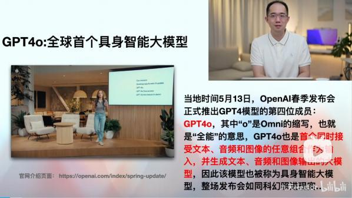

🍻现开设了**大模型学习交流群**，扫描下👇码，来遇见更多志同道合的小伙伴\~

海量硬核独家技&#x672F;**`干货内容`**+无门&#x69DB;**`技术交流`+不定期开设`硬核干货&前沿技术公开课`，扫码**👆即刻入群！

***

根据目前已知信息，该模型的核心特性如下：&#x20;

* &#x20; 远超GPT-4模型的基础性能：

据介绍， GPT-4o就是之前在大模型竞技场搞A/B测试的模型之一 ，**im-also-a-good-gpt2- chatbot**，从实际评分能看出来，该模型性能对比GPT-4模型属于断层式提升：

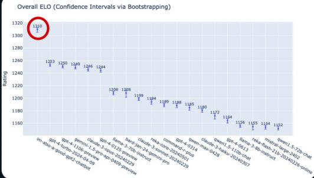

* &#x20; 视听一体多模态大模型

在Google Gemini原生多模态大模型“翻车”之后， GPT-4o再次扛起了原生多模态大模型的大

旗，并且是真实能够同时接受文本、音频和图像的任意组合作为输入，并生成文本、音频和图像输  出，而在发布会上，由GPT-4o驱动的新版ChatGPT应用几乎就和“真人”一样，能够接收语音、同时  通过设备的摄像头获取当前场景图像（或者桌面），并同时模仿人类的语气、以极快的速度进行响  应。根据发布会演示，新版ChatGPT能够通过“听取”呼吸声判断一个人当前情况、通过“看到”人脸判 断人的表情、通过“看到”纸上的数学题一步步引导用户进行解题、通过“看到”桌面正在运行的程序和 图表就可以对其进行分析，甚至能充当实时翻译，并且在和ChatGPT问答的时候甚至可以随时打断  并另起话题，在GPT4o的驱动下，新版ChatGPT就像一个“真实存在的人”一般能够自由和你进行交   流，一切的一切让人感觉仿佛科幻照进现实。

* &#x20; ChatGPT GPT4o版已经上线

而就在发布会结束的当场， ChatGPT的GPT4o功能已面向PLUS用户开放：

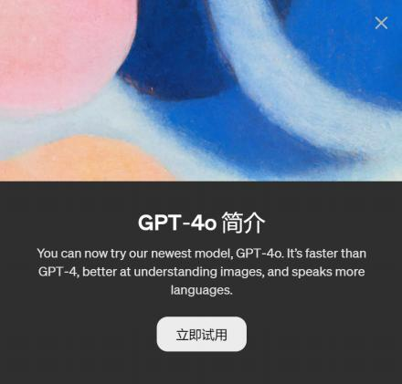

而实际的用户体验也基本兑现了OpenAI发布会时的承诺，是GPT-4-turbo响应速度的两倍以上—— 实际使用过程中GPT4o的问答响应速度非常快：

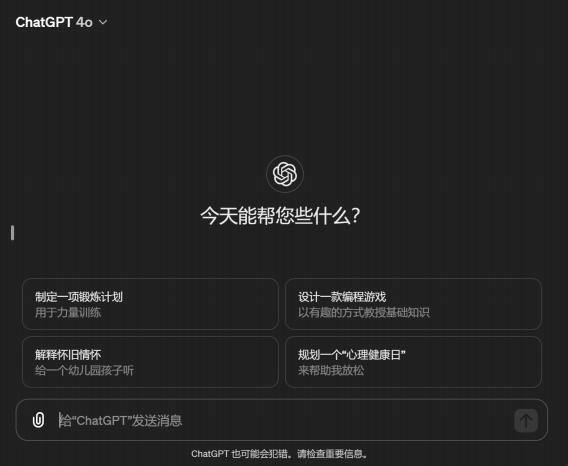

* &#x20; GPT4o API同步开放

于此同时， GPT4o API也已经正式面向付费开发者开放。对于付费开发人员，已经能够在后台 模型调用列表中看到GPT4o的模型介绍：

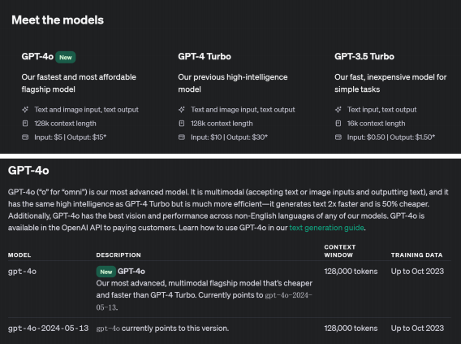

和GPT4对比， GPT4o模型不仅响应速度快两倍、价格便宜一倍，而且单日调用的RateLimit也高很 多：

* &#x20; 桌面版ChatGPT即将上线，未来GPT4o计划免费

尽管目前GPT4o的API和GPT-Turbo的API功能定位类似，但相信伴随着不久将要正式发布的

ChatGPT桌面版的到来， GPT4o也将逐步解锁和开放更多功能。同时根据OpenAI发布会介绍，在不 久的未来，计划为开发者免费提供GPT4o模型API，这对大模型开发人员来说无疑是重大利好。

不得不说， OpenAI每次新模型发布都会引发大模型技术界巨震，这次GPT4o模型发布也不例外。

* &#x20; 重塑大模型应用开发格局，反向推动多模态感知设备发展 .  AI for everyone还是OpenAI的AI霸权野心

基于此，我们团队在第一时间为大家整理了《GPT4o API零门槛接入与开发教程》，本篇为GPT4o公开课 系列教程的第一篇，重点介绍如何接入GPT4o API，为后续API开发和实战内容做铺垫，

* &#x20; OpenAI账号注册提前准备事项

其实OpenAI账号注册流程并不复杂，但由于国内监管以及OpenAI本身封锁措施的逐渐严格，导致 整个注册和升级流程会非常不稳定，非常容易出现突发情况。因此在注册之前，需要准备好一定的“魔

法” ，并学会设置全域代理模式。同时，非常重要的一点就是需要放平心态，在实际注册过程中每个环节  都可能出现问题，并且哪怕是相同的操作也不能避免一定能顺利执行，鉴于整个过程略显“玄学” ，放平心 态、不断尝试，可能才是最高效率的方法。根据目前尝试的情况来看，每个环节出现的不同问题都有对   应的解决方案，大家只需要按部就班、不断尝试即可。

* &#x20; 相关资料领取

课件领取方法详见视频置顶评论哦。此外，为了方便大家零门槛接入GPT4o，特地为大家单独 申请了50个GPT4o的API-KEY，并且为了进一步降低大家使用GPT4o的网络门槛，我们还会学员单  独提供了国内直连的反向代理地址（专线）， **课件、专属API-KEY、国内反向代理地址及其领取方  法详见置顶评论。**

## **一、谷歌邮箱Gmail邮箱注册流程**

在正式注册OpenAI账号之前，我们需要先熟悉sms境外手机号租赁流程，并完成Gmail邮箱注册。

其中sms境外手机号租赁是为了获得一个临时可以用于收取验证码的境外手机号，用于辅助注册Gmail和 OpenAI账号，而伴随着OpenAI限制措施逐渐升级，目前能够用于OpenAI账号注册、且效果稳定不容易  被封号的，就只剩下Gmail一个选择了。而此OpenAI的金主—微软旗下的outlook邮箱，由于未对大陆设 墙，目前已无法注册OpenAI。而其余的一些小厂邮箱，也都存在不同程度的风险，因此这里建议使用

Gmail进行注册。并且，在实际注册过程中，推荐使用谷歌浏览器。

接下来介绍Gmail的注册流程：

### **Step 1.登录谷歌邮箱注册页面**

注意需要开启魔法时使用，戳此进入注册页面

👉<https://accounts.google.com/signup>，并完成相 关信息填写，注意，用户名就是邮箱地址，姓氏和名字随便填写即可：

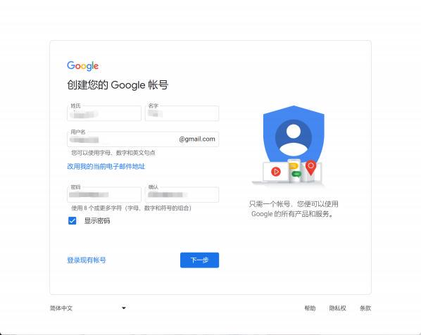

### **Step 2.获取sms虚拟手机号**

在填写完基本信息后，接下来就需要进行手机号验证了，而Gmail的手机号验证只支持境外手机号，

因此我们需要在此页面停留，并登录sms-active服务页面获取境外手机号：

这里我们需要登录<https://sms-activate.org/>，并完成相关服务的购买。该网站可以不用魔法即可打开， 不过鉴于我们的Gmail注册页面还未关闭，这里我们就在魔法状态下打开sms-active：

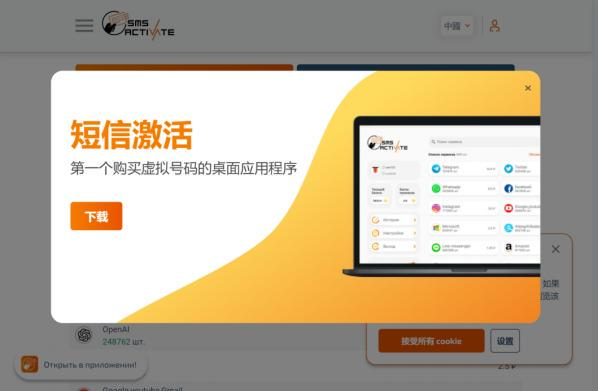

首次登录时点击左上方小人图标，进行注册，这里可以使用国内QQ邮箱或者outlook邮箱进行注册，大 家自行完成注册即可：

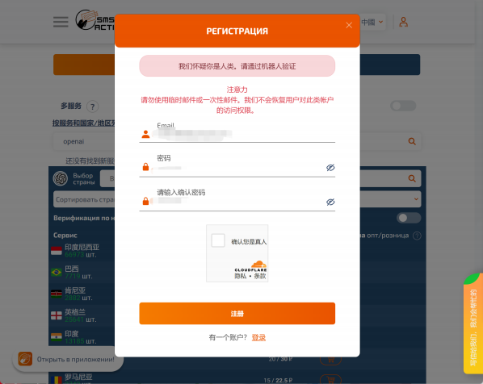

注册完成后，需要注意，该网站提供的手机号是根据不同服务需求来匹配和分发的的，例如，注册谷歌   邮箱和OpenAI的账号都需要虚拟手机号，但这两种注册属于不同的服务需求，因此两次会分别分配不同 的手机号。不过在申请手机号之前，我们需要往这个账户里面充值，这里可以使用支付宝进行充值，并   且只需要充值2美金即可使用较长一段时间：

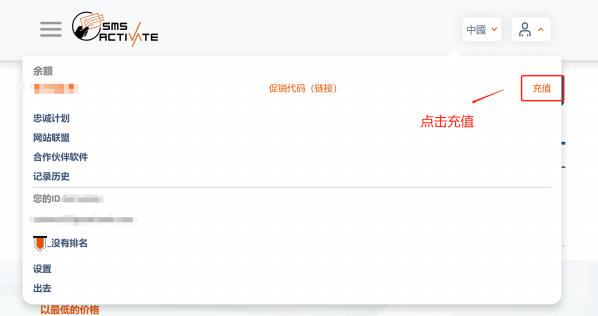

点击支付宝进行充值：

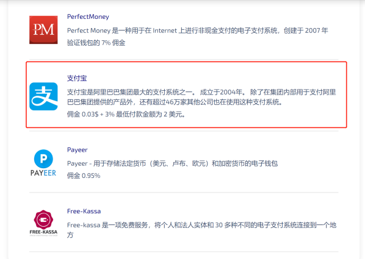

然后选择支付2美金：

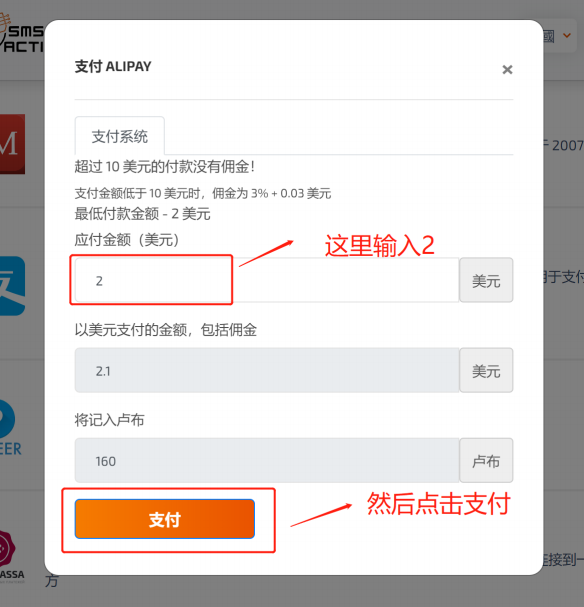

然后扫码完成支付即可。

早年OpenAI未火之时，最低充值额度是1美金\~

然后即可购买租赁虚拟手机号了，这里我们点击服务

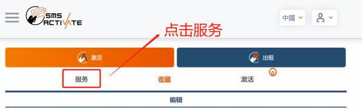

进入到租赁手机号的页面，此时我们是进行Gmail注册，因此需要在网页的搜索栏搜索Gmail，并点击备 选手机号：

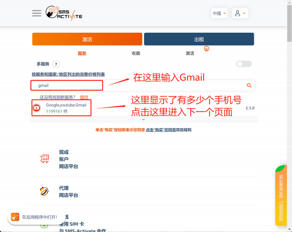

然后随便选择个地区的手机号租赁即可，这里推荐使用巴西或者美国的手机号进行租赁，不推荐印度手 机号：

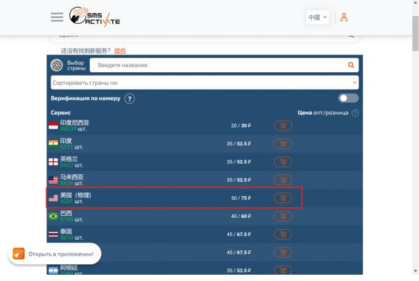

随着OpenAI注册人数逐渐增加，美国区手机号愈发稀缺。不过其他地区手机号也是可以完成注册 的，这点不用担心。而另外一点需要注意的是，尽管OpenAI对印度开放了使用权限，但印度的手 机号往往注册不成功，而且印度的魔法也非常容易导致封号。

然后即可查看租赁到的手机号：

注意，首次租赁手机号的时候没有验证码，上图中的验证码是使用手机号注册Gmail后该手机号收到的验 证码。

然后回到Gmail的注册页面，填写租赁到的手机号：

此时如果出现该手机号被较多次使用，则可以回到sms-active页面，重新租赁一个新的手机号进行注册。  正常情况下填写完手机号即可进入接收验证码的环节，这里可以在sms-active页面查看对应手机号接到的 验证码：

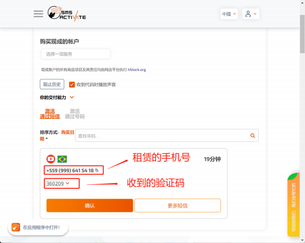

### **Step 3.填写验证码，完成邮箱注册**

然后将验证码填入Gmail注册页面即可：

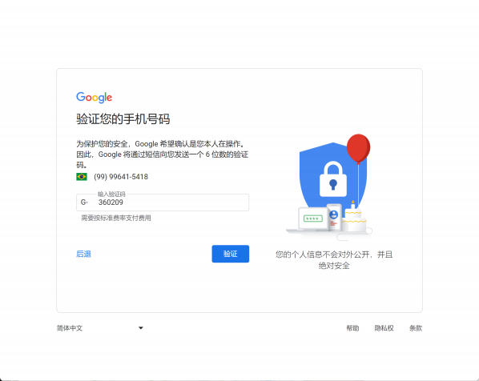

然后即可完成Gmail的注册：

另外需要注意的是，有的时候sms-active网站不稳定，因此也推荐大家下载sms-active本地客户端 进行虚拟号租赁

## **二、 Part 2.OpenAI账号注册流程**

准备好谷歌邮箱之后，接下来我们即可进行OpenAI账号注册了。注意，这里需要使用魔法，并需要 设置全局代理，最好使用美国区代理。

### **Stpe 1.进入OpenAI官网注册页面**

点击OpenAI网址，进入官网页面👉<https://openai.com/>，点击左下方Learn about GPT-4：

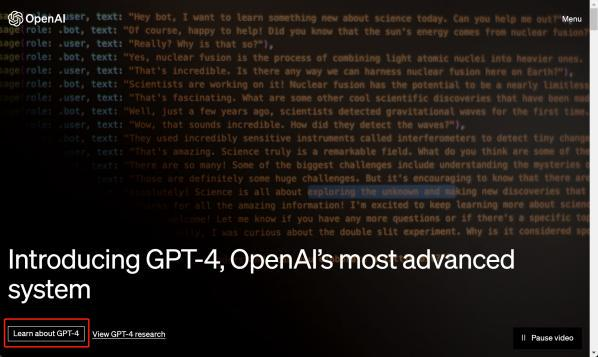

点击Try on ChatGPT Plus：

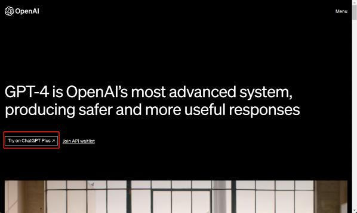

点击Sign up，进入注册页面：

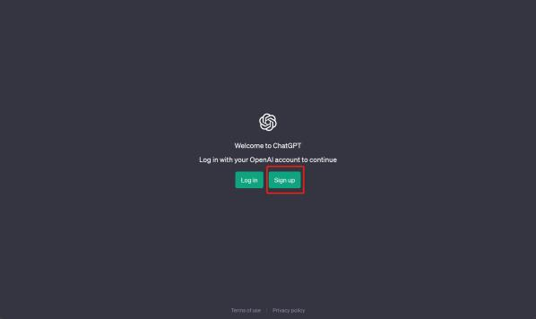

### **Step 2.利用谷歌邮箱，完成注册**

在注册页面输入刚刚注册的谷歌邮箱：

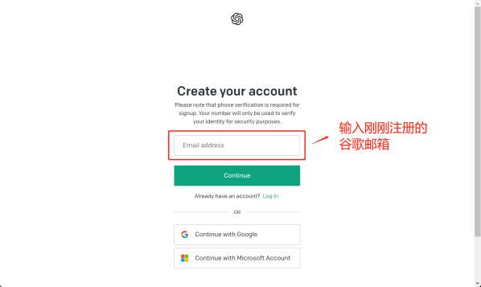

然后设置账户密码：

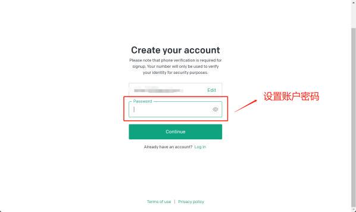

进行邮箱验证：

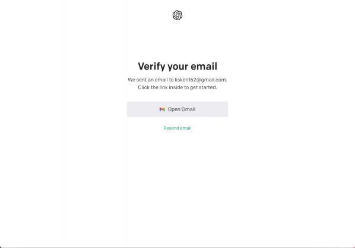

回到谷歌邮箱的收件夹，并点击验证链接：

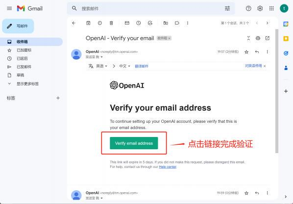

此时会跳转回OpenAI注册页面，填写补充信息，以下信息随便填写即可，并不会影响后续虚拟信用卡充 值：

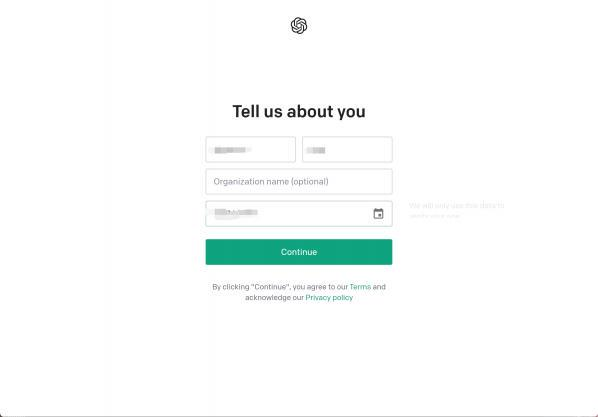

最后，进入到手机号验证环节，这里继续使用sms-active租赁的虚拟收好进行验证：

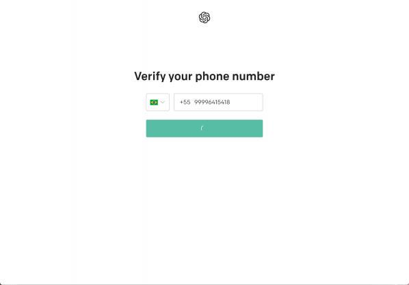

发送验证码后，回到sms-active查看并复制接收到的验证码：

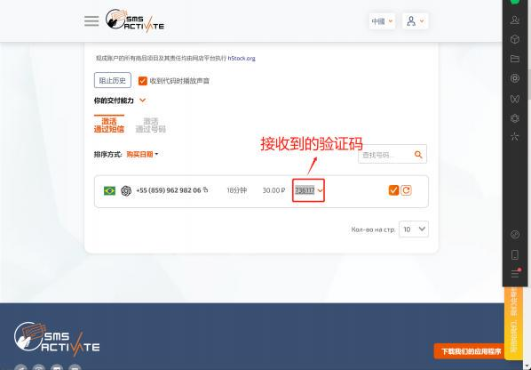

然后回到OpenAI账号注册页面，填写验证码：

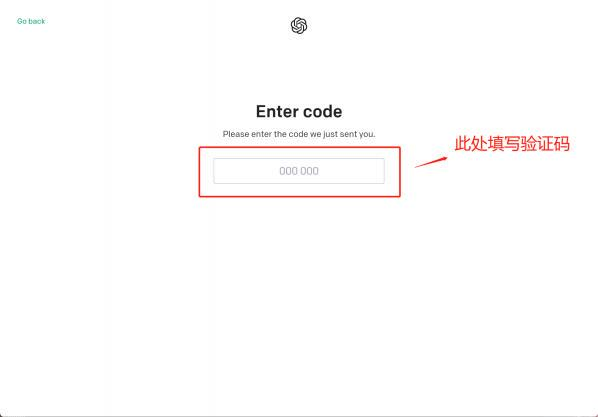

填写完验证码之后，即可顺利完成注册，并可以顺利进入到ChatGPT页面：

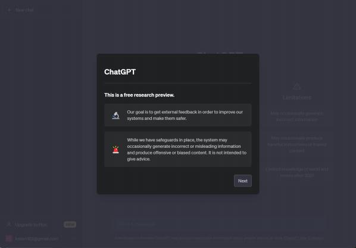

至此，我们就完成了OpenAI账号注册。

### **上述注册流程有可能出现的问题：**

* &#x20; 首先，魔法建议使用美国，虚拟手机号建议使用巴西或者欧洲国家；

* &#x20; 其次，如果某个手机号无法完成注册，可以考虑换个地区继续进行注册；

* &#x20; 若在注册过程中出现了如下被封号的情况👇

切勿惊慌，只需关闭魔法、清空浏览器cookies，然后换个地区重启魔法并进入OpenAI页面即可。   通常一个注册流程中被封2-3次都属正常，只需按照上述方法处理即可。唯一需要注意的是， 一旦清 空浏览器cookies，之前各网站保存的账号密码都会被清空，需要重新输入。

## **三、OpenAI账户充值方法**

而关于OpenAI账户储值方法也并不复杂，国内可以通过虚拟信用卡的方式完成缴费，即每月20刀的 Plus使用费用的支付。虚拟信用卡是一种随时使用随时充值的数字化信用卡，并且在国内也属合规使

用。这里我们先介绍开卡和充值流程，再介绍ChatGPT绑定卡和升级流程。这里需要注意，由于我们是 手动绑定虚拟信用卡并进行充值，建议一号一卡，并长期保持自动扣费，以避免封号并稳定使用。

### **Step 1.虚拟信用卡平台储值**

具体的虚拟信用卡充值过程和我们通常理解的先办卡再充值的顺序不同，虚拟信用卡的使用需要先 在平台账户中存钱，然后根据需要随时开卡，当然也可以随时冻结（也就是取消）激活卡，甚至卡里面 的余额也可以随时和平台账户中存储的钱进行转化，每次开卡只需要支付一笔金额不高的手续费即可。

国内虚拟信用卡平台推荐使用Vvacard，目前该平台的大多数信用卡能够较好的支持ChatGPT Plus   [的升级，且无需魔法即可使用。 Vvacard官网地址如下： ](https://www.vvacard.com/index/home/index.html)<https://www.vvacard.com/index/home/index>[.html，点击进入官网并进行诸恶：](https://www.vvacard.com/index/home/index.html)

这里可以使用国内邮箱进行注册，同时建议添加官网提供的客服微信：  sensir267，以加快充值时的审核 速度。

注册完成后即可进入主页，右上方就是平台账户余额，这里我们需要先充值余额，再利用余额支付开卡 费用并开卡，然后再将平台账户余额存入卡中：

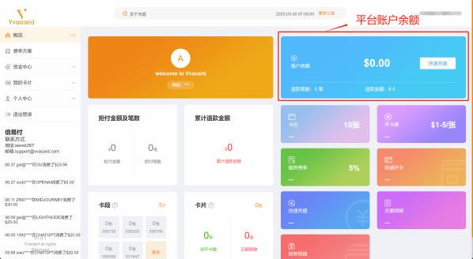

这里我们点击快速充值，即可进入到平台账户充值页面。考虑到ChatGPT Plus每月20刀的费用，这里我 们直接选择在线充值即可：

所谓在线充值，指的是直接对对方账户进行微信或者支付宝转账，并提交转账截图，由平台方客服审核 后充入自己的平台账户，对方收款信息如下：

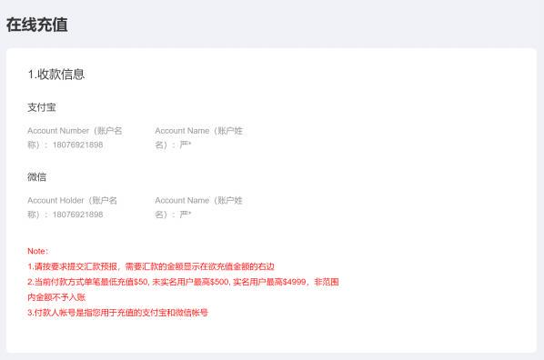

然后根据账户信息进行转账，最小是50刀起充（即350元人民币），可以支持2个月的Plus费用。在转账 时需要输入转账日期（也就是转账当日）、充值金额、充值渠道以及付款方的账号，并提交转账之后的  截图：

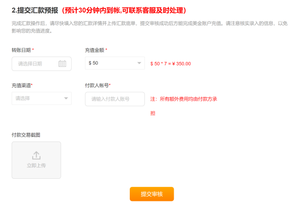

转账后平台需要进行审核，审核状态如下：

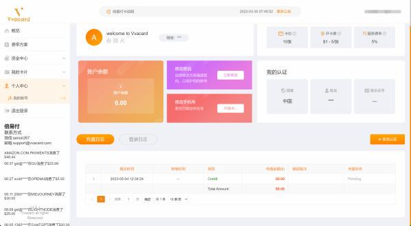

可以添加客服微信sensir267，催促加快处理。

### **Step 2.开通虚拟信用卡**

储值成功后，平台会发送邮件进行通知，然后即可开通虚拟信用卡并充钱。

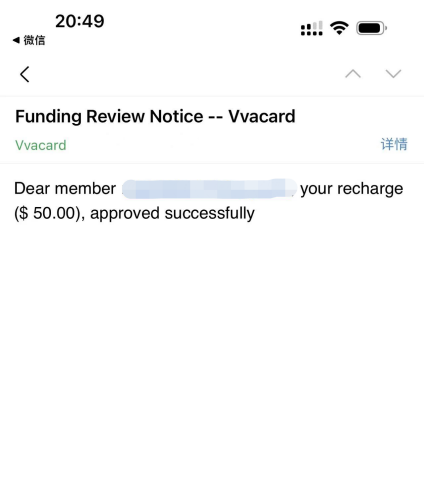

点击左侧我的卡片-快速开卡，进入开卡页面：

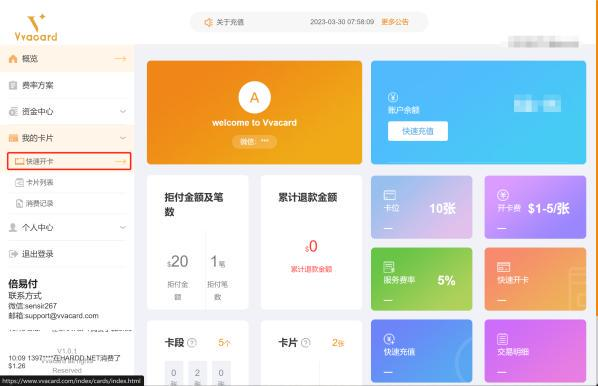

这里我们只需要手动填写FirstName和LastName即可，这里的姓名不影响Plus充值。然后余额改为11 刀，其他内容保持不变：

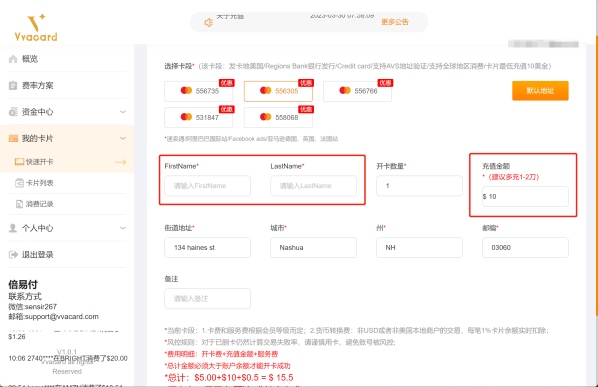

不过需要注意的是，这里我们填写的全部信息都需要记录，在进行Plus充值时需要填写完全一致的信 息。

开卡成功后，我们可以在卡片列表的页面看到激活的卡，点击详情，即可查看卡的信息，以及进行虚拟 信用卡充值：

（第一次开卡应该只有一张卡，这里我开了两张，所以有两个选项）

然后即可进行虚拟信用卡充值或者”减值“ ，这里充值的过程是把平台账户的钱充值给虚拟信用卡，而如果 是减值，也是从虚拟信用卡中把钱转到平台账户：

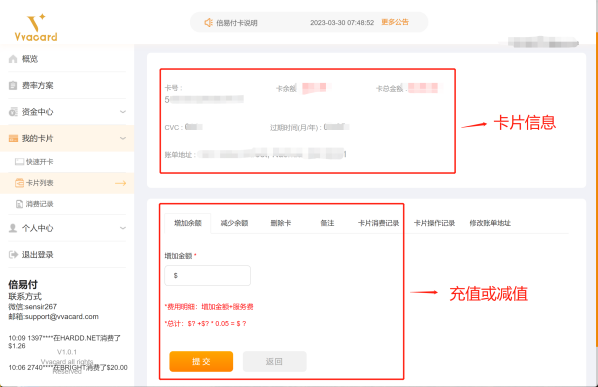

这里建议充值20刀，用于首月的费用。并且需要注意的是，上半部分卡片信息也需要记录，在Plus升级 时需要使用。

### **Step 3.OpenAI账户充值**

[接下来，回到OpenAI账户管理主页： ](https://platform.openai.com/settings/organization/billing/overview)<https://platform.openai.com/settings/organization/billing/over>[view](https://platform.openai.com/settings/organization/billing/overview)

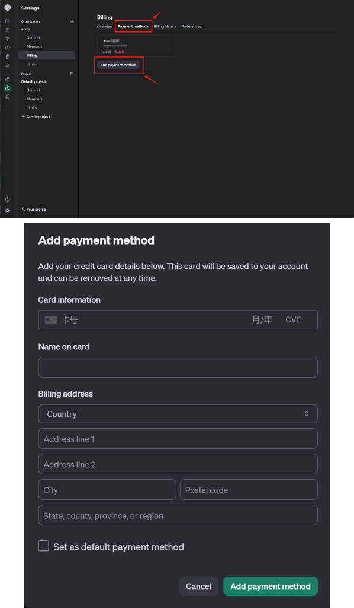

在充值页面，需要仔细填写卡片各项信息，各项信息均可在此前的虚拟信用卡页面找到，需要注意的 是，本环节尽量使用美国魔法，以确保能够顺利充值。

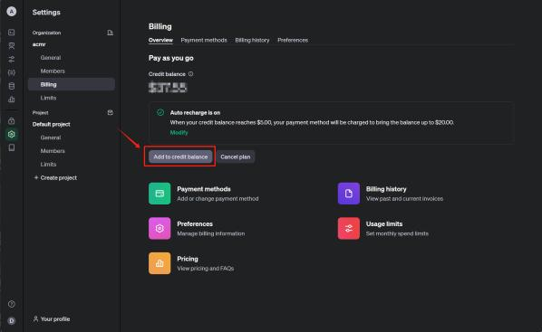

之后即可在usage页面查看使用情况：

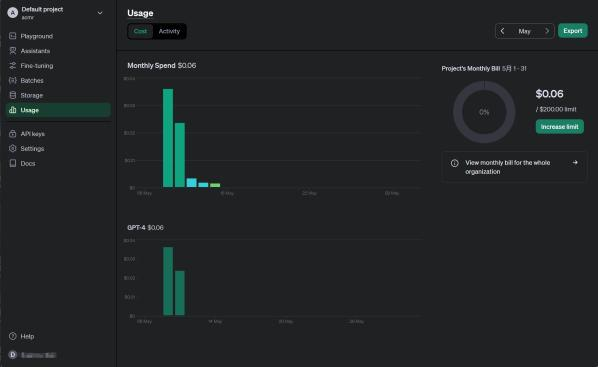

之后即可创建API-KEY：

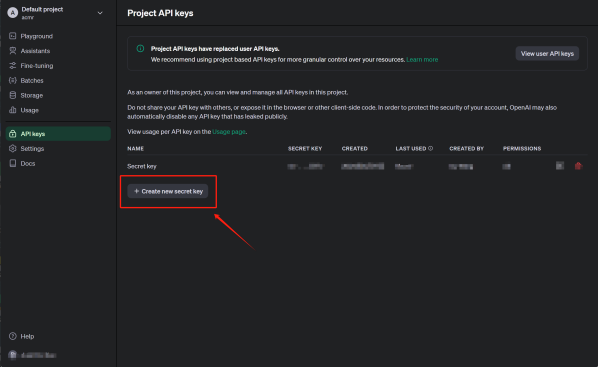

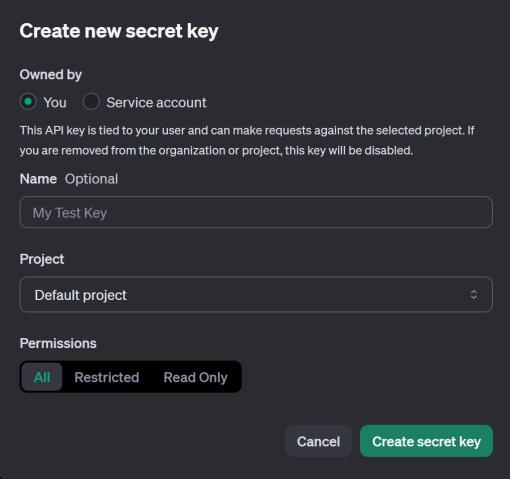

之后保留API-KEY即可。

## **四、GPT4o调用测试**

接下来打开Jupyter输入如下代码测试调用方法：

.  安装openai库：

| !pip install openai |
| ------------------- |

.  导入openai库，创建client对象

| from openai import OpenAIclient = OpenAI(api\_key="YOUR\_API\_KEY") |
| ------------------------------------------------------------------- |

若是国内网络，则需要额外加入反向代理地址：

| client = OpenAI(api\_key="YOUR\_API\_KEY", base\_url='proxy\_url') |
| ------------------------------------------------------------------ |

此处"YOUR\_API\_KEY"需要填入自己的API-KEY，或根据置顶评论领取API-KEY。此处'proxy\_url'需要 输入国内反向代理地址，可根据视频置顶评论领取。

* &#x20; 测试是否能够顺利链接

| completion = client.chat.completions.create( model="gpt-4o",messages=\[{"role": "system", "content": "你是一位乐于助人的助手。"}, {"role": "user", "content": "你好!"}] )print(completion.choices\[0].message.content) |
| -------------------------------------------------------------------------------------------------------------------------------------------------------------------------------------------------------- |

若能返回如下结果，则说明顺利调用GPT4o模型：

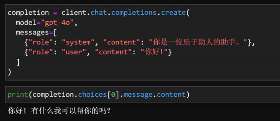

***

**更多大模型技术内容学习，加入大模型技术交流社群**

**扫码添加助理英英，回复“大模型”，了解更多大模型技术详情哦👇**

此外，**扫码回复“LLM”**，即可领取**公开课课件、代码、数据**等\~
