## 《2025大模型Agent智能体开发实战》体验课

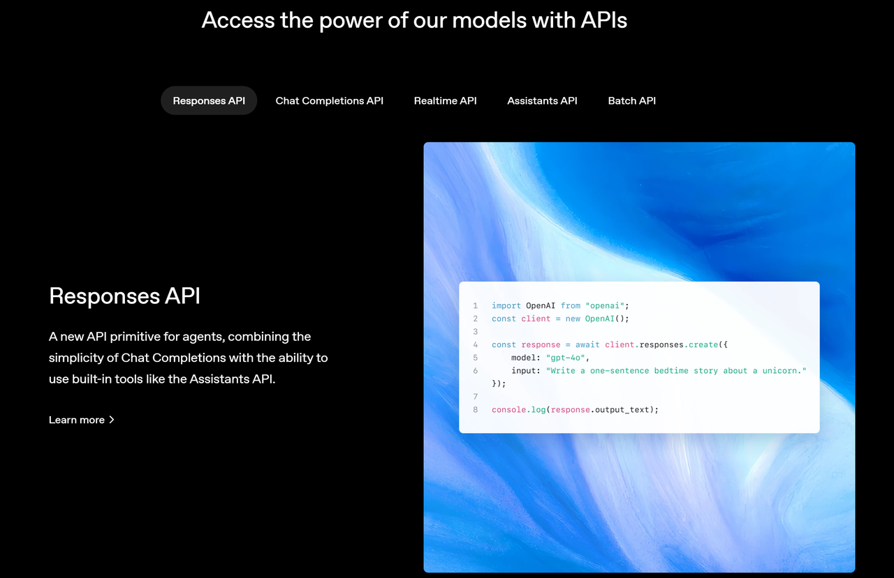

2025年3月11号，OpenAI召开发布会，正式发布全新一代底层调用API：Responses API，并计划在未来一段时间，逐渐代替Chat.Completion API，在如今OpenAI的大模型调用方法已成为业内标准的今天，这一次更新，无疑将对未来的大模型开发生态带来重大影响。

  随着发布会一同发布的，还有三项Agent tools和一个开源Agent SDK，分别是：

* Web Search：允许用户联网搜索相关信息；

* File Search：允许用户将文件上传到OpenAI服务器上，并在模型对话时，实时对其进行检索；

* computer use：允许用户借助大模型功能，来操作当前电脑或浏览器。

* Agent SDK：swarm的升级版，一个开源的Multi-Agent开发框架。

对此，我曾专门录制视频进行入门介绍，感兴趣的同学可以戳此观看：https://www.bilibili.com/video/BV1SVQEYqERV/


本届公开课，我们就围绕OpenAI本次更新内容进行详细讲解。

* 课程资料及相关参考材料：OpenAI注册指南&公开课课件&国内反向代理地址，扫码即可领取。


&#x20;


```python
!pip install openai
```

```plaintext
Looking in indexes: http://mirrors.aliyun.com/pypi/simple
Requirement already satisfied: openai in /root/miniconda3/lib/python3.12/site-packages (1.66.3)
Requirement already satisfied: anyio<5,>=3.5.0 in /root/miniconda3/lib/python3.12/site-packages (from openai) (4.6.2.post1)
Requirement already satisfied: distro<2,>=1.7.0 in /root/miniconda3/lib/python3.12/site-packages (from openai) (1.9.0)
Requirement already satisfied: httpx<1,>=0.23.0 in /root/miniconda3/lib/python3.12/site-packages (from openai) (0.27.2)
Requirement already satisfied: jiter<1,>=0.4.0 in /root/miniconda3/lib/python3.12/site-packages (from openai) (0.8.2)
Requirement already satisfied: pydantic<3,>=1.9.0 in /root/miniconda3/lib/python3.12/site-packages (from openai) (2.10.6)
Requirement already satisfied: sniffio in /root/miniconda3/lib/python3.12/site-packages (from openai) (1.3.1)
Requirement already satisfied: tqdm>4 in /root/miniconda3/lib/python3.12/site-packages (from openai) (4.67.1)
Requirement already satisfied: typing-extensions<5,>=4.11 in /root/miniconda3/lib/python3.12/site-packages (from openai) (4.12.2)
Requirement already satisfied: idna>=2.8 in /root/miniconda3/lib/python3.12/site-packages (from anyio<5,>=3.5.0->openai) (3.7)
Requirement already satisfied: certifi in /root/miniconda3/lib/python3.12/site-packages (from httpx<1,>=0.23.0->openai) (2025.1.31)
Requirement already satisfied: httpcore==1.* in /root/miniconda3/lib/python3.12/site-packages (from httpx<1,>=0.23.0->openai) (1.0.7)
Requirement already satisfied: h11<0.15,>=0.13 in /root/miniconda3/lib/python3.12/site-packages (from httpcore==1.*->httpx<1,>=0.23.0->openai) (0.14.0)
Requirement already satisfied: annotated-types>=0.6.0 in /root/miniconda3/lib/python3.12/site-packages (from pydantic<3,>=1.9.0->openai) (0.7.0)
Requirement already satisfied: pydantic-core==2.27.2 in /root/miniconda3/lib/python3.12/site-packages (from pydantic<3,>=1.9.0->openai) (2.27.2)
WARNING: Running pip as the 'root' user can result in broken permissions and conflicting behaviour with the system package manager. It is recommended to use a virtual environment instead: https://pip.pypa.io/warnings/venv

```

```python
import openai
```

```python
openai.__version__
```

```plaintext
'1.66.3'
```

```python
from openai import OpenAI
```

* 传统chat.completion API调用方法回顾

```python
openai_api_key = "YOUR_API_KEY"
```

```python
base_url = "国内反向代理地址"
```

```python
# 实例化客户端
client = OpenAI(api_key=openai_api_key, 
                base_url=base_url)
```

```python
# 调用 GPT-4o-mini 模型
response = client.chat.completions.create(
    model="gpt-4o-mini",
    messages=[
        {"role": "user", "content": "你好，好久不见!"}
    ]
)
```

```python
response
```

```plaintext
ChatCompletion(id='chatcmpl-BAxh80cMoWVaAYMsZx5BwWGyC6ref', choices=[Choice(finish_reason='stop', index=0, logprobs=None, message=ChatCompletionMessage(content='你好！很高兴见到你！你最近怎么样？有什么我可以帮助你的吗？', refusal=None, role='assistant', annotations=[], audio=None, function_call=None, tool_calls=None))], created=1741952446, model='gpt-4o-mini-2024-07-18', object='chat.completion', service_tier='default', system_fingerprint='fp_06737a9306', usage=CompletionUsage(completion_tokens=21, prompt_tokens=13, total_tokens=34, completion_tokens_details=CompletionTokensDetails(accepted_prediction_tokens=0, audio_tokens=0, reasoning_tokens=0, rejected_prediction_tokens=0), prompt_tokens_details=PromptTokensDetails(audio_tokens=0, cached_tokens=0)))
```

* GPT4o\&o1模型公开课

* GPT4o入门：https://www.bilibili.com/video/BV1Kh22YAE6Z/


* OpenAI o1模型入门：https://www.bilibili.com/video/BV1t82UY6Ezh/


### 一、Responses API基本调用方法介绍

  **Responses API** 是 OpenAI 为智能代理（Agents）提供的**全新 API 基础构件**，它结合了 **Chat Completions API 的简洁性** 与 **Assistants API 的内置工具能力**，使得代理能够更智能地执行任务。

📌 **核心特点**

* ✅ **简洁易用**：继承了 Chat Completions API 的易用性。

* ✅ **增强功能**：支持**内置工具（Tools）**，如函数调用（Function Calling）、Web 搜索、文件搜索、计算机控制等。

* ✅ **适用于代理（Agents）**：可用于构建**智能化任务执行系统**。

🔗 **未来发展**：Responses API 旨在成为 OpenAI 代理系统的**核心 API**，结合 Agents SDK，提供更灵活的任务编排能力。

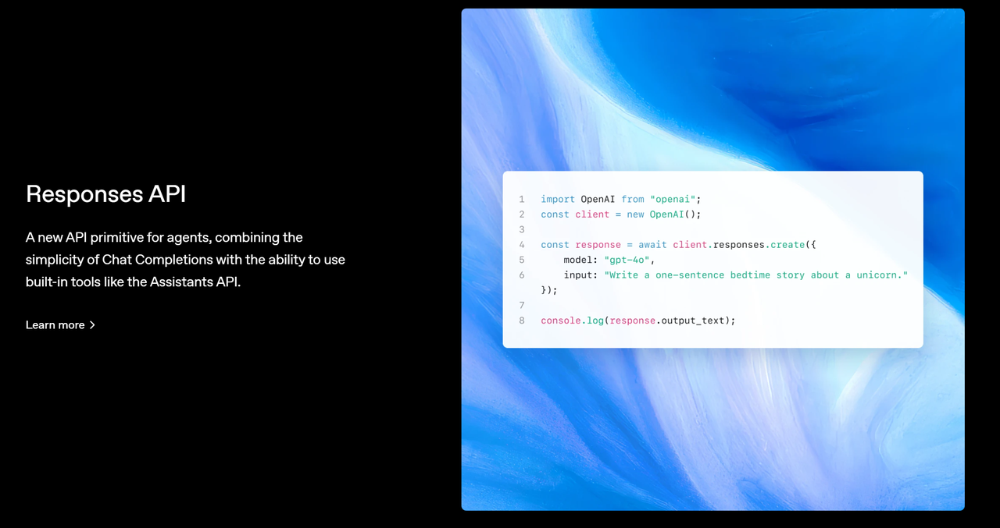

* 官网地址：https://platform.openai.com/docs/guides/text?api-mode=responses

#### 1.文本生成

  使用 OpenAI API，你可以通过一个 **简单的提示（prompt）** 让模型生成文本，类似于 ChatGPT 的工作方式。

```python
response = client.responses.create(
    model="gpt-4o",
    input="你好，好久不见，请介绍下你自己！"
)
```

```python
response
```

```plaintext
Response(id='resp_67d3e10ecbcc8190bdaeb00e8c76c7360e6b5df3e25d4c00', created_at=1741938958.0, error=None, incomplete_details=None, instructions=None, metadata={}, model='gpt-4o-2024-08-06', object='response', output=[ResponseOutputMessage(id='msg_67d3e10f2a0481909e4046740f0ef58a0e6b5df3e25d4c00', content=[ResponseOutputText(annotations=[], text='你好！我是一款先进的人工智能助手，可以帮助回答问题、提供建议和协助你处理各种信息。我很高兴能够与你交流！如果你有什么问题或者需要帮助，随时告诉我哦。', type='output_text')], role='assistant', status='completed', type='message')], parallel_tool_calls=True, temperature=1.0, tool_choice='auto', tools=[], top_p=1.0, max_output_tokens=None, previous_response_id=None, reasoning=Reasoning(effort=None, generate_summary=None), status='completed', text=ResponseTextConfig(format=ResponseFormatText(type='text')), truncation='disabled', usage=ResponseUsage(input_tokens=36, output_tokens=47, output_tokens_details=OutputTokensDetails(reasoning_tokens=0), total_tokens=83, input_tokens_details={'cached_tokens': 0}), user=None, store=True)
```

```python
response.output_text
```

```plaintext
'你好！我是一款先进的人工智能助手，可以帮助回答问题、提供建议和协助你处理各种信息。我很高兴能够与你交流！如果你有什么问题或者需要帮助，随时告诉我哦。'
```

#### **2. 响应结构**

  OpenAI 的 API 响应包含**一个内容数组**（`output`），每个内容项具有以下结构：

```json
[
    {
        "id": "msg_67b73f697ba4819183a15cc17d011509",
        "type": "message",
        "role": "assistant",
        "content": [
            {
                "type": "output_text",
                "text": "你好！我是一款先进的人工智能助手，可以帮助回答问题、提供建议和协助你处理各种信息。我很高兴能够与你交流！如果你有什么问题或者需要帮助，随时告诉我哦。",
                "annotations": []
            }
        ]
    }
]
```

**📌 重要说明：**

* `output` **可能包含多个结果**，在多轮对话或批量生成时尤其明显。

* 一些 SDK 提供 `output_text` **属性**，可以**直接获取所有文本输出**，方便访问文本数据。

* **除了纯文本，模型还可以返回 JSON 结构化数据**（称为 **Structured Outputs**）。

```python
response.output
```

```plaintext
[ResponseOutputMessage(id='msg_67d3e10f2a0481909e4046740f0ef58a0e6b5df3e25d4c00', content=[ResponseOutputText(annotations=[], text='你好！我是一款先进的人工智能助手，可以帮助回答问题、提供建议和协助你处理各种信息。我很高兴能够与你交流！如果你有什么问题或者需要帮助，随时告诉我哦。', type='output_text')], role='assistant', status='completed', type='message')]
```

```python
response.output[0]
```

```plaintext
ResponseOutputMessage(id='msg_67d3e10f2a0481909e4046740f0ef58a0e6b5df3e25d4c00', content=[ResponseOutputText(annotations=[], text='你好！我是一款先进的人工智能助手，可以帮助回答问题、提供建议和协助你处理各种信息。我很高兴能够与你交流！如果你有什么问题或者需要帮助，随时告诉我哦。', type='output_text')], role='assistant', status='completed', type='message')
```

```python
response.output[0].content
```

```plaintext
[ResponseOutputText(annotations=[], text='你好！我是一款先进的人工智能助手，可以帮助回答问题、提供建议和协助你处理各种信息。我很高兴能够与你交流！如果你有什么问题或者需要帮助，随时告诉我哦。', type='output_text')]
```

```python
response.output[0].content[0]
```

```plaintext
ResponseOutputText(annotations=[], text='你好！我是一款先进的人工智能助手，可以帮助回答问题、提供建议和协助你处理各种信息。我很高兴能够与你交流！如果你有什么问题或者需要帮助，随时告诉我哦。', type='output_text')
```

```python
response.output[0].content[0].text
```

```plaintext
'你好！我是一款先进的人工智能助手，可以帮助回答问题、提供建议和协助你处理各种信息。我很高兴能够与你交流！如果你有什么问题或者需要帮助，随时告诉我哦。'
```

#### 3. 消息角色与指令控制

  我们可以使用不同的方式**给模型提供指令**：

1. **使用 `instructions` 参数** 提供全局行为指令，如语气、目标等。（权重最高）

2. **使用 `input` 数组，指定不同角色的消息**。

```python
response = client.responses.create(
    model="gpt-4o",
    instructions="用海盗的口吻说话。",
    input="JavaScript 中的分号是可选的吗？",
)
```

```python
print(response.output_text)
```

```plaintext
啊，船长，当涉及到JavaScript那片汪洋时，分号这玩意儿确是可选的！不加分号，JavaScript会用它的“自动分号插入”这门巫术帮你上一道，但它有时也会出岔子，让你误入险境。因此，明智的海盗总在适当之处加上分号，以防意外啦！⚓️
```

📌 **在 `instructions` 中定义“说话像海盗”后，模型会以海盗风格回答。**

  此外，也可以使用 `input` 数组还可以指定多种角色，例如使用developer角色，`developer` 角色类似于 **系统设定**，用户输入 `user` 角色的内容，最终 **模型按 `developer` 设定风格回答**。

```python
response = client.responses.create(
    model="gpt-4o",
    input=[
        {
            "role": "developer",
            "content": "用海盗的口吻说话。"
        },
        {
            "role": "user",
            "content": "JavaScript 中的分号是可选的吗？"
        }
    ]
)
```

```python
print(response.output_text)
```

```plaintext
啊，船长！在 JavaScript 这片汪洋中，分号虽说是可选的，但有时就像海上的避风锚。若是不慎，就可能被自动插入机制给搅了局。聪明的海盗大都在每个语句后头放上分号，以免让风暴打翻了船。小心驶得万年船，啊！
```

#### 4. 消息角色的优先级

OpenAI 规定不同角色的优先级如下：

| **角色**      | **优先级** | **说明**                       |
| ----------- | ------- | ---------------------------- |
| `developer` | **最高**  | 由开发者提供的指令，优先级最高，类似 `system`。 |
| `user`      | **次高**  | 由最终用户提供的输入，次于 `developer`。   |
| `assistant` | **最低**  | 由模型生成的响应。                    |

#### 5.推理模型调用

* 查看可以调用的模型

```python
models_list = client.models.list()
```

```python
models_list.data
```

```plaintext
[Model(id='gpt-4o-mini-audio-preview-2024-12-17', created=1734115920, object='model', owned_by='system'),
 Model(id='dall-e-3', created=1698785189, object='model', owned_by='system'),
 Model(id='dall-e-2', created=1698798177, object='model', owned_by='system'),
 Model(id='gpt-4o-audio-preview-2024-10-01', created=1727389042, object='model', owned_by='system'),
 Model(id='gpt-4o-audio-preview', created=1727460443, object='model', owned_by='system'),
 Model(id='gpt-4o-mini-realtime-preview-2024-12-17', created=1734112601, object='model', owned_by='system'),
 Model(id='gpt-4o-mini-realtime-preview', created=1734387380, object='model', owned_by='system'),
 Model(id='o1-mini-2024-09-12', created=1725648979, object='model', owned_by='system'),
 Model(id='o1-mini', created=1725649008, object='model', owned_by='system'),
 Model(id='omni-moderation-latest', created=1731689265, object='model', owned_by='system'),
 Model(id='gpt-4o-mini', created=1721172741, object='model', owned_by='system'),
 Model(id='gpt-4o-mini-audio-preview', created=1734387424, object='model', owned_by='system'),
 Model(id='omni-moderation-2024-09-26', created=1732734466, object='model', owned_by='system'),
 Model(id='gpt-4o-realtime-preview-2024-10-01', created=1727131766, object='model', owned_by='system'),
 Model(id='babbage-002', created=1692634615, object='model', owned_by='system'),
 Model(id='tts-1-hd-1106', created=1699053533, object='model', owned_by='system'),
 Model(id='text-embedding-3-large', created=1705953180, object='model', owned_by='system'),
 Model(id='gpt-4o-audio-preview-2024-12-17', created=1734034239, object='model', owned_by='system'),
 Model(id='gpt-4', created=1687882411, object='model', owned_by='openai'),
 Model(id='gpt-4-0125-preview', created=1706037612, object='model', owned_by='system'),
 Model(id='gpt-4o-2024-05-13', created=1715368132, object='model', owned_by='system'),
 Model(id='tts-1-hd', created=1699046015, object='model', owned_by='system'),
 Model(id='gpt-4-turbo-preview', created=1706037777, object='model', owned_by='system'),
 Model(id='o1-preview', created=1725648897, object='model', owned_by='system'),
 Model(id='o1-preview-2024-09-12', created=1725648865, object='model', owned_by='system'),
 Model(id='gpt-3.5-turbo-instruct-0914', created=1694122472, object='model', owned_by='system'),
 Model(id='gpt-4o-mini-search-preview', created=1741391161, object='model', owned_by='system'),
 Model(id='o1-2024-12-17', created=1734326976, object='model', owned_by='system'),
 Model(id='o1', created=1734375816, object='model', owned_by='system'),
 Model(id='tts-1-1106', created=1699053241, object='model', owned_by='system'),
 Model(id='davinci-002', created=1692634301, object='model', owned_by='system'),
 Model(id='gpt-3.5-turbo-1106', created=1698959748, object='model', owned_by='system'),
 Model(id='o3-mini-2025-01-31', created=1738010200, object='model', owned_by='system'),
 Model(id='gpt-4o-search-preview', created=1741388720, object='model', owned_by='system'),
 Model(id='gpt-4-turbo', created=1712361441, object='model', owned_by='system'),
 Model(id='o3-mini', created=1737146383, object='model', owned_by='system'),
 Model(id='gpt-3.5-turbo-instruct', created=1692901427, object='model', owned_by='system'),
 Model(id='gpt-4o-mini-search-preview-2025-03-11', created=1741390858, object='model', owned_by='system'),
 Model(id='gpt-3.5-turbo-0125', created=1706048358, object='model', owned_by='system'),
 Model(id='gpt-4o-2024-08-06', created=1722814719, object='model', owned_by='system'),
 Model(id='gpt-4o-realtime-preview-2024-12-17', created=1733945430, object='model', owned_by='system'),
 Model(id='gpt-3.5-turbo', created=1677610602, object='model', owned_by='openai'),
 Model(id='gpt-4-turbo-2024-04-09', created=1712601677, object='model', owned_by='system'),
 Model(id='gpt-4o-realtime-preview', created=1727659998, object='model', owned_by='system'),
 Model(id='gpt-3.5-turbo-16k', created=1683758102, object='model', owned_by='openai-internal'),
 Model(id='gpt-4o', created=1715367049, object='model', owned_by='system'),
 Model(id='text-embedding-3-small', created=1705948997, object='model', owned_by='system'),
 Model(id='chatgpt-4o-latest', created=1723515131, object='model', owned_by='system'),
 Model(id='gpt-4-1106-preview', created=1698957206, object='model', owned_by='system'),
 Model(id='text-embedding-ada-002', created=1671217299, object='model', owned_by='openai-internal'),
 Model(id='whisper-1', created=1677532384, object='model', owned_by='openai-internal'),
 Model(id='gpt-4-0613', created=1686588896, object='model', owned_by='openai'),
 Model(id='tts-1', created=1681940951, object='model', owned_by='openai-internal'),
 Model(id='gpt-4.5-preview', created=1740623059, object='model', owned_by='system'),
 Model(id='computer-use-preview-2025-03-11', created=1741377021, object='model', owned_by='system'),
 Model(id='computer-use-preview', created=1734655677, object='model', owned_by='system'),
 Model(id='gpt-4.5-preview-2025-02-27', created=1740623304, object='model', owned_by='system'),
 Model(id='gpt-4o-search-preview-2025-03-11', created=1741388170, object='model', owned_by='system'),
 Model(id='gpt-4o-2024-11-20', created=1739331543, object='model', owned_by='system'),
 Model(id='gpt-4o-mini-2024-07-18', created=1721172717, object='model', owned_by='system')]
```

* 借助o3模型进行调用

```python
response = client.responses.create(
    model="o3-mini",
    input="你好，请帮我编写一个贪吃蛇小游戏，并能在html中运行。"
)
```

```python
from IPython.display import display, Code, Markdown
```

```python
response.output_text
```

```plaintext
'下面提供一个完整的 HTML 文件示例，实现了一个简单的贪吃蛇小游戏。你只需将下面的代码保存为一个 .html 文件（比如 snake.html），然后用浏览器打开即可运行。\n\n--------------------------------------------------\n<!DOCTYPE html>\n<html lang="zh-CN">\n<head>\n  <meta charset="UTF-8">\n  <title>贪吃蛇小游戏</title>\n  <style>\n    /* 设置画布样式 */\n    canvas {\n      background-color: #000;\n      display: block;\n      margin: 50px auto;\n      border: 1px solid #444;\n    }\n  </style>\n</head>\n<body>\n  <canvas id="gameCanvas" width="400" height="400"></canvas>\n  <script>\n    // 获取画布及其上下文\n    const canvas = document.getElementById("gameCanvas");\n    const ctx = canvas.getContext("2d");\n\n    // 定义网格大小（每个方块大小）\n    const gridSize = 20;\n\n    // 定义蛇(由一个包含 x, y 的坐标对象组成的数组)\n    let snake = [\n      { x: 160, y: 160 },\n      { x: 140, y: 160 },\n      { x: 120, y: 160 }\n    ];\n\n    // 定义蛇的移动方向（初始向右移动）\n    let dx = gridSize;\n    let dy = 0;\n\n    // 定义苹果的坐标\n    let apple = { x: 0, y: 0 };\n\n    // 控制游戏速度（利用 requestAnimationFrame 的“计数器”来降低帧率）\n    let count = 0;\n\n    // 随机生成苹果位置（保证在画布网格上）\n    function randomApple() {\n      apple.x = Math.floor(Math.random() * (canvas.width / gridSize)) * gridSize;\n      apple.y = Math.floor(Math.random() * (canvas.height / gridSize)) * gridSize;\n    }\n    randomApple();\n\n    // 游戏主循环\n    function game() {\n      requestAnimationFrame(game);\n\n      // 控制帧率，每4帧更新一次（可以根据需要调整）\n      if (++count < 4) {\n        return;\n      }\n      count = 0;\n\n      // 计算蛇头的新位置\n      const head = { x: snake[0].x + dx, y: snake[0].y + dy };\n\n      // 将新位置加入蛇头\n      snake.unshift(head);\n\n      // 判断是否吃到苹果\n      if (head.x === apple.x && head.y === apple.y) {\n        // 吃到苹果后重新生成苹果位置（不移除蛇尾，蛇身增长）\n        randomApple();\n      } else {\n        // 没有吃到苹果则移除蛇尾（保持长度不变）\n        snake.pop();\n      }\n\n      // 边界检测：如果蛇头碰到画布边界，则重置游戏\n      if (head.x < 0 || head.x >= canvas.width || head.y < 0 || head.y >= canvas.height) {\n        resetGame();\n        return;\n      }\n\n      // 检测蛇是否撞到自己\n      for (let i = 1; i < snake.length; i++) {\n        if (head.x === snake[i].x && head.y === snake[i].y) {\n          resetGame();\n          return;\n        }\n      }\n\n      // 绘制背景\n      ctx.fillStyle = "black";\n      ctx.fillRect(0, 0, canvas.width, canvas.height);\n\n      // 绘制苹果（红色方块）\n      ctx.fillStyle = "red";\n      ctx.fillRect(apple.x, apple.y, gridSize - 2, gridSize - 2);\n\n      // 绘制蛇（绿色方块）\n      ctx.fillStyle = "lime";\n      snake.forEach(part => {\n        ctx.fillRect(part.x, part.y, gridSize - 2, gridSize - 2);\n      });\n    }\n\n    // 键盘事件监听，根据上下左右方向键控制蛇的移动\n    document.addEventListener("keydown", e => {\n      // 避免蛇反向移动（上下或左右同时只能改变一次）\n      if (e.key === "ArrowUp" && dy === 0) {\n        dx = 0;\n        dy = -gridSize;\n      } else if (e.key === "ArrowDown" && dy === 0) {\n        dx = 0;\n        dy = gridSize;\n      } else if (e.key === "ArrowLeft" && dx === 0) {\n        dx = -gridSize;\n        dy = 0;\n      } else if (e.key === "ArrowRight" && dx === 0) {\n        dx = gridSize;\n        dy = 0;\n      }\n    });\n\n    // 重置游戏，初始化蛇和苹果的状态\n    function resetGame() {\n      snake = [\n        { x: 160, y: 160 },\n        { x: 140, y: 160 },\n        { x: 120, y: 160 }\n      ];\n      dx = gridSize;\n      dy = 0;\n      randomApple();\n    }\n\n    // 开始游戏主循环\n    requestAnimationFrame(game);\n  </script>\n</body>\n</html>\n--------------------------------------------------\n\n代码说明：\n1. 在 head 部分引入了简单的 CSS 设置，将 Canvas 居中显示并设置黑色背景。\n2. 使用 Canvas 绘制蛇（用绿色小方块）和苹果（用红色小方块）。\n3. 通过 requestAnimationFrame 进行游戏主循环，并利用计数器来控制更新速率。\n4. 通过监听键盘的 Arrow 按键控制蛇的移动方向，同时避免了直接反向移动的情况。\n5. 如果蛇碰到边界或者碰到自己，调用 resetGame() 重置游戏状态。\n\n你可以根据需要对代码进行进一步扩展，比如添加得分显示、难度调节等。希望这个示例能帮助你实现一个简单的贪吃蛇游戏！'
```

```python
print(response.output_text)
```

```plaintext
下面提供一个完整的 HTML 文件示例，实现了一个简单的贪吃蛇小游戏。你只需将下面的代码保存为一个 .html 文件（比如 snake.html），然后用浏览器打开即可运行。

--------------------------------------------------
<!DOCTYPE html>
<html lang="zh-CN">
<head>
  <meta charset="UTF-8">
  <title>贪吃蛇小游戏</title>
  <style>
    /* 设置画布样式 */
    canvas {
      background-color: #000;
      display: block;
      margin: 50px auto;
      border: 1px solid #444;
    }
  </style>
</head>
<body>
  <canvas id="gameCanvas" width="400" height="400"></canvas>
  <script>
    // 获取画布及其上下文
    const canvas = document.getElementById("gameCanvas");
    const ctx = canvas.getContext("2d");

    // 定义网格大小（每个方块大小）
    const gridSize = 20;

    // 定义蛇(由一个包含 x, y 的坐标对象组成的数组)
    let snake = [
      { x: 160, y: 160 },
      { x: 140, y: 160 },
      { x: 120, y: 160 }
    ];

    // 定义蛇的移动方向（初始向右移动）
    let dx = gridSize;
    let dy = 0;

    // 定义苹果的坐标
    let apple = { x: 0, y: 0 };

    // 控制游戏速度（利用 requestAnimationFrame 的“计数器”来降低帧率）
    let count = 0;

    // 随机生成苹果位置（保证在画布网格上）
    function randomApple() {
      apple.x = Math.floor(Math.random() * (canvas.width / gridSize)) * gridSize;
      apple.y = Math.floor(Math.random() * (canvas.height / gridSize)) * gridSize;
    }
    randomApple();

    // 游戏主循环
    function game() {
      requestAnimationFrame(game);

      // 控制帧率，每4帧更新一次（可以根据需要调整）
      if (++count < 4) {
        return;
      }
      count = 0;

      // 计算蛇头的新位置
      const head = { x: snake[0].x + dx, y: snake[0].y + dy };

      // 将新位置加入蛇头
      snake.unshift(head);

      // 判断是否吃到苹果
      if (head.x === apple.x && head.y === apple.y) {
        // 吃到苹果后重新生成苹果位置（不移除蛇尾，蛇身增长）
        randomApple();
      } else {
        // 没有吃到苹果则移除蛇尾（保持长度不变）
        snake.pop();
      }

      // 边界检测：如果蛇头碰到画布边界，则重置游戏
      if (head.x < 0 || head.x >= canvas.width || head.y < 0 || head.y >= canvas.height) {
        resetGame();
        return;
      }

      // 检测蛇是否撞到自己
      for (let i = 1; i < snake.length; i++) {
        if (head.x === snake[i].x && head.y === snake[i].y) {
          resetGame();
          return;
        }
      }

      // 绘制背景
      ctx.fillStyle = "black";
      ctx.fillRect(0, 0, canvas.width, canvas.height);

      // 绘制苹果（红色方块）
      ctx.fillStyle = "red";
      ctx.fillRect(apple.x, apple.y, gridSize - 2, gridSize - 2);

      // 绘制蛇（绿色方块）
      ctx.fillStyle = "lime";
      snake.forEach(part => {
        ctx.fillRect(part.x, part.y, gridSize - 2, gridSize - 2);
      });
    }

    // 键盘事件监听，根据上下左右方向键控制蛇的移动
    document.addEventListener("keydown", e => {
      // 避免蛇反向移动（上下或左右同时只能改变一次）
      if (e.key === "ArrowUp" && dy === 0) {
        dx = 0;
        dy = -gridSize;
      } else if (e.key === "ArrowDown" && dy === 0) {
        dx = 0;
        dy = gridSize;
      } else if (e.key === "ArrowLeft" && dx === 0) {
        dx = -gridSize;
        dy = 0;
      } else if (e.key === "ArrowRight" && dx === 0) {
        dx = gridSize;
        dy = 0;
      }
    });

    // 重置游戏，初始化蛇和苹果的状态
    function resetGame() {
      snake = [
        { x: 160, y: 160 },
        { x: 140, y: 160 },
        { x: 120, y: 160 }
      ];
      dx = gridSize;
      dy = 0;
      randomApple();
    }

    // 开始游戏主循环
    requestAnimationFrame(game);
  </script>
</body>
</html>
--------------------------------------------------

代码说明：
1. 在 head 部分引入了简单的 CSS 设置，将 Canvas 居中显示并设置黑色背景。
2. 使用 Canvas 绘制蛇（用绿色小方块）和苹果（用红色小方块）。
3. 通过 requestAnimationFrame 进行游戏主循环，并利用计数器来控制更新速率。
4. 通过监听键盘的 Arrow 按键控制蛇的移动方向，同时避免了直接反向移动的情况。
5. 如果蛇碰到边界或者碰到自己，调用 resetGame() 重置游戏状态。

你可以根据需要对代码进行进一步扩展，比如添加得分显示、难度调节等。希望这个示例能帮助你实现一个简单的贪吃蛇游戏！
```

* responses API参数列表

| 参数名                         | 类型                    | 必填/可选 | 默认值   | 说明                                                                 |
| --------------------------- | --------------------- | ----- | ----- | ------------------------------------------------------------------ |
| **model**                   | string                | 必填    | 无     | 指定要使用的模型 ID，例如 `gpt-4o` 或 `gpt-4o-mini`。                           |
| **store**                   | boolean or null       | 可选    | false | 是否存储本次对话的输出，供模型精炼或评估产品使用。                                          |
| **metadata**                | object or null        | 可选    | null  | 开发者自定义的标签和值，用于过滤仪表盘中的补全结果。                                         |
| **frequency\_penalty**      | number or null        | 可选    | 0     | 数值在 `-2.0` 到 `2.0` 之间，正值减少重复生成内容的可能性。                              |
| **logit\_bias**             | map                   | 可选    | null  | 调整某些特定 tokens 出现的可能性，值在 `-100` 到 `100` 之间。                         |
| **logprobs**                | boolean or null       | 可选    | false | 是否返回生成的每个 token 的对数概率。                                             |
| **top\_logprobs**           | integer or null       | 可选    | null  | 指定返回最有可能出现的前几个 tokens 及其概率，需开启 `logprobs`。                         |
| **max\_completion\_tokens** | integer or null       | 可选    | null  | 指定模型生成的最大 token 数，包括可见文本和推理 tokens。                                |
| **n**                       | integer or null       | 可选    | 1     | 每个输入生成的对话补全选项数量，值越大，生成的回复越多。                                       |
| **presence\_penalty**       | number or null        | 可选    | 0     | 数值在 `-2.0` 到 `2.0` 之间，正值鼓励生成新的主题和内容。                               |
| **response\_format**        | object                | 可选    | null  | 指定生成结果的格式，可以设置为 `json_schema` 以确保结构化输出，或 `json_object` 用于 JSON 格式。 |
| **seed**                    | integer or null       | 可选    | null  | 保持生成的一致性，重复相同请求将尽量生成相同的结果。                                         |
| **service\_tier**           | string or null        | 可选    | auto  | 指定服务延迟等级，适用于付费订阅用户，默认为 `auto`。                                     |
| **stop**                    | string / array / null | 可选    | null  | 最多指定 4 个序列，API 遇到这些序列时会停止生成进一步的 tokens。                            |
| **stream**                  | boolean or null       | 可选    | false | 是否启用流式响应，若启用，生成的 tokens 将逐步返回。                                     |
| **stream\_options**         | object or null        | 可选    | null  | 流式响应的选项，仅当 `stream` 为 `true` 时设置。                                  |
| **temperature**             | number or null        | 可选    | 1     | 控制生成输出的随机性，值越高生成的文本越随机。建议调整此值或 `top_p`，而不是同时调整。                    |
| **top\_p**                  | number or null        | 可选    | 1     | 使用核采样方法，选择最有可能的 tokens，总概率达到 `top_p` 百分比。建议与 `temperature` 二选一。    |
| **tools**                   | array                 | 可选    | null  | 模型可以调用的工具列表，目前仅支持函数调用。                                             |
| **user**                    | string                | 可选    | null  | 表示最终用户的唯一标识符，用于监控和检测滥用行为。                                          |

***

### 参数解释：

1. **模型和输出相关参数**：

   * `model` 是必填参数，决定使用哪个模型（如 `gpt-4o` 或 `gpt-4o-mini`）。

   * `store` 控制是否存储生成的对话结果，便于后续模型训练或评估。

   * `metadata` 用于添加开发者自定义的标签，便于在仪表盘中过滤补全结果。

   * `max_completion_tokens` 和 `n` 控制生成内容的数量和长度，帮助管理生成成本。

2. **生成行为控制**：

   * `frequency_penalty` 和 `presence_penalty` 都用于影响生成结果的内容重复度和新颖性。

   * `logit_bias` 是用于调整特定 token 出现概率的高级控制工具。

   * `temperature` 和 `top_p` 通过不同的方式控制生成结果的随机性，建议选其一进行调整。

3. **高级功能**：

   * `logprobs` 和 `top_logprobs` 用于返回每个 token 的概率信息，适合对模型输出进行更细粒度分析。

   * `stream` 启用后会实时返回生成的结果，适用于需要逐步展示内容的场景。

   * `tools` 允许模型调用外部工具（如函数），适用于扩展模型的功能。

4. **服务和用户相关参数**：

   * `service_tier` 控制服务的延迟和稳定性，适合高性能要求的付费用户。

   * `user` 用于标识最终用户，有助于监控使用行为，防止滥用。

***

### 三、Web Search（网页搜索）功能实现

  OpenAI Agents SDK 支持**网页搜索**，允许模型在生成回答之前**查询最新的信息**，类似于 ChatGPT 的搜索功能，并提供**清晰的引用**来源。

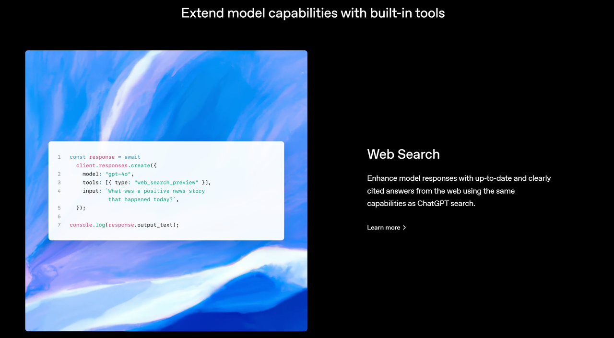

* 官网地址：https://platform.openai.com/docs/guides/tools-web-search?api-mode=responses

```python
response = client.responses.create(
    model="gpt-4o",
    tools=[{"type": "web_search_preview"}],  # 启用 Web 搜索工具
    input="今天有什么正面的新闻吗？"
)
```

```python
print(response.output_text)
```

```plaintext
以下是近期的一些正面新闻：

1. **香港政商界对降息持积极态度**：2024年9月19日，美国联邦储备委员会四年来首次降息，香港金融管理局随即下调基本利率。香港政商界人士认为，此举有助于降低企业资金成本，对香港经济和资产市场产生正面影响。 ([news.youth.cn](https://news.youth.cn/jsxw/202409/t20240919_15529696.htm?utm_source=openai))

2. **中国青年对欧洲及德国评价积极**：2022年7月发布的《中国青年的欧洲观》报告显示，中国青年普遍对欧洲，特别是德国，持积极正面的评价，认为中欧及中德关系总体友好互利，并对未来关系发展持乐观态度。 ([news.youth.cn](https://news.youth.cn/gj/202207/t20220726_13871411.htm?utm_source=openai))

3. **正面舆情引领新闻报道新路径**：近年来，天津“跳水大爷”、广东龙舟赛“摇头哥”、淄博烧烤等正面舆情事件增多，体现了网络生态的积极变化，为媒体进行正面报道提供了新的思路，有助于克服“强行正能量”等问题。 ([news.qq.com](https://news.qq.com/rain/a/20240908A00ZCQ00?utm_source=openai))

希望这些新闻能为您带来积极的感受。 
```

📌 **效果**：

* 该 API 请求会调用 `web_search_preview`，允许模型在回答前**搜索最新的新闻**。

* 但**模型可以自行决定**是否使用该工具。

```python
response
```

```plaintext
Response(id='resp_67d3e43ec15c8190be1d4ef786c5000d04483d504f8a42a4', created_at=1741939774.0, error=None, incomplete_details=None, instructions=None, metadata={}, model='gpt-4o-2024-08-06', object='response', output=[ResponseFunctionWebSearch(id='ws_67d3e43f2d348190af9efa09bfe0101304483d504f8a42a4', status='completed', type='web_search_call'), ResponseOutputMessage(id='msg_67d3e4414c3481908cf889203e6abe8f04483d504f8a42a4', content=[ResponseOutputText(annotations=[AnnotationURLCitation(end_index=215, start_index=122, title='香港政商界：降息对香港经济和资产市场影响正面_新闻频道_中国青年网', type='url_citation', url='https://news.youth.cn/jsxw/202409/t20240919_15529696.htm?utm_source=openai'), AnnotationURLCitation(end_index=411, start_index=320, title='中国青年对欧洲及德国总体评价积极正面_新闻频道_中国青年网', type='url_citation', url='https://news.youth.cn/gj/202207/t20220726_13871411.htm?utm_source=openai'), AnnotationURLCitation(end_index=597, start_index=519, title='正面舆情：新闻规律回归与正面报道新路径_腾讯新闻', type='url_citation', url='https://news.qq.com/rain/a/20240908A00ZCQ00?utm_source=openai')], text='以下是近期的一些正面新闻：\n\n1. **香港政商界对降息持积极态度**：2024年9月19日，美国联邦储备委员会四年来首次降息，香港金融管理局随即下调基本利率。香港政商界人士认为，此举有助于降低企业资金成本，对香港经济和资产市场产生正面影响。 ([news.youth.cn](https://news.youth.cn/jsxw/202409/t20240919_15529696.htm?utm_source=openai))\n\n2. **中国青年对欧洲及德国评价积极**：2022年7月发布的《中国青年的欧洲观》报告显示，中国青年普遍对欧洲，特别是德国，持积极正面的评价，认为中欧及中德关系总体友好互利，并对未来关系发展持乐观态度。 ([news.youth.cn](https://news.youth.cn/gj/202207/t20220726_13871411.htm?utm_source=openai))\n\n3. **正面舆情引领新闻报道新路径**：近年来，天津“跳水大爷”、广东龙舟赛“摇头哥”、淄博烧烤等正面舆情事件增多，体现了网络生态的积极变化，为媒体进行正面报道提供了新的思路，有助于克服“强行正能量”等问题。 ([news.qq.com](https://news.qq.com/rain/a/20240908A00ZCQ00?utm_source=openai))\n\n希望这些新闻能为您带来积极的感受。 ', type='output_text')], role='assistant', status='completed', type='message')], parallel_tool_calls=True, temperature=1.0, tool_choice='auto', tools=[WebSearchTool(type='web_search_preview', search_context_size='medium', user_location=UserLocation(type='approximate', city=None, country='US', region=None, timezone=None))], top_p=1.0, max_output_tokens=None, previous_response_id=None, reasoning=Reasoning(effort=None, generate_summary=None), status='completed', text=ResponseTextConfig(format=ResponseFormatText(type='text')), truncation='disabled', usage=ResponseUsage(input_tokens=326, output_tokens=364, output_tokens_details=OutputTokensDetails(reasoning_tokens=0), total_tokens=690, input_tokens_details={'cached_tokens': 0}), user=None, store=True)
```

```python
response1 = client.responses.create(
    model="gpt-4o",
    tools=[{"type": "web_search_preview"}],  # 启用 Web 搜索工具
    input="请帮我讲个笑话吧。"
)
```

```python
print(response1.output_text)
```

```plaintext
当然可以！你听说过那个关于小蘑菇的笑话吗？

为什么小蘑菇去派对？

因为它是一朵“欢人”！（Fun-guy，fungi）

希望你喜欢！😊
```

#### **2. 强制使用 Web 搜索**

如果希望**确保模型一定使用 Web 搜索**（避免它仅使用内部知识回答），可以**设置 `tool_choice` 参数**：

```python
tool_choice={"type": "web_search_preview"}
```

📌 **作用**：

* 让 Web 搜索**始终**执行，而不是让模型决定是否使用搜索工具。

* **提升一致性**，但可能会增加**查询时间**。

#### **3. 输出格式与引用**

如果模型调用了 Web 搜索，API 响应将包含**两部分**：

1. **Web 搜索调用的 ID**

2. **模型的回答**，并带有网页来源的**引用信息**

**📌 示例输出**:

```json
[
  {
    "type": "web_search_call",
    "id": "ws_67c9fa0502748190b7dd390736892e100be649c1a5ff9609",
    "status": "completed"
  },
  {
    "id": "msg_67c9fa077e288190af08fdffda2e34f20be649c1a5ff9609",
    "type": "message",
    "status": "completed",
    "role": "assistant",
    "content": [
      {
        "type": "output_text",
        "text": "On March 6, 2025, several news...",
        "annotations": [
          {
            "type": "url_citation",
            "start_index": 2606,
            "end_index": 2758,
            "url": "https://...",
            "title": "Title..."
          }
        ]
      }
    ]
  }
]
```

```python
response
```

```plaintext
Response(id='resp_67d3e43ec15c8190be1d4ef786c5000d04483d504f8a42a4', created_at=1741939774.0, error=None, incomplete_details=None, instructions=None, metadata={}, model='gpt-4o-2024-08-06', object='response', output=[ResponseFunctionWebSearch(id='ws_67d3e43f2d348190af9efa09bfe0101304483d504f8a42a4', status='completed', type='web_search_call'), ResponseOutputMessage(id='msg_67d3e4414c3481908cf889203e6abe8f04483d504f8a42a4', content=[ResponseOutputText(annotations=[AnnotationURLCitation(end_index=215, start_index=122, title='香港政商界：降息对香港经济和资产市场影响正面_新闻频道_中国青年网', type='url_citation', url='https://news.youth.cn/jsxw/202409/t20240919_15529696.htm?utm_source=openai'), AnnotationURLCitation(end_index=411, start_index=320, title='中国青年对欧洲及德国总体评价积极正面_新闻频道_中国青年网', type='url_citation', url='https://news.youth.cn/gj/202207/t20220726_13871411.htm?utm_source=openai'), AnnotationURLCitation(end_index=597, start_index=519, title='正面舆情：新闻规律回归与正面报道新路径_腾讯新闻', type='url_citation', url='https://news.qq.com/rain/a/20240908A00ZCQ00?utm_source=openai')], text='以下是近期的一些正面新闻：\n\n1. **香港政商界对降息持积极态度**：2024年9月19日，美国联邦储备委员会四年来首次降息，香港金融管理局随即下调基本利率。香港政商界人士认为，此举有助于降低企业资金成本，对香港经济和资产市场产生正面影响。 ([news.youth.cn](https://news.youth.cn/jsxw/202409/t20240919_15529696.htm?utm_source=openai))\n\n2. **中国青年对欧洲及德国评价积极**：2022年7月发布的《中国青年的欧洲观》报告显示，中国青年普遍对欧洲，特别是德国，持积极正面的评价，认为中欧及中德关系总体友好互利，并对未来关系发展持乐观态度。 ([news.youth.cn](https://news.youth.cn/gj/202207/t20220726_13871411.htm?utm_source=openai))\n\n3. **正面舆情引领新闻报道新路径**：近年来，天津“跳水大爷”、广东龙舟赛“摇头哥”、淄博烧烤等正面舆情事件增多，体现了网络生态的积极变化，为媒体进行正面报道提供了新的思路，有助于克服“强行正能量”等问题。 ([news.qq.com](https://news.qq.com/rain/a/20240908A00ZCQ00?utm_source=openai))\n\n希望这些新闻能为您带来积极的感受。 ', type='output_text')], role='assistant', status='completed', type='message')], parallel_tool_calls=True, temperature=1.0, tool_choice='auto', tools=[WebSearchTool(type='web_search_preview', search_context_size='medium', user_location=UserLocation(type='approximate', city=None, country='US', region=None, timezone=None))], top_p=1.0, max_output_tokens=None, previous_response_id=None, reasoning=Reasoning(effort=None, generate_summary=None), status='completed', text=ResponseTextConfig(format=ResponseFormatText(type='text')), truncation='disabled', usage=ResponseUsage(input_tokens=326, output_tokens=364, output_tokens_details=OutputTokensDetails(reasoning_tokens=0), total_tokens=690, input_tokens_details={'cached_tokens': 0}), user=None, store=True)
```

```python
response.output
```

```plaintext
[ResponseFunctionWebSearch(id='ws_67d3e43f2d348190af9efa09bfe0101304483d504f8a42a4', status='completed', type='web_search_call'),
 ResponseOutputMessage(id='msg_67d3e4414c3481908cf889203e6abe8f04483d504f8a42a4', content=[ResponseOutputText(annotations=[AnnotationURLCitation(end_index=215, start_index=122, title='香港政商界：降息对香港经济和资产市场影响正面_新闻频道_中国青年网', type='url_citation', url='https://news.youth.cn/jsxw/202409/t20240919_15529696.htm?utm_source=openai'), AnnotationURLCitation(end_index=411, start_index=320, title='中国青年对欧洲及德国总体评价积极正面_新闻频道_中国青年网', type='url_citation', url='https://news.youth.cn/gj/202207/t20220726_13871411.htm?utm_source=openai'), AnnotationURLCitation(end_index=597, start_index=519, title='正面舆情：新闻规律回归与正面报道新路径_腾讯新闻', type='url_citation', url='https://news.qq.com/rain/a/20240908A00ZCQ00?utm_source=openai')], text='以下是近期的一些正面新闻：\n\n1. **香港政商界对降息持积极态度**：2024年9月19日，美国联邦储备委员会四年来首次降息，香港金融管理局随即下调基本利率。香港政商界人士认为，此举有助于降低企业资金成本，对香港经济和资产市场产生正面影响。 ([news.youth.cn](https://news.youth.cn/jsxw/202409/t20240919_15529696.htm?utm_source=openai))\n\n2. **中国青年对欧洲及德国评价积极**：2022年7月发布的《中国青年的欧洲观》报告显示，中国青年普遍对欧洲，特别是德国，持积极正面的评价，认为中欧及中德关系总体友好互利，并对未来关系发展持乐观态度。 ([news.youth.cn](https://news.youth.cn/gj/202207/t20220726_13871411.htm?utm_source=openai))\n\n3. **正面舆情引领新闻报道新路径**：近年来，天津“跳水大爷”、广东龙舟赛“摇头哥”、淄博烧烤等正面舆情事件增多，体现了网络生态的积极变化，为媒体进行正面报道提供了新的思路，有助于克服“强行正能量”等问题。 ([news.qq.com](https://news.qq.com/rain/a/20240908A00ZCQ00?utm_source=openai))\n\n希望这些新闻能为您带来积极的感受。 ', type='output_text')], role='assistant', status='completed', type='message')]
```

```python
len(response.output)
```

```plaintext
2
```

```python
response.output[0]
```

```plaintext
ResponseFunctionWebSearch(id='ws_67d3e43f2d348190af9efa09bfe0101304483d504f8a42a4', status='completed', type='web_search_call')
```

```python
response.output[1]
```

```plaintext
ResponseOutputMessage(id='msg_67d3e4414c3481908cf889203e6abe8f04483d504f8a42a4', content=[ResponseOutputText(annotations=[AnnotationURLCitation(end_index=215, start_index=122, title='香港政商界：降息对香港经济和资产市场影响正面_新闻频道_中国青年网', type='url_citation', url='https://news.youth.cn/jsxw/202409/t20240919_15529696.htm?utm_source=openai'), AnnotationURLCitation(end_index=411, start_index=320, title='中国青年对欧洲及德国总体评价积极正面_新闻频道_中国青年网', type='url_citation', url='https://news.youth.cn/gj/202207/t20220726_13871411.htm?utm_source=openai'), AnnotationURLCitation(end_index=597, start_index=519, title='正面舆情：新闻规律回归与正面报道新路径_腾讯新闻', type='url_citation', url='https://news.qq.com/rain/a/20240908A00ZCQ00?utm_source=openai')], text='以下是近期的一些正面新闻：\n\n1. **香港政商界对降息持积极态度**：2024年9月19日，美国联邦储备委员会四年来首次降息，香港金融管理局随即下调基本利率。香港政商界人士认为，此举有助于降低企业资金成本，对香港经济和资产市场产生正面影响。 ([news.youth.cn](https://news.youth.cn/jsxw/202409/t20240919_15529696.htm?utm_source=openai))\n\n2. **中国青年对欧洲及德国评价积极**：2022年7月发布的《中国青年的欧洲观》报告显示，中国青年普遍对欧洲，特别是德国，持积极正面的评价，认为中欧及中德关系总体友好互利，并对未来关系发展持乐观态度。 ([news.youth.cn](https://news.youth.cn/gj/202207/t20220726_13871411.htm?utm_source=openai))\n\n3. **正面舆情引领新闻报道新路径**：近年来，天津“跳水大爷”、广东龙舟赛“摇头哥”、淄博烧烤等正面舆情事件增多，体现了网络生态的积极变化，为媒体进行正面报道提供了新的思路，有助于克服“强行正能量”等问题。 ([news.qq.com](https://news.qq.com/rain/a/20240908A00ZCQ00?utm_source=openai))\n\n希望这些新闻能为您带来积极的感受。 ', type='output_text')], role='assistant', status='completed', type='message')
```

```python
response.output[1].content
```

```plaintext
[ResponseOutputText(annotations=[AnnotationURLCitation(end_index=215, start_index=122, title='香港政商界：降息对香港经济和资产市场影响正面_新闻频道_中国青年网', type='url_citation', url='https://news.youth.cn/jsxw/202409/t20240919_15529696.htm?utm_source=openai'), AnnotationURLCitation(end_index=411, start_index=320, title='中国青年对欧洲及德国总体评价积极正面_新闻频道_中国青年网', type='url_citation', url='https://news.youth.cn/gj/202207/t20220726_13871411.htm?utm_source=openai'), AnnotationURLCitation(end_index=597, start_index=519, title='正面舆情：新闻规律回归与正面报道新路径_腾讯新闻', type='url_citation', url='https://news.qq.com/rain/a/20240908A00ZCQ00?utm_source=openai')], text='以下是近期的一些正面新闻：\n\n1. **香港政商界对降息持积极态度**：2024年9月19日，美国联邦储备委员会四年来首次降息，香港金融管理局随即下调基本利率。香港政商界人士认为，此举有助于降低企业资金成本，对香港经济和资产市场产生正面影响。 ([news.youth.cn](https://news.youth.cn/jsxw/202409/t20240919_15529696.htm?utm_source=openai))\n\n2. **中国青年对欧洲及德国评价积极**：2022年7月发布的《中国青年的欧洲观》报告显示，中国青年普遍对欧洲，特别是德国，持积极正面的评价，认为中欧及中德关系总体友好互利，并对未来关系发展持乐观态度。 ([news.youth.cn](https://news.youth.cn/gj/202207/t20220726_13871411.htm?utm_source=openai))\n\n3. **正面舆情引领新闻报道新路径**：近年来，天津“跳水大爷”、广东龙舟赛“摇头哥”、淄博烧烤等正面舆情事件增多，体现了网络生态的积极变化，为媒体进行正面报道提供了新的思路，有助于克服“强行正能量”等问题。 ([news.qq.com](https://news.qq.com/rain/a/20240908A00ZCQ00?utm_source=openai))\n\n希望这些新闻能为您带来积极的感受。 ', type='output_text')]
```

```python
response.output[1].content[0]
```

```plaintext
ResponseOutputText(annotations=[AnnotationURLCitation(end_index=215, start_index=122, title='香港政商界：降息对香港经济和资产市场影响正面_新闻频道_中国青年网', type='url_citation', url='https://news.youth.cn/jsxw/202409/t20240919_15529696.htm?utm_source=openai'), AnnotationURLCitation(end_index=411, start_index=320, title='中国青年对欧洲及德国总体评价积极正面_新闻频道_中国青年网', type='url_citation', url='https://news.youth.cn/gj/202207/t20220726_13871411.htm?utm_source=openai'), AnnotationURLCitation(end_index=597, start_index=519, title='正面舆情：新闻规律回归与正面报道新路径_腾讯新闻', type='url_citation', url='https://news.qq.com/rain/a/20240908A00ZCQ00?utm_source=openai')], text='以下是近期的一些正面新闻：\n\n1. **香港政商界对降息持积极态度**：2024年9月19日，美国联邦储备委员会四年来首次降息，香港金融管理局随即下调基本利率。香港政商界人士认为，此举有助于降低企业资金成本，对香港经济和资产市场产生正面影响。 ([news.youth.cn](https://news.youth.cn/jsxw/202409/t20240919_15529696.htm?utm_source=openai))\n\n2. **中国青年对欧洲及德国评价积极**：2022年7月发布的《中国青年的欧洲观》报告显示，中国青年普遍对欧洲，特别是德国，持积极正面的评价，认为中欧及中德关系总体友好互利，并对未来关系发展持乐观态度。 ([news.youth.cn](https://news.youth.cn/gj/202207/t20220726_13871411.htm?utm_source=openai))\n\n3. **正面舆情引领新闻报道新路径**：近年来，天津“跳水大爷”、广东龙舟赛“摇头哥”、淄博烧烤等正面舆情事件增多，体现了网络生态的积极变化，为媒体进行正面报道提供了新的思路，有助于克服“强行正能量”等问题。 ([news.qq.com](https://news.qq.com/rain/a/20240908A00ZCQ00?utm_source=openai))\n\n希望这些新闻能为您带来积极的感受。 ', type='output_text')
```

```python
response.output[1].content[0].annotations
```

```plaintext
[AnnotationURLCitation(end_index=215, start_index=122, title='香港政商界：降息对香港经济和资产市场影响正面_新闻频道_中国青年网', type='url_citation', url='https://news.youth.cn/jsxw/202409/t20240919_15529696.htm?utm_source=openai'),
 AnnotationURLCitation(end_index=411, start_index=320, title='中国青年对欧洲及德国总体评价积极正面_新闻频道_中国青年网', type='url_citation', url='https://news.youth.cn/gj/202207/t20220726_13871411.htm?utm_source=openai'),
 AnnotationURLCitation(end_index=597, start_index=519, title='正面舆情：新闻规律回归与正面报道新路径_腾讯新闻', type='url_citation', url='https://news.qq.com/rain/a/20240908A00ZCQ00?utm_source=openai')]
```

```python
response.output[1].content[0].text
```

```plaintext
'以下是近期的一些正面新闻：\n\n1. **香港政商界对降息持积极态度**：2024年9月19日，美国联邦储备委员会四年来首次降息，香港金融管理局随即下调基本利率。香港政商界人士认为，此举有助于降低企业资金成本，对香港经济和资产市场产生正面影响。 ([news.youth.cn](https://news.youth.cn/jsxw/202409/t20240919_15529696.htm?utm_source=openai))\n\n2. **中国青年对欧洲及德国评价积极**：2022年7月发布的《中国青年的欧洲观》报告显示，中国青年普遍对欧洲，特别是德国，持积极正面的评价，认为中欧及中德关系总体友好互利，并对未来关系发展持乐观态度。 ([news.youth.cn](https://news.youth.cn/gj/202207/t20220726_13871411.htm?utm_source=openai))\n\n3. **正面舆情引领新闻报道新路径**：近年来，天津“跳水大爷”、广东龙舟赛“摇头哥”、淄博烧烤等正面舆情事件增多，体现了网络生态的积极变化，为媒体进行正面报道提供了新的思路，有助于克服“强行正能量”等问题。 ([news.qq.com](https://news.qq.com/rain/a/20240908A00ZCQ00?utm_source=openai))\n\n希望这些新闻能为您带来积极的感受。 '
```

#### **4. 指定位置搜索**

Web 搜索**可以根据用户的位置**优化搜索结果。你可以指定：

* `country`（国家）：**两字母 ISO 代码**，如 `"US"`（美国）、`"GB"`（英国）。

* `city`（城市）：如 `"London"`（伦敦）。

* `region`（地区）：如 `"California"`（加州）。

* `timezone`（时区）：如 `"America/Chicago"`（芝加哥时间）。

```python
response = client.responses.create(
    model="gpt-4o",
    tools=[{
        "type": "web_search_preview",
        "user_location": {
            "type": "approximate",
            "country": "CN",
            "city": "Beijing",
            "region": "Beijing",
        }
    }],
    input="北京三里屯附近最好吃的餐厅有哪些?",
)
```

```python
print(response.output_text)
```

```plaintext
北京三里屯地区汇聚了众多美食餐厅，以下是一些备受好评的餐厅供您参考：

**[一坐一忘云南菜（三里屯店）](https://www.google.com/maps/search/%E4%B8%80%E5%9D%90%E4%B8%80%E5%BF%98%E4%BA%91%E5%8D%97%E8%8F%9C%EF%BC%88%E4%B8%89%E9%87%8C%E5%B1%AF%E5%BA%97%EF%BC%89%2C+%E5%8C%97%E4%BA%AC%2C+%E4%B8%AD%E5%9B%BD)**
_北京, 中国_
创立于2006年的云南菜品牌，餐厅面积700多平方米，可同时容纳140多人就餐。招牌菜包括香茅草烤鲈鱼、丽江腊排骨锅、普洱酸菜酥红豆等。

**[京雅堂](https://www.google.com/maps/search/%E4%BA%AC%E9%9B%85%E5%A0%82%2C+%E5%8C%97%E4%BA%AC%2C+%E4%B8%AD%E5%9B%BD)**
_北京, 中国_
以特色北京烤鸭闻名，鸭皮酥脆，肉质细嫩。其他推荐菜品有三杯罗勒鳕鱼煲、凉菜话梅小番茄、椿苗炒虾仁等。人均消费约239元。

**[大董（工体店）](https://www.google.com/maps/search/%E5%A4%A7%E8%91%A3%EF%BC%88%E5%B7%A5%E4%BD%93%E5%BA%97%EF%BC%89%2C+%E5%8C%97%E4%BA%AC%2C+%E4%B8%AD%E5%9B%BD)**
_北京, 中国_
以创新烤鸭和精致菜品著称，推荐菜品有董式烧海参、樱桃鹅肝、扬州炒饭等。人均消费约308元。

**[奶奶家·幸福里](https://www.google.com/maps/search/%E5%A5%B6%E5%A5%B6%E5%AE%B6%C2%B7%E5%B9%B8%E7%A6%8F%E9%87%8C%2C+%E5%8C%97%E4%BA%AC%2C+%E4%B8%AD%E5%9B%BD)**
_北京, 中国_
提供家常菜，推荐菜品有鸡丝凉面、宫保鸡腿肉、鸡软骨疙瘩汤等。人均消费约52元。

**[和盛斋老北京菜馆（三里屯店）](https://www.google.com/maps/search/%E5%92%8C%E7%9B%9B%E6%96%8B%E8%80%81%E5%8C%97%E4%BA%AC%E8%8F%9C%E9%A6%86%EF%BC%88%E4%B8%89%E9%87%8C%E5%B1%AF%E5%BA%97%EF%BC%89%2C+%E5%8C%97%E4%BA%AC%2C+%E4%B8%AD%E5%9B%BD)**
_北京, 中国_
主打老北京风味菜肴，推荐菜品有炸酱面、青菜豆腐、豌豆黄、稣焖鲫鱼等。人均消费约55元。

**[1949全鸭季（三里屯店）](https://www.google.com/maps/search/1949%E5%85%A8%E9%B8%AD%E5%AD%A3%EF%BC%88%E4%B8%89%E9%87%8C%E5%B1%AF%E5%BA%97%EF%BC%89%2C+%E5%8C%97%E4%BA%AC%2C+%E4%B8%AD%E5%9B%BD)**
_北京, 中国_
以烤鸭闻名，鸭皮酥脆，肉质细嫩。其他推荐菜品有肠粉、萝卜糕、辣油拌笋等。人均消费约403元。

**[东田私家菜（三里屯店）](https://www.google.com/maps/search/%E4%B8%9C%E7%94%B0%E7%A7%81%E5%AE%B6%E8%8F%9C%EF%BC%88%E4%B8%89%E9%87%8C%E5%B1%AF%E5%BA%97%EF%BC%89%2C+%E5%8C%97%E4%BA%AC%2C+%E4%B8%AD%E5%9B%BD)**
_北京, 中国_
提供京味儿私家菜，推荐菜品有烙饼卷带鱼、腊八蒜猪肝、干锅有机花菜等。人均消费约98元。

**[唐廊（工体店）](https://www.google.com/maps/search/%E5%94%90%E5%BB%8A%EF%BC%88%E5%B7%A5%E4%BD%93%E5%BA%97%EF%BC%89%2C+%E5%8C%97%E4%BA%AC%2C+%E4%B8%AD%E5%9B%BD)**
_北京, 中国_
提供中式菜肴，推荐菜品有烤鸭、宫保虾球、牛仔粒等。人均消费约199元。

**[三里屯面馆](https://www.google.com/maps/search/%E4%B8%89%E9%87%8C%E5%B1%AF%E9%9D%A2%E9%A6%86%2C+%E5%8C%97%E4%BA%AC%2C+%E4%B8%AD%E5%9B%BD)**
_北京, 中国_
以拌面闻名，推荐菜品有茄子肉丁鸡蛋拌面、辣爆小公鸡拌面等。

**[MustGuette红邮筒餐厅](https://www.google.com/maps/search/MustGuette%E7%BA%A2%E9%82%AE%E7%AD%92%E9%A4%90%E5%8E%85%2C+%E5%8C%97%E4%BA%AC%2C+%E4%B8%AD%E5%9B%BD)**
_北京, 中国_
伦敦主题餐厅，推荐菜品有大虾牛油果沙拉、经典牛肉堡、铁板鸡翅等。

以上餐厅各具特色，您可以根据个人口味和喜好选择尝试。 
```

### 四、文件搜索（File Search）

  OpenAI Agents SDK 支持**文件搜索功能**，允许模型在生成回答之前**检索用户上传的文件**中的相关信息。

* 官网地址：https://platform.openai.com/docs/guides/tools-file-search

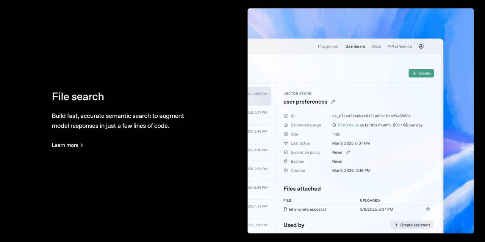

* OpenAI文档检索技术文档：https://platform.openai.com/docs/guides/retrieval

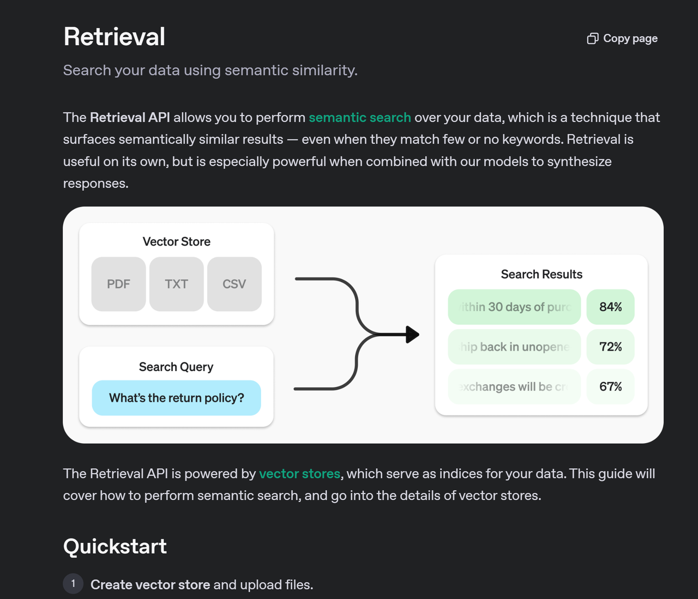

* 创建向量库

* Vector store:https://platform.openai.com/docs/api-reference/vector-stores

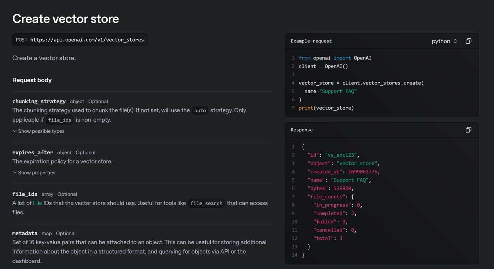

```python
vector_store = client.vector_stores.create(
  name="test-file"
)
```

```python
print(vector_store)
```

```plaintext
VectorStore(id='vs_67d41ac1c3e08191ad00db04996b631f', created_at=1741953729, file_counts=FileCounts(cancelled=0, completed=0, failed=0, in_progress=0, total=0), last_active_at=1741953729, metadata={}, name='test-file', object='vector_store', status='completed', usage_bytes=0, expires_after=None, expires_at=None)
```

```python
vector_store.id
```

```plaintext
'vs_67d41ac1c3e08191ad00db04996b631f'
```

* 上传文档

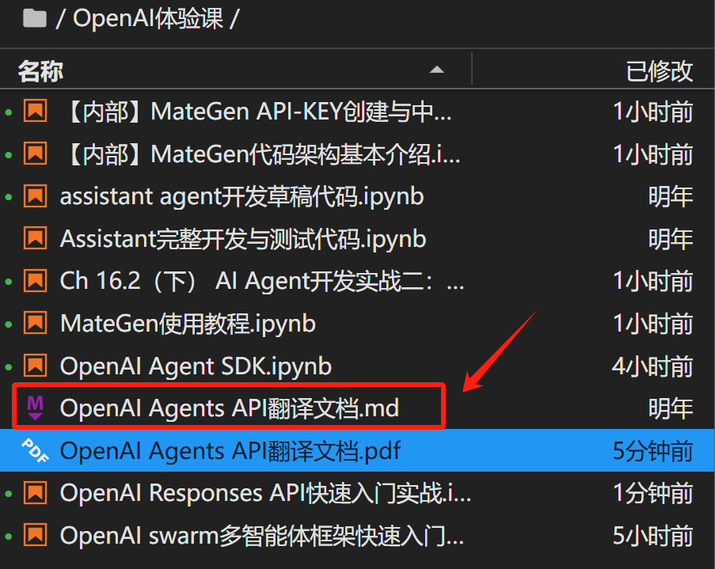

&#x20;

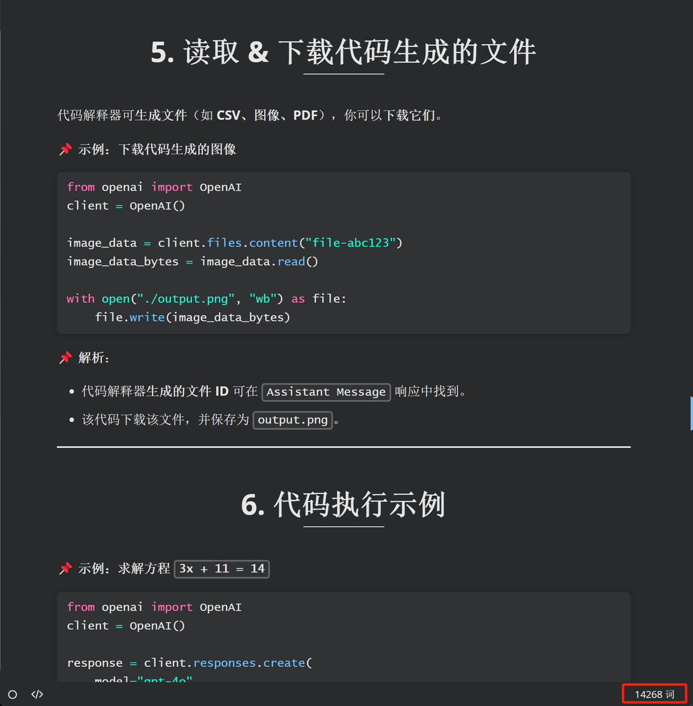

```python
# 准备上传到OpenAI的文件
file_paths = ["OpenAI Agents API翻译文档.md"]
file_streams = [open(path, "rb") for path in file_paths]
```

```python
file_streams
```

```plaintext
[<_io.BufferedReader name='OpenAI Agents API翻译文档.md'>]
```

```python
file_batch = client.vector_stores.file_batches.upload_and_poll(
  vector_store_id=vector_store.id, files=file_streams
)
```

```python
print(file_batch.status)
print(file_batch.file_counts)
```

```plaintext
completed
FileCounts(cancelled=0, completed=1, failed=0, in_progress=0, total=1)
```

* Files API：https://platform.openai.com/docs/api-reference/files

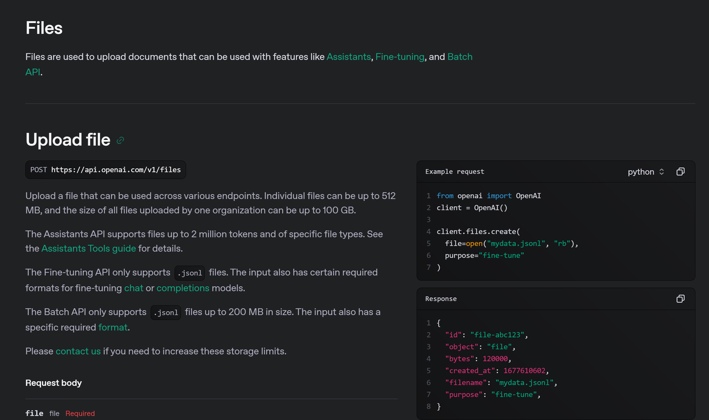

* 查看存储情况：https://platform.openai.com/storage/vector\_stores/

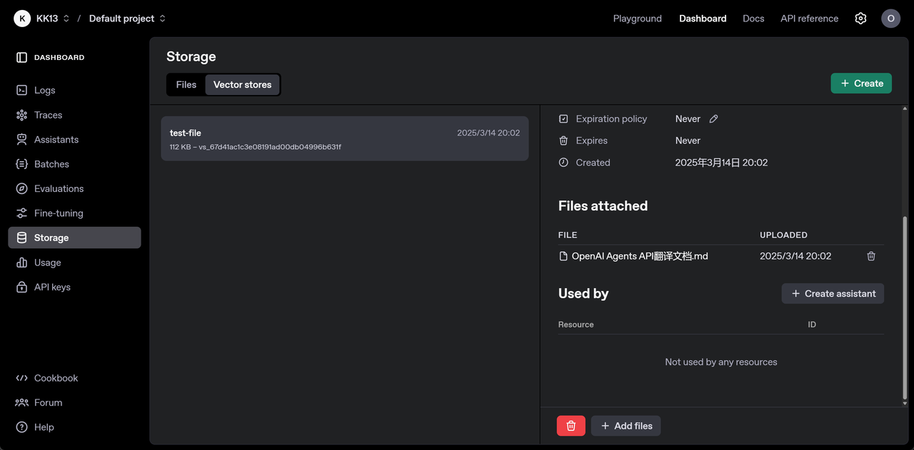

#### **1. 文件搜索功能概述**

`file_search` 工具可以让模型在**已上传的文件知识库**（vector stores）中进行**语义搜索**和**关键词搜索**，从而扩展模型的内在知识。

📌 **特点**：

* **托管工具**（由 OpenAI 负责管理，无需用户自行实现搜索逻辑）。

* **自动调用**：模型**决定**何时使用该工具进行检索。

* **向量存储支持**：通过**创建向量存储**并上传文件来增强模型的知识。

📌 **相关概念**：

* **Vector Store（向量存储）**：一个可存储**文本向量化数据**的数据库，支持**语义检索**。

* **Semantic Search（语义搜索）**：利用**向量表示**进行相似性匹配，而不仅仅是关键字匹配。

📌 **学习更多**：可参考 **OpenAI Retrieval Guide（检索指南）**。

#### **2. 使用文件搜索**

在使用文件搜索前，用户需要：

1. **创建向量存储（Vector Store）**。

2. **上传文件到向量存储**。

3. **在 API 调用中启用 `file_search`**，并**指定向量存储 ID**。

📌 **⚠️ 限制**：

* 目前 **一次搜索仅支持一个向量存储**（`vector_store_ids` 只能包含一个 ID）。

#### 3.启用文件检索

```python
response = client.responses.create(
    model="gpt-4o-mini",
    input="你知道OpenAI的responses API是什么么？",
    tools=[{
        "type": "file_search",
        "vector_store_ids": ["vs_67d41ac1c3e08191ad00db04996b631f"]  # 指定要搜索的向量存储
    }]
)
```

```python
print(response.output_text)
```

```plaintext
OpenAI的**Responses API**是一个全新的API构件，专为智能代理（Agents）设计。它结合了Chat Completions API的简洁性与Assistants API的内置工具能力，旨在让代理更智能地执行任务。其核心特性包括：

- **简洁易用**：继承了Chat Completions API的易用性。
- **增强功能**：支持内置工具，例如函数调用、Web搜索、文件搜索等。
- **适用于代理**：可用于构建智能化任务执行系统。

Responses API 将成为OpenAI代理系统的核心API，并与Agents SDK结合，以提供更灵活的任务编排能力。
```

#### **4. API 响应结构**

当 `file_search` 工具被调用后，API 响应将包含**两部分**：

1. **`file_search_call`**：存储搜索请求的 ID 和查询内容。

2. **`message`**：存储模型的回答，并包含**文件引用信息（file citations）**。

```python
response
```

```plaintext
Response(id='resp_67d41bcb763081929b3762e11f42083e02e15d1185bf3cdc', created_at=1741953995.0, error=None, incomplete_details=None, instructions=None, metadata={}, model='gpt-4o-mini-2024-07-18', object='response', output=[ResponseFileSearchToolCall(id='fs_67d41bcc43ac8192906e80c3f56ada9c02e15d1185bf3cdc', queries=['OpenAI responses API', 'What is OpenAI responses API?'], status='completed', type='file_search_call', results=None), ResponseOutputMessage(id='msg_67d41bcf1f708192b859df50473d0e4202e15d1185bf3cdc', content=[ResponseOutputText(annotations=[AnnotationFileCitation(file_id='file-EtdWSWw4NegHiSeHbDbQC8', index=297, type='file_citation', filename='OpenAI Agents API翻译文档.md')], text='OpenAI的**Responses API**是一个全新的API构件，专为智能代理（Agents）设计。它结合了Chat Completions API的简洁性与Assistants API的内置工具能力，旨在让代理更智能地执行任务。其核心特性包括：\n\n- **简洁易用**：继承了Chat Completions API的易用性。\n- **增强功能**：支持内置工具，例如函数调用、Web搜索、文件搜索等。\n- **适用于代理**：可用于构建智能化任务执行系统。\n\nResponses API 将成为OpenAI代理系统的核心API，并与Agents SDK结合，以提供更灵活的任务编排能力。', type='output_text')], role='assistant', status='completed', type='message')], parallel_tool_calls=True, temperature=1.0, tool_choice='auto', tools=[FileSearchTool(type='file_search', vector_store_ids=['vs_67d41ac1c3e08191ad00db04996b631f'], filters=None, max_num_results=20, ranking_options=RankingOptions(ranker='auto', score_threshold=0.0))], top_p=1.0, max_output_tokens=None, previous_response_id=None, reasoning=Reasoning(effort=None, generate_summary=None), status='completed', text=ResponseTextConfig(format=ResponseFormatText(type='text')), truncation='disabled', usage=ResponseUsage(input_tokens=15424, output_tokens=182, output_tokens_details=OutputTokensDetails(reasoning_tokens=0), total_tokens=15606, input_tokens_details={'cached_tokens': 0}), user=None, store=True)
```

📌 **解析**：

* **`file_search_call`**：存储搜索请求的 ID、状态和查询内容。

* `message`：

  * `output_text`：模型生成的文本。

  * **`annotations`**：提供**引用文件信息**，包括 `file_id` 和 `filename`，标明信息的来源。

让 API 响应包含搜索结果

```python
response = client.responses.create(
    model="gpt-4o-mini",
    input="你知道OpenAI的responses API是什么么？",
    tools=[{
        "type": "file_search",
        "vector_store_ids": ["vs_67d41ac1c3e08191ad00db04996b631f"]
    }],
    include=["output[*].file_search_call.search_results"]
)
```

📌 **作用**：

* `include` 参数指定要包含 `search_results`，以便直接获取搜索的原始数据。

```python
print(response)
```

````plaintext
Response(id='resp_67d41c14f44c8192b704fcd8b901c70f0773700b9648bab3', created_at=1741954068.0, error=None, incomplete_details=None, instructions=None, metadata={}, model='gpt-4o-mini-2024-07-18', object='response', output=[ResponseFileSearchToolCall(id='fs_67d41c161c54819296ada9a6b137fcaa0773700b9648bab3', queries=['OpenAI responses API'], status='completed', type='file_search_call', results=[Result(attributes={}, file_id='file-EtdWSWw4NegHiSeHbDbQC8', filename='OpenAI Agents API翻译文档.md', score=0.905541941766416, text='确保已安装 \r\n\r\n   uv：\r\n\r\n   ```bash\r\n   uv --version\r\n   ```\r\n\r\n2. 安装依赖：\r\n\r\n   ```bash\r\n   make sync\r\n   ```\r\n\r\n3. 代码检查 & 测试：\r\n\r\n   ```bash\r\n   make tests  # 运行测试\r\n   make mypy   # 运行类型检查\r\n   make lint   # 运行代码格式检查\r\n   ```\r\n\r\n------\r\n\r\n## **致谢**\r\n\r\nOpenAI 特别感谢以下开源项目：\r\n\r\n- **Pydantic**（数据验证）\r\n- **PydanticAI**（高级代理框架）\r\n- **MkDocs**（文档生成）\r\n- **Griffe**（Python 代码解析工具）\r\n- **uv 和 ruff**（Python 依赖管理 & 代码检查）\r\n\r\n📌 **OpenAI 承诺继续开源 Agents SDK**，让社区共同扩展其能力。\r\n\r\n# Part 二、**Responses API**\r\n\r\n- 地址：https://platform.openai.com/docs/guides/text?api-mode=responses\r\n\r\n**Responses API** 是 OpenAI 为智能代理（Agents）提供的**全新 API 基础构件**，它结合了 **Chat Completions API 的简洁性** 与 **Assistants API 的内置工具能力**，使得代理能够更智能地执行任务。\r\n\r\n📌 **核心特点**\r\n\r\n- ✅ **简洁易用**：继承了 Chat Completions API 的易用性。\r\n- ✅ **增强功能**：支持**内置工具（Tools）**，如函数调用（Function Calling）、Web 搜索、文件搜索、计算机控制等。\r\n- ✅ **适用于代理（Agents）**：可用于构建**智能化任务执行系统**。\r\n\r\n🔗 **未来发展**：Responses API 旨在成为 OpenAI 代理系统的**核心 API**，结合 Agents SDK，提供更灵活的任务编排能力。\r\n\r\n\r\n\r\n### **文本生成与提示词工程（Prompting）**\r\n\r\n本节介绍如何使用 OpenAI API **提示（prompt）模型** 以生成文本。你可以将其用于 **代码生成、数学表达式、结构化 JSON 数据、人类风格的文本** 等。\r\n\r\n------\r\n\r\n## **1. 生成文本**\r\n\r\n使用 OpenAI API，你可以通过一个 **简单的提示（prompt）** 让模型生成文本，类似于 ChatGPT 的工作方式。\r\n\r\n### **🌟 示例：使用 Responses API 生成文本**\r\n\r\n```python\r\nfrom openai import OpenAI\r\n\r\nclient = OpenAI()\r\n\r\nresponse = client.responses.create(\r\n    model="gpt-4o",\r\n    input="Write a one-sentence bedtime story about a unicorn."\r\n)\r\n\r\nprint(response.output_text)\r\n```\r\n\r\n**示例输出：**\r\n\r\n```\r\nUnder the soft glow of the moon, Luna the unicorn danced through fields of twinkling stardust, leaving trails of dreams for every child asleep.'), Result(attributes={}, file_id='file-EtdWSWw4NegHiSeHbDbQC8', filename='OpenAI Agents API翻译文档.md', score=0.8086527534926562, text='生成文本**\r\n\r\n使用 OpenAI API，你可以通过一个 **简单的提示（prompt）** 让模型生成文本，类似于 ChatGPT 的工作方式。\r\n\r\n### **🌟 示例：使用 Responses API 生成文本**\r\n\r\n```python\r\nfrom openai import OpenAI\r\n\r\nclient = OpenAI()\r\n\r\nresponse = client.responses.create(\r\n    model="gpt-4o",\r\n    input="Write a one-sentence bedtime story about a unicorn."\r\n)\r\n\r\nprint(response.output_text)\r\n```\r\n\r\n**示例输出：**\r\n\r\n```\r\nUnder the soft glow of the moon, Luna the unicorn danced through fields of twinkling stardust, leaving trails of dreams for every child asleep.\r\n```\r\n\r\n**📌 关键点：**\r\n\r\n- `response.output_text` 包含**模型生成的文本**。\r\n- `model="gpt-4o"` 指定使用 `GPT-4o` 模型。\r\n\r\n------\r\n\r\n## **2. 响应结构**\r\n\r\nOpenAI 的 API 响应包含**一个内容数组**（`output`），每个内容项具有以下结构：\r\n\r\n```json\r\n[\r\n    {\r\n        "id": "msg_67b73f697ba4819183a15cc17d011509",\r\n        "type": "message",\r\n        "role": "assistant",\r\n        "content": [\r\n            {\r\n                "type": "output_text",\r\n                "text": "Under the soft glow of the moon, Luna the unicorn danced through fields of twinkling stardust, leaving trails of dreams for every child asleep.",\r\n                "annotations": []\r\n            }\r\n        ]\r\n    }\r\n]\r\n```\r\n\r\n**📌 重要说明：**\r\n\r\n- `output` **可能包含多个结果**，在多轮对话或批量生成时尤其明显。\r\n- 一些 SDK 提供 `output_text` **属性**，可以**直接获取所有文本输出**，方便访问文本数据。\r\n- **除了纯文本，模型还可以返回 JSON 结构化数据**（称为 **Structured Outputs**）。\r\n\r\n------\r\n\r\n## **3. 消息角色与指令控制**\r\n\r\n你可以使用不同的方式**给模型提供指令**：\r\n\r\n1. **使用 `instructions` 参数** 提供全局行为指令，如语气、目标等。（权重最高）\r\n2. **使用 `input` 数组，指定不同角色的消息**。\r\n\r\n### **🌟 示例 1：使用 `instructions` 参数**\r\n\r\n```python\r\nfrom openai import OpenAI\r\n\r\nclient = OpenAI()\r\n\r\nresponse = client.responses.create(\r\n    model="gpt-4o",\r\n    instructions="Talk like a pirate.",\r\n    input="Are semicolons optional in JavaScript?",\r\n)\r\n\r\nprint(response.output_text)\r\n```\r\n\r\n**示例输出：**\r\n\r\n```\r\nArrr, matey! In JavaScript, semicolons be often optional, but beware, for they help avoid nasty parse errors!\r\n```\r\n\r\n📌 **在 `instructions` 中定义“说话像海盗”后，模型会以海盗风格回答。**\r\n\r\n------\r\n\r\n### **🌟 示例 2：使用 `input` 数组指定不同角色**\r\n\r\n```python\r\nfrom openai import OpenAI\r\n\r\nclient = OpenAI()\r\n\r\nresponse = client.responses.create(\r\n    model="gpt-4o",\r\n    input=[\r\n        {\r\n            "role": "developer",\r\n            "content": "Talk like a pirate."'), Result(attributes={}, file_id='file-EtdWSWw4NegHiSeHbDbQC8', filename='OpenAI Agents API翻译文档.md', score=0.7539238549164474, text='启用文件搜索**\r\n\r\n### **🌟 示例：使用 `file_search` 进行文件检索**\r\n\r\n```python\r\nfrom openai import OpenAI\r\n\r\nclient = OpenAI()\r\n\r\nresponse = client.responses.create(\r\n    model="gpt-4o-mini",\r\n    input="What is deep research by OpenAI?",\r\n    tools=[{\r\n        "type": "file_search",\r\n        "vector_store_ids": ["<vector_store_id>"]  # 指定要搜索的向量存储\r\n    }]\r\n)\r\n\r\nprint(response)\r\n```\r\n\r\n📌 **效果**：\r\n\r\n- 该查询会在**指定的 `vector_store_id` 知识库**中检索相关信息，并返回模型的回答。\r\n- **模型自动决定是否调用文件搜索**。\r\n\r\n------\r\n\r\n## **4. API 响应结构**\r\n\r\n当 `file_search` 工具被调用后，API 响应将包含**两部分**：\r\n\r\n1. **`file_search_call`**：存储搜索请求的 ID 和查询内容。\r\n2. **`message`**：存储模型的回答，并包含**文件引用信息（file citations）**。\r\n\r\n### **📌 示例输出**\r\n\r\n```json\r\n{\r\n  "output": [\r\n    {\r\n      "type": "file_search_call",\r\n      "id": "fs_67c09ccea8c48191ade9367e3ba71515",\r\n      "status": "completed",\r\n      "queries": ["What is deep research?"],\r\n      "search_results": null\r\n    },\r\n    {\r\n      "id": "msg_67c09cd3091c819185af2be5d13d87de",\r\n      "type": "message",\r\n      "role": "assistant",\r\n      "content": [\r\n        {\r\n          "type": "output_text",\r\n          "text": "Deep research is a sophisticated capability that allows for extensive inquiry and synthesis of information across various domains...",\r\n          "annotations": [\r\n            {\r\n              "type": "file_citation",\r\n              "index": 992,\r\n              "file_id": "file-2dtbBZdjtDKS8eqWxqbgDi",\r\n              "filename": "deep_research_blog.pdf"\r\n            },\r\n            {\r\n              "type": "file_citation",\r\n              "index": 1176,\r\n              "file_id": "file-2dtbBZdjtDKS8eqWxqbgDi",\r\n              "filename": "deep_research_blog.pdf"\r\n            }\r\n          ]\r\n        }\r\n      ]\r\n    }\r\n  ]\r\n}\r\n```\r\n\r\n📌 **解析**：\r\n\r\n- **`file_search_call`**：存储搜索请求的 ID、状态和查询内容。\r\n\r\n- `message`\r\n\r\n  ：\r\n\r\n  - `output_text`：模型生成的文本。\r\n  - **`annotations`**：提供**引用文件信息**，包括 `file_id` 和 `filename`，标明信息的来源。\r\n\r\n------\r\n\r\n## **5.'), Result(attributes={}, file_id='file-EtdWSWw4NegHiSeHbDbQC8', filename='OpenAI Agents API翻译文档.md', score=0.7182978067127047, text='CUA 集成流程**\r\n\r\n要在应用中集成 **计算机使用代理（CUA）**，需遵循以下步骤：\r\n\r\n### **🌟 1. 发送请求**\r\n\r\n你需要**调用 `computer-use-preview` 模型**，并**启用 `computer_use_preview` 工具**，指定：\r\n\r\n- **屏幕尺寸**（`display_width`, `display_height`）\r\n- **操作环境**（`environment`：如 `browser`、`windows`、`ubuntu`）\r\n- **目标任务**（输入 `input` 指令）\r\n\r\n📌 **示例：让 CUA 在 Bing 搜索 OpenAI 新闻**\r\n\r\n```python\r\nfrom openai import OpenAI\r\n\r\nclient = OpenAI()\r\n\r\nresponse = client.responses.create(\r\n    model="computer-use-preview",\r\n    tools=[{\r\n        "type": "computer_use_preview",\r\n        "display_width": 1024,\r\n        "display_height": 768,\r\n        "environment": "browser"  # 其他选项："mac", "windows", "ubuntu"\r\n    }],\r\n    input=[\r\n        {\r\n            "role": "user",\r\n            "content": "Check the latest OpenAI news on bing.com."\r\n        }\r\n        # 可选：包含初始界面的截图\r\n        # {\r\n        #     "type": "input_image",\r\n        #     "image_url": f"data:image/png;base64,{screenshot_base64}"\r\n        # }\r\n    ],\r\n    truncation="auto"  # 允许截断\r\n)\r\n\r\nprint(response.output)\r\n```\r\n\r\n📌 **效果**：\r\n\r\n- 该 API 请求会启动计算机代理，让它**在 Bing 上搜索 OpenAI 新闻**。\r\n- **可选**：传入界面截图（Base64 编码）以帮助模型理解当前环境。\r\n\r\n------\r\n\r\n### **🌟 2. 接收建议操作**\r\n\r\n模型的 API 响应可能包含：\r\n\r\n- **文本输出**\r\n- **计算机操作（computer_call）**\r\n- **其他工具调用**\r\n\r\n📌 **示例：模型返回点击操作**\r\n\r\n```json\r\n"output": [\r\n    {\r\n        "type": "reasoning",\r\n        "id": "rs_67cc...",\r\n        "content": []\r\n    },\r\n    {\r\n        "type": "computer_call",\r\n        "id": "cu_67cc...",\r\n        "call_id": "call_zw3...",\r\n        "action": {\r\n            "type": "click",\r\n            "button": "left",\r\n            "x": 156,\r\n            "y": 50\r\n        },\r\n        "pending_safety_checks": [],\r\n        "status": "completed"\r\n    }\r\n]\r\n```\r\n\r\n📌 **解析**：\r\n\r\n- **`computer_call`**：告诉应用程序**执行点击操作**（在 `x=156, y=50`）。\r\n- **`reasoning`**：提供推理过程（如果有）。\r\n- **`pending_safety_checks`**：如果存在安全检查，应用程序需要处理。\r\n\r\n------\r\n\r\n### **🌟 3.'), Result(attributes={}, file_id='file-EtdWSWw4NegHiSeHbDbQC8', filename='OpenAI Agents API翻译文档.md', score=0.7150123234951931, text='启用 Web 搜索**\r\n\r\n你可以在 API 请求中，将 `web_search_preview` **添加到 `tools` 数组** 以启用 Web 搜索。模型在处理请求时，可以**选择**是否使用搜索工具。\r\n\r\n### **🌟 示例：启用 Web 搜索**\r\n\r\n```python\r\nfrom openai import OpenAI\r\n\r\nclient = OpenAI()\r\n\r\nresponse = client.responses.create(\r\n    model="gpt-4o",\r\n    tools=[{"type": "web_search_preview"}],  # 启用 Web 搜索工具\r\n    input="What was a positive news story from today?"\r\n)\r\n\r\nprint(response.output_text)\r\n```\r\n\r\n📌 **效果**：\r\n\r\n- 该 API 请求会调用 `web_search_preview`，允许模型在回答前**搜索最新的新闻**。\r\n- 但**模型可以自行决定**是否使用该工具。\r\n\r\n------\r\n\r\n## **2. 强制使用 Web 搜索**\r\n\r\n如果希望**确保模型一定使用 Web 搜索**（避免它仅使用内部知识回答），可以**设置 `tool_choice` 参数**：\r\n\r\n```python\r\ntool_choice={"type": "web_search_preview"}\r\n```\r\n\r\n📌 **作用**：\r\n\r\n- 让 Web 搜索**始终**执行，而不是让模型决定是否使用搜索工具。\r\n- **提升一致性**，但可能会增加**查询时间**。\r\n\r\n------\r\n\r\n## **3. 输出格式与引用**\r\n\r\n如果模型调用了 Web 搜索，API 响应将包含**两部分**：\r\n\r\n1. **Web 搜索调用的 ID**\r\n2. **模型的回答**，并带有网页来源的**引用信息**\r\n\r\n### **📌 示例输出**\r\n\r\n```json\r\n[\r\n  {\r\n    "type": "web_search_call",\r\n    "id": "ws_67c9fa0502748190b7dd390736892e100be649c1a5ff9609",\r\n    "status": "completed"\r\n  },\r\n  {\r\n    "id": "msg_67c9fa077e288190af08fdffda2e34f20be649c1a5ff9609",\r\n    "type": "message",\r\n    "status": "completed",\r\n    "role": "assistant",\r\n    "content": [\r\n      {\r\n        "type": "output_text",\r\n        "text": "On March 6, 2025, several news...",\r\n        "annotations": [\r\n          {\r\n            "type": "url_citation",\r\n            "start_index": 2606,\r\n            "end_index": 2758,\r\n            "url": "https://...",\r\n            "title": "Title..."\r\n          }\r\n        ]\r\n      }\r\n    ]\r\n  }\r\n]\r\n```\r\n\r\n📌 **解析**：\r\n\r\n- `web_search_call`：存储搜索请求的 ID 和状态（已完成）。\r\n\r\n- ```\r\n  message\r\n  ```\r\n\r\n  ：\r\n\r\n  - `output_text`：模型生成的文本。\r\n\r\n  - ```\r\n    annotations\r\n    ```\r\n\r\n    ：\r\n\r\n    - `url_citation`：提供**引用来源**，包括 URL、标题、文本在回答中的位置。\r\n\r\n📌 **前端要求**：\r\n\r\n- 当向用户展示搜索结果时，**必须提供清晰的引用**，并确保**可点击**。\r\n\r\n------\r\n\r\n## **4.'), Result(attributes={}, file_id='file-EtdWSWw4NegHiSeHbDbQC8', filename='OpenAI Agents API翻译文档.md', score=0.7077321422955133, text='知识 & 记忆（Knowledge & Memory）**\r\n\r\n代理可以使用**外部知识**增强理解能力，并实现**长期记忆**。\r\n\r\n📌 **支持的增强方式**\r\n\r\n| **功能**                       | **作用**                             |\r\n| ------------------------------ | ------------------------------------ |\r\n| **向量存储（Vector stores）**  | 语义搜索文档，实时检索信息           |\r\n| **文件搜索（File search）**    | 在本地或云端存储的文档中查找相关内容 |\r\n| **嵌入模型（Embeddings API）** | 以向量形式存储数据，实现高效检索     |\r\n\r\n📌 **示例：代理使用向量存储**\r\n\r\n```python\r\nfrom openai import OpenAI\r\nclient = OpenAI()\r\n\r\nresponse = client.responses.create(\r\n    model="gpt-4o",\r\n    tools=[{"type": "file_search", "vector_store_ids": ["my_vector_store"]}],\r\n    input="请提供关于强化学习的文档"\r\n)\r\nprint(response.output_text)\r\n```\r\n\r\n📌 **效果**\r\n\r\n- 代理在向量存储中搜索相关文档，并返回信息。\r\n\r\n------\r\n\r\n## **6. 安全防护（Guardrails）**\r\n\r\n为了确保代理的**安全性和可靠性**，OpenAI 提供了**安全防护机制**。\r\n\r\n| **功能**                              | **作用**                                 |\r\n| ------------------------------------- | ---------------------------------------- |\r\n| **内容审核 API（Moderation API）**    | 过滤不安全内容                           |\r\n| **指令层次（Instruction hierarchy）** | 开发者定义的指令优先于用户指令，防止滥用 |\r\n| **限制模型行为**                      | 避免代理执行未授权任务                   |\r\n\r\n📌 **示例：使用 Moderation API**\r\n\r\n```python\r\nfrom openai import OpenAI\r\nclient = OpenAI()\r\n\r\nresponse = client.moderations.create(input="一个包含仇恨言论的示例文本")\r\nprint(response["results"])\r\n```\r\n\r\n📌 **效果**\r\n\r\n- API 识别出**潜在不安全内容**，防止代理生成或传播有害信息。\r\n\r\n------\r\n\r\n## **7.'), Result(attributes={}, file_id='file-EtdWSWw4NegHiSeHbDbQC8', filename='OpenAI Agents API翻译文档.md', score=0.7000629339124034, text='工具（Tools）**\r\n\r\n**工具（Tools）** 让代理能够与世界交互，例如调用函数、搜索信息、控制计算机等。\r\n\r\n| **工具**                         | **功能描述**                        |\r\n| -------------------------------- | ----------------------------------- |\r\n| **函数调用（Function calling）** | 允许代理调用开发者定义的 API 或代码 |\r\n| **Web 搜索（Web search）**       | 获取最新的 Web 信息                 |\r\n| **文件搜索（File search）**      | 在文档中执行语义搜索                |\r\n| **计算机控制（Computer use）**   | 代理理解并控制计算机或浏览器        |\r\n\r\n📌 **示例：代理使用 Web 搜索**\r\n\r\n```python\r\nfrom openai import OpenAI\r\nclient = OpenAI()\r\n\r\nresponse = client.responses.create(\r\n    model="gpt-4o",\r\n    tools=[{"type": "web_search_preview"}],\r\n    input="最新的 AI 研究进展是什么？"\r\n)\r\nprint(response.output_text)\r\n```\r\n\r\n📌 **效果**\r\n\r\n- 代理调用 Web 搜索，获取最新的 AI 研究信息。\r\n\r\n------\r\n\r\n## **5. 知识 & 记忆（Knowledge & Memory）**\r\n\r\n代理可以使用**外部知识**增强理解能力，并实现**长期记忆**。\r\n\r\n📌 **支持的增强方式**\r\n\r\n| **功能**                       | **作用**                             |\r\n| ------------------------------ | ------------------------------------ |\r\n| **向量存储（Vector stores）**  | 语义搜索文档，实时检索信息           |\r\n| **文件搜索（File search）**    | 在本地或云端存储的文档中查找相关内容 |\r\n| **嵌入模型（Embeddings API）** | 以向量形式存储数据，实现高效检索     |\r\n\r\n📌 **示例：代理使用向量存储**\r\n\r\n```python\r\nfrom openai import OpenAI\r\nclient = OpenAI()\r\n\r\nresponse = client.responses.create(\r\n    model="gpt-4o",\r\n    tools=[{"type": "file_search", "vector_store_ids": ["my_vector_store"]}],\r\n    input="请提供关于强化学习的文档"\r\n)\r\nprint(response.output_text)\r\n```\r\n\r\n📌 **效果**\r\n\r\n- 代理在向量存储中搜索相关文档，并返回信息。\r\n\r\n------\r\n\r\n## **6.'), Result(attributes={}, file_id='file-EtdWSWw4NegHiSeHbDbQC8', filename='OpenAI Agents API翻译文档.md', score=0.6792441826537851, text='消息角色与指令控制**\r\n\r\n你可以使用不同的方式**给模型提供指令**：\r\n\r\n1. **使用 `instructions` 参数** 提供全局行为指令，如语气、目标等。（权重最高）\r\n2. **使用 `input` 数组，指定不同角色的消息**。\r\n\r\n### **🌟 示例 1：使用 `instructions` 参数**\r\n\r\n```python\r\nfrom openai import OpenAI\r\n\r\nclient = OpenAI()\r\n\r\nresponse = client.responses.create(\r\n    model="gpt-4o",\r\n    instructions="Talk like a pirate.",\r\n    input="Are semicolons optional in JavaScript?",\r\n)\r\n\r\nprint(response.output_text)\r\n```\r\n\r\n**示例输出：**\r\n\r\n```\r\nArrr, matey! In JavaScript, semicolons be often optional, but beware, for they help avoid nasty parse errors!\r\n```\r\n\r\n📌 **在 `instructions` 中定义“说话像海盗”后，模型会以海盗风格回答。**\r\n\r\n------\r\n\r\n### **🌟 示例 2：使用 `input` 数组指定不同角色**\r\n\r\n```python\r\nfrom openai import OpenAI\r\n\r\nclient = OpenAI()\r\n\r\nresponse = client.responses.create(\r\n    model="gpt-4o",\r\n    input=[\r\n        {\r\n            "role": "developer",\r\n            "content": "Talk like a pirate."\r\n        },\r\n        {\r\n            "role": "user",\r\n            "content": "Are semicolons optional in JavaScript?"\r\n        }\r\n    ]\r\n)\r\n\r\nprint(response.output_text)\r\n```\r\n\r\n📌 这里，`developer` 角色类似于 **系统设定**，用户输入 `user` 角色的内容，最终 **模型按 `developer` 设定风格回答**。\r\n\r\n------\r\n\r\n## **4. 消息角色的优先级**\r\n\r\nOpenAI 规定不同角色的优先级：\r\n\r\n| **角色**    | **优先级** | **说明**                                        |\r\n| ----------- | ---------- | ----------------------------------------------- |\r\n| `developer` | **最高**   | 由开发者提供的指令，优先级最高，类似 `system`。 |\r\n| `user`      | **次高**   | 由最终用户提供的输入，次于 `developer`。        |\r\n| `assistant` | **最低**   | 由模型生成的响应。                              |\r\n\r\n**📌 多轮对话会包含不同类型的消息。管理对话状态是关键！**\r\n\r\n------\r\n\r\n## **5. 选择合适的模型**\r\n\r\n在使用 API 生成文本时，你需要**选择合适的模型**（`model` 参数）。可选模型及其特点如下：\r\n\r\n### **🧠 1. 推理（Reasoning）模型**\r\n\r\n- **特点**：内部会进行**复杂的思维链分析**，适用于**逻辑推理、分步计划**等任务。\r\n\r\n- 优缺点\r\n\r\n  ：\r\n\r\n  - ✅ **理解复杂任务、逻辑清晰**\r\n  - ❌ **速度较慢，成本更高**\r\n\r\n- **适用场景**：复杂分析、多步推理、研究类任务\r\n\r\n### **⚡ 2.'), Result(attributes={}, file_id='file-EtdWSWw4NegHiSeHbDbQC8', filename='OpenAI Agents API翻译文档.md', score=0.6597526388832154, text='代码执行与日志**\r\n\r\n### **📌 示例：列出代码执行日志**\r\n\r\n```python\r\nrun_steps = client.beta.threads.runs.steps.list(\r\n    thread_id=thread.id,\r\n    run_id=run.id\r\n)\r\n```\r\n\r\n📌 **示例 API 响应**\r\n\r\n```json\r\n{\r\n  "object": "list",\r\n  "data": [\r\n    {\r\n      "id": "step_abc123",\r\n      "object": "thread.run.step",\r\n      "type": "tool_calls",\r\n      "run_id": "run_abc123",\r\n      "thread_id": "thread_abc123",\r\n      "status": "completed",\r\n      "step_details": {\r\n        "type": "tool_calls",\r\n        "tool_calls": [\r\n          {\r\n            "type": "code",\r\n            "code": {\r\n              "input": "# 计算 2 + 2\\nresult = 2 + 2\\nresult",\r\n              "outputs": [\r\n                {\r\n                  "type": "logs",\r\n                  "logs": "4"\r\n                }\r\n              ]\r\n            }\r\n          }\r\n        ]\r\n      }\r\n    }\r\n  ]\r\n}\r\n```\r\n\r\n📌 **解析**：\r\n\r\n- `input`：助手运行的 Python 代码。\r\n- `outputs`：代码执行结果（日志）。\r\n\r\n------\r\n\r\n## **5. 读取 & 下载代码生成的文件**\r\n\r\n代码解释器可**生成文件**（如 **CSV、图像、PDF**），你可以**下载它们**。\r\n\r\n📌 **示例：下载代码生成的图像**\r\n\r\n```python\r\nfrom openai import OpenAI\r\nclient = OpenAI()\r\n\r\nimage_data = client.files.content("file-abc123")\r\nimage_data_bytes = image_data.read()\r\n\r\nwith open("./output.png", "wb") as file:\r\n    file.write(image_data_bytes)\r\n```\r\n\r\n📌 **解析**：\r\n\r\n- 代码解释器**生成的文件 ID** 可在 `Assistant Message` 响应中找到。\r\n- 该代码下载该文件，并保存为 `output.png`。\r\n\r\n------\r\n\r\n## **6. 代码执行示例**\r\n\r\n📌 **示例：求解方程 `3x + 11 = 14`**\r\n\r\n```python\r\nfrom openai import OpenAI\r\nclient = OpenAI()\r\n\r\nresponse = client.responses.create(\r\n    model="gpt-4o",\r\n    tools=[{"type": "code_interpreter"}],\r\n    input="请用 Python 计算 `3x + 11 = 14` 的解。",\r\n)\r\n\r\nprint(response.output_text)\r\n```\r\n\r\n📌 **输出**\r\n\r\n```\r\nx = 1\r\n```\r\n\r\n📌 **解析**：\r\n\r\n- 代码解释器会自动运行：\r\n\r\n  ```python\r\n  from sympy import symbols, Eq, solve\r\n  x = symbols(\'x\')\r\n  eq = Eq(3*x + 11, 14)\r\n  solve(eq, x)\r\n  ```\r\n\r\n- 返回 **x = 1**。\r\n\r\n------\r\n\r\n## **7.'), Result(attributes={}, file_id='file-EtdWSWw4NegHiSeHbDbQC8', filename='OpenAI Agents API翻译文档.md', score=0.6576166973052019, text='代码执行示例**\r\n\r\n📌 **示例：求解方程 `3x + 11 = 14`**\r\n\r\n```python\r\nfrom openai import OpenAI\r\nclient = OpenAI()\r\n\r\nresponse = client.responses.create(\r\n    model="gpt-4o",\r\n    tools=[{"type": "code_interpreter"}],\r\n    input="请用 Python 计算 `3x + 11 = 14` 的解。",\r\n)\r\n\r\nprint(response.output_text)\r\n```\r\n\r\n📌 **输出**\r\n\r\n```\r\nx = 1\r\n```\r\n\r\n📌 **解析**：\r\n\r\n- 代码解释器会自动运行：\r\n\r\n  ```python\r\n  from sympy import symbols, Eq, solve\r\n  x = symbols(\'x\')\r\n  eq = Eq(3*x + 11, 14)\r\n  solve(eq, x)\r\n  ```\r\n\r\n- 返回 **x = 1**。\r\n\r\n------\r\n\r\n## **7. 支持的文件类型**\r\n\r\n📌 **支持的文件格式**\r\n\r\n| **格式**         | **MIME 类型**                                                |\r\n| ---------------- | ------------------------------------------------------------ |\r\n| `.csv`           | `text/csv`                                                   |\r\n| `.json`          | `application/json`                                           |\r\n| `.pdf`           | `application/pdf`                                            |\r\n| `.xlsx`          | `application/vnd.openxmlformats-officedocument.spreadsheetml.sheet` |\r\n| `.png`           | `image/png`                                                  |\r\n| `.jpeg` / `.jpg` | `image/jpeg`                                                 |\r\n| `.zip`           | `application/zip`                                            |\r\n| `.tar`           | `application/x-tar`                                          |\r\n\r\n📌 **最大文件大小**：\r\n\r\n- **512 MB**\r\n\r\n------\r\n\r\n## **8. 关键特性**\r\n\r\n✅ **自动 Python 代码执行**\r\n ✅ **支持文件读取 & 生成（CSV, PDF, 图像等）**\r\n ✅ **错误自动修复 & 代码迭代优化**\r\n ✅ **代码执行日志可追踪**\r\n ✅ **多种 API 调用方式（Assistant 级 & Thread 级）**\r\n ✅ **定价合理（$0.03 / 小时）**\r\n\r\n\r\n\r\n# Part 七、**微调（Fine-tuning）**\r\n\r\n- 地址：https://platform.openai.com/docs/guides/fine-tuning\r\n\r\n\r\n\r\n**微调（Fine-tuning）** 允许你**定制模型**，使其在特定任务上表现更好，减少提示词长度，提高响应质量，并降低推理成本。\r\n\r\n------\r\n\r\n## **1.'), Result(attributes={}, file_id='file-EtdWSWw4NegHiSeHbDbQC8', filename='OpenAI Agents API翻译文档.md', score=0.6355341500287998, text='限制**\r\n\r\n使用 `file_search` 时需要注意以下限制：\r\n\r\n- **项目级别**：最多可存储 **100GB** 文件。\r\n- **向量存储**：最多支持 **10,000** 个文件。\r\n- **单个文件大小**：最大 **512MB**（约 500 万 tokens）。\r\n\r\n\r\n\r\n# Part 四、**计算机使用（Computer Use）**\r\n\r\n- 地址：https://platform.openai.com/docs/guides/tools-computer-use\r\n\r\n\r\n\r\nOpenAI 的 **计算机使用代理（Computer-Using Agent, CUA）** 允许模型**模拟**人在计算机上操作，例如点击、输入、滚动等，从而执行自动化任务。\r\n\r\n------\r\n\r\n## **1. 概述**\r\n\r\n**Computer Use（计算机使用）** 是 OpenAI 提供的一种**增强版 CUA（计算机使用代理）**，基于 **`computer-use-preview`** 模型，结合：\r\n\r\n- **GPT-4o 的视觉能力**（识别屏幕截图）\r\n- **高级推理能力**（模拟计算机界面交互）\r\n\r\n📌 **特点**：\r\n\r\n- **允许模型执行计算机操作**（如点击、输入文本、滚动页面）。\r\n- **通过截图感知界面变化**，并决定下一步操作。\r\n- **可用于网页浏览、数据输入、在线购物、表单填写等任务**。\r\n\r\n📌 **当前状态**：\r\n\r\n- **Beta 版**，可能存在漏洞或错误。\r\n- **不适用于高安全性任务**（如银行交易、个人账户管理）。\r\n- **必须符合 OpenAI 的**[使用政策](https://openai.com/usage-policy)。\r\n\r\n📌 **适用 API**：\r\n\r\n- ✅ **Responses API**\r\n- ❌ **不适用于 Chat Completions**\r\n\r\n------\r\n\r\n## **2. 工作原理**\r\n\r\n计算机使用工具的执行流程是一个**循环（loop）**：\r\n\r\n1. **发送请求**：用户提供目标任务（如“在 Bing 搜索 OpenAI 最新新闻”）。\r\n\r\n2. 接收响应\r\n\r\n   ：\r\n\r\n   - 模型可能返回**计算机操作（computer_call）**（如点击、输入）。\r\n   - 也可能返回**推理结果（reasoning）** 或**安全检查（safety_check）**。\r\n\r\n3. **执行操作**：应用代码**模拟操作**，如点击、输入文本。\r\n\r\n4. **获取更新状态**：执行操作后，截图当前界面并传回模型。\r\n\r\n5.'), Result(attributes={}, file_id='file-EtdWSWw4NegHiSeHbDbQC8', filename='OpenAI Agents API翻译文档.md', score=0.6174007146209637, text='**测试与评估（Evals）**，使用生产环境数据来测试提示词效果。\r\n5. **不断迭代**，调整提示词，优化模型输出。\r\n\r\n------\r\n\r\n## **7. 微调 vs 提示词优化**\r\n\r\n如果通过**提示词工程（Prompt Engineering）** **仍然无法获得满意的结果**，你可以考虑：\r\n\r\n- **微调（Fine-tuning）**：针对特定任务**调整权重**，提升准确性。\r\n- **蒸馏（Distillation）**：用大模型生成的数据来优化小模型的表现。\r\n\r\n**📌 一般情况下，调整提示词就能满足需求，微调适用于需要**定制化模型**的场景。\r\n\r\n\r\n\r\n# 三、Web Search（网页搜索）\r\n\r\n- 地址：https://platform.openai.com/docs/guides/tools-web-search?api-mode=responses\r\n\r\n\r\n\r\nOpenAI Agents SDK 支持**网页搜索**，允许模型在生成回答之前**查询最新的信息**，类似于 ChatGPT 的搜索功能，并提供**清晰的引用**来源。\r\n\r\n------\r\n\r\n## **1. 启用 Web 搜索**\r\n\r\n你可以在 API 请求中，将 `web_search_preview` **添加到 `tools` 数组** 以启用 Web 搜索。模型在处理请求时，可以**选择**是否使用搜索工具。\r\n\r\n### **🌟 示例：启用 Web 搜索**\r\n\r\n```python\r\nfrom openai import OpenAI\r\n\r\nclient = OpenAI()\r\n\r\nresponse = client.responses.create(\r\n    model="gpt-4o",\r\n    tools=[{"type": "web_search_preview"}],  # 启用 Web 搜索工具\r\n    input="What was a positive news story from today?"\r\n)\r\n\r\nprint(response.output_text)\r\n```\r\n\r\n📌 **效果**：\r\n\r\n- 该 API 请求会调用 `web_search_preview`，允许模型在回答前**搜索最新的新闻**。\r\n- 但**模型可以自行决定**是否使用该工具。\r\n\r\n------\r\n\r\n## **2. 强制使用 Web 搜索**\r\n\r\n如果希望**确保模型一定使用 Web 搜索**（避免它仅使用内部知识回答），可以**设置 `tool_choice` 参数**：\r\n\r\n```python\r\ntool_choice={"type": "web_search_preview"}\r\n```\r\n\r\n📌 **作用**：\r\n\r\n- 让 Web 搜索**始终**执行，而不是让模型决定是否使用搜索工具。\r\n- **提升一致性**，但可能会增加**查询时间**。\r\n\r\n------\r\n\r\n## **3. 输出格式与引用**\r\n\r\n如果模型调用了 Web 搜索，API 响应将包含**两部分**：\r\n\r\n1. **Web 搜索调用的 ID**\r\n2.'), Result(attributes={}, file_id='file-EtdWSWw4NegHiSeHbDbQC8', filename='OpenAI Agents API翻译文档.md', score=0.6163451866066268, text='代理构建的核心组件**\r\n\r\n构建智能代理涉及多个领域，OpenAI 提供了**可组合的基础构件（primitives）**，帮助你快速构建完整的代理系统。\r\n\r\n| **领域**                              | **描述**                                       | **OpenAI 提供的功能**                                   |\r\n| ------------------------------------- | ---------------------------------------------- | ------------------------------------------------------- |\r\n| **模型（Models）**                    | 核心智能体，负责推理、决策、处理多模态数据     | o1, o3-mini, GPT-4.5, GPT-4o, GPT-4o-mini               |\r\n| **工具（Tools）**                     | 代理与环境交互的接口，例如函数调用、Web 搜索等 | Function calling, Web search, File search, Computer use |\r\n| **知识 & 记忆（Knowledge & Memory）** | 使代理可以访问外部知识并持久存储信息           | Vector stores, File search, Embeddings                  |\r\n| **安全防护（Guardrails）**            | 防止不相关、有害或不良行为                     | Moderation API, Instruction hierarchy                   |\r\n| **编排（Orchestration）**             | 代理的开发、部署、监控和改进                   | Agents SDK, Tracing, Evaluations, Fine-tuning           |\r\n\r\n------\r\n\r\n## **3. 模型（Models）**\r\n\r\nOpenAI 的**大语言模型（LLMs）** 是许多智能代理系统的核心，负责**决策**、**推理** 和 **环境交互**。\r\n\r\n| **模型**         | **代理特性**                     |\r\n| ---------------- | -------------------------------- |\r\n| **o1 & o3-mini** | 适合长期规划、复杂任务和高级推理 |\r\n| **GPT-4.5**      | 最适合执行代理任务               |\r\n| **GPT-4o**       | 平衡代理能力与推理速度           |\r\n| **GPT-4o-mini**  | 低延迟代理的最佳选择             |\r\n\r\n📌 **核心能力**\r\n\r\n- **高级智能**：擅长推理和规划，适合**复杂任务**。\r\n- **工具调用**：支持**函数调用**，可与 OpenAI 内置工具集成。\r\n- **多模态理解**：能够理解**文本、图像、音频、代码、文档**。\r\n- **低延迟**：支持**实时音频对话**和更快的小型模型。\r\n\r\n🔗 **更多模型详情**，请访问 **OpenAI 模型页面**。\r\n\r\n------\r\n\r\n## **4.'), Result(attributes={}, file_id='file-EtdWSWw4NegHiSeHbDbQC8', filename='OpenAI Agents API翻译文档.md', score=0.6059749512381339, text='概述**\r\n\r\n- **执行 Python 代码**：代码解释器允许助手**编写并迭代运行 Python 代码**，直到任务完成。\r\n- **支持文件处理**：可读取 `.csv`、`.json`、`.pdf` 等多种格式的文件。\r\n- **生成文件**：可输出**图像、数据文件（如 `.csv`）、PDF** 等，并提供下载链接。\r\n- **自动修复错误**：如果代码运行失败，助手会**迭代修改代码**，直到成功执行。\r\n\r\n📌 **当前状态**：\r\n\r\n- 仍处于 **Beta 测试** 阶段。\r\n- 预计在 **2026 年上半年** 完成全面迁移至 `Responses API`，并废弃 `Assistants API` 旧版。\r\n\r\n📌 **定价**：\r\n\r\n- **$0.03 / 会话**（每个会话默认持续 **1 小时**）。\r\n- **同一线程内**的多个用户调用**共享会话**，降低成本。\r\n\r\n------\r\n\r\n## **2. 启用代码解释器**\r\n\r\n要使用 `Code Interpreter`，需**在 `tools` 参数中启用**：\r\n\r\n📌 **示例：创建助手**\r\n\r\n```python\r\nfrom openai import OpenAI\r\nclient = OpenAI()\r\n\r\nassistant = client.beta.assistants.create(\r\n    instructions="你是一个数学导师。请使用 Python 代码计算答案。",\r\n    model="gpt-4o",\r\n    tools=[{"type": "code_interpreter"}]\r\n)\r\n```\r\n\r\n📌 **效果**：\r\n\r\n- 该助手在遇到数学问题时，会**自动决定**是否运行 Python 代码进行计算。\r\n\r\n------\r\n\r\n## **3. 传递文件给代码解释器**\r\n\r\n代码解释器可以**读取文件**，进行**数据处理和分析**。支持：\r\n\r\n- **全局文件（Assistant 级）** → 所有对话共享。\r\n- **局部文件（Thread 级）** → 仅当前对话可用。\r\n\r\n------\r\n\r\n### **🌟 示例 1：全局文件（Assistant 级）**\r\n\r\n📌 **步骤**：\r\n\r\n1. **上传文件**\r\n2. **创建助手并绑定文件**\r\n\r\n```python\r\nfile = client.files.create(\r\n    file=open("mydata.csv", "rb"),\r\n    purpose=\'assistants\'  # 用于 Assistant\r\n)\r\n\r\nassistant = client.beta.assistants.create(\r\n    instructions="你是一个数据分析师。",\r\n    model="gpt-4o",\r\n    tools=[{"type": "code_interpreter"}],\r\n    tool_resources={\r\n        "code_interpreter": {\r\n            "file_ids": [file.id]\r\n        }\r\n    }\r\n)\r\n```\r\n\r\n📌 **效果**：\r\n\r\n- 该助手的所有任务**都可以访问 `mydata.csv`**。\r\n\r\n------\r\n\r\n### **🌟 示例 2：局部文件（Thread 级）**\r\n\r\n📌 **步骤**：\r\n\r\n1. **上传文件**\r\n2.'), Result(attributes={}, file_id='file-EtdWSWw4NegHiSeHbDbQC8', filename='OpenAI Agents API翻译文档.md', score=0.5008517595467237, text='",\r\n    tools=[{\r\n        "type": "file_search",\r\n        "vector_store_ids": ["<vector_store_id>"],\r\n        "max_num_results": 2  # 限制搜索返回的文件数量\r\n    }]\r\n)\r\nprint(response)\r\n```\r\n\r\n------\r\n\r\n### **🌟 包含搜索结果**\r\n\r\n默认情况下，搜索结果**不会直接包含**在 API 响应中，仅返回**引用信息**（annotations）。\r\n\r\n📌 **示例：让 API 响应包含搜索结果**\r\n\r\n```python\r\nresponse = client.responses.create(\r\n    model="gpt-4o-mini",\r\n    input="What is deep research by OpenAI?",\r\n    tools=[{\r\n        "type": "file_search",\r\n        "vector_store_ids": ["<vector_store_id>"]\r\n    }],\r\n    include=["output[*].file_search_call.search_results"]\r\n)\r\nprint(response)\r\n```\r\n\r\n📌 **作用**：\r\n\r\n- `include` 参数指定要包含 `search_results`，以便直接获取搜索的原始数据。\r\n\r\n------\r\n\r\n### **🌟 过滤文件元数据**\r\n\r\n如果知识库中包含不同类型的文件（博客、论文、代码等），可以**按文件类型筛选**搜索结果。\r\n\r\n📌 **示例：只搜索博客文章**\r\n\r\n```python\r\nresponse = client.responses.create(\r\n    model="gpt-4o-mini",\r\n    input="What is deep research by OpenAI?",\r\n    tools=[{\r\n        "type": "file_search",\r\n        "vector_store_ids": ["<vector_store_id>"],\r\n        "filters": {\r\n            "type": "eq",   # 等于\r\n            "key": "type",  # 过滤字段\r\n            "value": "blog" # 只搜索博客\r\n        }\r\n    }]\r\n)\r\nprint(response)\r\n```\r\n\r\n📌 **作用**：\r\n\r\n- 该查询**仅搜索标记为“博客”类型**的文件，过滤掉其他文件（如论文、代码等）。\r\n\r\n------\r\n\r\n## **6. 支持的文件格式**\r\n\r\n📌 **文件格式支持**：\r\n\r\n- **文本文件**（`.txt`, `.md`, `.html`）\r\n- **代码文件**（`.py`, `.js`, `.java`, `.cpp`）\r\n- **文档**（`.pdf`, `.docx`, `.pptx`）\r\n- **JSON / XML 数据**（`.json`）\r\n\r\n| **文件格式** | **MIME 类型**                                                |\r\n| ------------ | ------------------------------------------------------------ |\r\n| `.pdf`       | `application/pdf`                                            |\r\n| `.docx`      | `application/vnd.openxmlformats-officedocument.wordprocessingml.document` |\r\n| `.json`      | `application/json`                                           |\r\n| `.py`        | `text/x-python`                                              |\r\n| `.txt`       | `text/plain`                                                 |\r\n\r\n📌 **字符编码**：文件必须使用 `utf-8`、`utf-16` 或 `ascii` 编码。\r\n\r\n------\r\n\r\n## **7.'), Result(attributes={}, file_id='file-EtdWSWw4NegHiSeHbDbQC8', filename='OpenAI Agents API翻译文档.md', score=0.4859471297526572, text='模型（Models）**\r\n\r\nOpenAI 的**大语言模型（LLMs）** 是许多智能代理系统的核心，负责**决策**、**推理** 和 **环境交互**。\r\n\r\n| **模型**         | **代理特性**                     |\r\n| ---------------- | -------------------------------- |\r\n| **o1 & o3-mini** | 适合长期规划、复杂任务和高级推理 |\r\n| **GPT-4.5**      | 最适合执行代理任务               |\r\n| **GPT-4o**       | 平衡代理能力与推理速度           |\r\n| **GPT-4o-mini**  | 低延迟代理的最佳选择             |\r\n\r\n📌 **核心能力**\r\n\r\n- **高级智能**：擅长推理和规划，适合**复杂任务**。\r\n- **工具调用**：支持**函数调用**，可与 OpenAI 内置工具集成。\r\n- **多模态理解**：能够理解**文本、图像、音频、代码、文档**。\r\n- **低延迟**：支持**实时音频对话**和更快的小型模型。\r\n\r\n🔗 **更多模型详情**，请访问 **OpenAI 模型页面**。\r\n\r\n------\r\n\r\n## **4. 工具（Tools）**\r\n\r\n**工具（Tools）** 让代理能够与世界交互，例如调用函数、搜索信息、控制计算机等。\r\n\r\n| **工具**                         | **功能描述**                        |\r\n| -------------------------------- | ----------------------------------- |\r\n| **函数调用（Function calling）** | 允许代理调用开发者定义的 API 或代码 |\r\n| **Web 搜索（Web search）**       | 获取最新的 Web 信息                 |\r\n| **文件搜索（File search）**      | 在文档中执行语义搜索                |\r\n| **计算机控制（Computer use）**   | 代理理解并控制计算机或浏览器        |\r\n\r\n📌 **示例：代理使用 Web 搜索**\r\n\r\n```python\r\nfrom openai import OpenAI\r\nclient = OpenAI()\r\n\r\nresponse = client.responses.create(\r\n    model="gpt-4o",\r\n    tools=[{"type": "web_search_preview"}],\r\n    input="最新的 AI 研究进展是什么？"\r\n)\r\nprint(response.output_text)\r\n```\r\n\r\n📌 **效果**\r\n\r\n- 代理调用 Web 搜索，获取最新的 AI 研究信息。\r\n\r\n------\r\n\r\n## **5.'), Result(attributes={}, file_id='file-EtdWSWw4NegHiSeHbDbQC8', filename='OpenAI Agents API翻译文档.md', score=0.48469794412072514, text='**模型的回答**，并带有网页来源的**引用信息**\r\n\r\n### **📌 示例输出**\r\n\r\n```json\r\n[\r\n  {\r\n    "type": "web_search_call",\r\n    "id": "ws_67c9fa0502748190b7dd390736892e100be649c1a5ff9609",\r\n    "status": "completed"\r\n  },\r\n  {\r\n    "id": "msg_67c9fa077e288190af08fdffda2e34f20be649c1a5ff9609",\r\n    "type": "message",\r\n    "status": "completed",\r\n    "role": "assistant",\r\n    "content": [\r\n      {\r\n        "type": "output_text",\r\n        "text": "On March 6, 2025, several news...",\r\n        "annotations": [\r\n          {\r\n            "type": "url_citation",\r\n            "start_index": 2606,\r\n            "end_index": 2758,\r\n            "url": "https://...",\r\n            "title": "Title..."\r\n          }\r\n        ]\r\n      }\r\n    ]\r\n  }\r\n]\r\n```\r\n\r\n📌 **解析**：\r\n\r\n- `web_search_call`：存储搜索请求的 ID 和状态（已完成）。\r\n\r\n- ```\r\n  message\r\n  ```\r\n\r\n  ：\r\n\r\n  - `output_text`：模型生成的文本。\r\n\r\n  - ```\r\n    annotations\r\n    ```\r\n\r\n    ：\r\n\r\n    - `url_citation`：提供**引用来源**，包括 URL、标题、文本在回答中的位置。\r\n\r\n📌 **前端要求**：\r\n\r\n- 当向用户展示搜索结果时，**必须提供清晰的引用**，并确保**可点击**。\r\n\r\n------\r\n\r\n## **4. 定制用户位置**\r\n\r\nWeb 搜索**可以根据用户的位置**优化搜索结果。你可以指定：\r\n\r\n- `country`（国家）：**两字母 ISO 代码**，如 `"US"`（美国）、`"GB"`（英国）。\r\n- `city`（城市）：如 `"London"`（伦敦）。\r\n- `region`（地区）：如 `"California"`（加州）。\r\n- `timezone`（时区）：如 `"America/Chicago"`（芝加哥时间）。\r\n\r\n### **🌟 示例：指定搜索位置**\r\n\r\n```python\r\nfrom openai import OpenAI\r\n\r\nclient = OpenAI()\r\n\r\nresponse = client.responses.create(\r\n    model="gpt-4o",\r\n    tools=[{\r\n        "type": "web_search_preview",\r\n        "user_location": {\r\n            "type": "approximate",\r\n            "country": "GB",\r\n            "city": "London",\r\n            "region": "London",\r\n        }\r\n    }],\r\n    input="What are the best restaurants around Granary Square?",\r\n)\r\n\r\nprint(response.output_text)\r\n```\r\n\r\n📌 **效果**：\r\n\r\n- 该查询会返回**伦敦 Granary Square 附近的最佳餐厅**。\r\n\r\n------\r\n\r\n## **5.'), Result(attributes={}, file_id='file-EtdWSWw4NegHiSeHbDbQC8', filename='OpenAI Agents API翻译文档.md', score=0.47657253080109485, text='"],\r\n      "search_results": null\r\n    },\r\n    {\r\n      "id": "msg_67c09cd3091c819185af2be5d13d87de",\r\n      "type": "message",\r\n      "role": "assistant",\r\n      "content": [\r\n        {\r\n          "type": "output_text",\r\n          "text": "Deep research is a sophisticated capability that allows for extensive inquiry and synthesis of information across various domains...",\r\n          "annotations": [\r\n            {\r\n              "type": "file_citation",\r\n              "index": 992,\r\n              "file_id": "file-2dtbBZdjtDKS8eqWxqbgDi",\r\n              "filename": "deep_research_blog.pdf"\r\n            },\r\n            {\r\n              "type": "file_citation",\r\n              "index": 1176,\r\n              "file_id": "file-2dtbBZdjtDKS8eqWxqbgDi",\r\n              "filename": "deep_research_blog.pdf"\r\n            }\r\n          ]\r\n        }\r\n      ]\r\n    }\r\n  ]\r\n}\r\n```\r\n\r\n📌 **解析**：\r\n\r\n- **`file_search_call`**：存储搜索请求的 ID、状态和查询内容。\r\n\r\n- `message`\r\n\r\n  ：\r\n\r\n  - `output_text`：模型生成的文本。\r\n  - **`annotations`**：提供**引用文件信息**，包括 `file_id` 和 `filename`，标明信息的来源。\r\n\r\n------\r\n\r\n## **5. 检索结果定制**\r\n\r\n你可以自定义搜索行为，以优化**结果质量、成本和响应速度**。\r\n\r\n### **🌟 限制搜索结果数量**\r\n\r\n**减少搜索结果数量**可以：\r\n\r\n- **降低 token 使用量**\r\n- **提高查询速度**\r\n- **但可能影响答案质量**\r\n\r\n📌 **示例：限制搜索结果为 2 条**\r\n\r\n```python\r\nresponse = client.responses.create(\r\n    model="gpt-4o-mini",\r\n    input="What is deep research by OpenAI?",\r\n    tools=[{\r\n        "type": "file_search",\r\n        "vector_store_ids": ["<vector_store_id>"],\r\n        "max_num_results": 2  # 限制搜索返回的文件数量\r\n    }]\r\n)\r\nprint(response)\r\n```\r\n\r\n------\r\n\r\n### **🌟 包含搜索结果**\r\n\r\n默认情况下，搜索结果**不会直接包含**在 API 响应中，仅返回**引用信息**（annotations）。\r\n\r\n📌 **示例：让 API 响应包含搜索结果**\r\n\r\n```python\r\nresponse = client.responses.create(\r\n    model="gpt-4o-mini",\r\n    input="What is deep research by OpenAI?",\r\n    tools=[{\r\n        "type": "file_search",\r\n        "vector_store_ids": ["<vector_store_id>"]\r\n    }],\r\n    include=["output[*].file_search_call.search_results"]\r\n)\r\nprint(response)\r\n```\r\n\r\n📌 **作用**：\r\n\r\n- `include` 参数指定要包含 `search_results`，以便直接获取搜索的原始数据。\r\n\r\n------\r\n\r\n### **🌟 过滤文件元数据**\r\n\r\n如果知识库中包含不同类型的文件（博客、论文、代码等），可以**按文件类型筛选**搜索结果。\r\n\r\n📌 **示例：只搜索博客文章**\r\n\r\n```python\r\nresponse = client.responses.create(\r\n    model="gpt-4o-mini",\r\n    input="What is deep research by OpenAI?'), Result(attributes={}, file_id='file-EtdWSWw4NegHiSeHbDbQC8', filename='OpenAI Agents API翻译文档.md', score=0.46434870032881204, text='安全防护（Guardrails）**\r\n\r\n为了确保代理的**安全性和可靠性**，OpenAI 提供了**安全防护机制**。\r\n\r\n| **功能**                              | **作用**                                 |\r\n| ------------------------------------- | ---------------------------------------- |\r\n| **内容审核 API（Moderation API）**    | 过滤不安全内容                           |\r\n| **指令层次（Instruction hierarchy）** | 开发者定义的指令优先于用户指令，防止滥用 |\r\n| **限制模型行为**                      | 避免代理执行未授权任务                   |\r\n\r\n📌 **示例：使用 Moderation API**\r\n\r\n```python\r\nfrom openai import OpenAI\r\nclient = OpenAI()\r\n\r\nresponse = client.moderations.create(input="一个包含仇恨言论的示例文本")\r\nprint(response["results"])\r\n```\r\n\r\n📌 **效果**\r\n\r\n- API 识别出**潜在不安全内容**，防止代理生成或传播有害信息。\r\n\r\n------\r\n\r\n## **7. 编排（Orchestration）**\r\n\r\n代理的构建过程包括 **开发、部署、监控、评估和优化**。\r\n\r\n| **阶段**        | **描述**                                 | **OpenAI 提供的工具** |\r\n| --------------- | ---------------------------------------- | --------------------- |\r\n| **构建 & 部署** | 使用 Agents SDK 设计、构建、执行代理任务 | **Agents SDK**        |\r\n| **监控**        | 观察代理行为、调试错误                   | **Tracing**           |\r\n| **评估 & 优化** | 测试代理性能，提升任务执行效果           | **Evaluations**       |\r\n| **微调**        | 让代理适应特定任务，提高准确性           | **Fine-tuning**       |\r\n\r\n📌 **示例：使用 Agents SDK 部署代理**\r\n\r\n```python\r\nfrom agents import Agent, Runner\r\n\r\nagent = Agent(name="AI 助手", instructions="你是一个帮助用户完成任务的智能代理")\r\n\r\nresult = Runner.run_sync(agent, "请帮我安排今天的会议")\r\nprint(result.final_output)\r\n```\r\n\r\n📌 **效果**\r\n\r\n- 代理执行**任务规划**，并输出适当的安排。'), Result(attributes={}, file_id='file-EtdWSWw4NegHiSeHbDbQC8', filename='OpenAI Agents API翻译文档.md', score=0.4615801595216967, text='}\r\n  ]\r\n}\r\n```\r\n\r\n📌 **重要说明**\r\n\r\n- **仅支持单轮对话**（one-turn conversations）。\r\n- **优选答案和次选答案必须是最后一条 `assistant` 消息**。\r\n\r\n------\r\n\r\n### **🌟 配置 DPO 训练任务**\r\n\r\n```python\r\nfrom openai import OpenAI\r\nclient = OpenAI()\r\n\r\njob = client.fine_tuning.jobs.create(\r\n    training_file="file-all-about-the-weather",\r\n    model="gpt-4o-2024-08-06",\r\n    method={\r\n        "type": "dpo",\r\n        "dpo": {\r\n            "hyperparameters": {"beta": 0.1},\r\n        },\r\n    },\r\n)\r\n```\r\n\r\n📌 **参数说明**\r\n\r\n- ```\r\n  beta\r\n  ```\r\n\r\n   控制 DPO 对新偏好的适应度：\r\n\r\n  - **低值（<0.5）** → 更倾向于学习新偏好。\r\n  - **高值（>1.5）** → 更保守，倾向于保持原有行为。\r\n  - **默认 `auto`** → 由 OpenAI 自动调整。\r\n\r\n------\r\n\r\n## **3. Weights & Biases（W&B）集成**\r\n\r\n你可以使用 **Weights & Biases（W&B）** 追踪微调过程中的**超参数、损失变化和性能指标**。\r\n\r\n📌 **W&B 集成的作用**\r\n\r\n- **自动记录超参数、训练损失、验证损失等信息**。\r\n- **提供可视化界面**，帮助你分析微调效果。\r\n- **支持多个微调任务的对比分析**。\r\n\r\n------\r\n\r\n### **🌟 配置 W&B 集成**\r\n\r\n在创建微调任务时，添加 `wandb` 集成：\r\n\r\n```bash\r\ncurl -X POST \\\r\n    -H "Content-Type: application/json" \\\r\n    -H "Authorization: Bearer $OPENAI_API_KEY" \\\r\n    -d \'{\r\n    "model": "gpt-4o-mini-2024-07-18",\r\n    "training_file": "file-ABC123",\r\n    "validation_file": "file-DEF456",\r\n    "integrations": [\r\n        {\r\n            "type": "wandb",\r\n            "wandb": {\r\n                "project": "custom-wandb-project",\r\n                "tags": ["project:tag", "lineage"]\r\n            }\r\n        }\r\n    ]\r\n}\' https://api.openai.com/v1/fine_tuning/jobs\r\n```\r\n\r\n📌 **参数说明**\r\n\r\n- `"project"`: 在 W&B 上创建的项目名称。\r\n- `"tags"`: 添加自定义标签，方便搜索任务。\r\n\r\n------\r\n\r\n### **🌟 访问 W&B 记录**\r\n\r\n创建微调任务后，你可以在 **Weights & Biases** 的仪表盘中查看微调记录：\r\n\r\n```text\r\nhttps://wandb.ai/<WANDB-ENTITY>/<WANDB-PROJECT>/runs/ftjob-ABCDEF\r\n```\r\n\r\n📌 **W&B 提供的可视化数据**\r\n\r\n- **训练损失 & 验证损失**\r\n- **训练 token 准确率**\r\n- **微调超参数（epochs, learning_rate, batch_size）**\r\n\r\n------\r\n\r\n## **4.')]), ResponseOutputMessage(id='msg_67d41c18b6848192bb1dd80cf15962990773700b9648bab3', content=[ResponseOutputText(annotations=[AnnotationFileCitation(file_id='file-EtdWSWw4NegHiSeHbDbQC8', index=290, type='file_citation', filename='OpenAI Agents API翻译文档.md'), AnnotationFileCitation(file_id='file-EtdWSWw4NegHiSeHbDbQC8', index=530, type='file_citation', filename='OpenAI Agents API翻译文档.md'), AnnotationFileCitation(file_id='file-EtdWSWw4NegHiSeHbDbQC8', index=558, type='file_citation', filename='OpenAI Agents API翻译文档.md')], text='OpenAI的 **Responses API** 是特别为智能代理（Agents）设计的一种新型API基础构件。它结合了 **Chat Completions API** 的简便性与 **Assistants API** 的内置工具能力，使得代理能够更高效且智能地执行任务。以下是一些核心特点：\n\n1. **简洁易用**：继承了 Chat Completions API 的易用性，易于开发者使用。\n2. **增强功能**：支持内置工具，如函数调用、Web搜索、文件搜索等，这些工具使代理能够处理更多高级任务。\n3. **适用于代理系统**：能够用于构建更复杂的智能任务执行系统。\n\n使用示例：\n```python\nfrom openai import OpenAI\n\nclient = OpenAI()\n\nresponse = client.responses.create(\n    model="gpt-4o",\n    input="Write a one-sentence bedtime story about a unicorn."\n)\n\nprint(response.output_text)\n```\n输出将是由模型生成的关于独角兽的睡前故事。\n\n如需了解更多信息，可以访问 OpenAI 官方文档。', type='output_text')], role='assistant', status='completed', type='message')], parallel_tool_calls=True, temperature=1.0, tool_choice='auto', tools=[FileSearchTool(type='file_search', vector_store_ids=['vs_67d41ac1c3e08191ad00db04996b631f'], filters=None, max_num_results=20, ranking_options=RankingOptions(ranker='auto', score_threshold=0.0))], top_p=1.0, max_output_tokens=None, previous_response_id=None, reasoning=Reasoning(effort=None, generate_summary=None), status='completed', text=ResponseTextConfig(format=ResponseFormatText(type='text')), truncation='disabled', usage=ResponseUsage(input_tokens=15160, output_tokens=275, output_tokens_details=OutputTokensDetails(reasoning_tokens=0), total_tokens=15435, input_tokens_details={'cached_tokens': 0}), user=None, store=True)
````

```python
response.output_text
```

````plaintext
'OpenAI的 **Responses API** 是特别为智能代理（Agents）设计的一种新型API基础构件。它结合了 **Chat Completions API** 的简便性与 **Assistants API** 的内置工具能力，使得代理能够更高效且智能地执行任务。以下是一些核心特点：\n\n1. **简洁易用**：继承了 Chat Completions API 的易用性，易于开发者使用。\n2. **增强功能**：支持内置工具，如函数调用、Web搜索、文件搜索等，这些工具使代理能够处理更多高级任务。\n3. **适用于代理系统**：能够用于构建更复杂的智能任务执行系统。\n\n使用示例：\n```python\nfrom openai import OpenAI\n\nclient = OpenAI()\n\nresponse = client.responses.create(\n    model="gpt-4o",\n    input="Write a one-sentence bedtime story about a unicorn."\n)\n\nprint(response.output_text)\n```\n输出将是由模型生成的关于独角兽的睡前故事。\n\n如需了解更多信息，可以访问 OpenAI 官方文档。'
````

此时检索到的20个文档片段如下：

```python
response.output[0].results
```

````plaintext
[Result(attributes={}, file_id='file-EtdWSWw4NegHiSeHbDbQC8', filename='OpenAI Agents API翻译文档.md', score=0.905541941766416, text='确保已安装 \r\n\r\n   uv：\r\n\r\n   ```bash\r\n   uv --version\r\n   ```\r\n\r\n2. 安装依赖：\r\n\r\n   ```bash\r\n   make sync\r\n   ```\r\n\r\n3. 代码检查 & 测试：\r\n\r\n   ```bash\r\n   make tests  # 运行测试\r\n   make mypy   # 运行类型检查\r\n   make lint   # 运行代码格式检查\r\n   ```\r\n\r\n------\r\n\r\n## **致谢**\r\n\r\nOpenAI 特别感谢以下开源项目：\r\n\r\n- **Pydantic**（数据验证）\r\n- **PydanticAI**（高级代理框架）\r\n- **MkDocs**（文档生成）\r\n- **Griffe**（Python 代码解析工具）\r\n- **uv 和 ruff**（Python 依赖管理 & 代码检查）\r\n\r\n📌 **OpenAI 承诺继续开源 Agents SDK**，让社区共同扩展其能力。\r\n\r\n# Part 二、**Responses API**\r\n\r\n- 地址：https://platform.openai.com/docs/guides/text?api-mode=responses\r\n\r\n**Responses API** 是 OpenAI 为智能代理（Agents）提供的**全新 API 基础构件**，它结合了 **Chat Completions API 的简洁性** 与 **Assistants API 的内置工具能力**，使得代理能够更智能地执行任务。\r\n\r\n📌 **核心特点**\r\n\r\n- ✅ **简洁易用**：继承了 Chat Completions API 的易用性。\r\n- ✅ **增强功能**：支持**内置工具（Tools）**，如函数调用（Function Calling）、Web 搜索、文件搜索、计算机控制等。\r\n- ✅ **适用于代理（Agents）**：可用于构建**智能化任务执行系统**。\r\n\r\n🔗 **未来发展**：Responses API 旨在成为 OpenAI 代理系统的**核心 API**，结合 Agents SDK，提供更灵活的任务编排能力。\r\n\r\n\r\n\r\n### **文本生成与提示词工程（Prompting）**\r\n\r\n本节介绍如何使用 OpenAI API **提示（prompt）模型** 以生成文本。你可以将其用于 **代码生成、数学表达式、结构化 JSON 数据、人类风格的文本** 等。\r\n\r\n------\r\n\r\n## **1. 生成文本**\r\n\r\n使用 OpenAI API，你可以通过一个 **简单的提示（prompt）** 让模型生成文本，类似于 ChatGPT 的工作方式。\r\n\r\n### **🌟 示例：使用 Responses API 生成文本**\r\n\r\n```python\r\nfrom openai import OpenAI\r\n\r\nclient = OpenAI()\r\n\r\nresponse = client.responses.create(\r\n    model="gpt-4o",\r\n    input="Write a one-sentence bedtime story about a unicorn."\r\n)\r\n\r\nprint(response.output_text)\r\n```\r\n\r\n**示例输出：**\r\n\r\n```\r\nUnder the soft glow of the moon, Luna the unicorn danced through fields of twinkling stardust, leaving trails of dreams for every child asleep.'),
 Result(attributes={}, file_id='file-EtdWSWw4NegHiSeHbDbQC8', filename='OpenAI Agents API翻译文档.md', score=0.8086527534926562, text='生成文本**\r\n\r\n使用 OpenAI API，你可以通过一个 **简单的提示（prompt）** 让模型生成文本，类似于 ChatGPT 的工作方式。\r\n\r\n### **🌟 示例：使用 Responses API 生成文本**\r\n\r\n```python\r\nfrom openai import OpenAI\r\n\r\nclient = OpenAI()\r\n\r\nresponse = client.responses.create(\r\n    model="gpt-4o",\r\n    input="Write a one-sentence bedtime story about a unicorn."\r\n)\r\n\r\nprint(response.output_text)\r\n```\r\n\r\n**示例输出：**\r\n\r\n```\r\nUnder the soft glow of the moon, Luna the unicorn danced through fields of twinkling stardust, leaving trails of dreams for every child asleep.\r\n```\r\n\r\n**📌 关键点：**\r\n\r\n- `response.output_text` 包含**模型生成的文本**。\r\n- `model="gpt-4o"` 指定使用 `GPT-4o` 模型。\r\n\r\n------\r\n\r\n## **2. 响应结构**\r\n\r\nOpenAI 的 API 响应包含**一个内容数组**（`output`），每个内容项具有以下结构：\r\n\r\n```json\r\n[\r\n    {\r\n        "id": "msg_67b73f697ba4819183a15cc17d011509",\r\n        "type": "message",\r\n        "role": "assistant",\r\n        "content": [\r\n            {\r\n                "type": "output_text",\r\n                "text": "Under the soft glow of the moon, Luna the unicorn danced through fields of twinkling stardust, leaving trails of dreams for every child asleep.",\r\n                "annotations": []\r\n            }\r\n        ]\r\n    }\r\n]\r\n```\r\n\r\n**📌 重要说明：**\r\n\r\n- `output` **可能包含多个结果**，在多轮对话或批量生成时尤其明显。\r\n- 一些 SDK 提供 `output_text` **属性**，可以**直接获取所有文本输出**，方便访问文本数据。\r\n- **除了纯文本，模型还可以返回 JSON 结构化数据**（称为 **Structured Outputs**）。\r\n\r\n------\r\n\r\n## **3. 消息角色与指令控制**\r\n\r\n你可以使用不同的方式**给模型提供指令**：\r\n\r\n1. **使用 `instructions` 参数** 提供全局行为指令，如语气、目标等。（权重最高）\r\n2. **使用 `input` 数组，指定不同角色的消息**。\r\n\r\n### **🌟 示例 1：使用 `instructions` 参数**\r\n\r\n```python\r\nfrom openai import OpenAI\r\n\r\nclient = OpenAI()\r\n\r\nresponse = client.responses.create(\r\n    model="gpt-4o",\r\n    instructions="Talk like a pirate.",\r\n    input="Are semicolons optional in JavaScript?",\r\n)\r\n\r\nprint(response.output_text)\r\n```\r\n\r\n**示例输出：**\r\n\r\n```\r\nArrr, matey! In JavaScript, semicolons be often optional, but beware, for they help avoid nasty parse errors!\r\n```\r\n\r\n📌 **在 `instructions` 中定义“说话像海盗”后，模型会以海盗风格回答。**\r\n\r\n------\r\n\r\n### **🌟 示例 2：使用 `input` 数组指定不同角色**\r\n\r\n```python\r\nfrom openai import OpenAI\r\n\r\nclient = OpenAI()\r\n\r\nresponse = client.responses.create(\r\n    model="gpt-4o",\r\n    input=[\r\n        {\r\n            "role": "developer",\r\n            "content": "Talk like a pirate."'),
 Result(attributes={}, file_id='file-EtdWSWw4NegHiSeHbDbQC8', filename='OpenAI Agents API翻译文档.md', score=0.7539238549164474, text='启用文件搜索**\r\n\r\n### **🌟 示例：使用 `file_search` 进行文件检索**\r\n\r\n```python\r\nfrom openai import OpenAI\r\n\r\nclient = OpenAI()\r\n\r\nresponse = client.responses.create(\r\n    model="gpt-4o-mini",\r\n    input="What is deep research by OpenAI?",\r\n    tools=[{\r\n        "type": "file_search",\r\n        "vector_store_ids": ["<vector_store_id>"]  # 指定要搜索的向量存储\r\n    }]\r\n)\r\n\r\nprint(response)\r\n```\r\n\r\n📌 **效果**：\r\n\r\n- 该查询会在**指定的 `vector_store_id` 知识库**中检索相关信息，并返回模型的回答。\r\n- **模型自动决定是否调用文件搜索**。\r\n\r\n------\r\n\r\n## **4. API 响应结构**\r\n\r\n当 `file_search` 工具被调用后，API 响应将包含**两部分**：\r\n\r\n1. **`file_search_call`**：存储搜索请求的 ID 和查询内容。\r\n2. **`message`**：存储模型的回答，并包含**文件引用信息（file citations）**。\r\n\r\n### **📌 示例输出**\r\n\r\n```json\r\n{\r\n  "output": [\r\n    {\r\n      "type": "file_search_call",\r\n      "id": "fs_67c09ccea8c48191ade9367e3ba71515",\r\n      "status": "completed",\r\n      "queries": ["What is deep research?"],\r\n      "search_results": null\r\n    },\r\n    {\r\n      "id": "msg_67c09cd3091c819185af2be5d13d87de",\r\n      "type": "message",\r\n      "role": "assistant",\r\n      "content": [\r\n        {\r\n          "type": "output_text",\r\n          "text": "Deep research is a sophisticated capability that allows for extensive inquiry and synthesis of information across various domains...",\r\n          "annotations": [\r\n            {\r\n              "type": "file_citation",\r\n              "index": 992,\r\n              "file_id": "file-2dtbBZdjtDKS8eqWxqbgDi",\r\n              "filename": "deep_research_blog.pdf"\r\n            },\r\n            {\r\n              "type": "file_citation",\r\n              "index": 1176,\r\n              "file_id": "file-2dtbBZdjtDKS8eqWxqbgDi",\r\n              "filename": "deep_research_blog.pdf"\r\n            }\r\n          ]\r\n        }\r\n      ]\r\n    }\r\n  ]\r\n}\r\n```\r\n\r\n📌 **解析**：\r\n\r\n- **`file_search_call`**：存储搜索请求的 ID、状态和查询内容。\r\n\r\n- `message`\r\n\r\n  ：\r\n\r\n  - `output_text`：模型生成的文本。\r\n  - **`annotations`**：提供**引用文件信息**，包括 `file_id` 和 `filename`，标明信息的来源。\r\n\r\n------\r\n\r\n## **5.'),
 Result(attributes={}, file_id='file-EtdWSWw4NegHiSeHbDbQC8', filename='OpenAI Agents API翻译文档.md', score=0.7182978067127047, text='CUA 集成流程**\r\n\r\n要在应用中集成 **计算机使用代理（CUA）**，需遵循以下步骤：\r\n\r\n### **🌟 1. 发送请求**\r\n\r\n你需要**调用 `computer-use-preview` 模型**，并**启用 `computer_use_preview` 工具**，指定：\r\n\r\n- **屏幕尺寸**（`display_width`, `display_height`）\r\n- **操作环境**（`environment`：如 `browser`、`windows`、`ubuntu`）\r\n- **目标任务**（输入 `input` 指令）\r\n\r\n📌 **示例：让 CUA 在 Bing 搜索 OpenAI 新闻**\r\n\r\n```python\r\nfrom openai import OpenAI\r\n\r\nclient = OpenAI()\r\n\r\nresponse = client.responses.create(\r\n    model="computer-use-preview",\r\n    tools=[{\r\n        "type": "computer_use_preview",\r\n        "display_width": 1024,\r\n        "display_height": 768,\r\n        "environment": "browser"  # 其他选项："mac", "windows", "ubuntu"\r\n    }],\r\n    input=[\r\n        {\r\n            "role": "user",\r\n            "content": "Check the latest OpenAI news on bing.com."\r\n        }\r\n        # 可选：包含初始界面的截图\r\n        # {\r\n        #     "type": "input_image",\r\n        #     "image_url": f"data:image/png;base64,{screenshot_base64}"\r\n        # }\r\n    ],\r\n    truncation="auto"  # 允许截断\r\n)\r\n\r\nprint(response.output)\r\n```\r\n\r\n📌 **效果**：\r\n\r\n- 该 API 请求会启动计算机代理，让它**在 Bing 上搜索 OpenAI 新闻**。\r\n- **可选**：传入界面截图（Base64 编码）以帮助模型理解当前环境。\r\n\r\n------\r\n\r\n### **🌟 2. 接收建议操作**\r\n\r\n模型的 API 响应可能包含：\r\n\r\n- **文本输出**\r\n- **计算机操作（computer_call）**\r\n- **其他工具调用**\r\n\r\n📌 **示例：模型返回点击操作**\r\n\r\n```json\r\n"output": [\r\n    {\r\n        "type": "reasoning",\r\n        "id": "rs_67cc...",\r\n        "content": []\r\n    },\r\n    {\r\n        "type": "computer_call",\r\n        "id": "cu_67cc...",\r\n        "call_id": "call_zw3...",\r\n        "action": {\r\n            "type": "click",\r\n            "button": "left",\r\n            "x": 156,\r\n            "y": 50\r\n        },\r\n        "pending_safety_checks": [],\r\n        "status": "completed"\r\n    }\r\n]\r\n```\r\n\r\n📌 **解析**：\r\n\r\n- **`computer_call`**：告诉应用程序**执行点击操作**（在 `x=156, y=50`）。\r\n- **`reasoning`**：提供推理过程（如果有）。\r\n- **`pending_safety_checks`**：如果存在安全检查，应用程序需要处理。\r\n\r\n------\r\n\r\n### **🌟 3.'),
 Result(attributes={}, file_id='file-EtdWSWw4NegHiSeHbDbQC8', filename='OpenAI Agents API翻译文档.md', score=0.7150123234951931, text='启用 Web 搜索**\r\n\r\n你可以在 API 请求中，将 `web_search_preview` **添加到 `tools` 数组** 以启用 Web 搜索。模型在处理请求时，可以**选择**是否使用搜索工具。\r\n\r\n### **🌟 示例：启用 Web 搜索**\r\n\r\n```python\r\nfrom openai import OpenAI\r\n\r\nclient = OpenAI()\r\n\r\nresponse = client.responses.create(\r\n    model="gpt-4o",\r\n    tools=[{"type": "web_search_preview"}],  # 启用 Web 搜索工具\r\n    input="What was a positive news story from today?"\r\n)\r\n\r\nprint(response.output_text)\r\n```\r\n\r\n📌 **效果**：\r\n\r\n- 该 API 请求会调用 `web_search_preview`，允许模型在回答前**搜索最新的新闻**。\r\n- 但**模型可以自行决定**是否使用该工具。\r\n\r\n------\r\n\r\n## **2. 强制使用 Web 搜索**\r\n\r\n如果希望**确保模型一定使用 Web 搜索**（避免它仅使用内部知识回答），可以**设置 `tool_choice` 参数**：\r\n\r\n```python\r\ntool_choice={"type": "web_search_preview"}\r\n```\r\n\r\n📌 **作用**：\r\n\r\n- 让 Web 搜索**始终**执行，而不是让模型决定是否使用搜索工具。\r\n- **提升一致性**，但可能会增加**查询时间**。\r\n\r\n------\r\n\r\n## **3. 输出格式与引用**\r\n\r\n如果模型调用了 Web 搜索，API 响应将包含**两部分**：\r\n\r\n1. **Web 搜索调用的 ID**\r\n2. **模型的回答**，并带有网页来源的**引用信息**\r\n\r\n### **📌 示例输出**\r\n\r\n```json\r\n[\r\n  {\r\n    "type": "web_search_call",\r\n    "id": "ws_67c9fa0502748190b7dd390736892e100be649c1a5ff9609",\r\n    "status": "completed"\r\n  },\r\n  {\r\n    "id": "msg_67c9fa077e288190af08fdffda2e34f20be649c1a5ff9609",\r\n    "type": "message",\r\n    "status": "completed",\r\n    "role": "assistant",\r\n    "content": [\r\n      {\r\n        "type": "output_text",\r\n        "text": "On March 6, 2025, several news...",\r\n        "annotations": [\r\n          {\r\n            "type": "url_citation",\r\n            "start_index": 2606,\r\n            "end_index": 2758,\r\n            "url": "https://...",\r\n            "title": "Title..."\r\n          }\r\n        ]\r\n      }\r\n    ]\r\n  }\r\n]\r\n```\r\n\r\n📌 **解析**：\r\n\r\n- `web_search_call`：存储搜索请求的 ID 和状态（已完成）。\r\n\r\n- ```\r\n  message\r\n  ```\r\n\r\n  ：\r\n\r\n  - `output_text`：模型生成的文本。\r\n\r\n  - ```\r\n    annotations\r\n    ```\r\n\r\n    ：\r\n\r\n    - `url_citation`：提供**引用来源**，包括 URL、标题、文本在回答中的位置。\r\n\r\n📌 **前端要求**：\r\n\r\n- 当向用户展示搜索结果时，**必须提供清晰的引用**，并确保**可点击**。\r\n\r\n------\r\n\r\n## **4.'),
 Result(attributes={}, file_id='file-EtdWSWw4NegHiSeHbDbQC8', filename='OpenAI Agents API翻译文档.md', score=0.7077321422955133, text='知识 & 记忆（Knowledge & Memory）**\r\n\r\n代理可以使用**外部知识**增强理解能力，并实现**长期记忆**。\r\n\r\n📌 **支持的增强方式**\r\n\r\n| **功能**                       | **作用**                             |\r\n| ------------------------------ | ------------------------------------ |\r\n| **向量存储（Vector stores）**  | 语义搜索文档，实时检索信息           |\r\n| **文件搜索（File search）**    | 在本地或云端存储的文档中查找相关内容 |\r\n| **嵌入模型（Embeddings API）** | 以向量形式存储数据，实现高效检索     |\r\n\r\n📌 **示例：代理使用向量存储**\r\n\r\n```python\r\nfrom openai import OpenAI\r\nclient = OpenAI()\r\n\r\nresponse = client.responses.create(\r\n    model="gpt-4o",\r\n    tools=[{"type": "file_search", "vector_store_ids": ["my_vector_store"]}],\r\n    input="请提供关于强化学习的文档"\r\n)\r\nprint(response.output_text)\r\n```\r\n\r\n📌 **效果**\r\n\r\n- 代理在向量存储中搜索相关文档，并返回信息。\r\n\r\n------\r\n\r\n## **6. 安全防护（Guardrails）**\r\n\r\n为了确保代理的**安全性和可靠性**，OpenAI 提供了**安全防护机制**。\r\n\r\n| **功能**                              | **作用**                                 |\r\n| ------------------------------------- | ---------------------------------------- |\r\n| **内容审核 API（Moderation API）**    | 过滤不安全内容                           |\r\n| **指令层次（Instruction hierarchy）** | 开发者定义的指令优先于用户指令，防止滥用 |\r\n| **限制模型行为**                      | 避免代理执行未授权任务                   |\r\n\r\n📌 **示例：使用 Moderation API**\r\n\r\n```python\r\nfrom openai import OpenAI\r\nclient = OpenAI()\r\n\r\nresponse = client.moderations.create(input="一个包含仇恨言论的示例文本")\r\nprint(response["results"])\r\n```\r\n\r\n📌 **效果**\r\n\r\n- API 识别出**潜在不安全内容**，防止代理生成或传播有害信息。\r\n\r\n------\r\n\r\n## **7.'),
 Result(attributes={}, file_id='file-EtdWSWw4NegHiSeHbDbQC8', filename='OpenAI Agents API翻译文档.md', score=0.7000629339124034, text='工具（Tools）**\r\n\r\n**工具（Tools）** 让代理能够与世界交互，例如调用函数、搜索信息、控制计算机等。\r\n\r\n| **工具**                         | **功能描述**                        |\r\n| -------------------------------- | ----------------------------------- |\r\n| **函数调用（Function calling）** | 允许代理调用开发者定义的 API 或代码 |\r\n| **Web 搜索（Web search）**       | 获取最新的 Web 信息                 |\r\n| **文件搜索（File search）**      | 在文档中执行语义搜索                |\r\n| **计算机控制（Computer use）**   | 代理理解并控制计算机或浏览器        |\r\n\r\n📌 **示例：代理使用 Web 搜索**\r\n\r\n```python\r\nfrom openai import OpenAI\r\nclient = OpenAI()\r\n\r\nresponse = client.responses.create(\r\n    model="gpt-4o",\r\n    tools=[{"type": "web_search_preview"}],\r\n    input="最新的 AI 研究进展是什么？"\r\n)\r\nprint(response.output_text)\r\n```\r\n\r\n📌 **效果**\r\n\r\n- 代理调用 Web 搜索，获取最新的 AI 研究信息。\r\n\r\n------\r\n\r\n## **5. 知识 & 记忆（Knowledge & Memory）**\r\n\r\n代理可以使用**外部知识**增强理解能力，并实现**长期记忆**。\r\n\r\n📌 **支持的增强方式**\r\n\r\n| **功能**                       | **作用**                             |\r\n| ------------------------------ | ------------------------------------ |\r\n| **向量存储（Vector stores）**  | 语义搜索文档，实时检索信息           |\r\n| **文件搜索（File search）**    | 在本地或云端存储的文档中查找相关内容 |\r\n| **嵌入模型（Embeddings API）** | 以向量形式存储数据，实现高效检索     |\r\n\r\n📌 **示例：代理使用向量存储**\r\n\r\n```python\r\nfrom openai import OpenAI\r\nclient = OpenAI()\r\n\r\nresponse = client.responses.create(\r\n    model="gpt-4o",\r\n    tools=[{"type": "file_search", "vector_store_ids": ["my_vector_store"]}],\r\n    input="请提供关于强化学习的文档"\r\n)\r\nprint(response.output_text)\r\n```\r\n\r\n📌 **效果**\r\n\r\n- 代理在向量存储中搜索相关文档，并返回信息。\r\n\r\n------\r\n\r\n## **6.'),
 Result(attributes={}, file_id='file-EtdWSWw4NegHiSeHbDbQC8', filename='OpenAI Agents API翻译文档.md', score=0.6792441826537851, text='消息角色与指令控制**\r\n\r\n你可以使用不同的方式**给模型提供指令**：\r\n\r\n1. **使用 `instructions` 参数** 提供全局行为指令，如语气、目标等。（权重最高）\r\n2. **使用 `input` 数组，指定不同角色的消息**。\r\n\r\n### **🌟 示例 1：使用 `instructions` 参数**\r\n\r\n```python\r\nfrom openai import OpenAI\r\n\r\nclient = OpenAI()\r\n\r\nresponse = client.responses.create(\r\n    model="gpt-4o",\r\n    instructions="Talk like a pirate.",\r\n    input="Are semicolons optional in JavaScript?",\r\n)\r\n\r\nprint(response.output_text)\r\n```\r\n\r\n**示例输出：**\r\n\r\n```\r\nArrr, matey! In JavaScript, semicolons be often optional, but beware, for they help avoid nasty parse errors!\r\n```\r\n\r\n📌 **在 `instructions` 中定义“说话像海盗”后，模型会以海盗风格回答。**\r\n\r\n------\r\n\r\n### **🌟 示例 2：使用 `input` 数组指定不同角色**\r\n\r\n```python\r\nfrom openai import OpenAI\r\n\r\nclient = OpenAI()\r\n\r\nresponse = client.responses.create(\r\n    model="gpt-4o",\r\n    input=[\r\n        {\r\n            "role": "developer",\r\n            "content": "Talk like a pirate."\r\n        },\r\n        {\r\n            "role": "user",\r\n            "content": "Are semicolons optional in JavaScript?"\r\n        }\r\n    ]\r\n)\r\n\r\nprint(response.output_text)\r\n```\r\n\r\n📌 这里，`developer` 角色类似于 **系统设定**，用户输入 `user` 角色的内容，最终 **模型按 `developer` 设定风格回答**。\r\n\r\n------\r\n\r\n## **4. 消息角色的优先级**\r\n\r\nOpenAI 规定不同角色的优先级：\r\n\r\n| **角色**    | **优先级** | **说明**                                        |\r\n| ----------- | ---------- | ----------------------------------------------- |\r\n| `developer` | **最高**   | 由开发者提供的指令，优先级最高，类似 `system`。 |\r\n| `user`      | **次高**   | 由最终用户提供的输入，次于 `developer`。        |\r\n| `assistant` | **最低**   | 由模型生成的响应。                              |\r\n\r\n**📌 多轮对话会包含不同类型的消息。管理对话状态是关键！**\r\n\r\n------\r\n\r\n## **5. 选择合适的模型**\r\n\r\n在使用 API 生成文本时，你需要**选择合适的模型**（`model` 参数）。可选模型及其特点如下：\r\n\r\n### **🧠 1. 推理（Reasoning）模型**\r\n\r\n- **特点**：内部会进行**复杂的思维链分析**，适用于**逻辑推理、分步计划**等任务。\r\n\r\n- 优缺点\r\n\r\n  ：\r\n\r\n  - ✅ **理解复杂任务、逻辑清晰**\r\n  - ❌ **速度较慢，成本更高**\r\n\r\n- **适用场景**：复杂分析、多步推理、研究类任务\r\n\r\n### **⚡ 2.'),
 Result(attributes={}, file_id='file-EtdWSWw4NegHiSeHbDbQC8', filename='OpenAI Agents API翻译文档.md', score=0.6597526388832154, text='代码执行与日志**\r\n\r\n### **📌 示例：列出代码执行日志**\r\n\r\n```python\r\nrun_steps = client.beta.threads.runs.steps.list(\r\n    thread_id=thread.id,\r\n    run_id=run.id\r\n)\r\n```\r\n\r\n📌 **示例 API 响应**\r\n\r\n```json\r\n{\r\n  "object": "list",\r\n  "data": [\r\n    {\r\n      "id": "step_abc123",\r\n      "object": "thread.run.step",\r\n      "type": "tool_calls",\r\n      "run_id": "run_abc123",\r\n      "thread_id": "thread_abc123",\r\n      "status": "completed",\r\n      "step_details": {\r\n        "type": "tool_calls",\r\n        "tool_calls": [\r\n          {\r\n            "type": "code",\r\n            "code": {\r\n              "input": "# 计算 2 + 2\\nresult = 2 + 2\\nresult",\r\n              "outputs": [\r\n                {\r\n                  "type": "logs",\r\n                  "logs": "4"\r\n                }\r\n              ]\r\n            }\r\n          }\r\n        ]\r\n      }\r\n    }\r\n  ]\r\n}\r\n```\r\n\r\n📌 **解析**：\r\n\r\n- `input`：助手运行的 Python 代码。\r\n- `outputs`：代码执行结果（日志）。\r\n\r\n------\r\n\r\n## **5. 读取 & 下载代码生成的文件**\r\n\r\n代码解释器可**生成文件**（如 **CSV、图像、PDF**），你可以**下载它们**。\r\n\r\n📌 **示例：下载代码生成的图像**\r\n\r\n```python\r\nfrom openai import OpenAI\r\nclient = OpenAI()\r\n\r\nimage_data = client.files.content("file-abc123")\r\nimage_data_bytes = image_data.read()\r\n\r\nwith open("./output.png", "wb") as file:\r\n    file.write(image_data_bytes)\r\n```\r\n\r\n📌 **解析**：\r\n\r\n- 代码解释器**生成的文件 ID** 可在 `Assistant Message` 响应中找到。\r\n- 该代码下载该文件，并保存为 `output.png`。\r\n\r\n------\r\n\r\n## **6. 代码执行示例**\r\n\r\n📌 **示例：求解方程 `3x + 11 = 14`**\r\n\r\n```python\r\nfrom openai import OpenAI\r\nclient = OpenAI()\r\n\r\nresponse = client.responses.create(\r\n    model="gpt-4o",\r\n    tools=[{"type": "code_interpreter"}],\r\n    input="请用 Python 计算 `3x + 11 = 14` 的解。",\r\n)\r\n\r\nprint(response.output_text)\r\n```\r\n\r\n📌 **输出**\r\n\r\n```\r\nx = 1\r\n```\r\n\r\n📌 **解析**：\r\n\r\n- 代码解释器会自动运行：\r\n\r\n  ```python\r\n  from sympy import symbols, Eq, solve\r\n  x = symbols(\'x\')\r\n  eq = Eq(3*x + 11, 14)\r\n  solve(eq, x)\r\n  ```\r\n\r\n- 返回 **x = 1**。\r\n\r\n------\r\n\r\n## **7.'),
 Result(attributes={}, file_id='file-EtdWSWw4NegHiSeHbDbQC8', filename='OpenAI Agents API翻译文档.md', score=0.6576166973052019, text='代码执行示例**\r\n\r\n📌 **示例：求解方程 `3x + 11 = 14`**\r\n\r\n```python\r\nfrom openai import OpenAI\r\nclient = OpenAI()\r\n\r\nresponse = client.responses.create(\r\n    model="gpt-4o",\r\n    tools=[{"type": "code_interpreter"}],\r\n    input="请用 Python 计算 `3x + 11 = 14` 的解。",\r\n)\r\n\r\nprint(response.output_text)\r\n```\r\n\r\n📌 **输出**\r\n\r\n```\r\nx = 1\r\n```\r\n\r\n📌 **解析**：\r\n\r\n- 代码解释器会自动运行：\r\n\r\n  ```python\r\n  from sympy import symbols, Eq, solve\r\n  x = symbols(\'x\')\r\n  eq = Eq(3*x + 11, 14)\r\n  solve(eq, x)\r\n  ```\r\n\r\n- 返回 **x = 1**。\r\n\r\n------\r\n\r\n## **7. 支持的文件类型**\r\n\r\n📌 **支持的文件格式**\r\n\r\n| **格式**         | **MIME 类型**                                                |\r\n| ---------------- | ------------------------------------------------------------ |\r\n| `.csv`           | `text/csv`                                                   |\r\n| `.json`          | `application/json`                                           |\r\n| `.pdf`           | `application/pdf`                                            |\r\n| `.xlsx`          | `application/vnd.openxmlformats-officedocument.spreadsheetml.sheet` |\r\n| `.png`           | `image/png`                                                  |\r\n| `.jpeg` / `.jpg` | `image/jpeg`                                                 |\r\n| `.zip`           | `application/zip`                                            |\r\n| `.tar`           | `application/x-tar`                                          |\r\n\r\n📌 **最大文件大小**：\r\n\r\n- **512 MB**\r\n\r\n------\r\n\r\n## **8. 关键特性**\r\n\r\n✅ **自动 Python 代码执行**\r\n ✅ **支持文件读取 & 生成（CSV, PDF, 图像等）**\r\n ✅ **错误自动修复 & 代码迭代优化**\r\n ✅ **代码执行日志可追踪**\r\n ✅ **多种 API 调用方式（Assistant 级 & Thread 级）**\r\n ✅ **定价合理（$0.03 / 小时）**\r\n\r\n\r\n\r\n# Part 七、**微调（Fine-tuning）**\r\n\r\n- 地址：https://platform.openai.com/docs/guides/fine-tuning\r\n\r\n\r\n\r\n**微调（Fine-tuning）** 允许你**定制模型**，使其在特定任务上表现更好，减少提示词长度，提高响应质量，并降低推理成本。\r\n\r\n------\r\n\r\n## **1.'),
 Result(attributes={}, file_id='file-EtdWSWw4NegHiSeHbDbQC8', filename='OpenAI Agents API翻译文档.md', score=0.6355341500287998, text='限制**\r\n\r\n使用 `file_search` 时需要注意以下限制：\r\n\r\n- **项目级别**：最多可存储 **100GB** 文件。\r\n- **向量存储**：最多支持 **10,000** 个文件。\r\n- **单个文件大小**：最大 **512MB**（约 500 万 tokens）。\r\n\r\n\r\n\r\n# Part 四、**计算机使用（Computer Use）**\r\n\r\n- 地址：https://platform.openai.com/docs/guides/tools-computer-use\r\n\r\n\r\n\r\nOpenAI 的 **计算机使用代理（Computer-Using Agent, CUA）** 允许模型**模拟**人在计算机上操作，例如点击、输入、滚动等，从而执行自动化任务。\r\n\r\n------\r\n\r\n## **1. 概述**\r\n\r\n**Computer Use（计算机使用）** 是 OpenAI 提供的一种**增强版 CUA（计算机使用代理）**，基于 **`computer-use-preview`** 模型，结合：\r\n\r\n- **GPT-4o 的视觉能力**（识别屏幕截图）\r\n- **高级推理能力**（模拟计算机界面交互）\r\n\r\n📌 **特点**：\r\n\r\n- **允许模型执行计算机操作**（如点击、输入文本、滚动页面）。\r\n- **通过截图感知界面变化**，并决定下一步操作。\r\n- **可用于网页浏览、数据输入、在线购物、表单填写等任务**。\r\n\r\n📌 **当前状态**：\r\n\r\n- **Beta 版**，可能存在漏洞或错误。\r\n- **不适用于高安全性任务**（如银行交易、个人账户管理）。\r\n- **必须符合 OpenAI 的**[使用政策](https://openai.com/usage-policy)。\r\n\r\n📌 **适用 API**：\r\n\r\n- ✅ **Responses API**\r\n- ❌ **不适用于 Chat Completions**\r\n\r\n------\r\n\r\n## **2. 工作原理**\r\n\r\n计算机使用工具的执行流程是一个**循环（loop）**：\r\n\r\n1. **发送请求**：用户提供目标任务（如“在 Bing 搜索 OpenAI 最新新闻”）。\r\n\r\n2. 接收响应\r\n\r\n   ：\r\n\r\n   - 模型可能返回**计算机操作（computer_call）**（如点击、输入）。\r\n   - 也可能返回**推理结果（reasoning）** 或**安全检查（safety_check）**。\r\n\r\n3. **执行操作**：应用代码**模拟操作**，如点击、输入文本。\r\n\r\n4. **获取更新状态**：执行操作后，截图当前界面并传回模型。\r\n\r\n5.'),
 Result(attributes={}, file_id='file-EtdWSWw4NegHiSeHbDbQC8', filename='OpenAI Agents API翻译文档.md', score=0.6174007146209637, text='**测试与评估（Evals）**，使用生产环境数据来测试提示词效果。\r\n5. **不断迭代**，调整提示词，优化模型输出。\r\n\r\n------\r\n\r\n## **7. 微调 vs 提示词优化**\r\n\r\n如果通过**提示词工程（Prompt Engineering）** **仍然无法获得满意的结果**，你可以考虑：\r\n\r\n- **微调（Fine-tuning）**：针对特定任务**调整权重**，提升准确性。\r\n- **蒸馏（Distillation）**：用大模型生成的数据来优化小模型的表现。\r\n\r\n**📌 一般情况下，调整提示词就能满足需求，微调适用于需要**定制化模型**的场景。\r\n\r\n\r\n\r\n# 三、Web Search（网页搜索）\r\n\r\n- 地址：https://platform.openai.com/docs/guides/tools-web-search?api-mode=responses\r\n\r\n\r\n\r\nOpenAI Agents SDK 支持**网页搜索**，允许模型在生成回答之前**查询最新的信息**，类似于 ChatGPT 的搜索功能，并提供**清晰的引用**来源。\r\n\r\n------\r\n\r\n## **1. 启用 Web 搜索**\r\n\r\n你可以在 API 请求中，将 `web_search_preview` **添加到 `tools` 数组** 以启用 Web 搜索。模型在处理请求时，可以**选择**是否使用搜索工具。\r\n\r\n### **🌟 示例：启用 Web 搜索**\r\n\r\n```python\r\nfrom openai import OpenAI\r\n\r\nclient = OpenAI()\r\n\r\nresponse = client.responses.create(\r\n    model="gpt-4o",\r\n    tools=[{"type": "web_search_preview"}],  # 启用 Web 搜索工具\r\n    input="What was a positive news story from today?"\r\n)\r\n\r\nprint(response.output_text)\r\n```\r\n\r\n📌 **效果**：\r\n\r\n- 该 API 请求会调用 `web_search_preview`，允许模型在回答前**搜索最新的新闻**。\r\n- 但**模型可以自行决定**是否使用该工具。\r\n\r\n------\r\n\r\n## **2. 强制使用 Web 搜索**\r\n\r\n如果希望**确保模型一定使用 Web 搜索**（避免它仅使用内部知识回答），可以**设置 `tool_choice` 参数**：\r\n\r\n```python\r\ntool_choice={"type": "web_search_preview"}\r\n```\r\n\r\n📌 **作用**：\r\n\r\n- 让 Web 搜索**始终**执行，而不是让模型决定是否使用搜索工具。\r\n- **提升一致性**，但可能会增加**查询时间**。\r\n\r\n------\r\n\r\n## **3. 输出格式与引用**\r\n\r\n如果模型调用了 Web 搜索，API 响应将包含**两部分**：\r\n\r\n1. **Web 搜索调用的 ID**\r\n2.'),
 Result(attributes={}, file_id='file-EtdWSWw4NegHiSeHbDbQC8', filename='OpenAI Agents API翻译文档.md', score=0.6163451866066268, text='代理构建的核心组件**\r\n\r\n构建智能代理涉及多个领域，OpenAI 提供了**可组合的基础构件（primitives）**，帮助你快速构建完整的代理系统。\r\n\r\n| **领域**                              | **描述**                                       | **OpenAI 提供的功能**                                   |\r\n| ------------------------------------- | ---------------------------------------------- | ------------------------------------------------------- |\r\n| **模型（Models）**                    | 核心智能体，负责推理、决策、处理多模态数据     | o1, o3-mini, GPT-4.5, GPT-4o, GPT-4o-mini               |\r\n| **工具（Tools）**                     | 代理与环境交互的接口，例如函数调用、Web 搜索等 | Function calling, Web search, File search, Computer use |\r\n| **知识 & 记忆（Knowledge & Memory）** | 使代理可以访问外部知识并持久存储信息           | Vector stores, File search, Embeddings                  |\r\n| **安全防护（Guardrails）**            | 防止不相关、有害或不良行为                     | Moderation API, Instruction hierarchy                   |\r\n| **编排（Orchestration）**             | 代理的开发、部署、监控和改进                   | Agents SDK, Tracing, Evaluations, Fine-tuning           |\r\n\r\n------\r\n\r\n## **3. 模型（Models）**\r\n\r\nOpenAI 的**大语言模型（LLMs）** 是许多智能代理系统的核心，负责**决策**、**推理** 和 **环境交互**。\r\n\r\n| **模型**         | **代理特性**                     |\r\n| ---------------- | -------------------------------- |\r\n| **o1 & o3-mini** | 适合长期规划、复杂任务和高级推理 |\r\n| **GPT-4.5**      | 最适合执行代理任务               |\r\n| **GPT-4o**       | 平衡代理能力与推理速度           |\r\n| **GPT-4o-mini**  | 低延迟代理的最佳选择             |\r\n\r\n📌 **核心能力**\r\n\r\n- **高级智能**：擅长推理和规划，适合**复杂任务**。\r\n- **工具调用**：支持**函数调用**，可与 OpenAI 内置工具集成。\r\n- **多模态理解**：能够理解**文本、图像、音频、代码、文档**。\r\n- **低延迟**：支持**实时音频对话**和更快的小型模型。\r\n\r\n🔗 **更多模型详情**，请访问 **OpenAI 模型页面**。\r\n\r\n------\r\n\r\n## **4.'),
 Result(attributes={}, file_id='file-EtdWSWw4NegHiSeHbDbQC8', filename='OpenAI Agents API翻译文档.md', score=0.6059749512381339, text='概述**\r\n\r\n- **执行 Python 代码**：代码解释器允许助手**编写并迭代运行 Python 代码**，直到任务完成。\r\n- **支持文件处理**：可读取 `.csv`、`.json`、`.pdf` 等多种格式的文件。\r\n- **生成文件**：可输出**图像、数据文件（如 `.csv`）、PDF** 等，并提供下载链接。\r\n- **自动修复错误**：如果代码运行失败，助手会**迭代修改代码**，直到成功执行。\r\n\r\n📌 **当前状态**：\r\n\r\n- 仍处于 **Beta 测试** 阶段。\r\n- 预计在 **2026 年上半年** 完成全面迁移至 `Responses API`，并废弃 `Assistants API` 旧版。\r\n\r\n📌 **定价**：\r\n\r\n- **$0.03 / 会话**（每个会话默认持续 **1 小时**）。\r\n- **同一线程内**的多个用户调用**共享会话**，降低成本。\r\n\r\n------\r\n\r\n## **2. 启用代码解释器**\r\n\r\n要使用 `Code Interpreter`，需**在 `tools` 参数中启用**：\r\n\r\n📌 **示例：创建助手**\r\n\r\n```python\r\nfrom openai import OpenAI\r\nclient = OpenAI()\r\n\r\nassistant = client.beta.assistants.create(\r\n    instructions="你是一个数学导师。请使用 Python 代码计算答案。",\r\n    model="gpt-4o",\r\n    tools=[{"type": "code_interpreter"}]\r\n)\r\n```\r\n\r\n📌 **效果**：\r\n\r\n- 该助手在遇到数学问题时，会**自动决定**是否运行 Python 代码进行计算。\r\n\r\n------\r\n\r\n## **3. 传递文件给代码解释器**\r\n\r\n代码解释器可以**读取文件**，进行**数据处理和分析**。支持：\r\n\r\n- **全局文件（Assistant 级）** → 所有对话共享。\r\n- **局部文件（Thread 级）** → 仅当前对话可用。\r\n\r\n------\r\n\r\n### **🌟 示例 1：全局文件（Assistant 级）**\r\n\r\n📌 **步骤**：\r\n\r\n1. **上传文件**\r\n2. **创建助手并绑定文件**\r\n\r\n```python\r\nfile = client.files.create(\r\n    file=open("mydata.csv", "rb"),\r\n    purpose=\'assistants\'  # 用于 Assistant\r\n)\r\n\r\nassistant = client.beta.assistants.create(\r\n    instructions="你是一个数据分析师。",\r\n    model="gpt-4o",\r\n    tools=[{"type": "code_interpreter"}],\r\n    tool_resources={\r\n        "code_interpreter": {\r\n            "file_ids": [file.id]\r\n        }\r\n    }\r\n)\r\n```\r\n\r\n📌 **效果**：\r\n\r\n- 该助手的所有任务**都可以访问 `mydata.csv`**。\r\n\r\n------\r\n\r\n### **🌟 示例 2：局部文件（Thread 级）**\r\n\r\n📌 **步骤**：\r\n\r\n1. **上传文件**\r\n2.'),
 Result(attributes={}, file_id='file-EtdWSWw4NegHiSeHbDbQC8', filename='OpenAI Agents API翻译文档.md', score=0.5008517595467237, text='",\r\n    tools=[{\r\n        "type": "file_search",\r\n        "vector_store_ids": ["<vector_store_id>"],\r\n        "max_num_results": 2  # 限制搜索返回的文件数量\r\n    }]\r\n)\r\nprint(response)\r\n```\r\n\r\n------\r\n\r\n### **🌟 包含搜索结果**\r\n\r\n默认情况下，搜索结果**不会直接包含**在 API 响应中，仅返回**引用信息**（annotations）。\r\n\r\n📌 **示例：让 API 响应包含搜索结果**\r\n\r\n```python\r\nresponse = client.responses.create(\r\n    model="gpt-4o-mini",\r\n    input="What is deep research by OpenAI?",\r\n    tools=[{\r\n        "type": "file_search",\r\n        "vector_store_ids": ["<vector_store_id>"]\r\n    }],\r\n    include=["output[*].file_search_call.search_results"]\r\n)\r\nprint(response)\r\n```\r\n\r\n📌 **作用**：\r\n\r\n- `include` 参数指定要包含 `search_results`，以便直接获取搜索的原始数据。\r\n\r\n------\r\n\r\n### **🌟 过滤文件元数据**\r\n\r\n如果知识库中包含不同类型的文件（博客、论文、代码等），可以**按文件类型筛选**搜索结果。\r\n\r\n📌 **示例：只搜索博客文章**\r\n\r\n```python\r\nresponse = client.responses.create(\r\n    model="gpt-4o-mini",\r\n    input="What is deep research by OpenAI?",\r\n    tools=[{\r\n        "type": "file_search",\r\n        "vector_store_ids": ["<vector_store_id>"],\r\n        "filters": {\r\n            "type": "eq",   # 等于\r\n            "key": "type",  # 过滤字段\r\n            "value": "blog" # 只搜索博客\r\n        }\r\n    }]\r\n)\r\nprint(response)\r\n```\r\n\r\n📌 **作用**：\r\n\r\n- 该查询**仅搜索标记为“博客”类型**的文件，过滤掉其他文件（如论文、代码等）。\r\n\r\n------\r\n\r\n## **6. 支持的文件格式**\r\n\r\n📌 **文件格式支持**：\r\n\r\n- **文本文件**（`.txt`, `.md`, `.html`）\r\n- **代码文件**（`.py`, `.js`, `.java`, `.cpp`）\r\n- **文档**（`.pdf`, `.docx`, `.pptx`）\r\n- **JSON / XML 数据**（`.json`）\r\n\r\n| **文件格式** | **MIME 类型**                                                |\r\n| ------------ | ------------------------------------------------------------ |\r\n| `.pdf`       | `application/pdf`                                            |\r\n| `.docx`      | `application/vnd.openxmlformats-officedocument.wordprocessingml.document` |\r\n| `.json`      | `application/json`                                           |\r\n| `.py`        | `text/x-python`                                              |\r\n| `.txt`       | `text/plain`                                                 |\r\n\r\n📌 **字符编码**：文件必须使用 `utf-8`、`utf-16` 或 `ascii` 编码。\r\n\r\n------\r\n\r\n## **7.'),
 Result(attributes={}, file_id='file-EtdWSWw4NegHiSeHbDbQC8', filename='OpenAI Agents API翻译文档.md', score=0.4859471297526572, text='模型（Models）**\r\n\r\nOpenAI 的**大语言模型（LLMs）** 是许多智能代理系统的核心，负责**决策**、**推理** 和 **环境交互**。\r\n\r\n| **模型**         | **代理特性**                     |\r\n| ---------------- | -------------------------------- |\r\n| **o1 & o3-mini** | 适合长期规划、复杂任务和高级推理 |\r\n| **GPT-4.5**      | 最适合执行代理任务               |\r\n| **GPT-4o**       | 平衡代理能力与推理速度           |\r\n| **GPT-4o-mini**  | 低延迟代理的最佳选择             |\r\n\r\n📌 **核心能力**\r\n\r\n- **高级智能**：擅长推理和规划，适合**复杂任务**。\r\n- **工具调用**：支持**函数调用**，可与 OpenAI 内置工具集成。\r\n- **多模态理解**：能够理解**文本、图像、音频、代码、文档**。\r\n- **低延迟**：支持**实时音频对话**和更快的小型模型。\r\n\r\n🔗 **更多模型详情**，请访问 **OpenAI 模型页面**。\r\n\r\n------\r\n\r\n## **4. 工具（Tools）**\r\n\r\n**工具（Tools）** 让代理能够与世界交互，例如调用函数、搜索信息、控制计算机等。\r\n\r\n| **工具**                         | **功能描述**                        |\r\n| -------------------------------- | ----------------------------------- |\r\n| **函数调用（Function calling）** | 允许代理调用开发者定义的 API 或代码 |\r\n| **Web 搜索（Web search）**       | 获取最新的 Web 信息                 |\r\n| **文件搜索（File search）**      | 在文档中执行语义搜索                |\r\n| **计算机控制（Computer use）**   | 代理理解并控制计算机或浏览器        |\r\n\r\n📌 **示例：代理使用 Web 搜索**\r\n\r\n```python\r\nfrom openai import OpenAI\r\nclient = OpenAI()\r\n\r\nresponse = client.responses.create(\r\n    model="gpt-4o",\r\n    tools=[{"type": "web_search_preview"}],\r\n    input="最新的 AI 研究进展是什么？"\r\n)\r\nprint(response.output_text)\r\n```\r\n\r\n📌 **效果**\r\n\r\n- 代理调用 Web 搜索，获取最新的 AI 研究信息。\r\n\r\n------\r\n\r\n## **5.'),
 Result(attributes={}, file_id='file-EtdWSWw4NegHiSeHbDbQC8', filename='OpenAI Agents API翻译文档.md', score=0.48469794412072514, text='**模型的回答**，并带有网页来源的**引用信息**\r\n\r\n### **📌 示例输出**\r\n\r\n```json\r\n[\r\n  {\r\n    "type": "web_search_call",\r\n    "id": "ws_67c9fa0502748190b7dd390736892e100be649c1a5ff9609",\r\n    "status": "completed"\r\n  },\r\n  {\r\n    "id": "msg_67c9fa077e288190af08fdffda2e34f20be649c1a5ff9609",\r\n    "type": "message",\r\n    "status": "completed",\r\n    "role": "assistant",\r\n    "content": [\r\n      {\r\n        "type": "output_text",\r\n        "text": "On March 6, 2025, several news...",\r\n        "annotations": [\r\n          {\r\n            "type": "url_citation",\r\n            "start_index": 2606,\r\n            "end_index": 2758,\r\n            "url": "https://...",\r\n            "title": "Title..."\r\n          }\r\n        ]\r\n      }\r\n    ]\r\n  }\r\n]\r\n```\r\n\r\n📌 **解析**：\r\n\r\n- `web_search_call`：存储搜索请求的 ID 和状态（已完成）。\r\n\r\n- ```\r\n  message\r\n  ```\r\n\r\n  ：\r\n\r\n  - `output_text`：模型生成的文本。\r\n\r\n  - ```\r\n    annotations\r\n    ```\r\n\r\n    ：\r\n\r\n    - `url_citation`：提供**引用来源**，包括 URL、标题、文本在回答中的位置。\r\n\r\n📌 **前端要求**：\r\n\r\n- 当向用户展示搜索结果时，**必须提供清晰的引用**，并确保**可点击**。\r\n\r\n------\r\n\r\n## **4. 定制用户位置**\r\n\r\nWeb 搜索**可以根据用户的位置**优化搜索结果。你可以指定：\r\n\r\n- `country`（国家）：**两字母 ISO 代码**，如 `"US"`（美国）、`"GB"`（英国）。\r\n- `city`（城市）：如 `"London"`（伦敦）。\r\n- `region`（地区）：如 `"California"`（加州）。\r\n- `timezone`（时区）：如 `"America/Chicago"`（芝加哥时间）。\r\n\r\n### **🌟 示例：指定搜索位置**\r\n\r\n```python\r\nfrom openai import OpenAI\r\n\r\nclient = OpenAI()\r\n\r\nresponse = client.responses.create(\r\n    model="gpt-4o",\r\n    tools=[{\r\n        "type": "web_search_preview",\r\n        "user_location": {\r\n            "type": "approximate",\r\n            "country": "GB",\r\n            "city": "London",\r\n            "region": "London",\r\n        }\r\n    }],\r\n    input="What are the best restaurants around Granary Square?",\r\n)\r\n\r\nprint(response.output_text)\r\n```\r\n\r\n📌 **效果**：\r\n\r\n- 该查询会返回**伦敦 Granary Square 附近的最佳餐厅**。\r\n\r\n------\r\n\r\n## **5.'),
 Result(attributes={}, file_id='file-EtdWSWw4NegHiSeHbDbQC8', filename='OpenAI Agents API翻译文档.md', score=0.47657253080109485, text='"],\r\n      "search_results": null\r\n    },\r\n    {\r\n      "id": "msg_67c09cd3091c819185af2be5d13d87de",\r\n      "type": "message",\r\n      "role": "assistant",\r\n      "content": [\r\n        {\r\n          "type": "output_text",\r\n          "text": "Deep research is a sophisticated capability that allows for extensive inquiry and synthesis of information across various domains...",\r\n          "annotations": [\r\n            {\r\n              "type": "file_citation",\r\n              "index": 992,\r\n              "file_id": "file-2dtbBZdjtDKS8eqWxqbgDi",\r\n              "filename": "deep_research_blog.pdf"\r\n            },\r\n            {\r\n              "type": "file_citation",\r\n              "index": 1176,\r\n              "file_id": "file-2dtbBZdjtDKS8eqWxqbgDi",\r\n              "filename": "deep_research_blog.pdf"\r\n            }\r\n          ]\r\n        }\r\n      ]\r\n    }\r\n  ]\r\n}\r\n```\r\n\r\n📌 **解析**：\r\n\r\n- **`file_search_call`**：存储搜索请求的 ID、状态和查询内容。\r\n\r\n- `message`\r\n\r\n  ：\r\n\r\n  - `output_text`：模型生成的文本。\r\n  - **`annotations`**：提供**引用文件信息**，包括 `file_id` 和 `filename`，标明信息的来源。\r\n\r\n------\r\n\r\n## **5. 检索结果定制**\r\n\r\n你可以自定义搜索行为，以优化**结果质量、成本和响应速度**。\r\n\r\n### **🌟 限制搜索结果数量**\r\n\r\n**减少搜索结果数量**可以：\r\n\r\n- **降低 token 使用量**\r\n- **提高查询速度**\r\n- **但可能影响答案质量**\r\n\r\n📌 **示例：限制搜索结果为 2 条**\r\n\r\n```python\r\nresponse = client.responses.create(\r\n    model="gpt-4o-mini",\r\n    input="What is deep research by OpenAI?",\r\n    tools=[{\r\n        "type": "file_search",\r\n        "vector_store_ids": ["<vector_store_id>"],\r\n        "max_num_results": 2  # 限制搜索返回的文件数量\r\n    }]\r\n)\r\nprint(response)\r\n```\r\n\r\n------\r\n\r\n### **🌟 包含搜索结果**\r\n\r\n默认情况下，搜索结果**不会直接包含**在 API 响应中，仅返回**引用信息**（annotations）。\r\n\r\n📌 **示例：让 API 响应包含搜索结果**\r\n\r\n```python\r\nresponse = client.responses.create(\r\n    model="gpt-4o-mini",\r\n    input="What is deep research by OpenAI?",\r\n    tools=[{\r\n        "type": "file_search",\r\n        "vector_store_ids": ["<vector_store_id>"]\r\n    }],\r\n    include=["output[*].file_search_call.search_results"]\r\n)\r\nprint(response)\r\n```\r\n\r\n📌 **作用**：\r\n\r\n- `include` 参数指定要包含 `search_results`，以便直接获取搜索的原始数据。\r\n\r\n------\r\n\r\n### **🌟 过滤文件元数据**\r\n\r\n如果知识库中包含不同类型的文件（博客、论文、代码等），可以**按文件类型筛选**搜索结果。\r\n\r\n📌 **示例：只搜索博客文章**\r\n\r\n```python\r\nresponse = client.responses.create(\r\n    model="gpt-4o-mini",\r\n    input="What is deep research by OpenAI?'),
 Result(attributes={}, file_id='file-EtdWSWw4NegHiSeHbDbQC8', filename='OpenAI Agents API翻译文档.md', score=0.46434870032881204, text='安全防护（Guardrails）**\r\n\r\n为了确保代理的**安全性和可靠性**，OpenAI 提供了**安全防护机制**。\r\n\r\n| **功能**                              | **作用**                                 |\r\n| ------------------------------------- | ---------------------------------------- |\r\n| **内容审核 API（Moderation API）**    | 过滤不安全内容                           |\r\n| **指令层次（Instruction hierarchy）** | 开发者定义的指令优先于用户指令，防止滥用 |\r\n| **限制模型行为**                      | 避免代理执行未授权任务                   |\r\n\r\n📌 **示例：使用 Moderation API**\r\n\r\n```python\r\nfrom openai import OpenAI\r\nclient = OpenAI()\r\n\r\nresponse = client.moderations.create(input="一个包含仇恨言论的示例文本")\r\nprint(response["results"])\r\n```\r\n\r\n📌 **效果**\r\n\r\n- API 识别出**潜在不安全内容**，防止代理生成或传播有害信息。\r\n\r\n------\r\n\r\n## **7. 编排（Orchestration）**\r\n\r\n代理的构建过程包括 **开发、部署、监控、评估和优化**。\r\n\r\n| **阶段**        | **描述**                                 | **OpenAI 提供的工具** |\r\n| --------------- | ---------------------------------------- | --------------------- |\r\n| **构建 & 部署** | 使用 Agents SDK 设计、构建、执行代理任务 | **Agents SDK**        |\r\n| **监控**        | 观察代理行为、调试错误                   | **Tracing**           |\r\n| **评估 & 优化** | 测试代理性能，提升任务执行效果           | **Evaluations**       |\r\n| **微调**        | 让代理适应特定任务，提高准确性           | **Fine-tuning**       |\r\n\r\n📌 **示例：使用 Agents SDK 部署代理**\r\n\r\n```python\r\nfrom agents import Agent, Runner\r\n\r\nagent = Agent(name="AI 助手", instructions="你是一个帮助用户完成任务的智能代理")\r\n\r\nresult = Runner.run_sync(agent, "请帮我安排今天的会议")\r\nprint(result.final_output)\r\n```\r\n\r\n📌 **效果**\r\n\r\n- 代理执行**任务规划**，并输出适当的安排。'),
 Result(attributes={}, file_id='file-EtdWSWw4NegHiSeHbDbQC8', filename='OpenAI Agents API翻译文档.md', score=0.4615801595216967, text='}\r\n  ]\r\n}\r\n```\r\n\r\n📌 **重要说明**\r\n\r\n- **仅支持单轮对话**（one-turn conversations）。\r\n- **优选答案和次选答案必须是最后一条 `assistant` 消息**。\r\n\r\n------\r\n\r\n### **🌟 配置 DPO 训练任务**\r\n\r\n```python\r\nfrom openai import OpenAI\r\nclient = OpenAI()\r\n\r\njob = client.fine_tuning.jobs.create(\r\n    training_file="file-all-about-the-weather",\r\n    model="gpt-4o-2024-08-06",\r\n    method={\r\n        "type": "dpo",\r\n        "dpo": {\r\n            "hyperparameters": {"beta": 0.1},\r\n        },\r\n    },\r\n)\r\n```\r\n\r\n📌 **参数说明**\r\n\r\n- ```\r\n  beta\r\n  ```\r\n\r\n   控制 DPO 对新偏好的适应度：\r\n\r\n  - **低值（<0.5）** → 更倾向于学习新偏好。\r\n  - **高值（>1.5）** → 更保守，倾向于保持原有行为。\r\n  - **默认 `auto`** → 由 OpenAI 自动调整。\r\n\r\n------\r\n\r\n## **3. Weights & Biases（W&B）集成**\r\n\r\n你可以使用 **Weights & Biases（W&B）** 追踪微调过程中的**超参数、损失变化和性能指标**。\r\n\r\n📌 **W&B 集成的作用**\r\n\r\n- **自动记录超参数、训练损失、验证损失等信息**。\r\n- **提供可视化界面**，帮助你分析微调效果。\r\n- **支持多个微调任务的对比分析**。\r\n\r\n------\r\n\r\n### **🌟 配置 W&B 集成**\r\n\r\n在创建微调任务时，添加 `wandb` 集成：\r\n\r\n```bash\r\ncurl -X POST \\\r\n    -H "Content-Type: application/json" \\\r\n    -H "Authorization: Bearer $OPENAI_API_KEY" \\\r\n    -d \'{\r\n    "model": "gpt-4o-mini-2024-07-18",\r\n    "training_file": "file-ABC123",\r\n    "validation_file": "file-DEF456",\r\n    "integrations": [\r\n        {\r\n            "type": "wandb",\r\n            "wandb": {\r\n                "project": "custom-wandb-project",\r\n                "tags": ["project:tag", "lineage"]\r\n            }\r\n        }\r\n    ]\r\n}\' https://api.openai.com/v1/fine_tuning/jobs\r\n```\r\n\r\n📌 **参数说明**\r\n\r\n- `"project"`: 在 W&B 上创建的项目名称。\r\n- `"tags"`: 添加自定义标签，方便搜索任务。\r\n\r\n------\r\n\r\n### **🌟 访问 W&B 记录**\r\n\r\n创建微调任务后，你可以在 **Weights & Biases** 的仪表盘中查看微调记录：\r\n\r\n```text\r\nhttps://wandb.ai/<WANDB-ENTITY>/<WANDB-PROJECT>/runs/ftjob-ABCDEF\r\n```\r\n\r\n📌 **W&B 提供的可视化数据**\r\n\r\n- **训练损失 & 验证损失**\r\n- **训练 token 准确率**\r\n- **微调超参数（epochs, learning_rate, batch_size）**\r\n\r\n------\r\n\r\n## **4.')]
````

### 五、计算机使用（Computer Use）

  OpenAI 的 **计算机使用代理（Computer-Using Agent, CUA）** 允许模型**模拟**人在计算机上操作，例如点击、输入、滚动等，从而执行自动化任务。


* 官网地址：https://platform.openai.com/docs/guides/tools-computer-use

#### **1. 概述**

**Computer Use（计算机使用）** 是 OpenAI 提供的一种**增强版 CUA（计算机使用代理）**，基于 **`computer-use-preview`** 模型，结合：

* **GPT-4o 的视觉能力**（识别屏幕截图）

* **高级推理能力**（模拟计算机界面交互）

📌 **特点**：

* **允许模型执行计算机操作**（如点击、输入文本、滚动页面）。

* **通过截图感知界面变化**，并决定下一步操作。

* **可用于网页浏览、数据输入、在线购物、表单填写等任务**。

📌 **当前状态**：

* **Beta 版**，可能存在漏洞或错误。

* **不适用于高安全性任务**（如银行交易、个人账户管理）。

* **必须符合 OpenAI 的**[使用政策](https://openai.com/usage-policy)。

📌 **适用 API**：

* ✅ **Responses API**

* ❌ **不适用于 Chat Completions**

#### **2. 工作原理**

计算机使用工具的执行流程是一个**循环（loop）**：

1. **发送请求**：用户提供目标任务（如“在 Bing 搜索 OpenAI 最新新闻”）。

2. 接收响应

3. ：

   * 模型可能返回**计算机操作（computer\_call）**（如点击、输入）。

   * 也可能返回**推理结果（reasoning）** 或**安全检查（safety\_check）**。

4. **执行操作**：应用代码**模拟操作**，如点击、输入文本。

5. **获取更新状态**：执行操作后，截图当前界面并传回模型。

6. **重复以上步骤**，直到模型完成任务或用户停止。

📌 **该流程适用于**：

* **浏览器操作**（`browser`）

* **本地操作**（`mac`、`windows`、`ubuntu`）

#### **3. 环境设置**

为了安全地运行 **CUA（计算机使用代理）**，建议：

* **使用隔离环境（sandbox）**，避免影响真实系统。

* **创建本地虚拟机** 以模拟计算机环境。

📌 **示例环境**：

| 环境类型        | 适用场景          |
| ----------- | ------------- |
| **本地浏览器**   | 网页自动化（如搜索、填表） |
| **虚拟机（VM）** | 安全测试，避免破坏主系统  |
| **云端实例**    | 远程执行自动化任务     |

本地环境设置方法如下：

如果希望以最小的配置尝试 **Computer Use** 工具，可以使用 **Playwright** 或 **Selenium** 等浏览器自动化框架。

**推荐的安全设置**：

1. **使用沙盒环境（sandboxed environment）**

2. **设置 `env` 为一个空对象**，以避免暴露主机环境变量给浏览器

3. **配置启动标志（flags）**，以禁用扩展程序和文件系统

4. **启动浏览器实例**

***

**启动浏览器实例**
**示例：使用 Playwright 启动浏览器**
**安装 Playwright SDK**：

```python
!pip install playwright
```

```plaintext
Looking in indexes: http://mirrors.aliyun.com/pypi/simple
Requirement already satisfied: playwright in /root/miniconda3/lib/python3.12/site-packages (1.49.1)
Requirement already satisfied: greenlet==3.1.1 in /root/miniconda3/lib/python3.12/site-packages (from playwright) (3.1.1)
Requirement already satisfied: pyee==12.0.0 in /root/miniconda3/lib/python3.12/site-packages (from playwright) (12.0.0)
Requirement already satisfied: typing-extensions in /root/miniconda3/lib/python3.12/site-packages (from pyee==12.0.0->playwright) (4.12.2)
WARNING: Running pip as the 'root' user can result in broken permissions and conflicting behaviour with the system package manager. It is recommended to use a virtual environment instead: https://pip.pypa.io/warnings/venv

```

```python
!playwright install chromium
```

```plaintext
Downloading Chromium 130.0.6723.31 (playwright build v1140) from https://playwright.azureedge.net/builds/chromium/1140/chromium-mac-arm64.zip
139.7 MiB [                    ] 0% 0.0s139.7 MiB [                    ] 0% 290.6s139.7 MiB [                    ] 0% 400.4s139.7 MiB [                    ] 0% 543.1s139.7 MiB [                    ] 0% 638.4s139.7 MiB [                    ] 0% 711.0s139.7 MiB [                    ] 0% 659.3s139.7 MiB [                    ] 0% 710.7s139.7 MiB [                    ] 0% 666.9s139.7 MiB [                    ] 0% 630.5s139.7 MiB [                    ] 0% 605.1s139.7 MiB [                    ] 0% 574.2s139.7 MiB [                    ] 0% 547.7s139.7 MiB [                    ] 0% 572.1s139.7 MiB [                    ] 0% 532.9s139.7 MiB [                    ] 0% 541.0s139.7 MiB [                    ] 0% 522.9s139.7 MiB [                    ] 0% 499.2s139.7 MiB [                    ] 0% 484.9s139.7 MiB [                    ] 0% 472.0s139.7 MiB [                    ] 0% 492.8s139.7 MiB [                    ] 0% 480.8s139.7 MiB [                    ] 0% 521.4s139.7 MiB [                    ] 0% 493.7s139.7 MiB [                    ] 0% 479.8s139.7 MiB [                    ] 0% 471.7s139.7 MiB [                    ] 0% 476.7s139.7 MiB [                    ] 0% 467.4s139.7 MiB [                    ] 0% 460.0s139.7 MiB [                    ] 0% 447.5s139.7 MiB [                    ] 0% 432.9s139.7 MiB [                    ] 0% 425.9s139.7 MiB [                    ] 0% 423.8s139.7 MiB [                    ] 0% 416.8s139.7 MiB [                    ] 0% 411.1s139.7 MiB [                    ] 0% 410.1s139.7 MiB [                    ] 0% 397.6s139.7 MiB [                    ] 0% 405.8s139.7 MiB [                    ] 0% 432.0s139.7 MiB [                    ] 0% 452.0s139.7 MiB [                    ] 0% 445.9s139.7 MiB [                    ] 0% 434.8s139.7 MiB [                    ] 0% 430.0s139.7 MiB [                    ] 0% 427.9s139.7 MiB [                    ] 0% 423.4s139.7 MiB [                    ] 0% 413.5s139.7 MiB [                    ] 0% 411.5s139.7 MiB [                    ] 0% 404.1s139.7 MiB [                    ] 0% 396.2s139.7 MiB [                    ] 0% 393.7s139.7 MiB [                    ] 0% 387.0s139.7 MiB [                    ] 0% 384.0s139.7 MiB [                    ] 0% 380.7s139.7 MiB [                    ] 0% 377.7s139.7 MiB [                    ] 0% 374.9s139.7 MiB [                    ] 0% 372.0s139.7 MiB [                    ] 0% 369.2s139.7 MiB [                    ] 0% 364.5s139.7 MiB [                    ] 0% 358.8s139.7 MiB [                    ] 0% 356.2s139.7 MiB [                    ] 0% 353.9s139.7 MiB [                    ] 0% 351.4s139.7 MiB [                    ] 0% 348.9s139.7 MiB [                    ] 0% 347.1s139.7 MiB [                    ] 0% 342.0s139.7 MiB [                    ] 0% 340.3s139.7 MiB [                    ] 1% 336.3s139.7 MiB [                    ] 1% 334.2s139.7 MiB [                    ] 1% 332.1s139.7 MiB [                    ] 1% 330.1s139.7 MiB [                    ] 1% 328.1s139.7 MiB [                    ] 1% 326.3s139.7 MiB [                    ] 1% 324.5s139.7 MiB [                    ] 1% 323.3s139.7 MiB [                    ] 1% 321.5s139.7 MiB [                    ] 1% 317.9s139.7 MiB [                    ] 1% 317.0s139.7 MiB [                    ] 1% 313.1s139.7 MiB [                    ] 1% 310.4s139.7 MiB [                    ] 1% 309.0s139.7 MiB [                    ] 1% 307.6s139.7 MiB [                    ] 1% 306.4s139.7 MiB [                    ] 1% 303.4s139.7 MiB [                    ] 1% 300.0s139.7 MiB [                    ] 1% 298.8s139.7 MiB [                    ] 1% 297.8s139.7 MiB [                    ] 1% 295.2s139.7 MiB [                    ] 1% 292.6s139.7 MiB [                    ] 1% 289.8s139.7 MiB [                    ] 1% 288.5s139.7 MiB [                    ] 1% 286.2s139.7 MiB [                    ] 1% 284.1s139.7 MiB [                    ] 1% 281.4s139.7 MiB [                    ] 1% 280.4s139.7 MiB [                    ] 1% 278.5s139.7 MiB [                    ] 1% 277.5s139.7 MiB [                    ] 1% 275.0s139.7 MiB [                    ] 1% 273.0s139.7 MiB [                    ] 1% 272.0s139.7 MiB [                    ] 1% 271.2s139.7 MiB [                    ] 1% 269.0s139.7 MiB [                    ] 1% 268.1s139.7 MiB [                    ] 1% 266.1s139.7 MiB [                    ] 1% 264.3s139.7 MiB [                    ] 1% 263.4s139.7 MiB [                    ] 1% 262.6s139.7 MiB [                    ] 1% 260.7s139.7 MiB [                    ] 1% 258.8s139.7 MiB [                    ] 1% 257.2s139.7 MiB [                    ] 1% 256.0s139.7 MiB [                    ] 1% 253.8s139.7 MiB [                    ] 1% 253.3s139.7 MiB [                    ] 1% 252.5s139.7 MiB [                    ] 1% 250.8s139.7 MiB [                    ] 1% 250.2s139.7 MiB [                    ] 1% 248.8s139.7 MiB [                    ] 1% 248.1s139.7 MiB [                    ] 1% 246.7s139.7 MiB [                    ] 1% 245.2s139.7 MiB [                    ] 1% 244.6s139.7 MiB [                    ] 1% 244.0s139.7 MiB [                    ] 1% 243.4s139.7 MiB [                    ] 1% 243.7s139.7 MiB [                    ] 1% 240.8s139.7 MiB [                    ] 1% 239.3s139.7 MiB [                    ] 2% 239.2s139.7 MiB [                    ] 2% 238.2s139.7 MiB [                    ] 2% 236.4s139.7 MiB [                    ] 2% 235.9s139.7 MiB [                    ] 2% 235.4s139.7 MiB [                    ] 2% 234.3s139.7 MiB [                    ] 2% 232.9s139.7 MiB [                    ] 2% 232.0s139.7 MiB [                    ] 2% 230.7s139.7 MiB [                    ] 2% 229.5s139.7 MiB [                    ] 2% 228.6s139.7 MiB [                    ] 2% 227.4s139.7 MiB [                    ] 2% 226.1s139.7 MiB [                    ] 2% 225.3s139.7 MiB [                    ] 2% 224.3s139.7 MiB [                    ] 2% 223.0s139.7 MiB [                    ] 2% 222.1s139.7 MiB [                    ] 2% 221.3s139.7 MiB [                    ] 2% 220.9s139.7 MiB [                    ] 2% 220.5s139.7 MiB [                    ] 2% 219.1s139.7 MiB [                    ] 2% 218.8s139.7 MiB [                    ] 2% 218.5s139.7 MiB [                    ] 2% 217.3s139.7 MiB [                    ] 2% 217.1s139.7 MiB [                    ] 2% 216.1s139.7 MiB [=                   ] 2% 215.1s139.7 MiB [=                   ] 2% 215.0s139.7 MiB [=                   ] 2% 213.9s139.7 MiB [=                   ] 2% 212.2s139.7 MiB [=                   ] 2% 211.2s139.7 MiB [=                   ] 2% 210.5s139.7 MiB [=                   ] 2% 209.6s139.7 MiB [=                   ] 2% 209.0s139.7 MiB [=                   ] 2% 208.3s139.7 MiB [=                   ] 2% 207.2s139.7 MiB [=                   ] 2% 206.4s139.7 MiB [=                   ] 2% 205.8s139.7 MiB [=                   ] 2% 204.8s139.7 MiB [=                   ] 2% 204.1s139.7 MiB [=                   ] 2% 204.0s139.7 MiB [=                   ] 2% 203.1s139.7 MiB [=                   ] 2% 202.1s139.7 MiB [=                   ] 2% 201.4s139.7 MiB [=                   ] 2% 200.9s139.7 MiB [=                   ] 2% 200.0s139.7 MiB [=                   ] 2% 199.3s139.7 MiB [=                   ] 2% 199.1s139.7 MiB [=                   ] 2% 198.4s139.7 MiB [=                   ] 3% 197.5s139.7 MiB [=                   ] 3% 196.6s139.7 MiB [=                   ] 3% 196.5s139.7 MiB [=                   ] 3% 195.8s139.7 MiB [=                   ] 3% 194.8s139.7 MiB [=                   ] 3% 194.0s139.7 MiB [=                   ] 3% 193.6s139.7 MiB [=                   ] 3% 192.7s139.7 MiB [=                   ] 3% 192.0s139.7 MiB [=                   ] 3% 191.3s139.7 MiB [=                   ] 3% 191.1s139.7 MiB [=                   ] 3% 190.5s139.7 MiB [=                   ] 3% 189.2s139.7 MiB [=                   ] 3% 188.8s139.7 MiB [=                   ] 3% 188.1s139.7 MiB [=                   ] 3% 188.0s139.7 MiB [=                   ] 3% 187.2s139.7 MiB [=                   ] 3% 186.6s139.7 MiB [=                   ] 3% 185.8s139.7 MiB [=                   ] 3% 185.3s139.7 MiB [=                   ] 3% 184.6s139.7 MiB [=                   ] 3% 183.9s139.7 MiB [=                   ] 3% 183.3s139.7 MiB [=                   ] 3% 182.6s139.7 MiB [=                   ] 3% 182.0s139.7 MiB [=                   ] 3% 181.8s139.7 MiB [=                   ] 3% 181.1s139.7 MiB [=                   ] 3% 180.4s139.7 MiB [=                   ] 3% 179.9s139.7 MiB [=                   ] 3% 179.3s139.7 MiB [=                   ] 3% 178.8s139.7 MiB [=                   ] 3% 177.9s139.7 MiB [=                   ] 3% 177.2s139.7 MiB [=                   ] 3% 176.3s139.7 MiB [=                   ] 3% 175.8s139.7 MiB [=                   ] 3% 175.1s139.7 MiB [=                   ] 3% 174.7s139.7 MiB [=                   ] 3% 173.8s139.7 MiB [=                   ] 3% 173.3s139.7 MiB [=                   ] 3% 172.7s139.7 MiB [=                   ] 3% 172.1s139.7 MiB [=                   ] 3% 171.6s139.7 MiB [=                   ] 3% 170.8s139.7 MiB [=                   ] 3% 170.3s139.7 MiB [=                   ] 4% 169.8s139.7 MiB [=                   ] 4% 169.7s139.7 MiB [=                   ] 4% 169.1s139.7 MiB [=                   ] 4% 168.2s139.7 MiB [=                   ] 4% 167.7s139.7 MiB [=                   ] 4% 167.3s139.7 MiB [=                   ] 4% 166.4s139.7 MiB [=                   ] 4% 165.9s139.7 MiB [=                   ] 4% 165.4s139.7 MiB [=                   ] 4% 165.1s139.7 MiB [=                   ] 4% 164.5s139.7 MiB [=                   ] 4% 163.7s139.7 MiB [=                   ] 4% 163.0s139.7 MiB [=                   ] 4% 162.6s139.7 MiB [=                   ] 4% 162.2s139.7 MiB [=                   ] 4% 161.8s139.7 MiB [=                   ] 4% 160.8s139.7 MiB [=                   ] 4% 160.4s139.7 MiB [=                   ] 4% 159.9s139.7 MiB [=                   ] 4% 159.6s139.7 MiB [=                   ] 4% 159.1s139.7 MiB [=                   ] 4% 158.6s139.7 MiB [=                   ] 4% 159.0s139.7 MiB [=                   ] 4% 157.0s139.7 MiB [=                   ] 4% 157.1s139.7 MiB [=                   ] 4% 156.3s139.7 MiB [=                   ] 4% 156.2s139.7 MiB [=                   ] 4% 155.5s139.7 MiB [=                   ] 4% 154.7s139.7 MiB [=                   ] 4% 154.0s139.7 MiB [=                   ] 4% 153.6s139.7 MiB [=                   ] 4% 153.2s139.7 MiB [=                   ] 4% 152.3s139.7 MiB [=                   ] 4% 151.6s139.7 MiB [=                   ] 4% 150.9s139.7 MiB [=                   ] 4% 150.6s139.7 MiB [=                   ] 5% 150.2s139.7 MiB [=                   ] 5% 149.8s139.7 MiB [=                   ] 5% 148.9s139.7 MiB [=                   ] 5% 148.2s139.7 MiB [=                   ] 5% 148.1s139.7 MiB [=                   ] 5% 147.8s139.7 MiB [=                   ] 5% 147.5s139.7 MiB [=                   ] 5% 146.8s139.7 MiB [=                   ] 5% 145.8s139.7 MiB [=                   ] 5% 145.5s139.7 MiB [=                   ] 5% 145.2s139.7 MiB [=                   ] 5% 144.6s139.7 MiB [=                   ] 5% 144.1s139.7 MiB [=                   ] 5% 143.2s139.7 MiB [=                   ] 5% 143.3s139.7 MiB [=                   ] 5% 142.0s139.7 MiB [=                   ] 5% 142.1s139.7 MiB [=                   ] 5% 141.9s139.7 MiB [=                   ] 5% 141.1s139.7 MiB [=                   ] 5% 140.2s139.7 MiB [=                   ] 5% 139.7s139.7 MiB [=                   ] 5% 139.4s139.7 MiB [=                   ] 5% 139.1s139.7 MiB [=                   ] 5% 138.8s139.7 MiB [=                   ] 5% 138.2s139.7 MiB [=                   ] 5% 176.4s139.7 MiB [=                   ] 5% 176.9s139.7 MiB [=                   ] 5% 176.8s139.7 MiB [=                   ] 5% 179.1s139.7 MiB [=                   ] 5% 182.9s139.7 MiB [=                   ] 5% 184.3s139.7 MiB [=                   ] 5% 184.0s139.7 MiB [=                   ] 5% 186.3s139.7 MiB [=                   ] 5% 185.8s139.7 MiB [=                   ] 5% 187.9s139.7 MiB [=                   ] 5% 187.6s139.7 MiB [=                   ] 5% 186.8s139.7 MiB [=                   ] 5% 188.9s139.7 MiB [=                   ] 6% 188.4s139.7 MiB [=                   ] 6% 188.0s139.7 MiB [=                   ] 6% 189.8s139.7 MiB [=                   ] 6% 189.0s139.7 MiB [=                   ] 6% 191.6s139.7 MiB [=                   ] 6% 192.3s139.7 MiB [=                   ] 6% 191.8s139.7 MiB [=                   ] 6% 191.3s139.7 MiB [=                   ] 6% 190.9s139.7 MiB [=                   ] 6% 190.5s139.7 MiB [=                   ] 6% 190.1s139.7 MiB [=                   ] 6% 191.6s139.7 MiB [=                   ] 6% 190.7s139.7 MiB [=                   ] 6% 191.4s139.7 MiB [=                   ] 6% 190.9s139.7 MiB [=                   ] 6% 190.1s139.7 MiB [=                   ] 6% 190.0s139.7 MiB [=                   ] 6% 189.5s139.7 MiB [=                   ] 6% 189.1s139.7 MiB [=                   ] 6% 188.0s139.7 MiB [=                   ] 6% 188.4s139.7 MiB [=                   ] 6% 188.3s139.7 MiB [=                   ] 6% 188.1s139.7 MiB [=                   ] 6% 187.4s139.7 MiB [=                   ] 6% 186.3s139.7 MiB [=                   ] 6% 185.0s139.7 MiB [=                   ] 6% 184.0s139.7 MiB [=                   ] 6% 183.2s139.7 MiB [=                   ] 6% 182.2s139.7 MiB [=                   ] 6% 181.8s139.7 MiB [=                   ] 6% 180.5s139.7 MiB [=                   ] 6% 179.8s139.7 MiB [=                   ] 7% 179.4s139.7 MiB [=                   ] 7% 178.4s139.7 MiB [=                   ] 7% 177.5s139.7 MiB [=                   ] 7% 176.2s139.7 MiB [=                   ] 7% 175.9s139.7 MiB [=                   ] 7% 174.4s139.7 MiB [=                   ] 7% 174.1s139.7 MiB [=                   ] 7% 173.1s139.7 MiB [=                   ] 7% 172.0s139.7 MiB [=                   ] 7% 171.7s139.7 MiB [=                   ] 7% 170.5s139.7 MiB [=                   ] 7% 169.6s139.7 MiB [==                  ] 7% 168.7s139.7 MiB [==                  ] 7% 167.6s139.7 MiB [==                  ] 7% 167.1s139.7 MiB [==                  ] 7% 166.0s139.7 MiB [==                  ] 7% 165.2s139.7 MiB [==                  ] 7% 164.2s139.7 MiB [==                  ] 7% 162.7s139.7 MiB [==                  ] 7% 162.2s139.7 MiB [==                  ] 7% 161.2s139.7 MiB [==                  ] 7% 160.4s139.7 MiB [==                  ] 8% 159.4s139.7 MiB [==                  ] 8% 158.4s139.7 MiB [==                  ] 8% 158.1s139.7 MiB [==                  ] 8% 157.4s139.7 MiB [==                  ] 8% 156.5s139.7 MiB [==                  ] 8% 155.1s139.7 MiB [==                  ] 8% 154.1s139.7 MiB [==                  ] 8% 153.6s139.7 MiB [==                  ] 8% 153.3s139.7 MiB [==                  ] 8% 152.8s139.7 MiB [==                  ] 8% 151.3s139.7 MiB [==                  ] 8% 150.1s139.7 MiB [==                  ] 8% 149.4s139.7 MiB [==                  ] 8% 148.4s139.7 MiB [==                  ] 8% 147.6s139.7 MiB [==                  ] 8% 147.0s139.7 MiB [==                  ] 8% 145.4s139.7 MiB [==                  ] 8% 144.6s139.7 MiB [==                  ] 9% 143.8s139.7 MiB [==                  ] 9% 143.0s139.7 MiB [==                  ] 9% 142.0s139.7 MiB [==                  ] 9% 141.7s139.7 MiB [==                  ] 9% 141.3s139.7 MiB [==                  ] 9% 140.7s139.7 MiB [==                  ] 9% 139.4s139.7 MiB [==                  ] 9% 138.7s139.7 MiB [==                  ] 9% 138.6s139.7 MiB [==                  ] 9% 137.2s139.7 MiB [==                  ] 9% 136.4s139.7 MiB [==                  ] 9% 136.2s139.7 MiB [==                  ] 9% 134.6s139.7 MiB [==                  ] 9% 134.1s139.7 MiB [==                  ] 9% 133.0s139.7 MiB [==                  ] 9% 132.6s139.7 MiB [==                  ] 9% 132.0s139.7 MiB [==                  ] 10% 131.5s139.7 MiB [==                  ] 10% 130.8s139.7 MiB [==                  ] 10% 129.7s139.7 MiB [==                  ] 10% 129.0s139.7 MiB [==                  ] 10% 128.8s139.7 MiB [==                  ] 10% 128.0s139.7 MiB [==                  ] 10% 127.5s139.7 MiB [==                  ] 10% 126.7s139.7 MiB [==                  ] 10% 125.4s139.7 MiB [==                  ] 10% 124.6s139.7 MiB [==                  ] 10% 124.0s139.7 MiB [==                  ] 10% 123.3s139.7 MiB [==                  ] 10% 121.6s139.7 MiB [==                  ] 10% 121.3s139.7 MiB [==                  ] 10% 121.0s139.7 MiB [==                  ] 11% 120.3s139.7 MiB [==                  ] 11% 119.9s139.7 MiB [==                  ] 11% 119.0s139.7 MiB [==                  ] 11% 118.2s139.7 MiB [==                  ] 11% 117.7s139.7 MiB [==                  ] 11% 117.0s139.7 MiB [==                  ] 11% 116.7s139.7 MiB [==                  ] 11% 133.5s139.7 MiB [==                  ] 11% 133.9s139.7 MiB [==                  ] 11% 134.0s139.7 MiB [==                  ] 11% 134.8s139.7 MiB [==                  ] 11% 136.2s139.7 MiB [==                  ] 11% 137.5s139.7 MiB [==                  ] 11% 138.3s139.7 MiB [==                  ] 11% 138.1s139.7 MiB [==                  ] 11% 139.2s139.7 MiB [==                  ] 11% 138.9s139.7 MiB [==                  ] 11% 141.7s139.7 MiB [==                  ] 11% 142.4s139.7 MiB [==                  ] 11% 144.6s139.7 MiB [==                  ] 11% 145.2s139.7 MiB [==                  ] 11% 145.1s139.7 MiB [==                  ] 11% 146.1s139.7 MiB [==                  ] 11% 147.0s139.7 MiB [==                  ] 11% 146.6s139.7 MiB [==                  ] 11% 146.5s139.7 MiB [==                  ] 11% 146.3s139.7 MiB [==                  ] 12% 145.8s139.7 MiB [==                  ] 12% 145.3s139.7 MiB [==                  ] 12% 144.8s139.7 MiB [==                  ] 12% 144.4s139.7 MiB [==                  ] 12% 143.7s139.7 MiB [==                  ] 12% 143.6s139.7 MiB [==                  ] 12% 143.1s139.7 MiB [==                  ] 12% 142.7s139.7 MiB [==                  ] 12% 142.0s139.7 MiB [==                  ] 12% 141.7s139.7 MiB [==                  ] 12% 140.7s139.7 MiB [===                 ] 12% 139.7s139.7 MiB [===                 ] 12% 139.2s139.7 MiB [===                 ] 12% 138.3s139.7 MiB [===                 ] 12% 137.8s139.7 MiB [===                 ] 12% 136.6s139.7 MiB [===                 ] 12% 135.9s139.7 MiB [===                 ] 12% 135.6s139.7 MiB [===                 ] 13% 135.3s139.7 MiB [===                 ] 13% 134.7s139.7 MiB [===                 ] 13% 134.2s139.7 MiB [===                 ] 13% 132.6s139.7 MiB [===                 ] 13% 131.9s139.7 MiB [===                 ] 13% 131.7s139.7 MiB [===                 ] 13% 130.5s139.7 MiB [===                 ] 13% 129.9s139.7 MiB [===                 ] 13% 128.6s139.7 MiB [===                 ] 13% 128.2s139.7 MiB [===                 ] 13% 126.6s139.7 MiB [===                 ] 13% 126.0s139.7 MiB [===                 ] 13% 125.9s139.7 MiB [===                 ] 14% 125.4s139.7 MiB [===                 ] 14% 125.2s139.7 MiB [===                 ] 14% 123.9s139.7 MiB [===                 ] 14% 123.8s139.7 MiB [===                 ] 14% 122.1s139.7 MiB [===                 ] 14% 121.5s139.7 MiB [===                 ] 14% 121.2s139.7 MiB [===                 ] 14% 120.5s139.7 MiB [===                 ] 14% 119.1s139.7 MiB [===                 ] 14% 118.8s139.7 MiB [===                 ] 14% 118.7s139.7 MiB [===                 ] 15% 117.0s139.7 MiB [===                 ] 15% 116.3s139.7 MiB [===                 ] 15% 115.7s139.7 MiB [===                 ] 15% 115.4s139.7 MiB [===                 ] 15% 114.1s139.7 MiB [===                 ] 15% 113.5s139.7 MiB [===                 ] 15% 112.9s139.7 MiB [===                 ] 15% 111.9s139.7 MiB [===                 ] 15% 111.3s139.7 MiB [===                 ] 15% 111.0s139.7 MiB [===                 ] 16% 109.3s139.7 MiB [===                 ] 16% 108.9s139.7 MiB [===                 ] 16% 108.1s139.7 MiB [===                 ] 16% 107.7s139.7 MiB [===                 ] 16% 107.1s139.7 MiB [===                 ] 16% 105.4s139.7 MiB [===                 ] 16% 104.5s139.7 MiB [===                 ] 16% 104.2s139.7 MiB [===                 ] 16% 103.5s139.7 MiB [===                 ] 17% 102.7s139.7 MiB [===                 ] 17% 102.0s139.7 MiB [===                 ] 17% 112.6s139.7 MiB [===                 ] 17% 112.8s139.7 MiB [===                 ] 17% 112.9s139.7 MiB [===                 ] 17% 113.2s139.7 MiB [===                 ] 17% 114.4s139.7 MiB [===                 ] 17% 115.7s139.7 MiB [===                 ] 17% 117.1s139.7 MiB [===                 ] 17% 117.7s139.7 MiB [===                 ] 17% 118.2s139.7 MiB [===                 ] 17% 119.4s139.7 MiB [===                 ] 17% 120.3s139.7 MiB [===                 ] 17% 120.9s139.7 MiB [===                 ] 17% 121.9s139.7 MiB [===                 ] 17% 121.8s139.7 MiB [====                ] 17% 121.7s139.7 MiB [====                ] 17% 121.6s139.7 MiB [====                ] 17% 121.5s139.7 MiB [====                ] 17% 121.3s139.7 MiB [====                ] 17% 121.1s139.7 MiB [====                ] 17% 120.9s139.7 MiB [====                ] 17% 120.4s139.7 MiB [====                ] 17% 120.3s139.7 MiB [====                ] 17% 120.0s139.7 MiB [====                ] 17% 119.9s139.7 MiB [====                ] 17% 119.8s139.7 MiB [====                ] 17% 119.6s139.7 MiB [====                ] 17% 119.5s139.7 MiB [====                ] 18% 119.2s139.7 MiB [====                ] 18% 119.0s139.7 MiB [====                ] 18% 119.1s139.7 MiB [====                ] 18% 119.0s139.7 MiB [====                ] 18% 118.9s139.7 MiB [====                ] 18% 118.7s139.7 MiB [====                ] 18% 118.5s139.7 MiB [====                ] 18% 117.9s139.7 MiB [====                ] 18% 116.9s139.7 MiB [====                ] 18% 116.4s139.7 MiB [====                ] 18% 115.8s139.7 MiB [====                ] 18% 115.5s139.7 MiB [====                ] 18% 114.7s139.7 MiB [====                ] 18% 113.7s139.7 MiB [====                ] 18% 113.1s139.7 MiB [====                ] 19% 112.4s139.7 MiB [====                ] 19% 111.6s139.7 MiB [====                ] 19% 110.9s139.7 MiB [====                ] 19% 110.0s139.7 MiB [====                ] 19% 108.4s139.7 MiB [====                ] 19% 107.8s139.7 MiB [====                ] 19% 106.6s139.7 MiB [====                ] 20% 105.6s139.7 MiB [====                ] 20% 105.0s139.7 MiB [====                ] 20% 103.9s139.7 MiB [====                ] 20% 103.3s139.7 MiB [====                ] 20% 102.4s139.7 MiB [====                ] 20% 101.7s139.7 MiB [====                ] 21% 100.4s139.7 MiB [====                ] 21% 99.3s139.7 MiB [====                ] 21% 98.8s139.7 MiB [====                ] 21% 97.7s139.7 MiB [====                ] 21% 97.1s139.7 MiB [====                ] 21% 96.2s139.7 MiB [====                ] 22% 95.1s139.7 MiB [====                ] 22% 94.6s139.7 MiB [====                ] 22% 94.0s139.7 MiB [====                ] 22% 93.1s139.7 MiB [=====               ] 22% 92.7s139.7 MiB [=====               ] 22% 91.4s139.7 MiB [=====               ] 22% 97.5s139.7 MiB [=====               ] 22% 97.7s139.7 MiB [=====               ] 22% 97.9s139.7 MiB [=====               ] 22% 99.0s139.7 MiB [=====               ] 22% 99.1s139.7 MiB [=====               ] 22% 99.7s139.7 MiB [=====               ] 23% 100.2s139.7 MiB [=====               ] 23% 100.7s139.7 MiB [=====               ] 23% 100.6s139.7 MiB [=====               ] 23% 101.0s139.7 MiB [=====               ] 23% 100.7s139.7 MiB [=====               ] 23% 101.3s139.7 MiB [=====               ] 23% 101.7s139.7 MiB [=====               ] 23% 102.7s139.7 MiB [=====               ] 23% 102.5s139.7 MiB [=====               ] 23% 102.6s139.7 MiB [=====               ] 23% 102.4s139.7 MiB [=====               ] 23% 102.3s139.7 MiB [=====               ] 23% 102.7s139.7 MiB [=====               ] 23% 102.5s139.7 MiB [=====               ] 23% 102.8s139.7 MiB [=====               ] 23% 102.7s139.7 MiB [=====               ] 23% 103.0s139.7 MiB [=====               ] 23% 102.7s139.7 MiB [=====               ] 23% 102.3s139.7 MiB [=====               ] 23% 102.0s139.7 MiB [=====               ] 23% 101.8s139.7 MiB [=====               ] 23% 101.4s139.7 MiB [=====               ] 24% 100.8s139.7 MiB [=====               ] 24% 100.7s139.7 MiB [=====               ] 24% 100.4s139.7 MiB [=====               ] 24% 99.8s139.7 MiB [=====               ] 24% 99.7s139.7 MiB [=====               ] 24% 99.0s139.7 MiB [=====               ] 24% 98.9s139.7 MiB [=====               ] 24% 98.2s139.7 MiB [=====               ] 24% 97.3s139.7 MiB [=====               ] 24% 97.2s139.7 MiB [=====               ] 24% 96.9s139.7 MiB [=====               ] 25% 96.4s139.7 MiB [=====               ] 25% 96.1s139.7 MiB [=====               ] 25% 95.4s139.7 MiB [=====               ] 25% 94.7s139.7 MiB [=====               ] 25% 94.0s139.7 MiB [=====               ] 25% 93.8s139.7 MiB [=====               ] 25% 93.3s139.7 MiB [=====               ] 25% 92.3s139.7 MiB [=====               ] 26% 91.3s139.7 MiB [=====               ] 26% 89.8s139.7 MiB [=====               ] 26% 89.6s139.7 MiB [=====               ] 26% 88.9s139.7 MiB [=====               ] 26% 88.4s139.7 MiB [=====               ] 27% 87.1s139.7 MiB [=====               ] 27% 86.3s139.7 MiB [======              ] 27% 85.3s139.7 MiB [======              ] 27% 84.7s139.7 MiB [======              ] 28% 83.7s139.7 MiB [======              ] 28% 83.0s139.7 MiB [======              ] 28% 82.9s139.7 MiB [======              ] 28% 82.1s139.7 MiB [======              ] 28% 86.2s139.7 MiB [======              ] 28% 86.4s139.7 MiB [======              ] 28% 86.5s139.7 MiB [======              ] 28% 87.1s139.7 MiB [======              ] 28% 87.3s139.7 MiB [======              ] 28% 87.9s139.7 MiB [======              ] 28% 88.1s139.7 MiB [======              ] 28% 88.0s139.7 MiB [======              ] 28% 88.2s139.7 MiB [======              ] 28% 88.5s139.7 MiB [======              ] 28% 88.7s139.7 MiB [======              ] 28% 88.6s139.7 MiB [======              ] 29% 89.0s139.7 MiB [======              ] 29% 88.9s139.7 MiB [======              ] 29% 89.1s139.7 MiB [======              ] 29% 88.9s139.7 MiB [======              ] 29% 89.1s139.7 MiB [======              ] 29% 88.9s139.7 MiB [======              ] 29% 89.1s139.7 MiB [======              ] 29% 89.0s139.7 MiB [======              ] 29% 88.8s139.7 MiB [======              ] 29% 88.7s139.7 MiB [======              ] 29% 88.6s139.7 MiB [======              ] 29% 88.5s139.7 MiB [======              ] 29% 88.4s139.7 MiB [======              ] 29% 88.2s139.7 MiB [======              ] 29% 88.0s139.7 MiB [======              ] 29% 87.9s139.7 MiB [======              ] 29% 87.8s139.7 MiB [======              ] 29% 87.6s139.7 MiB [======              ] 29% 87.5s139.7 MiB [======              ] 29% 87.3s139.7 MiB [======              ] 29% 87.2s139.7 MiB [======              ] 30% 87.1s139.7 MiB [======              ] 30% 86.9s139.7 MiB [======              ] 30% 86.7s139.7 MiB [======              ] 30% 86.5s139.7 MiB [======              ] 30% 86.4s139.7 MiB [======              ] 30% 86.2s139.7 MiB [======              ] 30% 86.1s139.7 MiB [======              ] 30% 85.8s139.7 MiB [======              ] 30% 85.7s139.7 MiB [======              ] 30% 85.5s139.7 MiB [======              ] 30% 85.4s139.7 MiB [======              ] 30% 85.2s139.7 MiB [======              ] 30% 84.9s139.7 MiB [======              ] 30% 84.5s139.7 MiB [======              ] 30% 84.1s139.7 MiB [======              ] 31% 83.7s139.7 MiB [======              ] 31% 83.3s139.7 MiB [======              ] 31% 82.9s139.7 MiB [======              ] 31% 82.2s139.7 MiB [======              ] 31% 82.0s139.7 MiB [======              ] 31% 81.8s139.7 MiB [======              ] 31% 81.0s139.7 MiB [======              ] 31% 80.9s139.7 MiB [======              ] 32% 79.9s139.7 MiB [======              ] 32% 78.9s139.7 MiB [=======             ] 32% 78.1s139.7 MiB [=======             ] 32% 77.6s139.7 MiB [=======             ] 32% 77.0s139.7 MiB [=======             ] 33% 76.5s139.7 MiB [=======             ] 33% 75.8s139.7 MiB [=======             ] 33% 75.4s139.7 MiB [=======             ] 33% 74.4s139.7 MiB [=======             ] 34% 73.0s139.7 MiB [=======             ] 34% 76.7s139.7 MiB [=======             ] 34% 77.0s139.7 MiB [=======             ] 34% 77.1s139.7 MiB [=======             ] 34% 77.4s139.7 MiB [=======             ] 34% 77.6s139.7 MiB [=======             ] 34% 78.0s139.7 MiB [=======             ] 34% 78.3s139.7 MiB [=======             ] 34% 78.2s139.7 MiB [=======             ] 34% 78.4s139.7 MiB [=======             ] 34% 78.8s139.7 MiB [=======             ] 34% 78.7s139.7 MiB [=======             ] 34% 78.9s139.7 MiB [=======             ] 34% 78.8s139.7 MiB [=======             ] 34% 79.0s139.7 MiB [=======             ] 34% 79.3s139.7 MiB [=======             ] 34% 79.2s139.7 MiB [=======             ] 34% 79.4s139.7 MiB [=======             ] 35% 79.3s139.7 MiB [=======             ] 35% 79.2s139.7 MiB [=======             ] 35% 79.1s139.7 MiB [=======             ] 35% 79.0s139.7 MiB [=======             ] 35% 78.9s139.7 MiB [=======             ] 35% 78.8s139.7 MiB [=======             ] 35% 78.7s139.7 MiB [=======             ] 35% 78.6s139.7 MiB [=======             ] 35% 78.5s139.7 MiB [=======             ] 35% 78.3s139.7 MiB [=======             ] 35% 78.2s139.7 MiB [=======             ] 35% 78.0s139.7 MiB [=======             ] 35% 77.9s139.7 MiB [=======             ] 35% 77.8s139.7 MiB [=======             ] 35% 77.6s139.7 MiB [=======             ] 35% 77.5s139.7 MiB [=======             ] 35% 77.3s139.7 MiB [=======             ] 35% 77.2s139.7 MiB [=======             ] 35% 77.1s139.7 MiB [=======             ] 35% 76.9s139.7 MiB [=======             ] 36% 76.7s139.7 MiB [=======             ] 36% 76.6s139.7 MiB [=======             ] 36% 76.4s139.7 MiB [=======             ] 36% 76.3s139.7 MiB [=======             ] 36% 76.1s139.7 MiB [=======             ] 36% 76.0s139.7 MiB [=======             ] 36% 75.9s139.7 MiB [=======             ] 36% 75.7s139.7 MiB [=======             ] 36% 75.6s139.7 MiB [=======             ] 36% 75.4s139.7 MiB [=======             ] 36% 75.3s139.7 MiB [=======             ] 36% 75.1s139.7 MiB [=======             ] 36% 74.7s139.7 MiB [=======             ] 36% 74.0s139.7 MiB [=======             ] 37% 73.8s139.7 MiB [=======             ] 37% 73.0s139.7 MiB [=======             ] 37% 72.6s139.7 MiB [========            ] 37% 72.3s139.7 MiB [========            ] 37% 71.4s139.7 MiB [========            ] 37% 71.3s139.7 MiB [========            ] 38% 70.7s139.7 MiB [========            ] 38% 70.3s139.7 MiB [========            ] 38% 69.8s139.7 MiB [========            ] 38% 69.2s139.7 MiB [========            ] 39% 68.2s139.7 MiB [========            ] 39% 67.6s139.7 MiB [========            ] 39% 67.0s139.7 MiB [========            ] 39% 66.7s139.7 MiB [========            ] 39% 66.2s139.7 MiB [========            ] 40% 65.6s139.7 MiB [========            ] 40% 68.2s139.7 MiB [========            ] 40% 68.4s139.7 MiB [========            ] 40% 68.7s139.7 MiB [========            ] 40% 68.9s139.7 MiB [========            ] 40% 69.2s139.7 MiB [========            ] 40% 69.3s139.7 MiB [========            ] 40% 69.2s139.7 MiB [========            ] 40% 69.4s139.7 MiB [========            ] 40% 69.6s139.7 MiB [========            ] 40% 69.9s139.7 MiB [========            ] 40% 69.8s139.7 MiB [========            ] 40% 70.0s139.7 MiB [========            ] 40% 69.9s139.7 MiB [========            ] 40% 70.0s139.7 MiB [========            ] 40% 69.9s139.7 MiB [========            ] 40% 69.8s139.7 MiB [========            ] 40% 69.7s139.7 MiB [========            ] 40% 69.6s139.7 MiB [========            ] 40% 69.5s139.7 MiB [========            ] 40% 69.4s139.7 MiB [========            ] 41% 69.3s139.7 MiB [========            ] 41% 69.2s139.7 MiB [========            ] 41% 69.0s139.7 MiB [========            ] 41% 68.9s139.7 MiB [========            ] 41% 68.8s139.7 MiB [========            ] 41% 68.7s139.7 MiB [========            ] 41% 68.6s139.7 MiB [========            ] 41% 68.5s139.7 MiB [========            ] 41% 68.4s139.7 MiB [========            ] 41% 68.2s139.7 MiB [========            ] 41% 68.1s139.7 MiB [========            ] 41% 67.9s139.7 MiB [========            ] 41% 67.7s139.7 MiB [========            ] 41% 67.6s139.7 MiB [========            ] 41% 67.5s139.7 MiB [========            ] 41% 67.7s139.7 MiB [========            ] 41% 67.8s139.7 MiB [========            ] 42% 67.7s139.7 MiB [========            ] 42% 67.8s139.7 MiB [========            ] 42% 67.7s139.7 MiB [========            ] 42% 67.6s139.7 MiB [========            ] 42% 67.5s139.7 MiB [========            ] 42% 67.4s139.7 MiB [========            ] 42% 67.2s139.7 MiB [=========           ] 42% 66.5s139.7 MiB [=========           ] 42% 66.4s139.7 MiB [=========           ] 42% 66.1s139.7 MiB [=========           ] 42% 65.7s139.7 MiB [=========           ] 43% 65.6s139.7 MiB [=========           ] 43% 65.2s139.7 MiB [=========           ] 43% 65.0s139.7 MiB [=========           ] 43% 64.3s139.7 MiB [=========           ] 43% 64.2s139.7 MiB [=========           ] 43% 64.1s139.7 MiB [=========           ] 43% 64.2s139.7 MiB [=========           ] 43% 64.1s139.7 MiB [=========           ] 43% 64.6s139.7 MiB [=========           ] 43% 64.5s139.7 MiB [=========           ] 43% 64.4s139.7 MiB [=========           ] 44% 64.2s139.7 MiB [=========           ] 44% 63.7s139.7 MiB [=========           ] 44% 63.2s139.7 MiB [=========           ] 44% 62.8s139.7 MiB [=========           ] 44% 62.5s139.7 MiB [=========           ] 44% 62.4s139.7 MiB [=========           ] 44% 62.2s139.7 MiB [=========           ] 45% 61.9s139.7 MiB [=========           ] 45% 61.7s139.7 MiB [=========           ] 45% 61.1s139.7 MiB [=========           ] 45% 60.8s139.7 MiB [=========           ] 45% 60.2s139.7 MiB [=========           ] 45% 60.4s139.7 MiB [=========           ] 45% 60.1s139.7 MiB [=========           ] 46% 60.1s139.7 MiB [=========           ] 46% 60.2s139.7 MiB [=========           ] 46% 60.3s139.7 MiB [=========           ] 46% 60.2s139.7 MiB [=========           ] 46% 60.1s139.7 MiB [=========           ] 46% 60.0s139.7 MiB [=========           ] 46% 59.7s139.7 MiB [=========           ] 46% 59.6s139.7 MiB [=========           ] 46% 59.4s139.7 MiB [=========           ] 46% 59.0s139.7 MiB [=========           ] 46% 58.8s139.7 MiB [=========           ] 46% 58.6s139.7 MiB [=========           ] 47% 58.5s139.7 MiB [=========           ] 47% 58.3s139.7 MiB [=========           ] 47% 58.1s139.7 MiB [=========           ] 47% 57.7s139.7 MiB [==========          ] 47% 57.3s139.7 MiB [==========          ] 47% 57.0s139.7 MiB [==========          ] 47% 56.9s139.7 MiB [==========          ] 48% 56.2s139.7 MiB [==========          ] 48% 55.6s139.7 MiB [==========          ] 48% 54.8s139.7 MiB [==========          ] 48% 54.6s139.7 MiB [==========          ] 49% 54.3s139.7 MiB [==========          ] 49% 53.6s139.7 MiB [==========          ] 49% 53.1s139.7 MiB [==========          ] 49% 52.7s139.7 MiB [==========          ] 50% 51.8s139.7 MiB [==========          ] 50% 51.4s139.7 MiB [==========          ] 50% 50.9s139.7 MiB [==========          ] 50% 50.6s139.7 MiB [==========          ] 50% 50.4s139.7 MiB [==========          ] 51% 49.9s139.7 MiB [==========          ] 51% 49.3s139.7 MiB [==========          ] 51% 51.1s139.7 MiB [==========          ] 51% 51.2s139.7 MiB [==========          ] 51% 51.3s139.7 MiB [==========          ] 51% 51.5s139.7 MiB [==========          ] 51% 51.4s139.7 MiB [==========          ] 51% 51.5s139.7 MiB [==========          ] 51% 51.7s139.7 MiB [==========          ] 51% 51.6s139.7 MiB [==========          ] 51% 51.7s139.7 MiB [==========          ] 51% 51.6s139.7 MiB [==========          ] 51% 51.7s139.7 MiB [==========          ] 51% 51.8s139.7 MiB [==========          ] 51% 51.9s139.7 MiB [==========          ] 52% 51.8s139.7 MiB [==========          ] 52% 51.7s139.7 MiB [==========          ] 52% 51.6s139.7 MiB [==========          ] 52% 51.4s139.7 MiB [==========          ] 52% 51.3s139.7 MiB [===========         ] 52% 51.2s139.7 MiB [===========         ] 52% 51.1s139.7 MiB [===========         ] 52% 51.0s139.7 MiB [===========         ] 52% 50.9s139.7 MiB [===========         ] 52% 50.8s139.7 MiB [===========         ] 52% 50.6s139.7 MiB [===========         ] 52% 50.5s139.7 MiB [===========         ] 52% 50.3s139.7 MiB [===========         ] 53% 50.2s139.7 MiB [===========         ] 53% 50.1s139.7 MiB [===========         ] 53% 50.0s139.7 MiB [===========         ] 53% 49.7s139.7 MiB [===========         ] 53% 49.6s139.7 MiB [===========         ] 53% 49.5s139.7 MiB [===========         ] 53% 49.3s139.7 MiB [===========         ] 53% 49.2s139.7 MiB [===========         ] 53% 49.1s139.7 MiB [===========         ] 53% 48.6s139.7 MiB [===========         ] 54% 48.2s139.7 MiB [===========         ] 54% 47.7s139.7 MiB [===========         ] 54% 47.4s139.7 MiB [===========         ] 54% 47.1s139.7 MiB [===========         ] 54% 46.8s139.7 MiB [===========         ] 54% 46.7s139.7 MiB [===========         ] 55% 46.0s139.7 MiB [===========         ] 55% 45.6s139.7 MiB [===========         ] 55% 45.4s139.7 MiB [===========         ] 56% 44.8s139.7 MiB [===========         ] 56% 44.6s139.7 MiB [===========         ] 56% 44.1s139.7 MiB [===========         ] 56% 44.0s139.7 MiB [===========         ] 56% 43.6s139.7 MiB [===========         ] 57% 43.1s139.7 MiB [===========         ] 57% 42.7s139.7 MiB [===========         ] 57% 42.6s139.7 MiB [============        ] 57% 42.4s139.7 MiB [============        ] 57% 42.3s139.7 MiB [============        ] 57% 42.2s139.7 MiB [============        ] 57% 42.1s139.7 MiB [============        ] 57% 42.0s139.7 MiB [============        ] 57% 41.9s139.7 MiB [============        ] 57% 41.8s139.7 MiB [============        ] 58% 41.7s139.7 MiB [============        ] 58% 41.4s139.7 MiB [============        ] 58% 41.3s139.7 MiB [============        ] 58% 41.2s139.7 MiB [============        ] 58% 41.0s139.7 MiB [============        ] 58% 40.8s139.7 MiB [============        ] 58% 40.6s139.7 MiB [============        ] 58% 40.5s139.7 MiB [============        ] 58% 40.4s139.7 MiB [============        ] 58% 40.3s139.7 MiB [============        ] 58% 40.2s139.7 MiB [============        ] 59% 40.1s139.7 MiB [============        ] 59% 40.0s139.7 MiB [============        ] 59% 39.6s139.7 MiB [============        ] 59% 39.2s139.7 MiB [============        ] 59% 38.7s139.7 MiB [============        ] 60% 37.8s139.7 MiB [============        ] 60% 37.7s139.7 MiB [============        ] 60% 37.3s139.7 MiB [============        ] 61% 36.9s139.7 MiB [============        ] 61% 36.6s139.7 MiB [============        ] 61% 36.3s139.7 MiB [============        ] 61% 36.0s139.7 MiB [============        ] 62% 35.4s139.7 MiB [============        ] 62% 35.0s139.7 MiB [=============       ] 62% 34.3s139.7 MiB [=============       ] 63% 34.1s139.7 MiB [=============       ] 63% 34.0s139.7 MiB [=============       ] 63% 33.9s139.7 MiB [=============       ] 63% 33.8s139.7 MiB [=============       ] 63% 33.7s139.7 MiB [=============       ] 63% 33.6s139.7 MiB [=============       ] 63% 33.5s139.7 MiB [=============       ] 63% 33.4s139.7 MiB [=============       ] 63% 33.3s139.7 MiB [=============       ] 64% 33.3s139.7 MiB [=============       ] 64% 33.2s139.7 MiB [=============       ] 64% 33.1s139.7 MiB [=============       ] 64% 33.0s139.7 MiB [=============       ] 64% 32.9s139.7 MiB [=============       ] 64% 32.8s139.7 MiB [=============       ] 64% 32.7s139.7 MiB [=============       ] 64% 32.6s139.7 MiB [=============       ] 64% 32.5s139.7 MiB [=============       ] 64% 32.4s139.7 MiB [=============       ] 64% 32.3s139.7 MiB [=============       ] 64% 32.2s139.7 MiB [=============       ] 64% 32.1s139.7 MiB [=============       ] 65% 32.0s139.7 MiB [=============       ] 65% 31.9s139.7 MiB [=============       ] 65% 31.7s139.7 MiB [=============       ] 65% 31.5s139.7 MiB [=============       ] 65% 30.8s139.7 MiB [=============       ] 66% 30.5s139.7 MiB [=============       ] 66% 30.1s139.7 MiB [=============       ] 66% 29.6s139.7 MiB [=============       ] 67% 29.4s139.7 MiB [==============      ] 67% 28.8s139.7 MiB [==============      ] 67% 28.6s139.7 MiB [==============      ] 67% 28.4s139.7 MiB [==============      ] 68% 28.1s139.7 MiB [==============      ] 68% 27.5s139.7 MiB [==============      ] 68% 28.1s139.7 MiB [==============      ] 68% 28.2s139.7 MiB [==============      ] 68% 28.3s139.7 MiB [==============      ] 69% 28.3s139.7 MiB [==============      ] 69% 28.2s139.7 MiB [==============      ] 69% 28.1s139.7 MiB [==============      ] 69% 28.0s139.7 MiB [==============      ] 69% 27.9s139.7 MiB [==============      ] 69% 27.8s139.7 MiB [==============      ] 69% 27.7s139.7 MiB [==============      ] 69% 27.6s139.7 MiB [==============      ] 70% 27.5s139.7 MiB [==============      ] 70% 27.4s139.7 MiB [==============      ] 70% 27.3s139.7 MiB [==============      ] 70% 27.2s139.7 MiB [==============      ] 70% 27.1s139.7 MiB [==============      ] 70% 27.0s139.7 MiB [==============      ] 70% 26.9s139.7 MiB [==============      ] 70% 26.8s139.7 MiB [==============      ] 70% 26.7s139.7 MiB [==============      ] 70% 26.6s139.7 MiB [==============      ] 70% 26.5s139.7 MiB [==============      ] 70% 26.4s139.7 MiB [==============      ] 71% 26.2s139.7 MiB [==============      ] 71% 26.0s139.7 MiB [==============      ] 71% 25.8s139.7 MiB [==============      ] 71% 25.7s139.7 MiB [==============      ] 71% 25.6s139.7 MiB [==============      ] 71% 25.4s139.7 MiB [==============      ] 72% 25.0s139.7 MiB [==============      ] 72% 24.8s139.7 MiB [===============     ] 72% 24.4s139.7 MiB [===============     ] 72% 24.0s139.7 MiB [===============     ] 73% 23.8s139.7 MiB [===============     ] 73% 23.5s139.7 MiB [===============     ] 73% 23.2s139.7 MiB [===============     ] 73% 22.9s139.7 MiB [===============     ] 74% 22.4s139.7 MiB [===============     ] 74% 22.0s139.7 MiB [===============     ] 74% 21.9s139.7 MiB [===============     ] 74% 21.8s139.7 MiB [===============     ] 74% 21.7s139.7 MiB [===============     ] 75% 21.6s139.7 MiB [===============     ] 75% 21.5s139.7 MiB [===============     ] 75% 21.4s139.7 MiB [===============     ] 75% 21.3s139.7 MiB [===============     ] 75% 21.1s139.7 MiB [===============     ] 75% 21.0s139.7 MiB [===============     ] 75% 20.8s139.7 MiB [===============     ] 75% 20.7s139.7 MiB [===============     ] 76% 20.6s139.7 MiB [===============     ] 76% 20.4s139.7 MiB [===============     ] 76% 20.3s139.7 MiB [===============     ] 76% 20.1s139.7 MiB [===============     ] 76% 19.7s139.7 MiB [===============     ] 77% 19.1s139.7 MiB [================    ] 77% 18.8s139.7 MiB [================    ] 77% 18.6s139.7 MiB [================    ] 78% 18.5s139.7 MiB [================    ] 78% 18.2s139.7 MiB [================    ] 78% 17.9s139.7 MiB [================    ] 78% 17.6s139.7 MiB [================    ] 79% 17.1s139.7 MiB [================    ] 79% 16.8s139.7 MiB [================    ] 80% 16.4s139.7 MiB [================    ] 80% 16.3s139.7 MiB [================    ] 80% 16.2s139.7 MiB [================    ] 80% 16.1s139.7 MiB [================    ] 80% 16.0s139.7 MiB [================    ] 80% 15.9s139.7 MiB [================    ] 80% 15.8s139.7 MiB [================    ] 80% 15.7s139.7 MiB [================    ] 80% 15.6s139.7 MiB [================    ] 81% 15.6s139.7 MiB [================    ] 81% 15.5s139.7 MiB [================    ] 81% 15.4s139.7 MiB [================    ] 81% 15.3s139.7 MiB [================    ] 81% 15.2s139.7 MiB [================    ] 81% 15.1s139.7 MiB [================    ] 81% 15.0s139.7 MiB [================    ] 81% 14.9s139.7 MiB [================    ] 81% 14.8s139.7 MiB [================    ] 81% 14.7s139.7 MiB [================    ] 82% 14.6s139.7 MiB [================    ] 82% 14.5s139.7 MiB [================    ] 82% 14.4s139.7 MiB [================    ] 82% 14.2s139.7 MiB [=================   ] 82% 14.1s139.7 MiB [=================   ] 83% 13.6s139.7 MiB [=================   ] 83% 13.2s139.7 MiB [=================   ] 83% 12.9s139.7 MiB [=================   ] 84% 12.7s139.7 MiB [=================   ] 84% 12.5s139.7 MiB [=================   ] 84% 12.2s139.7 MiB [=================   ] 84% 12.1s139.7 MiB [=================   ] 84% 11.9s139.7 MiB [=================   ] 85% 11.4s139.7 MiB [=================   ] 85% 11.2s139.7 MiB [=================   ] 85% 11.0s139.7 MiB [=================   ] 86% 11.0s139.7 MiB [=================   ] 86% 10.9s139.7 MiB [=================   ] 86% 10.8s139.7 MiB [=================   ] 86% 10.7s139.7 MiB [=================   ] 86% 10.6s139.7 MiB [=================   ] 86% 10.5s139.7 MiB [=================   ] 86% 10.4s139.7 MiB [=================   ] 86% 10.3s139.7 MiB [=================   ] 86% 10.2s139.7 MiB [=================   ] 87% 10.1s139.7 MiB [=================   ] 87% 10.0s139.7 MiB [=================   ] 87% 9.9s139.7 MiB [=================   ] 87% 9.8s139.7 MiB [==================  ] 87% 9.7s139.7 MiB [==================  ] 87% 9.6s139.7 MiB [==================  ] 87% 9.5s139.7 MiB [==================  ] 87% 9.4s139.7 MiB [==================  ] 88% 9.3s139.7 MiB [==================  ] 88% 9.1s139.7 MiB [==================  ] 88% 8.9s139.7 MiB [==================  ] 88% 8.6s139.7 MiB [==================  ] 89% 8.1s139.7 MiB [==================  ] 89% 7.8s139.7 MiB [==================  ] 89% 7.7s139.7 MiB [==================  ] 90% 7.4s139.7 MiB [==================  ] 90% 7.2s139.7 MiB [==================  ] 90% 6.9s139.7 MiB [==================  ] 91% 6.6s139.7 MiB [==================  ] 91% 6.4s139.7 MiB [==================  ] 91% 6.3s139.7 MiB [==================  ] 92% 6.3s139.7 MiB [==================  ] 92% 6.2s139.7 MiB [==================  ] 92% 6.1s139.7 MiB [==================  ] 92% 6.0s139.7 MiB [==================  ] 92% 5.9s139.7 MiB [=================== ] 92% 5.9s139.7 MiB [=================== ] 92% 5.8s139.7 MiB [=================== ] 92% 5.7s139.7 MiB [=================== ] 92% 5.6s139.7 MiB [=================== ] 92% 5.5s139.7 MiB [=================== ] 93% 5.5s139.7 MiB [=================== ] 93% 5.4s139.7 MiB [=================== ] 93% 5.3s139.7 MiB [=================== ] 93% 5.2s139.7 MiB [=================== ] 93% 5.1s139.7 MiB [=================== ] 93% 5.0s139.7 MiB [=================== ] 93% 4.8s139.7 MiB [=================== ] 93% 4.7s139.7 MiB [=================== ] 94% 4.5s139.7 MiB [=================== ] 94% 4.2s139.7 MiB [=================== ] 94% 4.0s139.7 MiB [=================== ] 94% 3.9s139.7 MiB [=================== ] 95% 3.7s139.7 MiB [=================== ] 95% 3.6s139.7 MiB [=================== ] 95% 3.5s139.7 MiB [=================== ] 95% 3.2s139.7 MiB [=================== ] 96% 2.9s139.7 MiB [=================== ] 96% 2.5s139.7 MiB [=================== ] 96% 2.4s139.7 MiB [=================== ] 97% 2.1s139.7 MiB [=================== ] 97% 2.0s139.7 MiB [=================== ] 97% 1.9s139.7 MiB [====================] 97% 1.9s139.7 MiB [====================] 97% 1.8s139.7 MiB [====================] 97% 1.7s139.7 MiB [====================] 97% 1.6s139.7 MiB [====================] 98% 1.5s139.7 MiB [====================] 98% 1.4s139.7 MiB [====================] 98% 1.3s139.7 MiB [====================] 98% 1.2s139.7 MiB [====================] 98% 1.0s139.7 MiB [====================] 98% 0.9s139.7 MiB [====================] 98% 0.8s139.7 MiB [====================] 99% 0.8s139.7 MiB [====================] 99% 0.7s139.7 MiB [====================] 99% 0.6s139.7 MiB [====================] 99% 0.4s139.7 MiB [====================] 99% 0.2s139.7 MiB [====================] 100% 0.0s
Chromium 130.0.6723.31 (playwright build v1140) downloaded to /Users/wuhaotian/Library/Caches/ms-playwright/chromium-1140
Downloading FFMPEG playwright build v1010 from https://playwright.azureedge.net/builds/ffmpeg/1010/ffmpeg-mac-arm64.zip
1.1 MiB [                    ] 1% 0.0s1.1 MiB [=                   ] 4% 1.7s1.1 MiB [=                   ] 7% 1.3s1.1 MiB [==                  ] 8% 1.5s1.1 MiB [==                  ] 11% 1.3s1.1 MiB [===                 ] 13% 1.3s1.1 MiB [===                 ] 14% 1.3s1.1 MiB [===                 ] 16% 1.3s1.1 MiB [====                ] 17% 1.2s1.1 MiB [====                ] 20% 1.1s1.1 MiB [====                ] 21% 1.2s1.1 MiB [=====               ] 23% 1.1s1.1 MiB [=====               ] 26% 1.0s1.1 MiB [======              ] 27% 1.0s1.1 MiB [======              ] 30% 1.0s1.1 MiB [=======             ] 33% 0.9s1.1 MiB [=======             ] 35% 0.9s1.1 MiB [========            ] 38% 0.8s1.1 MiB [========            ] 39% 0.8s1.1 MiB [=========           ] 42% 0.8s1.1 MiB [=========           ] 45% 0.7s1.1 MiB [=========           ] 46% 0.7s1.1 MiB [==========          ] 49% 0.6s1.1 MiB [==========          ] 51% 0.6s1.1 MiB [===========         ] 54% 0.6s1.1 MiB [===========         ] 55% 0.6s1.1 MiB [============        ] 58% 0.5s1.1 MiB [============        ] 61% 0.5s1.1 MiB [=============       ] 64% 0.4s1.1 MiB [=============       ] 67% 0.4s1.1 MiB [==============      ] 70% 0.4s1.1 MiB [===============     ] 73% 0.3s1.1 MiB [===============     ] 76% 0.3s1.1 MiB [================    ] 79% 0.2s1.1 MiB [================    ] 82% 0.2s1.1 MiB [=================   ] 85% 0.2s1.1 MiB [==================  ] 88% 0.1s1.1 MiB [==================  ] 90% 0.1s1.1 MiB [=================== ] 93% 0.1s1.1 MiB [=================== ] 96% 0.0s1.1 MiB [====================] 98% 0.0s1.1 MiB [====================] 100% 0.0s
FFMPEG playwright build v1010 downloaded to /Users/wuhaotian/Library/Caches/ms-playwright/ffmpeg-1010
```

```python
import asyncio
from playwright.async_api import async_playwright
import nest_asyncio

# 允许 Jupyter Notebook 运行异步任务
nest_asyncio.apply()

async def run():
    async with async_playwright() as p:
        browser = await p.chromium.launch(
            headless=False,  # 设为 False 以可视化运行浏览器
            args=[
                "--disable-extensions",  # 禁用扩展程序
                "--disable-file-system"  # 禁用文件系统访问
            ]
        )
        page = await browser.new_page()
        await page.set_viewport_size({"width": 1024, "height": 768})  # 设置窗口大小
        await page.goto("https://bing.com")  # 访问 Bing 网站
        await page.wait_for_timeout(10000)  # 等待 10 秒
        await browser.close()  # 关闭浏览器

# 运行异步任务
asyncio.run(run())
```

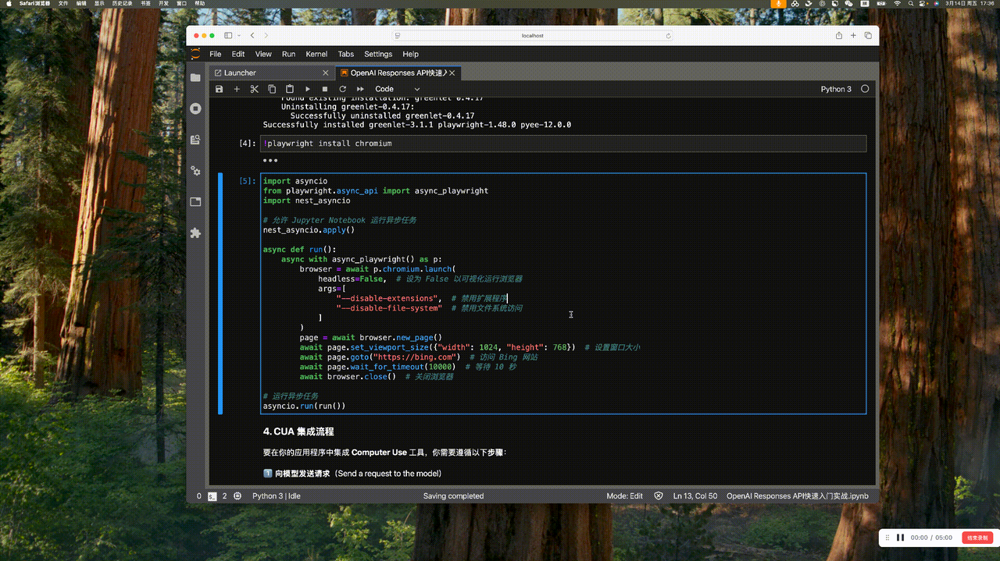

#### **4. CUA 集成流程**

要在你的应用程序中集成 **Computer Use** 工具，你需要遵循以下**步骤**：

1️⃣ **向模型发送请求**（Send a request to the model）

* 在请求中**包含 Computer Use 工具**，作为可用工具的一部分。

* **指定显示尺寸**（display size）和**环境信息**（environment）。

* **可选**：在**首次请求中附加环境的初始状态截图**，帮助模型理解当前界面。

2️⃣ **接收模型的响应**（Receive a response from the model）

* 检查模型返回的响应中是否包含 **computer\_call** 项目。

* **computer\_call** 代表模型建议的下一步操作，例如：

  * **点击**（clicking）指定位置

  * **输入文本**（typing in text）

  * **滚动页面**（scrolling）

  * **等待**（waiting）

3️⃣ **执行请求的操作**（Execute the requested action）

* 通过代码在**计算机或浏览器环境**中执行模型建议的操作。

4️⃣ **捕获更新后的界面状态**（Capture the updated state）

* **执行操作后**，截取当前界面的最新状态**作为截图**，用于下一步交互。

5️⃣ **循环执行**（Repeat）

* 将**更新后的状态**作为 **computer\_call\_output**，并发送新的请求。

* 继续这个**循环交互**，直到：

  * **模型不再请求新操作**，或

  * **你决定终止执行**。

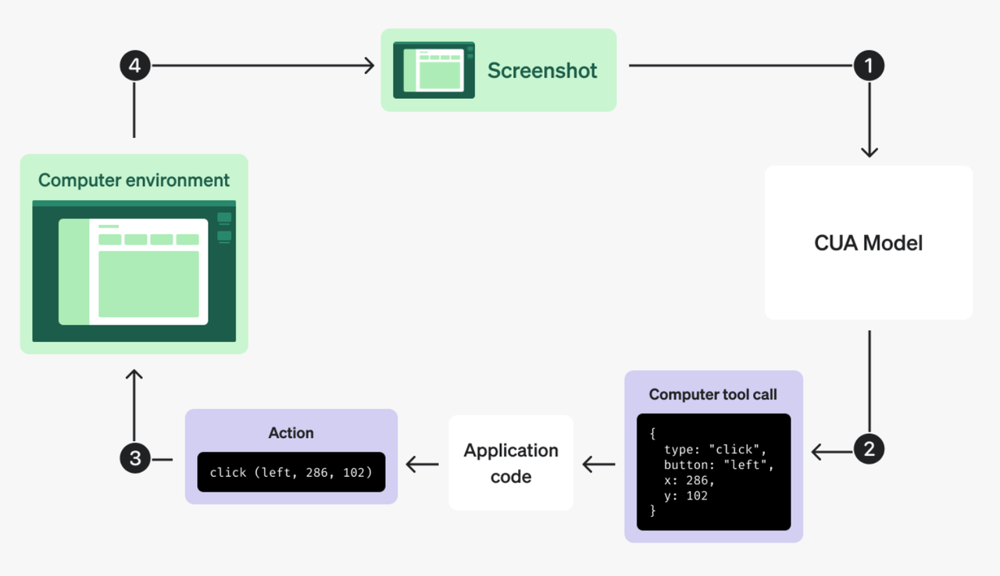

具体代码执行流程如下：

##### **🌟1. 向模型发送请求（Send a request to the model）**

发送请求以创建 **Response**，使用 **computer-use-preview** 模型，并启用 **computer\_use\_preview** 工具。
该请求应包括 **环境的详细信息**，以及**初始输入提示（input prompt）**。

📌 **可选项**：
你可以 **附加环境的初始状态截图**，帮助模型更好地理解当前界面。

📌 **注意**：
要使用 **computer\_use\_preview** 工具，必须将 **truncation 参数** 设置为 `"auto"`。

```python
from openai import OpenAI
client = OpenAI()

response = client.responses.create(
    model="computer-use-preview",
    tools=[{
        "type": "computer_use_preview",
        "display_width": 1024,
        "display_height": 768,
        "environment": "browser" # other possible values: "mac", "windows", "ubuntu"
    }],
    input=[
        {
            "role": "user",
            "content": "Check the latest OpenAI news on bing.com."
        }
        # Optional: include a screenshot of the initial state of the environment
        # {
        #     type: "input_image",
        #     image_url: f"data:image/png;base64,{screenshot_base64}"
        # }
    ],
    reasoning={
        "generate_summary": "concise",
    },
    truncation="auto"
)

print(response.output)
```

📌 **效果**：

* 该 API 请求会启动计算机代理，让它**在 Bing 上搜索 OpenAI 新闻**。

* **可选**：传入界面截图（Base64 编码）以帮助模型理解当前环境。

##### **🌟 2. 接收建议操作**

模型的 API 响应可能包含：

* **文本输出**

* **计算机操作（computer\_call）**

* **其他工具调用**

📌 **示例：模型返回点击操作**

```json
"output": [
    {
        "type": "reasoning",
        "id": "rs_67cc...",
        "content": []
    },
    {
        "type": "computer_call",
        "id": "cu_67cc...",
        "call_id": "call_zw3...",
        "action": {
            "type": "click",
            "button": "left",
            "x": 156,
            "y": 50
        },
        "pending_safety_checks": [],
        "status": "completed"
    }
]
```

📌 **解析**：

* **`computer_call`**：告诉应用程序**执行点击操作**（在 `x=156, y=50`）。

* **`reasoning`**：提供推理过程（如果有）。

* **`pending_safety_checks`**：如果存在安全检查，应用程序需要处理。

##### **🌟 3. 执行操作**

在 计算机或浏览器 环境中执行模型建议的操作。

📌 如何通过代码将 computer\_call 映射到具体操作 取决于你的环境。

```python
def handle_model_action(page, action):
    """
    Given a computer action (e.g., click, double_click, scroll, etc.),
    execute the corresponding operation on the Playwright page.
    """
    action_type = action.type
    
    try:
        match action_type:

            case "click":
                x, y = action.x, action.y
                button = action.button
                print(f"Action: click at ({x}, {y}) with button '{button}'")
                # Not handling things like middle click, etc.
                if button != "left" and button != "right":
                    button = "left"
                page.mouse.click(x, y, button=button)

            case "scroll":
                x, y = action.x, action.y
                scroll_x, scroll_y = action.scroll_x, action.scroll_y
                print(f"Action: scroll at ({x}, {y}) with offsets (scroll_x={scroll_x}, scroll_y={scroll_y})")
                page.mouse.move(x, y)
                page.evaluate(f"window.scrollBy({scroll_x}, {scroll_y})")

            case "keypress":
                keys = action.keys
                for k in keys:
                    print(f"Action: keypress '{k}'")
                    # A simple mapping for common keys; expand as needed.
                    if k.lower() == "enter":
                        page.keyboard.press("Enter")
                    elif k.lower() == "space":
                        page.keyboard.press(" ")
                    else:
                        page.keyboard.press(k)
            
            case "type":
                text = action.text
                print(f"Action: type text: {text}")
                page.keyboard.type(text)
            
            case "wait":
                print(f"Action: wait")
                time.sleep(2)

            case "screenshot":
                # Nothing to do as screenshot is taken at each turn
                print(f"Action: screenshot")

            # Handle other actions here

            case _:
                print(f"Unrecognized action: {action}")

    except Exception as e:
        print(f"Error handling action {action}: {e}")
```

##### **🌟 4. 获取更新后的界面状态**

执行操作后，**截取当前环境的最新状态截图**，以反映操作后的界面变化。

📌 **注意**：

* 截图的获取方式**因环境不同而有所不同**。

* 你需要根据**具体环境**选择合适的方法来**捕获更新后的界面状态**。

```python
def get_screenshot(page):
    """
    Take a full-page screenshot using Playwright and return the image bytes.
    """
    return page.screenshot()
```

📌 **效果**：

* 代码会**截图当前屏幕**，并**将其作为 `input_image` 传给模型**，继续执行任务。

##### **🌟5. 循环执行（Repeat）**

当你获取到 **最新的截图** 后，可以**将其作为 `computer_call_output` 发送回模型**，以获取**下一步操作**。

📌 **循环执行**：

* **只要模型返回 `computer_call` 项目**，就继续按照 **「发送请求 → 执行操作 → 获取截图」** 的流程重复执行，直到模型**不再请求新操作**。

```python
import time
import base64
from openai import OpenAI
client = OpenAI()

def computer_use_loop(instance, response):
    """
    Run the loop that executes computer actions until no 'computer_call' is found.
    """
    while True:
        computer_calls = [item for item in response.output if item.type == "computer_call"]
        if not computer_calls:
            print("No computer call found. Output from model:")
            for item in response.output:
                print(item)
            break  # Exit when no computer calls are issued.

        # We expect at most one computer call per response.
        computer_call = computer_calls[0]
        last_call_id = computer_call.call_id
        action = computer_call.action

        # Execute the action (function defined in step 3)
        handle_model_action(instance, action)
        time.sleep(1)  # Allow time for changes to take effect.

        # Take a screenshot after the action (function defined in step 4)
        screenshot_bytes = get_screenshot(instance)
        screenshot_base64 = base64.b64encode(screenshot_bytes).decode("utf-8")

        # Send the screenshot back as a computer_call_output
        response = client.responses.create(
            model="computer-use-preview",
            previous_response_id=response.id,
            tools=[
                {
                    "type": "computer_use_preview",
                    "display_width": 1024,
                    "display_height": 768,
                    "environment": "browser"
                }
            ],
            input=[
                {
                    "call_id": last_call_id,
                    "type": "computer_call_output",
                    "output": {
                        "type": "input_image",
                        "image_url": f"data:image/png;base64,{screenshot_base64}"
                    }
                }
            ],
            truncation="auto"
        )

    return response
```

##### **处理会话历史（Handling conversation history）**

你可以使用 **`previous_response_id` 参数**，将当前请求与上一次响应关联。

* **如果你不想自己管理会话历史**，建议使用此方法。

📌 **如果不使用 `previous_response_id`，请确保：**

* 在 `inputs` 数组中包含 **上一次请求返回的所有 `response output` 项目**，

* **如果响应中包含 `reasoning` 项目**，也需要一并包含。

##### **确认安全检查（Acknowledge safety checks）**

OpenAI 在 API 中**实施了安全检查**，以防止**提示词注入（prompt injection）** 和 **模型错误**。
这些安全检查包括：

1️⃣ **恶意指令检测（Malicious instruction detection）**

* 评估截图图像，**检测是否存在对抗性内容**，防止其改变模型行为。

2️⃣ **无关域名检测（Irrelevant domain detection）**

* **检查 `current_url`（如果提供）**，确定当前访问的域名是否与**会话历史相关**。

3️⃣ **敏感域名检测（Sensitive domain detection）**

* **检查 `current_url`（如果提供）**，如果检测到**访问了敏感域名**，则会触发警告。

📌 **如果触发上述一个或多个检查**：

* **模型返回 `computer_call` 时，会附带 `pending_safety_checks` 参数**，指示需要进行安全检查。

### 五、Computer Use功能展示

* Computer Using Agent Sample App：https://github.com/openai/openai-cua-sample-app

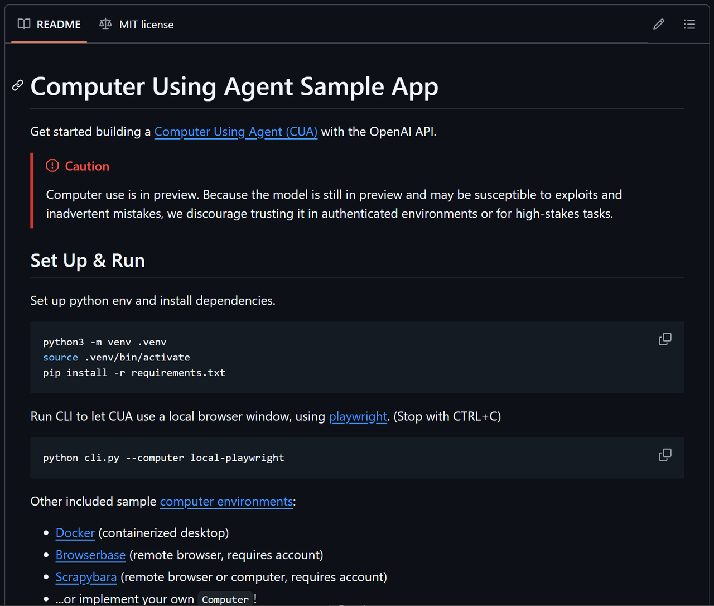

* 基本环境准备

```bash
git clone https://github.com/openai/openai-cua-sample-app.git
cd ./openai-cua-sample-app
pip install -r requirements.txt
```

* 设置API-KEY

```bash
nano .env
```

然后输入`OPENAI_API_KEY="YOUR_API_KEY"`

* 调用测试

```bash
python cli.py --computer local-playwright
```

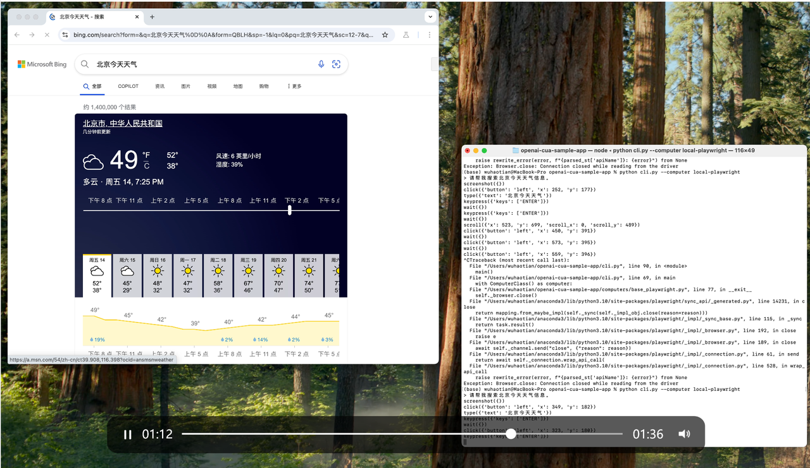

### 六、MateGen功能演示

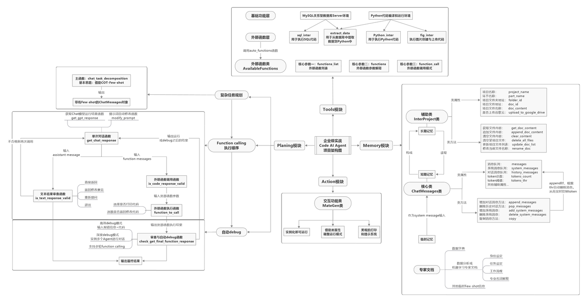

***

# 交互式智能编程助手MateGen

# 功能介绍与入门使用教程


### MateGen简介

  MateGen是一款由九天老师团队开发的交互式智能编程助手，可以在Python代码环境中运行，核心功能如下

* **多轮对话与无限上下文记忆**：可以在对话过程中逐渐深入理解你的需求，并长期记住上下文信息。

* **基于RAG的本地知识库问答**：支持在海量文本中进行高精度检索，围绕本地文本进行知识库问答。

* **本地代码解释器**：可以连接本地Python环境，编写和执行Python代码，辅助完成编程任务。

* **NL2SQL**：能够连接本地MySQL环境，根据需求编写和执行SQL代码，帮助完成数据查询和提取任务。

* **图像识别**：可以处理用户提供的图片，并针对图片内容进行信息识别和回答问题。

* **联网功能**：可以在互联网、知乎或GitHub上搜索相关信息，回答用户提出的问题。

* **Kaggle竞赛辅导**：能够搜索Kaggle竞赛相关信息，下载热门Kernel，并进行知识库问答，辅导参与竞赛。

* **论文解读和数据分析报告编写**：可以帮助解读学术论文或编写数据分析报告。

而在实际使用过程中，九天老师团队秉持实用性优先的原则设计的MateGen还具备如下特性：

* **易用性**：MateGen为在线Agent，无需任何网络工具和硬件门槛即可使用，各项功能不用进行参数设置，MateGen会自动根据用户需求开启不同功能；

* **强悍的RAG系统**：支持本地文件夹一键同步创建云端词向量数据库，且最大支持1000份文档、10G体量的文本搜索问答；

* **复杂问题拆解与自动debug**：面对复杂任务，MateGen会自动进行任务拆解，并在不同环节调用不同工具进行处理，同时，若部分环节运行出问题，MateGen会首先尝试自动优化运行流程，并在多次尝试无法解决问题时向用户寻求帮助；

* **高效率Function calling**：MateGen同时具备Multi Function calling（一个任务开启多个功能）和Parallel Function calling（一个功能开多个执行器），借此提高响应效率。

**此外，欢迎大家观看《MateGen项目介绍》视频了解更多信息：**


**目前MateGen已在GitHub上线，欢迎大家关注点星：https://github.com/fufankeji/MateGen**

***

## 一、MateGen下载与API-KEY获取

### 1.虚拟环境创建与MateGen安装

  MateGen安装非常简单，可以直接通过`pip install mategen`进行安装，需要注意的是，MateGen运行所需依赖较多，因此推荐借助虚拟环境进行安装。首先创建一个名为`mategen`的虚拟环境：

```bash
conda create -n mategen python=3.10
```

然后使用如下指令激活虚拟环境：

```bash
conda activate mategen
```

接着在虚拟环境中安装MateGen：

```bash
pip install mategen
```

安装完成之后，考虑到需要在Jupyter中调用MateGen，我们还需要在虚拟环境中安装IPython Kernel：

```bash
pip install ipykernel
```

并且将这个虚拟环境添加到Jupyter的Kernel列表中：

```bash
python -m ipykernel install --user --name mategen --display-name "mategen"
```

然后开启Jupyter服务：

```bash
jupyter lab
```

若要更新MateGen，则可输入如下命令：

```bash
pip install --upgrade mategen --index-url https://pypi.org/simple --no-cache-dir
```

然后在Jupyter的Kernel中选择mategen，即可进入到对应虚拟环境运行MateGen：

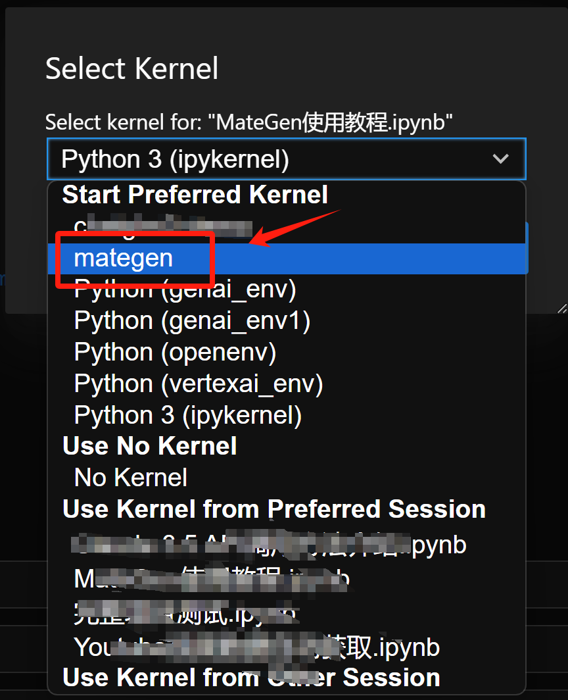

然后运行如下代码测试是否安装成功：

```python
!pip install mategen
```

```plaintext
Looking in indexes: http://mirrors.aliyun.com/pypi/simple
Collecting mategen
  Downloading http://mirrors.aliyun.com/pypi/packages/8c/2c/bce98356d836b93345001852ffc9a6fcd17da2f4f35ca7100ba9c9d8d06d/MateGen-0.1.81-py3-none-any.whl (42 kB)
     ━━━━━━━━━━━━━━━━━━━━━━━━━━━━━━━━━━━━━━━ 42.5/42.5 kB 298.1 kB/s eta 0:00:00 0:00:01
[?25hRequirement already satisfied: IPython in /root/miniconda3/lib/python3.12/site-packages (from mategen) (8.29.0)
Requirement already satisfied: openai>=1.35 in /root/miniconda3/lib/python3.12/site-packages (from mategen) (1.66.3)
Requirement already satisfied: matplotlib in /root/miniconda3/lib/python3.12/site-packages (from mategen) (3.9.2)
Requirement already satisfied: pandas in /root/miniconda3/lib/python3.12/site-packages (from mategen) (2.2.3)
Requirement already satisfied: seaborn in /root/miniconda3/lib/python3.12/site-packages (from mategen) (0.13.2)
Requirement already satisfied: oss2 in /root/miniconda3/lib/python3.12/site-packages (from mategen) (2.19.1)
Requirement already satisfied: python-dotenv in /root/miniconda3/lib/python3.12/site-packages (from mategen) (1.0.1)
Requirement already satisfied: pymysql in /root/miniconda3/lib/python3.12/site-packages (from mategen) (1.1.1)
Requirement already satisfied: requests in /root/miniconda3/lib/python3.12/site-packages (from mategen) (2.32.3)
Requirement already satisfied: google-api-python-client in /root/miniconda3/lib/python3.12/site-packages (from mategen) (2.163.0)
Requirement already satisfied: google-auth in /root/miniconda3/lib/python3.12/site-packages (from mategen) (2.38.0)
Requirement already satisfied: google-auth-oauthlib in /root/miniconda3/lib/python3.12/site-packages (from mategen) (1.2.1)
Requirement already satisfied: beautifulsoup4 in /root/miniconda3/lib/python3.12/site-packages (from mategen) (4.12.3)
Requirement already satisfied: python-dateutil in /root/miniconda3/lib/python3.12/site-packages (from mategen) (2.9.0.post0)
Requirement already satisfied: tiktoken in /root/miniconda3/lib/python3.12/site-packages (from mategen) (0.9.0)
Requirement already satisfied: lxml in /root/miniconda3/lib/python3.12/site-packages (from mategen) (5.3.1)
Requirement already satisfied: cryptography in /root/miniconda3/lib/python3.12/site-packages (from mategen) (42.0.5)
Requirement already satisfied: numpy in /root/miniconda3/lib/python3.12/site-packages (from mategen) (1.26.4)
Requirement already satisfied: html2text in /root/miniconda3/lib/python3.12/site-packages (from mategen) (2024.2.26)
Requirement already satisfied: nbconvert in /root/miniconda3/lib/python3.12/site-packages (from mategen) (7.16.4)
Requirement already satisfied: anyio<5,>=3.5.0 in /root/miniconda3/lib/python3.12/site-packages (from openai>=1.35->mategen) (4.6.2.post1)
Requirement already satisfied: distro<2,>=1.7.0 in /root/miniconda3/lib/python3.12/site-packages (from openai>=1.35->mategen) (1.9.0)
Requirement already satisfied: httpx<1,>=0.23.0 in /root/miniconda3/lib/python3.12/site-packages (from openai>=1.35->mategen) (0.27.2)
Requirement already satisfied: jiter<1,>=0.4.0 in /root/miniconda3/lib/python3.12/site-packages (from openai>=1.35->mategen) (0.8.2)
Requirement already satisfied: pydantic<3,>=1.9.0 in /root/miniconda3/lib/python3.12/site-packages (from openai>=1.35->mategen) (2.10.6)
Requirement already satisfied: sniffio in /root/miniconda3/lib/python3.12/site-packages (from openai>=1.35->mategen) (1.3.1)
Requirement already satisfied: tqdm>4 in /root/miniconda3/lib/python3.12/site-packages (from openai>=1.35->mategen) (4.67.1)
Requirement already satisfied: typing-extensions<5,>=4.11 in /root/miniconda3/lib/python3.12/site-packages (from openai>=1.35->mategen) (4.12.2)
Requirement already satisfied: soupsieve>1.2 in /root/miniconda3/lib/python3.12/site-packages (from beautifulsoup4->mategen) (2.6)
Requirement already satisfied: cffi>=1.12 in /root/miniconda3/lib/python3.12/site-packages (from cryptography->mategen) (1.16.0)
Requirement already satisfied: httplib2<1.dev0,>=0.19.0 in /root/miniconda3/lib/python3.12/site-packages (from google-api-python-client->mategen) (0.22.0)
Requirement already satisfied: google-auth-httplib2<1.0.0,>=0.2.0 in /root/miniconda3/lib/python3.12/site-packages (from google-api-python-client->mategen) (0.2.0)
Requirement already satisfied: google-api-core!=2.0.*,!=2.1.*,!=2.2.*,!=2.3.0,<3.0.0.dev0,>=1.31.5 in /root/miniconda3/lib/python3.12/site-packages (from google-api-python-client->mategen) (2.24.1)
Requirement already satisfied: uritemplate<5,>=3.0.1 in /root/miniconda3/lib/python3.12/site-packages (from google-api-python-client->mategen) (4.1.1)
Requirement already satisfied: cachetools<6.0,>=2.0.0 in /root/miniconda3/lib/python3.12/site-packages (from google-auth->mategen) (5.5.2)
Requirement already satisfied: pyasn1-modules>=0.2.1 in /root/miniconda3/lib/python3.12/site-packages (from google-auth->mategen) (0.4.1)
Requirement already satisfied: rsa<5,>=3.1.4 in /root/miniconda3/lib/python3.12/site-packages (from google-auth->mategen) (4.9)
Requirement already satisfied: requests-oauthlib>=0.7.0 in /root/miniconda3/lib/python3.12/site-packages (from google-auth-oauthlib->mategen) (2.0.0)
Requirement already satisfied: decorator in /root/miniconda3/lib/python3.12/site-packages (from IPython->mategen) (5.1.1)
Requirement already satisfied: jedi>=0.16 in /root/miniconda3/lib/python3.12/site-packages (from IPython->mategen) (0.19.2)
Requirement already satisfied: matplotlib-inline in /root/miniconda3/lib/python3.12/site-packages (from IPython->mategen) (0.1.7)
Requirement already satisfied: prompt-toolkit<3.1.0,>=3.0.41 in /root/miniconda3/lib/python3.12/site-packages (from IPython->mategen) (3.0.48)
Requirement already satisfied: pygments>=2.4.0 in /root/miniconda3/lib/python3.12/site-packages (from IPython->mategen) (2.18.0)
Requirement already satisfied: stack-data in /root/miniconda3/lib/python3.12/site-packages (from IPython->mategen) (0.6.3)
Requirement already satisfied: traitlets>=5.13.0 in /root/miniconda3/lib/python3.12/site-packages (from IPython->mategen) (5.14.3)
Requirement already satisfied: pexpect>4.3 in /root/miniconda3/lib/python3.12/site-packages (from IPython->mategen) (4.9.0)
Requirement already satisfied: contourpy>=1.0.1 in /root/miniconda3/lib/python3.12/site-packages (from matplotlib->mategen) (1.3.1)
Requirement already satisfied: cycler>=0.10 in /root/miniconda3/lib/python3.12/site-packages (from matplotlib->mategen) (0.12.1)
Requirement already satisfied: fonttools>=4.22.0 in /root/miniconda3/lib/python3.12/site-packages (from matplotlib->mategen) (4.55.0)
Requirement already satisfied: kiwisolver>=1.3.1 in /root/miniconda3/lib/python3.12/site-packages (from matplotlib->mategen) (1.4.7)
Requirement already satisfied: packaging>=20.0 in /root/miniconda3/lib/python3.12/site-packages (from matplotlib->mategen) (23.2)
Requirement already satisfied: pillow>=8 in /root/miniconda3/lib/python3.12/site-packages (from matplotlib->mategen) (11.0.0)
Requirement already satisfied: pyparsing>=2.3.1 in /root/miniconda3/lib/python3.12/site-packages (from matplotlib->mategen) (3.2.0)
Requirement already satisfied: six>=1.5 in /root/miniconda3/lib/python3.12/site-packages (from python-dateutil->mategen) (1.16.0)
Requirement already satisfied: bleach!=5.0.0 in /root/miniconda3/lib/python3.12/site-packages (from nbconvert->mategen) (6.2.0)
Requirement already satisfied: defusedxml in /root/miniconda3/lib/python3.12/site-packages (from nbconvert->mategen) (0.7.1)
Requirement already satisfied: jinja2>=3.0 in /root/miniconda3/lib/python3.12/site-packages (from nbconvert->mategen) (3.1.6)
Requirement already satisfied: jupyter-core>=4.7 in /root/miniconda3/lib/python3.12/site-packages (from nbconvert->mategen) (5.7.2)
Requirement already satisfied: jupyterlab-pygments in /root/miniconda3/lib/python3.12/site-packages (from nbconvert->mategen) (0.3.0)
Requirement already satisfied: markupsafe>=2.0 in /root/miniconda3/lib/python3.12/site-packages (from nbconvert->mategen) (3.0.2)
Requirement already satisfied: mistune<4,>=2.0.3 in /root/miniconda3/lib/python3.12/site-packages (from nbconvert->mategen) (3.0.2)
Requirement already satisfied: nbclient>=0.5.0 in /root/miniconda3/lib/python3.12/site-packages (from nbconvert->mategen) (0.10.0)
Requirement already satisfied: nbformat>=5.7 in /root/miniconda3/lib/python3.12/site-packages (from nbconvert->mategen) (5.10.4)
Requirement already satisfied: pandocfilters>=1.4.1 in /root/miniconda3/lib/python3.12/site-packages (from nbconvert->mategen) (1.5.1)
Requirement already satisfied: tinycss2 in /root/miniconda3/lib/python3.12/site-packages (from nbconvert->mategen) (1.4.0)
Requirement already satisfied: crcmod>=1.7 in /root/miniconda3/lib/python3.12/site-packages (from oss2->mategen) (1.7)
Requirement already satisfied: pycryptodome>=3.4.7 in /root/miniconda3/lib/python3.12/site-packages (from oss2->mategen) (3.21.0)
Requirement already satisfied: aliyun-python-sdk-kms>=2.4.1 in /root/miniconda3/lib/python3.12/site-packages (from oss2->mategen) (2.16.5)
Requirement already satisfied: aliyun-python-sdk-core>=2.13.12 in /root/miniconda3/lib/python3.12/site-packages (from oss2->mategen) (2.16.0)
Requirement already satisfied: charset-normalizer<4,>=2 in /root/miniconda3/lib/python3.12/site-packages (from requests->mategen) (2.0.4)
Requirement already satisfied: idna<4,>=2.5 in /root/miniconda3/lib/python3.12/site-packages (from requests->mategen) (3.7)
Requirement already satisfied: urllib3<3,>=1.21.1 in /root/miniconda3/lib/python3.12/site-packages (from requests->mategen) (2.1.0)
Requirement already satisfied: certifi>=2017.4.17 in /root/miniconda3/lib/python3.12/site-packages (from requests->mategen) (2025.1.31)
Requirement already satisfied: pytz>=2020.1 in /root/miniconda3/lib/python3.12/site-packages (from pandas->mategen) (2025.1)
Requirement already satisfied: tzdata>=2022.7 in /root/miniconda3/lib/python3.12/site-packages (from pandas->mategen) (2025.1)
Requirement already satisfied: regex>=2022.1.18 in /root/miniconda3/lib/python3.12/site-packages (from tiktoken->mategen) (2024.11.6)
Requirement already satisfied: jmespath<1.0.0,>=0.9.3 in /root/miniconda3/lib/python3.12/site-packages (from aliyun-python-sdk-core>=2.13.12->oss2->mategen) (0.10.0)
Requirement already satisfied: webencodings in /root/miniconda3/lib/python3.12/site-packages (from bleach!=5.0.0->nbconvert->mategen) (0.5.1)
Requirement already satisfied: pycparser in /root/miniconda3/lib/python3.12/site-packages (from cffi>=1.12->cryptography->mategen) (2.21)
Requirement already satisfied: googleapis-common-protos<2.0.dev0,>=1.56.2 in /root/miniconda3/lib/python3.12/site-packages (from google-api-core!=2.0.*,!=2.1.*,!=2.2.*,!=2.3.0,<3.0.0.dev0,>=1.31.5->google-api-python-client->mategen) (1.63.2)
Requirement already satisfied: protobuf!=3.20.0,!=3.20.1,!=4.21.0,!=4.21.1,!=4.21.2,!=4.21.3,!=4.21.4,!=4.21.5,<6.0.0.dev0,>=3.19.5 in /root/miniconda3/lib/python3.12/site-packages (from google-api-core!=2.0.*,!=2.1.*,!=2.2.*,!=2.3.0,<3.0.0.dev0,>=1.31.5->google-api-python-client->mategen) (3.20.3)
Requirement already satisfied: proto-plus<2.0.0dev,>=1.22.3 in /root/miniconda3/lib/python3.12/site-packages (from google-api-core!=2.0.*,!=2.1.*,!=2.2.*,!=2.3.0,<3.0.0.dev0,>=1.31.5->google-api-python-client->mategen) (1.26.0)
Requirement already satisfied: httpcore==1.* in /root/miniconda3/lib/python3.12/site-packages (from httpx<1,>=0.23.0->openai>=1.35->mategen) (1.0.7)
Requirement already satisfied: h11<0.15,>=0.13 in /root/miniconda3/lib/python3.12/site-packages (from httpcore==1.*->httpx<1,>=0.23.0->openai>=1.35->mategen) (0.14.0)
Requirement already satisfied: parso<0.9.0,>=0.8.4 in /root/miniconda3/lib/python3.12/site-packages (from jedi>=0.16->IPython->mategen) (0.8.4)
Requirement already satisfied: platformdirs>=2.5 in /root/miniconda3/lib/python3.12/site-packages (from jupyter-core>=4.7->nbconvert->mategen) (3.10.0)
Requirement already satisfied: jupyter-client>=6.1.12 in /root/miniconda3/lib/python3.12/site-packages (from nbclient>=0.5.0->nbconvert->mategen) (8.6.3)
Requirement already satisfied: fastjsonschema>=2.15 in /root/miniconda3/lib/python3.12/site-packages (from nbformat>=5.7->nbconvert->mategen) (2.20.0)
Requirement already satisfied: jsonschema>=2.6 in /root/miniconda3/lib/python3.12/site-packages (from nbformat>=5.7->nbconvert->mategen) (4.23.0)
Requirement already satisfied: ptyprocess>=0.5 in /root/miniconda3/lib/python3.12/site-packages (from pexpect>4.3->IPython->mategen) (0.7.0)
Requirement already satisfied: wcwidth in /root/miniconda3/lib/python3.12/site-packages (from prompt-toolkit<3.1.0,>=3.0.41->IPython->mategen) (0.2.13)
Requirement already satisfied: pyasn1<0.7.0,>=0.4.6 in /root/miniconda3/lib/python3.12/site-packages (from pyasn1-modules>=0.2.1->google-auth->mategen) (0.4.8)
Requirement already satisfied: annotated-types>=0.6.0 in /root/miniconda3/lib/python3.12/site-packages (from pydantic<3,>=1.9.0->openai>=1.35->mategen) (0.7.0)
Requirement already satisfied: pydantic-core==2.27.2 in /root/miniconda3/lib/python3.12/site-packages (from pydantic<3,>=1.9.0->openai>=1.35->mategen) (2.27.2)
Requirement already satisfied: oauthlib>=3.0.0 in /root/miniconda3/lib/python3.12/site-packages (from requests-oauthlib>=0.7.0->google-auth-oauthlib->mategen) (3.2.2)
Requirement already satisfied: executing>=1.2.0 in /root/miniconda3/lib/python3.12/site-packages (from stack-data->IPython->mategen) (2.1.0)
Requirement already satisfied: asttokens>=2.1.0 in /root/miniconda3/lib/python3.12/site-packages (from stack-data->IPython->mategen) (2.4.1)
Requirement already satisfied: pure-eval in /root/miniconda3/lib/python3.12/site-packages (from stack-data->IPython->mategen) (0.2.3)
Requirement already satisfied: attrs>=22.2.0 in /root/miniconda3/lib/python3.12/site-packages (from jsonschema>=2.6->nbformat>=5.7->nbconvert->mategen) (24.2.0)
Requirement already satisfied: jsonschema-specifications>=2023.03.6 in /root/miniconda3/lib/python3.12/site-packages (from jsonschema>=2.6->nbformat>=5.7->nbconvert->mategen) (2024.10.1)
Requirement already satisfied: referencing>=0.28.4 in /root/miniconda3/lib/python3.12/site-packages (from jsonschema>=2.6->nbformat>=5.7->nbconvert->mategen) (0.35.1)
Requirement already satisfied: rpds-py>=0.7.1 in /root/miniconda3/lib/python3.12/site-packages (from jsonschema>=2.6->nbformat>=5.7->nbconvert->mategen) (0.21.0)
Requirement already satisfied: pyzmq>=23.0 in /root/miniconda3/lib/python3.12/site-packages (from jupyter-client>=6.1.12->nbclient>=0.5.0->nbconvert->mategen) (26.2.0)
Requirement already satisfied: tornado>=6.2 in /root/miniconda3/lib/python3.12/site-packages (from jupyter-client>=6.1.12->nbclient>=0.5.0->nbconvert->mategen) (6.4.2)
Installing collected packages: mategen
Successfully installed mategen-0.1.81
WARNING: Running pip as the 'root' user can result in broken permissions and conflicting behaviour with the system package manager. It is recommended to use a virtual environment instead: https://pip.pypa.io/warnings/venv

```

```python
import MateGen
from MateGen import *
```

安装后按照如下方式导入即可：

```python
# 查看MateGen版本号
MateGen.__version__
```

```plaintext
'0.1.79'
```

### 2.MateGen API-KEY获取

  本部分公开课仅作演示，实际内容为付费课程案例之一：[《2025大模型Agent智能体开发实战》(3月DeepSeek强化班)](https://whakv.xetslk.com/s/3uzKfW)：


&#x20;


## 二、MateGen对话功能与本地知识库问答功能介绍

* MateGen实例化

  MateGen的调用流程和sklearn模型调用流程类似，都是先需要实例化一个MateGen聊天机器人，然后再执行对话。实例化过程如下：

```python
mategen = MateGenClass(api_key = openai_api_key)
```

```plaintext
正在初始化MateGen，请稍后...
当前网络环境无法连接服务器，请检查网络并稍后重试...
```

每个新的API-KEY实例化MateGen时，需要同步基础指令和调度流程等，因此需要等待一小段时间。此后若不更换API-KEY，则无需重复这个流程。

* 增强模式

  MateGen支持两种运行模式，普通模式与增强模式，开启增强模式时MateGen会有更强的性能表现，但同时也会有更长的响应时间以及更高昂的费用。默认情况下MateGen以普通模式运行，当设置参数`enhanced_mode`为True时则开启增强模式：

```python
mategen = MateGenClass(api_key = 'YOUR_API_KEY', 
                       enhanced_mode = True)
```

```plaintext
正在初始化MateGen，请稍后...
成功连接服务器，API-KEY通过验证！
已完成初始化，MateGen可随时调用！
```

帮助文档的各项实验均基于增强模式运行得到的结果。

### 1.MateGen基础对话功能介绍

* MateGen对话方式与无限上下文

  我们可以使用MateGen.chat()的方式开启对话，MateGen支持单次对话和多次对话两种模式，无论哪种模式，MateGen都具备多轮对话记忆以及拥有无限对话上下文。用户无需担心多轮对话内容总量超出模型最大对话上下文，MateGen会根据用户对话情况，智能截取聊天内容带入模型，并且采用时间衰减和未知信息增加权重等策略，实现无限上下文。

  当MateGen.chat()带入对话文本时，即可实现单次对话：

```python
mategen.chat("你好，很高兴见到你！")
```

▌ MateGen初始化完成，欢迎使用！

你好！很高兴见到你！有什么我可以帮助你的吗？

而若不带入对话文本，则可以实现多轮对话：

```python
mategen.chat()
```

▌ MateGen初始化完成，欢迎使用！

```plaintext
你好，我是MateGen，你的个人交互式编程助理，有任何问题都可以问我哦~


请输入您的问题(输入退出以结束对话):  你好，请介绍下你自己
```

你好！我是MateGen，一个由九天老师大模型技术团队开发的交互式智能编程助手。以下是我的一些主要功能：

1. **无限对话上下文记忆**：可以在对话过程中逐渐深入理解你的需求，并长期记住上下文信息。

2. **本地知识库问答**：支持在海量文本中进行高精度检索，围绕本地文本进行知识库问答。

3. **本地代码解释器**：可以连接你的本地Python环境，编写和执行Python代码，辅助完成编程任务。

4. **NL2SQL**：能够连接你的MySQL环境，根据需求编写和执行SQL代码，帮助完成数据查询和提取任务。

5. **图像识别**：可以处理用户提供的图片，并针对图片内容进行信息识别和回答问题。

6. **联网功能**：可以在互联网、知乎或GitHub上搜索相关信息，回答你提出的问题。

7. **Kaggle竞赛辅导**：能够搜索Kaggle竞赛相关信息，下载热门Kernel，并进行知识库问答，辅导参与竞赛。

8. **论文解读和数据分析报告编写**：可以帮助解读学术论文或编写数据分析报告。

如果你有任何编程、数据分析、图像识别等相关问题，随时告诉我，我会尽力帮助你！有什么具体问题需要我解决吗？

```plaintext
请输入您的问题(输入退出以结束对话):  好的，那么我应该如何获取MateGen的API-KEY和更多的token额度呢？
```

目前MateGen项目处于内测阶段，只开放了在线服务版本。如果你想要获取API-KEY或者需要更多token额度，你可以联系MateGen的客服小可爱。

具体步骤如下：

1. **添加微信**：添加客服小可爱的微信，微信号是：`littlelion_1215`

2. **发送信息**：在微信中发送“MG”给客服小可爱。

3. **获取API-KEY**：客服小可爱会帮助你获取API-KEY，并提供更多的token额度信息。

如有任何其他问题，我也可以尽力帮助你解决！

```plaintext
请输入您的问题(输入退出以结束对话):  退出
```

并且随时开启MateGen，都拥有多轮对话记忆：

```python
mategen.chat('好的，请问我的上一个问题是？')
```

▌ MateGen初始化完成，欢迎使用！

你上一个问题是：“好的，那么我应该如何获取MateGen的API-KEY和更多的token额度呢？”。

如果还有其他问题或者需要进一步的帮助，请随时告诉我！

甚至当我们删除MateGen或重启代码环境，MateGen仍然可以读取保存在服务器上的对话记录，实现多轮对话：

```python
del mategen
```

```python
mategen = MateGenClass(api_key = 'YOUR_API_KEY')
```

```plaintext
正在初始化MateGen，请稍后...
成功连接服务器，API-KEY通过验证！
已完成初始化，MateGen可随时调用！
```

```python
mategen.chat("请你帮我总结下咱俩之前的对话内容。")
```

▌ MateGen初始化完成，欢迎使用！

当然可以！以下是我们之前对话的总结：

1. **问候和介绍**：

   * 你向我问好，并希望了解更多关于我的信息。

   * 我详细介绍了自己是MateGen，一个由九天老师大模型技术团队开发的智能编程助手，具备无限对话上下文记忆、本地知识库问答、本地代码解释器、NL2SQL、图像识别、联网功能、Kaggle竞赛辅导以及论文解读和数据分析报告编写等多种强大功能。

2. **获取API-KEY和token额度**：

   * 你询问如何获取MateGen的API-KEY和更多的token额度。

   * 我建议你添加客服小可爱的微信（微信号：`littlelion_1215`）并发送“MG”来获取API-KEY和更多token额度的信息。

3. **回顾上一个问题**：

   * 你询问了上一个问题的内容，我回答你上一个问题是关于如何获取MateGen的API-KEY和更多token额度。

如果你还有其他问题或需要进一步的帮助，请随时告诉我！

* 清理消息

  若不想保存历史消息，也可调用mategen.clear\_messages()清理历史消息：

```python
mategen.clear_messages()
```

```plaintext
已经清理历史消息
```

* token消耗统计

  同时，无论是否清理消息，MateGen都能实时统计token消耗总量。

```python
mategen.print_usage()
```

```plaintext
今日已消耗的 token 数量：16137
总共消耗的 token 数量：16137
本地token计数可能有误，token消耗实际情况以服务器数据为准哦~
```

### 2.借助MateGen进行本地知识库问答

  MateGen自带先进的知识库检索（RAG）功能，能够围绕海量文本进行高精度检索问答、文本总结、文本翻译改写等。MateGen为每位用户提供了10G的在线文档存储空间，允许用户上传1000份文档，并且可以围绕PDF、md、ppt、word、txt等主流文档格式进行词向量化存储和读取。在设置了知识库问答的时候，**MateGen会根据用户提问，自动判断是否需要进行知识库检索，并不会强制检索再进行回答**。

#### 2.1 设置本地知识库地址

  MateGen的知识库问答允许用户把本地文件夹的内容批量上传，同时允许创建多个知识库（一个文件夹对应一个知识库），并且可以在问答过程随时切换知识库。首次开启知识库问答之前建议先设置本地知识库的根目录地址，便于存储各个知识库文件夹，若不设置，则MateGen会默认在系统根目录下创建一个知识库文件夹。

  我们可以借助如下函数指定知识库根目录地址，例如我们设置E盘下work文件夹为知识库根目录地址:

```python
mategen.set_knowledge_base_url('E:\\work')
```

```plaintext
知识库地址修改为：E:\work
```

#### 2.2 开启知识库对话

  设置完成后即可开启知识库问答，首次开启知识库问答时需要输入知识库名称，例如此处创建一个名为'OpenML'的知识库：

```python
mategen = MateGenClass(api_key = 'YOUR_API_KEY', 
                       knowledge_base_chat=True)
```

```plaintext
正在初始化MateGen，请稍后...
成功连接服务器，API-KEY通过验证！


请输入知识库名称，输入0查询当前知识库列表。 OpenML


E:\work\knowledge_base\main_vector_db_mapping.json 不存在。
正在创建知识库文件夹
当前问答知识库文件夹路径：E:\work\knowledge_base\OpenML，请在文件夹中放置知识库文件。
目前支持PDF、Word、PPT、md等格式读取与检索。
已完成初始化，MateGen可随时调用！
```

然后即可在`E:\work`下查看知识库地址，目前知识库地址为`E:\work\knowledge_base\OpenML`，其中knowledge\_base是知识库根目录：


接下来我们将九天老师机器学习公开课课件全部放进去，公开课课件总共636页，属于海量文本专业知识检索：

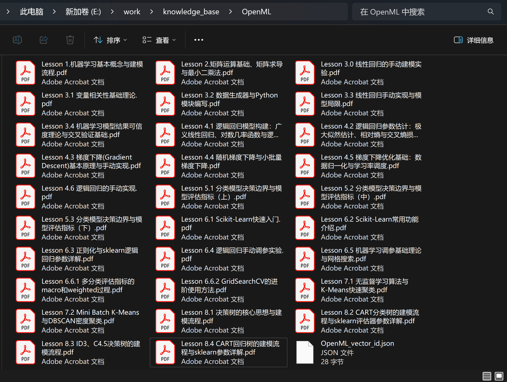

当然，哪怕是开启了知识库，MateGen也会根据用户提问的内容，决定是否进行知识库检索：

* 自主判断是否需要检索

```python
# 提一个机器学习之外的问题
mategen.chat('请帮我简单介绍下Transformer基本原理')
```

▌ MateGen初始化完成，欢迎使用！

Transformer架构是一种旨在解决序列到序列任务（如机器翻译）的深度学习模型。它在自然语言处理（NLP）领域取得了极大的成功，并广泛应用于各种任务中。以下是Transformer基本原理的简单介绍：

### 基本组成部分

1. **编码器（Encoder）和解码器（Decoder）**

   * Transformer模型通常由一个编码器和一个解码器组成。编码器的任务是将输入序列转换为一个表示序列，而解码器则将这个表示序列转换为输出序列。

   * 编码器和解码器各自包含多个层（通常是6个或更多），每一层由两个子层组成：多头自注意力机制和前馈神经网络。

2. **自注意力机制（Self-Attention Mechanism）**

   * 自注意力机制允许模型在处理给定输入序列时关注到该序列的不同部分。这种机制可以捕捉到远距离词汇之间的依赖关系。

   * 注意力操作通过计算"查询"（Query）、"键"（Key）和"值"（Value）之间的相关性来实现。

3. **多头注意力机制（Multi-Head Attention Mechanism）**

   * 通过并行地执行多个自注意力操作，模型可以在不同的“注意力头”上关注到输入序列的不同部分。然后，将这些头的输出拼接在一起并通过一个线性变换以获得最终的输出。

   * 这种机制增强了模型捕捉不同特征的能力。

4. **前馈神经网络（Feed-Forward Network, FFN）**

   * 在每一层的多头自注意力机制之后，还会通过一个前馈神经网络（两层全连接网络），这有助于模型学习更复杂的变换。

5. **位置编码（Positional Encoding）**

   * 由于Transformer架构中不包含卷积或递归操作，因此不能直接捕捉到序列中位置信息。为了引入位置信息，位置编码被加到输入嵌入（embedding）上。

### 工作流程

1. **输入嵌入**：首先，将输入序列中的每一个词转换为固定维度的向量表示，这些向量通过嵌入层获得。

2. **加位置编码**：将位置编码加到输入嵌入上，以包含位置信息。

3. **编码过程**：经过多个编码器层，每层执行多头自注意力和前馈神经网络操作，逐层处理输入序列。

4. **解码过程**：解码器同样经过多层，每层执行多头注意力（包括自注意力和对编码器输出的注意力）和前馈神经网络操作，逐渐生成输出序列。

### 主要优势

1. **并行处理**：与RNN不同，Transformer能够并行处理序列中的所有词，这显著提高了训练速度。

2. **捕捉长期依赖**：自注意力机制允许模型在处理时关注到远距离的词汇，提高了捕捉长期依赖关系的能力。

这种设计使得Transformer模型在处理大规模数据并训练复杂模型时表现优异。如果你有具体问题或需要更详细的解释，请告诉我。

接下来进一步测试MateGen RAG性能。我们分别从专业知识点（类似大海捞针）、大规模文本总结以及情感判断分析三个方面测试MateGen的RAG性能：

* 知识点提取

首次围绕某知识库对话，系统会先上传知识库文档，并进行词向量化处理，因此首次开启对话会略微耗费一点时间，之后再次开启对话则无需再次进行词向量化处理。

```python
# 专业知识点提取
mategen.chat('请帮我检索下知识库，并详细总结Mini Batch K-Means聚类算法的建模流程。')
```

```plaintext
正在创建知识库，请稍后...
正在创建知识库的向量存储，请稍后...
知识库创建完成！
已成功更新知识库OpenML
```

▌ MateGen初始化完成，欢迎使用！

Mini Batch K-Means是一种在K-Means算法基础上增强的聚类算法。它通过采用小批量数据来更新质心位置，从而加快计算速度。下面详细总结Mini Batch K-Means聚类算法的建模流程。

### 1. 算法原理

Mini Batch K-Means算法通过在每次迭代中随机抽取一个小批量的数据进行计算来更新质心，而不是使用全部数据。这样的计算方式类似于在梯度下降算法中使用小批量数据来更新参数。这样一来，Mini Batch K-Means可以显著减少计算时间，特别适用于大数据集 【4:1†source】。

### 2. 基本步骤

1. **初始化**：随机初始化质心。

2. **迭代更新**：

   * 随机抽取一个小批量数据，并分配给最近的质心。

   * 根据小批量数据的划分情况，更新质心位置【4:4†source】【4:5†source】。

### 3. 具体实现

#### 数据准备

```python
import numpy as np
from sklearn.cluster import MiniBatchKMeans

# 设置随机种子，生成数据
np.random.seed(23)
X, y = arrayGenCla(num_examples=1000000, num_inputs=10, num_class=5, deg_dispersion=[4, 1])
```

#### 模型训练

```python
from sklearn.cluster import MiniBatchKMeans

# 设置模型参数并训练
mbk = MiniBatchKMeans(n_clusters=5, batch_size=100)
mbk.fit(X)
```

#### 结果展示

```python
import matplotlib.pyplot as plt

# 绘制聚类结果
plt.scatter(X[:, 0], X[:, 1], c=mbk.labels_)
plt.scatter(mbk.cluster_centers_[:, 0], mbk.cluster_centers_[:, 1], marker='o', c='red')
plt.show()

# 计算SSE（Sum of Squared Errors）评估模型精度
km.inertia_
mbk.inertia_
```

通过较大数据集的聚类对比，可以看出Mini Batch K-Means在速度上显著快于普通K-Means，但精度略低 【4:6†source】。

### 4. 参数设置

* **batch\_size**：小批量数据大小。

* **max\_iter**：最大迭代次数。

* **reassignment\_ratio**：用于提升聚类精度的参数，通过设置该参数可以增加重新分配质心的概率，但会增加计算时间【4:7†source】【4:8†source】。

### 5. 优缺点分析

#### 优势

* 可以显著减少计算时间，特别适用于大数据集。对于超过2万条数据集时，其速度优势更加显著。

#### 劣势

* 精度略低于普通K-Means，但在大多数应用场景下，这种精度差异可以忽略不计 【4:8†source】。

总结以上，Mini Batch K-Means提供了一种高效的聚类方法，特别适合于处理大规模数据集，可以在实际应用中大幅提升计算效率。 【4:7†source】【4:8†source】

* 海量文本总结

```python
# 海量文本总结
mategen.chat('现在你的知识库OpenML包含的文档，是九天老师机器学习公开课课件。请帮我总结下，九天老师在公开课中讲解了几种决策树算法呢？')
```

▌ MateGen初始化完成，欢迎使用！

在九天老师的公开课中，决策树算法的内容详细讲解了以下几种经典的决策树算法：

1. **ID3决策树**：

   * ID3决策树是经典的决策树算法之一，主要应用于离散型变量的分类问题。

   * ID3决策树通过信息熵作为评估指标，基于列的不同取值对数据集进行划分【8:3†source】【8:5†source】。

2. **C4.5决策树**：

   * C4.5是ID3决策树的改进版本，由Ross Quinlan提出，能够处理连续型特征，并且可以进行回归问题的处理。

   * C4.5树在生长上更类似于机器学习算法，并且在对树模型进行剪枝防止过拟合时，采用了统计学方法【8:5†source】【8:15†source】。

3. **CART决策树**：

   * CART全称为Classification and Regression Trees（分类与回归决策树），它既可以解决分类问题，也可以解决回归问题。

   * CART树的构建过程类似于C4.5，但通用性更强，并且扩展包括连续变量的处理和回归预测【8:9†source】【8:14†source】。

通过以上内容，可以看到九天老师的公开课详细讲解了ID3、C4.5及CART三种经典的决策树算法。每种算法不仅具备其独特的建模流程，也有其特定的应用场景和优势。

* 情感判别

```python
mategen.chat('根据知识库所存储的课件，你觉得九天老师的机器学习公开课质量如何？')
```

▌ MateGen初始化完成，欢迎使用！

根据知识库中九天老师的机器学习公开课课件，九天老师的公开课质量非常高，以下几点可以充分说明：

1. **深入的理论分析**：

   * 九天老师涵盖了丰富的理论内容，包括机器学习基本概念与建模流程【12:8†source】、 sklearn调参的理论基础与网格搜索【12:1†source】、梯度下降优化基础【12:12†source】等，涉及广泛且细致入微。

2. **详细的建模流程**：

   * 课程涵盖了实际的建模步骤和实验过程，如线性回归的手动建模实验【12:5†source】、决策树的核心思想与建模流程【12:3†source】等，不仅提供了理论基础，还指导了实际操作的具体步骤。

3. **丰富的算法内容**：

   * 九天老师的课程不仅介绍了基本的线性回归和决策树算法，还详细讨论了分类模型的决策边界与评估指标【12:17†source】，特别是在决策树算法方面，还讨论了不同版本的决策树算法如ID3、C4.5和CART等【12:4†source】。

4. **高级话题与实践指导**：

   * 课程还涉及了高级话题，如机器学习中的模型结果可信度与交叉验证方法【12:16†source】，以及数据归一化与学习率调度等优化步骤【12:13†source】。

5. **理论结合实践**：

   * 课程中所涉及的每个理论 都有对应的实践环节，每章的pdf课件详细列出了具体的实验步骤和所需的数据集生成、模型训练等操作，确保学员能够在实际操作中理解并应用所学的理论知识【12:19†source】。

从以上各方面来看，九天老师的机器学习公开课无论是在理论深度、实践指导，还是在内容的广度和细致程度上，都显示出极高的教学质量，是非常值得学习的课程。

  不难看出\*\*MateGen的RAG系统稳定高效，适合各种问答场景。\*\*除了日常问答外，带有课件知识库的MateGen还可以进行教学辅导，例如指导学生课前预习、课中答疑、课后复习等。

#### 2.3 更新知识库

  对于相同的知识库，若想增删一些文件，可以先在本地文件夹内操作，然后再调用`upload_knowledge_base`更新知识库即可：

```python
mategen.upload_knowledge_base(knowledge_base_name='OpenML')
```

#### 2.4 切换知识库问答

  MateGen还支持随时切换知识库进行问答。例如此时我们再创建一个知识库，用于存储MateGen的使用指南文档：

```python
mategen = MateGenClass(api_key = 'YOUR_API_KEY', 
                       knowledge_base_chat=True)
```

```plaintext
正在初始化MateGen，请稍后...
成功连接服务器，API-KEY通过验证！


请输入知识库名称，输入0查询当前知识库列表。 MateGen


正在创建知识库文件夹
当前问答知识库文件夹路径：E:\work\knowledge_base\MateGen，请在文件夹中放置知识库文件。
目前支持PDF、Word、PPT、md等格式读取与检索。
已完成初始化，MateGen可随时调用！
```

系统会自动创建MateGen文件夹：

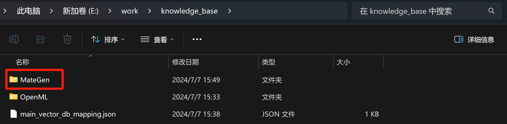

我们在MateGen文件夹中放置MateGen使用指南：

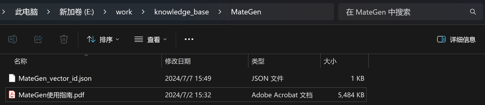

然后开启对话，这里需要注意的是，在切换知识库后，我们需要先清理MateGen历史对话消息，以免历史对话消息影响后续RAG质量：

```python
mategen.clear_messages()
```

```plaintext
已经清理历史消息
```

清理完历史消息后再进行知识库问答：

```python
mategen.chat('请检索你的知识库，并告诉我MateGen应该如何查看token消耗情况。')
```

```plaintext
正在创建知识库，请稍后...
正在创建知识库的向量存储，请稍后...
知识库创建完成！
已成功更新知识库MateGen
```

▌ MateGen初始化完成，欢迎使用！

为了查看MateGen的token消耗情况，您可以按照以下步骤进行操作：

1. **调用`print_usage`函数**：
   您可以通过调用 `mategen.print_usage()` 函数来查看当前token的消耗情况。此函数会打印出今日和总共消耗的token数量。

### 示例代码：

```python
# 初始化MateGen
api_key = 'your-api-key'
mategen = MateGenClass(api_key=api_key)

# 查看token使用情况
mategen.print_usage()
```

2. **查看输出**：
   运行上述代码后，系统将会输出类似如下的信息：

```plaintext
今日已消耗的 token 数量：8952
总共消耗的 token 数量：8952
```

通过这些步骤，MateGen能够有效地统计和展示token的使用情况，帮助用户更好地管理和优化资源【8:0†source】。

  然后随时可以切换回OpenML知识库进行问答，我们可以直接输入0，然后在知识库序号中选择OpenML进行问答即可：

```python
mategen = MateGenClass(api_key = 'YOUR_API_KEY', 
                       knowledge_base_chat=True)
```

```plaintext
正在初始化MateGen，请稍后...
成功连接服务器，API-KEY通过验证！


请输入知识库名称，输入0查询当前知识库列表。 0


知识库列表：
1. OpenML
2. MateGen


请选择一个知识库的序号： 1


知识库已存在，已启用该知识库
已完成初始化，MateGen可随时调用！
```

```python
mategen.chat('请检索你的知识库，并帮我介绍下网格搜索优化算法的优劣势')
```

▌ MateGen初始化完成，欢迎使用！

### 网格搜索优化算法的优劣势

#### 优势

1. **全面搜索**：

   * 网格搜索（Grid Search）通过在指定参数空间内的每一个可能组合上进行评估，从而确保找到相对最优的参数组合。这样的方法能确保不遗漏任何可能的最佳参数组合【8:0†source】。

2. **适用范围广泛**：

   * 网格搜索对所有类型的超参数调整均适用，无论是线性模型中的正则化系数，还是树模型中的最大深度参数，都可以使用网格搜索进行优化【8:0†source】。

3. **易于理解和实现**：

   * 网格搜索算法相对简单，便于理解和实现。用户只需要定义好评估器和参数空间，并设置交叉验证的方法，就可以自动化完成参数调整工作【8:1†source】。

4. **可视化与分析**：

   * 由于其遍历所有参数组合的特点，网格搜索的结果可以被用于绘制参数空间的性能图，对于理解参数对模型性能的影响非常有帮助【8:0†source】。

#### 劣势

1. **计算开销大**：

   * 网格搜索需要对参数空间内的每个组合进行评估，且在每个组合上都要执行交叉验证。因此其计算开销非常大，特别是在参数空间较大或数据集较大时【8:0†source】【8:1†source】。

2. **扩展性差**：

   * 随着参数空间的渐增，计算时间会呈指数增长。对于高维参数空间，网格搜索的方法显得过于笨重且难以扩展【8:1†source】。

3. **无随机性**：

   * 网格搜索会穷举所有可能的参数组合，这意味着计算资源被分配到所有的点，而不能集中在有潜力的参数组合上，可能会浪费大量的计算资源在一些不太可能是最佳解的参数组合上【8:0†source】。

4. **鲁棒性差**：

   * 网格搜索在参数取值范围和步长选择上可能需要大量的经验，如果范围设置不合理，匹配到的参数组合可能并非最优，导致性能不如随机搜索或进化算法【8:0†source】。

总结来说，网格搜索优化算法是一种确保全面探索参数空间的方法，但其高计算开销和扩展性缺点也限制了其在大型任务中的应用。在复杂或高维度的问题上，可以考虑使用更高效的随机搜索或贝叶斯优化方法【8:0†source】【8:1†source】。

并且由于MateGen本身是无限对话长度，因此哪怕现在没有调用MateGen使用方法知识库，但MateGen仍然可以读取此前对话记忆进行回答：

```python
mategen.chat('很好，你是否还记得MateGen应该如何查看token消耗来着？')
```

▌ MateGen初始化完成，欢迎使用！

记得，MateGen查看token消耗情况的步骤如下：

1. **调用`print_usage`函数**：
   您可以通过调用 `mategen.print_usage()` 函数来查看当前token的消耗情况。此函数会打印出今日和总共消耗的token数量。

### 示例代码：

```python
# 初始化MateGen
api_key = 'your-api-key'
mategen = MateGenClass(api_key=api_key)

# 查看token使用情况
mategen.print_usage()
```

2. **查看输出**：
   运行上述代码后，系统将会输出类似如下的信息：

```plaintext
今日已消耗的 token 数量：8952
总共消耗的 token 数量：8952
```

通过这些步骤，MateGen能够有效地统计和展示token的使用情况，帮助用户更好地管理和优化资源【8:0†source】。

#### 2.5 取消知识库问答

  关闭知识库问答功能也非常简单，再次实例化MateGen，并取消knowledge\_base\_chat设置：

```python
mategen = MateGenClass(api_key = 'YOUR_API_KEY')
```

```plaintext
正在初始化MateGen，请稍后...
成功连接服务器，API-KEY通过验证！
已完成初始化，MateGen可随时调用！
```

```python
mategen.clear_messages()
```

```plaintext
已经清理历史消息
```

### 3.借助MateGen实现NL2SQL

  MateGen可以连接MySQL数据库，并且可以稳定高效实现NL2SQL。无需额外手动设置，当系统检测到用户需要进行数据库相关操作时，MateGen就会自动开启NL2SQL功能，完成SQL代码编写和运行：

* 输入数据库基本参数

```python
mategen.chat('请帮我查看当前数据库中，总共有几张表。')
```

▌ MateGen初始化完成，欢迎使用！

请提供你当前使用的MySQL数据库连接信息，我将帮你获取所有表的信息。需要以下参数：

* 主机名（host）

* 用户名（user）

* 密码（password）

* 数据库名（database）

* 端口（port）

```python
mategen.chat('好的，host:localhost,port:3306,ueser:root,password:19920229,database name:telco_db')
```

▌ MateGen初始化完成，欢迎使用！

```plaintext
即将执行以下代码：
```

```sql
SHOW TABLES;
```

在数据库 `telco_db` 中，总共有 8 张表。具体表名如下：

1. user\_churn

2. user\_churn\_new

3. user\_demographics

4. user\_demographics\_new

5. user\_payments

6. user\_payments\_new

7. user\_services

8. user\_services\_new

* 数据库查询

```python
mategen.chat('请帮我查看下，这八张表中，四个不带_new尾缀的数据集，数据量是否相同。')
```

▌ MateGen初始化完成，欢迎使用！

```plaintext
即将执行以下代码：
```

```sql
SELECT COUNT(*) FROM user_churn;
```

```plaintext
即将执行以下代码：
```

```sql
SELECT COUNT(*) FROM user_demographics;
```

```plaintext
即将执行以下代码：
```

```sql
SELECT COUNT(*) FROM user_payments;
```

```plaintext
即将执行以下代码：
```

```sql
SELECT COUNT(*) FROM user_services;
```

这里是四个不带 `_new` 尾缀的数据集的数据量：

1. `user_churn`：5684 条记录

2. `user_demographics`：5353 条记录

3. `user_payments`：5634 条记录

4. `user_services`：5734 条记录

由此可见，这四个数据集的数据量并不相同。

如果你需要对这些数据集进行进一步的分析或查询，请告诉我！

* 数据查询

```python
mategen.chat('你做得很好，接下来请帮我在user_payments表中，查看月消费金额最高的用户ID，以及对应的总消费金额是多少。')
```

▌ MateGen初始化完成，欢迎使用！

```plaintext
即将执行以下代码：
```

```sql
SELECT customerID, MonthlyCharges FROM user_payments ORDER BY MonthlyCharges DESC LIMIT 1;
```

在 `user_payments` 表中，月消费金额最高的用户ID是 `5734-EJKXG`，其对应的月消费金额是 `118.6`。

如果你需要进一步的查询或分析，请随时告诉我！

* 数据读取

```python
mategen.chat('很好，接下来请帮我将user_churn表读取到当前文件夹中，并命名为user_churn.csv')
```

▌ MateGen初始化完成，欢迎使用！

```plaintext
即将执行以下代码：
```

```python
user_churn.to_csv('user_churn.csv', index=False)
```

操作已完成，`user_churn` 表已保存为 `user_churn.csv` 文件，并放置在当前文件夹中。

如果还有其他需要，请随时告诉我！

然后即可在当前代码运行文件夹内找到这个数据集：

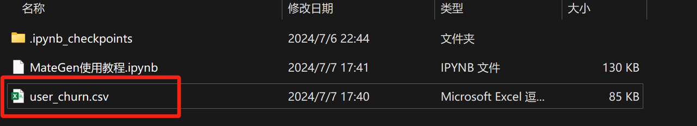

### 4.借助MateGen实现NL2Python：本地代码解释器实现流程

  MateGen还可以实现NL2Python，可以连接本地Python环境进行自动编程，进而辅助用户完成数据读取、数据预处理、数据建模、数据可视化等事项。

* 读取数据集

```python
mategen.chat('好的，接下来请帮我将当前文件夹内的user_churn.csv读取到当前Python环境中。')
```

▌ MateGen初始化完成，欢迎使用！

```plaintext
即将执行以下代码：
```

```python
import pandas as pd
user_churn_df = pd.read_csv('user_churn.csv')
user_churn_df.head()
```

`user_churn.csv` 文件已成功读取到当前 Python 环境中，并存储在 `user_churn_df` 变量中。显示的数据前几行如下：

| customerID | Churn |
| ---------- | ----- |
| 0002-ORFBO | No    |
| 0003-MKNFE | No    |
| 0004-TLHLJ | Yes   |
| 0011-IGKFF | Yes   |
| 0013-EXCHZ | Yes   |

如果你还有其他需求或者问题，请随时告诉我！

然后我们即可在当前操作空间中查看读取到的数据集：

```python
# 更新命名空间，即可在本地调用代码操作结果
globals().update(MateGen.export_variables())
user_churn_df.head()
```


|   | customerID | Churn |
| - | ---------- | ----- |
| 0 | 0002-ORFBO | No    |
| 1 | 0003-MKNFE | No    |
| 2 | 0004-TLHLJ | Yes   |
| 3 | 0011-IGKFF | Yes   |
| 4 | 0013-EXCHZ | Yes   |

* 数据可视化

```python
mategen.chat('好的，请用可视化的方式帮我分析下Churn字段的取值分布。')
```

▌ MateGen初始化完成，欢迎使用！

```plaintext
即将执行以下代码：
```

```python
import matplotlib.pyplot as plt
import seaborn as sns

plt.figure(figsize=(8, 6))
sns.countplot(data=user_churn_df, x='Churn', palette='viridis')
plt.title('Distribution of Churn Values')
plt.xlabel('Churn')
plt.ylabel('Count')
fig = plt.gcf()
```

```plaintext
<string>:5: FutureWarning: 

Passing `palette` without assigning `hue` is deprecated and will be removed in v0.14.0. Assign the `x` variable to `hue` and set `legend=False` for the same effect.


Figure uploaded to OSS as fig_5d60cbe9997b4626965676c2c87a66c0.png
已经成功运行代码，并已将代码创建的图片存储至：https://ml2022.oss-cn-hangzhou.aliyuncs.com/fig_5d60cbe9997b4626965676c2c87a66c0.png
```

下面是 `Churn` 字段的取值分布可视化图：

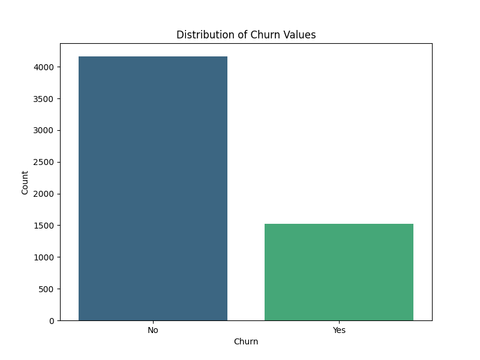

从图中可以看到，`Churn` 字段的取值分布。共有两类值，分别是"Yes"（表示用户流失）和"No"（表示用户未流失）。从图中可以对比出每类值的计数分布情况。

如果还有其他需求或分析，请随时告诉我！

  这里需要注意，当涉及到绘图任务的时候，若设置了阿里云图床，则MateGen会自动将图片上传至oss图床，并保存每张图片的公开访问网址，方便后续组合图片形成数据分析报告。

### 5.MateGen复杂任务规划执行与自动debug功能

  截止目前，我们介绍了MateGen的知识库问答、NL2SQL和NL2Python等功能，在继续介绍MateGen其他进阶功能之前，需要说明的是，MateGen的各项功能支持组合使用。当面对复杂任务的时候，MateGen会自动组合各项功能来构建执行流程，自动逐步执行任务，同时每一步遇到了任何问题都会自动debug。

* NL2SQL+NL2Python联动

  例如，我们可以让MateGen直接从MySQL中读取数据集到Python中并本地进行保存，这个简单的例子中就涉及到NL2SQL和NL2Python两个功能的串联实现。

```python
mategen.chat('接下来请帮我将数据库中user_payments读取到当前Python环境中，并在当前文件夹中保存一份user_payments.csv文件')
```

▌ MateGen初始化完成，欢迎使用！

```plaintext
即将执行以下代码：
```

```sql
SELECT * FROM user_payments
```

```plaintext
C:\ProgramData\anaconda3\lib\site-packages\MateGen\mateGenClass.py:1554: UserWarning: pandas only supports SQLAlchemy connectable (engine/connection) or database string URI or sqlite3 DBAPI2 connection. Other DBAPI2 objects are not tested. Please consider using SQLAlchemy.
  g[df_name] = pd.read_sql(sql_query, connection)


即将执行以下代码：
```

```python
user_payments_df.to_csv('user_payments.csv', index=False)
```

`user_payments` 表已成功读取到当前 Python 环境中，并存储在 `user_payments_df` 变量中。同时，该表已保存为 `user_payments.csv` 文件，并放置在当前文件夹中。

如果你有其他需求或问题，请随时告诉我！

* 知识库问答+NL2SQL+NL2Python

  同时，MateGen也支持在任何处理的环节即时查询知识库，这里我们创建一个telco\_db知识库，然后保存一份md文件，其中包含了各数据集字段信息和`重要字段`列表。我们尝试让MateGen先读取这个知识库，获取`重要字段`列表信息，然后再从各个数据集中获取`重要字段`列表组成一个新的数据集，并读取到本地：

```python
mategen = MateGenClass(api_key = 'YOUR_API_KEY', 
                       knowledge_base_chat=True)
```

```plaintext
正在初始化MateGen，请稍后...
成功连接服务器，API-KEY通过验证！


请输入知识库名称，输入0查询当前知识库列表。 telco_db


正在创建知识库文件夹
当前问答知识库文件夹路径：E:\work\knowledge_base\telco_db，请在文件夹中放置知识库文件。
目前支持PDF、Word、PPT、md等格式读取与检索。
已完成初始化，MateGen可随时调用！
```

其中telco\_db文件夹中放置如下文件：

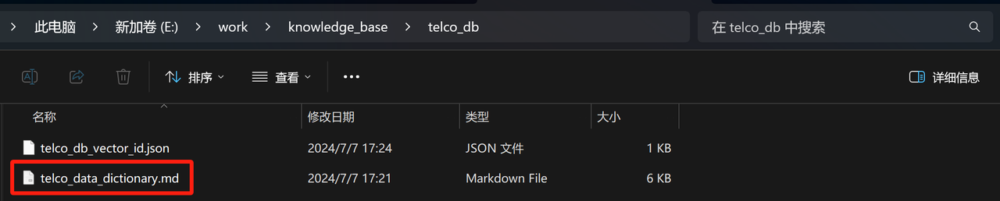

其中`telco_data_dictionary`内容包含了数据库中每个数据集中所包含的字段情况、以及`重要字段说明`如下：

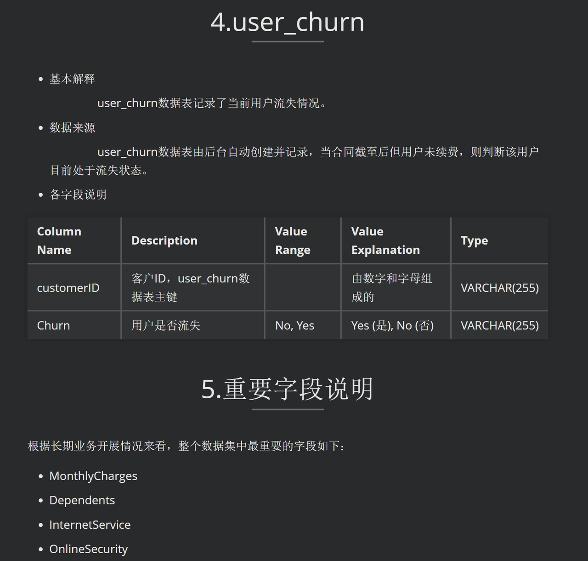

接下来让MateGen在这一系列数据集中提取关键字段：

```python
mategen.chat('请查阅你的知识库，确认数据集中最重要的字段，并帮我从不带尾缀_new的几张表中，挑选这些字段组成一张新的表，并保存在MySQL中，取名为telco')
```

```plaintext
正在创建知识库，请稍后...
正在创建知识库的向量存储，请稍后...
知识库创建完成！
已成功更新知识库telco_db
```

▌ MateGen初始化完成，欢迎使用！

```plaintext
即将执行以下代码：
```

```sql
SELECT customerID, Churn FROM user_churn
```

```plaintext
即将执行以下代码：


C:\ProgramData\anaconda3\lib\site-packages\MateGen\mateGenClass.py:1554: UserWarning: pandas only supports SQLAlchemy connectable (engine/connection) or database string URI or sqlite3 DBAPI2 connection. Other DBAPI2 objects are not tested. Please consider using SQLAlchemy.
  g[df_name] = pd.read_sql(sql_query, connection)
```

```sql
SELECT customerID, Dependents FROM user_demographics
```

```plaintext
即将执行以下代码：
```

```sql
SELECT customerID, Contract, PaperlessBilling, PaymentMethod, MonthlyCharges FROM user_payments
```

```plaintext
即将执行以下代码：
```

```sql
SELECT customerID, InternetService, OnlineSecurity, OnlineBackup, TechSupport FROM user_services
```

```plaintext
即将执行以下代码：
```

```python
import pandas as pd

# 合并表格
telco_df = pd.merge(user_churn, user_demographics, on='customerID', how='left')
telco_df = pd.merge(telco_df, user_payments, on='customerID', how='left')
telco_df = pd.merge(telco_df, user_services, on='customerID', how='left')

telco_df.to_csv('telco.csv', index=False)

telco_df.head()
```

```plaintext
即将执行以下代码：
```

```python
import pymysql

# 连接数据库
connection = pymysql.connect(
    host='localhost',
    user='root',
    password='19920229',
    db='telco_db'
)

try:
    with connection.cursor() as cursor:
        # 创建表telco
        create_table_query = '''
        CREATE TABLE telco (
            customerID VARCHAR(255) PRIMARY KEY,
            Churn VARCHAR(255),
            Dependents VARCHAR(255),
            Contract VARCHAR(255),
            PaperlessBilling VARCHAR(255),
            PaymentMethod VARCHAR(255),
            MonthlyCharges FLOAT,
            InternetService VARCHAR(255),
            OnlineSecurity VARCHAR(255),
            OnlineBackup VARCHAR(255),
            TechSupport VARCHAR(255)
        );
        '''
        cursor.execute(create_table_query)
        connection.commit()

        # 导入数据
        for index, row in telco_df.iterrows():
            insert_query = '''
            INSERT INTO telco (
                customerID, Churn, Dependents, Contract, PaperlessBilling, 
                PaymentMethod, MonthlyCharges, InternetService, 
                OnlineSecurity, OnlineBackup, TechSupport
            ) VALUES (%s, %s, %s, %s, %s, %s, %s, %s, %s, %s, %s)
            '''
            cursor.execute(insert_query, (
                row['customerID'], row['Churn'], row['Dependents'], row['Contract'], row['PaperlessBilling'], 
                row['PaymentMethod'], row['MonthlyCharges'], row['InternetService'], 
                row['OnlineSecurity'], row['OnlineBackup'], row['TechSupport']
            ))
        connection.commit()
finally:
    connection.close()

'Complete'
```

```plaintext
即将执行以下代码：
```

```python
import numpy as np

# 将NaN替换为None
cleaned_df = telco_df.replace({np.nan: None})
```

```plaintext
即将执行以下代码：
```

```python
import pymysql

# 连接数据库
connection = pymysql.connect(
    host='localhost',
    user='root',
    password='19920229',
    db='telco_db'
)

try:
    with connection.cursor() as cursor:
        # 创建表telco
        create_table_query = '''
        CREATE TABLE telco (
            customerID VARCHAR(255) PRIMARY KEY,
            Churn VARCHAR(255),
            Dependents VARCHAR(255),
            Contract VARCHAR(255),
            PaperlessBilling VARCHAR(255),
            PaymentMethod VARCHAR(255),
            MonthlyCharges FLOAT,
            InternetService VARCHAR(255),
            OnlineSecurity VARCHAR(255),
            OnlineBackup VARCHAR(255),
            TechSupport VARCHAR(255)
        );
        '''
        cursor.execute(create_table_query)
        connection.commit()

        # 导入数据
        for index, row in cleaned_df.iterrows():
            insert_query = '''
            INSERT INTO telco (
                customerID, Churn, Dependents, Contract, PaperlessBilling, 
                PaymentMethod, MonthlyCharges, InternetService, 
                OnlineSecurity, OnlineBackup, TechSupport
            ) VALUES (%s, %s, %s, %s, %s, %s, %s, %s, %s, %s, %s)
            '''
            cursor.execute(insert_query, (
                row['customerID'], row['Churn'], row['Dependents'], row['Contract'], row['PaperlessBilling'], 
                row['PaymentMethod'], row['MonthlyCharges'], row['InternetService'], 
                row['OnlineSecurity'], row['OnlineBackup'], row['TechSupport']
            ))
        connection.commit()
finally:
    connection.close()

'Complete'
```

```plaintext
即将执行以下代码：
```

```python
import pymysql

# 连接数据库
connection = pymysql.connect(
    host='localhost',
    user='root',
    password='19920229',
    db='telco_db'
)

try:
    with connection.cursor() as cursor:
        # 删除已存在表telco
        cursor.execute("DROP TABLE IF EXISTS telco")
        connection.commit()

        # 创建表telco
        create_table_query = '''
        CREATE TABLE telco (
            customerID VARCHAR(255) PRIMARY KEY,
            Churn VARCHAR(255),
            Dependents VARCHAR(255),
            Contract VARCHAR(255),
            PaperlessBilling VARCHAR(255),
            PaymentMethod VARCHAR(255),
            MonthlyCharges FLOAT,
            InternetService VARCHAR(255),
            OnlineSecurity VARCHAR(255),
            OnlineBackup VARCHAR(255),
            TechSupport VARCHAR(255)
        );
        '''
        cursor.execute(create_table_query)
        connection.commit()

        # 导入数据
        for index, row in cleaned_df.iterrows():
            insert_query = '''
            INSERT INTO telco (
                customerID, Churn, Dependents, Contract, PaperlessBilling, 
                PaymentMethod, MonthlyCharges, InternetService, 
                OnlineSecurity, OnlineBackup, TechSupport
            ) VALUES (%s, %s, %s, %s, %s, %s, %s, %s, %s, %s, %s)
            '''
            cursor.execute(insert_query, (
                row['customerID'], row['Churn'], row['Dependents'], row['Contract'], row['PaperlessBilling'], 
                row['PaymentMethod'], row['MonthlyCharges'], row['InternetService'], 
                row['OnlineSecurity'], row['OnlineBackup'], row['TechSupport']
            ))
        connection.commit()
finally:
    connection.close()

'Complete'
```

所有步骤已完成，新表 `telco` 已成功创建并导入数据。

如果你有其他需求或问题，请随时告诉我！

上述流程中，不仅涉及到RAG、NL2SQL、NL2Python，还涉及到自动debug过程，上述过程中第一次将新数据集写入MySQL时遇到了缺失值、第二次操作时由遇到了重名数据集、第三次才顺利将数据集写入。

然后即可查看当前操作空间中是否已经顺利读取该数据集：

```python
# 更新命名空间，即可在本地调用代码操作结果
globals().update(MateGen.export_variables())
telco_df.head()
```


|   | customerID | Churn | Dependents | Contract       | PaperlessBilling | PaymentMethod    | MonthlyCharges | InternetService | OnlineSecurity | OnlineBackup | TechSupport |
| - | ---------- | ----- | ---------- | -------------- | ---------------- | ---------------- | -------------- | --------------- | -------------- | ------------ | ----------- |
| 0 | 0002-ORFBO | No    | NaN        | One year       | Yes              | Mailed check     | 65.6           | DSL             | No             | Yes          | Yes         |
| 1 | 0003-MKNFE | No    | No         | Month-to-month | No               | Mailed check     | 59.9           | DSL             | No             | No           | No          |
| 2 | 0004-TLHLJ | Yes   | No         | Month-to-month | Yes              | Electronic check | 73.9           | Fiber optic     | No             | No           | No          |
| 3 | 0011-IGKFF | Yes   | No         | Month-to-month | Yes              | Electronic check | 98.0           | Fiber optic     | No             | Yes          | No          |
| 4 | 0013-EXCHZ | Yes   | No         | Month-to-month | Yes              |                  | 83.9           | Fiber optic     | No             | No           | Yes         |

数据集中关键字段和知识库中列举关键字段一致：

```python
telco_df.columns
```

```plaintext
Index(['customerID', 'Churn', 'Dependents', 'Contract', 'PaperlessBilling',
       'PaymentMethod', 'MonthlyCharges', 'InternetService', 'OnlineSecurity',
       'OnlineBackup', 'TechSupport'],
      dtype='object')
```


数据库中也成功保存了telco数据集：

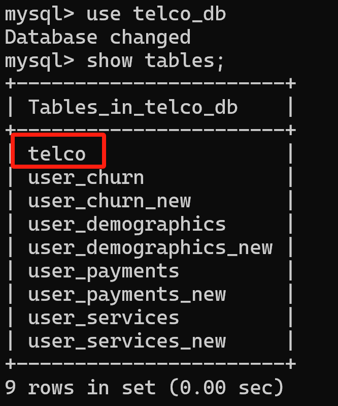

```python
mategen.clear_messages()
```

```plaintext
已经清理历史消息
```

### 6.MateGen视觉能力

  MateGen具备视觉能力，只需要在提问时附带图片连接，就可以调用MateGen的视觉能力、围绕图片进行识别再进行回答：


```python
mategen.chat('请帮我描述下这张图片上的内容：https://ml2022.oss-cn-hangzhou.aliyuncs.com/img/image-20240707212637973.png')
```

▌ MateGen初始化完成，欢迎使用！

```plaintext
正在对图像内容进行识别...
```

这张图片展示了在海滩上演奏音乐的场景。左边和右边的两个人分别拿着吉他，而摆在中间的人站在麦克风前唱歌。背景是一片美丽的海景，有一些绿树和海水。天色看起来是傍晚或者清晨，光线柔和，整体氛围显得非常轻松愉快。

* MateGen视觉+NL2Python联动

  同样，MateGen的视觉功能可以和别的功能联动，例如我们可以给MateGen输入一张图片，然后让其模仿绘制一张新的图，并且可以直接通过对话来修改图片。例如有张图片如下：

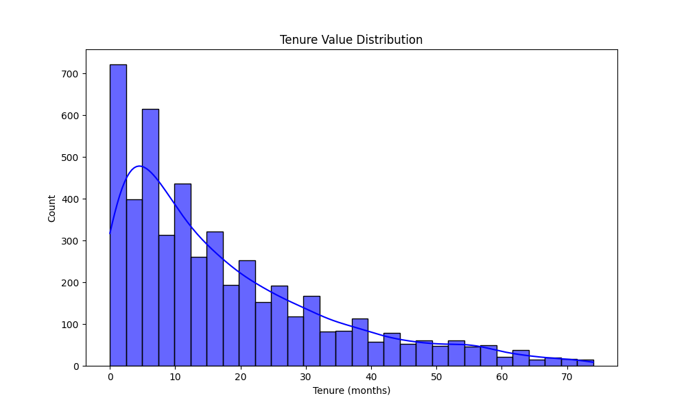

接下来让MateGen先读取该图片，再借助其Python代码解释器，绘制一张一样的图片。

```python
mategen.chat('请帮我描述下这张图片上的内容：https://ml2022.oss-cn-hangzhou.aliyuncs.com/fig_b92cda8f15534922a7ef72ff329146fb.png')
```

▌ MateGen初始化完成，欢迎使用！

```plaintext
正在对图像内容进行识别...
```

这张图片展示了一个关于“任期价值分布”（Tenure Value Distribution）的直方图，用以显示不同月份的用户任期分布情况。具体内容如下：

* **X轴 （横轴）**：代表“任期（月）”（Tenure (months)），范围从0到70。

* **Y轴 （纵轴）**：代表“计数”（Count），范围从0到700以上。

图中主要部分包含：

1. **蓝色柱状图**：表示不同任期长度的计数。任期在0到5个月之间的用户数量最多，超过700人。随着任期的增加，用户数量逐渐减少。任期达到70个月及以上的用户数量最少。

2. **光滑曲线**：蓝色光滑曲线表示数据的分布趋势。曲线在任期为0到5个月处达到峰值，然后逐渐下降，与柱状图的趋势一致。

从整体上看，图表反映了短期任期（如0到5个月）的用户数量远远多于长期任期的用户。短期用户的集中度非常高，而中长期用户显著减少。

这展示出用户在短期内流失较为严重。

```python
mategen.chat('非常好！现在，请基于你对这张图片的理解，使用Python代码帮我创建一组数据，使其满足图片上的数据分布，并编写一段Python绘图代码，绘制类似的图片，并直接运行你编写的代码。')
```

▌ MateGen初始化完成，欢迎使用！

```plaintext
即将执行以下代码：
```

```python
import numpy as np
import pandas as pd
import matplotlib.pyplot as plt
import seaborn as sns

# 设置随机种子
np.random.seed(42)

# 自定义概率分布，多数集中在短期
prob = np.concatenate([
    np.linspace(0.2, 0.1, 10),  # 0-9个月
    np.linspace(0.1, 0.05, 10),  # 10-19个月
    np.linspace(0.05, 0.02, 10), # 20-29个月
    np.ones(40) * 0.01            # 30-69个月
])

# 标准化，使总和为1
prob /= prob.sum()

# 创建数据分布
tenure_data = np.random.choice(np.arange(70), size=1100, p=prob)

# 创建 DataFrame
df_tenure = pd.DataFrame(tenure_data, columns=['Tenure'])

# 绘图
fig, ax = plt.subplots(figsize=(10, 6))
sns.histplot(df_tenure['Tenure'], bins=70, kde=True, color='blue', ax=ax)
ax.set_title('Tenure Value Distribution')
ax.set_xlabel('Tenure (months)')
ax.set_ylabel('Count')
ax.grid(True)
plt.show()
```

```plaintext
<string>:33: UserWarning: FigureCanvasAgg is non-interactive, and thus cannot be shown


Figure uploaded to OSS as fig_000fb565989f4bfc862c77ccd5d977a9.png
已经成功运行代码，并已将代码创建的图片存储至：https://ml2022.oss-cn-hangzhou.aliyuncs.com/fig_000fb565989f4bfc862c77ccd5d977a9.png
```

根据这个图片的理解，我已经创建了一组满足类似分布的数据，并绘制了相应的图表。点击以下链接查看生成的图片：

[任期值分布图](https://ml2022.oss-cn-hangzhou.aliyuncs.com/fig_000fb565989f4bfc862c77ccd5d977a9.png)

如果还有其他需要，随时告诉我！

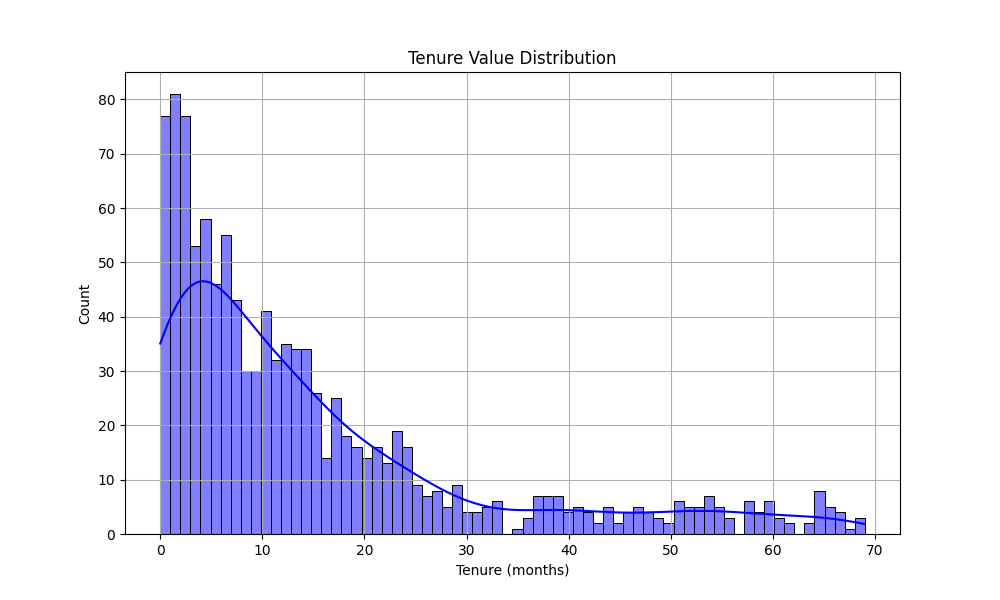

可以看出基本能够对原图进行模仿绘制。接下来尝试对其进行修改，同样，我们让MateGen先参考一张图的配色，然后修改原图。参考图片如下：


```python
mategen.chat('我觉这张图片颜色不够好看，请帮我参考这张图片上的主配色：https://ml2022.oss-cn-hangzhou.aliyuncs.com/img/image-20240701222610915.png，调整原图配色。')
```

▌ MateGen初始化完成，欢迎使用！

```plaintext
正在对图像内容进行识别...
即将执行以下代码：
```

```python
import numpy as np
import pandas as pd
import matplotlib.pyplot as plt
import seaborn as sns

# 设置随机种子
np.random.seed(42)

# 自定义概率分布，多数集中在短期
prob = np.concatenate([
    np.linspace(0.2, 0.1, 10),  # 0-9个月
    np.linspace(0.1, 0.05, 10),  # 10-19个月
    np.linspace(0.05, 0.02, 10), # 20-29个月
    np.ones(40) * 0.01            # 30-69个月
])

# 标准化，使总和为1
prob /= prob.sum()

# 创建数据分布
tenure_data = np.random.choice(np.arange(70), size=1100, p=prob)

# 创建 DataFrame
df_tenure = pd.DataFrame(tenure_data, columns=['Tenure'])

# 设置配色风格
purple_pink = sns.color_palette("ch:s=-.2,r=.6", 10)

# 绘图
fig, ax = plt.subplots(figsize=(10, 6))
sns.histplot(df_tenure['Tenure'], bins=70, kde=True, color=purple_pink[2], ax=ax)
ax.set_title('Tenure Value Distribution', fontsize=16)
ax.set_xlabel('Tenure (months)', fontsize=14)
ax.set_ylabel('Count', fontsize=14)
ax.tick_params(axis='both', which='major', labelsize=12)
ax.grid(True)
plt.show()
```

```plaintext
<string>:37: UserWarning: FigureCanvasAgg is non-interactive, and thus cannot be shown


Figure uploaded to OSS as fig_cbff2d672db84074bd5fb6795e309818.png
已经成功运行代码，并已将代码创建的图片存储至：https://ml2022.oss-cn-hangzhou.aliyuncs.com/fig_cbff2d672db84074bd5fb6795e309818.png
```

我已经参考了图片中的淡紫色和粉红色的配色，并重新生成了新的图表。点击以下链接查看新的图片：

[任期值分布图（新的配色）](https://ml2022.oss-cn-hangzhou.aliyuncs.com/fig_cbff2d672db84074bd5fb6795e309818.png)

请查看并告诉我是否符合你的期望，或者需要进一步调整。

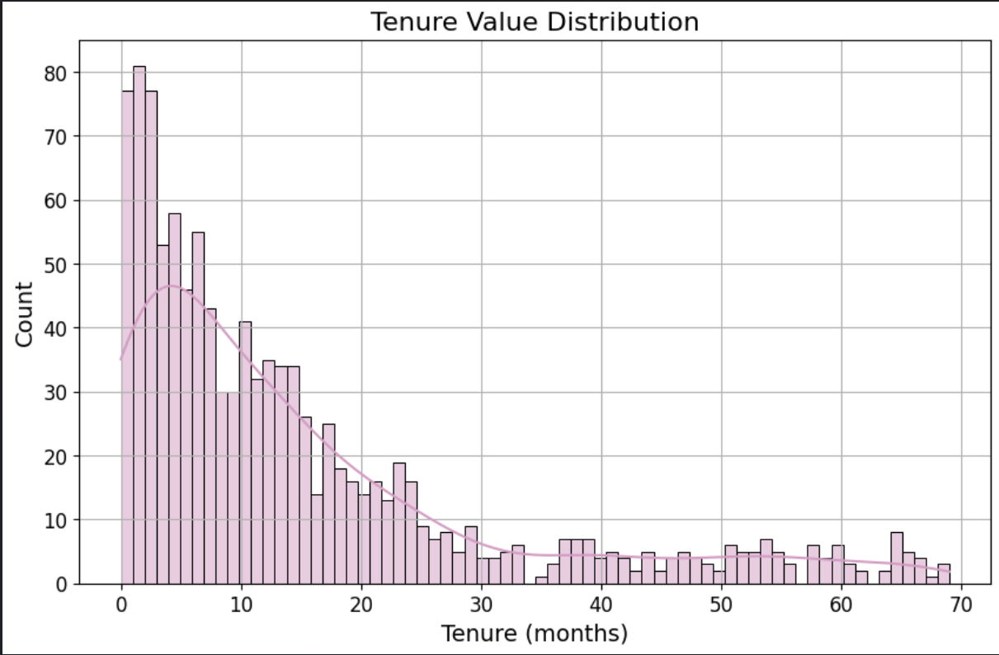

### 7.MateGen联网能力

#### 7.1 MateGen联网功能实现

  MateGen自带联网功能，当用户的问题超出MateGen知识库时，MategGen就会开启联网功能，从互联网上获取答案。MateGen的互联网搜索由谷歌搜索API驱动（但无需联网工具即可使用），会从知乎、Github获取相关信息，更适合获取技术相关信息。同时，MateGen还可以调用Kaggle API，若用户有需求，可以从Kaggle上获取竞赛说明和热门Kernel方案构建知识库再来进行问答。

```python
mategen.chat('请帮我介绍下阿里云最新发布的Qwen2大模型。')
```

▌ MateGen初始化完成，欢迎使用！

```plaintext
正在接入谷歌搜索，并在GitHub上搜索相关项目...
正在读取相关项目说明文档...
正在进行最后的整理...
```

阿里云最新发布的Qwen2大模型是Qwen1.5的演变后续，提供了一系列增强和优化。以下是概述：

### Qwen2大模型的主要特点

1. **多尺寸预训练和指令微调模型**：

   * Qwen2-0.5B

   * Qwen2-1.5B

   * Qwen2-7B

   * Qwen2-57B-A14B

   * **Qwen2-72B**

2. **多语言支持**：

   * 训练数据涵盖了除英语和中文外的**27种**额外语言。

3. **性能提升**：

   * 在大多数基准评估中，性能达到了世界领先水平。

   * 在编程和数学方面的性能显著提升。

4. **上下文长度支持**：

   * Qwen2-7B-Instruct和Qwen2-72B-Instruct模型支持上下文长度扩展到**128K** tokens。

### 最新发布

* **2024年6月6日**：发布Qwen2系列。详细信息可参考[博客](https://qwenlm.github.io/blog/qwen2/)。

* **2024年3月28日**：发布Qwen1.5-MoE-A2.7B，这是Qwen系列中的首个MoE模型，目前支持HF transformers和vLLM。

### 使用说明

#### Hugging Face Transformers

```python
from transformers import AutoModelForCausalLM, AutoTokenizer

model_name = "Qwen/Qwen2-7B-Instruct"
device = "cuda"  # 加载模型的设备

model = AutoModelForCausalLM.from_pretrained(
    model_name,
    torch_dtype="auto",
    device_map="auto"
)
tokenizer = AutoTokenizer.from_pretrained(model_name)

prompt = "Give me a short introduction to large language model."
messages = [
    {"role": "system", "content": "You are a helpful assistant."},
    {"role": "user", "content": prompt}
]
text = tokenizer.apply_chat_template(
    messages,
    tokenize=False,
    add_generation_prompt=True
)
model_inputs = tokenizer([text], return_tensors="pt").to(device)

generated_ids = model.generate(
    **model_inputs,
    max_new_tokens=512
)
generated_ids = [
    output_ids[len(input_ids):] for input_ids, output_ids in zip(model_inputs.input_ids, generated_ids)
]

response = tokenizer.batch_decode(generated_ids, skip_special_tokens=True)[0]
```

#### 部署支持

Qwen2模型支持多种推理框架，包括vLLM和SGLang。

更多详细信息可以参考[Qwen的文档](https://qwen.readthedocs.io)以及使用示例中的代码片段。

### 其他资源

* Hugging Face: [Qwen](https://huggingface.co/Qwen)

* ModelScope: [Qwen2](https://modelscope.cn/organization/qwen)

* 博客: [Qwen Blog](https://qwenlm.github.io)

* 文档: [Qwen Documentation](https://qwen.readthedocs.io)

若需进一步了解Qwen2的详细信息，建议直接参考上述资源，以获取最新和最全面的信息。

```python
mategen.chat('Qwen2可以用vLLM部署么？流程是什么样的呢？')
```

▌ MateGen初始化完成，欢迎使用！

Qwen2可以使用vLLM进行部署。以下是使用vLLM部署Qwen2模型的详细步骤：

### 步骤1：安装vLLM

首先，确保你已经安装了最新版本的vLLM（建议使用vLLM>=0.4.0），可以通过pip进行安装：

```bash
pip install -U vllm
```

### 步骤2：启动vLLM API服务

你需要启动一个API服务器来提供OpenAI兼容的API服务。使用Qwen2-7B-Instruct模型作为示例，运行以下命令：

```bash
python -m vllm.entrypoints.openai.api_server --served-model-name Qwen2-7B-Instruct --model Qwen/Qwen2-7B-Instruct
```

### 步骤3：使用Chat API进行交互

一旦API服务启动，你可以通过HTTP请求与其交互。例如，可以使用curl命令向API服务器发送请求：

```bash
curl http://localhost:8000/v1/chat/completions \
    -H "Content-Type: application/json" \
    -d '{
    "model": "Qwen2-7B-Instruct",
    "messages": [
    {"role": "system", "content": "You are a helpful assistant."},
    {"role": "user", "content": "Tell me something about large language models."}
    ]
    }'
```

也可以在Python中使用OpenAI库进行调用，这里演示如何调用API并进行交互：

```python
import openai

# 设置OpenAI的API密钥和API基地址以使用vLLM的API服务器
openai.api_key = "EMPTY"  # 需要设置一个任意字符串，因为这是必需的但会被忽略
openai.api_base = "http://localhost:8000/v1"

response = openai.ChatCompletion.create(
    model="Qwen2-7B-Instruct",
    messages=[
        {"role": "system", "content": "You are a helpful assistant."},
        {"role": "user", "content": "Tell me something about large language models."},
    ]
)

print("Chat response:", response.choices[0].message["content"])
```

### 注意事项

* 确保在启动API服务器时，指定的模组名称（如`Qwen2-7B-Instruct`）正确，无任何拼写错误。

* 运行Python脚本或curl命令前，请确保vLLM API服务正在运行且可以访问。

通过以上步骤，你就可以成功在本地环境中使用vLLM部署并访问Qwen2大模型。若遇到任何问题或有进一步的需求，请随时告诉我。

  搜索问答的本质是爬取信息创建本地知识库，然后再进行回答，只要开启搜索就会创建一个临时文件夹，并取名为`auto_search`，保存在`knowledge_base`中：


#### 7.2 MateGen Kaggle竞赛辅导功能

  除了能够适时开启联网功能并进行搜索问答外，MateGen还专门围绕Kaggle竞赛信息获取进行了优化。当用户希望了解某项竞赛信息时，只需要在MateGen参数位上输入`kaggle_competition_guidance=True`即可，并在弹出的对话框中输入感兴趣的Kaggle竞赛名称，MateGen就会自动使用Kaggle API，获取该项比赛的Overview（概览信息）、Data（数据集信息）以及热门Kernels（其他参赛者热门竞赛方案），并在本地创建竞赛同名知识库，并自动开启围绕当前竞赛知识库的问答功能。例如我们想要了解Kaggle上的一项名为`House Prices - Advanced Regression Techniques`比赛，即可按照如下方式执行：


```python
mategen = MateGenClass(api_key=api_key, 
                       kaggle_competition_guidance=True)
```

```plaintext
正在初始化，请稍后...
成功连接服务器，API-KEY通过验证，已完成初始化，祝使用愉快！


请输入竞赛名称 House Prices - Advanced Regression Techniques


已找到指定竞赛House Prices - Advanced Regression Techniques，正在检索支持库是否存在竞赛信息...
正在准备构建知识库...
正在获取竞赛说明及数据集说明...
正在获取House Prices - Advanced Regression Techniques竞赛热门kernel...
知识文档创建完成，正在进行词向量化处理与存储，请稍后...
正在创建知识库，请稍后...
正在创建知识库的向量存储，请稍后...
知识库创建完成！
已顺利完成Kaggle竞赛知识库创建，后续可调用知识库回答。
```

此时当前竞赛的本地知识库位置如下：

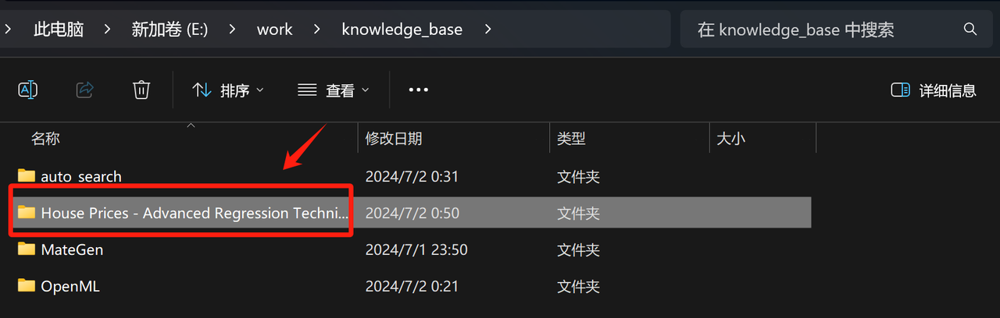

获取的竞赛知识库文件如下，其中包含了比赛介绍、数据集介绍和热门竞赛方案：

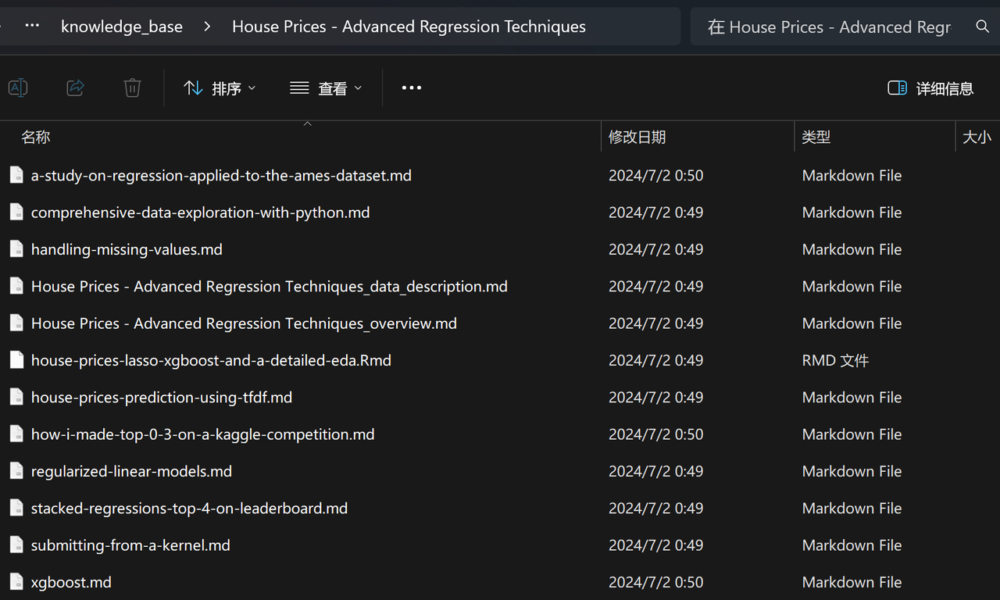

接下来MateGen会自动带入该知识库进行问答，从而顺利完成竞赛辅导工作：

```python
mategen.chat('请检索知识库，帮我详细介绍下House Prices这个竞赛')
```

▌ MateGen初始化完成，欢迎使用！

九天老师的公开课中提到的“House Prices”竞赛是一个经典的回归问题竞赛。以下是该竞赛的详细介绍：

### 竞赛背景

“House Prices”竞赛致力于通过分析各种房屋特征，建立一个模型来预测房屋的销售价格。竞赛提供了一组训练数据集，包含房屋的各种属性和相应的销售价格，以及一组测试数据集，需要根据训练好的模型来预测这些测试集房屋的价格。

### 特征和数据

数据集中包含79个解释变量，它们描述了埃姆斯市（Ames, Iowa）住宅属性的几乎所有方面。这些变量包括总体建筑面积、年份、房间数量、地块面积、内部条件等。

### 评价指标

该竞赛采用均方根误差（Root Mean Squared Error, RMSE）作为评价指标。即：
\[ \text{RMSE} = \sqrt{\frac{1}{n} \sum\_{i=1}^{n} (\hat{y}\_i - y\_i)^2} ]
其中，(\hat{y}\_i)表示预测值，(y\_i)表示实际值，(n)表示样本数量。

### 建模过程

1. **数据预处理**：

   * 缺失值处理：对数据集中存在的缺失值进行填补或删除；

   * 特征工程：包括特征选择、特征提取及特征变换等。

2. **模型构建与训练**：

   * 基于训练数据，利用不同的机器学习算法（如线性回归、决策树、随机森林和梯度提升树等）进行模型的训练。

3. **模型评估与优化**：

   * 利用交叉验证（Cross-Validation）对模型进行评估；

   * 利用网格搜索等超参数优化方法，对模型的参数进行调优，以获得最优的模型性能。

4. **模型预测与提交**：

   * 利用训练好的模型，对测试集进行预测，生成提交文件进行评分。

### 具体实现示例

下面是利用Python和sklearn进行House Prices预测的一个简单示例：

```python
import pandas as pd
from sklearn.model_selection import train_test_split
from sklearn.ensemble import RandomForestRegressor
from sklearn.metrics import mean_squared_error
import numpy as np

# 读取数据
train = pd.read_csv('train.csv')
test = pd.read_csv('test.csv')

# 特征选择和数据预处理
X = train.drop(['SalePrice', 'Id'], axis=1)
y = train['SalePrice']

# 简单的数值型特征填充
X = X.select_dtypes(include=[np.number]).fillna(X.mean())

# 数据集拆分
X_train, X_val, y_train, y_val = train_test_split(X, y, test_size=0.2, random_state=42)

# 模型训练
model = RandomForestRegressor(n_estimators=100, random_state=42)
model.fit(X_train, y_train)

# 模型评估
y_pred = model.predict(X_val)
rmse = np.sqrt(mean_squared_error(y_val, y_pred))
print(f'Validation RMSE: {rmse}')

# 预测测试集
test = test.select_dtypes(include=[np.number]).fillna(X.mean())
predictions = model.predict(test.drop('Id', axis=1))

# 生成提交文件
submission = pd.DataFrame({'Id': test['Id'], 'SalePrice': predictions})
submission.to_csv('submission.csv', index=False)
```

### 竞赛优点

* 丰富的数据集：丰富的特征变量，为特征工程和模型构建提供了充分的数据支持；

* 实践性强：房价预测是一个现实中的常见问题，通过该竞赛可以很好地将理论与实践结合；

* 对模型能力的全面考察：竞赛不仅考察选手的数据预处理和特征工程能力，还深入考察模型构建、参数调优及结果分析能力。

### 结论

通过参与“House Prices”竞赛，选手能够完整地体验一个机器学习项目的全流程，有助于提升其实践能力和理论水平。

【12:2†source】【12:16†source】【12:19†source】

```python
mategen.chat('在你的知识库中，有什么比较精彩的高分竞赛方案么？能帮我分享下他们的思路么？')
```

▌ MateGen初始化完成，欢迎使用！

九天老师的公开课课件中提供了几份高分竞赛方案，每个方案均有其独特的思路和方法。这里以其中一份竞赛方案为例，详细介绍其思路。

### 高分竞赛方案思路

**竞赛名称**：House Prices: Advanced Regression Techniques

1. **特征工程**：

   * **缺失值处理**：处理数据集中缺失值的部分，例如使用中位数或均值填补数值型变量的缺失值，使用众数填补类别型变量的缺失值。

   * **特征变换**：对数值型特征进行变换，包括对数变换、Box-Cox变换等，以减少特征的偏态分布。

   * **构造新特征**：结合现有特征生成新特征，例如将每个房屋的建成年份和翻新年份结合生成“房龄”特征。

2. **模型选择与训练**：

   * **单模型训练**：

     * 使用多种回归算法训练模型，包括线性回归、Ridge回归、Lasso回归、弹性网络回归、随机森林回归、梯度提升树（Gradient Boosting Machine, GBM）等。

   * **集成学习**：

     * 采用Stacking的方法，将多个基础模型的预测结果作为新特征，进一步训练元模型（Meta Learner），常用Logistic Regression或GBR作为元模型训练。

3. **模型评估与选择**：

   * **交叉验证**：使用交叉验证（Cross-Validation）评估模型性能，选择性能最佳的模型。

   * **模型调优**：通过网格搜索（Grid Search）或随机搜索（Random Search）等方法优化模型超参数，进一步提升模型性能。

4. **预测与结果提交**：

   * 使用训练好的最优模型对测试数据集进行预测，生成预测结果。

   * 预测结果与实际销售价格进行比较，计算均方根误差（Root Mean Squared Error, RMSE）作为评价指标。

5. **代码示例**：

```python
import pandas as pd
import numpy as np
from sklearn.model_selection import train_test_split, cross_val_score
from sklearn.linear_model import Ridge, Lasso
from sklearn.ensemble import RandomForestRegressor, GradientBoostingRegressor
from sklearn.metrics import mean_squared_error
from sklearn.pipeline import make_pipeline
from sklearn.preprocessing import RobustScaler

# 读取数据
train = pd.read_csv('train.csv')
test = pd.read_csv('test.csv')

# 特征工程示例
train['TotalSF'] = train['TotalBsmtSF'] + train['1stFlrSF'] + train['2ndFlrSF']
test['TotalSF'] = test['TotalBsmtSF'] + test['1stFlrSF'] + test['2ndFlrSF']
y = train['SalePrice']

# 特征选择及划分训练与验证集
X = train.drop(['SalePrice', 'Id'], axis=1).select_dtypes(include=[np.number]).fillna(0)
X_train, X_val, y_train, y_val = train_test_split(X, y, test_size=0.2, random_state=42)

# 构建模型
models = [
    make_pipeline(RobustScaler(), Lasso(alpha=0.0005, random_state=1)),
    make_pipeline(RobustScaler(), Ridge(alpha=1.0)),
    RandomForestRegressor(n_estimators=100, random_state=1),
    GradientBoostingRegressor(n_estimators=3000, learning_rate=0.05, max_depth=4, 
                              max_features='sqrt', min_samples_leaf=15, min_samples_split=10, 
                              loss='huber', random_state =5)
]

# 评估模型
for model in models:
    model.fit(X_train, y_train)
    score = cross_val_score(model, X_train, y_train, cv=5, scoring='neg_mean_squared_error')
    print(f"{model.steps[0][0]} RMSE: {np.sqrt(-score.mean())}")

# 最优模型预测
final_model = models[3]
final_model.fit(X_train, y_train)
y_pred = final_model.predict(X_val)
rmse = np.sqrt(mean_squared_error(y_val, y_pred))
print(f'Validation RMSE: {rmse}')

# 测试集预测及生成提交文件
X_test = test.drop(['Id'], axis=1).select_dtypes(include=[np.number]).fillna(0)
test_preds = final_model.predict(X_test)
submission = pd.DataFrame({'Id': test['Id'], 'SalePrice': test_preds})
submission.to_csv('submission.csv', index=False)
```

### 小结

通过以上竞赛思路，可以看到：

* 详细的特征工程处理和高效的特征选择是高分方案的基础。

* 多模型训练和集成学习提升了模型的预测能力和稳健性。

* 通过交叉验证和网格搜索等方法调整模型超参数，确保模型的最优性能。

这种系统化的方法不仅适用于House Prices竞赛，亦可适用于其他类似的回归问题。

***

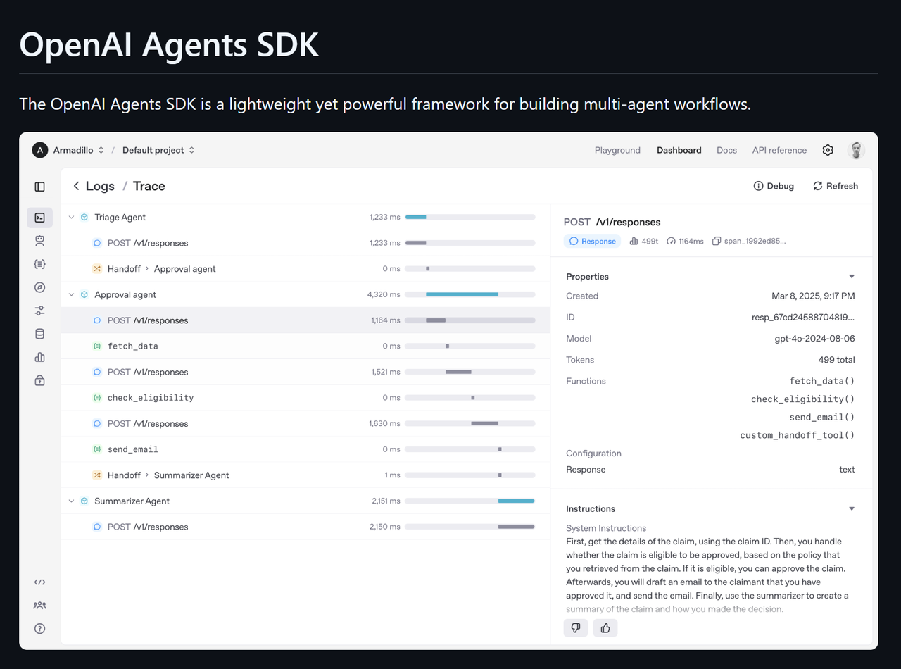

2025年3月11号，OpenAI召开发布会，正式发布全新一代底层调用API：Responses API，并计划在未来一段时间，逐渐代替Chat.Completion API，在如今OpenAI的大模型调用方法已成为业内标准的今天，这一次更新，无疑将对未来的大模型开发生态带来重大影响。

  随着发布会一同发布的，还有三项Agent tools和一个开源Agent SDK，分别是：

* Web Search：允许用户联网搜索相关信息；

* File Search：允许用户将文件上传到OpenAI服务器上，并在模型对话时，实时对其进行检索；

* computer use：允许用户借助大模型功能，来操作当前电脑或浏览器。

* Agent SDK：swarm的升级版，一个开源的Multi-Agent开发框架。

对此，我曾专门录制视频进行入门介绍，感兴趣的同学可以戳此观看：https://www.bilibili.com/video/BV1SVQEYqERV/


```python
!pip install openai
```

```plaintext
Looking in indexes: http://mirrors.aliyun.com/pypi/simple
Requirement already satisfied: openai in /root/miniconda3/lib/python3.12/site-packages (1.66.3)
Requirement already satisfied: anyio<5,>=3.5.0 in /root/miniconda3/lib/python3.12/site-packages (from openai) (4.6.2.post1)
Requirement already satisfied: distro<2,>=1.7.0 in /root/miniconda3/lib/python3.12/site-packages (from openai) (1.9.0)
Requirement already satisfied: httpx<1,>=0.23.0 in /root/miniconda3/lib/python3.12/site-packages (from openai) (0.27.2)
Requirement already satisfied: jiter<1,>=0.4.0 in /root/miniconda3/lib/python3.12/site-packages (from openai) (0.8.2)
Requirement already satisfied: pydantic<3,>=1.9.0 in /root/miniconda3/lib/python3.12/site-packages (from openai) (2.10.6)
Requirement already satisfied: sniffio in /root/miniconda3/lib/python3.12/site-packages (from openai) (1.3.1)
Requirement already satisfied: tqdm>4 in /root/miniconda3/lib/python3.12/site-packages (from openai) (4.67.1)
Requirement already satisfied: typing-extensions<5,>=4.11 in /root/miniconda3/lib/python3.12/site-packages (from openai) (4.12.2)
Requirement already satisfied: idna>=2.8 in /root/miniconda3/lib/python3.12/site-packages (from anyio<5,>=3.5.0->openai) (3.7)
Requirement already satisfied: certifi in /root/miniconda3/lib/python3.12/site-packages (from httpx<1,>=0.23.0->openai) (2025.1.31)
Requirement already satisfied: httpcore==1.* in /root/miniconda3/lib/python3.12/site-packages (from httpx<1,>=0.23.0->openai) (1.0.7)
Requirement already satisfied: h11<0.15,>=0.13 in /root/miniconda3/lib/python3.12/site-packages (from httpcore==1.*->httpx<1,>=0.23.0->openai) (0.14.0)
Requirement already satisfied: annotated-types>=0.6.0 in /root/miniconda3/lib/python3.12/site-packages (from pydantic<3,>=1.9.0->openai) (0.7.0)
Requirement already satisfied: pydantic-core==2.27.2 in /root/miniconda3/lib/python3.12/site-packages (from pydantic<3,>=1.9.0->openai) (2.27.2)
WARNING: Running pip as the 'root' user can result in broken permissions and conflicting behaviour with the system package manager. It is recommended to use a virtual environment instead: https://pip.pypa.io/warnings/venv

```

```python
import openai
```

```python
openai.__version__
```

```plaintext
'1.66.3'
```

```python
from openai import OpenAI
```

* 传统chat.completion API调用方法回顾

```python
openai_api_key = "YOUR_API_KEY"
```

```python
base_url = "国内反向代理地址"
```

```python
# 实例化客户端
client = OpenAI(api_key=openai_api_key, 
                base_url=base_url)
```

```python
# 调用 GPT-4o-mini 模型
response = client.chat.completions.create(
    model="gpt-4o-mini",
    messages=[
        {"role": "user", "content": "你好，好久不见!"}
    ]
)
```

```python
response
```

```plaintext
ChatCompletion(id='chatcmpl-BAxh80cMoWVaAYMsZx5BwWGyC6ref', choices=[Choice(finish_reason='stop', index=0, logprobs=None, message=ChatCompletionMessage(content='你好！很高兴见到你！你最近怎么样？有什么我可以帮助你的吗？', refusal=None, role='assistant', annotations=[], audio=None, function_call=None, tool_calls=None))], created=1741952446, model='gpt-4o-mini-2024-07-18', object='chat.completion', service_tier='default', system_fingerprint='fp_06737a9306', usage=CompletionUsage(completion_tokens=21, prompt_tokens=13, total_tokens=34, completion_tokens_details=CompletionTokensDetails(accepted_prediction_tokens=0, audio_tokens=0, reasoning_tokens=0, rejected_prediction_tokens=0), prompt_tokens_details=PromptTokensDetails(audio_tokens=0, cached_tokens=0)))
```

* Agent SDK安装流程

```python
!pip install openai-agents
```

```plaintext
Looking in indexes: http://mirrors.aliyun.com/pypi/simple
Requirement already satisfied: openai-agents in /root/miniconda3/lib/python3.12/site-packages (0.0.4)
Requirement already satisfied: griffe<2,>=1.5.6 in /root/miniconda3/lib/python3.12/site-packages (from openai-agents) (1.6.0)
Requirement already satisfied: openai>=1.66.2 in /root/miniconda3/lib/python3.12/site-packages (from openai-agents) (1.66.3)
Requirement already satisfied: pydantic<3,>=2.10 in /root/miniconda3/lib/python3.12/site-packages (from openai-agents) (2.10.6)
Requirement already satisfied: requests<3,>=2.0 in /root/miniconda3/lib/python3.12/site-packages (from openai-agents) (2.32.3)
Requirement already satisfied: types-requests<3,>=2.0 in /root/miniconda3/lib/python3.12/site-packages (from openai-agents) (2.32.0.20250306)
Requirement already satisfied: typing-extensions<5,>=4.12.2 in /root/miniconda3/lib/python3.12/site-packages (from openai-agents) (4.12.2)
Requirement already satisfied: colorama>=0.4 in /root/miniconda3/lib/python3.12/site-packages (from griffe<2,>=1.5.6->openai-agents) (0.4.6)
Requirement already satisfied: anyio<5,>=3.5.0 in /root/miniconda3/lib/python3.12/site-packages (from openai>=1.66.2->openai-agents) (4.6.2.post1)
Requirement already satisfied: distro<2,>=1.7.0 in /root/miniconda3/lib/python3.12/site-packages (from openai>=1.66.2->openai-agents) (1.9.0)
Requirement already satisfied: httpx<1,>=0.23.0 in /root/miniconda3/lib/python3.12/site-packages (from openai>=1.66.2->openai-agents) (0.27.2)
Requirement already satisfied: jiter<1,>=0.4.0 in /root/miniconda3/lib/python3.12/site-packages (from openai>=1.66.2->openai-agents) (0.8.2)
Requirement already satisfied: sniffio in /root/miniconda3/lib/python3.12/site-packages (from openai>=1.66.2->openai-agents) (1.3.1)
Requirement already satisfied: tqdm>4 in /root/miniconda3/lib/python3.12/site-packages (from openai>=1.66.2->openai-agents) (4.67.1)
Requirement already satisfied: annotated-types>=0.6.0 in /root/miniconda3/lib/python3.12/site-packages (from pydantic<3,>=2.10->openai-agents) (0.7.0)
Requirement already satisfied: pydantic-core==2.27.2 in /root/miniconda3/lib/python3.12/site-packages (from pydantic<3,>=2.10->openai-agents) (2.27.2)
Requirement already satisfied: charset-normalizer<4,>=2 in /root/miniconda3/lib/python3.12/site-packages (from requests<3,>=2.0->openai-agents) (2.0.4)
Requirement already satisfied: idna<4,>=2.5 in /root/miniconda3/lib/python3.12/site-packages (from requests<3,>=2.0->openai-agents) (3.7)
Requirement already satisfied: urllib3<3,>=1.21.1 in /root/miniconda3/lib/python3.12/site-packages (from requests<3,>=2.0->openai-agents) (2.1.0)
Requirement already satisfied: certifi>=2017.4.17 in /root/miniconda3/lib/python3.12/site-packages (from requests<3,>=2.0->openai-agents) (2025.1.31)
Requirement already satisfied: httpcore==1.* in /root/miniconda3/lib/python3.12/site-packages (from httpx<1,>=0.23.0->openai>=1.66.2->openai-agents) (1.0.7)
Requirement already satisfied: h11<0.15,>=0.13 in /root/miniconda3/lib/python3.12/site-packages (from httpcore==1.*->httpx<1,>=0.23.0->openai>=1.66.2->openai-agents) (0.14.0)
WARNING: Running pip as the 'root' user can result in broken permissions and conflicting behaviour with the system package manager. It is recommended to use a virtual environment instead: https://pip.pypa.io/warnings/venv

```

```python
from agents import Agent, Runner
```

```python
Agent?
```

```plaintext
Init signature:
Agent(
    name: 'str',
    instructions: 'str | Callable[[RunContextWrapper[TContext], Agent[TContext]], MaybeAwaitable[str]] | None' = None,
    handoff_description: 'str | None' = None,
    handoffs: 'list[Agent[Any] | Handoff[TContext]]' = <factory>,
    model: 'str | Model | None' = None,
    model_settings: 'ModelSettings' = <factory>,
    tools: 'list[Tool]' = <factory>,
    input_guardrails: 'list[InputGuardrail[TContext]]' = <factory>,
    output_guardrails: 'list[OutputGuardrail[TContext]]' = <factory>,
    output_type: 'type[Any] | None' = None,
    hooks: 'AgentHooks[TContext] | None' = None,
) -> None
Docstring:     
An agent is an AI model configured with instructions, tools, guardrails, handoffs and more.

We strongly recommend passing `instructions`, which is the "system prompt" for the agent. In
addition, you can pass `description`, which is a human-readable description of the agent, used
when the agent is used inside tools/handoffs.

Agents are generic on the context type. The context is a (mutable) object you create. It is
passed to tool functions, handoffs, guardrails, etc.
File:           ~/miniconda3/lib/python3.12/site-packages/agents/agent.py
Type:           type
Subclasses:     
```

```python
Runner?
```

```plaintext
Init signature: Runner()
Docstring:      <no docstring>
File:           ~/miniconda3/lib/python3.12/site-packages/agents/run.py
Type:           type
Subclasses:     
```

### 一、各类模型&服务接入Agent SDK流程

#### 1.OpenAI+国内反向代理地址接入Agent SDK

```python
from openai import AsyncOpenAI
from agents import OpenAIChatCompletionsModel,Agent,Runner
from agents.model_settings import ModelSettings
from agents import set_default_openai_client, set_tracing_disabled
```

```python
external_client = AsyncOpenAI(
    base_url = base_url,
    api_key=openai_api_key, 
)
```

```python
set_default_openai_client(external_client)
set_tracing_disabled(True)
```

```python
agent = Agent(name="Assistant", instructions="你是一名助人为乐的助手。")
```

```python
result = await Runner.run(agent, "请写一首关于编程中递归的俳句。") 
```

```python
print(result.final_output)
```

```plaintext
函数自调用，  
循环无尽意境，  
解题如水流。
```

#### 2.DeepSeek在线API接入流程

* 测试API能否连接

```python
ds_api_key = 'YOUR_DS_API'
```

```python
# 实例化客户端
client = OpenAI(api_key=ds_api_key, 
                base_url="https://api.deepseek.com")
```

```python
# 调用 deepseekv3 模型
response = client.chat.completions.create(
    model="deepseek-chat",
    messages=[
        {"role": "user", "content": "你好，好久不见!请介绍下你自己。"}
    ]
)
```

```python
# 输出生成的响应内容
print(response.choices[0].message.content)
```

```plaintext
你好！很高兴再次见到你。我是一个由深度求索（DeepSeek）公司开发的智能助手，专门设计用来提供信息查询、数据分析和解答各种问题。我能够理解和处理自然语言，帮助用户获取所需的知识或执行特定任务。如果你有任何问题或需要帮助，随时可以告诉我。
```

* 测试接入Agent SDK

```python
external_client = AsyncOpenAI(
    base_url = "https://api.deepseek.com",
    api_key=ds_api_key, 
)
```

```python
set_default_openai_client(external_client)
set_tracing_disabled(True)
```

```python
agent = Agent(name="Assistant", 
              instructions="你是一名助人为乐的助手。",
              model=OpenAIChatCompletionsModel(
                  model="deepseek-chat",
                  openai_client=external_client,
              ))
```

```python
result = await Runner.run(agent, "请写一首关于编程中递归的俳句。") 
```

```python
print(result.final_output)
```

```plaintext
函数自调用，
层层深入解难题，
递归显神通。
```

#### 3.ollama+本地模型接入流程

这里选择QwQ模型作为本地模型进行接入测试，更多QwQ模型本地部署与调用介绍，详见：https://www.bilibili.com/video/BV1hZRTYUEtR/

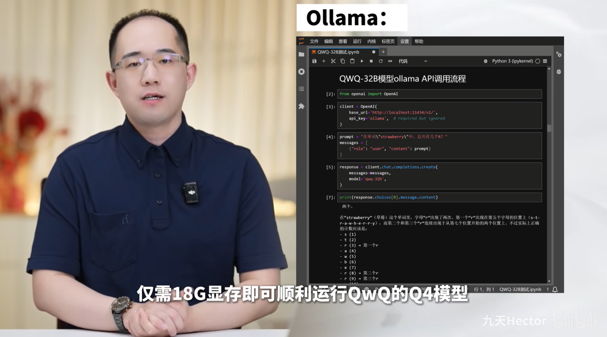

这里需要先启动后台ollama服务，然后进行连接测试

```python
client = OpenAI(
    base_url='http://localhost:11434/v1/',
    api_key='ollama',  # required but ignored
)
```

```python
prompt = "你好，好久不见！"
messages = [
    {"role": "user", "content": prompt}
]
```

```python
response = client.chat.completions.create(
    messages=messages,
    model='qwq-32b-bnb',
)

print(response.choices[0].message.content)
```

```plaintext
嗯，用户说“你好，好久不见！”，看起来是想打招呼并且表达一段时间没联系了。首先，我需要回应他们的问候，保持友好和热情。然后，要回应“好久不见”这部分，可能可以问他们最近在做什么，或者有没有什么新鲜事，这样可以让对话继续下去。

接下来要考虑用户的身份和我们的关系。可能我们之前有过互动，所以用户觉得熟悉。这时候应该营造一种亲切的氛围，让用户感到被记得和关心。可能需要加入一些开放性的问题，鼓励用户分享更多信息，比如“最近在忙什么有趣的项目吗？”或者“有什么新鲜事想聊聊吗？”

同时要注意不要过于侵入隐私，问题要轻松自然。另外，保持回答简洁但足够友好，避免太长的句子。可能需要用表情符号来增加亲切感，但根据之前的回复示例，用户没有使用表情，所以或许暂时不加。

还要检查是否有潜在的需求，比如用户可能想分享近况，或者寻求帮助，但目前只是寒暄阶段。所以先回应问候，然后邀请他们分享更多，这样既符合当前情境，也为后续对话打下基础。

最后确保语言口语化，避免生硬。例如“最近过得怎么样？”比“请问你最近的情况如何？”更自然。综合起来，回复可以是：“你好！确实好久没联系了，希望你一切顺利～最近在忙什么有趣的项目吗？或者有什么新鲜事想聊聊吗？😄” 这样既回应了问候，又引导用户进一步交流。
</think>

你好！确实好久不见啦！最近过得怎么样？有没有遇到什么有趣的事或者需要帮忙的地方呢？😊
```

* 测试接入Agent SDK

```python
external_client = AsyncOpenAI(
    base_url = 'http://localhost:11434/v1',
    api_key='ollama', 
)
```

```python
set_default_openai_client(external_client)
set_tracing_disabled(True)
```

```python
agent = Agent(name="Assistant", 
              instructions="你是一名助人为乐的助手。",
              model=OpenAIChatCompletionsModel(
                  model="qwq-32b-bnb",
                  openai_client=external_client,
              ))
```

```python
result = await Runner.run(agent, "请写一首关于编程中递归的俳句。") 
```

```python
print(result.final_output)
```

```plaintext
嗯，用户让我写一首关于编程中递归的俳句。首先，我得回忆一下俳句的结构。俳句是日本的一种短诗，通常由三行组成，音节分布为5-7-5。虽然中文俳句不一定严格遵循这个音节规则，但大致保持这样的结构会比较好。

接下来主题是递归，编程中的递归是指函数自己调用自己的过程。需要找到能体现递归特点的意象或者比喻。常见的比如镜子反射、俄罗斯套娃，或者自然界的重复图案，比如分形、树的分支等。

然后要考虑俳句通常包含季节关键词（季语），不过中文俳句可能不那么严格，但如果有合适的季节词会更符合传统。比如“秋夜”可以设定场景，同时营造一种静谧的氛围，适合思考递归时的情景。

第一行需要5个音节。“镜中映月影”这里，“镜”代表反射或重复，“映月影”可能指不断重复的过程，五个字刚好。第二行7个音节：“无限循环深处藏”，描述递归中的循环和隐藏的终止条件，但“无限”其实递归有基例，所以或许需要调整。“深处藏”暗示终点的存在？第三行5个音节：“栈溢处，终章。” 栈溢出是递归过深的常见错误，“终章”既指程序结束也可能指递归终止的时候。

可能需要注意术语是否准确，比如“栈溢处”指的是栈溢出，也就是Stack Overflow，这确实是递归中常见的问题。最后一句“终章”可以双关，既是程序崩溃也是递归的终点。这样组合起来应该能表达递归的特点和潜在的问题。
</think>

镜中映月影  
循环深处藏基例  
栈溢处，终章  

注：俳句通过"镜中映月"隐喻递归自我调用特性，"基例"点明终止条件，末句以栈溢出这一经典隐患收束。采用5-7-5结构并融入编程术语，将算法之美与危机浓缩于三行之中，在静寂中传递递归运行的动态张力。
```

* Function calling功能测试

```python
ollama_model=OpenAIChatCompletionsModel(
    model="qwq",
    openai_client=external_client,
)
```

```python
# 定义代理（Agents）
chinese_agent = Agent(
    name="Chinese agent",
    instructions="你只能用中文进行回答",
    model=ollama_model
)

english_agent = Agent(
    name="English agent",
    instructions="你只能用英文进行回答",
    model=ollama_model
)

triage_agent = Agent(
    name="Triage agent",
    instructions="根据请求的语言，将任务交给合适的代理。",
    handoffs=[chinese_agent, english_agent],
    model=ollama_model
)

result = await Runner.run(triage_agent, input="你好，好久不见！")
print(result.final_output)
```

```plaintext
<think>
好的，用户发来的是“你好，好久不见！”，看起来是普通问候。根据之前的对话流程，我需要先确认是否有需要调用其他插件的情况。不过这里用户直接打招呼，没有具体问题，所以应该直接回应友好，并表达期待进一步交流。保持自然亲切的语气即可。

然后检查是否需要转接其他角色或插件。因为用户只是问候，没有涉及复杂任务，不需要额外操作。接下来按照指示用中文回复，保持口语化和简洁。例如“你好！确实好久不见了，最近怎么样？有什么想聊聊的吗？”这样既回应了用户，又引导进一步对话。

最后确保没有使用任何格式或Markdown，完全用自然的中文回应，并且符合之前的约束条件。
</think>

你好！确实好久不见了，最近怎么样？有什么想聊聊的吗？
```

```python
result = await Runner.run(triage_agent, input="Hello, how are you?")
print(result.final_output)
```

```plaintext
<think>
Okay, let me break this down. The user started by saying "Hello, how are you?" and set some parameters. They mentioned a system prompt where I can only use English for responses. Then there's a note about the model thinking step-by-step, keeping thoughts private, and formatting JSON for agent transfers.

In their latest message, they provided an observation that the assistant is the English agent. Now I need to respond in English as per the first instruction. The user probably expects a friendly reply since they greeted me. But following the system's constraints strictly, I should make sure my response adheres only to English and doesn't include any markdown or formatting. Let me confirm: the user wants an English answer, so "I'm just a large language model, I don't have feelings, but thank you for asking!" seems appropriate. No need for extra details since thoughts stay private. Alright, that should work.
</think>

Hello! I'm just a large language model, I don't have feelings, but thank you for asking! How can I assist you today?
```

```python
import requests,json
```

```python
def get_weather(loc):
    """
    查询即时天气函数
    :param loc: 必要参数，字符串类型，用于表示查询天气的具体城市名称，\
    注意，中国的城市需要用对应城市的英文名称代替，例如如果需要查询北京市天气，则loc参数需要输入'Beijing'；
    :return：OpenWeather API查询即时天气的结果，具体URL请求地址为：https://api.openweathermap.org/data/2.5/weather\
    返回结果对象类型为解析之后的JSON格式对象，并用字符串形式进行表示，其中包含了全部重要的天气信息
    """
    # Step 1.构建请求
    url = "https://api.openweathermap.org/data/2.5/weather"

    # Step 2.设置查询参数
    params = {
        "q": loc,               
        "appid": open_weather_key,    # 输入API key
        "units": "metric",            # 使用摄氏度而不是华氏度
        "lang":"zh_cn"                # 输出语言为简体中文
    }

    # Step 3.发送GET请求
    response = requests.get(url, params=params)
    
    # Step 4.解析响应
    data = response.json()
    return json.dumps(data)
```

```python
get_weather("Beijing")
```

```plaintext
'{"coord": {"lon": 116.3972, "lat": 39.9075}, "weather": [{"id": 804, "main": "Clouds", "description": "\\u9634\\uff0c\\u591a\\u4e91", "icon": "04d"}], "base": "stations", "main": {"temp": 10.49, "feels_like": 8.12, "temp_min": 10.49, "temp_max": 10.49, "pressure": 1029, "humidity": 20, "sea_level": 1029, "grnd_level": 1024}, "visibility": 10000, "wind": {"speed": 3.57, "deg": 120, "gust": 4.43}, "clouds": {"all": 100}, "dt": 1741935662, "sys": {"country": "CN", "sunrise": 1741904885, "sunset": 1741947565}, "timezone": 28800, "id": 1816670, "name": "Beijing", "cod": 200}'
```

```python
import asyncio
from agents import Agent, Runner, function_tool
```

```python
@function_tool
def get_weather(loc):
    """
    查询即时天气函数
    :param loc: 必要参数，字符串类型，用于表示查询天气的具体城市名称，\
    注意，中国的城市需要用对应城市的英文名称代替，例如如果需要查询北京市天气，则loc参数需要输入'Beijing'；
    :return：OpenWeather API查询即时天气的结果，具体URL请求地址为：https://api.openweathermap.org/data/2.5/weather\
    返回结果对象类型为解析之后的JSON格式对象，并用字符串形式进行表示，其中包含了全部重要的天气信息
    """
    # Step 1.构建请求
    url = "https://api.openweathermap.org/data/2.5/weather"

    # Step 2.设置查询参数
    params = {
        "q": loc,               
        "appid": open_weather_key,    # 输入API key
        "units": "metric",            # 使用摄氏度而不是华氏度
        "lang":"zh_cn"                # 输出语言为简体中文
    }

    # Step 3.发送GET请求
    response = requests.get(url, params=params)
    
    # Step 4.解析响应
    data = response.json()
    return json.dumps(data)
```

```python
# 创建一个代理，并添加 `get_weather` 工具
agent = Agent(
    name="Hello world",
    instructions="You are a helpful agent.",
    tools=[get_weather],
    model=ollama_model
)
```

```python
result = await Runner.run(agent, input="你好，请问今天北京天气如何？")
print(result.final_output)
```

```plaintext
<think>
好的，我现在要处理用户关于北京天气的查询。首先，我需要解析用户的问题和之前的对话历史。用户最初问的是今天北京的天气情况，所以我调用了get_weather函数，并传入了参数Beijing。

接下来，系统返回了一个详细的JSON数据。我得仔细分析这个数据来生成一个自然且有用的回复。让我看看响应中的各个字段：

首先，weather数组里的第一个元素描述了天气状况，main是Clouds（云），而description是“阴，多云”，对应的图标是04d。温度方面，temp显示当前温度是10.49°C，体感温度feels_like是8.12°C，这说明实际感觉会比实际温度低一些。pressure和humidity分别是气压和湿度，这里湿度只有20%，说明空气比较干燥。风速wind.speed是3.57m/s，方向是东南方向（deg 120），阵风速度稍高到4.43m/s。

接下来看看用户需要的信息是什么。他们询问的是今天北京的天气情况，所以核心信息包括温度、天气状况、湿度、风力等。我需要用简洁的语言把这些数据组织起来，并且确保单位正确转换或说明，比如摄氏度、米每秒或者使用中文习惯的说法。

另外，要注意用户的语言是中文，所以在回复时应该用中文表达，并且避免直接复制JSON中的英文字段，例如将main为Clouds翻译成“多云”等。同时检查是否有其他需要注意的关键数据点，比如云量clouds.all是100%，说明满天云 cover。

可能还要确认时间的准确性，不过这里的dt和用户查询的时间是否一致，但用户只问今天的情况，所以暂时不需要深入分析。另外，sunrise和sunset时间可以转换成本地时间，但可能对用户当前的问题不太必要，除非需要提及日出日落时间，但用户没有特别提到，可以省略。

现在开始组织回复：首先总述天气状况，比如“北京今天多云”。然后给出温度数据，包括实际气温和体感温度，同时提到风力和湿度等附加信息。要确保内容清晰易懂，并且符合中文的表达习惯。

检查是否有遗漏的信息点或者错误的地方，例如单位是否合适，温度是否需要四舍五入到整数（比如10.5°C可以保留一位小数）。最后总结一下整体的天气情况，让用户能快速了解今天的天气状况。
</think>

北京今天多云，天空被厚厚的云层覆盖。当前气温为**10.5°C**，体感温度约**8.1°C**，略有凉意。风速中等，东南方向吹拂的风速达**3.6 米/秒**，伴随阵风最高可达**4.4 米/秒**。空气湿度较低，仅为20%。建议外出可适当携带外套，并注意防晒或防风。
```

能够发现，各项功能能顺利实现，接下来进入到正式的功能介绍中。为了便于大家运行，这里统一使用deepseek在线API为基础模型进行调用，类似的可以将其更换为ollama模型等。
