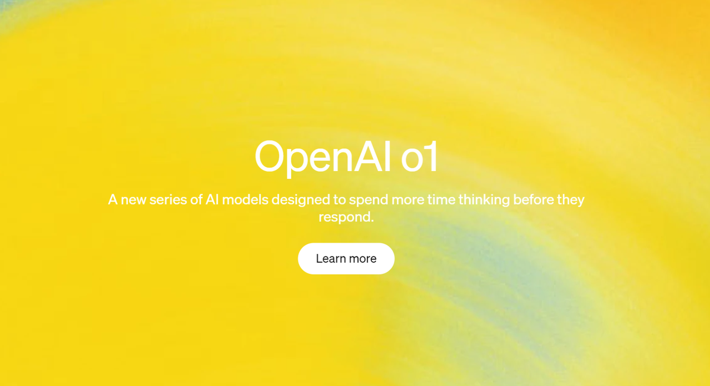
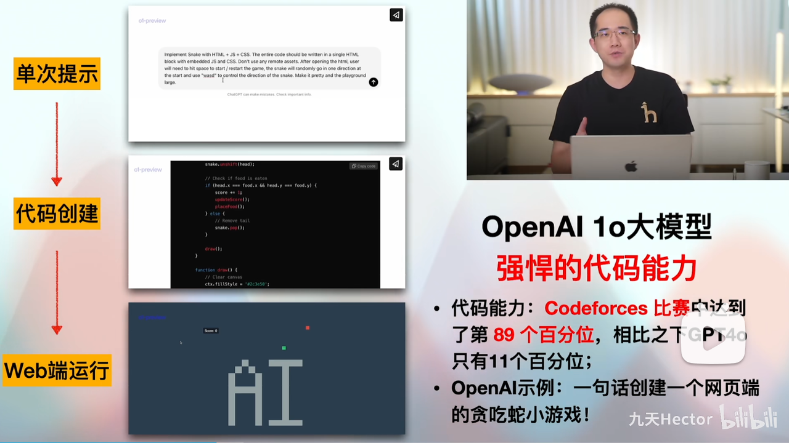
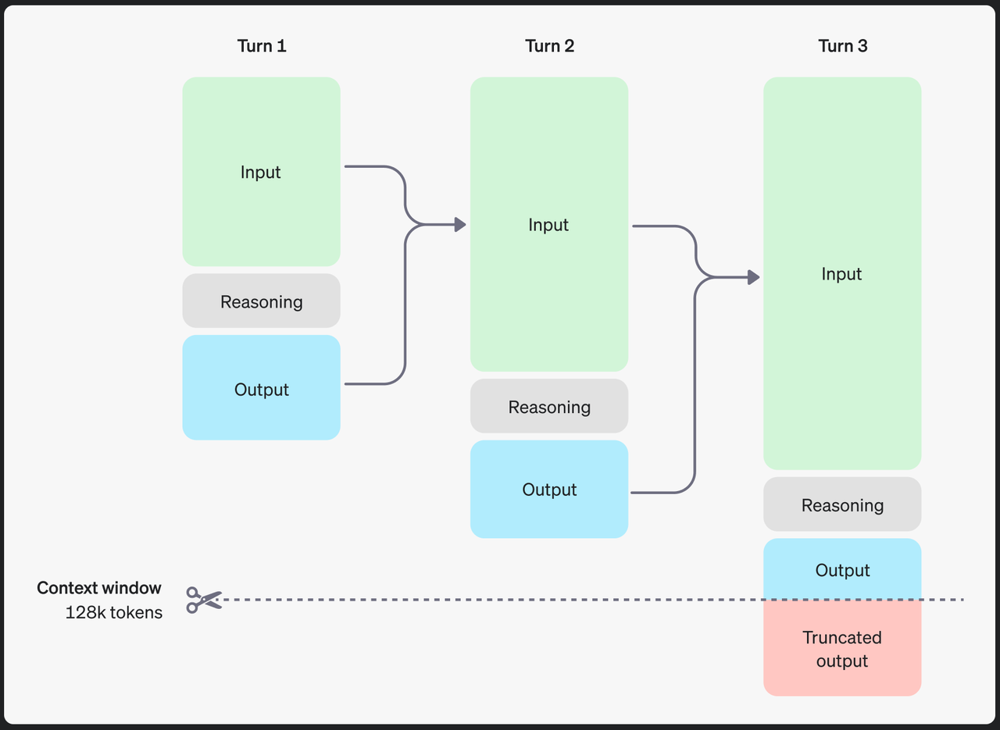
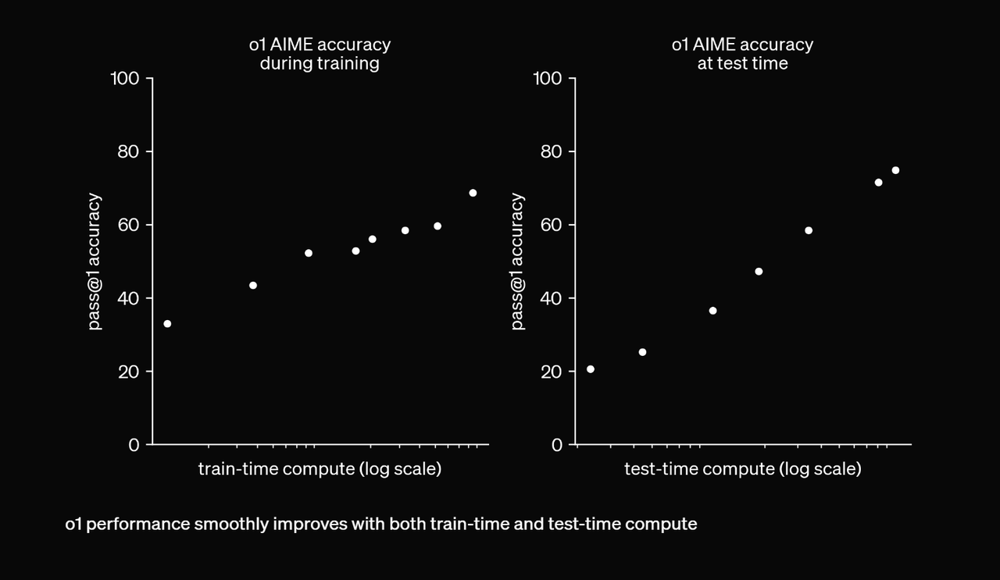
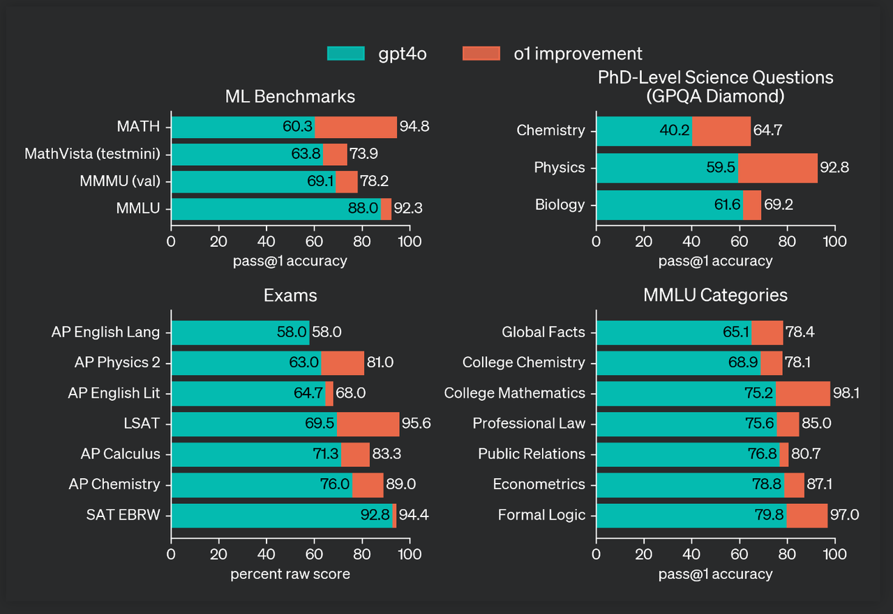
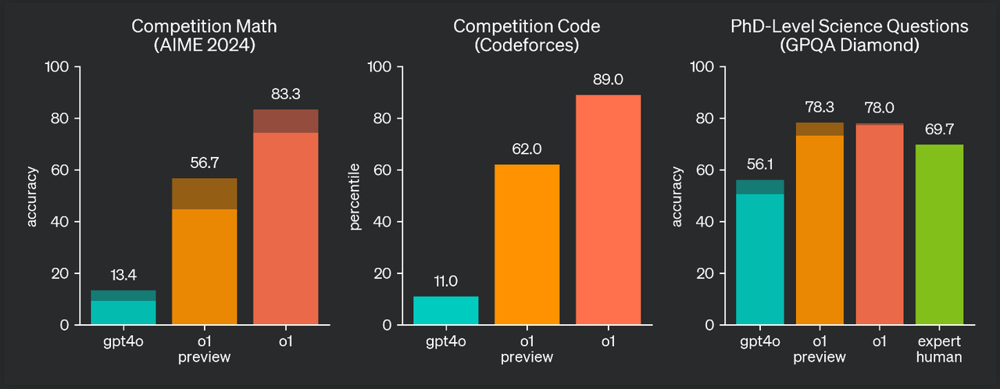
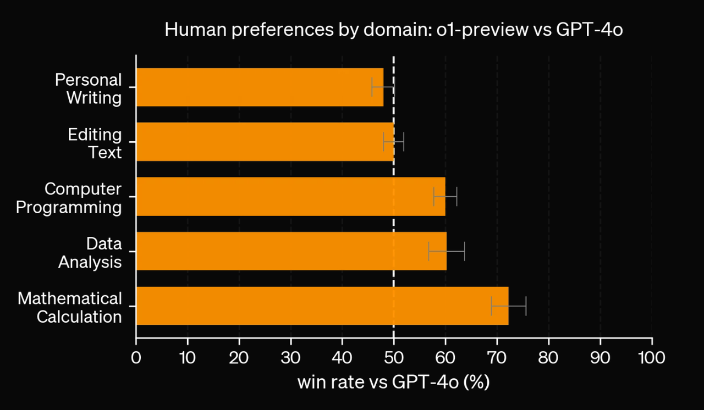
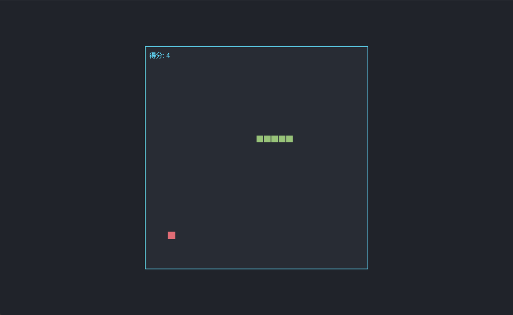

### 1.OpenAI o1模型入门介绍



* o1发布公告：https://openai.com/o1/

* o1技术论文：https://openai.com/index/learning-to-reason-with-llms/

* o1视频介绍：https://www.bilibili.com/video/BV1ba4fegESd/


🍻现开设了**大模型学习交流群**，扫描下👇码，来遇见更多志同道合的小伙伴\~

（12月12场OpenAI发布会持续追更中，等你来交流讨论）


海量硬核独家技术`干货内容`+无门槛`技术交流`，上图👆**扫码**即刻入群！




#### 1.1 OpenAI o1 简介

  OpenAI o1 是一款前沿的大型语言模型（LLM），专注于复杂的推理任务，通过强化学习技术提升其思维能力。与许多早期模型不同，o1 在回答之前会先“思考”，生成复杂的内部推理链。这种能力使 o1 非常适合处理需要深度逻辑处理的任务，例如编程竞赛、高级数学以及科学问题求解。



#### 1.2 模型效果

  o1 模型在各种竞赛和学术领域中表现卓越。例如：

* **编程竞赛**：在 Codeforces 编程竞赛平台上，o1 排名达到了第 89 个百分位。

* **数学**：在美国数学奥林匹克资格赛（AIME）中，o1 的表现与美国前 500 名学生不相上下。

* **博士水平的科学测试**：在物理、化学和生物学的基准测试（GPQA Diamond）中，o1 的准确率超过了人类博士。

#### 1.3 强化学习的作用

  o1 的一个重要特点是它通过强化学习来增强推理能力。该模型经过大量训练，以优化其推理链和策略。这使得它能够：

* **将复杂问题拆解**为更简单的部分。

* **识别并纠正错误**，以提高问题解决的准确性。

* **在当前方法无效时尝试新的方法**，展现出适应性。

随着训练时间和计算资源的增加，o1 的推理能力不断提升，使其在许多困难的基准测试上超过了早期的 GPT-4o 模型。



&#x20;



#### 1.4 性能亮点

  为了展示其优于其他模型的表现，o1 经过了各种考试和机器学习基准测试的考验。值得注意的结果包括：

* **数学（AIME 2024）**：o1 在 AIME 数学考试中的平均通过率为 74%，而 GPT-4o 仅为 12%。通过先进的共识策略，该通过率进一步提高到 93%。

* **科学（GPQA Diamond）**：在物理、化学和生物学博士级问题的基准测试中，o1 成为首个 consistently 超过人类专家表现的模型。



#### 1.5 推理链（Chain of Thought Reasoning）

  o1 最独特的功能是其**推理链**能力——这种能力使其能够像人类一样逐步思考，解决复杂问题。通过这种推理能力，o1 能够将难题分解成可管理的步骤，并在每次迭代中不断改进其方法。无论是解决密码、处理数学证明，还是编写代码，o1 都能够在处理任务时学习和提升。

#### 1.6 应用和未来前景

  o1 模型在多个领域有着广泛的应用潜力，包括：

* **科学研究**：鉴于其在科学基准测试中的出色表现，o1 可以帮助解决物理、化学和生物学领域的难题。

* **教育**：o1 的推理能力使其成为高级数学、编程和逻辑问题解决领域中的宝贵导师。

* **软件开发**：在编程竞赛和实际开发场景中，o1 的推理和故障排除能力使其成为开发人员的强大工具。

* **数据分析与决策**：o1 的逻辑推理能力可以应用于金融、医疗、物流等数据密集型领域，帮助从复杂数据集中提取有价值的洞察。

#### 1.7 局限性与未来发展

  尽管 o1 在推理任务上表现出色，但它并非在所有领域都具备优势。例如，在某些自然语言处理（NLP）任务中，GPT-4o 的表现优于 o1。o1 专注于推理，这可能限制了其在更偏语言的使用场景中的效果。然而，随着 o1 系列模型的持续开发，未来其推理与广泛语言理解的平衡将解锁更多的应用场景。



### 2.OpenAI o1模型调用指南

#### 2.1 OpenAI o1 模型简介

  o1 模型系列是通过强化学习训练的最新大型语言模型，专注于复杂推理任务。这些模型在生成答案之前会先进行“思考”，通过内部的推理链分析问题。o1 系列模型在科学推理领域表现出色，在编程竞赛（Codeforces）中排名 89% 分位，并在美国数学奥林匹克资格赛（AIME）中跻身美国前 500 名学生之列。此外，o1 模型在物理学、生物学和化学问题的 GPQA 基准测试中超过了人类博士的水平。

  目前已经开放的 o1 系列模型：

* **o1-preview**：o1 模型的早期预览版，适合需要广泛知识的复杂问题推理。

* **o1-mini**：o1 的较快且更经济版本，擅长处理编程、数学和科学任务。

需要注意的是，这些模型为推理任务带来了显著进展，但它们并不是所有场景的最佳选择。在需要图像输入、函数调用或持续快速响应的场景下，GPT-4o 和 GPT-4o mini 仍然是更合适的选择。

#### 2.2 o1模型使用方法

  和GPT4o模型一样，o1模型也是通过 **chat completions** 端点进行调用：

```python
from openai import OpenAI
from IPython.display import display, Code, Markdown
```

```python
api_key = 'your-openai-api-key'
```

```python
# 实例化客户端
client = OpenAI(api_key=api_key, 
                base_url="https://ai.devtool.tech/proxy/v1")
```

```python
# 调用 GPT-4o-mini 模型
response = client.chat.completions.create(
    model="gpt-4o-mini",
    messages=[
        {"role": "user", "content": "你好，好久不见!"}
    ]
)

print(response.choices[0].message.content)
```

```plaintext
你好！很高兴见到你！有什么我可以帮助你的吗？
```

需要确认当前API-KEY权限是否可以调用o1模型：

```python
models_list = client.models.list()
```

```python
models_list.data
```

```plaintext
[Model(id='o1-preview', created=1725648897, object='model', owned_by='system'),
 Model(id='tts-1', created=1681940951, object='model', owned_by='openai-internal'),
 Model(id='tts-1-1106', created=1699053241, object='model', owned_by='system'),
 Model(id='chatgpt-4o-latest', created=1723515131, object='model', owned_by='system'),
 Model(id='dall-e-2', created=1698798177, object='model', owned_by='system'),
 Model(id='o1-preview-2024-09-12', created=1725648865, object='model', owned_by='system'),
 Model(id='gpt-4o-2024-08-06', created=1722814719, object='model', owned_by='system'),
 Model(id='gpt-4-turbo-preview', created=1706037777, object='model', owned_by='system'),
 Model(id='gpt-4o', created=1715367049, object='model', owned_by='system'),
 Model(id='gpt-3.5-turbo-instruct', created=1692901427, object='model', owned_by='system'),
 Model(id='gpt-4-0125-preview', created=1706037612, object='model', owned_by='system'),
 Model(id='gpt-3.5-turbo-0125', created=1706048358, object='model', owned_by='system'),
 Model(id='gpt-3.5-turbo', created=1677610602, object='model', owned_by='openai'),
 Model(id='babbage-002', created=1692634615, object='model', owned_by='system'),
 Model(id='davinci-002', created=1692634301, object='model', owned_by='system'),
 Model(id='dall-e-3', created=1698785189, object='model', owned_by='system'),
 Model(id='gpt-4-turbo-2024-04-09', created=1712601677, object='model', owned_by='system'),
 Model(id='tts-1-hd', created=1699046015, object='model', owned_by='system'),
 Model(id='tts-1-hd-1106', created=1699053533, object='model', owned_by='system'),
 Model(id='gpt-4-1106-preview', created=1698957206, object='model', owned_by='system'),
 Model(id='text-embedding-ada-002', created=1671217299, object='model', owned_by='openai-internal'),
 Model(id='gpt-3.5-turbo-16k', created=1683758102, object='model', owned_by='openai-internal'),
 Model(id='gpt-4o-realtime-preview-2024-10-01', created=1727131766, object='model', owned_by='system'),
 Model(id='text-embedding-3-small', created=1705948997, object='model', owned_by='system'),
 Model(id='whisper-1', created=1677532384, object='model', owned_by='openai-internal'),
 Model(id='text-embedding-3-large', created=1705953180, object='model', owned_by='system'),
 Model(id='gpt-4-turbo', created=1712361441, object='model', owned_by='system'),
 Model(id='gpt-4o-2024-05-13', created=1715368132, object='model', owned_by='system'),
 Model(id='gpt-3.5-turbo-1106', created=1698959748, object='model', owned_by='system'),
 Model(id='gpt-4-0613', created=1686588896, object='model', owned_by='openai'),
 Model(id='o1-mini', created=1725649008, object='model', owned_by='system'),
 Model(id='gpt-4', created=1687882411, object='model', owned_by='openai'),
 Model(id='o1-mini-2024-09-12', created=1725648979, object='model', owned_by='system'),
 Model(id='gpt-3.5-turbo-instruct-0914', created=1694122472, object='model', owned_by='system'),
 Model(id='gpt-4o-mini', created=1721172741, object='model', owned_by='system'),
 Model(id='gpt-4o-realtime-preview', created=1727659998, object='model', owned_by='system'),
 Model(id='gpt-4o-mini-2024-07-18', created=1721172717, object='model', owned_by='system')]
```

测试调用：

```python
response = client.chat.completions.create(
    model="o1-mini",
    messages=[
        {
            "role": "user", 
            "content": "写一个 Bash 脚本，将格式为 '[1,2],[3,4],[5,6]' 的字符串表示的矩阵转置，并以相同格式输出。"
        }
    ]
)
```

```python
response
```

````plaintext
ChatCompletion(id='chatcmpl-AGSZ4hNjR4hQKZhJGwyVgsx1fI4pP', choices=[Choice(finish_reason='stop', index=0, logprobs=None, message=ChatCompletionMessage(content='当然，以下是一个完整的 Bash 脚本，它将按照您指定的格式将矩阵字符串进行转置。脚本包含详细的注释以帮助您理解每个步骤。\n\n```bash\n#!/bin/bash\n\n# 检查是否提供了输入字符串\nif [ $# -ne 1 ]; then\n    echo "用法: $0 \'[1,2],[3,4],[5,6]\'"\n    exit 1\nfi\n\ninput_str="$1"\n\n# 1. 替换 \'],[\' 为 \'|\', 并去除首尾的 \'[\' 和 \']\'\nprocessed_str=$(echo "$input_str" | sed \'s/\\]\\s*,\\s*\\[/|/g\' | sed \'s/\\[//g\' | sed \'s/\\]//g\')\n\n# 2. 使用 \'|\' 分割为行\nIFS=\'|\' read -r -a rows <<< "$processed_str"\n\n# 检查是否有至少一行\nif [ ${#rows[@]} -eq 0 ]; then\n    echo "输入格式错误。"\n    exit 1\nfi\n\n# 3. 将每行按 \',\' 分割为元素，并存储在二维数组中\ndeclare -a matrix\nnum_cols=0\nfor row in "${rows[@]}"; do\n    IFS=\',\' read -r -a elements <<< "$row"\n    matrix+=("${elements[@]}")\n    if [ ${#elements[@]} -gt $num_cols ]; then\n        num_cols=${#elements[@]}\n    fi\ndone\n\nnum_rows=${#rows[@]}\n\n# 4. 构建二维数组\ndeclare -A mat\n\nrow_idx=0\nfor row in "${rows[@]}"; do\n    IFS=\',\' read -r -a elements <<< "$row"\n    col_idx=0\n    for elem in "${elements[@]}"; do\n        mat[$row_idx,$col_idx]=$elem\n        ((col_idx++))\n    done\n    ((row_idx++))\ndone\n\n# 5. 转置矩阵\ndeclare -A transposed\n\nfor ((i=0; i<num_rows; i++)); do\n    for ((j=0; j<num_cols; j++)); do\n        transposed[$j,$i]=${mat[$i,$j]}\n    done\ndone\n\n# 6. 构建转置后的字符串\noutput=""\nfor ((j=0; j<num_cols; j++)); do\n    row_str="["\n    for ((i=0; i<num_rows; i++)); do\n        elem=${transposed[$j,$i]}\n        # 如果元素为空，替换为 0 或其他默认值\n        if [ -z "$elem" ]; then\n            elem=0\n        fi\n        row_str+="$elem"\n        if [ $i -lt $((num_rows - 1)) ]; then\n            row_str+=","\n        fi\n    done\n    row_str+="]"\n    output+="$row_str"\n    if [ $j -lt $((num_cols - 1)) ]; then\n        output+=","\n    fi\ndone\n\necho "$output"\n```\n\n### 使用说明\n\n1. **保存脚本**\n   \n   将上述脚本保存为 `transpose_matrix.sh` 并赋予执行权限：\n\n   ```bash\n   chmod +x transpose_matrix.sh\n   ```\n\n2. **运行脚本**\n\n   运行脚本时，将矩阵字符串作为参数传递。例如：\n\n   ```bash\n   ./transpose_matrix.sh \'[1,2],[3,4],[5,6]\'\n   ```\n\n   **输出将会是:**\n\n   ```\n   [1,3,5],[2,4,6]\n   ```\n\n### 脚本说明\n\n1. **输入处理**\n\n   - 脚本首先检查是否提供了一个输入参数。\n   - 使用 `sed` 替换 `],[` 为 `|` 以便后续分割，同时去除所有的 `[` 和 `]` 符号。\n\n2. **分割行和列**\n\n   - 使用内部字段分隔符 (IFS) 将处理后的字符串按 `|` 分割成多行。\n   - 然后将每一行按 `,` 分割成单个元素，并存储在二维关联数组 `mat` 中。\n\n3. **转置矩阵**\n\n   - 遍历原矩阵中的每个元素，将其位置 `[i][j]` 转换为 `[j][i]`，并存储在新的关联数组 `transposed` 中。\n\n4. **构建输出字符串**\n\n   - 遍历转置后的关联数组，按照指定格式重新组装成输出字符串。\n   - 如果某个转置位置没有对应的元素（例如非矩形矩阵），可以选择用 `0` 或其他默认值填充。\n\n### 示例\n\n以下是一些使用示例：\n\n```bash\n./transpose_matrix.sh \'[1,2],[3,4],[5,6]\'\n# 输出: [1,3,5],[2,4,6]\n\n./transpose_matrix.sh \'[1,2,3],[4,5,6]\'\n# 输出: [1,4],[2,5],[3,6]\n\n./transpose_matrix.sh \'[7,8],[9,10],[11,12]\'\n# 输出: [7,9,11],[8,10,12]\n```\n\n### 注意事项\n\n- 脚本假设输入的矩阵是规则的，即每行的元素数量相同。如果输入的矩阵不规则，脚本会用 `0` 填充缺失的位置。\n- 如果矩阵元素中包含空格或其他特殊字符，可能需要进一步处理以确保正确解析。\n\n希望这个脚本能满足您的需求！', refusal=None, role='assistant', function_call=None, tool_calls=None))], created=1728486414, model='o1-mini-2024-09-12', object='chat.completion', service_tier=None, system_fingerprint='fp_f7eab99a33', usage=CompletionUsage(completion_tokens=2073, prompt_tokens=45, total_tokens=2118, completion_tokens_details=CompletionTokensDetails(audio_tokens=None, reasoning_tokens=832), prompt_tokens_details=PromptTokensDetails(audio_tokens=None, cached_tokens=0)))
````

```python
display(Markdown(response.choices[0].message.content))
```

以下是一个 Bash 脚本，它可以将格式为 `'[1,2],[3,4],[5,6]'` 的字符串表示的矩阵转置，并以相同格式输出。脚本使用 `sed` 和 `awk` 来处理字符串和执行矩阵转置。

```bash
#!/bin/bash

# 检查是否提供了输入参数
if [ $# -ne 1 ]; then
    echo "用法: $0 '[1,2],[3,4],[5,6]'"
    exit 1
fi

input="$1"

# 使用 sed 将矩阵行分割为多行，并移除方括号
# 然后使用 awk 进行转置
transposed=$(echo "$input" | \
    sed 's/\],[/\
/g' | sed 's/\[//g; s/\]//g' | \
    awk '
    {
        # 将每行按逗号分割成数组
        split($0, arr, ",")

        # 逐个存储到二维数组 a 中
        for (i=1; i<=length(arr); i++) {
            a[NR,i] = arr[i]
            if (i > max_cols) max_cols = i
        }
        if (NR > max_rows) max_rows = NR
    }
    END {
        # 遍历每一列，输出转置后的行
        for (i=1; i<=max_cols; i++) {
            line = ""
            for (j=1; j<=max_rows; j++) {
                line = line (j==1 ? "" : ",") a[j,i]
            }
            # 格式化输出，添加方括号和逗号分隔
            printf "%s%s", (i==1 ? "[" : "],[") , line
        }
        print "]"
    }')

# 输出转置后的矩阵
echo "$transposed"
```

### 使用方法

1. **保存脚本**

2. 将上述脚本内容保存为文件，例如 `transpose.sh`。

3. **赋予执行权限**

```bash
chmod +x transpose.sh
```

1. **运行脚本**

```bash
./transpose.sh '[1,2],[3,4],[5,6]'
```

1. **输出:**

```plaintext
[1,3,5],[2,4,6]
```

### 脚本详解

1. **输入检查**

```bash
if [ $# -ne 1 ]; then
    echo "用法: $0 '[1,2],[3,4],[5,6]'"
    exit 1
fi

input="$1"
```

1. 这部分检查是否提供了一个输入参数，如果没有，则提示用法并退出。

2. **预处理输入字符串**

```bash
echo "$input" | \
    sed 's/\],[/\
/g' | sed 's/\[//g; s/\]//g' | \
    awk '...'
```

* `sed 's/\],[/\ /g'`：将 `],[` 替换为换行符，实现将每个矩阵行分割到单独的一行。

* `sed 's/\[//g; s/\]//g'`：移除所有的 `[` 和 `]` 符号，留下纯数字和逗号。

1. 例如，`'[1,2],[3,4],[5,6]'` 处理后变为：

```plaintext
1,2
3,4
5,6
```

1. **使用 `awk` 进行转置**

```plaintext
{
    split($0, arr, ",")

    for (i=1; i<=length(arr); i++) {
        a[NR,i] = arr[i]
        if (i > max_cols) max_cols = i
    }
    if (NR > max_rows) max_rows = NR
}
END {
    for (i=1; i<=max_cols; i++) {
        line = ""
        for (j=1; j<=max_rows; j++) {
            line = line (j==1 ? "" : ",") a[j,i]
        }
        printf "%s%s", (i==1 ? "[" : "],[") , line
    }
    print "]"
}
```

* **分割每行数据并存储到二维数组 `a` 中**

  * `split($0, arr, ",")`：将当前行按逗号分割成数组 `arr`。

  * `a[NR,i] = arr[i]`：将数据存储到二维数组 `a` 中，其中 `NR` 是行号，`i` 是列号。

  * `max_cols` 和 `max_rows` 用于记录矩阵的最大列数和行数。

* **转置并格式化输出**

  * 外层循环遍历每一列 `i=1` 到 `max_cols`。

  * 内层循环遍历每一行 `j=1` 到 `max_rows`，构建转置后的每一行。

  * 使用 `printf` 和条件运算符添加必要的方括号和逗号分隔符。

1. **输出结果**

2. 将转置后的矩阵赋值给变量 `transposed`，然后使用 `echo` 输出。

### 示例

* **输入:**

```plaintext
'[1,2],[3,4],[5,6]'
```

* **输出:**

```plaintext
[1,3,5],[2,4,6]
```

* **输入:**

```plaintext
'[1,2,3],[4,5,6]'
```

* **输出:**

```plaintext
[1,4],[2,5],[3,6]
```

该脚本适用于任意大小的矩阵，只要输入格式正确，即每一行用方括号包裹，行与行之间用逗号分隔，元素之间用逗号分隔。

相比之下，GPT4o输出结果逻辑性和准确性就要弱很多：

```python
# 调用 GPT-4o-mini 模型
response = client.chat.completions.create(
    model="gpt-4o-mini",
    messages=[
        {"role": "user", "content": "写一个 Bash 脚本，将格式为 '[1,2],[3,4],[5,6]' 的字符串表示的矩阵转置，并以相同格式输出。"}
    ]
)

print(response.choices[0].message.content)
```

````plaintext
您可以使用以下 Bash 脚本来实现将格式为 '[1,2],[3,4],[5,6]' 的字符串表示的矩阵转置，并以相同格式输出:

```bash
#!/bin/bash

# 输入矩阵字符串
input_matrix='[1,2],[3,4],[5,6]'

# 去掉方括号并按逗号分割
matrix=$(echo $input_matrix | tr -d '[]' | tr ',' ' ')

# 将矩阵转换为数组
readarray -d ' ' -t rows <<< "$matrix"

# 确定行数和列数
num_rows=${#rows[@]}
num_cols=$(echo "${rows[0]}" | tr ' ' '\n' | wc -l)

# 创建转置后的矩阵
transposed=""

for ((i=0; i<num_cols; i++)); do
    row=""
    for ((j=0; j<num_rows; j++)); do
        value=$(echo ${rows[j]} | awk -v idx=$i '{print $((idx+1))}')
        row+="$value"
        if [[ $j -lt $((num_rows-1)) ]]; then
            row+=","
        fi
    done
    transposed+="[$row]"
    if [[ $i -lt $((num_cols-1)) ]]; then
        transposed+=","
    fi
done

# 输出转置后的矩阵
echo "$transposed"
```

### 使用说明：
1. 将上述脚本保存为 `transpose_matrix.sh`。
2. 在终端中为脚本添加可执行权限：
   ```bash
   chmod +x transpose_matrix.sh
   ```
3. 执行脚本：
   ```bash
   ./transpose_matrix.sh
   ```

该脚本将输入字符串 `input_matrix` 转置并输出。根据给定的示例，输出将是 `[[1,3,5],[2,4,6]]`。您可以根据需要修改 `input_matrix` 的值。
````

```python
display(Markdown(response.choices[0].message.content))
```

您可以使用以下 Bash 脚本来实现将格式为 '\[1,2],\[3,4],\[5,6]' 的字符串表示的矩阵转置，并以相同格式输出:

```bash
#!/bin/bash

# 输入矩阵字符串
input_matrix='[1,2],[3,4],[5,6]'

# 去掉方括号并按逗号分割
matrix=$(echo $input_matrix | tr -d '[]' | tr ',' ' ')

# 将矩阵转换为数组
readarray -d ' ' -t rows <<< "$matrix"

# 确定行数和列数
num_rows=${#rows[@]}
num_cols=$(echo "${rows[0]}" | tr ' ' '\n' | wc -l)

# 创建转置后的矩阵
transposed=""

for ((i=0; i<num_cols; i++)); do
    row=""
    for ((j=0; j<num_rows; j++)); do
        value=$(echo ${rows[j]} | awk -v idx=$i '{print $((idx+1))}')
        row+="$value"
        if [[ $j -lt $((num_rows-1)) ]]; then
            row+=","
        fi
    done
    transposed+="[$row]"
    if [[ $i -lt $((num_cols-1)) ]]; then
        transposed+=","
    fi
done

# 输出转置后的矩阵
echo "$transposed"
```

### 使用说明：

1. 将上述脚本保存为 `transpose_matrix.sh`。

2. 在终端中为脚本添加可执行权限：

```bash
chmod +x transpose_matrix.sh
```

1. 执行脚本：

```bash
./transpose_matrix.sh
```

该脚本将输入字符串 `input_matrix` 转置并输出。根据给定的示例，输出将是 `[[1,3,5],[2,4,6]]`。您可以根据需要修改 `input_matrix` 的值。

#### 2.3 o1模型目前Beta 限制

  o1 模型目前处于测试阶段，具有以下限制：

* **仅支持文本输入**，不支持图像输入。

* **仅支持用户与助手消息**，不支持系统消息。

* 不支持**流式输出**、**工具调用**或**日志概率**等功能。

* **温度值**、**top\_p** 和 **n** 固定为 1，**presence\_penalty** 和 **frequency\_penalty** 固定为 0。

* **助理 API** 和 **批量 API** 不支持该模型。

  未来将增加更多功能，如多模态支持、工具调用等。

#### 2.4 推理过程

  o1 模型通过引入**推理 token**（reasoning tokens）来实现推理能力。这些推理 token 用于分解问题并考虑多种生成答案的策略。最终，模型生成可见的完成 token（completion tokens）作为回答，而推理 token 不会保留在上下文中。

  虽然推理 token 不可见，但它们会占据模型的上下文窗口，并且作为输出 token 收费。以下是一个多步对话示例，展示了推理 token 的处理方式：

```json
{
  "usage": {
    "total_tokens": 1000,
    "prompt_tokens": 400,
    "completion_tokens": 600,
    "completion_tokens_details": {
      "reasoning_tokens": 500
    }
  }
}
```

#### 2.5 上下文窗口管理

  o1-preview 模型和 o1-mini 模型提供了最大 128,000 个 token 的上下文窗口。其中，o1-preview 最多可以生成 32,768 个 token，o1-mini 最多可生成 65,536 个 token。这包括推理 token 和可见的完成 token。

#### 2.6 控制成本

  为了控制成本，o1 系列模型引入了 **max\_completion\_tokens** 参数来限制模型生成的总 token 数量（包括推理 token 和可见的完成 token）。合理设置该参数可以确保在生成完成的答案之前不因过多的推理 token 而耗尽上下文窗口。

#### 2.7 提示语设计建议

  o1 模型在处理简单、直接的提示时表现最佳。以下是一些最佳实践：

* **保持提示简洁**：模型擅长理解简洁明了的指令，无需复杂的提示。

* **避免逐步推理提示**：由于 o1 模型会自动进行内部推理，因此无需提示它“逐步思考”。

* **使用分隔符**：使用诸如三引号、XML 标签等分隔符，帮助模型清晰地理解输入中的不同部分。

### 3.OpenAI o1模型应用实践

#### 3.1 o1模型编程初级实践

* 尝试编写完整开发项目

```python
prompt = """
我想构建一个Python应用程序，它能够接收用户的问题，并在数据库中查找与之对应的答案。
如果有接近匹配的答案，它就检索出匹配的答案。
如果没有，它就请求用户提供答案，并将问题/答案对存储在数据库中。
为我规划所需的目录结构，然后完整地返回每个文件。只需在代码的开始和结束时提供你的推理，而不用贯穿整个代码。
"""

response = client.chat.completions.create(
    model="o1-mini",
    messages=[
        {
            "role": "user",
            "content": [
                {
                    "type": "text",
                    "text": prompt
                },
            ],
        }
    ]
)
```

```python
display(Markdown(response.choices[0].message.content))
```

为了构建这个Python应用程序，我们将设计一个清晰的目录结构，并为每个必要的文件提供完整的代码。这个应用程序将包括以下主要组件：

1. **主程序**：负责用户交互和逻辑控制。

2. **数据库模块**：处理与数据库的连接和操作。

3. **模型模块**：定义问题和答案的数据模型。

4. **实用工具**：包括用于文本匹配的工具函数。

5. **配置文件**：存储应用程序的配置信息。

6. **需求文件**：列出所有依赖的Python包。

以下是推荐的目录结构及每个文件的详细代码。

### 目录结构

```plaintext
qa_app/
├── main.py
├── database.py
├── models.py
├── utils.py
├── config.py
├── requirements.txt
└── README.md
```

### `requirements.txt`

```plaintext
sqlite3
fuzzywuzzy
python-Levenshtein
```

### `config.py`

```python
# 配置文件，用于存储数据库路径等配置信息

DATABASE_PATH = 'qa_database.db'
```

### `models.py`

```python
# 数据模型定义

import sqlite3
from config import DATABASE_PATH

def initialize_db():
    conn = sqlite3.connect(DATABASE_PATH)
    cursor = conn.cursor()
    cursor.execute('''
        CREATE TABLE IF NOT EXISTS qa (
            id INTEGER PRIMARY KEY AUTOINCREMENT,
            question TEXT UNIQUE,
            answer TEXT
        )
    ''')
    conn.commit()
    conn.close()
```

### `database.py`

```python
# 数据库操作模块

import sqlite3
from config import DATABASE_PATH

def get_all_questions():
    conn = sqlite3.connect(DATABASE_PATH)
    cursor = conn.cursor()
    cursor.execute('SELECT question, answer FROM qa')
    data = cursor.fetchall()
    conn.close()
    return data

def add_question_answer(question, answer):
    conn = sqlite3.connect(DATABASE_PATH)
    cursor = conn.cursor()
    try:
        cursor.execute('INSERT INTO qa (question, answer) VALUES (?, ?)', (question, answer))
        conn.commit()
    except sqlite3.IntegrityError:
        print("这个问题已经存在数据库中。")
    finally:
        conn.close()
```

### `utils.py`

```python
# 实用工具模块，用于处理文本匹配

from fuzzywuzzy import process

def find_best_match(user_question, questions, threshold=70):
    best_match, score = process.extractOne(user_question, questions)
    if score >= threshold:
        return best_match, score
    return None, score
```

### `main.py`

```python
# 主程序文件

from models import initialize_db
from database import get_all_questions, add_question_answer
from utils import find_best_match

def main():
    initialize_db()
    print("欢迎使用问答系统！请输入你的问题：")
    while True:
        user_question = input("你: ").strip()
        if user_question.lower() in ['exit', 'quit', '退出']:
            print("退出系统。")
            break
        qa_pairs = get_all_questions()
        questions = [pair[0] for pair in qa_pairs]
        match, score = find_best_match(user_question, questions)
        if match:
            answer = dict(qa_pairs)[match]
            print(f"系统: {answer}")
        else:
            print("系统: 很抱歉，我不知道答案。请提供答案：")
            user_answer = input("你: ").strip()
            if user_answer:
                add_question_answer(user_question, user_answer)
                print("系统: 您的问题和答案已保存。谢谢！")
            else:
                print("系统: 未保存任何内容。")

if __name__ == "__main__":
    main()
```

### `README.md`

````markdown
# 问答系统

这是一个简单的Python问答系统，能够根据用户的问题从数据库中检索答案。如果没有匹配的答案，用户可以提供新的答案，系统将其存储在数据库中。

## 功能

- 接收用户的问题
- 在数据库中查找相似的问题并返回答案
- 如果没有找到匹配答案，提示用户提供答案并保存

## 安装

1. 克隆仓库：
    ```bash
    git clone https://github.com/yourusername/qa_app.git
    ```
2. 进入目录：
    ```bash
    cd qa_app
    ```
3. 安装依赖：
    ```bash
    pip install -r requirements.txt
    ```

## 使用

运行主程序：
```bash
python main.py
````

输入你的问题，系统会尝试提供答案。如果没有找到相关答案，系统会提示你输入答案并保存。

## 退出

输入 `exit`, `quit` 或 `退出` 来退出系统。

````plaintext

通过上述结构和代码，你将拥有一个功能完善的问答系统，能够根据用户的输入动态扩展其知识库。


- 尝试编写贪吃蛇小游戏


```python
prompt = """
实现一个使用 HTML + JS + CSS 的贪吃蛇游戏。
整个代码应该写在一个单一的 HTML 块中，嵌入 JS 和 CSS。不要使用任何远程资源。
打开 HTML 后，用户需要按空格键开始/重新开始游戏，蛇在开始时会随机朝一个方向移动，并使用 "wasd" 键来控制蛇的方向。
让游戏界面美观，并使游戏区域较大。
"""
````

```python
response1 = client.chat.completions.create(
    model="o1-mini",
    messages=[
        {
            "role": "user",
            "content": [
                {
                    "type": "text",
                    "text": prompt
                },
            ],
        }
    ]
)
```

```python
display(Markdown(response1.choices[0].message.content))
```

下面是一个完整的贪吃蛇游戏实现，使用了 HTML、CSS 和 JavaScript。所有的代码都包含在一个单一的 HTML 文件中。打开该文件后，按下空格键开始游戏，可以使用 **WASD** 键来控制蛇的方向。

```html
<!DOCTYPE html>
<html lang="zh-CN">
<head>
    <meta charset="UTF-8">
    <title>贪吃蛇游戏</title>
    <style>
        body {
            background-color: #20232a;
            display: flex;
            justify-content: center;
            align-items: center;
            height: 100vh;
            margin: 0;
            font-family: Arial, sans-serif;
            color: #61dafb;
        }
        #game-container {
            position: relative;
            border: 2px solid #61dafb;
        }
        canvas {
            background-color: #282c34;
            display: block;
        }
        #message {
            position: absolute;
            top: 50%;
            left: 50%;
            transform: translate(-50%, -50%);
            font-size: 24px;
            text-align: center;
            display: none;
        }
        #score {
            position: absolute;
            top: 10px;
            left: 10px;
            font-size: 18px;
        }
    </style>
</head>
<body>
    <div id="game-container">
        <canvas id="gameCanvas" width="600" height="600"></canvas>
        <div id="score">得分: 0</div>
        <div id="message">
            按 <span style="color: #61dafb;">空格键</span> 开始/重新开始<br>
            使用 <span style="color: #61dafb;">WASD</span> 键控制方向
        </div>
    </div>

    <script>
        const canvas = document.getElementById('gameCanvas');
        const ctx = canvas.getContext('2d');
        const scoreElement = document.getElementById('score');
        const messageElement = document.getElementById('message');

        const gridSize = 20;
        const tileCount = canvas.width / gridSize;

        let snake = [];
        let direction = {x: 0, y: 0};
        let food = {x: 0, y: 0};
        let gameInterval;
        let score = 0;
        let gameRunning = false;

        function init() {
            snake = [
                {x: Math.floor(tileCount / 2), y: Math.floor(tileCount / 2)}
            ];
            direction = getRandomDirection();
            placeFood();
            score = 0;
            updateScore();
            messageElement.style.display = 'none';
        }

        function getRandomDirection() {
            const dirs = [
                {x: 0, y: -1}, // 上
                {x: 0, y: 1},  // 下
                {x: -1, y: 0}, // 左
                {x: 1, y: 0}   // 右
            ];
            return dirs[Math.floor(Math.random() * dirs.length)];
        }

        function placeFood() {
            let newFood;
            do {
                newFood = {
                    x: Math.floor(Math.random() * tileCount),
                    y: Math.floor(Math.random() * tileCount)
                };
            } while (snake.some(segment => segment.x === newFood.x && segment.y === newFood.y));
            food = newFood;
        }

        function update() {
            const head = {x: snake[0].x + direction.x, y: snake[0].y + direction.y};

            // 检查撞墙
            if (head.x < 0 || head.x >= tileCount || head.y < 0 || head.y >= tileCount) {
                endGame();
                return;
            }

            // 检查撞到自己
            if (snake.some(segment => segment.x === head.x && segment.y === head.y)) {
                endGame();
                return;
            }

            snake.unshift(head);

            // 检查是否吃到食物
            if (head.x === food.x && head.y === food.y) {
                score += 1;
                updateScore();
                placeFood();
            } else {
                snake.pop();
            }
        }

        function draw() {
            // 清空画布
            ctx.fillStyle = '#282c34';
            ctx.fillRect(0, 0, canvas.width, canvas.height);

            // 画食物
            ctx.fillStyle = '#e06c75';
            ctx.fillRect(food.x * gridSize, food.y * gridSize, gridSize, gridSize);

            // 画蛇
            ctx.fillStyle = '#98c379';
            snake.forEach((segment, index) => {
                ctx.fillRect(segment.x * gridSize, segment.y * gridSize, gridSize - 2, gridSize - 2);
            });
        }

        function gameLoop() {
            update();
            draw();
        }

        function startGame() {
            if (gameRunning) return;
            init();
            gameInterval = setInterval(gameLoop, 100);
            gameRunning = true;
        }

        function endGame() {
            clearInterval(gameInterval);
            gameRunning = false;
            messageElement.innerHTML = '游戏结束！<br>按 <span style="color: #61dafb;">空格键</span> 重新开始';
            messageElement.style.display = 'block';
        }

        function updateScore() {
            scoreElement.textContent = '得分: ' + score;
        }

        document.addEventListener('keydown', (e) => {
            if (e.code === 'Space') {
                startGame();
            }

            if (!gameRunning) return;

            switch (e.key.toLowerCase()) {
                case 'w':
                    if (direction.y === 0) {
                        direction = {x: 0, y: -1};
                    }
                    break;
                case 's':
                    if (direction.y === 0) {
                        direction = {x: 0, y: 1};
                    }
                    break;
                case 'a':
                    if (direction.x === 0) {
                        direction = {x: -1, y: 0};
                    }
                    break;
                case 'd':
                    if (direction.x === 0) {
                        direction = {x: 1, y: 0};
                    }
                    break;
            }
        });

        // 显示开始提示
        messageElement.style.display = 'block';
    </script>
</body>
</html>
```

### 代码说明

1. **HTML结构**:

   * **`<canvas>`**: 用于绘制游戏区域。

   * **`#score`**: 显示当前得分。

   * **`#message`**: 显示开始/重新开始提示以及游戏结束信息。

2. **CSS样式**:

   * 背景色和中央对齐整个游戏容器。

   * 画布有一个深色背景，并且游戏容器有一个边框。

   * 文字颜色与整体配色协调，使界面美观。

3. **JavaScript逻辑**:

   * **初始化**: 设置蛇的位置、方向和食物的位置。

   * **游戏循环**: 定时更新蛇的位置，检查碰撞，绘制蛇和食物。

   * **控制**: 使用 **WASD** 键来改变蛇的移动方向，防止蛇直接反向移动。

   * **开始与结束**: 按空格键开始或重新开始游戏，游戏结束时显示提示信息。

### 使用说明

1. 将上述代码复制并保存为一个 `.html` 文件，例如 `snake_game.html`。

2. 双击打开该文件，浏览器会显示游戏界面。

3. 按下 **空格键** 开始游戏。

4. 使用 **WASD** 键来控制蛇的方向：

   * **W**: 向上

   * **A**: 向左

   * **S**: 向下

   * **D**: 向右

5. 蛇会不断移动，吃到食物时会增长，游戏结束条件包括撞墙或撞到自己。

6. 游戏结束后，按 **空格键** 可以重新开始。

希望你喜欢这个贪吃蛇游戏！

html贪吃蛇游戏地址：https://mategen.oss-cn-beijing.aliyuncs.com/snake\_game.html



* 尝试进行复杂机器学习建模

```python
prompt = """
我需要完成一个机器学习建模任务，需要使用Python来读取本地的telco.csv文件，
并完整进行数据探索、数据清洗、特征衍生、特征筛选、集成学习算法建模、模型融合等操作，
请你帮我完成这个建模任务。
"""
```

```python
response2 = client.chat.completions.create(
    model="o1-mini",
    messages=[
        {
            "role": "user",
            "content": [
                {
                    "type": "text",
                    "text": prompt
                },
            ],
        }
    ]
)
```

```python
display(Markdown(response2.choices[0].message.content))
```

当然，我很高兴帮助你完成这个机器学习建模任务。下面是一个完整的 Python 工作流程，涵盖了读取数据、数据探索、数据清洗、特征衍生、特征筛选、集成学习算法建模以及模型融合等步骤。我们将使用常用的 Python 库，如 pandas、numpy、matplotlib、seaborn、scikit-learn 等。

请确保你已经安装了所需的库。如果还没有安装，你可以使用 `pip` 来安装：

```bash
pip install pandas numpy matplotlib seaborn scikit-learn
```

以下是详细的步骤和对应的代码示例：

***

## 1. 导入必要的库

```python
import pandas as pd
import numpy as np
import matplotlib.pyplot as plt
import seaborn as sns

# 机器学习相关
from sklearn.model_selection import train_test_split, GridSearchCV, cross_val_score
from sklearn.preprocessing import LabelEncoder, OneHotEncoder, StandardScaler
from sklearn.impute import SimpleImputer
from sklearn.feature_selection import SelectKBest, chi2, RFE
from sklearn.ensemble import RandomForestClassifier, GradientBoostingClassifier, VotingClassifier
from sklearn.linear_model import LogisticRegression
from sklearn.metrics import classification_report, confusion_matrix, accuracy_score, roc_auc_score, roc_curve
```

***

## 2. 读取数据

假设你的 `telco.csv` 文件位于当前工作目录下：

```python
# 读取CSV文件
df = pd.read_csv('telco.csv')

# 查看前几行数据
print(df.head())
```

***

## 3. 数据探索（Exploratory Data Analysis, EDA）

### 3.1 数据基本信息

```python
# 查看数据集的形状
print(f"数据集有 {df.shape[0]} 行和 {df.shape[1]} 列。")

# 查看数据类型和缺失值
print(df.info())

# 查看描述性统计
print(df.describe())
```

### 3.2 可视化分析

#### 3.2.1 目标变量分布

假设目标变量为 `Churn`（客户流失）：

```python
# 目标变量分析
sns.countplot(x='Churn', data=df)
plt.title('目标变量分布')
plt.show()
```

#### 3.2.2 数值变量分析

```python
# 选择数值型特征
numerical_features = df.select_dtypes(include=['int64', 'float64']).columns.tolist()
numerical_features.remove('Churn')  # 排除目标变量

# 绘制数值变量的分布
df[numerical_features].hist(bins=30, figsize=(15, 10))
plt.tight_layout()
plt.show()
```

#### 3.2.3 类别变量分析

```python
# 选择类别型特征
categorical_features = df.select_dtypes(include=['object']).columns.tolist()
categorical_features.remove('Churn')  # 排除目标变量

# 绘制类别变量的计数图
plt.figure(figsize=(20, 15))
for i, col in enumerate(categorical_features, 1):
    plt.subplot(4, 4, i)
    sns.countplot(x=col, hue='Churn', data=df)
    plt.xticks(rotation=45)
plt.tight_layout()
plt.show()
```

***

## 4. 数据清洗

### 4.1 处理缺失值

首先，检查缺失值：

```python
# 缺失值情况
print(df.isnull().sum())
```

假设部分列存在缺失值，我们可以采取以下措施：

```python
# 对于数值型缺失值，用中位数填补
numerical_imputer = SimpleImputer(strategy='median')
df[numerical_features] = numerical_imputer.fit_transform(df[numerical_features])

# 对于类别型缺失值，用众数填补
categorical_imputer = SimpleImputer(strategy='most_frequent')
df[categorical_features] = categorical_imputer.fit_transform(df[categorical_features])
```

### 4.2 处理重复值

```python
# 查看重复值
print(f"重复值数量: {df.duplicated().sum()}")

# 删除重复值
df = df.drop_duplicates()
```

### 4.3 处理异常值

可以使用箱线图或Z-score等方法检测异常值，这里以箱线图为例：

```python
# 绘制箱线图查看异常值
for col in numerical_features:
    plt.figure(figsize=(6, 4))
    sns.boxplot(x=df[col])
    plt.title(f'{col} 的箱线图')
    plt.show()
```

根据业务理解，决定是否移除或处理这些异常值。

***

## 5. 特征工程

### 5.1 编码类别变量

#### 5.1.1 标签编码

对于二分类的类别变量，可以使用标签编码：

```python
binary_cols = [col for col in categorical_features if df[col].nunique() == 2]
le = LabelEncoder()
for col in binary_cols:
    df[col] = le.fit_transform(df[col])
```

#### 5.1.2 独热编码

对于多分类的类别变量，使用独热编码：

```python
multiclass_cols = [col for col in categorical_features if df[col].nunique() > 2]
df = pd.get_dummies(df, columns=multiclass_cols, drop_first=True)
```

### 5.2 特征缩放

对于数值型特征，进行标准化：

```python
scaler = StandardScaler()
df[numerical_features] = scaler.fit_transform(df[numerical_features])
```

### 5.3 特征衍生

根据业务理解，可以创建新的特征。这里以示例创建一个 `TotalCharges` 特征：

假设原数据中有 `MonthlyCharges` 和 `tenure`，可以创建 `TotalCharges`：

```python
if 'MonthlyCharges' in df.columns and 'tenure' in df.columns:
    df['TotalCharges'] = df['MonthlyCharges'] * df['tenure']
```

***

## 6. 特征选择

### 6.1 相关性分析

```python
# 计算相关矩阵
corr = df.corr()

# 查看与目标变量的相关性
plt.figure(figsize=(12, 8))
sns.heatmap(corr[['Churn']].sort_values(by='Churn', ascending=False), annot=True)
plt.title('特征与目标变量的相关性')
plt.show()
```

### 6.2 选择K个最好特征

使用 `SelectKBest` 选择最重要的特征：

```python
X = df.drop('Churn', axis=1)
y = df['Churn']

selector = SelectKBest(score_func=chi2, k=20)
X_new = selector.fit_transform(X, y)

# 获取被选中的特征
cols = selector.get_support(indices=True)
selected_features = X.columns[cols]
print(f"被选中的特征: {selected_features.tolist()}")
```

***

## 7. 划分训练集和测试集

```python
X = df[selected_features]
y = df['Churn']

X_train, X_test, y_train, y_test = train_test_split(
    X, y, test_size=0.2, random_state=42, stratify=y
)
```

***

## 8. 集成学习算法建模

### 8.1 随机森林分类器

```python
rf = RandomForestClassifier(n_estimators=100, random_state=42)
rf.fit(X_train, y_train)

# 预测
y_pred_rf = rf.predict(X_test)

# 评估
print("随机森林分类器评估:")
print(confusion_matrix(y_test, y_pred_rf))
print(classification_report(y_test, y_pred_rf))
```

### 8.2 梯度提升分类器

```python
gb = GradientBoostingClassifier(n_estimators=100, random_state=42)
gb.fit(X_train, y_train)

# 预测
y_pred_gb = gb.predict(X_test)

# 评估
print("梯度提升分类器评估:")
print(confusion_matrix(y_test, y_pred_gb))
print(classification_report(y_test, y_pred_gb))
```

### 8.3 其他集成方法（可选）

你可以尝试例如 XGBoost、LightGBM 等其他集成方法，前提是你已经安装相关库。

***

## 9. 模型融合（Model Fusion）

### 9.1 投票分类器

结合多种模型的预测结果：

```python
# 定义基模型
log_clf = LogisticRegression(random_state=42)
rf_clf = RandomForestClassifier(n_estimators=100, random_state=42)
gb_clf = GradientBoostingClassifier(n_estimators=100, random_state=42)

# 创建投票分类器
voting_clf = VotingClassifier(
    estimators=[
        ('lr', log_clf),
        ('rf', rf_clf),
        ('gb', gb_clf)
    ],
    voting='soft'
)

# 训练投票分类器
voting_clf.fit(X_train, y_train)

# 预测
y_pred_vc = voting_clf.predict(X_test)

# 评估
print("投票分类器评估:")
print(confusion_matrix(y_test, y_pred_vc))
print(classification_report(y_test, y_pred_vc))
```

### 9.2 堆叠分类器（Stacking）

使用堆叠方法来融合多个模型：

```python
from sklearn.ensemble import StackingClassifier

# 定义基模型
estimators = [
    ('rf', RandomForestClassifier(n_estimators=100, random_state=42)),
    ('gb', GradientBoostingClassifier(n_estimators=100, random_state=42))
]

# 定义堆叠分类器
stack_clf = StackingClassifier(
    estimators=estimators,
    final_estimator=LogisticRegression(),
    cv=5
)

# 训练堆叠分类器
stack_clf.fit(X_train, y_train)

# 预测
y_pred_stack = stack_clf.predict(X_test)

# 评估
print("堆叠分类器评估:")
print(confusion_matrix(y_test, y_pred_stack))
print(classification_report(y_test, y_pred_stack))
```

***

## 10. 模型评估与选择

比较各模型的性能指标，如准确率、精确率、召回率、F1分数、AUC 等，选择表现最好的模型。

```python
# 计算不同模型的AUC
models = {
    'Random Forest': rf,
    'Gradient Boosting': gb,
    'Voting Classifier': voting_clf,
    'Stacking Classifier': stack_clf
}

for name, model in models.items():
    y_pred_proba = model.predict_proba(X_test)[:, 1]
    auc = roc_auc_score(y_test, y_pred_proba)
    print(f"{name} 的AUC: {auc:.4f}")
```

### 绘制ROC曲线

```python
plt.figure(figsize=(10, 8))
for name, model in models.items():
    y_pred_proba = model.predict_proba(X_test)[:, 1]
    fpr, tpr, _ = roc_curve(y_test, y_pred_proba)
    plt.plot(fpr, tpr, label=f'{name} (AUC = {roc_auc_score(y_test, y_pred_proba):.2f})')

plt.plot([0, 1], [0, 1], 'k--')  # 随机猜测的线
plt.xlabel('False Positive Rate')
plt.ylabel('True Positive Rate')
plt.title('ROC曲线')
plt.legend()
plt.show()
```

***

## 11. 超参数调优（可选）

使用网格搜索来优化模型的超参数，以进一步提升模型性能。

```python
# 以随机森林为例
param_grid = {
    'n_estimators': [100, 200, 300],
    'max_depth': [None, 10, 20, 30],
    'min_samples_split': [2, 5, 10]
}

grid_search = GridSearchCV(
    estimator=RandomForestClassifier(random_state=42),
    param_grid=param_grid,
    cv=5,
    n_jobs=-1,
    scoring='roc_auc'
)

grid_search.fit(X_train, y_train)

print(f"最佳参数: {grid_search.best_params_}")
print(f"最佳AUC: {grid_search.best_score_:.4f}")

# 使用最佳参数重新训练模型
best_rf = grid_search.best_estimator_
y_pred_best_rf = best_rf.predict(X_test)

# 评估
print("调优后的随机森林分类器评估:")
print(confusion_matrix(y_test, y_pred_best_rf))
print(classification_report(y_test, y_pred_best_rf))
```

***

## 12. 保存模型（可选）

如果你希望将训练好的模型保存以供后续使用，可以使用 `joblib` 或 `pickle`：

```python
import joblib

# 保存随机森林模型
joblib.dump(best_rf, 'best_random_forest_model.pkl')

# 加载模型
loaded_rf = joblib.load('best_random_forest_model.pkl')
```

***

## 总结

以上步骤提供了一个全面的机器学习工作流程，从数据读取到模型融合。请注意，具体操作可能需要根据 `telco.csv` 数据集的实际情况进行调整。例如，特征工程和特征选择的步骤需要结合业务知识和数据特点进行优化。

如果在实施过程中遇到任何具体的问题，欢迎随时提问！

#### 3.2 复杂文本读取与逻辑关系提取

  在开发客户服务解决方案时，最初的步骤之一涉及将知识库文章转换为一套LLM（大型语言模型）能够理解和遵循的常规流程。在这个背景下，常规流程指的是为LLM高效执行而专门设计的逐步指令集。每个常规流程都经过精心构建，使得每一个步骤对应一个清晰的动作。动作可以包括响应用户、触发函数调用或检索额外的相关信息。

  大多数内部知识库文章都是复杂且为人类解释而构建的。它们通常包含复杂的图表、多步骤流程和决策树，这些对于基于LLM的解决方案来说，要有意义地推理出结果是一个挑战。通过将这些文档分解为常规流程，每条指令都可以简化并格式化，以引导LLM完成一系列小而易于管理的任务。这种细致入微的方法减少了歧义，使得LLM能够有条不紊地处理信息，减少了幻觉或偏离预期路径的风险。

  将这些知识库文章转换为常规流程可能既费时又具有挑战性，尤其是对于试图构建自动化流程的公司而言。每个常规流程都必须考虑到各种用户场景，其中动作需要被明确定义。例如，当需要函数调用时，常规流程必须指定要检索的确切信息或要执行的动作——无论是触发API、检索外部数据还是引入额外的上下文。虽然使用传统的GPT类模型自动化这个过程可以显著减少手动工作量，但它通常也会引入新的挑战。一些挑战包括设计足够明确以供LLM一致遵循的强大指令、捕捉客户互动中可能出现的独特边缘情况、提供高质量的小样本示例来指导模型的行为，在某些情况下，还需要微调模型以实现更可靠或更专业化的结果。

  o1已经展示了高效解构这些文章并将其转换为常规流程的能力，而且是在零样本的情况下，这意味着LLM可以在没有大量示例或针对类似任务的先前训练的情况下理解和遵循指令。这最小化了所需的提示工作量，因为常规流程结构本身为LLM完成每个步骤提供了必要的指导。通过将任务分解为具体动作并在需要时整合函数调用，o1的方法确保即使复杂的工作流程也可以由LLM无缝处理，从而实现更有效和可扩展的客户服务解决方案。

  选择知识库文章 在这个示例中，我们将使用OpenAI网站上一套公开可用的帮助中心文章，并将它们转换为LLM可以执行的内部常规流程。除了将政策转换为常规流程，我们还将让模型生成允许LLM代表用户执行动作的函数。这是必要的，以便LLM能够执行人类代理可以执行的动作，并访问可能无法仅从政策文档中立即获得的其他信息。

```python
from IPython.display import display, HTML
import pandas as pd
from concurrent.futures import ThreadPoolExecutor
import csv
```

```python
articles = []

with open('helpcenter_articles.csv', mode='r', encoding='utf-8') as file:
    reader = csv.DictReader(file)
    for row in reader:
        articles.append({
            "policy": row["policy"],
            "content": row["content"]
        })
```

```python
articles
```

```plaintext
[{'policy': 'Delete Payment Method',
  'content': "How do I delete my payment method?\nUpdated over a week ago\nWe keep your payment method on file to cover any outstanding charges on your account. To stop charges to your payment method, please follow the steps below.\n\n## ChatGPT \nYou can cancel your ChatGPT Plus subscription to stop further charges at any time:  \nClick on 'My Plan' in the ChatGPT sidebar. \nClick on 'Manage my subscription' in the pop-up window.\nSelect 'Cancel Plan'. \nPlease note that your cancellation will take effect the day after the next billing date, and you can continue using our services until then. To avoid being charged for your next billing period, please cancel your subscription at least 24 hours before your next billing date. \n\n## API\nWe'll need to keep a payment method on file to account for any outstanding usage costs. You're welcome to cancel your pay-as-you-go service, by clicking 'Cancel paid account' in your billing overview. After the current month's invoice has been issued, the current card will no longer be charged. \nIf you'd like to continue using the service, add a new payment method in the billing overview page and select 'Set as default'. You'll then be able to delete the old payment method.\n"},
 {'policy': 'Business Associate Agreement',
  'content': "How can I get a Business Associate Agreement (BAA) with OpenAI?\nInformation about HIPAA compliance for healthcare companies\n\nThe Health Insurance Portability and Accountability Act (HIPAA) is a U.S. federal law that requires privacy and security protections for protected health information (PHI). Our API platform can be a great fit for any covered entity or business associate looking to process protected health information, and we’d be happy to assist you in fulfilling your HIPAA compliance. To use our API platform, you’ll first need a BAA with OpenAI.\n\n\nHow do I get started?\nIf you require a BAA before you can use our API, email us at baa@openai.com with details about your company and use case.\n\nOur team will respond within 1-2 business days. We review each BAA request on a case-by-case basis and may need additional information. The process is usually completed within a few business days.\n\n\nCan I get a BAA for ChatGPT?\nIf you're interested in exploring a BAA for ChatGPT Enterprise, please contact sales.\n \n\nWhat happens if I’m not approved?\nWe are able to approve most customers that request BAAs, but occasionally a use case doesn’t pass our team's evaluation. In that case, we’ll give feedback and context as to why that is and give you the opportunity to update your intended use of our API and re-apply.\n\n \nAre all API services covered by the BAA?\nNo, only endpoints that are eligible for zero retention are covered by the BAA. You can see a list of those endpoints. \n\n \nIs an enterprise agreement requirement to sign a BAA?\nNo, an enterprise agreement is not required to sign a BAA.\n"},
 {'policy': 'Set up prepaid billing',
  'content': 'How can I set up prepaid billing?\n\nHow it works\nPrepaid billing allows API users to pre-purchase usage. The credits you\'ve bought will be applied to your monthly invoice. This means that any API usage you incur will first be deducted from the prepaid credits. If your usage exceeds the credits you\'ve purchased, you\'ll then be billed for the additional amount.\nPrepaid billing helps developers know what they are committing to upfront which can provide more predictability for budgeting and spend management. \n\n\nSetting up prepaid billing\nIf you\'re on a Monthly Billing plan, you may also choose to switch to prepaid billing and purchase credits upfront for API usage. \n- Go to your billing overview in your account settings\n- Click "Start payment plan" (you may see variations like "Buy credits")\n    Note: If you previously had an arrears billing plan, you\'ll need to cancel this existing payment plan first.\n- Choose the initial amount of credits you want to purchase. The minimum purchase is $5. The maximum purchase will be based on your trust tier.\n- Confirm and purchase your initial amount of credits.\n- Use auto-recharge to set an automatic recharge amount, which is the amount of credits that will be added to your account when your balance falls below a set threshold.\n\nPlease note that any purchased credits will expire after 1 year and they are non-refundable. \nAfter you’ve purchased credits, you should be able to start using the API. Note that there may be a couple minutes of delay while our systems update to reflect your credit balance.\n\n\nPurchasing additional credits\nOnce you’ve consumed all your credits, your API requests will start returning an error letting you know you’ve hit your billing quota. If you’d like to continue your API usage, you can return to the billing portal and use the “Add to balance” button to purchase additional credits.\n\n \nDelayed billing\nDue to the complexity of our billing and processing systems, there may be delays in our ability to cut off access after you consume all of your credits. This excess usage may appear as a negative credit balance in your billing dashboard, and will be deducted from your next credit purchase.\n'},
 {'policy': 'VAT Exemption request',
  'content': "How do I submit a VAT exemption request?\nUpdated over a week ago\nIf you are eligible for a tax exemption and would like to apply it to your account, please follow these steps: \n\nDepending on the state and if required: \n1. Obtain a current tax exemption certificate from your state or local government and/or your fully completed non-profit sales tax exemption forms. The certificate/forms should include: \n    Your name and address\n    Tax exemption number\n    Signatures and dates, etc. \n2. Send us a copy of your certificate using the chat widget in the bottom-right corner. Please include your organization id, invoice number or email address associated with the account, so we can easily find you. Instructions on how to find these items are below.\n\n3. Once we receive your certificate/form, we will review it and apply the tax exemption to your account. You will receive a confirmation email once the exemption has been applied. \n\nPlease note that the tax exemption will only apply to future purchases. We cannot apply VAT exemptions retroactively.\n\n \n\nWhere to find your account data\nIn order to submit a Value Added Tax ('VAT') exemption request you will need the following from your organization Billing preferences:\n    1. Company name\n    2. Billing email\n    3. Primary business address\n    4. Business tax ID"}]
```

```python
CONVERSION_PROMPT = """
你是一名有乐于助人的助手，负责将面向外部的帮助中心文章转换为面向内部、为大型语言模型（LLM）优化的可编程执行常规操作。
使用此常规操作的LLM将负责阅读政策、回答客户的提问，并帮助推动案件解决。
请遵循以下指示：
1. **仔细审查客户服务政策**，确保考虑到每一个步骤。不要跳过任何步骤或政策，这一点至关重要。
2. **将指令组织成逻辑性的、逐步的顺序**，并使用指定的格式。
3. **使用以下格式**：
   - **主要动作编号**（例如，1, 2, 3）。
   - **子动作在其相关的主要动作下用字母标记**（例如，1a, 1b）。
      **子动作应在新行开始**
   - **使用清晰的'如果...那么...否则'语句指定条件**（例如，'如果产品是在30天内购买的，那么...')。
   - **对于需要从客户那里获取更多信息的指令**，提供礼貌且专业的提示来请求额外信息。
   - **对于需要从外部系统获取数据的动作**，编写一个步骤来调用函数，函数名称使用反引号（例如，`调用 check_delivery_date 函数`）。
      - **如果一步需要客户服务代理采取行动**（例如，处理退款），为此动作生成一个函数调用（例如，`调用 process_refund 函数`）。
      - **定义任何新函数**，提供其目的和所需参数的简要描述。
   - **如果助手可以代表用户执行某个动作**，包括一个函数调用以执行此动作（例如，`调用 change_email_address 函数`），并确保函数定义了其目的和所需参数。
      - 此动作可能在帮助中心文章中没有明确定义，但可以完成以帮助用户更快解决他们的咨询
   - **在案件解决之前的步骤始终是询问是否还有其他可以协助的事项**。
   - **以案件解决的最终动作为结束**：调用 `case_resolution` 函数应始终是最后一步。
4. **确保合规**，确保所有步骤遵守公司政策、隐私法规和法律要求。
5. **处理异常或升级**，为超出标准政策的场景指定步骤。
**重要提示**：如果您在任何时候不确定，请回答 "我不知道。"
请将客户服务政策转换为格式化的常规操作，确保它易于遵循且可以编程执行。

"""
```

```python
def generate_routine(policy):
    try:
        messages = [
            {
                "role": "user",
                "content": f"""
                    {CONVERSION_PROMPT}

                    POLICY:
                    {policy}
                """
            }
        ]

        response = client.chat.completions.create(
            model="o1-mini",
            messages=messages
        )
        

        return response.choices[0].message.content 
    except Exception as e:
        print(f"An error occurred: {e}")
```

```python
def process_article(article):
    routine = generate_routine(article['content'])
    return {"policy": article['policy'], "content": article['content'], "routine": routine}


with ThreadPoolExecutor() as executor:
    results = list(executor.map(process_article, articles))
```

```python
df = pd.DataFrame(results)

# Set display options to show all text in the dataframe cells
pd.set_option('display.max_colwidth', None)

# Function to display formatted text in HTML
def display_formatted_dataframe(df):
    def format_text(text):
        return text.replace('\n', '<br>')

    df_formatted = df.copy()
    df_formatted['content'] = df_formatted['content'].apply(format_text)
    df_formatted['routine'] = df_formatted['routine'].apply(format_text)
    
    display(HTML(df_formatted.to_html(escape=False, justify='left')))

display_formatted_dataframe(df)
```

|   | policy                       | content                                                                                                                                                                                                                                                                                                                                                                                                                                                                                                                                                                                                                                                                                                                                                                                                                                                                                                                                                                                                                                                                                                                                                                                                                                                                                                                                                                                                                                                                                                                                                                                                                                                                                                                                                                                                                                                                                                                                                                                                                                                                                                                                                                                                                                                                                                                                                         | routine                                                                                                                                                                                                                                                                                                                                                                                                                                                                                                                                                                                                                                                                                                                                                                                                                                                                                                                                                                                                                                                                                                                                                                                                                                                                                                                                                                                                                                                                                                                                                                                                                                                                                                                                                                                                                                                                                                                                                                                                                                                                                                                                                                                                                                                                                                                   |
| - | ---------------------------- | --------------------------------------------------------------------------------------------------------------------------------------------------------------------------------------------------------------------------------------------------------------------------------------------------------------------------------------------------------------------------------------------------------------------------------------------------------------------------------------------------------------------------------------------------------------------------------------------------------------------------------------------------------------------------------------------------------------------------------------------------------------------------------------------------------------------------------------------------------------------------------------------------------------------------------------------------------------------------------------------------------------------------------------------------------------------------------------------------------------------------------------------------------------------------------------------------------------------------------------------------------------------------------------------------------------------------------------------------------------------------------------------------------------------------------------------------------------------------------------------------------------------------------------------------------------------------------------------------------------------------------------------------------------------------------------------------------------------------------------------------------------------------------------------------------------------------------------------------------------------------------------------------------------------------------------------------------------------------------------------------------------------------------------------------------------------------------------------------------------------------------------------------------------------------------------------------------------------------------------------------------------------------------------------------------------------------------------------------------------- | ------------------------------------------------------------------------------------------------------------------------------------------------------------------------------------------------------------------------------------------------------------------------------------------------------------------------------------------------------------------------------------------------------------------------------------------------------------------------------------------------------------------------------------------------------------------------------------------------------------------------------------------------------------------------------------------------------------------------------------------------------------------------------------------------------------------------------------------------------------------------------------------------------------------------------------------------------------------------------------------------------------------------------------------------------------------------------------------------------------------------------------------------------------------------------------------------------------------------------------------------------------------------------------------------------------------------------------------------------------------------------------------------------------------------------------------------------------------------------------------------------------------------------------------------------------------------------------------------------------------------------------------------------------------------------------------------------------------------------------------------------------------------------------------------------------------------------------------------------------------------------------------------------------------------------------------------------------------------------------------------------------------------------------------------------------------------------------------------------------------------------------------------------------------------------------------------------------------------------------------------------------------------------------------------------------------------- |
| 0 | Delete Payment Method        | How do I delete my payment method?&#xA;Updated over a week ago&#xA;We keep your payment method on file to cover any outstanding charges on your account. To stop charges to your payment method, please follow the steps below.&#xA;&#xA;## ChatGPT&#xA;You can cancel your ChatGPT Plus subscription to stop further charges at any time:&#xA;Click on 'My Plan' in the ChatGPT sidebar.&#xA;Click on 'Manage my subscription' in the pop-up window.&#xA;Select 'Cancel Plan'.&#xA;Please note that your cancellation will take effect the day after the next billing date, and you can continue using our services until then. To avoid being charged for your next billing period, please cancel your subscription at least 24 hours before your next billing date.&#xA;&#xA;## API&#xA;We'll need to keep a payment method on file to account for any outstanding usage costs. You're welcome to cancel your pay-as-you-go service, by clicking 'Cancel paid account' in your billing overview. After the current month's invoice has been issued, the current card will no longer be charged.&#xA;If you'd like to continue using the service, add a new payment method in the billing overview page and select 'Set as default'. You'll then be able to delete the old payment method.                                                                                                                                                                                                                                                                                                                                                                                                                                                                                                                                                                                                                                                                                                                                                                                                                                                                                                                                                                                                                                                                    | 1. 确定用户的订阅类型。&#xA;a. 如果订阅类型是 ChatGPT Plus，那么转到步骤 2。&#xA;b. 如果订阅类型是 API，那么转到步骤 3。&#xA;c. 否则，\`调用 escalate\_issue\` 函数以升级问题。&#xA;&#xA;2\. 处理 ChatGPT Plus 订阅的取消。&#xA;a. 指导用户点击 ChatGPT 侧边栏中的“我的计划”。&#xA;b. 指导用户在弹出窗口中点击“管理我的订阅”。&#xA;c. 指导用户选择“取消计划”。&#xA;d. 提示用户取消将在下一个计费日期后一天生效，并且可以在此之前继续使用服务。&#xA;e. 提醒用户为了避免下一个计费周期的费用，至少在下一个计费日期前 24 小时取消订阅。&#xA;f. 询问用户是否还有其他可以协助的事项。&#xA;g. \`调用 case\_resolution\` 函数以结束案件解决。&#xA;&#xA;3\. 处理 API 订阅的取消。&#xA;a. 指导用户点击账单概览中的“取消付费账户”。&#xA;b. 提示用户在当前月份的发票开出后，当前卡将不再被收取费用。&#xA;c. 如果用户希望继续使用服务，那么：&#xA;i. 指导用户在账单概览页面添加新的支付方式。&#xA;ii. 指导用户选择“设为默认”。&#xA;iii. 指导用户删除旧的支付方式。&#xA;d. 询问用户是否还有其他可以协助的事项。&#xA;e. \`调用 case\_resolution\` 函数以结束案件解决。&#xA;&#xA;\*\*函数定义\*\*：&#xA;&#xA;- \`escalate\_issue\`：&#xA;- \*\*目的\*\*：将超出标准政策范围的问题升级给客户服务代理处理。&#xA;- \*\*参数\*\*：用户ID，问题描述。&#xA;&#xA;- \`case\_resolution\`：&#xA;- \*\*目的\*\*：标记当前案件为已解决并关闭。&#xA;- \*\*参数\*\*：案件ID，解决状态。                                                                                                                                                                                                                                                                                                                                                                                                                                                                                                                                                                                                                                                                                                                                                                                                                                                                                                                                                                                                                                                                                                                                                                                                                                                                                                                                                                                                           |
| 1 | Business Associate Agreement | How can I get a Business Associate Agreement (BAA) with OpenAI?&#xA;Information about HIPAA compliance for healthcare companies&#xA;&#xA;The Health Insurance Portability and Accountability Act (HIPAA) is a U.S. federal law that requires privacy and security protections for protected health information (PHI). Our API platform can be a great fit for any covered entity or business associate looking to process protected health information, and we’d be happy to assist you in fulfilling your HIPAA compliance. To use our API platform, you’ll first need a BAA with OpenAI.&#xA;&#xA;&#xA;How do I get started?&#xA;If you require a BAA before you can use our API, email us at baa@openai.com with details about your company and use case.&#xA;&#xA;Our team will respond within 1-2 business days. We review each BAA request on a case-by-case basis and may need additional information. The process is usually completed within a few business days.&#xA;&#xA;&#xA;Can I get a BAA for ChatGPT?&#xA;If you're interested in exploring a BAA for ChatGPT Enterprise, please contact sales.&#xA;&#xA;&#xA;What happens if I’m not approved?&#xA;We are able to approve most customers that request BAAs, but occasionally a use case doesn’t pass our team's evaluation. In that case, we’ll give feedback and context as to why that is and give you the opportunity to update your intended use of our API and re-apply.&#xA;&#xA;&#xA;Are all API services covered by the BAA?&#xA;No, only endpoints that are eligible for zero retention are covered by the BAA. You can see a list of those endpoints.&#xA;&#xA;&#xA;Is an enterprise agreement requirement to sign a BAA?&#xA;No, an enterprise agreement is not required to sign a BAA.                                                                                                                                                                                                                                                                                                                                                                                                                                                                                                                                                                                             | 1. \*\*确定是否需要签署BAA\*\*&#xA;- a. 如果客户表示需要在使用OpenAI的API平台处理受保护的健康信息（PHI），那么确认客户需要签署商业伙伴协议（BAA）。&#xA;- b. 否则，继续处理其他客户需求。&#xA;&#xA;2\. \*\*发送BAA请求\*\*&#xA;- a. 如果需要BAA，那么引导客户发送电子邮件至\`baa@openai.com\`，并在邮件中包含贵公司的详细信息和使用案例。&#xA;- b. 提示客户可以使用以下模板：&#xA;\`\`\`&#xA;尊敬的OpenAI团队，&#xA;&#xA;我们公司\[公司名称]计划使用贵公司的API平台处理受保护的健康信息（PHI）。请协助我们签署商业伙伴协议（BAA）。&#xA;&#xA;以下是我们的使用案例详细信息：&#xA;- 公司名称：&#xA;- 联系人信息：&#xA;- 使用案例描述：&#xA;&#xA;感谢您的协助。&#xA;&#xA;此致，&#xA;\[客户姓名]&#xA;\`\`\`&#xA;&#xA;3\. \*\*等待OpenAI的回复\*\*&#xA;- a. 调用 \`等待回复\` 函数，预计在1-2个工作日内收到OpenAI团队的回复。&#xA;\`\`\`python&#xA;调用 \`等待回复\` 函数&#xA;\`\`\`&#xA;&#xA;4\. \*\*处理BAA请求的回复\*\*&#xA;- a. 如果OpenAI团队需要更多信息，那么请求客户提供额外的信息。&#xA;- 提示语句示例：&#xA;\`\`\`&#xA;感谢您的请求。为了处理您的BAA请求，我们需要以下额外信息：\[具体信息需求]。请您尽快提供。&#xA;\`\`\`&#xA;- b. 如果BAA请求被批准，那么通知客户并指导下一步操作。&#xA;- 调用 \`发送批准通知\` 函数。&#xA;\`\`\`python&#xA;调用 \`发送批准通知\` 函数(客户信息)&#xA;\`\`\`&#xA;- c. 如果BAA请求未被批准，那么提供反馈和原因，并引导客户更新使用案例并重新申请。&#xA;- 提示语句示例：&#xA;\`\`\`&#xA;很抱歉，您的BAA请求未通过审核。原因如下：\[反馈和原因]。请根据上述反馈更新您的使用案例后重新申请。&#xA;\`\`\`&#xA;&#xA;5\. \*\*检查API服务是否在BAA覆盖范围内\*\*&#xA;- a. 调用 \`获取BAA覆盖的API端点列表\` 函数。&#xA;\`\`\`python&#xA;调用 \`获取BAA覆盖的API端点列表\` 函数&#xA;\`\`\`&#xA;- b. 如果所需的API端点在列表中，那么继续使用这些服务。&#xA;- c. 否则，通知客户该API服务不在BAA覆盖范围内。&#xA;- 提示语句示例：&#xA;\`\`\`&#xA;您请求的API服务不在BAA覆盖范围内。请参考我们的端点列表以了解哪些服务符合零保留条件。&#xA;\`\`\`&#xA;&#xA;6\. \*\*处理ChatGPT Enterprise的BAA请求\*\*&#xA;- a. 如果客户询问关于ChatGPT Enterprise的BAA，那么引导客户联系销售团队。&#xA;- 调用 \`联系销售\` 函数。&#xA;\`\`\`python&#xA;调用 \`联系销售\` 函数(客户信息)&#xA;\`\`\`&#xA;&#xA;7\. \*\*确认是否有其他需要协助的事项\*\*&#xA;- a. 询问客户是否还有其他需要协助的事项。&#xA;- 提示语句示例：&#xA;\`\`\`&#xA;除了上述事项外，您还有其他需要协助的地方吗？&#xA;\`\`\`&#xA;&#xA;8\. \*\*结束案件\*\*&#xA;- a. 调用 \`case\_resolution\` 函数。&#xA;\`\`\`python&#xA;调用 \`case\_resolution\` 函数&#xA;\`\`\`&#xA;&#xA;\*\*函数定义：\*\*&#xA;&#xA;- \`等待回复\` 函数&#xA;- \*\*目的\*\*：等待OpenAI团队对BAA请求的回复。&#xA;- \*\*参数\*\*：无&#xA;&#xA;- \`发送批准通知\` 函数&#xA;- \*\*目的\*\*：向客户发送BAA批准的通知。&#xA;- \*\*参数\*\*：&#xA;- \`客户信息\`：包含客户的联系方式和相关信息。&#xA;&#xA;- \`获取BAA覆盖的API端点列表\` 函数&#xA;- \*\*目的\*\*：获取所有符合零保留条件的API端点列表。&#xA;- \*\*参数\*\*：无&#xA;&#xA;- \`联系销售\` 函数&#xA;- \*\*目的\*\*：引导客户联系销售团队以处理ChatGPT Enterprise的BAA请求。&#xA;- \*\*参数\*\*：&#xA;- \`客户信息\`：包含客户的联系方式和相关信息。&#xA;&#xA;- \`case\_resolution\` 函数&#xA;- \*\*目的\*\*：标记当前客户服务案件为已解决。&#xA;- \*\*参数\*\*：无 |
| 2 | Set up prepaid billing       | How can I set up prepaid billing?&#xA;&#xA;How it works&#xA;Prepaid billing allows API users to pre-purchase usage. The credits you've bought will be applied to your monthly invoice. This means that any API usage you incur will first be deducted from the prepaid credits. If your usage exceeds the credits you've purchased, you'll then be billed for the additional amount.&#xA;Prepaid billing helps developers know what they are committing to upfront which can provide more predictability for budgeting and spend management.&#xA;&#xA;&#xA;Setting up prepaid billing&#xA;If you're on a Monthly Billing plan, you may also choose to switch to prepaid billing and purchase credits upfront for API usage.&#xA;- Go to your billing overview in your account settings&#xA;- Click "Start payment plan" (you may see variations like "Buy credits")&#xA;Note: If you previously had an arrears billing plan, you'll need to cancel this existing payment plan first.&#xA;- Choose the initial amount of credits you want to purchase. The minimum purchase is $5. The maximum purchase will be based on your trust tier.&#xA;- Confirm and purchase your initial amount of credits.&#xA;- Use auto-recharge to set an automatic recharge amount, which is the amount of credits that will be added to your account when your balance falls below a set threshold.&#xA;&#xA;Please note that any purchased credits will expire after 1 year and they are non-refundable.&#xA;After you’ve purchased credits, you should be able to start using the API. Note that there may be a couple minutes of delay while our systems update to reflect your credit balance.&#xA;&#xA;&#xA;Purchasing additional credits&#xA;Once you’ve consumed all your credits, your API requests will start returning an error letting you know you’ve hit your billing quota. If you’d like to continue your API usage, you can return to the billing portal and use the “Add to balance” button to purchase additional credits.&#xA;&#xA;&#xA;Delayed billing&#xA;Due to the complexity of our billing and processing systems, there may be delays in our ability to cut off access after you consume all of your credits. This excess usage may appear as a negative credit balance in your billing dashboard, and will be deducted from your next credit purchase. | 1. \*\*访问账单概览\*\*&#xA;&#xA;a. \`调用 navigate\_to\_billing\_overview\` 函数以获取用户的账单信息。&#xA;&#xA;2\. \*\*启动预付账单计划\*\*&#xA;&#xA;a. 点击“开始付款计划”或“购买积分”按钮。&#xA;&#xA;b. 如果用户以前有欠费账单计划，那么：&#xA;&#xA;i. \`调用 cancel\_payment\_plan\` 函数以取消现有的付款计划。&#xA;&#xA;3\. \*\*选择并购买初始积分\*\*&#xA;&#xA;a. 如果用户选择购买的积分金额\*\*至少为5美元\*\*且\*\*不超过其信任等级允许的最大金额\*\*，那么：&#xA;&#xA;i. \`调用 purchase\_credits\` 函数并传递购买金额作为参数。&#xA;&#xA;b. 否则：&#xA;&#xA;i. 提示用户：“请选择至少5美元且不超过您的信任等级允许的最大金额的购买金额。”&#xA;&#xA;4\. \*\*设置自动充值\*\*&#xA;&#xA;a. 询问用户是否需要设置自动充值。&#xA;&#xA;b. 如果用户选择设置自动充值，那么：&#xA;&#xA;i. 提示用户输入自动充值的阈值和充值金额。&#xA;&#xA;ii. \`调用 set\_auto\_recharge\` 函数并传递阈值和充值金额作为参数。&#xA;&#xA;c. 否则：&#xA;&#xA;i. 跳过自动充值设置，继续下一步。&#xA;&#xA;5\. \*\*通知积分过期政策\*\*&#xA;&#xA;a. 向用户说明：“请注意，任何购买的积分将在1年后过期，且不可退款。”&#xA;&#xA;6\. \*\*启动API使用\*\*&#xA;&#xA;a. 通知用户：“您已购买积分，可以开始使用API。请注意，系统可能需要几分钟时间更新您的积分余额。”&#xA;&#xA;7\. \*\*购买额外积分\*\*&#xA;&#xA;a. 如果用户的积分已用完且API请求返回错误，那么：&#xA;&#xA;i. 提示用户：“您的积分已用完。如需继续使用API，请返回账单门户并点击‘添加余额’以购买额外积分。”&#xA;&#xA;8\. \*\*处理延迟账单\*\*&#xA;&#xA;a. 如果账单仪表盘中出现负积分余额，那么：&#xA;&#xA;i. 向用户解释：“由于我们的账单和处理系统的复杂性，超出积分的使用可能导致负积分余额，该余额将在您下次购买积分时扣除。”&#xA;&#xA;9\. \*\*确认案件解决\*\*&#xA;&#xA;a. 询问用户：“还有其他需要我协助的吗？”&#xA;&#xA;b. 如果用户回答“否”，那么：&#xA;&#xA;i. \`调用 case\_resolution\` 函数以结束案件。&#xA;&#xA;c. 否则：&#xA;&#xA;i. 根据用户的进一步需求继续提供协助。&#xA;&#xA;---&#xA;&#xA;\*\*新函数定义\*\*：&#xA;&#xA;- \`navigate\_to\_billing\_overview\`：&#xA;&#xA;- \*\*目的\*\*：导航用户到其账户设置中的账单概览页面。&#xA;&#xA;- \*\*参数\*\*：无。&#xA;&#xA;- \`cancel\_payment\_plan\`：&#xA;&#xA;- \*\*目的\*\*：取消用户当前的付款计划。&#xA;&#xA;- \*\*参数\*\*：无。&#xA;&#xA;- \`purchase\_credits(amount)\`：&#xA;&#xA;- \*\*目的\*\*：购买指定金额的预付积分。&#xA;&#xA;- \*\*参数\*\*：&#xA;&#xA;- \`amount\`（美元）：用户选择购买的积分金额。&#xA;&#xA;- \`set\_auto\_recharge(threshold, amount)\`：&#xA;&#xA;- \*\*目的\*\*：设置自动充值功能，当积分余额低于指定阈值时自动充值。&#xA;&#xA;- \*\*参数\*\*：&#xA;&#xA;- \`threshold\`（积分余额）：触发自动充值的积分余额阈值。&#xA;&#xA;- \`amount\`（美元）：每次自动充值的金额。&#xA;&#xA;- \`case\_resolution\`：&#xA;&#xA;- \*\*目的\*\*：标记当前客户服务案件为已解决并结束。&#xA;&#xA;- \*\*参数\*\*：无。                                                                                                                                                                                                                                                                            |
| 3 | VAT Exemption request        | How do I submit a VAT exemption request?&#xA;Updated over a week ago&#xA;If you are eligible for a tax exemption and would like to apply it to your account, please follow these steps:&#xA;&#xA;Depending on the state and if required:&#xA;1\. Obtain a current tax exemption certificate from your state or local government and/or your fully completed non-profit sales tax exemption forms. The certificate/forms should include:&#xA;Your name and address&#xA;Tax exemption number&#xA;Signatures and dates, etc.&#xA;2\. Send us a copy of your certificate using the chat widget in the bottom-right corner. Please include your organization id, invoice number or email address associated with the account, so we can easily find you. Instructions on how to find these items are below.&#xA;&#xA;3\. Once we receive your certificate/form, we will review it and apply the tax exemption to your account. You will receive a confirmation email once the exemption has been applied.&#xA;&#xA;Please note that the tax exemption will only apply to future purchases. We cannot apply VAT exemptions retroactively.&#xA;&#xA;&#xA;&#xA;Where to find your account data&#xA;In order to submit a Value Added Tax ('VAT') exemption request you will need the following from your organization Billing preferences:&#xA;1\. Company name&#xA;2\. Billing email&#xA;3\. Primary business address&#xA;4\. Business tax ID                                                                                                                                                                                                                                                                                                                                                                                                                                                                                                                                                                                                                                                                                                                                                                                                                                                                                                                           | 1. \*\*验证客户是否符合VAT免税资格\*\*&#xA;a. 如果客户表示符合税务免税资格，那么继续下一步。&#xA;b. 否则，回复："我不知道。"&#xA;&#xA;2\. \*\*获取税务免税证书或表格\*\*&#xA;a. \`请求税务免税文档\` 函数&#xA;- \*\*目的\*\*：从客户所在的州或地方政府获取最新的税务免税证书，或获取完整填写的非营利销售税免税表格。&#xA;- \*\*参数\*\*：\`customer\_id\`&#xA;&#xA;3\. \*\*收集客户所需信息\*\*&#xA;a. 向客户发送提示，请求以下信息：&#xA;- 组织ID、发票号码或与账户关联的电子邮件地址。&#xA;- 例如："请提供您的组织ID、发票号码或与账户关联的电子邮件地址，以便我们能轻松找到您的信息。"&#xA;b. 如果未提供所需信息，那么提示客户再次提供。&#xA;c. 否则，继续下一步。&#xA;&#xA;4\. \*\*提交税务免税证书\*\*&#xA;a. 指导客户通过右下角的聊天窗口发送税务免税证书的副本。&#xA;- 包括组织ID、发票号码或与账户关联的电子邮件地址。&#xA;&#xA;5\. \*\*审核提交的税务免税证书\*\*&#xA;a. \`审核税务免税证书\` 函数&#xA;- \*\*目的\*\*：审核客户提交的税务免税证书或表格。&#xA;- \*\*参数\*\*：\`certificate\_copy\`, \`customer\_id\`&#xA;b. 如果证书有效，那么&#xA;- \`应用税务免税\` 函数&#xA;- \*\*目的\*\*：将审核通过的税务免税应用到客户的账户。&#xA;- \*\*参数\*\*：\`customer\_id\`&#xA;- 发送确认邮件给客户，通知税务免税已应用。&#xA;c. 否则，&#xA;- 通知客户证书有问题或需要更多信息。&#xA;&#xA;6\. \*\*确认免税适用范围\*\*&#xA;a. 向客户说明税务免税仅适用于未来的购买，无法追溯应用。&#xA;&#xA;7\. \*\*询问是否需要其他协助\*\*&#xA;a. 提问："是否有其他我可以协助您的事项？"&#xA;&#xA;8\. \*\*解决案件\*\*&#xA;a. \`case\_resolution\` 函数&#xA;&#xA;---&#xA;&#xA;\*\*函数定义\*\*&#xA;&#xA;- \`请求税务免税文档(customer\_id)\`&#xA;- \*\*目的\*\*：向相关政府部门请求客户的税务免税证书或非营利销售税免税表格。&#xA;- \*\*参数\*\*：\`customer\_id\` - 客户的唯一标识符。&#xA;&#xA;- \`审核税务免税证书(certificate\_copy, customer\_id)\`&#xA;- \*\*目的\*\*：审核客户提交的税务免税证书或表格的有效性。&#xA;- \*\*参数\*\*：&#xA;- \`certificate\_copy\` - 客户提交的税务免税证书副本。&#xA;- \`customer\_id\` - 客户的唯一标识符。&#xA;&#xA;- \`应用税务免税(customer\_id)\`&#xA;- \*\*目的\*\*：将审核通过的税务免税应用到客户的账户。&#xA;- \*\*参数\*\*：\`customer\_id\` - 客户的唯一标识符。&#xA;&#xA;- \`case\_resolution()\`&#xA;- \*\*目的\*\*：标记案件为已解决状态。                                                                                                                                                                                                                                                                                                                                                                                                                                                                                                                                                                                                                                                                                                            |

***

**更多大模型技术内容学习**

**扫码添加助理英英，回复“大模型”，了解更多大模型技术详情哦👇**


此外，**扫码回复“LLM”**，即可领取**公开课课件、代码、数据**等\~

***


* 体验课内容节选自《大模型与Agent开发》完整版付费课程

  体验课时间有限，若想深度学习大模型技术，欢迎大家报名由@九天Hector 主讲的[《大模型与Agent开发实战课》](https://whakv.xetslk.com/s/2oai1g)：


**[《大模型与Agent开发实战课》](https://whakv.xetslk.com/s/2oai1g)为【100+小时】体系大课，总共20大模块精讲精析，零基础直达大模型企业级应用！**


***
