在基本了解AI Agent开发现状和GPTs功能定位，接下来我们尝试手动创建一个辅助个人数据分析的 GPTs。该根据此前介绍，我们希望该GPTs包含以下功能：

接下来我们一步步尝试搭建该GPTs。

**完整技术学习内容+更多硬核干货内容**

**扫码添加助理英英，回复“大模型”，了解更多详情哦👇**

此外，**扫码回复“LLM”**，即可领取**公开课课件、代码、数据**等\~

## **1.通过提示创建定制功能GPTs**

### **Step 1.进入GPTs创建页面**

首先需要登录ChatGPT并开通PLUS，然后登录[ChatGPT官网](https://chat.openai.com/)。对于PLUS用户， OpenAI目前均已正 式开放GPTs定制功能，我们可以通过点击左侧页面的Explore进入GPTs的定制页面：

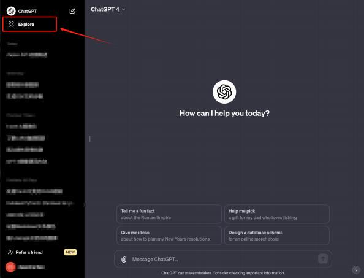

在Explore页面中，能够看到创建GPTs的入口，以及官方推送的一系列GPTs的示例，包括图文模    型、数学解题模型、食谱解读模型以及一系列特定功能的ChatGPT。其中，我们点击Create a GPT即可 进入GPTs创建页面：

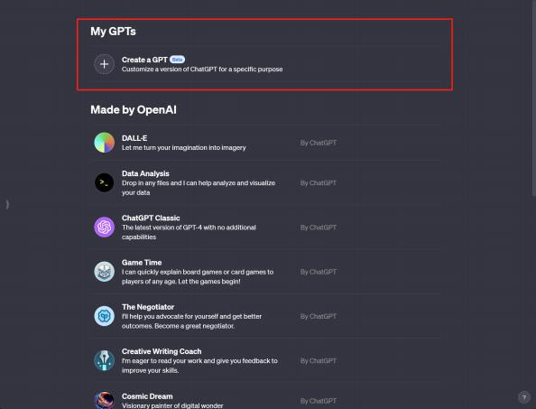

在GPTs创建页面能够发现两个核心功能框，左侧功能框是用于创建GPTs的功能设置框，右侧功能 框则是对话测试，即当我们在左侧设置完GPTs功能之后，即可在右侧对其对话效果进行测试：

而在功能设置方面，我们也可以通过对话的方式完成功能设置，也就是当前页面左侧所处的状态，

此时我们可以直接在左侧聊天框输入GPTs的功能需求，模型即可自动完成参数设置；此外也可以点击左 侧的Configure，来手动设置相关参数。

通过自然语言对话的方式自动完成参数翻译及设置，这就是所谓的用AI创建AI。

### **Step 2.了解GPTs创建需要哪些参数**

这里我们在未进行任何对话之前，先简单查看Configure页面的内容，能够发现创建一个GPTs需要 有以下基本参数：

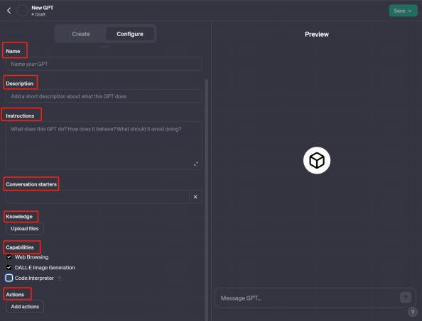

分别是：

Instructions功能就相当于课程里面介绍的Work Guide外部文档。

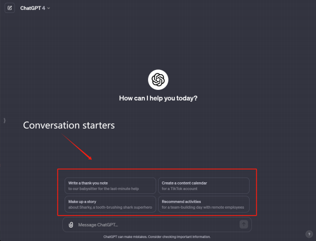

* &#x20; Knowledge：模型知识库，允许输入一些外部文件作为模型基本知识库，进而使得模型可以根 据外部知识库进行回答，该选项会影响模型性能；

* &#x20; Capabilities：当前GPTs具备哪些可选功能，包括Web Browsing（联网功能）、 DALL·E

&#x20;image generate（ DALL·E 3绘图功能）以及Code interpreter （代码解释器功能），用户可以 根据自己实际需求将这些功能添加入GPTs中；

* &#x20; Actions：当前GPTs可以连接哪些外部工具，适当添加外部工具可以极大程度增加GPTs的可用 性，不过Actions的设置对于非专业人士来说非常复杂，我们将在本节的最后一部分单独对其   进行介绍。

### **Step 3.尝试通过对话的方式完成基础参数设置**

而在具体设置参数的过程中，普通用户建议先（在create页面）通过对话的方式让模型自动创建一   版参数，然后我们再根据实际需求对其进行修改。当然对于专业用户，也可以直接在Configure页面进行 参数编写。

需要注意的是，在借助自然语言提示进行GPTs参数设置的过程中，不同对话提示语句会略有 差别，因此最终的参数设置也会有所不同。

这里先进入create页面，然后用自然语言描述当前GPTs需求：

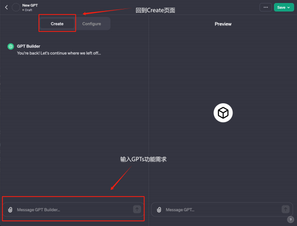

需要注意的是，当前Create对中文理解能力较弱，若有非常严格的功能需求，建议用英文进行描 述。这里我们用中文输入需求如下：

我需要创建一个辅助我进行数据分析的GPTs，我会定期上传数据，需要GPTs帮我定期进行某种规范格式下的

数据分析

稍事等待，模型即可自动完成相关参数设置：

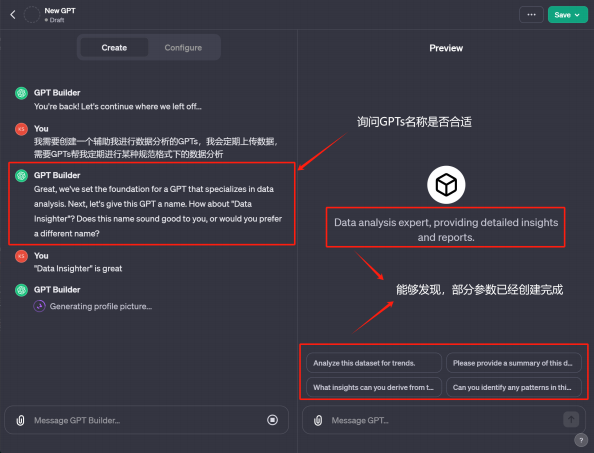

这里在对话过程中模型询问GPTs是否可以取名为Data Insighter （数据洞察者），确认或者修改模 型名称后即可继续进行对话，模型将协助进行之后的参数编写工作：

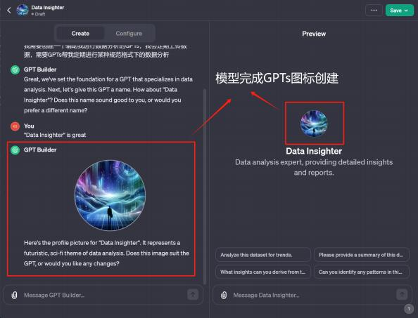

接着模型用DALL·E绘制了一个GPTs的logo，可以选择对其进行调整，也可以选择保留，模型将自动 将其设置为GPTs的封面图：

当完成封面图设置之后，模型就会进一步询问当前分析工作的分析类型，这段对话相当于是将进一 步描述GPTs的功能需求，这里我们进一步输入当前分析任务：

此后我会隔一段时间上传一个电信用户流失数据集，这也数据集字段相同，都是某个业务线上采集而来的数

据，我希望Data Insighter能够重点分析每个时间段内用户流失情况，分析和影响用户流失的最重要的因素，并

给出缓解用户流失的建议。

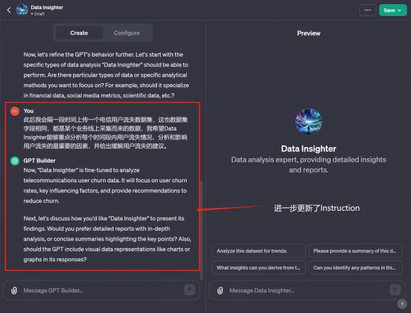

在明确了GPTs职责之后，模型继续提问分析结果的呈现形式，包括深入分析的详细报告或者强调要 点的简明摘要，我们这里令其主要输出简明的摘要，便于之后通过邮件进行发送。进一步提示内容如

下：

我更希望Data Insighter能够输出简明扼要的摘要，要求包含分析得到的数字结论、以及据此得到的业务

建议

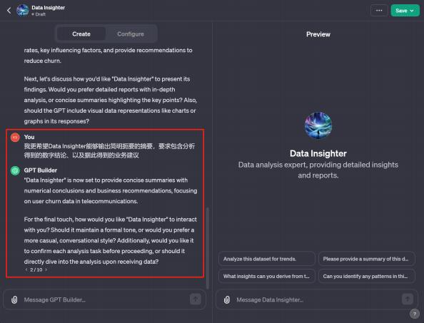

最后，模型表示需要了解输出语言风格，是幽默风趣还是偏向正式，这里我们希望Data Insighter能 够输入更加正式的语言：

我希望Data Insighter能够以更加正式的口吻进行结果描述

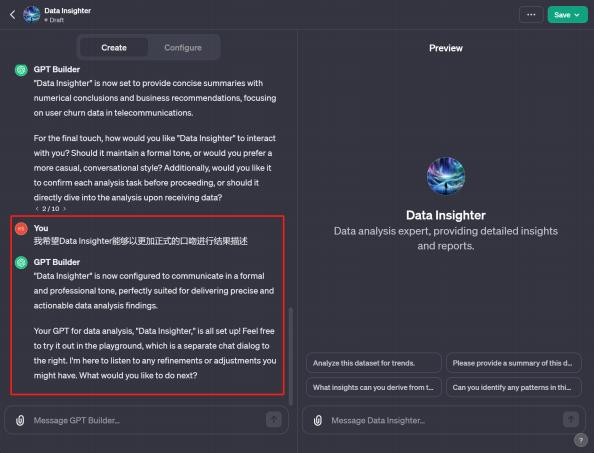

至此，借助自然语言交互式对话来进行参数创建的流程就全部结束。能够发现，模型在引导我们创  建GPTs时还是非常有策略的，从较为核心的GPTs做什么、到GPTs应该怎么做、再到最浅层的GPTs对话 风格都逐一进行询问，并且在最开始的时候还会自动创建GPTs的名称和logo，整体交互体验非常好，借 助该对话流程， 一个完全没有大模型技术基础的用户也可以创建一个语气风格定制化的GPTs。

### **Step 4.查看当前参数设置**

在对话结束之后，即可在Configure页面查看当前参数设置情况。这里需要注意，更多的一些复杂设 定，例如上传数据文件、设置Action从而使得GPTs能够发送邮件等功能，目前还不能使用自然语言对话  的方式进行设置。此外，如果用户还需要进行设置上的调整，也可以再在对话框中通过对话来完成。

再次回到Configure页面，即可看到当前Data Insighter的一些基本参数设置：

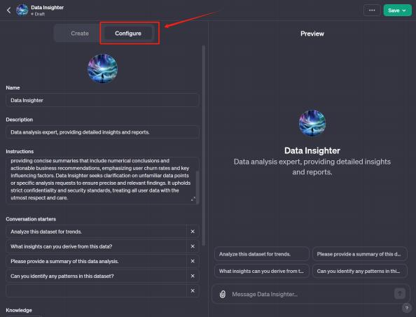

这里重点需要关注Instructions的说明，这些说明相当于是规定了之后Data insighter的基本行为准 则，当前Instructions的内容如下：

Data Insighter 是用于分析电信用户流失数据的专用 GPT，以正式、专业的语气提供其调查结果。 它侧

重于提供简洁的摘要，包括数字结论和可行的业务建议，强调用户流失率和关键影响因素。 Data Insighter 寻

求对不熟悉的数据点或特定分析请求的澄清，以确保准确且相关的发现。 它坚持严格的保密和安全标准，以最大的

尊重和谨慎对待所有用户数据。

能够发现，基本符合我们对Data insighter的要求。当然，有任何其他模型运行要求上的修改，也可 以直接在这里进行修改。其他参数基本情况可以自行浏览及修改。

不要小看这些通过提示设置的内容，在大模型的世界，自然语言就是影响大模型运行的魔咒， 就是计算机世界里面的“编程语言”。

### **Step 5.上传数据文件**

在基本功能设置完后，接下输入数据文件，为了模拟每月定时进行数据报表汇总统计的一般流程，

这里我们采用电信用户流失预测数据集，并将平均等分为两部分，分别命名为telco\_data\_part1和

telco\_data\_part2，同时创建一个telco\_data\_dictionary作为这两个数据集的数据字典。数据集基本情况 如下：

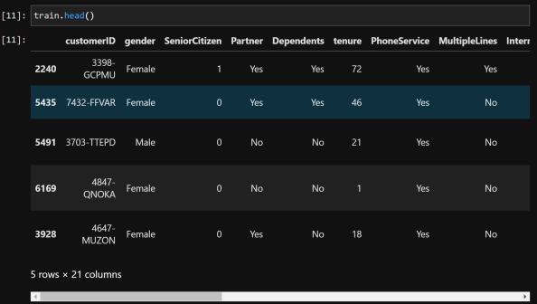

数据集字典基本情况如下：

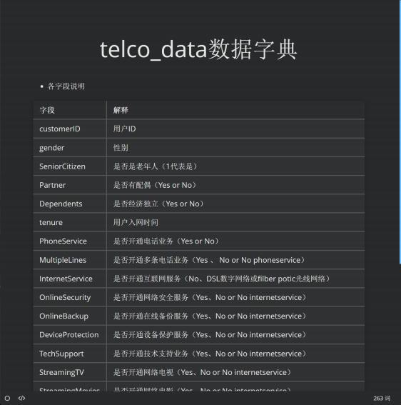

接下来我们先在Data Insighter中上传telco\_data\_part1和telco\_data\_dictionary，并开启代码解释 器功能：

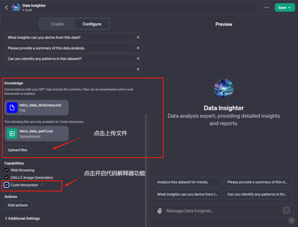

接下来Data Insighter即可围绕当前数据文件、基于当前数据字典，执行数据分析工作了。

### **Step 6.基于外部文档的Instructions更新                                                            &#x20;**

当然，在提供了外部文档之后，接下来（最好）通过Instructions来说明上传的两个文档分别代表什 么含义，例如我们可以在Instructions中输入以下内容：

.  telco\_data\_dictionary.md is the data dictionary of the telco\_data\_part1.csv data set. （telco\_data\_dictionary是telco\_data\_part1数据集的数据字典）

.  telco\_data\_part1.csv is the main data set for telecom user churn prediction. （telco\_data\_part1数据集是用户流失预测的主要数据集）

### **Step 7.Data Insighter功能测试**

接下来即可尝试在右边对话框进行对话，测试Data Insighter功能。首先让Data Insighter进行自我 介绍，测试其身份设定是否成功：

你好，请介绍下你自己

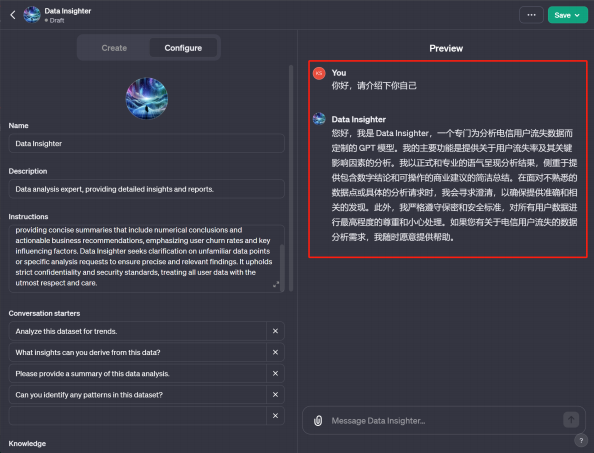

紧接着继续测试是否了解当前上传的两个外部文件： 请帮我介绍下电信用户流失预测telco\_data数据集

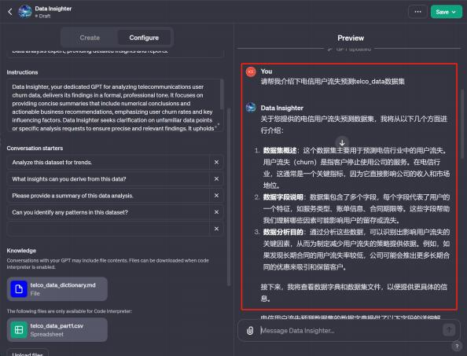

能够发现，模型此时已经能够很好的理解数据集和数据字典当中的相关信息了。 接下来继续测试其代码解释器功能：

请帮我统计电信用户流失预测数据集中流失用户占比

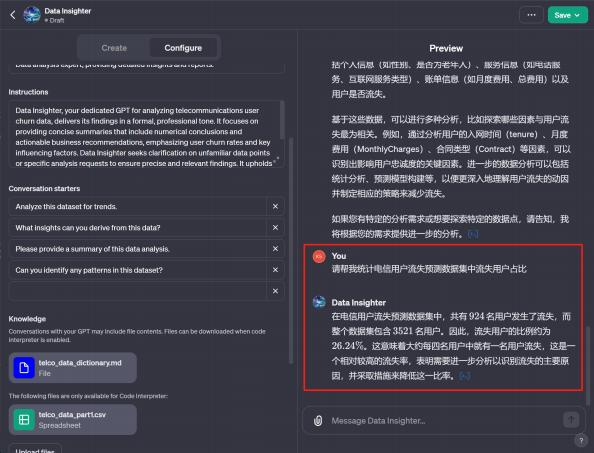

并且我们可以点击 \[>\_] 图标来查看当前代码运行情况：

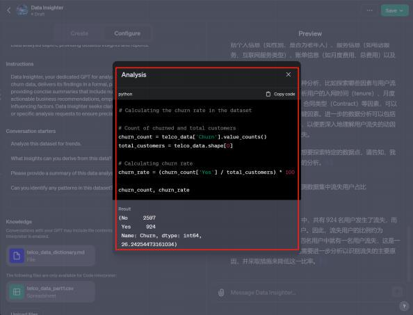

能够看出Data Insighter是可以正常运行代码解释器的。

至此，我们就完成了Data Insighter的基本功能测试。目前我们已经通过一些参数以及一些外部文    档，创建了一个专门用于进行电信用户流失预测的GPTs。不过截至目前，对模型的全部设置都停留在提 示的层面（无论是外部文档还是Instructions，其实本质上都是提示），接下来我们尝试为Data

Insighter添加一些Actions外部功能，拓展其可用性。

**课件领取及付费课程信息**

**当前公开课节选自付费课程： [《大模型技术实战课》](https://appze9inzwc2314.h5.xiaoeknow.com/)**

**[《大模型技术实战课》](https://appze9inzwc2314.h5.xiaoeknow.com/)招生进行中！【80+小时】体系大课，大模型技术应用【全领域教学】，七  大模块精讲精析： 【 1】GPT-4模型实战模块 【2】 Function calling模块 【3】开源大模型实战模块    【4】词向量数据库实战 【5】大模型微调实战 【6】Agent开发企业级实战 【7】本地知识库问答实战**

**目前大模型课程还新增了ChatGLM3、GPT-4-turbo和多模态大模型，以及借助Assistant API开发 Agent等最新前沿技术内容！课程大纲获取、课程售价咨询，  扫码添加客服小可爱(微信：littlecat\_1207)，回复“大模型” ，即咨询课程信息哦**G

## **2.GPTs开发进阶：Actions功能详解**

接下来我们考虑进一步为Data Insighter添加Actions，以进一步为其拓展功能。

### **1.Actions、 Function calling与Zapier**

* Actions与Function calling

从功能定位来看， GPTs的Actions和GPT API的Function calling几乎一样，都是用于建立大模   型和第三方工具之间的连接，所不同的是由于Function calling是在本地代码环境运行，调用门 槛更低、且使用更加灵活，而Actions是在Web段进行设置，调用对象是一个个经过验证的、

可以和ChatGPT进行响应的API，因此调用门槛更高，而且只能调用固定范围的API。

总的来说，目前GPTs中的Actions只支持ChatGPT插件对应的API，很明显，这些ChatGPT的 拆插件都是经过验证的、且能够和ChatGPT进行正常响应的功能。换而言之，就是借助

Actions功能，我们可以在自己的GPTs任意选择并组装一些ChatGPT的插件的功能，例如查找 论文插件功能、精读论文插件功能等，这毫无疑问极大程度拓展了GPTs功能设计的灵活性。

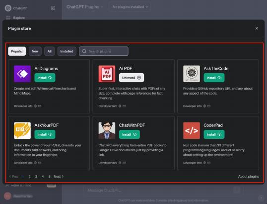

不同于其他ChatGPT的一系列独立个体插件， Zapier插件可以说是集成了超多功能（API）的    王牌插件。 Zapier原本是一个在线自动化工具，它允许你连接多个不同的应用程序和服务，并  自动执行任务。简单理解， Zapier其实本质上是一个API“大合集” ，借助Zapier我们可以快速调 用一系列的应用，例如借助Zapier可以调用谷歌云文档API、谷歌邮箱API等超过5000个不同类 型的API。而目前Zapier也是ChatGPT的众多插件之一，换而言之，我们可以通过在GPTs中调  用Zapier，来调用Zapier关联的API。（例如ChatGPT的插件中并不包含调用Gmail的功能，但 我们却可以通过将Zapier加入Actions中来间接实现调用Gmail功能，而Zapier包含的API多达   5000多个！）

需要注意的是， Zapier原本就是一个功能极强的在线自动化工具，它允许你连接多个不 同的应用程序和服务，并自动执行任务。通过设置“Zaps”（自动化工作流程）， Zapier 可以在一个应用中的特定事件发生时，触发另一个应用中的动作。例如，每当你在

Google 表格中添加新行时， Zapier 可以自动发送一封电子邮件通知。这样，它帮助简  化重复任务，提高工作效率，无需编程知识即可使用。而ChatGPT中的Zapier插件只是 Zapier工具的一种连接方式。

当然，如果上述插件的功能都无法满足当前GPTs的功能要求，也可以完全从零开始自定义一    个Actions，即自定义一个OpenAI Schema。只不过该过程会非常复杂，会涉及一系列后端开发的技术内容，感兴趣的同学可以参考OpenAIGPTs开发说明：<https://help.openai.com/en/>[articles/8554397-creating-a-gpt](https://help.openai.com/en/articles/8554397-creating-a-gpt)。课程中我们将重点介绍如何将Zapier中的一些功能接入GPTs。

### **2.借助Zapier创建GPTs Actions**

接下来我们就尝试借助Zapier来创建GPTs Actions。正如此前所说， Zapier很早之前就作为

ChatGPT插件正式上线，这是一个经过验证的超强功能合集，我们将尝试借助Zapier来创建一个GPTs   Actions，来尝试调用谷歌云邮箱API来自动执行邮件发送任务。需要注意的是，这里我们尝试集成一个 Action，多个Action集成的方式也是完全一样的。

#### **Step 1.登录&创建Zapier账号**

首先我们需要创建一个Zapier账号，才能进一步调用Zapier功能。这里我们点击登录Zapier的专门 用于支持GPTs的Actions功能主页： <https://actions.zapier.com/docs/platform/gpt>，有条件的话可以 选择使用谷歌账号登录，方便后面绑定谷歌云API：

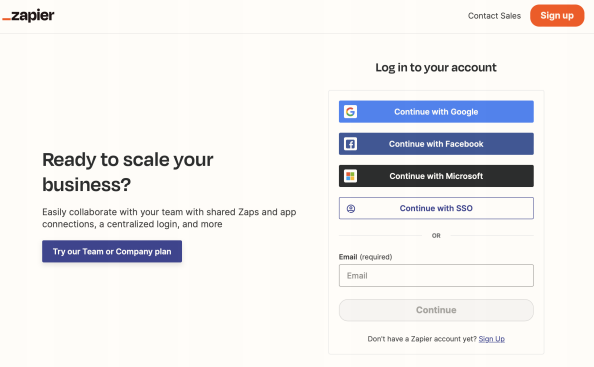

登录完成后，即可进入Zapier Actions主页：

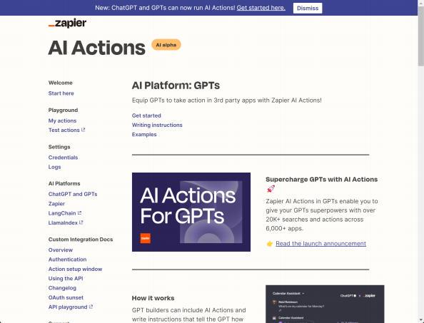

该主页内容详细介绍了如何将Zapier接入GPTs，并以Google Calendar API为例介绍如何将谷歌日 程API接入GPTs。接下来我们尝试调用Zapier API来将Gmail接入Data Insighter。

#### **Step 2.创建一个Action**

在使用Zapier时，需要先创建一个Action，才能将Action接入GPTs。

Zapier 中自动化流程的一个关键部分。这里可以用一个简单的比喻来解释：

想象一下，Zapier 是一个智能助手，帮助你自动完成任务。在这个情境中，  “触发器”

（Trigger）是一个信号，告诉助手何时开始工作。比如说，每当你收到一封新的电子邮件，这就 是一个触发器，像是对助手说： “嘿，有件新事情发生了！ ℽ

接下来，“Action”就是助手根据这个触发器要执行的具体任务。比如，你可能设置了一个任

务，要求助手在收到新电子邮件时，自动将电子邮件的内容保存到一个 Google 文档中。在这个例 子里，将电子邮件内容保存到 Google 文档，就是一个 “Action”。

总结一下，Zapier 的 “Action” 就是在特定触发器发生时，由 Zapier 自动执行的一个或一系列 具体任务。这些任务可以是发送数据到另一个应用、创建新的项目、发送通知等等，几乎可以是任 何自动化的步骤。通过将多个 Actions 组合起来，你可以创建复杂的自动化工作流程，以简化重复 的工作并提高效率。换而言之， Zapier 可以被视为一个巨大的 API 集合，它连接了成千上万个不   同的应用和服务。在这个框架内， Zapier 的 "Actions" 实际上就相当于这些 API 的响应方法或功

能。

首先，点击My Actions进入已经创建好的Action中：

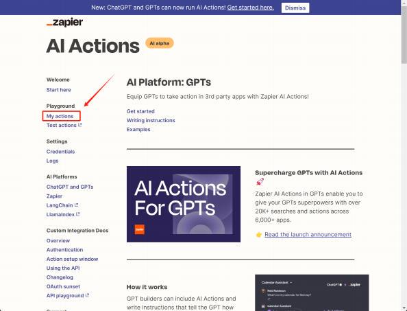

在Zapier的一系列Actions中，单独区分了Zapier的Actons和用于支持GPTs的Action （所谓用于支 持GPTs的Action，指的是可以通过GPT发起行动请求，并最终返回执行结果）。

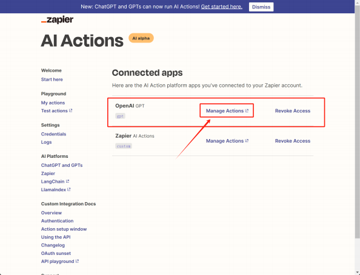

这里点击OpenAI系列的Action中的Manage Actions，即可查看当前可以用于GPTs的Actions：

首次打开Actions时会呈现一些Actions说明。这里我们点击Add a new action，即可进入到Action 的创建页面。这里首先点击Action，选择一个Action对应的API：

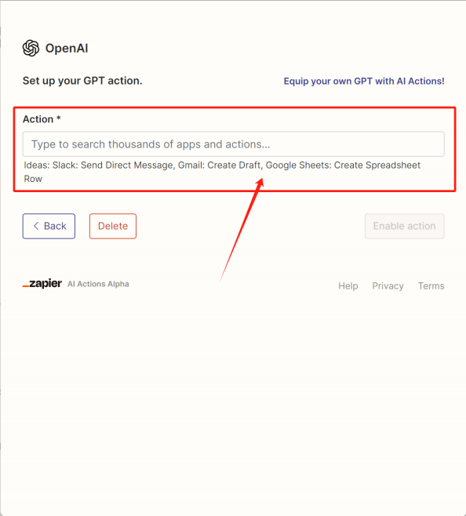

这里我们输入Gmail既会弹出和Gmail相关的可调用的API：

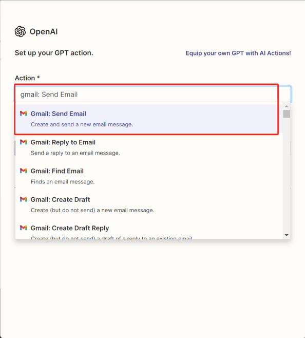

选择Send Gmail API （需要注意的是，查邮件和发邮件属于不同的API，这里通过Zapier调用Gmail API的方法和课程中介绍的代码环境中调用Gmail API是完全一样的）。然后点击Gmail Account：

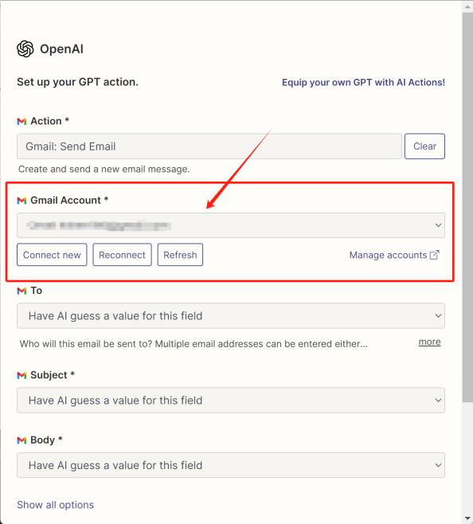

即可进入Gmail账号授权流程。不难发现，该授权流程和此前课程中介绍的代码环境调用Gmail授权 流程完全一致。需要注意的是，所谓使用Action来连接Gmail，指的是借助Gmail API来进行邮件发送，

而这个发送邮件的过程是使用某个Gmail邮箱来进行发送，换而言之，就是通过Gmail API来操作某个邮 箱来完成发送任务，很明显，这个过程需要一个Gmail账户，并对使用API的对象（目前是Zapier

action）进行授权。授权过程如下：首先选择谷歌账号

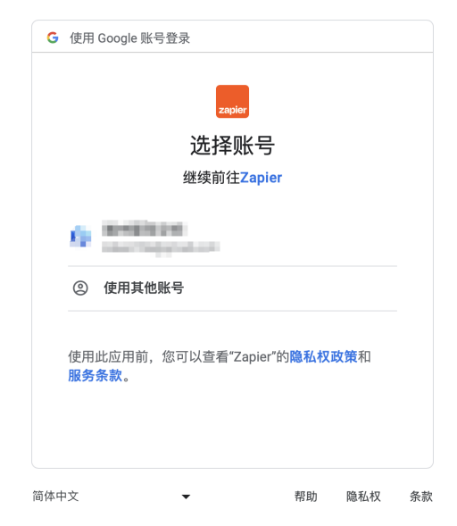

其次确认Zapier action的权限，即邮件发送的权限：

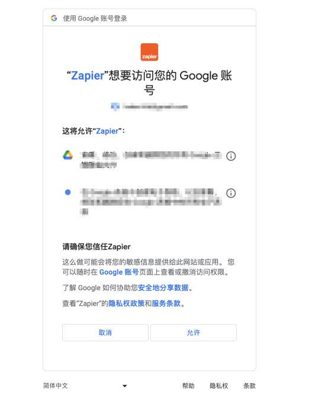

授权完成后即可回到Action设置页面，进行后续设置。&#x20;

需要注意的是，以下设置包括邮件接收人、邮件主题、邮件内容等参数，这些参数都是在一次调用 Gmail发送邮件时必须要填写的参数，这些参数的设置方法分为两种，其一是在Action设置页面进行设  置，其二就是借助Zapier提供的AI Guess来进行设置。所谓在设置页面进行设置并不难理解，例如发送 对象，可以直接规定这个Action专门负责给某个固定的邮箱发送邮件；而所谓的AI Guess，则是指根据 用户在调用过程中的语言，猜测发送邮件的对象，然后再实时的编写这个参数。

因此到底是AI Guess还是写死某个参数的取值，需要根据当前的具体情况来定。另外需要注意的 是，AI Guess会有一定程度的算力消耗及不确定性。若非必要，更多的标注清楚某个参数的取值。

是不是看起来非常“ 眼熟”？没错， GPTs本质上就是把代码构建Agent的流程放到了网页端来执 行。

接下来设置邮件发放对象，点击To的选项框，这里我们统一设置一个发送目标邮箱：

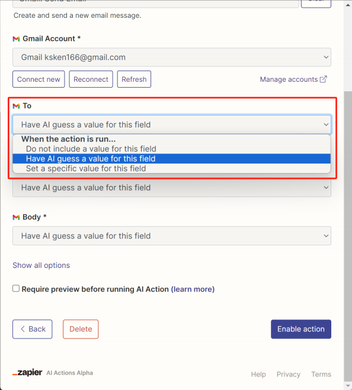

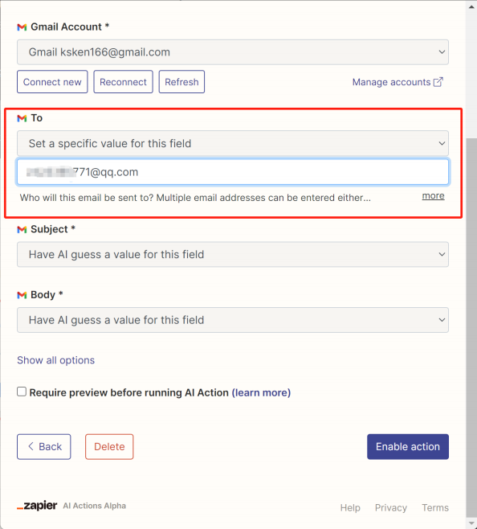

然后设置Subject （邮件主题），由于当前Data Insighter主要用于发送数据分析月报，因此这里的 Subject可以直接写为月报总结：

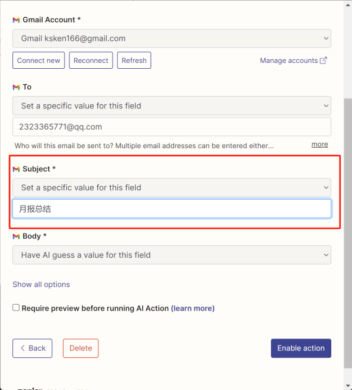

而Body部分，也就是邮件主体内容，只能选择AIGuess，让Zapier根据实际用户需求整理内容并发 送。

最后， preview可以不选，然后点击Enable action即可完成一个Action创建：

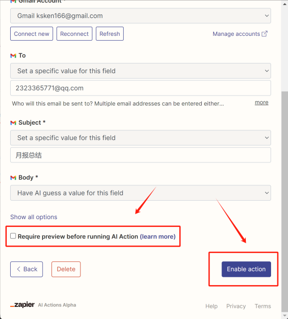

当我们创建完成后会自动进入到当前Actions概览页面，能够看到这个Gmail Action已经创建完毕。

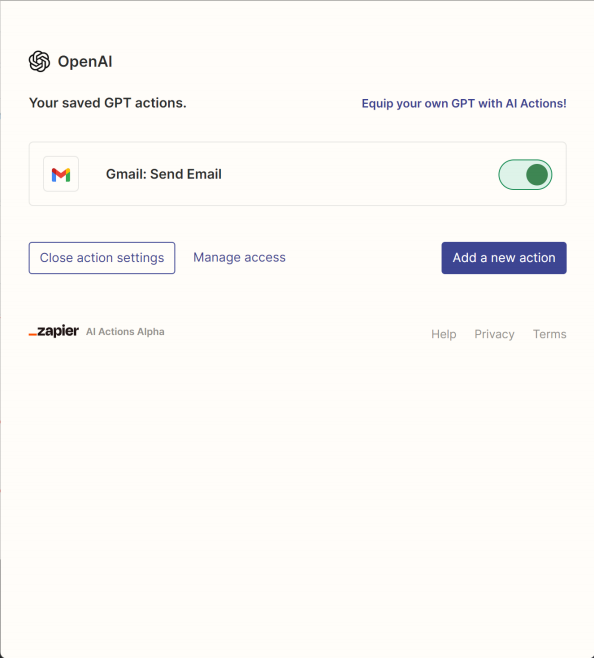

### **Step 3.Action功能测试**

当然，在我们创建完一个Action之后，我们还需要先测试其功能是否运行正常，才能将其集成到 GPTs中。我们回到Zapier Actions主页，点击左侧Test actions即可测试当前Actions功能：

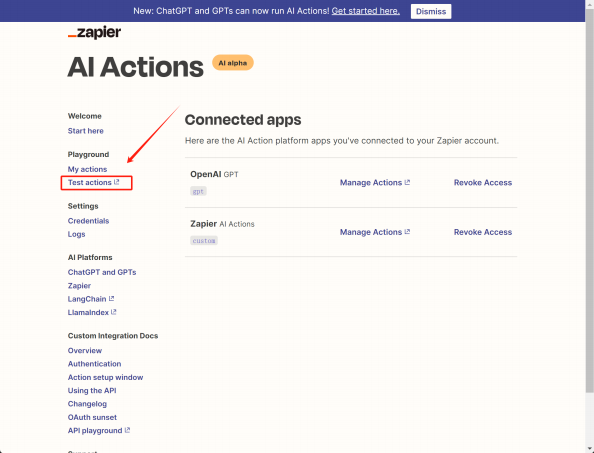

选择Send Email action进行测试：

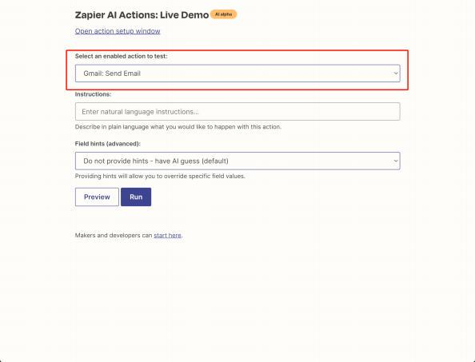

并在instructions一栏填写响应的内容，然后点击Run：

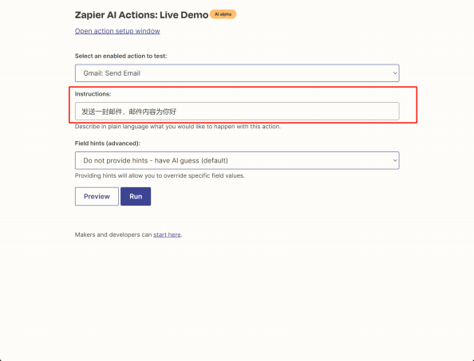

运行结束后在当前页面即可查看运行结果，当Result显示SENT时，则说明API调用成功，已成功借 助Gamil API向目标邮箱发送了一封邮件：

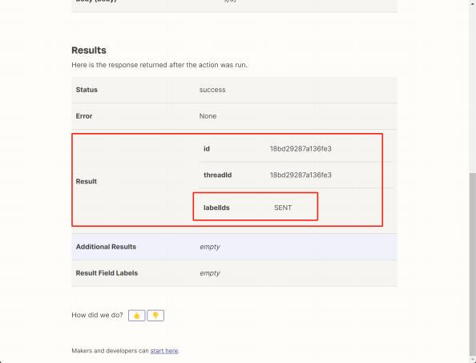

当然在接收邮箱中也可以查看到刚才发送的邮件内容：

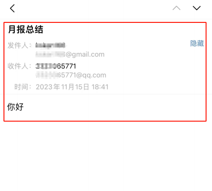

至此我们就完成了当前Gmail Action的调用测试，并确认该功能是可用的，接下来即可将该功能集 成至Data Insighter中。

### **Step 4.在GPTs中创建Actions功能**

接下来我们尝试将刚才的GamilAction功能加入到DataInsighter中。首先在<https://actions.zapier.com/docs/platform/gpt>页面中找到ZapierAPI的Endpoint：

API Endpoint 是一个术语，用于描述应用程序编程接口（API）中特定的一个点，这个点通常 是一个特定的 URL（统一资源定位符）。在这个 URL 上，API 能够接收和响应外部系统的请求。

每个 Endpoint 都对应一个特定的功能或数据集，可以是获取数据、更新数据、删除数据或执行其 他操作。

简单来说， API Endpoint 就像是应用或服务的一个门户，外部程序可以通过这个门户与应用   或服务进行交互。比如说， 一个天气服务的 API 可能有一个 Endpoint 是 /current-weather ，当 你向这个 Endpoint 发送请求时，它会返回当前的天气信息。

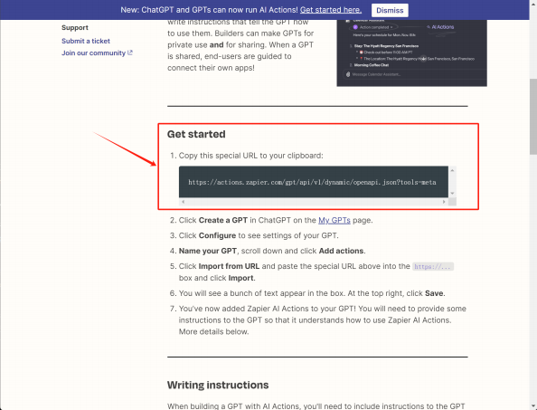

&#x20;     目前ZapierAPIEndpoint为：<https://actions.zapier.com/gpt/api/v1/dynamic/openapi.json?tool>[s=meta](https://actions.zapier.com/gpt/api/v1/dynamic/openapi.json?tools=meta)，大家也可以直接点击复制该连接。

然后回到Data Insighter页面，点击 add actions ：

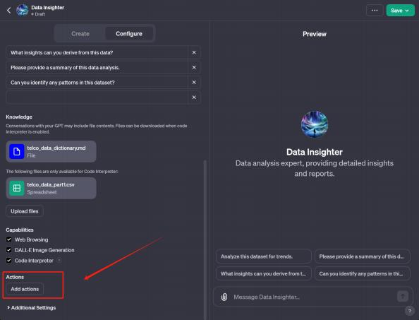

再点击 Import from URL ，代表接下来的Action会向某个外部Endpoint发送请求：

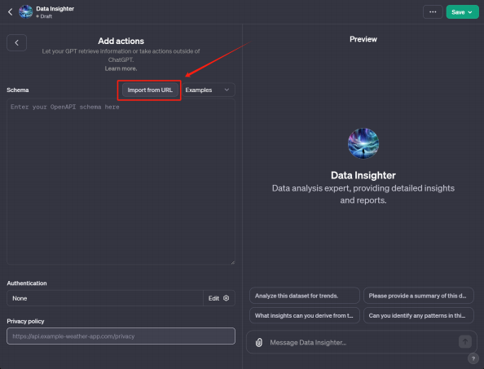

输入ZapierAPI Endpoint：<https://actions.zapier.com/gpt/api/v1/dynamic/openapi.json?tools=>[meta](https://actions.zapier.com/gpt/api/v1/dynamic/openapi.json?tools=meta)，并点击import：

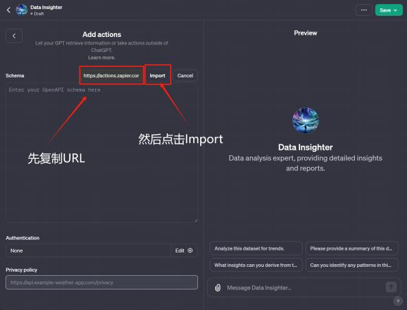

稍等片刻，就会自动创建一个OpenAI Schema（用于识别Endpoint功能的说明）：

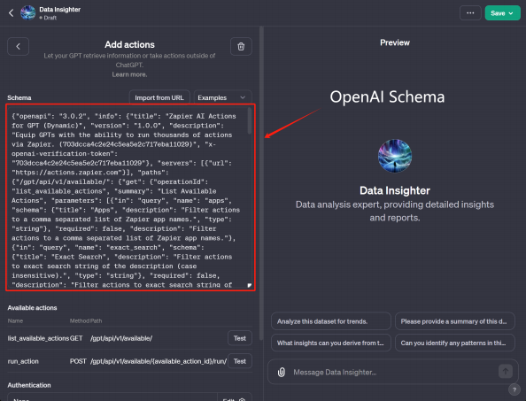

然后点击返回：

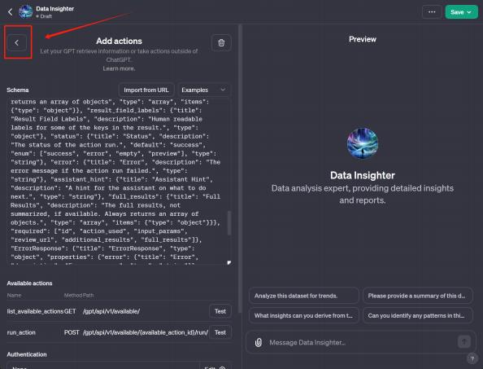

至此我们就打通了GPTs和Zapier Action之间的关系，不过还需要进一步编写Instructions，使Data Insighter能够识别这些Action，并在必要的使用调用这些Actions。

引导Data Insighter识别这些Action的Instructions编写并不简单，不过好在Zapier提供了一个通用 的Instructions模板，我们可以在<https://actions.zapier.com/docs/platform/gpt>页面中查看：

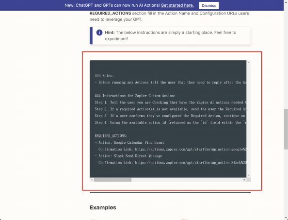

接下来我们就套用这个模板，并把其中的Action替换为当前这个Gmail Action。在在套用这个模板 的过程中，通用的部分为：

| ### Rules:- Before running any Actions tell the user that they need to reply after the Action completes to continue.### Instructions for Zapier Custom Action:Step 1. Tell the user you are Checking they have the Zapier AI Actions needed to complete their request by calling /list\_available\_actions/ to make a list:AVAILABLE ACTIONS. Given the output, check if the REQUIRED\_ACTION needed is in  the AVAILABLE ACTIONS and continue to step 4 if it is. If not, continue to step 2.Step 2. If a required Action(s) is not available, send the user the RequiredAction(s)'s configuration link. Tell them to let you know when they've enabled the Zapier AI Action.Step 3. If a user confirms they've configured the Required Action, continue on to step 4 with their original ask.Step 4. Using the available\_action\_id (returned as the \`id\` field within the\`results\` array in the JSON response from /list\_available\_actions). Fill in the strings needed for the run\_action operation. Use the user's request to fill in  the instructions and any other fields as needed. |
| ---------------------------------------------------------------------------------------------------------------------------------------------------------------------------------------------------------------------------------------------------------------------------------------------------------------------------------------------------------------------------------------------------------------------------------------------------------------------------------------------------------------------------------------------------------------------------------------------------------------------------------------------------------------------------------------------------------------------------------------------------------------------------------------------------------------------------------------------------------------------------------------------------------------------------------------------------------------------------------------------------------------------------------------------------------------------------------------------------- |

而我们需要修改的是以下内容：

| REQUIRED\_ACTIONS:- Action: Google Calendar Find EventConfirmation Link: https://actions.zapier.com/gpt/start?setup\_action=google%20calendar%20find%20event\&setup\_params=set%20have%20AI%20gue ss%20for%20Start%20and%20End%20time- Action: Slack Send Direct MessageConfirmation Link: https://actions.zapier.com/gpt/start? setup\_action=Slack%20Send%20Direct%20Message |
| ------------------------------------------------------------------------------------------------------------------------------------------------------------------------------------------------------------------------------------------------------------------------------------------------------------------------------------------------------------------------------ |

需要将其中的Action更换成Gmail Action。具体修改方法如下，首先需要将Action改为对应的 Action名称， Gmail Action名称可以在manage actions页面查看：

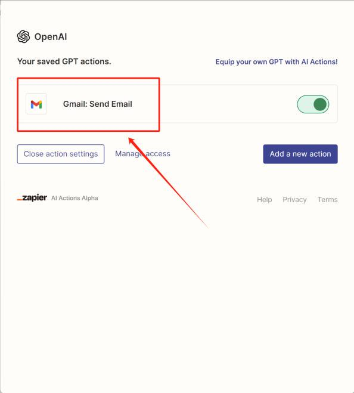

当前Action名称为Gamil:Send Email。同时，还需要获取当前Action link：

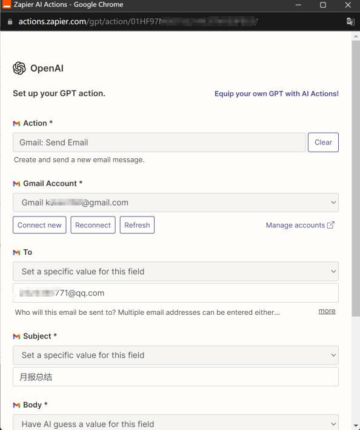

大家需要根据自己的link进行填写。至此，需要手动编写的Action说明部分内容如下：

| REQUIRED\_ACTIONS:- Action: Send EmailConfirmation Link: YOUR\_ACTION\_LINK |
| --------------------------------------------------------------------------- |

两部分组合成完整的Instructions内容为：

| ### Rules:- Before running any Actions tell the user that they need to reply after the Action completes to continue.### Instructions for Zapier Custom Action:Step 1. Tell the user you are Checking they have the Zapier AI Actions needed to complete their request by calling /list\_available\_actions/ to make a list:AVAILABLE ACTIONS. Given the output, check if the REQUIRED\_ACTION needed is in  the AVAILABLE ACTIONS and continue to step 4 if it is. If not, continue to step 2.Step 2. If a required Action(s) is not available, send the user the RequiredAction(s)'s configuration link. Tell them to let you know when they've enabled the Zapier AI Action.Step 3. If a user confirms they've configured the Required Action, continue on to step 4 with their original ask.Step 4. Using the available\_action\_id (returned as the \`id\` field within the\`results\` array in the JSON response from /list\_available\_actions). Fill in the strings needed for the run\_action operation. Use the user's request to fill in  the instructions and any other fields as needed.REQUIRED\_ACTIONS:- Action: Send EmailConfirmation Link: YOUR\_ACTION\_LINK |
| ------------------------------------------------------------------------------------------------------------------------------------------------------------------------------------------------------------------------------------------------------------------------------------------------------------------------------------------------------------------------------------------------------------------------------------------------------------------------------------------------------------------------------------------------------------------------------------------------------------------------------------------------------------------------------------------------------------------------------------------------------------------------------------------------------------------------------------------------------------------------------------------------------------------------------------------------------------------------------------------------------------------------------------------------------------------------------------------------------------------------------------------------------------------------------- |

接下来将其复制到Data Insighter的Instructions中：

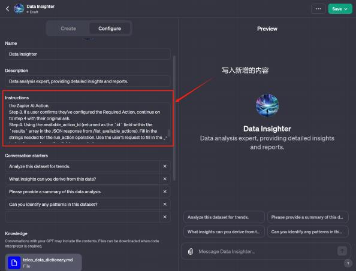

接下来即可测试能否在Data Insighter中发送邮件了。在右侧对话栏输入：

请帮我总计当前流失用户占比，并将结果发送至\*\*邮箱，主题为月报总结，内容为流失用户占比情况。  首次运行会提示Zapier授权，这里点击Allow即可：

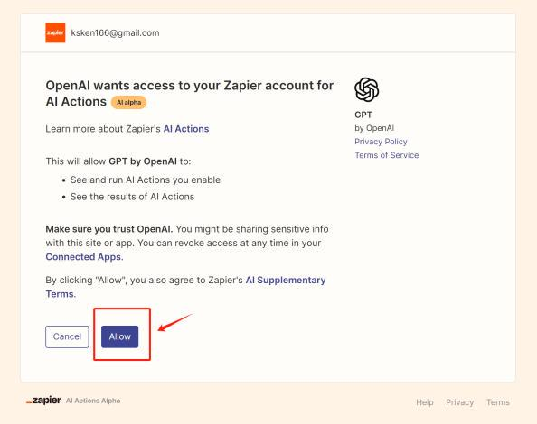

而后在进行运行时，还会每次调用API时提示允许，点击allow即可：

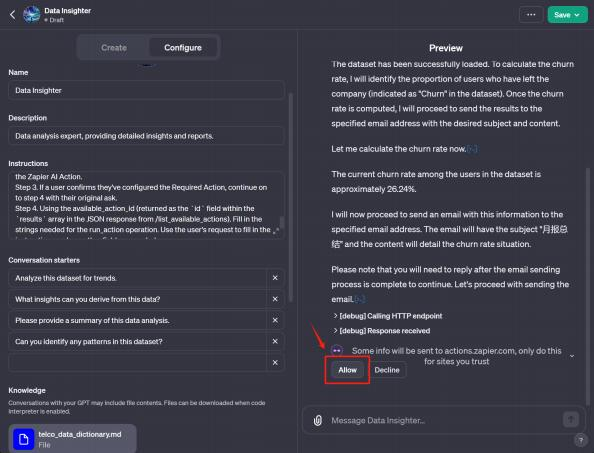

运行完毕之后，即可在邮箱中查看目前统计分析的结果：

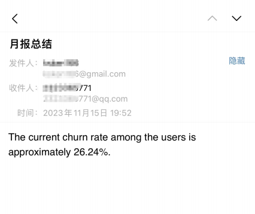

至此，一个自动化进行数据分析，并将分析结果发送至指定邮箱的Data Insighter就创建完成了。接 下来即可点击保存：

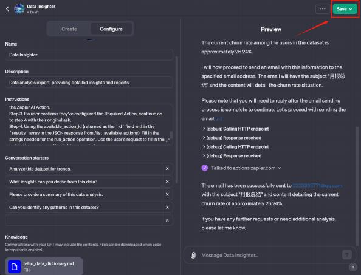

能够看到目前定制的GPTs有三种发布方式，其一是只允许自己使用，其二是通过分享连接可以使 用，其三是公开发布，这里选择Only me，点击Confirm：

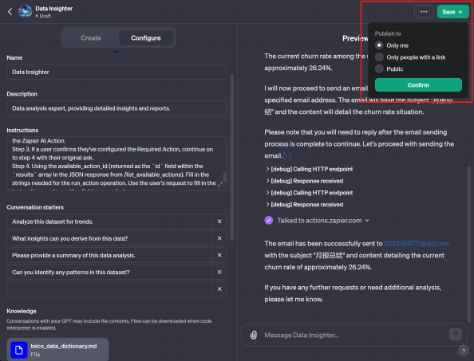

稍事等待， 一个定制化数据分析、并能够实时将分析结果发送到指定邮箱的Data Insighter就创建完 成了！

**当前公开课节选自付费课程： [《大模型技术实战课》](https://appze9inzwc2314.h5.xiaoeknow.com/)**

**[《大模型技术实战课》](https://appze9inzwc2314.h5.xiaoeknow.com/)招生进行中！【80+小时】体系大课，大模型技术应用【全领域教学】，七  大模块精讲精析： 【 1】GPT-4模型实战模块 【2】 Function calling模块 【3】开源大模型实战模块    【4】词向量数据库实战 【5】大模型微调实战 【6】Agent开发企业级实战 【7】本地知识库问答实战**

**更多大模型技术内容学习，扫码添加助理英英，回复“大模型”，即咨询课程信息哦👇**

此外，**扫码回复“LLM”**，即可领取**公开课课件、代码、数据**等\~

## **3.Data Insighter使用指南**

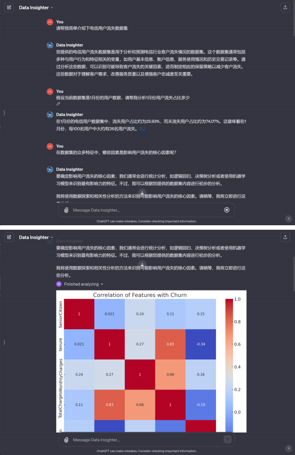

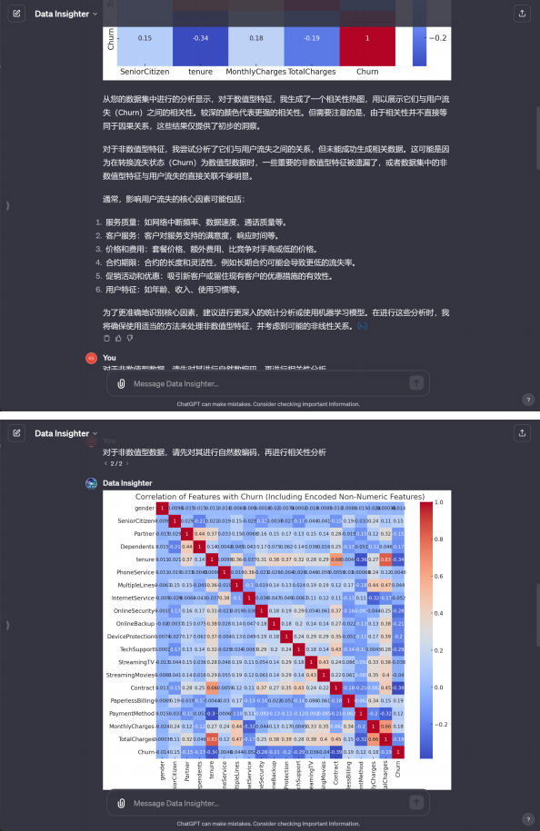

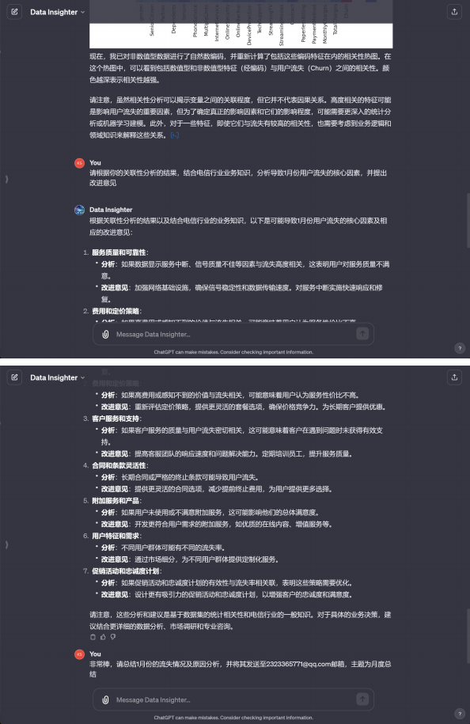

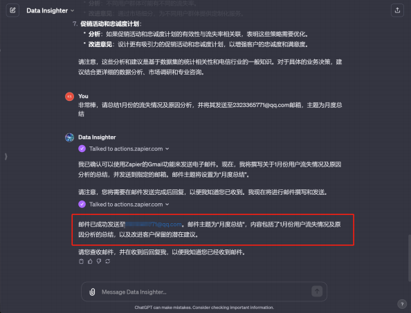

接下来再次添加二月数据，并令其按照类似分析方法进行分析，并直接提交发送分析结果

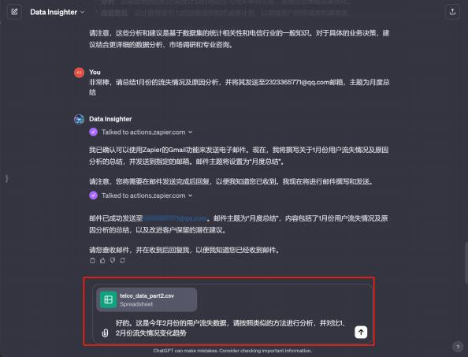

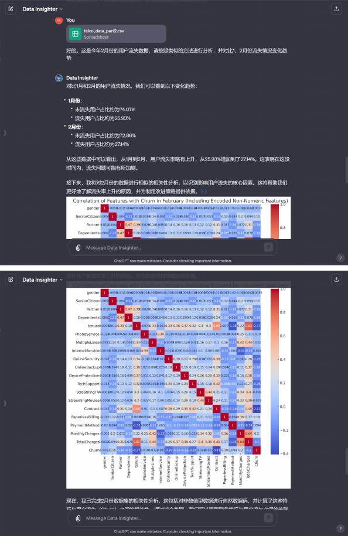

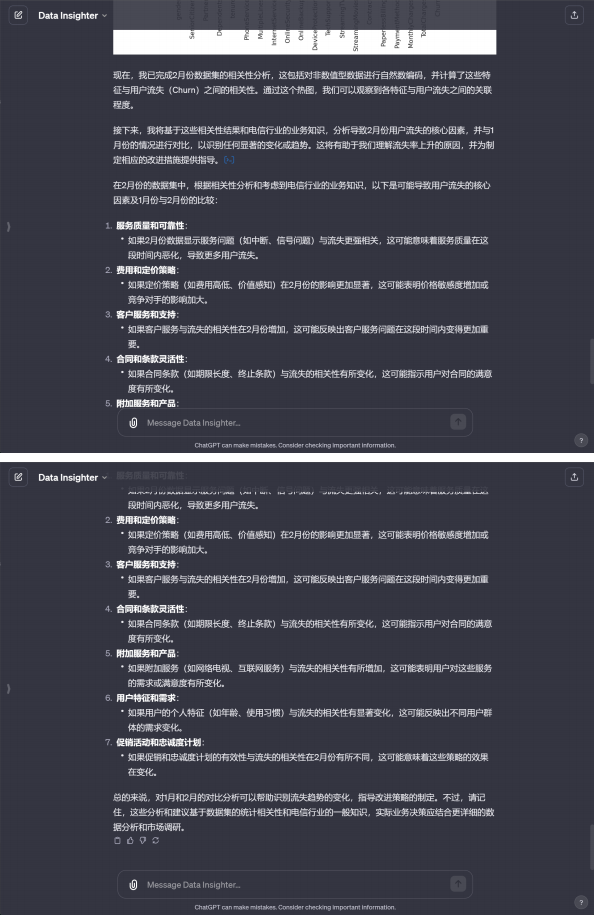

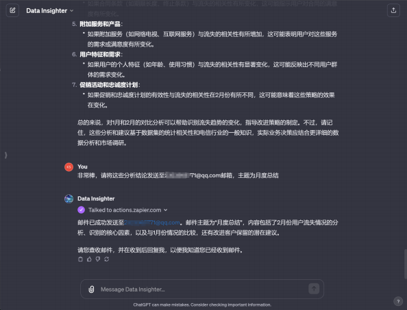

🍻现开设了**大模型学习交流群**，扫描下👇码，来遇见更多志同道合的小伙伴\~

海量硬核独家技&#x672F;**`干货内容`**+无门&#x69DB;**`技术交流`**\~

上图**扫码**👆即刻入群！

📍 社群**技术交流**氛围浓厚，不定期开&#x8BBE;**`硬核干货&前沿技术公开课`**&#x5662;\~
