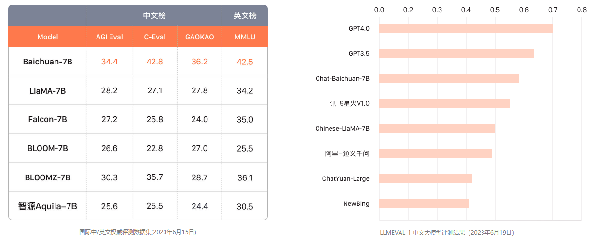
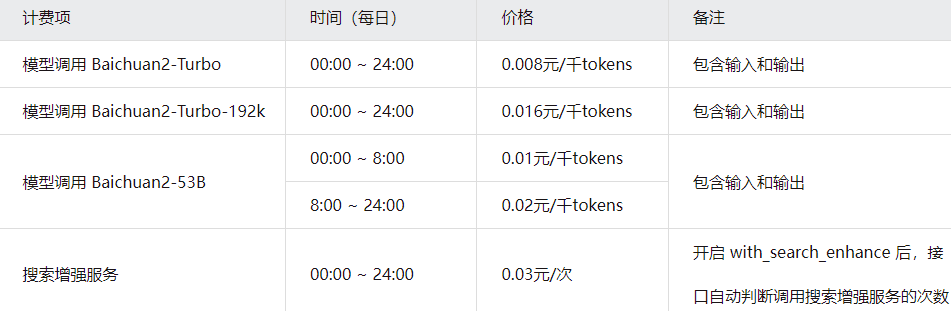
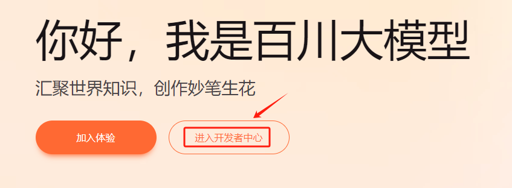
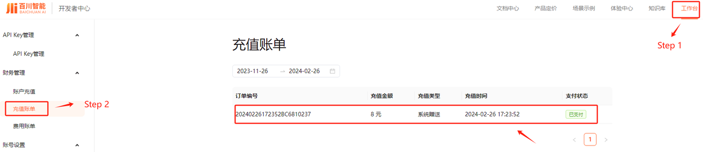
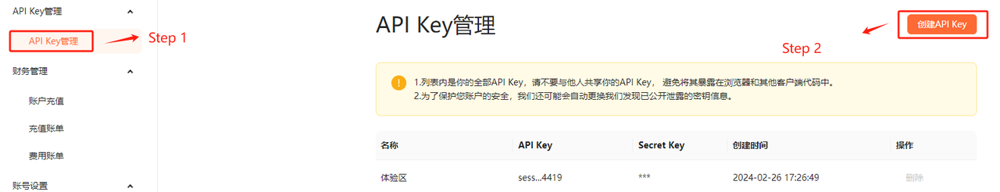
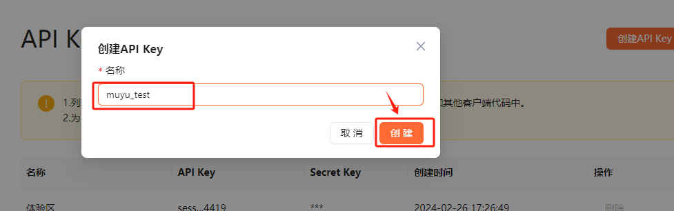
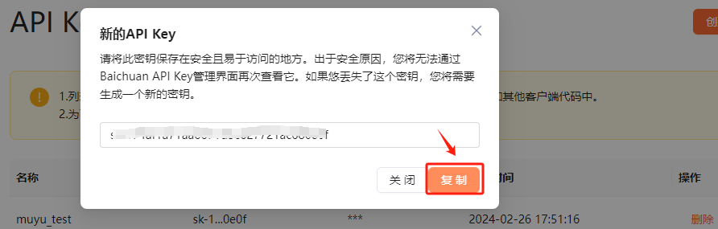
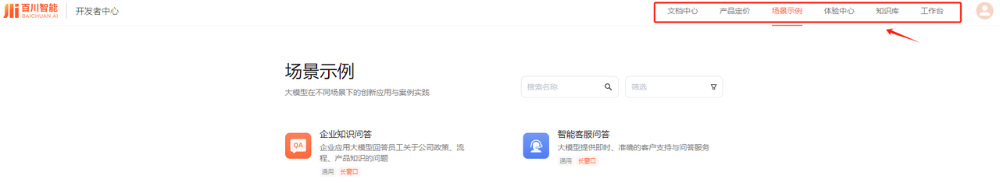
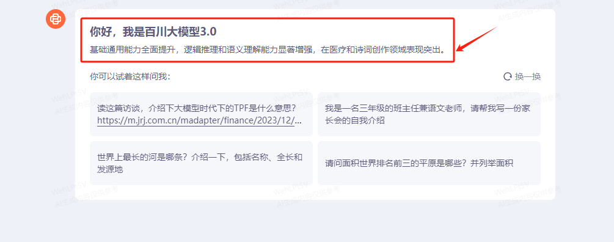

# 本地部署开源大模型

## Ch.16 BaiChuan 2 大模型生态介绍及本地私有化部署方案

  百川智能公司，是由搜狗创始人王小川在2023年4月10日创建。在成立后不到100天的时间里，该公司分别于2023年6月15日和2023年7月11日发布了Baichuan-7B和Baichuan-13B两个参数量的预训练大模型。其中，\*\*Baichuan 7B模型是我国国内首个开源且可商用的大模型，在多项国内外数据集评测中同级别参数量下均获得第一名，尤其在中文榜单上大幅领先，并在英文榜单上首度超越LlaMA。\*\*这样的性能效果使得百川智能在很长一段时间内被认为是在国内开源大模型领域类OpenAI一样的存在，将引领国内开源模型的生态和快速发展。

* **Baichuan-7B中英文榜评测**

  Baichuan-7B在发布之初，相关评测的数据集及对应的评测指标如下：（官方说明地址：https://github.com/baichuan-inc/Baichuan-7B）

* AGIEval：用来评估模型的认知和解决问题相关的任务中的一般能力，在实际评测中，只保留了其中的四选一单项选择题，随机划分后对所有模型进行了统一 5-shot 测试；

* C-Eval：该数据集是一个全面的中文基础模型评测数据集，涵盖了 52 个学科和四个难度的级别。在实际评测中，使用该数据集的 dev 集作为 few-shot 的来源，在 test 集上进行了 5-shot 测试；

* Gaokao：一个以中国高考题作为评测大语言模型能力的数据集，用以评估模型的语言能力和逻辑推理能力。 在实际评测中，只保留了其中的单项选择题，随机划分后对所有模型进行统一 5-shot 测试；

* MMLU：包含 57 个多选任务的英文评测数据集，涵盖了初等数学、美国历史、计算机科学、法律等，难度覆盖高中水平到专家水平，是目前主流的LLM评测数据集。在实际评测中，采用了开源的评测方案；

  Baichuan-7B模型基于标准的Transformer结构，采用了和LLaMA一样的模型设计，在约 1.2 万亿 tokens 上训练得到的 70 亿参数模型，使用自有的中英文双语语料进行训练，在中文上进行优化，从上述评测结果上看，Baichuan-7B模型在标准的中文和英文 benchmark（C-Eval/MMLU）上均取得同尺寸最好的效果。

  在实际评测过程中，均使用`5-shot` 进行，baichuan-7B与同级别的其他模型评测效果对比如下：



  而其不同于LLaMA完全禁止商业使用，Baichuan-7B使用更宽松的开源协议，允许用于商业，至此也正式拉开了Baichuan模型的迅速迭代，同时也极大程度上推动了国内大模型开源生态的快速发展

  接下来，我们就来详细的了解一下截止到2024年2月28日，Baichuan大模型的开源生态情况。

# 1. Baichuan在线大模型生态介绍

  百川智能公司通过两个主要策略实现快速迭代和市场扩张：首先，它持续地开源新一代的基础模型及其对应的聊天模型，不断推进技术前沿。其次，通过构建在线API和开发者生态系统，Baichuan模型为开发者提供了丰富的应用开发资源，从而加速其技术的应用与普及。通过这种双轨并行的策略促进Baichuan模型的市场占有率和影响力的提升，而这种策略，也基本符合目前大模型公司的发展决策和态势。

  **百川智能官网：https://www.baichuan-ai.com/home**

* **在线开发者中心**

  在这种模式下使用Baichuan模型的方式，就是我们已经非常熟悉的API调用开发形式，即与OpenAI、GLM4一样，按照实际使用的数据量（千tokens）收费：



  一般情况下Baichuan2大模型1个token约等于1.5个中文汉字。新用户注册，可以领取8元的系统赠送金额用于体验Baichuan的API服务。领取及试用步骤如下：

* **Step 1. 进入百川智能官网：https://www.baichuan-ai.com/home**

  进入百川智能官网后，找到`进入开发者中心`按钮，点击进入。



* **Step 2. 注册登录**

  当进入开发者中心后，先找到左上角`登陆`按钮，使用手机号进行注册并登录，然后便可以点击`[新用户] 点击激发开发者账号，免费领100万Tokens`位置，直接领取体验金额。


* **Step 3. 确认体验金金额**

  接下来进入工作台，可以看到自己账户的一些基本情况，比如账户账单、API Key管理等配置内容。



* **Step 4. 构建API测试流程**

  在领取到体验金后，当前的账户就已经获得了一定数量的Tokens免费使用额度。接下来，我们可以尝试通过在线API调用的方式与Baichuan大模型进行交互。首先，需要先创建一个可以使用的API Key，创建方式如下：



  在弹出的页面中，给当前的API Key取一个名称，点击创建。



  **注意：生成新API Key后，务必在此步骤复制并妥善保存当前的秘钥。一旦关闭页面，将无法再次复制该秘钥。**



* **Step 5. 调用Baichuan模型**

  通过API调用Baichuan模型的方式与OpenAI、Qwen等其它模型的调用方式相似，主要采用HTTP协议，并通过POST请求实现交互。具体的实现过程如下：

```python
import requests
import json
```

```python
# 这里写入 Http请求的URL，是固定的
url = "https://api.baichuan-ai.com/v1/chat/completions"

# 这里写入在Step 4步骤中创建的API Key
api_key = "sk-xxxx"
```

  构建HTTP请求的Header，`Content-Type`表示请求的数据格式，目前仅支持 JSON 格式，固定填写"application/json"，`Authorization`则是请求鉴权的 APIKey，由百川提供。

```python
headers = {
    "Content-Type": "application/json",
    "Authorization": "Bearer " + api_key
}
```

  构建Messages，这里还是采用通用的Message对话输入格式：

```python
messages = [
    {"role": "user", "content": "你好，请你详细的介绍一下你自己"}
]
```

  接下来构建请求体。首先在 model 参数中，选择想要使用的模型，目前Baichuan支持的在线模型如下:

| 模型类型  | 模型名称                 | 价格（元/千tokens） |
| ----- | -------------------- | ------------- |
| 通用大模型 | Baichuan2-Turbo      | 0.008         |
| 通用大模型 | Baichuan2-Turbo-192k | 0.016         |
| 通用大模型 | Baichuan2-53B        | 0.01\~0.002   |

  这里选择在`Baichuan2-Turbo`进行测试，同时传入构建好的Messages。

```python
data = {
    "model": "Baichuan2-Turbo",
    "messages": messages,
}
```

  除此之外，我们在上面提到了，在构建HTTP请求的Header时，目前仅支持 JSON 格式，所以对于输入的Data，我们需要使用`json.dumps`将 data 转化为 JSON格式。

```python
json_data = json.dumps(data)
```

```python
json_data
```

```plaintext
'{"model": "Baichuan2-Turbo", "messages": [{"role": "user", "content": "\\u4f60\\u597d\\uff0c\\u8bf7\\u4f60\\u8be6\\u7ec6\\u7684\\u4ecb\\u7ecd\\u4e00\\u4e0b\\u4f60\\u81ea\\u5df1"}]}'
```

  最后，发送一个POST请求到我们前一步指定的URL，并携带自定义的头部信息和JSON格式的数据，从而实现与Baichuan模型的交互。

```python
response = requests.post(
    url, 
    headers=headers,
    data=json_data,)
```

  可以通过`.text`查看到返回的数据信息。

```python
response.text
```

```plaintext
'{"id":"chatcmpl-Mf378012RBUpoGN","object":"chat.completion","created":1709004651,"model":"Baichuan2-Turbo","choices":[{"index":0,"message":{"role":"assistant","content":"你好！我是百川大模型，是由百川智能的工程师们创造的大语言模型，我可以和人类进行自然交流、解答问题、协助创作，帮助大众轻松、普惠的获得世界知识和专业服务。如果你有任何问题，可以随时向我提问。"},"finish_reason":"stop"}],"usage":{"prompt_tokens":8,"completion_tokens":52,"total_tokens":60}}'
```

  如果仅需查看模型的推理结果，可简单的进行如下转化：

```python
# 使用json.loads将字符串解析为字典
parsed_response = json.loads(response.text)

# 提取content的内容
content = parsed_response["choices"][0]["message"]["content"]

content
```

```plaintext
'你好！我是百川大模型，是由百川智能的工程师们创造的大语言模型，我可以和人类进行自然交流、解答问题、协助创作，帮助大众轻松、普惠的获得世界知识和专业服务。如果你有任何问题，可以随时向我提问。'
```

  查看此轮对话花费的Tokens：

```python
# 提取usage的内容
usage = parsed_response["usage"]["total_tokens"]
usage
```

```plaintext
60
```

  经过上述的分步处理流程，我们已经成功的执行完了一轮的对话流程。接下来尝试编写一个`chat_with_baichuan`函数封装上述过程。只需要传入Prompt和选择调用的模型即可快速获取到推理结果。

```python
import requests
import json

def chat_with_baichuan(user_message, model="Baichuan2-Turbo"):
    """
    使用百川大模型进行聊天。
    
    参数:
    - user_message: 用户发送的消息内容。
    
    返回:
    - content: 百川大模型的回复内容。
    """
    # Http请求的URL
    url = "https://api.baichuan-ai.com/v1/chat/completions"

    # API Key
    api_key = "sk-xxx"

    # 设置请求头
    headers = {
        "Content-Type": "application/json",
        "Authorization": "Bearer " + api_key
    }

    # 构造消息
    messages = [
        {"role": "user", "content": user_message}
    ]

    # 构造请求数据
    data = {
        "model": model,
        "messages": messages,
    }

    # 将数据转换为JSON格式
    json_data = json.dumps(data)

    # 发送POST请求
    response = requests.post(url, headers=headers, data=json_data)

    # 解析响应数据
    parsed_response = json.loads(response.text)

    # 提取并返回回复内容
    content = parsed_response["choices"][0]["message"]["content"]
    
    return content
```

  完成函数封装后，尝试输入一条Prompt进行功能测试。

```python
# 注意：此代码仅为示例，实际使用时需要替换api_key
chat_response = chat_with_baichuan("你好，请你详细的介绍一下你自己")
print(chat_response)
```

```plaintext
你好！我是百川大模型，是由百川智能的工程师们创造的大语言模型，我可以和人类进行自然交流、解答问题、协助创作，帮助大众轻松、普惠的获得世界知识和专业服务。如果你有任何问题，可以随时向我提问。
```

```python
# 注意：此代码仅为示例，实际使用时需要替换api_key
chat_response = chat_with_baichuan("请问下，什么是机器学习？")
print(chat_response)
```

```plaintext
机器学习（Machine Learning）是一种人工智能（AI）技术，它使计算机能够在不进行明确编程的情况下从数据中学习。通过分析大量的数据，机器学习算法可以自动识别模式、建立预测模型并做出决策。这种技术在许多领域都有广泛的应用，如图像识别、语音识别、自然语言处理、推荐系统等。
```

  除次之外，还可以通过`model`参数指定不同的Baichuan模型。

```python
# 注意：此代码仅为示例，实际使用时需要替换api_key
chat_response = chat_with_baichuan(model='Baichuan2-53B', user_message="请问下，什么是机器学习？")
print(chat_response)
```

```plaintext
机器学习（Machine Learning）是一种人工智能（AI）技术，它使计算机能够在不进行明确编程的情况下从数据中学习。通过分析大量的数据，机器学习算法可以自动识别模式、建立预测模型并做出决策。这种技术在许多领域都有广泛的应用，如图像识别、自然语言处理、推荐系统等。机器学习可以分为监督学习、无监督学习和强化学习等类型。
```

  以上就是在线调用Baichuan模型的开发流程和开发者文档的介绍，更多的调用示例和模型参数说明，大家可以根据自己想了解的方向，进入开发者中心进一步的了解，地址：https://platform.baichuan-ai.com/scene



* **在线体验中心：https://www.baichuan-ai.com/chat?from=%2Fhome**

  目前Baichuan最新的版本为Baichuan3，是一个参数量超千亿的模型，根据官方的说明是：在众多权威通用及医疗评测中的中文表现超越GPT-4。大幅提升语义理解和生成能力。但目前未开源，且没有提供在线调用API的接口。目前可以通过如下链接进入体验。



  而关于Baichuan3的未来方向，究竟是继续沿袭开源路线，以利于开发者社区，还是转向仅提供在线API服务，如GLM4所做，这一决策将在不久后明朗化。

  综上，在了解了百川智能公司的在线大模型生态后，我们将重点转向其开源生态，逐步的实现Baichuan最新一代开源的模型Baichuan2的本地私有化部署及使用。

***

📍**更多大模型技术内容学习**

**扫码添加助理英英，回复“大模型”，了解更多大模型技术详情哦👇**


此外，**扫码回复“入群”**，即可加入**大模型技术社群：海量硬核独家技术`干货内容`+无门槛`技术交流`！**
