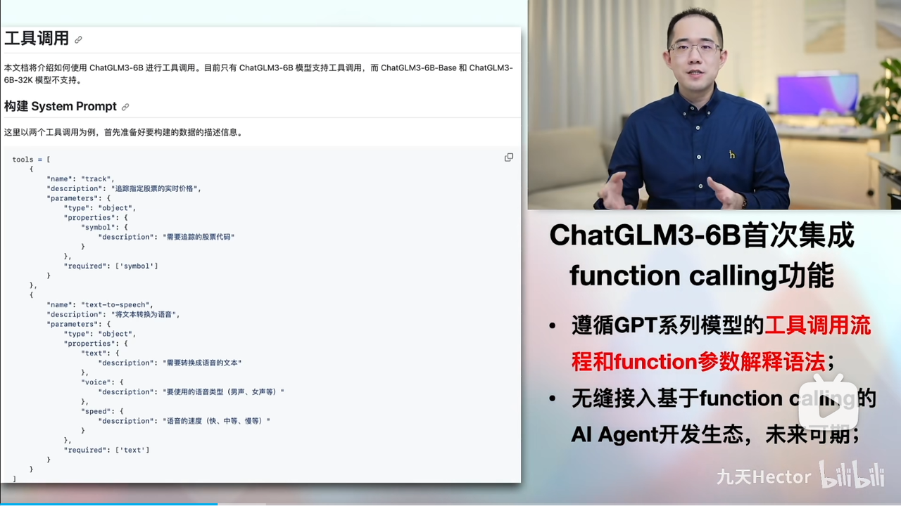
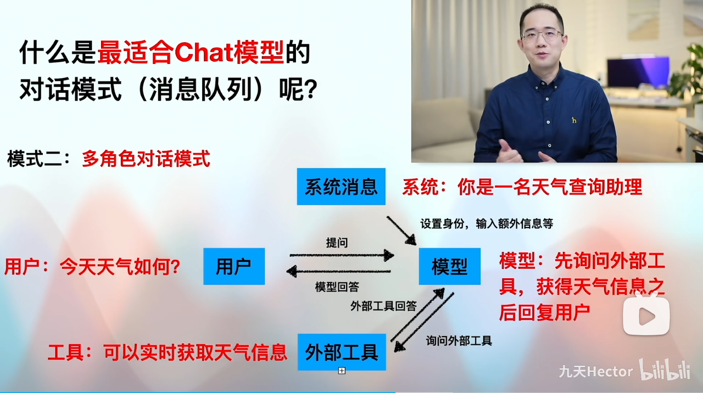

  在本次ChatGLM3更新中，重磅更新了Function calling功能，该功能的加入也使得ChatGLM3模型正式接轨AI Agent开发。相关基础概念介绍详见公开课：[ChatGLM3全新Function calling功能详解！开启AI Agent之路的最核心功能！](https://www.bilibili.com/video/BV1K94y157gd/)



* Function calling功能简介

  OpenAI在0613的更新中首次为目前最先进的Chat类模型增加了Function calling功能，该功能的本质是让大语言模型调用外部函数的能力，即Chat模型可以不再仅仅根据自身的数据库知识进行回答，而是可以额外挂载一个函数库，然后根据用户提问进行函数库检索，根据实际需求调用外部函数并获取函数运行结果，再基于函数运行结果进行回答。其基本过程如下：


而这个外部挂载的函数库，可以是简单的自定义函数，也可以是一个封装了外部工具API的功能型函数（例如一个可以调用谷歌搜索的函数、或者一个可以获取天气信息的函数）。而在OpenAI的精妙设计下，Function calling功能的实现过程也并不复杂，在编写问答函数时，我们只需要在ChatCompletions.create函数中进行参数设置、并提前定义好外部函数库即可，而在Chat模型执行Function calling时，模型会根据用户提问的语义自动检索并挑选合适的函数进行使用，整个过程并不需要人工手动干预指定使用某个函数，大预言模型能够充分发挥自身的语义理解优势，在函数库中自动挑选合适函数进行运行，并给出问题的答案。

  毫无疑问，有了外部函数库的功能加持，Chat模型的处理和解决问题的能力也必将再上一个台阶。同时，相比于此前必须借助LangChain的agent模块才能实现LLM和外部工具API的协同调用，现在Chat模型内部集成的Function calling功能实现过程更简单、开发门流程更加清晰、开发槛更低，而如此种种，也必将促进新一轮的以大语言模型为核心的AI应用的爆发。


* 极简AI应用开发示例



  当然，一个开放的天气查询API，也意味着我们可以将其封装为一个本地的函数，即通过调用OpenWeather API来获取实时天气信息，然后再用Function calling功能调用该函数，如此一来，就相当于给Chat模型增加了实时获取天气信息的能力，而后我们即可通过Chat模型实时查询天气或根据天气情况询问穿衣建议等，从功能上来说，接入实时天气信息的Chat模型其实也就是一个非常简单的天气查询AI助手。这是一个相对简单的将其他工具API接入Chat模型的示例，接下来我们介绍具体实现方法。

### Stage 1、获取API：OpenWeather注册及API key获取方法

#### 1.API获取流程

  为了能够调用OpenWeather服务，和OpenAI的API使用过程类似，我们首先需要先注册OpenWeather账号，并获取OpenWeather API Key。这里需要注意的是，对于大多数在线服务的API来说，都需要通过API key来进行身份验证，尽管OpenWeather相对更加Open，有非常多的免费使用的次数，但身份验证仍然是必要的防止API被滥用的有效手段。OpenWeather API key获取流程如下：

* Step 1.登录OpenWeather官网并点击Sign—>create account完成注册。该网站无需魔法即可直接登录，可以使用国内邮箱或者QQ邮箱均可进行注册，官网地址为：https://openweathermap.org/


&#x20;


* Step 2.获取API-key：注册完成后，即可在API keys页面查看当前账户的API key：


&#x20;


一般来说完成注册后，就会有一个已经激活的API-key。和OpenAI一样，OpenWeather的API key也创建多个。

* Step 3.将其设置为环境变量：和OpenAI API key类似，为了方便后续调用，我们也可以直接将OpenWeather API key设置为环境变量，变量名为OPENWEATHER\_API\_KEY。具体设置环境变量的方法参考Ch.1中OpenAI APkey设置环境变量流程，此处不再赘述。


设置完了环境变量之后，接下来即可按照如下方式创建OpenWeather API key变量：

```python
open_weather_key = os.getenv("OPENWEATHER_API_KEY")
```

需要注意的是，一般来说首次注册用户，首个API key需要等待2-5小时才会被激活，在此期间使用该API key会返回401错误。

#### 1.2 API使用流程：利用OpenWeather API获取实时天气信息

  接下来我们通过一个简单的示例，来介绍如何通过OpenWeather API获取实时天气信息：

```python
import requests

# Step 1.构建请求
url = "https://api.openweathermap.org/data/2.5/weather"

# Step 2.设置查询参数
params = {
    "q": "Beijing",               # 查询北京实时天气
    "appid": open_weather_key,    # 输入API key
    "units": "metric",            # 使用摄氏度而不是华氏度
    "lang":"zh_cn"                # 输出语言为简体中文
}

# Step 3.发送GET请求
response = requests.get(url, params=params)

# Step 4.解析响应
data = response.json()
```

这里需要注意的是，城市名必须输入英文名，否则无法正确识别。接下来查看返回结果。首先我们先查看response结果：

```python
response
```

```plaintext
<Response [200]>
```

```python
type(response)
```

```plaintext
requests.models.Response
```

在未解析之前，我们只能查看到基本请求结果状态，这里的200代表成功相应，即本次发送请求获得了对应的响应，且响应内容包含在response中。考虑到默认情况下返回结果是JSON格式，因此后续代码使用了response.json()对其进行解析。解析内容如下：

```python
data
```

```plaintext
{'coord': {'lon': 116.3972, 'lat': 39.9075},
 'weather': [{'id': 800, 'main': 'Clear', 'description': '晴', 'icon': '01n'}],
 'base': 'stations',
 'main': {'temp': 16.94,
  'feels_like': 15.58,
  'temp_min': 16.94,
  'temp_max': 16.94,
  'pressure': 1011,
  'humidity': 34,
  'sea_level': 1011,
  'grnd_level': 1005},
 'visibility': 10000,
 'wind': {'speed': 1.89, 'deg': 163, 'gust': 2.63},
 'clouds': {'all': 1},
 'dt': 1698833916,
 'sys': {'type': 1,
  'id': 9609,
  'country': 'CN',
  'sunrise': 1698792140,
  'sunset': 1698830013},
 'timezone': 28800,
 'id': 1816670,
 'name': 'Beijing',
 'cod': 200}
```

能够看出，返回结果非常丰富，包含了天气条件、温度、湿度、风速、天气描述等信息，这里我们可以简单查看当前天气中的即时温度和天气状况：

```python
# 即时温度最高、最低气温
data['main']['temp_min'], data['main']['temp_max']
```

```plaintext
(16.94, 16.94)
```

```python
# 天气状况
data['weather'][0]['description']
```

```plaintext
'晴'
```

对比手机查看的天气信息不难发现，OpenWeather提供的天气信息非常准确。

### Stage 2、编写外部函数

* 实时天气信息获取函数编写

  接下来，我们尝试编写一个通过OpenWeather API实时获取天气信息的API，并作为Chat可调用的外部函数之一。很明显，为了确保和大语言模型之间的顺畅通信，此时要求函数的输入和输出都是字符串格式。具体函数编写如下：

```python
def get_weather(loc):
    """
    查询即时天气函数
    :param loc: 必要参数，字符串类型，用于表示查询天气的具体城市名称，\
    注意，中国的城市需要用对应城市的英文名称代替，例如如果需要查询北京市天气，则loc参数需要输入'Beijing'；
    :return：OpenWeather API查询即时天气的结果，具体URL请求地址为：https://api.openweathermap.org/data/2.5/weather\
    返回结果对象类型为解析之后的JSON格式对象，并用字符串形式进行表示，其中包含了全部重要的天气信息
    """
    # Step 1.构建请求
    url = "https://api.openweathermap.org/data/2.5/weather"

    # Step 2.设置查询参数
    params = {
        "q": loc,               
        "appid": open_weather_key,    # 输入API key
        "units": "metric",            # 使用摄氏度而不是华氏度
        "lang":"zh_cn"                # 输出语言为简体中文
    }

    # Step 3.发送GET请求
    response = requests.get(url, params=params)
    
    # Step 4.解析响应
    data = response.json()
    return json.dumps(data)
```

简单测试函数能否正常运行：

```python
get_weather('Hangzhou')
```

```plaintext
'{"coord": {"lon": 120.1614, "lat": 30.2937}, "weather": [{"id": 501, "main": "Rain", "description": "\\u4e2d\\u96e8", "icon": "10d"}], "base": "stations", "main": {"temp": 30.27, "feels_like": 37.27, "temp_min": 25.95, "temp_max": 31.62, "pressure": 992, "humidity": 80}, "visibility": 9927, "wind": {"speed": 2.88, "deg": 30, "gust": 5.2}, "rain": {"1h": 2.73}, "clouds": {"all": 89}, "dt": 1689499325, "sys": {"type": 2, "id": 2033711, "country": "CN", "sunrise": 1689455265, "sunset": 1689505351}, "timezone": 28800, "id": 1808926, "name": "Hangzhou", "cod": 200}'
```

能够发现函数能够正常运行。此外，需要注意的是，为了确保函数能够顺利和大愿与你模型通信，我们还必须确保模型能够顺利解读OpenWeather天气信息，具体验证过程分以下三步，其一是需要验证Chat模型本身是否知道OpenWeather：

```python
response = openai.ChatCompletion.create(
    model="chatglm3-6b",
    messages=[
        {"role": "user", "content": "请问你知道OpenWeather么？"}, 
    ]
)
```

```python
response['choices'][0]['message']["content"]
```

```plaintext
'\n OpenWeather是一个气象数据提供商,提供全球天气预报和历史数据。它的数据覆盖了超过190国家和地区,并且可以以多种格式(如JSON、XML和HTML)供开发者使用。通过OpenWeather,人们可以轻松地从自己的应用程序或网站中获取最新的天气信息。'
```

其二是需要进一步验证Chat模型能否针对函数结果进行解读，即能否在基于data信息理解基础上，给出一些天气查询问题准确的回答：

```python
response = openai.ChatCompletion.create(
  model="chatglm3-6b",
  messages=[
    {"role": "system", "content": "天气信息来源于OpenWeather API：https://api.openweathermap.org/data/2.5/weather"},
    {"role": "system", "content": "这是今日杭州市的天气：%s" % data},
    {"role": "user", "content": "请问今日杭州天气如何？请用简体中文回答"}
  ]
)
response.choices[0].message['content']
```

```plaintext
'\n 今天是2023年6月1日，杭州市的天气情况如下：\n\n1. 天气：晴，气温约为23.95摄氏度；\n2. 相对湿度：47%，体感温度为23.63摄氏度；\n3. 气压：1018百帕斯卡；\n4. 风速：2.72米/秒，风向为北偏西方向。\n\n请注意适当增减衣物，祝您有个愉快的一天！'
```

能够发现模型能够理解OpenWeather返回结果，并根据提问对data进行总结并进行回答。

第三步，也是非常关键的一步，就是我们在进行提问时问题里面的城市名称肯定是中文，但OpenAIWeather API要求输入英文名称，尽管我们在函数参数说明中注明了loc函数需要转化成英文，但对于外部函数的参数整理是Chat模型自发进行的整理，外部无法干预，模型能否按照要求、在对话过程中提取参数并将其整理为指定格式，完全依赖模型自身的推理能力，因此这里我们需要检查模型本身是否知道中文输入的这些城市名称对应的英文名称，验证过程如下：

```python
response = openai.ChatCompletion.create(
  model="chatglm3-6b",
  messages=[
    {"role": "user", "content": "请问，杭州市的英文名称是？"}
  ]
)
response.choices[0].message['content']
```

```plaintext
'\n 杭州市的英文名称是 Hangzhou。'
```

发现模型能够顺利完成城市名称的中英文翻译。

最后需要创建get\_weather函数的functions参数：

```python
weather_api_spec = [
    {
        'name': 'get_weather',
        'description': '查询即时天气函数，根据输入的城市名称，查询对应城市的实时天气',
        'parameters': {
            'type': 'object',
            'properties': {
                'loc': {
                    'description': "城市名称，注意，中国的城市需要用对应城市的英文名称代替，例如如果需要查询北京市天气，则loc参数需要输入'Beijing'",
                    'type': 'string',
                    'required': True
                }
            }
        }
    }
]
```

### Stage 3、实时天气查询功能的Function calling实现

  在一系列验证工作结束后，接下来我们直接将这个函数放入函数库（写入functions\_list函数列表），然后直接启动外链函数库之后的多轮对话机器人chat\_with\_model，查看对话效果。

```python
system_info = {
    "role": "system",
    "content": "Answer the following questions as best as you can. You have access to the following tools:",
    "tools": weather_api_spec,
}
```

```python
system_info
```

```plaintext
{'role': 'system',
 'content': 'Answer the following questions as best as you can. You have access to the following tools:',
 'tools': [{'name': 'get_weather',
   'description': '查询即时天气函数，根据输入的城市名称，查询对应城市的实时天气',
   'parameters': {'type': 'object',
    'properties': {'loc': {'description': "城市名称，注意，中国的城市需要用对应城市的英文名称代替，例如如果需要查询北京市天气，则loc参数需要输入'Beijing'",
      'type': 'string',
      'required': True}}}}]}
```

```python
messages = [
        system_info,
        {
            "role": "user",
            "content": "请问今天北京天气如何？",
        }
    ]
```

```python
# first response
response = openai.ChatCompletion.create(
                model="chatglm3-6b",
                messages=messages,
                return_function_call=True)
```

```python
response_message = response["choices"][0]["message"]
```

```python
response_message
```

```plaintext
<OpenAIObject at 0x7fd3d4a58360> JSON: {
  "role": "assistant",
  "content": "{\"name\": \"get_weather\", \"parameters\": {\"loc\": \"Beijing\"}}",
  "metadata": null,
  "tools": null
}
```

```python
function_call = json.loads(response.choices[0].message.content)
```

```python
function_call
```

```plaintext
{'name': 'get_weather', 'parameters': {'loc': 'Beijing'}}
```

```python
# 需要调用外部函数
# 获取函数名
function_name = function_call["name"]
function_name
```

```plaintext
'get_weather'
```

```python
functions_list = [get_weather]
available_functions = {func.__name__: func for func in functions_list}
```

```python
available_functions
```

```plaintext
{'get_weather': <function __main__.get_weather(loc)>}
```

```python
# 获取函数对象
fuction_to_call = available_functions[function_name]
fuction_to_call
```

```plaintext
<function __main__.get_weather(loc)>
```

```python
# 获取函数参数
function_args = function_call['parameters']
function_args
```

```plaintext
{'loc': 'Beijing'}
```

```python
function_response = fuction_to_call(**function_args)
```

```python
# 获得外部函数运行结果
function_response
```

```plaintext
'{"coord": {"lon": 116.3972, "lat": 39.9075}, "weather": [{"id": 800, "main": "Clear", "description": "\\u6674", "icon": "01n"}], "base": "stations", "main": {"temp": 15.94, "feels_like": 14.58, "temp_min": 15.94, "temp_max": 15.94, "pressure": 1012, "humidity": 38, "sea_level": 1012, "grnd_level": 1006}, "visibility": 10000, "wind": {"speed": 2.44, "deg": 148, "gust": 5.48}, "clouds": {"all": 1}, "dt": 1698835768, "sys": {"type": 1, "id": 9609, "country": "CN", "sunrise": 1698792140, "sunset": 1698830013}, "timezone": 28800, "id": 1816670, "name": "Beijing", "cod": 200}'
```

```python
# messages中拼接first response消息
messages.append(response_message)  
# messages中拼接函数输出结果
messages.append(
    {
        "role": "observation",
        "name": function_name,
        "content": function_response,
    }
)  
```

```python
messages
```

```plaintext
[{'role': 'system',
  'content': 'Answer the following questions as best as you can. You have access to the following tools:',
  'tools': [{'name': 'get_weather',
    'description': '查询即时天气函数，根据输入的城市名称，查询对应城市的实时天气',
    'parameters': {'type': 'object',
     'properties': {'loc': {'description': "城市名称，注意，中国的城市需要用对应城市的英文名称代替，例如如果需要查询北京市天气，则loc参数需要输入'Beijing'",
       'type': 'string',
       'required': True}}}}]},
 {'role': 'user', 'content': '请问今天北京天气如何？'},
 <OpenAIObject at 0x7fd3d4a58360> JSON: {
   "role": "assistant",
   "content": "{\"name\": \"get_weather\", \"parameters\": {\"loc\": \"Beijing\"}}",
   "metadata": null,
   "tools": null
 },
 {'role': 'observation',
  'name': 'get_weather',
  'content': '{"coord": {"lon": 116.3972, "lat": 39.9075}, "weather": [{"id": 800, "main": "Clear", "description": "\\u6674", "icon": "01n"}], "base": "stations", "main": {"temp": 15.94, "feels_like": 14.58, "temp_min": 15.94, "temp_max": 15.94, "pressure": 1012, "humidity": 38, "sea_level": 1012, "grnd_level": 1006}, "visibility": 10000, "wind": {"speed": 2.44, "deg": 148, "gust": 5.48}, "clouds": {"all": 1}, "dt": 1698835768, "sys": {"type": 1, "id": 9609, "country": "CN", "sunrise": 1698792140, "sunset": 1698830013}, "timezone": 28800, "id": 1816670, "name": "Beijing", "cod": 200}'}]
```

```python
# 第二次调用模型
second_response = openai.ChatCompletion.create(
    model="chatglm3-6b",
    messages=messages,
)  
```

```python
# 获取最终结果
final_response = second_response["choices"][0]["message"]["content"]
final_response
```

```plaintext
'\n 今天北京的天气是晴朗的，当前温度为15.94℃，相对湿度为38%，气压为1012百帕斯卡。'
```

### Stage 4、函数封装与测试

```python
def run_conv_glm(messages, functions_list=None, functions=None, model="chatglm3-6b", return_function_call=True):
    """
    能够自动执行外部函数调用的Chat对话模型
    :param messages: 必要参数，输入到Chat模型的messages参数对象
    :param functions_list: 可选参数，默认为None，可以设置为包含全部外部函数的列表对象
    :param model: Chat模型，可选参数，默认模型为chatglm3-6b
    :return：Chat模型输出结果
    """
    def is_json_string(s):
        try:
            json_object = json.loads(s)
        except ValueError as e:
            return False
        return True

    
    user_messages = messages
    
    # 如果没有外部函数库，则执行普通的对话任务
    if functions_list == None:
        response = openai.ChatCompletion.create(
                        model=model,
                        messages=user_messages,
                        )
        response_message = response["choices"][0]["message"]
        final_response = response_message["content"]
        
    # 若存在外部函数库，则需要灵活选取外部函数并进行回答
    else:
        # 创建调用外部函数的system_message
        system_info = [{
            "role": "system",
            "content": "Answer the following questions as best as you can. You have access to the following tools:",
            "tools": functions,
        }]
        # 创建外部函数库字典
        available_functions = {func.__name__: func for func in functions_list}

        # 创建包含用户问题的message
        messages = system_info + user_messages
        
        # first response
        response = openai.ChatCompletion.create(
                        model=model,
                        messages=messages,
                        return_function_call=return_function_call)
        response_message = response["choices"][0]["message"]

        # 判断返回结果是否为json格式对象，即判断是否需要调用外部函数来回答问题
        if is_json_string(response_message["content"]):
            # 需要调用外部函数
            function_call = json.loads(response.choices[0].message.content)
            # 获取函数名
            function_name = function_call["name"]
            # 获取函数对象
            fuction_to_call = available_functions[function_name]
            # 获取函数参数
            function_args = function_call['parameters']
            # 将函数参数输入到函数中，获取函数计算结果
            function_response = fuction_to_call(**function_args)

            # messages中拼接first response消息
            messages.append(response_message)  
            # messages中拼接函数输出结果
            messages.append(
                {
                    "role": "observation",
                    "name": function_name,
                    "content": function_response,
                }
            )  
            # 第二次调用模型
            second_response = openai.ChatCompletion.create(
                model=model,
                messages=messages,
            )  
            # 获取最终结果
            final_response = second_response["choices"][0]["message"]["content"]
        else:
            final_response = response_message["content"]
    
    return final_response
```

```python
run_conv_glm([{"role": "user", "content": "请问什么是机器学习？"}])
```

```plaintext
'\n 机器学习是一种人工智能的分支，旨在使计算机程序通过数据和经验自动改进其性能。机器学习算法可以分析大量数据，识别模式和规律，并根据这些信息做出预测或决策，而不需要显式地指定程序执行特定任务。\n\n在机器学习中，计算机通常被训练成从输入数据中提取特征，并将这些特征映射到输出结果。例如，在图像分类任务中，机器学习算法会通过训练大量已标记的图像，来学习识别特定类别的图像特征，并最终将新的图像分类为相应的类别。\n\n机器学习的应用非常广泛，包括语音和图像识别、自然语言处理、推荐系统、游戏AI等等。'
```

```python
messages = [{"role": "user", "content": "请问北京今天天气如何？"}]
run_conv_glm(messages=messages, functions_list=[get_weather], functions=weather_api_spec)
```

```plaintext
'\n 根据您的查询，“北京今天天气如何”，我调用了名为“get_weather”的API函数，并传入了参数“loc”等于“Beijing”。经过调用，我获得了北京今天的天气情况。据API返回结果显示，北京今天天气晴朗，气温最高为15.94℃，最低为15.94℃，气压为1012百帕，湿度为38%。同时，API还提供了其他一些详细信息，如风向、风速、云量等。'
```

```python
messages = [{"role": "user", "content": "请问机器学习和深度学习有什么区别？"}]
run_conv_glm(messages=messages, functions_list=[get_weather], functions=weather_api_spec)
```

```plaintext
'机器学习和深度学习都是人工智能领域的技术。它们之间的主要区别在于所使用的算法和模型不同。机器学习是一种通过训练数据来让计算机自动学习知识和技能的方法，它使用的算法通常包括决策树、神经网络和支持向量机等。而深度学习则是一种使用深度神经网络来模拟人脑工作原理的方法，这种方法可以自动学习复杂的特征和模式，并对其进行分类和预测。因此，机器学习更注重于手工设计特征和模型，而深度学习更注重于从数据中自动学习特征和模型。'
```

* 创建多轮对话函数

```python
def chat_with_glm(question,
                  functions_list=None, 
                  functions=None, 
                  model="chatglm3-6b", 
                  return_function_call=True):
    
    messages = [{"role": "user", "content": question}]
    
    while True:           
        answer = run_conv_glm(messages=messages, 
                              functions_list=functions_list, 
                              functions=functions, 
                              model=model, 
                              return_function_call=return_function_call)
        
        
        print(f"模型回答: {answer}")

        # 询问用户是否还有其他问题
        question = input("您还有其他问题吗？(输入退出以结束对话): ")
        if question == "退出":
            break

        # 记录用户回答
        messages.append({"role": "assistant", "content": answer})
        messages.append({"role": "user", "content": question})
        
    del messages
```

* 多论对话功能测试

```python
chat_with_glm(question="请问杭州今天天气如何？", 
              functions_list=[get_weather], 
              functions=weather_api_spec)
```

```plaintext
模型回答: 
 根据API调用结果可以看出，今天杭州的天气是晴朗的，温度约为19.95摄氏度，相对湿度为51%，风向为北风，风力为2.1米每秒。建议您出门前查看最新天气预报，做好出行准备。


您还有其他问题吗？(输入退出以结束对话):  那北京呢？天气如何？


模型回答: 
 北京今天的天气情况如下：晴朗，最高气温为15.94℃，最低气温为14.58℃。相对湿度为38%，风向为北风，风力为2.44米每秒。请注意适时增减衣物，祝您有个愉快的一天！


您还有其他问题吗？(输入退出以结束对话):  北京比杭州更冷么？


模型回答: 从今天的天气情况来看，北京的气温比杭州低，因此可以说北京比杭州更冷。 However，气温并不能完全反映人们对天气的感觉，还需要考虑其他因素，如相对湿度、风速等。因此，在实际出门时，可以根据自己的感觉来判断天气是否适宜。


您还有其他问题吗？(输入退出以结束对话):  退出
```

* 推理能力测试

```python
chat_with_glm(question="你好", 
              functions_list=[get_weather], 
              functions=weather_api_spec)
```

```plaintext
模型回答: 你好，请问有什么可以帮助你的吗？


您还有其他问题吗？(输入退出以结束对话):  请问南昌今天天气如何？


模型回答: 我们可以使用一个天气预报的API来获取南昌的天气信息。请问你能告诉我南昌的英文名称吗？


您还有其他问题吗？(输入退出以结束对话):  NanChang


模型回答: 
 今天南昌的天气情况如下：南昌现在多云，气温为23度，相对湿度为50%，风向为北风，风力为2.09米/秒。


您还有其他问题吗？(输入退出以结束对话):  相比之下，北京更冷还是更热呢？


模型回答: 根据上述计算结果，可以看出南昌明天预计比北京更热。


您还有其他问题吗？(输入退出以结束对话):  北京天气如何呀？


模型回答: 据天气预报显示，北京明天的天气状况为晴，气温约为-6度，相对湿度约为41%，风向为西风，风力约为2.12米/秒。


您还有其他问题吗？(输入退出以结束对话):  退出
```

* SQL代码解释器

```python
def sql_inter(sql_query):
    """
    用于执行一段SQL代码，并最终获取SQL代码执行结果，\
    核心功能是将输入的SQL代码传输至MySQL环境中进行运行，\
    并最终返回SQL代码运行结果。需要注意的是，本函数是借助pymysql来连接MySQL数据库。
    :param sql_query: 字符串形式的SQL查询语句，用于执行对MySQL中telco_db数据库中各张表进行查询，并获得各表中的各类相关信息
    :return：sql_query在MySQL中的运行结果。
    """
    
    
    connection = pymysql.connect(
            host=MY_IP,  # 数据库地址
            user='4u',  # 数据库用户名
            passwd=MY_PW,  # 数据库密码
            db='telco_db',  # 数据库名
            charset='utf8'  # 字符集选择utf8
        )
    
    try:
        with connection.cursor() as cursor:
            # SQL查询语句
            sql = sql_query
            cursor.execute(sql)

            # 获取查询结果
            results = cursor.fetchall()

    finally:
        connection.close()
    
    
    return json.dumps(results)
```

```python
sql_inter_function_info = [
    {
    'name': 'sql_inter',
    'description': '用于执行一段SQL代码，并最终获取SQL代码执行结果，核心功能是将输入的SQL代码传输至MySQL环境中进行运行，并最终返回SQL代码运行结果。',
    'parameters': {
        'type': 'object',
        'properties': {
            'sql_query': {
                'type': 'string',
                'description': '字符串形式的SQL代码，可以在MySQL中运行，并获取运行结果'
            }
        },
        'required': ['sql_query']
    }
}
]
```

```python
# 打开并读取Markdown文件
with open('telco_data_dictionary.md', 'r', encoding='utf-8') as f:
    data_dictionary = f.read()
```

```python
sql_inter(sql_query='SELECT COUNT(*) FROM user_demographics;')
```

```plaintext
'[[5353]]'
```

```python
display(Markdown(data_dictionary))
```

# telco\_data\_dictionary：telco\_db数据库数据字典

本数据字典记录了telco\_db数据库中各张数据表的基本情况。

## 1.user\_demographics数据表

* 基本解释

* &#x20;user\_demographics数据表记录了电信用户的个人基本情况，主要涵盖客户基本生物属性，包括性别、年龄状况、是否结婚以及是否经济独立等。

* 数据来源

* &#x20;       user\_demographics数据集由一线业务人员人工采集记录，并且通过回访确认相关信息，数据集的准确性和可信度都非常高。

* 各字段说明

| Column Name   | Description                  | Value Range  | Value Explanation      | Type         |
| ------------- | ---------------------------- | ------------ | ---------------------- | ------------ |
| customerID    | 客户ID，user\_demographics数据表主键 |              | 由数字和字母组成的              | VARCHAR(255) |
| gender        | 用户的性别                        | Female, Male | Female (女性), Male (男性) | VARCHAR(255) |
| SeniorCitizen | 是否为老人                        | 0, 1         | 0 (不是), 1 (是)          | INT          |
| Partner       | 用户是否有伴侣                      | Yes, No      | Yes (有), No (没有)       | VARCHAR(255) |
| Dependents    | 用户经济是否独立，往往用于判断用户是否已经成年      | No, Yes      | Yes (有), No (没有)       | VARCHAR(255) |

## 2.user\_services数据表

* 基本解释

* &#x20;user\_services数据表记录了每位用户订购电信服务的基本情况，截至目前，电信服务商提供了种类多样的服务，包括电话类服务和网络类服务等，本数据集表记录了每位用户订阅电信服务的基本情况。

* 数据来源

* &#x20;user\_services数据表由后台系统自动创建生成，并未经过人工校验。

* 各字段说明

| Column Name      | Description              | Value Range                  | Value Explanation                                         | Type         |
| ---------------- | ------------------------ | ---------------------------- | --------------------------------------------------------- | ------------ |
| customerID       | 客户ID，user\_services数据表主键 |                              | 由数字和字母组成的                                                 | VARCHAR(255) |
| PhoneService     | 用户是否有电话服务                | No, Yes                      | Yes (有), No (没有)                                          | VARCHAR(255) |
| MultipleLines    | 用户是否开通了多条电话业务            | No phone service, No, Yes    | Yes (有多条电话线业务), No (没有多条电话线业务), No phone service (没有电话服务) | VARCHAR(255) |
| InternetService  | 用户的互联网服务类型               | DSL, Fiber optic, No         | DSL (DSL), Fiber optic (光纤), No (没有)                      | VARCHAR(255) |
| OnlineSecurity   | 是否开通网络安全服务               | No, Yes, No internet service | Yes（有）、No（无） or No internetservice（没有网路服务）                | VARCHAR(255) |
| OnlineBackup     | 是否开通在线备份服务               | Yes, No, No internet service | Yes（有）、No（无） or No internetservice（没有网路服务）                | VARCHAR(255) |
| DeviceProtection | 是否开通设备保护服务               | No, Yes, No internet service | Yes（有）、No（无） or No internetservice（没有网路服务）                | VARCHAR(255) |
| TechSupport      | 是否开通技术支持业务               | No, Yes, No internet service | Yes（有）、No（无） or No internetservice（没有网路服务）                | VARCHAR(255) |
| StreamingTV      | 是否开通网络电视                 | No, Yes, No internet service | Yes（有）、No（无） or No internetservice（没有网路服务）                | VARCHAR(255) |
| StreamingMovies  | 是否开通网络电影                 | No, Yes, No internet service | Yes（有）、No（无） or No internetservice（没有网路服务）                | VARCHAR(255) |

## 3.user\_payments数据表

* 基本解释

* &#x20;user\_payments数据表记录了每一位用户支付状况，既包括用户的支付方式和合同类型，同时也包含用户具体支付金额，包括月付金额和总金额等。

* 数据来源

* &#x20;user\_payments数据表由后台自动记录生成，并未经过校验。

* 各字段说明

| Column Name      | Description              | Value Range                                                                        | Value Explanation                                                                                             | Type         |
| ---------------- | ------------------------ | ---------------------------------------------------------------------------------- | ------------------------------------------------------------------------------------------------------------- | ------------ |
| customerID       | 客户ID，user\_payments数据表主键 |                                                                                    | 由数字和字母组成的                                                                                                     | VARCHAR(255) |
| Contract         | 合同类型                     | Month-to-month, One year, Two year                                                 | Month-to-month (月付), One year (一年付), Two year (两年付)                                                           | VARCHAR(255) |
| PaperlessBilling | 是否无纸化账单                  | Yes, No                                                                            | Yes (是), No (否)                                                                                               | VARCHAR(255) |
| PaymentMethod    | 支付方式                     | Electronic check, Mailed check, Bank transfer (automatic), Credit card (automatic) | Electronic check (电子检查), Mailed check (邮寄支票), Bank transfer (automatic) (银行转账), Credit card (automatic) (信用卡) | VARCHAR(255) |
| MonthlyCharges   | 月费用                      |                                                                                    | 用户平均每月支付费用                                                                                                    | FLOAT        |
| TotalCharges     | 总费用                      |                                                                                    | 截至目前用户总消费金额                                                                                                   | VARCHAR(255) |

## 4.user\_churn

* 基本解释

* &#x20;user\_churn数据表记录了当前用户流失情况。

* 数据来源

* &#x20;user\_churn数据表由后台自动创建并记录，当合同截至后但用户未续费，则判断该用户目前处于流失状态。

* 各字段说明

| Column Name | Description           | Value Range | Value Explanation | Type         |
| ----------- | --------------------- | ----------- | ----------------- | ------------ |
| customerID  | 客户ID，user\_churn数据表主键 |             | 由数字和字母组成的         | VARCHAR(255) |
| Churn       | 用户是否流失                | No, Yes     | Yes (是), No (否)   | VARCHAR(255) |

```python
chat_with_glm(question=data_dictionary + "你好", 
              functions_list=[sql_inter], 
              functions=sql_inter_function_info)
```

```plaintext
模型回答: 你好！有什么我可以帮助你的吗？


您还有其他问题吗？(输入退出以结束对话):  请帮我查看user_demographics表中总共有多少条数据？


模型回答: 
 根据查询结果，user_demographics表中共有5353条数据。


您还有其他问题吗？(输入退出以结束对话):  其中男性用户占比多少呢？


模型回答: 根据查询结果，在user_demographics表中，男性用户的数量为2678，女性用户的数量为2675，因此男性用户占比为49.99%。


您还有其他问题吗？(输入退出以结束对话):  非常棒。那接下来请问user_payments数据表中，月消费金额最高的用户是哪位？


模型回答: 
 根据查询结果，月消费金额最高的用户为5734-EJKXG，其月消费金额为118.60元。


您还有其他问题吗？(输入退出以结束对话):  退出
```


📍**更多大模型技术内容学习**

**扫码添加助理英英，回复“大模型”，了解更多大模型技术详情哦👇**


此外，**扫码回复“入群”**，即可加入**大模型技术社群：海量硬核独家技术`干货内容`+无门槛`技术交流`！**
