**ChatGLM3**

**零基础部署与使用指南**

北京时间10月27日，清华大学智谱AI在全中国计算机大会正式发布ChatGLM第三代大模型，开源地址售：[ChatGLM3-6BGithub地址](https://github.com/THUDM/ChatGLM3)

ChatGLM3新模型性能和功能层面均有重大突破！性能层面，  ChatGLM3-6B号称在10B范围内性能 最强，推理能力直逼GPT-3.5；功能层面， ChatGLM3-6B重磅更新多模态功能、代码解释器功能、联网 功能以及Agent优化功能四项核心功能，全线逼近GPT-4！更多模型功能及性能介绍，视频讲解详见售

[ChatGLM3新模型特性及功能介绍](https://www.bilibili.com/video/BV14N4y1674J/)

同时，围绕ChatGLM3-6B全新API调用方法、全新多角色对话Messages参数编写方法、模型性能评测、

全新Function calling外部工具调用方法，以及基于Function calling的Agent开发流程，详见 《 ChatGLM3高效入门》系列教学视频（**点击蓝色链接即可观看**）：

.  [《ChatGLM3快速入门，全新API调用方法详解》](https://www.bilibili.com/video/BV18c411d7Hd)

.  [《ChatGLM3推理性能快速评测》](https://www.bilibili.com/video/BV1BG411X7Hk)

.  [《ChatGLM3工具调用functioncalling功能详解》](https://www.bilibili.com/video/BV1V84y1971r)

.  [《ChatGLM3Agent开发入门》](https://www.bilibili.com/video/BV1Wy4y1c7oA)

尽管智谱AI官方已经提供了ChatGLM3的模型部署流程，但由于大模型部署本身会涉及非常多依赖   库的安装于更新，同时也有一定的硬件要求，总的来说还是拥有一定的部署和使用门槛。因此，为了能  够让更多的新人用户能够顺利使用这一不可多得的中文大模型，我们特地详细整理了一份ChatGLM3-6B 模型的部署流程教程，供新人用户参考和学习。

## **一、ChatGLM3-6B运行模式与硬件要求**

由于模型本身运算的复杂性，目前任何开源大模型的运行都有一定的硬件要求。当然，相比之下， ChatGLM系列模型的硬件门槛相对更低，而且支持多种不同的运行模式。

根据官方介绍， ChatGLM目前支持GPU运行（需要英伟达显卡）、 CPU运行以及Apple M系列芯片 运行。其中GPU运行需要至少6GB以上显存（4Bit精度运行模式下），而CPU运行则需要至少32G的内   存。而由于Apple M系列芯片是统一内存架构，因此最少需要13G内存即可运行。

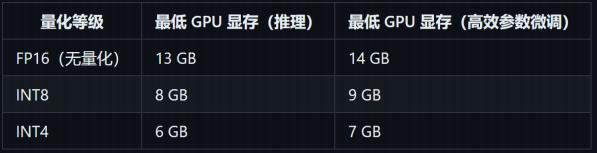

考虑到CPU运行模式下内存占用过大且运行效率较低，因此这里我们将重点介绍更为通用的GPU模 式部署方法。

当然，如果不想通过本地部署而直接体验ChatGLM系列模型的对话功能，也推荐大家直接使用智谱 AI推出的大模型对话应用——智谱清言。链接售智谱清言

## **二、ChatGLM3-6B GPU模式部署流程**

接下来我们首先介绍ChatGLM3-6B GPU模式的部署方法。这里我们重点介绍Windows系统下单显   卡部署流程，而更加专业的Linux多卡部署模式，我们将在付费课程[《大模型与AIGC实战课》](https://appze9inzwc2314.h5.xiaoeknow.com/)进行重点介 绍。

### **1.GPU环境确认**

在正式安装之前，需要先确认当前电脑的硬件环境。正如此前所说，部署和运行ChatGLM3-6B最低 需要6GB显存。这里我们可以在Windows操作系统下的设备管理器中查看当前电脑的显卡型号，并根据  显卡型号搜索得到显卡显存规格。

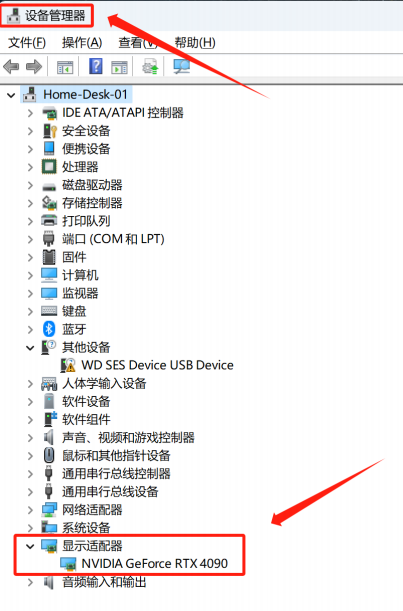

一般来说，台式机显卡需要2060（ 6G显存显卡）及以上显卡，笔记本则需要3060（ 8G显存显卡）及以 上显卡。这里需要注意，同型号的显卡，移动端显卡（笔记本显卡）要比主机显卡（台式机显卡）性能 要弱、显存也会更少。

### **2.Anaconda或Python环境准备**

而在正式下载ChatGLM3相关模型文件之前，还需要提前准备好本地的Python环境。若此前没有安 装过Python，则可以考虑通过Anaconda安装Python。Anaconda是目前最为通用的科学计算平台，借  助Anaconda，我们可以一次性安装各科学计算相关组件，以及Jupyter等流行代码编辑器。

Anaconda下载地址售[Anaconda官网](https://www.anaconda.com/download)。当然，也可以直接**扫码添加助教英英，回复“LLM”，即可领取ChatGLM3-6B安装必备全部相关组件。**

对于安装Anaconda有困难的小伙伴，也可以参考我的公开课[《Python高效入门》](https://www.bilibili.com/video/BV1U54y1W7jw?p=4)，并根据视频讲解来 进行安装。

而如果是已经安装过Python，并且已经超过半年未更新Python各科学计算库的同学，则可以按照如 下方法对Python库进行更新：

| # 首先更新conda工具conda update -n base -c defaults conda# 再更新各库conda update --all |
| ---------------------------------------------------------------------------- |

### **3.GPU版PyTorch安装**

在确认Python环境之后，接下来就需要确认是否已经安装2.0版本及以上的GPU版本的PyTorch。 PyTorch是通用的深度学习框架， ChatGLM3-6B运行过程需要借助PyTorch来完成相关计算。

* **&#x20; Step 1.确认PyTorch版本**

这里我们可以在Jupyter（或其他Python编辑器中）确认PyTorch安装情况。首先可以通过import导 入的方法确认是否已经安装PyTorch：

| import torch |
| ------------ |

若无报错，则说明已经安装PyTorch。（若未安装PyTorch，则直接跳转 Step 3 ） 接下来进一步确认当前PyTorch版本：

| torch.    version    |
| -------------------- |

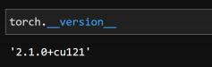

此时若返回结果为 2.x.x+cuxxx ，则说明当前PyTorch版本符合要求。其中cu代表cuda，意为GPU版本 的PyTorch。而如果返回结果为 1.x.x+cpu ，则说明当前PyTorch版本太低，且只支持cpu运行模式。对 于PyTorch版本不符合要求的情况，请继续按照 Step 2 进行操作。

而若PyTorch满足版本要求，接下来则需要继续测试是否能调用CUDA完成GPU运算， CUDA是

Compute Unified Device Architecture的缩写，它是由NVIDIA公司推出的一个并行计算平台和应用程序  接口（API），允许软件开发者和软件工程师使用NVIDIA的图形处理单元（GPU）进行通用计算。简单来 说，CUDA让开发者能够利用NVIDIA GPU强大的计算能力来加速除了图形处理以外的科学和工程计算，

从而提供比传统CPU更高效的性能。我们可以通过如下代码进行测试：

| print(torch.cuda.is\_available()) |
| --------------------------------- |

若返回结果为True，则表示和CUDA兼容，可以直接进入第四部分下载Git部分内容学习。

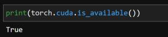

而若返回结果Fasle，则说明当前CUDA环境不兼容，则跳转 step 3 进行操作。

* **&#x20; Step 2.删除PyTorch**

对于PyTorch版本不满足要求的情况，最简单的方法就是重新安装。我们只需要在命令行中输入如下 指令即可删除原版PyTorch：

| pip uninstall torch torchvision torchaudio |
| ------------------------------------------ |

然后再输入如下指令重新安装2.1 GPU版本的PyTorch：

| pip3 install torch torchvision torchaudio --index-url <https://download.pytorch.org/whl/cu121> |
| ---------------------------------------------------------------------------------------------- |

更多关于PyTorch安装说明，详见[PyTorch官网](https://pytorch.org/get-started/locally/)

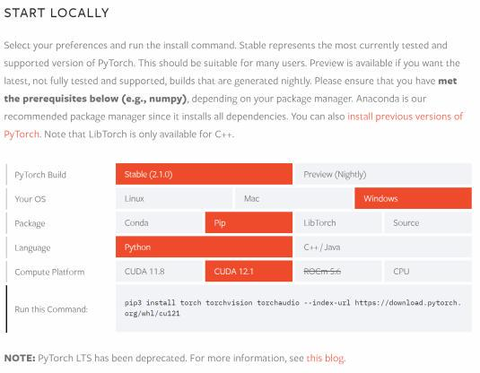

安装完成后即可通过如下代码验证是否已经安装成功：

| import torchtorch.    version    |
| -------------------------------- |

* &#x20; Step 3.安装CUDA

当我们已经准备好PyTorch环境之后，接下来则是安装CUDA。无论此前是否安装过CUDA，都可以 在[CUDA官网](https://developer.nvidia.com/cuda-downloads?target_os=Windows\&target_arch=x86_64\&target_version=Server2022\&target_type=exe_local)下载最新版CUDA toolkit（ CUDA安装工具）进行安装或者更新至12.1版。

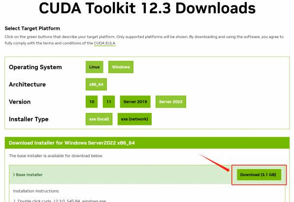

当然，所有相关安装包都也可以**在助教英英处领取。&#x20;**&#x4E0B;载完之后一路点击下一步进行安装即可。

* **&#x20; Step 4.验证PyTorch环境**

最后，当我们完成了一系列准备工作之后，即可再次验证当前PyTorch能否调用CUDA进行GPU计 算：

| print(torch.cuda.is\_available()) |
| --------------------------------- |

范围结果为True，则说明验证通过，即可进入下一步操作。

### **4.git工具下载与安装**

而当基础环境准备完毕后，接下来即可进行ChatGLM3模型下载了。 [ChatGLM3-6BGithub官网](https://github.com/THUDM/ChatGLM3)给出 了多个下载方式，考虑到国内网络实际情况，这里推荐使用git工具进行下载，整个下载流程会更加稳

定。

git是一个开源的版本控制系统，也可以通过clone方法将项目部署至本地，我们可以在[git下载地址](https://git-scm.com/downloads) 进行下载， **或者找客服小可爱直接领取**。

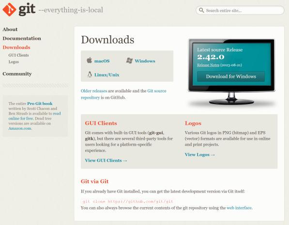

git安装过程并不复杂， 一路点击下一步即可。

### **5.下载ChatGLM3-6B项目文件**

当完成git下载之后，直接打开git命令行客户端git bash：

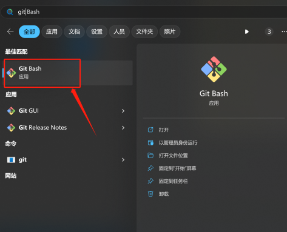

并进入到如下页面：

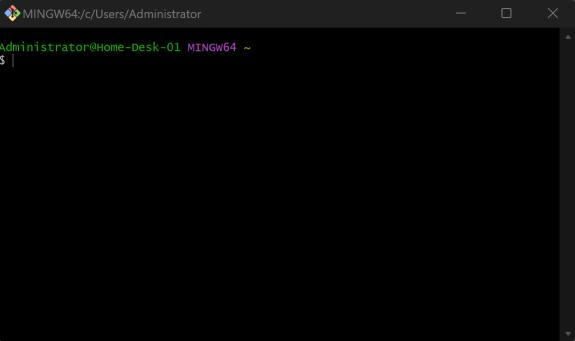

并在git bash中输入如下内容：

| git clone https://github.com/THUDM/ChatGLM3 cd ChatGLM3 |
| ------------------------------------------------------- |

即可开启下载。下载完成后，能够在 C:\Users\你的用户名文件目录下看到完整的ChatGLM3安装文件：

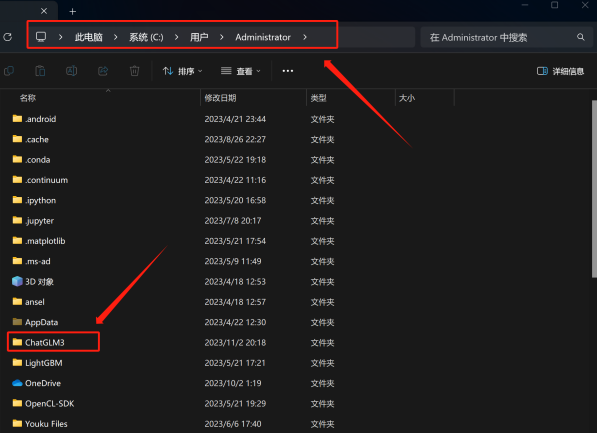

接下来我们打开该文件夹，文件夹内的一个名为openai\_api.py的文件尤其需要注意，在后续我们采用 OpenAI API调用风格调用ChatGlM3-6B模型时需要使用。

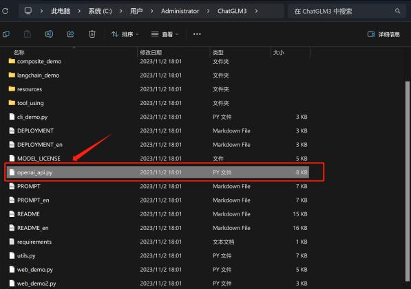

### **6.下载ChatGLM3-6B项目依赖库**

接下来，仍然在git bash中继续输入命令，来下载ChatGLM3模型相关依赖。输入以下内容：

| pip install -r requirements.txt |
| ------------------------------- |

需要注意的是，安装过程若出现类似typing-extensions或fastapi等库不兼容性报错，并不会影响最终模 型运行，不用进行额外处理。

完成了相关依赖库的安装之后，即可尝试进行模型调用了。

## **三、ChatGLM3-6B代码调用方法**

当已经完成ChatGLM3安装部署之后，接下来我们重点介绍ChatGLM3-6B的代码调用方法。这里我 们还是在Jupyter Lab中进行代码尝试。

### **1.基本调用流程**

接下来我们先介绍ChatGLM3-6B模型的基本调用流程，该调用流程也是官方推荐的核心调用流程， 同时也是最接近底层架构的调用方法。具体执行流程如下：

* **&#x20; Step 1：导入相关库**

从 transformers 库导入 AutoTokenizer 和 AutoModel 。

| from transformers import AutoTokenizer, AutoModel |
| ------------------------------------------------- |

* &#x20;**Step 2：加载tokenizer**

使用 AutoTokenizer.from\_pretrained 方法，加载预训练的tokenizer "THUDM/chatglm3-6b" 。 trust\_remote\_code=True 表示信任远程代码。

| tokenizer = AutoTokenizer.from\_pretrained("THUDM/chatglm3-6b", trust\_remote\_code=True) |
| ----------------------------------------------------------------------------------------- |

首次加载tokenizer时需要等待一段时间。

* **&#x20; Step 3：加载预训练模型**

使用 AutoModel.from\_pretrained方法，加载预训练的模型  "THUDM/chatglm3-6b" 到CUDA设  备上。 trust\_remote\_code=True 表示信任远程代码（如果有），  device='cuda' 表示将模型加载到 CUDA设备上以便使用GPU加速。

| model = AutoModel.from\_pretrained("THUDM/chatglm3-6b", trust\_remote\_code=True, device='cuda') |
| ------------------------------------------------------------------------------------------------ |

首次加载预训练模型时也需要稍作等待。

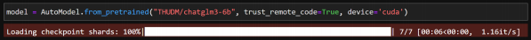

这里需要注意的是，根据显卡显存的不同，需要考虑加载不同精度的模型。  13GB显存以上的显卡可 以直接按照上述代码加载全精度的模型。

而如果要加载INT8量化模型，则可以按照如下方式运行：

| model = AutoModel.from\_pretrained("THUDM/chatglm3- 6b",trust\_remote\_code=True).quantize(8).cuda() |
| ---------------------------------------------------------------------------------------------------- |

而如果要加载INT4量化模型，则可以按照如下方式运行：

| model = AutoModel.from\_pretrained("THUDM/chatglm3- 6b",trust\_remote\_code=True).quantize(4).cuda() |
| ---------------------------------------------------------------------------------------------------- |

&#x20;   需要注意的是，如果之前PyTorch环境没有配置好，会在上述环节报错。

* **&#x20; Step 4.实例化模型**

接下来则需要对模型进行实例化操作，并且设置为评估模式：

| model = model.eval() |
| -------------------- |

* **&#x20; Step 5.调用模型并获取结果**

最后就是进行模型调用，并获取对话结果：

| response, history = model.chat(tokenizer, "你好", history=\[]) print(response) |
| ---------------------------------------------------------------------------- |

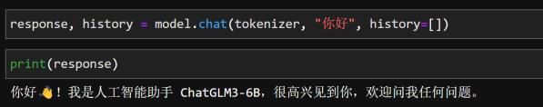

当然，此时history对象保存着此前一系列对话信息：

| history |
| ------- |

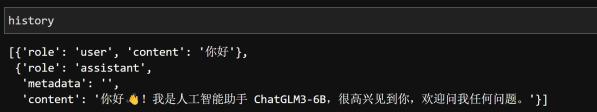

至此，我们就在本地代码环境中顺利跑通了ChatGLM3-6B模型。

### **2.OpenAI风格API调用方法**

除了上述调用流程外，本次ChatGLM3-6B模型还提供了OpenAI风格的API调用方法。正如此前所    说，在OpenAI几乎定义了整个前沿AI应用开发标准的当下，提供一个OpenAI风格的API调用方法，毫无 疑问可以让ChatGLM3模型无缝接入OpenAI开发生态。

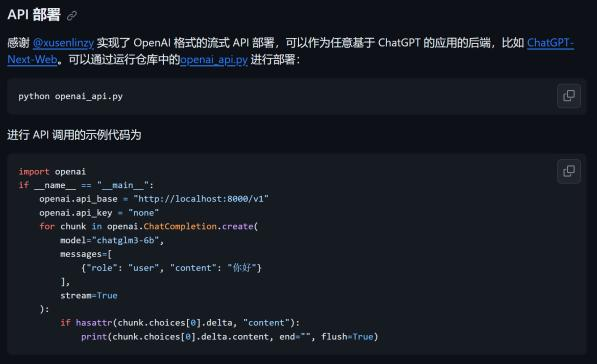

所谓的OpenAI风格的API调用，指的是借助OpenAI库中的ChatCompletion函数进行ChatGLM3模  型调用。需要知道的是，该函数原本是OpenAI为调用gpt系列模型而准备的函数。例如一次gpt-3.5的调 用过程入下：

| import osimport openaiopenai.api\_key = os.getenv("OPENAI\_API\_KEY")response = openai.ChatCompletion.create( model="gpt-3.5-turbo",messages=\[{"role": "user", "content": "请问，什么是机器学习？"}] ) |
| -------------------------------------------------------------------------------------------------------------------------------------------------------------------------------------------- |

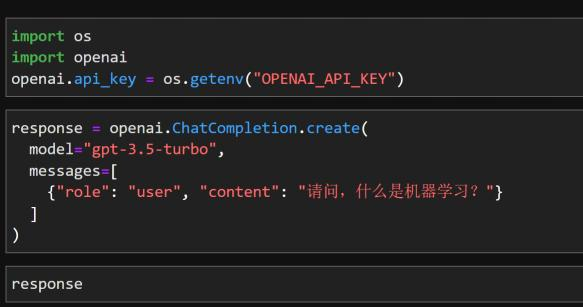

而现在，我们只需要在model参数上输入chatglm3-6b，即可调用ChatGLM3模型。调用API风格的统 一 ，无疑也将大幅提高开发效率。

而要执行OpenAI风格的API调用，则首先需要安装openai库，并提前运行openai\_api.py脚本。具体 执行流程如下：

* **step 1.安装openai库**

首先需要安装openai库。需要注意的是， openai库是一个公开的库，安装过程并不需要使用魔法， 国内网络也可进行安装，这里直接使用pip方法进行安装即可：

| pip install openai |
| ------------------ |

* **step 2.运行openai\_api.py脚本**

接下来需要提前运行openai\_api.py脚本。该脚本位于ChatGLM3安装文件内。

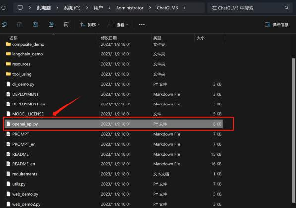

我们可以直接打开anaconda prompt（anaconda命令行，能够调用anaconda的python环境）

然后输入：

| python C:\Users\Administrator\ChatGLM3\openai\_api.py |
| ----------------------------------------------------- |

运行结果如下：

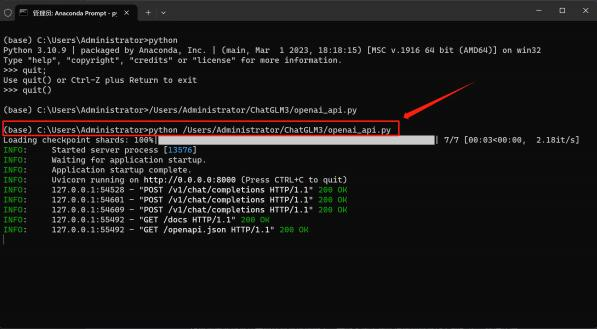

然后即可采用OpenAI风格API调用ChatGLM3模型了。

&#x20;   如果配置了Python环境变量，则也可以直接在命令行中运行上述命令。

* **&#x20; step 3.以OpenAI风格API调用ChatGLM3**

接下来回到Jupyter Lab中，按照如下代码即可以OpenAI风格API调用ChatGLM3了。

| import openaiopenai.api\_base = "http://localhost:8000/v1" openai.api\_key = "none"response = openai.ChatCompletion.create( model="chatglm3-6b",messages=\[{"role": "user", "content": "你好"}] )print(response\["choices"]\[0]\["message"]\["content"]) |
| ------------------------------------------------------------------------------------------------------------------------------------------------------------------------------------------------------------------------------------------------------ |

运行结果如下：

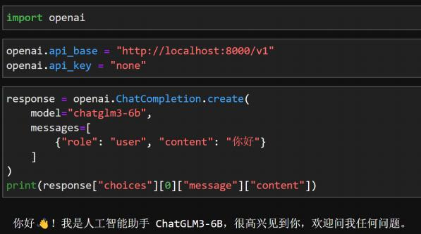

后续即可继续提问：

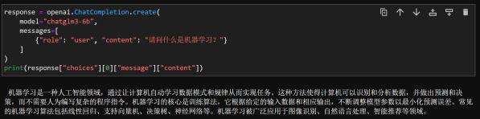

而在接下来的系列公开课中，我们都是统一采用OpenAI风格API完成ChatGLM3模型调用：

[《ChatGLM3快速入门，全新API调用方法详解》](https://www.bilibili.com/video/BV18c411d7Hd) [《ChatGLM3推理性能快速评测》](https://www.bilibili.com/video/BV1BG411X7Hk)

[《ChatGLM3工具调用functioncalling功能详解》](https://www.bilibili.com/video/BV1V84y1971r) [ChatGLM3Agent开发入门》](https://www.bilibili.com/video/BV1Wy4y1c7oA)

* **step 4.关闭openai\_api.py脚本**

而若要终止openai\_api.py脚本，则需要回到anaconda prompt中，按住 CTRL+c ，则可以终止进 程。需要注意的是，当脚本停止运行之后，就无法在Jupyter Lab中调用OpenAI风格的API了。

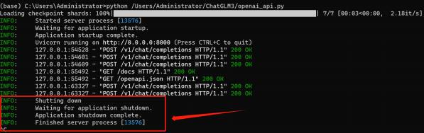

## **四、ChatGLM3-6B其他demo运行方法**

除了最核心的代码调用方法外， ChatGLM3还提供了一些简单应用demo，供开发者尝试运行。这里 我们由简到难依次对其进行介绍。

* **&#x20; 基于命令行的交互式对话**

首先是基于命令行的模型调用与对话方法。该应用旨在为非技术用户提供一个脱离代码环境的对话  方式。我们可以通过运行cli\_demo.py脚本，来启动该应用。脚本位置同样也在ChatGLM3安装文件主目 录下：

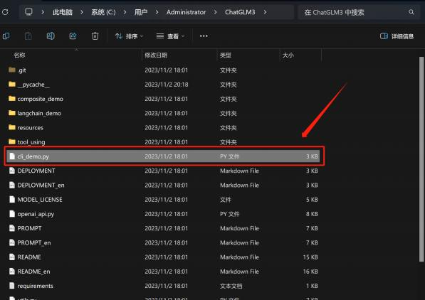

和运行openai\_api.py脚本类似。我们可以在anaconda prompt中运行如下代码：

| python C:\Users\Administrator\ChatGLM3\cli\_demo.py |
| --------------------------------------------------- |

成功运行后即可开启交互式对话：

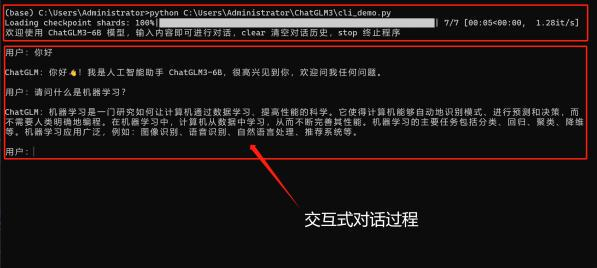

输入stop则可退出交互对话。

* **&#x20; 基于 Gradio 的Web端对话应用**

接下来则是两个基于网页端的对话应用demo，基于网页端的对话也是目前非常通用的大语言交互方 式，ChatGLM3官方项目组提供了两种Web端对话demo，两个示例应用功能一致，只是采用了不同的     Web框架进行开发。首先先介绍基于 Gradio 的Web端对话应用demo。

Gradio是一个Python库，用于快速创建用于演示机器学习模型的Web界面。开发者可以用几行代  码为模型创建输入和输出接口，用户可以通过这些接口与模型进行交互。这使得非技术用户可以轻 松地测试和使用机器学习模型，比如通过上传图片来测试图像识别模型，或者输入文本来测试自然 语言处理模型。 Gradio非常适合于快速原型设计和模型展示。

基于 Gradio 的Web端对话应用demo运行脚本为web\_demo.py，同样也是位于ChatGLM3文件主 目录内：

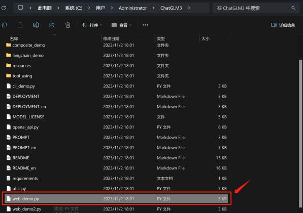

在anaconda prompt中运行如下代码即可启动：

| python C:\Users\Administrator\ChatGLM3\web\_demo.py |
| --------------------------------------------------- |

运行结果如下：

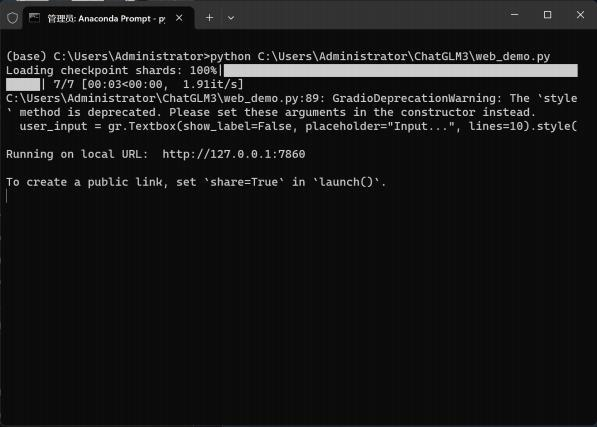

&#x20;   需要注意的是，在运行web demo时最好关闭代理工具，否则可能会出现无法正常响应的问题。 顺利运行之后，即可在<http://127.0.0.1:7860/>进行对话：

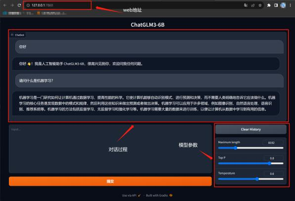

当然，也可以通过修改web\_demo.py文件，来修改端口或设置是否允许公开链接进行访问。 而在

* **&#x20; 基于 Streamlit 的Web端对话应用**

ChatGLM3官方项目组提供的第二个Web对话应用demo，则是一个基于Streamlit的Web应用。

Streamlit是另一个用于创建数据科学和机器学习Web应用的Python库。它强调简单性和快速的开   发流程，让开发者能够通过编写普通的Python脚本来创建互动式Web应用。 Streamlit自动管理UI   布局和状态，这样开发者就可以专注于数据和模型的逻辑。  Streamlit应用通常用于数据分析、可视 化、构建探索性数据分析工具等场景。

类似的，我们可以通过运行web\_demo2.py来启动该对话应用。 web\_demo2.py也同样位于 ChatGLM3文件主目录内：

类似的，可以通过运行如下代码启动该应用：

| streamlit run C:\Users\Administrator\ChatGLM3\web\_demo2.py |
| ----------------------------------------------------------- |

启动过程如下：

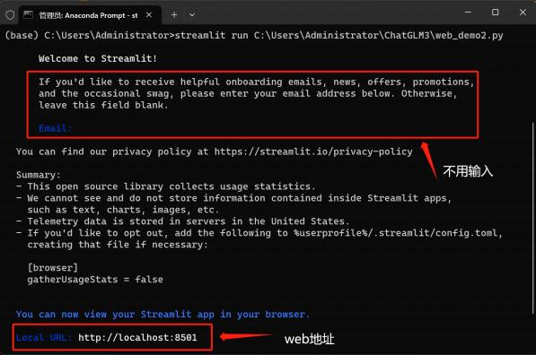

顺利启动之后，即可在http://localhost:8501/进行对话：

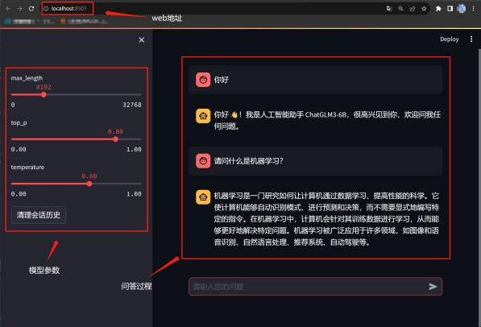

同样，在命令行中输入 CTRL+c之后即可停止运行。

至此，我们就完整介绍了Windows操作系统下单卡ChatGLM3安装部署流程，及其demo应用程序的启   动和调用方法。在付费课程[《大模型与AIGC实战课》](https://appze9inzwc2314.h5.xiaoeknow.com/)中，我们还将继续介绍额外Linux多卡安装部署方法，**更多大模型技术内容学习，请扫码添加英英，回复“大模型”，即咨询相关信息哦👇**

此外，**扫码回复“入群”**，即可加入**大模型技术社群：海量硬核独家技术`干货内容`+无门槛`技术交流`！**
