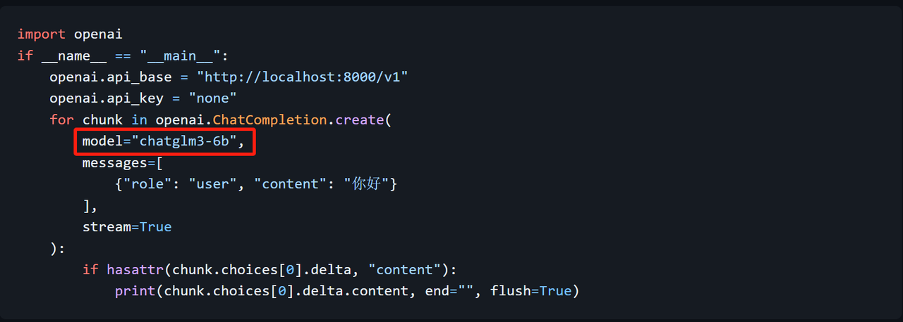

  在本次ChatGLM3更新中，重磅更新了模型调用的消息队列格式，由原先的“1对1对话模式”改为“多角色对话模式”。相关基础概念介绍详见公开课：[ChatGLM3全新消息队列功能介绍！接入先进多角色对话功能！](https://www.bilibili.com/video/BV1fg4y197xM/)


本次更新不仅在模型支持的对话消息队列层面全面和OpenAI的Chat模型接轨，同时为了更好的接入以OpenAI为主导的AI应用开发生态，本次ChatGML3模型还提供了类OpenAI Chat模型的调用方法，即可以通过openai.ChatCompletion函数直接调用ChatGML3模型。换而言之，对于一个使用OpenAI API创建的应用而言，现在我们只需要将原先代码中的model参数修改为'chatglm3-6b'即可。一个统一的调用方法，无疑对开发者来说是重大利好。



### 1.ChatGLM3调用方法与messages参数详解

#### 1.1 ChatGLM3调用流程及返回结果说明

```python
response_glm3 = openai.ChatCompletion.create(
                      model="chatglm3-6b",
                      messages=[
                        {"role": "user", "content": "你好"}
                      ]
                    )
```

```python
response_glm3['choices'][0]['message']["content"]
```

```plaintext
'\n 你好👋！我是人工智能助手 ChatGLM3-6B，很高兴见到你，欢迎问我任何问题。'
```

```python
response = openai.ChatCompletion.create(
    model="chatglm3-6b",
    messages=[
        {"role": "user", "content": "请问什么是机器学习"}
    ]
)
```

```python
response['choices'][0]['message']["content"]
```

```plaintext
'\n 机器学习是一种让计算机系统通过数据自动学习和改进的方法,以便在不进行明确编程的情况下做出预测或决策。机器学习算法可以分析大量数据,从中发现模式和规律,然后利用这些信息进行预测、分类、识别、关联 rule 挖掘等任务。机器学习中常用的算法包括决策树、支持向量机、神经网络、随机森林等。机器学习的应用范围非常广泛,例如语音识别、图像识别、自然语言处理、推荐系统、智能客服等。'
```

能够看出，messages参数是一个基本构成元素为字典的列表，其内每个字典都代表一条独立的消息，每个字典都包含两个键值（Key-value）对，其中第一个Key都是字符串role（角色）表示某条消息的作者，第二个key为content（内容）表示消息具体内容。可以说messages参数是ChatCompletion.create函数最重要的参数之一，能够看出比简单的prompt参数格式要更加复杂。更多关于message的参数设置方法稍后介绍，总的来看，这里的messages就可以简单理解为输入给模型的信息，而模型接收到message之后也会输出对应的回答信息，当然也是以message形式呈现：

```python
response
```

```plaintext
<OpenAIObject chat.completion at 0x7fd3d5061260> JSON: {
  "model": "chatglm3-6b",
  "object": "chat.completion",
  "choices": [
    {
      "index": 0,
      "message": {
        "role": "assistant",
        "content": "\n \u673a\u5668\u5b66\u4e60\u662f\u4e00\u79cd\u4eba\u5de5\u667a\u80fd\u7684\u5206\u652f\uff0c\u5b83\u8ba9\u8ba1\u7b97\u673a\u901a\u8fc7\u5bf9\u5927\u91cf\u6570\u636e\u8fdb\u884c\u5b66\u4e60\u548c\u5206\u6790\uff0c\u81ea\u52a8\u8bc6\u522b\u6a21\u5f0f\u5e76\u505a\u51fa\u9884\u6d4b\u6216\u51b3\u7b56\u3002\u673a\u5668\u5b66\u4e60\u7b97\u6cd5\u662f\u7528\u6765\u8bad\u7ec3\u6a21\u578b\u7684\u8f6f\u4ef6\u7a0b\u5e8f\uff0c\u5b83\u4eec\u53ef\u4ee5\u4ece\u6570\u636e\u4e2d\u63d0\u53d6\u77e5\u8bc6\uff0c\u5e76\u5bf9\u65b0\u7684\u3001\u672a\u89c1\u8fc7\u7684\u6570\u636e\u8fdb\u884c\u5206\u7c7b\u3001\u9884\u6d4b\u6216\u751f\u6210\u3002\u673a\u5668\u5b66\u4e60\u7b97\u6cd5\u7684\u76ee\u6807\u662f\u4f7f\u8ba1\u7b97\u673a\u80fd\u591f\u50cf\u4eba\u7c7b\u4e00\u6837\u5b66\u4e60\uff0c\u5e76\u5728\u5404\u79cd\u60c5\u5883\u4e0b\u505a\u51fa\u6b63\u786e\u7684\u5224\u65ad\u548c\u51b3\u7b56\u3002\u5e38\u89c1\u7684\u673a\u5668\u5b66\u4e60\u7b97\u6cd5\u5305\u62ec\u7ebf\u6027\u56de\u5f52\u3001\u903b\u8f91\u56de\u5f52\u3001\u652f\u6301\u5411\u91cf\u673a\u3001\u51b3\u7b56\u6811\u3001\u968f\u673a\u68ee\u6797\u3001\u795e\u7ecf\u7f51\u7edc\u7b49\u3002",
        "metadata": null,
        "tools": null
      },
      "finish_reason": "stop",
      "history": null
    }
  ],
  "created": 1698831121,
  "usage": {
    "prompt_tokens": 24,
    "total_tokens": 135,
    "completion_tokens": 111
  }
}
```

```python
type(response)
```

```plaintext
openai.openai_object.OpenAIObject
```

```python
response["choices"]
```

```plaintext
[<OpenAIObject at 0x7fd3d5058ae0> JSON: {
   "index": 0,
   "message": {
     "role": "assistant",
     "content": "\n \u673a\u5668\u5b66\u4e60\u662f\u4e00\u79cd\u4eba\u5de5\u667a\u80fd\u7684\u5206\u652f\uff0c\u5b83\u8ba9\u8ba1\u7b97\u673a\u901a\u8fc7\u5bf9\u5927\u91cf\u6570\u636e\u8fdb\u884c\u5b66\u4e60\u548c\u5206\u6790\uff0c\u81ea\u52a8\u8bc6\u522b\u6a21\u5f0f\u5e76\u505a\u51fa\u9884\u6d4b\u6216\u51b3\u7b56\u3002\u673a\u5668\u5b66\u4e60\u7b97\u6cd5\u662f\u7528\u6765\u8bad\u7ec3\u6a21\u578b\u7684\u8f6f\u4ef6\u7a0b\u5e8f\uff0c\u5b83\u4eec\u53ef\u4ee5\u4ece\u6570\u636e\u4e2d\u63d0\u53d6\u77e5\u8bc6\uff0c\u5e76\u5bf9\u65b0\u7684\u3001\u672a\u89c1\u8fc7\u7684\u6570\u636e\u8fdb\u884c\u5206\u7c7b\u3001\u9884\u6d4b\u6216\u751f\u6210\u3002\u673a\u5668\u5b66\u4e60\u7b97\u6cd5\u7684\u76ee\u6807\u662f\u4f7f\u8ba1\u7b97\u673a\u80fd\u591f\u50cf\u4eba\u7c7b\u4e00\u6837\u5b66\u4e60\uff0c\u5e76\u5728\u5404\u79cd\u60c5\u5883\u4e0b\u505a\u51fa\u6b63\u786e\u7684\u5224\u65ad\u548c\u51b3\u7b56\u3002\u5e38\u89c1\u7684\u673a\u5668\u5b66\u4e60\u7b97\u6cd5\u5305\u62ec\u7ebf\u6027\u56de\u5f52\u3001\u903b\u8f91\u56de\u5f52\u3001\u652f\u6301\u5411\u91cf\u673a\u3001\u51b3\u7b56\u6811\u3001\u968f\u673a\u68ee\u6797\u3001\u795e\u7ecf\u7f51\u7edc\u7b49\u3002",
     "metadata": null,
     "tools": null
   },
   "finish_reason": "stop",
   "history": null
 }]
```

```python
response.choices
```

```plaintext
[<OpenAIObject at 0x7fd3d5058ae0> JSON: {
   "index": 0,
   "message": {
     "role": "assistant",
     "content": "\n \u673a\u5668\u5b66\u4e60\u662f\u4e00\u79cd\u4eba\u5de5\u667a\u80fd\u7684\u5206\u652f\uff0c\u5b83\u8ba9\u8ba1\u7b97\u673a\u901a\u8fc7\u5bf9\u5927\u91cf\u6570\u636e\u8fdb\u884c\u5b66\u4e60\u548c\u5206\u6790\uff0c\u81ea\u52a8\u8bc6\u522b\u6a21\u5f0f\u5e76\u505a\u51fa\u9884\u6d4b\u6216\u51b3\u7b56\u3002\u673a\u5668\u5b66\u4e60\u7b97\u6cd5\u662f\u7528\u6765\u8bad\u7ec3\u6a21\u578b\u7684\u8f6f\u4ef6\u7a0b\u5e8f\uff0c\u5b83\u4eec\u53ef\u4ee5\u4ece\u6570\u636e\u4e2d\u63d0\u53d6\u77e5\u8bc6\uff0c\u5e76\u5bf9\u65b0\u7684\u3001\u672a\u89c1\u8fc7\u7684\u6570\u636e\u8fdb\u884c\u5206\u7c7b\u3001\u9884\u6d4b\u6216\u751f\u6210\u3002\u673a\u5668\u5b66\u4e60\u7b97\u6cd5\u7684\u76ee\u6807\u662f\u4f7f\u8ba1\u7b97\u673a\u80fd\u591f\u50cf\u4eba\u7c7b\u4e00\u6837\u5b66\u4e60\uff0c\u5e76\u5728\u5404\u79cd\u60c5\u5883\u4e0b\u505a\u51fa\u6b63\u786e\u7684\u5224\u65ad\u548c\u51b3\u7b56\u3002\u5e38\u89c1\u7684\u673a\u5668\u5b66\u4e60\u7b97\u6cd5\u5305\u62ec\u7ebf\u6027\u56de\u5f52\u3001\u903b\u8f91\u56de\u5f52\u3001\u652f\u6301\u5411\u91cf\u673a\u3001\u51b3\u7b56\u6811\u3001\u968f\u673a\u68ee\u6797\u3001\u795e\u7ecf\u7f51\u7edc\u7b49\u3002",
     "metadata": null,
     "tools": null
   },
   "finish_reason": "stop",
   "history": null
 }]
```

```python
response.choices[0]
```

```plaintext
<OpenAIObject at 0x7fd3d5058ae0> JSON: {
  "index": 0,
  "message": {
    "role": "assistant",
    "content": "\n \u673a\u5668\u5b66\u4e60\u662f\u4e00\u79cd\u4eba\u5de5\u667a\u80fd\u7684\u5206\u652f\uff0c\u5b83\u8ba9\u8ba1\u7b97\u673a\u901a\u8fc7\u5bf9\u5927\u91cf\u6570\u636e\u8fdb\u884c\u5b66\u4e60\u548c\u5206\u6790\uff0c\u81ea\u52a8\u8bc6\u522b\u6a21\u5f0f\u5e76\u505a\u51fa\u9884\u6d4b\u6216\u51b3\u7b56\u3002\u673a\u5668\u5b66\u4e60\u7b97\u6cd5\u662f\u7528\u6765\u8bad\u7ec3\u6a21\u578b\u7684\u8f6f\u4ef6\u7a0b\u5e8f\uff0c\u5b83\u4eec\u53ef\u4ee5\u4ece\u6570\u636e\u4e2d\u63d0\u53d6\u77e5\u8bc6\uff0c\u5e76\u5bf9\u65b0\u7684\u3001\u672a\u89c1\u8fc7\u7684\u6570\u636e\u8fdb\u884c\u5206\u7c7b\u3001\u9884\u6d4b\u6216\u751f\u6210\u3002\u673a\u5668\u5b66\u4e60\u7b97\u6cd5\u7684\u76ee\u6807\u662f\u4f7f\u8ba1\u7b97\u673a\u80fd\u591f\u50cf\u4eba\u7c7b\u4e00\u6837\u5b66\u4e60\uff0c\u5e76\u5728\u5404\u79cd\u60c5\u5883\u4e0b\u505a\u51fa\u6b63\u786e\u7684\u5224\u65ad\u548c\u51b3\u7b56\u3002\u5e38\u89c1\u7684\u673a\u5668\u5b66\u4e60\u7b97\u6cd5\u5305\u62ec\u7ebf\u6027\u56de\u5f52\u3001\u903b\u8f91\u56de\u5f52\u3001\u652f\u6301\u5411\u91cf\u673a\u3001\u51b3\u7b56\u6811\u3001\u968f\u673a\u68ee\u6797\u3001\u795e\u7ecf\u7f51\u7edc\u7b49\u3002",
    "metadata": null,
    "tools": null
  },
  "finish_reason": "stop",
  "history": null
}
```

```python
response.choices[0].message['content']
```

```plaintext
'\n 机器学习是一种人工智能的分支，它让计算机通过对大量数据进行学习和分析，自动识别模式并做出预测或决策。机器学习算法是用来训练模型的软件程序，它们可以从数据中提取知识，并对新的、未见过的数据进行分类、预测或生成。机器学习算法的目标是使计算机能够像人类一样学习，并在各种情境下做出正确的判断和决策。常见的机器学习算法包括线性回归、逻辑回归、支持向量机、决策树、随机森林、神经网络等。'
```

可以说，在获取对话结果的过程中，除了ChatCompletion.create返回结果最终是保存在message属性中（Completion.create返回结果是保存在text属性中），其他方面ChatCompletion.create的返回结果和Completion.create返回结果完全一致。而文本补全模型需要输入“prompt”，输出结果是“text”；而对话模型需要输入“message”，返回也是“message”，可以说这种文本交互形式确实非常符合人类在进行聊天时的问答习惯。

#### 1.2 message参数结构及功能解释

  接下来我们来看ChatCompletion.create函数非常重要的参数——messages使用方法。总的来说，messages是一种用于描述ChatCompletion模型和用户之间通信信息的高级抽象，从表示形式上来说，一个messages是一个列表，包含多个字典，而每个字典都是一条消息，其中，一条消息由包含两个键值对（即每个字典都包含两个键值对），第一个键值对用于表示消息发送者，其中第一个Key为字符串'role'，Value为参与对话的角色名称，或者可以理解为本条消息的作者或消息发送人名称，第二个键值对表示具体消息内容，Key为字符串'content'，Value为具体的消息内容，用字符串表示。

例如上述示例中的messages就总共包含一条信息，即一个一个名为user的角色发送了一条名为'请问什么是机器学习？'的消息：

```python
messages=[
    {"role": "user", "content": "请问什么是机器学习？"}
]
```

而同时，返回的message结果也是一个“字典”，并且也包含了信息的发送方和具体信息内容，不难看出，此时返回的message发送方是一个名为'assistant'的角色，而具体内容则是一段关于什么是机器学习的描述：

```python
response.choices[0].message
```

```plaintext
<OpenAIObject at 0x2017fa89d10> JSON: {
  "content": "\u673a\u5668\u5b66\u4e60\u662f\u4e00\u79cd\u4eba\u5de5\u667a\u80fd\u7684\u5206\u652f\u9886\u57df\uff0c\u5b83\u7814\u7a76\u5982\u4f55\u4f7f\u8ba1\u7b97\u673a\u7cfb\u7edf\u6839\u636e\u6570\u636e\u548c\u7ecf\u9a8c\u81ea\u52a8\u6539\u5584\u548c\u9002\u5e94\uff0c\u800c\u65e0\u9700\u660e\u786e\u5730\u8fdb\u884c\u7f16\u7a0b\u3002\u673a\u5668\u5b66\u4e60\u7684\u76ee\u6807\u662f\u901a\u8fc7\u6784\u5efa\u6a21\u578b\u548c\u7b97\u6cd5\uff0c\u8ba9\u8ba1\u7b97\u673a\u80fd\u591f\u4ece\u5927\u91cf\u6570\u636e\u4e2d\u5b66\u4e60\uff0c\u5e76\u4e14\u53ef\u4ee5\u4ece\u4e2d\u53d1\u73b0\u6a21\u5f0f\u3001\u505a\u51fa\u9884\u6d4b\u548c\u505a\u51fa\u76f8\u5e94\u7684\u51b3\u7b56\u3002\u673a\u5668\u5b66\u4e60\u6280\u672f\u88ab\u5e7f\u6cdb\u5e94\u7528\u4e8e\u56fe\u50cf\u548c\u8bed\u97f3\u8bc6\u522b\u3001\u81ea\u7136\u8bed\u8a00\u5904\u7406\u3001\u63a8\u8350\u7cfb\u7edf\u3001\u6570\u636e\u6316\u6398\u7b49\u9886\u57df\uff0c\u4ee5\u89e3\u51b3\u590d\u6742\u95ee\u9898\u548c\u6539\u8fdb\u4eba\u5de5\u667a\u80fd\u7cfb\u7edf\u7684\u6027\u80fd\u3002",
  "role": "assistant"
}
```

```python
response.choices[0].message['content']
```

```plaintext
'机器学习是一种人工智能的分支领域，它研究如何使计算机系统根据数据和经验自动改善和适应，而无需明确地进行编程。机器学习的目标是通过构建模型和算法，让计算机能够从大量数据中学习，并且可以从中发现模式、做出预测和做出相应的决策。机器学习技术被广泛应用于图像和语音识别、自然语言处理、推荐系统、数据挖掘等领域，以解决复杂问题和改进人工智能系统的性能。'
```

由此不难看出，Chat模型的每个对话任务都是通过输入和输出message来完成的。

#### 1.2 messages中的角色划分

* user role和assistant role

  那么接下来的问题就是，在实际调用Chat模型进行对话时，messages中的role应该如何设置呢？从上述极简的对话示例中能够看出，一个最简单的对话就是我们扮演user（用户）这个角色（'role':'user'），然后在content中输入我们的问题并等待模型回答。而模型在实际回答过程中，也会扮演一个名为assistant（助手）这个角色（'role':'assistant'）进行回答，这里的user和assistant是具有明确含义的字符串，即如果一条信息的role是user，则表明这是用户向模型发送的聊天信息，相当于是Completion模型中的prompt，而如果一条信息的role是assistant，则表示这是当前模型围绕某条用户信息做出的回应，相当于是相当于是Completion模型中的text。需要注意的是，在messages参数中，我们是不能给自己或者模型自定义其他名称的。

  很明显，基于这样的一个定义的规则，最简单的Chat模型的调用方法就是在messages参数中设置一条role为user的参数，在content中输入聊天的内容，而模型则会根据这条用户输入给模型的消息进行回答，类似于此前我们向模型提问“请问什么是机器学习？”这种提问方式:

```python
response = openai.ChatCompletion.create(
    model="chatglm3-6b",
    messages=[
        {"role": "user", "content": "请问什么是机器学习"}
    ]
)
```

```python
response['choices'][0]['message']["content"]
```

```plaintext
'\n 机器学习是一种让计算机系统通过数据自动学习和改进的方法,以便在不进行明确编程的情况下做出预测或决策。机器学习算法可以分析大量数据,从中发现模式和规律,然后利用这些信息进行预测、分类、识别、关联 rule 挖掘等任务。机器学习中常用的算法包括决策树、支持向量机、神经网络、随机森林等。机器学习的应用范围非常广泛,例如语音识别、图像识别、自然语言处理、推荐系统、智能客服等。'
```

不过需要注意的是，尽管一个messages可以包含多条信息，但模型只会对于最后一条用户信息进行回答，例如：

```python
response = openai.ChatCompletion.create(
    model="chatglm3-6b",
    messages=[
        {"role": "user", "content": "请问什么是机器学习"}, 
        {"role": "user", "content": "请问什么是决策树算法？"}
    ]
)
```

```python
response['choices'][0]['message']["content"]
```

```plaintext
'\n 决策树是一个常用的机器学习算法,其基本思想是将数据集划分为不同的类别或者产生不同的输出,通过一系列的问题来对数据进行分类或者回归。在决策树中,每个内部节点表示一个特征属性上的判断,每个分支代表一个判断结果,每个叶子节点代表一个分类或回归结果。决策树的构建过程是通过递归地对于数据集进行分割,不断选择最优的划分方式来进行的。\n\n决策树算法的优点是易于理解和实现,同时也具有较高的预测准确率。然而,它的缺点在于容易受到噪声干扰和过拟合现象的影响。为了克服这些问题,人们提出了许多改进的决策树算法,例如集成决策树、随机森林等。'
```

也就是说，assistant消息和role消息是一一对应的，而且在一般情况下，assistant消息只会围绕messages参数中的最后一个role信息进行回答。

* system role用于身份设定

  不过，值得一提的是，user和assistant的这种提问方式尽管足够清晰，但往往形式上不够丰富，例如在实践中人们发现，给聊天机器人进行一个身份设置，其实是非常有效的引导模型创作我们想要的结果的方法，例如如果我们希望获得一个关于“什么是机器学习？”更加严谨且丰富的答案，我们可以以“假设你是一名资深的计算机系大学教授”为模型进行身份设置，例如我们可以以如下方式向模型进行提问：

```python
response = openai.ChatCompletion.create(
    model="chatglm3-6b",
    messages=[
        {"role": "user", "content": "假设你是一名资深的大学教授，请问什么是机器学习算法？"}, 
    ]
)
```

```python
response['choices'][0]['message']["content"]
```

```plaintext
'\n 机器学习是人工智能的一个分支,旨在使计算机程序从数据中学习并改进其性能,而不需要显式地编程指令。在机器学习中,计算机程序可以自动发现数据中的模式和规律,并通过这些信息进行预测和决策。机器学习的应用非常广泛,包括图像识别、自然语言处理、智能推荐、自动驾驶等。'
```

不难看出，此时模型的回答就变得更加详细和严谨，更像一名“大学教授”的语气风格，也同时说明我们对模型进行的身份设定是切实有效的。

  而在ChatCompletion.create函数中，还有另外一种非常便捷的对模型进行身份设置的方法，即使用system role，即我们可以使用如下方式为模型进行“大学教授”身份设定：

```python
response = openai.ChatCompletion.create(
    model="chatglm3-6b",
    messages=[
        {"role": "system", "content": "假设你是一名资深的大学教授。"}, 
        {"role": "user", "content": "请问什么是机器学习算法？"}
    ]
)
```

```python
response['choices'][0]['message']["content"]
```

```plaintext
'\n 作为一位机器学习领域的教授，我可以向您解释一下什么是机器学习算法。\n\n机器学习算法是一种让计算机自动从数据中学习和提取模式、规律或特征的算法，然后利用这些学到的知识来进行预测、分类或者决策等任务的方法。这种方法使得计算机能够在没有明确编程的情况下进行学习，并且不断提高其性能。\n\n机器学习算法的核心思想是通过对大量数据进行训练来发现数据背后的模式和规律，从而建立起一个能够对未知数据进行预测和分类的模型。在这个过程中，机器学习算法会不断调整其参数，以最小化预测结果与实际结果之间的误差。\n\n常见的机器学习算法包括线性回归、逻辑回归、支持向量机、决策树、随机森林、神经网络等。这些算法可以应用于各种领域，如图像识别、语音识别、自然语言处理、推荐系统等。'
```

  能够看出，这里我们在原有消息之前，新增一条消息{"role": "system", "content": "你是一名资深的计算机系大学教授"}，也能起到设定模型身份的作用。而这条消息的实际含义是，以system的身份发送一条消息，消息内容为“你是一名资深的计算机系大学教授”。这里的system就是messages参数的role可以选取的第三个字符串，意为该消息为一条系统消息。相比用户消息，系统消息有以下几点需要注意，其一是系统消息的实际作用是给整个对话系统进行背景设置，不同的背景设置会极大程度影响后续对话过程中模型的输出结果，例如如果系统设置为“你是一位资深医学专家”，那么接下来系统在进行回答医学领域相关问题时则会引用大量医学术语，而如果系统设置为“你是一位资深喜剧演员”，那么接下来系统进行的回答则会更加风趣幽默：

```python
response = openai.ChatCompletion.create(
    model="chatglm3-6b",
    messages=[
        {"role": "system", "content": "假设你是一名资深的喜剧演员"}, 
        {"role": "user", "content": "请问什么是机器学习算法？"}, 
    ]
)
```

```python
response['choices'][0]['message']["content"]
```

```plaintext
'\n 作为一位资深的喜剧演员，我可以告诉你，机器学习算法是一个用于让计算机自动从数据中学习规律和模式，并据此做出预测或者决策的技术。简单来说，机器学习算法就是让计算机具备“学习”的能力，通过分析大量的数据，让计算机自己发现其中的规律和模式，从而能够更好地完成各种任务。\n\n在喜剧表演中，我们也可以运用类似的思想，通过观察观众的反应和数据分析演出效果，不断调整和改进我们的表演，以达到更好的喜剧效果。因此，机器学习算法在许多领域都有着广泛的应用，包括语音识别、图像识别、自然语言处理等。'
```

* 对比GPT-3.5身份设定效果

```python
response = openai.ChatCompletion.create(
  model="gpt-3.5-turbo",
  messages=[
    {"role": "system", "content": "你是一名资深的喜剧演员"},
    {"role": "user", "content": "请问什么是机器学习？"}
  ]
)
```

```python
response.choices[0].message['content']
```

```plaintext
'哈哈，这是一个有趣的问题！机器学习是一种人工智能的分支，它通过让计算机系统自动学习和改进，而无需明确的编程指令。简单来说，机器学习是让机器具备从数据中学习和预测的能力。就像我在喜剧表演中学习和改进我的技巧一样，机器学习通过分析大量的数据，找到模式和规律，从而使机器能够做出智能的决策和预测。不过相比我，机器学习更加准确和高效！话不多说，让我们继续我的喜剧表演吧！'
```

  另外需要注意的是，如果我们需要根据system系统信息对系统进行设置，然后再提问，那么先system消息再user消息的顺序就变得非常重要，例如还是上面的例子，还是希望以喜剧演员的身份介绍机器学习，但我们调换了system消息和user消息的顺序，那么会发现，system消息的作用就会失效：

```python
response = openai.ChatCompletion.create(
    model="chatglm3-6b",
    messages=[
        {"role": "user", "content": "请问什么是机器学习算法？"}, 
        {"role": "system", "content": "假设你是一名资深的喜剧演员"},
    ]
)
```

```python
response['choices'][0]['message']["content"]
```

```plaintext
'\n 机器学习是一种人工智能的分支，它让计算机通过对大量数据进行学习和分析，自动识别模式并做出预测或决策。机器学习算法是用来训练模型的软件程序，它们可以从数据中提取知识，并对新的、未见过的数据进行分类、预测或生成。机器学习算法的目标是使计算机能够像人类一样学习，并在各种情境下做出正确的判断和决策。常见的机器学习算法包括线性回归、逻辑回归、支持向量机、决策树、随机森林、神经网络等。'
```

此时会发现，模型还是能解答“请问什么是机器学习？”这个问题，但却没有正确接受“你是一名资深喜剧演员”这个设定。

  最后还有一点需要注意的是，根据OpenAI官网说明，截至目前，gpt-3.5系列模型仍然无法对system提供的系统消息保持长期关注，即在多轮对话中，模型极有可能逐渐忘记自己的身份设定。根据长期使用情况来看，gpt-4模型对system设置的长期关注要好于gpt-3.5系列模型。

  对于messages中可选的role来说，除了ueser、assistant、system之外，还有一个function role，该部分功能我们将在下一部分公开课中进行介绍。

### 2.ChatGLM3推理能力简单测试

#### 2.1 GPT3、GPT-3.5、GPT-4、ChatGLM3模型调用过程

* GPT-3模型调用：采用text-davinci-003

```python
response_gpt3 = openai.Completion.create(
                    model="text-davinci-003",
                    prompt='你好',
                    max_tokens=1000,
                    )
```

```python
response_gpt3["choices"][0]["text"].strip()
```

```plaintext
'你好！'
```

* GPT-3.5模型调用：采用gpt-3.5-turbo-0613

```python
response_gpt35 = openai.ChatCompletion.create(
                      model="gpt-3.5-turbo-0613",
                      messages=[
                        {"role": "user", "content": "你好"}
                      ]
                    )
```

```python
response_gpt35.choices[0].message['content']
```

```plaintext
'你好！有什么我可以帮助你的吗？'
```

* GPT-4模型调用：采用GPT-4-0613模型

```python
response_gpt4 = openai.ChatCompletion.create(
                      model="gpt-4-0613",
                      messages=[
                        {"role": "user", "content": "你好"}
                      ]
                    )
```

```python
response_gpt4.choices[0].message['content']
```

```plaintext
'你好！有什么可以帮助您的吗？'
```

* ChatGLM3模型调用：采用ChatGLM3-6B模型

```python
response_glm3 = openai.ChatCompletion.create(
                      model="chatglm3-6b",
                      messages=[
                        {"role": "user", "content": "你好"}
                      ]
                    )
```

```python
response_glm3['choices'][0]['message']["content"]
```

```plaintext
'\n 你好👋！我是人工智能助手 ChatGLM3-6B，很高兴见到你，欢迎问我任何问题。'
```

#### 2.2 推理测试题介绍

* 推理题1，选自[《Language Models are Few-Shot Learners](https://arxiv.org/pdf/2005.14165.pdf)
  [》](https://arxiv.org/pdf/2005.14165.pdf)

```python
# 答案为5+3*2=11个网球
question1 = '罗杰有五个网球，他又买了两盒网球，每盒有3个网球，请问他现在总共有多少个网球？'
question1
```

```plaintext
'罗杰有五个网球，他又买了两盒网球，每盒有3个网球，请问他现在总共有多少个网球？'
```

推理题1：答对+1分，答错-4分。

* 推理题2，选自[《Large Language Models are Zero-Shot Reasoners》](https://arxiv.org/pdf/2205.11916v2.pdf)

```python
# 答案为23-20+6=9个苹果
question2 = '食堂总共有23个苹果，如果他们用掉20个苹果，然后又买了6个苹果，请问现在食堂总共有多少个苹果？'
question2
```

```plaintext
'食堂总共有23个苹果，如果他们用掉20个苹果，然后又买了6个苹果，请问现在食堂总共有多少个苹果？'
```

推理题2：答对+2分，答错-3分。

* 推理题3，选自[《Chain-of-Thought Prompting Elicits Reasoning in Large Language Models》](https://arxiv.org/pdf/2201.11903.pdf)

```python
# 答案为16/2/2=4个蓝色高尔夫球
question3 = '杂耍者可以杂耍16个球。其中一半的球是高尔夫球，其中一半的高尔夫球是蓝色的。请问总共有多少个蓝色高尔夫球？'
question3
```

```plaintext
'杂耍者可以杂耍16个球。其中一半的球是高尔夫球，其中一半的高尔夫球是蓝色的。请问总共有多少个蓝色高尔夫球？'
```

推理题3：答对+3分，答错-2分。

* 推理题4，选自[《LEAST-TO-MOST PROMPTING ENABLES COMPLEX REASONING IN LARGE LANGUAGE MODELS》](https://arxiv.org/pdf/2205.10625.pdf)

```python
# 答案为15/（1+4）=3次
question4 = '艾米需要4分钟才能爬到滑梯顶部，她花了1分钟才滑下来，水滑梯将在15分钟后关闭，请问在关闭之前她能滑多少次？'
question4
```

```plaintext
'艾米需要4分钟才能爬到滑梯顶部，她花了1分钟才滑下来，水滑梯将在15分钟后关闭，请问在关闭之前她能滑多少次？'
```

推理题4：答对+4分，答错-1分。

  最终总得分区间在-10分到10分之间。

#### 2.3 各模型表现

##### 2.3.1 Zero-shot下各模型表现

* GPT-3模型表现

```python
response_gpt3_q1 = openai.Completion.create(
                    model="text-davinci-003",
                    prompt=question1,
                    max_tokens=1000,
                    )
```

```python
# 答案为11个球
response_gpt3_q1["choices"][0]["text"].strip()
```

```plaintext
'罗杰总共有11个网球。'
```

```python
score_gpt3 = 1
score_gpt3
```

```plaintext
1
```

```python
response_gpt3_q2 = openai.Completion.create(
                    model="text-davinci-003",
                    prompt=question2,
                    max_tokens=1000,
                    )
```

```python
# 答案为9个苹果
response_gpt3_q2["choices"][0]["text"].strip()
```

```plaintext
'现在食堂总共有23+6=29个苹果。'
```

```python
score_gpt3 -= 3
score_gpt3
```

```plaintext
-2
```

```python
response_gpt3_q3 = openai.Completion.create(
                    model="text-davinci-003",
                    prompt=question3,
                    max_tokens=1000,
                    )
```

```python
# 答案为4个蓝色高尔夫球
response_gpt3_q3["choices"][0]["text"].strip()
```

```plaintext
'总共有8个蓝色高尔夫球。'
```

```python
score_gpt3 -= 2
score_gpt3
```

```plaintext
-4
```

```python
response_gpt3_q4 = openai.Completion.create(
                    model="text-davinci-003",
                    prompt=question4,
                    max_tokens=1000,
                    )
```

```python
# 答案为能滑三次
response_gpt3_q4["choices"][0]["text"].strip()
```

```plaintext
'她能滑3次。'
```

```python
score_gpt3 += 4
score_gpt3
```

```plaintext
0
```

* GPT-3.5模型表现

```python
response_gpt35_q1 = openai.ChatCompletion.create(
                      model="gpt-3.5-turbo-0613",
                      messages=[
                        {"role": "user", "content": question1}
                      ]
                    )
```

```python
response_gpt35_q1.choices[0].message['content']
```

```plaintext
'罗杰原本有5个网球，又买了两盒，每盒有3个网球，所以他一共买了 2 盒 * 3 个/盒 = 6个网球。\n所以罗杰现在总共有 5个网球 + 6个网球 = 11个网球。'
```

```python
score_gpt35 = 1
```

```python
response_gpt35_q2 = openai.ChatCompletion.create(
                      model="gpt-3.5-turbo-0613",
                      messages=[
                        {"role": "user", "content": question2}
                      ]
                    )
```

```python
response_gpt35_q2.choices[0].message['content']
```

```plaintext
'食堂最初有23个苹果，用掉20个后剩下23-20=<<23-20=3>>3个苹果。\n然后他们又买了6个苹果，现在共有3+6=<<3+6=9>>9个苹果。'
```

```python
score_gpt35 += 2
score_gpt35
```

```plaintext
3
```

```python
response_gpt35_q3 = openai.ChatCompletion.create(
                      model="gpt-3.5-turbo-0613",
                      messages=[
                        {"role": "user", "content": question3}
                      ]
                    )
```

```python
response_gpt35_q3.choices[0].message['content']
```

```plaintext
'根据题目描述，杂耍者可以杂耍16个球，其中一半的球是高尔夫球，也就是8个球是高尔夫球。\n又题目给出一半的高尔夫球是蓝色的，也就是一半的8个高尔夫球是蓝色的。\n所以总共有8个蓝色高尔夫球。'
```

```python
score_gpt35 -= 2
score_gpt35
```

```plaintext
1
```

```python
response_gpt35_q4 = openai.ChatCompletion.create(
                      model="gpt-3.5-turbo-0613",
                      messages=[
                        {"role": "user", "content": question4}
                      ]
                    )
```

```python
response_gpt35_q4.choices[0].message['content']
```

```plaintext
'在关闭之前，艾米能滑梯的次数为（15-1）/（4+1）= 14/5 = 2.8次。\n\n由于滑梯的次数必须是整数，所以她最多能滑梯的次数为2次。'
```

```python
score_gpt35 -= 1
score_gpt35
```

```plaintext
0
```

* GPT-4模型表现

```python
response_gpt4_q1 = openai.ChatCompletion.create(
                      model="gpt-4-0613",
                      messages=[
                        {"role": "user", "content": question1}
                      ]
                    )
```

```python
response_gpt4_q1.choices[0].message['content']
```

```plaintext
'罗杰现在总共有5+2*3=11个网球。'
```

```python
score_gpt4 = 1
```

```python
response_gpt4_q2 = openai.ChatCompletion.create(
                      model="gpt-4-0613",
                      messages=[
                        {"role": "user", "content": question2}
                      ]
                    )
```

```python
response_gpt4_q2.choices[0].message['content']
```

```plaintext
'食堂现在总共有9个苹果。'
```

```python
score_gpt4 += 2
score_gpt4
```

```plaintext
3
```

```python
response_gpt4_q3 = openai.ChatCompletion.create(
                      model="gpt-4-0613",
                      messages=[
                        {"role": "user", "content": question3}
                      ]
                    )
```

```python
response_gpt4_q3.choices[0].message['content']
```

```plaintext
'总共有4个蓝色高尔夫球。'
```

```python
score_gpt4 += 3
score_gpt4
```

```plaintext
6
```

```python
response_gpt4_q4 = openai.ChatCompletion.create(
                      model="gpt-4-0613",
                      messages=[
                        {"role": "user", "content": question4}
                      ]
                    )
```

```python
response_gpt4_q4.choices[0].message['content']
```

```plaintext
'她每次爬上去并滑下来的总时间是4分钟+1分钟=5分钟。所以，在滑梯关闭之前，她可以滑15分钟 ÷ 5分钟=3次。'
```

```python
score_gpt4 += 4
score_gpt4
```

```plaintext
10
```

* ChatGLM3模型表现

```python
response_glm3_q1 = openai.ChatCompletion.create(
                      model="chatglm3-6b",
                      messages=[
                        {"role": "user", "content": question1}
                      ]
                    )
```

```python
response_glm3_q1.choices[0].message['content']
```

```plaintext
'\n 他原来有5个网球，再买2盒，每盒3个，所以他一共增加了10个网球。那么他现在的总共有：5+10=15个网球。'
```

```python
score_glm3 = -4
score_glm3
```

```plaintext
-4
```

```python
response_glm3_q2 = openai.ChatCompletion.create(
                      model="chatglm3-6b",
                      messages=[
                        {"role": "user", "content": question2}
                      ]
                    )
```

```python
response_glm3_q2.choices[0].message['content']
```

```plaintext
'\n 如果食堂总共有23个苹果,用掉了20个苹果,那么现在食堂里剩下的苹果数量是:\n\n23 - 20 = 3个苹果\n\n接着,食堂又买了6个苹果,因此现在食堂总共有:\n\n3 + 6 = 9个苹果\n\n所以,现在食堂总共有9个苹果。'
```

```python
score_glm3 += 2
score_glm3
```

```plaintext
-2
```

```python
response_glm3_q3 = openai.ChatCompletion.create(
                      model="chatglm3-6b",
                      messages=[
                        {"role": "user", "content": question3}
                      ]
                    )
```

```python
response_glm3_q3.choices[0].message['content']
```

```plaintext
'\n 杂耍者可以杂耍16个球,其中一半是高尔夫球,也就是8个高尔夫球。由于这些高尔夫球中有一半是蓝色的,因此总共有4个蓝色的高尔夫球。'
```

```python
score_glm3 += 3
score_glm3
```

```plaintext
1
```

```python
response_glm3_q4 = openai.ChatCompletion.create(
                      model="chatglm3-6b",
                      messages=[
                        {"role": "user", "content": question4}
                      ]
                    )
```

```python
response_glm3_q4.choices[0].message['content']
```

```plaintext
'\n 艾米花了1分钟才滑下来，说明她每滑一次滑梯需要2分钟。水滑梯将在15分钟后关闭，所以艾米有15-1=14分钟的时间来滑滑梯。\n\n由于艾米每滑一次滑梯需要2分钟，所以在14分钟内她可以滑7次（14分钟除以2分钟等于7）。所以在关闭之前，艾米能滑7次。'
```

```python
score_glm3 -= 1
score_glm3
```

```plaintext
0
```

##### 2.3.2 Zero-shot-COT下各模型表现

* GPT-3模型表现

```python
COT_prompt = '请一步步思考并得到答案。'
```

```python
response_gpt3_q1 = openai.Completion.create(
                    model="text-davinci-003",
                    prompt=question1+COT_prompt,
                    max_tokens=1000,
                    )
```

```python
# 答案为11个球
response_gpt3_q1["choices"][0]["text"].strip()
```

```plaintext
'分析：罗杰一开始有5个网球，他再买了两盒网球，每盒有3个网球，\n\n答案：罗杰现在总共有11个网球。'
```

```python
score_gpt3_COT = 1
```

```python
response_gpt3_q2 = openai.Completion.create(
                    model="text-davinci-003",
                    prompt=question2+COT_prompt,
                    max_tokens=1000,
                    )
```

```python
# 答案为9个苹果
response_gpt3_q2["choices"][0]["text"].strip()
```

```plaintext
'答案：\n\n步骤1：食堂总共有23个苹果。\n\n步骤2：食堂用掉20个苹果，那么现在有3个苹果。\n\n步骤3：又买了6个苹果，现在食堂总共有9个苹果。'
```

```python
score_gpt3_COT += 2
score_gpt3_COT
```

```plaintext
3
```

```python
response_gpt3_q3 = openai.Completion.create(
                    model="text-davinci-003",
                    prompt=question3+COT_prompt,
                    max_tokens=1000,
                    )
```

```python
# 答案为4个蓝色高尔夫球
response_gpt3_q3["choices"][0]["text"].strip()
```

```plaintext
'步骤1：首先，总共有16个球，其中一半是高尔夫球，所以共有8个高尔夫球。\n\n步骤2：接下来，一半的高尔夫球是蓝色的，所以共有4个蓝色高尔夫球。'
```

```python
score_gpt3_COT += 3
score_gpt3_COT
```

```plaintext
6
```

```python
response_gpt3_q4 = openai.Completion.create(
                    model="text-davinci-003",
                    prompt=question4+COT_prompt,
                    max_tokens=1000,
                    )
```

```python
# 答案为能滑三次
response_gpt3_q4["choices"][0]["text"].strip()
```

```plaintext
'步骤1：计算艾米剩余的时间：15分钟减去1分钟，剩余时间为14分钟。\n\n步骤2：计算艾米可以滑多少次：一次滑行需要4分钟，14分钟可以滑行3次。\n\n答案：在关闭之前她能滑3次。'
```

```python
score_gpt3_COT -= 1
score_gpt3_COT
```

```plaintext
5
```

* GPT-3.5模型表现

```python
response_gpt35_q1 = openai.ChatCompletion.create(
                      model="gpt-3.5-turbo-0613",
                      messages=[
                        {"role": "user", "content": question1+COT_prompt}
                      ]
                    )
```

```python
response_gpt35_q1.choices[0].message['content']
```

```plaintext
'首先，罗杰原先有5个网球。\n罗杰买了两盒网球，每盒有3个网球，所以他买了2 x 3 = 6个网球。\n所以罗杰现在总共有5 + 6 = 11个网球。'
```

```python
score_gpt35_COT = 1
score_gpt35_COT
```

```plaintext
1
```

```python
response_gpt35_q2 = openai.ChatCompletion.create(
                      model="gpt-3.5-turbo-0613",
                      messages=[
                        {"role": "user", "content": question2+COT_prompt}
                      ]
                    )
```

```python
response_gpt35_q2.choices[0].message['content']
```

```plaintext
'现在食堂剩下的苹果数量为23 - 20 = 3个。\n然后再加上买回的6个苹果，食堂总共有3 + 6 = 9个苹果。所以现在食堂总共有9个苹果。'
```

```python
score_gpt35_COT += 2
score_gpt35_COT
```

```plaintext
3
```

```python
response_gpt35_q3 = openai.ChatCompletion.create(
                      model="gpt-3.5-turbo-0613",
                      messages=[
                        {"role": "user", "content": question3+COT_prompt}
                      ]
                    )
```

```python
response_gpt35_q3.choices[0].message['content']
```

```plaintext
'根据题目可知，杂耍者可以杂耍16个球，并且其中一半的球是高尔夫球。所以高尔夫球的数量为16除以2，即8个。\n\n接下来，题目给出一半的高尔夫球是蓝色的。所以蓝色高尔夫球的数量也应为8除以2，即4个。\n\n因此，总共有4个蓝色高尔夫球。'
```

```python
score_gpt35_COT += 3
score_gpt35_COT
```

```plaintext
6
```

```python
response_gpt35_q4 = openai.ChatCompletion.create(
                      model="gpt-3.5-turbo-0613",
                      messages=[
                        {"role": "user", "content": question4+COT_prompt}
                      ]
                    )
```

```python
response_gpt35_q4.choices[0].message['content']
```

```plaintext
'艾米在4分钟内可以爬上滑梯一次，并在1分钟内滑下来。在15分钟的时间内，她可以重复这个过程15/(4+1)=3次。所以，在关闭之前她能滑3次。'
```

```python
score_gpt35_COT += 4
score_gpt35_COT
```

```plaintext
10
```

* GPT-4模型表现

```python
response_gpt4_q1 = openai.ChatCompletion.create(
                      model="gpt-4-0613",
                      messages=[
                        {"role": "user", "content": question1+COT_prompt}
                      ]
                    )
```

```python
response_gpt4_q1.choices[0].message['content']
```

```plaintext
'首先，计算罗杰买了两盒网球一共有多少个网球，每盒有3个，所以两盒是3*2=6个网球。\n然后，加上他原来已经有的5个网球，所以他现在一共有5+6=11个网球。'
```

```python
response_gpt4_q2 = openai.ChatCompletion.create(
                      model="gpt-4-0613",
                      messages=[
                        {"role": "user", "content": question2+COT_prompt}
                      ]
                    )
```

```python
response_gpt4_q2.choices[0].message['content']
```

```plaintext
'首先，食堂有23个苹果，他们用掉了20个苹果，那么就剩下23-20=3个苹果。\n然后，食堂又买了6个苹果，那么食堂现在总共有3+6=9个苹果。'
```

```python
response_gpt4_q3 = openai.ChatCompletion.create(
                      model="gpt-4-0613",
                      messages=[
                        {"role": "user", "content": question3+COT_prompt}
                      ]
                    )
```

```python
response_gpt4_q3.choices[0].message['content']
```

```plaintext
'首先，找出高尔夫球的总数。如果杂耍者可以杂耍16个球，并且其中一半的球是高尔夫球，那么这意味着有16 / 2 = 8个高尔夫球。\n\n接着，找出蓝色高尔夫球的总数。如果一半的高尔夫球是蓝色的，那么这意味着有8 / 2 = 4个蓝色高尔夫球。\n\n所以，总共有4个蓝色高尔夫球。'
```

```python
response_gpt4_q4 = openai.ChatCompletion.create(
                      model="gpt-4-0613",
                      messages=[
                        {"role": "user", "content": question4+COT_prompt}
                      ]
                    )
```

```python
response_gpt4_q4.choices[0].message['content']
```

```plaintext
'艾米每次爬上加滑下来需要的时间为：4分钟 + 1分钟 = 5分钟。\n\n所以她在15分钟内最多可以滑：15分钟 ÷ 5分钟 = 3次。'
```

```python
score_gpt4_COT = 10
score_gpt4_COT
```

```plaintext
10
```

* ChatGLM3-6B模型表现

```python
response_glm3_q1 = openai.ChatCompletion.create(
                      model="chatglm3-6b",
                      messages=[
                        {"role": "user", "content": question1+COT_prompt}
                      ]
                    )
```

```python
response_glm3_q1.choices[0].message['content']
```

```plaintext
'\n 首先，罗杰原本有5个网球。\n然后，他买了2盒网球，每盒有3个，所以总共买了2*3=6个网球。\n最后，将买的6个网球加上原本的5个网球，罗杰现在总共有11个网球。'
```

```python
score_glm3_COT = 1
score_glm3_COT
```

```plaintext
1
```

```python
response_glm3_q2 = openai.ChatCompletion.create(
                      model="chatglm3-6b",
                      messages=[
                        {"role": "user", "content": question2+COT_prompt}
                      ]
                    )
```

```python
response_glm3_q2.choices[0].message['content']
```

```plaintext
'\n 首先，食堂开始有23个苹果。 \n\n接着，他们用掉了20个苹果，所以现在食堂里剩下23-20=3个苹果。 \n\n然后，食堂又买了6个苹果，所以现在食堂总共有3+6=9个苹果。 \n\n因此，现在食堂总共有9个苹果。'
```

```python
score_glm3_COT += 2
score_glm3_COT
```

```plaintext
3
```

```python
response_glm3_q3 = openai.ChatCompletion.create(
                      model="chatglm3-6b",
                      messages=[
                        {"role": "user", "content": question3+COT_prompt}
                      ]
                    )
```

```python
response_glm3_q3.choices[0].message['content']
```

```plaintext
'\n 我们可以先计算出一半的高尔夫球是蓝色的，那么有 16/2 = 8 个高尔夫球是蓝色的。然后我们再计算出这些 blue 高尔夫球中有多少个是蓝色的，因为题目中说了一半的高尔夫球是蓝色的，所以有 8/2 = 4 个蓝色高尔夫球。因此，总共有 4 个蓝色高尔夫球。'
```

```python
score_glm3_COT += 3
score_glm3_COT
```

```plaintext
6
```

```python
response_glm3_q4 = openai.ChatCompletion.create(
                      model="chatglm3-6b",
                      messages=[
                        {"role": "user", "content": question4+COT_prompt}
                      ]
                    )
```

```python
response_glm3_q4.choices[0].message['content']
```

```plaintext
'\n 艾米花了1分钟才滑下来,因此她还有3分钟时间来爬到滑梯顶部。\n\n当水滑梯关闭时,艾米必须正好爬到顶部才能停止。由于她之前花了3分钟才爬到顶部,因此在最后3分钟内,她只能滑一次。\n\n因此,艾米在水滑梯关闭之前只能滑下一次。'
```

```python
score_glm3_COT -= 1
score_glm3_COT
```

```plaintext
5
```

### 各模型简单评测得分

| 模型          | Zero-shot | Zero-shot-COT |
| ----------- | --------- | ------------- |
| GPT-3       | 0         | 5             |
| GPT-3.5     | 0         | 10            |
| GPT-4       | 10        | 10            |
| ChatGLM3-6B | 0         | 5             |


📍**更多大模型技术内容学习**

**扫码添加助理英英，回复“大模型”，了解更多大模型技术详情哦👇**


此外，**扫码回复“入群”**，即可加入**大模型技术社群：海量硬核独家技术`干货内容`+无门槛`技术交流`！**
