# 课程说明：

* 体验课内容节选自[《2025大模型Agent智能体开发实战》](https://whakv.xetslk.com/s/1zrFP8)完整版付费课程

  体验课时间有限，若想深度学习大模型技术，欢迎大家报名由我主讲的[《2025大模型Agent智能体开发实战》](https://whakv.xetslk.com/s/1zrFP8)：

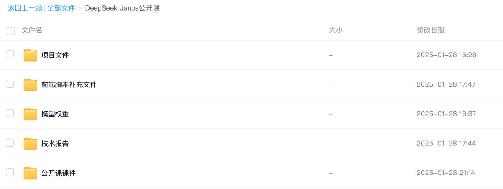


此外，公开课全部训练项目代码、数据、以及训练完的模型，已上传至课件网盘，联系⬆️助教即可领取。

***

**一、Janus Pro模型介绍**

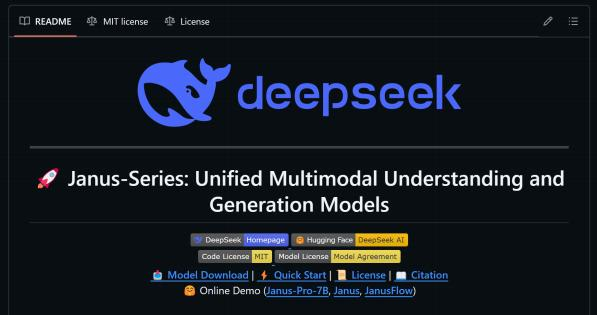

### **1.Janus Pro统一多模态大模型项目简介**

Janus-Pro 是此前工作 Janus 的高级版本。具体来说， Janus-Pro 包括以下改进：优化的训练策略、  扩展的训练数据以及更大规模的模型。通过这些改进，  Janus-Pro 在多模态理解和文本生成图像的指令跟 随能力上取得了显著进步，同时还提升了文本生成图像的稳定性。

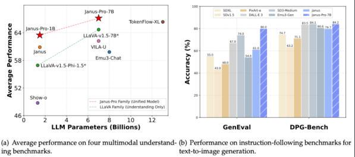

Janus 是一种新颖的自回归框架，旨在统一多模态的理解与生成。它通过将视觉编码解耦为独立的路径来 克服以往方法的局限性，同时仍然使用单一的统一 Transformer 架构进行处理。这种解耦不仅缓解了视  觉编码器在理解和生成任务中的角色冲突，还增强了框架的灵活性。


Janus 超越了以往的统一模型，并且在性能上与任务专用模型持平或超越。其简洁性、高灵活性和高效性 使 Janus 成为下一代统一多模态模型的有力候选者。

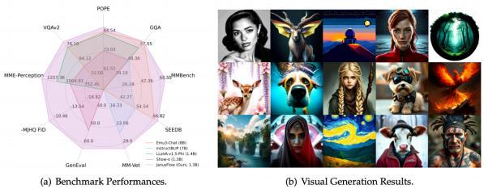

### **2.Janus Pro模型资料汇总**

* Janus Github主页： <https://github.com/deepseek-ai/Janus>

* Janus 7B HuggingFace主页：<https://huggingface.co/deepseek-ai/Janus-Pro-7B>

* Janus Pro技术报告： [https://github.com/deepseek-ai/Janus/blob/main/janus\_pro\_tech\_report.](https://github.com/deepseek-ai/Janus/blob/main/janus_pro_tech_report.pdf) [pdf](https://github.com/deepseek-ai/Janus/blob/main/janus_pro_tech_report.pdf)

* Janus 7B在线demo：<https://huggingface.co/spaces/deepseek-ai/Janus-Pro-7B>


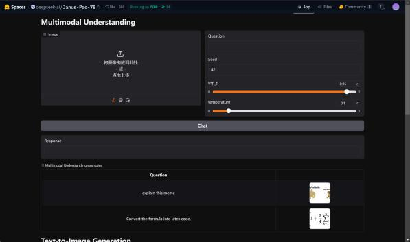

### **3.Janus Pro模型部分效果演示**

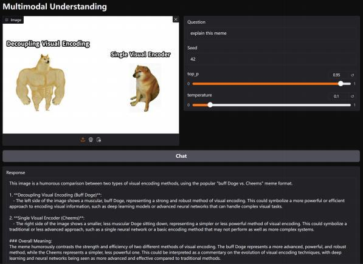

这张图片是一个幽默的比较，采用了流行的“buff Doge vs. Cheems”表情包格式，来对比两种视觉编码方 法。

1\. **解耦视觉编码（Buff Doge）**：

图片左侧展示了一只肌肉发达的“buff Doge”，代表了一种强大且稳健的视觉编码方法。这可   能象征着一种更强大或更高效的编码视觉信息的方法，比如深度学习模型或能够处理复杂视觉 任务的先进神经网络。

2\. **单一视觉编码器（Cheems）**：

图片右侧展示了一只体型较小、肌肉较少的“Cheems Doge”，代表了一种更简单或较弱的视觉 编码方法。这可能象征着一种传统或不太先进的方法，比如单一的神经网络或一种基础的编码 方法，可能无法像更复杂的系统那样表现出色。

### **4. Janus模型运行硬件要求**

Janus Pro对硬件要求较低，以下是1B模型和7B模型运行的GPU显存占用情况：

| **任务类型** | **Janus-Pro-1B** | **Janus-Pro-7B**   |
| -------- | ---------------- | ------------------ |
| 图像识别     | 5G（ 3060）        | 15G（4080）          |
| 图片生成     | 14G（4080）        | 40G（ 3090/4090\*2） |

## **二、Janus模型下载与项目部署**

### **Step 1.安装git与克隆仓库**

在新服务器上运行该项目，首先需要更新apt工具并安装Git工具：

```sql
sudo apt update
sudo apt install git
```


然后使用 git 克隆 **HunyuanVideo&#x20;**&#x4ED3;库到本地：

```sql
cd ~/autodl-tmp
git clone https://github.com/deepseek-ai/Janus.git cd HunyuanVideo
```

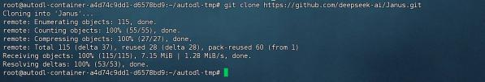

当前项目主目录如下：

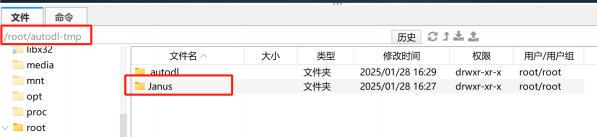

项目文件目录如下：


当然，也可以在Github官网下载安装包： [https://github.com/deepseek-ai/Janus?tab=readme-ov-file#](https://github.com/deepseek-ai/Janus?tab=readme-ov-file#janusflow) [janusflow](https://github.com/deepseek-ai/Janus?tab=readme-ov-file#janusflow) ，并上传至服务器解压缩：

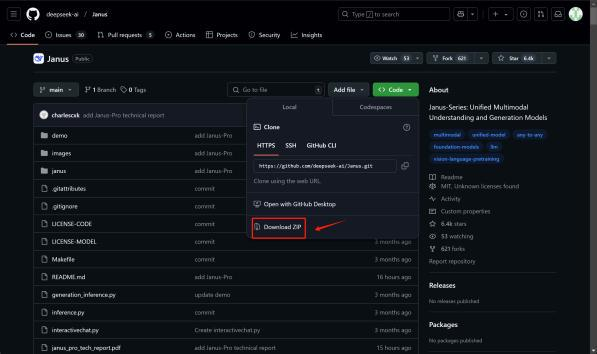

### **Step 2. 创建虚拟环境&安装项目依赖**

**准备 Conda 虚拟环境**： 使用以下命令创建 Conda 环境：

```sql
conda create -n janus python=3.9
```

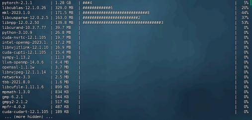

**&#x20; 激活环境**： 创建环境后，激活它：

```sql
conda init
source ~/.bashrc
conda activate janus
```

.  **安装 pip 依赖**： 激活环境后，安装所需的 Python 依赖：

```sql
cd /root/autodl-tmp/Janus pip install -e
```

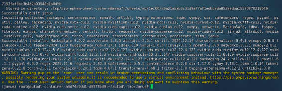

下载JupyterLab

考虑到后续需要在代码环境中调用Janus，这里还需要下载JupyterLab，并配置kernel：

```sql
conda install jupyterlab conda install ipykernel
python -m ipykernel install --user --name janus --display-name "Python (janus)"
```

**打开Jupyter**

```plain&#x20;text
jupyter lab --allow-root
```

并确认可以选择janus环境

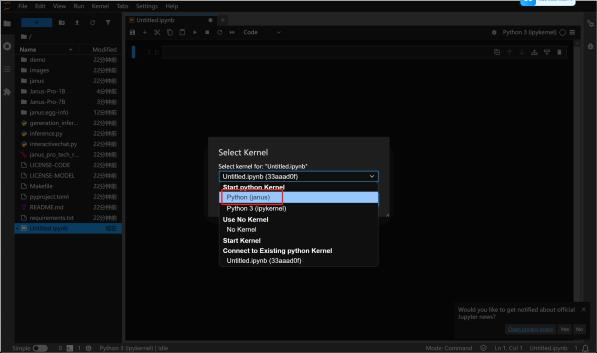

### **Step 3.下载预训练模型**

这里我们考虑在项目主目录下创建models文件夹，用于保存Janus-Pro-1B和7B模型权重。考虑到国 内网络环境，这里推荐直接在Modelscope上进行模型权重下载。

Janus-Pro-1B模型权重： <https://www.modelscope.cn/models/deepseek-ai/Janus-Pro-1B> Janus-Pro-7B模型权重： <https://www.modelscope.cn/models/deepseek-ai/Janus-Pro-7B>&#x20;

**安装modelscope**

```plain&#x20;text
pip install modelscope
```

**&#x20;创建权重保存文件夹**

```plain&#x20;text
cd /root/autodl-tmp/Janus mkdir ./Janus-Pro-1B
mkdir ./Janus-Pro-7B
```

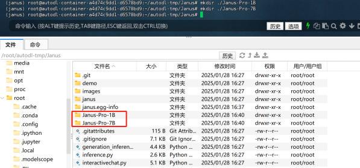

&#x20; **下载Janus-Pro-1B模型权重**

```plain&#x20;text
# 下载1B模型
modelscope download --model deepseek-ai/Janus-Pro-1B --local_dir ./Janus-Pro-1B
```

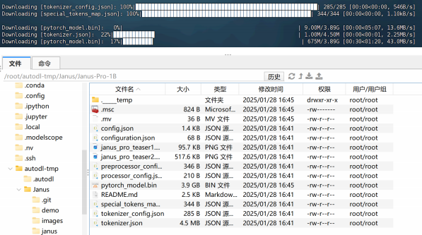

&#x20;**下载Janus-Pro-7B模型权重**

```sql
# 下载7B模型
modelscope download --model deepseek-ai/Janus-Pro-7B --local_dir ./Janus-Pro-7B
```

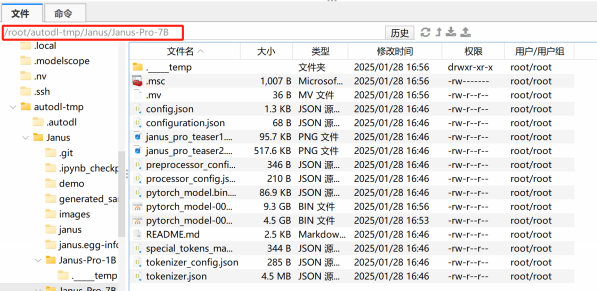

预训练模型权重较大也可直接使用在课件文件夹中通过百度网盘下载：

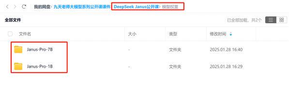

## **三、Jannus本地调用流程                                                   &#x20;**

本部分内容详见Jupyter代码文件：  Janus Pro本地调用指南

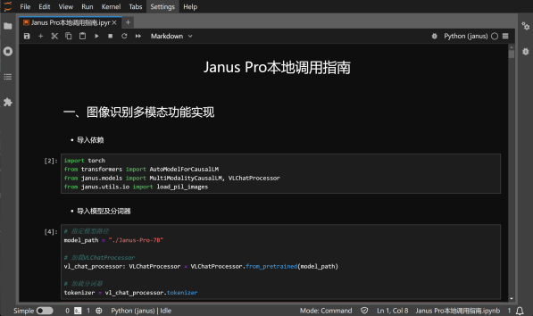

同样在网盘中下载即可：

**四、 Gradio前端调用方法**

此外，Janus项目中还提供了前端调用脚本，我们可以按照如下流程开启前端并与Janus进行对话。  &#x20;

**安装相关依赖**

```sql
pip install -e .[gradio]
```


&#x20;**修改推理脚本**

若要调用本地模型进行推理，则需要修改对应的前端脚本。打开 ./demo/app\_januspro.py文件， 并在15行处修改为当前本地模型下载地址：

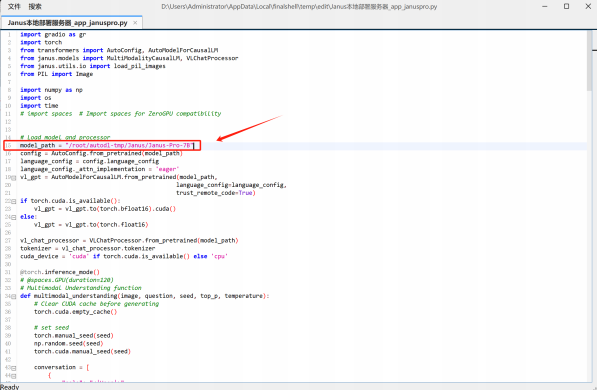

保存并退出即可。

&#x20;**上传补充文件【可选】**

若需要使用公网IP分享连接，则需要额外手动下载frpc包：

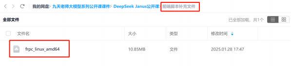

frpc包已上传至课件网盘（同样保存在上文的百度网盘中）

然后添加至 /root/miniconda3/envs/janus/lib/python3.9/site-packages/gradio 文件夹内：

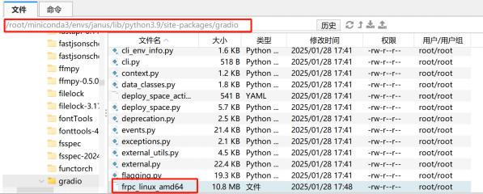

**开启前端服务**

然后即可开启前端服务：

```sql
python demo/app_januspro.py
```

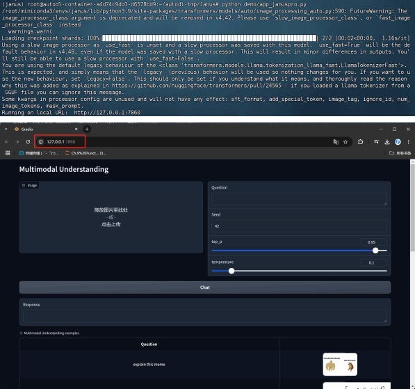

然后即可按照如下方式进行使用：

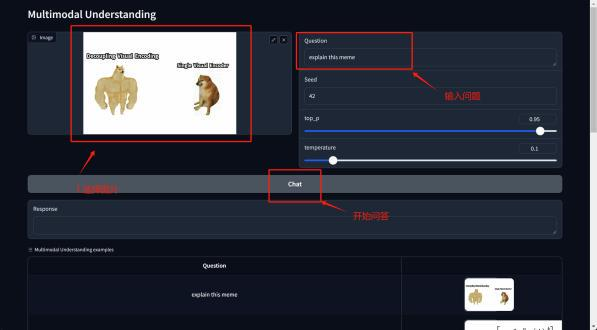

运行得到结果如下：

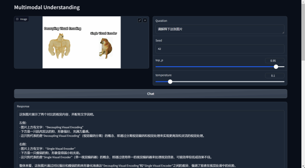

图像创建流程如下，下滑至Text-to-Image Generation页面：

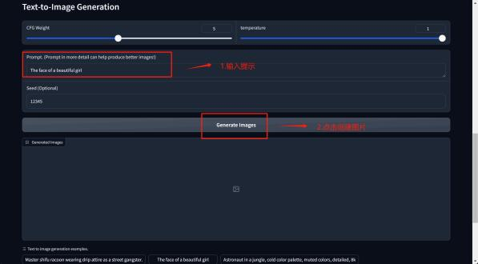

稍等片刻，即可查看最终运行结果：&#x20;

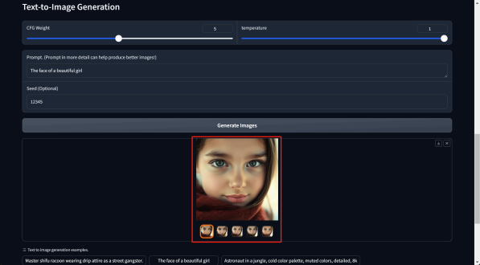
