# 课程说明：

* 体验课内容节选自[《2025大模型Agent智能体开发实战》](https://whakv.xetslk.com/s/1tKbjV)完整版付费课程

  体验课时间有限，若想深度学习大模型技术，欢迎大家报名由我主讲的[《2025大模型Agent智能体开发实战》](https://whakv.xetslk.com/s/1tKbjV)：

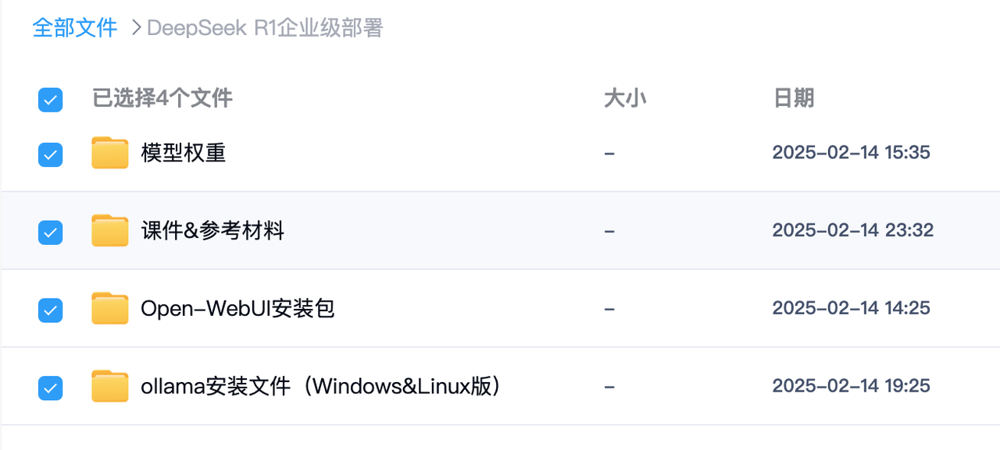


此外，公开课全套学习资料，已上传至网盘（ https://pan.baidu.com/s/1zdVHEEyJdgtE31DLvz41Iw?pwd=i8q7 ）

**需要更系统深入学习大模型可扫码⬆️添加助教咨询喔～**

***

## **一、** **DeepSeek** **R1本地部署系列教程**

在此前的公开课中，我们曾详细介绍过DeepSeek R1模型的本地部署+Ollama、vLLM等主流框架调 用流程：<https://www.bilibili.com/video/BV19kFoe6Ef7/>


以及，讲解了DeepSeek R1模型+AnythingLLM的知识库问答实战： [https://www.bilibili.com/video/BV](https://www.bilibili.com/video/BV12qF2ePEDa/) [12qF2ePEDa/](https://www.bilibili.com/video/BV12qF2ePEDa/)


但对于DeepSeek R1，仍然有大量的实用功能没有实现，如代码解释器、联网功能、更加高效的知识库 检索功能、外部工具调用功能、以及连接本地MySQL数据库等功能。

本节公开课，我们就将结合DeepSeek R1与最热门的企业级大模型前端调用框架Open-WebUI，来 详细介绍如何完善丰富DeepSeek R1的本地部署调用功能。

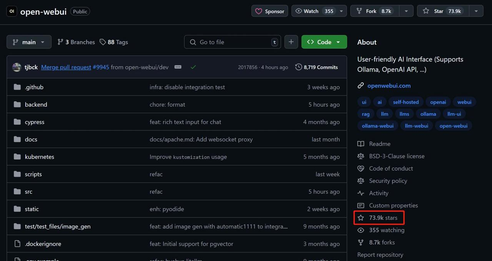

* &#x20; **硬件要求**：本节公开课需调用DeepSeek R1 Distill 14B蒸馏模型进行实验，最少需要10G显存。

* &#x20; **课件代码领取**：公开课随课提供全部课件、代码、模型权重等各项内容。

* &#x20; **课程参考资料**：为了更好的辅助学习，随公开课附赠相关参考资料。

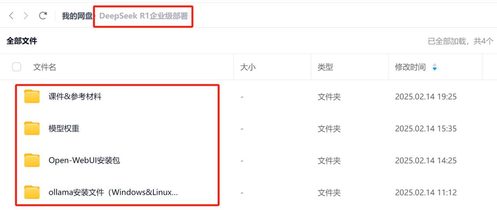


此外，公开课训练项目代码、数据、及模型权重等等，已上传至课件网盘，**联系⬆️助教回复“DS网盘”，即可领取（**&#x76EE;前咨询人数较多，助教老师在加急一一回复啦，小伙伴们发送后耐心等待一下哦🌹～**）**。

***

公开课目录：

**DeepSeekR1+Open-Webui多功能企业级部署实战**

一、DeepSeekR1本地部署系列教程

二、DeepSeek  R1部署基础环境搭建 1.Open-WebUI部署流程

2.ollama安装部署

3.1 【方案一】在线下载模型权重

3.2【方案二】手动下载GGUF权重并运行 三、Open-WebUI基础调用测试

1.首次启动流程   2.模型选择与切换

3.代码解释器功能实现

4.联网功能实现【国内不稳定】

四、DeepSeekR1+Open-WebUI进阶功能使用

1.RAG本地知识库问答

2.外部工具调用Functioncalling

3.连接本地MySQL数据库进行数据查询

## **二、** **DeepSeek** **R1部署基础环境搭建**                            &#x20;

### **1.Open-WebUI部署流程**                                                         &#x20;

首先需要安装Open-WebUI，官网地址如下： <https://github.com/open-webui/open-webui>。

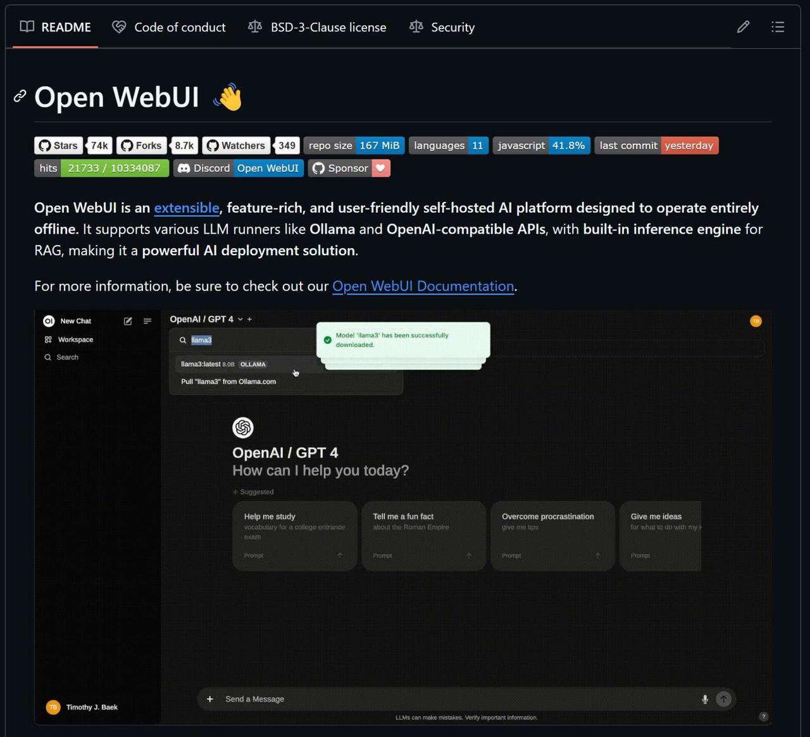

我们可以直接使用pip命令快速完成安装：

| pip install open-webui |
| ---------------------- |

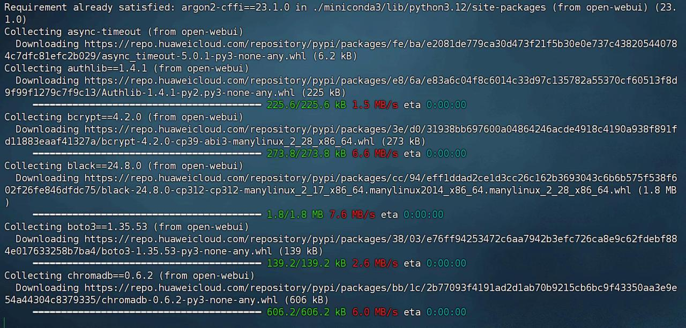

可以直接使用在GitHub项目主页上直接下载完整代码包，并上传至服务器解压缩运行：

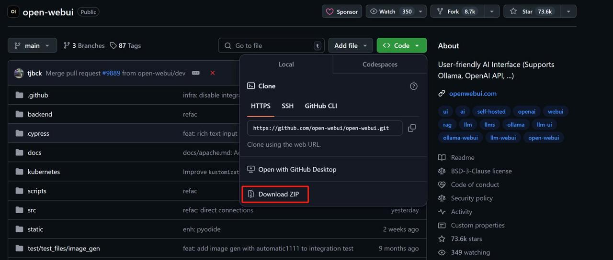

此外，也可以在课件网盘中领取完整代码包，并上传至服务器解压缩运行：

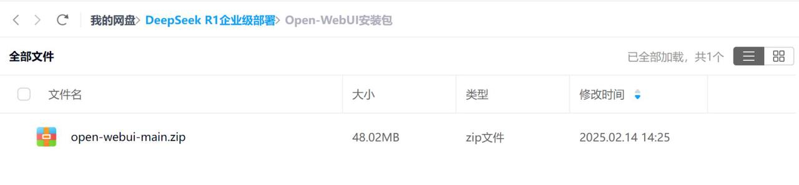


⬆️上图扫码即可领取～


安装完成后先不启动，等其他相关组件安装完后再启动。

### **2.** **ollama安装部署**

Open-WebUI原生支持使用Ollama调用本地模型进行推理， Ollama是一款大模型下载、管理、推   理、优化集一体的强大工具，可以快速调用各类离线部署的大模型。  Ollama官网：<https://ollama.com/>

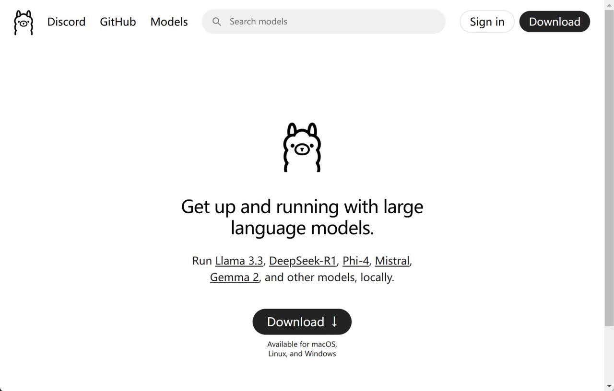

* 【安装方案一】Ollama在线安装

在Linux系统中，可以使用如下命令快速安装Ollama

| curl -fsSL https://ollama.com/install.sh \| sh |
| ---------------------------------------------- |

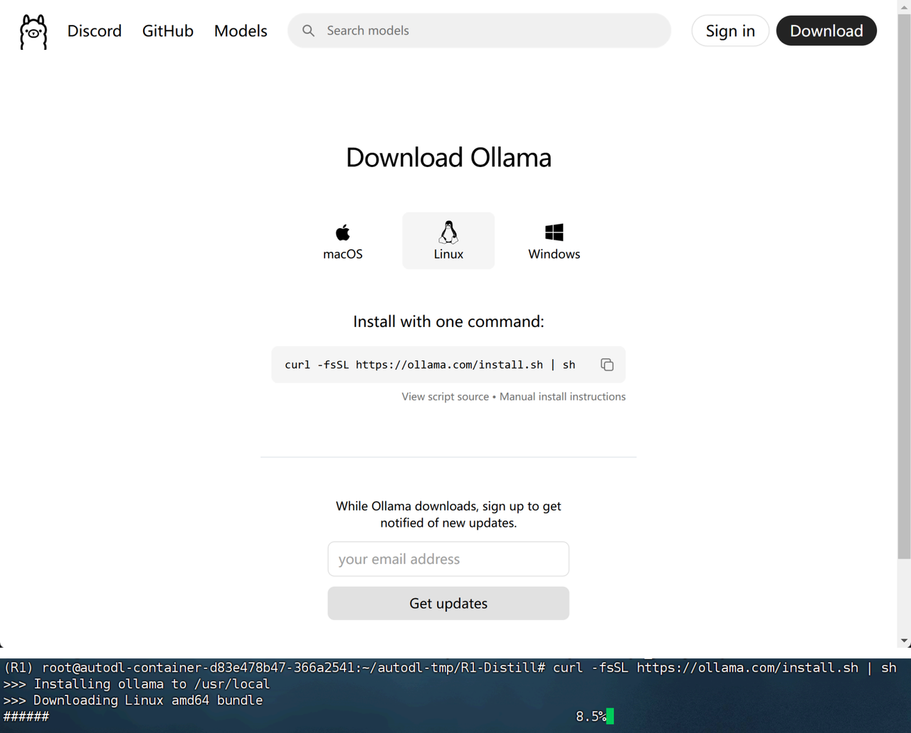

但该下载流程会受限于国内网络环境，下载过程并不稳定。&#x20;

* 【安装方案二】 Ollama离线安装

因此，在更为一般的情况下，推荐使用Ollama离线部署。我们可以在Ollama Github主页查看目前 Ollama支持的各操作系统安装包： <https://github.com/ollama/ollama/releases>

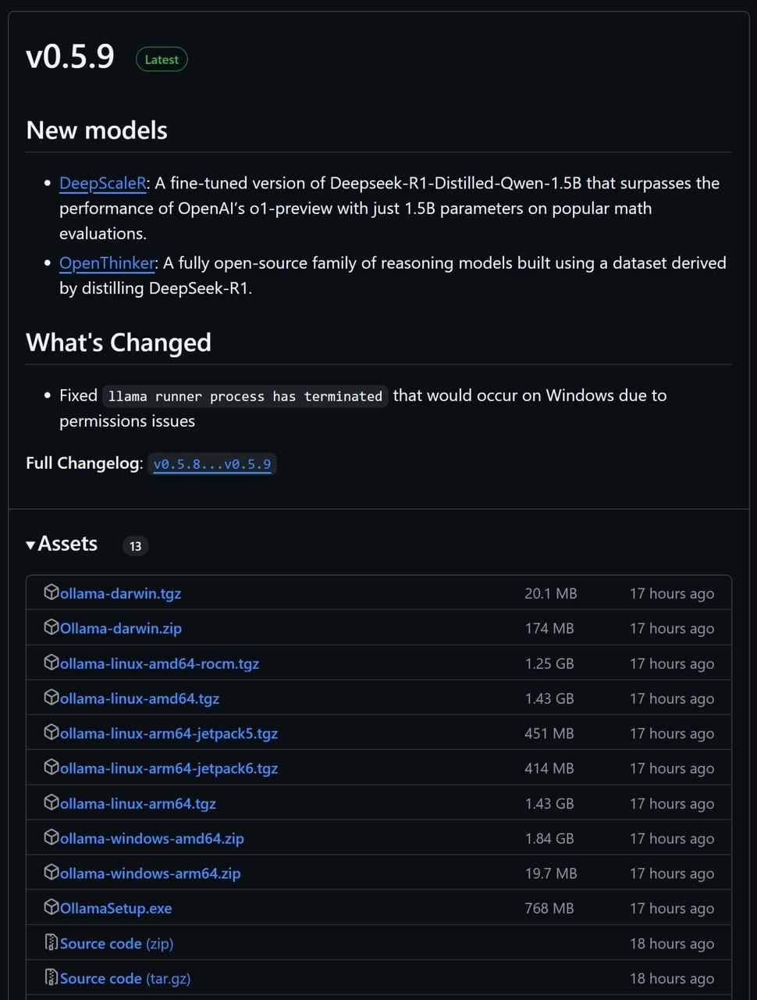

若是Ubuntu操作系统，选择其中 ollama-linux-amd64.tgz下载和安装即可。 此外，安装包也可从网盘中下载：

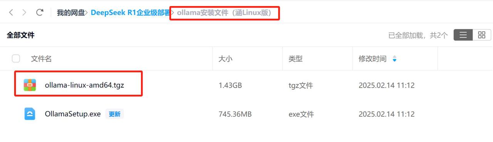

下载完成后，需要先上传至服务器：

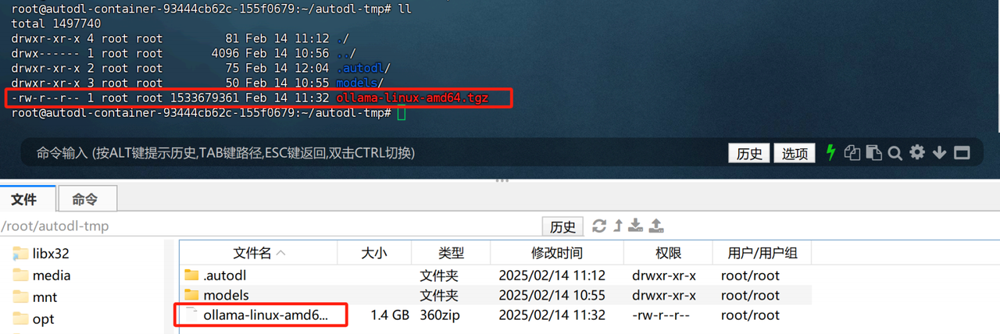

然后使用如下命令进行解压缩

| mkdir ./ollamatar -zxvf ollama-linux-amd64.tgz -C ./ollama |
| ---------------------------------------------------------- |

解压缩后项目文件如图所示：

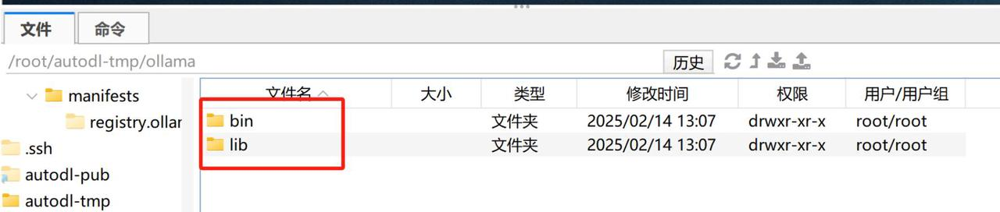

而在bin中，可以找到ollama命令的可执行文件。

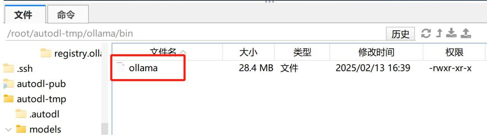

此时，我们可以使用如下方式使用ollama：

| cd ./bin./ollama help |
| --------------------- |

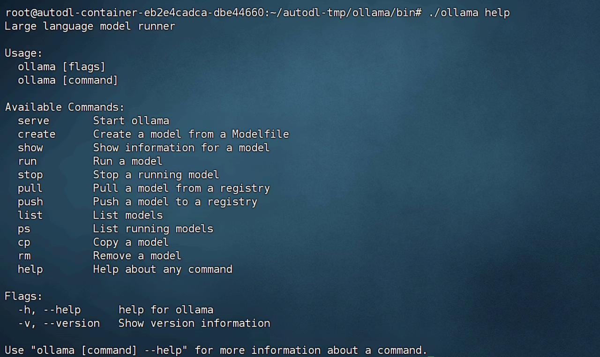

| 此处若显示没有可执行权限，可以使用如下命令为当前脚本添加可执行权限： |                 |
| ---------------------------------- | --------------- |
|                                    | chmod +x ollama |

而为了使用命令方便，我们也可以将脚本文件写入环境变量中。我们可以在主目录（root）下找 到.bashrc文件：

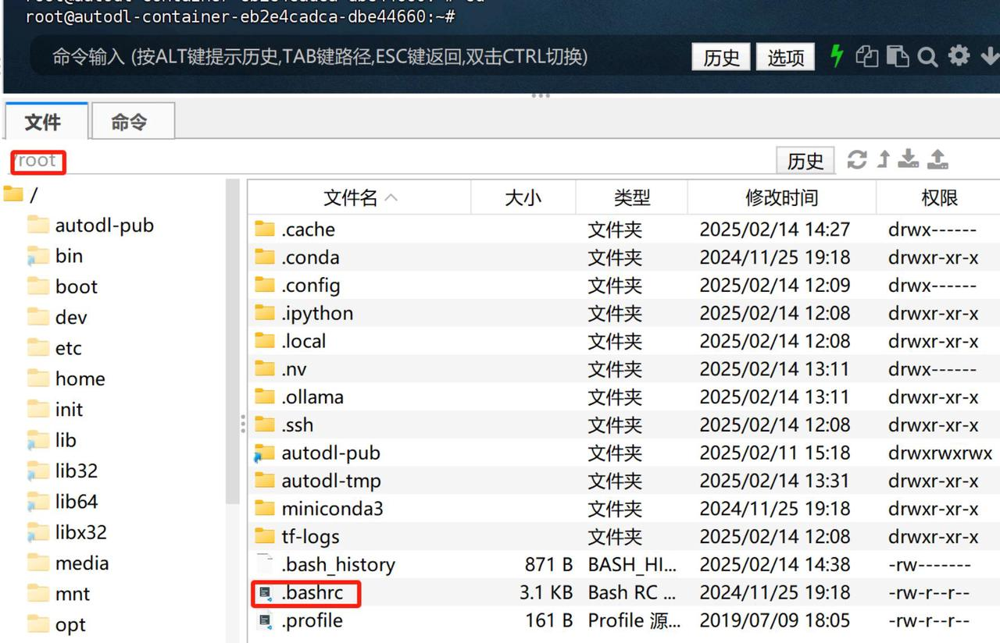

然后在 .bashrc文件结尾写入ollama/bin文件路径：


保存并退出后，输入如下命令来使环境变量生效：

| source \~/.bashrc |
| ----------------- |

然后在任意路径下输入如下命令，测试ollama环境变量是否生效

| ollama help |
| ----------- |

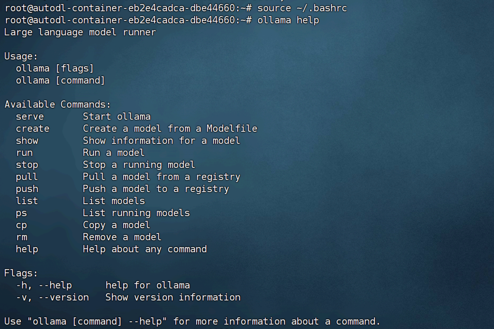

* 【可选】更换Ollama默认模型权重下载地址

接下来我们需要使用ollama来下载模型，但默认情况下， ollama会将模型下载到/root/.ollama文件 夹中，会占用系统盘空间，因此，若有需要，可以按照如下方法更换模型权重下载地址。

此外无论是在线还是离线安装的ollama，都可以按照如下方法更换模型权重下载地址。还是需要打 开 /root/.bashrc文件，写入如下代码：

| export OLLAMA\_MODELS=/root/autodl-tmp/models |
| --------------------------------------------- |

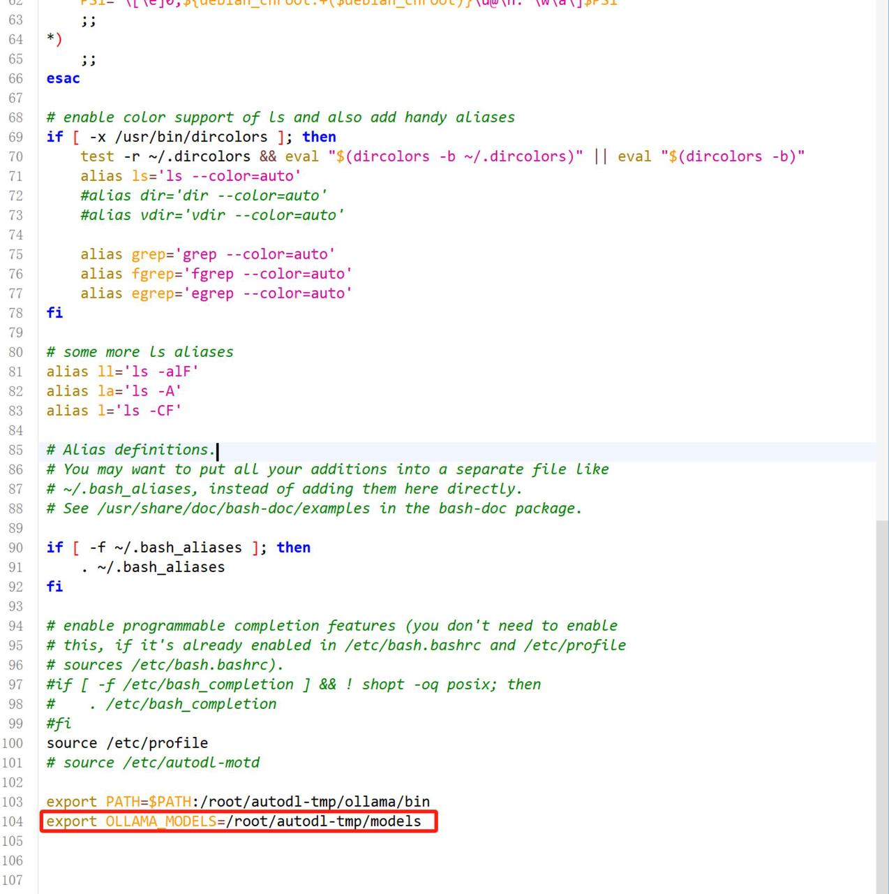

这里的路径需要改写为自己的文件地址

保存并退出后，输入如下命令来使环境变量生效：

| source \~/.bashrc |
| ----------------- |

测试环境变量是否生效

| echo $OLLAMA\_MODELS |
| -------------------- |


.    启动ollama

接下来即可启动ollama，为后续下载模型做准备：

| ollama start |
| ------------ |

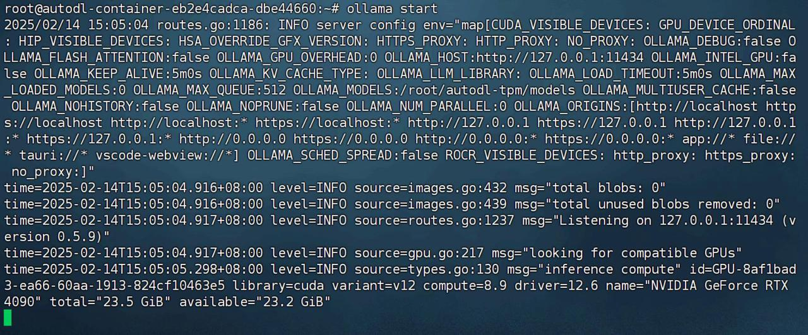

注意，在整个应用使用期间，需要持续开启Ollama。

**3.** **DeepSeek** **R1与Embedding模型下载**

接下来即可进入到模型下载环节。要顺利的使用Open-WebUI进行对话和知识库检索问答，需要下  载对话模型和Embedding模型。模型权重下载可以使用ollama pull命令进行在线下载（没有网络门槛， 且速度很快），当然也可以手动下载模型权重，然后上传到服务器上，再注册到Ollama中，就可以通过 Ollama调用模型了。以下两种模型权重下载方法任选其一执行即可。

#### **3.1** **【方案一】在线下载模型权重**

* &#x20;DeepSeek R1 Distill模型权重下载流程

目前DeepSeek R1及其蒸馏模型均支持使用ollama进行调用，可以在模型主页查看调用情况： [https://oll](https://ollama.com/library/deepseek-r1) [ama.com/library/deepseek-r1](https://ollama.com/library/deepseek-r1)

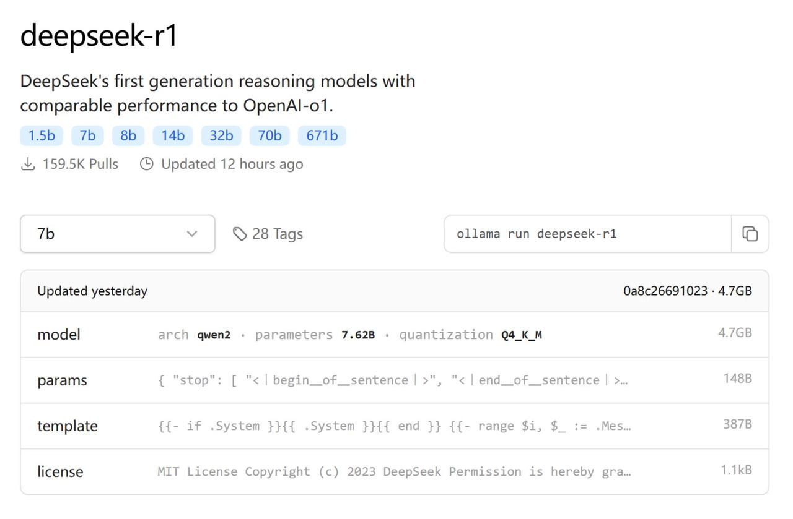

其中各模型在Q4   K   M量化情况下运行所需显存情况如下：

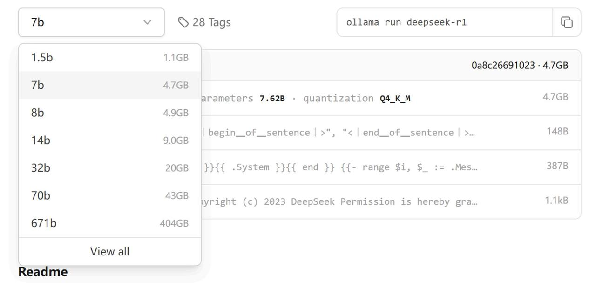

这里我们还是以1.5B模型为例进行演示，其他模型流程类似（只需要更换模型名称即可）。 .  deepseek-r1:1.5b模型权重下载流程

| ollama run deepseek-r1:1.5b |
| --------------------------- |

若只下载不调用，则可以使用ollama pull命令

使用该命令后系统就会自动下载模型权重，并自动完成注册。

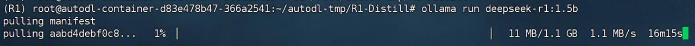

等待模型下载完成后即可直接使用：

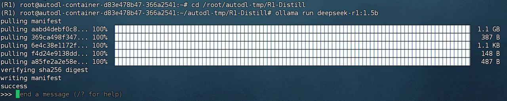

对话效果如下：


* Embedding模型下载流程

nomic-embed-text是一个专门用于特征提取和句子相似度计算的Embedding模型。该模型在多个任务    上表现出色，特别是在分类、检索和聚类任务中，表现与OpenAI上一代Embedding模型性能相当。其核 心优势在于能够生成高质量的句子嵌入，这些嵌入在语义上非常接近，从而在相似度计算和分类任务中   表现优异。<https://ollama.com/library/nomic-embed-text>

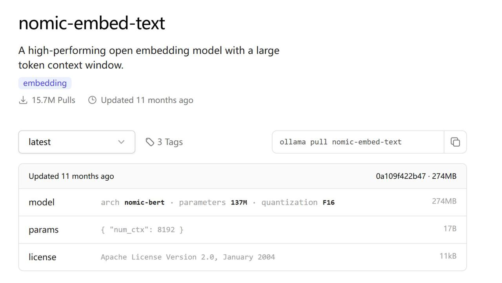

在线下载流程如下：

| ollama pull nomic-embed-text |
| ---------------------------- |

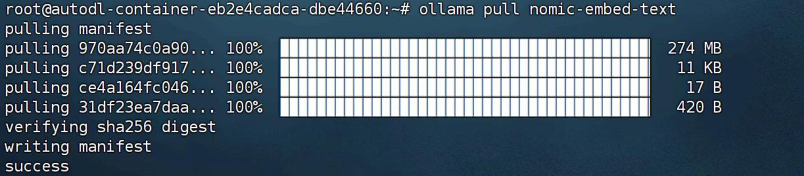

也可以使用ollama list查看当前下载的模型列表：

| ollama list |
| ----------- |

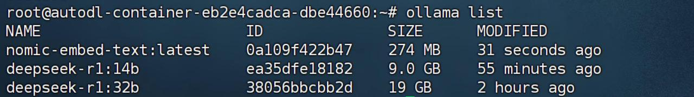

此时应该能看到nomic embedding和DeepSeek R1 1.5B模型。 此外，若要使用多模态功能，则还需要安装Janus pro

| ollama pull erwan2/DeepSeek-Janus-Pro-7B |
| ---------------------------------------- |

#### **3.2** **【方案二】手动下载GGUF权重并运行**

除了使用ollama run命令外， ollama也支持调用手动下载的自定义模型，但需要是GGUF格式。模型权 重可以在huggingface或魔搭社区上下载。

* DeepSeek R1 Distill模型权重下载流程

目前DeepSeek-R1-Distill-Qwen-1.5B模型已有各种不同量化版本的GGUF模型在魔搭社区中上线了： [htt](https://modelscope.cn/search?search=DeepSeek-R1-Distill-Qwen-1.5B-GGUF) [ps://modelscope.cn/search?search=DeepSeek-R1-Distill-Qwen-1.5B-GGUF](https://modelscope.cn/search?search=DeepSeek-R1-Distill-Qwen-1.5B-GGUF)

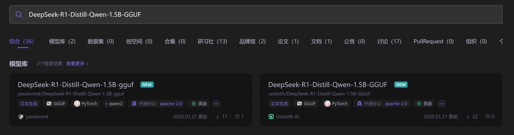

其中每个GGUF量化的权重都包含多个版本：

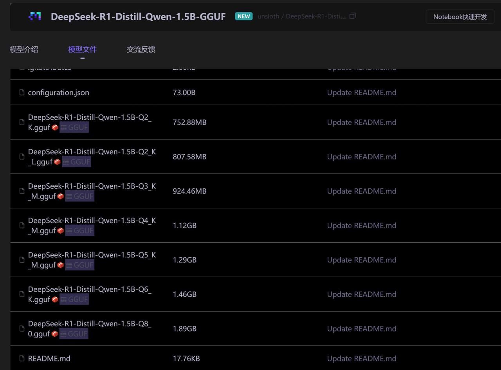

其中ollama调用的就是Q4\_K\_M量化版本。这里我们还是考虑下载Q4\_K\_M量化版本的GGUF权重进行调 用，具体执行流程如下。

* 安装魔搭社区

| pip install modelscope |
| ---------------------- |

下载GGUF格式权重


| mkdir DeepSeek-R1-1.5B-GGUFmodelscope download --model unsloth/DeepSeek-R1-Distill-Qwen-1.5B-GGUF DeepSeek- R1-Distill-Qwen-1.5B-Q4 K  M.gguf --local\_dir ./DeepSeek-R1-1.5B-GGUF |
| ---------------------------------------------------------------------------------------------------------------------------------------------------------------------------------- |

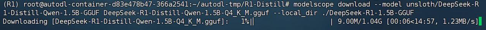

也可从网盘中直接下载：

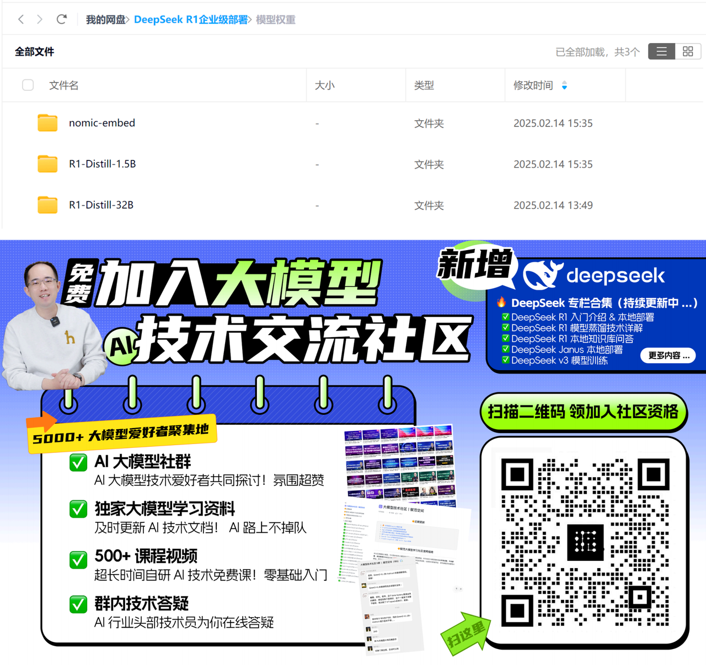

* 注册模型

然后需要创建一个file文件，用于进行ollama模型注册：

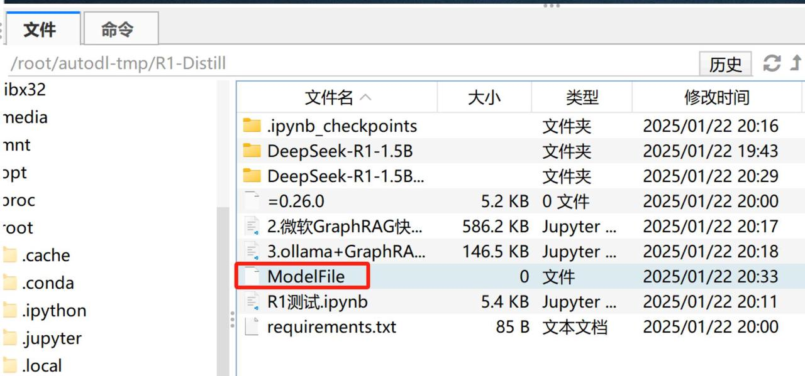

然后在File文件中写入自定义模型GGUF权重地址：

| FROM ./DeepSeek-R1-1.5B-GGUF./DeepSeek-R1-Distill-Qwen-1.5B-Q4 K  M.gguf |
| ------------------------------------------------------------------------ |

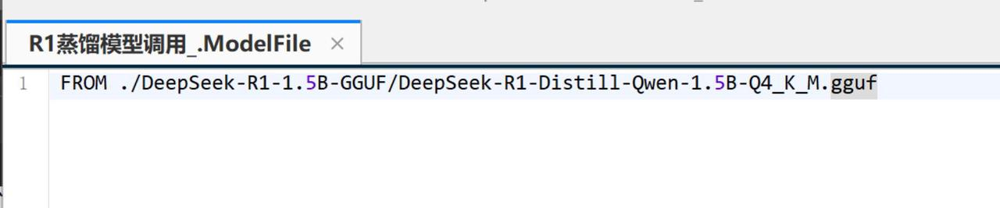

然后将该模型加入Ollama本地模型列表：

| ollama create DeepSeek-R1-1.5B -f ModelFile |
| ------------------------------------------- |

查看模型是否注册成功

| ollama list |
| ----------- |

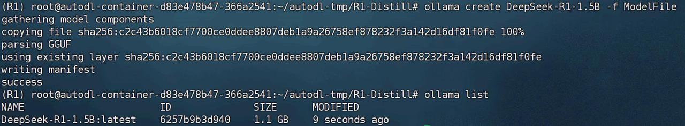

接下来即可使用了：

| ollama run DeepSeek-R1-1.5B |
| --------------------------- |


该流程也适用于其他不同型号的模型，下载对应的GGUF模型权重即可。

* Embedding模型下载流程

类似的， nomic模型的GGUF格式也可以从魔搭社区中进行下载，然后注册使用。下载地址如下：  [http](https://modelscope.cn/models/nomic-ai/nomic-embed-text-v1.5-GGUF) [s://modelscope.cn/models/nomic-ai/nomic-embed-text-v1.5-GGUF](https://modelscope.cn/models/nomic-ai/nomic-embed-text-v1.5-GGUF)

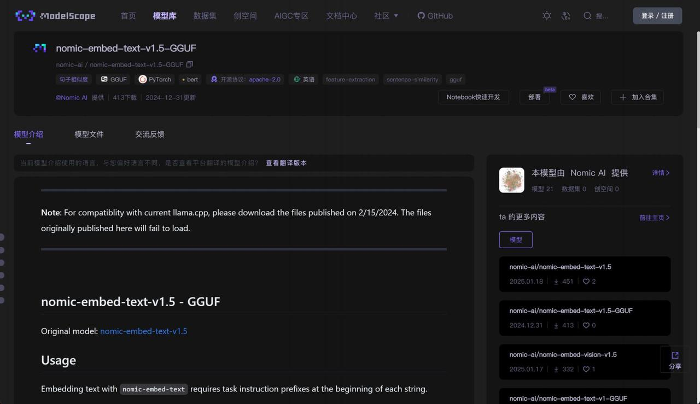

使用如下命令进行下载：

| mkdir nomic-embed-text-v1.5-GGUFmodelscope download --model nomic-ai/nomic-embed-text-v1.5-GGUF nomic-embed-text- v1.5.Q4 K  M.gguf --local\_dir ./nomic-embed-text-v1.5-GGUF |
| ----------------------------------------------------------------------------------------------------------------------------------------------------------------------------- |


也可以在网盘中进行下载并上传至服务器

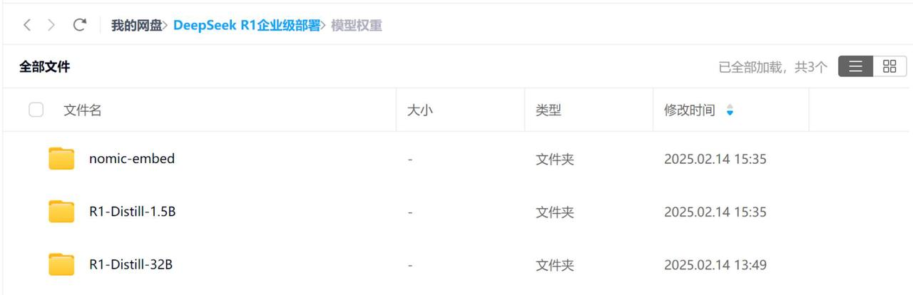


然后即可查看到下载的模型权重

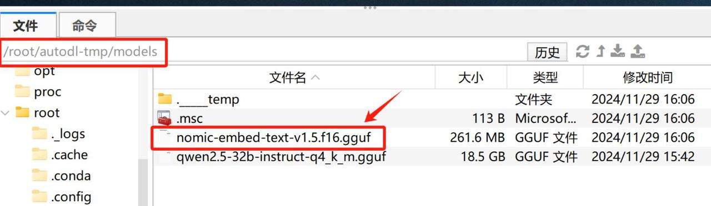

然后编写Embedding模型的File文件 EmbeddingModelFile ：

| FROM ./nomic-embed-text-v1.5.f16.gguf |
| ------------------------------------- |

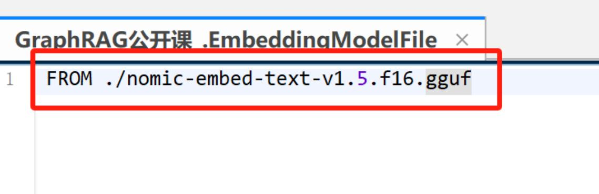

然后注册到ollama中：

| ollama create nomic-embed-text -f EmbeddingModelFile |
| ---------------------------------------------------- |


然后即可通过ollama list查看是否注册成功：

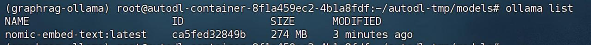

**三、** **Open-WebUI基础调用测试**

### **1.** **首次启动流程**

在准备好了Open-WebUI和一系列模型权重后，接下来我们尝试启动Open-WebUI，并借助本地模 型进行问答。

首先需要设置离线环境，避免Open-WebUI启动时自动进行模型下载：

| export HF\_HUB\_OFFLINE=1 |
| ------------------------- |

然后启动Open-WebUI

| open-webui serve |
| ---------------- |

需要注意的是，如果启动的时候仍然报错显示无法下载模型，是Open-WebUI试图从huggingface上下载 embedding模型，之后我们会手动将其切换为本地运行的Embedding模型。

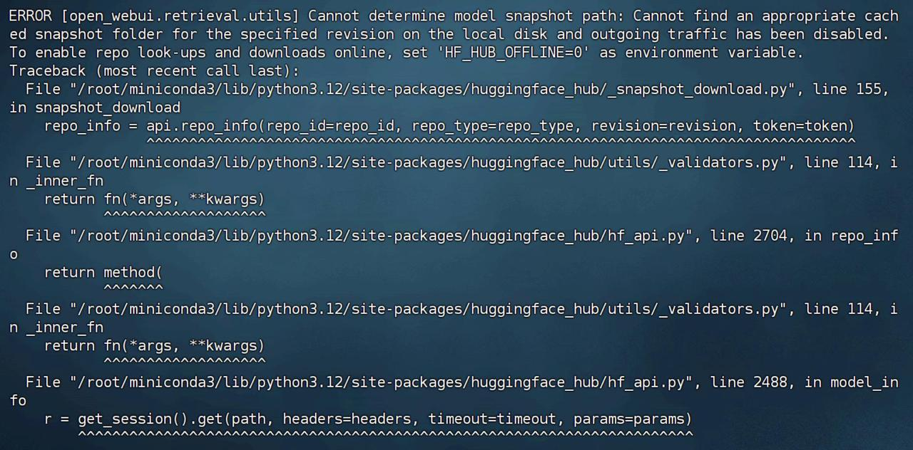

然后在本地浏览器输入地址:8080端口即可访问：


若使用AutoDL，则需要使用SSH隧道工具进行地址代理

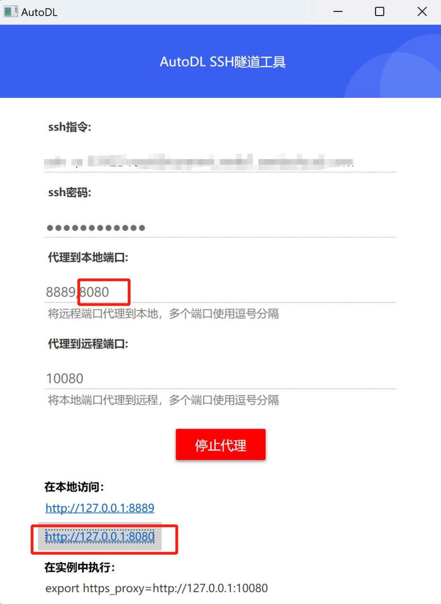

更多AutoDL相关操作详见公开课：《AutoDL快速入门与GPU租赁使用指南》 |[https://www.bilibil](https://www.bilibili.com/video/BV1bxB7YYEST/) [i.com/video/BV1bxB7YYEST/](https://www.bilibili.com/video/BV1bxB7YYEST/)

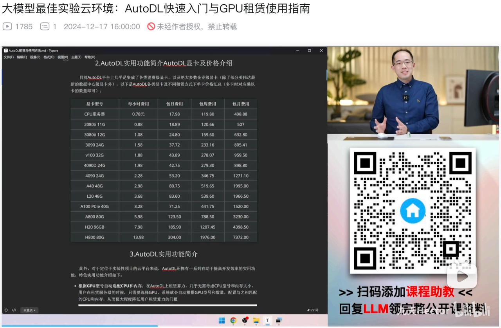

然后首次使用前，需要创建管理员账号：

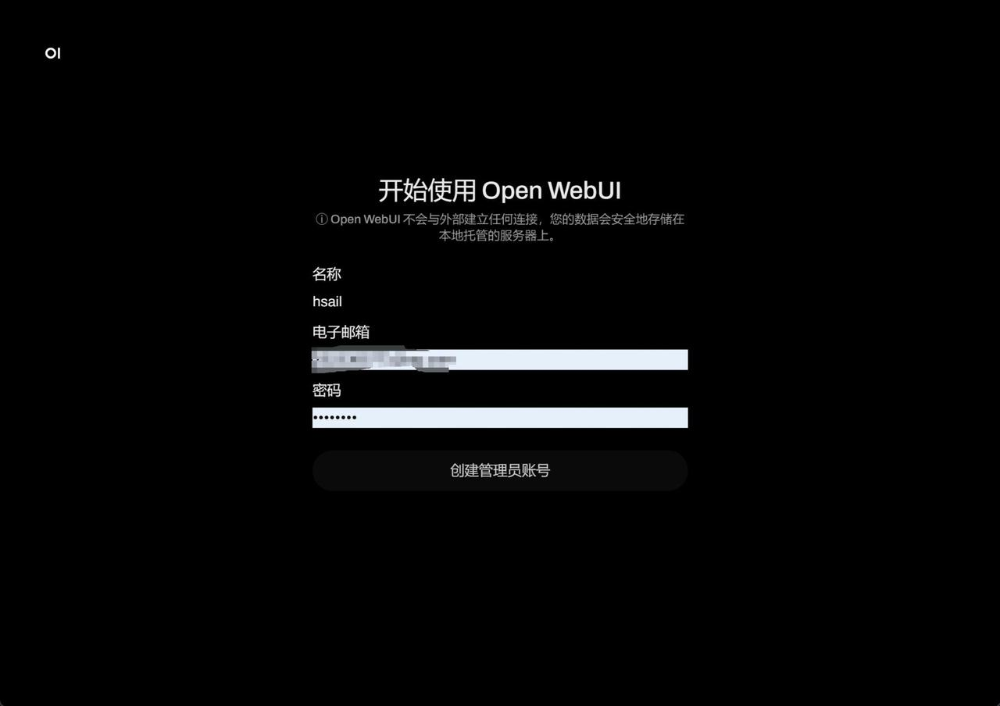

然后点击登录即可。需要注意的是，此时Open-WebUI会自动检测后台是否启动了ollama服务，并列举 当前可用的模型。稍等片刻，即可进入到如下页面：

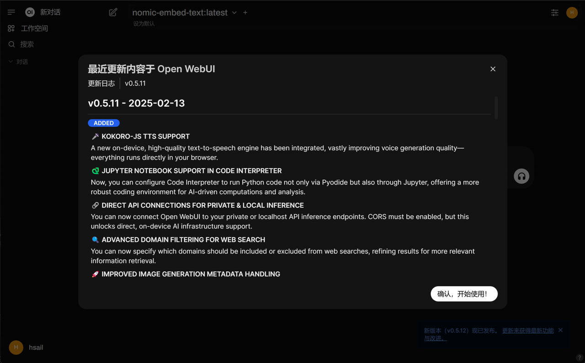

接下来即可进入到对话页面：

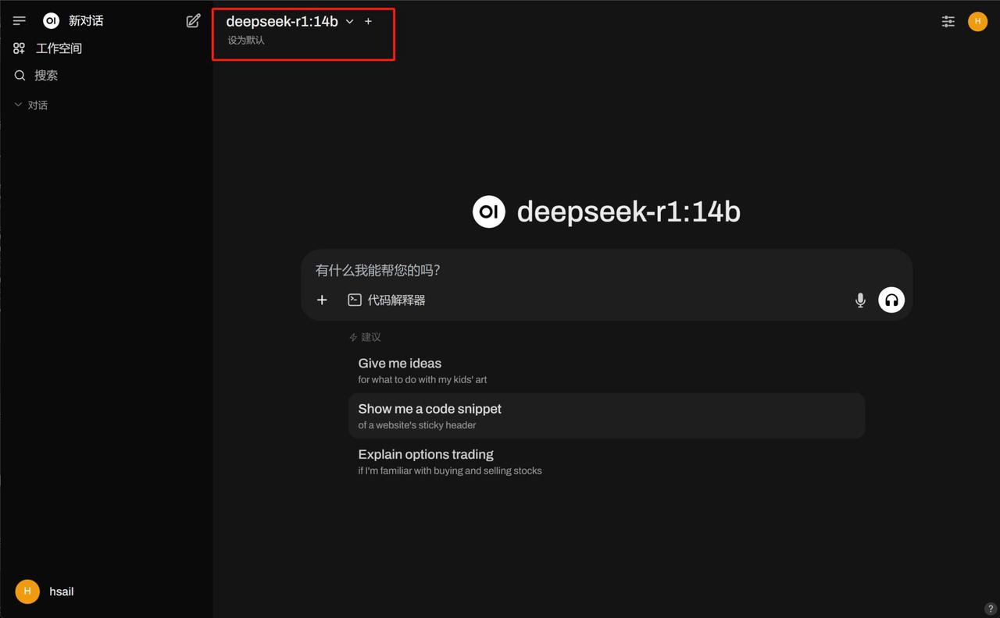

若此时Ollama服务仍然开启，点击左上角即可选择Ollama已集成的模型：

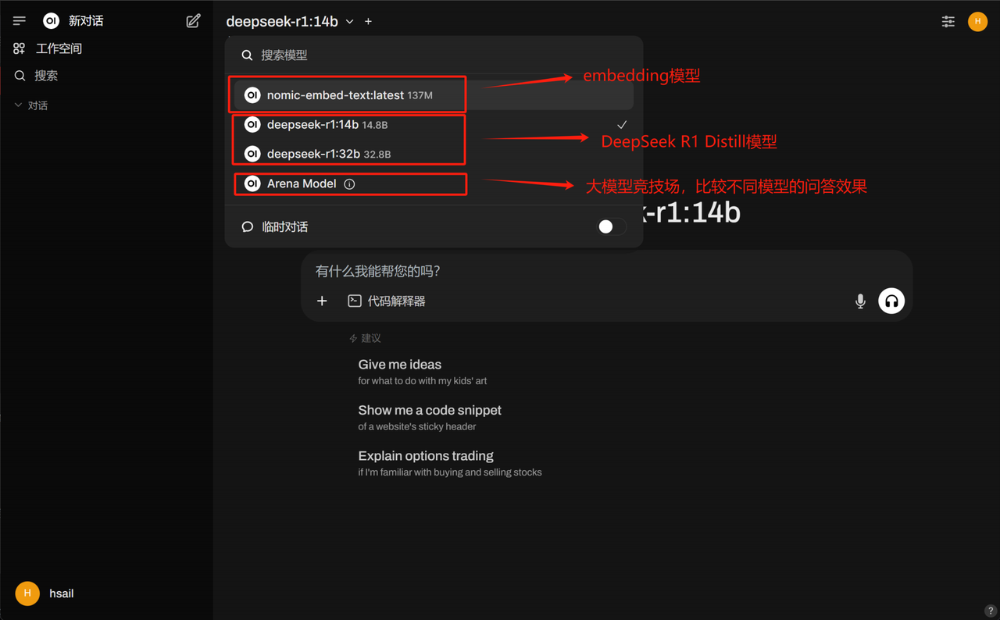

这里我们选择一个Chat模型即可开始对话：

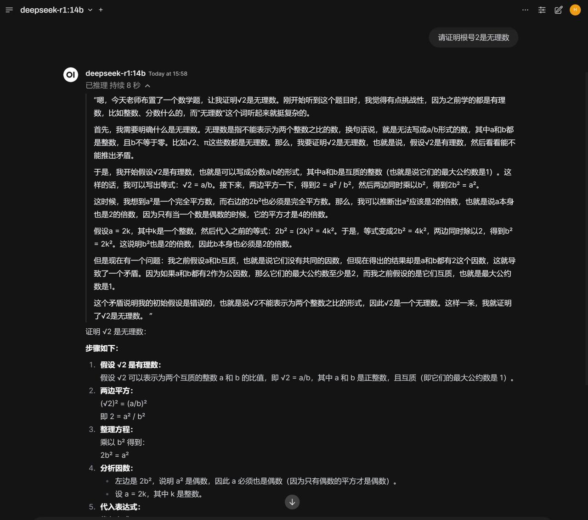

若登录对话页面时找不到模型，则需要先检查当前ollama服务是否开启、 ollama是否已经集成了 相关模型

至此，我们就完成了全部前期准备工作。


### **2.模型选择与切换**

Open WebUI支持自定义选择模型，点击左下方按钮：

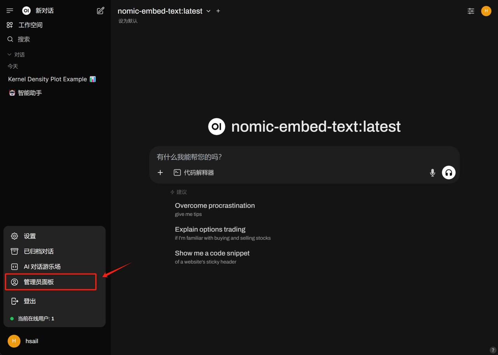

点击设置：

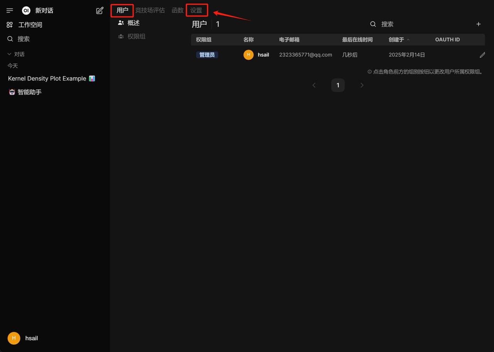

在外部连接中，可用选择是否启用在线模型。这里可以输入OpenAI API-KEY调用GPT模型，也可以输入 DeepSeek API-KEY，调用DeepSeek相关模型。此外，若是运行本地模型，则可在此处设置Ollama连   接。

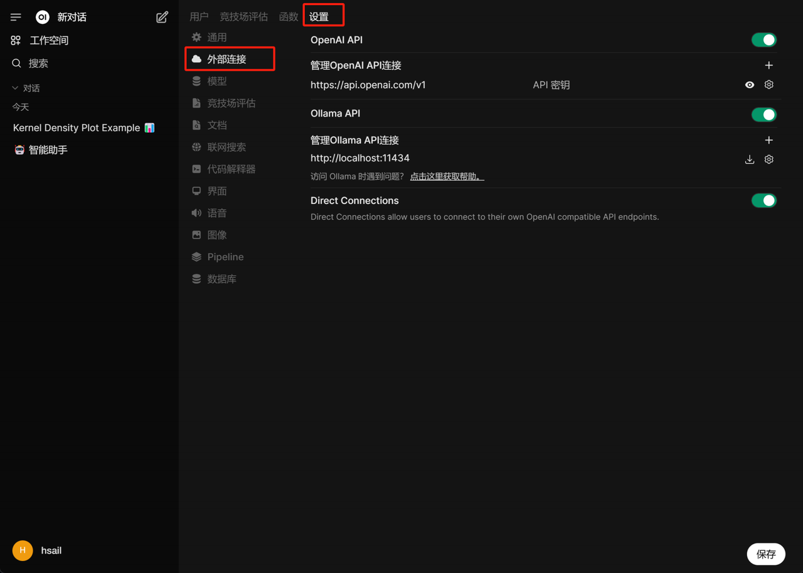

### **3.** **代码解释器功能实现**

Open Web-UI原生支持代码解释器功能，并且可以本地实时运行，并打印运行结果：

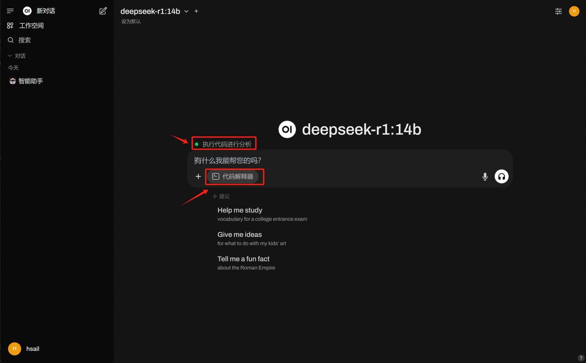

请帮我编写一段Python代码，用于绘制一个核密度分布图示例。


### **4.** **联网功能实现【国内不稳定】**

同样，我们可以在设置页面里选择是否开启联网功能。


若是国内网络环境，推荐使用duckduckgo，是一款免费的搜索引擎，无需设置或API-KEY验证即可使 用：


此外，若可以连接Google，也可以使用Google的pse   （可编程搜索引擎），可以获得更加准确的搜索结  果。 Google pse搜索引擎注册河设置方法，详见我的23年公开课[https://www.bilibili.com/video/BV16u](https://www.bilibili.com/video/BV16u411c7Nd) [411c7Nd](https://www.bilibili.com/video/BV16u411c7Nd)：


Open WebUI的各项功能，如代码解释器、联网搜索、 RAG问答、连接本地MySQL数据库等，在我 的23年大模型公开课合集中，都有更加底层的实现方法，感兴趣的同学可以在我的主页中看到对应 教程：<https://space.bilibili.com/385842994/upload/video>


需要按照如下设置duckduckgo并保存后：


开启新的会话，并输入一个时效话题：


能够看到，此时Open WebUI就开启了搜索和问答。由于duckduckgo是免费搜索引擎，有的时候并不稳 定。若想要获得稳定搜索结果，建议切换为在线模型，并使用网络工具+谷歌搜索来完成。


## **四、** **DeepSeek** **R1+Open-WebUI进阶功能使用**             &#x20;

### **1.** **RAG本地知识库问答**                                                            &#x20;

* 基础问答流程

Open-WebUI拥有比AnythingLLM更加强大的RAG系统、以及更加灵活的功能选择。


然后填写语义向量模型：  nomic-embed-text并保存：


回到对话页面，可以这里可以直接拖拽添加文件，也可以点击对话框中+号添加文件。


这里我们上传了DeepSeek R1的微调教程并进行提问，问答效果如下：


不同于AnythingLLM不知道当前对话中包含文档， Open WebUI的RAG系统提示词会更加完备一些。同 时还会提供对应的检索结果：


并且思考过程非常完备


* RAG流程优化

此外，我们也可以RAG基本原理对问答效果进行优化。


### **2.** **外部工具调用Function** **calling**

* Function calling功能介绍


* Ollama tool use功能实现

需要注意的是， DeepSeek R1模型原生并不支持Fucntion calling，但借助Ollama，可以实现基础的 Function calling，并基于此完成Open-WebUI的外部工具调用工作。


<https://ollama.com/blog/tool-support>

* Open-WebUI工具调用功能实现


然后编写天气查询函数：

```python
import requests 
import json
from fastapi import Request
from open_webui.models.users import Users
 
class Tools:
def    init    (self):
pass
 
async def get_weather(
self, loc: str,    request    : Request,    user    : dict,
         event_emitter    =None ) -> str:
"""
获取指定城市的即时天气信息。

:param loc: 城市名称（如果是非英文城市名称，请先将其翻译为英文城市名称再输入）。 :param    request    : HTTP 请求对象（来自  FastAPI）。
:param    user    : 用户信息（可以用于个性化或记录请求）。
:param    event_emitter    : 事件发射器，用于将实时状态更新发送到前端。 :return: 格式化后的天气数据，作为字符串返回。
说明：
如果输入的是非英文城市名称，请先将其翻译为对应的英文城市名称再输入。 比如，输入“ 中国，北京 ”，需要转为  "Beijing"。
"""
 
# Step 1. 通知用户正在获取天气数据
await    event_emitter    ( {
"type": "status",
"data": {"description": f"正在获取  {loc} 的天气数据 ...", "done":
False},
} )
 
try:
# Step 2. 构建请求的  URL 和查询参数
url = "https://api.openweathermap.org/data/2.5/weather" params = {
"q": loc,
"appid": "YOUR_API_KEY",  # 你的  API 密钥
"units": "metric",  # 使用摄氏度
"lang": "zh_cn",  # 输出简体中文 }
 
# Step 3. 向  OpenWeather API 发送  GET 请求
response = requests.get(url, params=params)
 
# Step 4. 解析响应数据
data = response.json()
 
# Step 5. 提取并格式化天气描述
weather_data = data.get("weather", []) if weather_data:
main_weather = weather_data[0].get("main", "")
description = weather_data[0].get("description", "")
weather_info = f"当前天气： {main_weather} - {description}" else:

weather_info = "天气信息不可用。 "
# Step 6. 通知用户天气数据已经成功获取
await    event_emitter    ( {
"type": "status",
"data": {"description": f"成功获取  {loc} 的天气数据", "done":
True},
} )
 
# Step 7. 返回格式化后的天气信息并发送到前端
await    event_emitter    ( {
"type": "message",
"data": {"content": f"{loc} 的天气信息 : {weather_info}"},
} )
 
# 返回格式化后的天气数据作为字符串
return f"{loc} 的天气信息: {weather_info}"
 
except Exception as e:
# Step 8. 如果发生错误，通知用户
await    event_emitter    ( {
"type": "status",
"data": {"description": f"发生错误 : {str(e)}", "done": True},
} )
# 返回错误信息
return f"获取天气数据时发生错误： {str(e)}"
```

并将函数进行写入：


完成后即可看到新的工具：


在对话时可以开启天气查询函数：


比如询问北京天气，可以获得如下回答：


与实际天气相符


### **3.连接本地MySQL数据库进行数据查询**

此外，我们还可以借助工具，编写SQL围绕本地数据库中数据进行查询。&#x20;

&#x20;&#x20;

* 创建MySQL数据库

| apt install mysql-server |
| ------------------------ |


然后启动mysql，并设置初始密码：

| mysqld & mysql |
| -------------- |

进入到SQL命令行后，输入如下命令：

| ALTER USER 'root'@'localhost' IDENTIFIED BY '123'; |
| -------------------------------------------------- |

此处密码可根据实际需求设置。


然后输入 exit; 即可退出。

然后再次进入MySQL，并根据要求输入密码：

| mysql -u root -p |
| ---------------- |

然后创建一个数据库：

| CREATE DATABASE school; USE school; |
| ----------------------------------- |

然后创建一个虚拟表格，里面包含了10位同学各自3门课程的分数：

| CREATE TABLE students\_scores (id INT AUTO\_INCREMENT PRIMARY KEY,name VARCHAR(50), course1 INT,course2 INT,course3 INT ); |
| -------------------------------------------------------------------------------------------------------------------------- |

| INSERT INTO students\_scores (name, course1, course2, course3) VALUES('学生1', 85, 92, 78),  ('学生2', 76, 88, 91),  ('学生3', 90, 85, 80),  ('学生4', 65, 70, 72),  ('学生5', 82, 89, 95),  ('学生6', 91, 93, 87),  ('学生7', 77, 78, 85),  ('学生8', 88, 92, 91),  ('学生9', 84, 76, 80),  ('学生10', 89, 90, 92); |
| ------------------------------------------------------------------------------------------------------------------------------------------------------------------------------------------------------------------------------------------------------------------------------------------------ |


然后即可查看数据集基本情况：

| SELECT \* FROM students\_scores; |
| -------------------------------- |


此外，还需要刷新身份验证，使得其他库（如pymysql）可以通过密码验证登录：

| ALTER USER 'root'@'localhost' IDENTIFIED WITH mysql\_native\_password BY '123'; |
| ------------------------------------------------------------------------------- |


* 编写SQL查询工具


写入如下内容：

import pymysql import json

from fastapi import Request

from open\_webui.models.users import Users

&#x20;

class Tools:

def    init    (self):

pass

&#x20;

async def sql\_inter(

self, sql\_query: str,    request    : Request,    user    : dict,

&#x20;        event\_emitter    =None ) -> str:

"""

用于获取school数据库中各张表的有关相关信息。

:param sql\_query: 字符串形式的SQL查询语句，用于执行对MySQL数据库中的查询。 :param    request    : HTTP 请求对象（来自  FastAPI）。

:param    user    : 用户信息（可以用于个性化或记录请求）。

:param    event\_emitter    : 事件发射器，用于将实时状态更新发送到前端。 :return: SQL 查询结果的  JSON 字符串。

"""

&#x20;

\# Step 1. 通知用户正在执行数据库查询

await    event\_emitter    ( {

"type": "status",

"data": {"description": "正在查询数据库 ...", "done": False},

}&#x20;

)

try:

\# Step 2. 连接  MySQL 数据库

connection = pymysql.connect(

host='localhost',  # 数据库地址 user='root',  # 数据库用户名

passwd='123',  # 数据库密码

db='school',  # 数据库名

charset='utf8'  # 字符集选择utf8

)

&#x20;

\# Step 3. 执行  SQL 查询

with connection.cursor() as cursor: cursor.execute(sql\_query)

results = cursor.fetchall()

&#x20;

\# Step 4. 格式化查询结果

results\_json = json.dumps(results, ensure\_ascii=False)

&#x20;

\# Step 5. 通知用户查询完成

await    event\_emitter    ( {

"type": "status",

"data": {"description": "数据库查询完成", "done": True},

} )

&#x20;

\# Step 6. 返回查询结果

return f"查询结果 : {results\_json}"

&#x20;

except Exception as e:

\# Step 7. 如果发生错误，通知用户

await    event\_emitter    ( {

"type": "status",

"data": {"description": f"发生错误 : {str(e)}", "done": True},

} )

\# 返回错误信息

return f"获取数据库查询数据时发生错误： {str(e)}"

&#x20;

finally:

\# Step 8. 关闭数据库连接

if connection:

connection.close()


然后在对话中打开数据库查询工具：


然后即可进行对话和数据库查询：


同时，数据库查询功能还可以与代码解释器功能结合进行使用：


并且，也可以结合知识库内容进行结合使用。


并且在右侧可以看到详细的对话流程。


更多关于大模型微调技术介绍，欢迎报名由我主讲的《2025大模型Agent智能体开发实战》（2月 DeepSeek强化班） <https://whakv.xetslk.com/s/1tKbjV> 进行更深度系统的学习哦\~


**[《2025大模型Agent智能体开发实战》](https://whakv.xetslk.com/s/1tKbjV)2025年新春班上新&新年双重特惠，详细信息扫码添加助教，回**

**复“大模型”** **，即可领取课程大纲&查看课程详情**


