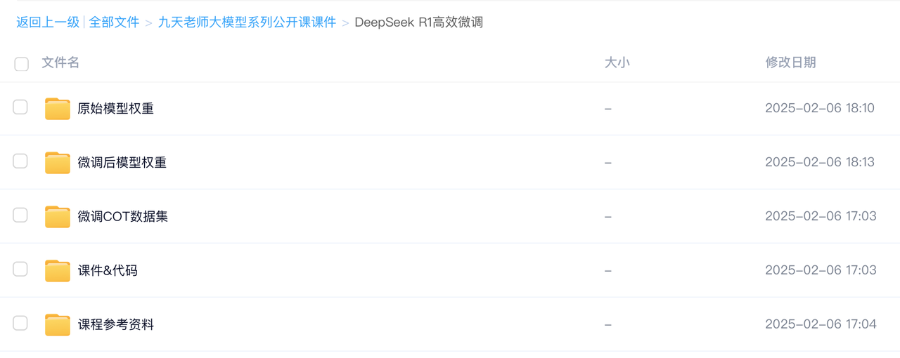
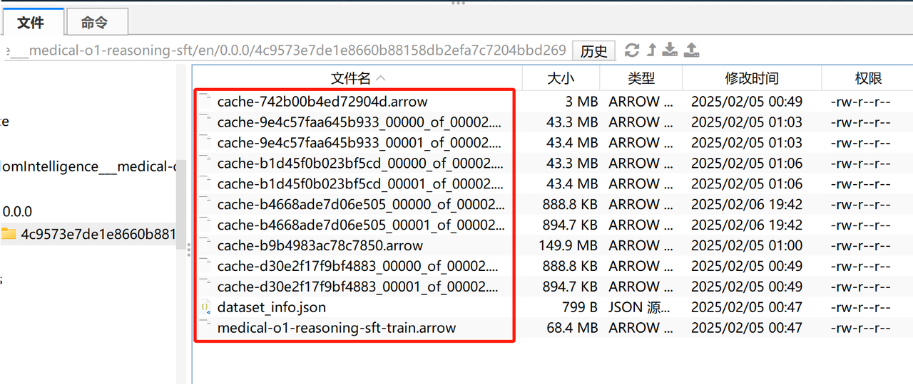
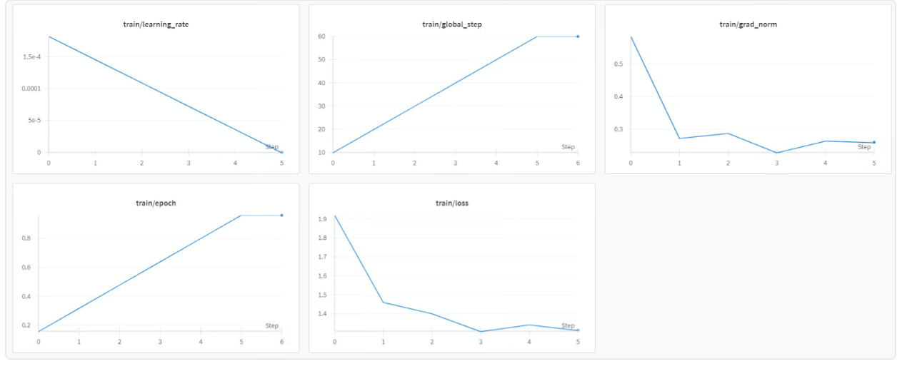
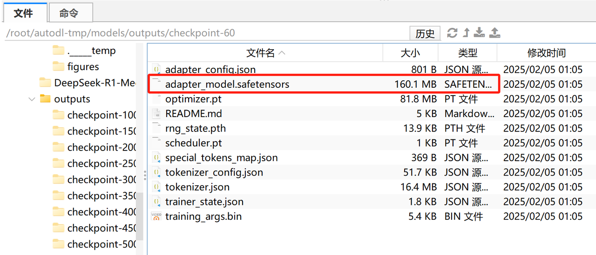
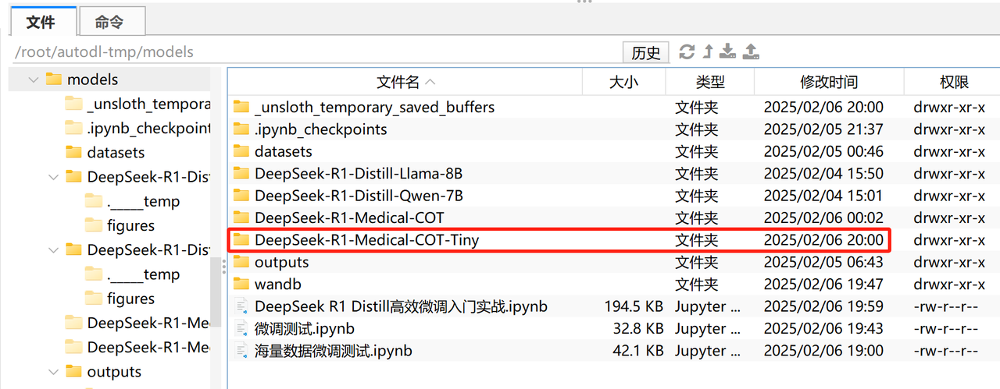
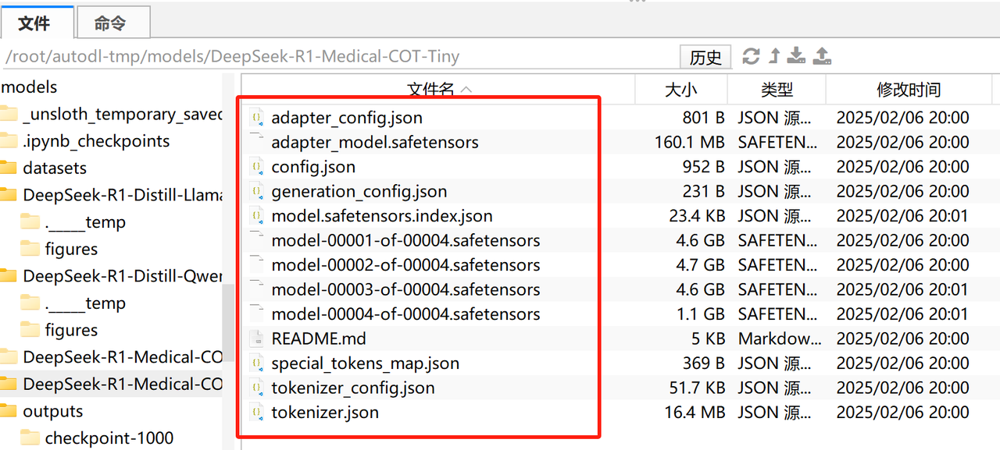
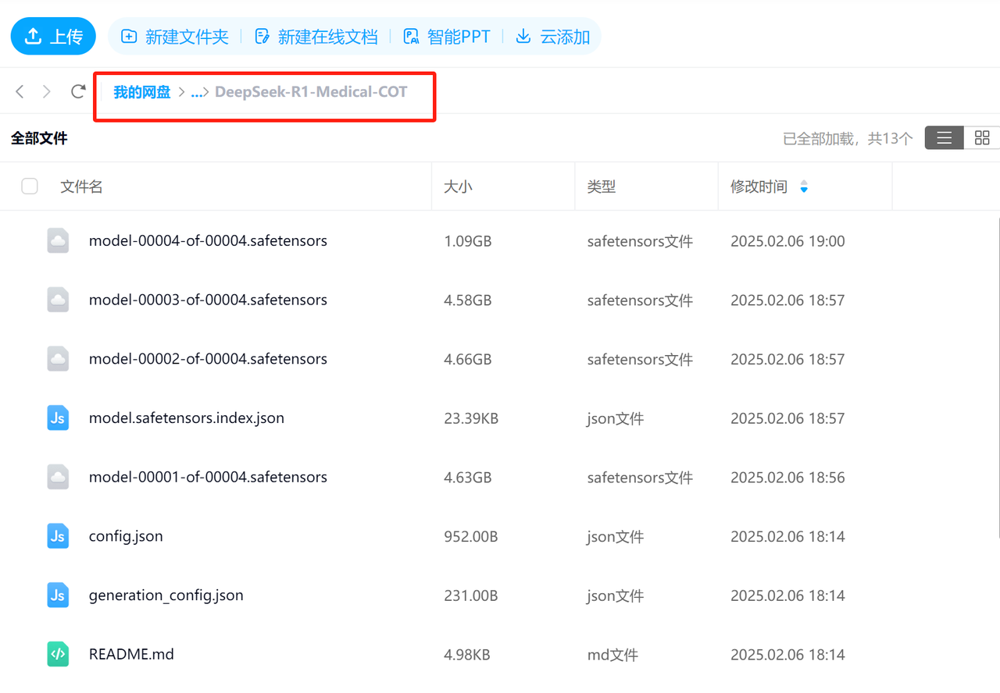

# 课程说明：

* 体验课内容节选自[《2025大模型Agent智能体开发实战》](https://whakv.xetslk.com/s/1zrFP8)完整版付费课程

  体验课时间有限，若想深度学习大模型技术，欢迎大家报名由我主讲的[《2025大模型Agent智能体开发实战》](https://whakv.xetslk.com/s/1zrFP8)：




此外，公开课全部训练项目代码、数据、以及训练完的模型，已上传至课件网盘，联系⬆️助教即可领取。

***

## 《2025大模型Agent智能体开发实战》体验课

## DeepSeek R1 Distill高效微调入门实战

### 一、unsloth快速使用入门

#### 1.借助unsloth进行模型推理

```python
from unsloth import FastLanguageModel
```

* 尝试用unsloth进行LLama模型推理

  首先设置关键参数，并读取模型：

```python
max_seq_length = 2048 
dtype = None 
load_in_4bit = False
```

```python
model, tokenizer = FastLanguageModel.from_pretrained(
    model_name = "./DeepSeek-R1-Distill-Llama-8B",
    max_seq_length = max_seq_length,
    dtype = dtype,
    load_in_4bit = load_in_4bit,
)
```

```plaintext
==((====))==  Unsloth 2025.1.8: Fast Llama patching. Transformers: 4.48.2.
   \\   /|    GPU: NVIDIA H800 PCIe. Max memory: 79.205 GB. Platform: Linux.
O^O/ \_/ \    Torch: 2.5.1+cu124. CUDA: 9.0. CUDA Toolkit: 12.4. Triton: 3.1.0
\        /    Bfloat16 = TRUE. FA [Xformers = 0.0.29.post1. FA2 = False]
 "-____-"     Free Apache license: http://github.com/unslothai/unsloth
Unsloth: Fast downloading is enabled - ignore downloading bars which are red colored!


Loading checkpoint shards:   0%|          | 0/2 [00:00<?, ?it/s]


./DeepSeek-R1-Distill-Llama-8B does not have a padding token! Will use pad_token = <|finetune_right_pad_id|>.
```

此时model就是读取进来的DeepSeek R1 8B蒸馏模型：

```python
model
```

```plaintext
LlamaForCausalLM(
  (model): LlamaModel(
    (embed_tokens): Embedding(128256, 4096, padding_idx=128004)
    (layers): ModuleList(
      (0-31): 32 x LlamaDecoderLayer(
        (self_attn): LlamaAttention(
          (q_proj): Linear(in_features=4096, out_features=4096, bias=False)
          (k_proj): Linear(in_features=4096, out_features=1024, bias=False)
          (v_proj): Linear(in_features=4096, out_features=1024, bias=False)
          (o_proj): Linear(in_features=4096, out_features=4096, bias=False)
          (rotary_emb): LlamaRotaryEmbedding()
        )
        (mlp): LlamaMLP(
          (gate_proj): Linear(in_features=4096, out_features=14336, bias=False)
          (up_proj): Linear(in_features=4096, out_features=14336, bias=False)
          (down_proj): Linear(in_features=14336, out_features=4096, bias=False)
          (act_fn): SiLU()
        )
        (input_layernorm): LlamaRMSNorm((4096,), eps=1e-05)
        (post_attention_layernorm): LlamaRMSNorm((4096,), eps=1e-05)
      )
    )
    (norm): LlamaRMSNorm((4096,), eps=1e-05)
    (rotary_emb): LlamaRotaryEmbedding()
  )
  (lm_head): Linear(in_features=4096, out_features=128256, bias=False)
)
```

而tokenizer则是分词器：

```python
tokenizer
```

```plaintext
LlamaTokenizerFast(name_or_path='./DeepSeek-R1-Distill-Llama-8B', vocab_size=128000, model_max_length=131072, is_fast=True, padding_side='left', truncation_side='right', special_tokens={'bos_token': '<｜begin▁of▁sentence｜>', 'eos_token': '<｜end▁of▁sentence｜>', 'pad_token': '<|finetune_right_pad_id|>'}, clean_up_tokenization_spaces=False, added_tokens_decoder={
        128000: AddedToken("<｜begin▁of▁sentence｜>", rstrip=False, lstrip=False, single_word=False, normalized=False, special=True),
        128001: AddedToken("<｜end▁of▁sentence｜>", rstrip=False, lstrip=False, single_word=False, normalized=False, special=True),
        128002: AddedToken("<|reserved_special_token_0|>", rstrip=False, lstrip=False, single_word=False, normalized=False, special=True),
        128003: AddedToken("<|reserved_special_token_1|>", rstrip=False, lstrip=False, single_word=False, normalized=False, special=True),
        128004: AddedToken("<|finetune_right_pad_id|>", rstrip=False, lstrip=False, single_word=False, normalized=False, special=True),
        128005: AddedToken("<|reserved_special_token_2|>", rstrip=False, lstrip=False, single_word=False, normalized=False, special=True),
        128006: AddedToken("<|start_header_id|>", rstrip=False, lstrip=False, single_word=False, normalized=False, special=True),
        128007: AddedToken("<|end_header_id|>", rstrip=False, lstrip=False, single_word=False, normalized=False, special=True),
        128008: AddedToken("<|eom_id|>", rstrip=False, lstrip=False, single_word=False, normalized=False, special=True),
        128009: AddedToken("<|eot_id|>", rstrip=False, lstrip=False, single_word=False, normalized=False, special=True),
        128010: AddedToken("<|python_tag|>", rstrip=False, lstrip=False, single_word=False, normalized=False, special=True),
        128011: AddedToken("<｜User｜>", rstrip=False, lstrip=False, single_word=False, normalized=False, special=False),
        128012: AddedToken("<｜Assistant｜>", rstrip=False, lstrip=False, single_word=False, normalized=False, special=False),
        128013: AddedToken("<think>", rstrip=False, lstrip=False, single_word=False, normalized=False, special=False),
        128014: AddedToken("</think>", rstrip=False, lstrip=False, single_word=False, normalized=False, special=False),
        128015: AddedToken("<｜▁pad▁｜>", rstrip=False, lstrip=False, single_word=False, normalized=False, special=True),
        128016: AddedToken("<|reserved_special_token_8|>", rstrip=False, lstrip=False, single_word=False, normalized=False, special=True),
        128017: AddedToken("<|reserved_special_token_9|>", rstrip=False, lstrip=False, single_word=False, normalized=False, special=True),
        128018: AddedToken("<|reserved_special_token_10|>", rstrip=False, lstrip=False, single_word=False, normalized=False, special=True),
        128019: AddedToken("<|reserved_special_token_11|>", rstrip=False, lstrip=False, single_word=False, normalized=False, special=True),
        128020: AddedToken("<|reserved_special_token_12|>", rstrip=False, lstrip=False, single_word=False, normalized=False, special=True),
        128021: AddedToken("<|reserved_special_token_13|>", rstrip=False, lstrip=False, single_word=False, normalized=False, special=True),
        128022: AddedToken("<|reserved_special_token_14|>", rstrip=False, lstrip=False, single_word=False, normalized=False, special=True),
        128023: AddedToken("<|reserved_special_token_15|>", rstrip=False, lstrip=False, single_word=False, normalized=False, special=True),
        128024: AddedToken("<|reserved_special_token_16|>", rstrip=False, lstrip=False, single_word=False, normalized=False, special=True),
        128025: AddedToken("<|reserved_special_token_17|>", rstrip=False, lstrip=False, single_word=False, normalized=False, special=True),
        128026: AddedToken("<|reserved_special_token_18|>", rstrip=False, lstrip=False, single_word=False, normalized=False, special=True),
        128027: AddedToken("<|reserved_special_token_19|>", rstrip=False, lstrip=False, single_word=False, normalized=False, special=True),
        128028: AddedToken("<|reserved_special_token_20|>", rstrip=False, lstrip=False, single_word=False, normalized=False, special=True),
        128029: AddedToken("<|reserved_special_token_21|>", rstrip=False, lstrip=False, single_word=False, normalized=False, special=True),
        128030: AddedToken("<|reserved_special_token_22|>", rstrip=False, lstrip=False, single_word=False, normalized=False, special=True),
        128031: AddedToken("<|reserved_special_token_23|>", rstrip=False, lstrip=False, single_word=False, normalized=False, special=True),
        128032: AddedToken("<|reserved_special_token_24|>", rstrip=False, lstrip=False, single_word=False, normalized=False, special=True),
        128033: AddedToken("<|reserved_special_token_25|>", rstrip=False, lstrip=False, single_word=False, normalized=False, special=True),
        128034: AddedToken("<|reserved_special_token_26|>", rstrip=False, lstrip=False, single_word=False, normalized=False, special=True),
        128035: AddedToken("<|reserved_special_token_27|>", rstrip=False, lstrip=False, single_word=False, normalized=False, special=True),
        128036: AddedToken("<|reserved_special_token_28|>", rstrip=False, lstrip=False, single_word=False, normalized=False, special=True),
        128037: AddedToken("<|reserved_special_token_29|>", rstrip=False, lstrip=False, single_word=False, normalized=False, special=True),
        128038: AddedToken("<|reserved_special_token_30|>", rstrip=False, lstrip=False, single_word=False, normalized=False, special=True),
        128039: AddedToken("<|reserved_special_token_31|>", rstrip=False, lstrip=False, single_word=False, normalized=False, special=True),
        128040: AddedToken("<|reserved_special_token_32|>", rstrip=False, lstrip=False, single_word=False, normalized=False, special=True),
        128041: AddedToken("<|reserved_special_token_33|>", rstrip=False, lstrip=False, single_word=False, normalized=False, special=True),
        128042: AddedToken("<|reserved_special_token_34|>", rstrip=False, lstrip=False, single_word=False, normalized=False, special=True),
        128043: AddedToken("<|reserved_special_token_35|>", rstrip=False, lstrip=False, single_word=False, normalized=False, special=True),
        128044: AddedToken("<|reserved_special_token_36|>", rstrip=False, lstrip=False, single_word=False, normalized=False, special=True),
        128045: AddedToken("<|reserved_special_token_37|>", rstrip=False, lstrip=False, single_word=False, normalized=False, special=True),
        128046: AddedToken("<|reserved_special_token_38|>", rstrip=False, lstrip=False, single_word=False, normalized=False, special=True),
        128047: AddedToken("<|reserved_special_token_39|>", rstrip=False, lstrip=False, single_word=False, normalized=False, special=True),
        128048: AddedToken("<|reserved_special_token_40|>", rstrip=False, lstrip=False, single_word=False, normalized=False, special=True),
        128049: AddedToken("<|reserved_special_token_41|>", rstrip=False, lstrip=False, single_word=False, normalized=False, special=True),
        128050: AddedToken("<|reserved_special_token_42|>", rstrip=False, lstrip=False, single_word=False, normalized=False, special=True),
        128051: AddedToken("<|reserved_special_token_43|>", rstrip=False, lstrip=False, single_word=False, normalized=False, special=True),
        128052: AddedToken("<|reserved_special_token_44|>", rstrip=False, lstrip=False, single_word=False, normalized=False, special=True),
        128053: AddedToken("<|reserved_special_token_45|>", rstrip=False, lstrip=False, single_word=False, normalized=False, special=True),
        128054: AddedToken("<|reserved_special_token_46|>", rstrip=False, lstrip=False, single_word=False, normalized=False, special=True),
        128055: AddedToken("<|reserved_special_token_47|>", rstrip=False, lstrip=False, single_word=False, normalized=False, special=True),
        128056: AddedToken("<|reserved_special_token_48|>", rstrip=False, lstrip=False, single_word=False, normalized=False, special=True),
        128057: AddedToken("<|reserved_special_token_49|>", rstrip=False, lstrip=False, single_word=False, normalized=False, special=True),
        128058: AddedToken("<|reserved_special_token_50|>", rstrip=False, lstrip=False, single_word=False, normalized=False, special=True),
        128059: AddedToken("<|reserved_special_token_51|>", rstrip=False, lstrip=False, single_word=False, normalized=False, special=True),
        128060: AddedToken("<|reserved_special_token_52|>", rstrip=False, lstrip=False, single_word=False, normalized=False, special=True),
        128061: AddedToken("<|reserved_special_token_53|>", rstrip=False, lstrip=False, single_word=False, normalized=False, special=True),
        128062: AddedToken("<|reserved_special_token_54|>", rstrip=False, lstrip=False, single_word=False, normalized=False, special=True),
        128063: AddedToken("<|reserved_special_token_55|>", rstrip=False, lstrip=False, single_word=False, normalized=False, special=True),
        128064: AddedToken("<|reserved_special_token_56|>", rstrip=False, lstrip=False, single_word=False, normalized=False, special=True),
        128065: AddedToken("<|reserved_special_token_57|>", rstrip=False, lstrip=False, single_word=False, normalized=False, special=True),
        128066: AddedToken("<|reserved_special_token_58|>", rstrip=False, lstrip=False, single_word=False, normalized=False, special=True),
        128067: AddedToken("<|reserved_special_token_59|>", rstrip=False, lstrip=False, single_word=False, normalized=False, special=True),
        128068: AddedToken("<|reserved_special_token_60|>", rstrip=False, lstrip=False, single_word=False, normalized=False, special=True),
        128069: AddedToken("<|reserved_special_token_61|>", rstrip=False, lstrip=False, single_word=False, normalized=False, special=True),
        128070: AddedToken("<|reserved_special_token_62|>", rstrip=False, lstrip=False, single_word=False, normalized=False, special=True),
        128071: AddedToken("<|reserved_special_token_63|>", rstrip=False, lstrip=False, single_word=False, normalized=False, special=True),
        128072: AddedToken("<|reserved_special_token_64|>", rstrip=False, lstrip=False, single_word=False, normalized=False, special=True),
        128073: AddedToken("<|reserved_special_token_65|>", rstrip=False, lstrip=False, single_word=False, normalized=False, special=True),
        128074: AddedToken("<|reserved_special_token_66|>", rstrip=False, lstrip=False, single_word=False, normalized=False, special=True),
        128075: AddedToken("<|reserved_special_token_67|>", rstrip=False, lstrip=False, single_word=False, normalized=False, special=True),
        128076: AddedToken("<|reserved_special_token_68|>", rstrip=False, lstrip=False, single_word=False, normalized=False, special=True),
        128077: AddedToken("<|reserved_special_token_69|>", rstrip=False, lstrip=False, single_word=False, normalized=False, special=True),
        128078: AddedToken("<|reserved_special_token_70|>", rstrip=False, lstrip=False, single_word=False, normalized=False, special=True),
        128079: AddedToken("<|reserved_special_token_71|>", rstrip=False, lstrip=False, single_word=False, normalized=False, special=True),
        128080: AddedToken("<|reserved_special_token_72|>", rstrip=False, lstrip=False, single_word=False, normalized=False, special=True),
        128081: AddedToken("<|reserved_special_token_73|>", rstrip=False, lstrip=False, single_word=False, normalized=False, special=True),
        128082: AddedToken("<|reserved_special_token_74|>", rstrip=False, lstrip=False, single_word=False, normalized=False, special=True),
        128083: AddedToken("<|reserved_special_token_75|>", rstrip=False, lstrip=False, single_word=False, normalized=False, special=True),
        128084: AddedToken("<|reserved_special_token_76|>", rstrip=False, lstrip=False, single_word=False, normalized=False, special=True),
        128085: AddedToken("<|reserved_special_token_77|>", rstrip=False, lstrip=False, single_word=False, normalized=False, special=True),
        128086: AddedToken("<|reserved_special_token_78|>", rstrip=False, lstrip=False, single_word=False, normalized=False, special=True),
        128087: AddedToken("<|reserved_special_token_79|>", rstrip=False, lstrip=False, single_word=False, normalized=False, special=True),
        128088: AddedToken("<|reserved_special_token_80|>", rstrip=False, lstrip=False, single_word=False, normalized=False, special=True),
        128089: AddedToken("<|reserved_special_token_81|>", rstrip=False, lstrip=False, single_word=False, normalized=False, special=True),
        128090: AddedToken("<|reserved_special_token_82|>", rstrip=False, lstrip=False, single_word=False, normalized=False, special=True),
        128091: AddedToken("<|reserved_special_token_83|>", rstrip=False, lstrip=False, single_word=False, normalized=False, special=True),
        128092: AddedToken("<|reserved_special_token_84|>", rstrip=False, lstrip=False, single_word=False, normalized=False, special=True),
        128093: AddedToken("<|reserved_special_token_85|>", rstrip=False, lstrip=False, single_word=False, normalized=False, special=True),
        128094: AddedToken("<|reserved_special_token_86|>", rstrip=False, lstrip=False, single_word=False, normalized=False, special=True),
        128095: AddedToken("<|reserved_special_token_87|>", rstrip=False, lstrip=False, single_word=False, normalized=False, special=True),
        128096: AddedToken("<|reserved_special_token_88|>", rstrip=False, lstrip=False, single_word=False, normalized=False, special=True),
        128097: AddedToken("<|reserved_special_token_89|>", rstrip=False, lstrip=False, single_word=False, normalized=False, special=True),
        128098: AddedToken("<|reserved_special_token_90|>", rstrip=False, lstrip=False, single_word=False, normalized=False, special=True),
        128099: AddedToken("<|reserved_special_token_91|>", rstrip=False, lstrip=False, single_word=False, normalized=False, special=True),
        128100: AddedToken("<|reserved_special_token_92|>", rstrip=False, lstrip=False, single_word=False, normalized=False, special=True),
        128101: AddedToken("<|reserved_special_token_93|>", rstrip=False, lstrip=False, single_word=False, normalized=False, special=True),
        128102: AddedToken("<|reserved_special_token_94|>", rstrip=False, lstrip=False, single_word=False, normalized=False, special=True),
        128103: AddedToken("<|reserved_special_token_95|>", rstrip=False, lstrip=False, single_word=False, normalized=False, special=True),
        128104: AddedToken("<|reserved_special_token_96|>", rstrip=False, lstrip=False, single_word=False, normalized=False, special=True),
        128105: AddedToken("<|reserved_special_token_97|>", rstrip=False, lstrip=False, single_word=False, normalized=False, special=True),
        128106: AddedToken("<|reserved_special_token_98|>", rstrip=False, lstrip=False, single_word=False, normalized=False, special=True),
        128107: AddedToken("<|reserved_special_token_99|>", rstrip=False, lstrip=False, single_word=False, normalized=False, special=True),
        128108: AddedToken("<|reserved_special_token_100|>", rstrip=False, lstrip=False, single_word=False, normalized=False, special=True),
        128109: AddedToken("<|reserved_special_token_101|>", rstrip=False, lstrip=False, single_word=False, normalized=False, special=True),
        128110: AddedToken("<|reserved_special_token_102|>", rstrip=False, lstrip=False, single_word=False, normalized=False, special=True),
        128111: AddedToken("<|reserved_special_token_103|>", rstrip=False, lstrip=False, single_word=False, normalized=False, special=True),
        128112: AddedToken("<|reserved_special_token_104|>", rstrip=False, lstrip=False, single_word=False, normalized=False, special=True),
        128113: AddedToken("<|reserved_special_token_105|>", rstrip=False, lstrip=False, single_word=False, normalized=False, special=True),
        128114: AddedToken("<|reserved_special_token_106|>", rstrip=False, lstrip=False, single_word=False, normalized=False, special=True),
        128115: AddedToken("<|reserved_special_token_107|>", rstrip=False, lstrip=False, single_word=False, normalized=False, special=True),
        128116: AddedToken("<|reserved_special_token_108|>", rstrip=False, lstrip=False, single_word=False, normalized=False, special=True),
        128117: AddedToken("<|reserved_special_token_109|>", rstrip=False, lstrip=False, single_word=False, normalized=False, special=True),
        128118: AddedToken("<|reserved_special_token_110|>", rstrip=False, lstrip=False, single_word=False, normalized=False, special=True),
        128119: AddedToken("<|reserved_special_token_111|>", rstrip=False, lstrip=False, single_word=False, normalized=False, special=True),
        128120: AddedToken("<|reserved_special_token_112|>", rstrip=False, lstrip=False, single_word=False, normalized=False, special=True),
        128121: AddedToken("<|reserved_special_token_113|>", rstrip=False, lstrip=False, single_word=False, normalized=False, special=True),
        128122: AddedToken("<|reserved_special_token_114|>", rstrip=False, lstrip=False, single_word=False, normalized=False, special=True),
        128123: AddedToken("<|reserved_special_token_115|>", rstrip=False, lstrip=False, single_word=False, normalized=False, special=True),
        128124: AddedToken("<|reserved_special_token_116|>", rstrip=False, lstrip=False, single_word=False, normalized=False, special=True),
        128125: AddedToken("<|reserved_special_token_117|>", rstrip=False, lstrip=False, single_word=False, normalized=False, special=True),
        128126: AddedToken("<|reserved_special_token_118|>", rstrip=False, lstrip=False, single_word=False, normalized=False, special=True),
        128127: AddedToken("<|reserved_special_token_119|>", rstrip=False, lstrip=False, single_word=False, normalized=False, special=True),
        128128: AddedToken("<|reserved_special_token_120|>", rstrip=False, lstrip=False, single_word=False, normalized=False, special=True),
        128129: AddedToken("<|reserved_special_token_121|>", rstrip=False, lstrip=False, single_word=False, normalized=False, special=True),
        128130: AddedToken("<|reserved_special_token_122|>", rstrip=False, lstrip=False, single_word=False, normalized=False, special=True),
        128131: AddedToken("<|reserved_special_token_123|>", rstrip=False, lstrip=False, single_word=False, normalized=False, special=True),
        128132: AddedToken("<|reserved_special_token_124|>", rstrip=False, lstrip=False, single_word=False, normalized=False, special=True),
        128133: AddedToken("<|reserved_special_token_125|>", rstrip=False, lstrip=False, single_word=False, normalized=False, special=True),
        128134: AddedToken("<|reserved_special_token_126|>", rstrip=False, lstrip=False, single_word=False, normalized=False, special=True),
        128135: AddedToken("<|reserved_special_token_127|>", rstrip=False, lstrip=False, single_word=False, normalized=False, special=True),
        128136: AddedToken("<|reserved_special_token_128|>", rstrip=False, lstrip=False, single_word=False, normalized=False, special=True),
        128137: AddedToken("<|reserved_special_token_129|>", rstrip=False, lstrip=False, single_word=False, normalized=False, special=True),
        128138: AddedToken("<|reserved_special_token_130|>", rstrip=False, lstrip=False, single_word=False, normalized=False, special=True),
        128139: AddedToken("<|reserved_special_token_131|>", rstrip=False, lstrip=False, single_word=False, normalized=False, special=True),
        128140: AddedToken("<|reserved_special_token_132|>", rstrip=False, lstrip=False, single_word=False, normalized=False, special=True),
        128141: AddedToken("<|reserved_special_token_133|>", rstrip=False, lstrip=False, single_word=False, normalized=False, special=True),
        128142: AddedToken("<|reserved_special_token_134|>", rstrip=False, lstrip=False, single_word=False, normalized=False, special=True),
        128143: AddedToken("<|reserved_special_token_135|>", rstrip=False, lstrip=False, single_word=False, normalized=False, special=True),
        128144: AddedToken("<|reserved_special_token_136|>", rstrip=False, lstrip=False, single_word=False, normalized=False, special=True),
        128145: AddedToken("<|reserved_special_token_137|>", rstrip=False, lstrip=False, single_word=False, normalized=False, special=True),
        128146: AddedToken("<|reserved_special_token_138|>", rstrip=False, lstrip=False, single_word=False, normalized=False, special=True),
        128147: AddedToken("<|reserved_special_token_139|>", rstrip=False, lstrip=False, single_word=False, normalized=False, special=True),
        128148: AddedToken("<|reserved_special_token_140|>", rstrip=False, lstrip=False, single_word=False, normalized=False, special=True),
        128149: AddedToken("<|reserved_special_token_141|>", rstrip=False, lstrip=False, single_word=False, normalized=False, special=True),
        128150: AddedToken("<|reserved_special_token_142|>", rstrip=False, lstrip=False, single_word=False, normalized=False, special=True),
        128151: AddedToken("<|reserved_special_token_143|>", rstrip=False, lstrip=False, single_word=False, normalized=False, special=True),
        128152: AddedToken("<|reserved_special_token_144|>", rstrip=False, lstrip=False, single_word=False, normalized=False, special=True),
        128153: AddedToken("<|reserved_special_token_145|>", rstrip=False, lstrip=False, single_word=False, normalized=False, special=True),
        128154: AddedToken("<|reserved_special_token_146|>", rstrip=False, lstrip=False, single_word=False, normalized=False, special=True),
        128155: AddedToken("<|reserved_special_token_147|>", rstrip=False, lstrip=False, single_word=False, normalized=False, special=True),
        128156: AddedToken("<|reserved_special_token_148|>", rstrip=False, lstrip=False, single_word=False, normalized=False, special=True),
        128157: AddedToken("<|reserved_special_token_149|>", rstrip=False, lstrip=False, single_word=False, normalized=False, special=True),
        128158: AddedToken("<|reserved_special_token_150|>", rstrip=False, lstrip=False, single_word=False, normalized=False, special=True),
        128159: AddedToken("<|reserved_special_token_151|>", rstrip=False, lstrip=False, single_word=False, normalized=False, special=True),
        128160: AddedToken("<|reserved_special_token_152|>", rstrip=False, lstrip=False, single_word=False, normalized=False, special=True),
        128161: AddedToken("<|reserved_special_token_153|>", rstrip=False, lstrip=False, single_word=False, normalized=False, special=True),
        128162: AddedToken("<|reserved_special_token_154|>", rstrip=False, lstrip=False, single_word=False, normalized=False, special=True),
        128163: AddedToken("<|reserved_special_token_155|>", rstrip=False, lstrip=False, single_word=False, normalized=False, special=True),
        128164: AddedToken("<|reserved_special_token_156|>", rstrip=False, lstrip=False, single_word=False, normalized=False, special=True),
        128165: AddedToken("<|reserved_special_token_157|>", rstrip=False, lstrip=False, single_word=False, normalized=False, special=True),
        128166: AddedToken("<|reserved_special_token_158|>", rstrip=False, lstrip=False, single_word=False, normalized=False, special=True),
        128167: AddedToken("<|reserved_special_token_159|>", rstrip=False, lstrip=False, single_word=False, normalized=False, special=True),
        128168: AddedToken("<|reserved_special_token_160|>", rstrip=False, lstrip=False, single_word=False, normalized=False, special=True),
        128169: AddedToken("<|reserved_special_token_161|>", rstrip=False, lstrip=False, single_word=False, normalized=False, special=True),
        128170: AddedToken("<|reserved_special_token_162|>", rstrip=False, lstrip=False, single_word=False, normalized=False, special=True),
        128171: AddedToken("<|reserved_special_token_163|>", rstrip=False, lstrip=False, single_word=False, normalized=False, special=True),
        128172: AddedToken("<|reserved_special_token_164|>", rstrip=False, lstrip=False, single_word=False, normalized=False, special=True),
        128173: AddedToken("<|reserved_special_token_165|>", rstrip=False, lstrip=False, single_word=False, normalized=False, special=True),
        128174: AddedToken("<|reserved_special_token_166|>", rstrip=False, lstrip=False, single_word=False, normalized=False, special=True),
        128175: AddedToken("<|reserved_special_token_167|>", rstrip=False, lstrip=False, single_word=False, normalized=False, special=True),
        128176: AddedToken("<|reserved_special_token_168|>", rstrip=False, lstrip=False, single_word=False, normalized=False, special=True),
        128177: AddedToken("<|reserved_special_token_169|>", rstrip=False, lstrip=False, single_word=False, normalized=False, special=True),
        128178: AddedToken("<|reserved_special_token_170|>", rstrip=False, lstrip=False, single_word=False, normalized=False, special=True),
        128179: AddedToken("<|reserved_special_token_171|>", rstrip=False, lstrip=False, single_word=False, normalized=False, special=True),
        128180: AddedToken("<|reserved_special_token_172|>", rstrip=False, lstrip=False, single_word=False, normalized=False, special=True),
        128181: AddedToken("<|reserved_special_token_173|>", rstrip=False, lstrip=False, single_word=False, normalized=False, special=True),
        128182: AddedToken("<|reserved_special_token_174|>", rstrip=False, lstrip=False, single_word=False, normalized=False, special=True),
        128183: AddedToken("<|reserved_special_token_175|>", rstrip=False, lstrip=False, single_word=False, normalized=False, special=True),
        128184: AddedToken("<|reserved_special_token_176|>", rstrip=False, lstrip=False, single_word=False, normalized=False, special=True),
        128185: AddedToken("<|reserved_special_token_177|>", rstrip=False, lstrip=False, single_word=False, normalized=False, special=True),
        128186: AddedToken("<|reserved_special_token_178|>", rstrip=False, lstrip=False, single_word=False, normalized=False, special=True),
        128187: AddedToken("<|reserved_special_token_179|>", rstrip=False, lstrip=False, single_word=False, normalized=False, special=True),
        128188: AddedToken("<|reserved_special_token_180|>", rstrip=False, lstrip=False, single_word=False, normalized=False, special=True),
        128189: AddedToken("<|reserved_special_token_181|>", rstrip=False, lstrip=False, single_word=False, normalized=False, special=True),
        128190: AddedToken("<|reserved_special_token_182|>", rstrip=False, lstrip=False, single_word=False, normalized=False, special=True),
        128191: AddedToken("<|reserved_special_token_183|>", rstrip=False, lstrip=False, single_word=False, normalized=False, special=True),
        128192: AddedToken("<|reserved_special_token_184|>", rstrip=False, lstrip=False, single_word=False, normalized=False, special=True),
        128193: AddedToken("<|reserved_special_token_185|>", rstrip=False, lstrip=False, single_word=False, normalized=False, special=True),
        128194: AddedToken("<|reserved_special_token_186|>", rstrip=False, lstrip=False, single_word=False, normalized=False, special=True),
        128195: AddedToken("<|reserved_special_token_187|>", rstrip=False, lstrip=False, single_word=False, normalized=False, special=True),
        128196: AddedToken("<|reserved_special_token_188|>", rstrip=False, lstrip=False, single_word=False, normalized=False, special=True),
        128197: AddedToken("<|reserved_special_token_189|>", rstrip=False, lstrip=False, single_word=False, normalized=False, special=True),
        128198: AddedToken("<|reserved_special_token_190|>", rstrip=False, lstrip=False, single_word=False, normalized=False, special=True),
        128199: AddedToken("<|reserved_special_token_191|>", rstrip=False, lstrip=False, single_word=False, normalized=False, special=True),
        128200: AddedToken("<|reserved_special_token_192|>", rstrip=False, lstrip=False, single_word=False, normalized=False, special=True),
        128201: AddedToken("<|reserved_special_token_193|>", rstrip=False, lstrip=False, single_word=False, normalized=False, special=True),
        128202: AddedToken("<|reserved_special_token_194|>", rstrip=False, lstrip=False, single_word=False, normalized=False, special=True),
        128203: AddedToken("<|reserved_special_token_195|>", rstrip=False, lstrip=False, single_word=False, normalized=False, special=True),
        128204: AddedToken("<|reserved_special_token_196|>", rstrip=False, lstrip=False, single_word=False, normalized=False, special=True),
        128205: AddedToken("<|reserved_special_token_197|>", rstrip=False, lstrip=False, single_word=False, normalized=False, special=True),
        128206: AddedToken("<|reserved_special_token_198|>", rstrip=False, lstrip=False, single_word=False, normalized=False, special=True),
        128207: AddedToken("<|reserved_special_token_199|>", rstrip=False, lstrip=False, single_word=False, normalized=False, special=True),
        128208: AddedToken("<|reserved_special_token_200|>", rstrip=False, lstrip=False, single_word=False, normalized=False, special=True),
        128209: AddedToken("<|reserved_special_token_201|>", rstrip=False, lstrip=False, single_word=False, normalized=False, special=True),
        128210: AddedToken("<|reserved_special_token_202|>", rstrip=False, lstrip=False, single_word=False, normalized=False, special=True),
        128211: AddedToken("<|reserved_special_token_203|>", rstrip=False, lstrip=False, single_word=False, normalized=False, special=True),
        128212: AddedToken("<|reserved_special_token_204|>", rstrip=False, lstrip=False, single_word=False, normalized=False, special=True),
        128213: AddedToken("<|reserved_special_token_205|>", rstrip=False, lstrip=False, single_word=False, normalized=False, special=True),
        128214: AddedToken("<|reserved_special_token_206|>", rstrip=False, lstrip=False, single_word=False, normalized=False, special=True),
        128215: AddedToken("<|reserved_special_token_207|>", rstrip=False, lstrip=False, single_word=False, normalized=False, special=True),
        128216: AddedToken("<|reserved_special_token_208|>", rstrip=False, lstrip=False, single_word=False, normalized=False, special=True),
        128217: AddedToken("<|reserved_special_token_209|>", rstrip=False, lstrip=False, single_word=False, normalized=False, special=True),
        128218: AddedToken("<|reserved_special_token_210|>", rstrip=False, lstrip=False, single_word=False, normalized=False, special=True),
        128219: AddedToken("<|reserved_special_token_211|>", rstrip=False, lstrip=False, single_word=False, normalized=False, special=True),
        128220: AddedToken("<|reserved_special_token_212|>", rstrip=False, lstrip=False, single_word=False, normalized=False, special=True),
        128221: AddedToken("<|reserved_special_token_213|>", rstrip=False, lstrip=False, single_word=False, normalized=False, special=True),
        128222: AddedToken("<|reserved_special_token_214|>", rstrip=False, lstrip=False, single_word=False, normalized=False, special=True),
        128223: AddedToken("<|reserved_special_token_215|>", rstrip=False, lstrip=False, single_word=False, normalized=False, special=True),
        128224: AddedToken("<|reserved_special_token_216|>", rstrip=False, lstrip=False, single_word=False, normalized=False, special=True),
        128225: AddedToken("<|reserved_special_token_217|>", rstrip=False, lstrip=False, single_word=False, normalized=False, special=True),
        128226: AddedToken("<|reserved_special_token_218|>", rstrip=False, lstrip=False, single_word=False, normalized=False, special=True),
        128227: AddedToken("<|reserved_special_token_219|>", rstrip=False, lstrip=False, single_word=False, normalized=False, special=True),
        128228: AddedToken("<|reserved_special_token_220|>", rstrip=False, lstrip=False, single_word=False, normalized=False, special=True),
        128229: AddedToken("<|reserved_special_token_221|>", rstrip=False, lstrip=False, single_word=False, normalized=False, special=True),
        128230: AddedToken("<|reserved_special_token_222|>", rstrip=False, lstrip=False, single_word=False, normalized=False, special=True),
        128231: AddedToken("<|reserved_special_token_223|>", rstrip=False, lstrip=False, single_word=False, normalized=False, special=True),
        128232: AddedToken("<|reserved_special_token_224|>", rstrip=False, lstrip=False, single_word=False, normalized=False, special=True),
        128233: AddedToken("<|reserved_special_token_225|>", rstrip=False, lstrip=False, single_word=False, normalized=False, special=True),
        128234: AddedToken("<|reserved_special_token_226|>", rstrip=False, lstrip=False, single_word=False, normalized=False, special=True),
        128235: AddedToken("<|reserved_special_token_227|>", rstrip=False, lstrip=False, single_word=False, normalized=False, special=True),
        128236: AddedToken("<|reserved_special_token_228|>", rstrip=False, lstrip=False, single_word=False, normalized=False, special=True),
        128237: AddedToken("<|reserved_special_token_229|>", rstrip=False, lstrip=False, single_word=False, normalized=False, special=True),
        128238: AddedToken("<|reserved_special_token_230|>", rstrip=False, lstrip=False, single_word=False, normalized=False, special=True),
        128239: AddedToken("<|reserved_special_token_231|>", rstrip=False, lstrip=False, single_word=False, normalized=False, special=True),
        128240: AddedToken("<|reserved_special_token_232|>", rstrip=False, lstrip=False, single_word=False, normalized=False, special=True),
        128241: AddedToken("<|reserved_special_token_233|>", rstrip=False, lstrip=False, single_word=False, normalized=False, special=True),
        128242: AddedToken("<|reserved_special_token_234|>", rstrip=False, lstrip=False, single_word=False, normalized=False, special=True),
        128243: AddedToken("<|reserved_special_token_235|>", rstrip=False, lstrip=False, single_word=False, normalized=False, special=True),
        128244: AddedToken("<|reserved_special_token_236|>", rstrip=False, lstrip=False, single_word=False, normalized=False, special=True),
        128245: AddedToken("<|reserved_special_token_237|>", rstrip=False, lstrip=False, single_word=False, normalized=False, special=True),
        128246: AddedToken("<|reserved_special_token_238|>", rstrip=False, lstrip=False, single_word=False, normalized=False, special=True),
        128247: AddedToken("<|reserved_special_token_239|>", rstrip=False, lstrip=False, single_word=False, normalized=False, special=True),
        128248: AddedToken("<|reserved_special_token_240|>", rstrip=False, lstrip=False, single_word=False, normalized=False, special=True),
        128249: AddedToken("<|reserved_special_token_241|>", rstrip=False, lstrip=False, single_word=False, normalized=False, special=True),
        128250: AddedToken("<|reserved_special_token_242|>", rstrip=False, lstrip=False, single_word=False, normalized=False, special=True),
        128251: AddedToken("<|reserved_special_token_243|>", rstrip=False, lstrip=False, single_word=False, normalized=False, special=True),
        128252: AddedToken("<|reserved_special_token_244|>", rstrip=False, lstrip=False, single_word=False, normalized=False, special=True),
        128253: AddedToken("<|reserved_special_token_245|>", rstrip=False, lstrip=False, single_word=False, normalized=False, special=True),
        128254: AddedToken("<|reserved_special_token_246|>", rstrip=False, lstrip=False, single_word=False, normalized=False, special=True),
        128255: AddedToken("<|reserved_special_token_247|>", rstrip=False, lstrip=False, single_word=False, normalized=False, special=True),
}
)
```

将模型调整为推理模式：

```python
FastLanguageModel.for_inference(model) 
```

```plaintext
LlamaForCausalLM(
  (model): LlamaModel(
    (embed_tokens): Embedding(128256, 4096, padding_idx=128004)
    (layers): ModuleList(
      (0-31): 32 x LlamaDecoderLayer(
        (self_attn): LlamaAttention(
          (q_proj): Linear(in_features=4096, out_features=4096, bias=False)
          (k_proj): Linear(in_features=4096, out_features=1024, bias=False)
          (v_proj): Linear(in_features=4096, out_features=1024, bias=False)
          (o_proj): Linear(in_features=4096, out_features=4096, bias=False)
          (rotary_emb): LlamaRotaryEmbedding()
        )
        (mlp): LlamaMLP(
          (gate_proj): Linear(in_features=4096, out_features=14336, bias=False)
          (up_proj): Linear(in_features=4096, out_features=14336, bias=False)
          (down_proj): Linear(in_features=14336, out_features=4096, bias=False)
          (act_fn): SiLU()
        )
        (input_layernorm): LlamaRMSNorm((4096,), eps=1e-05)
        (post_attention_layernorm): LlamaRMSNorm((4096,), eps=1e-05)
      )
    )
    (norm): LlamaRMSNorm((4096,), eps=1e-05)
    (rotary_emb): LlamaRotaryEmbedding()
  )
  (lm_head): Linear(in_features=4096, out_features=128256, bias=False)
)
```

然后即可和模型进行对话：

```python
question = "请问如何证明根号2是无理数？"
```

然后这里我们首先需要借助分词器，将输入的问题转化为标记索引：

```python
inputs = tokenizer([question], return_tensors="pt").to("cuda")
```

```python
inputs
```

```plaintext
{'input_ids': tensor([[128000,  15225,  57107, 109425, 125544, 102831,  18476,     17,  21043,
          43292,  22649,   9039,  11571]], device='cuda:0'), 'attention_mask': tensor([[1, 1, 1, 1, 1, 1, 1, 1, 1, 1, 1, 1, 1]], device='cuda:0')}
```

最后再带入inputs进行对话

```python
outputs = model.generate(
    input_ids=inputs.input_ids,
    max_new_tokens=1200,
    use_cache=True,
)
```

此时得到的回复也是词索引：

```python
outputs
```

```plaintext
tensor([[128000,  15225,  57107,  ...,  37656,  64531,   9039]],
       device='cuda:0')
```

同样需要分词器将其转化为文本：

```python
response = tokenizer.batch_decode(outputs)
```

```python
response
```

```plaintext
['<｜begin▁of▁sentence｜>请问如何证明根号2是无理数？我记得以前学过的证明方法，可能有几种不同的方式。\n\n首先，我记得有一个方法是假设根号2是有理数，然后推导出矛盾。具体来说，假设根号2等于a/b，其中a和b是互质的正整数，没有公因数，且b不为零。然后，通过平方两边，得到2 = a² / b²，进而得到2b² = a²。这样，a²必须是偶数，因此a也是偶数，设为2k。这样，等式变为2b² = (2k)²，也就是2b² = 4k²，进而得到b² = 2k²，这意味着b²也是偶数，所以b也是偶数。这样，a和b都被2整除，这与我们最初的假设a和b互质矛盾，所以根号2是无理数。\n\n不过，我记得还有另一种方法，可能涉及到假设根号2是有理数，然后将其表示为分数，通过某种方式证明会导致无限递减的矛盾。或者，是否还有其他方法，比如利用二次方程的根的性质，或者其他数学概念？\n\n另外，我还记得可能有一个关于连分数展开的方法，或者是利用代数的方式来证明根号2是无理数。比如，使用费马大定理或者其他定理来证明。\n\n不过，我觉得最直接的方法还是假设根号2是有理数，然后推导出矛盾。因为这样比较简单明了，不需要太多复杂的概念。刚才我已经写出了这个方法的基本步骤，但可能需要更详细地展开，确保每一步都没有问题。\n\n让我再理一理这个过程：\n\n1. 假设根号2是有理数，那么它可以表示为最简分数a/b，其中a和b是互质的正整数，且b ≠ 0。\n\n2. 两边平方得到：2 = a² / b²。\n\n3. 移项得到：2b² = a²。\n\n4. 这意味着a²是2的倍数，因此a也必须是2的倍数，因为平方数的因数都是偶数的因数。所以，设a = 2k，其中k是一个正整数。\n\n5. 将a = 2k代入上式，得到：2b² = (2k)² = 4k²。\n\n6. 两边同时除以2，得到：b² = 2k²。\n\n7. 这意味着b²也是2的倍数，因此b也必须是2的倍数。\n\n8. 但是，根据最初的假设，a和b是互质的，即它们的最大公约数是1。如果a和b都被2整除，那么它们都至少有一个公因数2，这与互质的假设矛盾。\n\n9. 因此，原来的假设根号2是有理数是不成立的，所以根号2是无理数。\n\n这个过程看起来是正确的，没有问题。我还记得另一种方法，可能涉及到数论中的无限递降法，即假设根号2是有理数，然后将其表示为最简分数，平方之后得到一个新的分数，进而证明会导致无限递减，这也是一种矛盾的方法。\n\n让我试着回忆一下这种方法的步骤：\n\n1. 假设根号2 = a/b，其中a和b是互质的正整数，且b ≠ 0。\n\n2. 平方两边得到：2 = a² / b²。\n\n3. 移项得到：a² = 2b²。\n\n4. 因为a和b互质，所以a²和b²也互质。\n\n5. 根据数论，若a² = 2b²，则2必须整除a²，因此2整除a。\n\n6. 设a = 2k，其中k是正整数，那么代入上式得到：(2k)² = 2b² ⇒ 4k² = 2b² ⇒ 2k² = b²。\n\n7. 因此，b² = 2k²，意味着b也必须是2的倍数，因为b²是2的倍数。\n\n8. 设b = 2m，其中m是正整数，那么代入上式得到：(2m)² = 2k² ⇒ 4m² = 2k² ⇒ 2m² = k²。\n\n9. 现在，k² = 2m²，同样意味着k必须是2的倍数，设k = 2n，其中n是正整数。\n\n10. 代入得到：(2n)² = 2m² ⇒ 4n² = 2m² ⇒ 2n² = m²。\n\n11. 继续这个过程，m² = 2n²，意味着m必须是2的倍数，设m = 2p，其中p是正整数。\n\n12. 代入得到：(2p)² = 2n² ⇒ 4p² = 2n² ⇒ 2p² = n²。\n\n13. 这样，n² = 2p²，意味着n必须是2的倍数，设n = 2q，其中q是正整数']
```

```python
print(response[0])
```

```plaintext
<｜begin▁of▁sentence｜>请问如何证明根号2是无理数？我记得以前学过的证明方法，可能有几种不同的方式。

首先，我记得有一个方法是假设根号2是有理数，然后推导出矛盾。具体来说，假设根号2等于a/b，其中a和b是互质的正整数，没有公因数，且b不为零。然后，通过平方两边，得到2 = a² / b²，进而得到2b² = a²。这样，a²必须是偶数，因此a也是偶数，设为2k。这样，等式变为2b² = (2k)²，也就是2b² = 4k²，进而得到b² = 2k²，这意味着b²也是偶数，所以b也是偶数。这样，a和b都被2整除，这与我们最初的假设a和b互质矛盾，所以根号2是无理数。

不过，我记得还有另一种方法，可能涉及到假设根号2是有理数，然后将其表示为分数，通过某种方式证明会导致无限递减的矛盾。或者，是否还有其他方法，比如利用二次方程的根的性质，或者其他数学概念？

另外，我还记得可能有一个关于连分数展开的方法，或者是利用代数的方式来证明根号2是无理数。比如，使用费马大定理或者其他定理来证明。

不过，我觉得最直接的方法还是假设根号2是有理数，然后推导出矛盾。因为这样比较简单明了，不需要太多复杂的概念。刚才我已经写出了这个方法的基本步骤，但可能需要更详细地展开，确保每一步都没有问题。

让我再理一理这个过程：

1. 假设根号2是有理数，那么它可以表示为最简分数a/b，其中a和b是互质的正整数，且b ≠ 0。

2. 两边平方得到：2 = a² / b²。

3. 移项得到：2b² = a²。

4. 这意味着a²是2的倍数，因此a也必须是2的倍数，因为平方数的因数都是偶数的因数。所以，设a = 2k，其中k是一个正整数。

5. 将a = 2k代入上式，得到：2b² = (2k)² = 4k²。

6. 两边同时除以2，得到：b² = 2k²。

7. 这意味着b²也是2的倍数，因此b也必须是2的倍数。

8. 但是，根据最初的假设，a和b是互质的，即它们的最大公约数是1。如果a和b都被2整除，那么它们都至少有一个公因数2，这与互质的假设矛盾。

9. 因此，原来的假设根号2是有理数是不成立的，所以根号2是无理数。

这个过程看起来是正确的，没有问题。我还记得另一种方法，可能涉及到数论中的无限递降法，即假设根号2是有理数，然后将其表示为最简分数，平方之后得到一个新的分数，进而证明会导致无限递减，这也是一种矛盾的方法。

让我试着回忆一下这种方法的步骤：

1. 假设根号2 = a/b，其中a和b是互质的正整数，且b ≠ 0。

2. 平方两边得到：2 = a² / b²。

3. 移项得到：a² = 2b²。

4. 因为a和b互质，所以a²和b²也互质。

5. 根据数论，若a² = 2b²，则2必须整除a²，因此2整除a。

6. 设a = 2k，其中k是正整数，那么代入上式得到：(2k)² = 2b² ⇒ 4k² = 2b² ⇒ 2k² = b²。

7. 因此，b² = 2k²，意味着b也必须是2的倍数，因为b²是2的倍数。

8. 设b = 2m，其中m是正整数，那么代入上式得到：(2m)² = 2k² ⇒ 4m² = 2k² ⇒ 2m² = k²。

9. 现在，k² = 2m²，同样意味着k必须是2的倍数，设k = 2n，其中n是正整数。

10. 代入得到：(2n)² = 2m² ⇒ 4n² = 2m² ⇒ 2n² = m²。

11. 继续这个过程，m² = 2n²，意味着m必须是2的倍数，设m = 2p，其中p是正整数。

12. 代入得到：(2p)² = 2n² ⇒ 4p² = 2n² ⇒ 2p² = n²。

13. 这样，n² = 2p²，意味着n必须是2的倍数，设n = 2q，其中q是正整数
```

至此我们就完成了unsloth模型推理流程。

* 尝试使用unsloth调用Qwen模型

  类似的，我们也可以使用unsloth调用Qwen蒸馏模型

```python
model_qwen, tokenizer_qwen = FastLanguageModel.from_pretrained(
    model_name = "./DeepSeek-R1-Distill-Qwen-7B",
    max_seq_length = max_seq_length,
    dtype = dtype,
    load_in_4bit = load_in_4bit,
)
```

```plaintext
==((====))==  Unsloth 2025.1.8: Fast Qwen2 patching. Transformers: 4.48.2.
   \\   /|    GPU: NVIDIA H800 PCIe. Max memory: 79.205 GB. Platform: Linux.
O^O/ \_/ \    Torch: 2.5.1+cu124. CUDA: 9.0. CUDA Toolkit: 12.4. Triton: 3.1.0
\        /    Bfloat16 = TRUE. FA [Xformers = 0.0.29.post1. FA2 = False]
 "-____-"     Free Apache license: http://github.com/unslothai/unsloth
Unsloth: Fast downloading is enabled - ignore downloading bars which are red colored!


Loading checkpoint shards:   0%|          | 0/2 [00:00<?, ?it/s]


./DeepSeek-R1-Distill-Qwen-7B does not have a padding token! Will use pad_token = <|vision_pad|>.
```

```python
FastLanguageModel.for_inference(model_qwen) 
```

```plaintext
Qwen2ForCausalLM(
  (model): Qwen2Model(
    (embed_tokens): Embedding(152064, 3584, padding_idx=151654)
    (layers): ModuleList(
      (0-27): 28 x Qwen2DecoderLayer(
        (self_attn): Qwen2Attention(
          (q_proj): Linear(in_features=3584, out_features=3584, bias=True)
          (k_proj): Linear(in_features=3584, out_features=512, bias=True)
          (v_proj): Linear(in_features=3584, out_features=512, bias=True)
          (o_proj): Linear(in_features=3584, out_features=3584, bias=False)
          (rotary_emb): LlamaRotaryEmbedding()
        )
        (mlp): Qwen2MLP(
          (gate_proj): Linear(in_features=3584, out_features=18944, bias=False)
          (up_proj): Linear(in_features=3584, out_features=18944, bias=False)
          (down_proj): Linear(in_features=18944, out_features=3584, bias=False)
          (act_fn): SiLU()
        )
        (input_layernorm): Qwen2RMSNorm((3584,), eps=1e-06)
        (post_attention_layernorm): Qwen2RMSNorm((3584,), eps=1e-06)
      )
    )
    (norm): Qwen2RMSNorm((3584,), eps=1e-06)
    (rotary_emb): LlamaRotaryEmbedding()
  )
  (lm_head): Linear(in_features=3584, out_features=152064, bias=False)
)
```

```python
question = "你好，好久不见！"
```

```python
inputs = tokenizer_qwen([question], return_tensors="pt").to("cuda")

outputs = model_qwen.generate(
    input_ids=inputs.input_ids,
    max_new_tokens=1200,
    use_cache=True,
)

response = tokenizer_qwen.batch_decode(outputs)

print(response[0])
```

```plaintext
<｜begin▁of▁sentence｜>请问如何证明根号2是无理数？我记得这个证明要用到无限下降法，或者说归谬法，但具体的步骤我还不太清楚。

嗯，好的，我现在要证明√2是无理数。首先，我需要明确什么是无理数。无理数是指不能表示为两个整数之比的数，也就是无法写成分数形式的数。那根号2是不是这样的数呢？我记得老师上课讲过，用反证法证明的，可能需要用到无限下降法。让我一步一步来思考一下。

首先，假设√2是有理数，也就是说它可以表示为两个互质的整数a和b的比值，也就是√2 = a/b，其中a和b的最大公约数是1，也就是它们互质。

那如果我把这个式子两边平方，得到2 = a² / b²，那么两边同时乘以b²，得到2b² = a²。这说明a²是偶数，因为2b²显然是偶数。那么a必须是偶数吗？因为偶数的平方是偶数，奇数的平方是奇数，所以如果a²是偶数，那么a本身必须是偶数。

既然a是偶数，我们可以把它表示为2k，其中k是一个整数。那把这个代入之前的等式，2b² = a² = (2k)² = 4k²，所以2b² = 4k²，两边同时除以2，得到b² = 2k²。这说明b²是偶数，所以b也是偶数。

但是这里有个问题，我之前假设a和b是互质的，也就是它们的最大公约数是1，但是现在我得到a和b都是偶数，也就是说它们都有2这个公约数，这与它们互质的假设矛盾。所以，这意味着我的初始假设是错误的，也就是说√2不能表示为两个整数的比值，因此√2是无理数。

不过，我是不是哪里漏了？比如，无限下降法是不是应用在这里了？因为当我假设√2是有理数，然后得到了a和b都是偶数，这样我们可以继续分解下去，得到更小的整数，从而形成无限下降的链，这是不可能的，所以最初的假设不成立。

对的，这就是无限下降法的运用，它证明了不存在这样的a和b，所以√2是无理数。这个过程是不是很严谨呢？让我再检查一下。

首先，假设√2 = a/b，其中a和b互质。平方后得到2b² = a²，说明a是偶数，所以设a=2k，代入得到2b² = 4k²，即b²=2k²，说明b也是偶数。那么a和b都有公约数2，这与互质的假设矛盾，所以√2不是有理数，而是无理数。

嗯，看来这个证明是正确的。我是不是应该考虑其他可能性？比如，如果a和b不是互质的，会不会有其他情况？不过，通常在证明中，我们都会把分数化为最简形式，也就是互质的，所以这种情况下，矛盾就出现了。所以结论应该是正确的。

总结一下，证明过程如下：

1. 假设√2是有理数，即√2 = a/b，其中a和b是互质的整数。
2. 平方两边得到2 = a² / b²，即2b² = a²。
3. 因为a²是偶数，所以a必须是偶数，设a=2k。
4. 代入得到2b² = (2k)² = 4k²，化简得b² = 2k²，说明b也是偶数。
5. 这样，a和b都有公约数2，与互质的假设矛盾。
66因此，√2不是有理数，而是无理数。

这个过程是不是有问题呢？比如，无限下降法是不是用得恰当？或者有没有其他地方需要更仔细地考虑？

比如，无限下降法通常是用来证明某些方程没有整数解，通过不断找到更小的解，直到得到一个不可能的情况。在这里，我们通过分解得到更小的a和b，从而形成一个无限下降的序列，这在整数中是不可能的，所以最初的假设不成立。

是的，这个过程是合理的，没有问题。所以，我应该有信心地说，这个证明是正确的，根号2是无理数。

**答案**
\boxed{\sqrt{2} \text{是无理数}}
</think>

首先，假设√2是有理数，也就是说它可以表示为两个互质的整数a和b的比值，即√2 = a/b，其中a和b的最大公约数是1。

将这个式子两边平方，得到：
\[ 2 = \frac{a^2}{b^2} \]
两边同时乘以b²，得到：
\[ 2b^2 = a^2 \]
这说明a²是偶数，因此a必须是偶数。设a = 2k，其中k是一个整数。

将a = 2k代入上式，得到：
\[ 2b^2 = (2k)^2 = 4k^2 \]
两边同时除以2，得到：
\[ b^2 = 2k^2 \]
这说明b²是偶数，因此b也是偶数。

这样，a和b都有公约数2，这与它们互质的假设矛盾。因此，最初的假设不成立，即√2不能表示为两个整数的比值
```

#### 2.带入问答模板进行回答

* 结构化输入方法

```python
prompt_style_chat = """请写出一个恰当的回答来完成当前对话任务。

### Instruction:
你是一名助人为乐的助手。

### Question:
{}

### Response:
<think>{}"""
```

```python
question = "你好，好久不见！"
```

```python
[prompt_style_chat.format(question, "")]
```

```plaintext
['请写出一个恰当的回答来完成当前对话任务。\n\n### Instruction:\n你是一名助人为乐的助手。\n\n### Question:\n你好，好久不见！\n\n### Response:\n<think>']
```

```python
inputs = tokenizer([prompt_style_chat.format(question, "")], return_tensors="pt").to("cuda")
```

```python
outputs = model.generate(
    input_ids=inputs.input_ids,
    max_new_tokens=1200,
    use_cache=True,
)
```

```python
response = tokenizer.batch_decode(outputs)
```

```python
response
```

```plaintext
['<｜begin▁of▁sentence｜>请写出一个恰当的回答来完成当前对话任务。\n\n### Instruction:\n你是一名助人为乐的助手。\n\n### Question:\n你好，好久不见！\n\n### Response:\n<think>\n嗯，用户说“你好，好久不见！”，看起来是想和我打招呼，可能是想聊天或者讨论一些事情。作为助手，我应该友好地回应，表达开心并询问情况。要确保回应自然，避免太正式或太随便。可能的话，鼓励用户继续交流，表现出我的热情和愿意帮助的态度。所以，我会用一个开心的表情符号，表达高兴，并询问用户最近的情况，最后用一个友好的表情符号来结束，保持整体的友好和亲切。\n</think>\n\n你好！很高兴见到你，好久不见哦！最近怎么样？有什么我可以帮忙的吗？ 😊<｜end▁of▁sentence｜>']
```

```python
print(response[0].split("### Response:")[1])
```

```plaintext
<think>
嗯，用户说“你好，好久不见！”，看起来是想和我打招呼，可能是想聊天或者讨论一些事情。作为助手，我应该友好地回应，表达开心并询问情况。要确保回应自然，避免太正式或太随便。可能的话，鼓励用户继续交流，表现出我的热情和愿意帮助的态度。所以，我会用一个开心的表情符号，表达高兴，并询问用户最近的情况，最后用一个友好的表情符号来结束，保持整体的友好和亲切。
</think>

你好！很高兴见到你，好久不见哦！最近怎么样？有什么我可以帮忙的吗？ 😊<｜end▁of▁sentence｜>
```

* 复杂问题测试

```python
question = "请证明根号2是无理数。"
```

```python
inputs = tokenizer([prompt_style_chat.format(question, "")], return_tensors="pt").to("cuda")
```

```python
outputs = model.generate(
    input_ids=inputs.input_ids,
    max_new_tokens=1200,
    use_cache=True,
)
```

```python
response = tokenizer.batch_decode(outputs)
```

```python
print(response[0].split("### Response:")[1])
```

```plaintext
<think>
嗯，今天老师布置了一个数学作业，让我们证明根号2是无理数。听起来有点难，但我觉得我可以试试看。首先，我得回忆一下什么是有理数和无理数。有理数是可以表示成两个整数相除的数，比如1/2或者3/4。而无理数则不能这样表示，比如根号2、根号3这些。

那么，证明根号2是无理数，我应该从什么角度入手呢？也许可以用反证法。就是假设根号2是有理数，然后推导出矛盾，这样就能证明它其实是无理数了。

好，假设根号2是一个有理数，那它就可以表示成两个整数a/b的形式，其中a和b是没有公因数的整数，而且b不等于零。为了简化，我们可以让a和b互质，也就是说它们的最大公约数是1。

接下来，我可以把这个等式平方两边，得到：
(√2)² = (a/b)²
也就是：
2 = a² / b²
然后，两边同时乘以b²，得到：
2b² = a²
这说明a²是一个整数，而且等于2b²。那么，a²必须是2的倍数，因为b²乘以2的结果是a²。

既然a²是2的倍数，那么a本身也必须是2的倍数。因为只有当a是偶数的时候，a²才会是偶数。所以，我们可以把a表示成2k，其中k是一个整数。代入上面的等式：
(2k)² = 2b²
也就是：
4k² = 2b²
两边同时除以2，得到：
2k² = b²
这意味着b²也是2的倍数，所以b也必须是2的倍数。

但是，根据我们最初的假设，a和b是互质的，意味着它们没有共同的因数。如果a和b都是2的倍数，那么它们至少有一个公因数2，这与互质的假设矛盾。因此，假设根号2是有理数是不成立的，从而证明了根号2是一个无理数。

嗯，整个过程感觉还挺顺利的，虽然一开始有点不太确定用反证法是否正确，但通过代数运算一步步推导，确实找到了矛盾点，说明假设不成立，所以根号2确实是无理数。希望老师会满意这个证明过程。
</think>

根号2是无理数。

**详细证明：**

我们可以使用反证法来证明根号2是无理数。

假设根号2是有理数，那么它可以表示为两个互质的整数a/b，其中b ≠ 0且a和b没有公因数。

1. 将等式两边平方：
   \[
   (\sqrt{2})^2 = \left(\frac{a}{b}\right)^2
   \]
   得到：
   \[
   2 = \frac{a^2}{b^2}
   \]

2. 两边同时乘以b²：
   \[
   2b^2 = a^2
   \]
   这表明a²是2的倍数，因此a也是2的倍数。设a = 2k，其中k是整数。

3. 代入上式：
   \[
   (2k)^2 = 2b^2
   \]
   得到：
   \[
   4k^2 = 2b^2
   \]
   化简得：
   \[
   2k^2 = b^2
   \]
   这表明b²也是2的倍数，因此b也是2的倍数。

4. 由于a和b互质，若它们都被2整除，矛盾。因此，假设根号2是有理数不成立。

综上所述，根号2是无理数。<｜end▁of▁sentence｜>
```

#### 3.原始模型的医疗问题问答

* 重新设置问答模板

```python
prompt_style = """Below is an instruction that describes a task, paired with an input that provides further context. 
Write a response that appropriately completes the request. 
Before answering, think carefully about the question and create a step-by-step chain of thoughts to ensure a logical and accurate response.

### Instruction:
You are a medical expert with advanced knowledge in clinical reasoning, diagnostics, and treatment planning. 
Please answer the following medical question. 

### Question:
{}

### Response:
<think>{}"""
```

翻译如下：

```python
prompt_style = """以下是一个任务说明，配有提供更多背景信息的输入。
请写出一个恰当的回答来完成该任务。
在回答之前，请仔细思考问题，并按步骤进行推理，确保回答逻辑清晰且准确。

### Instruction:
您是一位具有高级临床推理、诊断和治疗规划知识的医学专家。
请回答以下医学问题。
```

  接下来我们抽取部分medical-o1-reasoning-SFT数据集中问题进行提问，并查看初始状态下模型回答结果。

```python
question_1 = "A 61-year-old woman with a long history of involuntary urine loss during activities like coughing or sneezing but no leakage at night undergoes a gynecological exam and Q-tip test. Based on these findings, what would cystometry most likely reveal about her residual volume and detrusor contractions?"
```

翻译：一位61岁的女性，有长期在咳嗽或打喷嚏等活动中发生不自主尿液流失的病史，但夜间没有漏尿。她接受了妇科检查和Q-tip测试。根据这些检查结果，膀胱测量（cystometry）最可能会显示她的残余尿量和逼尿肌收缩情况如何？

```python
question_2 = "Given a patient who experiences sudden-onset chest pain radiating to the neck and left arm, with a past medical history of hypercholesterolemia and coronary artery disease, elevated troponin I levels, and tachycardia, what is the most likely coronary artery involved based on this presentation?"
```

翻译：面对一位突发胸痛并放射至颈部和左臂的患者，其既往病史包括高胆固醇血症和冠状动脉疾病，同时伴有升高的肌钙蛋白I水平和心动过速，根据这些临床表现，最可能受累的冠状动脉是哪一条？

* 问答测试

```python
inputs1 = tokenizer([prompt_style.format(question_1, "")], return_tensors="pt").to("cuda")


outputs1 = model.generate(
    input_ids=inputs1.input_ids,
    max_new_tokens=1200,
    use_cache=True,
)

response1 = tokenizer.batch_decode(outputs1)
```

```python
print(response1[0].split("### Response:")[1])
```

```plaintext
<think>
Okay, so I'm trying to figure out this medical question. Let's break it down step by step. The patient is a 61-year-old woman with a history of involuntary urine loss during activities like coughing or sneezing, but she doesn't leak at night. She's undergoing a gynecological exam and a Q-tip test. The question is about what cystometry would show regarding her residual volume and detrusor contractions.

First, I know that involuntary urine loss during activities like sneezing or coughing is often related to stress urinary incontinence. Stress incontinence usually happens when the urethral muscles aren't strong enough to prevent the bladder from leaking when there's increased pressure, like from coughing.

Now, the Q-tip test. From what I remember, the Q-tip is a urethral catheter used to measure urethral pressure profiles. It's often used to assess urethral function. A positive Q-tip test result, where the urethral pressure is lower than the intravesicular pressure during the Valsalva maneuver, is associated with intrinsic sphincteric deficiency, which is a type of stress incontinence.

Since the patient has a history of involuntary leakage during activities but not at night, it's more likely stress incontinence rather than something like urgency incontinence, which would also involve nighttime leakage. So, if the Q-tip test is positive, it points towards intrinsic sphincteric deficiency.

Now, moving to cystometry. Cystometry is a test that measures how the bladder responds to filling and the contractions of the detrusor muscle. It can show if there's an overactive bladder (OAB), which causes urgency and frequency, or if there's underactive detrusor, which can lead to retention.

In this case, the patient's main issue is stress incontinence, which is more about the inability to hold urine under increased pressure. Cystometry would look at the detrusor contractions. If the detrusor is underactive, it won't contract strongly enough to empty the bladder, leading to residual volume. But if it's overactive, it might contract too strongly, causing urgency.

Given that the patient has a history of stress incontinence and a positive Q-tip test suggesting intrinsic sphincteric deficiency, I think the cystometry would show that the detrusor contractions are normal. The issue isn't with the detrusor muscle's ability to contract but rather the inability to seal the urethra to hold the pressure. So, the residual volume might be normal unless there's significant retention, but the key finding would be the detrusor contractions being normal, not overactive.

Wait, but could there be residual volume? If the patient has some urine left in the bladder after urination, that's residual volume. But without symptoms of retention, like a full bladder or difficulty starting urination, it's less likely. The main issue is the incontinence during activities, so the detrusor contractions are normal, and the residual volume is within normal limits unless there's another condition.

So, putting it all together, the cystometry would likely show normal detrusor contractions and normal residual volume. The issue is more on the sphincteric side, not the detrusor.
</think>

Based on the analysis of the patient's history and the Q-tip test results, the cystometry would most likely reveal normal detrusor contractions and normal residual volume. The primary issue appears to be stress urinary incontinence due to intrinsic sphincteric deficiency, as indicated by the positive Q-tip test. This condition typically affects the urethral sphincter's ability to prevent leakage under increased pressure, rather than the detrusor muscle's contractility. Therefore, the detrusor contractions are not overactive, and the residual volume is within normal limits.<｜end▁of▁sentence｜>
```

翻译如下：

\<think>
好的，我正在尝试分析这个医学问题。我们一步步来分解。患者是一位61岁的女性，有在咳嗽或打喷嚏等活动中发生不自主尿液流失的病史，但她夜间没有漏尿。她正在接受妇科检查和Q-tip测试。问题是关于膀胱测量（cystometry）会显示她的残余尿量和逼尿肌收缩情况。

首先，我知道在像打喷嚏或咳嗽等活动中发生不自主尿液流失通常与压力性尿失禁有关。压力性尿失禁通常发生在尿道肌肉不足以在压力增大的情况下（比如咳嗽时）防止膀胱漏尿时。

接下来是Q-tip测试。根据我记得的，Q-tip是一种用于测量尿道压力曲线的尿道导管。它通常用于评估尿道功能。Q-tip测试阳性结果，即在Valsalva操作过程中尿道压力低于膀胱内压，与内源性括约肌缺陷相关，这是一种压力性尿失禁类型。

由于患者有在活动中出现不自主漏尿的病史，但夜间没有漏尿，更可能是压力性尿失禁，而不是像急迫性尿失禁那样的情况，急迫性尿失禁通常伴有夜间漏尿。因此，如果Q-tip测试阳性，提示内源性括约肌缺陷。

现在，谈到膀胱测量。膀胱测量是一种测试，旨在测量膀胱在充盈过程中的反应以及逼尿肌的收缩情况。它可以显示是否存在膀胱过度活动症（OAB），即引起急迫感和频尿的情况，或是否存在逼尿肌低活动性，导致尿潴留。

在这种情况下，患者的主要问题是压力性尿失禁，这更与无法在压力增大时保持尿液有关。膀胱测量会查看逼尿肌的收缩情况。如果逼尿肌低活动性，它将不能强有力地收缩以排空膀胱，导致残余尿量。但如果逼尿肌过度活跃，可能会收缩过度，导致急迫感。

鉴于患者有压力性尿失禁的病史和Q-tip测试阳性，提示内源性括约肌缺陷，我认为膀胱测量会显示逼尿肌的收缩是正常的。问题不在于逼尿肌收缩的能力，而是无法密封尿道以保持压力。因此，残余尿量可能是正常的，除非有明显的尿潴留，但关键发现是逼尿肌的收缩是正常的，而不是过度活跃。

等等，但会不会有残余尿量？如果患者排尿后膀胱中残留一些尿液，那就是残余尿量。但如果没有尿潴留的症状，比如膀胱饱胀或排尿困难，那么这种情况的可能性较小。主要问题是在活动中发生的尿失禁，因此逼尿肌收缩是正常的，残余尿量在正常范围内，除非有其他情况。

所以，综合来看，膀胱测量可能会显示逼尿肌的收缩正常，残余尿量正常。问题更多是在括约肌方面，而不是逼尿肌。
\</think>

根据对患者病史和Q-tip测试结果的分析，膀胱测量最可能显示逼尿肌的收缩正常，残余尿量正常。主要问题似乎是由于内源性括约肌缺陷引起的压力性尿失禁，如Q-tip测试阳性所示。这种情况通常影响尿道括约肌在压力增大时防止漏尿的能力，而不是逼尿肌的收缩能力。因此，逼尿肌的收缩并未过度活跃，残余尿量在正常范围内。

标准答案：

在这种压力性尿失禁的情况下，膀胱测压检查（cystometry）最可能显示**正常的排尿后残余尿量**，因为压力性尿失禁通常不会影响膀胱排空功能。此外，由于压力性尿失禁主要与**身体用力**有关，而不是膀胱过度活动症（OAB），因此在测试过程中**不太可能观察到逼尿肌的非自主收缩**。

```python
inputs2 = tokenizer([prompt_style.format(question_2, "")], return_tensors="pt").to("cuda")


outputs2 = model.generate(
    input_ids=inputs2.input_ids,
    max_new_tokens=1200,
    use_cache=True,
)

response2 = tokenizer.batch_decode(outputs2)
```

```python
print(response2[0].split("### Response:")[1])
```

```plaintext
<think>
Okay, so I have a patient presenting with sudden-onset chest pain that's radiating to the neck and left arm. That makes me think of a heart attack because those symptoms are classic—angina or myocardial infarction. The left arm pain, neck pain, and sometimes jaw or back pain can all be related to coronary artery issues. 

Looking at the past medical history, the patient has hypercholesterolemia, which is high cholesterol, and coronary artery disease. Those are both risk factors for atherosclerosis, which can lead to blockages in the coronary arteries. The elevated troponin I levels are a big clue because troponin is a cardiac enzyme released when the heart muscle is damaged, which is a sign of a heart attack. Also, the patient is experiencing tachycardia, which means their heart is beating faster than usual. In a heart attack, the heart might beat faster as it tries to pump blood to compensate for the blocked artery.

Now, considering the coronary arteries, the left main coronary artery supplies blood to the entire left side of the heart, including the left ventricle, which is a large muscle that's crucial for pumping blood. If there's a blockage here, it can lead to a more severe heart attack because the left ventricle is so vital. The right coronary artery supplies the right ventricle and the inferior wall of the left ventricle. Blockages here are possible too, but the left main is more commonly associated with the symptoms described, especially when troponin is elevated.

So putting it all together, the most likely coronary artery involved is the left main coronary artery. The combination of the patient's history, the elevated troponin, and the typical chest pain radiation points to this artery being the culprit.
</think>

The most likely coronary artery involved in this presentation is the **left main coronary artery (LMCA)**. 

**Explanation:**
- **Symptoms:** The patient's sudden chest pain radiating to the neck and left arm, along with elevated troponin levels, suggests an acute coronary syndrome, likely a myocardial infarction (heart attack).
- **Past Medical History:** History of hypercholesterolemia and coronary artery disease are risk factors for atherosclerosis, which can lead to blockages in the coronary arteries.
- **Tachycardia:** Increased heart rate may occur as the heart compensates for reduced blood flow to the heart muscle.
- **Coronary Artery Consideration:** The left main coronary artery supplies the left ventricle, a large muscle that is crucial for cardiac function. Blockages in the LMCA can lead to more severe and life-threatening heart attacks compared to blockages in the right coronary artery, which typically supply less critical areas.

Thus, the combination of symptoms, elevated troponin, and the patient's history strongly points to the **left main coronary artery** as the most likely culprit.<｜end▁of▁sentence｜>
```

翻译如下：

\<think>
好的，我有一位患者，突然出现胸痛，并放射到颈部和左臂。这让我想到了心脏病发作，因为这些症状很经典——心绞痛或心肌梗死。左臂痛、颈部痛，有时还会伴随下颌或背部的疼痛，这些都可能与冠状动脉问题相关。

从病史来看，患者有**高胆固醇血症**（即高胆固醇）和**冠状动脉疾病**，这两个因素都是**动脉粥样硬化**的风险因素，可能导致冠状动脉发生堵塞。**肌钙蛋白I升高**是一个很大的线索，因为肌钙蛋白是心肌受损时释放的心脏酶，通常表明发生了心肌梗死。另外，患者还出现了**心动过速**，即心跳比平常快。在心肌梗死时，心脏可能会加速跳动，以试图通过增加心脏输出量来补偿被阻塞的冠状动脉。

考虑到冠状动脉，**左主冠状动脉**（LMCA）为整个左侧心脏提供血液，包括左心室，而左心室是一个关键的泵血肌肉。如果这里发生堵塞，可能导致更严重的心肌梗死，因为左心室至关重要。**右冠状动脉**为右心室和左心室下壁提供血液，这里的堵塞也是可能的，但**左主冠状动脉**通常与上述症状更相关，尤其是当肌钙蛋白升高时。

所以，将所有因素综合考虑，最可能受累的冠状动脉是**左主冠状动脉**（LMCA）。患者的病史、肌钙蛋白升高以及典型的胸痛放射症状都指向了这一动脉作为罪魁祸首。

\</think>

最可能受累的冠状动脉是**左主冠状动脉（LMCA）**。

**解释：**

* **症状：** 患者突发胸痛并放射至颈部和左臂，以及肌钙蛋白升高，提示急性冠状动脉综合症，可能是心肌梗死。

* **病史：** 高胆固醇血症和冠状动脉疾病病史是动脉粥样硬化的风险因素，可能导致冠状动脉堵塞。

* **心动过速：** 心率增加可能是心脏为补偿心肌血流减少而产生的反应。

* **冠状动脉考虑：** 左主冠状动脉供应左心室，这个肌肉对心脏功能至关重要。与右冠状动脉相比，左主冠状动脉的堵塞会导致更严重且危及生命的心肌梗死，右冠状动脉通常供应的是不那么关键的区域。

因此，症状、肌钙蛋白升高以及患者的病史强烈指向**左主冠状动脉**（LMCA）作为最可能的罪魁祸首。<｜end▁of▁sentence｜>

标准答案：

根据患者表现出的突然胸痛并放射至颈部和左臂，结合其有高胆固醇血症和冠状动脉疾病的病史，肌钙蛋白升高和心动过速，临床症状强烈提示左前降支（LAD）动脉受累。该动脉通常是引发此类症状的罪魁祸首，因为它供应了心脏的大部分区域。放射性疼痛和肌钙蛋白升高的组合表明心肌受损，这使得LAD成为最可能的致病动脉。然而，在没有进一步的诊断检查（如心电图）的情况下，最终的确诊仍需等待确认。

能够看出，在原始状态下，模型能够进行推理并给出回复，但实际上第一个回答过程并不符合医学规范，而第二个问题则直接回答错误。由此可见，在初始状态下，模型对于medical-o1-reasoning-SFT数据集问答效果并不好。

  接下来尝试进行微调，并测试微调后模型问答效果。

### 二、最小可行性实验

  接下来我们尝试进行模型微调，对于当前数据集而言，我们可以带入原始数据集的部分数据进行微调，也可以带入全部数据并遍历多次进行微调。对于大多数的微调实验，我们都可以从最小可行性实验入手进行微调，也就是先尝试带入少量数据进行微调，并观测微调效果。若微调可以顺利执行，并能够获得微调效果，再考虑带入更多的数据进行更大规模微调。

#### 1.数据集准备

  这里我们直接从huggingface上下载medical-o1-reasoning-SFT数据集。

* 设置代理环境

  由于huggingface网络受限，下载数据集前需要先进行网络环境设置。若是AutoDL服务器，则可以按照如下方式开启学术加速，从而顺利连接huggingface并进行数据集下载：

```python
import subprocess
import os

result = subprocess.run('bash -c "source /etc/network_turbo && env | grep proxy"', shell=True, capture_output=True, text=True)
output = result.stdout
for line in output.splitlines():
    if '=' in line:
        var, value = line.split('=', 1)
        os.environ[var] = value
```

* 下载数据集

  接下来使用datasets进行数据集下载

```python
!pip install datasets
```

```python
import os
from datasets import load_dataset
```

再次确认提示词模板：

```python
train_prompt_style = """Below is an instruction that describes a task, paired with an input that provides further context. 
Write a response that appropriately completes the request. 
Before answering, think carefully about the question and create a step-by-step chain of thoughts to ensure a logical and accurate response.

### Instruction:
You are a medical expert with advanced knowledge in clinical reasoning, diagnostics, and treatment planning. 
Please answer the following medical question. 

### Question:
{}

### Response:
<think>
{}
</think>
{}"""
```

然后提取并设置文本生成结束的标记：

```python
EOS_TOKEN = tokenizer.eos_token
tokenizer.eos_token
```

```plaintext
'<｜end▁of▁sentence｜>'
```

然后定义函数，用于对medical-o1-reasoning-SFT数据集进行修改，Complex\_CoT列和Response列进行拼接，并加上文本结束标记：

```python
def formatting_prompts_func(examples):
    inputs = examples["Question"]
    cots = examples["Complex_CoT"]
    outputs = examples["Response"]
    texts = []
    for input, cot, output in zip(inputs, cots, outputs):
        text = train_prompt_style.format(input, cot, output) + EOS_TOKEN
        texts.append(text)
    return {
        "text": texts,
    }
```


在最小可行性实验中，我们可以只下载500条数据进行微调即可看出效果：

```python
dataset = load_dataset("FreedomIntelligence/medical-o1-reasoning-SFT","en", split = "train[0:500]",trust_remote_code=True)
```

```plaintext
Using the latest cached version of the dataset since FreedomIntelligence/medical-o1-reasoning-SFT couldn't be found on the Hugging Face Hub
Found the latest cached dataset configuration 'en' at /root/.cache/huggingface/datasets/FreedomIntelligence___medical-o1-reasoning-sft/en/0.0.0/4c9573e7de1e8660b88158db2efa7c7204bbd269 (last modified on Wed Feb  5 01:06:32 2025).
```

```python
dataset[0]
```

```plaintext
{'Question': 'A 61-year-old woman with a long history of involuntary urine loss during activities like coughing or sneezing but no leakage at night undergoes a gynecological exam and Q-tip test. Based on these findings, what would cystometry most likely reveal about her residual volume and detrusor contractions?',
 'Complex_CoT': "Okay, let's think about this step by step. There's a 61-year-old woman here who's been dealing with involuntary urine leakages whenever she's doing something that ups her abdominal pressure like coughing or sneezing. This sounds a lot like stress urinary incontinence to me. Now, it's interesting that she doesn't have any issues at night; she isn't experiencing leakage while sleeping. This likely means her bladder's ability to hold urine is fine when she isn't under physical stress. Hmm, that's a clue that we're dealing with something related to pressure rather than a bladder muscle problem. \n\nThe fact that she underwent a Q-tip test is intriguing too. This test is usually done to assess urethral mobility. In stress incontinence, a Q-tip might move significantly, showing urethral hypermobility. This kind of movement often means there's a weakness in the support structures that should help keep the urethra closed during increases in abdominal pressure. So, that's aligning well with stress incontinence.\n\nNow, let's think about what would happen during cystometry. Since stress incontinence isn't usually about sudden bladder contractions, I wouldn't expect to see involuntary detrusor contractions during this test. Her bladder isn't spasming or anything; it's more about the support structure failing under stress. Plus, she likely empties her bladder completely because stress incontinence doesn't typically involve incomplete emptying. So, her residual volume should be pretty normal. \n\nAll in all, it seems like if they do a cystometry on her, it will likely show a normal residual volume and no involuntary contractions. Yup, I think that makes sense given her symptoms and the typical presentations of stress urinary incontinence.",
 'Response': 'Cystometry in this case of stress urinary incontinence would most likely reveal a normal post-void residual volume, as stress incontinence typically does not involve issues with bladder emptying. Additionally, since stress urinary incontinence is primarily related to physical exertion and not an overactive bladder, you would not expect to see any involuntary detrusor contractions during the test.'}
```

然后进行结构化处理：

```python
dataset = dataset.map(formatting_prompts_func, batched = True,)
```

将数据集整理为如下形式：

```python
dataset["text"][0]
```

```plaintext
"Below is an instruction that describes a task, paired with an input that provides further context. \nWrite a response that appropriately completes the request. \nBefore answering, think carefully about the question and create a step-by-step chain of thoughts to ensure a logical and accurate response.\n\n### Instruction:\nYou are a medical expert with advanced knowledge in clinical reasoning, diagnostics, and treatment planning. \nPlease answer the following medical question. \n\n### Question:\nA 61-year-old woman with a long history of involuntary urine loss during activities like coughing or sneezing but no leakage at night undergoes a gynecological exam and Q-tip test. Based on these findings, what would cystometry most likely reveal about her residual volume and detrusor contractions?\n\n### Response:\n<think>\nOkay, let's think about this step by step. There's a 61-year-old woman here who's been dealing with involuntary urine leakages whenever she's doing something that ups her abdominal pressure like coughing or sneezing. This sounds a lot like stress urinary incontinence to me. Now, it's interesting that she doesn't have any issues at night; she isn't experiencing leakage while sleeping. This likely means her bladder's ability to hold urine is fine when she isn't under physical stress. Hmm, that's a clue that we're dealing with something related to pressure rather than a bladder muscle problem. \n\nThe fact that she underwent a Q-tip test is intriguing too. This test is usually done to assess urethral mobility. In stress incontinence, a Q-tip might move significantly, showing urethral hypermobility. This kind of movement often means there's a weakness in the support structures that should help keep the urethra closed during increases in abdominal pressure. So, that's aligning well with stress incontinence.\n\nNow, let's think about what would happen during cystometry. Since stress incontinence isn't usually about sudden bladder contractions, I wouldn't expect to see involuntary detrusor contractions during this test. Her bladder isn't spasming or anything; it's more about the support structure failing under stress. Plus, she likely empties her bladder completely because stress incontinence doesn't typically involve incomplete emptying. So, her residual volume should be pretty normal. \n\nAll in all, it seems like if they do a cystometry on her, it will likely show a normal residual volume and no involuntary contractions. Yup, I think that makes sense given her symptoms and the typical presentations of stress urinary incontinence.\n</think>\nCystometry in this case of stress urinary incontinence would most likely reveal a normal post-void residual volume, as stress incontinence typically does not involve issues with bladder emptying. Additionally, since stress urinary incontinence is primarily related to physical exertion and not an overactive bladder, you would not expect to see any involuntary detrusor contractions during the test.<｜end▁of▁sentence｜>"
```

* 数据集保存地址

默认情况下数据集保存在主目录下.cache文件夹中，数据文件格式如下所示：



#### 2.开启微调

  然后即可把模型设置为微调模式：

```python
model = FastLanguageModel.get_peft_model(
    model,
    r=16,  
    target_modules=[
        "q_proj",
        "k_proj",
        "v_proj",
        "o_proj",
        "gate_proj",
        "up_proj",
        "down_proj",
    ],
    lora_alpha=16,
    lora_dropout=0,  
    bias="none",  
    use_gradient_checkpointing="unsloth",  # True or "unsloth" for very long context
    random_state=3407,
    use_rslora=False,  
    loftq_config=None,
)
```

```plaintext
Unsloth 2025.1.8 patched 32 layers with 32 QKV layers, 32 O layers and 32 MLP layers.
```

然后导入相关的库：

```python
from trl import SFTTrainer
from transformers import TrainingArguments
from unsloth import is_bfloat16_supported
```

创建有监督微调对象：

```python
trainer = SFTTrainer(
    model=model,
    tokenizer=tokenizer,
    train_dataset=dataset,
    dataset_text_field="text",
    max_seq_length=max_seq_length,
    dataset_num_proc=2,
    args=TrainingArguments(
        per_device_train_batch_size=2,
        gradient_accumulation_steps=4,
        # Use num_train_epochs = 1, warmup_ratio for full training runs!
        warmup_steps=5,
        max_steps=60,
        learning_rate=2e-4,
        fp16=not is_bfloat16_supported(),
        bf16=is_bfloat16_supported(),
        logging_steps=10,
        optim="adamw_8bit",
        weight_decay=0.01,
        lr_scheduler_type="linear",
        seed=3407,
        output_dir="outputs",
    ),
)
```

```plaintext
Map (num_proc=2):   0%|          | 0/500 [00:00<?, ? examples/s]
```

这段代码主要是用 **`SFTTrainer`** 进行 **监督微调（Supervised Fine-Tuning, SFT）**，适用于 `transformers` 和 `Unsloth` 生态中的模型微调：
**1. 导入相关库**

* **`SFTTrainer`**（来自 `trl` 库）：

  * `trl`（Transformer Reinforcement Learning）是 Hugging Face 旗下的 `trl` 库，提供 **监督微调（SFT）** 和 **强化学习（RLHF）** 相关的功能。

  * `SFTTrainer` 主要用于 **有监督微调（Supervised Fine-Tuning）**，适用于 `LoRA` 等低秩适配微调方式。

* **`TrainingArguments`**（来自 `transformers` 库）：

  * 这个类用于定义 **训练超参数**，比如批量大小、学习率、优化器、训练步数等。

* **`is_bfloat16_supported()`**（来自 `unsloth`）：

  * 这个函数检查 **当前 GPU 是否支持 `bfloat16`（BF16）**，如果支持，则返回 `True`，否则返回 `False`。

  * `bfloat16` 是一种更高效的数值格式，在 **新款 NVIDIA A100/H100** 等 GPU 上表现更优。

**2. 初始化 `SFTTrainer` 进行模型微调**

##### **参数解析**

##### **① `SFTTrainer` 部分**

| 参数                              | 作用                                                    |
| ------------------------------- | ----------------------------------------------------- |
| `model=model`                   | 指定需要进行微调的 **预训练模型**                                   |
| `tokenizer=tokenizer`           | 指定 **分词器**，用于处理文本数据                                   |
| `train_dataset=dataset`         | 传入 **训练数据集**                                          |
| `dataset_text_field="text"`     | 指定数据集中哪一列包含 **训练文本**（在 `formatting_prompts_func` 里处理） |
| `max_seq_length=max_seq_length` | **最大序列长度**，控制输入文本的最大 Token 数量                         |
| `dataset_num_proc=2`            | **数据加载的并行进程数**，提高数据预处理效率                              |

##### **② `TrainingArguments` 部分**

| 参数                                 | 作用                                             |
| ---------------------------------- | ---------------------------------------------- |
| `per_device_train_batch_size=2`    | 每个 **GPU/设备** 的训练批量大小（较小值适合大模型）                |
| `gradient_accumulation_steps=4`    | **梯度累积步数**（相当于 `batch_size=2 × 4 = 8`）         |
| `warmup_steps=5`                   | **预热步数**（初始阶段学习率较低，然后逐步升高）                     |
| `max_steps=60`                     | **最大训练步数**（控制训练的总步数，此处总共约消耗60\*8=480条数据）       |
| `learning_rate=2e-4`               | **学习率**（`2e-4` = 0.0002，控制权重更新幅度）              |
| `fp16=not is_bfloat16_supported()` | 如果 **GPU 不支持 `bfloat16`，则使用 `fp16`（16位浮点数）**   |
| `bf16=is_bfloat16_supported()`     | 如果 **GPU 支持 `bfloat16`，则启用 `bfloat16`（训练更稳定）** |
| `logging_steps=10`                 | **每 10 步记录一次训练日志**                             |
| `optim="adamw_8bit"`               | **使用 `adamw_8bit`（8-bit AdamW优化器）减少显存占用**      |
| `weight_decay=0.01`                | **权重衰减（L2 正则化）**，防止过拟合                         |
| `lr_scheduler_type="linear"`       | **学习率调度策略**（线性衰减）                              |
| `seed=3407`                        | **随机种子**（保证实验结果可复现）                            |
| `output_dir="outputs"`             | **训练结果的输出目录**                                  |

然后设置wandb（可选）：

```python
import wandb
```

```python
wandb.login(key="YOUR_WANDB_API_KEY")
```

```plaintext
wandb: WARNING If you're specifying your api key in code, ensure this code is not shared publicly.
wandb: WARNING Consider setting the WANDB_API_KEY environment variable, or running `wandb login` from the command line.
wandb: Appending key for api.wandb.ai to your netrc file: /root/.netrc


True
```

然后开始微调：

```python
trainer_stats = trainer.train()
```

```plaintext
==((====))==  Unsloth - 2x faster free finetuning | Num GPUs = 1
   \\   /|    Num examples = 500 | Num Epochs = 1
O^O/ \_/ \    Batch size per device = 2 | Gradient Accumulation steps = 4
\        /    Total batch size = 8 | Total steps = 60
 "-____-"     Number of trainable parameters = 41,943,040
wandb: WARNING The `run_name` is currently set to the same value as `TrainingArguments.output_dir`. If this was not intended, please specify a different run name by setting the `TrainingArguments.run_name` parameter.
wandb: Using wandb-core as the SDK backend.  Please refer to https://wandb.me/wandb-core for more information.


VBox(children=(Label(value='Waiting for wandb.init()...\r'), FloatProgress(value=0.011112679437630706, max=1.0…
```

Tracking run with wandb version 0.19.5

Run data is saved locally in `/root/autodl-tmp/models/wandb/run-20250205_004957-k0dz6rg7`

Syncing run [**outputs**](https://wandb.ai/2323365771-ff/huggingface/runs/k0dz6rg7) to [Weights & Biases](https://wandb.ai/2323365771-ff/huggingface) ([docs](https://wandb.me/developer-guide))

View project at <https://wandb.ai/2323365771-ff/huggingface>

View run at <https://wandb.ai/2323365771-ff/huggingface/runs/k0dz6rg7>

```plaintext
<div>

  <progress value='60' max='60' style='width:300px; height:20px; vertical-align: middle;'></progress>
  [60/60 02:08, Epoch 0/1]
</div>
<table border="1" class="dataframe">
```

Step Training Loss 10 1.941300 20 1.471400 30 1.410600 40 1.320400 50 1.355400 60 1.322700


此时wandb中显示内容如下：



```python
trainer_stats
```

```plaintext
TrainOutput(global_step=60, training_loss=1.4551897207895914, metrics={'train_runtime': 117.4543, 'train_samples_per_second': 4.087, 'train_steps_per_second': 0.511, 'total_flos': 1.853060916751565e+16, 'train_loss': 1.4551897207895914, 'epoch': 0.96})
```

注意，unsloth在微调结束后，会自动更新模型权重（在缓存中），因此无需手动合并模型权重即可直接调用微调后的模型：

```python
FastLanguageModel.for_inference(model)
```

```plaintext
PeftModelForCausalLM(
  (base_model): LoraModel(
    (model): LlamaForCausalLM(
      (model): LlamaModel(
        (embed_tokens): Embedding(128256, 4096, padding_idx=128004)
        (layers): ModuleList(
          (0-31): 32 x LlamaDecoderLayer(
            (self_attn): LlamaAttention(
              (q_proj): lora.Linear(
                (base_layer): Linear(in_features=4096, out_features=4096, bias=False)
                (lora_dropout): ModuleDict(
                  (default): Identity()
                )
                (lora_A): ModuleDict(
                  (default): Linear(in_features=4096, out_features=16, bias=False)
                )
                (lora_B): ModuleDict(
                  (default): Linear(in_features=16, out_features=4096, bias=False)
                )
                (lora_embedding_A): ParameterDict()
                (lora_embedding_B): ParameterDict()
                (lora_magnitude_vector): ModuleDict()
              )
              (k_proj): lora.Linear(
                (base_layer): Linear(in_features=4096, out_features=1024, bias=False)
                (lora_dropout): ModuleDict(
                  (default): Identity()
                )
                (lora_A): ModuleDict(
                  (default): Linear(in_features=4096, out_features=16, bias=False)
                )
                (lora_B): ModuleDict(
                  (default): Linear(in_features=16, out_features=1024, bias=False)
                )
                (lora_embedding_A): ParameterDict()
                (lora_embedding_B): ParameterDict()
                (lora_magnitude_vector): ModuleDict()
              )
              (v_proj): lora.Linear(
                (base_layer): Linear(in_features=4096, out_features=1024, bias=False)
                (lora_dropout): ModuleDict(
                  (default): Identity()
                )
                (lora_A): ModuleDict(
                  (default): Linear(in_features=4096, out_features=16, bias=False)
                )
                (lora_B): ModuleDict(
                  (default): Linear(in_features=16, out_features=1024, bias=False)
                )
                (lora_embedding_A): ParameterDict()
                (lora_embedding_B): ParameterDict()
                (lora_magnitude_vector): ModuleDict()
              )
              (o_proj): lora.Linear(
                (base_layer): Linear(in_features=4096, out_features=4096, bias=False)
                (lora_dropout): ModuleDict(
                  (default): Identity()
                )
                (lora_A): ModuleDict(
                  (default): Linear(in_features=4096, out_features=16, bias=False)
                )
                (lora_B): ModuleDict(
                  (default): Linear(in_features=16, out_features=4096, bias=False)
                )
                (lora_embedding_A): ParameterDict()
                (lora_embedding_B): ParameterDict()
                (lora_magnitude_vector): ModuleDict()
              )
              (rotary_emb): LlamaRotaryEmbedding()
            )
            (mlp): LlamaMLP(
              (gate_proj): lora.Linear(
                (base_layer): Linear(in_features=4096, out_features=14336, bias=False)
                (lora_dropout): ModuleDict(
                  (default): Identity()
                )
                (lora_A): ModuleDict(
                  (default): Linear(in_features=4096, out_features=16, bias=False)
                )
                (lora_B): ModuleDict(
                  (default): Linear(in_features=16, out_features=14336, bias=False)
                )
                (lora_embedding_A): ParameterDict()
                (lora_embedding_B): ParameterDict()
                (lora_magnitude_vector): ModuleDict()
              )
              (up_proj): lora.Linear(
                (base_layer): Linear(in_features=4096, out_features=14336, bias=False)
                (lora_dropout): ModuleDict(
                  (default): Identity()
                )
                (lora_A): ModuleDict(
                  (default): Linear(in_features=4096, out_features=16, bias=False)
                )
                (lora_B): ModuleDict(
                  (default): Linear(in_features=16, out_features=14336, bias=False)
                )
                (lora_embedding_A): ParameterDict()
                (lora_embedding_B): ParameterDict()
                (lora_magnitude_vector): ModuleDict()
              )
              (down_proj): lora.Linear(
                (base_layer): Linear(in_features=14336, out_features=4096, bias=False)
                (lora_dropout): ModuleDict(
                  (default): Identity()
                )
                (lora_A): ModuleDict(
                  (default): Linear(in_features=14336, out_features=16, bias=False)
                )
                (lora_B): ModuleDict(
                  (default): Linear(in_features=16, out_features=4096, bias=False)
                )
                (lora_embedding_A): ParameterDict()
                (lora_embedding_B): ParameterDict()
                (lora_magnitude_vector): ModuleDict()
              )
              (act_fn): SiLU()
            )
            (input_layernorm): LlamaRMSNorm((4096,), eps=1e-05)
            (post_attention_layernorm): LlamaRMSNorm((4096,), eps=1e-05)
          )
        )
        (norm): LlamaRMSNorm((4096,), eps=1e-05)
        (rotary_emb): LlamaRotaryEmbedding()
      )
      (lm_head): Linear(in_features=4096, out_features=128256, bias=False)
    )
  )
)
```

```python
inputs = tokenizer([prompt_style.format(question_1, "")], return_tensors="pt").to("cuda")

outputs = model.generate(
    input_ids=inputs.input_ids,
    attention_mask=inputs.attention_mask,
    max_new_tokens=1200,
    use_cache=True,
)
response = tokenizer.batch_decode(outputs)
```

```python
print(response[0].split("### Response:")[1])
```

```plaintext
<think>
Alright, let's think about this. We have a 61-year-old woman who's been dealing with some pretty frustrating symptoms for a while. She's been involuntarily losing urine when she coughs or sneezes, which sounds like a common issue for people with urinary incontinence, particularly when it comes to things like stress incontinence. But, she doesn't have any leakage at night, which is interesting because that's usually a clue for nocturnal enuresis, but she's not experiencing that. So, we're dealing with a case of stress incontinence here.

Now, she undergoes a gynecological exam and a Q-tip test. Let's break this down. A gynecological exam is pretty standard for checking things like pelvic anatomy and function. The Q-tip test, on the other hand, is specifically designed to assess the function of the urethra and bladder neck. This test involves inserting a Q-tip catheter into the urethra and then having the person cough to see how it moves. If the urethra doesn't move much, it suggests there's some issue with the bladder neck and the urethral sphincter's function.

Given these findings, we can infer that her urethral sphincter is probably not functioning as well as it should. This would explain why she's experiencing leakage during activities like coughing or sneezing. Now, let's think about what cystometry would reveal. Cystometry is a test used to assess how well the bladder can hold and empty itself. It involves inserting a catheter into the bladder and filling it with a liquid to observe how the bladder behaves under different conditions.

If we consider her symptoms and the results of the Q-tip test, we can hypothesize that she has a low compliance bladder, meaning it's not able to stretch much. This would mean that the bladder's capacity is reduced. Additionally, we might expect that her detrusor contractions are weak because the bladder isn't contracting properly to push out urine.

So, putting this all together, it seems like cystometry would likely show that her bladder has a reduced capacity and that her detrusor contractions are weak, which fits with the idea that she's experiencing stress incontinence and not having normal bladder emptying.
</think>
Based on the findings from the gynecological exam and the Q-tip test, cystometry would most likely reveal that the woman has a reduced bladder capacity and weak detrusor contractions. This suggests she is experiencing stress urinary incontinence due to a weak urethral sphincter and possibly a low compliance bladder.<｜end▁of▁sentence｜>
```

测试第二个问题问答效果：

```python
inputs = tokenizer([prompt_style.format(question_2, "")], return_tensors="pt").to("cuda")

outputs = model.generate(
    input_ids=inputs.input_ids,
    attention_mask=inputs.attention_mask,
    max_new_tokens=1200,
    use_cache=True,
)
response = tokenizer.batch_decode(outputs)
```

```python
print(response[0].split("### Response:")[1])
```

```plaintext
<think>
Alright, let's think about this. We've got a patient with sudden chest pain, and it's radiating to the neck and left arm. That sounds like angina pectoris. Angina is usually due to reduced blood flow to the heart muscle. Now, I remember that there are different types of angina, and each one relates to a specific coronary artery.

Let's consider what we know. The patient has hypercholesterolemia, which means there's a higher level of cholesterol in their blood. This could lead to atherosclerosis, narrowing the arteries over time. They also have coronary artery disease, which means they have some narrowing in their arteries. So, this makes it more likely that they have significant blockages.

Looking at their symptoms, the pain is radiating to the neck and left arm. This sounds a lot like angina due to atherosclerosis of the left main coronary artery, which supplies the entire left ventricle. This artery is crucial because if it's blocked, it can lead to severe issues like a heart attack.

Oh, and I almost forgot about the elevated troponin I levels. That's a clear sign of injury to the heart muscle. This would usually mean there's a serious blockage in the coronary artery. Given the symptoms and the medical history, it seems pretty clear that the left main coronary artery is the culprit.

So, putting it all together, the most likely coronary artery involved in this situation is the left main coronary artery. It makes sense with the symptoms, the history of cholesterol issues, and the elevated troponin levels.
</think>
Based on the presentation of sudden chest pain radiating to the neck and left arm, along with the patient's history of hypercholesterolemia and coronary artery disease, the most likely coronary artery involved is the left main coronary artery. This artery supplies the entire left ventricle, and its blockage can lead to severe complications such as a heart attack. The elevated troponin I levels further support this conclusion, indicating cardiac injury due to a significant coronary artery blockage. Therefore, the left main coronary artery is the most likely culprit for this patient's symptoms.<｜end▁of▁sentence｜>
```

能够发现，第一个问题回答更加规范，并且回答正确。但第二个问题仍然回答错误。由此可以考虑继续进行大规模微调。不过在此之前，我们可以将现在小规模微调的模型进行本地保存。

#### 3.模型合并

此时本地保存的模型权重在`outputs`文件夹中：



然后可使用如下代码进行模型权重合并：

```python
new_model_local = "DeepSeek-R1-Medical-COT-Tiny"
model.save_pretrained(new_model_local) 
tokenizer.save_pretrained(new_model_local)

model.save_pretrained_merged(new_model_local, tokenizer, save_method = "merged_16bit",)
```

```plaintext
Unsloth: Merging 4bit and LoRA weights to 16bit...
Unsloth: Will use up to 719.9 out of 1007.51 RAM for saving.
Unsloth: Saving model... This might take 5 minutes ...


100%|██████████████████████████████████████████████████████████████████████████████████████████████| 32/32 [00:00<00:00, 57.67it/s]


Unsloth: Saving tokenizer... Done.
Done.
```

保存结束后，即可在当前文件夹中看到对应模型：



&#x20;



然后即可将其推送到huggingface上并保存为GGUF格式文件并进行调用。

```python
# model.save_pretrained_gguf("dir", tokenizer, quantization_method = "q4_k_m")
# model.save_pretrained_gguf("dir", tokenizer, quantization_method = "q8_0")
# model.save_pretrained_gguf("dir", tokenizer, quantization_method = "f16")
```

### 三、完整高效微调实验

  接下来我们尝试带入全部数据进行高效微调，以提升模型微调效果。

```python
train_prompt_style = """Below is an instruction that describes a task, paired with an input that provides further context. 
Write a response that appropriately completes the request. 
Before answering, think carefully about the question and create a step-by-step chain of thoughts to ensure a logical and accurate response.

### Instruction:
You are a medical expert with advanced knowledge in clinical reasoning, diagnostics, and treatment planning. 
Please answer the following medical question. 

### Question:
{}

### Response:
<think>
{}
</think>
{}"""
```

```python
EOS_TOKEN = tokenizer.eos_token  # Must add EOS_TOKEN


def formatting_prompts_func(examples):
    inputs = examples["Question"]
    cots = examples["Complex_CoT"]
    outputs = examples["Response"]
    texts = []
    for input, cot, output in zip(inputs, cots, outputs):
        text = train_prompt_style.format(input, cot, output) + EOS_TOKEN
        texts.append(text)
    return {
        "text": texts,
    }
```

此时读取全部数据

```python
dataset = load_dataset("FreedomIntelligence/medical-o1-reasoning-SFT","en", split = "train",trust_remote_code=True)
dataset = dataset.map(formatting_prompts_func, batched = True,)
dataset["text"][0]
```

```plaintext
Map:   0%|          | 0/25371 [00:00<?, ? examples/s]


"Below is an instruction that describes a task, paired with an input that provides further context. \nWrite a response that appropriately completes the request. \nBefore answering, think carefully about the question and create a step-by-step chain of thoughts to ensure a logical and accurate response.\n\n### Instruction:\nYou are a medical expert with advanced knowledge in clinical reasoning, diagnostics, and treatment planning. \nPlease answer the following medical question. \n\n### Question:\nA 61-year-old woman with a long history of involuntary urine loss during activities like coughing or sneezing but no leakage at night undergoes a gynecological exam and Q-tip test. Based on these findings, what would cystometry most likely reveal about her residual volume and detrusor contractions?\n\n### Response:\n<think>\nOkay, let's think about this step by step. There's a 61-year-old woman here who's been dealing with involuntary urine leakages whenever she's doing something that ups her abdominal pressure like coughing or sneezing. This sounds a lot like stress urinary incontinence to me. Now, it's interesting that she doesn't have any issues at night; she isn't experiencing leakage while sleeping. This likely means her bladder's ability to hold urine is fine when she isn't under physical stress. Hmm, that's a clue that we're dealing with something related to pressure rather than a bladder muscle problem. \n\nThe fact that she underwent a Q-tip test is intriguing too. This test is usually done to assess urethral mobility. In stress incontinence, a Q-tip might move significantly, showing urethral hypermobility. This kind of movement often means there's a weakness in the support structures that should help keep the urethra closed during increases in abdominal pressure. So, that's aligning well with stress incontinence.\n\nNow, let's think about what would happen during cystometry. Since stress incontinence isn't usually about sudden bladder contractions, I wouldn't expect to see involuntary detrusor contractions during this test. Her bladder isn't spasming or anything; it's more about the support structure failing under stress. Plus, she likely empties her bladder completely because stress incontinence doesn't typically involve incomplete emptying. So, her residual volume should be pretty normal. \n\nAll in all, it seems like if they do a cystometry on her, it will likely show a normal residual volume and no involuntary contractions. Yup, I think that makes sense given her symptoms and the typical presentations of stress urinary incontinence.\n</think>\nCystometry in this case of stress urinary incontinence would most likely reveal a normal post-void residual volume, as stress incontinence typically does not involve issues with bladder emptying. Additionally, since stress urinary incontinence is primarily related to physical exertion and not an overactive bladder, you would not expect to see any involuntary detrusor contractions during the test.<｜end▁of▁sentence｜>"
```

```python
model = FastLanguageModel.get_peft_model(
    model,
    r=16,  
    target_modules=[
        "q_proj",
        "k_proj",
        "v_proj",
        "o_proj",
        "gate_proj",
        "up_proj",
        "down_proj",
    ],
    lora_alpha=16,
    lora_dropout=0,  
    bias="none",  
    use_gradient_checkpointing="unsloth",  # True or "unsloth" for very long context
    random_state=3407,
    use_rslora=False,  
    loftq_config=None,
)
```

```plaintext
Unsloth 2025.1.8 patched 32 layers with 32 QKV layers, 32 O layers and 32 MLP layers.
```

这里设置epoch为3，遍历3次数据集：

```python
from trl import SFTTrainer
from transformers import TrainingArguments
from unsloth import is_bfloat16_supported

trainer = SFTTrainer(
    model=model,
    tokenizer=tokenizer,
    train_dataset=dataset,
    dataset_text_field="text",
    max_seq_length=max_seq_length,
    dataset_num_proc=2,
    args=TrainingArguments(
        per_device_train_batch_size=2,
        gradient_accumulation_steps=4,
        num_train_epochs = 3,
        warmup_steps=5,
        # max_steps=60,
        learning_rate=2e-4,
        fp16=not is_bfloat16_supported(),
        bf16=is_bfloat16_supported(),
        logging_steps=10,
        optim="adamw_8bit",
        weight_decay=0.01,
        lr_scheduler_type="linear",
        seed=3407,
        output_dir="outputs",
    ),
)
```

```plaintext
Map (num_proc=2):   0%|          | 0/25371 [00:00<?, ? examples/s]
```

```python
trainer_stats = trainer.train()
```

```plaintext
==((====))==  Unsloth - 2x faster free finetuning | Num GPUs = 1
   \\   /|    Num examples = 25,371 | Num Epochs = 3
O^O/ \_/ \    Batch size per device = 2 | Gradient Accumulation steps = 4
\        /    Total batch size = 8 | Total steps = 9,513
 "-____-"     Number of trainable parameters = 41,943,040


<div>

  <progress value='389' max='9513' style='width:300px; height:20px; vertical-align: middle;'></progress>
  [ 389/9513 13:44 < 5:24:01, 0.47 it/s, Epoch 0.12/3]
</div>
<table border="1" class="dataframe">
```

Step Training Loss 10 1.285900 20 1.262500 30 1.245400 40 1.284500 50 1.319800 60 1.298900 70 1.298400 80 1.251900 90 1.295300 100 1.244500 110 1.238100 120 1.273400 130 1.292000 140 1.228200 150 1.302400 160 1.189700 170 1.303700 180 1.250100 190 1.237600 200 1.230700 210 1.282500 220 1.294500 230 1.244900 240 1.261500 250 1.243900 260 1.251900 270 1.257000 280 1.239800 290 1.241900 300 1.223600 310 1.329700 320 1.289100 330 1.295700 340 1.195800 350 1.250000 360 1.249300 370 1.201200 380 1.215600


这里总共训练约15个小时。

```python
trainer_stats
```

```plaintext
TrainOutput(global_step=9513, training_loss=1.0824475168592858, metrics={'train_runtime': 20193.217, 'train_samples_per_second': 3.769, 'train_steps_per_second': 0.471, 'total_flos': 2.7936033274397737e+18, 'train_loss': 1.0824475168592858, 'epoch': 2.9992117294655527})
```

带入两个问题进行测试，均有较好的回答效果：

```python
question = "A 61-year-old woman with a long history of involuntary urine loss during activities like coughing or sneezing but no leakage at night undergoes a gynecological exam and Q-tip test. Based on these findings, what would cystometry most likely reveal about her residual volume and detrusor contractions?"


FastLanguageModel.for_inference(model)  # Unsloth has 2x faster inference!
inputs = tokenizer([prompt_style.format(question, "")], return_tensors="pt").to("cuda")

outputs = model.generate(
    input_ids=inputs.input_ids,
    attention_mask=inputs.attention_mask,
    max_new_tokens=1200,
    use_cache=True,
)
response = tokenizer.batch_decode(outputs)
print(response[0].split("### Response:")[1])
```

```plaintext
<think>
Alright, let's think this through step by step. We've got a 61-year-old woman who's been dealing with involuntary urine loss whenever she does something like coughing or sneezing. That sounds like stress urinary incontinence, which usually means there's some kind of leakage when there's increased pressure in the abdomen. Now, the fact that she doesn't have any leakage at night is interesting. That's a big hint because it suggests that the problem isn't about bladder control or retention, since there's no issue when lying down.

Now, let's consider the Q-tip test. This test is a clever way to check for urethral mobility. If the Q-tip moves a lot, it means the urethra is mobile, which is a typical sign of stress incontinence. So, we're probably looking at a condition where the urethra isn't staying closed under pressure.

Now, if we were to do a cystometry on her, we'd be checking a few things. First, there's the residual volume. Since she's not leaking urine at night, her bladder should be empty, so we'd expect the residual volume to be normal. Then, there's the detrusor contractions. Stress incontinence doesn't usually involve the detrusor muscle contracting abnormally. So, we'd expect normal or maybe slightly increased contractions, but nothing out of the ordinary.

So, putting it all together, if we do the cystometry, we'd likely see a normal residual volume and normal detrusor contractions. That fits with everything we know about her symptoms and the Q-tip test results. Everything lines up with stress urinary incontinence, confirming that our conclusion makes sense.
</think>
Based on the information provided, the 61-year-old woman is likely experiencing stress urinary incontinence, as suggested by the involuntary urine loss during activities like coughing or sneezing, coupled with the fact that she doesn't experience leakage at night. During a cystometry exam, we would expect the following findings:

1. **Residual Volume:** This would be normal. Since she does not experience leakage at night, her bladder is likely empty at bedtime, indicating a normal post-void residual volume.

2. **Detrusor Contractions:** These would also be normal or possibly slightly increased. Stress urinary incontinence typically does not involve abnormal detrusor contractions, as the issue is more related to the closure mechanism of the urethra under increased abdominal pressure rather than bladder control or contractions.

Thus, cystometry would most likely reveal a normal residual volume and normal detrusor contractions, consistent with stress urinary incontinence.<｜end▁of▁sentence｜>
```

```python
question = "Given a patient who experiences sudden-onset chest pain radiating to the neck and left arm, with a past medical history of hypercholesterolemia and coronary artery disease, elevated troponin I levels, and tachycardia, what is the most likely coronary artery involved based on this presentation?"


FastLanguageModel.for_inference(model)  # Unsloth has 2x faster inference!
inputs = tokenizer([prompt_style.format(question, "")], return_tensors="pt").to("cuda")

outputs = model.generate(
    input_ids=inputs.input_ids,
    attention_mask=inputs.attention_mask,
    max_new_tokens=1200,
    use_cache=True,
)
response = tokenizer.batch_decode(outputs)
print(response[0].split("### Response:")[1])
```

```plaintext
<think>
Okay, let's think about this. The patient is having sudden chest pain that's shooting to their neck and left arm. That's pretty classic for something like a myocardial infarction, right? I mean, the pain spreading like that usually points to a big problem in the heart's supply.

Now, considering the heart's coronary arteries, I know the left anterior descending artery, or LAD, is a big player. It's like the main highway for blood to reach the front wall of the heart. If there's a blockage there, it can definitely cause pain that radiates to the neck and arm.

Then, there's the right coronary artery, or RCA, which supplies the right side of the heart and can affect the inferior wall of the heart. But wait, the pain pattern here seems to be more on the left side, so maybe the RCA is less likely.

The patient has hypercholesterolemia and coronary artery disease. These conditions put them at risk for atherosclerosis, which can lead to blockages in the coronary arteries. The LAD is commonly involved in such scenarios, especially when the pain spreads to the neck and arm.

Also, the elevated troponin I levels and tachycardia are strong signals that something serious is happening in the heart. These are usually seen in myocardial infarctions. Given the pain pattern and the patient's risk factors, the LAD seems like the most likely culprit here.

So, when I put all this together, it really seems like the left anterior descending artery is the most likely artery involved in this situation. It just fits with the classic presentation of anterior myocardial infarction. Yeah, I'm pretty confident about that.
</think>
Based on the presentation of sudden-onset chest pain radiating to the neck and left arm, along with the patient's history of hypercholesterolemia and coronary artery disease, the most likely coronary artery involved is the left anterior descending (LAD) artery. This artery supplies the front wall of the heart, and a blockage here can cause the classic symptoms described. The elevated troponin I levels and tachycardia further support the likelihood of a myocardial infarction, with the LAD being a common site for such events.<｜end▁of▁sentence｜>
```

最后进行模型权重保存：

```python
new_model_local = "DeepSeek-R1-Medical-COT"
model.save_pretrained(new_model_local) 
tokenizer.save_pretrained(new_model_local)

model.save_pretrained_merged(new_model_local, tokenizer, save_method = "merged_16bit",)
```

```plaintext
Unsloth: Merging 4bit and LoRA weights to 16bit...
Unsloth: Will use up to 712.42 out of 1007.51 RAM for saving.
Unsloth: Saving model... This might take 5 minutes ...


100%|██████████████████████████████████████████████████████████████████████████████████████████████| 32/32 [00:00<00:00, 57.91it/s]


Unsloth: Saving tokenizer... Done.
Done.
```


