# 课程说明：

* 体验课内容节选自[《2025大模型原理与训练实战课》(2月班)](https://whakv.xetslk.com/s/3RF3FO)完整版付费课程

   体验课时间有限，若想深度学习大模型技术，欢迎大家报名由我主讲的[《2025大模型原理与训练实战课》(2月班)](https://whakv.xetslk.com/s/3RF3FO)：

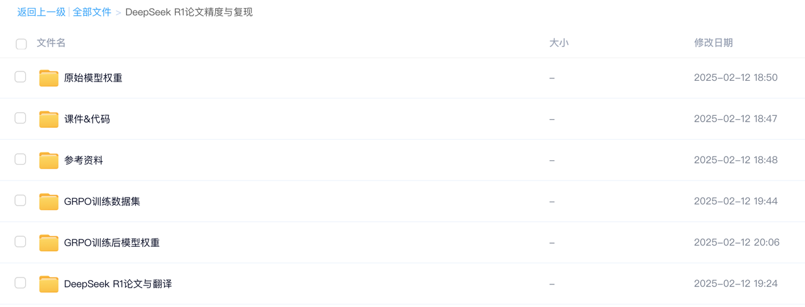


此外，公开课全套学习资料，已上传至网盘（https://pan.baidu.com/s/1wZ6jtWN-04Wt\_GhcjTeJYw?pwd=mhye ）

**需要更系统深入学习大模型可扫码⬆️添加助教咨询喔～**

***

## 《2025大模型原理与训练》体验课

## DeepSeek R1 GRPO算法实战

### 一、DeepSeek R1模型训练流程回顾与准备工作

* 回顾DeepSeek R1训练流程

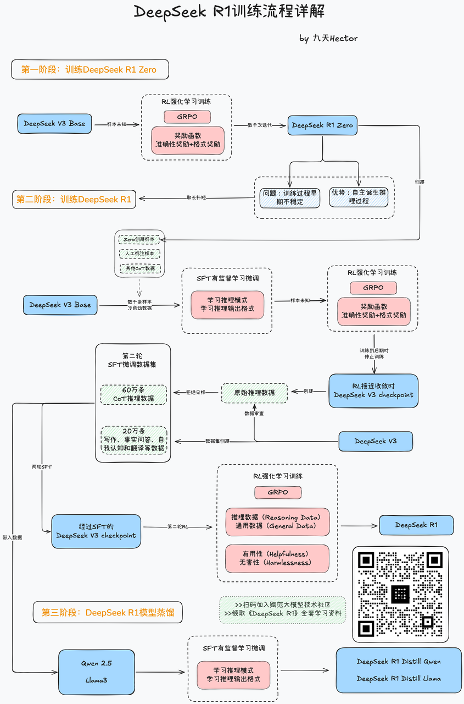

* DeepSeek R1模型背后的功臣：GRPO算法

  在了解了DeepSeek R1的训练流程之后，接下来让我们快速上手实践DeepSeek提出的GRPO算法，并手动复现DeepSeek R1论文中的模型开悟时刻，即通过GRPO训练，让模型诞生思考链。这也是整个DeepSeek R1模型训练的至关重要的环节，也是DeepSeek R1模型为大模型技术做出的卓越贡献。

  截止目前，全球范围内已经有很多团队尝试复现DeepSeek R1，并且在GRPO算法实践上取得了不错的成绩，用事实证明了GRPO算法本身的有效性。

  不同于传统的强化学习训练算法，或者常用的PPO算法，GRPO算法更加省时高效，通过暴力枚举策略、以及自我策略对比的方法快速提升模型在推理问题上制定策略的能力。这也是目前强化学习领域、被验证的最有效的提升大模型推理能力的方法。

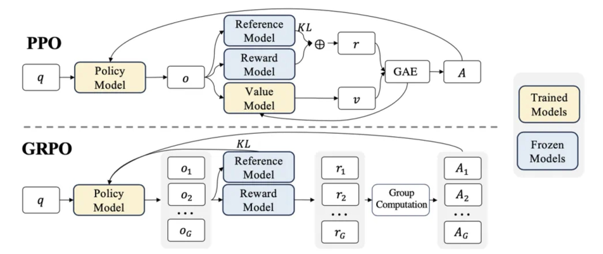

* GRPO算法实现方法

  伴随着DeepSeek R1火遍全球，GRPO算法的使用需求也是不断增加，截止目前，主流的强化学习框架均支持GRPO算法，可以一键进行调用。包括：

* veRL库：https://github.com/volcengine/verl

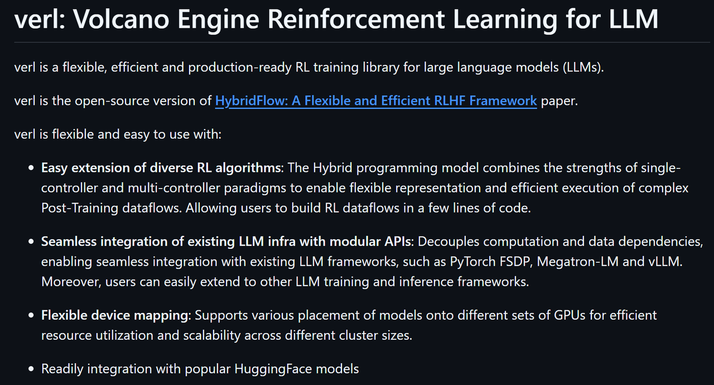

* trl库：https://github.com/huggingface/trl

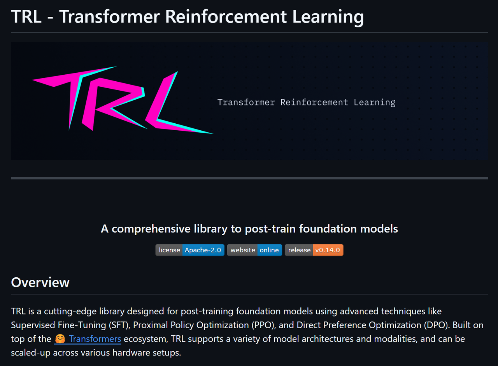

* OpenRLHF:https://github.com/OpenRLHF/OpenRLHF


* unsloth:https://github.com/unslothai/unsloth

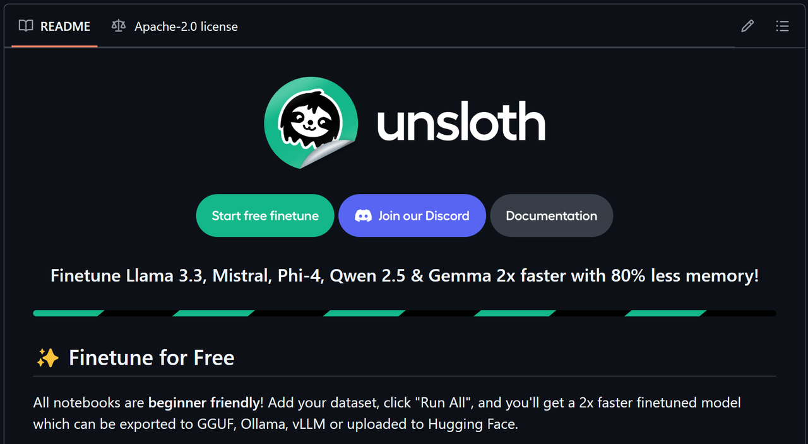

本节公开课，我们采用最基础的trl库，并在Jupyter中完成围绕Qwen2.5-0.5B-instruct模型的GRPO强化学习训练，并复现DeepSeek R1模型训练过程中的aha时刻，另起诞生思考过程。

* 推荐实验环境

  为了兼顾实验效果与运行效率，GRPO训练过程约需要17G显存，并运行4-6个小时左右。若在AutoDL上租赁服务器，可选3090单卡服务器，每小时1.5元，总成本约8-10元。

  公开课实验环境如下：


  更多关于AutoDL服务器租赁方法与远程连接方法，可以参考公开课《AutoDL快速入门指南》：https://www.bilibili.com/video/BV1bxB7YYEST/

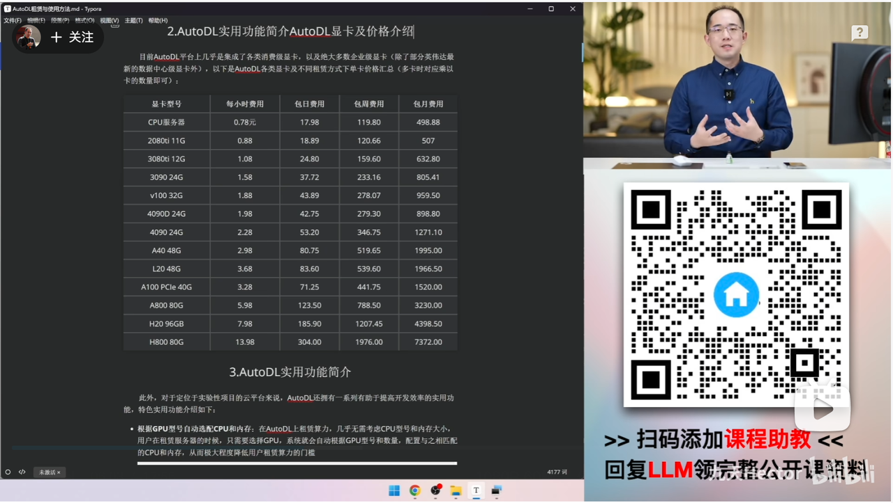

* 课件资料领取

  公开课全套课件资料，包括课件、代码、GRPO训练数据集、训练前后模型权重、以及参考资料等，均已上传网盘：

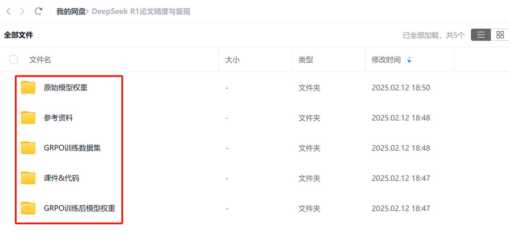

**扫码添加助教，即可领取全部资料👇**


* 实验目标

  本节公开课，我们将借助trl库，复刻DeepSeek R1强化学习训练的核心技术，GRPO，并在Qwen2.5-0.5B-Instruct小尺寸模型上，训练令其诞生推理能力。

训练前回复：

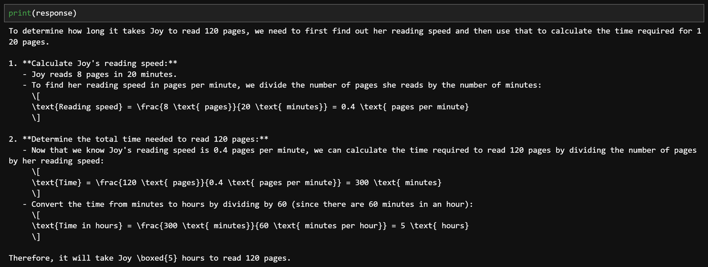

训练后回复：

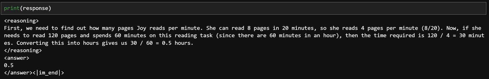

### 二、基础环境准备

* 模型下载

  本节公开课以Qwen2.5-0.5B-Instruct模型为例进行GRPO强化学习训练，可以从魔搭社区中下载模型权重：https://www.modelscope.cn/models/Qwen/Qwen2.5-0.5B-Instruct

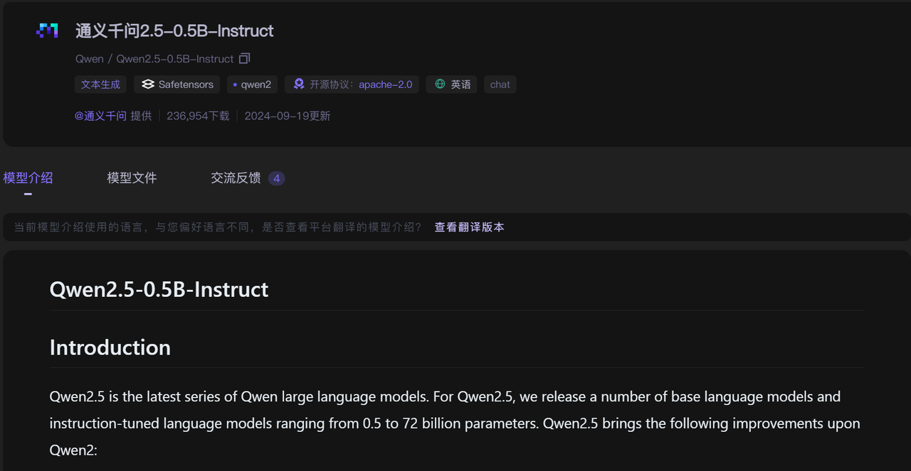

在命令行中使用如下命令，将模型权重下载到`Qwen2.5-0.5B-Instruct`文件夹中：

```bash
pip install modelscope
```

```bash
mkdir ./Qwen2.5-0.5B-Instruct
modelscope download --model Qwen/Qwen2.5-0.5B-Instruct --local_dir ./Qwen2.5-0.5B-Instruct
```

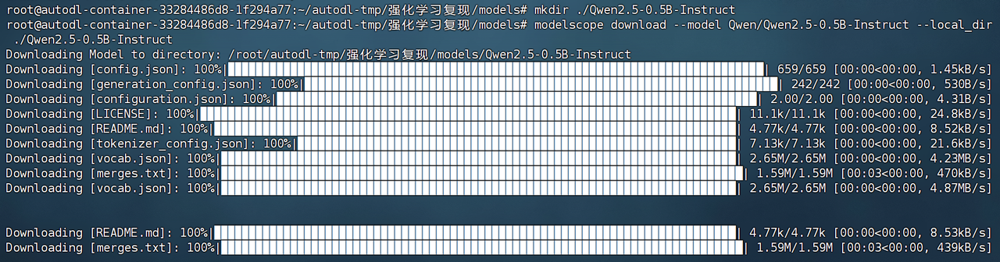

* 安装相关库

  然后需要安装相关的库：

```bash
pip install torch
pip install transformers
pip install trl
```

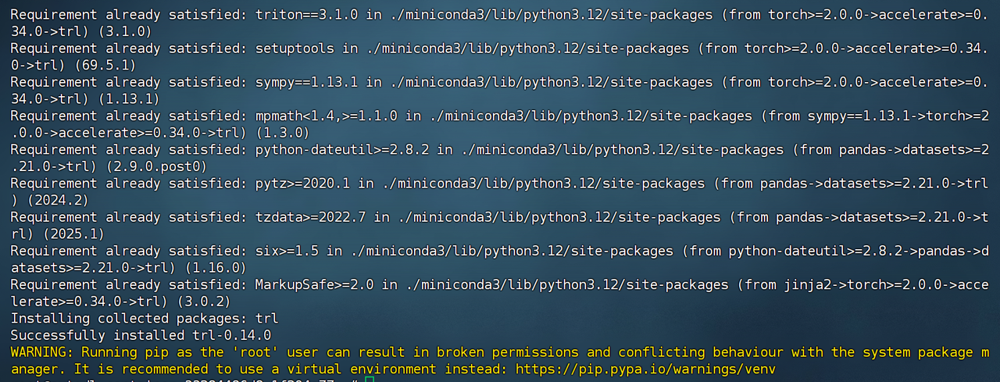

* 模型尝试调用

  安装完成后，接下来即可测试模型的对话能力：

```python
from modelscope import AutoModelForCausalLM, AutoTokenizer
```

首先读取模型：

```python
model_name = "./models/Qwen2.5-0.5B-Instruct"
```

```python
model = AutoModelForCausalLM.from_pretrained(
    model_name,
    torch_dtype="auto",
    device_map="auto"
)
tokenizer = AutoTokenizer.from_pretrained(model_name)
```

```plaintext
Some parameters are on the meta device because they were offloaded to the cpu.
```

创建对话消息：

```python
prompt = "Joy can read 8 pages of a book in 20 minutes. How many hours will it take her to read 120 pages?"
```

```python
messages = [
    {"role": "user", "content": prompt}
]
```

```python
messages
```

```plaintext
[{'role': 'user',
  'content': 'Joy can read 8 pages of a book in 20 minutes. How many hours will it take her to read 120 pages?'}]
```

带入对话模板，并进行分词：

```python
text = tokenizer.apply_chat_template(
    messages,
    tokenize=False,
    add_generation_prompt=True
)
model_inputs = tokenizer([text], return_tensors="pt").to(model.device)
```

```python
model_inputs
```

```plaintext
{'input_ids': tensor([[151644,   8948,    198,   2610,    525,   1207,  16948,     11,   3465,
            553,  54364,  14817,     13,   1446,    525,    264,  10950,  17847,
             13, 151645,    198, 151644,    872,    198,  79771,    646,   1349,
            220,     23,   6816,    315,    264,   2311,    304,    220,     17,
             15,   4420,     13,   2585,   1657,   4115,    686,    432,   1896,
           1059,    311,   1349,    220,     16,     17,     15,   6816,     30,
         151645,    198, 151644,  77091,    198]], device='cuda:0'), 'attention_mask': tensor([[1, 1, 1, 1, 1, 1, 1, 1, 1, 1, 1, 1, 1, 1, 1, 1, 1, 1, 1, 1, 1, 1, 1, 1,
         1, 1, 1, 1, 1, 1, 1, 1, 1, 1, 1, 1, 1, 1, 1, 1, 1, 1, 1, 1, 1, 1, 1, 1,
         1, 1, 1, 1, 1, 1, 1, 1, 1, 1, 1]], device='cuda:0')}
```

带入模型创建回复：

```python
generated_ids = model.generate(
    **model_inputs,
    max_new_tokens=512
)
generated_ids = [
    output_ids[len(input_ids):] for input_ids, output_ids in zip(model_inputs.input_ids, generated_ids)
]
```

```python
generated_ids
```

```plaintext
[tensor([  1249,   8253,   1246,   1293,    432,   4990,  27138,    311,   1349,
            220,     16,     17,     15,   6816,     11,    582,   1184,    311,
           1156,   1477,    700,   1059,   5290,   4628,    323,   1221,    990,
            429,    311,  11047,    279,    882,   2567,    369,    220,     16,
             17,     15,   6816,    382,     16,     13,   3070,  47866,  27138,
            594,   5290,   4628,     25,   1019,    256,    481,  27138,  15804,
            220,     23,   6816,    304,    220,     17,     15,   4420,    624,
            256,    481,   2014,   1477,   1059,   5290,   4628,    304,   6816,
            817,   9383,     11,    582,  21749,    279,   1372,    315,   6816,
           1340,  15804,    553,    279,   1372,    315,   4420,    510,    257,
           1124,   9640,    257,   1124,   1318,     90,  31899,   4628,     92,
            284,   1124,  37018,     90,     23,   1124,   1318,     90,   6816,
           3417,     90,     17,     15,   1124,   1318,     90,   4420,   3417,
            284,    220,     15,     13,     19,   1124,   1318,     90,   6816,
            817,   9383,    532,    257,   1124,   2533,     17,     13,   3070,
             35,  24308,    279,   2790,    882,   4362,    311,   1349,    220,
             16,     17,     15,   6816,     25,   1019,    256,    481,   4695,
            429,    582,   1414,  27138,    594,   5290,   4628,    374,    220,
             15,     13,     19,   6816,    817,   9383,     11,    582,    646,
          11047,    279,    882,   2567,    311,   1349,    220,     16,     17,
             15,   6816,    553,  49702,    279,   1372,    315,   6816,    553,
           1059,   5290,   4628,    510,    257,   1124,   9640,    257,   1124,
           1318,     90,   1462,     92,    284,   1124,  37018,     90,     16,
             17,     15,   1124,   1318,     90,   6816,   3417,     90,     15,
             13,     19,   1124,   1318,     90,   6816,    817,   9383,   3417,
            284,    220,     18,     15,     15,   1124,   1318,     90,   4420,
            532,    257,   1124,    921,    256,    481,   7169,    279,    882,
            504,   4420,    311,   4115,    553,  49702,    553,    220,     21,
             15,    320,  11284,   1052,    525,    220,     21,     15,   4420,
            304,    458,   6460,    982,    257,   1124,   9640,    257,   1124,
           1318,     90,   1462,    304,   4115,     92,    284,   1124,  37018,
             90,     18,     15,     15,   1124,   1318,     90,   4420,   3417,
             90,     21,     15,   1124,   1318,     90,   4420,    817,   6460,
           3417,    284,    220,     20,   1124,   1318,     90,   4115,    532,
            257,   1124,   2533,  54815,     11,    432,    686,   1896,  27138,
           1124,  79075,     90,     20,     92,   4115,    311,   1349,    220,
             16,     17,     15,   6816,     13, 151645], device='cuda:0')]
```

将回复结果转化为文本：

```python
response = tokenizer.batch_decode(generated_ids, skip_special_tokens=True)[0]
```

```python
print(response)
```

```plaintext
To determine how long it takes Joy to read 120 pages, we need to first find out her reading speed and then use that to calculate the time required for 120 pages.

1. **Calculate Joy's reading speed:**
   - Joy reads 8 pages in 20 minutes.
   - To find her reading speed in pages per minute, we divide the number of pages she reads by the number of minutes:
     \[
     \text{Reading speed} = \frac{8 \text{ pages}}{20 \text{ minutes}} = 0.4 \text{ pages per minute}
     \]

2. **Determine the total time needed to read 120 pages:**
   - Now that we know Joy's reading speed is 0.4 pages per minute, we can calculate the time required to read 120 pages by dividing the number of pages by her reading speed:
     \[
     \text{Time} = \frac{120 \text{ pages}}{0.4 \text{ pages per minute}} = 300 \text{ minutes}
     \]
   - Convert the time from minutes to hours by dividing by 60 (since there are 60 minutes in an hour):
     \[
     \text{Time in hours} = \frac{300 \text{ minutes}}{60 \text{ minutes per hour}} = 5 \text{ hours}
     \]

Therefore, it will take Joy \boxed{5} hours to read 120 pages.
```

在初始状态下，模型并不会主动进行思考。

* 数据集准备

  本节公开课用于GRPO训练的数据集选自OpenAI/GSM8K数据集：https://huggingface.co/datasets/openai/gsm8k

  **OpenAI GSM8K 数据集** 是一个广泛用于评估推理和数学能力的多样化数学题目数据集。该数据集包含大约 **8,000** 个数学问题，涵盖了从小学到高中的各种数学领域，包括算术、代数、几何等。GSM8K 旨在挑战大型语言模型在没有显式提示的情况下，解决更复杂的数学推理问题。数据集中的问题通常需要模型进行多步推理，远超基本的算术计算，因此它被广泛用于测试模型在理解和处理数字推理的能力。

  GSM8K 数据集的设计基于自然语言形式，呈现为问题-解答对的形式，且包含了问题的详细解析步骤。该数据集被广泛应用于模型的 **零样本推理** 和 **少样本学习** 任务，是当前研究中用于验证语言模型推理能力的重要基准之一。

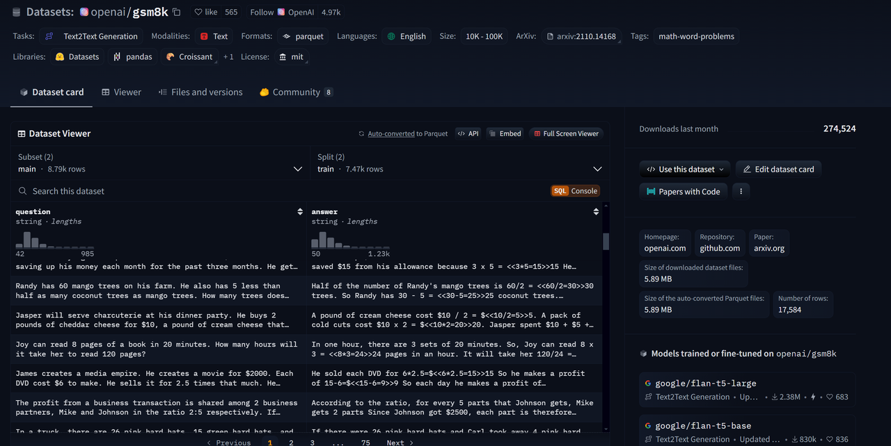

同样，数据集可以借助dataset工具进行下载：

```bash
pip install dataset
```

若是AutoDL租赁的服务器，则需要开启学术加速模型，连接huggingface进行下载：

```python
import subprocess
import os

result = subprocess.run('bash -c "source /etc/network_turbo && env | grep proxy"', shell=True, capture_output=True, text=True)
output = result.stdout
for line in output.splitlines():
    if '=' in line:
        var, value = line.split('=', 1)
        os.environ[var] = value
```

然后按照如下方式进行下载：

```python
data = load_dataset('openai/gsm8k', 'main')
```

```python
data
```

```plaintext
DatasetDict({
    train: Dataset({
        features: ['question', 'answer'],
        num_rows: 7473
    })
    test: Dataset({
        features: ['question', 'answer'],
        num_rows: 1319
    })
})
```

```python
data['train'][0]
```

```plaintext
{'question': 'Natalia sold clips to 48 of her friends in April, and then she sold half as many clips in May. How many clips did Natalia sell altogether in April and May?',
 'answer': 'Natalia sold 48/2 = <<48/2=24>>24 clips in May.\nNatalia sold 48+24 = <<48+24=72>>72 clips altogether in April and May.\n#### 72'}
```

此外，也可以在网盘中直接下载：

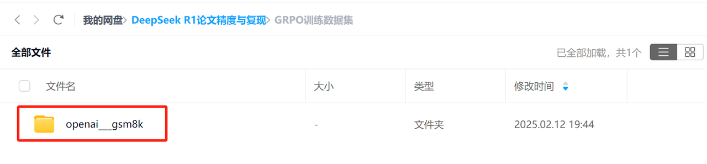

**扫码添加助教，即可领取全部资料👇**


* wandb环境配置【可选】

  在大规模模型训练中，我们往往需要监控和分析大量的训练数据，而WandB可以帮助我们实现这一目标。它提供了以下几个重要的功能：

**实时可视化**：WandB可以实时展示训练过程中关键指标的变化，如损失函数、学习率、训练时间等。通过这些可视化数据，我们能够直观地了解模型的训练进展，快速发现训练中的异常或瓶颈。

**自动记录与日志管理**：WandB会自动记录每次实验的参数、代码、输出结果，确保实验结果的可追溯性。无论是超参数的设置，还是模型的架构调整，WandB都能够帮助我们完整保留实验记录，方便后期对比与调优。

**支持中断与恢复训练**：在长时间的预训练任务中，系统中断或需要暂停是常见的情况。通过WandB的checkpoint功能，我们可以随时恢复训练，从上次中断的地方继续进行，避免数据和时间的浪费。

**多实验对比**：当我们尝试不同的模型配置或超参数时，WandB允许我们在多个实验之间轻松进行对比分析，帮助我们选择最优的模型配置。

**团队协作**：WandB还支持团队协作，多个成员可以共同查看实验结果，协同调试模型。这对研究和项目开发中团队的合作非常有帮助。

1. 注册wandb：https://wandb.ai/site


&#x20;


&#x20;


&#x20;


&#x20;

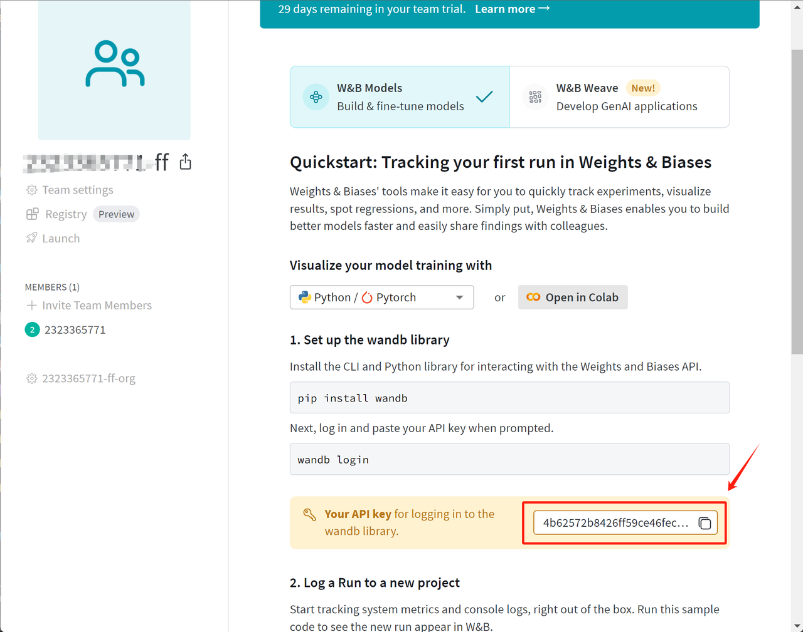

2. 安装wandb：

  在命令行中输入如下代码安装wandb：

```bash
pip install wandb
```


然后即可登录wandb，在命令行页面输入：

```bash
wandb login
```

并根据提示输入API-KEY：


即可在当前电脑上保存wandb账号信息，之后即可直接在wandb home主页上看到训练过程。若在代码环境中，可以使用如下代码进行设置：

```python
import wandb
```

```python
wandb.login(key="YOUR_WANDB_API_KEY")
```

```plaintext
Failed to detect the name of this notebook, you can set it manually with the WANDB_NOTEBOOK_NAME environment variable to enable code saving.
wandb: WARNING If you're specifying your api key in code, ensure this code is not shared publicly.
wandb: WARNING Consider setting the WANDB_API_KEY environment variable, or running `wandb login` from the command line.
wandb: Appending key for api.wandb.ai to your netrc file: /root/.netrc
wandb: Currently logged in as: 2323365771 (2323365771-ff) to https://api.wandb.ai. Use `wandb login --relogin` to force relogin


True
```

```python
wandb.init(project="GRPO-test")
```

```plaintext
wandb: Using wandb-core as the SDK backend.  Please refer to https://wandb.me/wandb-core for more information.
```

Tracking run with wandb version 0.19.6

Run data is saved locally in `/root/autodl-tmp/强化学习复现/wandb/run-20250212_112711-zevsqm7e`

Syncing run [**glad-resonance-3**](https://wandb.ai/2323365771-ff/GRPO-test/runs/zevsqm7e) to [Weights & Biases](https://wandb.ai/2323365771-ff/GRPO-test) ([docs](https://wandb.me/developer-guide))

View project at <https://wandb.ai/2323365771-ff/GRPO-test>

View run at <https://wandb.ai/2323365771-ff/GRPO-test/runs/zevsqm7e>

Display W\&B run

### 三、GRPO强化学习训练流程

  在完成了一系列的准备工作后，就将正式开始GRPO强化学习训练流程。

#### 1.基础准备工作

* 导入相关的库

```python
import re
import torch
from datasets import load_dataset, Dataset
from transformers import AutoTokenizer, AutoModelForCausalLM
from trl import GRPOConfig, GRPOTrainer
```

```python
SYSTEM_PROMPT = """
Respond in the following format:
<reasoning>
...
</reasoning>
<answer>
...
</answer>
"""

XML_COT_FORMAT = """\
<reasoning>
{reasoning}
</reasoning>
<answer>
{answer}
</answer>
"""
```

* 定义提示词模板与模型文本输出格式模板

```python
SYSTEM_PROMPT = """
Respond in the following format:
<reasoning>
...
</reasoning>
<answer>
...
</answer>
"""

XML_COT_FORMAT = """\
<reasoning>
{reasoning}
</reasoning>
<answer>
{answer}
</answer>
"""
```

这段代码定义了两个字符串常量，它们表示了不同的文本格式：

1. `SYSTEM_PROMPT = """..."""`

* **作用**：这是一个多行字符串，定义了一个系统提示（prompt）的格式。

* **内容**：

  * `"<reasoning>"` 和 `"</reasoning>"`：这部分表示推理过程的地方。推理过程可能包括模型分析问题、提出假设、推理等逻辑推导步骤。

  * `"<answer>"` 和 `"</answer>"`：这部分表示最终的回答或结论的地方。根据推理结果，模型将给出答案。

**目的**：

* 这个字符串的作用通常是在生成型模型中，指导模型如何组织它的回复。模型需要首先给出推理过程，再给出最终答案。这种格式帮助增强模型的推理能力，使其不只是给出答案，还展示思考过程。

* 例如，如果你问一个复杂的问题，模型会先解释它是如何思考问题的，然后再给出它的答案。

2. `XML_COT_FORMAT = """..."""`

* **作用**：这个字符串定义了一个 XML 风格的格式，并允许动态插入 `reasoning` 和 `answer` 的内容。

* **内容**：

  * `"<reasoning>{reasoning}</reasoning>"`：这里 `{reasoning}` 是一个占位符，表示实际的推理过程会被插入到该位置。

  * `"<answer>{answer}</answer>"`：类似地，`{answer}` 是占位符，用于插入最终答案。

**目的**：

* 这个格式提供了一个更结构化的输出形式，通常在某些应用中，模型的输出需要符合某种特定的格式（比如 XML 格式）。

* `XML_COT_FORMAT` 允许通过传入推理过程和答案的具体内容，生成符合这种格式的文本。比如，如果推理是 "首先分析数据，接着得出结论"，而答案是 "最后得出结论 A"，则输出将会类似于：

```xml
<reasoning>
首先分析数据，接着得出结论。
</reasoning>
<answer>
最后得出结论 A
</answer>
```

#### 2.格式处理函数组

  然后即可定义格式处理函数组：

* **`extract_xml_answer`** 用于从 XML 风格的文本中提取 `<answer>` 标签之间的内容。

* **`extract_hash_answer`** 用于从文本中提取 `####` 后的内容，若没有找到 `####`，返回 `None`。

* **`get_gsm8k_questions`** 加载 `GSM8K` 数据集，并将问题与系统提示结合，格式化后返回。

* 最终，通过调用 `get_gsm8k_questions()`，程序加载了格式化后的数据集，并存储在 `dataset` 变量中，准备后续处理。

```python
def extract_xml_answer(text: str) -> str:
    answer = text.split("<answer>")[-1]
    answer = answer.split("</answer>")[0]
    return answer.strip()
```

`def extract_xml_answer(text: str) -> str:`

* **作用**：这个函数用于从文本中提取 `<answer>` 标签之间的内容。

* **实现**：

  * `text.split("<answer>")[-1]`：首先通过 `split` 函数以 `<answer>` 为分隔符，把 `text` 分割成一个列表，`[-1]` 取出列表的最后一个部分，这部分应该包含了 `</answer>` 标签之后的内容。

  * `answer.split("</answer>")[0]`：然后再通过 `split("</answer>")` 分割，取出第一个部分，这部分就是 `<answer>` 标签和 `</answer>` 标签之间的内容。

  * `return answer.strip()`：最后通过 `strip()` 去除前后的空白字符，返回提取出的答案。

* **用途**：这个函数常用于从包含 `<answer>` 标签的文本中提取实际的答案。

```python
def extract_hash_answer(text: str) -> str | None:
    if "####" not in text:
        return None
    return text.split("####")[1].strip()
```

`def extract_hash_answer(text: str) -> str | None:`

* **作用**：这个函数从文本中提取基于 `####` 分隔符的答案。如果没有找到 `####`，则返回 `None`。

* **实现**：

  * `if "####" not in text:`：首先检查文本中是否包含 `####`，如果没有，就返回 `None`，表示没有找到答案。

  * `return text.split("####")[1].strip()`：如果找到了 `####`，通过 `split("####")` 将文本分割成两部分，取出第二部分（即索引为 1 的部分）。然后通过 `strip()` 去除多余的空白字符，返回提取出的答案。

* **用途**：这个函数用于从包含 `####` 的文本中提取实际的答案。如果没有 `####`，则返回 `None`。

```python
# uncomment middle messages for 1-shot prompting
def get_gsm8k_questions(split = "train") -> Dataset:
    data = load_dataset('openai/gsm8k', 'main')[split] # type: ignore
    data = data.map(lambda x: { # type: ignore
        'prompt': [
            {'role': 'system', 'content': SYSTEM_PROMPT},
            {'role': 'user', 'content': x['question']}
        ],
        'answer': extract_hash_answer(x['answer'])
    }) # type: ignore
    return data # type: ignore
```

`def get_gsm8k_questions(split = "train") -> Dataset:`

* **作用**：这个函数用于加载 `GSM8K` 数据集并返回包含问题和答案的格式化数据集。

* **实现**：

  * `data = load_dataset('openai/gsm8k', 'main')[split]`：使用 `datasets` 库的 `load_dataset` 函数加载 `GSM8K` 数据集的 `main` 版本。`split` 参数（默认值为 `"train"`）决定加载训练集、验证集或测试集。

  * `data = data.map(lambda x: {...})`：`map` 函数用于对数据集中的每一条记录进行处理。在这里，每个条目的 `question` 被包装成一个对话 prompt 格式，并加入系统提示 `SYSTEM_PROMPT`。同时，`answer` 被处理，通过 `extract_hash_answer` 函数从原始的答案文本中提取答案。

  * `return data`：返回处理后的数据集。

然后即可导入并处理数据集：

```python
data = load_dataset('openai/gsm8k', 'main')
```

这段代码使用了`datasets`库中的`load_dataset`函数，加载了OpenAI提供的`gsm8k`数据集的`main`版本。

具体来说：

* `load_dataset('openai/gsm8k', 'main')`会从`openai`的服务器上加载名为`gsm8k`的数据集，并选择`main`配置（有些数据集可能有不同的版本或子集，可以选择不同的配置）。

* `gsm8k`是一个数学推理数据集，包含了8,000多个数学问题，通常用于训练和评估模型的推理能力。

`data`变量会接收到该数据集。它通常是一个`datasets.Dataset`对象，你可以使用它进行数据的处理、训练、测试等操作。

如果你想进一步了解如何使用这个数据集，可以调用类似 `data['train']` 来查看训练集的数据。

处理后的数据集如下所示：

```python
data
```

```plaintext
DatasetDict({
    train: Dataset({
        features: ['question', 'answer'],
        num_rows: 7473
    })
    test: Dataset({
        features: ['question', 'answer'],
        num_rows: 1319
    })
})
```

```python
q1 = data['train'][0]
q1
```

```plaintext
{'question': 'Natalia sold clips to 48 of her friends in April, and then she sold half as many clips in May. How many clips did Natalia sell altogether in April and May?',
 'answer': 'Natalia sold 48/2 = <<48/2=24>>24 clips in May.\nNatalia sold 48+24 = <<48+24=72>>72 clips altogether in April and May.\n#### 72'}
```

#### 3.奖励函数组

  接下来继续定义奖励函数模型组：

* correctness\_reward\_func：根据正确性对答案进行奖励。

* int\_reward\_func：根据是否为数字对输出进行奖励。

* strict\_format\_reward\_func：根据严格的格式要求检查并奖励。

* soft\_format\_reward\_func：根据稍微宽松的格式要求检查并奖励。

* count\_xml：计算文本中的 XML 标签结构并给予奖励。

* xmlcount\_reward\_func：为每个输出计算 XML 标签结构的符合度并返回奖励。

```python
# Reward functions
def correctness_reward_func(prompts, completions, answer, **kwargs) -> list[float]:
    responses = [completion[0]['content'] for completion in completions]
    q = prompts[0][-1]['content']
    extracted_responses = [extract_xml_answer(r) for r in responses]
    print('-'*20, f"Question:\n{q}", f"\nAnswer:\n{answer[0]}", f"\nResponse:\n{responses[0]}", f"\nExtracted:\n{extracted_responses[0]}")
    return [2.0 if r == a else 0.0 for r, a in zip(extracted_responses, answer)]
```

correctness\_reward\_func(prompts, completions, answer, \*\*kwargs) -> list\[float]

* 作用：该函数检查模型输出是否与正确答案匹配，并根据匹配情况返回奖励分数。

* 实现：

* responses = \[completion\[0]\['content'] for completion in completions]：提取每个 completion 中的内容（即模型的输出）。、

* q = prompts\[0]\[-1]\['content']：提取输入问题（prompt）的内容。

* extracted\_responses = \[extract\_xml\_answer(r) for r in responses]：使用之前定义的 extract\_xml\_answer 函数提取模型输出中的答案部分。

* print(...)：打印问题、正确答案、模型输出和提取的答案，帮助调试。

* return \[2.0 if r == a else 0.0 for r, a in zip(extracted\_responses, answer)]：比较每个提取的回答（r）与正确答案（a）。如果两者相同，返回奖励 2.0；否则返回 0.0。奖励是一个列表，长度与模型的输出数目相同。

* 用途：该奖励函数用于衡量模型回答的正确性，通常用于监督学习或强化学习中的标准化评估。

```python
def int_reward_func(completions, **kwargs) -> list[float]:
    responses = [completion[0]['content'] for completion in completions]
    extracted_responses = [extract_xml_answer(r) for r in responses]
    return [0.5 if r.isdigit() else 0.0 for r in extracted_responses]
```

int\_reward\_func(completions, \*\*kwargs) -> list\[float]

* 作用：检查模型输出是否为有效的整数，并根据结果给予奖励。

* 实现：

* responses = \[completion\[0]\['content'] for completion in completions]：提取模型的回答内容。

* extracted\_responses = \[extract\_xml\_answer(r) for r in responses]：提取回答中的内容。

* return \[0.5 if r.isdigit() else 0.0 for r in extracted\_responses]：检查每个提取的回答是否为数字字符串。如果是数字，返回奖励 0.5；否则返回 0.0。

* 用途：该函数用于奖励模型生成整数形式的答案，可能用于问题要求模型给出数字时的情形。

```python
def strict_format_reward_func(completions, **kwargs) -> list[float]:
    """Reward function that checks if the completion has a specific format."""
    pattern = r"^<reasoning>\n.*?\n</reasoning>\n<answer>\n.*?\n</answer>\n$"
    responses = [completion[0]["content"] for completion in completions]
    matches = [re.match(pattern, r) for r in responses]
    return [0.5 if match else 0.0 for match in matches]
```

strict\_format\_reward\_func(completions, \*\*kwargs) -> list\[float]

* 作用：检查模型的输出是否符合严格的格式要求，包括 和 标签。

* 实现：

* pattern = r"^\n.*?\n\n\n.*?\n\n$"：定义了一个正则表达式，确保输出的格式严格符合要求。

* responses = \[completion\[0]\["content"] for completion in completions]：提取模型的回答。

* matches = \[re.match(pattern, r) for r in responses]：通过正则表达式检查每个回答是否符合格式。

* return \[0.5 if match else 0.0 for match in matches]：如果匹配格式，返回奖励 0.5；否则返回 0.0。

* 用途：用于检查输出是否符合严格的格式要求，通常用于控制模型输出的结构性和一致性。

```python
def soft_format_reward_func(completions, **kwargs) -> list[float]:
    """Reward function that checks if the completion has a specific format."""
    pattern = r"<reasoning>.*?</reasoning>\s*<answer>.*?</answer>"
    responses = [completion[0]["content"] for completion in completions]
    matches = [re.match(pattern, r) for r in responses]
    return [0.5 if match else 0.0 for match in matches]
```

soft\_format\_reward\_func(completions, \*\*kwargs) -> list\[float]

* 作用：检查模型的输出是否符合稍微宽松的格式要求， 和 标签之间可以有空白字符。

* 实现：

* pattern = r".*?\s*.\*?"：定义了一个稍微宽松的正则表达式，允许 和 标签之间有空格或换行。

* responses = \[completion\[0]\["content"] for completion in completions]：提取模型的回答。

* matches = \[re.match(pattern, r) for r in responses]：检查每个回答是否符合此格式。

* return \[0.5 if match else 0.0 for match in matches]：如果格式匹配，返回奖励 0.5；否则返回 0.0。

* 用途：用于稍微放宽的格式要求，适用于某些对格式要求不那么严格的场景。

```python
def count_xml(text) -> float:
    count = 0.0
    if text.count("<reasoning>\n") == 1:
        count += 0.125
    if text.count("\n</reasoning>\n") == 1:
        count += 0.125
    if text.count("\n<answer>\n") == 1:
        count += 0.125
        count -= len(text.split("\n</answer>\n")[-1])*0.001
    if text.count("\n</answer>") == 1:
        count += 0.125
        count -= (len(text.split("\n</answer>")[-1]) - 1)*0.001
    return count
```

count\_xml(text) -> float

* 作用：计算文本中 和 标签的出现次数，并根据它们的位置和频率分配奖励。

* 实现：

* count = 0.0：初始化计数器。

* if text.count("\n") == 1:：检查文本中是否包含一个 标签，并且只出现一次。

* count += 0.125：如果条件满足，奖励 0.125。

* if text.count("\n\n") == 1:：检查是否有一个结束的 标签。

* count += 0.125：若条件满足，再奖励 0.125。

* if text.count("\n\n") == 1:：检查是否有一个 标签。

* count += 0.125：若满足条件，奖励 0.125。

* count -= len(text.split("\n\n")\[-1])\*0.001：如果存在多余的文本在 标签之后，扣除一些奖励。

* return count：返回最终的奖励值。

* 用途：用于计算模型输出的 XML 格式是否符合预期，并给出一个基于结构的奖励分数。

```python
def xmlcount_reward_func(completions, **kwargs) -> list[float]:
    contents = [completion[0]["content"] for completion in completions]
    return [count_xml(c) for c in contents]
```

xmlcount\_reward\_func(completions, \*\*kwargs) -> list\[float]

* 作用：该函数用于计算每个模型输出的 XML 结构符合度，并返回奖励分数。

* 实现：

* contents = \[completion\[0]\["content"] for completion in completions]：提取模型的回答内容。

* return \[count\_xml(c) for c in contents]：对每个输出应用 count\_xml 函数，返回奖励分数列表。

* 用途：用于根据 XML 格式的符合度给出奖励，常用于要求模型输出符合特定格式的任务。

这些奖励函数用于强化学习中的反馈机制，帮助模型优化输出结果，并满足格式、正确性等多方面要求。

#### 4.GRPO训练流程

  当一切准备完毕后，接下来即可开启模型GRPO训练。

首先读取模型，并设置模型保存地址：

```python
model_name = "models/Qwen2.5-0.5B-Instruct"

output_dir="outputs/Qwen-0.5B-GRPO"
run_name="Qwen-0.5B-GRPO-gsm8k"
```

```python
training_args = GRPOConfig(
    output_dir=output_dir,
    run_name=run_name,
    learning_rate=5e-6,
    adam_beta1 = 0.9,
    adam_beta2 = 0.99,
    weight_decay = 0.1,
    warmup_ratio = 0.1,
    lr_scheduler_type='cosine',
    logging_steps=1,
    bf16=True,
    per_device_train_batch_size=1,
    gradient_accumulation_steps=4,
    num_generations=16,
    max_prompt_length=256,
    max_completion_length=200,
    num_train_epochs=1,
    save_steps=100,
    max_grad_norm=0.1,
    log_on_each_node=False,
    use_vllm=False,
    vllm_gpu_memory_utilization=.3,
    vllm_device="cuda:0",
    report_to="wandb" 
)
```

然后创建训练参数。GRPOConfig 是一个用于强化学习和优化训练过程的配置类，它包含了训练的各种设置。让我们深入了解这些参数。

具体的参数设置如下：

* output\_dir=output\_dir：指定训练结果保存的目录（例如模型检查点、日志文件）。output\_dir 变量应事先定义。

* run\_name=run\_name：运行的名称，用于标识该训练任务的名称。

* learning\_rate=5e-6：学习率，决定了每次参数更新时模型更新的步长。较小的学习率意味着训练更加稳定，但可能需要更长的时间。

* adam\_beta1=0.9 和 adam\_beta2=0.99：Adam 优化器的超参数，分别对应一阶矩和二阶矩的衰减率。它们通常用于控制优化过程中的动量。

* weight\_decay=0.1：权重衰减，通常用于防止过拟合，是一种正则化方法。

* warmup\_ratio=0.1：学习率的预热比例，表示在训练的初期阶段逐步增加学习率，避免直接开始时学习率过高。

* lr\_scheduler\_type='cosine'：学习率调度类型，cosine 表示使用余弦退火（Cosine Annealing）来调整学习率，通常在训练的后期将学习率逐渐减小。

* logging\_steps=1：每训练 1 步就记录一次日志。这个参数控制了日志记录的频率。

* bf16=True：启用 bfloat16 精度训练。bfloat16 是一种数值精度格式，通常在支持该格式的硬件（如 Google TPU）上能有效加速训练，同时减少显存占用。

* per\_device\_train\_batch\_size=1：每个设备上进行的训练批次大小，即每次计算时使用的样本数。此处设置为 1，表示每个 GPU 或设备上处理 1 个样本。

* gradient\_accumulation\_steps=4：梯度累积步数，在训练时通过累计多个小批次的梯度来模拟更大的批次大小，以节省显存。

* num\_generations=16：每个训练样本生成的输出数量，通常用于生成式任务（如文本生成）。

* max\_prompt\_length=256：最大输入长度（包括问题和上下文），超过此长度的输入会被截断。

* max\_completion\_length=200：模型生成的最大输出长度。

* num\_train\_epochs=1：训练的总轮数。每一轮都将对整个数据集进行一次完整的训练。

* save\_steps=100：每 100 步保存一次模型的检查点。

* max\_grad\_norm=0.1：梯度裁剪的最大范数，这有助于避免梯度爆炸的问题，尤其是在深度神经网络中。

* log\_on\_each\_node=False：在每个节点上是否记录日志，通常在分布式训练时使用。

* use\_vllm=False：是否使用 vllm 进行训练。vllm 是一种高效的训练方法，通常用于大规模分布式训练。

* vllm\_gpu\_memory\_utilization=.3：如果启用了 vllm，这是每个 GPU 的内存使用比例（通常是一个浮动值，0 到 1）。

* vllm\_device="cuda:0"：指定要在第一个 GPU 上运行 vllm。

* report\_to="none"：禁用训练过程中的报告工具（如 WandB）。如果设置为 "wandb"，则训练过程中会记录数据并上传到 WandB。

然后进行模型加载：

```python
model = AutoModelForCausalLM.from_pretrained(
    model_name,
    torch_dtype=torch.bfloat16,
    device_map=None
).to("cuda")
```

并加载分词器

```python
tokenizer = AutoTokenizer.from_pretrained(model_name)
tokenizer.pad_token = tokenizer.eos_token
```

然后开始模型训练：

```python
trainer = GRPOTrainer(
    model=model,
    processing_class=tokenizer,
    reward_funcs=[
        xmlcount_reward_func,
        soft_format_reward_func,
        strict_format_reward_func,
        int_reward_func,
        correctness_reward_func],
    args=training_args,
    train_dataset=dataset,
)

trainer.train()

trainer.save_model(output_dir)
```

```plaintext
-------------------- Question:
Ahmed and Emily are having a contest to see who can get the best grade in the class. There have been 9 assignments and Ahmed has a 91 in the class. Emily has a 92. The final assignment is worth the same amount as all the other assignments. Emily got a 90 on the final assignment. What is the minimum grade Ahmed needs to get to beat Emily if all grades are whole numbers? 
Answer:
100 
Response:
To determine the minimum grade Ahmed needs to beat Emily, we'll first calculate the total number of assignments Ahmed has completed and the difference between the total number of assignments and the number of final assignments:

1. **Total number of assignments**: 9
2. **Number of final assignments**: 1
3. **Total number of assignments completed**: \( 9 - 1 = 8 \)
4. **Number of final assignments to be completed**: 1

To beat Emily, Ahmed needs to get a score that is greater than:

\[ \text{Emily's score} + \text{Total number of final assignments} \]

So, we calculate:

\[ 91 + 1 = 92 \]

To beat Emily, Ahmed needs to have:

\[ 92 + 1 = 93 \]

Therefore, Ahmed needs at least a score of 93 on the final assignment to potentially beat Emily. 
Extracted:
To determine the minimum grade Ahmed needs to beat Emily, we'll first calculate the total number of assignments Ahmed has completed and the difference between the total number of assignments and the number of final assignments:

1. **Total number of assignments**: 9
2. **Number of final assignments**: 1
3. **Total number of assignments completed**: \( 9 - 1 = 8 \)
4. **Number of final assignments to be completed**: 1

To beat Emily, Ahmed needs to get a score that is greater than:

\[ \text{Emily's score} + \text{Total number of final assignments} \]

So, we calculate:

\[ 91 + 1 = 92 \]

To beat Emily, Ahmed needs to have:

\[ 92 + 1 = 93 \]

Therefore, Ahmed needs at least a score of 93 on the final assignment to potentially beat Emily.
-------------------- Question:
The gauge on a water tank shows that the tank is 1/3 full of water. To fill the tank, 16 gallons of water are added. How many gallons of water does the tank hold when full? 
Answer:
24 
Response:
Let's denote the full capacity of the tank as \( C \) gallons. From the information given, we know that when the tank is \( \frac{1}{3} \) full, it contains \( \frac{1}{3}C \) gallons of water.

We are told that 16 gallons are added to the tank to fill it up to its full capacity. Therefore, the additional water added can be expressed as:

\[ \frac{1}{3}C + 16 \]

Since the tank is \( \frac{1}{3} \) full, the full capacity \( C \) is:

\[ C = 16 \times 3 \]

\[ C = 48 \] gallons

So, the tank holds 48 gallons of water when full. 
Extracted:
Let's denote the full capacity of the tank as \( C \) gallons. From the information given, we know that when the tank is \( \frac{1}{3} \) full, it contains \( \frac{1}{3}C \) gallons of water.

We are told that 16 gallons are added to the tank to fill it up to its full capacity. Therefore, the additional water added can be expressed as:

\[ \frac{1}{3}C + 16 \]

Since the tank is \( \frac{1}{3} \) full, the full capacity \( C \) is:

\[ C = 16 \times 3 \]

\[ C = 48 \] gallons

So, the tank holds 48 gallons of water when full.
-------------------- Question:
There are 15 tables in the school's cafeteria. Each table can seat 10 people. Usually, only 1/10 of the seats are left unseated. How many seats are usually taken? 
Answer:
135 
Response:
First, let's calculate the total number of seats in the cafeteria:

Total seats = Number of tables × Number of seats per table
Total seats = 15 × 10
Total seats = 150

Now, let's determine how many seats are usually taken:

Seats taken = Total seats × 1/10
Seats taken = 150 × 1/10
Seats taken = 15

Therefore, usually, 15 seats are taken. 
Extracted:
First, let's calculate the total number of seats in the cafeteria:

Total seats = Number of tables × Number of seats per table
Total seats = 15 × 10
Total seats = 150

Now, let's determine how many seats are usually taken:

Seats taken = Total seats × 1/10
Seats taken = 150 × 1/10
Seats taken = 15

Therefore, usually, 15 seats are taken.
-------------------- Question:
Fiona completed 36 math questions in an hour. Shirley was able to complete twice as many math questions within that same time, and Kiana completed half of the sum of Fiona and Shirley's math questions. If they each did the same number of questions the following hour, how many math questions did all three girls complete in 2 hours? 
Answer:
324 
Response:
First, let's determine how many math questions each girl completed in the first hour.

Fiona completed 36 questions.

Shirley completed twice as many questions as Fiona, so:
\[ \text{Shirley's questions} = 2 \times 36 = 72 \]

Kiana completed half of the sum of Fiona and Shirley's questions:
\[ \text{Kiana's questions} = \frac{36 + 72}{2} = \frac{108}{2} = 54 \]

Next, let's calculate the number of math questions each of them completed in the second hour if they each did the same number of questions as in the first hour.

Fiona still completed 36 questions.
Shirley completed 72 questions.
Kiana completed 54 questions.

Since they did the same number of questions each hour, we can find the total number of questions completed in 2 hours by adding the 
Extracted:
First, let's determine how many math questions each girl completed in the first hour.

Fiona completed 36 questions.

Shirley completed twice as many questions as Fiona, so:
\[ \text{Shirley's questions} = 2 \times 36 = 72 \]

Kiana completed half of the sum of Fiona and Shirley's questions:
\[ \text{Kiana's questions} = \frac{36 + 72}{2} = \frac{108}{2} = 54 \]

Next, let's calculate the number of math questions each of them completed in the second hour if they each did the same number of questions as in the first hour.

Fiona still completed 36 questions.
Shirley completed 72 questions.
Kiana completed 54 questions.

Since they did the same number of questions each hour, we can find the total number of questions completed in 2 hours by adding the


<div>

  <progress value='71' max='1868' style='width:300px; height:20px; vertical-align: middle;'></progress>
  [  71/1868 18:44 < 8:07:53, 0.06 it/s, Epoch 0.04/1]
</div>
<table border="1" class="dataframe">
```

Step Training Loss 1 0.000000 2 0.000000 3 0.000000 4 0.000000 5 0.000000 6 -0.000000 7 0.000000 8 0.000000 9 0.000000 10 0.000000 11 0.000000 12 0.000000 13 0.000000 14 0.000000 15 0.000000 16 0.000000 17 0.000000 18 0.000000 19 0.000000 20 0.000000 21 0.000000 22 0.000000 23 0.000000 24 0.000000 25 0.000000 26 0.000000 27 0.000000 28 0.000000 29 0.000000 30 0.000000 31 0.000000 32 0.000000 33 0.000000 34 0.000000 35 0.000000 36 0.000000 37 0.000000 38 0.000000 39 0.000000 40 0.000000 41 0.000000 42 0.000000 43 0.000000 44 0.000000 45 0.000000 46 0.000000 47 0.000000 48 0.000000 49 0.000000 50 0.000000 51 0.000000 52 0.000000 53 0.000000 54 0.000000 55 0.000000 56 0.000000 57 0.000000 58 0.000000 59 0.000000 60 0.000000 61 0.000000 62 0.000000 63 0.000000 64 0.000000 65 0.000000 66 0.000000 67 0.000000 68 0.000000 69 0.000000

