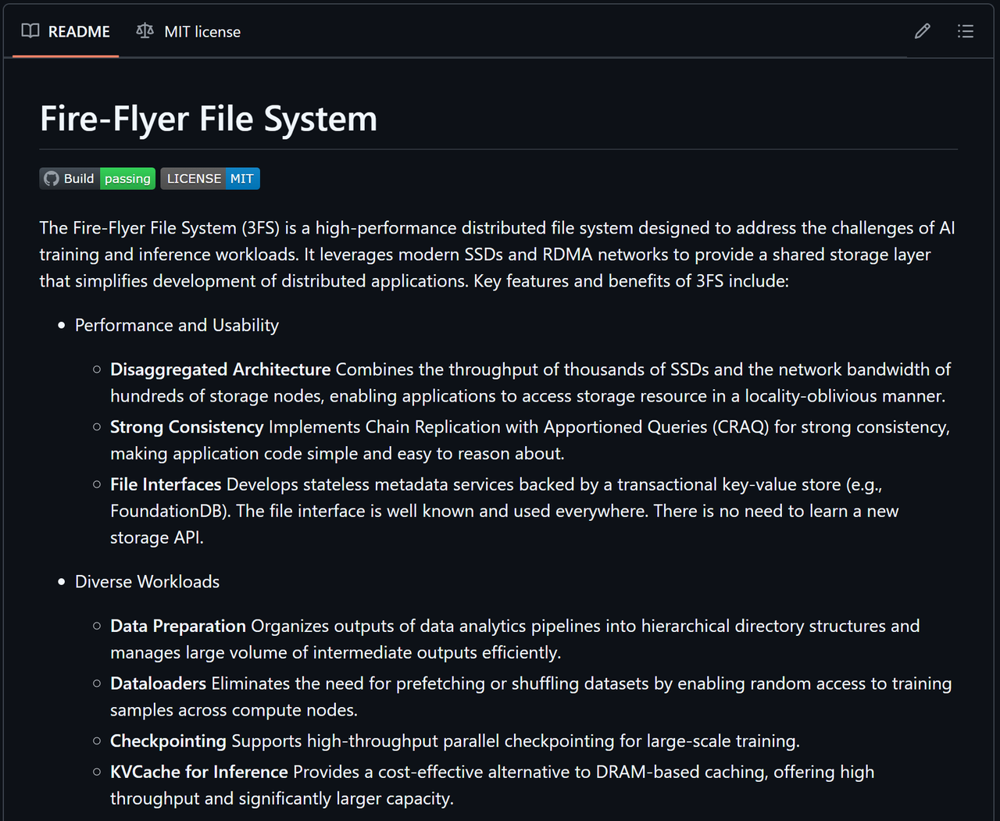
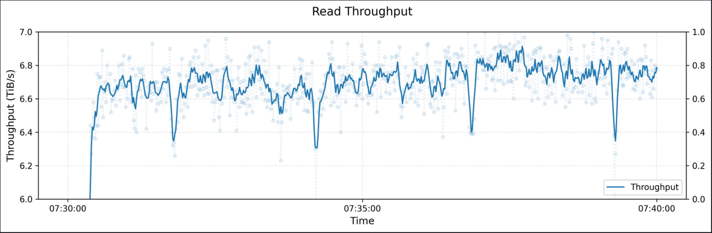
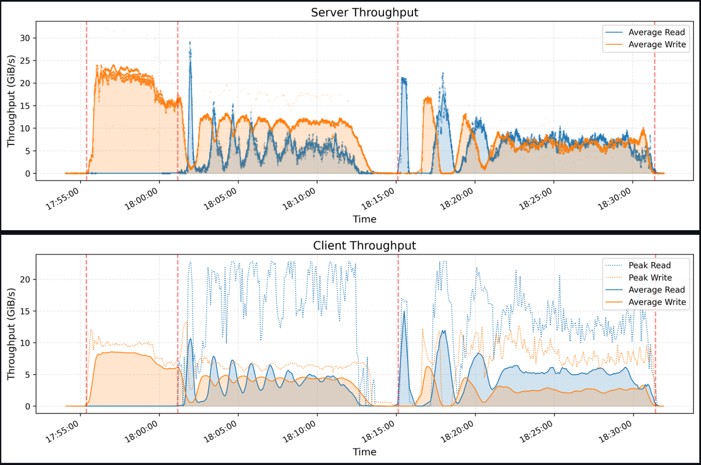
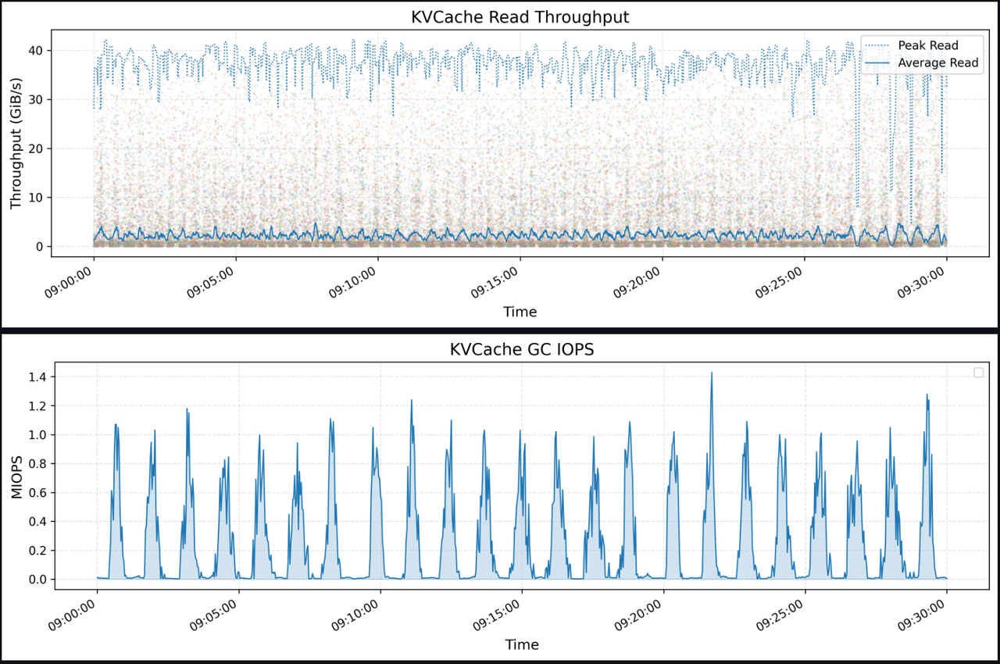

## 一、Fire-Flyer File System项目介绍

* Fire-Flyer File System项目地址：https://github.com/deepseek-ai/3FS



### 1. **Fire-Flyer 文件系统功能介绍**

Fire-Flyer 文件系统（3FS）是一个高性能的分布式文件系统，旨在解决 AI 训练和推理工作负载的挑战。它利用现代 SSD 和 RDMA 网络提供共享存储层，从而简化分布式应用程序的开发。3FS 的主要特性和优势包括：

* **性能与可用性**

  * **解耦架构**：结合了数千个 SSD 的吞吐量和数百个存储节点的网络带宽，使得应用程序能够以不依赖位置的方式访问存储资源。

  * **强一致性**：通过链式复制与分配查询（CRAQ）实现强一致性，使应用程序代码更简单，易于推理。

  * **文件接口**：开发了无状态的元数据服务，后端使用事务型键值存储（如 FoundationDB）。文件接口广泛使用，无需学习新的存储 API。

* **多样化工作负载**

  * **数据准备**：将数据分析管道的输出组织成层级目录结构，并高效管理大量中间输出。

  * **数据加载器**：通过实现对训练样本的随机访问，消除了预取或打乱数据集的需要，支持跨计算节点访问。

  * **检查点**：支持大规模训练的高吞吐量并行检查点功能。

  * **推理中的 KVCache**：为 DRAM 缓存提供了一个具成本效益的替代方案，提供更高的吞吐量和显著更大的容量。

### 2. **Fire-Flyer 文件系统性能介绍**

1. **峰值吞吐量**
   下图展示了在一个大型 3FS 集群上的读取压力测试吞吐量。该集群由 180 个存储节点组成，每个节点配备 2×200Gbps 的 InfiniBand NIC 和 16 个 14TiB 的 NVMe SSD。大约有 500+ 个客户端节点参与了读取压力测试，每个客户端节点配置 1×200Gbps 的 InfiniBand NIC。最终的聚合读取吞吐量达到了约 6.6 TiB/s，并且在训练任务的背景流量下。



1. **在 180 节点集群上进行压力测试时的大块读取吞吐量**

2. **GraySort**
   我们使用 GraySort 基准测试评估了 smallpond，该基准测试测量了在大规模数据集上的排序性能。我们的实现采用了两阶段的方法：(1) 使用键的前缀位进行数据分区（shuffle），(2) 在分区内进行排序。两个阶段都从 3FS 读写数据。



1. 测试集群由 25 个存储节点组成（每节点 2 个 NUMA 域，每 NUMA 一个存储服务，2×400Gbps NIC 每节点）和 50 个计算节点（2 个 NUMA 域，192 个物理核心，2.2 TiB RAM 和 1×200 Gbps NIC 每节点）。在 8,192 个分区上排序 110.5 TiB 数据，耗时 30 分 14 秒，平均吞吐量达到 3.66 TiB/min。

2. **KVCache**
   KVCache 是一种优化大语言模型（LLM）推理过程的技术。它通过缓存解码器层中前一个标记的键值向量，避免了冗余的计算。上图展示了所有 KVCache 客户端的读取吞吐量，突出显示了峰值和平均值，其中峰值吞吐量达到了 40 GiB/s。下图展示了在同一时间段内，垃圾回收（GC）时的删除操作的 IOPS。



### 3. **源码查看与部署**

从 GitHub 克隆 3FS 仓库：

```bash
git clone https://github.com/deepseek-ai/3fs
```

当 `deepseek-ai/3fs` 仓库克隆到本地文件系统后，运行以下命令来检出子模块：

```bash
cd 3fs
git submodule update --init --recursive
./patches/apply.sh
```

#### 3.1 **安装依赖**

* 对于 Ubuntu 20.04：

```bash
apt install cmake libuv1-dev liblz4-dev liblzma-dev libdouble-conversion-dev libprocps-dev libdwarf-dev libunwind-dev \
  libaio-dev libgflags-dev libgoogle-glog-dev libgtest-dev libgmock-dev clang-format-14 clang-14 clang-tidy-14 lld-14 \
  libgoogle-perftools-dev google-perftools libssl-dev ccache libclang-rt-14-dev gcc-10 g++-10 libboost1.71-all-dev
```

* 对于 Ubuntu 22.04：

```bash
apt install cmake libuv1-dev liblz4-dev liblzma-dev libdouble-conversion-dev libprocps-dev libdwarf-dev libunwind-dev \
  libaio-dev libgflags-dev libgoogle-glog-dev libgtest-dev libgmock-dev clang-format-14 clang-14 clang-tidy-14 lld-14 \
  libgoogle-perftools-dev google-perftools libssl-dev ccache gcc-12 g++-12 libboost-all-dev
```

#### 3.2 **安装其他构建前提**：

* libfuse 3.16.1 或更高版本

* FoundationDB 7.1 或更高版本

* Rust 工具链

#### 3.3 **构建 3FS**

在构建文件夹中构建 3FS：

```bash
cmake -S . -B build -DCMAKE_CXX_COMPILER=clang++-14 -DCMAKE_C_COMPILER=clang-14 -DCMAKE_BUILD_TYPE=RelWithDebInfo -DCMAKE_EXPORT_COMPILE_COMMANDS=ON
cmake --build build -j 32
```

## 二、smallpond项目本地部署流程

**smallpond** 是一个基于 **DuckDB** 和 **3FS** 的轻量级数据处理框架。

### 1. 项目特性

🚀 高性能数据处理，基于 **DuckDB**
🌍 可扩展，支持 PB 级数据集
🛠️ 简单操作，无需长时间运行的服务

### 2. 安装

支持 Python 3.8 到 3.12 版本。

```bash
pip install smallpond
```

### 3. 快速开始

```bash
# 下载示例数据
wget https://duckdb.org/data/prices.parquet

import smallpond

# 初始化会话
sp = smallpond.init()

# 加载数据
df = sp.read_parquet("prices.parquet")

# 处理数据
df = df.repartition(3, hash_by="ticker")
df = sp.partial_sql("SELECT ticker, min(price), max(price) FROM {0} GROUP BY ticker", df)

# 保存结果
df.write_parquet("output/")

# 显示结果
print(df.to_pandas())
```

### 4. 入门指南与API参考

#### 4.1 入门指南

* 安装

要求 Python 3.8 或更高版本。

```bash
pip install smallpond
```

* 初始化

第一步是初始化 `smallpond` 会话：

```python
import smallpond

sp = smallpond.init()
```

* 加载数据

通过一组文件来创建一个 DataFrame：

```python
df = sp.read_parquet("path/to/dataset/*.parquet")
```

要了解更多关于加载数据的内容，请参考：`加载数据`。

* 数据分区

目前，`smallpond` 需要用户手动指定数据分区。

```python
df = df.repartition(3)                 # 按文件分区
df = df.repartition(3, by_row=True)    # 按行分区
df = df.repartition(3, hash_by="host") # 按列的哈希值分区
```

要了解更多关于数据分区的内容，请参考：`数据分区`。

* 数据转换

使用 Python 函数或 SQL 表达式对数据进行转换。

```python
df = df.map('a + b as c')
df = df.map(lambda row: {'c': row['a'] + row['b']})
```

要了解更多关于数据转换的内容，请参考：`数据转换`。

* 保存数据

将转换后的数据保存到一组文件中：

```python
df.write_parquet("path/to/output")
```

要了解更多关于保存数据的内容，请参考：`消费数据`。

* 监控

`smallpond` 使用 Ray Core 作为任务调度器。你可以使用 Ray Dashboard 来监控任务执行。

当 `smallpond` 启动时，它会打印 Ray Dashboard 的 URL：

```plaintext
... 启动了一个本地的 Ray 实例。可以在 http://127.0.0.1:8008 查看仪表盘
```

#### 4.2 API 参考

Smallpond 提供了高层次和低层次的 API。

注意:目前，smallpond 提供了两种不同的 API，分别支持动态和静态构建数据流图。由于历史原因，这两个 API 使用了不同的调度后端，并支持不同的配置选项。

* **高层次 API** 当前使用 Ray 作为后端，支持动态构建和执行数据流图。

* **低层次 API** 使用内建的调度器，仅支持一次性执行静态数据流图，但它提供更多的性能优化和更丰富的配置选项。

我们正在努力将它们合并，未来您可以使用统一的高层次 API，并自由选择 Ray 或内建调度器。

* 高层次 API

高层次 API 以 **DataFrame** 为核心。它支持动态构建数据流图、执行和结果获取。

一个典型的工作流如下所示：

```python
import smallpond

sp = smallpond.init()

df = sp.read_parquet("path/to/dataset/*.parquet")
df = df.repartition(10)
df = df.map("x + 1")
df.write_parquet("path/to/output")
```

推荐使用 DataFrame API。

* 低层次 API

在低层次 API 中，用户手动创建 **nodes** 来构建静态数据流图，然后将它们提交给 smallpond 以生成 **tasks**，并等待所有任务完成。

完整示例：

```python
from smallpond.logical.dataset import ParquetDataSet
from smallpond.logical.node import Context, DataSourceNode, DataSetPartitionNode, SqlEngineNode, LogicalPlan
from smallpond.execution.driver import Driver

def my_pipeline(input_paths: List[str], npartitions: int):
   ctx = Context()
   dataset = ParquetDataSet(input_paths)
   node = DataSourceNode(ctx, dataset)
   node = DataSetPartitionNode(ctx, (node,), npartitions=npartitions)
   node = SqlEngineNode(ctx, (node,), "SELECT * FROM {0}")
   return LogicalPlan(ctx, node)

if __name__ == "__main__":
   driver = Driver()
   driver.add_argument("-i", "--input_paths", nargs="+")
   driver.add_argument("-n", "--npartitions", type=int, default=10)

   plan = my_pipeline(**driver.get_arguments())
   driver.run(plan)
```

运行此脚本：

```bash
python script.py -i "path/to/*.parquet" -n 10
```

### 5. 性能

我们使用 **GraySort** 基准测试评估了 **smallpond**，该测试在一个由 50 个计算节点和 25 个存储节点组成的集群上运行，集群运行 **3FS**。在此基准测试中，排序了 110.5TiB 的数据，耗时 30 分钟 14 秒，达到了 3.66TiB/min 的平均吞吐量。

详细信息可以查看 **3FS - Gray Sort**。

### 6. 开发

```bash
pip install .[dev]

# 运行单元测试
pytest -v tests/test*.py

# 构建文档
pip install .[docs]
cd docs
make html
python -m http.server --directory build/html
```


**更多大模型技术内容学习**

**扫码添加助理英英，回复“大模型”，了解更多大模型技术详情哦👇**


**扫码回复“入群”**，即可加入**大模型技术社群：海量硬核独家技术`干货内容`+无门槛`技术交流`！**
