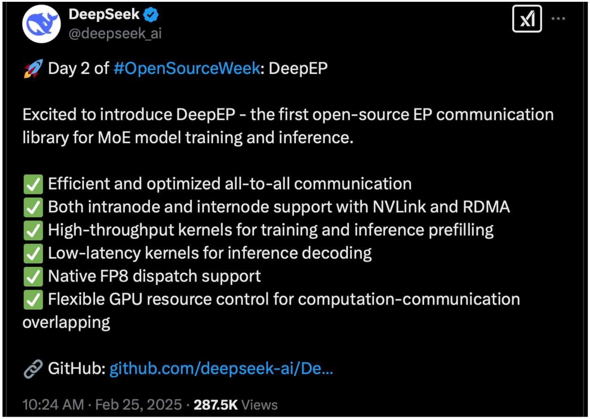
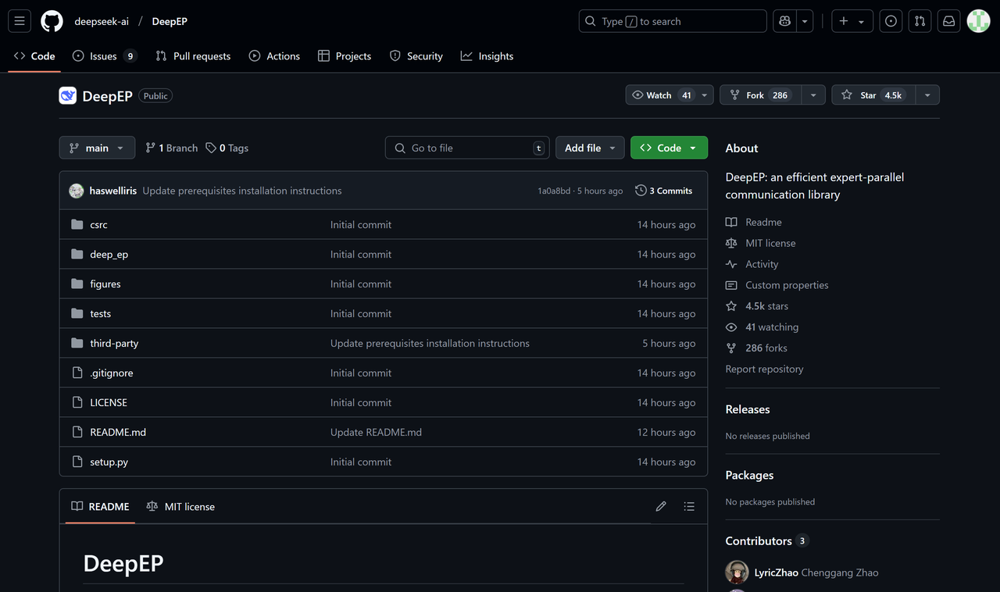
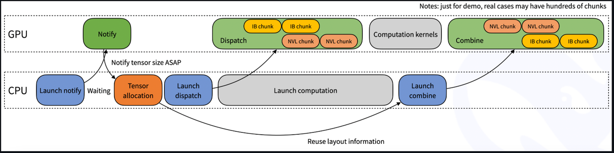
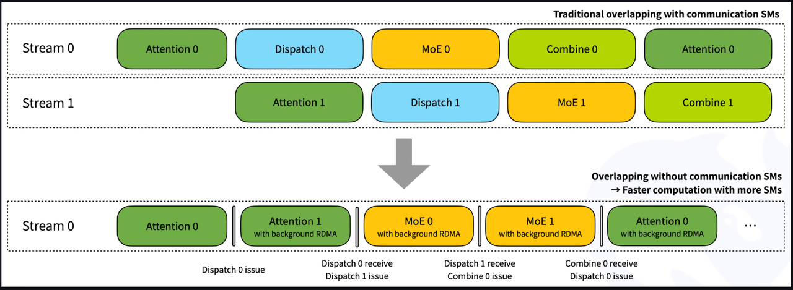

## 一、DeepEP项目介绍

### 1. DeepEP项目发布详情

&#x20;       当地时间2月25号，DeepSeek开源周第二天，正式发布DeepEP，一个MoE模型训练与推理内部通信加速库。



🚀 开源周第二天：DeepEP

很高兴介绍DeepEP——首个开源EP通信库，用于MoE模型的训练和推理。

✅ 高效且优化的全到全通信

✅ 支持节点内和节点间通信，兼容NVLink和RDMA

✅ 高吞吐量的内核，用于训练和推理前填充

✅ 低延迟内核，用于推理解码

✅ 原生FP8调度支持

✅ 灵活的GPU资源控制，支持计算与通信的重叠

DeepEP是一个为Mixture-of-Experts (MoE) 模型优化的通信库，提供高吞吐量和低延迟的GPU内核，用于MoE调度和合并操作。其主要特点包括：

* **高性能**：支持NVLink和RDMA进行节点内外通信，针对非对称域带宽转发优化了内核。

* **低精度操作**：包括FP8支持，用于高效计算。

* **低延迟推理**：提供使用纯RDMA的低延迟内核，减少推理解码的延迟。

* **通信与计算重叠**：引入了一种基于钩子的方式，不占用SM资源。

* **自适应路由与流量隔离**：支持自适应路由以实现低延迟内核，并通过虚拟通道进行流量隔离。

性能基准测试显示，尤其是在训练和推理前填充任务中，吞吐量有显著提高。该库要求使用Hopper GPU，Python 3.8+，CUDA 12.3+，PyTorch 2.1+，以及NVLink/RDMA网络。

为了获得最佳性能，用户应进行测试并使用自动调优配置。DeepEP在MIT许可证下发布，NVSHMEM相关代码除外。

### 2. DeepEP工作原理解析

&#x20;要理解DeepEP如何工作，可以将其比作一条繁忙的高速公路，其中汽车代表数据，城市象征计算机组件。如果没有精心规划的道路和交通规则，拥堵和延迟是不可避免的。DeepEP就像一套先进的高速公路系统，旨在最大化效率，确保数据流畅且快速地传输，具有多个关键特性。

* **优化的全到全通信**
  在Mixture of Experts (MoE)模型中，每个专家必须与其他所有专家交换数据。DeepEP使这一过程得以无瓶颈地进行，类似于为每辆车提供专属的高速车道。

* **支持节点内和节点间通信**
  节点内通信发生在同一计算机芯片内，类似于车辆在城市内行驶。DeepEP利用**NVLink**，NVIDIA的高速连接技术，加速这一过程。
  节点间通信发生在不同计算机或芯片之间，类似于汽车在城市间行驶。DeepEP利用\*\*RDMA（远程直接内存访问）\*\*直接在机器之间传输数据，减少延迟并优化性能。

* **高吞吐量、低延迟GPU内核**
  GPU驱动AI模型，但其效率取决于如何处理和交换数据。DeepEP集成了专门的**GPU内核**，最大化处理速度，将等待时间减少到几乎为零。

* **灵活的资源控制**
  DeepEP允许开发人员动态分配计算任务到不同的GPU，能够无缝适应不同的硬件配置。

通过在各个层面优化数据流，DeepEP确保即使是最复杂和分布式的AI系统也能平稳高效地运行。

## 二、DeepEP项目部署流程

* DeepEP项目官网：https://github.com/deepseek-ai/DeepEP



### 1. DeepEP功能详解

#### 1.1 DeepEP

&#x20;DeepEP是一个为Mixture-of-Experts (MoE) 和专家并行（EP）量身定制的通信库。它提供高吞吐量和低延迟的全到全GPU内核，也称为MoE调度和合并操作。该库还支持低精度操作，包括FP8。

&#x20;为了与DeepSeek-V3论文中提出的组限门控算法对齐，DeepEP提供了一套针对非对称域带宽转发优化的内核，例如将数据从NVLink域转发到RDMA域。这些内核提供高吞吐量，适用于训练和推理前填充任务。此外，它们支持SM（流式多处理器）数量控制。

&#x20;对于延迟敏感的推理解码，DeepEP包括一套低延迟内核，采用纯RDMA以最小化延迟。该库还引入了一种基于钩子的通信与计算重叠方法，不占用任何SM资源。

&#x20;注意：该库中的实现可能与DeepSeek-V3论文中的某些部分略有不同。

#### 1.2 **性能**

* **使用NVLink和RDMA转发的普通内核**

&#x20;我们在H800（最大NVLink带宽约为160 GB/s）上测试了普通内核，每个连接到CX7 InfiniBand 400 Gb/s RDMA网络卡（最大带宽约为50 GB/s）。并且我们遵循DeepSeek-V3/R1的预训练设置（每批次4096个token，7168个隐藏层，top-4组，top-8专家，FP8调度和BF16合并）。

| 类型  | 调度 #EP | 瓶颈带宽             | 合并 #EP | 瓶颈带宽             |
| --- | ------ | ---------------- | ------ | ---------------- |
| 节点内 | 8      | 153 GB/s（NVLink） | 8      | 158 GB/s（NVLink） |
| 节点间 | 16     | 43 GB/s（RDMA）    | 16     | 43 GB/s（RDMA）    |
| 节点间 | 32     | 44 GB/s（RDMA）    | 32     | 47 GB/s（RDMA）    |
| 节点间 | 64     | 46 GB/s（RDMA）    | 64     | 45 GB/s（RDMA）    |

* **使用纯RDMA的低延迟内核**

&#x20;我们在H800上测试了低延迟内核，每个连接到CX7 InfiniBand 400 Gb/s RDMA网络卡（最大带宽约为50 GB/s）。并且我们遵循典型的DeepSeek-V3/R1生产设置（每批次128个token，7168个隐藏层，top-8专家，FP8调度和BF16合并）。

| 调度 #EP | 延迟     | RDMA带宽  | 合并 #EP | 延迟     | RDMA带宽  |
| ------ | ------ | ------- | ------ | ------ | ------- |
| 8      | 163 us | 46 GB/s | 8      | 318 us | 46 GB/s |
| 16     | 173 us | 43 GB/s | 16     | 329 us | 44 GB/s |
| 32     | 182 us | 41 GB/s | 32     | 350 us | 41 GB/s |
| 64     | 186 us | 40 GB/s | 64     | 353 us | 41 GB/s |
| 128    | 192 us | 39 GB/s | 128    | 369 us | 39 GB/s |
| 256    | 194 us | 39 GB/s | 256    | 360 us | 40 GB/s |

#### 1.3 **普通内核（Normal Kernels）和低延迟内核（Low-latency Kernels）解释**

这两张表分别展示了DeepEP在不同类型内核下的性能表现：

1. **普通内核（Normal Kernels）**：

   * 这里的“普通内核”指的是使用NVLink和RDMA技术传输数据的常规内核，适用于**训练任务和推理前填充任务**（例如计算中间结果等）。

   * 第一张表中的数据展示了节点内和节点间通信的带宽，证明了通过**NVLink**和**RDMA**传输数据时，DeepEP能够提供足够的带宽支持这些计算任务，确保任务能够顺利进行而不出现瓶颈。

   * 例如，表格中\*\*节点内（Intranode）**的带宽为153 GB/s（NVLink），而**节点间（Internode）\*\*的带宽为43-47 GB/s（RDMA）。这说明，在不同硬件配置下，DeepEP能够有效地利用这些技术进行高吞吐量的数据传输。

2. **低延迟内核（Low-latency Kernels）**：

   * “低延迟内核”则专门针对推理任务进行优化，尤其是**推理解码**（inference decoding）。这种任务通常对延迟非常敏感，所以需要通过**RDMA**技术来最大限度地减少延迟。

   * 第二张表展示了不同数量专家（#EP）下的延迟表现，表格中的数据表明，DeepEP在使用纯RDMA的情况下能够实现非常低的延迟。例如，当调度8个专家时，延迟为**163微秒**；当调度128个专家时，延迟为**192微秒**。这个低延迟性能对于实时推理非常重要，尤其是在大规模分布式计算中。

**可行性证明**

这两张表的主要作用是展示基于**NVLink**和**RDMA**技术的DeepEP在实际任务中的**高性能**和**低延迟**，并**证明这项技术的可行性**，特别是在大规模分布式训练和推理中的应用。它们帮助我们理解：

* **可扩展性**：表格中展示的带宽和延迟随着调度专家数目的增加而变化，证明DeepEP能够在不同规模的任务下高效运行，且随着任务的扩展，性能表现仍然是可接受的。

* **优化效果**：通过这些测试数据，DeepEP展示了其优化过的内核能够显著提高数据传输速度并减少延迟，从而能够满足大规模AI模型训练和推理的需求。

#### 1.4 训练任务、推理前填充任务和推理解码概念解释

1. **训练任务（Training Task）**：

* 训练任务

* 指的是在深度学习过程中，用于训练神经网络模型的任务。这是一个非常消耗计算资源的过程，通常包括：

  * **前向传播（Forward Propagation）**：将输入数据通过神经网络传递，得到预测输出。

  * **损失计算（Loss Calculation）**：计算网络预测值和实际标签之间的误差。

  * **反向传播（Backward Propagation）**：通过误差反向传播更新模型的权重，使模型逐渐更好地进行预测。

  * **参数更新（Parameter Update）**：使用优化算法（如梯度下降）更新模型中的参数。

训练任务的目的是**让模型通过大量的训练数据学习模式和规律**，以便能够对新数据做出准确的预测。

2. **推理前填充任务（Inference Prefilling Task）**：

* **推理前填充任务**通常是在进行推理之前，准备模型输入数据的过程。比如，在做大规模的推理时，可能需要提前将一些数据加载到内存或者进行必要的预处理，以确保推理任务的高效执行。

* 这个过程通常涉及将模型需要的输入数据提前准备好，以减少实际推理过程中等待数据加载的时间。\*\*“前填充”\*\*就是提前填充数据，为推理任务做好准备。

3. **推理解码（Inference Decoding）**：

* **推理**是指用训练好的模型对新数据进行预测的过程，也就是模型应用于实际场景的阶段。例如，给定一张图片，模型推理出其中的物体类别；或者给定一段文本，模型生成对应的答案。

* **推理解码**特指推理过程中，模型根据输入数据（如一段文本）**生成输出结果**的过程。解码过程通常涉及将模型输出的向量或概率转化为实际的结果，例如将生成的文本序列从模型的内部表示解码成自然语言文本。

  * 例如，在自然语言处理任务中，如果模型是生成文本的模型（如GPT类模型），那么“解码”过程就是模型从内部的数值表示（如logits、概率分布等）生成最终的词语或句子。

  * 在图像生成模型中，解码可能是指将模型生成的特征向量转化为实际的图像。

### 2. DeepEP部署流程

#### 2.1 快速开始

\*\* 环境要求\*\*

* Hopper GPU（以后可能支持更多架构或设备）

* Python 3.8及以上版本

* CUDA 12.3及以上版本

* PyTorch 2.1及以上版本

* 用于节点内通信的NVLink

* 用于节点间通信的RDMA网络

* 下载并安装NVSHMEM依赖

DeepEP还依赖于我们修改过的NVSHMEM。请参考我们的[NVSHMEM安装指南](https://chatgpt.com/c/%E9%93%BE%E6%8E%A5)获取详细的安装说明。

#### 2.2 开发

1. **构建并创建SO文件的符号链接**

```bash
NVSHMEM_DIR=/path/to/installed/nvshmem python setup.py build
```

* 你可以根据自己的平台修改具体的SO文件名

```bash
ln -s build/lib.linux-x86_64-cpython-38/deep_ep_cpp.cpython-38-x86_64-linux-gnu.so
```

1. **运行测试用例**

```bash
python tests/test_intranode.py
python tests/test_internode.py
python tests/test_low_latency.py
```

#### 2.3 安装

```bash
NVSHMEM_DIR=/path/to/installed/nvshmem python setup.py install
```

然后，在你的Python项目中导入`deep_ep`，就可以开始使用了！

以下是这段内容的翻译：

#### 2.4 网络配置

DeepEP已经通过InfiniBand网络进行了充分测试。不过，理论上它也与\*\*RDMA over Converged Ethernet (RoCE)\*\*兼容。

#### 2.5 流量隔离

InfiniBand通过\*\*虚拟通道（VL）\*\*支持流量隔离。

为了避免不同类型流量之间的干扰，我们建议将不同的工作负载划分到不同的虚拟通道中，具体划分如下：

* 使用普通内核的工作负载

* 使用低延迟内核的工作负载

* 其他工作负载

对于DeepEP，你可以通过设置`NVSHMEM_IB_SL`环境变量来控制虚拟通道的分配。

#### 2.6 自适应路由

自适应路由是InfiniBand交换机提供的一种高级路由功能，能够均匀地将流量分配到多个路径上。目前，低延迟内核支持自适应路由，而普通内核则不支持（可能很快会加入此功能）。启用自适应路由用于普通节点间内核时，可能会导致死锁或数据损坏问题。

对于低延迟内核，启用自适应路由可以完全消除由于路由冲突导致的网络拥塞，但也会引入额外的延迟。我们建议在以下配置下以获得最佳性能：

* 在网络负载较重的环境中启用自适应路由

* 在网络负载较轻的环境中使用静态路由

#### 2.7 拥塞控制

由于我们在生产环境中未观察到显著的拥塞，因此**拥塞控制被禁用**。

以下是这段内容的翻译：

### 3. 在模型训练或推理前填充中的示例使用

普通内核可用于模型训练或推理前填充阶段（不包括反向传播部分），如下所示的示例代码。

```python
import torch
import torch.distributed as dist
from typing import List, Tuple, Optional, Union

from deep_ep import Buffer, EventOverlap

# 通信缓冲区（将在运行时分配）
_buffer: Optional[Buffer] = None

# 设置要使用的SM数量
# 注意：这是一个静态变量
Buffer.set_num_sms(24)

# 你可以在框架初始化时调用此函数
def get_buffer(group: dist.ProcessGroup, hidden_bytes: int) -> Buffer:
    global _buffer
    
    # 注意：你也可以用通过所有测试得出的自动调优结果替换`get_*_config`
    num_nvl_bytes, num_rdma_bytes = 0, 0
    for config in (Buffer.get_dispatch_config(group.size()), Buffer.get_combine_config(group.size())):
        num_nvl_bytes = max(config.get_nvl_buffer_size_hint(hidden_bytes, group.size()), num_nvl_bytes)
        num_rdma_bytes = max(config.get_rdma_buffer_size_hint(hidden_bytes, group.size()), num_rdma_bytes)

    # 如果缓冲区不存在或缓冲区大小不足，则分配缓冲区
    # 注意：网络的自适应路由配置**必须关闭**
    if _buffer is None or _buffer.group != group or _buffer.num_nvl_bytes < num_nvl_bytes or _buffer.num_rdma_bytes < num_rdma_bytes:
        _buffer = Buffer(group, num_nvl_bytes, num_rdma_bytes)
    return _buffer


def get_hidden_bytes(x: torch.Tensor) -> int:
    t = x[0] if isinstance(x, tuple) else x
    return t.size(1) * max(t.element_size(), 2)


def dispatch_forward(x: Union[torch.Tensor, Tuple[torch.Tensor, torch.Tensor]],
                     topk_idx: torch.Tensor, topk_weights: torch.Tensor,
                     num_experts: int, previous_event: Optional[EventOverlap] = None) -> \
        Tuple[Union[torch.Tensor, Tuple[torch.Tensor, torch.Tensor]], torch.Tensor, torch.Tensor, List, Tuple, EventOverlap]:
    # 注意：可选的`previous_event`意味着你希望将其作为分派内核的依赖项，它可能在通信与计算重叠时很有用。
    # 更多信息请参考`Buffer.dispatch`文档
    global _buffer

    # 在实际分派之前计算布局
    num_tokens_per_rank, num_tokens_per_rdma_rank, num_tokens_per_expert, is_token_in_rank, previous_event = \
        _buffer.get_dispatch_layout(topk_idx, num_experts,
                                    previous_event=previous_event, async_finish=True,
                                    allocate_on_comm_stream=previous_event is not None)
    # 执行MoE分派
    # 注意：CPU将等待GPU的信号到达，因此这与CUDA图不兼容
    # 对于更高级的用法，请参阅`dispatch`函数的文档
    recv_x, recv_topk_idx, recv_topk_weights, num_recv_tokens_per_expert_list, handle, event = \
        _buffer.dispatch(x, topk_idx=topk_idx, topk_weights=topk_weights,
                         num_tokens_per_rank=num_tokens_per_rank, num_tokens_per_rdma_rank=num_tokens_per_rdma_rank,
                         is_token_in_rank=is_token_in_rank, num_tokens_per_expert=num_tokens_per_expert,
                         previous_event=previous_event, async_finish=True,
                         allocate_on_comm_stream=True)
    # 关于事件管理，请参考`EventOverlap`类的文档
    return recv_x, recv_topk_idx, recv_topk_weights, num_recv_tokens_per_expert_list, handle, event


def dispatch_backward(grad_recv_x: torch.Tensor, grad_recv_topk_weights: torch.Tensor, handle: Tuple) -> \
        Tuple[torch.Tensor, torch.Tensor, EventOverlap]:
    global _buffer

    # MoE分派的反向过程实际上是一个合并操作
    # 对于更高级的用法，请参阅`combine`函数的文档
    combined_grad_x, combined_grad_recv_topk_weights, event = \
        _buffer.combine(grad_recv_x, handle, topk_weights=grad_recv_topk_weights, async_finish=True)

    # 关于事件管理，请参考`EventOverlap`类的文档
    return combined_grad_x, combined_grad_recv_topk_weights, event


def combine_forward(x: torch.Tensor, handle: Tuple, previous_event: Optional[EventOverlap] = None) -> \
        Tuple[torch.Tensor, EventOverlap]:
    global _buffer

    # 执行MoE合并
    # 对于更高级的用法，请参阅`combine`函数的文档
    combined_x, _, event = _buffer.combine(x, handle, async_finish=True, previous_event=previous_event,
                                           allocate_on_comm_stream=previous_event is not None)

    # 关于事件管理，请参考`EventOverlap`类的文档
    return combined_x, event


def combine_backward(grad_combined_x: Union[torch.Tensor, Tuple[torch.Tensor, torch.Tensor]],
                     handle: Tuple, previous_event: Optional[EventOverlap] = None) -> \
        Tuple[Union[torch.Tensor, Tuple[torch.Tensor, torch.Tensor]], EventOverlap]:
    global _buffer

    # MoE合并的反向过程实际上是一个分派操作
    # 对于更高级的用法，请参阅`combine`函数的文档
    grad_x, _, _, _, _, event = _buffer.dispatch(grad_combined_x, handle=handle, async_finish=True,
                                                 previous_event=previous_event,
                                                 allocate_on_comm_stream=previous_event is not None)

    # 关于事件管理，请参考`EventOverlap`类的文档
    return grad_x, event
```

另外，分派函数内部，我们可能不知道当前rank需要接收多少个tokens。因此，会涉及到一个隐式的CPU等待GPU接收计数信号的过程，如下图所示。



### 4. 在推理解码中的示例使用

低延迟内核可以用于推理解码阶段，如下面的示例代码所示。

```python
import torch
import torch.distributed as dist
from typing import Tuple, Optional

from deep_ep import Buffer

# 通信缓冲区（将在运行时分配）
# 注意：低延迟内核没有SM控制API
_buffer: Optional[Buffer] = None


# 你可以在框架初始化时调用此函数
def get_buffer(group: dist.ProcessGroup, num_max_dispatch_tokens_per_rank: int, hidden: int, num_experts: int) -> Buffer:
    # 注意：低延迟模式会比普通模式消耗更多空间
    # 因此我们建议`num_max_dispatch_tokens_per_rank`（解码引擎中的实际批量大小）应小于256
    global _buffer
    num_rdma_bytes = Buffer.get_low_latency_rdma_size_hint(num_max_dispatch_tokens_per_rank, hidden, group.size(), num_experts)

    # 如果缓冲区不存在或缓冲区大小不足，则分配缓冲区
    if _buffer is None or _buffer.group != group or not _buffer.low_latency_mode or _buffer.num_rdma_bytes < num_rdma_bytes:
        # 注意：为了获得最佳性能，QP数量**必须**等于本地专家的数量
        assert num_experts % group.size() == 0
        _buffer = Buffer(group, 0, num_rdma_bytes, low_latency_mode=True, num_qps_per_rank=num_experts // group.size())
    return _buffer


def low_latency_dispatch(hidden_states: torch.Tensor, topk_idx: torch.Tensor, num_max_dispatch_tokens_per_rank: int, num_experts: int):
    global _buffer

    # 执行MoE分派，兼容CUDA图（但是你可能需要在重放时恢复一些缓冲区状态）
    recv_hidden_states, recv_expert_count, handle, event, hook = \
        _buffer.low_latency_dispatch(hidden_states, topk_idx, num_max_dispatch_tokens_per_rank, num_experts,
                                     async_finish=False, return_recv_hook=True)

    # 注意：实际的张量只有在你调用`hook()`时才会接收，
    # 它对双批重叠很有用，但**没有任何SM占用**。
    # 如果你不想重叠，请设置`return_recv_hook=False`
    # 之后，你可以使用我们的GEMM库来用这种特定格式进行计算
    return recv_hidden_states, recv_expert_count, handle, event, hook


def low_latency_combine(hidden_states: torch.Tensor,
                        topk_idx: torch.Tensor, topk_weights: torch.Tensor, handle: Tuple):
    global _buffer

    # 执行MoE合并，兼容CUDA图（但你可能需要在重放时恢复一些缓冲区状态）
    combined_hidden_states, event_overlap, hook = \
        _buffer.low_latency_combine(hidden_states, topk_idx, topk_weights, handle,
                                    async_finish=False, return_recv_hook=True)

    # 注意：与分派内核中描述的行为相同
    return combined_hidden_states, event_overlap, hook
```

对于双微批重叠，您可以参考以下图示。通过我们的接收钩子接口，RDMA网络流量在后台发生，而不会占用任何GPU SMs用于计算部分。但是请注意，重叠的部分可以进行调整，即注意力/分派/MoE/合并这四个部分的执行时间可能并不完全相同。您可以根据工作负载的需求调整阶段设置。



* 注意事项

为了实现极限性能，我们发现并使用了一条文档外的PTX指令：`ld.global.nc.L1::no_allocate.L2::256B`。这条指令会导致未定义行为：使用非一致性只读PTX修饰符`.nc`访问GPU易失性内存。但经过测试，在Hopper架构上使用`.L1::no_allocate`时，其正确性能够得到保证，且性能会大幅提升。如果您在其他平台上发现内核无法正常工作，可以在`setup.py`中添加`DISABLE_AGGRESSIVE_PTX_INSTRS=1`来禁用此指令，或提交问题报告。

为了在您的集群上获得更好的性能，建议运行所有测试并使用最佳的自动调优配置。默认配置是基于DeepSeek的内部集群进行优化的。


**更多大模型技术内容学习**

**扫码添加助理英英，回复“大模型”，了解更多大模型技术详情哦👇**


**扫码回复“入群”**，即可加入**大模型技术社群：海量硬核独家技术`干货内容`+无门槛`技术交流`！**
