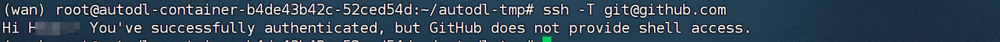

**DeepGEMM**

项目地址：https://github.com/deepseek-ai/DeepGEMM


DeepGEMM 是一个专为清晰高效的 FP8 一般矩阵乘法（GEMM，General Matrix Multiply）设计的库，支持精细的缩放功能，正如 DeepSeek-V3 中所提议的那样。它支持常规 GEMM 和 Mix-of-Experts (MoE) 分组 GEMM。该库使用 CUDA 编写，在安装时无需编译，通过使用轻量级的即时编译（JIT）模块，在运行时编译所有内核。

目前，DeepGEMM 仅支持 NVIDIA Hopper 张量核心。为了解决 FP8 张量核心累加精度不足的问题，它采用了 CUDA 核心的两级累加（提升）。尽管它借鉴了 CUTLASS 和 CuTe 中的一些概念，但避免了对它们的模板或代数的过度依赖。相反，库的设计简洁，核心内核功能只有大约 300 行代码。这使得它成为学习 Hopper FP8 矩阵乘法和优化技术的清晰而易于访问的资源。

1. **CUTLASS**（CUDA Templates for Linear Algebra Subroutines and Solvers）

* **高效的矩阵乘法实现**：CUTLASS 提供了针对不同数据类型（包括浮点数、整数等）的矩阵乘法实现，支持 FP16、FP32、INT8 等。

* **灵活的设计**：使用模板编程方式提供可定制的矩阵运算，用户可以根据具体需求调整性能。

* **充分利用 NVIDIA GPU 特性**：通过利用 **Tensor Cores**、共享内存和寄存器等 GPU 资源，CUTLASS 可以大幅度提高矩阵计算的性能。

* **支持各种计算模式**：包括标准的矩阵乘法、批量矩阵乘法、向量和矩阵运算等。

2. **CuTe**（CUDA Tensor Expression）

* **优化的张量运算**：CuTe 旨在提供高效的张量计算，特别是针对深度学习中的矩阵和张量操作进行优化。

* **与 CUTLASS 配合使用**：CuTe 可以与 CUTLASS 配合使用，借助 CUTLASS 提供的底层高性能矩阵运算，CuTe 可以让开发者更容易构建复杂的张量操作。

* **简化开发流程**：CuTe 提供了一些高级抽象，能够简化张量操作的开发，提高代码的可读性和可维护性。

尽管设计简洁，DeepGEMM 在各种矩阵形状下的性能能够与专家调优的库相媲美，甚至超过它们。

**性能**

我们在 H800 上使用 NVCC 12.8 测试了 DeepSeek-V3/R1 推理中可能使用的所有形状（包括预填充和解码，但不包括张量并行性）。所有加速指标均是与我们基于 CUTLASS 3.6 的内部优化实现进行比较计算的。

DeepGEMM 在某些形状上表现不太理想，如果您有兴趣，欢迎提出优化 PR。

**常规 GEMM（用于密集模型）**

| M    | N     | K     | 计算量         | 内存带宽      | 加速比  |
| ---- | ----- | ----- | ----------- | --------- | ---- |
| 64   | 2112  | 7168  | 206 TFLOPS  | 1688 GB/s | 2.7x |
| 64   | 24576 | 1536  | 289 TFLOPS  | 2455 GB/s | 1.7x |
| 64   | 32768 | 512   | 219 TFLOPS  | 2143 GB/s | 1.8x |
| 64   | 7168  | 16384 | 336 TFLOPS  | 2668 GB/s | 1.4x |
| 64   | 4096  | 7168  | 287 TFLOPS  | 2320 GB/s | 1.4x |
| 64   | 7168  | 2048  | 295 TFLOPS  | 2470 GB/s | 1.7x |
| 128  | 2112  | 7168  | 352 TFLOPS  | 1509 GB/s | 2.4x |
| 128  | 24576 | 1536  | 535 TFLOPS  | 2448 GB/s | 1.6x |
| 128  | 32768 | 512   | 358 TFLOPS  | 2103 GB/s | 1.5x |
| 128  | 7168  | 16384 | 645 TFLOPS  | 2604 GB/s | 1.4x |
| 128  | 4096  | 7168  | 533 TFLOPS  | 2221 GB/s | 2.0x |
| 128  | 7168  | 2048  | 510 TFLOPS  | 2277 GB/s | 1.7x |
| 4096 | 2112  | 7168  | 1058 TFLOPS | 527 GB/s  | 1.1x |
| 4096 | 24576 | 1536  | 990 TFLOPS  | 786 GB/s  | 1.0x |
| 4096 | 32768 | 512   | 590 TFLOPS  | 1232 GB/s | 1.0x |
| 4096 | 7168  | 16384 | 1358 TFLOPS | 343 GB/s  | 1.2x |
| 4096 | 4096  | 7168  | 1304 TFLOPS | 500 GB/s  | 1.1x |
| 4096 | 7168  | 2048  | 1025 TFLOPS | 697 GB/s  | 1.1x |

* **矩阵 A** 的维度是 **M x K**

* **矩阵 B** 的维度是 **K x N**

1. **M（行数）**：矩阵 **A** 的行数，也就是结果矩阵 **C** 的行数。

2. **K（内积维度）**：矩阵 **A** 的列数和矩阵 **B** 的行数，矩阵相乘时，内积的维度，这两个数必须相等才能进行乘法操作。

3. **N（列数）**：矩阵 **B** 的列数，也就是结果矩阵 **C** 的列数。

* **矩阵 A** 是一个 **(3x5)** 的矩阵（即3行5列）

* **矩阵 B** 是一个 **(5x2)** 的矩阵（即5行2列）

* **M** 可能代表 **左边矩阵** 的行数（例如，批处理中的样本数量），

* **N** 代表 **右边矩阵** 的列数（比如输出的维度），

* **K** 代表 **内积维度**，也就是 **A** 的列数与 **B** 的行数。

1. **M、N、K 和注意力机制中的关系**

* **Q**（查询矩阵，Query）尺寸是 **(batch\_size, num\_queries, embedding\_size)**

* **K**（键矩阵，Key）尺寸是 **(batch\_size, num\_keys, embedding\_size)**

* **V**（值矩阵，Value）尺寸是 **(batch\_size, num\_keys, value\_size)**

* **M**：对应的是 **num\_queries**（查询的数量），在推理时，这通常是每次输入的 token 数量。

* **N**：对应的是 **num\_keys**（键的数量），在推理时，这通常是整个上下文中存在的 token 数量。

* **K**：对应的是 **embedding\_size**（嵌入维度），即每个 token 的表示长度。注意，这个维度通常在模型设计时是固定的。

2. **KVCache 和 M、N、K 的对应**

* **KVCache** 中存储的是已经计算过的键值对（K、V），通常是 **(num\_keys, embedding\_size)**。

* 当新的查询（Q）进入时，模型只需要计算 **Q × K^T**，然后基于计算结果从缓存中获取相应的 **V**，从而大大提升推理速度。

3. **在 DeepGEMM 中的优化**

* **M** 可能对应于一个批次中要处理的查询数（例如在 Transformer 中的单个输入序列长度或批处理大小），

* **N** 对应于缓存中的键值对数量（即上下文中的 token 数量），

* **K** 对应的是每个 token 的嵌入维度（即 **K** 和 **V** 的维度）。

**MoE 模型的分组 GEMM（连续布局）**

| #Groups | 每组 M | N    | K    | 计算量         | 内存带宽     | 加速比  |
| ------- | ---- | ---- | ---- | ----------- | -------- | ---- |
| 4       | 8192 | 4096 | 7168 | 1297 TFLOPS | 418 GB/s | 1.2x |
| 4       | 8192 | 7168 | 2048 | 1099 TFLOPS | 681 GB/s | 1.2x |
| 8       | 4096 | 4096 | 7168 | 1288 TFLOPS | 494 GB/s | 1.2x |
| 8       | 4096 | 7168 | 2048 | 1093 TFLOPS | 743 GB/s | 1.1x |

**MoE 模型的分组 GEMM（掩码布局）**

| #Groups | 每组 M | N    | K    | 计算量         | 内存带宽      | 加速比  |
| ------- | ---- | ---- | ---- | ----------- | --------- | ---- |
| 1       | 1024 | 4096 | 7168 | 1233 TFLOPS | 924 GB/s  | 1.2x |
| 1       | 1024 | 7168 | 2048 | 925 TFLOPS  | 968 GB/s  | 1.2x |
| 2       | 512  | 4096 | 7168 | 1040 TFLOPS | 1288 GB/s | 1.2x |
| 2       | 512  | 7168 | 2048 | 916 TFLOPS  | 1405 GB/s | 1.2x |
| 4       | 256  | 4096 | 7168 | 932 TFLOPS  | 2064 GB/s | 1.1x |
| 4       | 256  | 7168 | 2048 | 815 TFLOPS  | 2047 GB/s | 1.2x |

**快速开始**

**要求**

* Hopper 架构的 GPU，必须支持 sm\_90a

* Python 3.8 或以上版本

* CUDA 12.3 或以上版本

  * 为了获得最佳性能，我们强烈推荐使用 12.8 或以上版本

* PyTorch 2.1 或以上版本

* CUTLASS 3.6 或以上版本（可以通过 Git 子模块克隆）

**开发**

* 必须克隆子模块

```bash
git clone --recursive git@github.com:deepseek-ai/DeepGEMM.git
```


***

* 若出现`fatal: Could not read from remote repository.`问题，该错误通常是由于 Git 使用 SSH 方式克隆仓库时，无法验证你的 SSH 公钥所导致的。错误信息显示为 `Permission denied (publickey)`，意味着 GitHub 无法识别你本地的 SSH 密钥。

* 解决方法：

  1. **确保你已配置 SSH 密钥：**

     * 你需要在本地生成一个 SSH 密钥，并将公钥添加到 GitHub 账户中。

     * 生成 SSH 密钥的命令：

     ```bash
     ssh-keygen -t rsa -b 4096 -C "your_email@example.com"
     ```

     * 然后按提示生成密钥。

  2. **将 SSH 公钥添加到 GitHub：**

     * 获取公钥内容：

     ```bash
     cat ~/.ssh/id_rsa.pub
     ```

     * 复制输出的公钥。

     

     * 登录到 GitHub，进入 **Settings** → **SSH and GPG keys** → **New SSH key**，然后粘贴公钥并保存。

     

     * &#x20;

     

     * &#x20;

     

     * &#x20;

     

  3. **检查你的 SSH 连接：**

     * 验证是否能够成功连接到 GitHub：

     ```bash
     ssh -T git@github.com
     ```

     * 如果成功，你会看到类似于：

     ```bash
     Hi <username>! You've successfully authenticated, but GitHub does not provide shell access.
     ```

     

* 然后再运行`git clone`命令即可。

***

* 为第三方（CUTLASS 和 CuTe）包含目录创建符号链接

```bash
cd ./DeepGEMM
python setup.py develop
```


* 测试 JIT 编译

```bash
python tests/test_jit.py
```


* 测试所有 GEMM 实现（常规、连续分组和掩码分组）

```bash
python tests/test_core.py
```


**安装**

```bash
python setup.py install
```

然后，在你的 Python 项目中导入 `deep_gemm`，享受使用吧！

**接口**

**通知**

本库仅包含 GEMM 内核。它要求左侧矩阵（LHS）缩放因子必须进行 TMA 对齐并转置，同时仅支持 NT 格式（未转置的 LHS 和转置的 RHS）。对于转置或其他 FP8 类型转换操作，请独立实现或融合到前置内核中。虽然本库提供了一些简单的 PyTorch 工具函数，但这些可能会导致性能下降，因此我们的主要关注点是优化 GEMM 内核本身。

**常规密集型 GEMM（非分组）**

要执行基本的非分组 FP8 GEMM，请调用 `deep_gemm.gemm_fp8_fp8_bf16_nt` 函数。更多详情，请参考函数文档。

**分组 GEMM（连续布局）**

与 CUTLASS 中的传统分组 GEMM 不同，DeepGEMM 仅对 M 轴进行分组，而 N 和 K 必须保持固定。该设计专为 MoE 模型中的专家共享相同形状的场景而量身定制。

对于训练的前向传播或推理的预填充，在每个专家可能处理不同数量的 token 的情况下，我们将这些 token 拼接成一个单一的张量，称为“连续”布局。请注意，每个专家段必须与 GEMM 的 M 块大小对齐（`get_m_alignment_for_contiguous_layout()`）。

有关更多信息，请参阅 `m_grouped_gemm_fp8_fp8_bf16_nt_contiguous` 函数文档。

**分组 GEMM（掩码布局）**

在推理解码阶段，当启用 CUDA 图且 CPU 无法得知每个专家接收的 token 数量时，我们支持掩码分组 GEMM。通过提供掩码张量，内核仅计算有效部分。

为此，请使用 `m_grouped_gemm_fp8_fp8_bf16_nt_masked`，并参阅相关文档。一个示例用法是使用 DeepEP 低延迟内核的输出作为输入。

**工具函数**

除了上述内核外，本库还提供了一些工具函数：

* `deep_gemm.set_num_sms`: 设置使用的最大 SM 数量

* `deep_gemm.get_num_sms`: 获取当前 SM 最大数量

* `deep_gemm.get_m_alignment_for_contiguous_layout`: 获取分组连续布局的组级对齐要求

* `deep_gemm.get_tma_aligned_size`: 获取所需的 TMA 对齐大小

* `deep_gemm.get_col_major_tma_aligned_tensor`: 获取列主序 TMA 对齐的张量

本库还提供了一些环境变量，可能会对你有所帮助：

* `DG_CACHE_DIR`: 字符串，存储编译内核的缓存目录，默认为 `$HOME/.deep_gemm`

* `DG_NVCC_COMPILER`: 字符串，指定的 NVCC 编译器路径；默认为从 `torch.utils.cpp_extension.CUDA_HOME` 查找

* `DG_DISABLE_FFMA_INTERLEAVE`: 0 或 1，禁用 FFMA 交错优化

* `DG_PTXAS_VERBOSE`: 0 或 1，显示详细的 PTXAS 编译器输出

* `DG_PRINT_REG_REUSE`: 0 或 1，打印 FFMA 交错的详细信息

* `DG_JIT_PRINT_NVCC_COMMAND`: 0 或 1，打印 NVCC 编译命令

* `DG_JIT_DEBUG`: 0 或 1，打印更多调试信息

有关更多示例和详细信息，请参考测试代码或查看相应的 Python 文档。

**优化**

我们使用 🐳 标记了从 CUTLASS 中排除的技术。

**持久化 warp 专化**

按照 CUTLASS 设计，DeepGEMM 中的内核采用 warp 专化，使数据移动、张量核心 MMA 指令和 CUDA 核心的累加操作能够重叠。以下是一个简化的图示，说明这一过程：


**Hopper TMA 特性**

Tensor Memory Accelerator（TMA）是 Hopper 架构引入的一项新硬件特性，旨在加速异步数据传输。具体来说，我们使用 TMA 进行：

* TMA 加载 LHS、LHS 缩放因子和 RHS 矩阵

* TMA 存储输出矩阵

* TMA 多播（仅限 LHS 矩阵）

* TMA 描述符预取

**常见的细节优化**

* 利用 stmatrix PTX 指令

* 针对不同 warpgroups 的寄存器计数控制

* 尽可能重叠操作，例如重叠 TMA 存储和非 TMA RHS 缩放因子加载 🐳

* 统一且优化的块调度器

  * 所有非分组和分组内核共用一个调度器

* 光栅化以增强 L2 缓存重用

* 完全 JIT 设计 🐳

**完全 JIT 设计**

DeepGEMM 采用完全的 Just-In-Time (JIT) 设计，在安装时无需编译。所有内核都在运行时使用轻量级 JIT 实现进行编译。这种方法提供了几个优势：

* GEMM 形状、块大小和管道阶段的数量作为编译时常量处理

* 节省寄存器

* 编译器可能会做更多优化

* 自动选择块大小、warpgroups 数量、最优管道阶段和 TMA 集群大小

  * 但没有自动调优，最优的选择是通过确定性方式选择的

* 完全展开 MMA 管道，为编译器提供更多优化机会

  * 对于小形状尤其重要

  * 详情请参考内核文件中的 `launch_k_iterations`

总体来说，JIT 显著提高了小形状的性能，类似于 Triton 编译器的方法。

**非对齐的块大小 🐳**

对于某些形状，块大小对齐到 2 的幂可能会导致 SM 的利用率不足。例如，在 M=256，N=7168 时，典型的块大小分配 `BLOCK_M=128`，`BLOCK_N=128` 会导致仅有 (256 / 128) \* (7168 / 128) = 112 个 SM 被利用。为了解决这个问题，我们支持像 112 这样的非对齐块大小，从而使得 (256 / 128) \* (7168 / 112) = 128 个 SM 能够在这种情况下工作。将这种技术与精细化缩放结合使用需要精心优化，但最终会带来性能提升。

**FFMA SASS 交错 🐳**

我们观察到，在 NVCC 12.2 和 12.3 之间，CUTLASS FP8 内核的性能有所改善。通过比较编译后的 SASS，我们发现一系列 FADD 指令中的一个位在交错模式下被翻转。通过参考一些开源 CUDA 汇编实现，我们发现该位控制 yield，这可能会增强 warp 层级的并行性（仅为猜测，意味着让当前的 warp 退出，允许其他 warp 工作）。

为了利用这一点，我们开发了一个类似的脚本来修改编译二进制中的 FFMA 指令。除了简单地修改 yield 位外，我们还翻转了 reuse 位（如果 warp 被挂起，寄存器不能被重用）。这种调整通过创造更多重叠 MMA 指令与累加 FFMA 指令的机会，提升了性能（在某些情况下提升超过 10%）。


**更多大模型技术内容学习**

**扫码添加助理英英，回复“大模型”，了解更多大模型技术详情哦👇**


**扫码回复“入群”**，即可加入**大模型技术社群：海量硬核独家技术`干货内容`+无门槛`技术交流`！**
