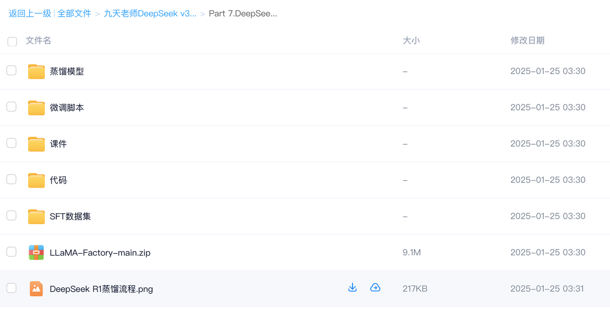
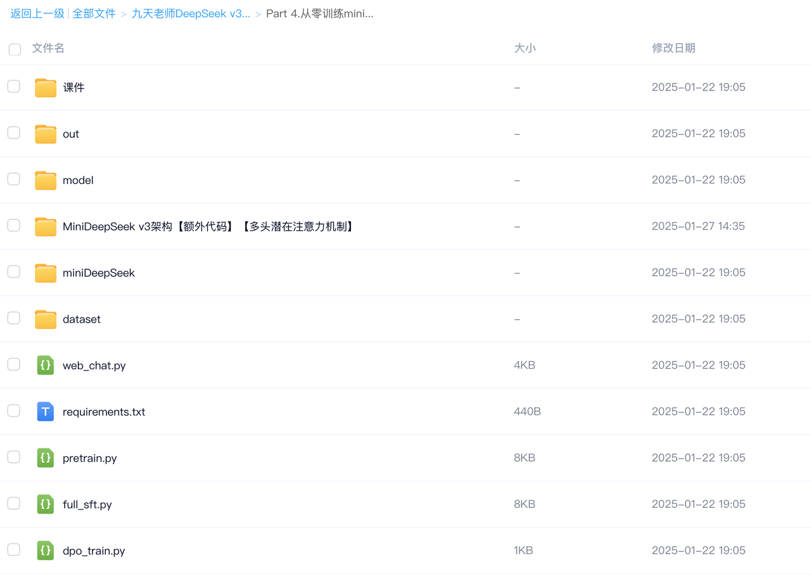

  <h1>DeepSeek系列专栏合集</h1>

> DeepSeek系列教学视频持续更新中，数据、代码、权重等全公开！需要的小伙伴可添加⬇️助理，领取完整学习资料哦～

***

✅**DeepSeek R1 入门介绍&本地部署**

* [零基础揭秘DeepSeek R1训练流程！多阶段GRPO强化学习训练、模型蒸馏技术揭秘！（视频）](https://www.bilibili.com/video/BV1ESAMepE4K)

* [DeepSeek R1全面解析！小尺寸推理模型企业可本地部署（视频）](https://www.bilibili.com/video/BV1UBwbe4E1D)

⭐️[DeepSeek v3 API接入指南（课件）](https://kq4b3vgg5b.feishu.cn/wiki/IEM3w5KgWilQcHklTVfcgH8Pn9e?from=from_copylink)

* [DeepSeek R1 API调用实战｜自动编程、自动机器学习项目入门实战（视频）](https://www.bilibili.com/video/BV1UyfGYqE28)

⭐️[DeepSeek R1本地部署与调用方法（课件）](https://kq4b3vgg5b.feishu.cn/wiki/XGnowJW70ikV6hkXzbhcLWYGnBc?from=from_copylink)

* [DeepSeek R1&蒸馏模型本地部署指南丨DeepSeek R1离线调用（视频）](https://www.bilibili.com/video/BV1UofEYXEtv)

✅ **DeepSeek R1 企业级部署**

⭐️[DeepSeek R1 + Open-Webui多功能企业级部署实战（课件）](https://kq4b3vgg5b.feishu.cn/wiki/Kw00w4KfCin7sRkAJjtcOYmWnYs?from=from_copylink)

✅ **DeepSeek R1 高性能部署实战**

* [独家KTransformers技术实战！单卡4090运行DeepSeek满血版，独家FastAPI脚本编写（视频）](https://www.bilibili.com/video/BV1kyAke9EBA)

⭐️[DeepSeek-R1高性能部署实战(课件)](https://kq4b3vgg5b.feishu.cn/wiki/HOrmwchRGi7WQBk5eBCcZFTsn3I?from=from_copylink)

✅ **DeepSeek R1 GRPO算法实战**

* [DeepSeek R1论文逐段精读与训练流程代码复现｜GRPO原理介绍与代码复现（视频）](https://www.bilibili.com/video/BV1n9NfezErB)

⭐️[DeepSeek R1 GRPO算法实战（课件）](https://kq4b3vgg5b.feishu.cn/wiki/CwOWwlFP7iIds1kNQRucLsQ9nlf?from=from_copylink)

✅ **DeepSeek R1 模型蒸馏技术详解**

* [模型蒸馏快速入门丨从零训练DeepSeek R1 Distill模型（视频）](https://www.bilibili.com/video/BV1X1FoeBEgW)

⭐️[DeepSeek R1蒸馏模型部署与调用（课件）](https://kq4b3vgg5b.feishu.cn/wiki/O8gyw6iiGi7oO5kOOW5cH9uYnp4?from=from_copylink)

⭐️[DeepSeek-R1蒸馏1.5B Qwen模型调用流程（课件）](https://kq4b3vgg5b.feishu.cn/wiki/LEUDw75JpiPLCGkUNR2cgfMKnJc?from=from_copylink)

✅ **DeepSeek R1 本地知识库问答**

* [DeepSeek R1搭建本地知识库问答系统（视频）](https://www.bilibili.com/video/BV12qF2ePEDa/?)

⭐️[DeepSeek R1本地知识库问答快速实战（课件）](https://kq4b3vgg5b.feishu.cn/wiki/Fr4rwCLImivkr9ka6pdcrb0Anjf)

✅**&#x20;DeepSeek R1 高效微调**

⭐️[DeepSeek R1 Distill高效微调入门实战（课件）](https://kq4b3vgg5b.feishu.cn/wiki/WWzZwHVNei8zsWkieJ3cyHzWnFe?from=from_copylink)

✅ **DeepSeek Janus 本地部署**

* [Janus Pro本地部署与调用实战！（视频）](https://www.bilibili.com/video/BV1ZqFse9Egc/)

* [Janus Pro入门介绍丨文生图+图像识别（视频）](https://www.bilibili.com/video/BV15kFseHEQ5)

⭐️[DeepSeek Janus本地部署与调用实战（课件 ）](https://kq4b3vgg5b.feishu.cn/wiki/VSWfwG50ji56fokzU6wcCgvKnHd)

⭐️[Janus Pro本地调用指南(课件)](https://kq4b3vgg5b.feishu.cn/wiki/CRdFw7KBJirJgCkEjUtcrA8knhd)

✅ **DeepSeek v3 模型训练**

* [手动复现DeepSeek v3训练过程丨模型预训练+全量指令微调+DPO强化学习微调（视频）](https://www.bilibili.com/video/BV1KtwueYE54)

⭐️[MiniDeepSeek分词器训练流程（课件）](https://kq4b3vgg5b.feishu.cn/wiki/ZrkLwOqlzikogykSsmjcRXpUnLh?from=from_copylink)

⭐️[MiniDeepSeek预训练（课件）](https://kq4b3vgg5b.feishu.cn/wiki/UtWZwlXFFiCss4krvt0c5JCWnrg?from=from_copylink)

⭐️[MiniDeepSeek后训练：全量指令微调+DPO强化学习微调（课件）](https://kq4b3vgg5b.feishu.cn/wiki/DVxAwaZTjib2JhkodoAcw7YonHf?from=from_copylink)

✅ **DeepSeek v3 入门介绍**

* [【深度】DeepSeek v3性能评测与技术解析（视频）](https://www.bilibili.com/video/BV18Ccie5Esy)

* [DeepSeek-v3调用指南与Function calling技术实战（视频）](https://www.bilibili.com/video/BV1JuwVewELc)

⭐️[DeepSeek v3 API接入指南（课件）](https://kq4b3vgg5b.feishu.cn/wiki/IEM3w5KgWilQcHklTVfcgH8Pn9e?from=from_copylink)

⭐️[DeepSeek v3 Function calling（课件）](https://kq4b3vgg5b.feishu.cn/wiki/L2GzwPrOHi1HykkFTY3cXGH2nJe?from=from_copylink)

⭐️[Open-WebUI接入DeepSeek v3流程详解（课件）](https://kq4b3vgg5b.feishu.cn/wiki/UDphw0VWpi3QlikHuSwcl9bZnmg?from=from_copylink)

✅ **DeepSeek v3 本地部署**

⭐️[DeepSeek v3本地部署流程（课件）](https://kq4b3vgg5b.feishu.cn/wiki/Ma4awZJWGifP0pkNkIxcV3uTnVf?from=from_copylink)

* [DeepSeek v3本地部署与transformer库调用流程（视频）](https://www.bilibili.com/video/BV1jjwVe4EKn)

✅ **DeepSeek v3+GraphRAG实战**

* [DeepSeek v3+GraphRAG知识谱图检索增强技术实战（视频）](https://www.bilibili.com/video/BV1Xwc6eoEW5)

⭐️[DeepSeek借助GraphRAG搭建知识库问答机器人（课件）](https://kq4b3vgg5b.feishu.cn/wiki/JPQWw4oZFiNSIrkgsk5chSqfnlf?from=from_copylink)

✅ **DeepSeek v3 智能体开发**

* [DeepSeek v3借助Swaem搭建Multi-Agent技术入门实战（视频）](https://www.bilibili.com/video/BV1T8czeSEf1)

⭐️[DeepSeek借助Swarm搭建Multi-Agent多代理智能体（课件）](https://kq4b3vgg5b.feishu.cn/wiki/J5dqwMC1civtduk6AwwcrKkwnzh?from=from_copylink)

