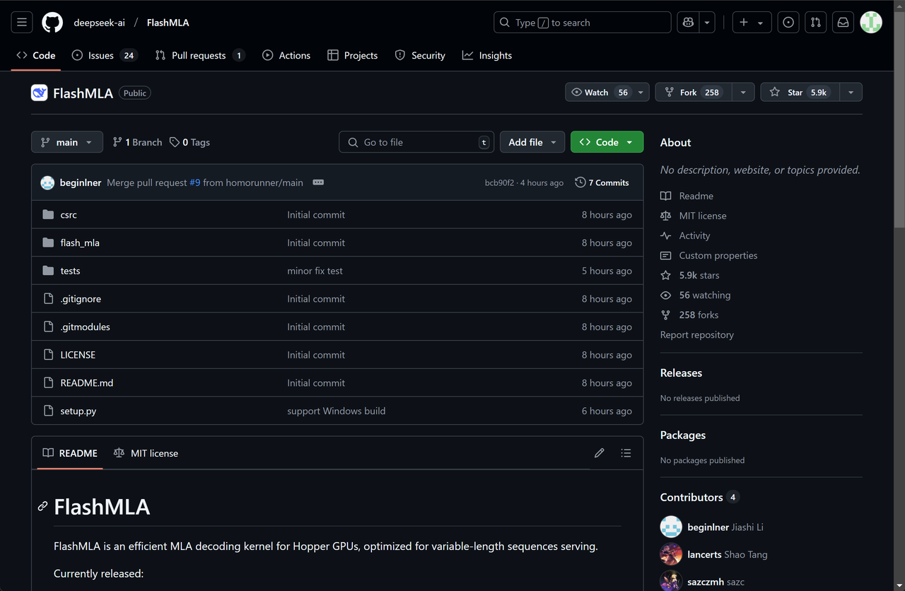
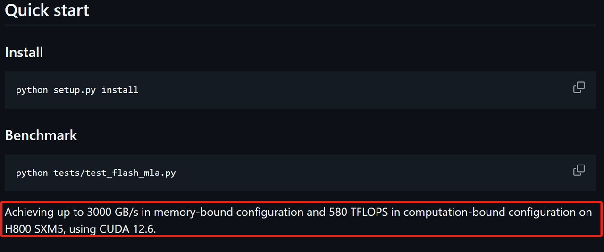
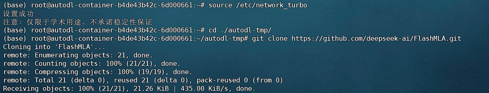
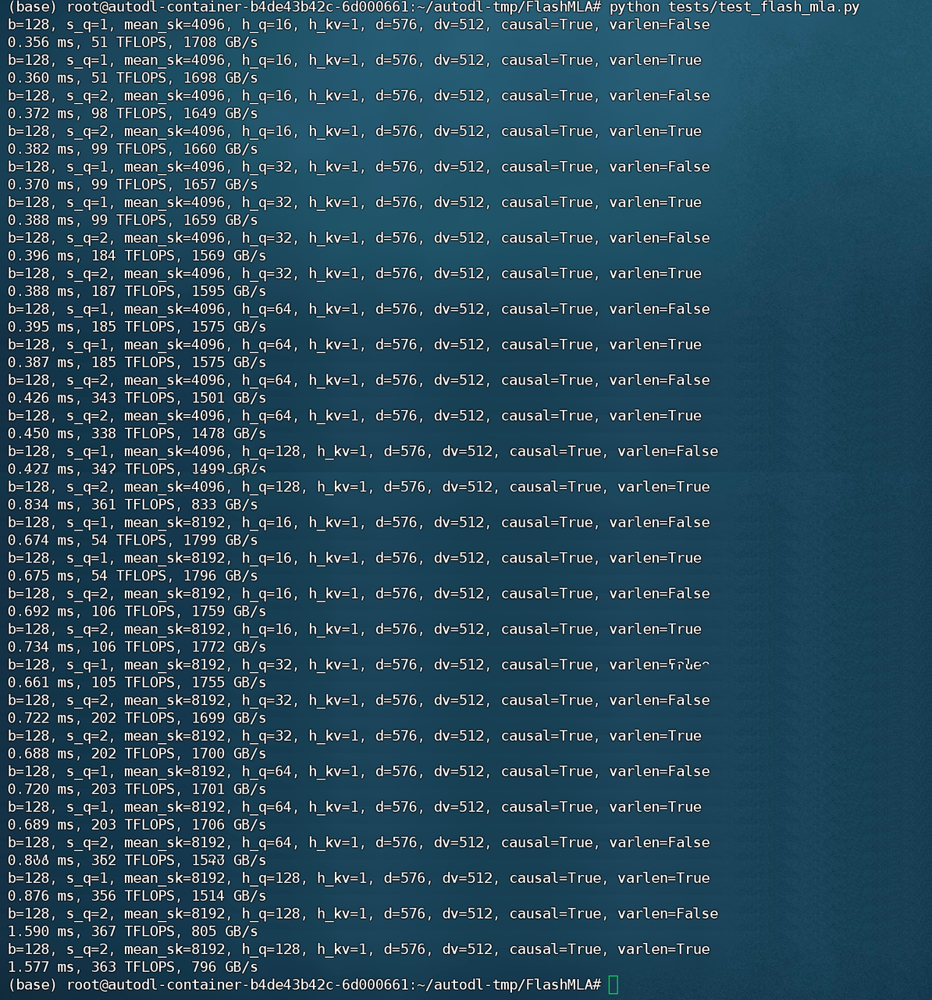

### 1.FlashMLA发布介绍

&#x20;       当地时间2月24号上午9点半，DeepSeek OpenSourceWeek 第1天正式开启，第一天发布FlashMLA，发布信息如下：

🚀 #OpenSourceWeek 第1天：FlashMLA

很荣幸分享 FlashMLA —— 我们为 Hopper GPU 优化的高效 MLA 解码内核，专为变长序列设计，目前已投入生产。

✅ 支持 BF16 ✅ 分页 KV 缓存（块大小 64） ⚡ 在 H800 上，内存带宽为 3000 GB/s，计算能力为 580 TFLOPS

🔗 在 GitHub 上查看： https://github.com/deepseek-ai/FlashMLA

关于FlashMLA优势，解释如下：

1. **为 Hopper GPU 优化的性能**
   FlashMLA 专为 NVIDIA 的 Hopper GPU（例如 H800）设计，这些 GPU 是最前沿的数据中心 GPU，因其先进的 Tensor Core 和 Transformer Engine 而著名。该内核实现了卓越的性能指标：

* 3000 GB/s 内存带宽（内存绑定性能），实现快速的数据访问与传输。

* 580 TFLOPS 计算性能（计算绑定性能），为 AI 工作负载提供高计算吞吐量。
  这种优化确保 FlashMLA 能在高性能硬件上高效处理大型语言模型（LLMs）和其他 AI 应用的强大计算需求。

1. **支持变长序列**
   FlashMLA 针对变长序列进行了优化，这对于自然语言处理（NLP）任务至关重要，因为输入数据（如句子或文档）的长度可能差异很大。这种灵活性使其非常适合现实世界的 AI 应用，如聊天机器人、翻译系统和文本生成，在这些应用中，序列长度是不均匀的。

2. **通过分页 KV 缓存实现高效的内存管理**
   该内核使用了块大小为 64 的分页 KV 缓存，这提高了内存效率并减少了解码过程中的延迟。Key-Value（KV）缓存是一种在 Transformer 模型中存储中间结果的技术，能够减少冗余计算。分页方法使 FlashMLA 能够更有效地管理内存，尤其是对于大规模模型，通过将数据分成可管理的块。
   这一点对 LLMs 尤为有益，因为内存限制常常成为性能瓶颈，正如 Apple 机器学习研究论文《LLM in a Flash》中所指出的。

3. **支持 BF16 精度**
   FlashMLA 支持 BF16（Brain Float 16）精度，这是一种紧凑的数值格式，平衡了模型的准确性和计算效率。与 FP32（32 位浮点数）等高精度格式相比，BF16 降低了内存使用并加速了计算，同时保持了大多数 AI 任务所需的足够准确性。这对于在资源受限的硬件上部署 LLMs 或扩展到更大规模的模型尤其有用。

4. **支持更大规模的 AI 模型**
   通过利用闪存并优化数据传输（灵感来自像 FlashAttention 2 和 3 等项目），FlashMLA 使得超出 GPU DRAM 容量的大型语言模型得以高效推理。根据 Apple 研究论文的说法，类似的方法能够运行最大是可用 DRAM 容量两倍的模型，并显著提升速度（在 CPU 上提升 4-5 倍，在 GPU 上提升 20-25 倍，相比于传统加载方式）。
   这意味着 FlashMLA 可以帮助在 Hopper GPU 上部署和运行巨大的 AI 模型，而无需进行极为昂贵的硬件升级。

5. **开源可用性**
   作为 DeepSeek OpenSourceWeek 的一部分，FlashMLA 已经在 GitHub 上发布，允许全球的开发者和研究人员访问、修改并将该技术集成到他们的项目中。这促进了创新，降低了开发成本，并加速了 AI 领域的进步，特别是对全球开源社区来说。

6. **生产就绪的技术**
   FlashMLA 已经投入生产，表明它是一个成熟、经过测试的解决方案，准备在现实世界中部署。这种可靠性对于依赖稳定、高性能 AI 工具的企业和研究人员至关重要。

7. **AI 开发中的竞争优势**
   FlashMLA 基于 DeepSeek 的开源倡议取得的成功，确立了公司在高效 AI 推理领域的领导地位。通过针对 Hopper GPU 进行优化，它与其他先进的内核（如 FlashAttention）竞争，并支持对可扩展、高性能 AI 解决方案的不断增长的需求，正如 X 线程的回应中（例如提到的 Grok 和其他 AI 进展）所体现的兴奋氛围。

* Github项目主页：https://github.com/deepseek-ai/FlashMLA



### 2.FlashMLA安装与测试

&#x20;       FlashMLA可以按照如下方式进行安装，需要注意的是，FlashMLA只针对于H系列GPU进行了适配。以下实验在H800 GPU上运行，FlashMLA硬件环境如下：

* Hopper GPUs

* CUDA 12.3 and above

* PyTorch 2.0 and above

经过FlashMLA，理论上设备峰值性能能为：



“Achieving up to 3000 GB/s in memory-bound configuration and 580 TFLOPS in computation-bound configuration on H800 SXM5, using CUDA 12.6.”

在内存受限配置下，使用CUDA 12.6，在H800 SXM5上实现高达3000 GB/s的带宽；而在计算受限配置下，能够达到580 TFLOPS的计算性能。

这里的**内存受限配置**和**计算受限配置**指的是系统在不同的瓶颈下，性能表现的优化：

* **内存受限配置（memory-bound configuration）**：通常意味着GPU的性能受到内存带宽或存取速度的限制。在这种配置下，优化内存访问方式和带宽使用是关键。

* **计算受限配置（computation-bound configuration）**：意味着性能瓶颈主要来自计算部分，而不是内存带宽，优化计算效率和GPU核心的计算能力变得至关重要。

实际测试代码及运行结果如下：

* 下载源码

```bash
git clone https://github.com/deepseek-ai/FlashMLA
```



* 安装依赖

```bash
cd ./FlashMLA
python setup.py install
```


* 运行测试脚本

```bash
python tests/test_flash_mla.py
```



* 能够看到，此时带宽峰值了1708，而计算性能峰值为361。

**更多大模型技术内容学习**

**扫码添加助理英英，回复“大模型”，了解更多大模型技术详情哦👇**


**扫码回复“入群”**，即可加入**大模型技术社群：海量硬核独家技术`干货内容`+无门槛`技术交流`！**
