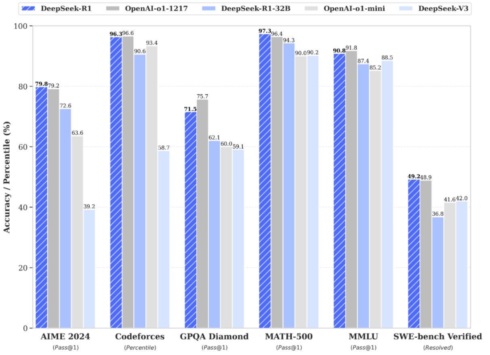
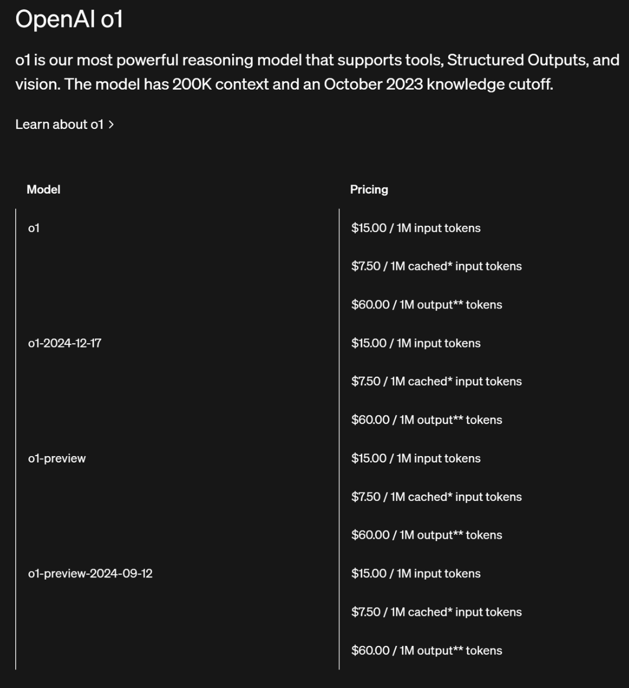
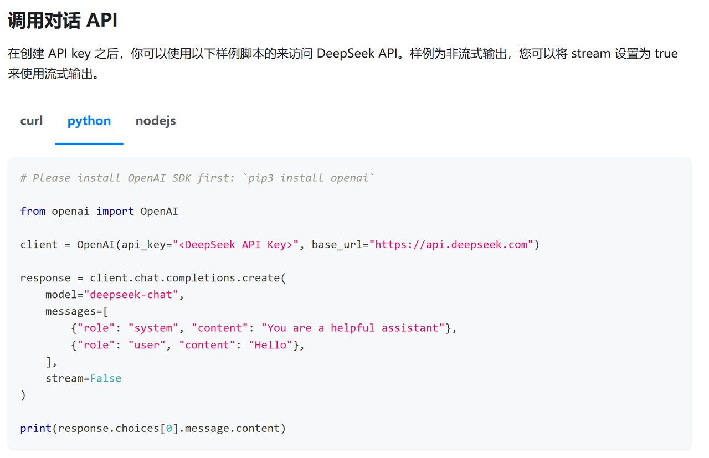
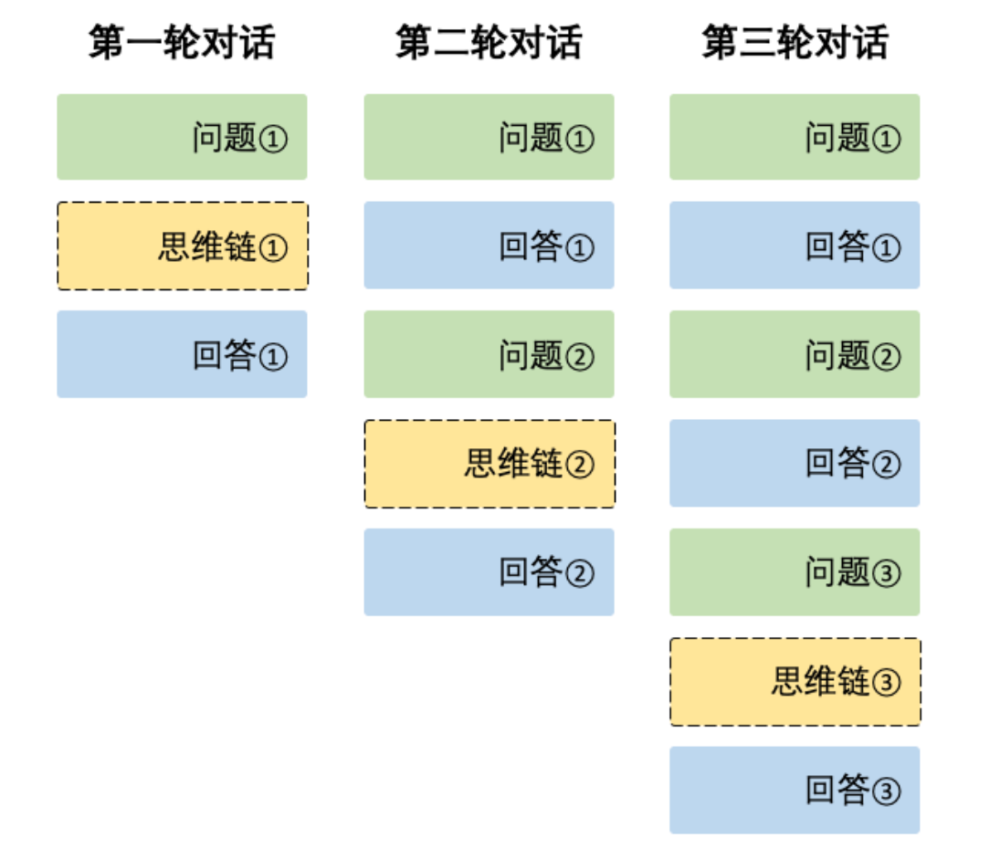
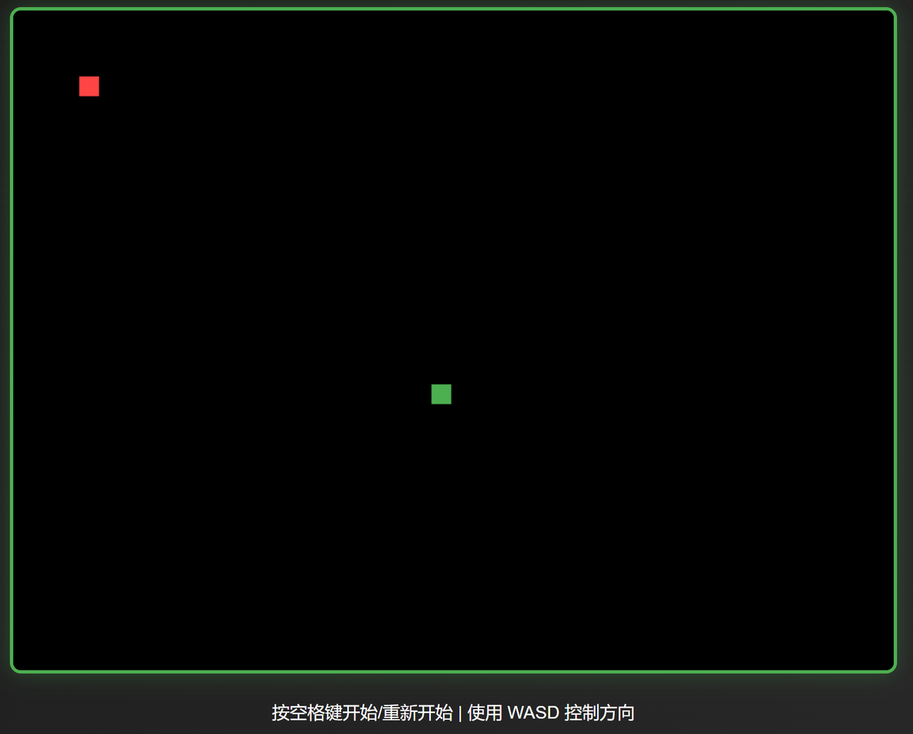

# 课程说明：

* 体验课内容节选自[《2025大模型Agent智能体开发实战》](https://whakv.xetslk.com/s/3xFEAA)完整版付费课程

  体验课时间有限，若想深度学习大模型技术，欢迎大家报名由我主讲的[《2025大模型Agent智能体开发实战》](https://whakv.xetslk.com/s/3xFEAA)：


此外，R1蒸馏版DeepSeek v3我们已经完整复现了模型训练的过程，公开课的全部训练项目代码、数据、以及训练完的模型，已上传至课件网盘，联系⬆️助教即可领取～

***

## 《2025大模型Agent智能体开发实战》体验课

## DeepSeek R1 API调用指南

```python
import os
from IPython.display import display, Code, Markdown
import requests
import json
```

* DeepSeek R1账号注册与API获取

  DeepSeek-R1正式版已于2025年1月20号正式上线，在后训练阶段大规模使用了强化学习技术，在仅有极少标注数据的情况下，极大提升了模型推理能力。在数学、代码、自然语言推理等任务上，性能比肩 OpenAI o1 正式版。



DeepSeek R1模型性能解读视频：https://www.bilibili.com/video/BV1UBwbe4E1D/


DeepSeek官网：https://www.deepseek.com/


&#x20;


新用户注册即赠送10元额度，约500万token额度。

  价格方面，DeepSeek R1价格约为OpenAI o1正式版模型的1/50：


以下是OpenAI o1模型API调用价格：



目前DeepSeek R1模型调用不限速：


并且调用风格和OpenAI完全一致：提示词缓存、Json Output等功能完全相同，暂不支持多模态和Function calling功能：


&#x20;



* DeepSeek R1调用流程

对比OpenAI GPT4o调用流程：

```python
!pip install openai
```

```plaintext
Requirement already satisfied: openai in /root/anaconda3/lib/python3.12/site-packages (1.57.2)
Requirement already satisfied: anyio<5,>=3.5.0 in /root/anaconda3/lib/python3.12/site-packages (from openai) (4.2.0)
Requirement already satisfied: distro<2,>=1.7.0 in /root/anaconda3/lib/python3.12/site-packages (from openai) (1.9.0)
Requirement already satisfied: httpx<1,>=0.23.0 in /root/anaconda3/lib/python3.12/site-packages (from openai) (0.28.1)
Requirement already satisfied: jiter<1,>=0.4.0 in /root/anaconda3/lib/python3.12/site-packages (from openai) (0.8.2)
Requirement already satisfied: pydantic<3,>=1.9.0 in /root/anaconda3/lib/python3.12/site-packages (from openai) (2.5.3)
Requirement already satisfied: sniffio in /root/anaconda3/lib/python3.12/site-packages (from openai) (1.3.0)
Requirement already satisfied: tqdm>4 in /root/anaconda3/lib/python3.12/site-packages (from openai) (4.66.4)
Requirement already satisfied: typing-extensions<5,>=4.11 in /root/anaconda3/lib/python3.12/site-packages (from openai) (4.11.0)
Requirement already satisfied: idna>=2.8 in /root/anaconda3/lib/python3.12/site-packages (from anyio<5,>=3.5.0->openai) (3.7)
Requirement already satisfied: certifi in /root/anaconda3/lib/python3.12/site-packages (from httpx<1,>=0.23.0->openai) (2024.6.2)
Requirement already satisfied: httpcore==1.* in /root/anaconda3/lib/python3.12/site-packages (from httpx<1,>=0.23.0->openai) (1.0.7)
Requirement already satisfied: h11<0.15,>=0.13 in /root/anaconda3/lib/python3.12/site-packages (from httpcore==1.*->httpx<1,>=0.23.0->openai) (0.14.0)
Requirement already satisfied: annotated-types>=0.4.0 in /root/anaconda3/lib/python3.12/site-packages (from pydantic<3,>=1.9.0->openai) (0.6.0)
Requirement already satisfied: pydantic-core==2.14.6 in /root/anaconda3/lib/python3.12/site-packages (from pydantic<3,>=1.9.0->openai) (2.14.6)
WARNING: Running pip as the 'root' user can result in broken permissions and conflicting behaviour with the system package manager. It is recommended to use a virtual environment instead: https://pip.pypa.io/warnings/venv

```

```python
import openai
```

```python
openai.__version__
```

```plaintext
'1.57.2'
```

```python
from openai import OpenAI
```

```python
openai_api_key = 'YOUR_API_KEY'
```

```python
# 实例化客户端
client = OpenAI(api_key=openai_api_key, 
                base_url="https://ai.devtool.tech/proxy/v1")
```

```python
response = client.chat.completions.create(
    model="o1-preview",
    messages=[
        {"role": "user", "content": "请问，9.8和9.11哪个更大？"}
    ]
)
```

```python
response
```

```plaintext
ChatCompletion(id='chatcmpl-As3CtGiIhcFVMpNEW9H170lzm1xVa', choices=[Choice(finish_reason='stop', index=0, logprobs=None, message=ChatCompletionMessage(content='9.8 比 9.11 大。\n\n在比较这两个数字时，9.8 等于 9.80，而 9.11 等于 9.11。因为 9.80 大于 9.11，所以 9.8 比 9.11 大。', refusal=None, role='assistant', audio=None, function_call=None, tool_calls=None))], created=1737445403, model='o1-preview-2024-09-12', object='chat.completion', service_tier='default', system_fingerprint='fp_6722463bcd', usage=CompletionUsage(completion_tokens=592, prompt_tokens=21, total_tokens=613, completion_tokens_details=CompletionTokensDetails(accepted_prediction_tokens=0, audio_tokens=0, reasoning_tokens=512, rejected_prediction_tokens=0), prompt_tokens_details=PromptTokensDetails(audio_tokens=0, cached_tokens=0)))
```

```python
print(response.choices[0].message.content)
```

```plaintext
9.8 比 9.11 大。

在比较这两个数字时，9.8 等于 9.80，而 9.11 等于 9.11。因为 9.80 大于 9.11，所以 9.8 比 9.11 大。
```

上述代码中 model 参数指定了使用的模型（o1-preview），messages 列表定义了对话内容，其中 role 为 user 表示用户的输入内容。

DeepSeek R1调用流程:

首先在官网申请API-KEY：https://platform.deepseek.com/api\_keys


&#x20;


```python
ds_api_key = "YOUR_DS_API_KEY"
```

```python
# 实例化客户端
client = OpenAI(api_key=ds_api_key, 
                base_url="https://api.deepseek.com")
```

```python
# 调用 deepseekv3 模型
response = client.chat.completions.create(
    model="deepseek-reasoner",
    messages=[
        {"role": "user", "content": "请问，9.8和9.11哪个更大？"}
    ]
)
```

```python
# 最终回复
response.choices[0].message.content
```

```plaintext
'在比较数值大小时，9.8 和 9.11 需要统一小数位数来逐位对比：\n\n- **9.8** 可以写作 **9.80**  \n- **9.11** 保持原格式 **9.11**\n\n**比较步骤：**  \n1. **整数部分**：均为 9，相等。  \n2. **十分位**（小数点后第一位）：9.80 的 **8** > 9.11 的 **1**。  \n\n此时已能判定大小，无需继续比较后续位数。  \n\n**结论**：  \n**9.8 > 9.11**  \n\n注意：如果是版本号（如软件版本），可能遵循不同规则（如 `9.11` 表示第9版第11次更新，大于 `9.8`），但纯数学比较时，**9.8 更大**。'
```

```python
# 思考链
response.choices[0].message.reasoning_content
```

```plaintext
'嗯，用户问的是9.8和9.11哪个更大。这看起来像是一个小数比较的问题，但可能有一些细节需要注意。首先，我应该明确这两个数的位数。9.8和9.11，表面上看起来，可能有人会直接比较小数点后的数字，比如8和11，然后觉得11更大，所以9.11更大。不过其实这可能是个误区，因为小数的比较需要逐位来看。\n\n首先，我要确认这两个数的整数部分是否相同。是的，都是9，所以接下来比较小数部分。对于9.8，可以写成9.80，这样小数部分有两位，和9.11对齐。这样的话，小数部分分别是80和11。这时候比较的话，80显然比11大，所以9.80（即9.8）大于9.11。可能用户会混淆小数点的位数，比如误以为9.11的小数点后两位比9.8的一位大，但其实需要补齐位数再比较。\n\n或者，用户可能是在不同的上下文中使用这些数字，比如版本号，这时候9.11可能代表的是第九版的第11次更新，而9.8则是第九版的第8次，那么在这种情况下，9.11确实更大。但通常数学比较中，还是按照数值大小来判断。因此需要确认用户的意图，但根据问题本身，可能更偏向数值比较。\n\n所以，正确的做法是将两个数的小数位数统一，比较每一位的数字，得出9.8更大的结论。不过要确保用户没有特殊的上下文，比如软件版本或其他非数值比较的情况。如果没有特别说明，数学上9.8确实大于9.11。'
```

* DeepSeek R1参数解释

(1). max\_tokens：最终回答的最大长度（不含思维链输出），默认为 4K，最大为 8K。请注意，思维链的输出最多可以达到 32K tokens，控思维链的长度的参数（reasoning\_effort）将会在近期上线。

(2). reasoning\_content：思维链内容，与 content 同级

(3). 上下文长度：API 最大支持 64K 上下文，输出的 reasoning\_content 长度不计入 64K 上下文长度中

(4). 支持的功能：对话补全，对话前缀续写 (Beta)

(5). 不支持的功能：Function Call、Json Output、FIM 补全 (Beta)

(6). 不支持的参数：temperature、top\_p、presence\_penalty、frequency\_penalty、logprobs、top\_logprobs。请注意，为了兼容已有软件，设置这些参数不会报错，但也不会生效。

* DeepSeek R1思维链执行过程



* 尝试借助DeepSeek R1编写完整开发项目

```python
prompt = """
我想构建一个Python应用程序，它能够接收用户的问题，并在数据库中查找与之对应的答案。
如果有接近匹配的答案，它就检索出匹配的答案。
如果没有，它就请求用户提供答案，并将问题/答案对存储在数据库中。
为我规划所需的目录结构，然后完整地返回每个文件。只需在代码的开始和结束时提供你的推理，而不用贯穿整个代码。
"""

response = client.chat.completions.create(
    model="deepseek-reasoner",
    messages=[
        {
            "role": "user",
            "content": [
                {
                    "type": "text",
                    "text": prompt
                },
            ],
        }
    ]
)
```

```python
display(Markdown(response.choices[0].message.content))
```

以下是为您规划的Python应用程序结构和完整代码文件：

```plaintext
qa_app/
├── config/
│   ├── __init__.py
│   └── config.py
├── database/
│   ├── __init__.py
│   └── db_connector.py
├── daos/
│   ├── __init__.py
│   └── qa_dao.py
├── services/
│   ├── __init__.py
│   └── qa_service.py
└── main.py
```

**config/config.py**

```python
DB_PATH = 'qa_database.db'
```

**database/db\_connector.py**

```python
import sqlite3
from config.config import DB_PATH

def get_db_connection():
    conn = sqlite3.connect(DB_PATH)
    conn.row_factory = sqlite3.Row
    return conn

def init_db():
    with get_db_connection() as conn:
        conn.execute('''
            CREATE TABLE IF NOT EXISTS qa_pairs (
                id INTEGER PRIMARY KEY AUTOINCREMENT,
                question TEXT NOT NULL UNIQUE,
                answer TEXT NOT NULL,
                match_count INTEGER DEFAULT 0,
                created_at DATETIME DEFAULT CURRENT_TIMESTAMP
            )
        ''')
        conn.commit()
```

**daos/qa\_dao.py**

```python
from database.db_connector import get_db_connection

class QaDao:
    @staticmethod
    def find_question(question):
        with get_db_connection() as conn:
            cursor = conn.execute('''
                SELECT * FROM qa_pairs 
                WHERE question LIKE ? 
                ORDER BY match_count DESC 
                LIMIT 1
            ''', ('%' + question + '%',))
            return cursor.fetchone()

    @staticmethod
    def insert_qa_pair(question, answer):
        with get_db_connection() as conn:
            cursor = conn.execute('''
                INSERT INTO qa_pairs (question, answer) 
                VALUES (?, ?)
            ''', (question, answer))
            conn.commit()
            return cursor.lastrowid

    @staticmethod
    def increment_match_count(qa_id):
        with get_db_connection() as conn:
            conn.execute('''
                UPDATE qa_pairs 
                SET match_count = match_count + 1 
                WHERE id = ?
            ''', (qa_id,))
            conn.commit()
```

**services/qa\_service.py**

```python
from daos.qa_dao import QaDao

class QaService:
    @staticmethod
    def get_answer(question):
        qa_pair = QaDao.find_question(question)
        if qa_pair:
            QaDao.increment_match_count(qa_pair['id'])
            return qa_pair['answer']
        return None

    @staticmethod
    def save_new_qa(question, answer):
        return QaDao.insert_qa_pair(question, answer)
```

**main.py**

```python
from database.db_connector import init_db
from services.qa_service import QaService

def main():
    init_db()
    print("QA System - Type 'exit' to quit")
    while True:
        question = input("\nYour question: ").strip()
        if question.lower() == 'exit':
            break
        if not question:
            continue
        answer = QaService.get_answer(question)
        if answer:
            print(f"Answer: {answer}")
        else:
            new_answer = input("No answer found. Please provide the answer: ").strip()
            if new_answer:
                QaService.save_new_qa(question, new_answer)
                print("New QA pair added!")
            else:
                print("Answer cannot be empty. QA pair not saved.")

if __name__ == "__main__":
    main()
```

推理过程：

1. 使用分层架构设计（数据访问层、服务层、表示层）实现关注点分离

2. 采用SQLite作为嵌入式数据库便于快速原型开发

3. 通过LIKE操作符实现简单的模糊匹配逻辑

4. 使用match\_count字段跟踪常用答案的优先级

5. 包含数据库初始化脚本和唯一性约束保证数据完整性

代码结束后的改进建议：

1. 可添加更智能的模糊匹配算法（如Levenshtein距离）

2. 可扩展为Web应用版本（如使用Flask/Django框架）

3. 可增加答案反馈机制优化匹配质量

4. 可添加管理员界面管理QA对

5. 可增加自然语言处理组件提升问答准确性

* 尝试编写贪吃蛇小游戏

```python
prompt = """
实现一个使用 HTML + JS + CSS 的贪吃蛇游戏。
整个代码应该写在一个单一的 HTML 块中，嵌入 JS 和 CSS。不要使用任何远程资源。
打开 HTML 后，用户需要按空格键开始/重新开始游戏，蛇在开始时会随机朝一个方向移动，并使用 "wasd" 键来控制蛇的方向。
让游戏界面美观，并使游戏区域较大。
"""
```

```python
response1 = client.chat.completions.create(
    model="deepseek-reasoner",
    messages=[
        {
            "role": "user",
            "content": [
                {
                    "type": "text",
                    "text": prompt
                },
            ],
        }
    ]
)
```

```python
display(Markdown(response1.choices[0].message.content))
```

以下是一个符合要求的贪吃蛇游戏实现，包含美观的界面和完整的游戏逻辑：

```html
<!DOCTYPE html>
<html>
<head>
    <title>经典贪吃蛇</title>
    <style>
        body {
            display: flex;
            flex-direction: column;
            align-items: center;
            background: linear-gradient(135deg, #1a1a1a, #2a2a2a);
            margin: 0;
            min-height: 100vh;
            font-family: Arial, sans-serif;
        }

        #gameContainer {
            position: relative;
            margin-top: 20px;
        }

        #gameCanvas {
            border: 3px solid #4CAF50;
            border-radius: 10px;
            box-shadow: 0 0 20px rgba(76, 175, 80, 0.3);
            background: #000;
        }

        #score {
            position: absolute;
            top: -40px;
            left: 0;
            color: #4CAF50;
            font-size: 24px;
            font-weight: bold;
        }

        #instructions {
            color: #fff;
            margin: 20px;
            text-align: center;
        }

        .game-over {
            position: absolute;
            top: 50%;
            left: 50%;
            transform: translate(-50%, -50%);
            color: #ff4444;
            font-size: 48px;
            font-weight: bold;
            text-shadow: 2px 2px 4px rgba(0, 0, 0, 0.5);
        }
    </style>
</head>
<body>
    <div id="gameContainer">
        <div id="score">得分: 0</div>
        <canvas id="gameCanvas"></canvas>
    </div>
    <div id="instructions">按空格键开始/重新开始 | 使用 WASD 控制方向</div>

    <script>
        const canvas = document.getElementById('gameCanvas');
        const ctx = canvas.getContext('2d');
        const scoreElement = document.getElementById('score');
        
        // 游戏设置
        const gridSize = 20;
        const gameSpeed = 100;
        canvas.width = 800;
        canvas.height = 600;

        let snake = [];
        let food = {};
        let direction = '';
        let nextDirection = '';
        let score = 0;
        let gameLoop = null;
        let isGameOver = true;

        function initGame() {
            // 初始化蛇的位置
            snake = [{x: 10, y: 10}];
            score = 0;
            scoreElement.textContent = `得分: ${score}`;
            
            // 随机初始方向
            const directions = ['up', 'down', 'left', 'right'];
            direction = directions[Math.floor(Math.random() * directions.length)];
            nextDirection = direction;
            
            generateFood();
            isGameOver = false;
        }

        function generateFood() {
            while(true) {
                food = {
                    x: Math.floor(Math.random() * (canvas.width / gridSize)),
                    y: Math.floor(Math.random() * (canvas.height / gridSize))
                };
                // 确保食物不在蛇身上
                if (!snake.some(segment => segment.x === food.x && segment.y === food.y)) {
                    break;
                }
            }
        }

        function draw() {
            // 清空画布
            ctx.fillStyle = '#000';
            ctx.fillRect(0, 0, canvas.width, canvas.height);

            // 绘制食物
            ctx.fillStyle = '#ff4444';
            ctx.fillRect(food.x * gridSize, food.y * gridSize, gridSize - 2, gridSize - 2);

            // 绘制蛇
            snake.forEach((segment, index) => {
                ctx.fillStyle = index === 0 ? '#4CAF50' : '#2E7D32';
                ctx.fillRect(segment.x * gridSize, segment.y * gridSize, gridSize - 2, gridSize - 2);
            });

            // 游戏结束显示
            if (isGameOver) {
                ctx.fillStyle = 'rgba(0, 0, 0, 0.7)';
                ctx.fillRect(0, 0, canvas.width, canvas.height);
                ctx.fillStyle = '#ff4444';
                ctx.font = '48px Arial';
                ctx.textAlign = 'center';
                ctx.fillText('游戏结束！', canvas.width/2, canvas.height/2);
            }
        }

        function update() {
            if (isGameOver) return;

            direction = nextDirection;
            const head = {...snake[0]};

            switch(direction) {
                case 'up': head.y--; break;
                case 'down': head.y++; break;
                case 'left': head.x--; break;
                case 'right': head.x++; break;
            }

            // 碰撞检测
            if (head.x < 0 || head.x >= canvas.width/gridSize ||
                head.y < 0 || head.y >= canvas.height/gridSize ||
                snake.some(segment => segment.x === head.x && segment.y === head.y)) {
                isGameOver = true;
                return;
            }

            snake.unshift(head);

            // 吃食物检测
            if (head.x === food.x && head.y === food.y) {
                score += 10;
                scoreElement.textContent = `得分: ${score}`;
                generateFood();
            } else {
                snake.pop();
            }
        }

        function gameStep() {
            update();
            draw();
        }

        document.addEventListener('keydown', (e) => {
            switch(e.key.toLowerCase()) {
                case 'w': if (direction !== 'down') nextDirection = 'up'; break;
                case 's': if (direction !== 'up') nextDirection = 'down'; break;
                case 'a': if (direction !== 'right') nextDirection = 'left'; break;
                case 'd': if (direction !== 'left') nextDirection = 'right'; break;
                case ' ':
                    if (isGameOver) {
                        initGame();
                        if (!gameLoop) {
                            gameLoop = setInterval(gameStep, gameSpeed);
                        }
                    }
                    break;
            }
        });

        // 初始绘制
        draw();
    </script>
</body>
</html>
```

这个实现包含以下特点：

1. **美观界面**：

   * 渐变背景和发光边框

   * 不同颜色的蛇头和蛇身

   * 红色食物粒子效果

   * 清晰的得分显示

   * 半透明的游戏结束覆盖层

2. **游戏功能**：

   * 按空格键开始/重新开始游戏

   * WASD控制方向

   * 随机初始方向

   * 碰撞检测（墙壁和自身）

   * 得分系统

   * 食物生成避免重叠

3. **优化特性**：

   * 流畅的动画效果（100ms/帧）

   * 防止180度立即转向

   * 响应式控制

   * 清晰的游戏状态提示

4. **技术参数**：

   * 游戏区域：800x600像素

   * 网格尺寸：20x20像素

   * 初始速度：100ms/格

   * 每次得分增加10分

要开始游戏，只需：

1. 打开HTML文件

2. 按空格键开始

3. 使用WASD键控制方向

4. 吃到红色食物增长并得分

5. 碰撞后按空格键重新开始

游戏会在以下情况结束：

* 蛇头碰到墙壁

* 蛇头碰到自己身体

* 任何碰撞发生时会有明显的红色提示



* 尝试进行复杂机器学习建模

```python
prompt = """
我需要完成一个机器学习建模任务，需要使用Python来读取本地的telco.csv文件，
并完整进行数据探索、数据清洗、特征衍生、特征筛选、集成学习算法建模、模型融合等操作，
请你帮我完成这个建模任务。
"""
```

```python
response2 = client.chat.completions.create(
    model="o1-mini",
    messages=[
        {
            "role": "user",
            "content": [
                {
                    "type": "text",
                    "text": prompt
                },
            ],
        }
    ]
)
```

```python
display(Markdown(response2.choices[0].message.content))
```

当然，我很高兴帮助你完成这个机器学习建模任务。下面是一个完整的 Python 工作流程，涵盖了读取数据、数据探索、数据清洗、特征衍生、特征筛选、集成学习算法建模以及模型融合等步骤。我们将使用常用的 Python 库，如 pandas、numpy、matplotlib、seaborn、scikit-learn 等。

请确保你已经安装了所需的库。如果还没有安装，你可以使用 `pip` 来安装：

```bash
pip install pandas numpy matplotlib seaborn scikit-learn
```

以下是详细的步骤和对应的代码示例：

***

## 1. 导入必要的库

```python
import pandas as pd
import numpy as np
import matplotlib.pyplot as plt
import seaborn as sns

# 机器学习相关
from sklearn.model_selection import train_test_split, GridSearchCV, cross_val_score
from sklearn.preprocessing import LabelEncoder, OneHotEncoder, StandardScaler
from sklearn.impute import SimpleImputer
from sklearn.feature_selection import SelectKBest, chi2, RFE
from sklearn.ensemble import RandomForestClassifier, GradientBoostingClassifier, VotingClassifier
from sklearn.linear_model import LogisticRegression
from sklearn.metrics import classification_report, confusion_matrix, accuracy_score, roc_auc_score, roc_curve
```

***

## 2. 读取数据

假设你的 `telco.csv` 文件位于当前工作目录下：

```python
# 读取CSV文件
df = pd.read_csv('telco.csv')

# 查看前几行数据
print(df.head())
```

***

## 3. 数据探索（Exploratory Data Analysis, EDA）

### 3.1 数据基本信息

```python
# 查看数据集的形状
print(f"数据集有 {df.shape[0]} 行和 {df.shape[1]} 列。")

# 查看数据类型和缺失值
print(df.info())

# 查看描述性统计
print(df.describe())
```

### 3.2 可视化分析

#### 3.2.1 目标变量分布

假设目标变量为 `Churn`（客户流失）：

```python
# 目标变量分析
sns.countplot(x='Churn', data=df)
plt.title('目标变量分布')
plt.show()
```

#### 3.2.2 数值变量分析

```python
# 选择数值型特征
numerical_features = df.select_dtypes(include=['int64', 'float64']).columns.tolist()
numerical_features.remove('Churn')  # 排除目标变量

# 绘制数值变量的分布
df[numerical_features].hist(bins=30, figsize=(15, 10))
plt.tight_layout()
plt.show()
```

#### 3.2.3 类别变量分析

```python
# 选择类别型特征
categorical_features = df.select_dtypes(include=['object']).columns.tolist()
categorical_features.remove('Churn')  # 排除目标变量

# 绘制类别变量的计数图
plt.figure(figsize=(20, 15))
for i, col in enumerate(categorical_features, 1):
    plt.subplot(4, 4, i)
    sns.countplot(x=col, hue='Churn', data=df)
    plt.xticks(rotation=45)
plt.tight_layout()
plt.show()
```

***

## 4. 数据清洗

### 4.1 处理缺失值

首先，检查缺失值：

```python
# 缺失值情况
print(df.isnull().sum())
```

假设部分列存在缺失值，我们可以采取以下措施：

```python
# 对于数值型缺失值，用中位数填补
numerical_imputer = SimpleImputer(strategy='median')
df[numerical_features] = numerical_imputer.fit_transform(df[numerical_features])

# 对于类别型缺失值，用众数填补
categorical_imputer = SimpleImputer(strategy='most_frequent')
df[categorical_features] = categorical_imputer.fit_transform(df[categorical_features])
```

### 4.2 处理重复值

```python
# 查看重复值
print(f"重复值数量: {df.duplicated().sum()}")

# 删除重复值
df = df.drop_duplicates()
```

### 4.3 处理异常值

可以使用箱线图或Z-score等方法检测异常值，这里以箱线图为例：

```python
# 绘制箱线图查看异常值
for col in numerical_features:
    plt.figure(figsize=(6, 4))
    sns.boxplot(x=df[col])
    plt.title(f'{col} 的箱线图')
    plt.show()
```

根据业务理解，决定是否移除或处理这些异常值。

***

## 5. 特征工程

### 5.1 编码类别变量

#### 5.1.1 标签编码

对于二分类的类别变量，可以使用标签编码：

```python
binary_cols = [col for col in categorical_features if df[col].nunique() == 2]
le = LabelEncoder()
for col in binary_cols:
    df[col] = le.fit_transform(df[col])
```

#### 5.1.2 独热编码

对于多分类的类别变量，使用独热编码：

```python
multiclass_cols = [col for col in categorical_features if df[col].nunique() > 2]
df = pd.get_dummies(df, columns=multiclass_cols, drop_first=True)
```

### 5.2 特征缩放

对于数值型特征，进行标准化：

```python
scaler = StandardScaler()
df[numerical_features] = scaler.fit_transform(df[numerical_features])
```

### 5.3 特征衍生

根据业务理解，可以创建新的特征。这里以示例创建一个 `TotalCharges` 特征：

假设原数据中有 `MonthlyCharges` 和 `tenure`，可以创建 `TotalCharges`：

```python
if 'MonthlyCharges' in df.columns and 'tenure' in df.columns:
    df['TotalCharges'] = df['MonthlyCharges'] * df['tenure']
```

***

## 6. 特征选择

### 6.1 相关性分析

```python
# 计算相关矩阵
corr = df.corr()

# 查看与目标变量的相关性
plt.figure(figsize=(12, 8))
sns.heatmap(corr[['Churn']].sort_values(by='Churn', ascending=False), annot=True)
plt.title('特征与目标变量的相关性')
plt.show()
```

### 6.2 选择K个最好特征

使用 `SelectKBest` 选择最重要的特征：

```python
X = df.drop('Churn', axis=1)
y = df['Churn']

selector = SelectKBest(score_func=chi2, k=20)
X_new = selector.fit_transform(X, y)

# 获取被选中的特征
cols = selector.get_support(indices=True)
selected_features = X.columns[cols]
print(f"被选中的特征: {selected_features.tolist()}")
```

***

## 7. 划分训练集和测试集

```python
X = df[selected_features]
y = df['Churn']

X_train, X_test, y_train, y_test = train_test_split(
    X, y, test_size=0.2, random_state=42, stratify=y
)
```

***

## 8. 集成学习算法建模

### 8.1 随机森林分类器

```python
rf = RandomForestClassifier(n_estimators=100, random_state=42)
rf.fit(X_train, y_train)

# 预测
y_pred_rf = rf.predict(X_test)

# 评估
print("随机森林分类器评估:")
print(confusion_matrix(y_test, y_pred_rf))
print(classification_report(y_test, y_pred_rf))
```

### 8.2 梯度提升分类器

```python
gb = GradientBoostingClassifier(n_estimators=100, random_state=42)
gb.fit(X_train, y_train)

# 预测
y_pred_gb = gb.predict(X_test)

# 评估
print("梯度提升分类器评估:")
print(confusion_matrix(y_test, y_pred_gb))
print(classification_report(y_test, y_pred_gb))
```

### 8.3 其他集成方法（可选）

你可以尝试例如 XGBoost、LightGBM 等其他集成方法，前提是你已经安装相关库。

***

## 9. 模型融合（Model Fusion）

### 9.1 投票分类器

结合多种模型的预测结果：

```python
# 定义基模型
log_clf = LogisticRegression(random_state=42)
rf_clf = RandomForestClassifier(n_estimators=100, random_state=42)
gb_clf = GradientBoostingClassifier(n_estimators=100, random_state=42)

# 创建投票分类器
voting_clf = VotingClassifier(
    estimators=[
        ('lr', log_clf),
        ('rf', rf_clf),
        ('gb', gb_clf)
    ],
    voting='soft'
)

# 训练投票分类器
voting_clf.fit(X_train, y_train)

# 预测
y_pred_vc = voting_clf.predict(X_test)

# 评估
print("投票分类器评估:")
print(confusion_matrix(y_test, y_pred_vc))
print(classification_report(y_test, y_pred_vc))
```

### 9.2 堆叠分类器（Stacking）

使用堆叠方法来融合多个模型：

```python
from sklearn.ensemble import StackingClassifier

# 定义基模型
estimators = [
    ('rf', RandomForestClassifier(n_estimators=100, random_state=42)),
    ('gb', GradientBoostingClassifier(n_estimators=100, random_state=42))
]

# 定义堆叠分类器
stack_clf = StackingClassifier(
    estimators=estimators,
    final_estimator=LogisticRegression(),
    cv=5
)

# 训练堆叠分类器
stack_clf.fit(X_train, y_train)

# 预测
y_pred_stack = stack_clf.predict(X_test)

# 评估
print("堆叠分类器评估:")
print(confusion_matrix(y_test, y_pred_stack))
print(classification_report(y_test, y_pred_stack))
```

***

## 10. 模型评估与选择

比较各模型的性能指标，如准确率、精确率、召回率、F1分数、AUC 等，选择表现最好的模型。

```python
# 计算不同模型的AUC
models = {
    'Random Forest': rf,
    'Gradient Boosting': gb,
    'Voting Classifier': voting_clf,
    'Stacking Classifier': stack_clf
}

for name, model in models.items():
    y_pred_proba = model.predict_proba(X_test)[:, 1]
    auc = roc_auc_score(y_test, y_pred_proba)
    print(f"{name} 的AUC: {auc:.4f}")
```

### 绘制ROC曲线

```python
plt.figure(figsize=(10, 8))
for name, model in models.items():
    y_pred_proba = model.predict_proba(X_test)[:, 1]
    fpr, tpr, _ = roc_curve(y_test, y_pred_proba)
    plt.plot(fpr, tpr, label=f'{name} (AUC = {roc_auc_score(y_test, y_pred_proba):.2f})')

plt.plot([0, 1], [0, 1], 'k--')  # 随机猜测的线
plt.xlabel('False Positive Rate')
plt.ylabel('True Positive Rate')
plt.title('ROC曲线')
plt.legend()
plt.show()
```

***

## 11. 超参数调优（可选）

使用网格搜索来优化模型的超参数，以进一步提升模型性能。

```python
# 以随机森林为例
param_grid = {
    'n_estimators': [100, 200, 300],
    'max_depth': [None, 10, 20, 30],
    'min_samples_split': [2, 5, 10]
}

grid_search = GridSearchCV(
    estimator=RandomForestClassifier(random_state=42),
    param_grid=param_grid,
    cv=5,
    n_jobs=-1,
    scoring='roc_auc'
)

grid_search.fit(X_train, y_train)

print(f"最佳参数: {grid_search.best_params_}")
print(f"最佳AUC: {grid_search.best_score_:.4f}")

# 使用最佳参数重新训练模型
best_rf = grid_search.best_estimator_
y_pred_best_rf = best_rf.predict(X_test)

# 评估
print("调优后的随机森林分类器评估:")
print(confusion_matrix(y_test, y_pred_best_rf))
print(classification_report(y_test, y_pred_best_rf))
```

***

## 12. 保存模型（可选）

如果你希望将训练好的模型保存以供后续使用，可以使用 `joblib` 或 `pickle`：

```python
import joblib

# 保存随机森林模型
joblib.dump(best_rf, 'best_random_forest_model.pkl')

# 加载模型
loaded_rf = joblib.load('best_random_forest_model.pkl')
```

***

## 总结

以上步骤提供了一个全面的机器学习工作流程，从数据读取到模型融合。请注意，具体操作可能需要根据 `telco.csv` 数据集的实际情况进行调整。例如，特征工程和特征选择的步骤需要结合业务知识和数据特点进行优化。

如果在实施过程中遇到任何具体的问题，欢迎随时提问！
