

  <h1>DeepSeek R1推理大模型</h1>

&emsp;&emsp;DeepSeek再放大招，这次发布的是性能对标OpenAI o1的推理大模型：**DeepSeek R1**。

&emsp;&emsp;早在1月18号，DeepSeek就高调宣布一款名为DeepSeek R1 Preview的模型成功杀入了LiveCodeBench的前三名

>iveCodeBench是全球最权威的大模型编程能力测试榜单

&emsp;&emsp;而DeepSeek R1 Preview模型的排名，预示着我们或将见证一款o1级别推理大模型的诞生。

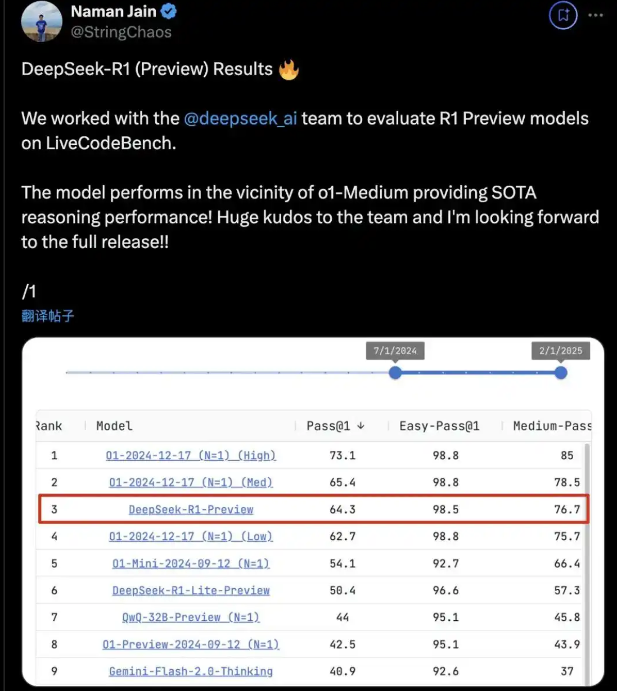

&emsp;&emsp;果不其然，短短两天后的1月20号，DeepSeek R1推理大模型就正式发布了。根据官方给出的评测结果，DeepSeek R1在**编程、数学、机器学习和博士级科研问题的解答能力方面，与OpenAI o1满血版模型性能相当**，大幅领先于此前国内最强推理大模型QWQ。而放眼全球，DeepSeek R1也是目前唯一一个能与OpenAI o1模型掰手腕的推理大模型。

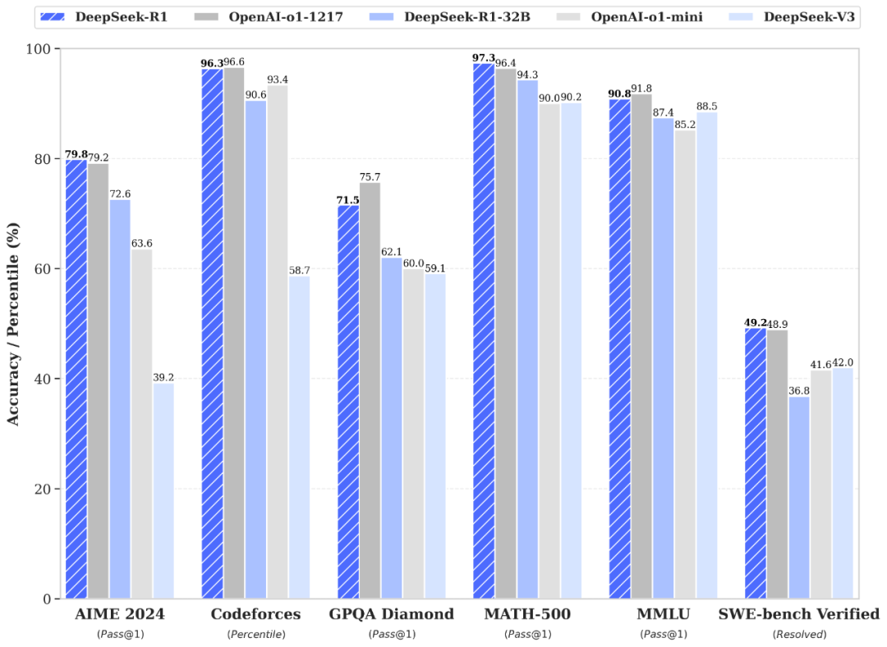

&emsp;&emsp;我们团队也在第一时间也制作了DeepSeek R1模型使用教程，并在大模型技术社区中上线啦！教程包含R1模型技术报告解读、模型本地部署方法、API调用方法、模型蒸馏实现方法等各方面核心技术讲解，感兴趣的伙伴们扫码即可领取哦。

  

&emsp;&emsp;DeepSeek R1和DeepSeek v3定位类似，都是价格杀手，也是开源之光。价格方面，R1模型的每百万token输入仅需4元，百万输出仅需16元。

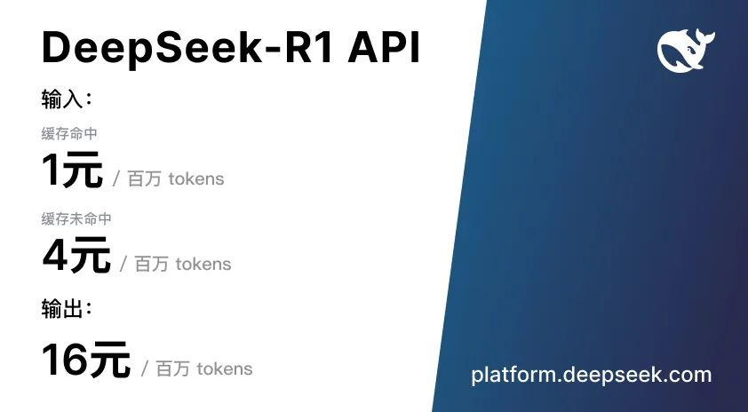

&emsp;&emsp;相比之下，OpenAI o1模型的百万token输入则需要110元，百万token输出则高达438元。

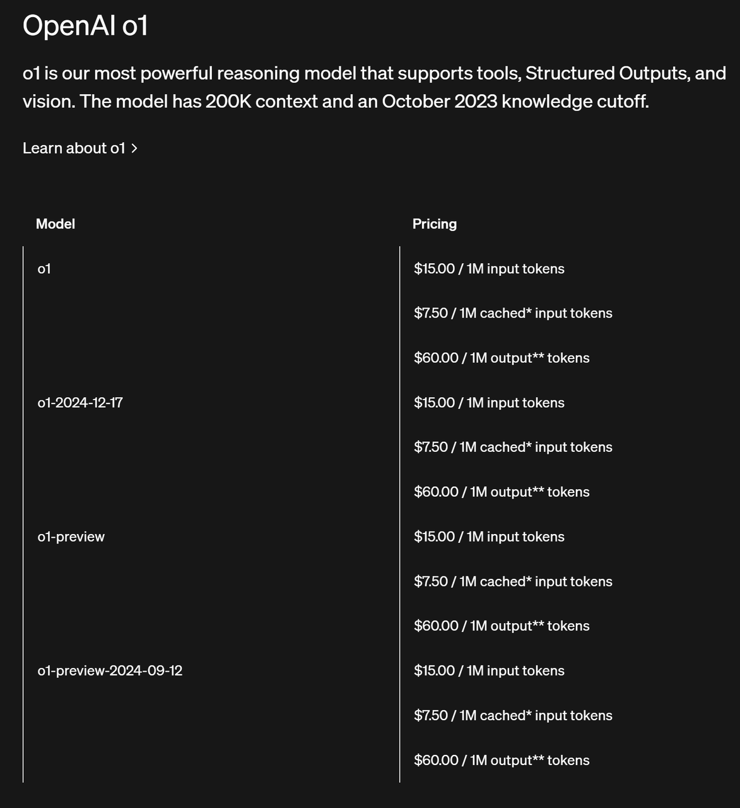

&emsp;&emsp;也就是说**DeepSeek R1的价格还不到OpenAI o1模型的1/50**。简直是便宜的离谱。

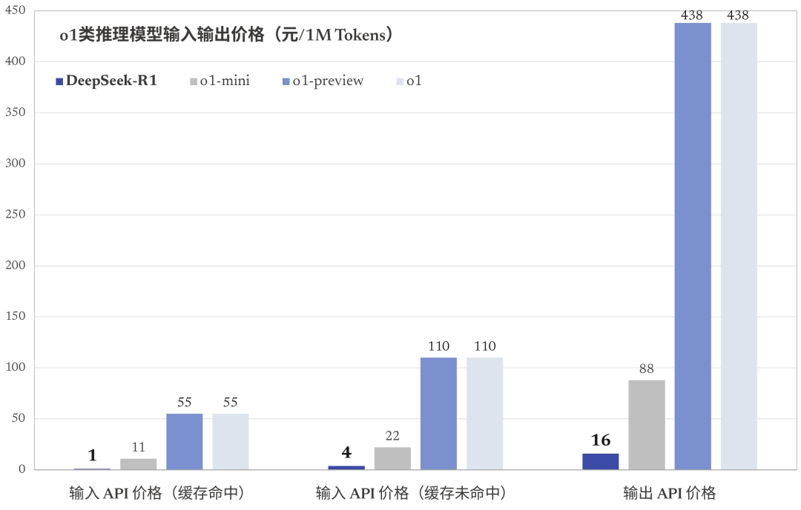

&emsp;&emsp;此外，DeepSeek R1模型发布即可用，目前在官网聊天页面选择深度思考模式即可在线调用R1模型进行聊天：

☑️ [DeepSeek R1实际测试效果（视频）](<files/2025-01-20 22-30-29.mp4>)

&emsp;&emsp;实测响应速度非常快，并会展示完整的思考过程。

&emsp;&emsp;同时DeepSeek R1的API也同步上线了，保持了和OpenAI o1模型完全一样的调用方法，并且还会额外输出思维链的全部内容：

**OpenAI o1模型调用**

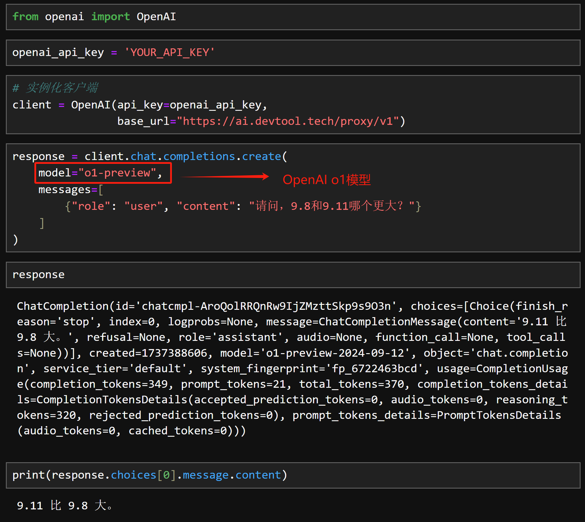

**DeepSeek R1模型**

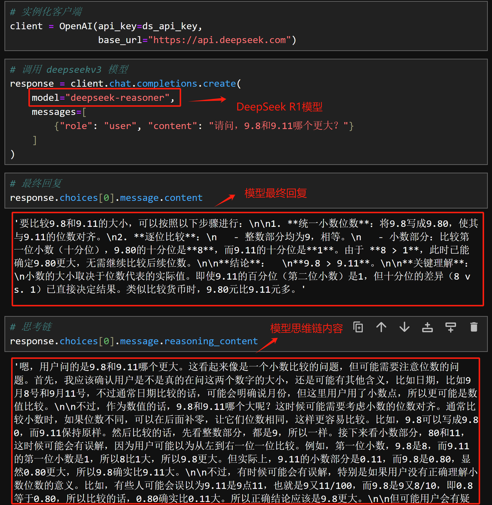

&emsp;&emsp;类似“9.8和9.11谁更大”的这种问题，对于DeepSeek R1来说肯定不在话下。

&emsp;&emsp;并且，最重要的是，被誉为开源之光的DeepSeek这次也同样没有令广大开发者失望，这次**DeepSeek R1开源得非常彻底**，同样也是模型架构和模型权重全开源，并且附带一份完整的技术报告：

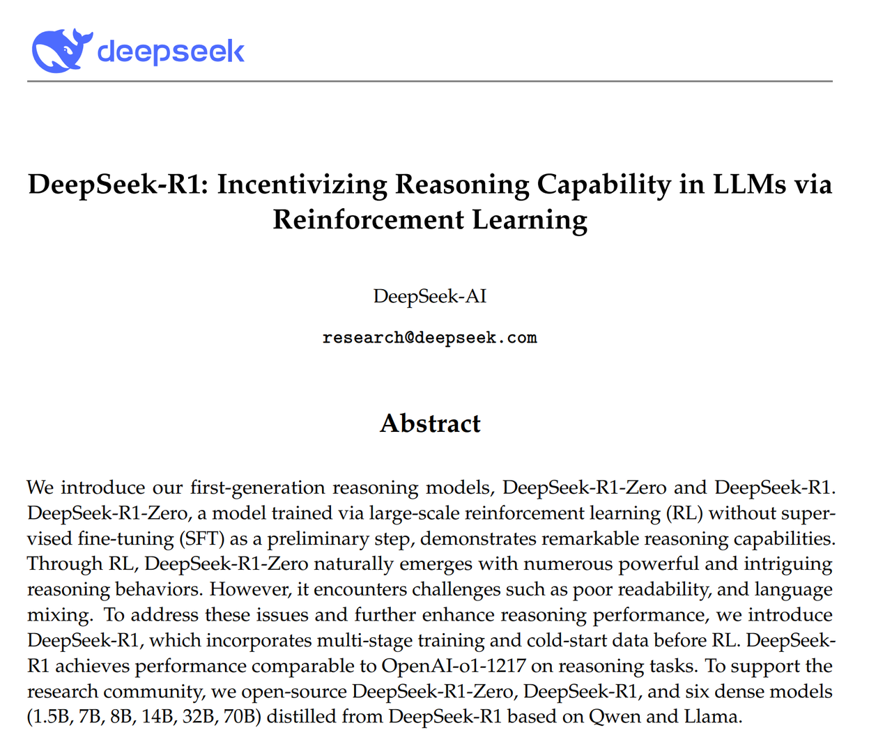

&emsp;&emsp;这次R1模型系列其实是开源了两个模型，分别是**DeepSeek R1**和**DeepSeek R1 Zero**，这两款模型都是推理模型，并且也都是由DeepSeek v3 Base模型经过强化学习的后训练之后获得的模型，只不过R1模型在强化学习训练之前先经过了有监督微调，而R1 Zero模型没有，因此R1模型在推理、写作、编程等各领域表现更好，我们调用的API实际上背后就是R1模型，

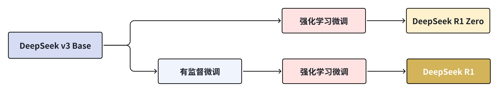

&emsp;&emsp;而相比之下呢，R1 Zero其实会拥有更多的“待开发潜力”，如果对其进行合理的微调，那么它将在某个特定领域展示出更强大的能力。

&emsp;&emsp;总的来看，DeepSeek R1一系列模型和DeepSeek v3这一系列模型的模型架构完全相同，只不过训练过程不同、训练数据不同，最终这些模型的能力也各不相同。这其实也是大模型发展的一个趋势，从卷架构，逐渐转移到优化训练过程和训练数据。我们的大模型技术社区，近期就上线了一套从零训练Mini DeepSeek v3的完整教程，并且受到DeepSeek R1模型训练过程的启发，老师们正在抓紧时间训练Mini DeepSeek R1，相信很快相关教程就会在大模型社区中上线。感兴趣的伙伴们扫码即可免费加入大模型社区。

  

&emsp;&emsp;到这，你是不是以为开源就结束了？no no no。真正的重头戏在最后。

&emsp;&emsp;或许是考虑到DeepSeek R1和DeepSeek v3都是671B参数的超大模型，本地部署至少需要1000G以上显存，这次深度求索非常人性化的用DeepSeek R1蒸馏了很多个小尺寸的推理模型。所谓**模型蒸馏**，简单理解就是指通过某种方法把大模型的能力呢传输给小模型，就好比武林高手给你传功。而经过DeepSeek R1模型、这个推理模型的蒸馏之后，这些小尺寸模型的推理能力得到了大幅提高，以下是官方给出的这组蒸馏模型的性能表现：

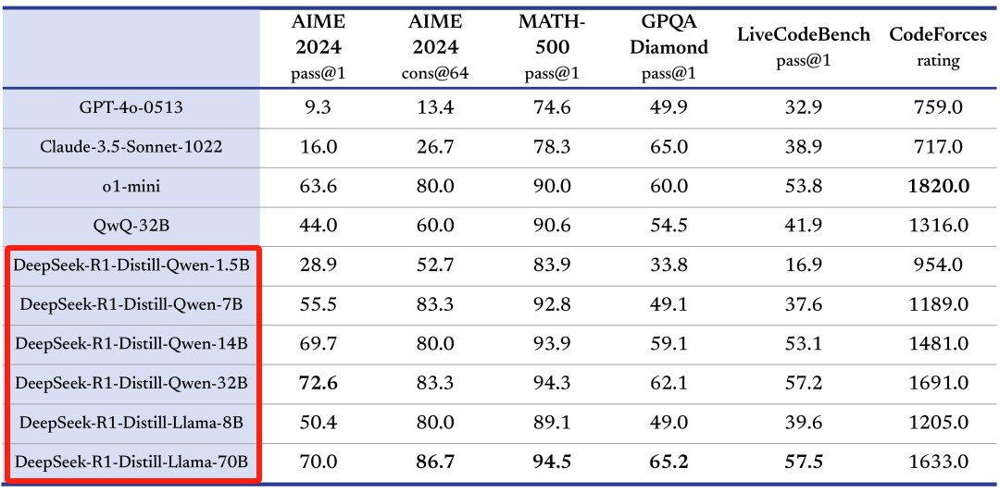

&emsp;&emsp;我当时看到这组结果是非常惊讶的，一个1.5B小型的蒸馏模型，手机端就可以运行的一个模型，代码能力就超过了GPT4o；而一个14B的蒸馏模型，推理能力就超过了QWQ-32B，而经过蒸馏的32B模型呢，推理能力更是能够达到o1-mini性能级别，32B其实是一个非常标准的企业级应用的模型尺寸，现在呢，就相当于是企业级场景下，o1-mini级别的模型使用彻底自由使用。

&emsp;&emsp;现在这组蒸馏模型的权重已经全部开放下载，想体验本地部署o1-mini性能级别模型的同学，抓紧时间测试起来吧！

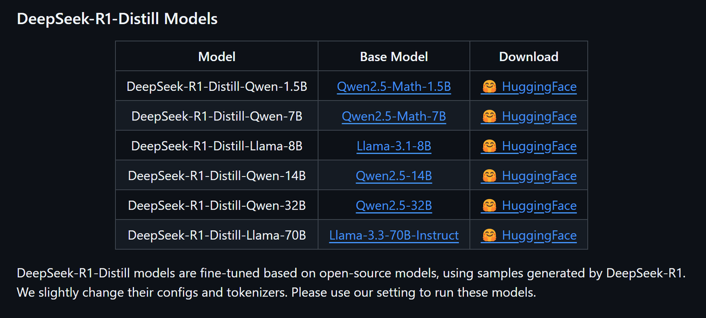

&emsp;&emsp;推理模型其实是大模型通往AGI的必经之路，不仅能直接帮我们解决数学、编程和科研问题，而且推理模型，其实还是智能体Agent开发中必不可少的智能中枢，在未来这个Agent时代将发挥重大作用。而合成数据、模型蒸馏和强化学习训练等技术，则是现在增强大模型推理能力的最有效的技术手段。这轮DeepSeek R1模型的开源，又再一次为全球开发者提供了一份推理大模型的应用、部署、训练全套解决方案，而这也**必将再次大幅推动全球大模型技术发展**。

&emsp;&emsp;好了，以上就是本期视频的全部内容。我是[@九天Hector](https://space.bilibili.com/385842994)，我还创建一个大模型技术社区，为大家提供免费高质量学习内容以及非常活跃的技术交流环境，在这个技术飞速发展的时代与大家共同学习，我们下一个内容，再见！

***