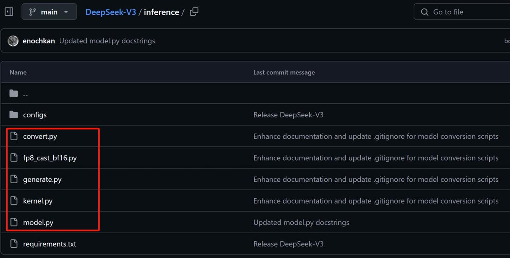
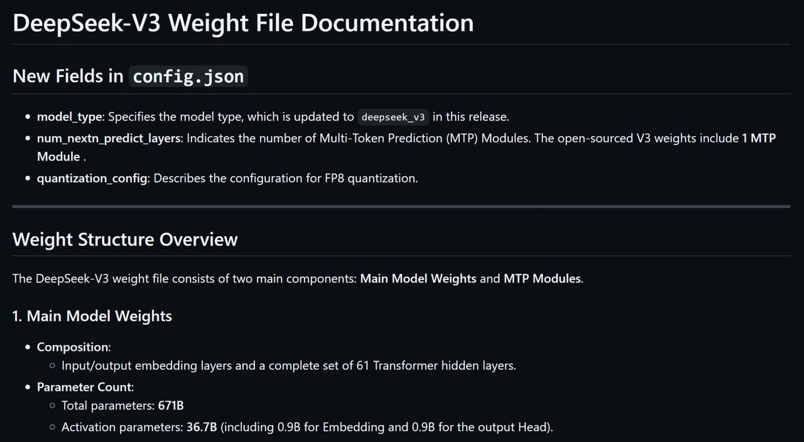
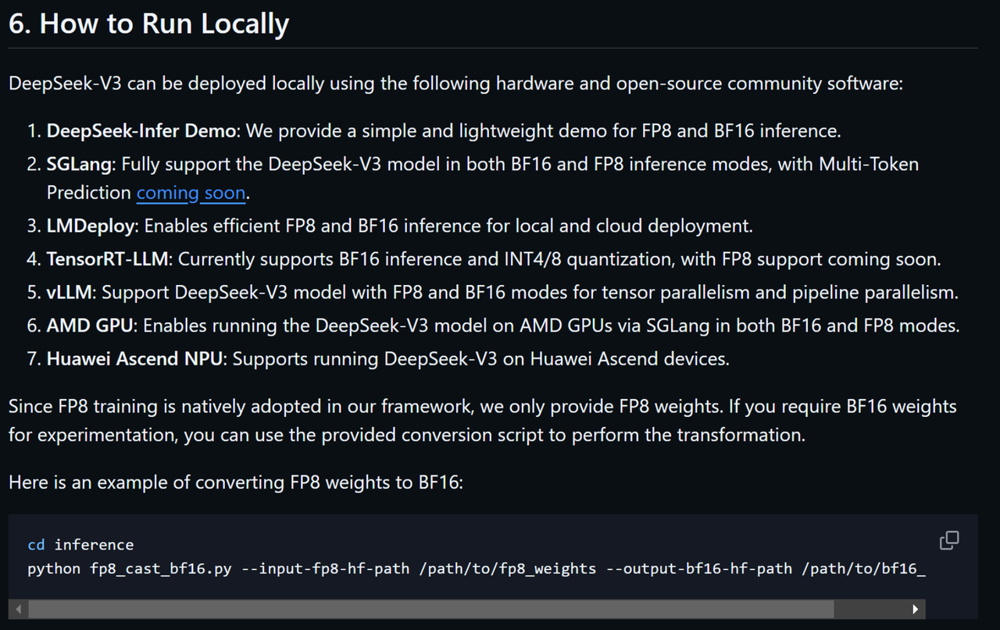
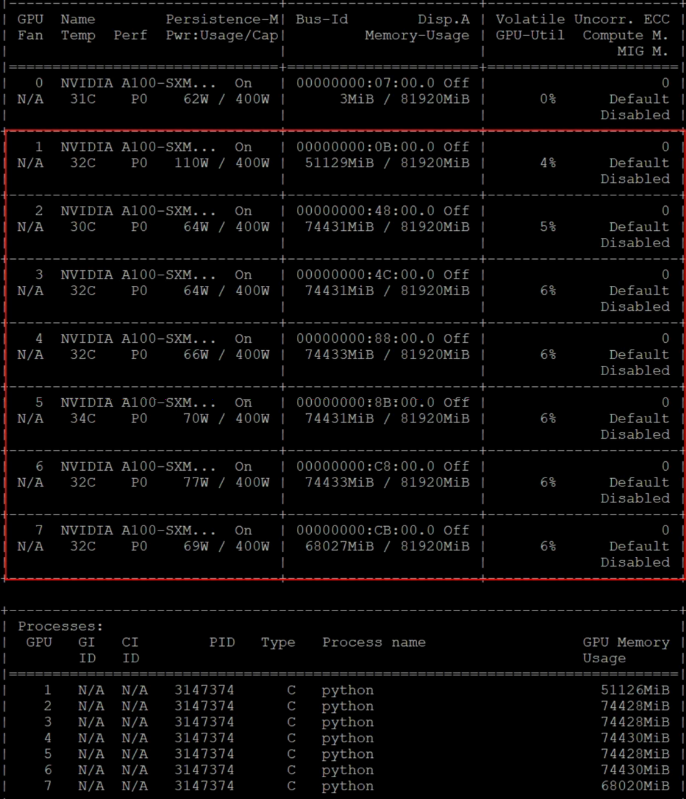
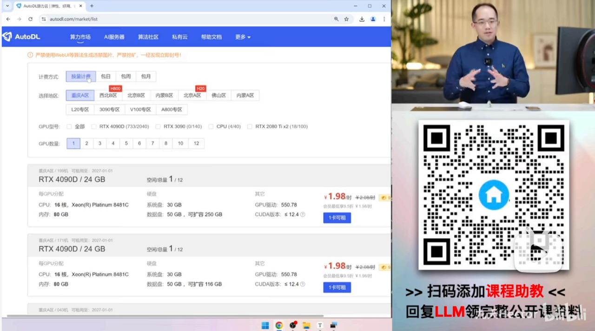
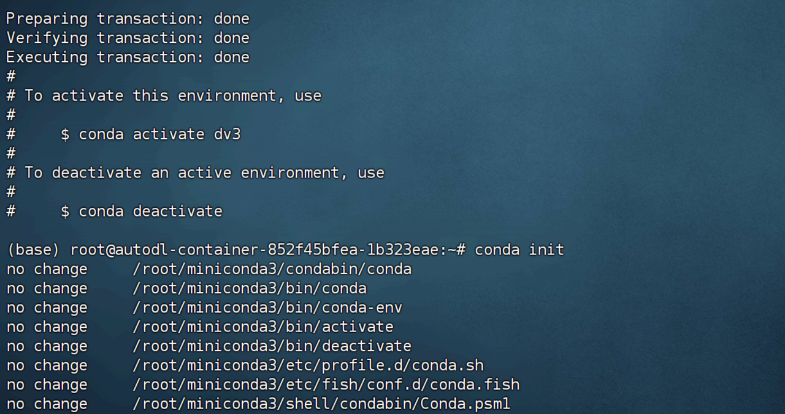
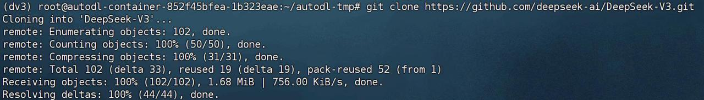
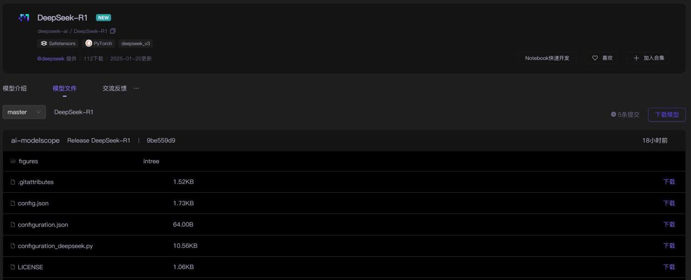
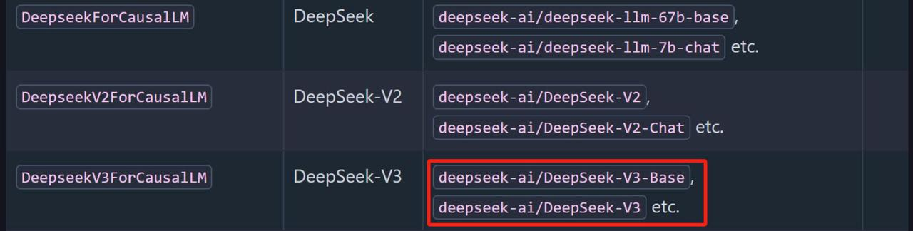

# 课程说明：

* 体验课内容节选自[《2025大模型Agent智能体开发实战》](https://whakv.xetslk.com/s/3xFEAA)完整版付费课程

  体验课时间有限，若想深度学习大模型技术，欢迎大家报名由我主讲的[《2025大模型Agent智能体开发实战》](https://whakv.xetslk.com/s/3xFEAA)：

此外，R1蒸馏版DeepSeek v3我们已经完整复现了模型训练的过程，公开课的全部训练项目代码、数据、以及训练完的模型，已上传至课件网盘，联系⬆️助教即可领取～

***

# **最强开源推理模型DeepSeek** **R1**

# **本地部署指南**

## **DeepSeek** **R1上线公告**

DeepSeek R1上线公告：<https://api-docs.deepseek.com/zh-cn/news/news250120>

我第一时间也在B站上发布视频对R1模型进行了解读，详情请戳售[https://www.bilibili.com/video/BV1](https://www.bilibili.com/video/BV1UBwbe4E1D) [UBwbe4E1D](https://www.bilibili.com/video/BV1UBwbe4E1D)

DeepSeek-R1 在后训练阶段大规模使用了强化学习技术，在仅有极少标注数据的情况下，极大提升了模 型推理能力。在数学、代码、自然语言推理等任务上，性能比肩 OpenAI o1 正式版。

论文链接： <https://github.com/deepseek-ai/DeepSeek-R1/blob/main/DeepSeek_R1.pdf>

这次DeepSeek开源了DeepSeek-R1-Zero 和 DeepSeek-R1 两个 660B 模型的同时，通过 DeepSeek-R1 的输出，蒸馏了 6 个小模型开源给社区，其中 32B 和 70B 模型在多项能力上实现了对标 OpenAI o1-

mini 的效果。

HuggingFace 链接： <https://huggingface.co/deepseek-ai>

## **DeepSeek** **R1开源情况介绍**                                        &#x20;

DeepSeek R1 GitHub项目地址： <https://github.com/deepseek-ai/DeepSeek-R1>

需要注意的是， DeepSeek R1采用了和DeepSeekv3完全相同的架构，只是训练过程和训练数据不同。

具体来说， DeepSeek R1是在DeepSeekV3 base模型基础上，先进行了有监督学习微调，然后再进行强

化学习训练最终获得的模型，而同时开源的DeepSeek R1 Zero则是少了有监督微调步骤，直接从 DeepSeekV3 base上经过强化学习训练得到。

因此，我们看DeepSeek R1项目，其实并没有看到模型权重和推理脚本、以及本地部署方法等关键信

息。其实也是因为这些信息都已经包含在DeepSeekV3模型项目中了，具体项目地址见： [https://github.](https://github.com/deepseek-ai/DeepSeek-V3) [com/deepseek-ai/DeepSeek-V3](https://github.com/deepseek-ai/DeepSeek-V3)

其中模型推理和架构的代码部分内容如下：

* convert.py：用于进行格式转化，将一个已经训练好的模型检查点（checkpoint）文件从一个格式 （比如  safetensors ）转换并保存成一个适合特定模型并行度（model parallelism）和专家数    （n\_experts）的格式。

* fp8\_cast\_bf16 . py：代码的功能是将存储在 FP8 格式中的模型权重转换为 BF16 格式，并保存转换 后的权重。它还更新了模型的索引文件，去除了 scale\_inv 的引用。

* generate.py：代码是一个用于生成文本的示例程序，支持交互式和批量文本生成。它使用一个 Transformer 模型并进行分布式训练。

* kernel.py：代码主要涉及量化和矩阵乘法操作，使用了 **Triton** 库进行加速，特别是针对 **FP8** 精度 （浮点8位）进行了优化。 Triton 是一个专为 GPU 上的高效自定义操作而设计的编程框架，支持

* Python 和 PyTorch，可以通过简洁的代码来实现高效的 GPU 核心。

* model.py： 定义了DeekSeekv3和R1的模型架构。

目前模型权重已经在hugging face上开源了，具体情况如下：

> DeepSeek-V3和R1模型在Hugging Face上的总大小为685B，其中包括671B的主模型权重和14B的 多标记预测（MTP）模块权重。
>
> 为了确保最佳性能和灵活性，我们与开源社区和硬件供应商合作，提供多种在本地运行模型的方 式。有关逐步指导，请参阅第6节：如何在本地运行（How\_to\_Run\_Locally）。
>
> 对于希望深入了解的开发者，我们建议查阅README\_WEIGHTS.md文件，了解主模型权重和多标  记预测（MTP）模块的详细信息。请注意， MTP支持目前仍在社区内积极开发中，我们欢迎您的贡 献和反馈。

并且还非常贴心的介绍了权重情况： [https://github.com/deepseek-ai/DeepSeek-V3/blob/main/READ](https://github.com/deepseek-ai/DeepSeek-V3/blob/main/README_WEIGHTS.md) [ME\_WEIGHTS.md](https://github.com/deepseek-ai/DeepSeek-V3/blob/main/README_WEIGHTS.md)

DeepSeek R1模型权重可在hugging face上主页上下载： [https://huggingface.co/deepseek-ai/DeepSe](https://huggingface.co/deepseek-ai/DeepSeek-R1) [ek-R1](https://huggingface.co/deepseek-ai/DeepSeek-R1)，权重总共约650G大小。

同时该页面中也包含蒸馏模型的下载地址：

此外，也可在魔搭社区上下载： <https://www.modelscope.cn/models/deepseek-ai/DeepSeek-R1>

以及蒸馏模型的权重下载地址：

既然是权重全开源，那肯定是可以在本地运行的，以下官方介绍的本地运行方法：

> **6.** **如何在本地运行**
>
> * DeepSeek-V3可以使用以下硬件和开源社区软件在本地部署：
>
> * **DeepSeek-Infer** **Demo**：我们提供了一个简单且轻量的演示，支持FP8和BF16推理。
>
> * **SGLang**：完全支持DeepSeek-V3模型在BF16和FP8推理模式下运行，且即将支持多标记预测 （MTP）。
>
> * **LMDeploy**：支持高效的FP8和BF16推理，适用于本地和云端部署。
>
> * **TensorRT-LLM**：目前支持BF16推理和INT4/8量化， FP8支持即将推出。
>
> * **vLLM**：支持DeepSeek-V3模型在FP8和BF16模式下进行张量并行和流水线并行。
>
> * **AMD** **GPU**：通过SGLang，在BF16和FP8模式下支持在AMD GPU上运行DeepSeek-V3模 型。
>
> * **华为Ascend** **NPU**：支持在华为Ascend设备上运行DeepSeek-V3模型。
>
> 由于我们的框架原生采用FP8训练，因此只提供FP8权重。如果您需要BF16权重进行实验，您可以 使用提供的转换脚本进行转换。

由于DeepSeek R1的框架原生采用 FP8 训练，因此仅提供 FP8 权重，预估仅700GB+显存便可轻松运行。当然也可以转换到BF16，在半精度下，需1000GB+，而量化到int4时需要450GB+。以下是半精度 下显存占用情况：（占用 490G 显存，需要 7张 80GA100，租赁成本约1000元1天）

## **DeepSeek** **R1本地部署与调用流程**                               &#x20;

本次DeepSeek R1的本地部署流程和DeepSeekV3完全相同，由于服务器使用冲突，本教程只介绍 DeepSeek R1部署流程与代码解释，具体模型调用的实机演示，参看DeepSeekV3部署调用流程： [http](https://www.bilibili.com/video/BV1jjwVe4EKn/)  [s://www.bilibili.com/video/BV1jjwVe4EKn/](https://www.bilibili.com/video/BV1jjwVe4EKn/)

此外，硬件环境也可考虑在AutoDL上进行租赁，具体租赁方法可参考我的教程：《AutoDL快速入 门与GPU租赁使用指南》 <https://www.bilibili.com/video/BV1bxB7YYEST/>

* &#x20;创建虚拟环境

| conda create --name dv3 python=3.11 conda initsource \~/.bashrcconda activate dv3 |
| --------------------------------------------------------------------------------- |

| conda install jupyterlab conda install ipykernelpython -m ipykernel install --user --name dv3 --display-name "Python (dv3)" |
| --------------------------------------------------------------------------------------------------------------------------- |

* 登录Github主页拉取项目

访问DeepSeek V1主页：<https://github.com/deepseek-ai/DeepSeek-V3>

> 注，这里需要下载DeepSeekV3的项目源码，然后使用DeepSeek R1的权重进行调用。

| git clone https://github.com/deepseek-ai/DeepSeek-V3.git |
| -------------------------------------------------------- |

* 安装依赖

| cd DeepSeek-V3/inferencepip install -r requirements.txt |
| ------------------------------------------------------- |

* 下载模型权重

可以在HuggingFace或者魔搭社区上下载模型权重，考虑到国内网络情况，推荐使用魔搭社区进行  下载。 DeepSeek R1魔搭社区官网地址： [https://www.modelscope.cn/models/deepseek-ai/DeepSee](https://www.modelscope.cn/models/deepseek-ai/DeepSeek-R1) [k-R1](https://www.modelscope.cn/models/deepseek-ai/DeepSeek-R1)

> 注，下载前需提前留出600G左右存储空间，用于保存模型权重

具体下载流程如下：

| pip install modelscope |
| ---------------------- |

| mkdir ./deepseekmodelscope download --model deepseek-ai/DeepSeek-R1 --local\_dir ./deepseek |
| ------------------------------------------------------------------------------------------- |

* &#x20; 借助convert.py模型权重转化

| cd DeepSeek-V3/inferencepython convert.py --hf-ckpt-path /path/to/DeepSeek-R1 --save-path /path/to/DeepSeek-R1-Demo --n-experts 256 --model-parallel 16 |
| ------------------------------------------------------------------------------------------------------------------------------------------------------- |

* `python convert.py `：运行`convert.py`脚本，这个脚本的作用是将Hugging  Face格式的模型权 重转换为另一个特定的格式。

* `--hf-ckpt-path /path/to/DeepSeek-R1 `：指定Hugging  Face格式的模型检查点路径（即模型 文件所在的位置）。在这个例子中是` /path/to/DeepSeek-R1`。

* `--save-path /path/to/DeepSeek-R1-Demo `：指定转换后的模型权重保存的路径，即你想将模型 保存到哪里。

* `--n-experts 256 `：指定模型中的专家数量，这可能是与模型的分布式训练或者混合专家模型 （Mixture of Experts, MoE）相关的参数，设置为256表示该模型将使用256个专家。

* `--model-parallel 16 `：这个参数指定模型并行的程度，通常是指将模型分布在16个GPU上进行 训练或推理。

* &#x20;借助generate.py进行模型推理

| torchrun --nnodes 2 --nproc-per-node 8 --node-rank $RANK --master-addr $ADDR generate.py --ckpt-path /path/to/DeepSeek-R1-Demo --configconfigs/config\_671B.json --interactive --temperature 0.7 --max-new-tokens 200 |
| --------------------------------------------------------------------------------------------------------------------------------------------------------------------------------------------------------------------- |

这部分命令用于运行模型并生成文本。各个参数的含义如下：

* `torchrun `：用于分布式训练或推理的命令。它会启动多个进程，支持跨多个节点（即多台机器） 运行。

* `--nnodes 2` ：指定集群中的节点数目。在这个例子中，使用2个节点（即2台机器）。

* `--nproc-per-node 8` ：每个节点上运行的进程数。在每个节点上启动8个进程，通常是为了充分 利用每个节点上的多个GPU。

* `--node-rank $RANK `：当前节点在集群中的排名，用于区分不同节点。   $RANK 是一个环境变量， 代表当前节点的编号。

* `--master-addr $ADDR `：指定主节点的地址。主节点通常负责协调所有其他节点的工作。   $ADDR 是一个环境变量，表示主节点的IP地址或主机名。

* `generate.py `：这是运行文本生成任务的脚本，它会使用模型进行推理生成文本。

* `--ckpt-path /path/to/DeepSeek-R1-Demo` ：指定转换后的DeepSeek-R1模型检查点路径。这 个路径是你之前在转换步骤中保存的模型文件。

* `--config configs/config_671B.json `：指定模型的配置文件。配置文件包含模型的架构、超参 数等信息。在这个例子中，配置文件是 configs/config\_671B.json。

* `--interactive `：启用交互模式，通常表示用户可以在命令行中输入内容，并实时获得模型的响 应。

* `--temperature 0.7` ：生成的温度值，影响模型的输出随机性。温度越高，生成的文本越随机； 温度越低，生成的文本越确定。 0.7通常意味着适度的随机性。

* `--max-new-tokens 200 `：限制生成的最大新token数量，表示每次生成时最多生成200个新的词 元。

然后即可完成推理。

### **DeepSeek** **R1+SGLang部署方案**

SGLang项目主页： <https://github.com/sgl-project/sglang>

SGLang  目前支持 MLA 优化、 DP Attention、 FP8 (W8A8)、 FP8 KV 缓存和 Torch Compile，在开 源框架中提供了领先的延迟和吞吐量性能。

需要注意的是， SGLangv0.4.1 完全支持在 NVIDIA 和 AMD GPU 上运行 DeepSeek-V3和R1，使其  成为一个高度通用且稳健的解决方案。 SGLang 还支持多节点张量并行，允许你在多个网络连接的机器上 运行该模型。目前多标记预测（MTP）正在开发中，进展可以在优化计划中追踪。

* 安装SGLang

| pip install "sglang\[all]>=0.4.1.post5" --find-links <https://flashinfer.ai/whl/cu124/torch2.4/flashinfer> |
| ---------------------------------------------------------------------------------------------------------- |

* &#x20;调用DeepSeek R1

| python3 -m sglang.launch\_server --model deepseek-ai/DeepSeek-R1 --tp 8 --trust- remote-code |
| -------------------------------------------------------------------------------------------- |

此时服务将在30000端口启动。接下来即可使用OpenAI风格API来调用DeepSeek R1模型了：

| import openaiclient = openai.Client(base\_url="http://[127.0.0.1](http://127.0.0.1):30000/v1", api\_key="EMPTY")# Chat completionresponse = client.chat.completions.create( model="default",messages=\[{"role": "system", "content": "You are a helpful AI assistant"},{"role": "user", "content": "List 3 countries and their capitals."}, ],temperature=0,max\_tokens=64, )print(response) |
| -------------------------------------------------------------------------------------------------------------------------------------------------------------------------------------------------------------------------------------------------------------------------------------------------------------------------------------------------------------------------------------------- |

### **DeepSeek** **R1+LMDeploy部署方案**

LMDeploy项目主页： <https://github.com/InternLM/lmdeploy>

LMDeploy 是一个灵活且高性能的推理与服务框架，专为大语言模型量身定制，现在支持

DeepSeek-R1。它提供了离线管道处理和在线部署能力，能够与基于 PyTorch 的工作流无缝集成。具体 使用LMDeploy调用DeepSeek R1流程如下：

* 安装LMDeploy

| git clone -b support-dsv3 https://github.com/InternLM/lmdeploy.git cd lmdeploypip install -e . |
| ---------------------------------------------------------------------------------------------- |

* &#x20;单任务推理，编写Python脚本执行

| from lmdeploy import pipeline, PytorchEngineConfigif    name    == "    main    ":pipe = pipeline("deepseek-ai/DeepSeek-R1-FP8", backend\_config=PytorchEngineConfig(tp=8))messages\_list = \[\[{"role": "user", "content": "Who are you?"}],\[{"role": "user", "content": "Translate the following content into Chinese directly: DeepSeek-V3 adopts innovative architectures to guarantee economical training and efficient inference."}],\[{"role": "user", "content": "Write a piece of quicksort code in C++."}], ]output = pipe(messages\_list) print(output) |
| ------------------------------------------------------------------------------------------------------------------------------------------------------------------------------------------------------------------------------------------------------------------------------------------------------------------------------------------------------------------------------------------------------------------------------------------------------------------------------------------------------------------------------------------------------------------- |

* 在线服务调用&#x20;

先运行如下命令

| # runlmdeploy serve api\_server deepseek-ai/DeepSeek-R1-FP8 --tp 8 --backend pytorch |
| ------------------------------------------------------------------------------------ |

接下来即可在23333端口调用DeepSeek R1模型：

| from openai import OpenAI client = OpenAI(api\_key='YOUR\_API\_KEY',base\_url="http://[0.0.0.0](http://0.0.0.0):23333/v1")model\_name = client.models.list().data\[0].id response = client.chat.completions.create(model=model\_name, messages=\[{"role": "user", "content": "Write a piece of quicksort code in C++."} ],temperature=0.8,top\_p=0.8)print(response) |
| -------------------------------------------------------------------------------------------------------------------------------------------------------------------------------------------------------------------------------------------------------------------------------------------------------------------------------------------------------------------- |

### **DeepSeek** **R1+vLLM部署方案**

vLLM项目主页： <https://github.com/vllm-project/vllm>

vLLM v0.6.6 支持在 NVIDIA 和 AMD GPU 上以 FP8 和 BF16 模式进行 DeepSeek-R1 推理。除了标准技 术外，vLLM 还提供了管道并行性，允许你在多个网络连接的机器上运行该模型。

* vLLM安装

| pip install vllm |
| ---------------- |

* DeepSeek R1调用

目前vLLM已支持DeepSeek R1模型调用，可以在模型支持列表中查看模型关键字：  [https://docs.vllm.ai/](https://docs.vllm.ai/en/latest/models/supported_models.html) [en/latest/models/supported\_models.html](https://docs.vllm.ai/en/latest/models/supported_models.html)

接下来即可使用如下代码进行调用：

| from vllm import LLM# For generative models (task=generate) onlyllm = LLM(model=deepseek-ai/DeepSeek-R1, task="generate")  # 这里需要手动修改R1模型权重保存路径output = llm.generate("Hello, my name is") print(output) |
| ------------------------------------------------------------------------------------------------------------------------------------------------------------------------------------------------------- |

DeepSeek官网： <https://www.deepseek.com/>

DeepSeek R1 GitHub项目地址： <https://github.com/deepseek-ai/DeepSeek-R1>

DeepSeek R1 Hugging Face项目地址： <https://huggingface.co/deepseek-ai/DeepSeek-R1>

DeepSeek R1魔搭社区地址： <https://modelscope.cn/models/deepseek-ai/DeepSeek-R1/>
