# 课程说明：

* 体验课内容节选自[《2025大模型Agent智能体开发实战》](https://whakv.xetslk.com/s/1zrFP8)完整版付费课程

  体验课时间有限，若想深度学习大模型技术，欢迎大家报名由我主讲的[《2025大模型Agent智能体开发实战》](https://whakv.xetslk.com/s/1zrFP8)：

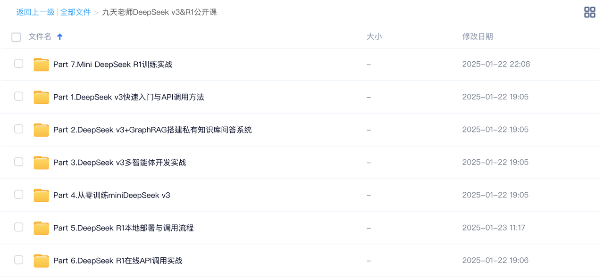

此外，公开课全部训练项目代码、数据、以及训练完的模型，已上传至课件网盘，联系⬆️助教即可领取。

***

# **DeepSeek-R1-Distill**

# **蒸馏模型部署与调用指南**

## **一、** **DeepSeek** **R1蒸馏模型开源情况**

DeepSeek R1开源的同时，还重磅开源了一组基于DeepSeek R1蒸馏的小尺寸推理模型。其中基于 Qwen 1.5B蒸馏模型的编程能力就已超过了GPT4o，而基于Qwen32B蒸馏模型的性能就已经和OpenAI o1 mini模型性能相当。可以说，基本实现了推理模型使用自由。

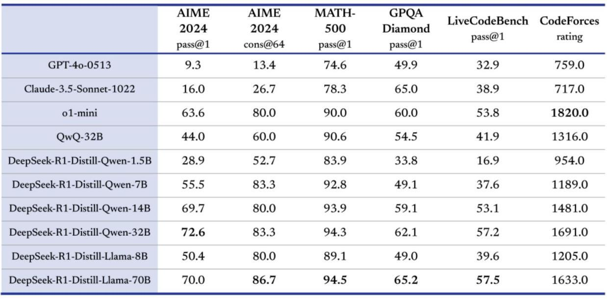

目前各组蒸馏模型权重、 GGUF版权重都已在huggingface和魔搭社区中上线了，开发者可以自由调用使 用，开源协议遵循MIT协议，且可以免费商用。

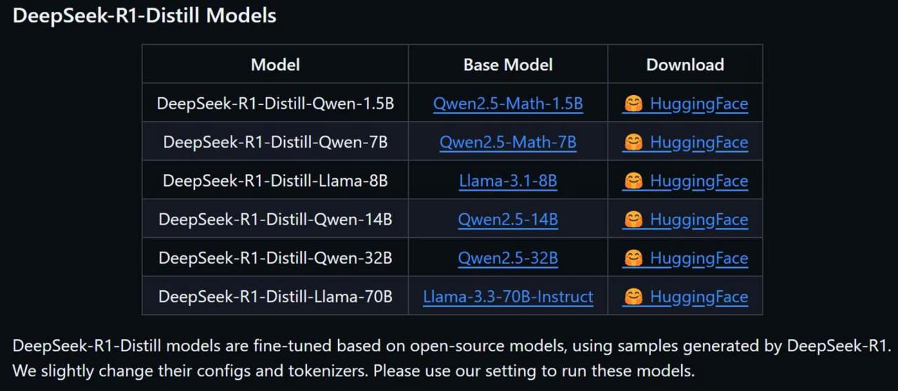

模型蒸馏并未改变模型原始的调用方法，基于Qwen 2.5和Llama 3的这组蒸馏模型，也可以按照原始模 型调用方法进行调用。

本节公开课，就为大家详细介绍这组蒸馏模型的调用方法，这里以1.5B蒸馏模型（DeepSeek-R1-Distill- Qwen-1.5B）为例进行演示，其他模型调用方法都是类似，只需换个模型名字即可。

> 1.5B模型最多仅需6G现存即可运行。

&#x20;

* 参考项目地址：

  * DeepSeek R1 GitHub项目地址： <https://github.com/deepseek-ai/DeepSeek-R1>

  * DeepSeek R1 huggingface项目地址： <https://huggingface.co/deepseek-ai/DeepSeek-R1>&#x20;

  * DeepSeek R1及蒸馏模型组ollama地址：<https://ollama.com/library/deepseek-r1>

  * DeepSeek官网： <https://www.deepseek.com/>

  * DeepSeek-R1-Distill-Qwen-1.5B[https://modelscope.cn/models/deepseek-ai/DeepSeek-R](https://modelscope.cn/models/deepseek-ai/DeepSeek-R1-Distill-Qwen-1.5B) [1-Distill-Qwen-1.5B](https://modelscope.cn/models/deepseek-ai/DeepSeek-R1-Distill-Qwen-1.5B)

  * Ollama官网：<https://ollama.com/>

***

## **二、** **DeepSeek-R1-Distill-Qwen-1.5B本地部署调用流程**

### **1.** **DeepSeek-R1-Distill-Qwen-1.5B模型下载流程**

* 创建虚拟环境

| conda create --name R1 python=3.10conda initsource \~/.bashrc  conda activate R1 |
| -------------------------------------------------------------------------------- |

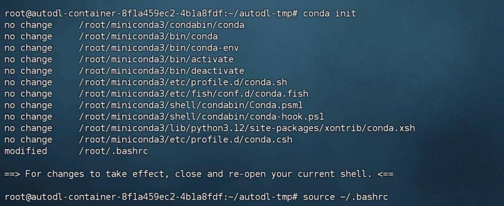

* 创建Jupyter Kernel

| conda install jupyterlab conda install ipykernelpython -m ipykernel install --user --name R1 --display-name "Python R1)" |
| ------------------------------------------------------------------------------------------------------------------------ |

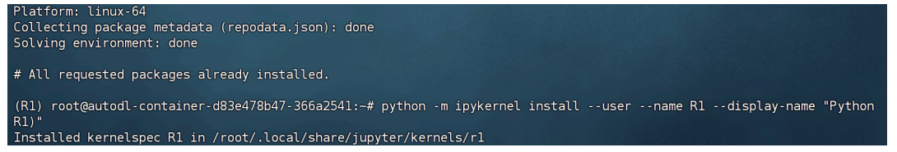

* 安装魔搭社区

| pip install modelscope |
| ---------------------- |

* 创建项目主目录

| cd /root/autodl-tmp mkdir R1-Distillcd ./R1-Distill |
| --------------------------------------------------- |

* 上传并安装依赖

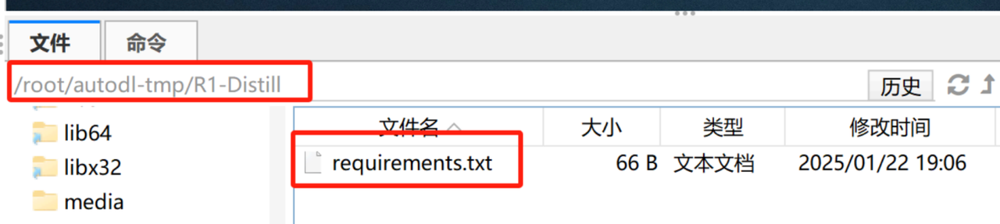

项目依赖在网盘中：

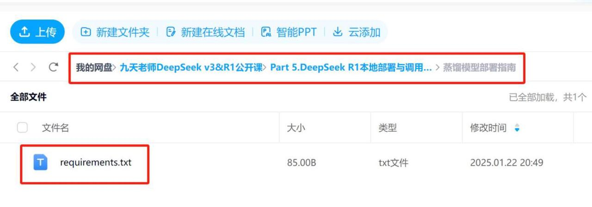

上传完即可进行安装

| pip install -r requirements.txt |
| ------------------------------- |

* 下载项目权重

| mkdir ./DeepSeek-R1-1.5Bmodelscope download --model deepseek-ai/DeepSeek-R1-Distill-Qwen-1.5B -- local\_dir ./DeepSeek-R1-1.5B |
| ------------------------------------------------------------------------------------------------------------------------------ |

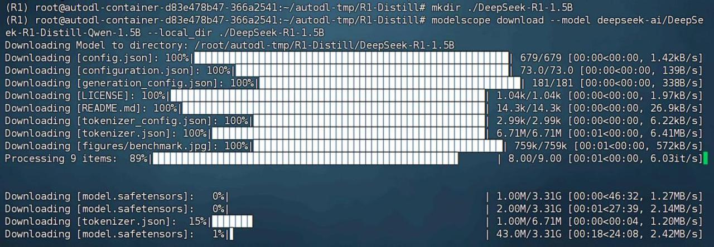

下载完成后1.5B蒸馏模型完整项目如下：

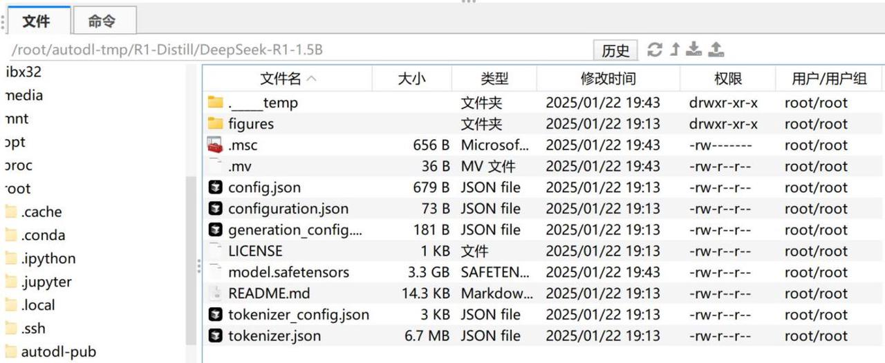

项目权重也可从网盘文件中下载：

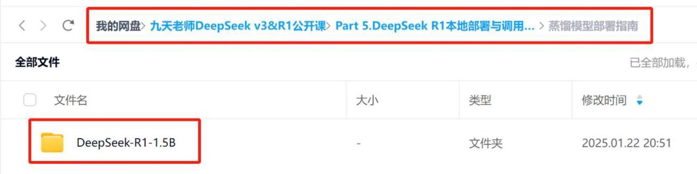

### **2.Jupyter中使用transformer原生库调用流程**

然后即可使用transformer进行调用，具体调用步骤如下：

* 导入相关库

| from modelscope import AutoModelForCausalLM, AutoTokenizer |
| ---------------------------------------------------------- |

* 设置模型下载地址

| model\_name = "./DeepSeek-R1-1.5B" |
| ---------------------------------- |

* 实例化预训练模型与分词器

| model = AutoModelForCausalLM.from\_pretrained(          model\_name,         torch\_dtype="auto",         device\_map="auto",         low\_cpu\_mem\_usage=True)tokenizer = AutoTokenizer.from\_pretrained(model\_name) |
| ----------------------------------------------------------------------------------------------------------------------------------------------------------------------------------------------------------------------- |

* 创建消息message

| prompt = "你好，好久不见，请介绍下你自己。 " messages = \[         {"role": "system", "content": "你是一名助人为乐的助手。 "},          {"role": "user", "content": prompt}] |
| ------------------------------------------------------------------------------------------------------------------------------------------------ |

* 词嵌入过程

| text = tokenizer.apply\_chat\_template(          messages,         tokenize=False,         add\_generation\_prompt=True)model\_inputs = tokenizer(\[text], return\_tensors="pt").to(model.device) |
| ------------------------------------------------------------------------------------------------------------------------------------------------------------------------------------------------- |

* 创建并回复

| generated\_ids = model.generate(          \*\*model\_inputs,         max\_new\_tokens=512)generated\_ids = \[         output\_ids\[len(input\_ids):] for input\_ids, output\_ids in zip(model\_inputs.input\_ids, generated\_ids)]response = tokenizer.batch\_decode(generated\_ids, skip\_special\_tokens=True)\[0]print(response) |
| ----------------------------------------------------------------------------------------------------------------------------------------------------------------------------------------------------------------------------------------------------------------------------------------------------------------------------------- |

最终运行结果如下：

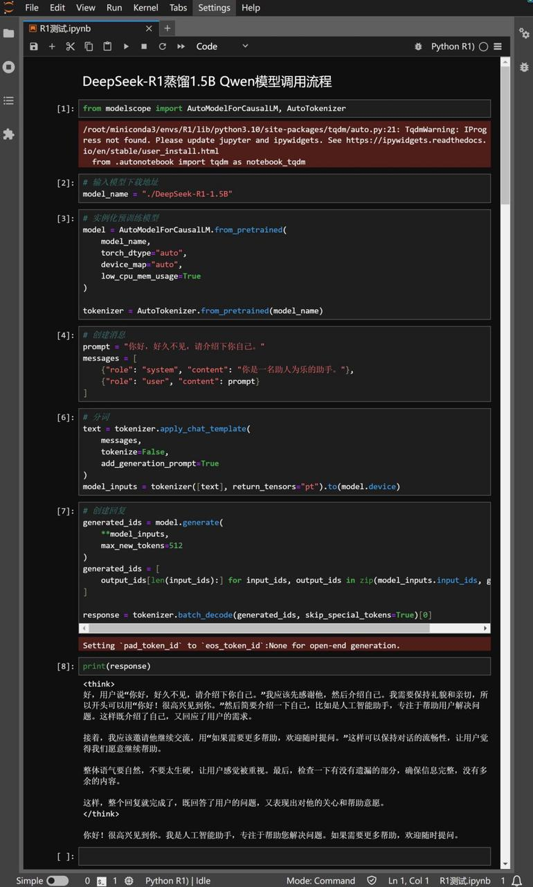

能够看出，此时模型回复结果中就包含思维链的全部内容。实际使用过程中，可以通过正则化的方法将 思维链内容和模型回复内容进行区分。

## **三、** **DeepSeek-R1-Distill-Qwen-1.5B** **ollama调用流程**

> 注意：本部分演示环节采用了1.5B模型Q4\_K\_M量化版本，仅1.5G显存即可运行，但受限于模型尺  寸及量化尺寸，实际模型性能一般，本部分教程仅用作演示，实际使用过程中建议至少使用7B以上 模型，才能有较好的对话效果。

目前DeepSeek R1及其蒸馏模型均支持使用ollama进行调用，可以在模型主页查看调用情况： [http](https://ollama.com/library/deepseek-r1) [s://ollama.com/library/deepseek-r1](https://ollama.com/library/deepseek-r1)

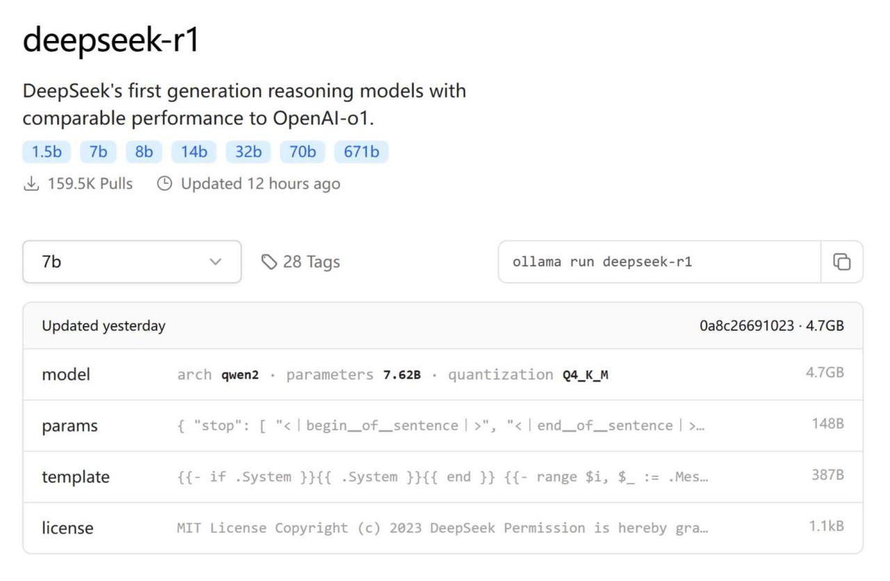

其中各模型在Q4   K   M量化情况下运行所需显存情况如下：

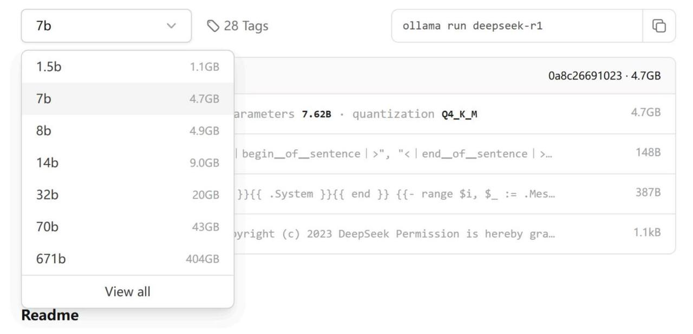

这里我们还是以1.5B模型为例进行演示，其他模型流程类似。

* 安装ollama

| curl -fsSL https://ollama.com/install.sh \| sh |
| ---------------------------------------------- |

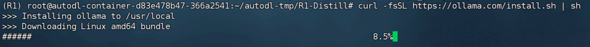

安装完成后可以使用ollama run命令自动下载模型权重并自动运行，或者手动下载1.5B模型的 GGUF格式，然后注册ollama服务，再进行调用。这里我们逐一执行两种调用方法。

* 启动ollama

安装完成后即可使用ollama start来启动ollama服务

| ollama start |
| ------------ |

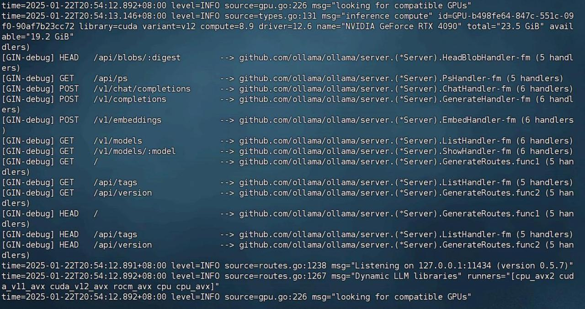

### **【方案一】使用ollama** **run** **自动下载模型权重并运行**

| ollama run deepseek-r1:1.5b |
| --------------------------- |

使用该命令后系统就会自动下载模型权重，并自动完成注册。

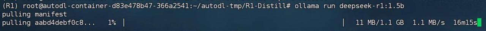

等待模型下载完成后即可直接使用：

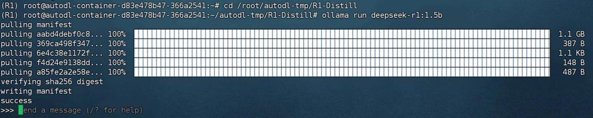

对话效果如下：

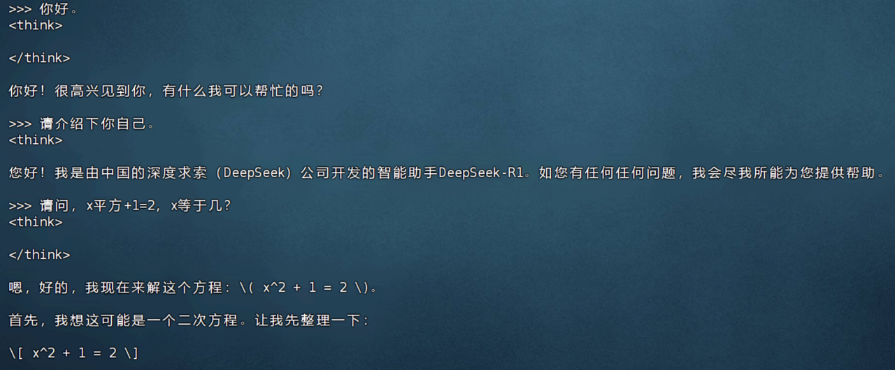

### **【方案二】手动下载GGUF权重并运行**

除了使用ollama run命令外， ollama也支持调用手动下载的自定义模型，但需要是GGUF格式。目前

DeepSeek-R1-Distill-Qwen-1.5B模型已有各种不同量化版本的GGUF模型在魔搭社区中上线了： [https://](https://modelscope.cn/search?search=DeepSeek-R1-Distill-Qwen-1.5B-GGUF) [modelscope.cn/search?search=DeepSeek-R1-Distill-Qwen-1.5B-GGUF](https://modelscope.cn/search?search=DeepSeek-R1-Distill-Qwen-1.5B-GGUF)

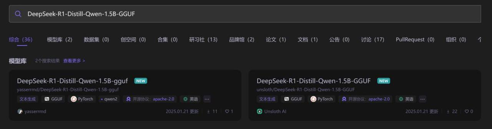

其中每个GGUF量化的权重都包含多个版本：

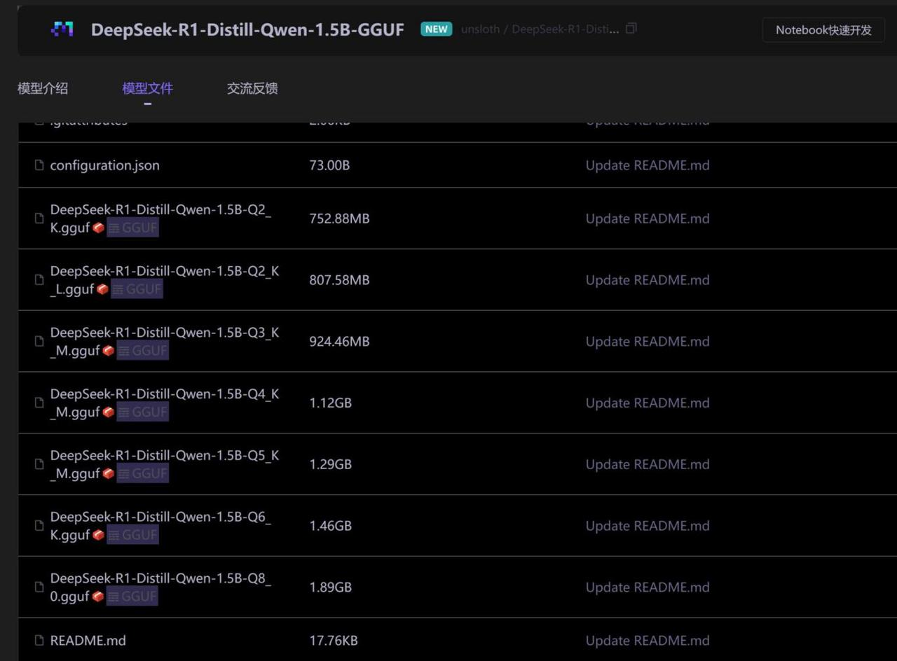

其中ollama调用的就是Q4\_K\_M量化版本。这里我们还是考虑下载Q4\_K\_M量化版本的GGUF权重进行调 用，具体执行流程如下。

* 下载GGUF格式权重

| mkdir DeepSeek-R1-1.5B-GGUFmodelscope download --model unsloth/DeepSeek-R1-Distill-Qwen-1.5B-GGUF DeepSeek- R1-Distill-Qwen-1.5B-Q4 K  M.gguf --local\_dir ./DeepSeek-R1-1.5B-GGUF |
| ---------------------------------------------------------------------------------------------------------------------------------------------------------------------------------- |

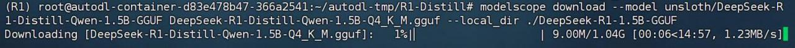

* 注册模型

然后需要创建一个file文件，用于进行ollama模型注册：

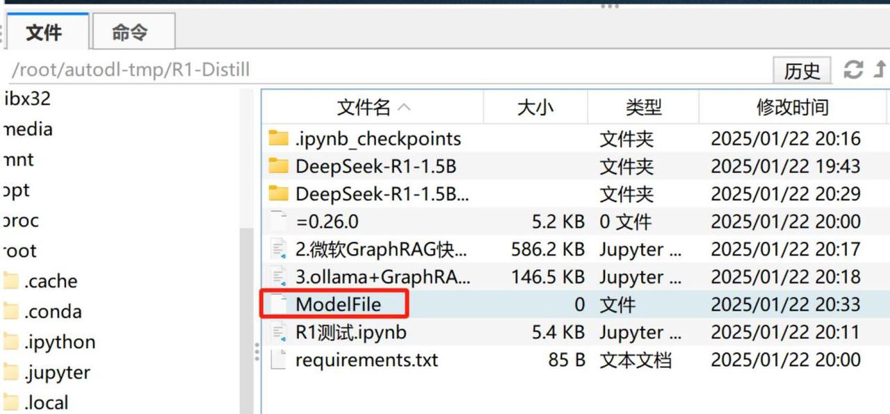

然后在File文件中写入自定义模型GGUF权重地址：

| FROM ./DeepSeek-R1-1.5B-GGUF./DeepSeek-R1-Distill-Qwen-1.5B-Q4 K  M.gguf |
| ------------------------------------------------------------------------ |

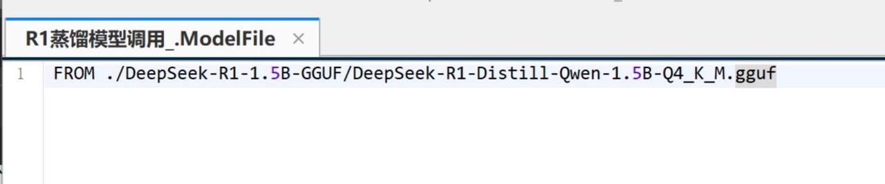

然后将该模型加入Ollama本地模型列表：

| ollama create DeepSeek-R1-1.5B -f ModelFile |
| ------------------------------------------- |

查看模型是否注册成功

| ollama list |
| ----------- |

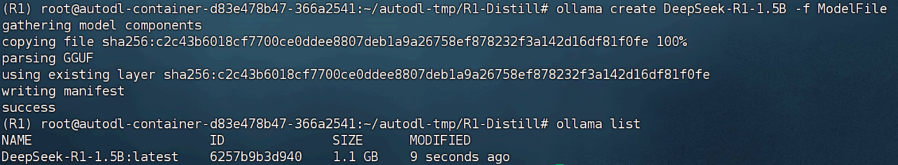

接下来即可使用了：

| ollama run DeepSeek-R1-1.5B |
| --------------------------- |

