# 课程说明：

* 体验课内容节选自[《2025大模型Agent智能体开发实战》](https://whakv.xetslk.com/s/1zrFP8)完整版付费课程

  体验课时间有限，若想深度学习大模型技术，欢迎大家报名由我主讲的[《2025大模型Agent智能体开发实战》](https://whakv.xetslk.com/s/1zrFP8)：


此外，公开课全部训练项目代码、数据、以及训练完的模型，已上传至课件网盘，联系⬆️助教即可领取。

***

# Janus Pro本地调用指南

## 一、图像识别多模态功能实现

* 导入依赖

```python
import torch
from transformers import AutoModelForCausalLM
from janus.models import MultiModalityCausalLM, VLChatProcessor
from janus.utils.io import load_pil_images
```

* 导入模型及分词器

```python
# 指定模型路径
model_path = "./Janus-Pro-7B"

# 加载VLChatProcessor
vl_chat_processor: VLChatProcessor = VLChatProcessor.from_pretrained(model_path)

# 加载分词器
tokenizer = vl_chat_processor.tokenizer
```

```plaintext
Some kwargs in processor config are unused and will not have any effect: num_image_tokens, ignore_id, image_tag, sft_format, mask_prompt, add_special_token. 
```

```python
# 加载vl_gpt
vl_gpt: MultiModalityCausalLM = AutoModelForCausalLM.from_pretrained(
    model_path, trust_remote_code=True
)
vl_gpt = vl_gpt.to(torch.bfloat16).cuda().eval()
```

```plaintext
Loading checkpoint shards: 100%|████████████████████████████████████████████████████████████████████| 2/2 [00:02<00:00,  1.11s/it]
```

* 创建会话消息

```python
image = "./pic1.png"
```


```python
question = "explain this meme"
```

```python
conversation = [
    {
        "role": "<|User|>",
        "content": f"<image_placeholder>\n{question}",
        "images": [image],
    },
    {"role": "<|Assistant|>", "content": ""},
]
```

* 图片信息编码

```python
pil_images = load_pil_images(conversation)
prepare_inputs = vl_chat_processor(
    conversations=conversation, images=pil_images, force_batchify=True
).to(vl_gpt.device)
```

```python
# # run image encoder to get the image embeddings
inputs_embeds = vl_gpt.prepare_inputs_embeds(**prepare_inputs)
```

```python
inputs_embeds
```

```plaintext
tensor([[[-1.0757e-03,  1.0538e-04,  2.0117e-01,  ..., -1.1749e-03,
          -3.0899e-04, -1.1368e-03],
         [-1.0071e-02,  2.9492e-01,  4.4922e-01,  ..., -3.3447e-02,
           3.6865e-02, -5.3223e-02],
         [ 1.3086e-01, -9.3750e-02,  7.4609e-01,  ..., -6.7749e-03,
          -3.3417e-03,  1.6357e-02],
         ...,
         [-7.4387e-04, -7.8125e-03,  2.1680e-01,  ..., -1.2970e-03,
          -4.5471e-03,  6.2180e-04],
         [-7.0496e-03, -5.5847e-03, -4.7913e-03,  ...,  8.0566e-03,
          -1.7319e-03,  1.3504e-03],
         [-5.9204e-03,  6.3477e-02,  3.3789e-01,  ...,  4.7607e-02,
           3.0029e-02, -1.3657e-03]]], device='cuda:0', dtype=torch.bfloat16,
       grad_fn=<IndexPutBackward0>)
```

* 运行模型

```python
# # run the model to get the response
outputs = vl_gpt.language_model.generate(
    inputs_embeds=inputs_embeds,
    attention_mask=prepare_inputs.attention_mask,
    pad_token_id=tokenizer.eos_token_id,
    bos_token_id=tokenizer.bos_token_id,
    eos_token_id=tokenizer.eos_token_id,
    max_new_tokens=512,
    do_sample=False,
    use_cache=True,
)
```

```python
answer = tokenizer.decode(outputs[0].cpu().tolist(), skip_special_tokens=True)
```

```python
print(f"{prepare_inputs['sft_format'][0]}", answer)
```

```plaintext
You are a helpful language and vision assistant. You are able to understand the visual content that the user provides, and assist the user with a variety of tasks using natural language.

<|User|>: <image_placeholder>
explain this meme

<|Assistant|>: This image is a humorous comparison between two types of visual encoding methods, using the popular "Swole Doge vs. Cheems" meme format.

1. **Decoupling Visual Encoding (Left Side)**:
   - The muscular Doge represents a more powerful and efficient method of visual encoding. This could symbolize a more advanced or sophisticated approach to processing visual data, where the encoding is decoupled from the rest of the system, allowing for better performance and scalability.

2. **Single Visual Encoder (Right Side)**:
   - The Cheems Doge represents a simpler, less powerful method of visual encoding. This could symbolize a less efficient or less advanced approach to processing visual data, where the encoding is tightly coupled with the rest of the system, potentially leading to slower performance or limited capabilities.

### Overall Meaning:
The meme humorously contrasts the two methods, with the left side representing a more advanced and powerful approach to visual encoding, and the right side representing a simpler and less powerful one. It's likely meant to highlight the advantages of decoupling visual encoding from other components in a system, as it can lead to better performance and efficiency.
```

翻译如下：

这幅图是一个通过流行的“Swole Doge vs. Cheems”表情包格式，用来对比两种视觉编码方法的幽默表达。

1. **解耦视觉编码（左侧）**：

   * 肌肉发达的 Doge 代表了一种更强大、更高效的视觉编码方法。这可能象征着一种更先进或更复杂的视觉数据处理方式，在这种方式中，编码过程与系统的其他部分解耦，从而实现更好的性能和可扩展性。

2. **单一视觉编码器（右侧）**：

   * Cheems Doge 代表了一种更简单、功能较弱的视觉编码方法。这可能象征着一种效率较低或不够先进的视觉数据处理方式，其中编码与系统其他部分紧密耦合，这可能导致性能下降或能力受限。

### 整体含义：

这个表情包通过对比两种方法，幽默地展现了解耦视觉编码和单一视觉编码器的差异：左侧代表一种更先进、更强大的方法，而右侧则代表一种更简单、功能较弱的方法。它可能想强调解耦视觉编码与系统其他部分的优势，因为这种方式可以带来更好的性能和效率。

* 显存占用

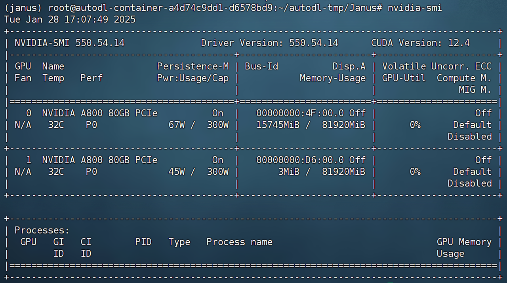

实际运行过程中，7B模型约占用15G显存。

* 数学公式识别测试

```python
image = "./pic2.png"
```

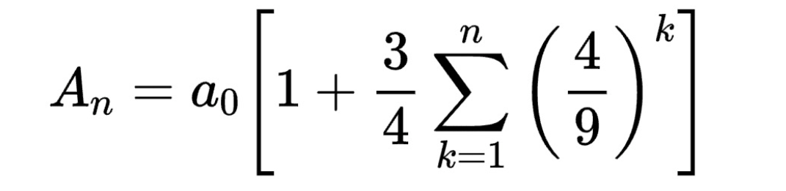

```python
question = "请将这个数学公式转换成 LaTeX 代码。"
```

```python
conversation = [
    {
        "role": "<|User|>",
        "content": f"<image_placeholder>\n{question}",
        "images": [image],
    },
    {"role": "<|Assistant|>", "content": ""},
]
```

```python
pil_images = load_pil_images(conversation)
prepare_inputs = vl_chat_processor(
    conversations=conversation, images=pil_images, force_batchify=True
).to(vl_gpt.device)
```

```python
# # run image encoder to get the image embeddings
inputs_embeds = vl_gpt.prepare_inputs_embeds(**prepare_inputs)
```

```python
inputs_embeds
```

```plaintext
tensor([[[-1.0757e-03,  1.0538e-04,  2.0117e-01,  ..., -1.1749e-03,
          -3.0899e-04, -1.1368e-03],
         [-1.0071e-02,  2.9492e-01,  4.4922e-01,  ..., -3.3447e-02,
           3.6865e-02, -5.3223e-02],
         [ 1.3086e-01, -9.3750e-02,  7.4609e-01,  ..., -6.7749e-03,
          -3.3417e-03,  1.6357e-02],
         ...,
         [-7.4387e-04, -7.8125e-03,  2.1680e-01,  ..., -1.2970e-03,
          -4.5471e-03,  6.2180e-04],
         [-7.0496e-03, -5.5847e-03, -4.7913e-03,  ...,  8.0566e-03,
          -1.7319e-03,  1.3504e-03],
         [-5.9204e-03,  6.3477e-02,  3.3789e-01,  ...,  4.7607e-02,
           3.0029e-02, -1.3657e-03]]], device='cuda:0', dtype=torch.bfloat16,
       grad_fn=<IndexPutBackward0>)
```

```python
# # run the model to get the response
outputs = vl_gpt.language_model.generate(
    inputs_embeds=inputs_embeds,
    attention_mask=prepare_inputs.attention_mask,
    pad_token_id=tokenizer.eos_token_id,
    bos_token_id=tokenizer.bos_token_id,
    eos_token_id=tokenizer.eos_token_id,
    max_new_tokens=512,
    do_sample=False,
    use_cache=True,
)
```

```python
answer = tokenizer.decode(outputs[0].cpu().tolist(), skip_special_tokens=True)
```

```python
print(f"{prepare_inputs['sft_format'][0]}", answer)
```

```plaintext
You are a helpful language and vision assistant. You are able to understand the visual content that the user provides, and assist the user with a variety of tasks using natural language.

<|User|>: <image_placeholder>
请将这个数学公式转换成 LaTeX 代码。

<|Assistant|>: A _ { n } = a _ { 0 } \begin{bmatrix} 1 + \frac { 3 } { 4 } \sum _ { k = 1 } ^ { n } \left( \frac { 4 } { 9 } \right ) ^ { k } \end{bmatrix}
```

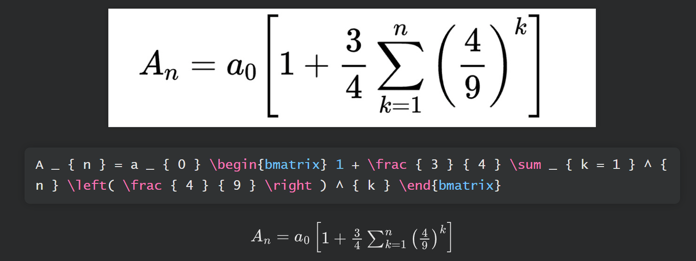

识别效果非常好。

* 1B模型性能测试

  接下来让我们继续测试1B模型的多模态识别能力。

```python
# 指定模型路径
model_path = "./Janus-Pro-1B"

# 加载VLChatProcessor
vl_chat_processor: VLChatProcessor = VLChatProcessor.from_pretrained(model_path)

# 加载分词器
tokenizer = vl_chat_processor.tokenizer
```

```plaintext
Some kwargs in processor config are unused and will not have any effect: mask_prompt, sft_format, ignore_id, num_image_tokens, image_tag, add_special_token. 
```

```python
# 加载vl_gpt
vl_gpt: MultiModalityCausalLM = AutoModelForCausalLM.from_pretrained(
    model_path, trust_remote_code=True
)
vl_gpt = vl_gpt.to(torch.bfloat16).cuda().eval()
```

```python
image = "./pic1.png"
```

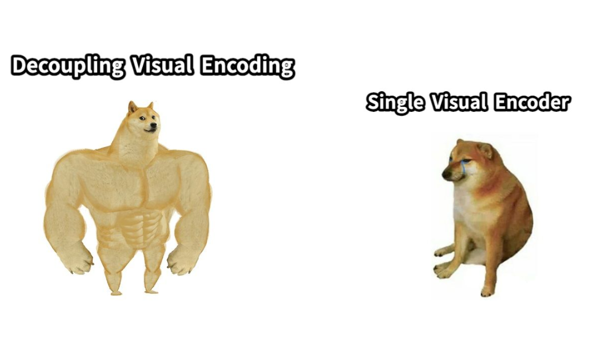

```python
question = "请解释下这张图片上的内容。"
```

```python
conversation = [
    {
        "role": "<|User|>",
        "content": f"<image_placeholder>\n{question}",
        "images": [image],
    },
    {"role": "<|Assistant|>", "content": ""},
]
```

* 图片信息编码

```python
pil_images = load_pil_images(conversation)
prepare_inputs = vl_chat_processor(
    conversations=conversation, images=pil_images, force_batchify=True
).to(vl_gpt.device)
```

```python
# # run image encoder to get the image embeddings
inputs_embeds = vl_gpt.prepare_inputs_embeds(**prepare_inputs)
```

```python
inputs_embeds
```

```plaintext
tensor([[[-2.9182e-04,  5.1880e-03, -3.0469e-01,  ..., -7.4463e-03,
           4.5471e-03,  6.0425e-03],
         [-4.0283e-03, -1.5234e-01,  3.6719e-01,  ...,  4.4141e-01,
          -1.1816e-01,  3.9062e-02],
         [ 5.5908e-02,  6.6895e-02,  1.3855e-02,  ..., -3.0859e-01,
          -6.4941e-02, -1.6699e-01],
         ...,
         [ 4.1016e-02,  6.9885e-03, -6.6406e-02,  ...,  9.5215e-03,
           4.4189e-02, -4.2969e-02],
         [-1.5320e-02,  2.2339e-02,  4.3335e-03,  ...,  2.4986e-04,
           2.4048e-02,  7.2002e-05],
         [-1.1035e-01,  4.4678e-02, -1.0107e-01,  ...,  1.9434e-01,
           1.5723e-01, -8.6426e-02]]], device='cuda:0', dtype=torch.bfloat16,
       grad_fn=<IndexPutBackward0>)
```

* 运行模型

```python
# # run the model to get the response
outputs = vl_gpt.language_model.generate(
    inputs_embeds=inputs_embeds,
    attention_mask=prepare_inputs.attention_mask,
    pad_token_id=tokenizer.eos_token_id,
    bos_token_id=tokenizer.bos_token_id,
    eos_token_id=tokenizer.eos_token_id,
    max_new_tokens=512,
    do_sample=False,
    use_cache=True,
)
```

```python
answer = tokenizer.decode(outputs[0].cpu().tolist(), skip_special_tokens=True)
```

```python
print(f"{prepare_inputs['sft_format'][0]}", answer)
```

```plaintext
You are a helpful language and vision assistant. You are able to understand the visual content that the user provides, and assist the user with a variety of tasks using natural language.

<|User|>: <image_placeholder>
请解释下这张图片上的内容。

<|Assistant|>: 这是一张对比图，分为左右两部分，每部分都有一只柴犬形象。

左边：
- 图片上方有一行黑色粗体文字：“Decoupling Visual Encoding”。
- 柴犬站立着，肌肉发达，看起来非常强壮。

右边：
- 图片上方有一行黑色粗体文字：“Single Visual Encoder”。
- 柴犬坐在地上，表情悲伤，看起来很沮丧。

整体风格：
- 图片采用了幽默的网络迷因风格，使用了两只柴犬来表达不同的概念。
- 左侧的柴犬代表“Decoupling Visual Encoding”，而右侧的柴犬代表“Single Visual Encoder”。
- 文字使用的是简单的黑色粗体字体，没有特殊装饰。

图片中的文字：
- “Decoupling Visual Encoding”
- “Single Visual Encoder”

这些文字位于图片的顶部，用黑色粗体字体显示。
```

普通图片识别效果较好，接下来测试数学公式识别：

```python
image = "./pic2.png"
```


```python
question = "请将这个数学公式转换成 LaTeX 代码。"
```

```python
conversation = [
    {
        "role": "<|User|>",
        "content": f"<image_placeholder>\n{question}",
        "images": [image],
    },
    {"role": "<|Assistant|>", "content": ""},
]
```

```python
pil_images = load_pil_images(conversation)
prepare_inputs = vl_chat_processor(
    conversations=conversation, images=pil_images, force_batchify=True
).to(vl_gpt.device)
```

```python
# # run image encoder to get the image embeddings
inputs_embeds = vl_gpt.prepare_inputs_embeds(**prepare_inputs)
```

```python
inputs_embeds
```

```plaintext
tensor([[[-2.9182e-04,  5.1880e-03, -3.0469e-01,  ..., -7.4463e-03,
           4.5471e-03,  6.0425e-03],
         [-4.0283e-03, -1.5234e-01,  3.6719e-01,  ...,  4.4141e-01,
          -1.1816e-01,  3.9062e-02],
         [ 5.5908e-02,  6.6895e-02,  1.3855e-02,  ..., -3.0859e-01,
          -6.4941e-02, -1.6699e-01],
         ...,
         [ 4.1016e-02,  6.9885e-03, -6.6406e-02,  ...,  9.5215e-03,
           4.4189e-02, -4.2969e-02],
         [-1.5320e-02,  2.2339e-02,  4.3335e-03,  ...,  2.4986e-04,
           2.4048e-02,  7.2002e-05],
         [-1.1035e-01,  4.4678e-02, -1.0107e-01,  ...,  1.9434e-01,
           1.5723e-01, -8.6426e-02]]], device='cuda:0', dtype=torch.bfloat16,
       grad_fn=<IndexPutBackward0>)
```

```python
# # run the model to get the response
outputs = vl_gpt.language_model.generate(
    inputs_embeds=inputs_embeds,
    attention_mask=prepare_inputs.attention_mask,
    pad_token_id=tokenizer.eos_token_id,
    bos_token_id=tokenizer.bos_token_id,
    eos_token_id=tokenizer.eos_token_id,
    max_new_tokens=512,
    do_sample=False,
    use_cache=True,
)
```

```python
answer = tokenizer.decode(outputs[0].cpu().tolist(), skip_special_tokens=True)
```

```python
print(f"{prepare_inputs['sft_format'][0]}", answer)
```

```plaintext
You are a helpful language and vision assistant. You are able to understand the visual content that the user provides, and assist the user with a variety of tasks using natural language.

<|User|>: <image_placeholder>
请将这个数学公式转换成 LaTeX 代码。

<|Assistant|>: \( A_n = \alpha _0 \left[ \begin{array}{l} 1 + \frac{3}{4} \sum_{k=1}^{n} \begin{pmatrix} \frac{4}{9} \\ k \end{pmatrix} \right] \end{array]

在 LaTeX 中，这个表达式可以写为：

\[ A_n = \alpha_0 \left[ \begin{array}{l} 1 + \frac{3}{4} \sum_{k=1}^{n} \begin{pmatrix} \frac{4}{9} \\ k \end{pmatrix} \right] \end{array} \]
```

1B模型能力稍逊一筹，在当前任务中未能顺利创建latex代码。

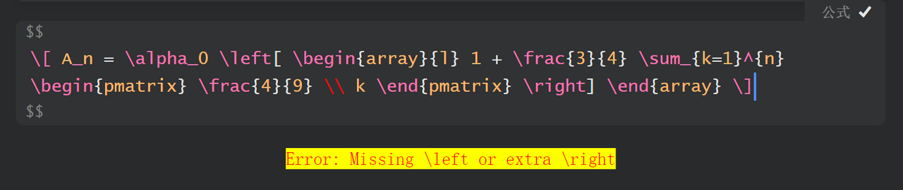

* 1B模型显存占用

  实际使用过程中1B模型约占用显存5G左右。

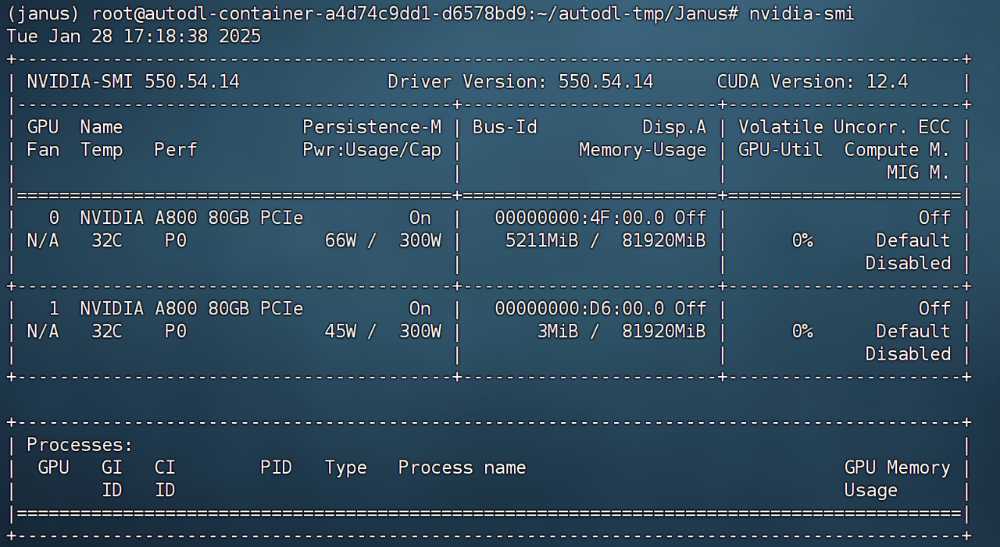

## 二、文生图功能实现

```python
import os
import PIL.Image
import torch
import numpy as np
from transformers import AutoModelForCausalLM
from janus.models import MultiModalityCausalLM, VLChatProcessor
```

```python
# specify the path to the model
model_path = "./Janus-Pro-7B"
vl_chat_processor: VLChatProcessor = VLChatProcessor.from_pretrained(model_path)
tokenizer = vl_chat_processor.tokenizer
```

```plaintext
Some kwargs in processor config are unused and will not have any effect: ignore_id, num_image_tokens, add_special_token, sft_format, mask_prompt, image_tag. 
```

```python
vl_gpt: MultiModalityCausalLM = AutoModelForCausalLM.from_pretrained(
    model_path, trust_remote_code=True
)
vl_gpt = vl_gpt.to(torch.bfloat16).cuda().eval()
```

```plaintext
Loading checkpoint shards: 100%|████████████████████████████████████████████████████████████████████| 2/2 [00:02<00:00,  1.15s/it]
```

创建对话消息：

```python
conversation = [
    {
        "role": "<|User|>",
        "content": "A stunning princess from kabul in red, white traditional clothing, blue eyes, brown hair",
    },
    {"role": "<|Assistant|>", "content": ""},
]
```

能够发现，图像识别以及创建过程都采用了相同的消息格式。

```python
sft_format = vl_chat_processor.apply_sft_template_for_multi_turn_prompts(
    conversations=conversation,
    sft_format=vl_chat_processor.sft_format,
    system_prompt="",
)
prompt = sft_format + vl_chat_processor.image_start_tag
```

```python
@torch.inference_mode()
def generate(
    mmgpt: MultiModalityCausalLM,
    vl_chat_processor: VLChatProcessor,
    prompt: str,
    temperature: float = 1,
    parallel_size: int = 16,
    cfg_weight: float = 5,
    image_token_num_per_image: int = 576,
    img_size: int = 384,
    patch_size: int = 16,
):
    input_ids = vl_chat_processor.tokenizer.encode(prompt)
    input_ids = torch.LongTensor(input_ids)

    tokens = torch.zeros((parallel_size*2, len(input_ids)), dtype=torch.int).cuda()
    for i in range(parallel_size*2):
        tokens[i, :] = input_ids
        if i % 2 != 0:
            tokens[i, 1:-1] = vl_chat_processor.pad_id

    inputs_embeds = mmgpt.language_model.get_input_embeddings()(tokens)

    generated_tokens = torch.zeros((parallel_size, image_token_num_per_image), dtype=torch.int).cuda()

    for i in range(image_token_num_per_image):
        outputs = mmgpt.language_model.model(inputs_embeds=inputs_embeds, use_cache=True, past_key_values=outputs.past_key_values if i != 0 else None)
        hidden_states = outputs.last_hidden_state
        
        logits = mmgpt.gen_head(hidden_states[:, -1, :])
        logit_cond = logits[0::2, :]
        logit_uncond = logits[1::2, :]
        
        logits = logit_uncond + cfg_weight * (logit_cond-logit_uncond)
        probs = torch.softmax(logits / temperature, dim=-1)

        next_token = torch.multinomial(probs, num_samples=1)
        generated_tokens[:, i] = next_token.squeeze(dim=-1)

        next_token = torch.cat([next_token.unsqueeze(dim=1), next_token.unsqueeze(dim=1)], dim=1).view(-1)
        img_embeds = mmgpt.prepare_gen_img_embeds(next_token)
        inputs_embeds = img_embeds.unsqueeze(dim=1)


    dec = mmgpt.gen_vision_model.decode_code(generated_tokens.to(dtype=torch.int), shape=[parallel_size, 8, img_size//patch_size, img_size//patch_size])
    dec = dec.to(torch.float32).cpu().numpy().transpose(0, 2, 3, 1)

    dec = np.clip((dec + 1) / 2 * 255, 0, 255)

    visual_img = np.zeros((parallel_size, img_size, img_size, 3), dtype=np.uint8)
    visual_img[:, :, :] = dec

    os.makedirs('generated_samples', exist_ok=True)
    for i in range(parallel_size):
        save_path = os.path.join('generated_samples', "img_{}.jpg".format(i))
        PIL.Image.fromarray(visual_img[i]).save(save_path)
```

这段代码定义了一个名为 `generate` 的函数，它使用了一个多模态自回归语言模型（`MultiModalityCausalLM`），生成图像。这个函数涉及到自然语言生成与图像生成的结合。下面我会逐行解释这段代码的功能和含义：

##### 装饰器：`@torch.inference_mode()`

* 这个装饰器使得函数在执行时，Torch 自动禁用梯度计算，从而减少计算和内存消耗。它表示在模型推理时，模型不会进行反向传播。

##### 函数定义

```python
def generate(
    mmgpt: MultiModalityCausalLM,
    vl_chat_processor: VLChatProcessor,
    prompt: str,
    temperature: float = 1,
    parallel_size: int = 16,
    cfg_weight: float = 5,
    image_token_num_per_image: int = 576,
    img_size: int = 384,
    patch_size: int = 16,
):
```

* **`mmgpt`**: 一个多模态自回归语言模型，负责语言和图像的生成任务。

* **`vl_chat_processor`**: 处理多模态数据的处理器，用于文本编码等。

* **`prompt`**: 输入的文本提示，用于生成相关的图像或文本。

* **`temperature`**: 用于控制生成多样性的超参数。较高的温度生成的内容更多样，而较低的温度会使输出更确定性。

* **`parallel_size`**: 生成图像时使用的并行批量大小。

* **`cfg_weight`**: 这个权重用于控制生成图像时条件和无条件部分之间的权衡。

* **`image_token_num_per_image`**: 每张图像的 token 数量，指每个图像的生成 token 数。

* **`img_size`**: 图像的大小（宽和高）。

* **`patch_size`**: 图像的 patch 大小，通常用于视觉 transformer 模型。

##### 主要步骤

###### 1. 编码输入提示文本

```python
input_ids = vl_chat_processor.tokenizer.encode(prompt)
input_ids = torch.LongTensor(input_ids)
```

* 通过 `vl_chat_processor.tokenizer.encode` 将输入的文本提示（`prompt`）编码成 `input_ids`，即一组整数表示的 token。接着将其转换为 LongTensor 类型。

###### 2. 创建并初始化 tokens 张量

```python
tokens = torch.zeros((parallel_size*2, len(input_ids)), dtype=torch.int).cuda()
for i in range(parallel_size*2):
    tokens[i, :] = input_ids
    if i % 2 != 0:
        tokens[i, 1:-1] = vl_chat_processor.pad_id
```

* 创建一个形状为 `(parallel_size*2, len(input_ids))` 的张量 `tokens`，并初始化为全零。这个张量存储的是要传给模型的 tokens。

* 在每两个 tokens 的基础上，偶数位置的 tokens 是原始的输入，奇数位置的 tokens 会被填充（`pad_id`）。这种方式可能是为了实现某种并行化或者为了处理多个批次。

###### 3. 获取输入嵌入

```python
inputs_embeds = mmgpt.language_model.get_input_embeddings()(tokens)
```

* 使用 `mmgpt.language_model.get_input_embeddings()` 方法获取输入 tokens 对应的嵌入表示（embeddings）。

###### 4. 生成图像 tokens

```python
generated_tokens = torch.zeros((parallel_size, image_token_num_per_image), dtype=torch.int).cuda()
```

* 创建一个张量 `generated_tokens` 来存储生成的图像 token，形状为 `(parallel_size, image_token_num_per_image)`。

###### 5. 图像生成循环

```python
for i in range(image_token_num_per_image):
    outputs = mmgpt.language_model.model(inputs_embeds=inputs_embeds, use_cache=True, past_key_values=outputs.past_key_values if i != 0 else None)
    hidden_states = outputs.last_hidden_state

    logits = mmgpt.gen_head(hidden_states[:, -1, :])
    logit_cond = logits[0::2, :]
    logit_uncond = logits[1::2, :]

    logits = logit_uncond + cfg_weight * (logit_cond - logit_uncond)
    probs = torch.softmax(logits / temperature, dim=-1)

    next_token = torch.multinomial(probs, num_samples=1)
    generated_tokens[:, i] = next_token.squeeze(dim=-1)

    next_token = torch.cat([next_token.unsqueeze(dim=1), next_token.unsqueeze(dim=1)], dim=1).view(-1)
    img_embeds = mmgpt.prepare_gen_img_embeds(next_token)
    inputs_embeds = img_embeds.unsqueeze(dim=1)
```

* 这是一个循环，用于逐步生成图像的 tokens（每次生成一个 token）。

* 在每次迭代中，模型根据当前的 `inputs_embeds` 和历史的 `past_key_values` 生成下一个 token。

* 通过 `mmgpt.gen_head` 获取最后一个隐藏状态的 logits（模型输出的原始分数）。

* `logits` 分为两部分（条件部分 `logit_cond` 和无条件部分 `logit_uncond`），通过调整它们的差异来生成新的 logits。

* 对 logits 进行 softmax，得到概率分布，再使用 `torch.multinomial` 从中采样生成下一个 token。

* 然后将生成的 token 用于更新输入嵌入，继续生成后续的 tokens。

###### 6. 解码生成的 tokens

```python
dec = mmgpt.gen_vision_model.decode_code(generated_tokens.to(dtype=torch.int), shape=[parallel_size, 8, img_size//patch_size, img_size//patch_size])
dec = dec.to(torch.float32).cpu().numpy().transpose(0, 2, 3, 1)
```

* 使用 `mmgpt.gen_vision_model.decode_code` 解码生成的 tokens，将其转换为图像。

* 将解码后的结果转为 `float32` 类型并转到 CPU，最后调整数组的维度以符合图像格式（`(parallel_size, img_size, img_size, 3)`）。

###### 7. 图像后处理

```python
dec = np.clip((dec + 1) / 2 * 255, 0, 255)
```

* 对生成的图像进行后处理，将图像的像素值从 \[-1, 1] 范围调整到 \[0, 255]，并确保所有值在这个范围内。

###### 8. 保存生成的图像

```python
visual_img = np.zeros((parallel_size, img_size, img_size, 3), dtype=np.uint8)
visual_img[:, :, :] = dec

os.makedirs('generated_samples', exist_ok=True)
for i in range(parallel_size):
    save_path = os.path.join('generated_samples', "img_{}.jpg".format(i))
    PIL.Image.fromarray(visual_img[i]).save(save_path)
```

* 创建一个形状为 `(parallel_size, img_size, img_size, 3)` 的空图像数组，并将处理后的图像数据填充进去。

* 创建一个文件夹 `generated_samples`，如果文件夹不存在的话。

* 将每个生成的图像保存为 `.jpg` 文件，并存储在 `generated_samples` 文件夹中。

```python
generate(
    vl_gpt,
    vl_chat_processor,
    prompt,
)
```

创建的图像默认保存地址：

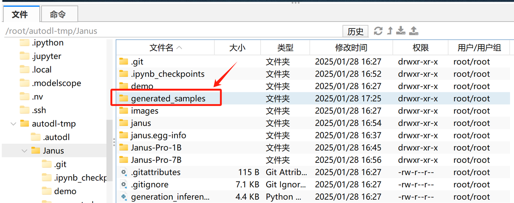

并且默认情况下一次性会创建16张图片：

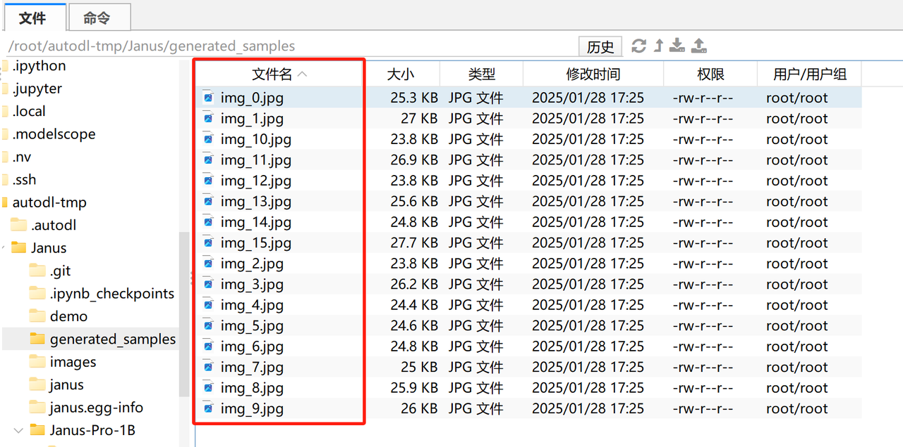

图像整体一致性较好，以下是部分图像的展示：

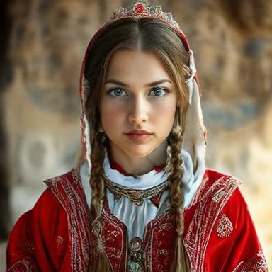

&#x20;

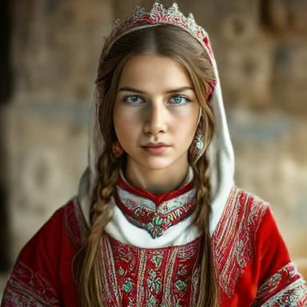

* 显存占用

7B模型此时占用显存高达70G：

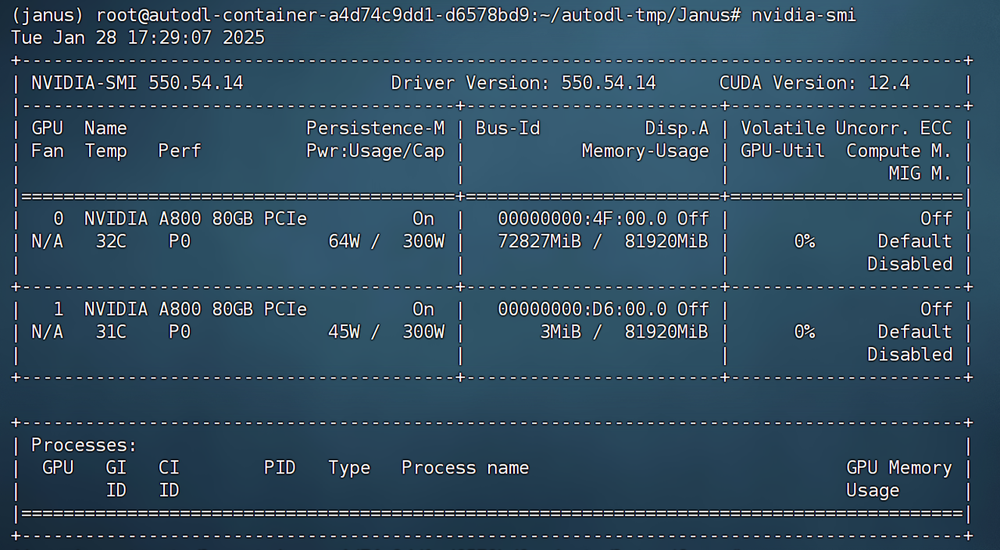

* 1B模型图像创建性能测试

  接下来继续测试1B模型的图像创建性能。

```python
# specify the path to the model
model_path = "./Janus-Pro-1B"
vl_chat_processor: VLChatProcessor = VLChatProcessor.from_pretrained(model_path)
tokenizer = vl_chat_processor.tokenizer
```

```plaintext
Some kwargs in processor config are unused and will not have any effect: ignore_id, num_image_tokens, add_special_token, sft_format, mask_prompt, image_tag. 
```

```python
vl_gpt: MultiModalityCausalLM = AutoModelForCausalLM.from_pretrained(
    model_path, trust_remote_code=True
)
vl_gpt = vl_gpt.to(torch.bfloat16).cuda().eval()
```

创建对话消息：

```python
conversation = [
    {
        "role": "<|User|>",
        "content": "A stunning princess from kabul in red, white traditional clothing, blue eyes, brown hair",
    },
    {"role": "<|Assistant|>", "content": ""},
]
```

```python
sft_format = vl_chat_processor.apply_sft_template_for_multi_turn_prompts(
    conversations=conversation,
    sft_format=vl_chat_processor.sft_format,
    system_prompt="",
)
prompt = sft_format + vl_chat_processor.image_start_tag
```

```python
generate(
    vl_gpt,
    vl_chat_processor,
    prompt,
)
```

创建结果如下：


&#x20;


能够看出，1B模型仍然能够创建对应指令的图片，但整体差异性较大。
