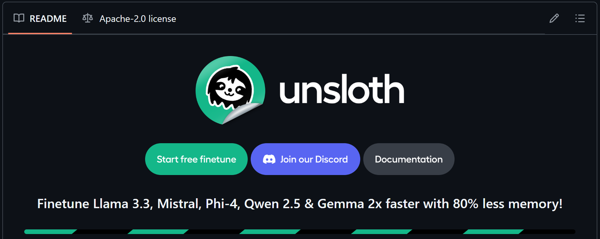
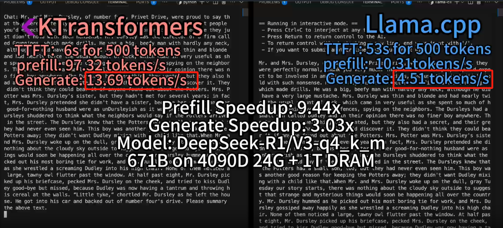
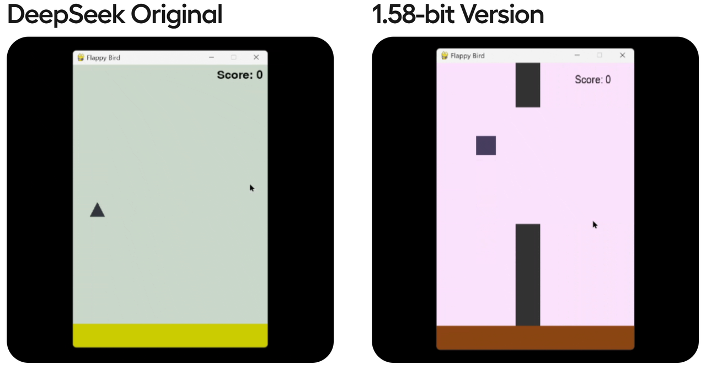
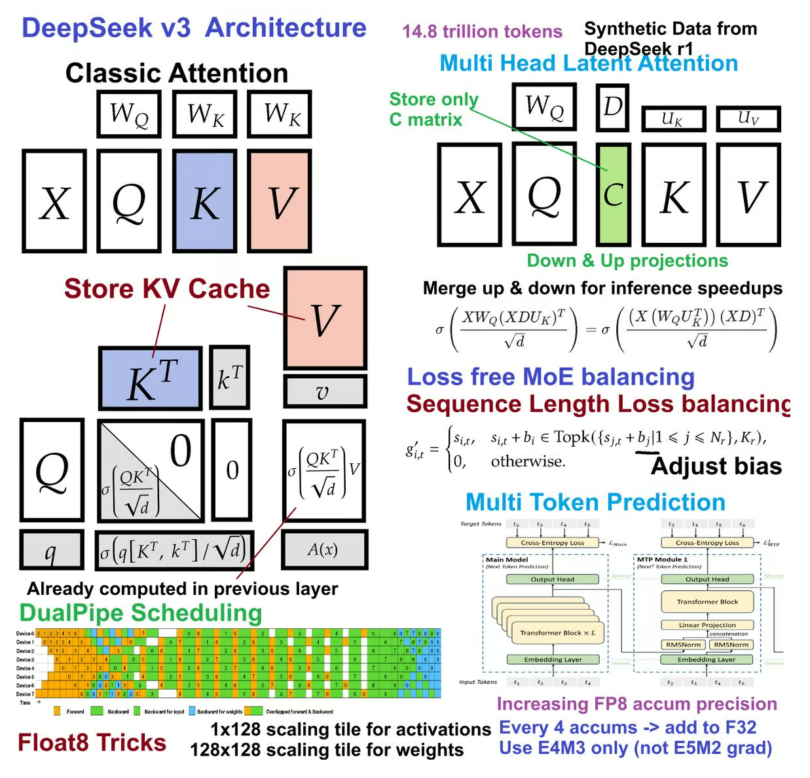
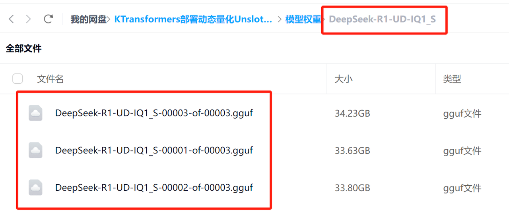
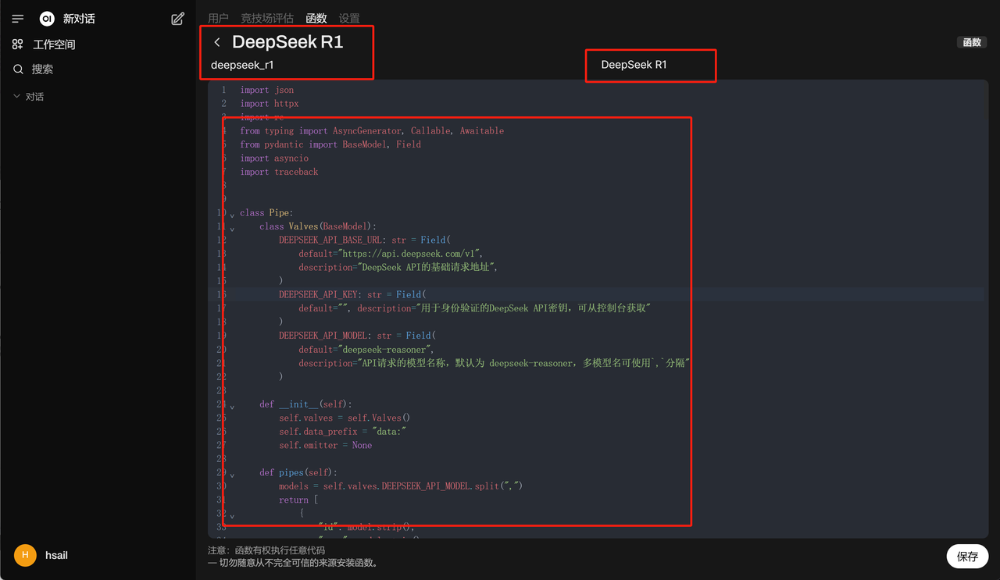

# 课程说明：

* 体验课内容节选自[《2025大模型Agent智能体开发实战》](https://whakv.xetslk.com/s/1tKbjV)完整版付费课程

  体验课时间有限，若想深度学习大模型技术，欢迎大家报名由我主讲的[《2025大模型Agent智能体开发实战》](https://whakv.xetslk.com/s/1tKbjV)：


公开课全套学习资料，已上传至网盘（https://pan.baidu.com/s/1t989LHh0By-MQP9eCUSFTw?pwd=gbd9）

**需要更系统深入学习大模型可扫码⬆️添加助教咨询喔～**

***

## 一、DeepSeek R1低成本本地部署方案介绍

### 1. KTransformer与Unsloth动态量化方案介绍

        截至目前，DeepSeek R1模型本地部署最具性价比的方案就是清华大学团队提出的KTransformer方案和Unsloth动态量化方案，两套方案都是借助CPU+GPU混合推理，来降低GPU购买的硬件成本，并且底层CPU推理实现也都是基于llama.cpp。

* ktransformers：https://github.com/kvcache-ai/ktransformers


* Unsloth：https://github.com/unslothai/unsloth



* llama.cpp：https://github.com/ggml-org/llama.cpp


所不同的是，KTransformer采用了一种全新的计算流程，使得MLA/KV-Cache可以在GPU上运行，而其他模型参数则在CPU上完成计算，从而大幅加快CPU的计算速度。


这种计算流程能够大幅加快DeepSeek MoE架构算法的计算速度，根据官方给出的数据，最高能得到14tokens/s，是llama.cpp推理速度的两倍。



但这套方案存在的问题，则主要有以下两个：

* 其一是模型并发较弱，由于采用了非常特殊的计算结构，导致无法通过增加GPU数量来增加并发；

* 其二是需要较大内存才能运行，官方给出的不同模型推理所需内存占用如下：


Unsloth提出的动态量化方案会更加综合一些，所谓动态量化的技术，指的是可以围绕模型的不同层，进行不同程度的量化，关键层呢，就量化的少一些，非关键层量化的多一些，最终得到了一组比Q2量化程度更深的模型组，分别是1.58-bit、1.73-bit和2.22-bit模型组。尽管量化程度很深，但实际性能其实并不弱。根据测试结果，1.58-bit动态量化几乎能达到90%以上Q4\_K\_M性能，远比Q2\_K\_M性能强得多。


 



此外，Unsloth提供了一套可以把模型权重分别加载到CPU和GPU上的方法，用户可以根据自己实际硬件情况，选择加载若干层模型权重到GPU上，然后剩下的模型权重加载到CPU内存上进行计算。



在实际部署的过程中，我们可以根据硬件情况，有选择的将一部分模型的层放到GPU上运行，其他层放在CPU上运行，从而降低GPU负载。最低显存+内存>=200G，即可运行1.58bit模型。


单卡4090（24G）时可加载7层权重在GPU上运行，40并发达到3.5tokens/s，双卡A100服务器能加载全部0到61层模型权重到GPU上，吞吐量达到140tokens/s，100并发时单人能达到14 tokens/s：


简而言之，Unsloth方案优势如下：

* 和llama.cpp深度融合，直接通过参数设置即可自由调度CPU和GPU计算资源，灵活高效，且能够直接和ollama、vLLM、Open-WebUI等框架兼容。

* 深度挖掘GPU性能，并发量有保障。

这两套方案此前曾单独开设公开课讲解过，感兴趣的小伙伴可以戳此观看：

* **独家KTransformers技术实战**：https://www.bilibili.com/video/BV1kyAke9EBA/


* **独家Unsloth动态量化部署满血DeepSeek**：https://www.bilibili.com/video/BV1oePLezEZD/


### 2. 最高性价比方案：KTransformers+Unsloth结合部署方案

        而自从这两套方案诞生以来，就有很多小伙伴畅想，能不能将这两个方案结合起来部署呢？**一方面，借助Unsloth 1.58bit动态模型的高性能特性，一方面借助KTransformers的高性能计算特性，就能进一步压缩硬件成本、获得更好的计算性能，同时由于1.58bit动态量化模型本身占用存储空间更少，推理并发数量也能有所提升。**

        这确实是非常不错的思路，并且由于动态量化本身并没有改变模型结构，因此理论上也是可行的。但很遗憾，截至目前，KTransformers的三个版本，V0.2、V0.21和V0.3暂时都不支持Unsloth动态量化模型的推理。现在官方稳定版在运行Unsloth动态量化模型时会出现如下报错：


因此，我们团队在深入研究KTransformers源码后，对V0.2版本的部分代码进行了修改，并最终适配1.58bit Unsloth动态量化模型，**使得最低可以在60G内存、14G显存下顺利运行**，至强3代CPU+DDR4+虚拟GPU运行时效果如下：


实际内存使用约60G：


显存使用约10G：


需要注意的是，相同1.58bit模型，若使用Unsloth+llama.cpp运行方案，则需要至少4卡4090（分配35层在GPU上计算）才能达到相同的效果。


并且在硬件配置达标的情况下，如至强4代以上+DDR5，则能达到12 tokens/s，且在5个左右并发时，能达到6-8 tokens/s。本节公开课，我们就来详细介绍下如何实现KTransformers+Unsloth联合部署。


* 课件领取：

        截至视频上线时，KT+Unsloth结合方案所需Ktransformers尚未正式发布，因此需要下图扫码领取项目源码才能部署：


 


网盘中同时包含本节公开课全部资料：


### 3.KTransformers本地部署硬件配置说明

        这里需要说明的是，KTransformers项目本身运行效果极大程度依赖CPU和内存型号，一般来说至强4代或第四代霄龙+DDR5才能保证14tokens/s。更多DeepSeek R1本地部署指南详见如下公开课。

* 全网最全低成本部署方案+硬件采购避坑指南！：https://www.bilibili.com/video/BV1K7ACewEfM/


*  


* 本节公开课配置：

* PyTorch 2.5.1，Python 3.12(ubuntu22.04)，Cuda 12.4

* 操作系统：Ubuntu 22.04

* **GPU**：vGPU-32GB(32GB) \* 1升降配置

* **CPU**：16 vCPU Intel(R) Xeon(R) Platinum 8352V CPU @ 2.10GHz

* **内存**：90GB DDR4

* 若无相关软件环境，也可以考虑在AutoDL上租赁显卡并配置Ubuntu服务器来完成操作。最小化实现微调效果，仅需单卡租赁最便宜的vGPU运行两小时即可得到结果，仅需不到5元即可完成实操：


* AutoDL相关操作详见公开课：《AutoDL快速入门与GPU租赁使用指南》|https://www.bilibili.com/video/BV1bxB7YYEST/

* KTransformer项目部署硬件配置方面需要注意如下事项：

  * GPU对实际运行效率提升不大，单卡3090、单卡4090、或者是多卡GPU服务器都没有太大影响，只需要留足14G以上显存即可；

  * 若是多卡服务器，则可以进一步尝试手动编写模型权重卸载规则，使用更多的GPU进行推理，可以一定程度减少内存需求，但对于实际运行效率提升不大。最省钱的方案仍然是单卡GPU+大内存配置；

  * KTransformer目前开放了V2.0、V2.1和V3.0三个版本（V3.0目前只有预览版，只支持二进制文件下载和安装），其中V2.0和V2.1支持各类CPU，但从V3.0开始，只支持AMX CPU，也就是最新几代的Intel CPU。这几个版本实际部署流程和调用指令没有任何区别，公开课以适配性最广泛的V2.0版本进行演示，若当前CPU支持AMX，则可以考虑使用V3.0进行实验，推理速度会大幅加快。

  * CPU AMX（Advanced Matrix Extensions）是Intel在其Sapphire Rapids系列处理器中推出的一种新型硬件加速指令集，旨在提升矩阵运算的性能，尤其是针对深度学习和人工智能应用。

* 服务器物理机成本（比课程演示性能降低30%左右）

* KTransformers+Unsloth方案极限配置下，最低仅需4500左右，具体配置如下：

| 硬件       | 详细型号                                     | 价格            |
| -------- | ---------------------------------------- | ------------- |
| **主板**   | 华南 X99-TF+ E5 板 U 套装（2696V3）+ A700 风扇    | 800元          |
| **CPU**  | 英特尔至强 E5-2696V3（18 核 36 线程）              | **（包含在主板套装）** |
| **内存**   | 三星二手服务器拆机内存 DDR4 ECC 64GB                | **270**       |
| **固态硬盘** | 光威（Gloway）M.2 1TB PCIe 4.0 读取速度 7000MB/s | 400 元         |
| **电源**   | 长城 1000DA 金牌巨龙 1000W 电竞版                 | 600 元         |
| **机箱**   | 爱国者 黑曼巴 F2 黑色 E-ATX 机箱                   | 180 元         |
| **显卡**   | **NVIDIA RTX 2080 Ti 22GB**              | **2500 元**    |
| **合计**   | **4750 元**                               |               |

* 实际性能

  * 推理性能：约在3-5tokens/s；

  * 并发性能：在5个用户，平均每隔1秒发送一个请求时，处理了50-100请求时，响应速度约为2个token/s。

  


### 4. 参考资料与课件领取

公开课全套代码课件、以及项目源码和自定义的脚本，都已上传至”赋范大模型技术社区“，下图扫码即可领取：


\[toc]

## 二、KTransformers入门介绍与基础环境搭建

### 1.KTransformers项目入门介绍

#### 1.1 项目定位

KTransformers（发音为“Quick Transformers”）旨在通过先进的内核优化和计算分布/并行化策略来增强你使用Transformers的体验。

KTransformers 是一个灵活、以 Python 为中心的框架，其核心设计理念是可扩展性。用户仅需一行代码，即可实现优化模块的集成，并享受到以下特性：

* **与 Transformers 兼容的接口**

* **符合 OpenAI 和 Ollama 规范的 RESTful API**

* **一个简化版的 ChatGPT 风格 Web UI**（最新版已弃用）

项目定位将 KTransformers 打造成一个灵活的平台，供用户探索和实验创新的大模型推理优化技术。因此，项目支持编写自定义脚本来实现模型权重的灵活卸载。

#### 1.2 项目参考资料

* GitHub主页：https://github.com/kvcache-ai/ktransformers

* 项目使用指南：https://kvcache-ai.github.io/ktransformers/index.html

#### 1.3 KTransformers支持的模型及运行方式

* **KT支持的模型类型：**


* **KT支持的量化形式**


注：借助本节公开课提供的修改后的KT源码，可以运行Unsloth 1.58bit量化模型


* **不同模型所需运行条件**


注：本节公开课运行的1.58bit动态量化模型，仅需60G内存+14G显存即可，并能达到95%的Q4\_K\_M模型性能。

#### 1.4 KTransformers部署方法

        KTransformers支持在Windows、Linux等操作系统下，使用源码部署或者docker工具进行部署。考虑到更为一般的企业级应用场景，本次实验采用Linux系统作为基础环境进行演示，并采用源码部署的方法进行部署。

### 2.DeepSeek R1模型权重与配置文件下载

        本次实验使用官方推荐的DeepSeek R1 UD-IQ1\_S，直接使用Unsloth压制的模型即可，模型下载地址：

* 魔搭社区下载地址：https://www.modelscope.cn/models/unsloth/DeepSeek-R1-GGUF


*  


*  


* HuggingFace下载地址：https://huggingface.co/unsloth/DeepSeek-R1-GGUF


 


模型权重较大，总共约130G左右。若使用HuggingFace进行下载，则需要一些网络工具。

这里推荐使用魔搭社区进行下载，流程如下：

* 【可选】借助screen持久化会话

* 由于实际下载时间可能持续2个小时，因此最好使用screen开启持久化会话，避免因为关闭会话导致下载中断。

```bash
screen -S kt
```

* 创建一个名为kt的会话。之后哪怕关闭了当前会话，也可以使用如下命令

```bash
screen -r kt
```

* 若未安装screen，可以使用`sudo apt install screen`命令进行安装。

* 使用魔搭社区进行下载

* 使用modelscope进行权重下载，需要先安装魔搭社区

```bash
pip install modelscope
```

* 然后输入如下命令进行下载

```bash
mkdir ./DeepSeek-R1-GGUF
```

```bash
modelscope download --model unsloth/DeepSeek-R1-GGUF  --include '**UD-IQ1_S**'  --local_dir /root/autodl-tmp/DeepSeek-R1-GGUF
```


* 相关文件可以在课件网盘中领取：



*  


* 下载DeepSeek R1原版模型的配置文件

* 此外，根据KTransformer的项目要求，还需要下载DeepSeek R1原版模型的除了模型权重文件外的其他配置文件，方便进行灵活的专家加载。因此我们还需要使用modelscope下载DeepSeek R1模型除了模型权重（.safetensor）外的其他全部文件，可以按照如下方式进行下载

```bash
mkdir ./DeepSeek-R1
```

```bash
modelscope download --model deepseek-ai/DeepSeek-R1  --exclude '*.safetensors'  --local_dir /root/autodl-tmp/DeepSeek-R1
```


* 下载后完整文件如下所示：


* 相关文件也可以在课程课件中领取：


*  


* 成果汇总

* 这里最终我们是下载了DeepSeek UD-IQ1\_S模型权重和DeepSeek R1的模型配置文件，并分别保存在两个文件夹中：

  * DeepSeek R1 UD-IQ1\_S模型权重地址：/root/autodl-tmp/DeepSeek-R1-GGUF/DeepSeek-R1-UD-IQ1\_S

  

  * DeepSeek R1的模型配置文件地址：/root/autodl-tmp/DeepSeek-R1

  

## 三、KTransformer+Unsloth动态量化模型部署与调用流程

        在准备好了DeepSeek R1 Q4\_K\_M的模型权重和DeepSeek R1模型配置文件之后，接下来开始着手部署KTransformer。该项目部署流程非常复杂，请务必每一步都顺利完成后，再执行下一步。在正式开始安装前，有以下几点需要事先声明：

* 关于版本：目前KT开放了V2.0、V2.1和V3.0预览版。课程以目前兼容性最强的V2.0进行演示，并介绍V3.0部署方法。若CPU满足要求（有AMX功能），则可运行V3.0。

* V3.0版本需求：V3.0对软硬件环境要求较高，除了要求CPU支持AMX功能外，还要求Python 3.11以上及CUDA12.6。

* \*\*注意！\*\*截止视频上线时，KTransformers官方库并未支持1.58bit动态量化模型，因此只能通过下载修改后的源码进行运行：


 


### 1. 安装基础依赖

* 创建虚拟环境【可选】

```bash
conda create --name kt python=3.11
conda init
source ~/.bashrc
conda activate kt
```

然后需要安装**gcc**、**g++** 和 **cmake**等基础库：

```bash
sudo apt-get update
sudo apt-get install gcc g++ cmake ninja-build
```

然后继续安装 **PyTorch**、**packaging**、**ninja**：

```bash
pip install torch packaging ninja cpufeature numpy
```

接下来需要继续安装`flash-attn`：

```bash
pip install flash-attn
```

以及需要手动安装`libstdc`：

```bash
sudo apt-get install --only-upgrade libstdc++6
```

```bash
conda install -c conda-forge libstdcxx-ng
```

然后需要安装24.11.0版conda-libmamba-solver：

```bash
conda install conda-libmamba-solver=24.11.0
```

### 2. 安装KTransformers

在网盘中下载KT压缩包：


 


上传至服务器指定路径`/root/autodl-tmp`，


然后使用如下命令进行解压缩：

```bash
tar -xzvf ktransformers_offline.tar.gz
cd ktransformers
```


该压缩包已包含相关依赖第三方项目，如llama.cpp等。


接下要需要确认当前CPU的类型，如果是双槽版本64核CPU，则需要使用如下命令设置NUMA=1：

```bash
export USE_NUMA=1
```

例如，假设当前的服务器CPU为：64 vCPU Intel(R) Xeon(R) Gold 6430


代表的就是64核双槽CPU，这种CPU往往出现在服务器使用场景中。

因此这里需要先输入`export USE_NUMA=1`，然后再执行后续命令。而这里如果不是64核双槽CPU，则无需执行这个命令。而若是64核双槽CPU，但未执行`export USE_NUMA=1`就执行了后续命令，则需要再次输入`export USE_NUMA=1`，然后再次运行后面的命令。

而如果是单槽CPU，如：


则不用设置`USE_NUMA=1`。

确认后即可进行编译和安装：

```bash
sh ./install.sh
```


需要等待一段时间才能编译完成：


一切安装完成后，即可输入如下命令查看当前安装情况

```bash
pip show ktransformers
```


### 3.运行KTransformer

        部署完成后，即可尝试调用KTransformer进行对话。这里可以采用官方提供的最简单的对话脚本`local_chat.py`进行对话：


在项目根目录下输入如下命令：

```bash
python ./ktransformers/local_chat.py --model_path /root/autodl-tmp/DeepSeek-R1 --gguf_path /root/autodl-tmp/DeepSeek-R1-GGUF/DeepSeek-R1-UD-IQ1_S --max_new_tokens 2048 --force_think true
```


参数解释如下：

* `<你的模型路径>` 可以是本地路径，也可以是来自 Hugging Face 的在线路径（如 `deepseek-ai/DeepSeek-V3`）。如果在线出现连接问题，尝试使用镜像站点（如 `hf-mirror.com`）。

* `<你的GGUF路径>` 也可以是在线路径，但由于文件较大，建议下载并量化模型以满足需求（注意，这是目录路径）。

* `--max_new_tokens 2048` 是最大输出token长度。如果发现答案被截断，可以增加该值以获得更长的答案（但请注意，增大会导致OOM问题，并且可能减慢生成速度）。

* `--force_think true`。打印R1模型的思考过程。

### 4.实际运行效果展示

实际内存使用：


* 启动过程

* 需要完整加载61层模型权重


* 开启对话

* 稍等片刻即可开启命令行对话：


* 响应速度


* **提示阶段（prompt eval）**：模型处理了 12 个 token，耗时 1.4 秒，处理速率为 8 个 token 每秒。

* **评估阶段（eval eval）**：模型处理了 277 个 token，耗时 54 秒，处理速率为 5 个 token 每秒。

* 由于AutoDL是虚拟化环境进行的运行，性能方面会受影响。

* 显存占用

* 仅占用不到14G显存。


* 实际内存使用约60G：


## 四、创建API与接入Open-WebUI

### 1.开启API服务

目前安装包已修复server API的若干Bug，已经可以正常使用。在网盘中下载KT压缩包：


&#x20;


然后使用如下命令即可创建API服务，其中端口号可以根据实际情况自行设置：

```bash
ktransformers --model_path /root/autodl-tmp/DeepSeek-R1 --gguf_path /root/autodl-tmp/DeepSeek-R1-GGUF/DeepSeek-R1-UD-IQ1_S  --port 10002
```

稍等片刻等待启动完成即可：


&#x20;


### 2. API调用流程

* 命令行调用

启动完成后，可以使用如下命令测试能否顺利连接：

```bash
curl -X POST \
  'http://localhost:10002/v1/chat/completions' \
  -H 'accept: application/json' \
  -H 'Content-Type: application/json' \
  -d '{
    "messages": [
      {
        "content": "你好呀。",
        "role": "user"
      }
    ],
    "model": "DeepSeek-R1",
    "stream": false
  }'
```

此时后端响应结果如下：


前端返回结果如下：


* Jupyter中使用OpenAI风格调用

* 需要提前安装openai库：

```bash
pip install openai
```


&#x20;       然后在Jupyter中测试使用：

```python
from openai import OpenAI

ds_api_key = "none"

# 实例化客户端
client = OpenAI(api_key=ds_api_key, 
                base_url="http://localhost:10002/v1")

# 调用 deepseek 模型
response = client.chat.completions.create(
    model="Deepseek-R1",
    messages=[
        {"role": "user", "content": "你好，好久不见!请介绍下你自己。"}
    ]
)

response
```


此时后端响应如下：


然后可以通过如下方式提取出思考链内容：

```python
import re

# 原始文本
text = response.choices[0].message.content

# 使用正则表达式提取<think>和</think>之间的内容
think_content = re.search(r'<think>(.*?)</think>', text, re.DOTALL)

# 提取到的内容
think_content_text = think_content.group(1) if think_content else None
think_content_text
```


&#x20;


### 3. 将API接入Open-WebUI

* 本地部署Open-WebUI

首先需要安装Open-WebUI，官网地址如下：https://github.com/open-webui/open-webui。


我们可以直接使用pip命令快速完成安装：

```bash
pip install open-webui
```


* 开启Open-WebUI服务

然后需要设置离线环境，避免Open-WebUI启动时自动进行模型下载：

```bash
export HF_HUB_OFFLINE=1
```

然后启动Open-WebUI

```bash
open-webui serve
```

需要注意的是，如果启动的时候仍然报错显示无法下载模型，是Open-WebUI试图从huggingface上下载embedding模型，之后我们会手动将其切换为本地运行的Embedding模型。


然后在本地浏览器输入地址:8080端口即可访问：


然后首次使用前，需要创建管理员账号：


然后点击登录即可。稍等片刻，即可进入到如下页面：


* 连接本地模型API

此时后台没有检测到任何模型，需要我们手动创建和本地的API连接，才能顺利调用本地模型。这里点击左下角设置—>函数—>加号：


写入如下脚本代码：



```python
import json
import httpx
import re
from typing import AsyncGenerator, Callable, Awaitable
from pydantic import BaseModel, Field
import asyncio
import traceback


class Pipe:
    class Valves(BaseModel):
        DEEPSEEK_API_BASE_URL: str = Field(
            default="https://api.deepseek.com/v1",
            description="DeepSeek API的基础请求地址",
        )
        DEEPSEEK_API_KEY: str = Field(
            default="", description="用于身份验证的DeepSeek API密钥，可从控制台获取"
        )
        DEEPSEEK_API_MODEL: str = Field(
            default="deepseek-reasoner",
            description="API请求的模型名称，默认为 deepseek-reasoner，多模型名可使用`,`分隔",
        )

    def __init__(self):
        self.valves = self.Valves()
        self.data_prefix = "data:"
        self.emitter = None

    def pipes(self):
        models = self.valves.DEEPSEEK_API_MODEL.split(",")
        return [
            {
                "id": model.strip(),
                "name": model.strip(),
            }
            for model in models
        ]

    async def pipe(
        self, body: dict, __event_emitter__: Callable[[dict], Awaitable[None]] = None
    ) -> AsyncGenerator[str, None]:
        """主处理管道（已移除缓冲）"""
        thinking_state = {"thinking": -1}  # 用于存储thinking状态
        self.emitter = __event_emitter__
        # 用于存储联网模式下返回的参考资料列表
        stored_references = []

        # 联网搜索供应商 0-无 1-火山引擎 2-PPLX引擎 3-硅基流动
        search_providers = 0
        waiting_for_reference = False

        # 用于处理硅基的 [citation:1] 的栈
        citation_stack_reference = [
            "[",
            "c",
            "i",
            "t",
            "a",
            "t",
            "i",
            "o",
            "n",
            ":",
            "",
            "]",
        ]
        citation_stack = []
        # 临时保存的未处理的字符串
        unprocessed_content = ""

        # 验证配置
        if not self.valves.DEEPSEEK_API_KEY:
            yield json.dumps({"error": "未配置API密钥"}, ensure_ascii=False)
            return
        # 准备请求参数
        headers = {
            "Authorization": f"Bearer {self.valves.DEEPSEEK_API_KEY}",
            "Content-Type": "application/json",
        }
        try:
            # 模型ID提取
            model_id = body["model"].split(".", 1)[-1]
            payload = {**body, "model": model_id}
            # 处理消息以防止连续的相同角色
            messages = payload["messages"]
            i = 0
            while i < len(messages) - 1:
                if messages[i]["role"] == messages[i + 1]["role"]:
                    # 插入具有替代角色的占位符消息
                    alternate_role = (
                        "assistant" if messages[i]["role"] == "user" else "user"
                    )
                    messages.insert(
                        i + 1,
                        {"role": alternate_role, "content": "[Unfinished thinking]"},
                    )
                i += 1

            # 发起API请求
            async with httpx.AsyncClient(http2=True) as client:
                async with client.stream(
                    "POST",
                    f"{self.valves.DEEPSEEK_API_BASE_URL}/chat/completions",
                    json=payload,
                    headers=headers,
                    timeout=300,
                ) as response:

                    # 错误处理
                    if response.status_code != 200:
                        error = await response.aread()
                        yield self._format_error(response.status_code, error)
                        return

                    # 流式处理响应
                    async for line in response.aiter_lines():
                        if not line.startswith(self.data_prefix):
                            continue

                        # 截取 JSON 字符串
                        json_str = line[len(self.data_prefix) :].strip()

                        # 去除首尾空格后检查是否为结束标记
                        if json_str == "[DONE]":
                            return
                        try:
                            data = json.loads(json_str)
                        except json.JSONDecodeError as e:
                            error_detail = f"解析失败 - 内容：{json_str}，原因：{e}"
                            yield self._format_error("JSONDecodeError", error_detail)
                            return

                        if search_providers == 0:
                            # 检查 delta 中的搜索结果
                            choices = data.get("choices")
                            if not choices or len(choices) == 0:
                                continue  # 跳过没有 choices 的数据块
                            delta = choices[0].get("delta", {})
                            if delta.get("type") == "search_result":
                                search_results = delta.get("search_results", [])
                                if search_results:
                                    ref_count = len(search_results)
                                    yield '<details type="search">\n'
                                    yield f"<summary>已搜索 {ref_count} 个网站</summary>\n"
                                    for idx, result in enumerate(search_results, 1):
                                        yield f'> {idx}. [{result["title"]}]({result["url"]})\n'
                                    yield "</details>\n"
                                    search_providers = 3
                                    stored_references = search_results
                                    continue

                            # 处理参考资料
                            stored_references = data.get("references", []) + data.get(
                                "citations", []
                            )
                            if stored_references:
                                ref_count = len(stored_references)
                                yield '<details type="search">\n'
                                yield f"<summary>已搜索 {ref_count} 个网站</summary>\n"
                            # 如果data中有references，则说明是火山引擎的返回结果
                            if data.get("references"):
                                for idx, reference in enumerate(stored_references, 1):
                                    yield f'> {idx}. [{reference["title"]}]({reference["url"]})\n'
                                yield "</details>\n"
                                search_providers = 1
                            # 如果data中有citations，则说明是PPLX引擎的返回结果
                            elif data.get("citations"):
                                for idx, reference in enumerate(stored_references, 1):
                                    yield f"> {idx}. {reference}\n"
                                yield "</details>\n"
                                search_providers = 2

                        # 方案 A: 检查 choices 是否存在且非空
                        choices = data.get("choices")
                        if not choices or len(choices) == 0:
                            continue  # 跳过没有 choices 的数据块
                        choice = choices[0]

                        # 结束条件判断
                        if choice.get("finish_reason"):
                            return

                        # 状态机处理
                        state_output = await self._update_thinking_state(
                            choice.get("delta", {}), thinking_state
                        )
                        if state_output:
                            yield state_output
                            if state_output == "<think>":
                                yield "\n"

                        # 处理并立即发送内容
                        content = self._process_content(choice["delta"])
                        if content:
                            # 处理思考状态标记
                            if content.startswith("<think>"):
                                content = re.sub(r"^<think>", "", content)
                                yield "<think>"
                                await asyncio.sleep(0.1)
                                yield "\n"
                            elif content.startswith("</think>"):
                                content = re.sub(r"^</think>", "", content)
                                yield "</think>"
                                await asyncio.sleep(0.1)
                                yield "\n"

                            # 处理参考资料
                            if search_providers == 1:
                                # 火山引擎的参考资料处理
                                # 如果文本中包含"摘要"，设置等待标志
                                if "摘要" in content:
                                    waiting_for_reference = True
                                    yield content
                                    continue

                                # 如果正在等待参考资料的数字
                                if waiting_for_reference:
                                    # 如果内容仅包含数字或"、"
                                    if re.match(r"^(\d+|、)$", content.strip()):
                                        numbers = re.findall(r"\d+", content)
                                        if numbers:
                                            num = numbers[0]
                                            ref_index = int(num) - 1
                                            if 0 <= ref_index < len(stored_references):
                                                ref_url = stored_references[ref_index][
                                                    "url"
                                                ]
                                            else:
                                                ref_url = ""
                                            content = f"[[{num}]]({ref_url})"
                                        # 保持等待状态继续处理后续数字
                                    # 如果遇到非数字且非"、"的内容且不含"摘要"，停止等待
                                    elif not "摘要" in content:
                                        waiting_for_reference = False
                            elif search_providers == 2:
                                # PPLX引擎的参考资料处理
                                def replace_ref(m):
                                    idx = int(m.group(1)) - 1
                                    if 0 <= idx < len(stored_references):
                                        return f"[[{m.group(1)}]]({stored_references[idx]})"
                                    return f"[[{m.group(1)}]]()"

                                content = re.sub(r"\[(\d+)\]", replace_ref, content)
                            elif search_providers == 3:
                                skip_outer = False

                                if len(unprocessed_content) > 0:
                                    content = unprocessed_content + content
                                    unprocessed_content = ""

                                for i in range(len(content)):
                                    # 检查 content[i] 是否可访问
                                    if i >= len(content):
                                        break
                                    # 检查 citation_stack_reference[len(citation_stack)] 是否可访问
                                    if len(citation_stack) >= len(
                                        citation_stack_reference
                                    ):
                                        break
                                    if (
                                        content[i]
                                        == citation_stack_reference[len(citation_stack)]
                                    ):
                                        citation_stack.append(content[i])
                                        # 如果 citation_stack 的位数等于 citation_stack_reference 的位数，则修改为 URL 格式返回
                                        if len(citation_stack) == len(
                                            citation_stack_reference
                                        ):
                                            # 检查 citation_stack[10] 是否可访问
                                            if len(citation_stack) > 10:
                                                ref_index = int(citation_stack[10]) - 1
                                                # 检查 stored_references[ref_index] 是否可访问
                                                if (
                                                    0
                                                    <= ref_index
                                                    < len(stored_references)
                                                ):
                                                    ref_url = stored_references[
                                                        ref_index
                                                    ]["url"]
                                                else:
                                                    ref_url = ""

                                                # 将content中剩余的部分保存到unprocessed_content中
                                                unprocessed_content = "".join(
                                                    content[i + 1 :]
                                                )

                                                content = f"[[{citation_stack[10]}]]({ref_url})"
                                                citation_stack = []
                                                skip_outer = False
                                                break
                                        else:
                                            skip_outer = True
                                    elif (
                                        citation_stack_reference[len(citation_stack)]
                                        == ""
                                    ):
                                        # 判断是否为数字
                                        if content[i].isdigit():
                                            citation_stack.append(content[i])
                                            skip_outer = True
                                        else:
                                            # 将 citation_stack 中全部元素拼接成字符串
                                            content = "".join(citation_stack) + content
                                            citation_stack = []
                                    elif (
                                        citation_stack_reference[len(citation_stack)]
                                        == "]"
                                    ):
                                        # 判断前一位是否为数字
                                        if citation_stack[-1].isdigit():
                                            citation_stack[-1] += content[i]
                                            skip_outer = True
                                        else:
                                            content = "".join(citation_stack) + content
                                            citation_stack = []
                                    else:
                                        if len(citation_stack) > 0:
                                            # 将 citation_stack 中全部元素拼接成字符串
                                            content = "".join(citation_stack) + content
                                            citation_stack = []

                                if skip_outer:
                                    continue

                            yield content
        except Exception as e:
            yield self._format_exception(e)

    async def _update_thinking_state(self, delta: dict, thinking_state: dict) -> str:
        """更新思考状态机（简化版）"""
        state_output = ""
        if thinking_state["thinking"] == -1 and delta.get("reasoning_content"):
            thinking_state["thinking"] = 0
            state_output = "<think>"
        elif (
            thinking_state["thinking"] == 0
            and not delta.get("reasoning_content")
            and delta.get("content")
        ):
            thinking_state["thinking"] = 1
            state_output = "\n</think>\n\n"
        return state_output

    def _process_content(self, delta: dict) -> str:
        """直接返回处理后的内容"""
        return delta.get("reasoning_content", "") or delta.get("content", "")

    def _emit_status(self, description: str, done: bool = False) -> Awaitable[None]:
        """发送状态更新"""
        if self.emitter:
            return self.emitter(
                {
                    "type": "status",
                    "data": {
                        "description": description,
                        "done": done,
                    },
                }
            )
        return None

    def _format_error(self, status_code: int, error: bytes) -> str:
        if isinstance(error, str):
            error_str = error
        else:
            error_str = error.decode(errors="ignore")
        try:
            err_msg = json.loads(error_str).get("message", error_str)[:200]
        except Exception:
            err_msg = error_str[:200]
        return json.dumps(
            {"error": f"HTTP {status_code}: {err_msg}"}, ensure_ascii=False
        )

    def _format_exception(self, e: Exception) -> str:
        tb_lines = traceback.format_exception(type(e), e, e.__traceback__)
        detailed_error = "".join(tb_lines)
        return json.dumps({"error": detailed_error}, ensure_ascii=False)
```

然后点击开启，并点击齿轮进行设置：


设置本地端口、API Key和模型名称：


* 开启对话

点击保存，回到对话页面，则能看到本地运行的DeepSeek-R1模型：


然后即可开启对话：


&#x20;


更多关于Open-WebUI使用方法，如联网、连接本地知识库、连接外部工具（MySQL数据库）、代码解释器、多模型管理、用户管理等，详见公开课《DeepSeek R1终极部署指南》：https://www.bilibili.com/video/BV1qU9AYLEe3/


至此，我们就完成了Ktransformers+Unsloth方案联合部署的全流程。

***

更多关于大模型技术介绍，欢迎报名由我主讲的《2025大模型Agent智能体开发实战》（2月DeepSeek强化班）https://whakv.xetslk.com/s/3uzKfW 进行更深度系统的学习哦\~


&#x20;


&#x20;


**[《2025大模型Agent智能体开发实战》](https://whakv.xetslk.com/s/3uzKfW)3月班上新特惠进行时，详细信息扫码添加助教，回复“大模型”，即可领取课程大纲&查看课程详情👇**


此外，如果对大模型底层原理和模型训练感兴趣，欢迎报名由我和菜菜老师共同开设的《大模型原理与训练实战》https://whakv.xetslk.com/s/3p66pN实战课，3月新班额外新增大量DeepSeek V3\&R1模型原理与训练实战内容，扫描上方二维码即可查看完整课程大纲哦\~


