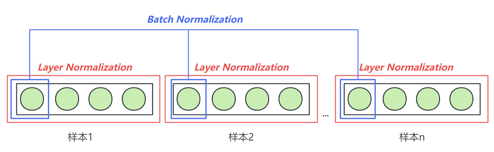
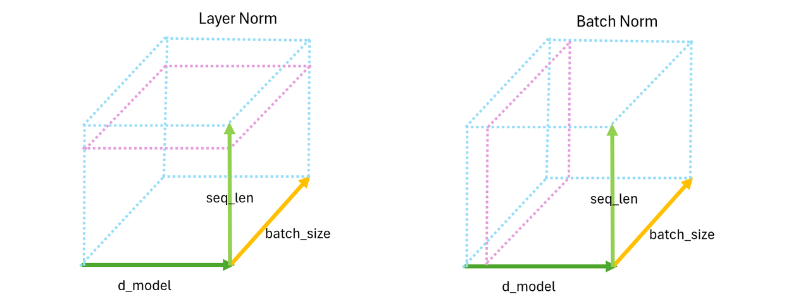

* llama3架构一览


```python
import math
import struct
import inspect
import time

#from .LMConfig import LMConfig
from typing import Any, Optional, Tuple
import numpy as np
import torch
import torch.nn.functional as F
from torch import nn
from transformers import PreTrainedModel
from transformers.modeling_outputs import CausalLMOutputWithPast
```

## 1. Embedding层

在PyTorch中，`nn.Embedding`层是用于处理离散数据（如单词或类别）的关键组件，特别常见于自然语言处理（NLP）和推荐系统等任务。它的主要功能是将输入的整数索引映射到连续的高维向量空间中，即将**索引**转化为**嵌入向量**。

```python
torch.nn.Embedding(num_embeddings, embedding_dim)
```

* **`num_embeddings`**: 嵌入表的大小，即词汇表的大小或类别数。它定义了有多少个不同的“离散输入”可以映射到嵌入向量。

* **`embedding_dim`**: 每个离散输入（类别、单词等）将被映射到的连续向量的维度大小。

`nn.Embedding`的输入通常是整数（类别索引或词汇索引），它会根据输入的索引从一个大小为 `(num_embeddings, embedding_dim)` 的查找表中检索出相应的嵌入向量。

```python
import torch
import torch.nn as nn

# 定义Embedding层
embedding = nn.Embedding(10, 3)  # num_embeddings=10, embedding_dim=3

# 输入索引
input_indices = torch.tensor([1, 2, 3])

# 获取嵌入向量
output = embedding(input_indices)

print(output)
```

```plaintext
tensor([[ 1.5522,  0.7179,  1.6805],
        [ 2.1118,  0.2995,  0.4167],
        [-0.6033, -0.4972, -1.6700]], grad_fn=<EmbeddingBackward0>)
```

* embedding层携带巨大的权重矩阵，是参数量计算的关键过程之一

```python
print(embedding.weight) #结构为10,3
```

```plaintext
Parameter containing:
tensor([[ 0.4752, -0.2457,  0.2101],
        [ 1.5522,  0.7179,  1.6805],
        [ 2.1118,  0.2995,  0.4167],
        [-0.6033, -0.4972, -1.6700],
        [-0.8719, -0.7207,  0.8305],
        [ 1.2962, -1.2880,  0.8838],
        [-0.7804, -0.1872,  0.3502],
        [-0.2817, -0.9322,  0.5499],
        [-0.5277,  0.8808, -1.6055],
        [ 0.5706,  0.9455, -0.0734]], requires_grad=True)
```

## 2. RMSNorm 均方根层归一化

在Transformer结构中，Layer Normalization（层归一化）是一个至关重要的部分，它是一种特定的归一化技术，与Batch Normalization（批归一化）不同，Layer Normalization不是对一个批次（batch）中的样本进行归一化，而是独立地对每个样本中的所有特征进行归一化（也就是对单一词向量、单一时间点的所有embedding维度进行归一化）。具体来说，对于每个样本，Layer Normalization会在特定层的所有激活上计算均值和方差，然后用这些统计量来归一化该样本的激活值。

* **LN与BN的差别**

BN 和 LN 的差别就在$$u_i$$和 $$\sigma_i$$这里，前者在某一个 Batch 内统计某特定神经元节点的输出分布（跨样本），后者在某一次迭代更新中统计同一层内的所有神经元节点的输出分布（同一样本下）。





* NLP任务中经常会处理长度不同的句子，使用LN时可以不考虑其它样本的长度。


* 在某些情况下，当可用的内存有限或者为了加速训练而使用更小的batch时，BN因为batch数量不足而受到了限制。


* 在某些NLP任务和解码设置中，模型可能会一个接一个地处理序列中的元素，而不是一次处理整个batch。这样BN就不是很适用了。


* 在Transformer模型中有很深的层次和自注意机制。通过对每一层的输入进行规范化，可以防止值的爆炸或消失，从而帮助模型更快地收敛。


* **LN与RMSNorm的差别**

**RMSNorm** 和 **普通 LayerNorm** 的主要区别在于归一化的计算方式：

1. **归一化公式**：

   * **LayerNorm** 会对输入特征的均值和方差进行计算，然后用这些统计量对每个特征进行归一化。

   * **RMSNorm** 只计算输入特征的均方根 (RMS, Root Mean Square)，而不考虑均值。因此，RMSNorm 去掉了均值的计算，直接利用每个特征的均方根进行归一化。


2. **计算简化**：

   * **LayerNorm** 需要同时计算均值和方差，涉及更多的计算步骤。

   * **RMSNorm** 只需要计算输入的均方根，计算量更小。

* **更少的计算开销**：由于去除了对均值的计算，RMSNorm 的计算开销相比 LayerNorm 更小，尤其在大规模模型中表现更为高效。

* **训练稳定性**：RMSNorm 保留了归一化的效果，能够稳定训练过程，同时在某些场景下表现出更好的收敛性。

* **适合大模型**：RMSNorm 因其简化的计算过程，特别适合像 LLaMA 这样的大模型，可以提高训练和推理的效率。

* **统计概念不同**：均方根 (RMS) 是数据点平方的均值再开平方，表达的是数据的“绝对大小”，忽略了数据的符号，反映的是整体数据的幅度或能量，均值和方差则更多代表波动，更关注数据的分布，包括数据的中心位置和离散程度。

```python
class RMSNorm(torch.nn.Module):
    # 初始化函数，接受参数：
    # dim: 归一化的维度大小
    # eps: 防止除零的非常小的数值
    def __init__(self, dim: int, eps: float):
        super().__init__()  # 调用父类的初始化方法
        self.eps = eps  # 将 eps 存储为类的属性
        # 初始化可学习的参数 weight，初始值为全1，形状为(dim,)
        # 这是每个维度的缩放系数
        self.weight = nn.Parameter(torch.ones(dim))  

    # 定义一个内部方法 _norm，用于对输入 x 进行归一化操作
    def _norm(self, x):
        # 使用平方的均值作为输入的标准差，并加上 eps 以防止除零
        # torch.rsqrt 是计算平方根的倒数，即 1 / sqrt(x)
        return x * torch.rsqrt(x.pow(2).mean(-1, keepdim=True) + self.eps)

    # 定义前向传播的操作
    def forward(self, x):
        # 首先调用 _norm 方法对输入 x 进行归一化，并确保类型一致性
        # x.float() 将输入转换为浮点数进行精度较高的计算
        output = self._norm(x.float()).type_as(x)  
        # 将归一化后的输出乘以可学习的参数 weight，调整每个维度的缩放
        return output * self.weight
```

* 如何理解-1维度？

```python
import torch

# 创建形状为(3, 4, 5)的Tensor
exp = torch.rand(3, 4, 5)

print(exp)
```

```plaintext
tensor([[[0.3789, 0.4490, 0.6182, 0.1384, 0.5848],
         [0.7976, 0.8643, 0.7966, 0.5964, 0.8800],
         [0.8810, 0.2698, 0.3346, 0.7024, 0.7164],
         [0.9868, 0.3738, 0.9188, 0.5578, 0.1266]],

        [[0.4285, 0.5041, 0.3655, 0.3673, 0.2554],
         [0.7663, 0.9435, 0.7177, 0.1168, 0.0876],
         [0.6517, 0.9947, 0.0471, 0.0100, 0.0264],
         [0.6155, 0.2442, 0.3132, 0.5508, 0.4759]],

        [[0.6578, 0.8285, 0.8856, 0.9596, 0.7464],
         [0.9596, 0.8770, 0.2025, 0.1470, 0.7849],
         [0.9045, 0.6325, 0.3705, 0.9188, 0.6412],
         [0.3341, 0.2872, 0.3253, 0.0787, 0.4443]]])
```

```python
exp.pow(2) #平方
```

```plaintext
tensor([[[1.4353e-01, 2.0159e-01, 3.8222e-01, 1.9165e-02, 3.4198e-01],
         [6.3617e-01, 7.4708e-01, 6.3457e-01, 3.5566e-01, 7.7436e-01],
         [7.7610e-01, 7.2778e-02, 1.1193e-01, 4.9332e-01, 5.1321e-01],
         [9.7382e-01, 1.3970e-01, 8.4418e-01, 3.1110e-01, 1.6026e-02]],

        [[1.8362e-01, 2.5410e-01, 1.3358e-01, 1.3489e-01, 6.5224e-02],
         [5.8726e-01, 8.9019e-01, 5.1510e-01, 1.3637e-02, 7.6694e-03],
         [4.2477e-01, 9.8942e-01, 2.2207e-03, 9.9925e-05, 6.9445e-04],
         [3.7878e-01, 5.9637e-02, 9.8112e-02, 3.0340e-01, 2.2645e-01]],

        [[4.3276e-01, 6.8649e-01, 7.8420e-01, 9.2082e-01, 5.5707e-01],
         [9.2077e-01, 7.6917e-01, 4.1018e-02, 2.1602e-02, 6.1610e-01],
         [8.1816e-01, 4.0001e-01, 1.3730e-01, 8.4413e-01, 4.1109e-01],
         [1.1164e-01, 8.2483e-02, 1.0579e-01, 6.1930e-03, 1.9739e-01]]])
```

```python
exp.pow(2).mean(-1, keepdim=True)
#在最后一个维度，也就是d_model的维度求解均值
#对文字数据来说等同于对每一个token上所有的列求解均值
```

```plaintext
tensor([[[0.2177],
         [0.6296],
         [0.3935],
         [0.4570]],

        [[0.1543],
         [0.4028],
         [0.2834],
         [0.2133]],

        [[0.6763],
         [0.4737],
         [0.5221],
         [0.1007]]])
```

```python
exp.pow(2).mean(-1, keepdim=True).shape
```

```plaintext
torch.Size([3, 4, 1])
```

```python
torch.rsqrt(exp.pow(2).mean(-1, keepdim=True))
```

```plaintext
tensor([[[2.1433],
         [1.2603],
         [1.5942],
         [1.4793]],

        [[2.5459],
         [1.5757],
         [1.8783],
         [2.1654]],

        [[1.2160],
         [1.4529],
         [1.3839],
         [3.1513]]])
```

## 3. 旋转位置编码Rotary Positional Embedding

在 **LLaMA (Large Language Model Meta AI)** 中，使用了一种称为 **旋转位置编码** (RoPE, Rotary Position Embedding) 的技术来引入位置信息。这种编码方式不同于传统的固定位置编码或可学习的位置编码，通过使用**旋转矩阵**将位置信息嵌入到序列中。

* 旋转位置编码 (RoPE) 的原理：
  RoPE 的核心思想是将**位置编码**嵌入到每个输入的特征维度中，而不是像传统的绝对位置编码那样为每个位置生成单独的向量。具体而言，RoPE将输入特征通过一个与位置相关的**旋转变换**，在不同位置上通过旋转不同角度来表达位置信息。

1. **嵌入位置信息**：
   通过使用旋转矩阵，RoPE能够在同一特征空间中嵌入位置信息，并且这种旋转变换可以是连续的，使得模型可以处理不同长度的序列输入，而不依赖于绝对位置编码的长度限制。

2. **特征维度的分组旋转**：
   RoPE 会将输入特征维度两两分组，并将每对特征维度进行角度旋转，旋转角度根据序列中的相对位置来调整。随着序列位置的变化，每个特征都会以不同的旋转角度进行变化，从而实现位置的编码。

3. **优点**：

   * **相对位置感知**：RoPE 自然具备相对位置感知能力（因为它具有一定的循环性），因此模型可以更好地处理较长序列中的相对位置信息。

   * **长度灵活性**：相比于绝对位置编码，RoPE 可以更加灵活地处理不同长度的序列，而不会受到编码长度的限制。

   * **平滑的位置信息传递**：通过旋转变换的方式嵌入位置信息，使得位置信息在整个特征空间中平滑地传递，避免了绝对位置编码的离散性。

* **旋转位置编码的具体流程**

**Rotary Positional Embedding**（旋转位置编码）的流程可以如下解释——

1. **x1 和 x2 是 token 的原始编码值**。

2. **θ1（theta1）** 是一个常数，为每两维度的编码设置。我们将\[$$\theta_1, \theta_2...\theta_{d/2}$$]这个序列总称为“频率”。

3. **m 是 position（位置）**，表示当前 token 在序列中的位置。

4. 通过**m \* θ** 计算角度，并将 **x1 和 x2** 按照这个角度进行旋转，得到新的编码 **x'1 和 x'2**。

这个过程的核心是通过旋转操作引入位置相关的信息，这种方法可以使得模型对相对位置更加敏感，同时保持旋转不变性。


* **极坐标表示**

**极坐标表示**是表示二维平面上点的一种方式，与我们常用的**直角坐标系**不同。在极坐标系中，一个点的位置由**模长**（半径）和**角度**来确定。

* **直角坐标系**：一个点的位置用两个值 `(x, y)` 来表示，`x` 是水平轴（x轴）的距离，`y` 是垂直轴（y轴）的距离。

* **极坐标系**：一个点的位置用两个值 `(r, θ)` 来表示，其中：

  * **`r`** 是从原点到这个点的距离（模长或半径），它表示点到原点的距离。

  * **`θ`** 是这个点与极轴（通常是正x轴）之间的夹角，称为**角度**或**方位角**。

```python
#定义频率计算
def precompute_pos_cis(dim: int, max_position: int, theta: float = 10000.0):
    #频率
    freqs = 1.0 / (theta ** (torch.arange(0, dim, 2)[: (dim // 2)].float() / dim))

    #位置编码m
    m = torch.arange(max_position, device=freqs.device)

    #频率乘以位置编码、外积
    freqs = torch.outer(m, freqs).float()

    #
    pos_cis = torch.polar(torch.ones_like(freqs), freqs)
    
    return pos_cis
```

* **频率（theta序列）是如何计算的**？

```python
dim = 32

torch.arange(0, dim, 2)
```

```plaintext
tensor([ 0,  2,  4,  6,  8, 10, 12, 14, 16, 18, 20, 22, 24, 26, 28, 30])
```

```python
torch.arange(0, dim, 2)[: (dim // 2)]
```

```plaintext
tensor([ 0,  2,  4,  6,  8, 10, 12, 14, 16, 18, 20, 22, 24, 26, 28, 30])
```

```python
#除以原始维度进行归一化，将所有的数据压缩到[0,1]之间
#并且，允许列编号越大的特征有更大的值
(torch.arange(0, dim, 2)[: (dim // 2)].float() /dim)
```

```plaintext
tensor([0.0000, 0.0625, 0.1250, 0.1875, 0.2500, 0.3125, 0.3750, 0.4375, 0.5000,
        0.5625, 0.6250, 0.6875, 0.7500, 0.8125, 0.8750, 0.9375])
```

```python
1/ (10000 ** (torch.arange(0, dim, 2)[: (dim // 2)].float() /dim))
#指数函数，特征维度越大，频率越小
```

```plaintext
tensor([1.0000e+00, 5.6234e-01, 3.1623e-01, 1.7783e-01, 1.0000e-01, 5.6234e-02,
        3.1623e-02, 1.7783e-02, 1.0000e-02, 5.6234e-03, 3.1623e-03, 1.7783e-03,
        1.0000e-03, 5.6234e-04, 3.1623e-04, 1.7783e-04])
```

```python
import numpy as np
import matplotlib.pyplot as plt

# Parameters
theta = 10000.0
dim = 128  # Example dimension size

# Calculate freqs as per the formula
freqs = 1.0 / (theta ** (np.arange(0, dim, 2)[: (dim // 2)] / dim))

# Plotting the freqs
plt.figure(figsize=(8, 6))
plt.plot(freqs, marker='o', linestyle='-', color='b', label='Freqs vs Dimension')
plt.title("Change in freqs with increasing dimension")
plt.xlabel("Dimension")
plt.ylabel("Freqs")
plt.grid(True)
plt.legend()
plt.show()
```


```python
m = torch.arange(36, device=freqs.device)
```

```python
m
```

```plaintext
tensor([ 0,  1,  2,  3,  4,  5,  6,  7,  8,  9, 10, 11, 12, 13, 14, 15, 16, 17,
        18, 19, 20, 21, 22, 23, 24, 25, 26, 27, 28, 29, 30, 31, 32, 33, 34, 35])
```

```python
freqs = 1/ (10000 ** (torch.arange(0, dim, 2)[: (dim // 2)].float() /dim))

freqs = torch.outer(m, freqs).float()
```

```python
freqs
```

```plaintext
tensor([[0.0000e+00, 0.0000e+00, 0.0000e+00, 0.0000e+00, 0.0000e+00, 0.0000e+00,
         0.0000e+00, 0.0000e+00, 0.0000e+00, 0.0000e+00, 0.0000e+00, 0.0000e+00,
         0.0000e+00, 0.0000e+00, 0.0000e+00, 0.0000e+00],
        [1.0000e+00, 5.6234e-01, 3.1623e-01, 1.7783e-01, 1.0000e-01, 5.6234e-02,
         3.1623e-02, 1.7783e-02, 1.0000e-02, 5.6234e-03, 3.1623e-03, 1.7783e-03,
         1.0000e-03, 5.6234e-04, 3.1623e-04, 1.7783e-04],
        [2.0000e+00, 1.1247e+00, 6.3246e-01, 3.5566e-01, 2.0000e-01, 1.1247e-01,
         6.3246e-02, 3.5566e-02, 2.0000e-02, 1.1247e-02, 6.3246e-03, 3.5566e-03,
         2.0000e-03, 1.1247e-03, 6.3246e-04, 3.5566e-04],
        [3.0000e+00, 1.6870e+00, 9.4868e-01, 5.3348e-01, 3.0000e-01, 1.6870e-01,
         9.4868e-02, 5.3348e-02, 3.0000e-02, 1.6870e-02, 9.4868e-03, 5.3348e-03,
         3.0000e-03, 1.6870e-03, 9.4868e-04, 5.3348e-04],
        [4.0000e+00, 2.2494e+00, 1.2649e+00, 7.1131e-01, 4.0000e-01, 2.2494e-01,
         1.2649e-01, 7.1131e-02, 4.0000e-02, 2.2494e-02, 1.2649e-02, 7.1131e-03,
         4.0000e-03, 2.2494e-03, 1.2649e-03, 7.1131e-04],
        [5.0000e+00, 2.8117e+00, 1.5811e+00, 8.8914e-01, 5.0000e-01, 2.8117e-01,
         1.5811e-01, 8.8914e-02, 5.0000e-02, 2.8117e-02, 1.5811e-02, 8.8914e-03,
         5.0000e-03, 2.8117e-03, 1.5811e-03, 8.8914e-04],
        [6.0000e+00, 3.3740e+00, 1.8974e+00, 1.0670e+00, 6.0000e-01, 3.3740e-01,
         1.8974e-01, 1.0670e-01, 6.0000e-02, 3.3740e-02, 1.8974e-02, 1.0670e-02,
         6.0000e-03, 3.3740e-03, 1.8974e-03, 1.0670e-03],
        [7.0000e+00, 3.9364e+00, 2.2136e+00, 1.2448e+00, 7.0000e-01, 3.9364e-01,
         2.2136e-01, 1.2448e-01, 7.0000e-02, 3.9364e-02, 2.2136e-02, 1.2448e-02,
         7.0000e-03, 3.9364e-03, 2.2136e-03, 1.2448e-03],
        [8.0000e+00, 4.4987e+00, 2.5298e+00, 1.4226e+00, 8.0000e-01, 4.4987e-01,
         2.5298e-01, 1.4226e-01, 8.0000e-02, 4.4987e-02, 2.5298e-02, 1.4226e-02,
         8.0000e-03, 4.4987e-03, 2.5298e-03, 1.4226e-03],
        [9.0000e+00, 5.0611e+00, 2.8460e+00, 1.6005e+00, 9.0000e-01, 5.0611e-01,
         2.8460e-01, 1.6005e-01, 9.0000e-02, 5.0611e-02, 2.8461e-02, 1.6005e-02,
         9.0000e-03, 5.0611e-03, 2.8461e-03, 1.6005e-03],
        [1.0000e+01, 5.6234e+00, 3.1623e+00, 1.7783e+00, 1.0000e+00, 5.6234e-01,
         3.1623e-01, 1.7783e-01, 1.0000e-01, 5.6234e-02, 3.1623e-02, 1.7783e-02,
         1.0000e-02, 5.6234e-03, 3.1623e-03, 1.7783e-03],
        [1.1000e+01, 6.1858e+00, 3.4785e+00, 1.9561e+00, 1.1000e+00, 6.1858e-01,
         3.4785e-01, 1.9561e-01, 1.1000e-01, 6.1858e-02, 3.4785e-02, 1.9561e-02,
         1.1000e-02, 6.1858e-03, 3.4785e-03, 1.9561e-03],
        [1.2000e+01, 6.7481e+00, 3.7947e+00, 2.1339e+00, 1.2000e+00, 6.7481e-01,
         3.7947e-01, 2.1339e-01, 1.2000e-01, 6.7481e-02, 3.7947e-02, 2.1339e-02,
         1.2000e-02, 6.7481e-03, 3.7947e-03, 2.1339e-03],
        [1.3000e+01, 7.3104e+00, 4.1110e+00, 2.3118e+00, 1.3000e+00, 7.3104e-01,
         4.1110e-01, 2.3118e-01, 1.3000e-01, 7.3104e-02, 4.1110e-02, 2.3118e-02,
         1.3000e-02, 7.3104e-03, 4.1110e-03, 2.3118e-03],
        [1.4000e+01, 7.8728e+00, 4.4272e+00, 2.4896e+00, 1.4000e+00, 7.8728e-01,
         4.4272e-01, 2.4896e-01, 1.4000e-01, 7.8728e-02, 4.4272e-02, 2.4896e-02,
         1.4000e-02, 7.8728e-03, 4.4272e-03, 2.4896e-03],
        [1.5000e+01, 8.4351e+00, 4.7434e+00, 2.6674e+00, 1.5000e+00, 8.4351e-01,
         4.7434e-01, 2.6674e-01, 1.5000e-01, 8.4351e-02, 4.7434e-02, 2.6674e-02,
         1.5000e-02, 8.4351e-03, 4.7434e-03, 2.6674e-03],
        [1.6000e+01, 8.9975e+00, 5.0596e+00, 2.8452e+00, 1.6000e+00, 8.9975e-01,
         5.0596e-01, 2.8452e-01, 1.6000e-01, 8.9975e-02, 5.0596e-02, 2.8452e-02,
         1.6000e-02, 8.9975e-03, 5.0596e-03, 2.8452e-03],
        [1.7000e+01, 9.5598e+00, 5.3759e+00, 3.0231e+00, 1.7000e+00, 9.5598e-01,
         5.3759e-01, 3.0231e-01, 1.7000e-01, 9.5598e-02, 5.3759e-02, 3.0231e-02,
         1.7000e-02, 9.5598e-03, 5.3759e-03, 3.0231e-03],
        [1.8000e+01, 1.0122e+01, 5.6921e+00, 3.2009e+00, 1.8000e+00, 1.0122e+00,
         5.6921e-01, 3.2009e-01, 1.8000e-01, 1.0122e-01, 5.6921e-02, 3.2009e-02,
         1.8000e-02, 1.0122e-02, 5.6921e-03, 3.2009e-03],
        [1.9000e+01, 1.0684e+01, 6.0083e+00, 3.3787e+00, 1.9000e+00, 1.0684e+00,
         6.0083e-01, 3.3787e-01, 1.9000e-01, 1.0684e-01, 6.0083e-02, 3.3787e-02,
         1.9000e-02, 1.0684e-02, 6.0083e-03, 3.3787e-03],
        [2.0000e+01, 1.1247e+01, 6.3246e+00, 3.5566e+00, 2.0000e+00, 1.1247e+00,
         6.3246e-01, 3.5566e-01, 2.0000e-01, 1.1247e-01, 6.3246e-02, 3.5566e-02,
         2.0000e-02, 1.1247e-02, 6.3246e-03, 3.5566e-03],
        [2.1000e+01, 1.1809e+01, 6.6408e+00, 3.7344e+00, 2.1000e+00, 1.1809e+00,
         6.6408e-01, 3.7344e-01, 2.1000e-01, 1.1809e-01, 6.6408e-02, 3.7344e-02,
         2.1000e-02, 1.1809e-02, 6.6408e-03, 3.7344e-03],
        [2.2000e+01, 1.2372e+01, 6.9570e+00, 3.9122e+00, 2.2000e+00, 1.2372e+00,
         6.9570e-01, 3.9122e-01, 2.2000e-01, 1.2372e-01, 6.9570e-02, 3.9122e-02,
         2.2000e-02, 1.2372e-02, 6.9570e-03, 3.9122e-03],
        [2.3000e+01, 1.2934e+01, 7.2732e+00, 4.0900e+00, 2.3000e+00, 1.2934e+00,
         7.2732e-01, 4.0900e-01, 2.3000e-01, 1.2934e-01, 7.2732e-02, 4.0900e-02,
         2.3000e-02, 1.2934e-02, 7.2732e-03, 4.0900e-03],
        [2.4000e+01, 1.3496e+01, 7.5895e+00, 4.2679e+00, 2.4000e+00, 1.3496e+00,
         7.5895e-01, 4.2679e-01, 2.4000e-01, 1.3496e-01, 7.5895e-02, 4.2679e-02,
         2.4000e-02, 1.3496e-02, 7.5895e-03, 4.2679e-03],
        [2.5000e+01, 1.4059e+01, 7.9057e+00, 4.4457e+00, 2.5000e+00, 1.4059e+00,
         7.9057e-01, 4.4457e-01, 2.5000e-01, 1.4059e-01, 7.9057e-02, 4.4457e-02,
         2.5000e-02, 1.4059e-02, 7.9057e-03, 4.4457e-03],
        [2.6000e+01, 1.4621e+01, 8.2219e+00, 4.6235e+00, 2.6000e+00, 1.4621e+00,
         8.2219e-01, 4.6235e-01, 2.6000e-01, 1.4621e-01, 8.2219e-02, 4.6235e-02,
         2.6000e-02, 1.4621e-02, 8.2219e-03, 4.6235e-03],
        [2.7000e+01, 1.5183e+01, 8.5381e+00, 4.8014e+00, 2.7000e+00, 1.5183e+00,
         8.5382e-01, 4.8014e-01, 2.7000e-01, 1.5183e-01, 8.5382e-02, 4.8014e-02,
         2.7000e-02, 1.5183e-02, 8.5382e-03, 4.8014e-03],
        [2.8000e+01, 1.5746e+01, 8.8544e+00, 4.9792e+00, 2.8000e+00, 1.5746e+00,
         8.8544e-01, 4.9792e-01, 2.8000e-01, 1.5746e-01, 8.8544e-02, 4.9792e-02,
         2.8000e-02, 1.5746e-02, 8.8544e-03, 4.9792e-03],
        [2.9000e+01, 1.6308e+01, 9.1706e+00, 5.1570e+00, 2.9000e+00, 1.6308e+00,
         9.1706e-01, 5.1570e-01, 2.9000e-01, 1.6308e-01, 9.1706e-02, 5.1570e-02,
         2.9000e-02, 1.6308e-02, 9.1706e-03, 5.1570e-03],
        [3.0000e+01, 1.6870e+01, 9.4868e+00, 5.3348e+00, 3.0000e+00, 1.6870e+00,
         9.4868e-01, 5.3348e-01, 3.0000e-01, 1.6870e-01, 9.4868e-02, 5.3348e-02,
         3.0000e-02, 1.6870e-02, 9.4868e-03, 5.3348e-03],
        [3.1000e+01, 1.7433e+01, 9.8031e+00, 5.5127e+00, 3.1000e+00, 1.7433e+00,
         9.8031e-01, 5.5127e-01, 3.1000e-01, 1.7433e-01, 9.8031e-02, 5.5127e-02,
         3.1000e-02, 1.7433e-02, 9.8031e-03, 5.5127e-03],
        [3.2000e+01, 1.7995e+01, 1.0119e+01, 5.6905e+00, 3.2000e+00, 1.7995e+00,
         1.0119e+00, 5.6905e-01, 3.2000e-01, 1.7995e-01, 1.0119e-01, 5.6905e-02,
         3.2000e-02, 1.7995e-02, 1.0119e-02, 5.6905e-03],
        [3.3000e+01, 1.8557e+01, 1.0436e+01, 5.8683e+00, 3.3000e+00, 1.8557e+00,
         1.0436e+00, 5.8683e-01, 3.3000e-01, 1.8557e-01, 1.0436e-01, 5.8683e-02,
         3.3000e-02, 1.8557e-02, 1.0436e-02, 5.8683e-03],
        [3.4000e+01, 1.9120e+01, 1.0752e+01, 6.0461e+00, 3.4000e+00, 1.9120e+00,
         1.0752e+00, 6.0462e-01, 3.4000e-01, 1.9120e-01, 1.0752e-01, 6.0461e-02,
         3.4000e-02, 1.9120e-02, 1.0752e-02, 6.0461e-03],
        [3.5000e+01, 1.9682e+01, 1.1068e+01, 6.2240e+00, 3.5000e+00, 1.9682e+00,
         1.1068e+00, 6.2240e-01, 3.5000e-01, 1.9682e-01, 1.1068e-01, 6.2240e-02,
         3.5000e-02, 1.9682e-02, 1.1068e-02, 6.2240e-03]])
```

```python
precompute_pos_cis(dim=512, max_position = 128, theta=10000).shape
# (seq_len,d_model/2)
```

```plaintext
torch.Size([128, 256])
```

```python
precompute_pos_cis(dim=512, max_position = 128, theta=10000)
```

```plaintext
tensor([[ 1.0000+0.0000e+00j,  1.0000+0.0000e+00j,  1.0000+0.0000e+00j,
          ...,  1.0000+0.0000e+00j,  1.0000+0.0000e+00j,
          1.0000+0.0000e+00j],
        [ 0.5403+8.4147e-01j,  0.5697+8.2186e-01j,  0.5974+8.0196e-01j,
          ...,  1.0000+1.1140e-04j,  1.0000+1.0746e-04j,
          1.0000+1.0366e-04j],
        [-0.4161+9.0930e-01j, -0.3509+9.3641e-01j, -0.2863+9.5814e-01j,
          ...,  1.0000+2.2279e-04j,  1.0000+2.1492e-04j,
          1.0000+2.0733e-04j],
        ...,
        [ 0.7877-6.1604e-01j,  0.3603+9.3283e-01j, -0.9966-8.2481e-02j,
          ...,  0.9999+1.3924e-02j,  0.9999+1.3432e-02j,
          0.9999+1.2958e-02j],
        [ 0.9440+3.2999e-01j, -0.5614+8.2756e-01j, -0.5292-8.4850e-01j,
          ...,  0.9999+1.4036e-02j,  0.9999+1.3540e-02j,
          0.9999+1.3061e-02j],
        [ 0.2324+9.7263e-01j, -0.9999+1.0082e-02j,  0.3643-9.3127e-01j,
          ...,  0.9999+1.4147e-02j,  0.9999+1.3647e-02j,
          0.9999+1.3165e-02j]])
```

* **polars是什么函数？为什么会出现复数结果？**

`torch.polar(abs, angle)` 是 PyTorch 中的一个函数，它将给定的模长（`abs`）和角度（`angle`）转换为复数形式。复数的表示方式如下：
$$z = r \cdot e^{i \theta}$$
其中：

$$z $$是复数，

$$r $$是模长，

$$\theta $$是角度，

$$i $$是虚数单位。

`torch.polar(torch.ones_like(freqs), freqs)` 表示生成了复数，其模长为1，角度为 `freqs`。因此，`pos_cis` 包含的每个值都是单位模长的复数，且角度根据 `freqs`（频率）变化。复数在很多场景中用于表示角度旋转、周期性现象（如正弦波和余弦波）和信号处理。在频率编码中，通过使用复数的极坐标形式，便于对旋转的角度进行编码。如果你不想使用复数表示，可以考虑直接使用 `torch.sin()` 和 `torch.cos()` 来对频率进行编码。例如：

```python
# 直接使用 sin 和 cos 进行位置编码
pos_enc_sin = torch.sin(freqs)
pos_enc_cos = torch.cos(freqs)

# 合并 sin 和 cos 的编码
pos_enc = torch.cat([pos_enc_sin, pos_enc_cos], dim=-1)
```

这样你就可以避免使用复数，并且能够直接获得与传统位置编码相似的正弦和余弦形式。

* **旋转位置编码仅用于Q和K矩阵**

在 LLaMA 中，旋转位置编码（RoPE, Rotary Position Embedding）仅用于 **Q**（Query）和 **K**（Key）矩阵，而不应用于 **V**（Value）矩阵，这有特定的数学和功能性原因，主要与 **自注意力机制** 的工作原理以及相对位置信息的处理方式有关。

1. **QK 矩阵与相对位置编码的关联**：

在自注意力机制中，注意力权重通过计算 Query 和 Key 的点积来获得，具体公式为：
$$\text{Attention}(Q, K, V) = \text{softmax}\left(\frac{QK^T}{\sqrt{d_k}}\right) V$$
其中 $$Q $$是查询矩阵，$$ K$$ 是键矩阵，$$  V  $$是值矩阵。

通过这种计算，**Query 和 Key 的点积决定了每个位置之间的相对相关性**。如果我们希望通过位置编码让模型意识到输入序列中元素的相对位置，那么只需将旋转位置编码应用于 **Q** 和 **K**，因为它们参与了点积计算，并直接影响注意力得分。

* **RoPE 为 QK 计算引入相对位置感知**：
  RoPE 的旋转操作对 Q 和 K 矩阵的特征进行旋转变换，这会改变它们的内积结果，从而为模型注入了相对位置信息。这样，RoPE 能够在 QK 点积时，隐含地捕捉到输入序列中元素之间的相对位置关系。

2. **为什么不对 V（Value）矩阵应用 RoPE**：

* **V 矩阵的作用**：
  Value 矩阵 $$V $$不参与注意力权重的计算，而是用于对注意力权重加权后的特征进行值传递。换句话说，**V 矩阵携带的是特征信息**，而不是决定哪些特征与哪些位置相关联。

* **RoPE 的作用与相对位置无关**：
  因为 RoPE 的主要作用是为 Q 和 K 的点积引入相对位置感知，而 V 矩阵只是根据计算出的注意力权重进行加权，没有必要加入位置信息。如果对 V 矩阵也应用 RoPE，反而会破坏其携带的原始特征信息，不利于最终的模型表现。

3. **RoPE 提供的相对位置感知**：
   自注意力机制的重点在于位置之间的相对关系，而不是每个位置的绝对位置。RoPE 正是通过对 Q 和 K 矩阵进行旋转，将相对位置信息引入点积结果中。由于 V 矩阵不参与计算相似性，使用 RoPE 对其进行变换没有实际意义，反而会导致不必要的复杂性。

4. **计算复杂度和效率的考虑**：
   自注意力机制的计算量主要集中在 QK 点积和注意力权重的计算上。如果对 V 矩阵也应用 RoPE，会增加额外的计算复杂度和参数量，而这些额外的操作并不会对模型的性能带来明显改善。因此，RoPE 只应用于 Q 和 K，有助于保持计算效率。

```python
#将频率用于q、k矩阵
def apply_rotary_emb(xq, xk, pos_cis):
    def unite_shape(pos_cis, x):
        ndim = x.ndim
        assert 0 <= 1 < ndim
        assert pos_cis.shape == (x.shape[1], x.shape[-1])
        shape = [d if i == 1 or i == ndim - 1 else 1 for i, d in enumerate(x.shape)]
        return pos_cis.view(*shape)

    xq_ = torch.view_as_complex(xq.float().reshape(*xq.shape[:-1], -1, 2))
    xk_ = torch.view_as_complex(xk.float().reshape(*xk.shape[:-1], -1, 2))
    pos_cis = unite_shape(pos_cis, xq_)
    xq_out = torch.view_as_real(xq_ * pos_cis).flatten(3)
    xk_out = torch.view_as_real(xk_ * pos_cis).flatten(3)
    return xq_out.type_as(xq), xk_out.type_as(xk)
```

这个函数 `apply_rotary_emb` 用于在计算自注意力机制时将旋转嵌入（rotary embeddings）应用到查询（`q`）和键（`k`）矩阵上。这种旋转嵌入是通过将频率（`pos_cis`）与 `q` 和 `k` 矩阵相结合来实现的，目的是提升模型对位置信息的编码能力。以下是逐行注释：

```python
# 将频率（位置编码）应用于查询矩阵 q 和键矩阵 k
def apply_rotary_emb(xq, xk, pos_cis):
    # 内部函数：用于调整 pos_cis（位置编码）的形状，使其与输入张量 x 的形状匹配
    def unite_shape(pos_cis, x):
        # 获取输入张量的维度数量
        ndim = x.ndim
        # 确保输入张量的维度数是有效的
        assert 0 <= 1 < ndim
        # 确保 pos_cis 的形状与输入 x 的形状中的seq_len, d_model维度匹配
        assert pos_cis.shape == (x.shape[1], x.shape[-1])
        # 构造新的形状，除了第二维度和最后一维度之外，其他维度都设置为 1
        # 这是为了广播 pos_cis 以匹配输入 x 的形状
        shape = [d if i == 1 or i == ndim - 1 else 1 for i, d in enumerate(x.shape)]
        # 调整 pos_cis 的形状为新的 shape
        return pos_cis.view(*shape)

    # 将查询张量 xq 的最后一个维度视为复数的一部分，形状变为 (*xq.shape[:-1], -1, 2)
    # 这意味着将最后一维度按 2 拆分，转换为复数表示（因为一个复数由实部和虚部组成）
    xq_ = torch.view_as_complex(xq.float().reshape(*xq.shape[:-1], -1, 2))

    # 对键张量 xk 做同样的处理，将其转换为复数形式
    xk_ = torch.view_as_complex(xk.float().reshape(*xk.shape[:-1], -1, 2))

    # 调整 pos_cis 的形状，使其与查询矩阵 xq_ 的形状匹配
    pos_cis = unite_shape(pos_cis, xq_)

    # 将旋转嵌入应用到查询矩阵，复数乘法会影响幅度和相位
    # 然后将复数结果转换回实数形式并将其展平（恢复到原来的维度结构）
    xq_out = torch.view_as_real(xq_ * pos_cis).flatten(3)

    # 对键矩阵做同样的操作，应用旋转嵌入
    xk_out = torch.view_as_real(xk_ * pos_cis).flatten(3)

    # 返回处理后的查询矩阵和键矩阵，且类型与输入张量相同
    return xq_out.type_as(xq), xk_out.type_as(xk)
```

* 总结：

1. **输入参数：**

   * `xq`: 查询矩阵，通常来自自注意力机制中的查询。

   * `xk`: 键矩阵，通常来自自注意力机制中的键。

   * `pos_cis`: 位置编码信息，通常是通过旋转嵌入（rotary embeddings）生成的。

2. **关键步骤：**

   * **`unite_shape`**: 调整 `pos_cis` 的形状，使其可以通过广播机制与 `xq` 和 `xk` 相乘。

   * **`torch.view_as_complex`**: 将查询矩阵 `xq` 和键矩阵 `xk` 的最后一维转换为复数表示（通过将最后一维分成实部和虚部）。

   * **复数乘法**：将复数表示的 `xq` 和 `xk` 分别与位置编码 `pos_cis` 进行复数乘法。复数乘法会同时影响向量的幅度和相位（实现位置编码的效果）。

   * **`torch.view_as_real`**: 将复数乘法的结果转换回实数形式，并将结果展平为原来的形状。

   * **`flatten(3)`**: 展平最后两个维度，使得张量形状回归到与输入相同的结构。

3. **返回：**

   * 返回应用了旋转嵌入的查询矩阵和键矩阵。

## 4. LLaMA中的注意力机制与kv缓存

**KV缓存（Key-Value Cache）机制在Transformer模型的自回归生成任务中（如文本生成）是一种重要的加速技术，尤其是在处理长序列时。它能够减少重复计算，从而加速推理过程。这种机制主要应用于解码器**架构，常见于GPT系列模型等自回归模型。在自回归生成任务中，模型逐步生成序列中的每个token。例如，在文本生成中，每一步生成一个新的token，然后将这个token与之前的所有tokens一起重新输入模型，预测下一个token。对于每一步的生成，模型会重新计算所有tokens的注意力（self-attention），包括所有历史tokens（即已经生成的tokens）和当前生成的token。

在Transformer的每一层中，注意力机制会基于输入生成**查询（Query）**、**键（Key）和值（Value）**。计算公式如下：

$$\text{Attention}(Q, K, V) = \text{softmax}\left(\frac{QK^T}{\sqrt{d_k}}\right) V$$

* `Query` 表示当前token的信息，它用于寻找与其他tokens相关的内容。

* `Key` 和 `Value` 分别代表历史tokens的信息，它们在每个生成步骤中被重新计算。

这种重新计算会导致计算量成倍增加。例如，如果生成了100个token，每一步都会重新计算前面99个token和当前token的注意力，这样的重复计算是非常耗时的。**KV缓存机制**的核心思想是避免重复计算\*\*注意力层（self-attention）\*\*中的键（Key）和值（Value）。**KV缓存**通过将生成过程中每个token的Key和Value保存在缓存中，只在第一次生成时计算一次Key和Value。在生成后续token时，模型只需要计算新token的Query，而可以直接使用缓存中已经存储的Key和Value，避免了对历史tokens的重复计算。

* **工作原理**

以下是KV缓存机制的详细工作原理：

1. **初始化**：

   * 当生成开始时，模型计算输入序列的Key和Value，并将这些计算结果缓存起来，保存在内存中。每个注意力层都会有一对Key-Value缓存。

   * 这些缓存的Key和Value会存储到KV缓存中，并作为后续生成步骤中的参考。

2. **生成过程中**：

   * 当生成下一个token时，模型不需要重新计算前面已经生成的token的Key和Value。它会直接使用之前缓存的Key和Value。

   * 只需要计算当前token的Query，并将它与已经缓存的Key进行点积计算，得出注意力分数。

   * 这些注意力分数会结合缓存的Value来计算当前token的输出。

3. **更新缓存**：

   * 对于每一个生成步骤，模型还会将当前生成的token的Key和Value加入缓存，确保缓存中的Key和Value始终保持更新，包含所有已经生成的tokens。

   * 缓存的大小会逐渐增加，最终会包含所有生成序列的Key和Value。

4. **加速效果**：

   * 由于每个生成步骤只需要计算当前token的Query，而不需要重新计算整个序列的Key和Value，这大大减少了计算量。

   * 随着序列长度增加，缓存的使用能够显著减少时间复杂度，使生成过程更快。

* **实现代码**

```python
def repeat_kv(x: torch.Tensor, n_rep: int) -> torch.Tensor:
    """torch.repeat_interleave(x, dim=2, repeats=n_rep)"""
    bs, slen, n_kv_heads, head_dim = x.shape
    if n_rep == 1:
        return x
    return (
        x[:, :, :, None, :]
        .expand(bs, slen, n_kv_heads, n_rep, head_dim)
        .reshape(bs, slen, n_kv_heads * n_rep, head_dim)
    )
```

代码解读——

```python
def repeat_kv(x: torch.Tensor, n_rep: int) -> torch.Tensor:
    """torch.repeat_interleave(x, dim=2, repeats=n_rep)"""
    # 定义函数 repeat_kv，接受两个参数：张量 x 和重复次数 n_rep
    # x 是一个形状为 (bs, slen, n_kv_heads, head_dim) 的张量，分别代表：
    # bs: 批次大小 (batch size)
    # slen: 序列长度 (sequence length)
    # n_kv_heads: KV 头的数量 (number of key-value heads)
    # head_dim: 每个头的维度大小 (dimension size of each head)
    # n_rep: 重复次数

    # 获取张量的形状 (bs: 批次大小, slen: 序列长度, n_kv_heads: KV 头的数量, head_dim: 每个头的维度)
    bs, slen, n_kv_heads, head_dim = x.shape

    # 如果 n_rep 为 1，表示不需要重复，直接返回原始张量
    if n_rep == 1:
        return x

    # 执行以下操作以重复 KV 头：
    # 1. 在第 4 维度 (即 None) 上扩展 x，使其形状为 (bs, slen, n_kv_heads, 1, head_dim)
    # 2. 使用 expand 函数将第 4 维度扩展为 n_rep，得到形状 (bs, slen, n_kv_heads, n_rep, head_dim)
    # 3. 最后通过 reshape 将形状重新调整为 (bs, slen, n_kv_heads * n_rep, head_dim)
    # 这会将每个 KV 头重复 n_rep 次
    return (
        x[:, :, :, None, :]                       # 扩展张量，在 n_kv_heads 后增加一个维度
        .expand(bs, slen, n_kv_heads, n_rep, head_dim)  # 扩展 n_rep 次
        .reshape(bs, slen, n_kv_heads * n_rep, head_dim)  # 调整形状为新的维度
    )
```

* KV缓存的优点

1. **提高生成速度**：由于避免了对已经生成token的重复计算，KV缓存机制可以显著减少生成时间，特别是在长序列生成任务中。

2. **节省计算资源**：缓存Key和Value后，每一步生成仅需计算当前token的Query，而Key和Value可以从缓存中提取，从而大幅减少每一步的计算量。

3. **降低复杂度**：使用缓存后，生成过程中的注意力机制从 O(n²) 降为 O(n)，其中 n 是序列长度。对于长序列生成任务，这种加速效果尤为显著。

* KV缓存与DeepSpeed和Hugging Face的结合

* **DeepSpeed**：KV缓存在DeepSpeed等加速框架中发挥更大作用，DeepSpeed可以进一步优化KV缓存的使用，利用其高效的并行和内存管理机制，进一步提升生成过程中的性能。

* **Hugging Face**：Hugging Face的模型可以直接支持KV缓存，特别是其`generate`函数可以通过指定`kv_cache=True`来启用KV缓存，优化推理和生成过程。

```python
class Attention(nn.Module):
    def __init__(self, args: LMConfig):
        super().__init__()
        
        #设置需要进行kv缓存的头数
        self.n_kv_heads = args.n_heads if args.n_kv_heads is None else args.n_kv_heads

        #检查头数是不是整数，kv里的头是不是可以被设置的头数除尽
        #不行的话要报错
        assert args.n_heads % self.n_kv_heads == 0

        #定义局部变量来定义重复次数
        self.n_local_heads = args.n_heads
        self.n_local_kv_heads = self.n_kv_heads
        self.n_rep = self.n_local_heads // self.n_local_kv_heads

        #多头注意力机制切分的时候设置的头数
        self.head_dim = args.dim // args.n_heads

        #用于转化Q、K、V的权重w
        self.wq = nn.Linear(args.dim, args.n_heads * self.head_dim, bias=False)
        self.wk = nn.Linear(args.dim, self.n_kv_heads * self.head_dim, bias=False)
        self.wv = nn.Linear(args.dim, self.n_kv_heads * self.head_dim, bias=False)

        #用于转化输出的权重w
        self.wo = nn.Linear(args.n_heads * self.head_dim, args.dim, bias=False)

        #设置kv缓存
        self.k_cache, self.v_cache = None, None
        self.attn_dropout = nn.Dropout(args.dropout)
        self.resid_dropout = nn.Dropout(args.dropout)
        self.dropout = args.dropout
        
        #掩码
        # print("WARNING: using slow attention. Flash Attention requires PyTorch >= 2.0")
        mask = torch.full((1, 1, args.max_seq_len, args.max_seq_len), float("-inf"))
        mask = torch.triu(mask, diagonal=1)
        self.register_buffer("mask", mask, persistent=False)

    def forward(self, x: torch.Tensor, pos_cis: torch.Tensor, kv_cache=False):
        bsz, seqlen, _ = x.shape

        xq, xk, xv = self.wq(x), self.wk(x), self.wv(x)

        xq = xq.view(bsz, seqlen, self.n_local_heads, self.head_dim)
        xk = xk.view(bsz, seqlen, self.n_local_kv_heads, self.head_dim)
        xv = xv.view(bsz, seqlen, self.n_local_kv_heads, self.head_dim)

        xq, xk = apply_rotary_emb(xq, xk, pos_cis)

        # 更高效的kv_cache实现
        if kv_cache and self.eval():
            if seqlen == 1 and all(cache is not None for cache in (self.k_cache, self.v_cache)):
                xk = torch.cat((self.k_cache, xk), dim=1)
                xv = torch.cat((self.v_cache, xv), dim=1)
            self.k_cache, self.v_cache = xk, xv

        xk = repeat_kv(xk, self.n_rep)  # (bs, seqlen, n_local_heads, head_dim)
        xv = repeat_kv(xv, self.n_rep)  # (bs, seqlen, n_local_heads, head_dim)

        xq = xq.transpose(1, 2)
        xk = xk.transpose(1, 2)
        xv = xv.transpose(1, 2)

        scores = torch.matmul(xq, xk.transpose(2, 3)) / math.sqrt(self.head_dim)
        scores = scores + self.mask[:, :, :seqlen, :seqlen]  # (bs, n_local_heads, seqlen, cache_len + seqlen)
        scores = F.softmax(scores.float(), dim=-1).type_as(xq)
        scores = self.attn_dropout(scores)
        output = torch.matmul(scores, xv)  # (bs, n_local_heads, seqlen, head_dim)

        output = output.transpose(1, 2).contiguous().view(bsz, seqlen, -1)

        output = self.wo(output)
        output = self.resid_dropout(output)
        return output
```

## 5. 前馈神经网络FFN

与常见的前馈神经网络相比，Llama中的前馈神经网络有一些独特的设计。通常的前馈网络是这样的：

* **典型前馈网络**：
  $$\text{Output} = \text{Linear2}(\text{Activation}(\text{Linear1}(x)))$$
  它通过一个线性层（`Linear1`），一个非线性激活函数（如ReLU或GELU），然后通过另一个线性层（`Linear2`）。

```python
class FeedForward(nn.Module):
    def __init__(self, dim: int, hidden_dim: int, multiple_of: int, dropout: float):
        super().__init__()
        if hidden_dim is None:
            hidden_dim = 4 * dim
            hidden_dim = int(2 * hidden_dim / 3)
            hidden_dim = multiple_of * ((hidden_dim + multiple_of - 1) // multiple_of)
        self.w1 = nn.Linear(dim, hidden_dim, bias=False)
        self.w2 = nn.Linear(hidden_dim, dim, bias=False)
        self.w3 = nn.Linear(dim, hidden_dim, bias=False)
        self.dropout = nn.Dropout(dropout)

    def forward(self, x):
        return self.dropout(self.w2(F.silu(self.w1(x)) * self.w3(x)))
```

**与典型的前馈网络相比，llama中的前馈神经网络有以下不同之处**：

1. **三层线性映射**：

   * 除了常见的 `w1` 和 `w2` 层，代码中还引入了一个 `w3` 层，它与 `w1` 层的输出相乘。通常的前馈网络是两个线性层的堆叠，而这里添加了额外的第三层，似乎用于增强输入特征与非线性映射的交互。

2. **特殊的隐藏层维度计算**：

   * 通过 `multiple_of` 参数进行特殊的隐藏层维度计算，这确保了隐藏层维度是某个数值的倍数，可能是为了硬件上的优化或特定架构的设计需求。

3. **SILU激活函数**：

   * 这里使用了 **SILU（Sigmoid Linear Unit）** 作为激活函数，而不是ReLU或其他常见的激活函数。

4. **输入与隐层输出相乘**：

   * 在 `forward` 函数中，`w1(x)` 和 `w3(x)` 的输出相乘，这是一种增强输入特征与非线性特征之间的交互方式，这种设计在Transformer架构（如SwiGLU）中也出现过，有助于增强模型的表达能力。

* **SILU激活函数**
  **SILU**（Sigmoid Linear Unit）是一种较新的激活函数，其公式为：

$$\text{SiLU}(x) = x \cdot \sigma(x)$$

其中 $$\sigma(x) $$是Sigmoid函数，定义为：

$$\sigma(x) = \frac{1}{1 + e^{-x}}$$

因此，SILU可以看作是将输入 $$x $$和其Sigmoid结果 $$\sigma(x) $$相乘。这种组合在一定程度上可以视为对输入的“调制”——当 $$x $$很大时，$$  \sigma(x)  $$接近于1，SILU接近于线性，而当 $$x $$接近于0或负值时，SILU对输入的抑制更强。

* **与ReLU的对比**

**ReLU（Rectified Linear Unit）** 是最常用的激活函数，公式为：

$$\text{ReLU}(x) = \max(0, x)$$

相比之下，SILU具有以下几个优势：

* **平滑性**：ReLU在 $$x = 0 $$处有不连续的导数，而SILU是连续的并且可微的，这使得SILU更适合需要平滑梯度的任务。

* **负值处理**：ReLU对负值直接裁剪为0，这意味着它对负值没有任何信息保留。而SILU对负值进行缩放，而不是完全抑制，因此它可以在负输入时依然保留一些信息。这种行为可能使模型在一些复杂任务中表现得更好。

* **自调节输入**：SILU通过Sigmoid函数自适应地缩放输入，起到了一种“门控”的效果——它能够自动根据输入值调整输出的幅度，使得模型在特定的输入区间内更具灵活性。

## 6.Transformer架构的搭建

要确保定义的神经网络架构能够与 **DeepSpeed** 和 **Hugging Face Transformers** 结合使用，以下是一些关键点需要注意：

1. **模型定义**

* **使用标准 PyTorch 定义**：DeepSpeed 和 Hugging Face 都依赖 PyTorch 进行模型定义，因此确保模型使用标准的 `torch.nn.Module` 定义，并且所有层（如注意力层、全连接层等）都基于 PyTorch 的模块类。

* **支持并行化**：确保模型的架构可以支持数据并行（Data Parallelism）和模型并行（Model Parallelism）。这意味着在定义时要保持各层输入输出尺寸的一致性，便于 DeepSpeed 进行分布式处理。


2. **模型配置文件**

* **使用 Hugging Face 的 `PreTrainedModel` 基类**：如果想要与 Hugging Face 生态兼容，尽量使用或继承 `PreTrainedModel` 基类。这样可以直接加载模型的权重、配置文件以及与 Hugging Face 提供的 `Trainer` 等功能兼容。

* **设置generate、eval等可以与deepSpeed关联的方法**：

* **模型配置（Config 文件）**：确保定义的 `config` 文件与模型结构匹配，并遵循 Hugging Face 的格式。配置文件应该包括模型的超参数、层数、嵌入维度、注意力头数等信息，这对 Hugging Face 的 `from_pretrained` 和 `Trainer` 工具非常关键。


3. **损失函数与优化器**

* **DeepSpeed 特定优化器**：为了利用 DeepSpeed 的优化特性，如零冗余优化（ZeRO）、FP16 等，要确保模型的损失函数和优化器适配 DeepSpeed 的机制。DeepSpeed 支持多个优化器，比如 `AdamW` 和 `Lamb`，确保使用 DeepSpeed 支持的优化器。

* **损失标量（Loss Scaling）**：为了更好地支持混合精度训练（FP16），DeepSpeed 提供自动损失标量机制。确保你的模型可以进行损失缩放，从而在 FP16 模式下避免数值不稳定性。


4. **混合精度和零冗余优化**

* **FP16 支持**：DeepSpeed 和 Hugging Face 都支持混合精度训练，因此在模型中要确保 `torch.cuda.amp` 兼容。确保模型和损失计算可以处理 FP16 数据类型。

* **ZeRO 优化**：使用 DeepSpeed 的 ZeRO 优化技术来处理大模型时，可以分布式存储和更新模型的梯度和参数。确保模型可以通过 DeepSpeed 的 `zero_stage` 参数正确配置，特别是在 Hugging Face 的 `Trainer` 中，可以通过 `deepspeed_config` 来配置 ZeRO 优化。


5. **模型分布式训练**

* **Distributed Data Parallel（DDP）**：DeepSpeed 和 Hugging Face 使用 PyTorch 的 `DistributedDataParallel`（DDP）进行分布式数据并行训练。模型定义时需要确保可以在多个 GPU 或多机环境下运行，使用 DDP 需要调用 `torch.distributed.init_process_group()` 来初始化分布式进程。

* **模型保存和加载**：使用 DeepSpeed 时，模型的保存和加载方式略有不同。DeepSpeed 提供 `deepspeed.save_checkpoint` 和 `deepspeed.load_checkpoint`，因此在实现模型保存和恢复时要注意兼容这些 API。


6. **Hugging Face `Trainer` 支持**

* **集成 DeepSpeed 配置**：在 Hugging Face 的 `Trainer` 中可以通过配置 DeepSpeed 的 JSON 文件来进行训练。确保在 `Trainer` 中传入 DeepSpeed 配置文件路径。

* **模型并行与分布式训练的配置**：如果模型非常大，尤其是在 GPT 或 BERT 等模型中，可以利用 DeepSpeed 的分布式并行训练功能（如 Tensor Parallelism 和 Pipeline Parallelism）。这需要在 Hugging Face 的 `Trainer` 中配置相应的参数。

```python
"""
from transformers import Trainer, TrainingArguments
training_args = TrainingArguments(
 output_dir="./output",
 per_device_train_batch_size=4,
 deepspeed="./ds_config.json"
)
trainer = Trainer(
 model=model,
 args=training_args,
 train_dataset=train_dataset
)
trainer.train()
"""
```

7. **优化的计算图与激活检查点**

* **激活检查点（Activation Checkpointing）**：DeepSpeed 支持通过保存部分中间激活值来减少内存使用量。如果模型的内存占用较大，可以启用激活检查点，确保模型定义支持这种方式来优化计算图。

* **梯度裁剪**：DeepSpeed 可以自动处理梯度裁剪，但如果在 Hugging Face 中使用 `Trainer`，确保模型支持梯度裁剪功能。

通过确保模型与这些关键点的兼容性，可以顺利实现与 DeepSpeed 和 Hugging Face 的结合，充分利用它们的分布式训练和优化能力。

```python
class TransformerBlock(nn.Module):
    def __init__(self, layer_id: int, args: LMConfig):
        """
        TransformerBlock 是 Transformer 模型中的一个基础构件，主要由自注意力机制和前馈神经网络组成。

        参数：
        - layer_id: 当前层的 ID，用于标识层的编号。
        - args: 包含超参数的配置类 LMConfig，定义了模型的主要参数，如注意力头数、维度等。
        """
        super().__init__()
        self.n_heads = args.n_heads  # 注意力头数
        self.dim = args.dim  # 模型的总维度
        self.head_dim = args.dim // args.n_heads  # 每个注意力头的维度
        self.attention = Attention(args)  # 自注意力机制模块

        self.layer_id = layer_id  # 当前层的编号
        self.attention_norm = RMSNorm(args.dim, eps=args.norm_eps)  # 对输入应用 RMSNorm 层正则化
        self.ffn_norm = RMSNorm(args.dim, eps=args.norm_eps)  # 对前馈网络应用 RMSNorm 层正则化

        self.feed_forward = FeedForward(
            dim=args.dim,  # 模型的总维度
            hidden_dim=args.hidden_dim,  # 前馈网络隐藏层的维度
            multiple_of=args.multiple_of,  # 前馈网络隐藏层的维度应是此数的倍数
            dropout=args.dropout,  # dropout 概率
        )

    def forward(self, x, pos_cis, kv_cache=False):
        """
        TransformerBlock 的前向传播函数。

        参数：
        - x: 输入的张量。
        - pos_cis: 位置嵌入或旋转嵌入，用于增强位置信息。
        - kv_cache: 是否使用键值缓存（适用于加速推理时）。

        返回：
        - out: Transformer Block 的输出张量。
        """
        # 计算注意力层，输入经过 attention_norm 归一化处理后，通过自注意力机制
        h = x + self.attention(self.attention_norm(x), pos_cis, kv_cache)
        # 将注意力层的输出传入前馈神经网络，经过 ffn_norm 归一化处理后，叠加输出
        out = h + self.feed_forward(self.ffn_norm(h))
        return out
```

这个 Transformer 类是一个基于自回归语言模型的 Transformer 模型，类似于 GPT 系列模型。它由词嵌入层、多个堆叠的 TransformerBlock 层、归一化层和输出层组成。模型通过自回归方式生成序列，并支持跨步生成新 token。它也包含交叉熵损失计算和生成文本的函数，如 generate，用于自回归文本生成。

```python
class Transformer(PreTrainedModel):
    config_class = LMConfig
    last_loss: Optional[torch.Tensor]

    def __init__(self, params: LMConfig = None):
        """
        初始化 Transformer 模型，该模型基于自回归语言模型架构构建。

        参数：
        - params: LMConfig 实例，定义了模型的各种超参数。如果未提供，将使用默认配置。

        模型主要组成部分：
        - Token 嵌入层：将输入的 token 转换为高维嵌入。
        - TransformerBlock 层：由多个 TransformerBlock 组成的堆叠层，用于提取深度特征。
        - RMSNorm：归一化层，用于稳定训练。
        - 输出层：线性层，将高维特征转换为词汇表大小的输出。
        - 预计算的位置信息：预先计算位置嵌入用于位置编码。
        """
        super().__init__(params)
        if not params:
            params = LMConfig()
        self.params = params
        self.vocab_size = params.vocab_size  # 词汇表大小
        self.n_layers = params.n_layers  # TransformerBlock 层的数量

        self.tok_embeddings = nn.Embedding(params.vocab_size, params.dim)  # 词嵌入层
        self.dropout = nn.Dropout(params.dropout)  # dropout 用于正则化
        self.layers = torch.nn.ModuleList()  # TransformerBlock 层列表
        for layer_id in range(self.n_layers):
            self.layers.append(TransformerBlock(layer_id, params))
        self.norm = RMSNorm(params.dim, eps=params.norm_eps)  # 最后的归一化层
        self.output = nn.Linear(params.dim, params.vocab_size, bias=False)  # 输出层
        self.tok_embeddings.weight = self.output.weight  # 共享词嵌入和输出层的权重
        pos_cis = precompute_pos_cis(self.params.dim // self.params.n_heads, self.params.max_seq_len)  # 预计算的位置信息
        self.register_buffer("pos_cis", pos_cis, persistent=False)

        # 初始化权重
        self.apply(self._init_weights)

        # 对特定层的权重进行特殊初始化
        for pn, p in self.named_parameters():
            if pn.endswith('w3.weight') or pn.endswith('wo.weight'):
                torch.nn.init.normal_(p, mean=0.0, std=0.02 / math.sqrt(2 * params.n_layers))

        self.last_loss = None  # 保存最后计算的损失值
        self.OUT = CausalLMOutputWithPast()  # 自回归输出格式
        self._no_split_modules = [name for name, _ in self.named_modules()]  # 模型分割相关配置

    def _init_weights(self, module):
        """
        初始化权重：对线性层和嵌入层使用正态分布初始化，对 bias 使用零初始化。
        """
        if isinstance(module, nn.Linear):
            torch.nn.init.normal_(module.weight, mean=0.0, std=0.02)
            if module.bias is not None:
                torch.nn.init.zeros_(module.bias)
        elif isinstance(module, nn.Embedding):
            torch.nn.init.normal_(module.weight, mean=0.0, std=0.02)

    def forward(self, tokens: Optional[torch.Tensor] = None, targets: Optional[torch.Tensor] = None,
                kv_cache=False, **keyargs):
        """
        Transformer 的前向传播函数。

        参数：
        - tokens: 输入的 token 序列。
        - targets: 用于计算交叉熵损失的目标序列（默认为 None）。
        - kv_cache: 是否启用键值缓存以加速推理。
        - keyargs: 其他可选参数，如 'input_ids' 和 'attention_mask'。

        返回：
        - 输出 logits 和损失。
        """
        current_idx = 0
        if 'input_ids' in keyargs:
            tokens = keyargs['input_ids']
        if 'attention_mask' in keyargs:
            targets = keyargs['attention_mask']
        if 'current_idx' in keyargs:
            current_idx = int(keyargs['current_idx'])

        _bsz, seqlen = tokens.shape
        h = self.tok_embeddings(tokens)  # 将 token 转换为嵌入
        h = self.dropout(h)  # dropout 正则化
        pos_cis = self.pos_cis[current_idx:current_idx + seqlen]  # 获取位置嵌入

        # 通过每个 TransformerBlock 层
        for idx, layer in enumerate(self.layers):
            h = layer(h, pos_cis, kv_cache)

        h = self.norm(h)  # 通过归一化层

        # 如果有 targets，则计算交叉熵损失
        if targets is not None:
            logits = self.output(h)
            self.last_loss = F.cross_entropy(logits.view(-1, logits.size(-1)), targets.view(-1), ignore_index=-1)
        else:
            logits = self.output(h[:, [-1], :])  # 只取最后一个 token 的输出
            self.last_loss = None

        # 输出 logits 和损失
        self.OUT.__setitem__('logits', logits)
        self.OUT.__setitem__('last_loss', self.last_loss)
        return self.OUT

    @torch.inference_mode()
    def generate(self, idx, eos, max_new_tokens, temperature=0.7, top_k=8, stream=True, rp=1., kv_cache=True):
        """
        自回归生成函数，用于生成文本。

        参数：
        - idx: 输入的初始 token 序列。
        - eos: 结束符 token，当生成结束符时停止生成。
        - max_new_tokens: 生成的最大 token 数量。
        - temperature: 温度系数，用于控制生成的多样性。
        - top_k: top-k 采样，用于从前 k 个概率最高的 token 中采样。
        - stream: 是否流式输出生成的 token。
        - rp: 重复惩罚，用于避免生成重复的 token。
        - kv_cache: 是否使用键值缓存以加速生成过程。

        返回：
        - 生成的 token 序列（或通过 yield 流式输出）。
        """
        index = idx.shape[1]
        init_inference = True
        while idx.shape[1] < max_new_tokens - 1:
            if init_inference or not kv_cache:
                inference_res, init_inference = self(idx, kv_cache=kv_cache), False
            else:
                inference_res = self(idx[:, -1:], kv_cache=kv_cache, current_idx=idx.shape[1] - 1)

            logits = inference_res.logits
            logits = logits[:, -1, :]

            # 应用重复惩罚
            for token in set(idx.tolist()[0]):
                logits[:, token] /= rp

            # 温度调节和 top-k 采样
            if temperature == 0.0:
                _, idx_next = torch.topk(logits, k=1, dim=-1)
            else:
                logits = logits / temperature
                if top_k is not None:
                    v, _ = torch.topk(logits, min(top_k, logits.size(-1)))
                    logits[logits < v[:, [-1]]] = -float('Inf')

                probs = F.softmax(logits, dim=-1)
                idx_next = torch.multinomial(probs, num_samples=1, generator=None)

            if idx_next == eos:  # 生成结束符时停止生成
                break

            idx = torch.cat((idx, idx_next), dim=1)
            if stream:
                yield idx[:, index:]  # 流式输出

        if not stream:
            yield idx[:, index:]

    @torch.inference_mode()
    def eval_answer(self, idx):
        """
        评估函数，用于计算模型在给定输入下的输出 logits。

        参数：
        - idx: 输入 token 序列。

        返回：
        - 最后一个 token 的 logits 值。
        """
        idx_cond = idx if idx.size(1) <= self.params.max_seq_len else idx[:, -self.params.max_seq_len:]
        inference_res = self(idx_cond)
        logits = inference_res.logits
        logits = logits[:, -1, :]
        return logits
```

## 7. 配置文件的搭建

```python
from transformers import PretrainedConfig
from typing import List

class LMConfig(PretrainedConfig):
    model_type = "MateConv-Mini"

    def __init__(self,dim: int = 512,n_layers: int = 8,
            n_heads: int = 16,n_kv_heads: int = 8,
            vocab_size: int = 6400,hidden_dim: int = None,
            multiple_of: int = 64,norm_eps: float = 1e-5,
            max_seq_len: int = 512,dropout: float = 0.0,
            flash_attn: bool = True,
            **kwargs,
    ):
        self.dim = dim
        self.n_layers = n_layers
        self.n_heads = n_heads
        self.n_kv_heads = n_kv_heads
        self.vocab_size = vocab_size
        self.hidden_dim = hidden_dim
        self.multiple_of = multiple_of
        self.norm_eps = norm_eps
        self.max_seq_len = max_seq_len
        self.dropout = dropout
        self.flash_attn = flash_attn
        super().__init__(**kwargs)
```

```python
#from .LMConfig import LMConfig
```

```python
```


📍**更多大模型技术内容学习**

**扫码添加助理英英，回复“大模型”，了解更多大模型技术详情哦👇**


此外，**扫码回复“入群”**，即可加入**大模型技术社群：海量硬核独家技术`干货内容`+无门槛`技术交流`！**
