# 开源大模型应用开发实战

## 1.2 Ollama本地环境配置手动安装方法

  手动安装过程也并不复杂，本质上就是将`curl -fsSL https://ollama.com/install.sh | sh`命令中的`install.sh`脚本自动化步骤进行分解。因为自动化安装脚本（`install.sh`）可能未能充分考虑到不同机器的特定情况，这可能会在自动化执行的某个环节产生错误，从而导致安装失败。但通过遵循安装逻辑，我们可以手动执行相同的步骤。下面，我们详细介绍一下手动安装Ollama的具体步骤。

* **Step 1. 下载 ollama 的二进制文件**

  Ollama下你过目区别于我们之前一直介绍的需将整个项目文件下载到本地、配置虚拟环境及启动特定脚本的GitHub项目。在Linux系统中，它提供了一个二进制文件，内部包含可执行代码，允许在Linux系统中直接运行。执行如下命令进行Ollama二进制文件的下载：

```plaintext
wget https://ollama.com/download/ollama-linux-amd64
```

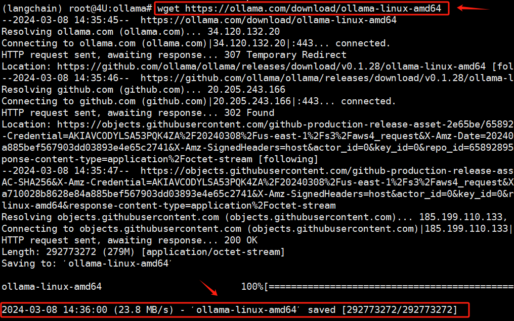

  当一个二进制文件作为服务运行时，它背后的概念是使该程序能够在后台持续运行，而不是作为一次性任务执行后就结束。这样的服务可以在系统启动时自动启动，也可以按需手动启动或停止。

  或者在Windows电脑上，复制这个链接到浏览器：https://ollama.com/download/ollama-linux-amd64 ，然后通过XFTP等工具，上传到所使用的远程服务器的 `/usr/bin`路径下。

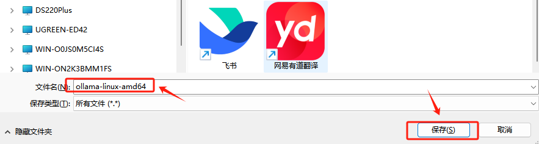

  如果下载成功，在远程服务器上会出现如下二进制文件：

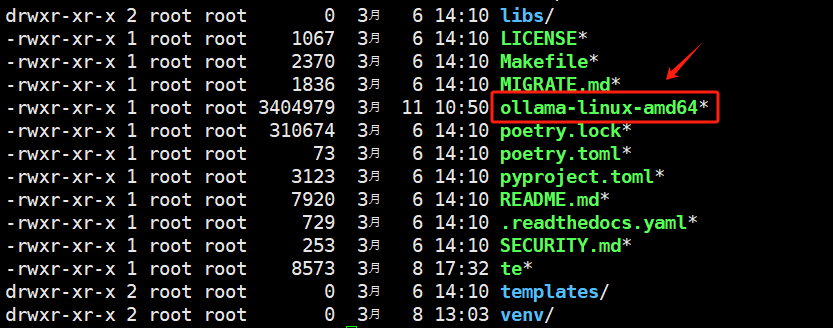

* **Step 2. 重命名并移动Ollama的二进制文件**

  在Linux系统中，将二进制文件移动到`/usr/bin` 目录下可以让该文件在系统中全局可执行，因为 `/usr/bin` 通常包含在Linux系统的默认环境变量 `$PATH` 中。将可执行文件放置于此，系统就能在任何位置通过命令行调用该程序，无需指定完整路径。所以接下来，我们将`ollama-linux-amd64`这个二进制文件移动到`/usr/bin`路径下，并重命名为`ollama`，执行命令如下：

```bash
    mv ollama-linux-amd64 ollama
```


  正常执行完成后，检查方式如下：

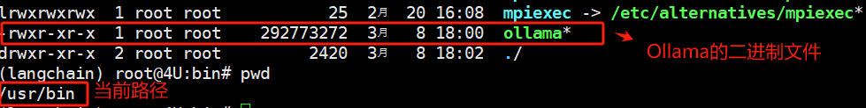

* **Step 3. 给Ollama赋予可执行权限**

  默认情况下，该二进制文件是没有执行权限的。没有执行权限，启动或运行Ollama二进制文件会失败，系统会返回一个错误，提示没有执行权限。所以需要通过如下命令进行赋权：

```bash
    sudo chmod +x /usr/bin/ollama
```


* **Step 4. 为Ollama服务设置独立的子用户**

  Linux系统为每个服务创建单独的子用户主要是出于安全和资源管理的考虑。这种做法在运行服务或应用程序时尤为常见，尤其是在公司的生产环境中部署，是常规且标准的一项配置，执行如下命令为`Ollama`服务创建子账户：

```bash
    sudo useradd -r -s /bin/false -m -d /usr/share/ollama ollama
```

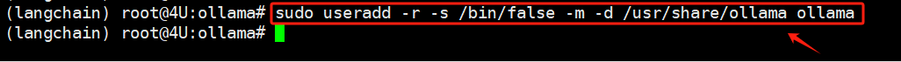

* **Step 5. 创建服务文件**

  接下来配置Ollama的服务文件，这一步是为了将Ollama服务配置为系统服务，支持通过 `systemctl` 命令来管理服务（例如启动、停止、重启服务），具体配置信息如下：

  首先，执行`vim /etc/systemd/system/ollama.service`命令，在 `/etc/systemd/system/ollama.service` 中创建服务文件，写入如下内容：

```json
    [Unit]             # 提供了服务的描述和服务启动前的依赖关系
    Description=Ollama Service
    After=network-online.target     # 指定服务应该在网络完全启动并在线之后才启动。

    [Service]          # 指定了服务的具体运行参数
    ExecStart=/usr/bin/ollama serve  # 指出启动服务时执行的命令
    User=ollama                      # 指出服务运行时使用的用户
    Group=ollama                     # 指出服务运行时使用的用户和用户组
    Restart=always
    RestartSec=3                     # 服务在遇到失败时应始终尝试重启，且在尝试重启之间等待3秒。

    [Install]          # 指定如何将这个服务安装为一个系统服务，使其能够被启用（允许服务随系统启动）或禁用。
    WantedBy=default.target          # 指定当执行 systemctl enable ollama.service 命令时，这个服务应该被启用并随系统启动。
```

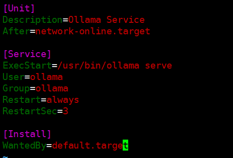

* **Step 6. 使Step 5中配置的信息生效**

  在Linux系统中，修改了任何服务的配置文件（比如创建新的服务文件或修改现有的服务文件等）后，需要执行这个命令来让`systemd`知道配置已更改并重新读取它们，执行如下命令：

```bash
    sudo systemctl daemon-reload
```

  然后，将Ollama服务设置为开机自启。这意味着当系统启动时，systemd会自动启动这个服务，而不需要再手动介入。执行命令如下：

```bash
    sudo systemctl enable ollama
```

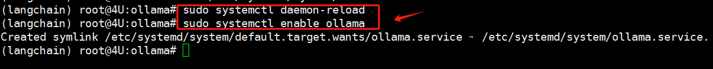

* **Step 7. 确认安装了显卡驱动**

  Ollama项目设计用于在本地环境中运行大模型，而大模型加载是依赖GPU的。因此，需要确认当前服务器系统上已正确安装显卡驱动。

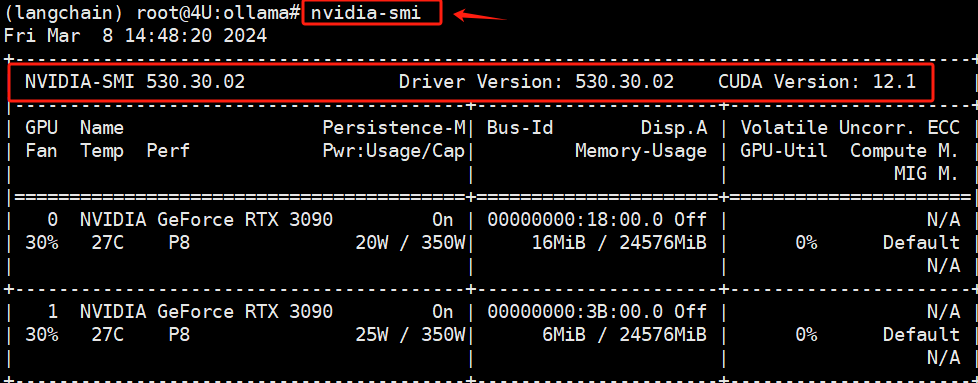

  如执行上述命名报错，则表明当前系统环境中未安装NVIDIA的显卡驱动，此时：如果本地服务器是Ubuntu系统，请参考：《Ch.4 在Ubuntu 22.04系统下部署运行ChatGLM3-6B模型》中的`2.1 安装显卡驱动`小节；而如果是Windows操作系统，请参考：《Ch.6 在Windows系统下部署运行ChatGLM3-6B模型》中的`2. 安装NVIDIA显卡驱`小节。

* **Step 8. 启动并检查状态**

  依次执行完上述配置后，最后便可以使用如下命令进行Ollama项目的启动：

```bash
    sudo systemctl start ollama
```

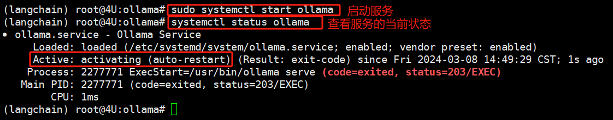

  如果安装过程中未出现任何错误信息，通常情况下能够表明安装已成功。可以通过执行以下命令来检查Ollama服务的运行状态：

```plaintext
systemctl status ollama
```

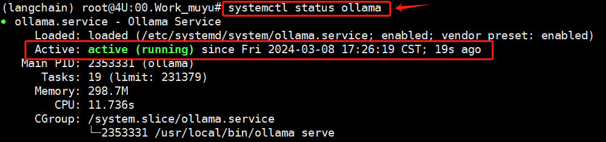

  如果`Active`状态显示为`active`，则说明Ollama服务目前处于正常运行状态。同时还可以通过以下命令查询当前安装的Ollama版本：

```bash
sudo ollama --version
```

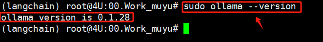

  至此，我们已成功完成Ollama项目的本地部署，并顺利启动了Ollama服务。下面，我们将介绍如何开始使用该服务。

## 1.3 Ollama大模型下载方法

  需要说明的一点是：Ollama项目虽然提供了本地化大模型的能力，但这并不意味着所有大模型都可以通过它下载和使用。它实现的形式与Hugging Face和ModelScope相似，专门支持从其托管的模型库中快速使用一系列模型，其支持的大模型的详细列表可在Ollama的官方模型库页面查看：<https://ollama.com/library>。

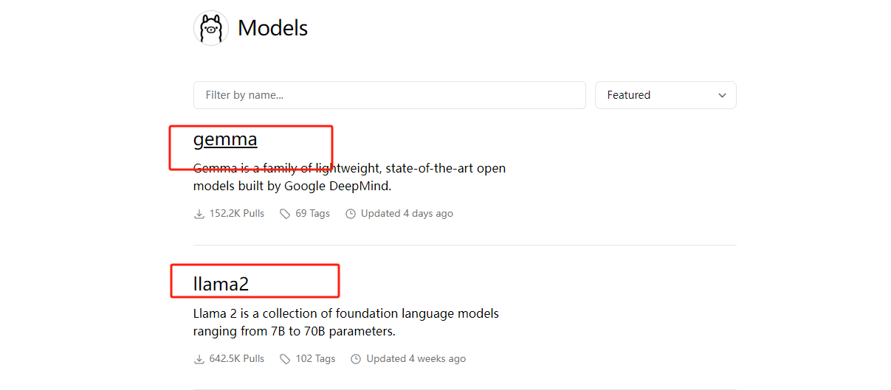

  在Ollama的模型库中，大家能够发现主要支持的还是基于LLaMA架构的一些主流大模型。而对于中文处理性能较好的模型，目前Ollama仅支持Qwen的1.5版本和零一万物的Yi模型。因此，在本课程中，我们将以Qwen模型为例，来详细介绍如何使用Ollama来运行和应用这些大模型。

  首先需要下载指定版本的大模型，可以通过 `ollama pull <name-of-model>` 命令将可用的 LLM 模型下载至本地。例如，要使用Qwen 1.5模型，在Ollama的搜索栏中输入关键词`qwen`。然后，点击搜索结果以进入模型的详细信息页面。

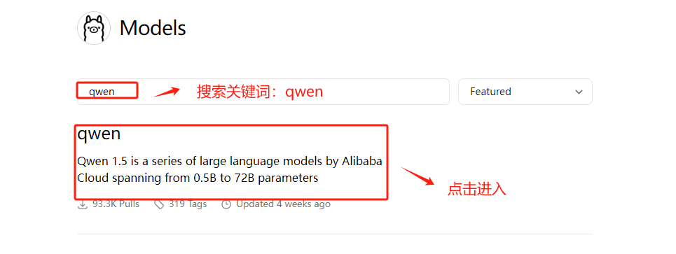

  在进入到大模型的详细信息页面后，可以通过下拉菜单选择不同参数量的大模型版本。然后需要复制页面右侧提供的模型标识符以进行下一步的模型下载操作。

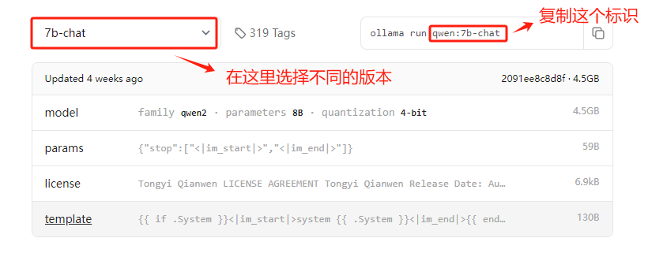

  接下来进入服务器终端，使用`ollama pull`命令进行远程模型文件的下载，执行的具体命令如下：

```bash
    ollama run qwen:7b-chat
```

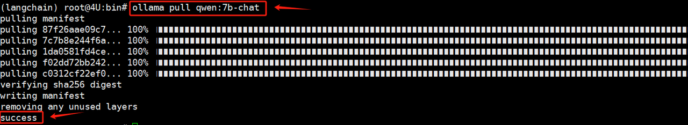

  上述命令会自动执行Qwen1.5-7b-Chat模型的下载过程，在Linux系统中，当下载任务完成后，大模型的全部文件将存储在 `/usr/share/ollama/.ollama/models`路径中：

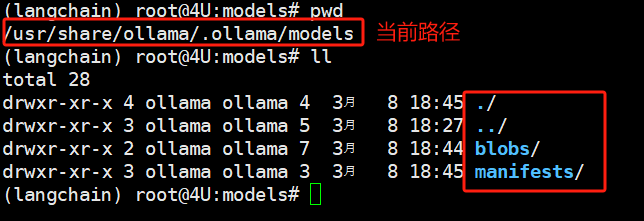

  同时，进一步进入子文件，即可找到下载模型的具体标识：

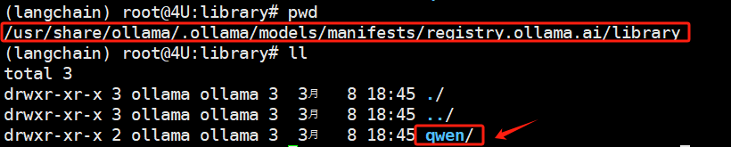

  此外，还可以使用命令`ollama list`来直接查看通过Ollama下载的大模型文件列表，这些模型都支持在线启动和调用。

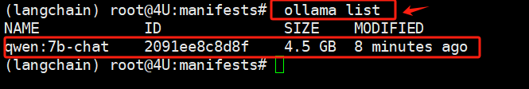

## 1.4 Ollama启动和使用方法

  要在Ollama上启动和使用大模型，需要满足两个条件：首先，Ollama服务必须处于运行状态；其次，本地必须已经存储有可供调用的大模型。满足这两个条件后，便可以通过执行`ollama run`命令来快速启动特定版本的大模型。以我们在上一小节下载的`Qwen1.5-7b-chat`模型为例，下面的命令将在当前命令行终端启动一个交互式对话环境：

```bash
    ollama run qwen:7b-chat
```

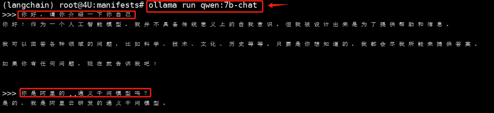

  大家在实操过程中会明显发现，通过LLaMa启动大模型的速度显著快于传统的启动方式。实际上，这个项目类似于llama.cpp，但区别在于它是使用Go语言编译的。当启动成功，我们便可以在当前终端进行交互式对话。Ollama会自动识别服务器的GPU使用情况，并进行负载均衡，优化资源使用。

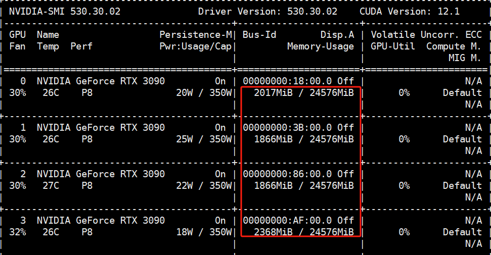

  在命令行中输入`/?`可以显示当前交互模式下的使用说明，大家可以根据这些信息自行进行功能测试，这里不再详细讨论。

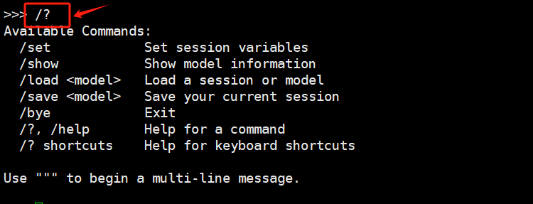

  通过上述关于Ollama的安装、模型下载及启动推理的介绍和实践，我们可以感受到Ollama极大地简化了大模型部署的过程，也降低了大模型在使用上的技术门槛。然而，对大部分用户而言，命令行界面并不够友好。正如我们之前提到的，在大模型的应用开发框架下，使用到的往往是其API调用形式，为此，Ollama也是可以集成多个开源项目，包括Web界面、桌面应用和终端工具等方式提升使用体验，并满足满足不同用户的偏好和需求。

  接下来我们还是重点介绍Ollama如何启动大模型的API服务及如何在LangChain中集成Qllama。

***

📍**更多大模型技术内容学习**

**扫码添加助理英英，回复“大模型”，了解更多大模型技术详情哦👇**


此外，**扫码回复“入群”**，即可加入**大模型技术社群：海量硬核独家技术`干货内容`+无门槛`技术交流`！**
