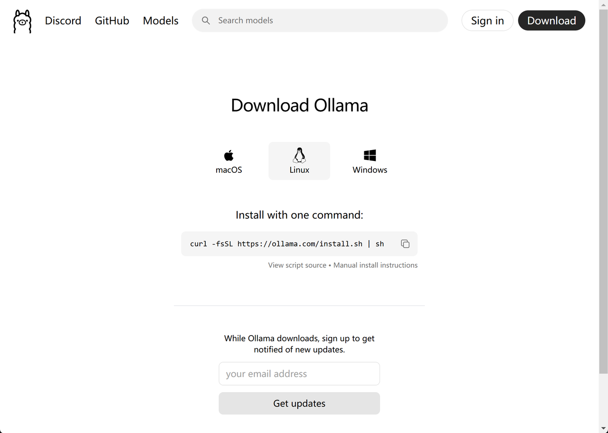
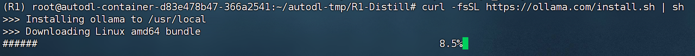
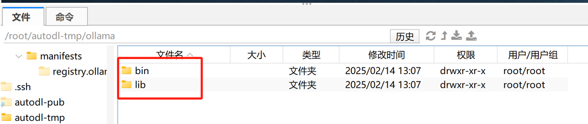
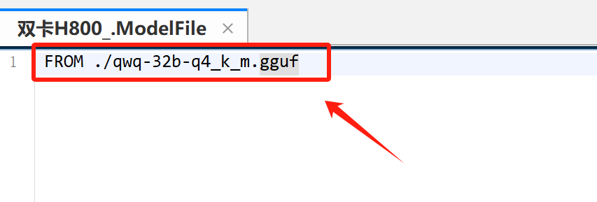
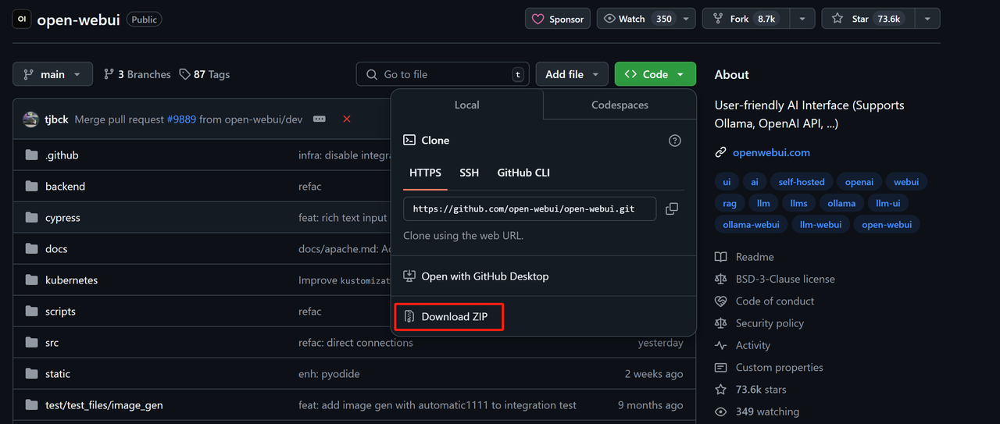
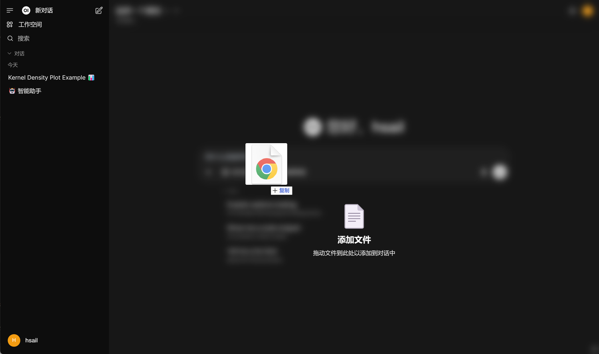

**公开课网盘链接链接: https://pan.baidu.com/s/14oBvnEi\_k7tl6nfB4ZcwOQ?pwd=xj3t**

***

## 一、QwQ-32B模型介绍

### 1. 模型简介（Introduction）

&#x20;**QwQ** 是 **Qwen** 系列的大模型之一，专注于 **推理能力（reasoning）**。相比于传统的 **指令微调（instruction-tuned）** 模型，QwQ 具备 **思考与推理（thinking and reasoning）** 的能力，因此在各种下游任务（特别是复杂问题）上，能实现 **显著的性能提升**。
**QwQ-32B** 是该系列的 **中等规模推理模型**，其性能可媲美当前最先进的推理模型，如 **DeepSeek-R1** 和 **o1-mini**。


### 2. 强化学习训练效果

&#x20;       大规模强化学习（RL）有潜力超越传统的预训练和后训练方法来提升模型性能。近期的研究表明，强化学习可以显著提高模型的推理能力。例如，DeepSeek R1 通过整合冷启动数据和多阶段训练，实现了最先进的性能，使其能够进行深度思考和复杂推理。这一次，QwQ探讨了大规模强化学习（RL）对大语言模型的智能的提升作用，这是一款拥有 320 亿参数的模型，其性能可与具备 6710 亿参数（其中 370 亿被激活）的 DeepSeek-R1 媲美。这一成果突显了将强化学习应用于经过大规模预训练的强大基础模型的有效性。此外，QwQ还在推理模型中集成了与 Agent 相关的能力，使其能够在使用工具的同时进行批判性思考，并根据环境反馈调整推理过程。

&#x20;       QwQ在冷启动的基础上开展了大规模强化学习。在初始阶段，QwQ特别针对数学和编程任务进行了 RL 训练。与依赖传统的奖励模型（reward model）不同，QwQ通过校验生成答案的正确性来为数学问题提供反馈，并通过代码执行服务器评估生成的代码是否成功通过测试用例来提供代码的反馈。随着训练轮次的推进，这两个领域中的性能均表现出持续的提升。在第一阶段的 RL 过后，增加了另一个针对通用能力的 RL。此阶段使用通用奖励模型和一些基于规则的验证器进行训练。最终发现，通过少量步骤的通用 RL，可以提升其他通用能力，同时在数学和编程任务上的性能没有显著下降。


* QWQ-32B魔搭社区：https://modelscope.cn/models/Qwen/QwQ-32B

* QWQ-32B技术博客：https://qwenlm.github.io/zh/blog/qwq-32b/

* QWQ-32B huggingface：https://huggingface.co/Qwen/QwQ-32B

* QWQ-32B-GGUF huggingface：https://huggingface.co/Qwen/QwQ-32B-GGUF

### 3. QwQ 32B模型基本参数

**QwQ 32B** 模型，具有以下特性：

* **类型（Type）**：因果语言模型（Causal Language Model）

* **训练阶段（Training Stage）**：预训练（Pretraining）+ 后训练（Post-training），包括 **监督微调（Supervised Finetuning, SFT）** 和 **强化学习（Reinforcement Learning, RL）**

* 架构（Architecture）：

  * **基于 Transformer**

  * **RoPE 位置编码**

  * **SwiGLU 激活函数**

  * **RMSNorm 归一化**

  * **Attention QKV 偏置**

* 参数规模（Number of Parameters）：

  * **总参数量**：32.5B（325 亿）

  * **非嵌入层参数量（Non-Embedding）**：31.0B（310 亿）

* **网络层数（Number of Layers）**：64 层

* 注意力头（GQA 机制）：

  * **查询（Q）头数**：40

  * **键值（KV）头数**：8

* **上下文长度（Context Length）**：**完整支持 131,072 个 token**

* 确保模型的输出以 `"<think>\n"` 开头，以避免生成 **空的思考内容**，否则可能会影响生成质量。

* 如果使用 `apply_chat_template` 并 **设置 `add_generation_prompt=True`**，该机制会 **自动** 添加 `"<think>\n"`，但可能会导致最终回复 **缺少 `<think>` 标签**。这种情况是 **正常** 的。

### 4. 更多QwQ入门介绍与课件下载地址

* QwQ模型介绍与性能测试，与DeepSeek R1模型优劣势对比：https://www.bilibili.com/video/BV1zeRAYUEKg/


* 课件下载


&#x20;


## 二、QWQ-32B全量模型下载与Transformers推理流程

### 1. QWQ-32B模型下载与环境搭建

* 【可选】创建虚拟环境

```bash
conda create --name QWQ python=3.11
conda init
source ~/.bashrc
conda activate QWQ
```


* 【可选，若创建虚拟环境，则必须要执行】创建Jupyter Kernel

```bash
conda install jupyterlab
conda install ipykernel
python -m ipykernel install --user --name QWQ --display-name "Python QWQ"
```


* 安装魔搭社区

```bash
pip install modelscope
```

* 创建项目主目录

```bash
cd /root/autodl-tmp
mkdir QWQ-32B
```


* 上传并安装依赖


* 项目依赖在网盘中：


* 上传完即可进行安装

```bash
pip install -r requirements.txt
```

* 下载项目权重

```bash
modelscope download --model Qwen/QwQ-32B --local_dir ./QwQ-32B
```


* 下载完成后QWQ-32B模型完整项目如下：


### 2. Jupyter中使用transformer原生库调用流程

然后即可使用transformer进行调用，具体调用步骤如下：

* 导入相关库

```python
from modelscope import AutoModelForCausalLM, AutoTokenizer
```

* 设置模型下载地址

```python
model_name = "./QWQ-32B"
```

* 实例化预训练模型与分词器

```python
model = AutoModelForCausalLM.from_pretrained(
    model_name,
    torch_dtype="auto",
    device_map="auto",
    low_cpu_mem_usage=True
)

tokenizer = AutoTokenizer.from_pretrained(model_name)
```

* 创建消息message

```python
prompt = "在单词\"strawberry\"中，总共有几个R？"
messages = [
    {"role": "user", "content": prompt}
]
```

* 词嵌入过程

```python
text = tokenizer.apply_chat_template(
    messages,
    tokenize=False,
    add_generation_prompt=True
)

model_inputs = tokenizer([text], return_tensors="pt").to(model.device)
```

* 创建并回复

```python
generated_ids = model.generate(
    **model_inputs,
    max_new_tokens=32768
)

generated_ids = [
    output_ids[len(input_ids):] for input_ids, output_ids in zip(model_inputs.input_ids, generated_ids)
]

response = tokenizer.batch_decode(generated_ids, skip_special_tokens=True)[0]

print(response)
```

* 最终运行结果如下：


能够看出，此时模型回复结果中就包含思维链的全部内容。实际使用过程中，可以通过正则化的方法将思维链内容和模型回复内容进行区分。，此时模型显存占用约61G。


## 三、QWQ-32B模型接入Ollama与推理流程

&#x20;       Open-WebUI原生支持使用Ollama调用本地模型进行推理，Ollama是一款大模型下载、管理、推理、优化集一体的强大工具，可以快速调用各类离线部署的大模型。Ollama官网：https://ollama.com/ 。

&#x20;       目前QWQ-32B模型已支持使用ollama进行调用，可以在模型主页查看调用情况：https://ollama.com/library/qwq


同样是运行Q4\_K\_M量化模型，模型大小仅为20G不到，实际运行仅需23G显存即可。

### 1. ollama安装

* 【安装方案一】Ollama在线安装

* 在Linux系统中，可以使用如下命令快速安装Ollama

```bash
curl -fsSL https://ollama.com/install.sh | sh
```



* &#x20;



* 但该下载流程会受限于国内网络环境，下载过程并不稳定。

* 【安装方案二】Ollama离线安装

* 因此，在更为一般的情况下，推荐使用Ollama离线部署。我们可以在Ollama Github主页查看目前Ollama支持的各操作系统安装包：https://github.com/ollama/ollama/releases


* 若是Ubuntu操作系统，选择其中`ollama-linux-amd64.tgz`下载和安装即可。

* 此外，安装包也可从网盘中下载：


* &#x20;


* 下载完成后，需要先上传至服务器：


* 然后使用如下命令进行解压缩

```bash
mkdir ./ollama
tar -zxvf ollama-linux-amd64.tgz -C ./ollama
```

* 解压缩后项目文件如图所示：



* 而在bin中，可以找到ollama命令的可执行文件。


* 此时，我们可以使用如下方式使用ollama：

```bash
cd ./bin
./ollama help
```


* 此处若显示没有可执行权限，可以使用如下命令为当前脚本添加可执行权限：

```bash
chmod +x ollama
```

* 而为了使用命令方便，我们也可以将脚本文件写入环境变量中。我们可以在主目录（root）下找到.bashrc文件：


* 然后在`.bashrc`文件结尾写入ollama/bin文件路径：


```bash
export PATH=$PATH:/root/autodl-tmp/ollama/bin
```

* 保存并退出后，输入如下命令来使环境变量生效：

```bash
source ~/.bashrc
```

* 然后在任意路径下输入如下命令，测试ollama环境变量是否生效

```bash
ollama help
```


* 【可选】更换Ollama默认模型权重下载地址

* 接下来我们需要使用ollama来下载模型，但默认情况下，ollama会将模型下载到/root/.ollama文件夹中，会占用系统盘空间，因此，若有需要，可以按照如下方法更换模型权重下载地址。

* 此外无论是在线还是离线安装的ollama，都可以按照如下方法更换模型权重下载地址。还是需要打开`/root/.bashrc`文件，写入如下代码：

```bash
export OLLAMA_MODELS=/root/autodl-tmp/models
```


* 这里的路径需要改写为自己的文件地址

* 保存并退出后，输入如下命令来使环境变量生效：

```bash
source ~/.bashrc
```

* 测试环境变量是否生效

```bash
echo $OLLAMA_MODELS
```


* 启动ollama

* 接下来即可启动ollama，为后续下载模型做准备：

```bash
ollama start
```


* 注意，在整个应用使用期间，需要持续开启Ollama。

### 2. QWQ-32B GGUF格式模型权重下载

&#x20;       ollama模型权重下载可以使用ollama pull命令进行在线下载（没有网络门槛，且速度很快），当然也可以手动下载模型权重，然后上传到服务器上，再注册到Ollama中，就可以通过Ollama调用模型了。以下两种模型权重下载方法任选其一执行即可。

#### 2.1 【方案一】在线下载模型权重

ollama中使用pull命令即可直接下载模型权重。

```bash
ollama pull qwq
```

使用该命令后系统就会自动下载模型权重，并自动完成注册。


等待模型下载完成后即可直接使用。

#### 2.2 【方案二】离线下载模型权重

&#x20;       除了使用ollama pull命令外，ollama也支持调用手动下载的自定义模型，但需要是GGUF格式。目前QWQ-32B模型已有各种不同量化版本的GGUF模型在魔搭社区和huggingface中上线了：https://modelscope.cn/models/Qwen/QwQ-32B-GGUF


其中每个GGUF量化的权重都包含多个版本：


其中ollama调用的就是Q4\_K\_M量化版本。这里我们还是考虑下载Q4\_K\_M量化版本的GGUF权重进行调用，具体执行流程如下。

* 下载GGUF格式权重

```bash
cd ~/autodl-tmp
mkdir QwQ-32B-GGUF
modelscope download --model Qwen/QwQ-32B-GGUF qwq-32b-q4_k_m.gguf --local_dir ./QwQ-32B-GGUF
```


下载后模型文件如图所示：


此外，也可以在课件网盘中进行下载：


&#x20;


* 注册模型

然后需要创建一个file文件，用于进行ollama模型注册：


然后在File文件中写入自定义模型GGUF权重地址：

```plaintext
FROM ./qwq-32b-q4_k_m.gguf
```



然后将该模型加入Ollama本地模型列表：

```bash
cd /root/autodl-tmp/QwQ-32B-GGUF
ollama create qwq-32b -f ModelFile
```


查看模型是否注册成功

```bash
ollama list
```


并且，如果此前修改过模型路径，则可以在新的ollama默认保存模型路径下看到新模型：


接下来即可在命令行中进行调用：

```bash
ollama run qwq-32b
```


### 3. ollama API本地运行流程

在部署完ollama之后，即可借助ollama API（也就是OpenAI风格API）在代码环境中调用模型。

* 导入OpenAI库

```python
from openai import OpenAI
```

* 实例化OpenAI客户端

```python
client = OpenAI(
    base_url='http://localhost:11434/v1/',
    api_key='ollama',  # required but ignored
)
```

* 创建消息

```python
prompt = "在单词\"strawberry\"中，总共有几个R？"
messages = [
    {"role": "user", "content": prompt}
]
```

* 获得回复

```python
response = client.chat.completions.create(
    messages=messages,
    model='qwq-32b',
)

print(response.choices[0].message.content)
```

最终运行结果如下：


而此时显存占用约22G左右：


## 四、QWQ-32B模型接入vLLM与推理流程

### 1.vLLM安装与启动

&#x20;       接下来继续介绍QWQ-32B模型借助vLLM进行推理的完整流程。相比ollama，vLLM更加适合企业级高并发应用场景，但对应的，显存占用也会更高，vLLM项目主页：https://github.com/vllm-project/vllm


* vLLM安装

```python
pip install vllm
```

* DeepSeek R1调用

目前vLLM已支持QWQ模型调用，可以在模型支持列表中查看模型关键字：https://docs.vllm.ai/en/latest/models/supported\_models.html


接下来即可按照如下流程进行调用。

### 2.OpenAI风格API响应模式

&#x20;       需要注意的是，QWQ最高支持128K上下文长度，但随着模型上下文越长，所需要占用的显存也越大。根据测试，模型在32K上下文时，运行需要63G显存。


而当上下文增加到128K时，则需要将近150G显存：


因此，启动vLLM时候需要谨慎的设置最大上下文和对应的运行GPU数量。

* 32K上下文，单GPU运行命令

```bash
cd /root/autodl-tmp
vllm serve ./QwQ-32B --max-model-len 32768
```

* 128K上下文，双GPU运行命令

```bash
cd /root/autodl-tmp
CUDA_VISIBLE_DEVICES=0,1 vllm serve ./QwQ-32B --tensor-parallel-size 2
```

启动后后端如图所示：


此时，即可在Jupyter中进行调用。

* 导入OpenAI库

```python
from openai import OpenAI
```

* 实例化OpenAI客户端

```python
openai_api_key = "EMPTY"
openai_api_base = "http://localhost:8000/v1"

client = OpenAI(
    api_key=openai_api_key,
    base_url=openai_api_base,
)
```

* 创建消息

```python
prompt = "在单词\"strawberry\"中，总共有几个R？"
messages = [
    {"role": "user", "content": prompt}
]
```

* 获得回复

```python
response = client.chat.completions.create(
    model="./QwQ-32B",
    messages=messages,
)

print(response.choices[0].message.content)
```

最终运行结果如下：


推理结束后，后端如图所示：


&#x20;


## 五、基于llama.cpp的QwQ模型CPU推理

&#x20;       由于QwQ模型采用了和Qwen2.5系列模型完全相同的架构，因此，也是可以使用llama.cpp进行纯CPU推理或者CPU+GPU混合推理的。接下来介绍如何使用llama.cpp调用模型权重进行推理和对话。

### 1. llama.cpp下载与编译

* llama.cpp项目主页：https://github.com/ggml-org/llama.cpp


由于llama.cpp是个C语言项目，因此实际调用过程需要先构建项目，然后设置参数进行编译，然后最终创建可执行文件（类似于脚本），再运行本地大模型。借助llama.cpp可以实现纯CPU推理、纯GPU推理和CPU+GPU混合推理。

* 依赖下载

* 为了能够顺利的完成C语言项目的项目创建和代码编译，首先需要先进行相关依赖的下载：

```bash
apt-get update
apt-get install build-essential cmake curl libcurl4-openssl-dev -y
```

* 这条命令安装了一些常用的构建和开发工具，具体的每个部分的含义如下：

  * **`build-essential`**：安装一组构建必需的工具和库，包括：

    * 编译器（如 GCC）

    * `make` 工具

    * 其他一些常见的构建工具，确保你的系统能进行编译。

  * **`cmake`**：安装 **CMake** 工具，它是一个跨平台的构建系统，允许你管理项目的编译过程。

  * **`curl`**：安装 **cURL** 工具，它是一个命令行工具，用于通过 URL 发送和接收数据。它在很多开发场景中都很有用，尤其是与网络交互时。

  * **`libcurl4-openssl-dev`**：安装 **libcurl** 库的开发版本。它是 cURL 的一个库文件，允许你在编程中通过 cURL 发送 HTTP 请求。`libcurl4-openssl-dev` 是与 **OpenSSL** 配合使用的版本，提供了 SSL/TLS 加密支持，用于安全的 HTTP 请求。

* llama.cpp源码下载

* 若是AutoDL服务器，可以先开启学术加速：

```bash
source /etc/network_turbo
```

* 然后再进行下载：

```bash
git clone https://github.com/ggerganov/llama.cpp
```

* 也可以直接在课件网盘中找到代码文件，直接上传服务器并解压缩：


* &#x20;


* 准备好后，即可在服务器中看到llama.cpp项目文件夹：

* 项目构建与编译

* 接下来需要使用cmake来构建项目文件：

```bash
cmake llama.cpp -B llama.cpp/build \
    -DBUILD_SHARED_LIBS=OFF -DGGML_CUDA=ON -DLLAMA_CURL=ON
```

* **`cmake`**：运行 CMake 工具，用于配置和生成构建文件。

* **`llama.cpp`**：指定项目的源代码所在的目录。在这个例子中，`llama.cpp` 是项目的根目录。

* **`-B llama.cpp/build`**：指定生成构建文件的目录。`-B` 参数表示**构建目录**，`llama.cpp/build` 是生成的构建目录。这是 CMake 将生成的文件存放的地方（例如 Makefile 或 Ninja 构建文件）。

* 同时还指定了一些编译选项：

  * **禁用共享库**（`-DBUILD_SHARED_LIBS=OFF`），生成 **静态库**。

  * **启用 CUDA 支持**（`-DGGML_CUDA=ON`），以便在有 GPU 的情况下使用 GPU 加速。

  * **启用 CURL 库支持**（`-DLLAMA_CURL=ON`），以便支持网络请求。


* 然后需要进一步进行编译：

```bash
cmake --build llama.cpp/build --config Release -j --clean-first --target llama-quantize llama-cli llama-gguf-split
```

* **`--build llama.cpp/build`**：告诉 CMake 使用 `llama.cpp/build` 目录中的构建文件来执行构建过程。这个目录是在之前运行 `cmake llama.cpp -B llama.cpp/build` 命令时生成的，包含了所有构建所需的文件（例如 Makefile 或 Ninja 构建文件）。

* **`--config Release`**：指定构建的配置为 **Release** 配置。

  * **Release** 配置通常意味着启用更多的 **优化**，生成的程序运行速度较快，适合发布。

  * 在 CMake 中，通常有两种常见的构建配置：

    * **Debug**：用于调试版本，包含调试信息且没有做过多优化。

    * **Release**：优化后的发布版本，去除调试信息，运行时性能更高。

* **`-j`**：表示并行构建，允许 CMake 使用多个 CPU 核心来加速构建过程。

  * 如果没有指定数字，CMake 会使用默认的并行级别，通常是可用的所有 CPU 核心。你也可以指定并行的作业数，例如 `-j 8` 表示使用 8 个并行作业进行编译。

* **`--clean-first`**：表示在构建之前先清理掉之前的构建结果。这可以确保每次构建时都是从一个干净的状态开始，避免由于缓存或中间文件引起的编译错误。

  * 如果你之前运行过构建并且有问题，或者希望重新构建而不使用任何缓存文件，这个选项非常有用。

* **`--target`**：指定构建的目标（target）。通常，一个项目会定义多个目标（比如库、可执行文件等），通过这个参数可以告诉 CMake 只编译特定的目标。

  * **`llama-quantize`**：可能是与模型量化相关的目标。量化（quantization）是将模型的精度从浮点数降低到整数，从而减少内存占用和提高推理速度。

  * **`llama-cli`**：可能是一个命令行工具，用于运行模型或与用户交互。

  * **`llama-gguf-split`**：可能是一个用于拆分模型文件的目标，通常用于将一个大模型文件拆分成多个小文件，方便存储和加载。


* 复制可执行文件

```bash
cp llama.cpp/build/bin/llama-* llama.cpp
```

* 将 **所有生成的可执行文件** 从构建目录 `llama.cpp/build/bin/` 复制到项目的根目录 `llama.cpp` 下。这样可以更方便地在项目根目录下执行这些可执行文件，而无需每次都进入构建目录。

在准备完成后，接下来即可进行调用和推理测试了。

### 2.借助llama.cpp运行QwQ模型

* 纯CPU推理流程【1token/s】

&#x20;首先是纯CPU推理测试。此时系统只调用内存+CPU进行计算，此时不会用到GPU，在调用Q4\_K\_M模型时，实际内存占用为18G。


此时模型运行门槛很低，但运行速度非常慢，只有不到1tokens/s。具体推理代码实现流程如下：

```bash
cd ./llama.cpp

./llama-cli \
    --model /root/autodl-tmp/QwQ-32B-GGUF/qwq-32b-q4_k_m.gguf \
    --cache-type-k q4_0 \
    --threads 64 \
    --prio 2 \
    --temp 0.6 \
    --ctx-size 512 \
    --seed 3407 \
    --n-gpu-layers 0 \
    -no-cnv \
    --prompt "<｜User｜>你好，好久不见，请介绍下你自己。<｜Assistant｜>" 
```

其中命令行核心参数说明：

* `--threads`：CPU 核心数;

* `--ctx-size`：输出的上下文长度；

* `--n-gpu-layers` ：需要卸载到 GPU 的层数，设置为0时代表完全使用CPU进行推理；

* `--temp`：模型温度参数；

* `-no-cnv`：不进行多轮对话；

* `--cache-type-k`：K 缓存量化为 4bit；

* `--seed`：随机数种子；

实际运行效果如下所示：


* CPU+GPU混合推理

&#x20;       接下来进一步尝试CPU+GPU混合推理，我们只需要合理的设置`--n-gpu-layers`参数，即可灵活的将模型的部分层加载到GPU上进行运行。并且无需手动设置，llama.cpp会自动识别当前GPU数量以及可以分配的显存，自动将模型权重加载到各个不同的GPU上。例如，我们这里考虑将30层加载到GPU上，运行效果如下所示：

```bash
./llama-cli \
    --model /root/autodl-tmp/QwQ-32B-GGUF/qwq-32b-q4_k_m.gguf \
    --cache-type-k q4_0 \
    --threads 64 \
    --prio 2 \
    --temp 0.6 \
    --ctx-size 512 \
    --seed 3407 \
    --n-gpu-layers 30 \
    -no-cnv \
    --prompt "<｜User｜>你好，好久不见，请介绍下你自己。<｜Assistant｜>" 
```

此时显存占用不到10G：


&#x20;


推理速度略微有所提升，能达到接近2tokens/s

* 纯GPU推理

&#x20;       最后，我们更进一步，尝试把全部的模型权重都放在GPU上进行推理。

```bash
./llama-cli \
    --model /root/autodl-tmp/QwQ-32B-GGUF/qwq-32b-q4_k_m.gguf \
    --cache-type-k q4_0 \
    --threads 64 \
    --prio 2 \
    --temp 0.6 \
    --ctx-size 512 \
    --seed 3407 \
    --n-gpu-layers 64 \
    -no-cnv \
    --prompt "<｜User｜>你好，好久不见，请介绍下你自己。<｜Assistant｜>" 
```

此时GPU占用约18G：


推理速度则能达到14tokens/s。

## 六、QWQ-32B接入Open-WebUI流程

### 1.Open-WebUI部署流程

&#x20;       首先需要安装Open-WebUI，官网地址如下：https://github.com/open-webui/open-webui。


我们可以直接使用pip命令快速完成安装：

```bash
pip install open-webui
```


可以直接使用在GitHub项目主页上直接下载完整代码包，并上传至服务器解压缩运行：



此外，也可以在课件网盘中领取完整代码包，并上传至服务器解压缩运行：


下图扫码即可领取：


在确保ollama正常运行的情况下，进行后续操作。

### 2. Open-WebUI启动与对话流程

&#x20;       在准备好了Open-WebUI和一系列模型权重后，接下来我们尝试启动Open-WebUI，并借助本地模型进行问答。

首先需要设置离线环境，避免Open-WebUI启动时自动进行模型下载：

```bash
export HF_HUB_OFFLINE=1
```

然后启动Open-WebUI

```bash
open-webui serve
```

需要注意的是，如果启动的时候仍然报错显示无法下载模型，是Open-WebUI试图从huggingface上下载embedding模型，之后我们会手动将其切换为本地运行的Embedding模型。


然后在本地浏览器输入地址:8080端口即可访问：


然后首次使用前，需要创建管理员账号：


然后点击登录即可。需要注意的是，此时Open-WebUI会自动检测后台是否启动了ollama服务，并列举当前可用的模型。稍等片刻，即可进入到如下页面：


接下来即可进入到对话页面：


对话效果如下所示：


&#x20;


### 3. 本地知识库检索



&#x20;


&#x20;


### 4. 代码解释器


&#x20;


### 5. 调用外部工具

需要注意的是，DeepSeek R1模型原生并不支持Fucntion calling，但借助Ollama，可以实现基础的Function calling，并基于此完成Open-WebUI的外部工具调用工作。


https://ollama.com/blog/tool-support

* Open-WebUI工具调用功能实现


然后编写天气查询函数：

```python
import requests
import json
from fastapi import Request
from open_webui.models.users import Users

class Tools:
    def __init__(self):
        pass

    async def get_weather(
        self, loc: str, __request__: Request, __user__: dict, __event_emitter__=None
    ) -> str:
        """
        获取指定城市的即时天气信息。

        :param loc: 城市名称（如果是非英文城市名称，请先将其翻译为英文城市名称再输入）。
        :param __request__: HTTP 请求对象（来自 FastAPI）。
        :param __user__: 用户信息（可以用于个性化或记录请求）。
        :param __event_emitter__: 事件发射器，用于将实时状态更新发送到前端。
        :return: 格式化后的天气数据，作为字符串返回。
        
        说明：
        如果输入的是非英文城市名称，请先将其翻译为对应的英文城市名称再输入。
        比如，输入“中国，北京”，需要转为 "Beijing"。
        """

        # Step 1. 通知用户正在获取天气数据
        await __event_emitter__(
            {
                "type": "status",
                "data": {"description": f"正在获取 {loc} 的天气数据...", "done": False},
            }
        )

        try:
            # Step 2. 构建请求的 URL 和查询参数
            url = "https://api.openweathermap.org/data/2.5/weather"
            params = {
                "q": loc,
                "appid": "YOUR_API_KEY",  # 你的 API 密钥
                "units": "metric",  # 使用摄氏度
                "lang": "zh_cn",  # 输出简体中文
            }

            # Step 3. 向 OpenWeather API 发送 GET 请求
            response = requests.get(url, params=params)

            # Step 4. 解析响应数据
            data = response.json()

            # Step 5. 提取并格式化天气描述
            weather_data = data.get("weather", [])
            if weather_data:
                main_weather = weather_data[0].get("main", "")
                description = weather_data[0].get("description", "")
                weather_info = f"当前天气：{main_weather} - {description}"
            else:
                weather_info = "天气信息不可用。"

            # Step 6. 通知用户天气数据已经成功获取
            await __event_emitter__(
                {
                    "type": "status",
                    "data": {"description": f"成功获取 {loc} 的天气数据", "done": True},
                }
            )

            # Step 7. 返回格式化后的天气信息并发送到前端
            await __event_emitter__(
                {
                    "type": "message",
                    "data": {"content": f"{loc} 的天气信息: {weather_info}"},
                }
            )

            # 返回格式化后的天气数据作为字符串
            return f"{loc} 的天气信息: {weather_info}"

        except Exception as e:
            # Step 8. 如果发生错误，通知用户
            await __event_emitter__(
                {
                    "type": "status",
                    "data": {"description": f"发生错误: {str(e)}", "done": True},
                }
            )

            # 返回错误信息
            return f"获取天气数据时发生错误：{str(e)}"
```

并将函数进行写入：


完成后即可看到新的工具：


在对话时可以开启天气查询函数：


&#x20;


至此，我们就详细介绍了QwQ模型的各类本地部署与调用方法。

***

更多关于大模型技术介绍，欢迎报名由我主讲的《2025大模型Agent智能体开发实战》（2月DeepSeek强化班）https://whakv.xetslk.com/s/3uzKfW 进行更深度系统的学习哦\~

&#x20;

**[《2025大模型Agent智能体开发实战》](https://whakv.xetslk.com/s/3uzKfW)3月班上新特惠进行时，详细信息扫码添加助教，回复“大模型”，即可领取课程大纲&查看课程详情👇**


此外，如果对大模型底层原理和模型训练感兴趣，欢迎报名由我和菜菜老师共同开设的《大模型原理与训练实战》https://whakv.xetslk.com/s/3p66pN实战课，3月新班额外新增大量DeepSeek V3\&R1模型原理与训练实战内容，扫描上方二维码即可查看完整课程大纲哦\~
