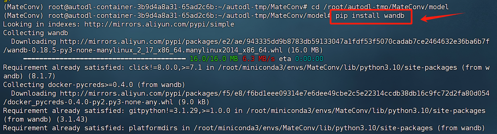
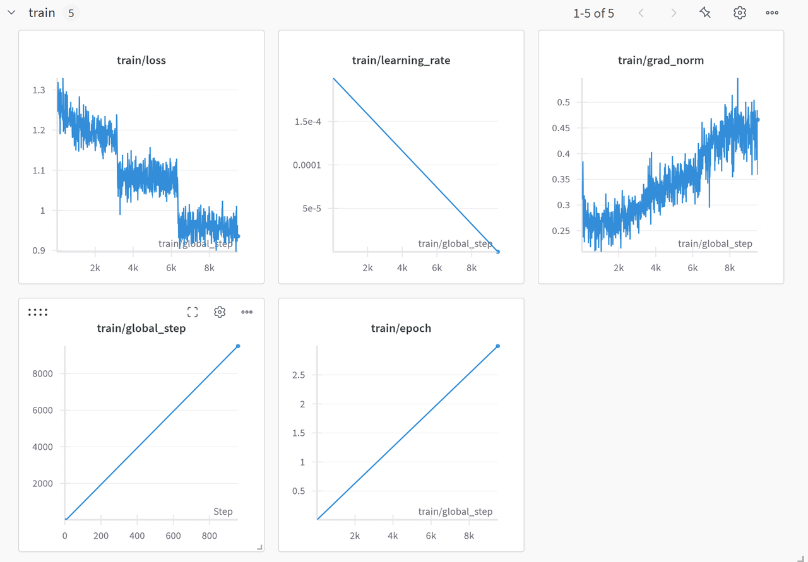
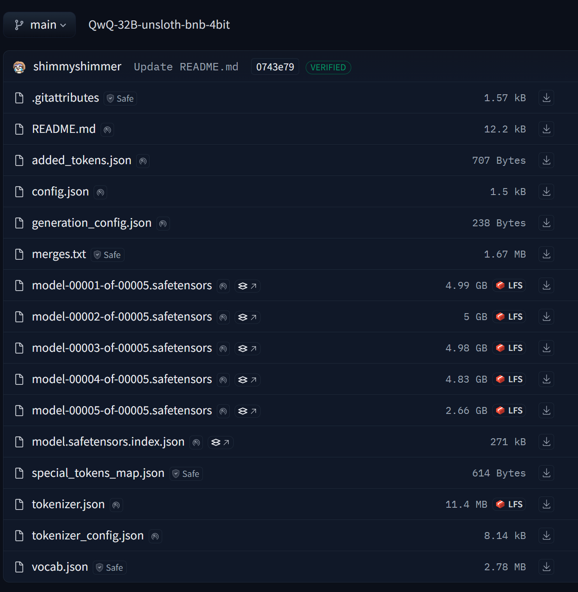
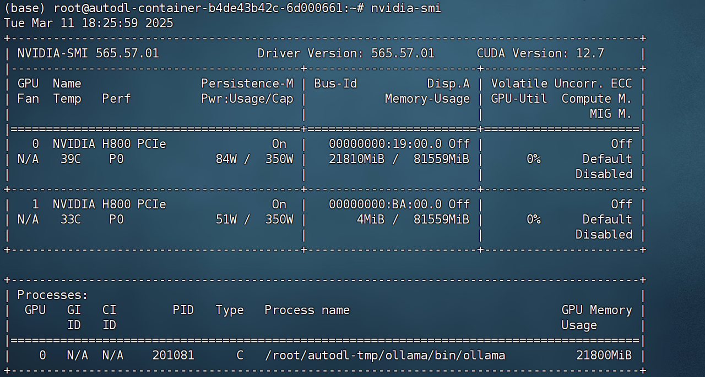
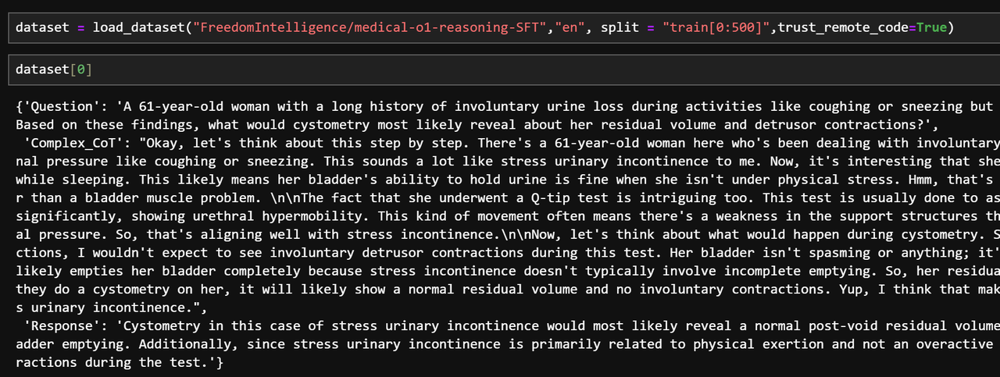

&#x20;       本节公开课，我们来探讨QwQ的一个热门技术应用方向——模型微调。本节公开课我们将重点介绍如何使用主流微调框架unsloth，围绕QwQ-32B 4bit动态量化模型进行高效微调，并详细介绍专门用于推理大模型高效微调的COT数据集的创建和使用方法，并在一个医学数据集上完成高效微调实战，并最终达到问答风格优化+知识灌注目的，让模型在微调过程中掌握复杂医学问题的专业推理过程，并提高疾病诊断的准确率。

* **最高性价比微调方案**：课程采用Unsloth的QwQ-32B 4bit动态量化模型进行微调，该模型修复了QwQ-32B传统Q4模型推理过程不稳定的问题，是目前QwQ甚至是整个推理模型领域内，性价比最高的模型；

* **硬件要求**：本节公开课最小化复现仅需20G显存、半小时运行时间即可完成，并获得微调效果。

* **训练流程迁移**：本节公开课介绍的QwQ-32B模型的高效微调流程可以迁移至QwQ其他精度、或者任意推理模型、DeepSeek R1蒸馏模型、任意COT数据集进行微调。

* **全流程实战**：公开课会完整介绍从微调框架选取、数据集制作、模型微调、效果对比、微调后模型权重合并及ollama/vLLM调用流程等微调的各个环节；

* **课件代码领取**：公开课随课提供全部课件、代码、训练数据、模型微调前后权重等各项内容。

* **课程参考资料**：为了更好的辅助学习，随公开课附赠相关参考资料。


&#x20;👆扫码即可领取全部课程资料👆&#x20;

**网盘链接🔗: https://pan.baidu.com/s/1ctw\_jJQ52U\_N1VbVGbMLnw?pwd=icfi**

## 一、大模型微调技术快速入门

### 1. 微调基础概念介绍

#### 1.1 **微调基本概念**

&#x20;       所谓大模型微调，指的在已有的大规模预训练模型基础上，通过对标注数据进行训练，进一步优化模型的表现，以适应特定任务或场景的需求。不同于RAG或者Agent技术，通过搭建工作流来优化模型表现，微调是通过修改模型参数来优化模型能力，是一种能够让模型“永久”掌握某种能力的方法。

#### 1.2 **全量微调与高效微调**

&#x20;       而从方法的大类上来划分，微调又可以划分为全量微调：带入全部数据进行微调，和高效微调：只带入部分数据进行微调。毫无疑问，全量微调是一种算力消耗更大、但对模型的能力改造更为彻底的方法，而高效微调则更类似一种“四两拨千斤”的方法，通过修改模型部分参数，来调整模型整体能力。

#### 1.3 **高效微调与LoRA、QLoRA**

&#x20;       尽管全量微调可以对模型的能力进行深度改造，但要带入模型全部参数进行训练，需要消耗大量的算力，且有一定的技术门槛。相比之下，在绝大多数场景中，如果我们只想提升模型某个具体领域的能力，那高效微调会更加合适。尽管在2020年前后，深度学习领域诞生了很多高效微调的方法，但现在适用于大模型的最主流的高效微调方法只有一种——LoRA。

&#x20;       LoRA（Low-Rank Adaptation）微调是一种参数高效的微调方法，旨在通过引入低秩矩阵来减少微调时需要调整的参数数量，从而显著降低显存和计算资源的消耗。具体来说，LoRA 微调并不直接调整原始模型的所有参数，而是通过在某些层中插入低秩的适配器（Adapter）层来进行训练。

**LoRA的原理：**

* 在标准微调中，我们会修改模型的所有权重，而在 LoRA 中，只有某些低秩矩阵（适配器）被训练和调整。这意味着原始模型的参数保持不变，只是通过少量的新参数来调整模型的输出。

* 低秩矩阵的引入可以在显存和计算能力有限的情况下，依然有效地对大型预训练模型进行微调，从而让 LoRA 成为显存较小的设备上的理想选择。

**LoRA的优势：**

1. **显存优化：** 只需要调整少量的参数（适配器），显著减少了显存需求，适合显存有限的GPU。

2. **计算效率：** 微调过程中的计算负担也更轻，因为减少了需要调整的参数量。

3. **灵活性：** 可以与现有的预训练模型轻松结合使用，适用于多种任务，如文本生成、分类、问答等。

&#x20;       而**QLoRA（Quantized Low-Rank Adaptation）** 则是 LoRA 的一个扩展版本，它结合了 LoRA 的低秩适配器和量化技术。QLoRA 进一步优化了计算效率和存储需求，特别是在极端显存受限的环境下。与 LoRA 不同的是，**QLoRA 会将插入的低秩适配器层的部分权重进行量化（通常是量化为 INT4 或 INT8）**，在保持性能的同时显著降低模型的存储和计算需求。

* **核心思想：** 在 LoRA 的基础上加入量化技术，减少权重表示的位数，从而降低显存和计算需求。QLoRA 结合了低秩适配器和量化的优点，能够在显存有限的设备上进行更高效的微调。

* **量化：** 通过将模型权重量化为低精度（如 INT4），减少内存占用，并提高推理和训练速度。

* 优势：

  * 在显存非常有限的情况下仍能进行微调。

  * 可以处理更大规模的模型。

  * 适合用于边缘设备和需要低延迟推理的场景。

**LoRA 与 QLoRA 二者对比如下**

| 特性        | LoRA                     | QLoRA                                          |
| --------- | ------------------------ | ---------------------------------------------- |
| **核心技术**  | 低秩适配器（Low-Rank Adapters） | 低秩适配器 + 量化技术（Low-Rank Adapters + Quantization） |
| **适用场景**  | 显存受限，但设备性能较好             | 极限显存受限或需要快速推理的设备                               |
| **计算效率**  | 提高计算效率，减少调整的参数数量         | 进一步提升效率，减少内存使用并加快推理速度                          |
| **量化技术**  | 无量化                      | 将权重量化为低精度（如 INT4 或 INT8）                       |
| **内存消耗**  | 较低，但不如 QLoRA 低           | 显著降低内存消耗，适合更小的设备                               |
| **训练复杂度** | 较简单，适用于大多数微调场景           | 需要更多的量化和适配工作，但适合超大模型和设备受限场景                    |


### 2. 高效微调的应用场景

&#x20;       在实际大模型应用场景中，高效微调主要用于以下四个方面：

* **对话风格微调**：高效微调可以用于根据特定需求调整模型的对话风格。例如，针对客服系统、虚拟助理等场景，模型可以通过微调来适应不同的 **语气、礼貌程度** 或 **回答方式**，从而在与用户互动时提供更符合要求的对话体验。通过微调少量的参数（例如对话生成的策略、情感表达等），可以使模型表现出更具针对性和个性化的风格。

* **知识灌注**：知识灌注是指将外部知识或领域特定的信息快速集成到已有的预训练模型中。通过高效微调，模型可以更好地学习新领域的专有知识，而无需重新从头开始训练。例如，对于法律、医疗等专业领域，可以使用少量的标注数据对预训练模型进行微调，帮助模型理解特定行业的术语、规则和知识，进而提升专业领域的问答能力。

* **推理能力提升**：高效微调还可以用于提升大模型的推理能力，尤其是在处理更复杂推理任务时。通过微调，模型能够更加高效地理解长文本、推理隐含信息，或者从数据中提取逻辑关系，进而在多轮推理任务中提供更准确的答案。这种微调方式可以帮助模型在解答复杂问题时，提高推理准确性并减少错误。

* **Agent能力（Function calling能力）提升**：在多任务协作或功能调用场景中，高效微调能够显著提升模型的**Agent能力**，使得模型能够有效地与其他系统进行交互、调用外部API或执行特定任务。通过针对性微调，模型可以学会更精准的功能调用策略、参数解析和操作指令，从而在自动化服务、智能助手或机器人控制等领域表现得更加高效和智能。

### 3. 微调与强化学习训练、模型蒸馏等概念辨析

&#x20;       而伴随着DeepSeek R1的兴起，关于强化学习训练、模型蒸馏等概念也逐渐被人熟知，这里我们简单总结下这三者的异同。**微调**、**强化学习训练** 和 **模型蒸馏** 都是常用的技术手段，它们有着不同的应用场景和目标。尽管这些方法在某些方面有所交集，但它们的核心原理和任务目标却存在显著差异。

#### **1. 微调（Fine-tuning）**：

微调是指在一个已经预训练的大型模型基础上，使用较少的任务特定数据对模型进行再训练，以适应特定任务的需求。微调通常针对模型的某些层进行调整，或者通过在全模型基础上进一步训练来优化其在目标任务中的表现。微调不需要从零开始训练模型，而是通过 **小范围的参数调整** 来获得较高的任务表现。

* **目标**：通过少量的标注数据对预训练模型进行优化，适应具体任务（如文本分类、问答、生成等）。

* **特点**：微调的计算量相对较小，能够在有限的数据和计算资源下提升模型在特定任务上的性能。

* **应用**：常用于下游任务如情感分析、机器翻译、推荐系统等。

#### **2. 强化学习训练（Reinforcement Learning）**：

强化学习是一种通过与环境互动来学习如何最大化长期奖励的学习方式。与微调不同，强化学习是一个 **决策优化过程**，其主要目标是通过 **试错** 和反馈来学习最优策略。强化学习的智能体通过与环境的交互获得奖励信号，并根据反馈调整策略，长期进行优化。

* **目标**：通过与环境的交互，学习最优的行为策略，最大化累积奖励。

* **特点**：强化学习强调 **动态决策**，通过 **探索和利用** 的平衡，优化策略。它通常不依赖于预定义的数据集，而是依赖于与环境的持续交互。

* **应用**：强化学习在游戏AI（如AlphaGo）、机器人控制、自动驾驶等任务中有广泛应用。

#### **3. 模型蒸馏（Model Distillation）**：

模型蒸馏是一种将 **复杂、计算密集型的教师模型** 的知识转移到 **小型、高效的学生模型** 上的技术。通过蒸馏，学生模型能够学习教师模型的决策过程或表示，从而在保留较高效能的同时，降低模型的计算和存储成本。蒸馏通常通过教师模型生成软标签或行为模仿来指导学生模型训练。

* **目标**：通过教师模型的“知识转移”，帮助学生模型提升性能，特别是计算能力有限的设备上。

* **特点**：蒸馏的核心在于知识的迁移，尤其是在模型压缩和部署方面的优势。学生模型通常在性能上能接近教师模型，但参数量更小，计算更高效。

* **应用**：常见于模型压缩、边缘计算、低功耗设备的部署中，用于提升部署效率并降低计算需求。

**三者的异同**

| 特征        | 微调（Fine-tuning）             | 强化学习训练（Reinforcement Learning） | 模型蒸馏（Model Distillation）       |
| --------- | --------------------------- | ------------------------------ | ------------------------------ |
| **目标**    | 优化已预训练模型在特定任务上的表现           | 学习最优行为策略，最大化长期奖励               | 将复杂模型的知识转移到更小的模型上，减少计算开销       |
| **数据依赖**  | 依赖于标注数据，通常需要针对具体任务的少量数据进行训练 | 依赖于与环境的交互，智能体从奖励信号中学习          | 依赖于教师模型，学生模型通过模仿教师模型的行为来学习     |
| **训练方式**  | 通过微调已预训练的模型参数来适应新的任务        | 通过试错学习，智能体与环境交互，优化决策过程         | 教师模型生成软标签或行为，学生模型通过模仿学习教师模型的行为 |
| **应用场景**  | 特定任务（如文本分类、情感分析、翻译等）        | 游戏AI、机器人控制、自动驾驶、策略优化           | 模型压缩、边缘计算、低资源设备上部署             |
| **计算复杂度** | 相对较低，计算量通常较小，但依赖于任务规模       | 较高，需要大量的环境交互和计算资源              | 较低，通过蒸馏学生模型来减少计算资源和存储需求        |
| **反馈机制**  | 基于标注数据的监督学习，通常通过计算损失函数进行优化  | 基于环境反馈的强化学习，通过奖励信号进行优化决策       | 通过教师模型的行为或预测结果来为学生模型提供指导       |

需要注意的是，**模型微调** 和 **强化学习训练** 都可以作为 **模型蒸馏** 的一个环节或技术实现手段，它们并不互相排斥，反而在某些情况下能够互相补充，结合起来达到更好的效果。


### 4. 主流微调工具介绍

&#x20;       在入手学习大模型微调时，首先推荐功能层次封装层次较高的微调四套工具：unsloth、Llama-Factory、ms-SWIFT和ColossalAI。除此之外，也可以借助更加底层的库，如peft、LoRA、transformer等实现高效微调。对于初学者来说，首先使用现成工具来进行微调，四种工具基本说明如下。

#### 4.1 unsloth


* unsloth GitHub主页：https://github.com/unslothai/unsloth

&#x20;       unsloth 是一个专为大型语言模型（LLM）设计的微调框架，旨在提高微调效率并减少显存占用。 它通过手动推导计算密集型数学步骤并手写 GPU 内核，实现了无需硬件更改即可显著加快训练速度。


&#x20;       unsloth 与 HuggingFace 生态兼容，可以很容易地transformers、peft、trl 等库结合，以实现模型的监督微调（SFT）和直接偏好优化（DPO），仅需模型的加载方式，无需对现有训练代码进行修改。

**主要功能点：**

* **高效微调：** unsloth 通过深度优化，使 LLM 的微调速度提高 2-5 倍，显存使用量减少约 80%，且准确度无明显下降。

* **广泛的模型支持：** 目前支持的模型包括目前各类主流模型，用户可以根据需求适合的模型进行微调。

* **兼容性：** unsloth 与 HuggingFace态系统兼容，用户可以轻松将其与 traformers、peft、l 等库结合，实现模型的监督微调（SFT）和直接偏好优化（DPO），仅需修改模型的加载方式，无需对现有训练代码进行过多修改。 **内存优化：** 通过 4 位和 16 位的 QLoRA/LoRA 微调，unsloth 显著了显存占用，使得在资源受限的环境中也能大的微调。

**unsloth核心优势：**

* **显著提升微调效率：** 相比传统方法，Unsloth 能够在更短的时间内完成微调任务，节省时间成本。

* **降低硬件要求：** 通过优化显存使用，用户可以在显存较小的 GPU 上进行大模型的微调，降低了硬件门槛。

* **开源免费：** Unsloth 提供开源版本，用户可以在 Google Colab 或 Kaggle Notebooks 上免费试用，方便上手体验。

总的来说，unsloth 为大型语言模型的微调提供了高效、低成本的解决方案，适合希望在有限资源下进行模型微调的开发者和研究人员。

#### 4.2 LLama-Factory


* LLama-Factory GitHub主页：https://github.com/hiyouga/LLaMA-Factory

&#x20;       LLaMA-Factory 是一个统一且高效的微调框架，旨在为超过 100 种大型语言模型（LLMs）和视觉语言模型（VLMs）提供便捷的微调支持。 用户能够灵活地定制模型以适应各种下游任务。

**主要功能和特点：**

* **广型支持：** LLaMA-Factory 支持对 100 多LLMs 和 VLMs 进行微调，包括最新的模型版本，如 Llama 3、GLM-4、Mistral Small、PaliGemma2 等。

* **高效的微调方法：** 框架集成了多nk Adaptation）、QRA（Quantized LoRA）等，以提高训练速度并减少显存占用。

* **多模态任务支持：** 除了传统的文本任务外，LLaMA-Factory 还支频识别、音频理解等多种任务类型。

* **实验监控：** 提供了丰富的实验监控工具，如 LlamaBoard、TensorBoard、Wandb、MLflow、练过程。

* **快速：** 框架提供了类似 OpenAI 风格的 API、Gradio UI 和命令行界面，并结合 vLLM worker，实现了高效的推理能力。

#### 4.3 ms-SWIFT


* ms-SWIFT GitHub项目主页：https://github.com/modelscope/swift

&#x20;       ms-swift（Scalable lightWeight Infrastructure for Fine-Tuning）是由魔搭社区（ModelScope）开发的高效微调和部署框架，旨在为研究人员和开发者提供一站式的大模型与多模态大模型的训练、推理、评测、量化和部署解决方案。 的模型支持：\*\* ms-swift 支持超过 450 种大型模型（LLMs）和 150 多种多模态大模型（MLLMs）的训练和部署\*\*，包括最新的模型版本，如 Qwen2.5、InternLM3、GLM4、Llama3.3、Mistral、DeepSeek-R1、Yi1.5、Baichuan2、Gemma2 等，以及多模态模型如 Qwen2.5-VL、Qwen2-Audio、Llama3.2-Vision、Llava、InternVL2.5 等。

* **多样化的训练技术：** 框架集oRA、Llama-Pro、LonoRA、GaLore、Q-GaLore、LoRA+、LISA、DoRA、FourierFt、ReFT、UnSloth 和 Liger 等，满足不同的微调需求。

* **轻量级微调：** 支持多种轻量级微调方法，如 LoRA、QLoRA、DoLLaMAPro、Adapt、GaLore、Q-Galore、LISA、UnSloth、Liger-Kernel 等，降低显存和计算资源的消耗。

* **分布式训练：** 支持分布式数据并行（DDP）、DeepSpeed ZeRO2/ZeRO3、FSDP 等技术，提升推理加速：\*\* 提供 BNBWQ、GPTQ、AQLM、HQQ、EETQ 等量化方法，并支持使用 vLLM 和 LMDeploy 对推理、评测和部署 支持图像、视频和语音等多种模态型训练，涵盖 VQA、Caption、OCR、Grounding 等任务。

* **用户友好的界面：** 提供基于 Gradio 的 We和量化操作，简化了大模型的全链路流程。

#### 4.4 ColossalAI

* ColossalAI GitHub项目主页：https://github.com/hpcaitech/ColossalAI


Colossal-AI 是一个高效的分布式人工智能训练系统，旨在最大化提升人工智能训练效率，同时最小化训练成本。作为深度学习框架的内核，Colossal-AI 提供了自动超高维并行、大规模优化库、自适应任务调度、内存优化以及最新模型复现等前沿技术。与英伟达的 Megatron-LM 相比，Colossal-AI 仅需一半数量的 GPU 即可完成 GPT-3 训练，半小时内预训练 ViT-Base/32，并在两天内训练完 15 亿参数的 GPT 模型。此外，Colossal-AI 提供了多种并行技术，如数据并行、流水线并行和张量并行，以加速模型训练。 citeturn0search1该项目自开源以来，迅速登上 GitHub 热榜，成为解放 AI 生产力的最佳选择。

并且，ColossalAI也是目前唯一支持DeepSeek R1非量化模型高效微调的框架，仅需4个节点、8卡A100服务器即可完成DeepSeek R1高效微调。


| 框架           | 优势               | 适用场景                      |
| ------------ | ---------------- | ------------------------- |
| Hugging Face | 高度兼容，易用，文档丰富     | 一般 NLP 任务，模型选择丰富          |
| LoRA         | 显存节省，减少微调计算量     | 显存有限的设备，微调大规模模型           |
| PEFT         | 高效微调，低计算开销       | 资源有限的环境，适合大规模预训练模型的微调     |
| DeepSpeed    | 大规模分布式训练，显存优化    | 超大规模训练，多卡分布式训练            |
| AdapterHub   | 低资源消耗，快速微调       | 多任务微调，资源有限的环境             |
| Alpaca-LoRA  | 生成任务优化，LoRA 技术结合 | 对话生成、文本生成                 |
| FastChat     | 对话系统微调，快速集成      | 对话生成任务，尤其是对 ChatGPT 等模型微调 |
| FairScale    | 大规模分布式训练优化，自动化优化 | 多卡分布式训练，大规模微调             |

### 5.模型微调所需硬件与服务器环境搭建

&#x20;       大模型微调属于大模型进阶类技术，不同于普通的模型对话或搭建基础应用，微调往往需要一定的软硬件条件支持。

* 大模型微调所需硬件一览

&#x20;       硬件方面，不同尺寸模型、不同精度微调时所需显存如下：


接下来我们将以QwQ 32B的4bit动态量化模型为例进行高效微调，最低INT4情况下仅需20G显存即可运行。

* 操作系统选择

&#x20;       而操作系统方面，由于绝大多数工业场景下微调会涉及多卡微调，目前只有Linux系统对DeepSpeed和其他多卡并行加速库支持较好，因此绝大多数工业场景下都会使用Ubuntu操作系统或CentOS操作系统。本节公开课我们以Ubuntu系统为例来进行高效微调。

&#x20;       若无相关软件环境，本节公开课的相关代码也可以在Windows下运行（本节微调示例不涉及多卡并行）。但若想体验更加真实的工业场景下的微调流程，也可以考虑在AutoDL上租赁显卡并配置Ubuntu服务器来完成操作。最小化实现微调效果，仅需单卡3090运行两小时即可得到结果，仅需不到5元即可完成训练：


更多大模型微调技术介绍，欢迎报名由我主讲的《2025大模型Agent智能体开发实战》（3月DeepSeek强化班）https://whakv.xetslk.com/s/3uzKfW 进行更深度系统的学习哦\~


&#x20;


&#x20;


**[《2025大模型Agent智能体开发实战》](https://whakv.xetslk.com/s/3uzKfW)3月班上新特惠进行时，详细信息扫码添加助教，回复“大模型”，即可领取课程大纲&查看课程详情👇**


此外，如果对大模型底层原理和模型训练感兴趣，欢迎报名由我和菜菜老师共同开设的《大模型原理与训练实战》https://whakv.xetslk.com/s/3p66pN实战课，3月新班额外新增大量DeepSeek V3\&R1模型原理与训练实战内容，扫描上方二维码即可查看完整课程大纲哦\~


## 二、QwQ-32B模型高效微调环境准备

### 1. unsloth安装部署

unsloth是推理、微调一体式框架，可以使用如下命令快速安装：

```bash
pip install unsloth
pip install --force-reinstall --no-cache-dir --no-deps git+https://github.com/unslothai/unsloth.git
```


而如果是使用AutoDL且Github网速不稳，则可以使用如下命令开启AutoDL学术加速：

```bash
source /etc/network_turbo
```

然后再使用上面的安装命令进行安装。

### 2.wandb安装与注册

#### 2.1 wandb基本说明

  在大规模模型训练中，我们往往需要监控和分析大量的训练数据，而WandB可以帮助我们实现这一目标。它提供了以下几个重要的功能：

&#x20;       **实时可视化**：WandB可以实时展示训练过程中关键指标的变化，如损失函数、学习率、训练时间等。通过这些可视化数据，我们能够直观地了解模型的训练进展，快速发现训练中的异常或瓶颈。

&#x20;       **自动记录与日志管理**：WandB会自动记录每次实验的参数、代码、输出结果，确保实验结果的可追溯性。无论是超参数的设置，还是模型的架构调整，WandB都能够帮助我们完整保留实验记录，方便后期对比与调优。

&#x20;       **支持中断与恢复训练**：在长时间的预训练任务中，系统中断或需要暂停是常见的情况。通过WandB的checkpoint功能，我们可以随时恢复训练，从上次中断的地方继续进行，避免数据和时间的浪费。

&#x20;       **多实验对比**：当我们尝试不同的模型配置或超参数时，WandB允许我们在多个实验之间轻松进行对比分析，帮助我们选择最优的模型配置。

&#x20;       **团队协作**：WandB还支持团队协作，多个成员可以共同查看实验结果，协同调试模型。这对研究和项目开发中团队的合作非常有帮助。

#### 2.2 wandb注册与使用

https://wandb.ai/site


&#x20;


&#x20;


&#x20;


&#x20;


然后即可在令行中输入如下代码安装wandb：

```bash
pip install wandb
```



接下来在unsloth微调前，我们即可设置wandb进行微调记录，并可在对应网站上观察到训练过程如下：



### 3.QwQ-32B 4bit动态量化模型下载与调用

&#x20;       本次实验我们将同时介绍QwQ-32B 4bit动态量化模型的高效微调流程，因此需要提前进行模型下载。目前该模型只在huggingface上发布，因此需要借助一些网络工具进行下载，或者也可以直接从课件网盘中下载：


&#x20;


#### 3.1 QwQ-32B 4bit动态量化模型介绍

Unsloth 的 4 位动态量化模型采用了一种**动态量化策略**，根据不同网络组件的敏感性，分配不同的位宽，以在压缩模型体积的同时，尽可能保持模型性能。

**关键技术点包括：**

* **选择性精度分配**：对于初始的全连接层和下投影矩阵（down\_proj），由于它们对于建立稳定的表示和管理 SwiGLU 激活中的缩放特性至关重要，因此保持较高精度（4 位或 6 位）。而模型大部分参数——主要位于占模型约 88% 的专家混合（MoE）层中——则被激进地量化到 1.5 至 2 位。

* **重要性矩阵校准**：在量化过程中引入重要性矩阵，使得方法能够根据每一层的情况动态调整精度水平。这种校准避免了均匀量化常见的问题，比如无限循环或输出无意义结果。

* **层级特定敏感性分析**：技术评估表明，虽然 MoE 层可以容忍较低精度，但像注意力机制、嵌入层和最终输出层等组件则需要更多位宽来保留激活分布。这个精细化策略确保了计算图中关键路径的精度得以保留。

通过这种动态量化方法，Unsloth 实现了在显著减少模型体积的同时，保持模型性能的目标。

huggingface下载地址：https://huggingface.co/unsloth/QwQ-32B-unsloth-bnb-4bit


&#x20;


#### 3.2 QwQ-32B 4bit动态量化模型下载流程

&#x20;       创建QwQ-32B-unsloth-bnb-4bit文件夹，用于保存模型权重：

```bash
mkdir ./QwQ-32B-unsloth-bnb-4bit
```


然后安装huggingface\_hub，在命令行中输入

```bash
pip install huggingface_hub
```


* 【可选】借助screen持久化会话

* 由于实际下载时间可能持续0.5-1个小时，因此最好使用screen开启持久化会话，避免因为关闭会话导致下载中断。

```bash
screen -S qwq
```

* 创建一个名为kt的会话。之后哪怕关闭了当前会话，也可以使用如下命令

```bash
screen -r qwq
```

* 若未安装screen，可以使用`sudo apt install screen`命令进行安装。

* 【可选】修改huggingface默认下载路径

* 在默认情况下，Huggingface会将下载文件保存在/root/.cache文件夹中，若想更换默认下载文件夹，则可以按照如下方式修改环境变量，或者在下载代码中设置下载路径。

* 首先在`/root/autodl-tmp`下创建名为`HF_download`文件夹作为huggingface下载文件保存文件夹（具体文件夹名称和地址可以自选）：

```bash
cd /root/autodl-tmp
mkdir HF_download
```


* 然后找到root文件夹下的`.bashrc`文件


* 在结尾处加上`export HF_HOME="/root/autodl-tmp/HF_download"`


* 保存退出，输入

```bash
source ~/.bashrc
```

* 使环境变量生效。

* 下载模型权重

* 启动Jupyter

```bash
jupyter lab --allow-root
```

* 然后在开启的Jupyter页面中输入如下Python代码：

```python
# 开启学术加速
import subprocess
import os

result = subprocess.run('bash -c "source /etc/network_turbo && env | grep proxy"', shell=True, capture_output=True, text=True)
output = result.stdout
for line in output.splitlines():
    if '=' in line:
        var, value = line.split('=', 1)
        os.environ[var] = value
```

```python
# 下载模型权重，只下载Q4_K_M部分权重
from huggingface_hub import snapshot_download
snapshot_download(
    repo_id = "unsloth/QwQ-32B-unsloth-bnb-4bit",
    local_dir = "QwQ-32B-unsloth-bnb-4bit",
)
```



* 完成下载需要半小时左右，下载过程需要持续启动Jupyter服务，其中如果出现下载中断，重新运行下载代码即可继续下载。


* 然后即可在`/root/autodl-tmp/QwQ-32B-unsloth-bnb-4bit`中看到下载的GGUF格式模型权重：


此外，也可以在课件网盘中下载模型权重：


&#x20;


#### 3.3 使用transformers进行调用

```python
from modelscope import AutoModelForCausalLM, AutoTokenizer

model_name = "./QwQ-32B-unsloth-bnb-4bit"

model = AutoModelForCausalLM.from_pretrained(
    model_name,
    torch_dtype="auto",
    device_map="auto"
)
tokenizer = AutoTokenizer.from_pretrained(model_name)


prompt = "你好，好久不见！"
messages = [
    {"role": "user", "content": prompt}
]
text = tokenizer.apply_chat_template(
    messages,
    tokenize=False,
    add_generation_prompt=True
)

model_inputs = tokenizer([text], return_tensors="pt").to(model.device)
generated_ids = model.generate(
    **model_inputs,
    max_new_tokens=32768
)

generated_ids = [
    output_ids[len(input_ids):] for input_ids, output_ids in zip(model_inputs.input_ids, generated_ids)
]

response = tokenizer.batch_decode(generated_ids, skip_special_tokens=True)[0]
print(response)
```


#### 3.4 使用ollama进行调用

```bash
ollama start
```

```bash
mkdir ./QwQ-32B-bnb-4bit-GGUF
```


下载并上传QwQ-4bit-GGUF文件


然后需要创建一个file文件，用于进行ollama模型注册：


然后在File文件中写入自定义模型GGUF权重地址和如下内容：

```bash
FROM ./QwQ-32B-Q4_K_M.gguf

TEMPLATE """
请写出一个恰当的回答来完成当前对话任务。

### Instruction:
你是一名助人为乐的助手。

### Question:
{{ .Prompt }}

### Response:
<think>{{ .Response }}<|im_end|>
"""

PARAMETER stop "<|im_end|>"
PARAMETER stop "<|end_of_text|>"
PARAMETER stop "<|reserved_special_token_>"
PARAMETER temperature 1.5
PARAMETER min_p 0.1
```


然后将该模型加入Ollama本地模型列表：

```bash
cd /root/autodl-tmp/QwQ-32B-bnb-4bit-GGUF
ollama create qwq-32b-bnb -f ModelFile
```


查看模型是否注册成功

```bash
ollama list
```


部署完ollama之后，即可借助ollama API（也就是OpenAI风格API）在代码环境中调用模型。

* 导入OpenAI库

```python
from openai import OpenAI
```

* 实例化OpenAI客户端

```python
client = OpenAI(
    base_url='http://localhost:11434/v1/',
    api_key='ollama',  # required but ignored
)
```

* 创建消息

```python
prompt = "你好，好久不见！"
messages = [
    {"role": "user", "content": prompt}
]
```

* 获得回复

```python
response = client.chat.completions.create(
    messages=messages,
    model='qwq-32b-bnb',
)

print(response.choices[0].message.content)
```

最终运行结果如下：


实际显存占用约21G左右：



#### 3.5 使用vLLM进行调用

使用如下命令调用QwQ-32B 4bit动态量化模型：

```bash
vllm serve /root/autodl-tmp/QwQ-32B-unsloth-bnb-4bit \
--quantization bitsandbytes \
--load-format bitsandbytes \
--max-model-len 2048
```


```python
from openai import OpenAI
openai_api_key = "EMPTY"
openai_api_base = "http://localhost:8000/v1"

client = OpenAI(
    api_key=openai_api_key,
    base_url=openai_api_base,
)

prompt = "你好，好久不见！"
messages = [
    {"role": "user", "content": prompt}
]

response = client.chat.completions.create(
    model="/root/autodl-tmp/QwQ-32B-unsloth-bnb-4bit",
    messages=messages,
)

print(response.choices[0].message.content)
```

模型回复效果如下：


### 4.推理模型微调数据集下载

#### 4.1 推理类mo型回复结构与微调数据集结构要求

&#x20;       QwQ-32B模型和DeepSeek R1类似，推理过程的具体体现就是在回复内容中，会同时包含推理部分内容和最终回复部分内容，并且其推理部分内容会通过（一种在模型训练过程中注入的特殊标记）来进行区分。


&#x20;       这是一种较为特殊的回复格式，即包含think部分内容，也包含response部分内容。

&#x20;       因此，在围绕QwQ-32B进行微调的时候，微调数据集的回复部分文本也需要是包含推理和最终回复两部分内容，才能使得QwQ-32B模型在保持既定回复风格的同时，强化模型能力，反之则会导致指令消融问题（模型回复不再包含think部分）。

&#x20;       而这种同时包含思考和结果的数据集，在推理模型大行其道的当下也并不少见，例如非常著名的数学问答数据集NuminaMath CoT，就同时包含数学问题、问题的解题思路（也就是think部分）和问题最终的答案。而该数据集也是可以用于推理模型微调的数据集。


此外，近一段时间也有非常多的蒸馏数据集开源，这些数据集也可以用于CoT微调。


#### 4.2 medical-o1-reasoning-SFT数据集介绍

&#x20;       本节公开课，我们选取24年12月31号最新发布的一个包含推理过程的医学数据集：由深圳大数据研究院发布的HuatuoGPT-o1模型的微调数据集——medical-o1-reasoning-SFT。

* medical-o1-reasoning-SFT地址：https://huggingface.co/datasets/FreedomIntelligence/medical-o1-reasoning-SFT


&#x20;       数据集总共包含25400条数据，均为医学领域疾病诊断数据集，且不乏一些疑难杂症的推理和判断，数据集整体质量较高，推理过程严谨准确，非常适合进行医疗领域模型微调，可以极大程度提高模型对于病理的推理过程，并在这个过程中完成一些医疗知识的灌注。

&#x20;       例如一种一条数据集内容如下：

* Question：A 45-year-old man with a history of alcohol use, who has been abstinent for the past 10 years, presents with sudden onset dysarthria, shuffling gait, and intention tremors. Given this clinical presentation and history, what is the most likely diagnosis?

* 一位45岁的男性，有饮酒史，过去10年一直戒酒，现因突然出现构音困难、步态蹒跚和意向性震颤就诊。根据这一临床表现和病史，最可能的诊断是什么？

* Complex\_CoT：Alright, let’s break this down. We have a 45-year-old man here, who suddenly starts showing some pretty specific symptoms: dysarthria, shuffling gait, and those intention tremors. This suggests something's going wrong with motor control, probably involving the cerebellum or its connections. Now, what's intriguing is that he's had a history of alcohol use, but he's been off it for the past 10 years. Alcohol can do a number on the cerebellum, leading to degeneration, and apparently, the effects can hang around or even appear long after one stops drinking. At first glance, these symptoms look like they could be some kind of chronic degeneration, maybe something like alcoholic cerebellar degeneration, but hold on. This looks different. The symptoms just came on all of a sudden. Chronic degenerations typically have a more gradual onset. Okay, let’s reconsider this sudden nature. It’s making me think of something more acute, more rapid onset. Hmm, if we dig back into his history of drinking, there might have been some damage done, leading to nutritional deficiencies, like a lack of thiamine. Wernicke’s encephalopathy is a classic possibility here. That condition pops up due to thiamine deficiency, often after a history of alcohol use. It’s known for causing ataxia, confusion, and eye movement issues. However, he’s not showing the full triad of symptoms; there's no mention of confusion or eye problems, so maybe it doesn’t fit perfectly. Oh, wait a second, maybe we're missing something simpler. Given the acute nature of the symptoms, maybe this is more in line with something like a stroke. Sudden onset can definitely suggest a vascular event. With his alcohol history, he’s at risk for things like high blood pressure, which can increase stroke risk. In particular, lacunar strokes can mess with motor coordination, speech, the works. These are small, but significant enough to cause these exact symptoms: dysarthria, tremors, and a shuffling gait. But hang on, what if there’s another angle we’re missing? Chronic alcohol effects might still play a role here, just in a different way. There’s a condition called acquired hepatocerebral degeneration. This can happen in people with a history of liver disease due to alcohol, even years after they’ve quit. It can result in symptoms like these because of how substances get deposited in the brain. Linking this back to our patient, his history with alcohol could’ve led to some liver issues, and now, here we are with these symptoms showing up suddenly. Makes sense, right? So, considering everything, acquired hepatocerebral degeneration seems to fit quite nicely. That’s probably our most fitting diagnosis for this situation.

* 好的，让我们一步一步分析这个问题。我们有一位45岁的男性，突然出现了几个相当具体的症状：构音困难、步态蹒跚和意向性震颤。这提示着运动控制可能出现了问题，很可能是小脑或其连接受到了影响。现在有趣的是，他有饮酒史，但过去10年一直戒酒。酒精对小脑有很大的影响，可能导致退化，而且显然这种影响可能会持续很长时间，甚至在戒酒后仍然会出现。乍一看，这些症状看起来像是某种慢性退行性病变，也许像是酒精性小脑退行性病变，但稍等一下，这看起来有所不同。症状突然出现。慢性退行性病变通常是逐渐开始的。好吧，让我们重新考虑一下这种突然的性质。这让我想到一些更急性的、起病迅速的疾病。嗯，如果我们回顾他的饮酒史，可能存在一些损伤，导致营养缺乏，比如缺乏硫胺素。维尔尼克脑病就是一个经典的可能性。这个病状是由于硫胺素缺乏引起的，通常发生在有饮酒史的人群中。它的典型症状包括共济失调、意识混乱和眼球运动问题。然而，他并没有表现出完整的三联症；没有提到混乱或眼部问题，所以这可能不完全符合。哦，等一下，也许我们漏掉了更简单的情况。考虑到症状的急性性质，也许这更像是中风。突然发作肯定可以提示血管事件。考虑到他的饮酒史，他有高血压的风险，这会增加中风的风险。特别是，腔隙性中风可能会影响运动协调、言语等。这些小的中风虽然很小，但足够显著，能引发这些确切的症状：构音困难、震颤和蹒跚步态。但等等，是否还有其他角度我们没考虑到？慢性酒精影响可能仍然起着作用，只是以不同的方式。有一种叫做获得性肝脑病的疾病。这种情况可能发生在有酒精引起的肝病史的人身上，即使他们已经戒酒多年。它可能会导致类似的症状，因为体内的物质沉积在大脑中。回到我们的患者，他的酒精史可能导致了一些肝脏问题，而现在这些症状突然出现了。这是有道理的，对吧？所以，综合考虑所有因素，获得性肝脑病似乎非常符合。这个诊断可能是我们最合适的结论。

* Response：Considering the clinical presentation of sudden onset dysarthria, shuffling gait, and intention tremors in a 45-year-old man with a history of alcohol use who has been abstinent for the past 10 years, the most likely diagnosis is acquired hepatocerebral degeneration. This condition is associated with chronic liver disease, which can often be a consequence of long-term alcohol use. Despite the patient's abstinence from alcohol for a decade, previous alcohol use may have led to underlying liver dysfunction. This dysfunction, even if subclinical, can cause encephalopathy due to the accumulation of neurotoxic substances that affect the brain. The sudden onset of these neurological symptoms aligns with how acquired hepatocerebral degeneration can manifest, making it a probable diagnosis in this scenario.

* 考虑到这位45岁男性突发构音困难、蹒跚步态和意向性震颤的临床表现，以及他有饮酒史且过去10年未再饮酒，最可能的诊断是获得性肝脑病。该病与慢性肝病相关，而慢性肝病通常是长期饮酒的后果。尽管患者已经戒酒十年，但之前的饮酒可能导致了潜在的肝功能障碍。即使这些障碍是亚临床的，它也能通过神经毒性物质的积聚引起脑病。症状的突然出现与获得性肝脑病的表现方式相符，因此它是最符合的诊断。

#### 4.3 medical-o1-reasoning-SFT数据集下载

该数据集可以直接在huggingface上下载https://huggingface.co/datasets/FreedomIntelligence/medical-o1-reasoning-SFT


也可以在网盘中直接下载：


&#x20;


huggingface下载流程如下所示：

【可选】修改huggingface默认下载路径

在默认情况下，Huggingface会将下载文件保存在/root/.cache文件夹中，若想更换默认下载文件夹，则可以按照如下方式修改环境变量，或者在下载代码中设置下载路径。

首先在`/root/autodl-tmp`下创建名为`HF_download`文件夹作为huggingface下载文件保存文件夹（具体文件夹名称和地址可以自选）：

```bash
cd /root/autodl-tmp
mkdir HF_download
```


然后找到root文件夹下的`.bashrc`文件


在结尾处加上`export HF_HOME="/root/autodl-tmp/HF_download"`


保存退出，输入

```bash
source ~/.bashrc
```

使环境变量生效。

然后在Jupyter中运行如下代码即可下载：

```python
from datasets import load_dataset

# 此处先下载前500条数据即可完成实验
dataset = load_dataset("FreedomIntelligence/medical-o1-reasoning-SFT","en", split = "train[0:500]",trust_remote_code=True)

# 查看数据集情况
dataset[0]
```



此时数据集如图所示：


## 三、QwQ-32B模型微调代码实战

本部分见Jupyter文件。


&#x20;


