***

## 模型介绍

QVQ-72B-Preview 是由 Qwen 团队开源的一个实验性研究模型，专注于增强视觉推理能力。

QVQ-72B-Preview 在各种基准测试中取得了显著的性能。它在多模态大规模多任务理解（MMMU）基准测试中得分达到了70.3%，展示了 QVQ 在多学科理解和推理方面的强大能力。此外，在 MathVision 上的显著改进也突显了该模型在数学推理任务上的进步。OlympiadBench 也展示了该模型在解决挑战性问题方面的能力提升。

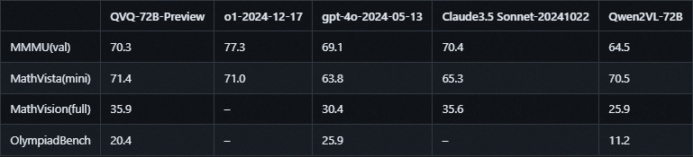

* MMMU：一个大学级别的多学科多模态评测集，旨在考察模型视觉相关的综合理解和推理能力。

* MathVista：一个数学相关的视觉推理测试集，评估拼图测试图形的逻辑推理、函数图的代数推理和学术论文图形的科学推理等能力。

* MathVision：一个高质量多模态数学推理测试集，来自于真实的数学竞赛，相比于MathVista具有更多的问题多样性和学科广度。

* OlympiadBench：一个奥林匹克竞赛级别的双语多模态科学基准测试集，包含来自奥林匹克数学和物理竞赛的8,476个问题，包括中国高考。每个问题都附有专家级别的注释，详细说明了逐步推理的过程。

QvQ是基于Qwen2-VL-72B 构建的开源多模态推理模型，在人工智能的视觉理解和复杂问题解决能力方面实现了重大突破。可以直接识别图像和文字信息后进行推理，最后返回文字信息答案。

* 局限性

QVQ-72B-Preview 是由 Qwen 团队开发的实验性研究模型，专注于增强视觉推理能力。尽管它的表现超出了预期，但仍有几个限制需要注意：

1. 语言混合与切换：模型可能会意外地混合语言或在语言之间切换，从而影响响应的清晰度。

2. 递归推理：模型可能会陷入循环逻辑模式，产生冗长的响应而无法得出结论。

3. 安全和伦理考虑：模型需要增强安全措施，以确保可靠和安全的性能，用户在部署时应保持谨慎。

4. 性能和基准限制：尽管模型在视觉推理方面有所改善，但它无法完全替代 Qwen2-VL-72B 的能力。此外，在多步骤视觉推理过程中，模型可能会逐渐失去对图像内容的关注，导致幻觉。

当下大模型发展走向了应用落地的阶段，各大厂商也都在追寻AGI实现，QVQ也是千问团队的一次有效尝试，通过增强视觉语言模型的推理能力来尝试实现开发一个全能和智能的模型。进而尝试让LLM能够应对复杂的挑战并参与科学探索。

***

```plaintext
【赋范大模型技术社区】成立啦～海量硬核独家技术干货内容+无门槛技术交流，下图扫码加【助教老师】
即可入群，社区包含：
✅入门必备Python基础、账号注册与硬件配置方法；
✅20+主流开源&在线大模型部署与调用方法；
✅独家团队自研高品质技术教程&追更最新技术内容；
✅社区交流：活跃技术氛围，技术交流&答疑；
✅新知速递：大模型重大技术突破&最新技术信息通报；
✅干货分享：每月2-3场硬核干货&前沿技术公开课。
感兴趣的小伙伴抓紧时间扫码入群吧～
```


## 本地部署使用方法

* Step 1 创建新文件夹用以储存模型

同过`mkdir qvq`命令在当前路径下创建一个新的文件夹名为qvq，通过`cd qvq`进入该文件夹。

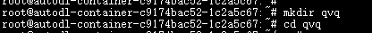

* Step 2 安装必要的依赖

Transfomers是大模型推理时所需要使用的框架，通过以下指令可以下载最新版本的Transfomers：

pip install transformers -U

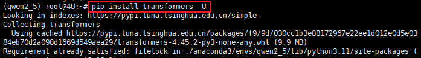

安装完成后可以通过以下命令检查是否安装：

```plaintext
pip show transformers
```


接下来需要安装下载工具modelscope以及接下来要下载脚本的依赖accelerate，通过以下代码进行对应工具的部署：

pip install modelscope


pip install accelerate>=0.26.0

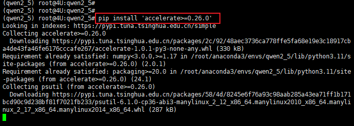

安装qwen\_vl\_utils库来加速模型推理：

pip install qwen-vl-utils


* Step 3 下载模型

通过在命令行输入`modelscope download --model Qwen/QVQ-72B-Preview --local_dir ./dir`进行权重模型下载，需要注意的是`./dir`需要换成你想要存储大模型的文件夹路径。

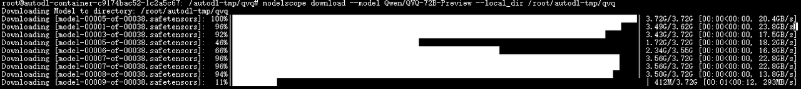

## 模型性能测试

通过以下代码可以实现基于transformers框架和qwen\_vl\_utils加速工具支持下的多模态模型对话。注意：运行改代码需要修改模型调用地址为本地保存文件夹的绝对路径，并修改输入图像的地址和文字prompt。

```python
from transformers import Qwen2VLForConditionalGeneration, AutoTokenizer, AutoProcessor
from qwen_vl_utils import process_vision_info

# default: Load the model on the available device(s)
model = Qwen2VLForConditionalGeneration.from_pretrained(
    "Qwen/QVQ-72B-Preview", torch_dtype="auto", device_map="auto"
)

# default processer
processor = AutoProcessor.from_pretrained("Qwen/QVQ-72B-Preview")

# The default range for the number of visual tokens per image in the model is 4-16384. You can set min_pixels and max_pixels according to your needs, such as a token count range of 256-1280, to balance speed and memory usage.
# min_pixels = 256*28*28
# max_pixels = 1280*28*28
# processor = AutoProcessor.from_pretrained("Qwen/QVQ-72B-Preview", min_pixels=min_pixels, max_pixels=max_pixels)

messages = [
    {
        "role": "system",
        "content": [
            {"type": "text", "text": "You are a helpful and harmless assistant. You are Qwen developed by Alibaba. You should think step-by-step."}
        ],
    },
    {
        "role": "user",
        "content": [
            {
                "type": "image",
                "image": "https://qianwen-res.oss-cn-beijing.aliyuncs.com/QVQ/demo.png",
            },
            {"type": "text", "text": "What value should be filled in the blank space?"},
        ],
    }
]

# Preparation for inference
text = processor.apply_chat_template(
    messages, tokenize=False, add_generation_prompt=True
)
image_inputs, video_inputs = process_vision_info(messages)
inputs = processor(
    text=[text],
    images=image_inputs,
    videos=video_inputs,
    padding=True,
    return_tensors="pt",
)
inputs = inputs.to("cuda")

# Inference: Generation of the output
generated_ids = model.generate(**inputs, max_new_tokens=8192)
generated_ids_trimmed = [
    out_ids[len(in_ids) :] for in_ids, out_ids in zip(inputs.input_ids, generated_ids)
]
output_text = processor.batch_decode(
    generated_ids_trimmed, skip_special_tokens=True, clean_up_tokenization_spaces=False
)
print(output_text)
```

***

使用QvQ-72B-Preview进行推理该任务消耗显存大致为 144G。

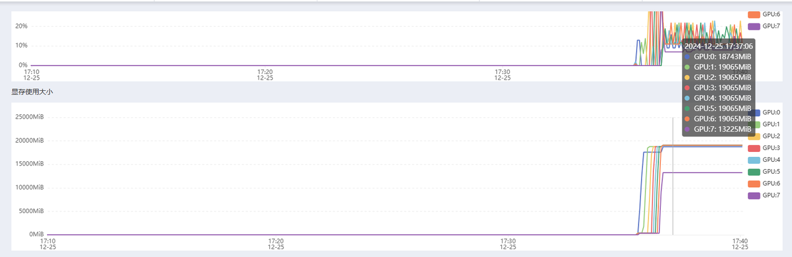

* 图像识别测试


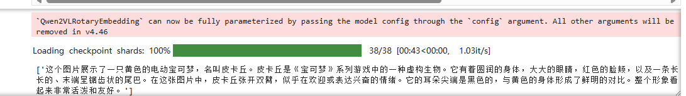

由此可见QvQ的基本的图像识别和世界知识是具备的。

* OCR光学字符识别测试

在这个测试中，我询问了该发票中税额总计的值，QVQ精确的描述了图片中的所有信息并返回了准确的答案：税额合计462.05元。

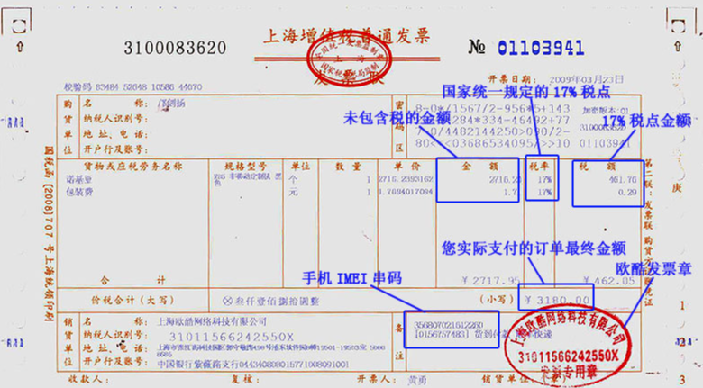

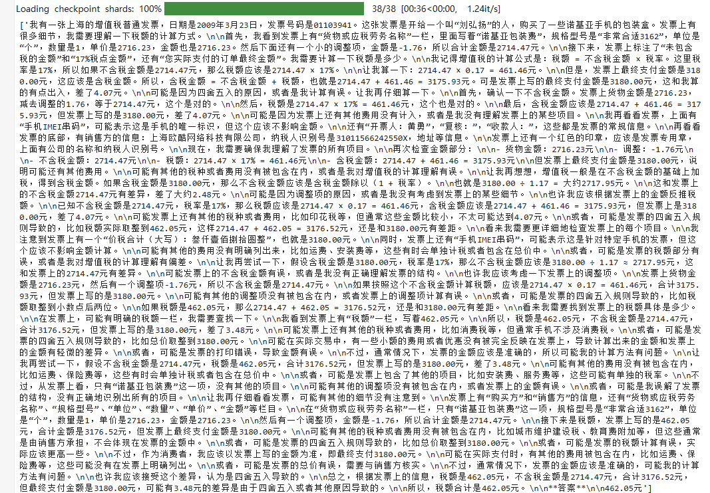

* 图表识别

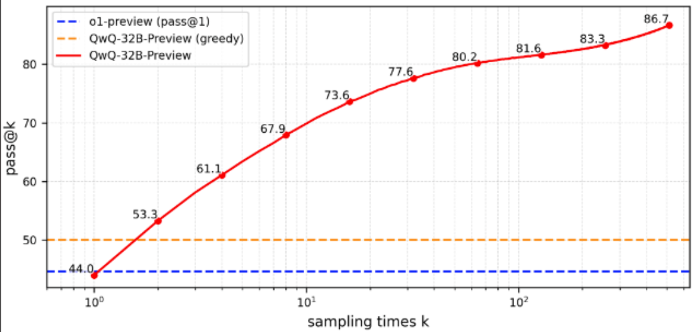

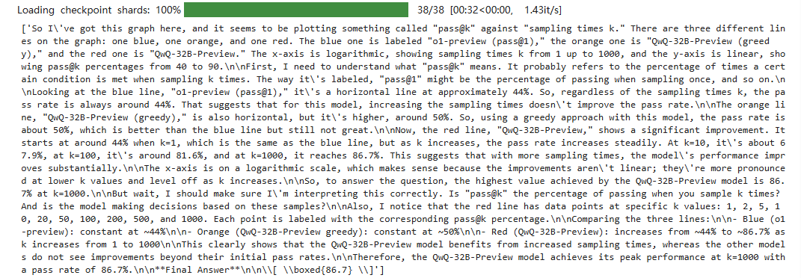

这是一个测试图表信息识别的OCR（光学字符识别）任务，我提出的问题是寻找QwQ-32B-Preview的最高值是多少，在这个测试中，QvQ返回了准确的结果86.7。

图像推理测试

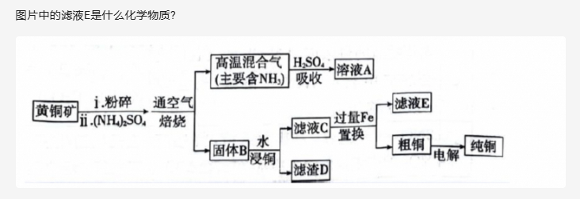

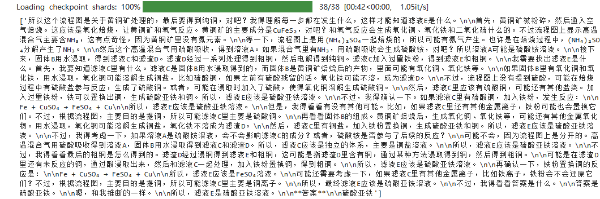

这是一道初中化学题，询问的是终产物滤液E的化学成分，QvQ通过图像进行识别再进行推理得到了正确的返回结果--硫酸亚铁。

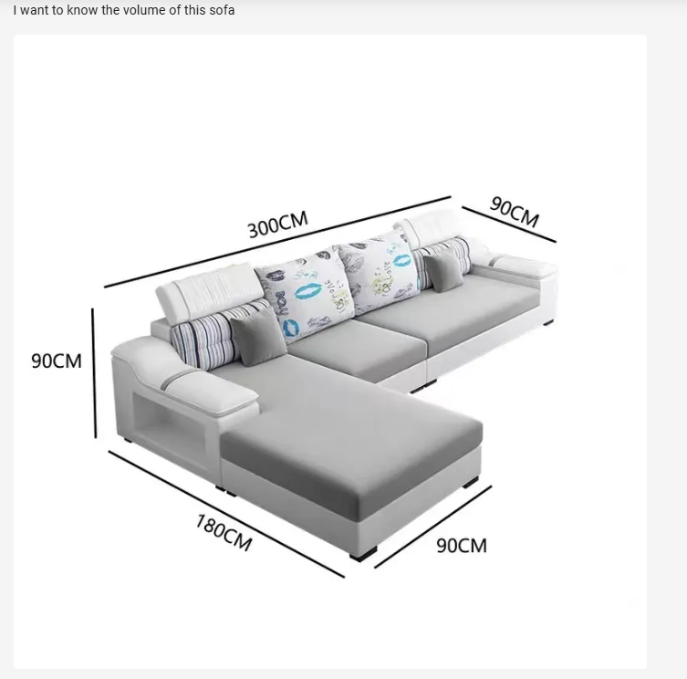

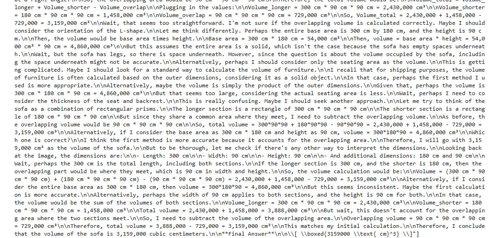

根据图像信息计算沙发的体积，最终返回正确的结果3159000cm³。

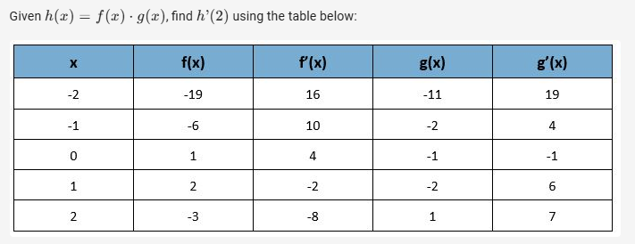

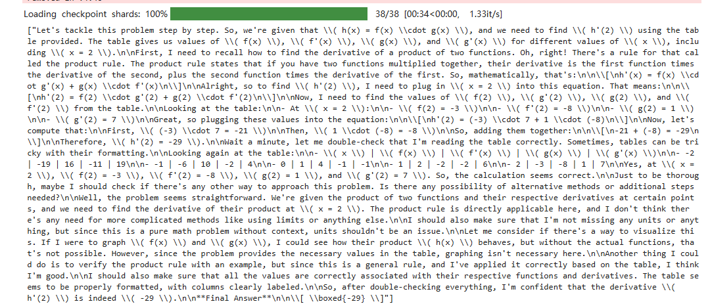

Given h(x)=f(x)⋅g(x)*h*(*x*)=*f*(*x*)⋅*g*(*x*), find h’(2)*h*’(2) using the table below:

最终返回结果 -29，正确。

***

错误范例：


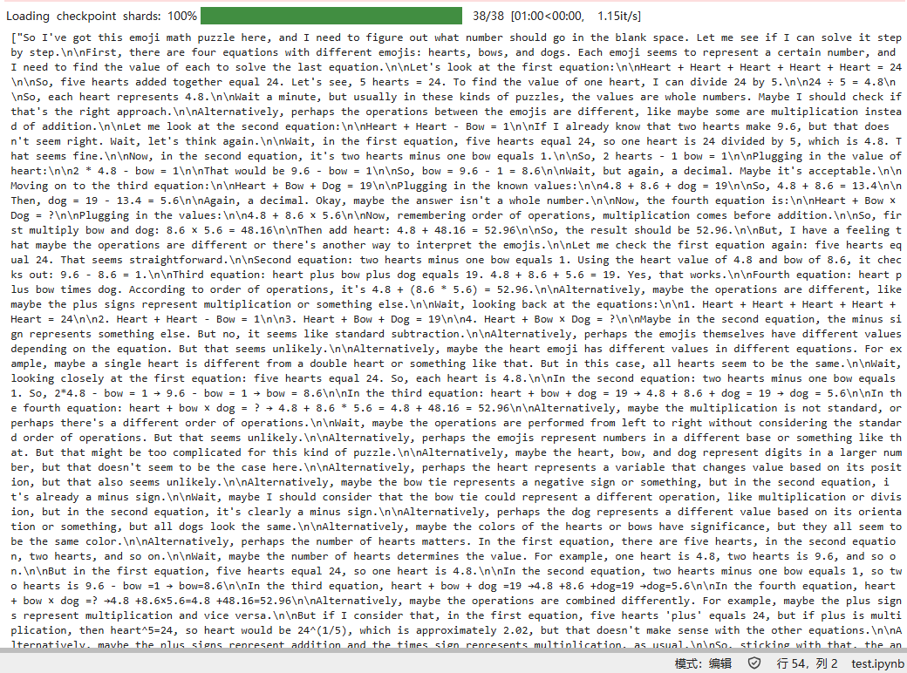

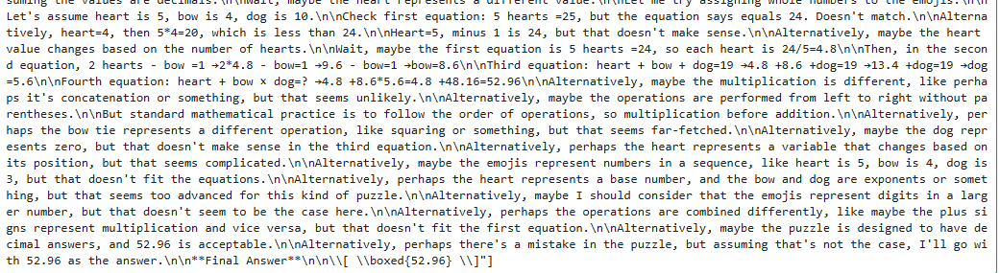

***

```plaintext
【赋范大模型技术社区】成立啦～海量硬核独家技术干货内容+无门槛技术交流，下图扫码加【助教老师】
即可入群，社区包含：
✅入门必备Python基础、账号注册与硬件配置方法；
✅20+主流开源&在线大模型部署与调用方法；
✅独家团队自研高品质技术教程&追更最新技术内容；
✅社区交流：活跃技术氛围，技术交流&答疑；
✅新知速递：大模型重大技术突破&最新技术信息通报；
✅干货分享：每月2-3场硬核干货&前沿技术公开课。
感兴趣的小伙伴抓紧时间扫码入群吧～
```


**扫⬆️码回复“入群”**，即可加入**大模型技术社群：海量硬核独家技术`干货内容`+无门槛`技术交流`！**
