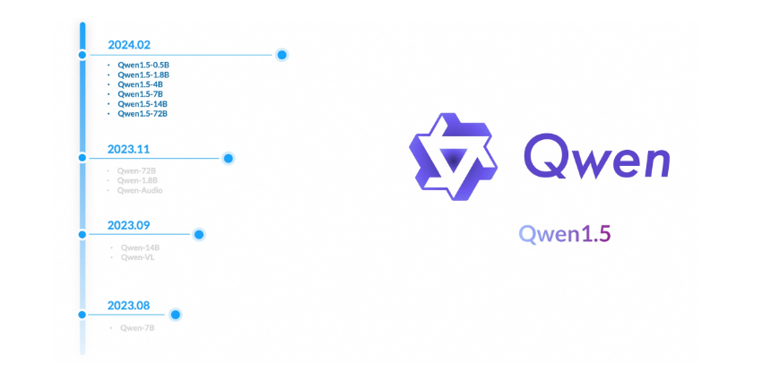
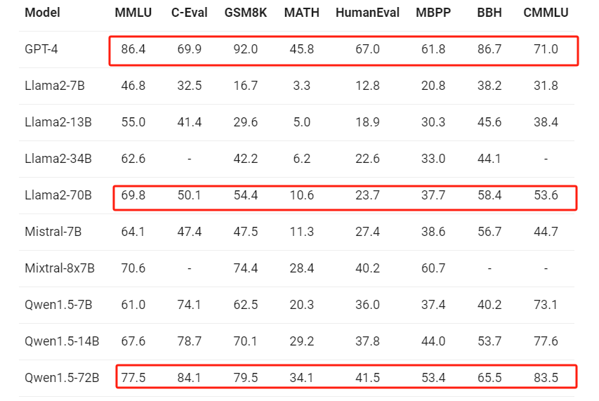
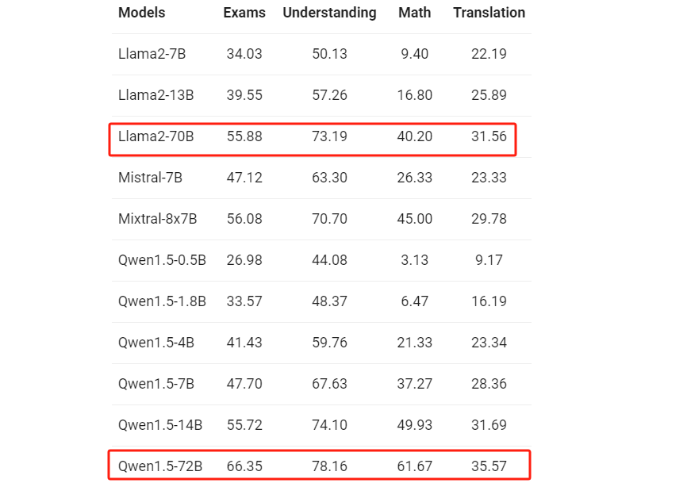

# 本地部署开源大模型

## Ch.14 Qwen1.5系列模型介绍及使用方法

  2024年2月5日，Qwen官方发布了Qwen1.5系列模型，该系列是阿里云Qwen团队开发的大语言模型系列Qwen的改进版本。Qwen1.5系列在保持与初代相同参数量的基础上，开源了5个基础模型及对应的聊天模型，分别包括：1.8B、4B、7B、14B、72B的模型。此外，新增了一个更小的0.5B模型，使得整体系列共包含6个不同参数量大小的模型。Qwen模型的开源时间线如下图所示：



  可以看到，从2023年08月开源的第一个Qwen-7B模型开始，Qwen在非常短的时间内经历了多轮的迭代升级。而此次更新中，官方也已明确指出，Qwen 1.5系列模型仅仅是 Qwen 2的测试版（Beta），所以从这种发展脉络上，我们其实能够非常明显的感受到开源大型模型未来迭代发展的趋势，主要有以下两点：

1. **重点将放在如何基于已经开发“好的”模型，去不断地优化开发者体验；**

2. **为了满足更多用户的需求并降低硬件门槛，需要不断减少参数量以便于部署。同时，通过技术创新，它们即便在参数减少的情况下，也能满足大多数性能要求；**

  因此，对于此次开源的Qwen1.5系列，它继续采用了与Qwen相似的仅解码器的Transformer模型架构，整体上并未发生显著变化。但是在性能方面，Qwen1.5系列实现了以下几个关键的提升：

* **性能提升1：模型的模型质量显着提高**

  Qwen1.5系列模型和聊天模型在语言理解、编码、推理、多语言能力、人类偏好、代理、检索等基本能力-增强一代（RAG）等能力上，其Qwen1.5-72B 的版本在所有基准测试中均优于 Llama2-70B。



* **性能提升2：增强基础模型和聊天模型的多语言能力**

  Qwen初代系列模型的训练数据虽然覆盖多语言，但主要还是以中文和英文为主，而新一代的Qwen 1.5 系列，在考试、理解、翻译、数学等各个维度的评测中，始终表现强劲。从阿拉伯语、西班牙语、法语到日语、韩语和泰语，Qwen1.5 展示了其跨不同语言环境理解和生成高质量内容的能力。



* **性能提升3：所有模型都支持 32K 标记的上下文长度**

  随着实际应用对长上下文理解的需求不断增加，Qwen 1.5 系列扩展了所有模型的能力，以支持高达 32K 令牌的上下文，并可以保证上下文的响应能力。初代 14B 模型仅支持 8K的最长上下文长度。

* **性能提升4：所有参数均启用系统提示，这意味着可以进行角色扮演。即均可以很好的使用 system message**

  在初代的Qwen模型中，仅有Qwen-1.8-Chat 和 Qwen-72B-Chat 在多样且存在多轮复杂交互的系统指令上进行了充分训练并获得很好的系统指令能力。（System Prompt）

* **性能提升5：不再需要 trust\_remote\_code**

  在理解这个优化之前，我们先来回顾一下借助Hugging Face的Transformers库调用Qwen模型时的代码：

```python
from transformers import AutoModelForCausalLM, AutoTokenizer
from transformers.generation import GenerationConfig
```

```plaintext
/home/util/anaconda3/envs/qwen_7b_chat/lib/python3.11/site-packages/tqdm/auto.py:21: TqdmWarning: IProgress not found. Please update jupyter and ipywidgets. See https://ipywidgets.readthedocs.io/en/stable/user_install.html
  from .autonotebook import tqdm as notebook_tqdm
```

```python
# 加载分词器，注意：需要将模型路径替换为本地实际的存储路径
tokenizer = AutoTokenizer.from_pretrained("/home/Work/00.Work_muyu/muyu_qwen/models/qwen/Qwen-7B-Chat", trust_remote_code=True)

# 加载Qwen模型，注意：需要将模型路径替换为本地实际的存储路径
model = AutoModelForCausalLM.from_pretrained("/home/Work/00.Work_muyu/muyu_qwen/models/qwen/Qwen-7B-Chat", device_map="auto", trust_remote_code=True).eval()

# 加载Qwen模型的配置信息，注意：需要将模型路径替换为本地实际的存储路径
model.generation_config = GenerationConfig.from_pretrained("/home/Work/00.Work_muyu/muyu_qwen/models/qwen/Qwen-7B-Chat", trust_remote_code=True)
```

```plaintext
The model is automatically converting to bf16 for faster inference. If you want to disable the automatic precision, please manually add bf16/fp16/fp32=True to "AutoModelForCausalLM.from_pretrained".
Try importing flash-attention for faster inference...
Loading checkpoint shards: 100%|██████████| 8/8 [02:23<00:00, 17.94s/it]
```

```python
# 第一轮对话
response, history = model.chat(tokenizer, "你好", history=None)
print(response)
```

```plaintext
你好！很高兴能为你服务。有什么可以帮助你的吗？
```

  如上流程所示，展示了如何使用Transformers库调用Qwen初代系列模型，同时，类似于ChatGLM系列、Baichuang系列等大模型的调用，也遵循着这样一个相对通用的流程：首先加载分词器，然后加载模型，最后加载配置信息。而不论加载哪个组件，都需指定`trust_remote_code=True`参数。若省略此参数，则会遇到这样的问题：

  这里我们去掉`trust_remote_code=True`参数，重新执行一下。**注：重新执行时，需重启当前的Jupyter Lab，释放GPU资源。**

```python
from transformers import AutoModelForCausalLM, AutoTokenizer
from transformers.generation import GenerationConfig
```

```plaintext
/home/util/anaconda3/envs/qwen_7b_chat/lib/python3.11/site-packages/tqdm/auto.py:21: TqdmWarning: IProgress not found. Please update jupyter and ipywidgets. See https://ipywidgets.readthedocs.io/en/stable/user_install.html
  from .autonotebook import tqdm as notebook_tqdm
```

  这里加载tokenizer时，删除`trust_remote_code=True`参数指定：

```python
# 加载分词器，注意：需要将模型路径替换为本地实际的存储路径
# 如果 不添加trust_remote_code=True这个参数
tokenizer = AutoTokenizer.from_pretrained("/home/Work/00.Work_muyu/muyu_qwen/models/qwen/Qwen-7B-Chat", )

# 加载Qwen模型，注意：需要将模型路径替换为本地实际的存储路径
model = AutoModelForCausalLM.from_pretrained("/home/Work/00.Work_muyu/muyu_qwen/models/qwen/Qwen-7B-Chat", device_map="auto", trust_remote_code=True).eval()

# 加载Qwen模型的配置信息，注意：需要将模型路径替换为本地实际的存储路径
model.generation_config = GenerationConfig.from_pretrained("/home/Work/00.Work_muyu/muyu_qwen/models/qwen/Qwen-7B-Chat", trust_remote_code=True)
```

```plaintext
The repository for /home/Work/00.Work_muyu/muyu_qwen/models/qwen/Qwen-7B-Chat contains custom code which must be executed to correctly load the model. You can inspect the repository content at https://hf.co//home/Work/00.Work_muyu/muyu_qwen/models/qwen/Qwen-7B-Chat.
You can avoid this prompt in future by passing the argument `trust_remote_code=True`.

Do you wish to run the custom code? [y/N]  N


---------------------------------------------------------------------------

ValueError                                Traceback (most recent call last)

Cell In[3], line 3
      1 # 加载分词器，注意：需要将模型路径替换为本地实际的存储路径
      2 # 如果 不添加trust_remote_code=True这个参数
----> 3 tokenizer = AutoTokenizer.from_pretrained("/home/Work/00.Work_muyu/muyu_qwen/models/qwen/Qwen-7B-Chat", )
      5 # 加载Qwen模型，注意：需要将模型路径替换为本地实际的存储路径
      6 model = AutoModelForCausalLM.from_pretrained("/home/Work/00.Work_muyu/muyu_qwen/models/qwen/Qwen-7B-Chat", device_map="auto", trust_remote_code=True).eval()


File /home/util/anaconda3/envs/qwen_7b_chat/lib/python3.11/site-packages/transformers/models/auto/tokenization_auto.py:788, in AutoTokenizer.from_pretrained(cls, pretrained_model_name_or_path, *inputs, **kwargs)
    780 has_remote_code = tokenizer_auto_map is not None
    781 has_local_code = type(config) in TOKENIZER_MAPPING or (
    782     config_tokenizer_class is not None
    783     and (
   (...)
    786     )
    787 )
--> 788 trust_remote_code = resolve_trust_remote_code(
    789     trust_remote_code, pretrained_model_name_or_path, has_local_code, has_remote_code
    790 )
    792 if has_remote_code and trust_remote_code:
    793     if use_fast and tokenizer_auto_map[1] is not None:


File /home/util/anaconda3/envs/qwen_7b_chat/lib/python3.11/site-packages/transformers/dynamic_module_utils.py:621, in resolve_trust_remote_code(trust_remote_code, model_name, has_local_code, has_remote_code)
    618         _raise_timeout_error(None, None)
    620 if has_remote_code and not has_local_code and not trust_remote_code:
--> 621     raise ValueError(
    622         f"Loading {model_name} requires you to execute the configuration file in that"
    623         " repo on your local machine. Make sure you have read the code there to avoid malicious use, then"
    624         " set the option `trust_remote_code=True` to remove this error."
    625     )
    627 return trust_remote_code


ValueError: Loading /home/Work/00.Work_muyu/muyu_qwen/models/qwen/Qwen-7B-Chat requires you to execute the configuration file in that repo on your local machine. Make sure you have read the code there to avoid malicious use, then set the option `trust_remote_code=True` to remove this error.
```

  在如此长的报错中，能提取出如下关键信息：

1. **仓库路径**：`/home/Work/00.Work_muyu/muyu_qwen/models/qwen/Qwen-7B-Chat`被当作了模型仓库的路径。这个路径实际上是我们本地的文件系统路径，而不是Hugging Face Hub的标准URL。正确的Hugging Face Hub链接应该是`https://huggingface.co/用户名/模型名`的格式。不过，提供的链接是`https://hf.co//home/Work/00.Work_muyu/muyu_qwen/models/qwen/Qwen-7B-Chat`；

2. **自定义代码**：错误信息中提到仓库包含自定义代码，这必须被执行以正确加载模型。这意味着模型的加载过程不仅仅是下载预训练权重，还可能需要执行一些预处理或配置代码；

3. **安全提示**：出于安全考虑，默认情况下，加载包含自定义代码的模型时需要用户确认。因为执行远程代码可能存在安全风险，特别是来自未经验证的源；

4. **避免提示**：如果你信任这个模型源的代码，并且想要在将来加载模型时跳过安全提示，可以在加载模型的函数调用中添加`trust_remote_code=True`参数。这将自动信任并执行仓库中的自定义代码，而不会每次都提示用户确认。

  而这样的提示：`set the option trust_remote_code=True to remove this error.`其根本原因在于，当使用 AutoTokenizer、AutoModelForCausalLM等 from\_pretrained 的方法时，transformers库会检查模型配置是否包含自定义代码。

  参数`trust_remote_code=True`的设计初衷是为了处理从远程仓库加载模型时的安全问题。比较容易引发疑问的是：我们此处是在加载本地模型和文件，为什么还会涉及到远程代码的信任问题呢？其原因在于transformers库出于对安全的考虑，对于任何带有自定义代码文件的配置或模型时，尽管是本地模型，也绕不开安全检查的过程，确保即使是本地操作，用户也需要明确了解并同意执行任何自定义代码。从而才会出现无法完成模型的加载，导致报错。

  **为了增强开发人员体验，Qwen官方从 Qwen1.5 的代码合并到 Hugging Face 的Transformers库中，无需再添加`trust_remote_code`参数。**

  从最表面的层面来看，不需要再写`trust_remote_code=True`似乎只是简化了代码中的一个参数。但是，这个改变背后的实际意义远不止于此。它代表了模型的“官方认证”。当一个模型被直接集成到transformers库中，意味着它已经通过了Hugging Face的审核，证明了它的代码质量、安全性和兼容性。对于我们用户来说，这是一个信号，表明我们可以放心地使用这个模型，而无需担心安全风险或者兼容性问题。具体来说：

* 在企业开发中，\*\*执行远程代码一定是一个敏感且需要谨慎处理的问题，因为它可能导致安全漏洞。\*\*trust\_remote\_code=True参数的存在就是为了让用户明确表达他们信任并愿意执行这些远程代码。将模型代码集成到transformers库中，消除了执行未知远程代码的需要，从而降低了安全风险。

* 通过\*\*直接集成到transformers，模型的使用变得标准化。\*\*用户不再需要查找特定模型的特殊安装指令或配置步骤，所有模型都可以通过统一的接口进行访问和使用。这种标准化对于促进技术的可接入性和可用性至关重要，特别是对于那些非专业用户或者新入门的开发者。

* 将模型集成到transformers库非常\*\*有助于Qwen开源社区的发展。\*\*大模型的开源社区，是其发展的最有力保障，不仅仅是在模型开发上，还包括文档、教程和工具的开发，会极大程度的推动Qwen系列模型的整体的迭代效率。

  接下来我们就本地尝试加载一下Qwen1.5系列模型，这里以Qwen1.5-7B-Chat为例，来看一下，这种与Transformers库的高度集成，到底对于后续Qwen模型的使用方式有什么直接的影响。

***

📍**更多大模型技术内容学习**

**扫码添加助理英英，回复“大模型”，了解更多大模型技术详情哦👇**


此外，**扫码回复“入群”**，即可加入**大模型技术社群：海量硬核独家技术`干货内容`+无门槛`技术交流`！**
