## Qwen2.5-Coder：32B--最强代码模型

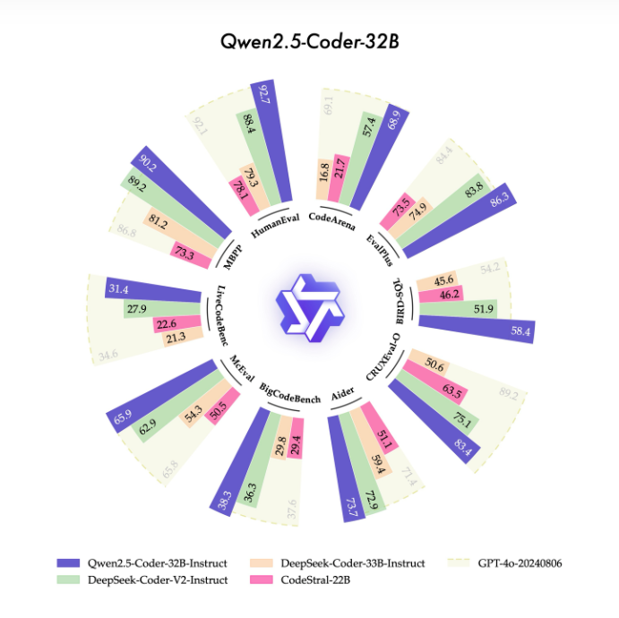

## 模型参数&性能详解

### 1. 技术报告解读

* 本次一共开源的有 0.5B、3B、14B、32B 四个尺寸的代码模型，再加上上个月发布的1.5B和7B的模型一共有6个尺寸的模型，可以覆盖从端侧小模型到企业级大模型的全部开发需求。

* 其旗舰模型Qwen2.5-Coder-32B-Instruct 成为目前 SOTA （最棒的）的开源代码模型，并且兼具了足够的语言和数学能力，可以适用于Agent框架里的专家模型。

* Coder模型具有代码生成、代码修复、代码推理的性能，其表现与主流闭源模型相当。

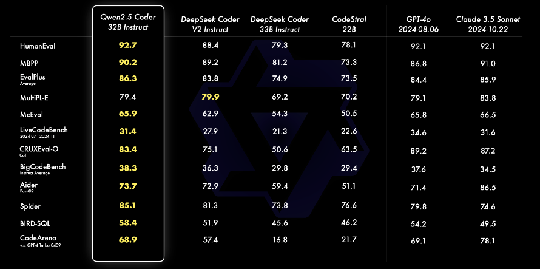

在模型参数上，Qwen2.5-Coder系列模型相较于行业竞品均体现出极高的性能优势，在同参数情况下均为SOTA（性能最强）模型，这是由于模型预训练时针对 FIM（Fill-in-the-Middle）任务引入了一些特殊的 tokens，以及合理布置训练数据内容比例和采用高质量数据带来的。

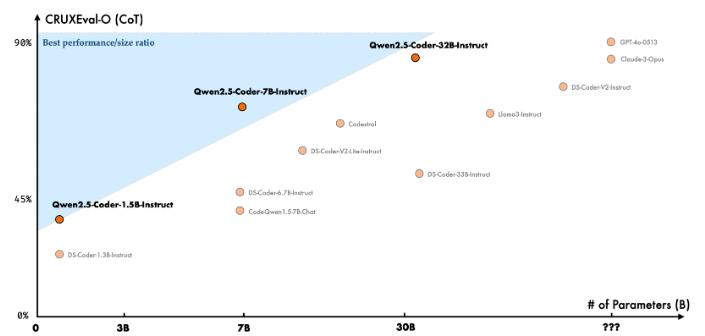

Qwen2.5-Coder-32B-Instruct 在 40 多种编程语言上表现出色，可以作为优质的智能编程助手协调实现多语言开发的需求。其多编程语言代码修复能力同样优秀，这有助于用户理解和修改自己熟悉的编程语言，极大缓解陌生语言的学习成本。

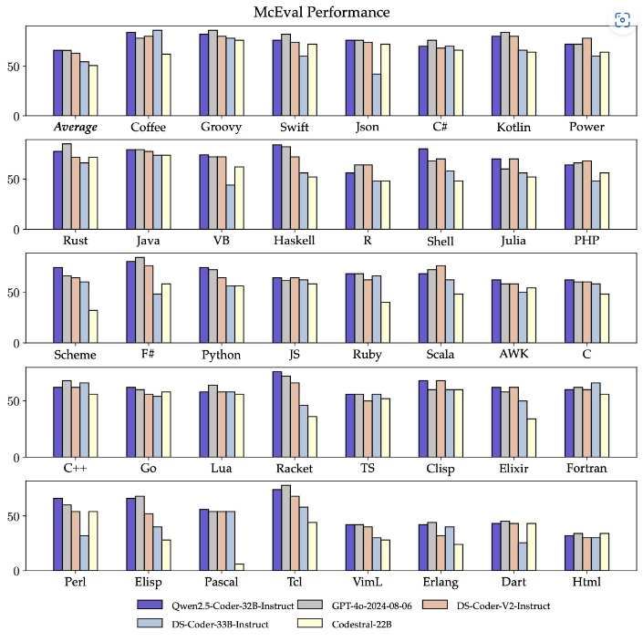

在Qwen2.5-Coder系列模型中，现已发布了包含 0.5B、1.5B、3B、7B、14B、32B 六个尺寸的Base 和 Instruct 模型。其中， Base 模型可作为开发者微调模型的基座模型，Instruct 模型是可以直接进行聊天应用的官方版本对齐模型。

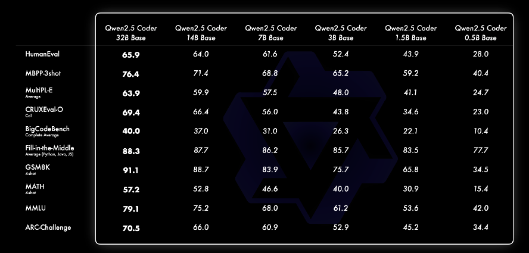

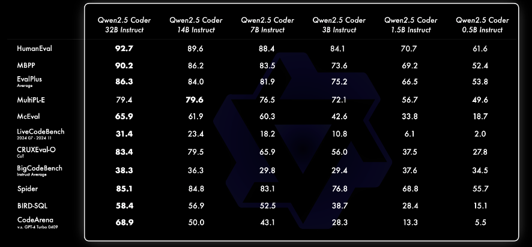

更直观的展示该系列模型的性能效果图如下，其中对于Base模型采用的是MBPP-3shot的作为评估指标，对于Instruct模型采用最近四个月的LiveCodeBench 的题目作为评估，这些最新公布的、不可能泄露到训练集的题目能够反映模型的 OOD 能力。

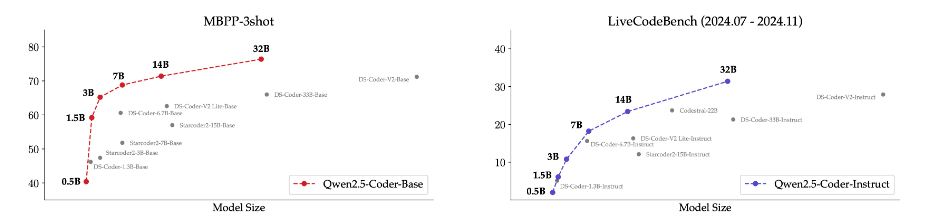

同时以Qwen2.5-Coder-32B-Instruct为首的系列模型均支持在智能代码助手框架Cuesor中进行部署应用，这有助于无论代码编程学习纠错还是自动化开发流程。

官方示例链接：https://qianwen-res.oss-cn-beijing.aliyuncs.com/Qwen2.5/Qwen2.5-Coder-Family/cases/final-game\_of\_life.mp4

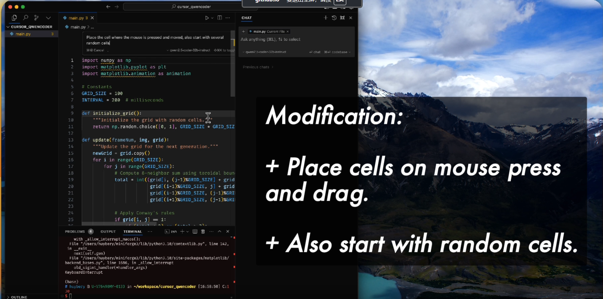

在未来，Qwen官方还计划推出以代码为中心的更强大的推理模型，进而增进大模型的推理能力和扩大应用落地场景。

### 2. 本地测试报告

以下是单卡（24GB显存）条件在Ollama框架进行Qwen2.5-Coder-32B-Instruct的实测结果：

我们首先来测试一下它的模型通用能力：

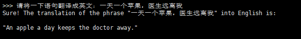

可以看到该模型的意图识别、基本世界知识以及双语能力都是在线的。

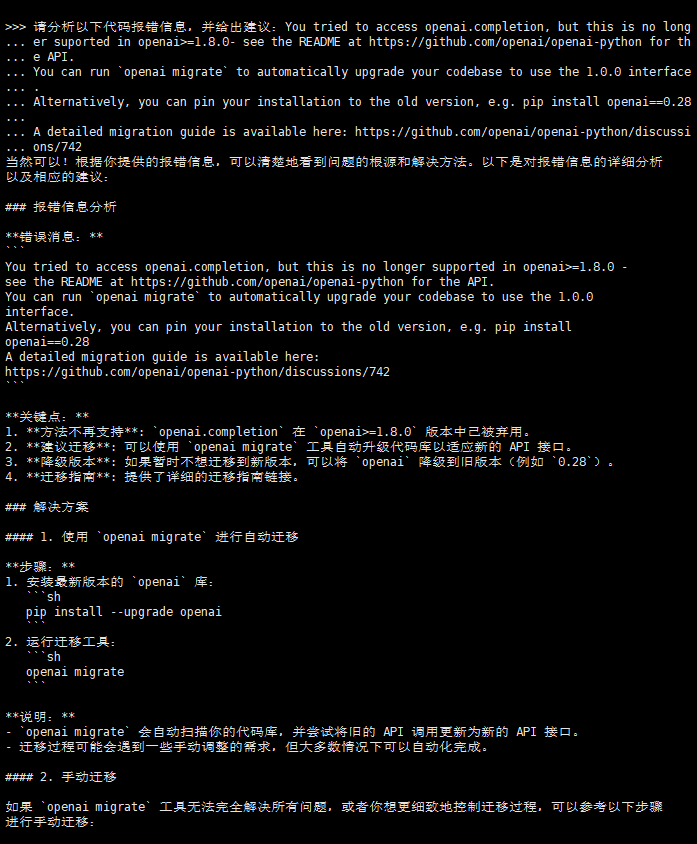

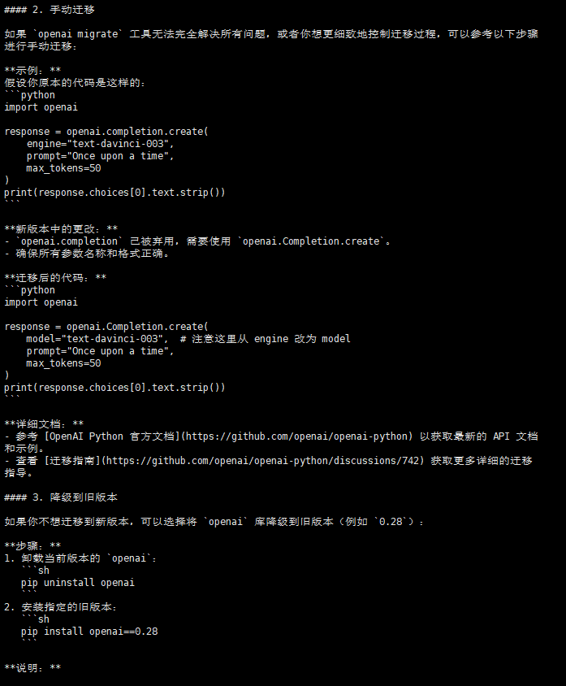

可以看到该模型具有极强的代码纠错能力以及长文本输出能力。


作为代码助手，Qwen2.5-Coder-32B-Instruct可以很详尽且高效的为使用者提供对应的代码知识。

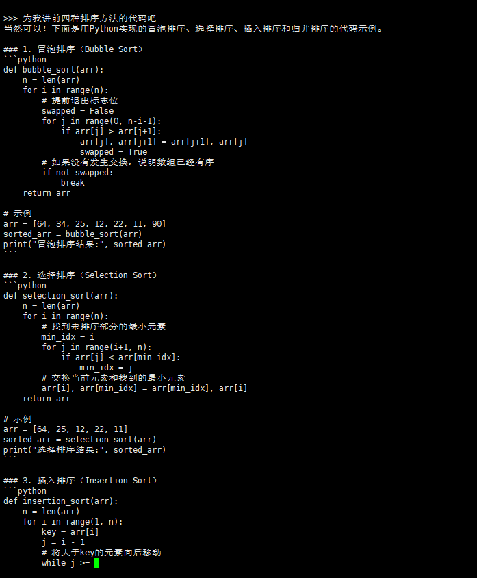

Ollama 框架支持的模型均为量化后的版本，因此，即便是加载 Qwen2.5-Coder-32B-Instruct 这样的大模型，推理时的显存占用也仅在 22G 以下，从而能够流畅运行。这种方式显著降低了硬件需求，使得在各种消费级显卡上也能实现高效的推理。

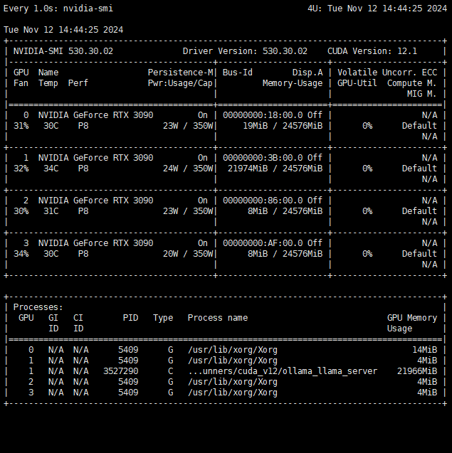

## 线上Demo快速体验教程

在部署所有开源模型之前，强烈推荐通过在线上平台进行性能测试，这样用户可以在部署前充分了解模型的实际表现和需求，从而为本地环境的搭建做好准备，提升部署效率和使用体验。

这里推荐的是在国内大模型代理平台ModelScope上使用和测试 Qwen2.5-Coder模型，其链接地址如下：https://www.modelscope.cn/studios/Qwen/Qwen2.5-Coder-Artifacts


在这个页面只需在左侧对话栏输入指令信息然后点击生成按钮便可实现对应代码，并在左侧展示运行的对应代码的结果，在下方的设置栏中点击查看代码还可以查阅和复制代码。

我们先对托管的例子进行测试：

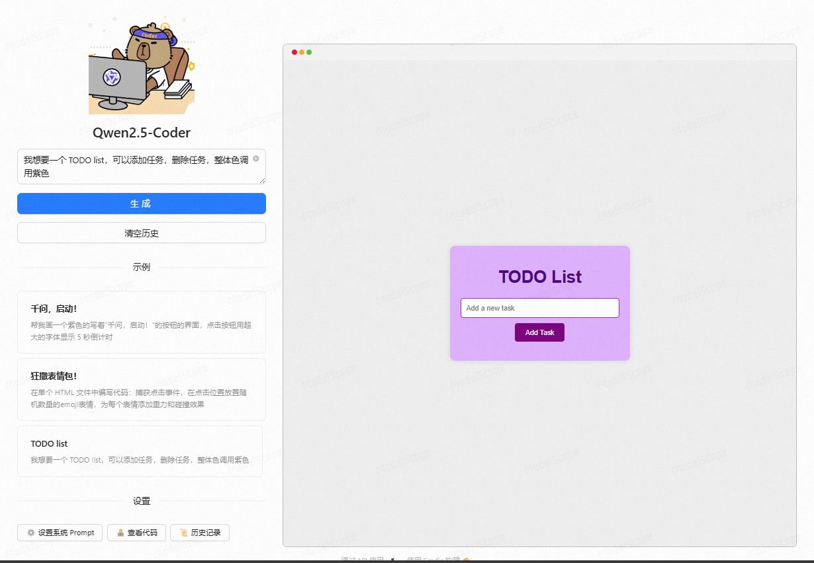

点击测试了左侧的生成To Do List的小应用代码，可以很快在右侧得到一个符合要求的任务清单。

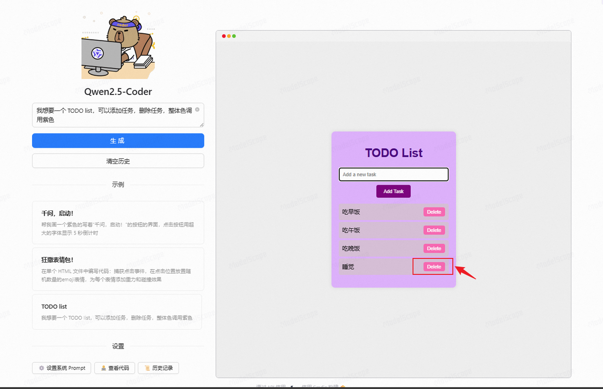

点击左下角的查看代码便可查阅Coder模型生成的全部代码信息。

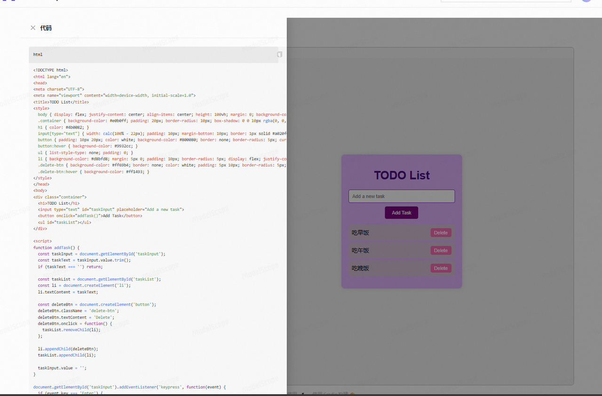

同样的，可以自定义一些输入让Coder模型进行推理生成，例如我让其生成一个y=2x+9的函数模型图像，其表现同样合格。

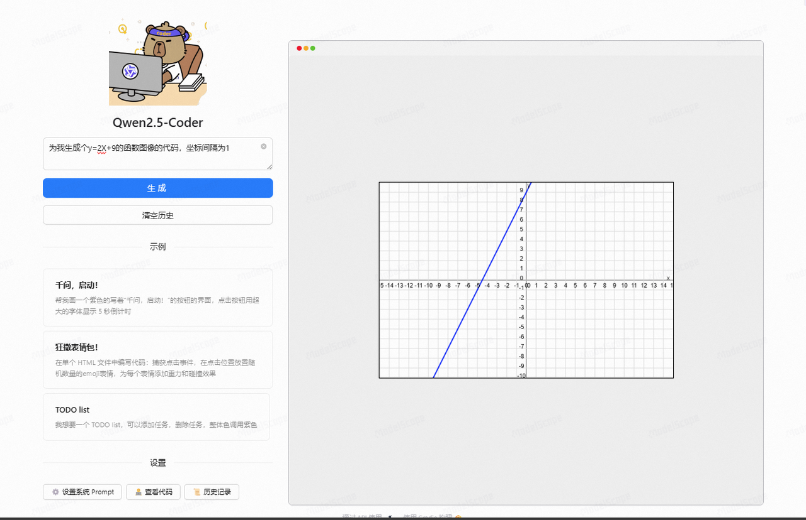

这只是一部分测试的结果，不过综上可见Qwen2.5-Coder模型的意图理解、代码生成能力都是很惊艳的，可以快速辅助我们实现编程需求。

***

📍**更多模型部署流程**

**扫码添加助理英英，回复“大模型”，了解更多技术详情哦👇**


此外，**扫码回复“入群”**，即可加入**大模型技术社群：海量硬核独家技术`干货内容`+无门槛`技术交流`！**


## 本地部署全流程教程

* **Step 1. 创建conda虚拟环境**

  使用Conda创建虚拟环境的意义在于提供了一个隔离的、独立的环境，用于Python项目和其依赖包的管理。每个虚拟环境都有自己的Python运行时和一组库。这意味着我们可以在不同的环境中安装不同版本的库而互不影响。官方给出的Python版本要求是大于`3.9`。创建虚拟环境的办法可以通过使用以下命令创建：

```bash
# qwen-coder是你想要给环境的名称，python=3.11 指定了要安装的Python版本。你可以根据需要选择不同的名称和/或Python版本。

conda create -n qwen-coder python=3.11
```

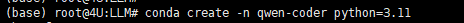

  创建虚拟环境后，需要激活它。使用以下命令来激活刚刚创建的环境。如果成功激活，可以看到在命令行的最前方的括号中，就标识了当前的虚拟环境。虚拟环境创建完成后接下来安装torch。

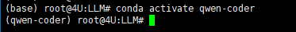

  如果忘记或者想要管理自己建立的虚拟环境，可以通过conda env list命令来查看所有已创建的环境名称。


  如果需要卸载指定的虚拟环境则通过以下指令实现：

```plaintext
conda env remove --name envname
```


* 需要注意的是无法卸载当前激活的环境，建议卸载时先切换到base环境中再执行操作。

* **Step 2. 查看当前驱动最高支持的CUDA版本**

  我们需要根据CUDA版本选择Pytorch框架，先看下当前的CUDA版本：

```plaintext
nvidia -smi
```


* **Step 3. 在虚拟环境中安装Pytorch**

  进入Pytorch官网：https://pytorch.org/get-started/previous-versions/


  当前的电脑CUDA的最高版本要求是12.2，所以需要找到不大于12.2版本的Pytorch。


  直接复制对应的命令，进入终端执行即可。这实际上安装的是为 CUDA 12.1 优化的 PyTorch 版本。这个 PyTorch 版本预编译并打包了与 CUDA 12.1 版本相对应的二进制文件和库。

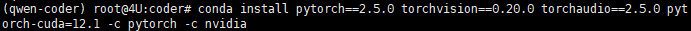

* **Step 4. 安装Pytorch验证**

  待安装完成后，如果想要检查是否成功安装了GPU版本的PyTorch，可以通过几个简单的步骤在Python环境中进行验证：

```bash
import torch

print(torch.__version__)
```


  如果输出是版本号数字，则表示GPU版本的PyTorch已经安装成功并且可以使用CUDA，如果显示ModelNotFoundError，则表明没有安装GPU版本的PyTorch，或者CUDA环境没有正确配置，此时根据教程，重新检查自己的执行过程。


  当然通过pip show的方式可以很简洁的查看已安装包的详细信息。pip show \<package\_name> 可以展示出包的版本、依赖关系（展示一个包依赖哪些其他包）、定位包安装位置、验证安装确实包是否正确安装及详情。

* **Step 5. 安装必要的依赖包**

Transfomers是大模型推理时所需要使用的框架，建议使用的版本`Transfomers>=4.37.0`，通过以下指令可以下载最新版本的Transfomers：

pip install transformers -U

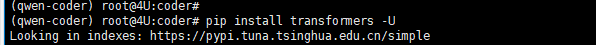

安装完成后可以通过以下命令检查是否安装：

```plaintext
pip show transformers
```

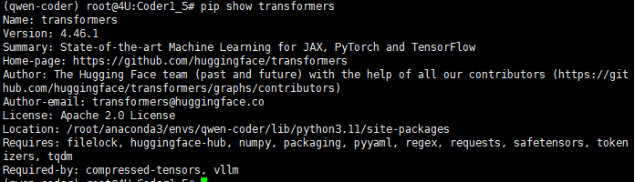

接下来需要安装下载工具modelscope以及接下来用来加速模型的训练和部署的库accelerate，通过以下代码进行对应工具的部署：

```plaintext
pip install accelerate
```

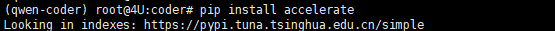

* **Step 6. 下载模型文件**

首先我们要创建一个新的文件用于储存下载的代码信息，通过指令`mkdir +name`可以创建一个新的文件夹，创建完毕后用命令`cd +name`可以进入到该文件夹以便于稍后的操作。通过指令`pwd`可以查看当前所在位置的路径信息。

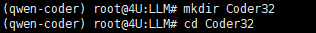

* **Step 7. 在modelscope源下载模型文件**

在确认进入所在工作文件夹后首先进行模型的项目文件的下载：

这种办法是一种在执行主机上不需要科学上网的流程，以便于一些特殊环境下实现部署安装（如在服务器环境）。

首先要下载model scope的工具包以便我们在国内环境下完成模型的下载。

```plaintext
pip install modelscope
```

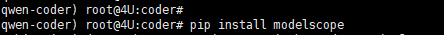

接下来在魔搭社区的模型托管页面分别下载对应的文件权重模型文件。在Modelscope的官网搜索模型的关键字可以找到该模型托管的页面，在模型栏可以找到具体的下载方式：

https://modelscope.cn/models/Qwen/Qwen2.5-Coder-32B-Instruct


通过以下方式可以指定你所要下载的文件地址，这样做可以指定下载文件的存储路径，需注意将`./dir-name`替换成你自己的文件路径。

modelscope download --model Qwen/QQwen2.5-Coder-32B-Instruct --local\_dir ./dir-name

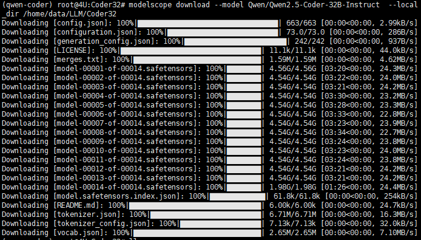

下载完成后全部的文件列表如下：

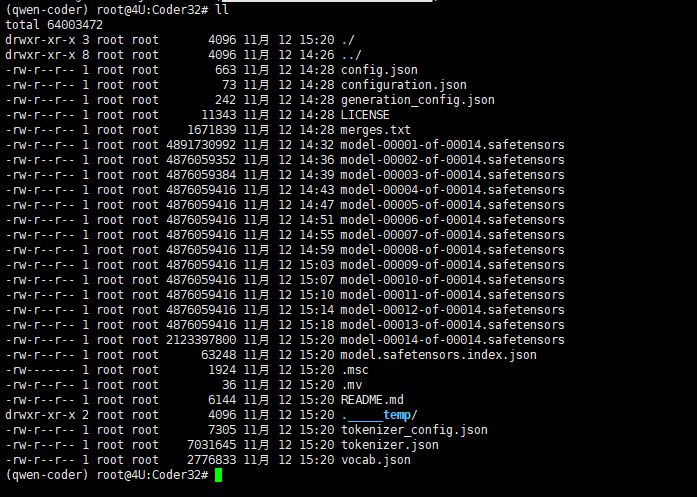

到此全部的安装流程就已经结束了，接下来我们将进行启动演示的测试，在这个测试里我们使用transformers框架的库进行推理。

通过`vim run.py`命令打开一个新的python文件并开始编辑，将以下代码复制进`vim run.py`中，注意进行调用地址的修改，保存并退出`wq`。

```python
from transformers import AutoTokenizer, AutoModelForCausalLM
import warnings

warnings.filterwarnings("ignore", module="transformers")

device = "cuda" # the device to load the model onto

# Now you do not need to add "trust_remote_code=True"
TOKENIZER = AutoTokenizer.from_pretrained("/home/data/LLM/Coder32")
MODEL = AutoModelForCausalLM.from_pretrained("/home/data/LLM/Coder32", device_map="auto").eval()

# tokenize the input into tokens
input_text = "#写一个快速排序的算法"
model_inputs = TOKENIZER([input_text], return_tensors="pt").to(device)

# Use `max_new_tokens` to control the maximum output length.
generated_ids = MODEL.generate(model_inputs.input_ids, max_new_tokens=512, do_sample=False)[0]
# The generated_ids include prompt_ids, so we only need to decode the tokens after prompt_ids.
output_text = TOKENIZER.decode(generated_ids[len(model_inputs.input_ids[0]):], skip_special_tokens=True)

print(f"Prompt: {input_text}\n\nGenerated text: {output_text}")
```

通过`python run.py`命令便可启动这个对话程序，如下图先进行各个权重模块（check point）的加载，随后返回推理结果：用python语言设计一个快速排序的小程序。

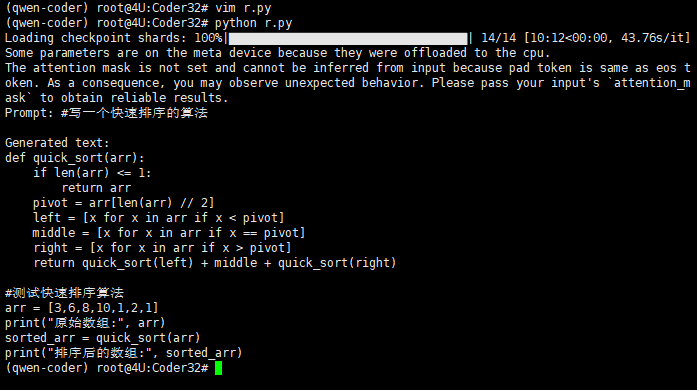

后台监测可以看到推理一共使用了将近86G的显存资源。

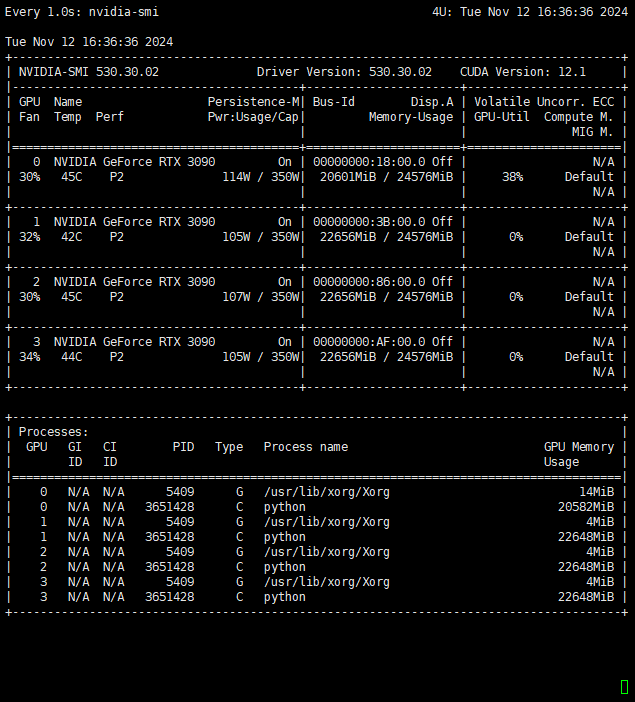

## Ollama框架启动教程

Ollama 是一个开源的大语言模型服务工具，专注于简化本地模型的创建、管理和部署流程。它可以帮助开发人员和数据科学家轻松地在本地或私有环境中使用大语言模型，而不必依赖于云服务，从而保证了数据隐私和灵活性。

Ollama 非常适合需要在本地运行大语言模型的开发者和企业，如：

* 开发和测试：在本地快速创建和测试新的语言模型。

* 隐私保护：在本地部署模型，适用于有严格隐私需求的企业。

* 多模型管理：轻松管理和部署多个模型，适合有大量模型管理需求的团队。

在官网可以看到Ollama支持的模型列表 https://ollama.com/library


每个模型下面有支持的功能和参数型号以及基本的模型描述，点击进入对应模型可以看到下载所需占用的内存大小。

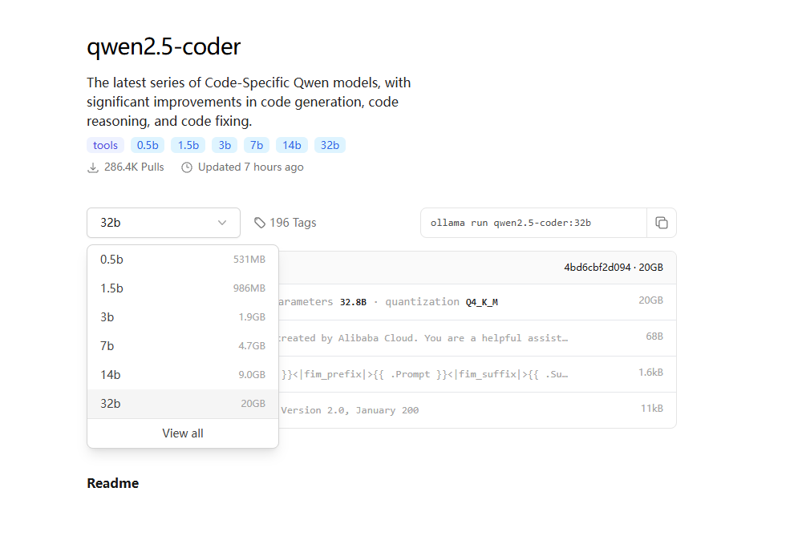

### 1. 快速启动办法

**使用Ollama实现LLM下载流程**

Ollama安装硬件要求：

* Windows：3060以上显卡+8G以上显存+16G内存，硬盘空间至少20G显卡

* Mac：M1或M2芯片 16G内存，20G以上硬盘空间

下载Ollama的指令如下：

```plaintext
curl -fsSL https://ollama.com/install.sh | sh
```

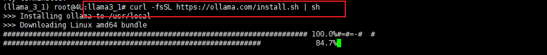

下载完成后检测,如果返回版本号则说明成功下载：

```plaintext
ollama -v
```

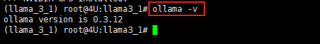

通过指令**ollama help**可以查看该系统可执行的命令：

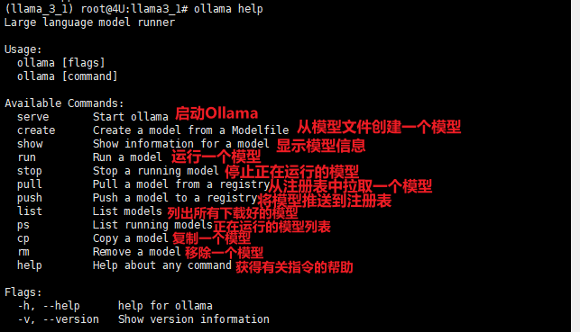

通过以下指令可以，检查ollama可运行的模型列表，可以看见之前下载的Llama 3-8b模型的信息呈现在列：

```plaintext
ollama list
```


**下载模型**

```plaintext
ollama run qwen2.5-coder:32b
```

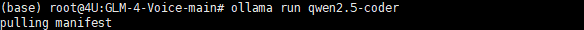

完成下载后会直接进入模型启动状态，如果退出或刷新界面，再次输入指令`ollama run qwen2.5-coder:32b`即可启动对应模型。
在第一次输入该指令会进行模型的下载后开始推理任务。

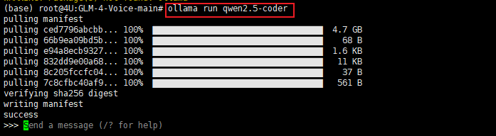

由于Ollama支持的模型都是int4量化后的版本，这样做的优势在于大幅减少了推理时所需的显存消耗（如下图在使用Ollama框架进行qwen2.5-coder:32b的推理的时候近使用了将近6G的显存），不过这样做的坏处是会丢失一定的精度，导致有推理时准确性下降的风险。


对该模型进行代码能力测试后可以看到，qwen2.5-coder:32b具有不错的代码生成能力以及代码纠正能力，可以用来辅助代码编程或实现一些自动化代码流程。

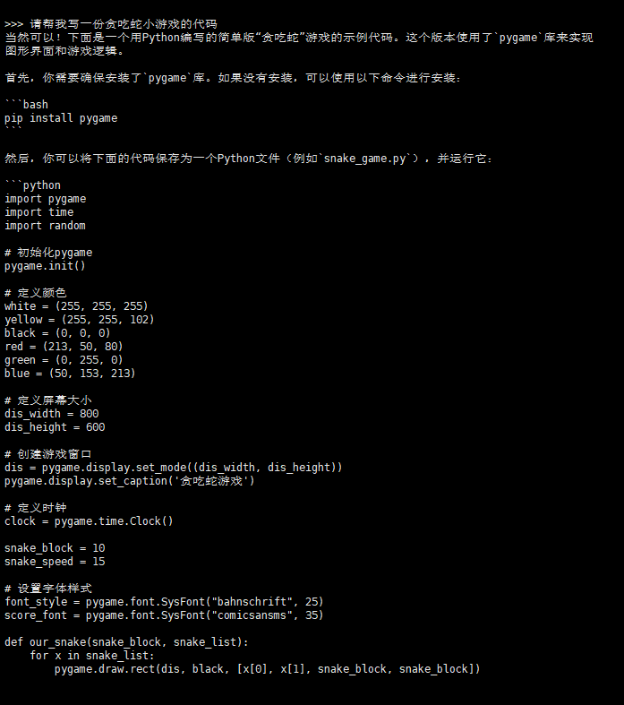

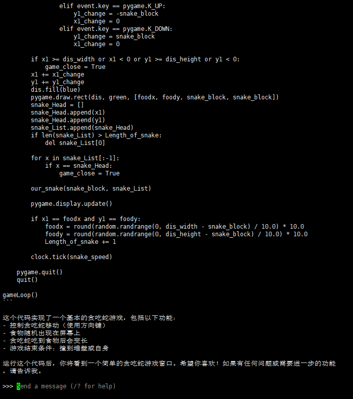

可以直接将遇到的代码报错信息发到ollama进行交互，可以看到返回有效的修改建议。


**4.3 如何卸载安装**

* 卸载全部文件

直接在你的安装目录下，删除ollama文件夹即可。所有下载的数据和大模型文件都在里面，Ollama 的默认安装目录通常是用户主目录下的 .ollama 文件夹。例如，在 Unix 系统（如 macOS 和 Linux）上，默认安装目录为：

\~/.ollama

* 卸载指定模型

通过指令`Ollama list`可以查看所有已经安装好的Ollama支持的模型列表，其中latest标记是指该系列最具代表模型。

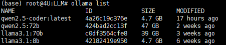

或可以通过指令 `ollama rm modlename`的方式来移除对应的大模型文件。

### 2. API启动办法

同时Ollama还支持进行API调用，通过这种方式可以实现服务器-主机终端的方式进行模型推理，通过这种方式更适合开发者进行对应模型的功能开发。

以下是使用RestFul API办法快速启动Ollama进行推理的流程。

在部署好ollama以及需要的大模型的服务器上通过指令`OLLAMA_HOST=0.0.0.0 ollama serve`启动ollama的远端推理服务。

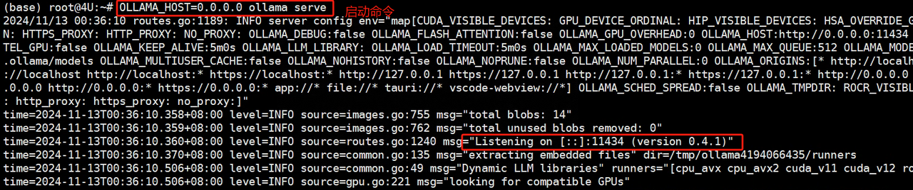

模型启动之后可以通过指令`lsof -i -P | grep ollama`来进行进程监测，需要住哟的是TCP后面的信息须有\*号才能在局域网中进行部署，而11434是Ollama默认的端口地址。

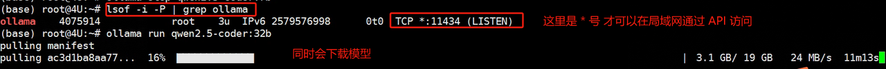

在完成Ollama服务端启动之后，通过`ollama run qwen2.5-coder:32b`便可启动模型的API的推理服务，首次执行该指令会下载模型，之后便会直接启动推理流程。

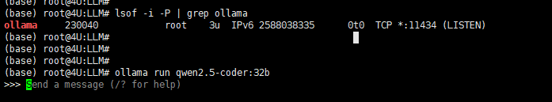

* 接下来的操作在需要调用API的终端上进行。

```python
!pip install langchain-ollama
```

```plaintext
Collecting langchain-ollama
  Downloading langchain_ollama-0.2.0-py3-none-any.whl.metadata (1.8 kB)
Requirement already satisfied: langchain-core<0.4.0,>=0.3.0 in c:\users\86130\anaconda3\lib\site-packages (from langchain-ollama) (0.3.1)
Requirement already satisfied: ollama<1,>=0.3.0 in c:\users\86130\anaconda3\lib\site-packages (from langchain-ollama) (0.3.3)
Requirement already satisfied: PyYAML>=5.3 in c:\users\86130\anaconda3\lib\site-packages (from langchain-core<0.4.0,>=0.3.0->langchain-ollama) (6.0.1)
Requirement already satisfied: jsonpatch<2.0,>=1.33 in c:\users\86130\anaconda3\lib\site-packages (from langchain-core<0.4.0,>=0.3.0->langchain-ollama) (1.33)
Requirement already satisfied: langsmith<0.2.0,>=0.1.117 in c:\users\86130\anaconda3\lib\site-packages (from langchain-core<0.4.0,>=0.3.0->langchain-ollama) (0.1.123)
Requirement already satisfied: packaging<25,>=23.2 in c:\users\86130\anaconda3\lib\site-packages (from langchain-core<0.4.0,>=0.3.0->langchain-ollama) (24.1)
Requirement already satisfied: pydantic<3.0.0,>=2.5.2 in c:\users\86130\anaconda3\lib\site-packages (from langchain-core<0.4.0,>=0.3.0->langchain-ollama) (2.9.2)
Requirement already satisfied: tenacity!=8.4.0,<9.0.0,>=8.1.0 in c:\users\86130\anaconda3\lib\site-packages (from langchain-core<0.4.0,>=0.3.0->langchain-ollama) (8.2.2)
Requirement already satisfied: typing-extensions>=4.7 in c:\users\86130\anaconda3\lib\site-packages (from langchain-core<0.4.0,>=0.3.0->langchain-ollama) (4.12.2)
Requirement already satisfied: httpx<0.28.0,>=0.27.0 in c:\users\86130\anaconda3\lib\site-packages (from ollama<1,>=0.3.0->langchain-ollama) (0.27.0)
Requirement already satisfied: anyio in c:\users\86130\anaconda3\lib\site-packages (from httpx<0.28.0,>=0.27.0->ollama<1,>=0.3.0->langchain-ollama) (4.2.0)
Requirement already satisfied: certifi in c:\users\86130\anaconda3\lib\site-packages (from httpx<0.28.0,>=0.27.0->ollama<1,>=0.3.0->langchain-ollama) (2024.2.2)
Requirement already satisfied: httpcore==1.* in c:\users\86130\anaconda3\lib\site-packages (from httpx<0.28.0,>=0.27.0->ollama<1,>=0.3.0->langchain-ollama) (1.0.5)
Requirement already satisfied: idna in c:\users\86130\anaconda3\lib\site-packages (from httpx<0.28.0,>=0.27.0->ollama<1,>=0.3.0->langchain-ollama) (3.4)
Requirement already satisfied: sniffio in c:\users\86130\anaconda3\lib\site-packages (from httpx<0.28.0,>=0.27.0->ollama<1,>=0.3.0->langchain-ollama) (1.3.0)
Requirement already satisfied: h11<0.15,>=0.13 in c:\users\86130\anaconda3\lib\site-packages (from httpcore==1.*->httpx<0.28.0,>=0.27.0->ollama<1,>=0.3.0->langchain-ollama) (0.14.0)
Requirement already satisfied: jsonpointer>=1.9 in c:\users\86130\anaconda3\lib\site-packages (from jsonpatch<2.0,>=1.33->langchain-core<0.4.0,>=0.3.0->langchain-ollama) (2.1)
Requirement already satisfied: orjson<4.0.0,>=3.9.14 in c:\users\86130\anaconda3\lib\site-packages (from langsmith<0.2.0,>=0.1.117->langchain-core<0.4.0,>=0.3.0->langchain-ollama) (3.10.7)
Requirement already satisfied: requests<3,>=2 in c:\users\86130\anaconda3\lib\site-packages (from langsmith<0.2.0,>=0.1.117->langchain-core<0.4.0,>=0.3.0->langchain-ollama) (2.31.0)
Requirement already satisfied: annotated-types>=0.6.0 in c:\users\86130\anaconda3\lib\site-packages (from pydantic<3.0.0,>=2.5.2->langchain-core<0.4.0,>=0.3.0->langchain-ollama) (0.7.0)
Requirement already satisfied: pydantic-core==2.23.4 in c:\users\86130\anaconda3\lib\site-packages (from pydantic<3.0.0,>=2.5.2->langchain-core<0.4.0,>=0.3.0->langchain-ollama) (2.23.4)
Requirement already satisfied: charset-normalizer<4,>=2 in c:\users\86130\anaconda3\lib\site-packages (from requests<3,>=2->langsmith<0.2.0,>=0.1.117->langchain-core<0.4.0,>=0.3.0->langchain-ollama) (2.0.4)
Requirement already satisfied: urllib3<3,>=1.21.1 in c:\users\86130\anaconda3\lib\site-packages (from requests<3,>=2->langsmith<0.2.0,>=0.1.117->langchain-core<0.4.0,>=0.3.0->langchain-ollama) (2.0.7)
Downloading langchain_ollama-0.2.0-py3-none-any.whl (14 kB)
Installing collected packages: langchain-ollama
Successfully installed langchain-ollama-0.2.0
```

```python
from langchain_ollama import ChatOllama
```

```python
coder_llm= ChatOllama(
    base_url ="http://192.168.110.131:11434", # 注意:这里需要替换成自己本地启动的endpoint
    model="qwen2.5-coder:32b",
)
```

```python
from langchain_core.messages import AIMessage
```

```python
print(coder_llm.invoke("帮我写一个使用Python实现的贪吃蛇的游戏代码").content)
```

````plaintext
当然可以！下面是一个简单的命令行版贪吃蛇游戏的Python实现。这个版本不包含图形界面，而是通过字符在控制台中显示游戏画面。

```python
import random
import os
import time

# 游戏区域大小
WIDTH = 20
HEIGHT = 15

# 蛇的初始位置和方向
snake_pos = [(1, 1)]
direction = (0, 1)

# 食物的位置
food_pos = (random.randint(1, WIDTH - 1), random.randint(1, HEIGHT - 1))

def draw_game():
    os.system('cls' if os.name == 'nt' else 'clear')  # 清屏命令，根据系统不同选择
    for y in range(HEIGHT):
        for x in range(WIDTH):
            if (x, y) == food_pos:
                print('*', end=' ')
            elif (x, y) in snake_pos:
                print('#', end=' ')
            else:
                print('.', end=' ')
        print()

def move_snake():
    global direction, snake_pos, food_pos

    head_x, head_y = snake_pos[0]
    new_head = (head_x + direction[0], head_y + direction[1])

    # 判断是否吃到食物
    if new_head == food_pos:
        snake_pos.insert(0, new_head)
        food_pos = (random.randint(1, WIDTH - 1), random.randint(1, HEIGHT - 1))
    else:
        snake_pos.pop()
        snake_pos.insert(0, new_head)

    # 判断是否撞墙或自咬
    if (new_head[0] < 0 or new_head[0] >= WIDTH or new_head[1] < 0 or new_head[1] >= HEIGHT) \
            or len(snake_pos) != len(set(snake_pos)):
        return False

    return True

def change_direction(key):
    global direction
    if key == 'w' and direction != (0, 1):
        direction = (0, -1)
    elif key == 's' and direction != (0, -1):
        direction = (0, 1)
    elif key == 'a' and direction != (1, 0):
        direction = (-1, 0)
    elif key == 'd' and direction != (-1, 0):
        direction = (1, 0)

def main():
    while True:
        draw_game()
        if not move_snake():
            print("Game Over!")
            break
        time.sleep(0.3)  # 控制游戏速度

        try:
            key = input().strip().lower()  # 获取用户输入的方向键
        except EOFError:
            break

        change_direction(key)

if __name__ == "__main__":
    main()
```

请注意，这个版本的贪吃蛇游戏通过命令行输入控制方向（'w', 's', 'a', 'd' 分别对应上、下、左、右）。运行此代码时，请确保你的终端或命令提示符支持键盘输入。

如果需要图形界面版的贪吃蛇游戏，我们可以使用`pygame`库来实现更丰富的视觉效果。你可以在Python环境中安装`pygame`库（通过pip install pygame），然后我可以提供一个基于`pygame`的版本。
````

```python
print(coder_llm.invoke("帮我写一个用python语言实现冒泡排序的代码，不需要有额外的文本文字输出").content)
```

````plaintext
当然可以，以下是一个简单的Python实现冒泡排序的代码：

```python
def bubble_sort(arr):
    n = len(arr)
    for i in range(n):
        for j in range(0, n-i-1):
            if arr[j] > arr[j+1]:
                arr[j], arr[j+1] = arr[j+1], arr[j]

# 示例数组
example_array = [64, 34, 25, 12, 22, 11, 90]
bubble_sort(example_array)
```

这段代码定义了一个名为`bubble_sort`的函数，它接受一个列表作为参数，并使用冒泡排序算法对其进行排序。排序后的结果会直接存储在传入的列表中。
````

```python
print(coder_llm.invoke("帮我写一个用c语言实现冒泡排序的代码，直接输出代码内容即可").content)
```

````plaintext
```c
#include <stdio.h>

void bubbleSort(int arr[], int n) {
    int i, j, temp;
    for (i = 0; i < n-1; i++) {     
        for (j = 0; j < n-i-1; j++) { 
            if (arr[j] > arr[j+1]) {
                temp = arr[j];
                arr[j] = arr[j+1];
                arr[j+1] = temp;
            }
        }
    }
}

void printArray(int arr[], int size) {
    int i;
    for (i=0; i < size; i++)
        printf("%d ", arr[i]);
    printf("\n");
}

int main() {
    int data[] = {64, 34, 25, 12, 22, 11, 90};
    int n = sizeof(data)/sizeof(data[0]);
    bubbleSort(data, n);
    printf("Sorted array: \n");
    printArray(data, n);
    return 0;
}
```
````

```python
print(coder_llm.invoke("帮我写一个用python语言实现以下的代码，直接输出代码内容即可，在理解文本内容后进行输出：给你两个非空的链表，表示两个非负的整数。它们每位数字都是按照逆序的方式存储的，并且每个节点只能存储一位数字。请你将两个数相加，并以相同形式返回一个表示和的链表。你可以假设除了数字 0 之外，这两个数都不会以 0 开头。").content)
```

````plaintext
```python
# Definition for singly-linked list.
class ListNode:
    def __init__(self, val=0, next=None):
        self.val = val
        self.next = next

def addTwoNumbers(l1: ListNode, l2: ListNode) -> ListNode:
    dummy_head = ListNode(0)
    current = dummy_head
    carry = 0
    
    while l1 is not None or l2 is not None:
        x = l1.val if l1 is not None else 0
        y = l2.val if l2 is not None else 0
        total = carry + x + y
        carry = total // 10
        current.next = ListNode(total % 10)
        current = current.next
        
        if l1 is not None:
            l1 = l1.next
        if l2 is not None:
            l2 = l2.next
    
    if carry > 0:
        current.next = ListNode(carry)
    
    return dummy_head.next
```
````

通过这种方式，用户可以在终端中便捷地使用 Ollama 进行推理，尤其适合在机房等需要服务器支持的环境中进行开发和测试。借助 Ollama 框架的轻量化部署优势，即使在高负载或硬件资源有限的场景下，也能实现大模型的高效推理。这种方式不仅简化了开发者在服务器环境下的模型调用流程，还提升了工作效率，使得在数据中心、实验室和远程服务器上进行模型推理和调试变得更加便捷和高效。

## Cursor\&Coder


一提到智能编程助手，相信大家都会想到Cursor。作为一个大模型刚兴起时期就在做编程支持的应用，现在已经可以完美集成多种大模型来辅助开发者实现代码编程，往往只需要一行指令，就可以实现对编程开发、纠错。

不仅如此Cursor的核心优势在于其卓越的智能索引能力。它不局限于传统IDE的简单代码补全，而是通过构建全项目范围的深度索引，实现了对代码库的全局语义理解。这种深层次的项目分析使Cursor能够：

* 精准把握项目架构和业务逻辑

* 提供上下文相关的智能建议

* 生成与项目整体风格一致的代码补全

* 智能识别代码间的依赖关系

通过这种全局性的代码理解能力，Cursor不仅提升了开发效率，更为开发者提供了具有深度洞察力的编程辅助体验，使代码编写过程更加流畅和智能化。

Cursor直接注册即可试用2周pro计划，可以白嫖一众开源和闭源的应用，这无需科学上网和海外支付，也就是说非常适合国内的小白们快速进行上手实践。

同样的，Qwen2.5-Coder的系列模型也支持在Cusor中进行部署和使用，那就让我们看看具体的操作流程吧：

## 1.下载安装Cursor

下载这个应用很简单，直接在官方网址点击Download for Free 即可实现:https://www.cursor.com/


下载好安装包直接点击运行即可，需要注意的是在下面的install'cursor'点击下载便可以以后在命令行中快速启动该应用了。

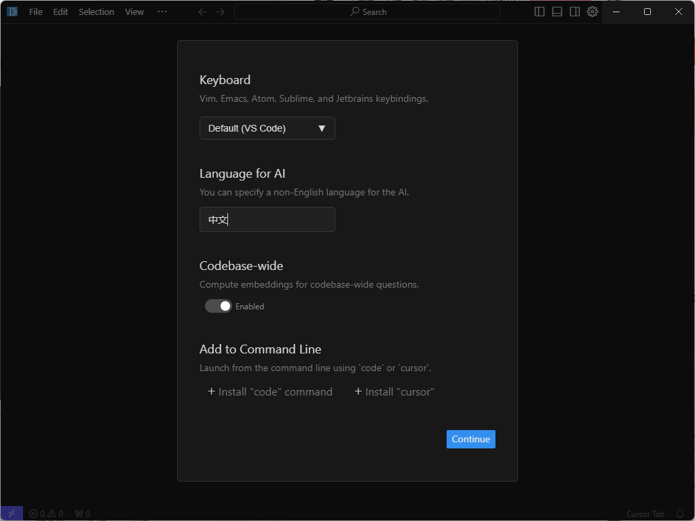

在这个界面，选择Use Extensions便可复制已有的VScode的配置，这样一步实现环境和插件的同步。


在完成配置后需要进行账号登录来实现最后的授权，支持Github和Goggle的账号登录。


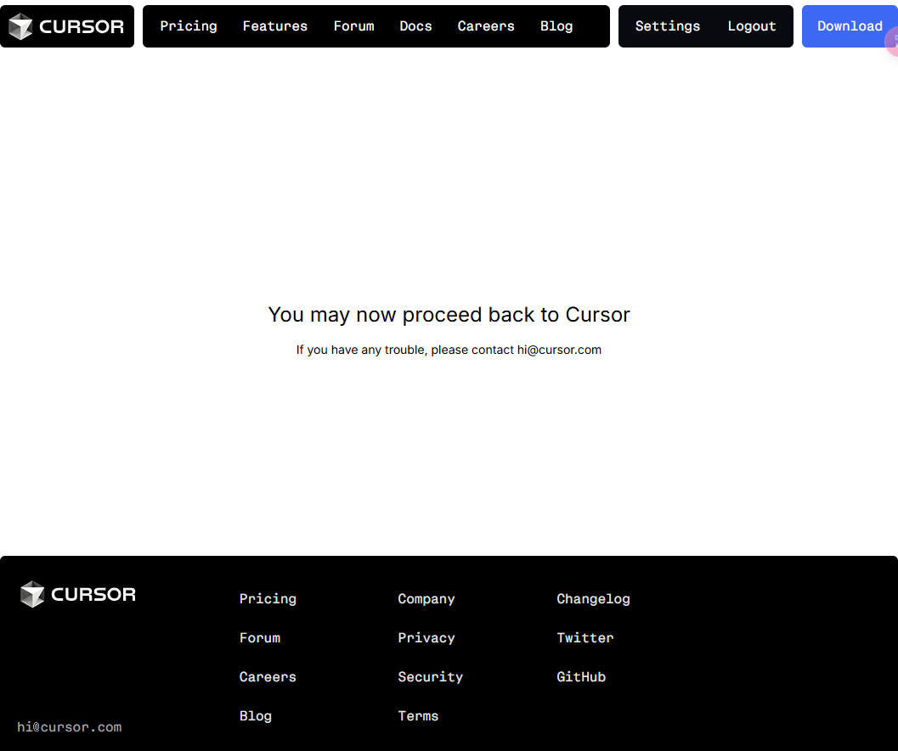

等看到上图的界面再返回Cursor便说明已经成功登录了，如有以下的界面说明可以顺利的使用Cursor了。


## 2.注册siliconFlow

本次课推荐给大家一个线上API调用大模型的方式--siliconFlow，推荐大家使用这个平台来实现大模型借入的理由是这个平台它的模型全、价格实惠、并且模型速度很快，更重要的是，siliconflow 注册即可白嫖2000万不限时token额度，足以让你度过新手开荒期。

siliconFlow注册官网：https://cloud.siliconflow.cn/account/ak


在siliconFlow完成注册后在`账户管理->APi密钥` 中创建密钥，点击复制保存好为接下来的流程备用。

## 3. 配置模型

返回Cursor应用里，如图点击打开setting设置。

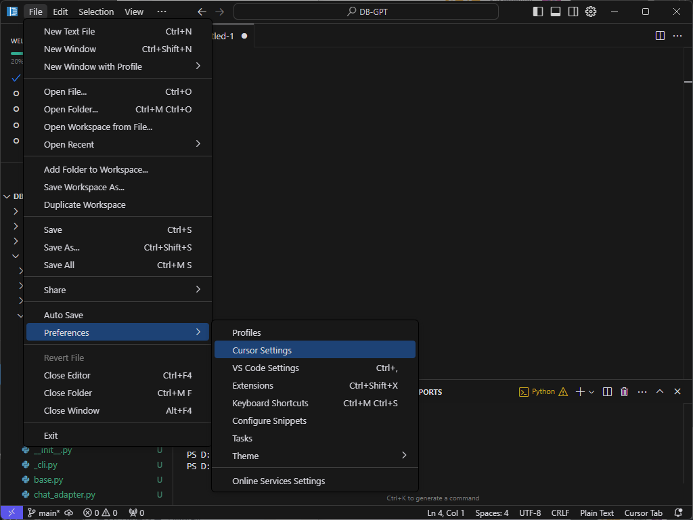

在Cursor Setting中点击Models栏，接下来要完成几个参数的设置，首先将所有已经激活的模型关闭，点击下面add model,输入`Qwen/Qwen2.5-Coder-32B-Instruct`, 添加完成后记得打开模型后面的开关并将Url从默认的修改为base Url : https://api.siliconflow.cn/v1

并且点击Verify，即可完成添加

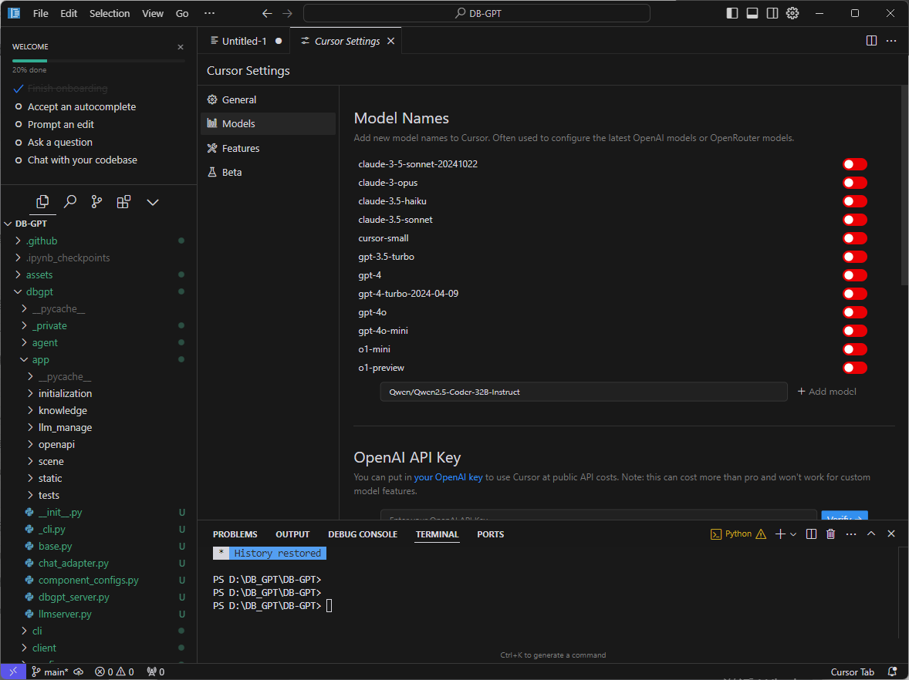

## 4.推理使用

此时便可以使用Qwen2.5-Coder：32B模型进行辅助代码生成了，通过Ctrl+K键实现激活，然后输入任意指令便可实现对应大模型的代码推理。

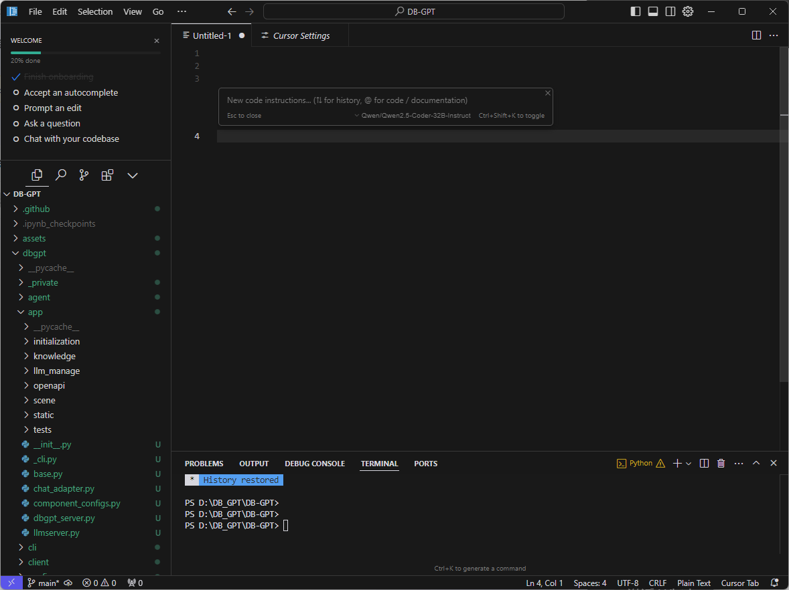

以下便是一个让其为我实现贪吃蛇游戏的低代码全流程：

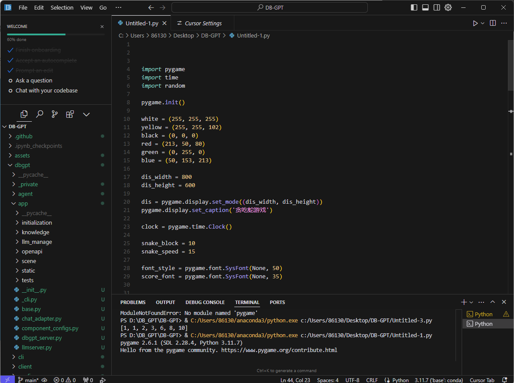

代码信息如下：

```python
import pygame
import time
import random

pygame.init()

white = (255, 255, 255)
yellow = (255, 255, 102)
black = (0, 0, 0)
red = (213, 50, 80)
green = (0, 255, 0)
blue = (50, 153, 213)

dis_width = 800
dis_height = 600

dis = pygame.display.set_mode((dis_width, dis_height))
pygame.display.set_caption('贪吃蛇游戏')

clock = pygame.time.Clock()

snake_block = 10
snake_speed = 15

font_style = pygame.font.SysFont(None, 50)
score_font = pygame.font.SysFont(None, 35)


def our_snake(snake_block, snake_list):
    for x in snake_list:
        pygame.draw.rect(dis, black, [x[0], x[1], snake_block, snake_block])


def message(msg, color):
    mesg = font_style.render(msg, True, color)
    dis.blit(mesg, [dis_width / 6, dis_height / 3])


def gameLoop():
    game_over = False
    game_close = False

    x1 = dis_width / 2
    y1 = dis_height / 2

    x1_change = 0
    y1_change = 0

    snake_List = []
    Length_of_snake = 1

    foodx = round(random.randrange(0, dis_width - snake_block) / 10.0) * 10.0
    foody = round(random.randrange(0, dis_height - snake_block) / 10.0) * 10.0

    while not game_over:

        while game_close == True:
            dis.fill(blue)
            message("You Lost! Press Q-Quit or C-Play Again", red)
            pygame.display.update()

            for event in pygame.event.get():
                if event.type == pygame.KEYDOWN:
                    if event.key == pygame.K_q:
                        game_over = True
                        game_close = False
                    if event.key == pygame.K_c:
                        gameLoop()

        for event in pygame.event.get():
            if event.type == pygame.QUIT:
                game_over = True
            if event.type == pygame.KEYDOWN:
                if event.key == pygame.K_LEFT:
                    x1_change = -snake_block
                    y1_change = 0
                elif event.key == pygame.K_RIGHT:
                    x1_change = snake_block
                    y1_change = 0
                elif event.key == pygame.K_UP:
                    y1_change = -snake_block
                    x1_change = 0
                elif event.key == pygame.K_DOWN:
                    y1_change = snake_block
                    x1_change = 0

        if x1 >= dis_width or x1 < 0 or y1 >= dis_height or y1 < 0:
            game_close = True
        x1 += x1_change
        y1 += y1_change
        dis.fill(blue)
        pygame.draw.rect(dis, green, [foodx, foody, snake_block, snake_block])
        snake_Head = []
        snake_Head.append(x1)
        snake_Head.append(y1)
        snake_List.append(snake_Head)
        if len(snake_List) > Length_of_snake:
            del snake_List[0]

        for x in snake_List[:-1]:
            if x == snake_Head:
                game_close = True

        our_snake(snake_block, snake_List)

        pygame.display.update()

        if x1 == foodx and y1 == foody:
            foodx = round(random.randrange(0, dis_width - snake_block) / 10.0) * 10.0
            foody = round(random.randrange(0, dis_height - snake_block) / 10.0) * 10.0
            Length_of_snake += 1

        clock.tick(snake_speed)

    pygame.quit()
    quit()


gameLoop()
```

挺好玩的，大家也可复制这个代码来尝试（安装好必要的依赖哦）。


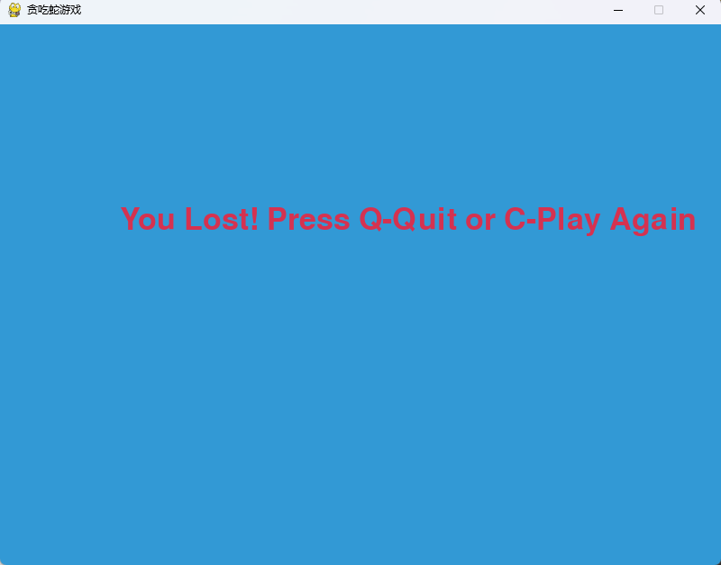

```python
```


🍻现开设了**大模型学习交流群**，扫描下👇码，来遇见更多志同道合的小伙伴\~


海量硬核独家技&#x672F;**`干货内容`**+无门&#x69DB;**`技术交流`+不定期开设`硬核干货&前沿技术公开课`，扫码**👆即刻入群！
