在国产大模型领域，Qwen 系列一直稳居前列，其出色的性能使其在多项评测中名列前茅。作为阿里巴巴的一项重要研发成果，Qwen 系列的开源版本在业内备受瞩目，且长期以来在各大榜单上表现优异。2024年9月，阿里重磅推出了全新升级的 Qwen2.5 系列模型，涵盖了不同参数规模的版本，以满足多样化的应用需求。此外，Qwen2.5 系列还推出了各具特色的强化版本，进一步提升了模型在特定任务上的表现。接下来，让我们一同深入了解 Qwen2.5 系列的具体技术特点及其在实际应用中的优势。

***

🍻现开设了**大模型学习交流群**，扫描下👇码，来遇见更多志同道合的小伙伴\~


海量硬核独家技&#x672F;**`干货内容`**+无门&#x69DB;**`技术交流`+不定期开设`硬核干货&前沿技术公开课`，扫码**👆即刻入群！

# 1. Qwen 2.5模型介绍

## 1.1基本参数介绍

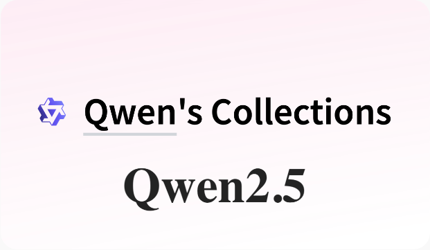

通义千问是由阿里巴巴的通义千问团队研发的一系列大规模语言和多模态模型。该模型能够执行多种任务，包括自然语言理解、文本生成、视觉理解、音频理解、工具调用、角色扮演和智能体操作等。语言和多模态模型均在大规模、多语言和多模态的数据上进行预训练，并在高质量语料上进行后续训练，以使其与人类的偏好保持一致。同时发布开源和闭源两大版本。

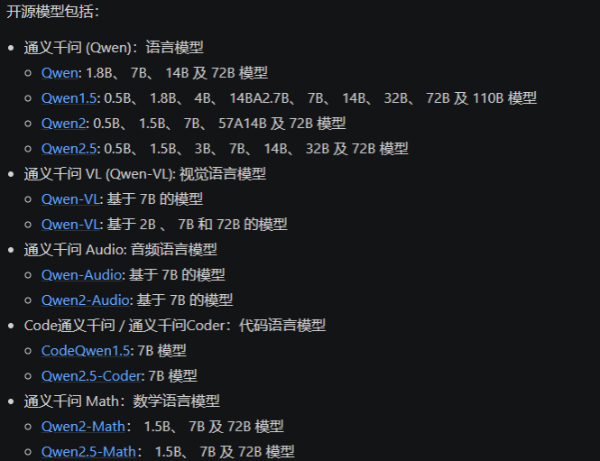

2024年9月19日最新发布的模型包括语言模型 Qwen2.5，这个系列涵盖了多种尺寸的大语言模型、多模态模型、数学模型以及代码模型，构建了一个完善的模型体系，能够为不同领域的应用提供强有力的支持。不论是在自然语言处理任务中的文本生成与问答，还是在编程领域的代码生成与辅助，或是数学问题的求解，Qwen2.5 都能展现出色的表现。每种尺寸的模型均包含基础版本、指令跟随版本和量化版本，共推出了100多个模型，充分满足了用户在各类应用场景中的多样化需求。具体版本内容如下：

* Qwen2.5: 0.5B, 1.5B, 3B, 7B, 14B, 32B, 以及72B;

* Qwen2.5-Coder: 1.5B, 7B, 以及即将推出的32B;

* Qwen2.5-Math: 1.5B, 7B, 以及72B。

相比于 Qwen2 系列，Qwen2.5 带来了以下全新升级：

* 全面开源：考虑到用户对 10B 至 30B 范围模型的需求以及移动端对 3B 模型的兴趣，此次不仅继续开源 Qwen2 系列中的 0.5B/1.5B/7B/72B 四款模型，Qwen2.5 系列还新增了两个高性价比的中等规模模型—— Qwen2.5-14B 和 Qwen2.5-32B，以及一款适合移动端的 Qwen2.5-3B。所有模型在同类开源产品中均具有较强的竞争力，例如 Qwen2.5-32B 的整体表现超越了 Qwen2-72B，而 Qwen2.5-14B 则领先于 Qwen2-57B-A14B。

* 更大规模、更高质量的预训练数据集：预训练数据集的规模从 7T tokens 扩展至 18T tokens。

* 知识储备升级：Qwen2.5 的知识涵盖面更广。在 MMLU 基准测试中，Qwen2.5-7B 和 72B 的得分分别从 Qwen2 的 70.3 提升至 74.2，以及从 84.2 提升至 86.1。此外，Qwen2.5 在 GPQA、MMLU-Pro、MMLU-redux 和 ARC-c 等多个基准测试中也有明显提升。

* 代码能力增强：得益于 Qwen2.5-Coder 的突破，Qwen2.5 在代码生成能力上大幅提升。Qwen2.5-72B-Instruct 在 LiveCodeBench（2305-2409）、MultiPL-E 和 MBPP 中的得分分别为 55.5、75.1 和 88.2，明显优于 Qwen2-72B-Instruct 的 32.2、69.2 和 80.2。

* 数学能力提升：引入了 Qwen2-math 的技术后，Qwen2.5 在数学推理表现上也有快速提升。在 MATH 基准测试中，Qwen2.5-7B/72B-Instruct 的得分分别从 Qwen2-7B/72B-Instruct 的 52.9/69.0 上升至 75.5/83.1。

* 更符合人类偏好：Qwen2.5 生成的内容更贴近人类的偏好。具体来说，Qwen2.5-72B-Instruct 在 Arena-Hard 测试中的得分从 48.1 大幅提升至 81.2，而 MT-Bench 的得分也从 9.12 提升至 9.35，相较于之前的 Qwen2-72B 有显著提升。

* 其他核心能力提升：Qwen2.5 在指令跟随、生成长文本（从 1K 升级到 8K tokens）、理解结构化数据（如表格）以及生成结构化输出（特别是 JSON）方面都有明显进步。此外，Qwen2.5 能够更好地响应多样化的系统提示，支持用户为模型设置特定角色或自定义条件。

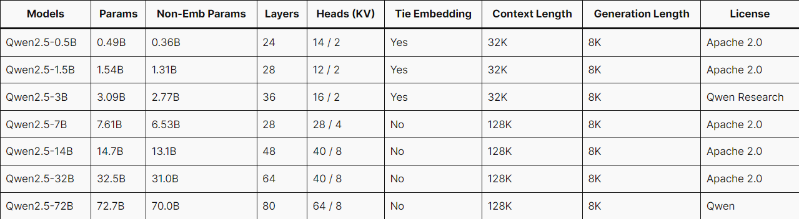

就 Qwen2.5 语言模型而言，所有模型均在最新的大规模数据集上进行了预训练，该数据集包含多达 18T tokens。与 Qwen2 相比，Qwen2.5 获得了显著更多的知识（MMLU：85+），并在编程能力（HumanEval 85+）和数学能力（MATH 80+）方面实现了大幅提升。此外，新模型在指令执行、生成长文本（超过 8K tokens）、理解结构化数据（如表格）以及生成结构化输出，特别是 JSON 方面也取得了显著进展。总体而言，Qwen2.5 模型对各种系统提示表现出更强的适应性，增强了角色扮演的实现和聊天机器人的条件设置功能。与 Qwen2 相似，Qwen2.5 语言模型支持高达 128K tokens，并能够生成最多 8K tokens 的内容，同时保持对包括中文、英文、法文、西班牙文、葡萄牙文、德文、意大利文、俄文、日文、韩文、越南文、泰文、阿拉伯文等在内的 29 种以上语言的支持。关于模型的基本信息已在下表中提供。

专业领域的专家语言模型，如用于编程的 Qwen2.5-Coder 和用于数学的 Qwen2.5-Math，相较于前身 CodeQwen1.5 和 Qwen2-Math 实现了实质性改进。具体来说，Qwen2.5-Coder 在包含 5.5T tokens 编程相关数据上进行了训练，使得即使是较小的编程专用模型在编程评估基准测试中也能表现出与大型语言模型相媲美的竞争力。同时，Qwen2.5-Math 支持中文和英文，并整合了多种推理方法，包括链式推理（CoT）、程序推理（PoT）和工具集成推理（TIR）。

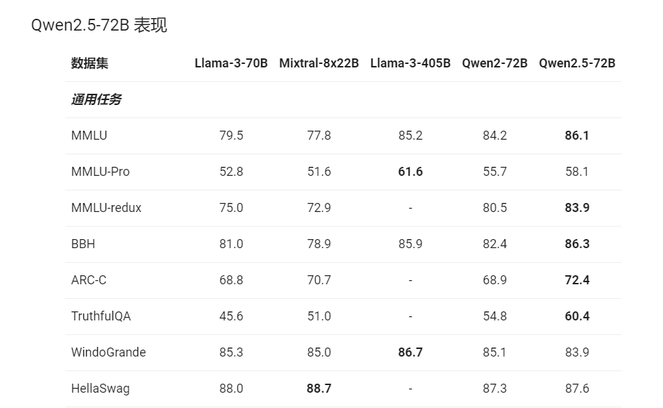

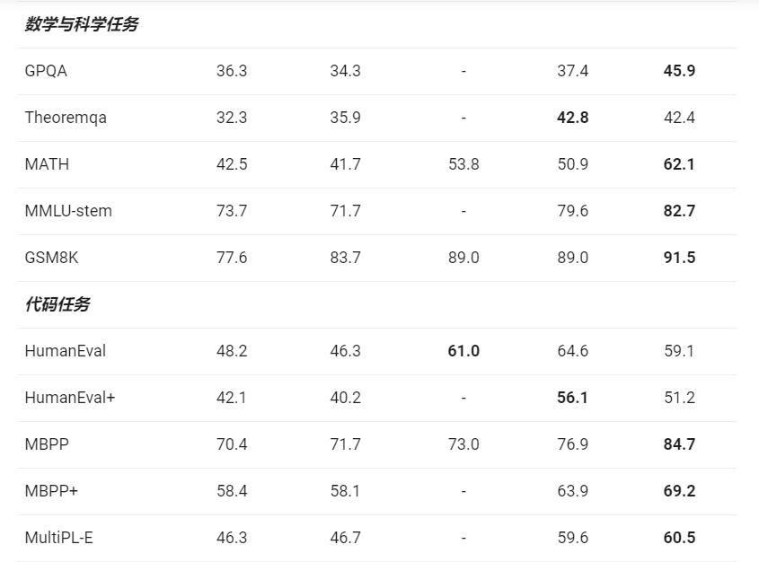

Qwen2.5 的一项重要更新是重新推出了 Qwen2.5-14B 和 Qwen2.5-32B。这些模型在各种任务中表现优异，超越了同等或更大规模的基线模型，如 Phi-3.5-MoE-Instruct 和 Gemma2-27B-IT。Qwen2.5 系列在模型规模和能力之间取得了良好平衡，提供了与一些更大型模型相当甚至更优的性能。

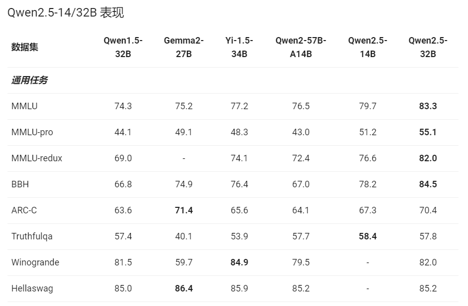

近年来，小型语言模型（SLMs）出现了明显的转向趋势。尽管历史上小型语言模型的表现一直落后于大型语言模型（LLMs），但二者之间的性能差距正在迅速缩小。值得注意的是，即使是只有约 30 亿参数的模型，现在也能够取得高度竞争力的结果。附带的图表显示了一个重要的趋势：在 MMLU 中得分超过 65 的新型模型正逐渐变得更小，这凸显了语言模型知识密度增长速度的加快。特别值得一提的是，Qwen2.5-3B 成为这一趋势的典型例子，凭借约 30 亿参数实现了令人印象深刻的性能，展现了相较于前辈模型的高效性和能力。


Qwen2.5 还推出了专门针对数学问题的模型——Qwen2.5-Math。其数学能力得分十分亮眼，这得益于其大规模的训练数据和专门的数学模型设计。与其他顶尖模型相比，Qwen2.5 不仅在数学推理上表现优异，还在编程能力上展现出强大的竞争力。该模型在数学推理方面进行了特别优化，支持中文和英文，并整合了多种推理方法，包括：思维链（Chain of Thought, CoT）：帮助模型在解决复杂问题时进行逐步推理。工具集成推理（Tool-Integrated Reasoning, TIR）：增强模型在解决数学问题时的灵活性和准确性。

Qwen2.5-Math-72B-Instruct 的整体性能超越了 Qwen2-Math-72B-Instruct 和 GPT4-o，甚至是非常小的专业模型如 Qwen2.5-Math-1.5B-Instruct 也能在与大型语言模型的竞争中取得高度竞争力的表现。

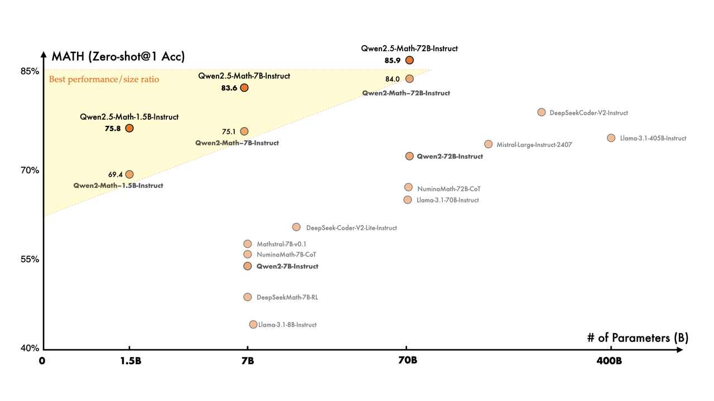

* 更多信息可以访问Qwen官网：https://qwenlm.github.io/zh/blog/qwen2.5-llm/

## 1.2 线上体验办法

在 Hugging Face 平台上，用户可以方便地进行该模型的线上体验。这种在线测试不仅可以帮助用户直观地了解模型的性能，还能够根据具体任务需求进行评估。因此，建议大家在正式使用该模型之前，先通过这种方式进行测试，以确保模型的能力和特性符合自身的需求。在测试过程中，用户可以尝试不同类型的输入和任务，从而更好地评估模型在实际应用中的表现。这一过程有助于发现模型的优势与局限，使用户在后续的应用中做出更为明智的选择。通过线上体验，还可以及时获取最新的功能更新和使用技巧，从而优化工作流程。

https://huggingface.co/spaces/Qwen/Qwen2.5-72B-Instruct

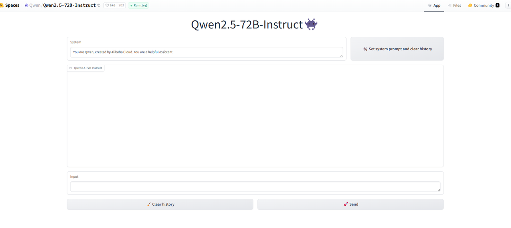

# 2. ModelScope本地部署流程

* **Step 1. 创建conda虚拟环境**

  Conda创建虚拟环境的意义在于提供了一个隔离的、独立的环境，用于Python项目和其依赖包的管理。每个虚拟环境都有自己的Python运行时和一组库。这意味着我们可以在不同的环境中安装不同版本的库而互不影响。根据官方文档信息建议Python版本3.10以上。创建虚拟环境的办法可以通过使用以下命令创建：

```bash
# qwen2_5 是你想要给环境的名称，python=3.11 指定了要安装的Python版本。你可以根据需要选择不同的名称和/或Python版本。

conda create -n qwen2_5 python=3.11
```


  创建虚拟环境后，需要激活它。使用以下命令来激活刚刚创建的环境。如果成功激活，可以看到在命令行的最前方的括号中，就标识了当前的虚拟环境。虚拟环境创建完成后接下来安装torch。

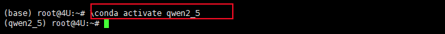

  如果忘记或者想要管理自己建立的虚拟环境，可以通过conda env list命令来查看所有已创建的环境名称。

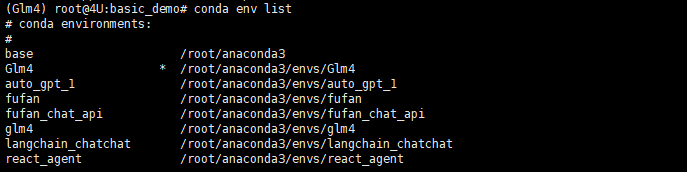

  如果需要卸载指定的虚拟环境则通过以下指令实现：

```plaintext
conda env remove --name envname
```

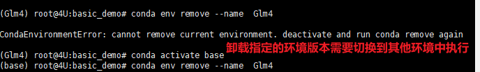

* 需要注意的是无法卸载当前激活的环境，建议卸载时先切换到base环境中再执行操作。

* **Step 2. 查看当前驱动最高支持的CUDA版本**

  我们需要根据CUDA版本选择Pytorch框架，先看下当前的CUDA版本：

```plaintext
nvidia -smi
```

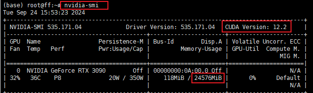

* **Step 3. 在虚拟环境中安装Pytorch**

  进入Pytorch官网：https://pytorch.org/get-started/previous-versions/

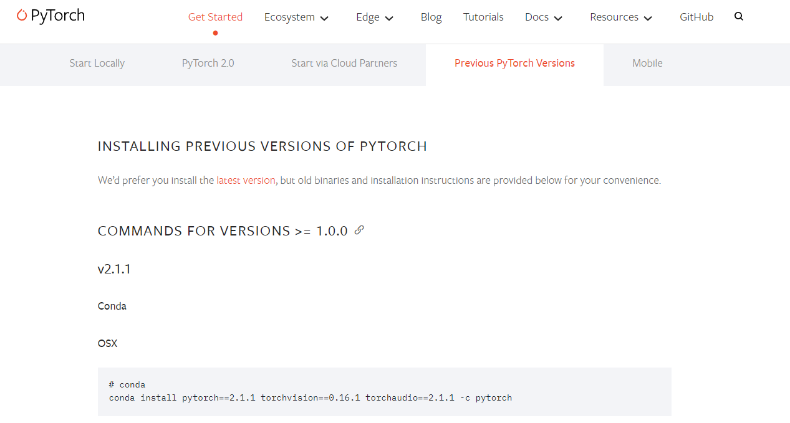

  当前的电脑CUDA的最高版本要求是12.2，所以需要找到不大于12.2版本的Pytorch。


  直接复制对应的命令，进入终端执行即可。这实际上安装的是为 CUDA 12.1 优化的 PyTorch 版本。这个 PyTorch 版本预编译并打包了与 CUDA 12.1 版本相对应的二进制文件和库。


* **Step 4. 安装Pytorch验证**

  待安装完成后，如果想要检查是否成功安装了GPU版本的PyTorch，可以通过几个简单的步骤在Python环境中进行验证：

```bash
import torch

print(torch.__version__)
```

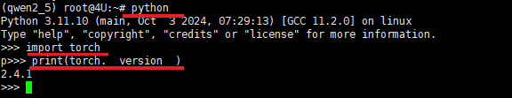

  如果输出是版本号数字，则表示GPU版本的PyTorch已经安装成功并且可以使用CUDA，如果显示ModelNotFoundError，则表明没有安装GPU版本的PyTorch，或者CUDA环境没有正确配置，此时根据教程，重新检查自己的执行过程。

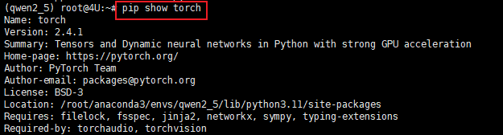

  当然通过pip show的方式可以很简洁的查看已安装包的详细信息。pip show \<package\_name> 可以展示出包的版本、依赖关系（展示一个包依赖哪些其他包）、定位包安装位置、验证安装确实包是否正确安装及详情。

* **Step 5. 安装必要的依赖包**

Transfomers是大模型推理时所需要使用的框架，官方给出的建议版本是`Transfomers>=4.37.0`，通过以下指令可以下载最新版本的Transfomers：

pip install transformers -U


安装完成后可以通过以下命令检查是否安装：

```plaintext
pip show transformers
```


接下来需要安装下载工具modelscope以及接下来要下载脚本的依赖accelerate，通过以下代码进行对应工具的部署：

```plaintext
pip install modelscope
pip install accelerate>=0.26.0
```


* **Step 6.1 使用下载脚本安装**

通过mkdir命令创建一个存放Qwen2.5项目文件的文件夹

```plaintext
mkdir qwen2_5 #文件的具体名称可以自定义
cd qwen2_5
```

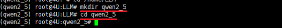

在命令行种可以通过vim的方式创建或编辑文件，通过`vim download.py`创建一个python文件，将以下代码复制，然后保存退出。

```python
from modelscope import AutoModelForCausalLM, AutoTokenizer

model_name = "qwen/Qwen2.5-7B-Instruct"

model = AutoModelForCausalLM.from_pretrained(
    model_name,
    torch_dtype="auto",
    device_map="auto"
)
tokenizer = AutoTokenizer.from_pretrained(model_name)

prompt = "Give me a short introduction to large language model."
messages = [
    {"role": "system", "content": "You are Qwen, created by Alibaba Cloud. You are a helpful assistant."},
    {"role": "user", "content": prompt}
]
text = tokenizer.apply_chat_template(
    messages,
    tokenize=False,
    add_generation_prompt=True
)
model_inputs = tokenizer([text], return_tensors="pt").to(model.device)

generated_ids = model.generate(
    **model_inputs,
    max_new_tokens=512
)
generated_ids = [
    output_ids[len(input_ids):] for input_ids, output_ids in zip(model_inputs.input_ids, generated_ids)
]

response = tokenizer.batch_decode(generated_ids, skip_special_tokens=True)[0]
print(response)
```

编辑好脚本之后通过`python download.py`开始执行这个文件，如下图所示开始自动下载大模型启动所需的项目文件与权重文件以及分词器文件。

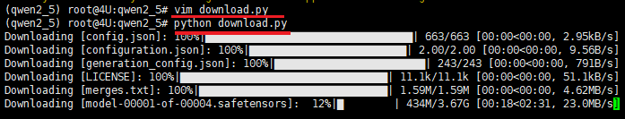

文件安装完毕后会启动对话测试（再次运行该文件会直接加载本地权重文件后直接进行运行推理），出现以下文本返回信息说明文件下载完整且可以启动：

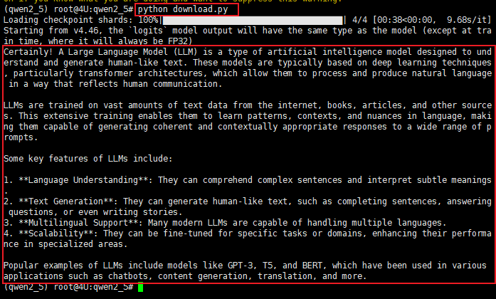

通过后台监控可以看到推理该对话占用将近15G的显存：

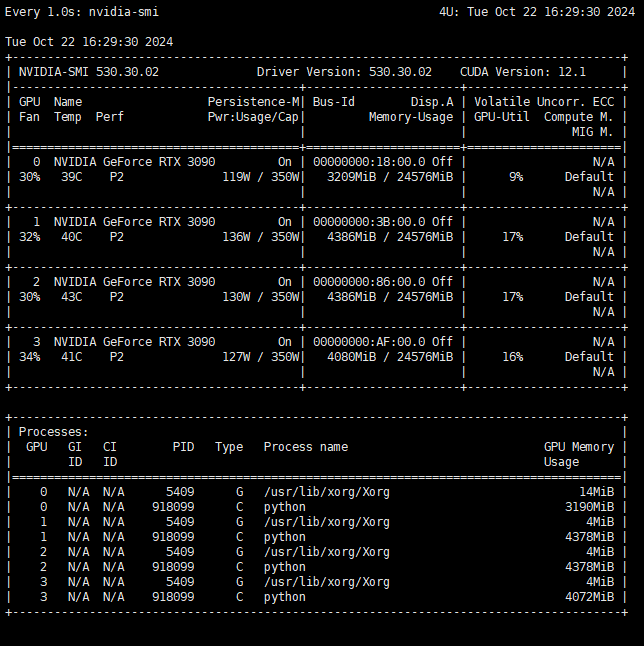

文件完整性可以通过以下文档进行检查：

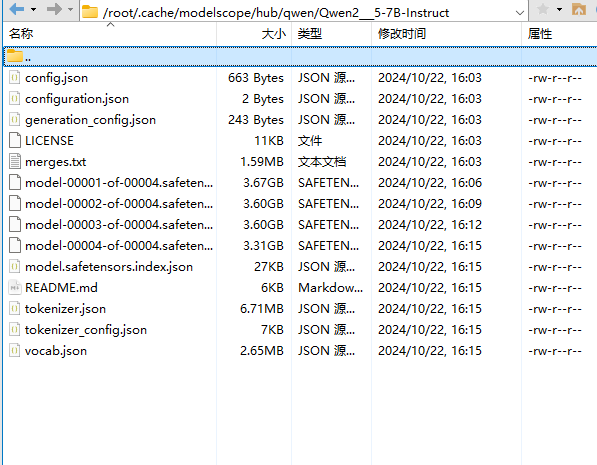

* **Step 6.2 从Model Scope下载GLM4-9b-chat模型权重**

  Model Scope下载路径如下：
https://www.modelscope.cn/models/Qwen/Qwen2.5-7B-Instruct

  Model Scope支持多种下载模式：SDK下载、Git下载、命令行下载（下载完整模型、下载单个文件 后直接加文件名即可）、手动下载

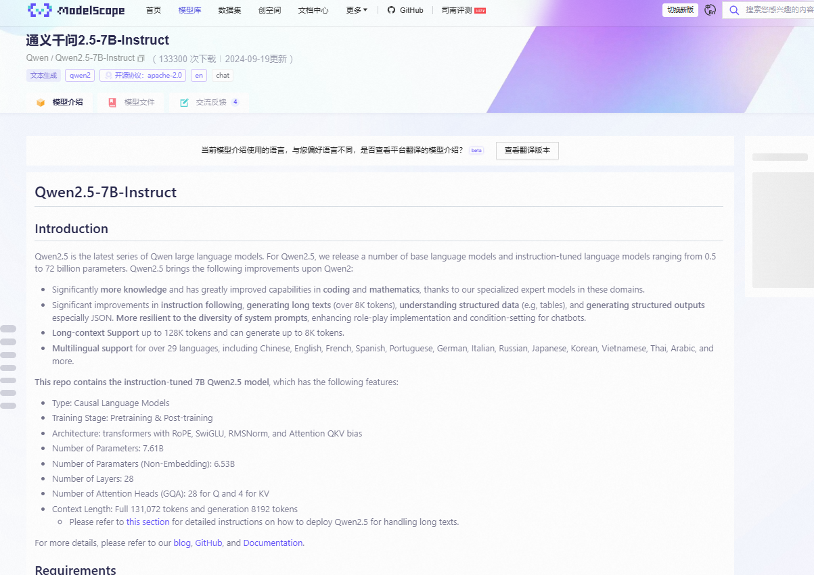

这是一种快捷的本机下载方式，首先通过命令`pip install modelscope`安装好达摩社区的安装包，然后通过以下指令可以下载模型的权重文件，这种方法无需翻墙，无需下载额外的插件。

```plaintext
modelscope download --model Qwen/Qwen2.5-7B-Instruct
```

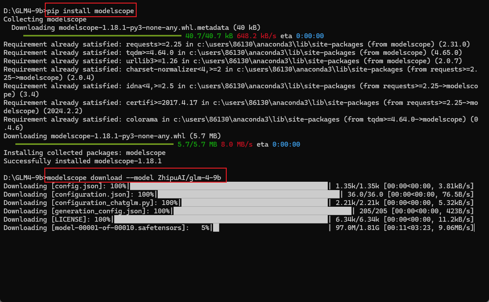

这种命令可以支持下载单个的文件，通过以下指令可以单独下载某文件,用于补充或更新(这里用readme文件为例)：

```plaintext
modelscope download --model Qwen/Qwen2.5-7B-Instruct README.md --local_dir ./dir
```

下载完成后全部的权重文件的内容如下：

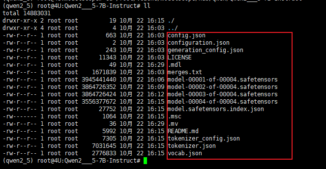

* **Step 6.3 手动方式下载**

在model scope中也可以实现手动下载，虽然相较于命令行下载的方法较繁琐，但是特殊情况下的有效安装方法。在模型下载页面可以通过手动点击文件对应的下载按钮即可实现下载。

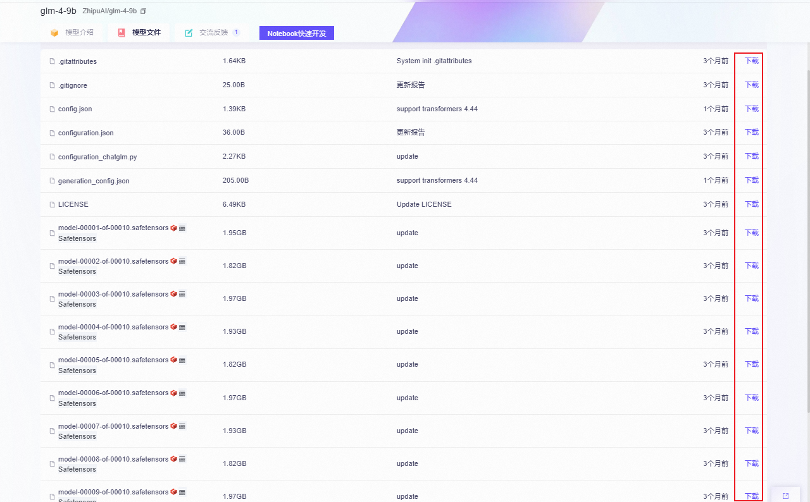

下载好的权重文件和命令行下载方式的一样，不过一般如果是在主机-服务器环境下使用这种方式下载的话需要xftp这样的传输工具在上传到服务器使用。


# 3.ModelScope线上部署办法

##### **ModelScope在线算力与在线环境获取指南**

  登录魔搭社区：https://www.modelscope.cn/home ，点击注册：


输入账号密码完成注册：

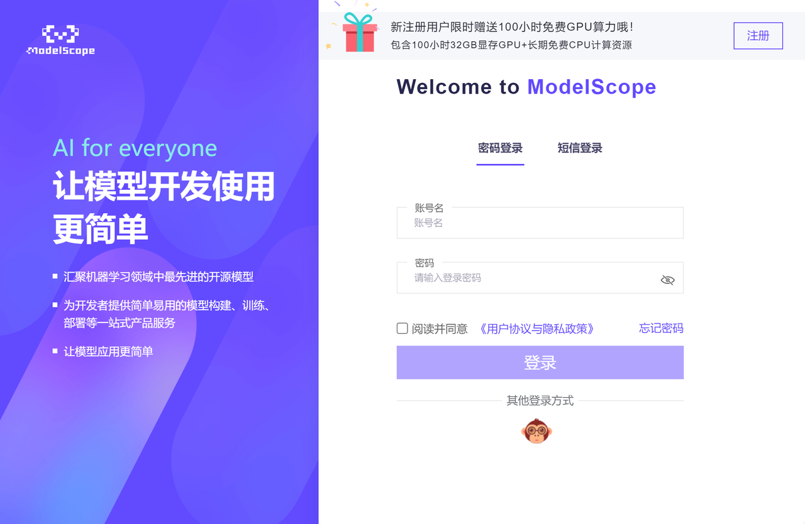

注册完成后，点击个人中心，点击绑定阿里云账号：


在跳转页面中选择登录阿里云，未注册阿里云也可以在当前页面注册：


绑定完成后，点击左侧“我的Notebook”，即可查看当前账号获赠算力情况。对于首次绑定阿里云账号的用户，都会赠送永久免费的CPU环境（8核32G内存）和36小时限时使用的GPU算力（32G内存+24G显存）。这里的GPU算力会根据实际使用情况扣除剩余时间，总共36小时的使用时间完全足够进行前期各项实验。

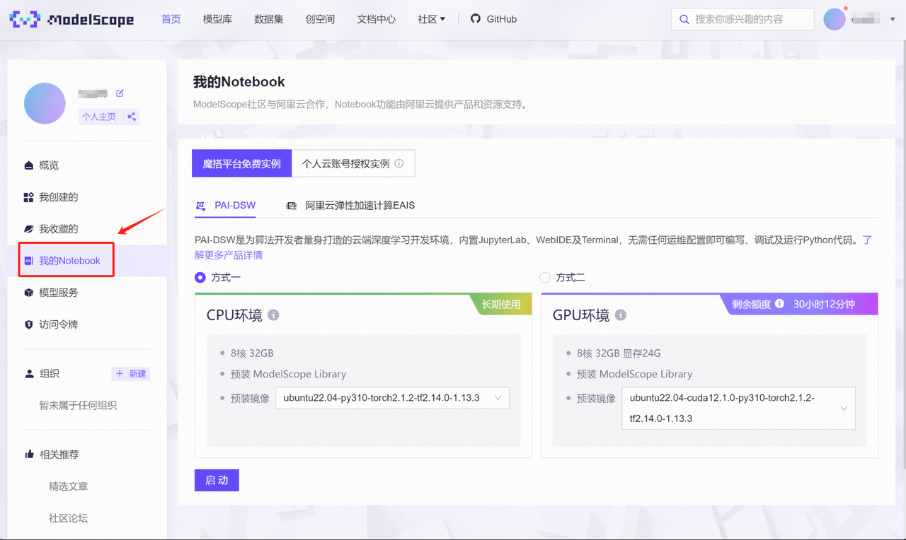

接下来启动GPU在线算力环境，选择方式二、点击启动：


稍等片刻即可完成启动，并点击查看Notebook：


即可接入在线NoteBook编程环境：


当前NoteBook编程环境和Colab类似（谷歌提供的在线编程环境），可以直接调用在线算力来完成编程工作，并且由于该服务由ModelScope提供，因此当前NoteBook已经完成了CUDA、PyTorch、Tensorflow环境配置，并且已经预安装了大模型部署所需各种库，如Transformer库、vLLM库、modelscope库等，并且当前NoteBook运行环境是Ubuntu操作系统，我们可以通过Jupyter中的Terminal功能对Ubuntu系统进行操作：


进入到命令行界面：


通过`pip show +name`的方式可以查看ModelScope已经安装好的依赖资源，可以看到已经安装好了我们所需的各种依赖资源。

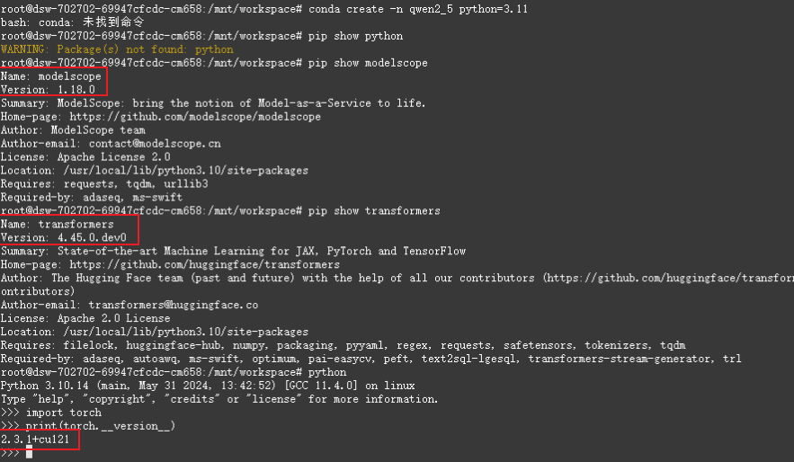

输入nvidia-smi，查看当前GPU情况：


继续在命令行中进行操作，和本地下载流程一样，在创建部署新文件之前我们先为之创建一个新文件夹，随后进入该文件夹中进行下载操作。

```plaintext
mkdir qwen2-5
cd qwen2-5
modelscope download --model Qwen/Qwen2.5-7B-Instruct
```

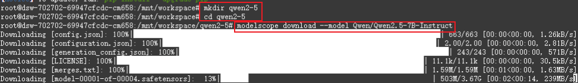

下载完成之后，其完整的文件信息也如下图所示：


当然，这里需要注意的是，哪怕当前在线编程环境已经做了适配，但并不一定满足所有ModelScope中模型运行要求，既并非每个拉取的Jupyter文件都可以直接运行。不过无论如何，ModelScope Notebook还是为初学者提供了非常友好的、零基础即可入手尝试部署大模型的绝佳实践环境。

# 4. Ollama框架部署流程

### 4.1 Ollama基本信息介绍

Ollama 是一个开源的大语言模型服务工具，专注于简化本地模型的创建、管理和部署流程。它可以帮助开发人员和数据科学家轻松地在本地或私有环境中使用大语言模型，而不必依赖于云服务，从而保证了数据隐私和灵活性。

Ollama 非常适合需要在本地运行大语言模型的开发者和企业，如：

* 开发和测试：在本地快速创建和测试新的语言模型。

* 隐私保护：在本地部署模型，适用于有严格隐私需求的企业。

* 多模型管理：轻松管理和部署多个模型，适合有大量模型管理需求的团队。

在官网可以看到Ollama支持的模型列表 https://ollama.com/library


每个模型下面有支持的功能和参数型号以及基本的模型描述，点击进入对应模型可以看到下载所需占用的内存大小。

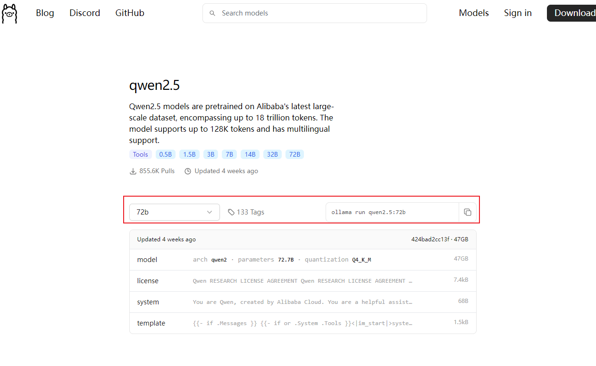

### 4.2 使用Ollama实现LLM下载流程

使用Ollama方法下载的前两步骤与正常方法下载相同（本地部署流程的前五步），即创建虚拟环境和依据硬件配置Pytorch环境，部署好流程后可以继续下面的步骤。

Ollama安装硬件要求：

* Windows：3060以上显卡+8G以上显存+16G内存，硬盘空间至少20G显卡

*

Mac：M1或M2芯片 16G内存，20G以上硬盘空间

下载Ollama的指令如下：

```plaintext
curl -fsSL https://ollama.com/install.sh | sh
```


下载完成后检测,如果返回版本号则说明成功下载：

```plaintext
ollama -v
```


通过指令**ollama help**可以查看该系统可执行的命令：


通过以下指令可以，检查ollama可运行的模型列表，可以看见之前下载的Llama 3-8b模型的信息呈现在列：

```plaintext
ollama list
```

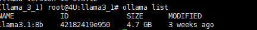

**下载模型**

在终端中执行命令 `ollama run qwen2.5`或`ollama run qwen2.5：7b` ，即可下载 qwen2.5：7b 模型。模型下载完成后，会自动启动大模型，进入命令行交互模式，直接输入指令，就可以和模型进行对话了对应参数的模型的下载方式可以通过在Ollama官网查看到下载指令。


下载70B的模型只需要一行指令即可完成部署：

```plaintext
ollama run qwen2.5:72b
```


完成下载后会直接进入模型启动状态，如果退出或刷新界面，再次输入指令`ollama run qwen2.5:72b`即可启动对应模型。
可以看到推理所需的计算资源相对均匀的分布在每张工作显卡上。


对该模型进行数学能力测试后可以看到，它无论在应对简单的数学陷阱题，还是中等难度的数学问题时，都能作出准确且逻辑清晰的回答。这表明该模型的指令微调（instruct）效果显著，具备良好的数学理解和推理能力。

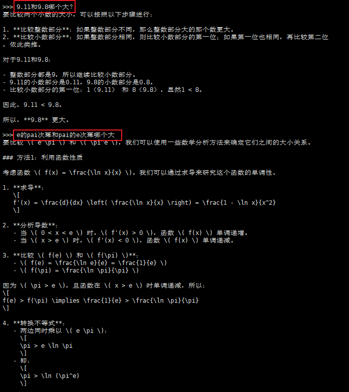

### 4.3 如何卸载安装

直接在你的安装目录下，删除ollama文件夹即可。所有下载的数据和大模型文件都在里面，Ollama 的默认安装目录通常是用户主目录下的 .ollama 文件夹。例如，在 Unix 系统（如 macOS 和 Linux）上，默认安装目录为：

\~/.ollama

或可以通过指令 `ollama rm modlename`的方式来移除对应的大模型文件。

# 5. 在Windows环境下进行Ollama方式下载

Ollama同样支持在Windows环境下进行部署下载，使用此方法下载意味着你可以无需调整任何硬件设备直接在你的主机上实现Llama 3.2模型的安装部署和推理使用。

首先要下载Windows版的Ollama文件，进入官网选择下图的内容进行下载：

https://ollama.com/download

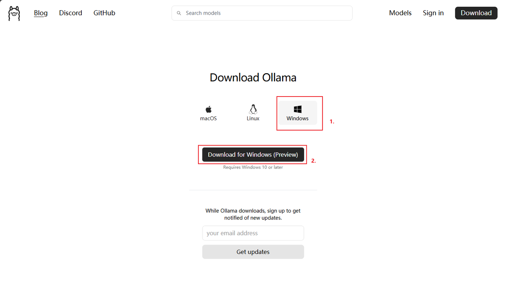

点击Download for window即可实现下载安装包，文件大小为664MB。


下载完成后在对应文件夹双击打开安装包完成安装流程。

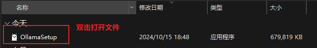


框架和模型默认路径都是C盘，为了主机内存管理方便，可以通过以下步骤来实现模型下载地址的切换。

1.在桌面下方搜索栏输入高级系统设置并进入。


在系统设置中找到`高级`的标签，点击下方的环境变量选项。

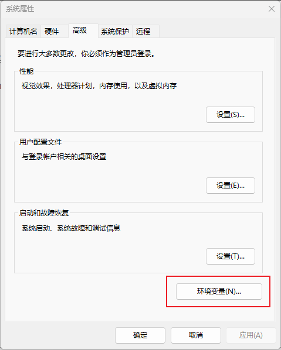

在系统变量栏点击新建，变量名设置为OLLAMA\_MODELS,变量值设置为你想要的路径位置，这里设置为D:\Ollama\models

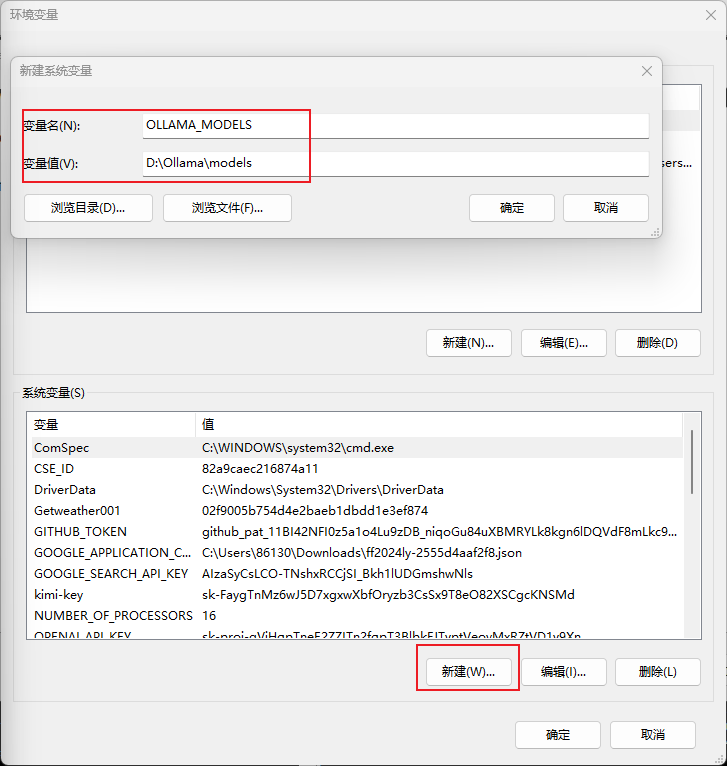

设置好路径之后可以在命令行中进行检查，通过以下命令实现：

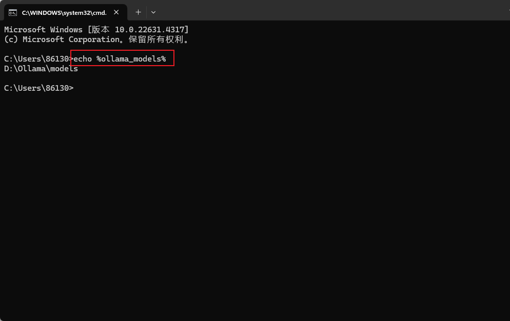

在完成Ollama部署之后，系统会自动启动ollama的程序，界面如下：

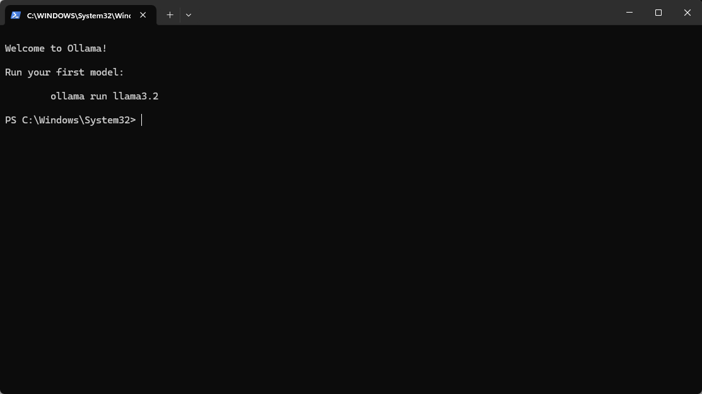

在Ollama官网支持的模型界面可以找到对应可推理的模型的部署代码，以下以Qwen2.5：0.5B为例进行演示。

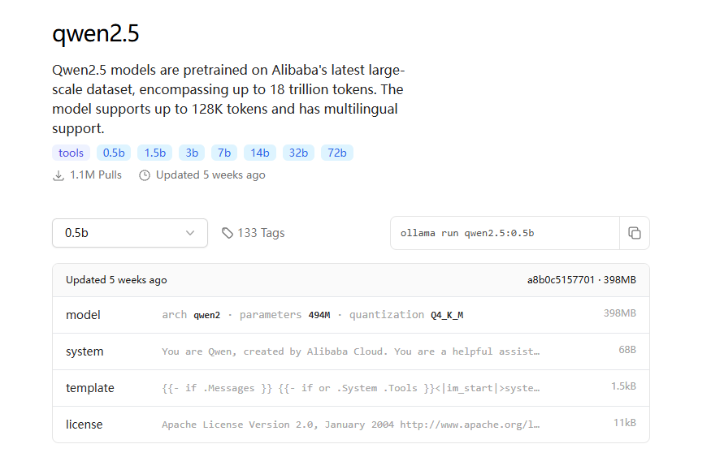

在Windows平台运行和在Linux系统中进行的指令一样，执行`ollama run qwen2.5:0.5b`即可实现该模型的下载和运行。

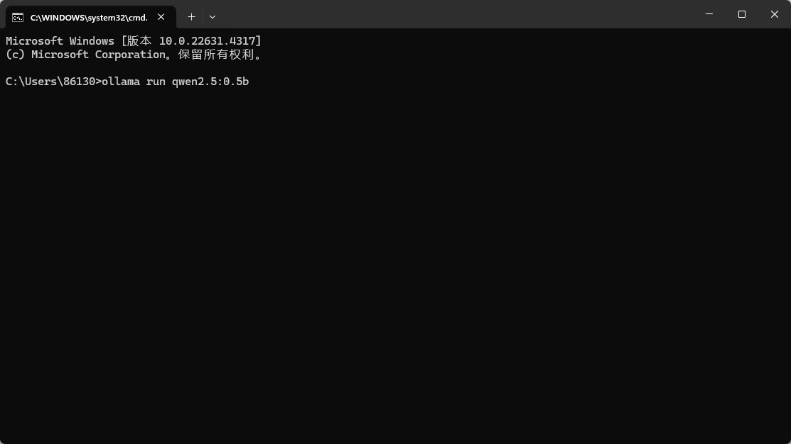

同样的，在完成模型下载之后会直接开启模型的推理任务，可以通过命令行的方式进行模型对话交互。

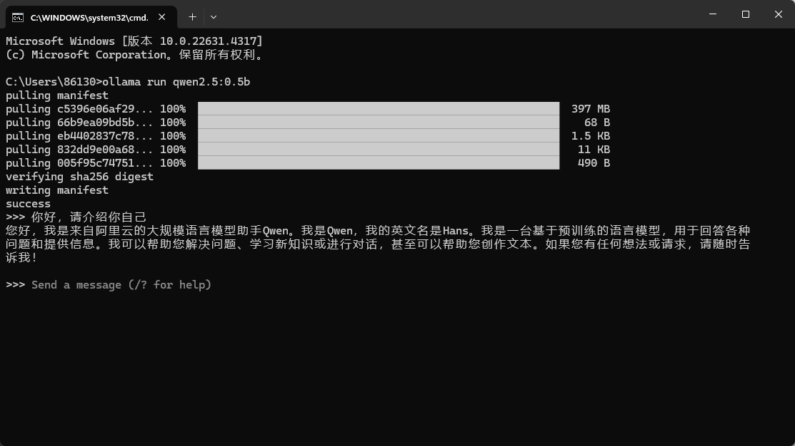

再次启动Ollama可以直接在Windows的命令行中实现，通过win+R键启动cmd命令，执行`ollama run qwen2.5:0.5b`便可以开启对话，实例所演示的是qwen2.5系列最小的模型，通过测试仅在资源有限的纯CPU环境下也可以流畅运行，这展现出未来AIPC的一种可能方向。

# 6. 使用vLLM框架进行推理部署

  首先来看一下什么是vLLM。

  vLLM 是一个用于大型语言模型推理和服务的快速且易于使用的库，简单理解就是一个大模型的推理框架。这是一个用于快速 LLM 推理和服务的开源库。它提供的吞吐量比 HuggingFace Transformers 高 24 倍，而无需更改任何模型架构。vLLM在延迟方面也有显著优势。
GLM4的官方集成了vLLM开源框架来实现部署和加速推理。

  vLLM论文地址：https://arxiv.org/pdf/2309.06180

  vLLM官方地址：https://docs.vllm.ai/en/latest/index.html

  vLLM支持模型列表
https://docs.vllm.ai/en/latest/models/supported\_models.html

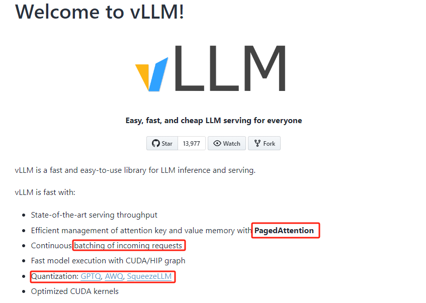

  vLLM有几个优化点值得我们去关注： 其一是*PagedAttention* 高效管理注意力键值内存，其二是vLLM支持多GPU和多节点推理，适用于大规模部署场景。其三，vLLM支持多种量化方案，如GPTQ、AWQ和FP8，优化了CUDA内核以提高推理效率。最后，它还可以为大语言模型构建API服务器。

### 6.1 vLLM安装

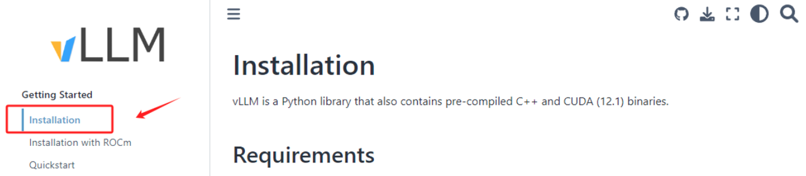

因为与HuggingFace的无缝集成，才导致这个工具非常易用。所以vLLM与其他的工具包使用方式一样，要使用vLLM框架集成GLM4模型，首要做的事情就是安装vLLM这个依赖包。这里有提供安装教程：

  vLLM框架对Python版本和CUDA版本的要求比较严格：

* Python: 3.8 \~ 3.11

* torch >= 2.0

* cuda 11.8 or 12.1

  vLLM 对 torch 版本要求较高，且越高的版本对模型的支持更全，效果更好。如果不满足上述情况，会在安装过程中报错，导致无法安装，所以需要严格按照上述要求检查自己的环境。如确实无法满足，只能放弃使用vLLM框架推理加速。

  首先验证当前的开发环境，代码如下：

```python
import sys
import torch
import subprocess

# 打印 Python 版本
print("Python 版本:", sys.version)

# 打印 PyTorch 版本
print("PyTorch 版本:", torch.__version__)

# 打印 CUDA 版本（如果 CUDA 可用）
if torch.cuda.is_available():
    cuda_version = torch.version.cuda
    print("CUDA 版本:", cuda_version)
else:
    print("CUDA 不可用")
```

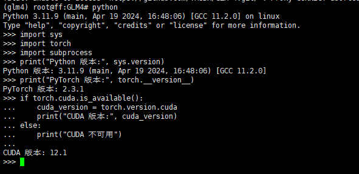

Qwen2.5系列所需的vLLM版本需要大于 `vLLM>=0.4.0`，在实际部署安装的时候可以通过`pip install vllm -U`命令来下载最新的版本，或者可以通过`pip install vllm==0.4.3`来确定下载指定的版本。

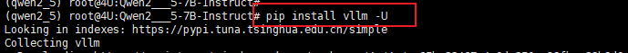

安装完成后可以通过以下命令查看下载是否成功，以及相应的版本信息。

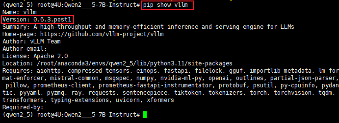

## 6.2 使用vLLM进行推理部署

如果你此前没有下载Qwen2.5：7B的模型，终端运行下面的代码会自动从huggingface拉取模型（这里需要魔法才能拉取成功）：

python -m vllm.entrypoints.openai.api\_server --model Qwen/Qwen2.5-7B-Instruct

默认情况下，vLLM 会从 Hugging Face 下载模型。但如果你希望使用 ModelScope 上的模型，可以通过设置环境变量来切换源。

export VLLM\_USE\_MODELSCOPE=True

如果已经通过其他方式完成下载（如：ModelScope本地化下载的方式），通过魔搭社区在本地下载qwen-2\_\_5-7B-instruct的模型，直接加载本地模型启动一个API服务器来运行Qwen-2\_\_5-7B-Instruct 的服务即可。你需要修改上面的代码--model 后的内容为你本地模型的存储路径。

python -m vllm.entrypoints.openai.api\_server --served-model-name Qwen2\_\_\_5-7B-Instruct --model /home/LLM/qwen2\_5/hub/qwen/Qwen2\_\_\_5-7B-Instruct

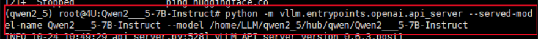

在加载完全部的权重模型之后会开启openai风格的推理流程，在对应的网址端口就可以进行API调用对话了。

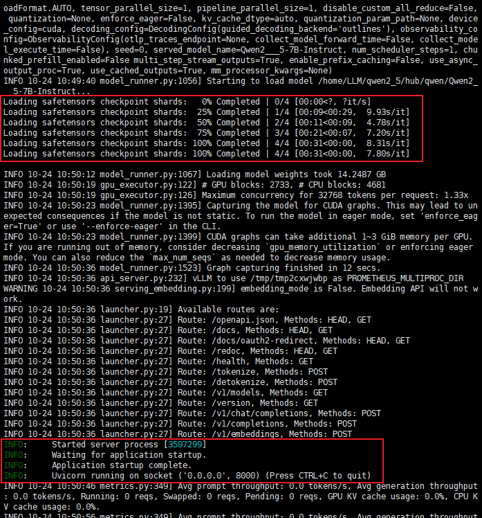

```python
from openai import OpenAI
# Set OpenAI's API key and API base to use vLLM's API server.
openai_api_key = "EMPTY"
openai_api_base = "http://localhost:8000/v1"

client = OpenAI(
    api_key=openai_api_key,
    base_url=openai_api_base,
)

chat_response = client.chat.completions.create(
    model="Qwen/Qwen2.5-7B-Instruct",
    messages=[
        {"role": "system", "content": "你是一个人工智能助手."},
        {"role": "user", "content": "介绍一下你自己."},
    ]
)
print("Chat response:", chat_response)
```

```plaintext
Chat response: ChatCompletion(id='cmpl-9122c54c70ee43a88ba86ef5a1f5c062', choices=[Choice(finish_reason='stop', index=0, logprobs=None, message=ChatCompletionMessage(content='我是一个人工智能助手，由阿里云开发和运营，旨在为用户提供高效、便捷的信息查询和问题解答服务。我的主要功能包括但不限于：\n\n1. **快速搜索信息**：能够迅速从海量数据中检索和提供所需信息，涵盖科技、文化、教育、生活等多个领域。\n2. **智能问答**：能够理解和回答各种问题，无论是专业知识、日常生活常识还是技术细节，都能提供准确的答案或指导。\n3. **语言翻译**：支持多种语言之间的翻译，帮助用户跨越语言障碍进行沟通交流。\n4. **语音识别与合成**：能够将文字转为语音，或者将语音转换为文字，提供更加自然、人性化的交互体验。\n5. **个性化推荐**：根据用户的历史行为和偏好，提供个性化的信息推荐和服务。\n6. **操作助手**：在使用智能设备或应用程序时提供辅助指导，帮助用户更高效地完成任务。\n\n我致力于通过不断学习和进步，为用户提供更加智能、贴心的服务，帮助解决日常生活和工作中遇到的问题。无论是学习、工作还是娱乐，我都是您可靠的助手。', role='assistant', function_call=None, tool_calls=None), stop_reason=None)], created=1717747911, model='Qwen2-7B-Instruct', object='chat.completion', system_fingerprint=None, usage=CompletionUsage(completion_tokens=230, prompt_tokens=21, total_tokens=251))
```

以下方法可用于在开发模式下使用 vLLM 框架进行模型推理。

```python
from vllm import LLM, SamplingParams
```

```python
prompts = [
    "Hello, my name is",
    "The president of the United States is",
    "The capital of France is",
    "The future of AI is",
]
sampling_params = SamplingParams(temperature=0.8, top_p=0.95)
```

```python
llm = LLM(model="Qwen/Qwen2.5-7B-Instruct", max_model_len=1024)
```

```plaintext
INFO 10-25 14:37:03 llm_engine.py:169] Initializing an LLM engine (v0.5.1) with config: model='Qwen/Qwen2.5-7B-Instruct', speculative_config=None, tokenizer='Qwen/Qwen2.5-7B-Instruct', skip_tokenizer_init=False, tokenizer_mode=auto, revision=None, rope_scaling=None, rope_theta=None, tokenizer_revision=None, trust_remote_code=False, dtype=torch.bfloat16, max_seq_len=1024, download_dir=None, load_format=LoadFormat.AUTO, tensor_parallel_size=1, pipeline_parallel_size=1, disable_custom_all_reduce=False, quantization=None, enforce_eager=False, kv_cache_dtype=auto, quantization_param_path=None, device_config=cuda, decoding_config=DecodingConfig(guided_decoding_backend='outlines'), observability_config=ObservabilityConfig(otlp_traces_endpoint=None), seed=0, served_model_name=Qwen/Qwen2.5-7B-Instruct, use_v2_block_manager=False, enable_prefix_caching=False)
INFO 10-25 14:37:19 model_runner.py:255] Loading model weights took 14.2409 GB
INFO 10-25 14:37:19 gpu_executor.py:84] # GPU blocks: 5136, # CPU blocks: 4681
INFO 10-25 14:37:22 model_runner.py:924] Capturing the model for CUDA graphs. This may lead to unexpected consequences if the model is not static. To run the model in eager mode, set 'enforce_eager=True' or use '--enforce-eager' in the CLI.
INFO 10-25 14:37:22 model_runner.py:928] CUDA graphs can take additional 1~3 GiB memory per GPU. If you are running out of memory, consider decreasing `gpu_memory_utilization` or enforcing eager mode. You can also reduce the `max_num_seqs` as needed to decrease memory usage.
INFO 10-25 14:37:35 model_runner.py:1117] Graph capturing finished in 13 secs.
```

```python
outputs = llm.generate(prompts, sampling_params)

# Print the outputs.
for output in outputs:
    prompt = output.prompt
    generated_text = output.outputs[0].text
    print(f"Prompt: {prompt!r}, Generated text: {generated_text!r}")
```

```plaintext
Processed prompts: 100%|██████████| 4/4 [00:00<00:00,  6.71it/s, est. speed input: 36.91 toks/s, output: 107.38 toks/s]

Prompt: 'Hello, my name is', Generated text: " Josh. I'm 15 and a rising 10th grader"
Prompt: 'The president of the United States is', Generated text: ' the head of state and head of government of the United States. The president also'
Prompt: 'The capital of France is', Generated text: ' located in which part of the country?\nThe capital of France is Paris, which'
Prompt: 'The future of AI is', Generated text: ' here. Companies, from startups to established businesses, are adopting AI in their operations'
```

或者我们可以通过创建一个运行脚本来实现单轮对话，在命令行通过`vim run.py`来创建一个vllm启动脚本，将以下代码复制到文件中，进行必要的修改后保存退出：

````python
from vllm import LLM, SamplingParams
from transformers import AutoTokenizer
import os
import json

# 自动下载模型时，指定使用modelscope。不设置的话，会从 huggingface 下载
os.environ['VLLM_USE_MODELSCOPE']='True'

def get_completion(prompts, model, tokenizer=None, max_tokens=512, temperature=0.8, top_p=0.95, max_model_len=2048):
    stop_token_ids = [151329, 151336, 151338]
    # 创建采样参数。temperature 控制生成文本的多样性，top_p 控制核心采样的概率
    sampling_params = SamplingParams(temperature=temperature, top_p=top_p, max_tokens=max_tokens, stop_token_ids=stop_token_ids)
    # 初始化 vLLM 推理引擎
    llm = LLM(model=model, tokenizer=tokenizer, max_model_len=max_model_len,trust_remote_code=True)
    outputs = llm.generate(prompts, sampling_params)
    return outputs


if __name__ == "__main__":
    # 初始化 vLLM 推理引擎
    model='/home/LLM/qwen2_5/hub/qwen/Qwen2___5-7B-Instruct' # 指定模型路径
    # model="qwen/Qwen2-7B-Instruct" # 指定模型名称，自动下载模型
    tokenizer = None
    # 加载分词器后传入vLLM 模型，但不是必要的。
    # tokenizer = AutoTokenizer.from_pretrained(model, use_fast=False) 

    text = ["你好，帮我介绍一下什么时大语言模型。",
            "可以给我将一个有趣的童话故事吗？"]
    # messages = [
    #     {"role": "system", "content": "你是一个有用的助手。"},
    #     {"role": "user", "content": prompt}
    # ]
    # 作为聊天模板的消息，不是必要的。
    # text = tokenizer.apply_chat_template(
    #     messages,
    #     tokenize=False,
    #     add_generation_prompt=True
    # )

    outputs = get_completion(text, model, tokenizer=tokenizer, max_tokens=512, temperature=1, top_p=1, max_model_len=2048)

    # 输出是一个包含 prompt、生成文本和其他信息的 RequestOutput 对象列表。
    # 打印输出。
    for output in outputs:
        prompt = output.prompt
        generated_text = output.outputs[0].text
        print(f"Prompt: {pr```ompt!r}, Generated text: {generated_text!r}")


在命令行使用`python run.py`来启动这个脚本，在模型加载完成后会返回推理结果。

<div align=center></div>

可以通过直接在 Python 环境中调用 vLLM 进行推理。通过以下方式在 Python 中启动 vLLM 并指定所需的大模型，该方法更为简便高效。

<div align=center></div>

<div align=center></div>


```python
````


📍**更多大模型技术内容学习**

**扫码添加助理英英，回复“大模型”，了解更多大模型技术详情哦👇**


此外，**扫码回复“入群”**，即可加入**大模型技术社群：海量硬核独家技术`干货内容`+无门槛`技术交流`！**
