***

## 模型介绍

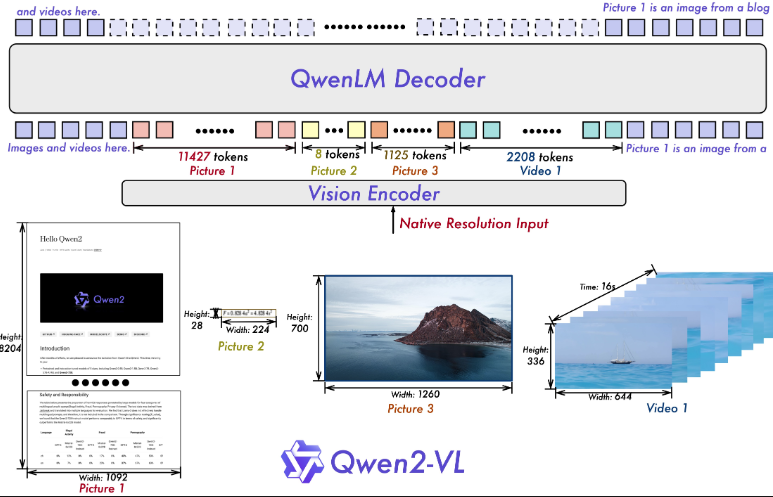

Qwen2VL是由阿里团队开源的最新图像、视频识别的多模态大模型。该模型支持对各种分辨率和比例的图像的理解并返回文本对话，并具有基本的结合视觉的文本理解能力、数学推理能力、多语言能力。Qwen2VL可以理解 20 分钟以上的视频，以进行高质量的基于视频的问答、对话、内容创建等。

除了英文和中文外，Qwen2-VL 现在还支持理解图像中不同语言的文本，包括大多数欧洲语言、日语、韩语、阿拉伯语、越南语等。

本次开源的模型包括2B、7B、72B参数的模型，运行对应模型大致需要的显存分别至少为6G、34G、144G。

* 图像能力测试

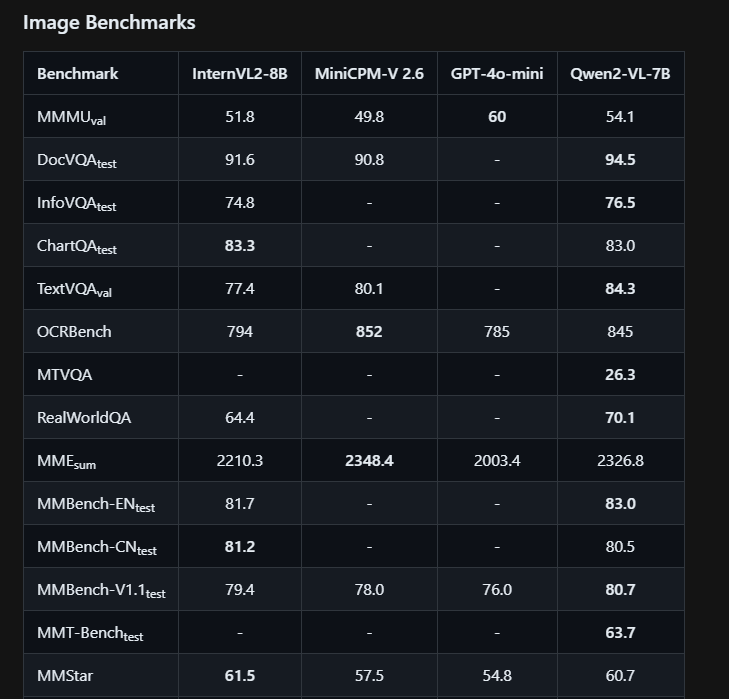

* 视频能力测试

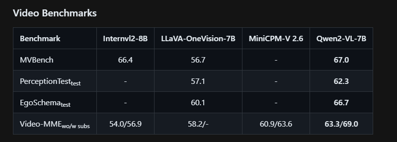

## 本地部署流程

* **Step 1. 创建conda虚拟环境**

  Conda创建虚拟环境的意义在于提供了一个隔离的、独立的环境，用于Python项目和其依赖包的管理。每个虚拟环境都有自己的Python运行时和一组库。这意味着我们可以在不同的环境中安装不同版本的库而互不影响。根据官方文档信息建议Python版本3.10以上。创建虚拟环境的办法可以通过使用以下命令创建：

```bash
# qwen2_5 是你想要给环境的名称，python=3.11 指定了要安装的Python版本。你可以根据需要选择不同的名称和/或Python版本。

conda create -n qwen2_5 python=3.11
```

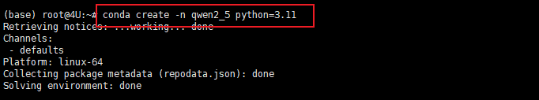

  创建虚拟环境后，需要激活它。使用以下命令来激活刚刚创建的环境。如果成功激活，可以看到在命令行的最前方的括号中，就标识了当前的虚拟环境。虚拟环境创建完成后接下来安装torch。


  如果忘记或者想要管理自己建立的虚拟环境，可以通过conda env list命令来查看所有已创建的环境名称。


  如果需要卸载指定的虚拟环境则通过以下指令实现：

```plaintext
conda env remove --name envname
```


* 需要注意的是无法卸载当前激活的环境，建议卸载时先切换到base环境中再执行操作。

* **Step 2. 查看当前驱动最高支持的CUDA版本**

  我们需要根据CUDA版本选择Pytorch框架，先看下当前的CUDA版本：

```plaintext
nvidia -smi
```


* **Step 3. 在虚拟环境中安装Pytorch**

  进入Pytorch官网：https://pytorch.org/get-started/previous-versions/


  当前的电脑CUDA的最高版本要求是12.2，所以需要找到不大于12.2版本的Pytorch。


  直接复制对应的命令，进入终端执行即可。这实际上安装的是为 CUDA 12.1 优化的 PyTorch 版本。这个 PyTorch 版本预编译并打包了与 CUDA 12.1 版本相对应的二进制文件和库。

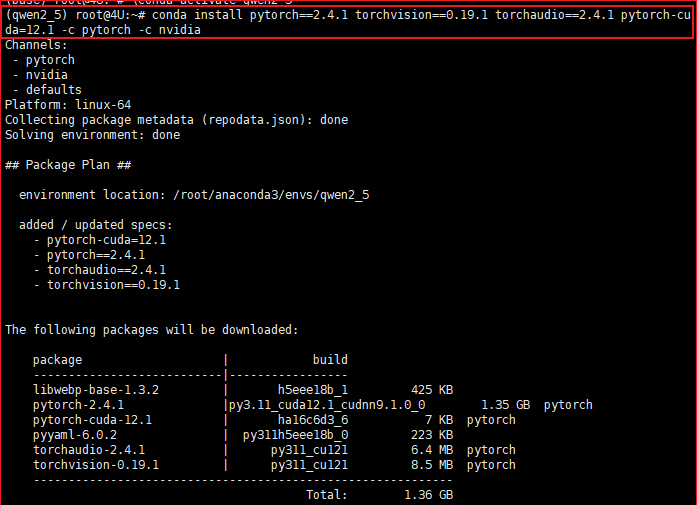

* **Step 4. 安装必要的依赖**

Transfomers是大模型推理时所需要使用的框架，通过以下指令可以下载最新版本的Transfomers：

pip install transformers -U


安装完成后可以通过以下命令检查是否安装：

```plaintext
pip show transformers
```

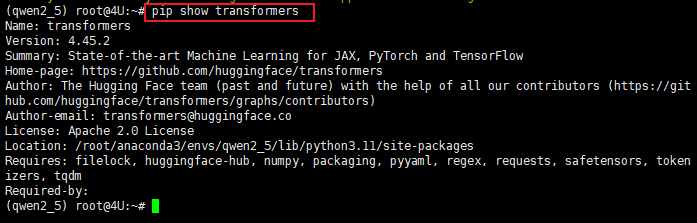

接下来需要安装下载工具modelscope以及接下来要下载脚本的依赖accelerate，通过以下代码进行对应工具的部署：

pip install modelscope

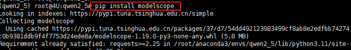

pip install accelerate>=0.26.0


安装qwen\_vl\_utils库来加速模型推理：

pip install qwen-vl-utils

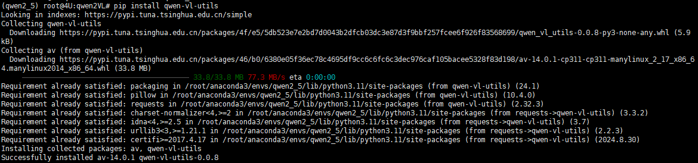

* **Step 5. 下载模型权重**

在下载模型权重之前，先为之创建合适的文件夹。

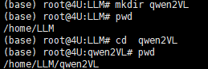

本流程选择在modelscope平台下载Qwen2VL模型，这种方式在国内安装部署大模型非常便捷。通过以下命令开始下载，需注意最后的一个参数要修改成你要存放模型的文件夹。

modelscope download --model Qwen/Qwen2-VL-7B-Instruct --local\_dir ./dir

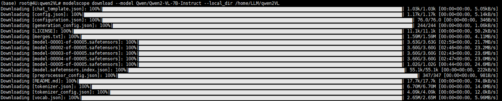

## 本地调用测试

#### 单图推理

* 导入相关库

```python
from transformers import Qwen2VLForConditionalGeneration, AutoTokenizer, AutoProcessor
from qwen_vl_utils import process_vision_info
from modelscope import snapshot_download
```

* 设置模型路径

```python
model_dir = './model/dir'
```

* 实例化模型对象

```python

model = Qwen2VLForConditionalGeneration.from_pretrained(
    model_dir, torch_dtype="auto", device_map="auto"

processor = AutoProcessor.from_pretrained(model_dir)
)
```

* 创建消息

```python
messages = [
    {
        "role": "user",
        "content": [
            {
                "type": "image",
                "image": "https://qianwen-res.oss-cn-beijing.aliyuncs.com/Qwen-VL/assets/demo.jpeg",
            },
            {"type": "text", "text": "Describe this image."},
        ],
    }
]
```

* 进行推理

```python

generated_ids = model.generate(**inputs, max_new_tokens=128)
generated_ids_trimmed = [
    out_ids[len(in_ids) :] for in_ids, out_ids in zip(inputs.input_ids, generated_ids)
]
output_text = processor.batch_decode(
    generated_ids_trimmed, skip_special_tokens=True, clean_up_tokenization_spaces=False
)
print(output_text)
```

demo中进行测试的图片内容如下：


执行完返回的结果会如下：

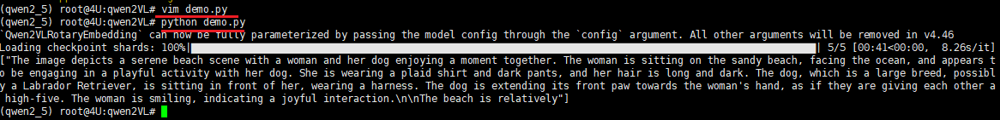

进行推理Qwen2VL：7B识别官方给出的demo图像消耗将近34G显存。

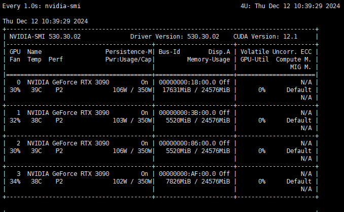

对于其他的信息源测试：无论是云平台挂载的图片还是本地图片识别，消耗的显存都不超过16G。以下图为例，这是一个展示模型性能的图表，将之用上述方法交付给Qwen2VL进行推理：


推理返回结果如下

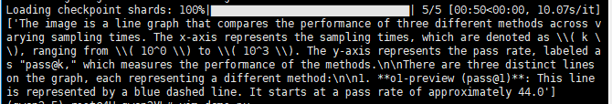

显存消耗情况如下，大约消耗16G。

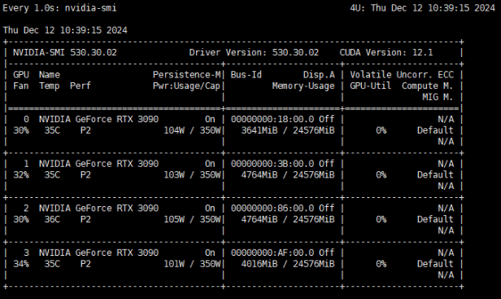

#### 多图推理

多图推理的代码如下，需注意修改本地启动模型路径和传入信息中的图像信息路径，其中，传入进行推理的图像支持本地.jpg / .png /.jpeg 格式的文件，也支持线上url格式的文件。

* 多图推理的代码如下

```python
from transformers import Qwen2VLForConditionalGeneration, AutoTokenizer, AutoProcessor
from qwen_vl_utils import process_vision_info
from modelscope import snapshot_download
model_dir = '/home/LLM/qwen2VL'

model = Qwen2VLForConditionalGeneration.from_pretrained(
    model_dir, torch_dtype="auto", device_map="auto"
)

processor = AutoProcessor.from_pretrained(model_dir)

# Messages containing multiple images and a text query
messages = [
    {
        "role": "user",
        "content": [
            {"type": "image", "image": "/home/LLM/llama3_2_v/mao.png"},
            {"type": "image", "image": "/home/LLM/llama3_2_v/fm.png"},
            {"type": "text", "text": "Identify the similarities between these images."},
        ],
    }
]

# Preparation for inference
text = processor.apply_chat_template(
    messages, tokenize=False, add_generation_prompt=True
)
image_inputs, video_inputs = process_vision_info(messages)
inputs = processor(
    text=[text],
    images=image_inputs,
    videos=video_inputs,
    padding=True,
    return_tensors="pt",
)
inputs = inputs.to("cuda")

# Inference
generated_ids = model.generate(**inputs, max_new_tokens=128)
generated_ids_trimmed = [
    out_ids[len(in_ids) :] for in_ids, out_ids in zip(inputs.input_ids, generated_ids)
]
output_text = processor.batch_decode(
    generated_ids_trimmed, skip_special_tokens=True, clean_up_tokenization_spaces=False
)
print(output_text)
```


传入的图片一个是.jpg的，一个是.png的，返回内容如下：

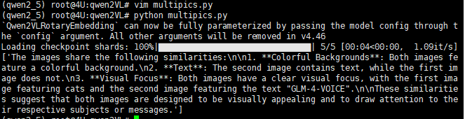

Qwen2VL也支持中文问答.

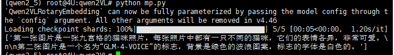

#### 视频推理

```python
from transformers import Qwen2VLForConditionalGeneration, AutoTokenizer, AutoProcessor
from qwen_vl_utils import process_vision_info
from modelscope import snapshot_download
model_dir = '/home/LLM/qwen2VL'

model = Qwen2VLForConditionalGeneration.from_pretrained(
    model_dir, torch_dtype="auto", device_map="auto"
)

processor = AutoProcessor.from_pretrained(model_dir)


messages = [
    {
        "role": "user",
        "content": [
            {
                "type": "video",
                "video": "/home/LLM/llama3_2_v/可灵-小老虎.mp4",
                "max_pixels": 360 * 420,
                "fps": 1.0,
            },
            {"type": "text", "text": "Describe this video."},
        ],
    }
]

# Preparation for inference
text = processor.apply_chat_template(
    messages, tokenize=False, add_generation_prompt=True
)
image_inputs, video_inputs = process_vision_info(messages)
inputs = processor(
    text=[text],
    images=image_inputs,
    videos=video_inputs,
    padding=True,
    return_tensors="pt",
)
inputs = inputs.to("cuda")

# Inference
generated_ids = model.generate(**inputs, max_new_tokens=128)
generated_ids_trimmed = [
    out_ids[len(in_ids) :] for in_ids, out_ids in zip(inputs.input_ids, generated_ids)
]
output_text = processor.batch_decode(
    generated_ids_trimmed, skip_special_tokens=True, clean_up_tokenization_spaces=False
)
print(output_text)
```

推理效果如下：

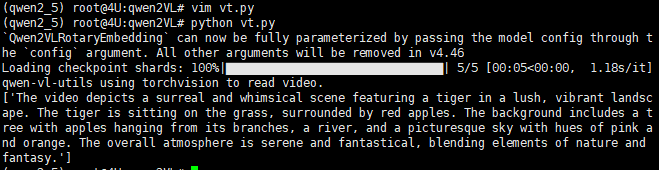

返回中文推理结果：

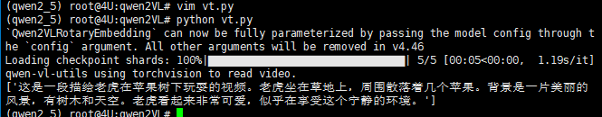

需要注意的是，视频仅支持输入本地路径的文件进行推理。

尽管 Qwen2-VL 在视觉任务中表现出色，但从第三方的视角来看，它仍然存在一些值得注意的局限性，这些限制对其在特定场景中的适用性提出了挑战。以下是一些主要的观察点：

* 音频支持缺失
  Qwen2-VL 目前无法处理视频中的音频信息，因此在需要综合视觉与听觉的任务中，其表现可能受限。

* 数据覆盖的时效性
  模型的图像训练数据更新至 2023 年 6 月，之后的事件或变化可能未被纳入，这限制了其在时效性要求较高场景中的应用能力。

* 个人与知识产权识别能力的局限
  在识别特定人物或品牌方面，模型可能存在盲点，尤其是对于较少曝光的个人或冷门知识产权的识别，准确率仍需提升。

* 复杂指令的理解能力
  当用户提出涉及多个步骤或需要复杂逻辑的指令时，Qwen2-VL 的理解与执行能力表现出一定不足，难以高效完成复杂任务。

* 计数能力不足
  特别是在包含大量物体或复杂背景的场景中，模型对物体数量的识别往往不够精准，这可能对特定应用场景（如物流或物品清点）产生影响。

* 空间推理能力的短板
  模型在推断 3D 空间中物体的相对位置时表现较弱，对于需要精确空间理解的任务（如建筑设计或机器人导航）仍有较大改进空间。

这些局限性表明，尽管 Qwen2-VL 展现出强大的视觉能力，但其性能在某些特定领域仍有优化空间。未来若能针对这些短板进行持续改进，模型的应用范围和实用性将进一步拓宽。

### 推理Qwen2vl：2b模型

```python

import torch
from transformers import Qwen2VLForConditionalGeneration, AutoProcessor
from qwen_vl_utils import process_vision_info

model_dir = '/home/LLM/qwen2vl-2b'

# 加载模型到 GPU0
model = Qwen2VLForConditionalGeneration.from_pretrained(
    model_dir, torch_dtype="auto"
)
device = torch.device("cuda:0")
model = model.to(device)

# 加载处理器
processor = AutoProcessor.from_pretrained(model_dir)

messages = [
    {
        "role": "user",
        "content": [
            {
                "type": "image",
                "image": "https://qianwen-res.oss-cn-beijing.aliyuncs.com/Qwen-VL/assets/demo.jpeg",
            },
            {"type": "text", "text": "Describe this image."},
        ],
    }
]

# 准备文本和视觉输入
text = processor.apply_chat_template(
    messages, tokenize=False, add_generation_prompt=True
)
image_inputs, video_inputs = process_vision_info(messages)

inputs = processor(
    text=[text],
    images=image_inputs,
    videos=video_inputs,
    padding=True,
    return_tensors="pt",
)

# 确保 inputs 在 GPU0 上
inputs = inputs.to(device)

# 推理：生成输出
generated_ids = model.generate(**inputs, max_new_tokens=128)
generated_ids_trimmed = [
    out_ids[len(in_ids):] for in_ids, out_ids in zip(inputs.input_ids, generated_ids)
]
output_text = processor.batch_decode(
    generated_ids_trimmed, skip_special_tokens=True, clean_up_tokenization_spaces=False
)
print(output_text)
```

* 官方demo演示


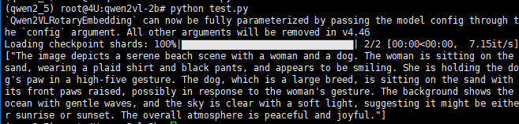

推理线上图片需要将近19G显存。


* 本地图片识别测试

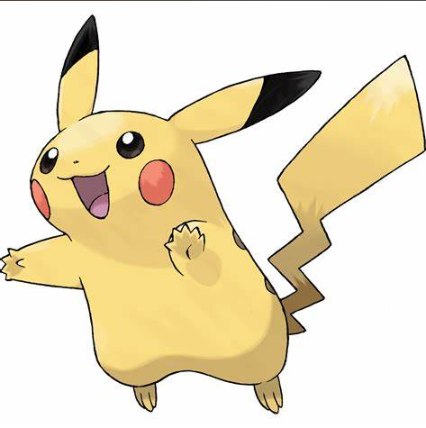

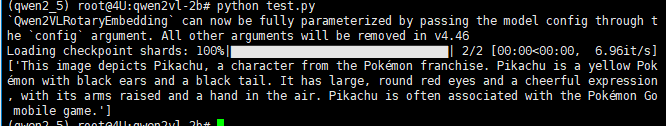

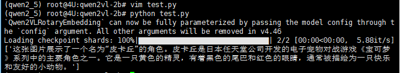

推理大概需要6G的显存消耗。

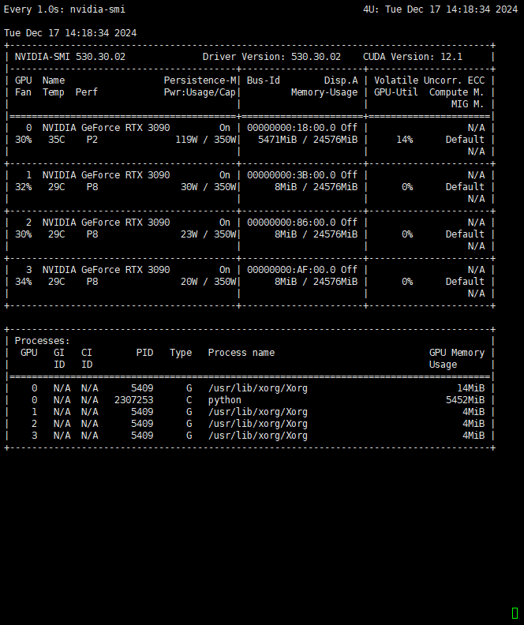


***

📍**更多大模型技术内容学习**

**扫码添加助理英英，回复“大模型”，了解更多大模型技术详情哦👇**


此外，**扫码回复“入群”**，即可加入**大模型技术社群：海量硬核独家技术`干货内容`+无门槛`技术交流`！**
